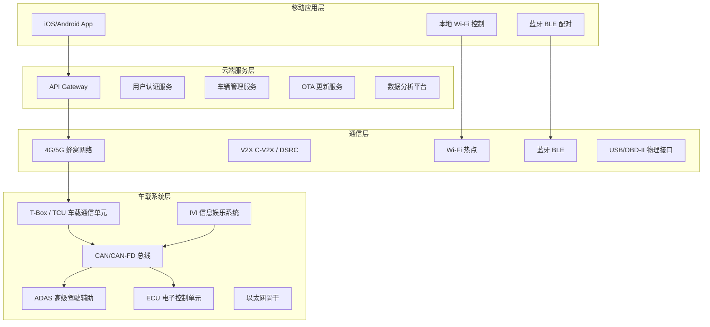
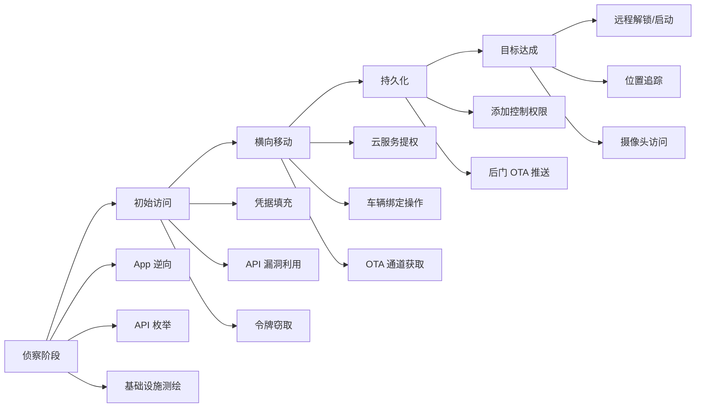

## 22.7 车联网安全：攻击面分析与实战攻防

车联网（Vehicle-to-Everything, V2X）将汽车从封闭的机械系统转变为高度联网的智能终端。当车辆通过蜂窝网络、Wi-Fi、蓝牙、NFC 与外部世界连接时，其攻击面呈指数级扩展。2015 年 Charlie Miller 和 Chris Valasek 远程黑入一辆行驶中的 Jeep Cherokee，导致克莱斯勒召回 140 万辆汽车——这一事件彻底改变了行业对汽车安全的认知。本章系统剖析车联网攻击面，从云端 API 到 CAN 总线，从理论框架到实战案例，构建完整的车联网安全知识体系。

### 22.7.1 车联网架构与攻击面全景

#### 1. 车联网四层架构



#### 2. 攻击面矩阵

| 攻击面 | 入口方式 | 影响范围 | 攻击难度 | 典型危害 |
|--------|---------|---------|---------|---------|
| 移动 App 逆向 | 静态分析 / 动态 Hook | 用户账户 | ★★☆☆☆ | 账户接管、远程控车 |
| 云端 API | Web 攻击技法 | 所有用户车辆 | ★★★☆☆ | 批量控车、数据泄露 |
| OTA 更新劫持 | 中间人 / 固件篡改 | 目标车型全部 | ★★★★☆ | 植入后门、拒绝服务 |
| 蓝牙/BLE | 临近攻击 | 单车 | ★★☆☆☆ | 解锁车门、窃取数据 |
| Wi-Fi 热点 | 临近攻击 | 单车 | ★★★☆☆ | 内网渗透、协议注入 |
| 蜂窝网络 | SIM 漏洞 / SS7 | 单车 | ★★★★☆ | 通信窃听、远程控制 |
| OBD-II 接口 | 物理接触 | 单车 | ★☆☆☆☆ | ECU 刷写、数据提取 |
| CAN 总线注入 | 物理接触 / 网关绕过 | 单车核心控制 | ★★★★★ | 制动/转向/动力控制 |
| V2X 通信 | 无线信号伪造 | 区域内多车 | ★★★★☆ | 导航欺骗、协同攻击 |

#### 3. 真实攻击事件回顾

**关键时间线：**

```plaintext
2010  UCSD & UW：首次学术级远程汽车攻击（OnStar 系统）
2011  Dr. Charlie Miller：ECU 调校固件注入恶意代码
2013  DEF CON 21：Miller & Valasek 展示 CAN 总线攻击原型
2015  Jeep Cherokee 远程攻击：140万辆召回，引发行业震动
2016  Keen Security Lab（腾讯科恩实验室）：Tesla Model S 远程无物理接触攻击
2017  Keen Lab：BMW iDrive 远程攻击链（14个漏洞）
2018  Sam Curry 团队：起亚/本田/日产等 16 家车企 API 漏洞
2019  Volkswagen MIB2 信息娱乐系统漏洞（RCE + CAN 访问）
2020  Mercedes-Benz MBUX 信息娱乐系统漏洞（多个 RCE）
2021  Tesla 信息娱乐系统 QEMU 漏洞 → Root Shell
2022  Toyota T-Connect 泄露 296 万用户数据
2023  Sam Curry：远程批量控制起亚汽车（API 缺陷）
2024  Sam Curry：发现 20+ 车企漏洞可远程定位/解锁/启动
```

### 22.7.2 攻击面一：移动应用安全

车联网移动 App 是攻击者的首选入口。App 通常包含硬编码 API 密钥、不安全的认证逻辑和可逆向的通信协议。

#### 1. 典型漏洞类型

```plaintext
App 层常见漏洞：

[认证缺陷]
├── 弱密码策略，无 MFA
├── 令牌硬编码在 App 中
├── 刷新令牌未绑定设备
└── 生物识别可绕过

[数据存储]
├── 明文存储 VIN、Token
├── SharedPreferences 未加密
├── 日志泄露敏感信息
└── 备份未禁用（Android: allowBackup=true）

[通信安全]
├── 证书验证不严格
├── 未做证书固定
├── HTTP 明文传输
└── API Key 泄露在前端

[逆向工程]
├── 未做代码混淆
├── 未做完整性校验
├── 未做反调试保护
└── 协议逻辑可直接读取
```

#### 2. App 安全测试流程

```python
# Android App 安全测试自动化脚本（教育演示）
import subprocess
import json

class VehicleAppAuditor:
    """车联网 App 安全审计框架（仅用于授权测试）"""
    
    def __init__(self, apk_path):
        self.apk_path = apk_path
        self.findings = []
    
    def check_hardcoded_secrets(self):
        """检查硬编码凭据"""
        # 使用 apkanalyzer 提取字符串
        result = subprocess.run(
            ['apkanalyzer', 'dex', 'packages', self.apk_path],
            capture_output=True, text=True
        )
        
        secret_patterns = [
            r'api[_-]?key\s*[:=]\s*["\'][\w]+["\']',
            r'token\s*[:=]\s*["\'][\w\-\.]+["\']',
            r'secret\s*[:=]\s*["\'][\w]+["\']',
            r'password\s*[:=]\s*["\'][^\s]+["\']',
            r'-----BEGIN\s+(RSA\s+)?PRIVATE\s+KEY-----',
            r'AWS[_\s](?:ACCESS|SECRET)[_\s]KEY',
        ]
        
        # grep 扫描反编译后的 smali/java 代码
        for pattern in secret_patterns:
            grep_result = subprocess.run(
                ['grep', '-rnPi', pattern, 'decompiled_src/'],
                capture_output=True, text=True
            )
            if grep_result.stdout.strip():
                self.findings.append({
                    'severity': 'HIGH',
                    'type': 'hardcoded_secret',
                    'pattern': pattern,
                    'evidence': grep_result.stdout.strip()[:200]
                })
    
    def check_network_security(self):
        """检查网络安全配置"""
        result = subprocess.run(
            ['grep', '-r', 'cleartextTrafficPermitted', 'res/xml/'],
            capture_output=True, text=True
        )
        if 'true' in result.stdout:
            self.findings.append({
                'severity': 'MEDIUM',
                'type': 'cleartext_traffic',
                'detail': 'network_security_config 允许明文流量'
            })
        
        # 检查自定义信任管理器（跳过证书验证）
        result2 = subprocess.run(
            ['grep', '-rn', 'X509TrustManager', 'decompiled_src/'],
            capture_output=True, text=True
        )
        if 'checkServerTrusted' in result2.stdout:
            self.findings.append({
                'severity': 'CRITICAL',
                'type': 'weak_tls',
                'detail': '自定义 TrustManager 可能跳过了服务器证书验证'
            })
    
    def check_certificate_pinning(self):
        """检查证书固定实现"""
        pinning_indicators = [
            'CertificatePinner',  # OkHttp
            'SSLPinning',          # 自定义实现
            'PinSSLSocketFactory',
            'TrustManagerFactory',
            'NetworkSecurityConfig',  # Android 7+ 内置固定
        ]
        
        has_pinning = False
        for indicator in pinning_indicators:
            result = subprocess.run(
                ['grep', '-rn', indicator, 'decompiled_src/'],
                capture_output=True, text=True
            )
            if result.stdout.strip():
                has_pinning = True
                break
        
        if not has_pinning:
            self.findings.append({
                'severity': 'HIGH',
                'type': 'no_cert_pinning',
                'detail': '未发现证书固定实现，易受中间人攻击'
            })
    
    def generate_report(self):
        """生成审计报告"""
        report = {
            'apk': self.apk_path,
            'total_findings': len(self.findings),
            'critical': sum(1 for f in self.findings if f['severity'] == 'CRITICAL'),
            'high': sum(1 for f in self.findings if f['severity'] == 'HIGH'),
            'medium': sum(1 for f in self.findings if f['severity'] == 'MEDIUM'),
            'details': self.findings
        }
        return json.dumps(report, indent=2, ensure_ascii=False)
```

#### 3. 实战案例：某车企 App API 漏洞链

2023 年安全研究员 Sam Curry 团队发现某品牌（起亚）的经销商门户 API 存在关键缺陷：

```plaintext
攻击链：

1. 发现经销商 API 端点：https://api.kia-dealer.com/v2/
2. 该 API 仅需车牌号即可查询车主信息
3. 未进行身份认证（或仅依赖可预测的 session）
4. 通过 API 可执行以下操作：
   ├── 获取车主姓名、电话、邮箱、地址
   ├── 远程解锁车门
   ├── 远程启动/熄火车辆
   ├── 追踪车辆实时位置
   └── 解绑原车主并绑定新账户

影响范围：2013-2022年几乎所有起亚联网车型
发现方式：API 参数篡改 + IDOR + 权限提升
```

**关键教训：** 经销商/第三方集成 API 是常被忽视的攻击面。这些 API 通常权限过大、认证不足、审计缺失。

### 22.7.3 攻击面二：云端 API 与服务

#### 1. 车联网 API 常见漏洞模式

```plaintext
车联网 API 漏洞 Top 10：

1. IDOR（不安全的直接对象引用）
   - /api/vehicles/{id} 使用递增数字 ID
   - 攻击者可遍历访问所有车辆数据

2. 缺乏授权粒度控制
   - 普通用户可调用管理接口
   - 同一车主不同权限级别的操作未隔离

3. 命令注入 / 未验证输入
   - /api/vehicles/{id}/config 接受任意配置参数
   - 可修改超出预期范围的车辆设置

4. 批量接口未限流
   - 可枚举所有 VIN 码
   - 可批量发送控制命令

5. JWT / Token 漏洞
   - 算法混淆（HS256 → none）
   - 密钥强度不足可暴力破解
   - Token 未设置过期时间

6. 服务端请求伪造（SSRF）
   - OTA 更新 URL 可被替换为恶意源
   - 回调 URL 指向内部服务

7. GraphQL 内省与过度查询
   - 未禁用 __schema 查询
   - 单次查询可获取完整车辆状态

8. 不安全的密码重置流程
   - 重置码可暴力破解
   - 重置链接可预测

9. 会话管理缺陷
   - 登出后 Token 仍然有效
   - 多设备登录无限制

10. 信息泄露
    - 错误消息包含堆栈跟踪
    - API 文档公开可访问
```

#### 2. API 安全测试方法论

```python
# 车联网 API 安全测试工具（授权测试专用）
import requests
import hashlib
import time
from typing import Optional

class VehicleAPITester:
    """车联网云端 API 安全测试框架"""
    
    def __init__(self, base_url: str, token: str):
        self.base_url = base_url.rstrip('/')
        self.session = requests.Session()
        self.session.headers['Authorization'] = f'Bearer {token}'
        self.session.headers['User-Agent'] = 'VehicleAPITester/1.0'
    
    def test_idor(self, endpoint: str, id_range: range) -> list:
        """IDOR 漏洞测试：遍历 ID 检查越权访问"""
        vulnerable = []
        for obj_id in id_range:
            try:
                resp = self.session.get(
                    f'{self.base_url}/{endpoint}/{obj_id}',
                    timeout=5
                )
                if resp.status_code == 200:
                    vulnerable.append({
                        'id': obj_id,
                        'status': 'accessible',
                        'data_keys': list(resp.json().keys())[:5]
                    })
                    print(f'[!] ID {obj_id} 可越权访问')
                elif resp.status_code == 403:
                    continue  # 正确拒绝
                elif resp.status_code == 429:
                    print('[*] 触发限流，等待...')
                    time.sleep(60)
            except requests.RequestException as e:
                print(f'[E] 请求失败: {e}')
        
        return vulnerable
    
    def test_command_injection(self, vehicle_id: str) -> list:
        """命令注入测试：尝试发送非预期控制命令"""
        test_commands = [
            {'command': 'UNLOCK_DOORS'},        # 正常命令
            {'command': 'START_ENGINE'},          # 高权限命令
            {'command': 'HONK_HORN'},             # 低风险命令
            {'command': 'FACTORY_RESET'},         # 危险命令
            {'command': 'DISABLE_ALARM'},         # 安全相关
            {'command': '__admin__purge'},         # 管理命令探测
            {'command': 'UNLOCK_DOORS; DROP TABLE'},  # SQL注入探测
            {'command': '<script>alert(1)</script>'},  # XSS探测
        ]
        
        results = []
        for cmd in test_commands:
            resp = self.session.post(
                f'{self.base_url}/vehicles/{vehicle_id}/commands',
                json=cmd, timeout=10
            )
            results.append({
                'command': cmd['command'],
                'status': resp.status_code,
                'response': resp.text[:200],
                'accepted': resp.status_code in [200, 202]
            })
        
        return results
    
    def test_rate_limiting(self, endpoint: str, count: int = 100) -> dict:
        """限流测试：短时间内大量请求"""
        blocked_at = None
        for i in range(count):
            resp = self.session.get(f'{self.base_url}/{endpoint}', timeout=5)
            if resp.status_code == 429:
                blocked_at = i
                break
            time.sleep(0.1)  # 100ms 间隔
        
        return {
            'total_requests': count,
            'blocked_at': blocked_at,
            'has_rate_limiting': blocked_at is not None,
            'threshold': blocked_at or f'>{count}'
        }
    
    def test_jwt_vulnerabilities(self, token: str) -> list:
        """JWT 安全测试"""
        import base64
        
        vulnerabilities = []
        
        # 解码 JWT
        parts = token.split('.')
        if len(parts) == 3:
            header_b64 = parts[0] + '=' * (4 - len(parts[0]) % 4)
            header = base64.b64decode(header_b64)
            
            # 检查算法
            if b'"none"' in header or b'"None"' in header:
                vulnerabilities.append({
                    'type': 'algorithm_none',
                    'severity': 'CRITICAL',
                    'detail': 'JWT 接受 none 算法，可伪造任意 Token'
                })
            
            if b'"HS256"' in header:
                vulnerabilities.append({
                    'type': 'weak_algorithm',
                    'severity': 'INFO',
                    'detail': '使用 HS256，如果密钥弱可被暴力破解'
                })
        
        # 测试空 Token
        old_auth = self.session.headers['Authorization']
        self.session.headers['Authorization'] = 'Bearer '
        resp = self.session.get(f'{self.base_url}/vehicles', timeout=5)
        if resp.status_code == 200:
            vulnerabilities.append({
                'type': 'empty_token_accepted',
                'severity': 'CRITICAL',
                'detail': '空 Token 仍可访问受保护资源'
            })
        self.session.headers['Authorization'] = old_auth
        
        return vulnerabilities
```

### 22.7.4 攻击面三：CAN 总线与车载网络

#### 1. CAN 总线协议基础

CAN（Controller Area Network）总线是车载 ECU 之间的通信骨干。它设计于 1986 年，为可靠性而生，**不具备任何原生安全机制**。

```plaintext
CAN 总线安全缺陷（设计层面）：

[无认证]
├── 任何接入总线的节点都可发送报文
├── ECU 无法验证消息来源的合法性
└── 不存在"身份"概念

[无加密]
├── 所有数据以明文传输
├── 包括车速、转向角、制动压力等敏感数据
└── 攻击者可直接读取车辆状态

[无完整性校验]
├── CAN 标准 CRC 仅防传输错误
├── 不防恶意篡改
└── 攻击者可注入任意报文

[广播模型]
├── 所有节点接收所有报文
├── 没有点对点通信概念
└── 嗅探全量流量只需接入一个点

[优先级仲裁]
├── ID 值越小优先级越高
├── 攻击者可发送高优先级报文抢占总线
└── 可导致正常 ECU 通信被压制
```

#### 2. CAN 报文结构与安全含义

```plaintext
CAN 2.0 标准帧格式（11 位 ID）：

┌─────────┬─────┬─────┬──────┬──────────┬─────┬─────┐
│ SOF(1)  │ ID  │ RTR │ IDE  │ DLC(4)   │Data │ CRC │
│         │(11) │ (1) │ (1)  │          │(0-8)│(15) │
└─────────┴─────┴─────┴──────┴──────────┴─────┴─────┘

安全含义：
- SOF：帧起始，无安全意义
- ID：消息标识符，无认证保护，可伪造任意 ID
- RTR：远程请求标志，可被滥用触发数据泄露
- IDE：标识符扩展位
- DLC：数据长度，可发送最长 8 字节
- Data：数据域，完全明文，无加密
- CRC：仅防传输错误，不防恶意修改
```

#### 3. CAN 攻击技术

```python
# CAN 总线安全分析工具（授权测试专用，需要物理接入）
import can
import struct
import time
from collections import defaultdict

class CANSecurityAnalyzer:
    """CAN 总线安全分析器（仅用于授权安全测试）"""
    
    def __init__(self, interface='can0'):
        self.bus = can.interface.Bus(channel=interface, bustype='socketcan')
        self.message_db = defaultdict(list)  # ID -> [消息历史]
        self.anomaly_log = []
    
    def passive_sniff(self, duration_seconds: int = 60):
        """被动嗅探：记录总线上所有报文"""
        print(f'[*] 开始被动嗅探 ({duration_seconds}s)...')
        start = time.time()
        
        while time.time() - start < duration_seconds:
            msg = self.bus.recv(timeout=1.0)
            if msg:
                self.message_db[msg.arbitration_id].append({
                    'timestamp': msg.timestamp,
                    'data': msg.data.hex(),
                    'dlc': msg.dlc,
                    'is_extended': msg.is_extended_id
                })
        
        print(f'[*] 捕获 {sum(len(v) for v in self.message_db.values())} 条报文')
        print(f'[*] 发现 {len(self.message_db)} 个不同 CAN ID')
        return dict(self.message_db)
    
    def identify_critical_signals(self):
        """识别关键控制信号 ID"""
        # 已知的关键 CAN ID 范围（因车型而异，以下为通用启发式）
        critical_categories = {
            '动力系统': {'id_range': range(0x100, 0x200), 'priority': 'CRITICAL'},
            '制动系统': {'id_range': range(0x200, 0x300), 'priority': 'CRITICAL'},
            '转向系统': {'id_range': range(0x300, 0x400), 'priority': 'CRITICAL'},
            '车身控制': {'id_range': range(0x400, 0x500), 'priority': 'HIGH'},
            '信息娱乐': {'id_range': range(0x500, 0x600), 'priority': 'LOW'},
        }
        
        identified = {}
        for msg_id in self.message_db.keys():
            for category, info in critical_categories.items():
                if msg_id in info['id_range']:
                    identified[msg_id] = {
                        'category': category,
                        'priority': info['priority'],
                        'message_count': len(self.message_db[msg_id]),
                        'avg_interval_ms': self._calc_interval(msg_id)
                    }
        
        return identified
    
    def _calc_interval(self, can_id):
        """计算报文发送间隔"""
        timestamps = [m['timestamp'] for m in self.message_db[can_id]]
        if len(timestamps) < 2:
            return None
        intervals = [timestamps[i+1] - timestamps[i] for i in range(len(timestamps)-1)]
        return round(sum(intervals) / len(intervals) * 1000, 2)
    
    def replay_test(self, can_id: int, data: bytes, count: int = 1):
        """重放攻击测试（仅限已授权的隔离测试环境）"""
        print(f'[!] 重放 CAN ID 0x{can_id:03X}: {data.hex()}')
        for i in range(count):
            msg = can.Message(
                arbitration_id=can_id,
                data=data,
                is_extended_id=False
            )
            self.bus.send(msg)
            time.sleep(0.01)  # 10ms 间隔
    
    def fuzz_test(self, can_id: int, iterations: int = 1000):
        """模糊测试：向指定 ID 发送随机数据"""
        import random
        print(f'[*] 对 CAN ID 0x{can_id:03X} 进行模糊测试 ({iterations} 次)')
        
        for i in range(iterations):
            random_data = bytes(random.randint(0, 255) for _ in range(8))
            msg = can.Message(
                arbitration_id=can_id,
                data=random_data,
                is_extended_id=False
            )
            try:
                self.bus.send(msg)
            except can.CanError:
                pass
            time.sleep(0.001)
```

#### 4. CAN 总线安全防御架构

```plaintext
CAN 总线安全防御层次：

[网关防火墙] ── 第一道防线
├── 区域网关隔离不同 CAN 段
├── 基于白名单的报文过滤
├── 速率限制和异常检测
└── 日志记录可疑报文

[入侵检测系统（IDS）] ── 实时监控
├── 基线模型：学习正常报文模式
├── 异常检测：频率/顺序/数据异常
├── 攻击特征：已知攻击模式匹配
└── 响应机制：告警 → 隔离 → 记录

[消息认证码（MAC）] ── 消息级保护
├── 对安全关键报文附加 MAC
├── 使用对称密钥（性能受限环境）
├── 新鲜度计数器防重放
└── AUTOSAR SecOC 标准实现

[安全网关 + 以太网骨干] ── 架构升级
├── CAN-FD / Automotive Ethernet 提升带宽
├── 中央网关统一安全管理
├── 域控制器架构隔离功能域
└── 支持 TLS / IPsec 加密通信
```

### 22.7.5 攻击面四：OTA 更新安全

OTA（Over-The-Air）更新是车联网的核心能力，也是高价值攻击目标。攻击者劫持 OTA 流程可在目标车辆上植入任意代码。

#### 1. OTA 攻击向量

```plaintext
OTA 攻击向量分析：

[更新服务器端]
├── 服务器漏洞导致固件包被篡改
├── 签名密钥泄露
├── 管理后台未授权访问
└── 构建流水线被渗透（供应链攻击）

[传输层]
├── TLS 证书验证不严格
├── 未使用证书固定
├── 降级攻击（强制回退 HTTP）
└── DNS 劫持 / ARP 欺骗

[客户端（车辆端）]
├── 固件签名验证绕过
├── 回滚保护缺失（可降级到旧版）
├── 差分更新未验证完整性
└── 更新过程中断导致不一致状态

[供应链]
├── 第三方组件固件被篡改
├── 构建环境被入侵
├── 签名密钥管理不当
└── 测试固件泄露到生产环境
```

#### 2. OTA 安全测试清单

| 测试项 | 具体操作 | 风险等级 |
|--------|---------|---------|
| 固件签名验证 | 尝试使用自签名固件更新 | CRITICAL |
| 回滚保护 | 尝试降级到已知有漏洞的旧版本 | HIGH |
| 传输安全 | 检查是否使用 TLS + 证书固定 | HIGH |
| 固件加密 | 分析固件包是否加密，加密算法强度 | MEDIUM |
| 差分更新 | 验证差分包的完整性校验 | HIGH |
| 断点续传 | 中断更新后是否可恢复，恢复后是否一致 | MEDIUM |
| 并发更新 | 同时触发多个更新请求 | LOW |
| 签名密钥 | 检查密钥长度、存储方式、轮换策略 | CRITICAL |

### 22.7.6 攻击面五：车载信息娱乐系统（IVI）

IVI 系统通常运行 Linux/Android/QNX，是攻击者进入 CAN 总线的重要跳板。

#### 1. IVI 攻击路径

```plaintext
IVI → CAN 总线攻击路径：

[多媒体播放漏洞]
├── MP3/MP4 解析器溢出 → RCE
├── USB 设备注入恶意媒体文件
└── 蓝牙 A2DP 流注入

[浏览器引擎漏洞]
├── WebKit/Chromium 渲染引擎 RCE
├── 车载浏览器访问恶意网页
└── XSS → 提权

[应用商店侧载]
├── 未签名 APK 安装
├── 预装应用权限过高
└── 应用沙箱逃逸

[系统层提权]
├── 内核漏洞利用
├── 调试接口未关闭（ADB/JTAG）
├── 引导加载器未锁定
└── Root/越狱后直接访问 CAN 设备节点

[IVI → CAN 总线桥接]
├── IVI 通常通过 CAN 接口与车身通信
├── 攻击者获得 IVI shell 后可读写 CAN
├── 可通过 /dev/can0 或 SocketCAN 接口
└── 直接发送伪造的 CAN 报文
```

#### 2. IVI 固件分析流程

```python
# IVI 固件分析辅助脚本（授权测试专用）
import os
import subprocess
import hashlib
import json

class IVIFirmwareAnalyzer:
    """IVI 固件安全分析器"""
    
    def __init__(self, firmware_path: str, output_dir: str):
        self.firmware = firmware_path
        self.output = output_dir
        os.makedirs(output_dir, exist_ok=True)
    
    def extract_firmware(self):
        """使用 binwalk 提取固件文件系统"""
        print(f'[*] 提取固件: {self.firmware}')
        result = subprocess.run(
            ['binwalk', '-e', '-C', self.output, self.firmware],
            capture_output=True, text=True
        )
        print(result.stdout)
        
        # 查找提取的文件系统
        for root, dirs, files in os.walk(self.output):
            for d in dirs:
                if d.endswith('.squashfs') or d.endswith('.jffs2'):
                    print(f'[+] 发现文件系统: {os.path.join(root, d)}')
    
    def check_debug_interfaces(self):
        """检查调试接口配置"""
        debug_indicators = {
            'adb_enabled': [
                'ro.debuggable=1',
                'ro.adb.secure=0',
                'persist.sys.usb.config=adb',
            ],
            'ssh_telnet': [
                'PermitRootLogin yes',
                'telnet.*enable',
                'dropbear',
            ],
            'uart_console': [
                'console=tty',
                'earlycon=',
                'getty',
            ],
        }
        
        findings = []
        for category, patterns in debug_indicators.items():
            for pattern in patterns:
                result = subprocess.run(
                    ['grep', '-rnPi', pattern, self.output],
                    capture_output=True, text=True
                )
                if result.stdout.strip():
                    findings.append({
                        'category': category,
                        'pattern': pattern,
                        'evidence': result.stdout.strip()[:300]
                    })
        
        return findings
    
    def check_hardcoded_keys(self):
        """检查硬编码密钥和证书"""
        key_patterns = [
            r'-----BEGIN\s+(RSA\s+)?PRIVATE\s+KEY-----',
            r'-----BEGIN\s+CERTIFICATE-----',
            r'SSH\s+(RSA|ECDSA|ED25519)\s+key',
            r'root:\$\d\$.*:\d+:\d+:',  # /etc/shadow 格式
            r'password\s*[:=]\s*["\'][^"\']{8,}["\']',
            r'secret[_-]?key\s*[:=]\s*["\'][^"\']+["\']',
        ]
        
        findings = []
        for pattern in key_patterns:
            result = subprocess.run(
                ['grep', '-rnPi', pattern, self.output],
                capture_output=True, text=True
            )
            if result.stdout.strip():
                findings.append({
                    'pattern': pattern,
                    'count': len(result.stdout.strip().split('\n')),
                    'sample': result.stdout.strip()[:500]
                })
        
        return findings
    
    def analyze_can_config(self):
        """分析 CAN 通信配置"""
        can_patterns = [
            r'can\d+',
            r'vcan\d+',
            r'slcand',
            r'can-utils',
            r'socketcan',
            r'mcp251[05]',  # 常见 CAN 控制器
        ]
        
        findings = []
        for pattern in can_patterns:
            result = subprocess.run(
                ['grep', '-rnPi', pattern, self.output],
                capture_output=True, text=True
            )
            if result.stdout.strip():
                findings.append({
                    'pattern': pattern,
                    'evidence': result.stdout.strip()[:500]
                })
        
        return findings
    
    def generate_fingerprint(self):
        """生成固件指纹"""
        with open(self.firmware, 'rb') as f:
            content = f.read()
        
        return {
            'md5': hashlib.md5(content).hexdigest(),
            'sha256': hashlib.sha256(content).hexdigest(),
            'size_bytes': len(content),
            'size_mb': round(len(content) / 1024 / 1024, 2)
        }
```

### 22.7.7 攻击面六：蜂窝网络与 V2X 通信

#### 1. 车载 T-Box/TCU 安全

T-Box（Telematics Box）是车辆的通信网关，负责与云端通信。它通常包含蜂窝基带处理器、GPS 模块和安全元件。

```plaintext
T-Box/TCU 攻击面：

[基带攻击]
├── 基带处理器漏洞（与手机类似）
├── 伪基站 / IMSI 捕获器
├── SS7 协议漏洞
└── SIM 卡克隆或远程配置文件攻击

[应用层攻击]
├── AT 命令注入
├── MQTT/CoAP 协议漏洞
├── OTA 更新劫持
└── GPS 欺骗

[物理攻击]
├── UART 调试接口
├── JTAG/SWD 接口
├── NAND 闪存读取
└── 侧信道攻击（功耗分析）
```

#### 2. GPS 欺骗攻击

```python
# GPS 信号模拟器（仅用于受控实验室环境）
# 注意：GPS 欺骗在大多数国家/地区属于违法行为
# 仅可在完全屏蔽的实验室环境中进行

"""
GPS 欺骗对车辆的影响：

1. 导航欺骗：诱导车辆前往错误位置
2. 地理围栏绕过：超出允许的行驶区域
3. 速度限制伪造：影响限速辅助功能
4. 紧急呼叫欺骗：影响 eCall 系统定位
5. 保险定价影响：基于 GPS 的保险计费被操纵

防御措施：
- 多源定位融合（GPS + GLONASS + Galileo + 北斗）
- 惯性导航系统（INS）交叉验证
- 基于信号强度和一致性的欺骗检测
- 加密 GPS 信号（军用 M 码）
"""
```

### 22.7.8 完整远程攻击链案例分析

以下是一个综合性的远程攻击链案例，融合多个真实漏洞场景，展示从零到车辆完全控制的完整过程。

#### 攻击链阶段分解



#### 各阶段详细分析

**阶段一：侦察（Reconnaissance）**

```plaintext
目标：收集攻击所需的基础信息

1. 移动 App 逆向
   ├── 下载 APK/IPA
   ├── jadx/Class-dump 反编译
   ├── 提取 API 端点、密钥、协议定义
   └── 分析认证流程和令牌管理

2. API 枚举
   ├── 子域名枚举：api.carbrand.com, portal.carbrand.com
   ├── 路径爆破：/api/v1/, /api/v2/, /graphql
   ├── Swagger/OpenAPI 文档发现
   └── API 版本枚举（旧版本往往安全性更差）

3. 基础设施测绘
   ├── Shodan/Censys 搜索：ssl.cert.subject.cn:"carbrand"
   ├── 识别云服务商（AWS/GCP/Azure）
   ├── S3 存储桶枚举
   └── 开发/测试环境发现
```

**阶段二：初始访问（Initial Access）**

```plaintext
目标：获取合法用户的访问权限

1. 凭据攻击
   ├── 从数据泄露中获取用户凭据
   ├── 针对 API 的密码喷洒
   ├── 缺乏账户锁定机制
   └── 无 MFA 保护

2. API 漏洞利用
   ├── OAuth 重定向 URI 劫持
   ├── JWT 算法混淆攻击
   ├── 会话固定攻击
   └── 密码重置逻辑缺陷

3. 获取的初始权限
   ├── 用户 API 访问令牌
   ├── 绑定到特定车辆的 VIN
   └── 基本车辆查询和控制权限
```

**阶段三：横向移动（Lateral Movement）**

```plaintext
目标：从普通用户权限提升到任意车辆控制

1. IDOR 利用
   ├── 通过递增车辆 ID 访问其他车辆
   ├── /api/vehicles/1001, /api/vehicles/1002...
   ├── 获取其他车主信息和车辆状态
   └── 验证：对比 VIN 与实际车主

2. 权限提升
   ├── 发现管理 API 端点
   ├── 使用普通令牌访问管理接口
   ├── 利用角色检查缺失（admin 与 user 未隔离）
   └── 获取车辆绑定/解绑权限

3. 获取 OTA 推送权限
   ├── 通过管理 API 获取 OTA 任务创建权限
   ├── 构造恶意固件包
   └── 利用不完善的签名验证流程
```

**阶段四：持久化与目标达成**

```plaintext
目标：建立持久访问通道，实现远程控制

1. 持久化
   ├── 绑定攻击者控制的账户为目标车辆车主
   ├── 通过 OTA 推送包含后门的固件更新
   └── 在 T-Box 中植入持久后门

2. 远程控制能力
   ├── 车门解锁/锁定
   ├── 引擎启动/熄火
   ├── 空调/车窗/后备箱控制
   ├── 实时 GPS 位置追踪
   ├── 车载摄像头/麦克风访问（如适用）
   └── 鸣笛/闪灯

3. 影响评估
   ├── 物理安全：未经授权进入和驾驶车辆
   ├── 隐私安全：位置追踪、录音/录像
   ├── 安全功能：可远程熄火（高速行驶极其危险）
   └── 财产安全：可解除防盗系统
```

### 22.7.9 车联网安全防御体系

#### 1. 纵深防御架构

```plaintext
车联网纵深防御四层模型：

[管理层] ── 安全治理
├── 遵循 ISO/SAE 21434 汽车网络安全工程标准
├── 实施 UN R155/R156 法规合规
├── 建立 CSMS（网络安全管理体系）
├── 威胁分析与风险评估（TARA）
├── 安全开发生命周期（S-SDLC）
└── 漏洞披露与应急响应计划

[技术层] ── 安全控制
├── 身份认证：OAuth 2.0 + PKI 证书体系
├── 数据加密：TLS 1.3 + 车内 AES-128
├── 访问控制：RBAC + 最小权限原则
├── 安全通信：mTLS + 消息签名
├── 入侵检测：CAN IDS + 网络 IDS
└── 安全启动：Secure Boot + TEE

[运营层] ── 持续监控
├── 7x24 安全运营中心（VSOC）
├── 车辆异常行为实时检测
├── 威胁情报共享（Auto-ISAC）
├── 定期渗透测试和红队演练
├── OTA 安全更新快速分发
└── 事件响应流程（从检测到修复 < 24h）

[合规层] ── 法规遵从
├── ISO/SAE 21434：汽车网络安全工程
├── UN R155：网络安全管理体系
├── UN R156：软件更新管理体系
├── GDPR / 个人信息保护法：数据隐私
├── GB/T 41871：汽车整车信息安全技术
└── 自动驾驶功能安全（ISO 26262）
```

#### 2. 安全设计原则

| 原则 | 实施要求 | 反模式（避免） |
|------|---------|---------------|
| 最小权限 | ECU 只拥有完成其功能所需的最小通信权限 | IVI 系统可以直接访问制动 CAN 段 |
| 纵深防御 | 每一层都有独立的安全控制 | 只依赖云端认证，车内无任何校验 |
| 安全默认 | 出厂配置即为安全配置 | 默认密码、默认开启调试接口 |
| 失败安全 | 安全机制失效时进入安全状态 | IDS 关闭后允许所有报文通过 |
| 零信任 | 每次通信都需要验证 | 内网 ECU 之间不校验消息合法性 |
| 纵向隔离 | 不同安全等级的功能域隔离 | 娱乐系统和驾驶控制共享 CAN 段 |
| 安全更新 | 支持快速、安全的远程更新 | OTA 通道未加密，固件未签名 |
| 隐私设计 | 数据最小化 + 用户知情同意 | 默认收集所有行驶数据并无限制上传 |

#### 3. 合规框架对比

| 标准/法规 | 范围 | 核心要求 | 适用场景 |
|----------|------|---------|---------|
| ISO/SAE 21434 | 汽车网络安全工程 | 全生命周期安全工程流程 | 车企内部安全开发 |
| UN R155 | 网络安全管理体系 | CSMS + TARA + 持续监控 | 欧洲市场准入 |
| UN R156 | 软件更新管理 | SUMS + OTA 安全管理 | 欧洲市场准入 |
| GB/T 41871.1-2022 | 整车信息安全 | 通用技术要求 + 测试方法 | 中国市场合规 |
| TISAX | 信息安全评估 | 德系车企供应链安全认证 | Tier 1/2 供应商 |
| Auto-ISAC | 威胁情报共享 | 行业协作、漏洞共享 | 行业协作 |

### 22.7.10 车联网安全测试工具集

#### 1. 工具矩阵

| 工具 | 用途 | 适用层 | 接口类型 |
|------|------|--------|---------|
| `can-utils` | CAN 总线嗅探、注入、模糊测试 | 车载网络 | 物理 CAN |
| `SavvyCAN` | CAN 逆向工程 GUI 工具 | 车载网络 | 物理 CAN |
| `CANalyzer` | 商用 CAN 分析工具（Vector） | 车载网络 | 物理 CAN |
| `OpenDBC` | CAN DBC 信号数据库 | 车载网络 | 数据库 |
| `Frida` | 移动 App 动态 Hook | 移动应用 | 软件 |
| `Objection` | 移动 App 运行时利用 | 移动应用 | 软件 |
| `Burp Suite` | API 代理和测试 | 云端服务 | 网络 |
| `Postman` | API 端点测试 | 云端服务 | 网络 |
| `Nmap` | 网络服务发现 | 全栈 | 网络 |
| `binwalk` | 固件提取分析 | 车载系统 | 文件 |
| `ghidra` | 固件逆向工程 | 车载系统 | 文件 |
| `URH` | 无线信号分析（RF） | 车载无线 | 无线 |
| `Wireshark` | 网络协议分析 | 通信层 | 网络 |
| `HackRF/SDR` | 软件定义无线电 | 车载无线 | 无线 |

#### 2. 实验环境搭建

```plaintext
车联网安全测试实验室搭建指南：

[硬件清单]
├── CAN 分析仪：CANable / PCAN-USB / Kvaser（约 200-500 元）
├── CAN 收发器：MCP2515 + MCP2551 模块
├── 树莓派 / Jetson Nano：用于车载模拟
├── OBD-II 转接线：接入车辆诊断口
├── HackRF One：SDR 射频分析（约 800 元）
├── 逻辑分析仪：Saleae Logic / Kingst（约 300 元）
└── 隔离电源：保护测试设备

[软件环境]
├── Kali Linux / Parrot OS：渗透测试发行版
├── SocketCAN 驱动：Linux 内核 CAN 驱动
├── can-utils：CAN 工具集
├── Ghidra：NSA 开源逆向工具
├── Frida：动态 Hook 框架
├── Android Studio：App 逆向环境
└── 自建模拟环境：CANoe / 仿真 ECU

[安全注意事项]
├── 所有测试仅在授权车辆上进行
├── 使用隔离的 CAN 网络，不连接真实车辆
├── 实验室电磁屏蔽，避免信号泄漏
├── 记录所有测试步骤和结果
└── 遵守当地法律法规
```

### 22.7.11 常见误区与纠正

| 误区 | 纠正 | 后果 |
|------|------|------|
| "CAN 总线在车内，外部无法访问" | T-Box、IVI、OBD-II 都是远程到 CAN 的跳板 | 忽视网关安全，导致远程攻击链完整 |
| "OTA 签名就够了" | 签名密钥管理、回滚保护、更新完整性同等重要 | 签名密钥泄露后全线崩溃 |
| "加密就安全了" | 加密不等于认证，没有认证的加密可被替换 | 中间人替换加密通道内容 |
| "信息娱乐和驾驶是隔离的" | 现代车辆中 IVI 常通过网关连接 CAN，隔离不绝对 | IVI 漏洞导致驾驶控制被影响 |
| "车辆出厂安全就足够了" | 安全是持续过程，需要 OTA 更新和持续监控 | 新发现的漏洞无法及时修复 |
| "只关注技术安全" | 人员、流程、供应链同等重要 | 内部人员泄露密钥、供应链被污染 |
| "安全测试在开发结束时做" | 安全左移（Shift-Left），在设计阶段就进行威胁建模 | 设计缺陷到后期才发现，修复成本指数增长 |

### 22.7.12 进阶：车载以太网与未来攻击面

随着车辆向集中式架构演进，车载以太网（100BASE-T1 / 1000BASE-T1）正在取代 CAN 成为骨干网络。

```plaintext
车载以太网安全特性：

[优势]
├── 支持标准 IP 协议栈（TLS / IPsec 可用）
├── 带宽充足，支持加密而不影响实时性
├── 支持 VLAN 隔离不同功能域
└── 与 IT 安全工具生态兼容

[新攻击面]
├── 以太网协议栈漏洞（TCP/IP 栈 bug）
├── VLAN 跳转攻击
├── ARP 欺骗（车内网络）
├── DHCP 欺骗
├── DoS 攻击（车载以太网带宽有限）
└── SOME/IP 服务发现协议滥用

[SOA 架构安全]
├── 服务发现与授权（SOME/IP-SD）
├── 服务访问控制（基于角色的微服务授权）
├── API 安全（面向服务的接口保护）
└── 零信任网络（每个服务调用都需验证）
```

### 22.7.13 关键要点总结

```plaintext
车联网安全核心认知：

1. 攻击面是全栈的：云端 → 通信 → 车载 → 物理，任何一层的漏洞
   都可能被组合成完整的远程攻击链。

2. 安全是持续过程：不是一次性渗透测试能解决的，需要覆盖
   设计→开发→测试→运营→退役的全生命周期。

3. 合规驱动安全：ISO 21434 + UN R155/R156 正在成为市场准入门槛，
   安全不再是"可选项"。

4. 纵深防御是关键：没有任何单一措施能完全防御攻击，
   需要在每一层部署独立的安全控制。

5. 安全左移：在需求和设计阶段就进行威胁建模（TARA），
   远比在测试阶段发现漏洞更经济。

6. 行业协作：通过 Auto-ISAC 共享威胁情报，
   整个行业共同提升安全水位。
```

### 参考资源

- **标准文档**：ISO/SAE 21434（汽车网络安全工程）、UN R155/R156
- **研究论文**："Experimental Security Analysis of a Modern Automobile"（Koscher et al., 2010）
- **经典著作**：*The Car Hacker's Handbook*（Craig Smith, No Starch Press）
- **漏洞案例**：Sam Curry 团队博客（samcurry.net）—— 大量真实车企 API 漏洞
- **工具仓库**：OpenDBC（GitHub）、can-utils（Linux 内核工具）
- **培训课程**：ASRG（Automotive Security Research Group）、Intrepid Control Systems
