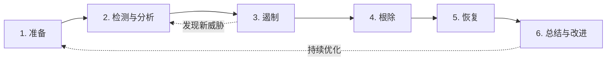
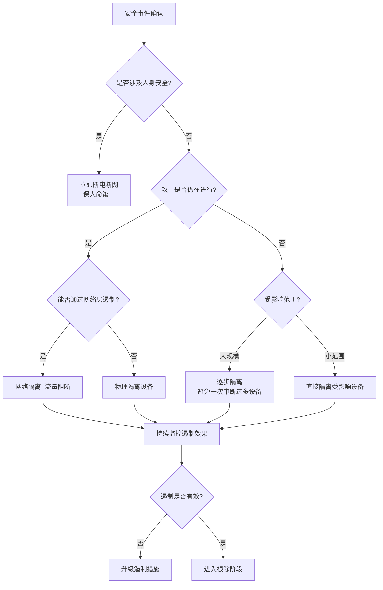
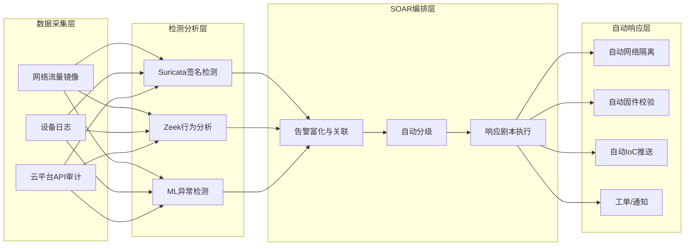

## 22.9 IoT安全事件响应

### 22.9.1 为什么IoT事件响应与众不同

传统的IT安全事件响应（Incident Response, IR）方法论以NIST SP 800-61为基石，假设目标资产是标准的服务器、工作站或网络设备——它们具有充裕的计算资源、统一的操作系统、可靠的日志系统和标准化的远程管理接口。然而，当安全事件发生在IoT环境中时，这些假设几乎全部失效。

**IoT事件响应面临的根本性挑战：**

| 维度 | 传统IT环境 | IoT环境 | 对事件响应的影响 |
|------|-----------|---------|-----------------|
| **设备规模** | 数百至数千台 | 数万至数百万台 | 无法逐一检查，必须依赖自动化检测和批量响应 |
| **计算资源** | 充裕（可运行EDR Agent） | 极度受限（KB级内存） | 无法在设备上部署安全代理，检测必须在网络侧完成 |
| **日志能力** | 完整的系统/应用/安全日志 | 大部分设备无日志，或仅有极简日志 | 取证困难，往往无法还原攻击过程 |
| **物理访问** | 设备在机房，物理安全可控 | 设备分布在户外、工厂、人体内 | 取证需要物理接触设备，且可能影响正常运营 |
| **更新机制** | 自动化补丁管理（WSUS/SCCM） | 固件更新可能失败甚至变砖 | 根除恶意代码的手段受限 |
| **网络架构** | 清晰的网络边界 | 混合IT/OT网络，边界模糊 | 遏制措施可能误伤正常业务 |
| **影响后果** | 数据泄露、业务中断 | 人身安全、基础设施损毁 | 决策权重完全不同——保人命优先于保数据 |
| **设备生命周期** | 3-5年 | 10-20年 | 存在大量已停止维护的"僵尸设备"，无法修补 |

**一个关键认知：IoT事件响应不是IT事件响应的子集，而是一个需要专门方法论的独立领域。** 这是因为IoT安全事件的影响可能从数字空间溢出到物理世界——被入侵的心脏起搏器可以杀人，被劫持的汽车可以成为武器，被操纵的工业控制器可以引发爆炸。这种"网络-物理"（Cyber-Physical）特性要求响应团队在决策时引入完全不同的风险评估框架。

### 22.9.2 IoT事件响应总体框架

我们以业界通行的NIST SP 800-61事件响应生命周期为基础，结合IoT环境的特殊性，构建如下六阶段响应框架：



每个阶段都有其特定的目标、行动项、工具和交付物。与传统IT IR相比，IoT IR在每个阶段都引入了额外的约束条件和特殊流程。接下来逐一展开。

### 22.9.3 阶段一：准备（Preparation）

准备阶段是整个事件响应体系的基石。在IoT环境中，准备工作的难度远高于传统IT——因为你的资产清单可能包含数百万种不同型号、不同固件版本、不同通信协议的设备，而你可能连它们在哪里、在做什么都不知道。

#### 22.9.3.1 IoT资产测绘

资产测绘是一切安全工作的前提。没有资产清单的事件响应，就像没有地图的军事行动——你不知道战场在哪里。

**资产测绘的四个层次：**

| 层次 | 内容 | 数据来源 | 工具示例 |
|------|------|---------|---------|
| **网络层** | IP地址、MAC地址、开放端口、通信协议 | 网络流量镜像、主动扫描 | Nmap、Shodan、Censys、NetFlow |
| **设备层** | 设备型号、固件版本、制造商、序列号 | 设备Banner、SNMP、mDNS响应 | IoT Inspector、Firmwalker |
| **应用层** | 运行的服务、API端点、Web管理界面 | 主动探测、被动流量分析 | Burp Suite、自定义脚本 |
| **行为层** | 正常通信模式、数据流方向、更新频率 | 长期流量基线采集 | Zeek(Bro)、Suricata、ML模型 |

**实操：使用Nmap进行IoT设备发现**

```bash
# 扫描局域网中所有IoT设备（常见端口）
nmap -sV -O --top-ports 1000 -oA iot_scan 192.168.1.0/24

# 专门扫描IoT常见端口（MQTT、CoAP、Zigbee网关等）
nmap -p 1883,8883,5683,5684,80,443,8080,8443,22,23,161 \
     -sV -O 192.168.1.0/24 -oA iot_ports

# 识别mDNS/DNS-SD服务发现（智能家居设备常用）
nmap --script=banner,dns-service-discovery -p 5353 \
     192.168.1.0/24

# 被动发现：监听ARP广播识别新设备接入
tcpdump -i eth0 arp -nn -l | \
  awk '{print $NF}' | sort -u
```

**资产清单模板（CSV格式）：**

```csv
设备ID,设备名称,型号,制造商,固件版本,IP地址,MAC地址,通信协议,部署位置,负责人,最后审计日期
IOT-001,温湿度传感器-A区,T301,海尔,v2.1.3,192.168.10.101,AA:BB:CC:DD:EE:01,MQTT,工厂A区,张工,2024-11-15
IOT-002,智能摄像头-大厅,IPC-HDW5442T,大华,v3.0.1,192.168.20.55,AA:BB:CC:DD:EE:02,RTSP/HTTP,办公楼大厅,李工,2024-10-20
```

#### 22.9.3.2 应急响应团队组建

IoT事件响应需要跨领域协作。一个典型的IoT IR团队至少包含以下角色：

```plaintext
IoT事件响应团队架构：

┌─────────────────────────────────────────────────┐
│              事件响应指挥官（IRC）                  │
│    负责整体决策、资源调配、对外沟通                   │
└─────────────┬───────────────────┬───────────────┘
              │                   │
    ┌─────────▼────────┐ ┌───────▼──────────────┐
    │   网络安全分析师    │ │   IoT设备工程师        │
    │  • 流量分析        │ │  • 固件分析            │
    │  • 入侵检测        │ │  • 硬件调试            │
    │  • 取证保全        │ │  • 设备重置/刷固件      │
    └──────────────────┘ └──────────────────────┘
    ┌──────────────────┐ ┌──────────────────────┐
    │   OT安全工程师     │ │   法务与合规专员        │
    │  • 工控协议分析     │ │  • 证据链管理          │
    │  • SCADA安全       │ │  • 监管报告            │
    │  • 物理安全        │ │  • 法律风险评估         │
    └──────────────────┘ └──────────────────────┘
```

**关键能力要求：**

- **网络安全分析师**：必须熟悉IoT常用协议（MQTT、CoAP、Zigbee、BLE、Modbus）的流量特征，能够从海量设备流量中识别异常
- **IoT设备工程师**：具备嵌入式开发经验，能进行固件提取（通过UART/SPI/JTAG）、固件逆向分析（Ghidra/IDA Pro）、以及设备恢复操作
- **OT安全工程师**：理解工业控制系统的物理过程，知道在什么情况下IT侧的遏制措施（如断网）会导致OT侧的物理后果（如反应釜温度失控）
- **法务与合规专员**：了解IoT相关法规（如欧盟Cyber Resilience Act、中国《网络安全法》、FDA 510(k)对医疗IoT的要求），确保证据采集符合法律要求

#### 22.9.3.3 监控与检测基础设施部署

IoT环境的监控必须采用"网络侧为主、设备侧为辅"的策略——因为大多数IoT设备无法运行本地安全代理。

**核心监控组件：**

```yaml
IoT安全监控体系:

  网络层监控:
    - NIDS (网络入侵检测):
        工具: Suricata + ET Open规则集
        部署: 在IoT网关处镜像流量
        重点: 异常DNS查询、C2通信、横向扫描
    - 流量基线分析:
        工具: Zeek (Bro) + 自定义脚本
        方法: 建立设备正常通信基线，偏离即告警
        重点: 新出现的目标IP、异常数据量、协议违规

  平台层监控:
    - MQTT Broker日志:
        关注: 异常订阅/发布、未认证连接、权限提升
        工具: EMQX Dashboard / Mosquitto log + ELK
    - 云平台API审计:
        关注: 异常API调用模式、批量数据导出
        工具: 云平台自带审计日志 + SIEM集成

  设备层监控 (受限设备除外):
    - 完整性校验:
        方法: 定期计算固件哈希值并与已知基线比较
        工具: dm-verity / 自定义完整性检查脚本
    - 日志采集:
        方法: 通过rsyslog/syslog-ng集中收集设备日志
        前提: 设备支持syslog且资源允许
```

**实用检测规则示例（Suricata规则）：**

```text
# 检测IoT设备DNS查询已知DGA域名（Mirai特征）
alert dns any any -> any any (msg:"IoT DGA Domain Detected"; \
  dns.query; pcre:"/^[a-z]{12,}\.(com|net|org)$/"; \
  sid:1000001; rev:1; classtype:trojan-activity;)

# 检测IoT设备扫描内网其他设备（横向移动特征）
alert tcp $HOME_NET any -> $HOME_NET any (msg:"IoT Internal Scan"; \
  flags:S; threshold:type both, track by_src, count 50, seconds 10; \
  sid:1000002; rev:1; classtype:attempted-recon;)

# 检测Telnet暴力破解（Mirai、Gafgyt特征）
alert tcp any any -> $HOME_NET 23 (msg:"IoT Telnet Brute Force"; \
  threshold:type both, track by_src, count 10, seconds 60; \
  sid:1000003; rev:1; classtype:attempted-admin;)
```

#### 22.9.3.4 应急响应计划文档

一份合格的IoT IR计划文档应至少包含以下章节：

```plaintext
IoT安全应急响应计划 — 目录模板：

1. 文档信息
   1.1 版本历史
   1.2 审批记录
   1.3 更新周期（建议每季度审查一次）

2. 适用范围
   2.1 覆盖的IoT设备类型和部署区域
   2.2 与传统IT IR计划的边界划分
   2.3 与OT/ICS应急预案的衔接关系

3. 事件分级标准
   3.1 P1-紧急：涉及人身安全、物理设施损毁风险
   3.2 P2-高：大规模设备被控、数据大规模泄露
   3.3 P3-中：单点设备被入侵、小范围影响
   3.4 P4-低：未成功的攻击尝试、安全配置违规

4. 响应流程（对应本章六个阶段的具体行动清单）

5. 联系人清单
   5.1 内部团队联系人（含值班轮换表）
   5.2 外部支援（设备厂商技术支持、CERT、执法机构）
   5.3 上下游通报对象（供应链合作伙伴、客户）

6. 工具与资源清单
   6.1 取证工具包（硬件和软件）
   6.2 备用设备清单（用于替换被隔离设备）
   6.3 备份固件库（各型号各版本的已知安全固件）

7. 法律与合规要求
   7.1 数据保护义务（个人信息处理限制）
   7.2 事件报告时限（如适用）
   7.3 证据保全标准

8. 演练计划
   8.1 桌面推演（每季度一次）
   8.2 实战演练（每半年一次）
   8.3 演练评估与改进
```

### 22.9.4 阶段二：检测与分析（Detection & Analysis）

检测是事件响应中最关键也最具挑战性的阶段。在IoT环境中，挑战被放大数倍——你可能面对数百万台设备，大部分缺乏本地日志能力，而攻击者可以通过合法的IoT通信协议（如MQTT）传输恶意指令，使恶意流量完美伪装为正常业务流量。

#### 22.9.4.1 IoT安全事件分类

理解"什么算安全事件"是检测的前提。IoT安全事件可以按影响范围和严重程度分为以下几类：

| 事件类型 | 典型场景 | 严重程度 | 检测难度 |
|---------|---------|---------|---------|
| **设备劫持** | 设备被植入恶意固件，加入僵尸网络（如Mirai） | 高 | 中（网络流量异常可检测） |
| **数据泄露** | 传感器数据、用户隐私数据被未授权获取 | 高-中 | 高（加密流量中难以区分） |
| **拒绝服务** | 设备被大量垃圾请求淹没，无法提供服务 | 中 | 低（设备离线即可察觉） |
| **固件篡改** | 攻击者修改设备固件，植入后门 | 极高 | 高（需要定期完整性校验） |
| **中间人攻击** | 攻击者拦截并篡改设备与云平台间的通信 | 高 | 中（证书异常可检测） |
| **物理篡改** | 攻击者物理接触设备，读取存储/调试接口 | 极高 | 极高（需物理安全措施配合） |
| **供应链攻击** | 恶意代码在设备出厂前已被植入固件 | 极高 | 极高（需要固件审计能力） |

#### 22.9.4.2 检测技术详解

**1. 基于流量基线的行为检测**

这是IoT环境中最通用、最实用的检测方法。核心思想：先用一段时间（通常2-4周）学习设备的正常行为模式，建立基线，之后任何偏离基线的行为都被标记为可疑。

```python
#!/usr/bin/env python3
"""
IoT设备流量基线检测器 — 概念演示
基于Zeek (Bro) 输出的conn.log进行分析
"""

import json
import numpy as np
from collections import defaultdict
from datetime import datetime, timedelta

class IoTBaselineDetector:
    def __init__(self, baseline_period_days=14):
        self.baseline_days = baseline_period_days
        # 每个设备的基线指标
        self.baselines = defaultdict(lambda: {
            'conn_count': [],       # 每小时连接数
            'bytes_out': [],        # 每小时出站字节数
            'unique_dst_ips': [],   # 每小时唯一目标IP数
            'dst_ports': set(),     # 历史使用过的端口集合
            'dst_ips': set(),       # 历史连接过的目标IP集合
            'protocols': set(),     # 历史使用过的协议集合
        })
        self.alerts = []

    def _extract_hourly_features(self, conn_log_entries, device_ip):
        """从Zeek conn.log中提取设备每小时的流量特征"""
        hourly = defaultdict(lambda: {
            'conn_count': 0, 'bytes_out': 0,
            'dst_ips': set(), 'dst_ports': set()
        })
        for entry in conn_log_entries:
            if entry['id.orig_h'] == device_ip:
                hour_key = datetime.fromtimestamp(
                    entry['ts']
                ).strftime('%Y-%m-%d-%H')
                hourly[hour_key]['conn_count'] += 1
                hourly[hour_key]['bytes_out'] += entry.get('resp_bytes', 0)
                hourly[hour_key]['dst_ips'].add(entry['id.resp_h'])
                hourly[hour_key]['dst_ports'].add(entry['id.resp_p'])
        return hourly

    def build_baseline(self, device_ip, conn_log_entries):
        """为指定设备建立行为基线"""
        hourly = self._extract_hourly_features(conn_log_entries, device_ip)
        bl = self.baselines[device_ip]

        for hour_key, data in hourly.items():
            bl['conn_count'].append(data['conn_count'])
            bl['bytes_out'].append(data['bytes_out'])
            bl['unique_dst_ips'].append(len(data['dst_ips']))
            bl['dst_ports'].update(data['dst_ports'])
            bl['dst_ips'].update(data['dst_ips'])

    def detect_anomaly(self, device_ip, current_hour_data, sigma=3):
        """
        检测当前小时的流量是否偏离基线
        使用3-sigma规则：超过均值±3倍标准差即为异常
        """
        bl = self.baselines[device_ip]
        if len(bl['conn_count']) < 24:  # 至少需要1天数据
            return []

        alerts = []

        # 检查连接数异常
        mean_conn = np.mean(bl['conn_count'])
        std_conn = np.std(bl['conn_count'])
        if current_hour_data['conn_count'] > mean_conn + sigma * std_conn:
            alerts.append({
                'type': 'connection_spike',
                'severity': 'HIGH',
                'detail': f"连接数异常：当前 {current_hour_data['conn_count']}, "
                         f"基线均值 {mean_conn:.0f} ± {std_conn:.0f}",
            })

        # 检查是否连接了新的目标IP（横向移动特征）
        new_ips = current_hour_data['dst_ips'] - bl['dst_ips']
        if new_ips and len(new_ips) > 3:
            alerts.append({
                'type': 'new_destination_ips',
                'severity': 'CRITICAL',
                'detail': f"发现 {len(new_ips)} 个新目标IP，"
                         f"可能是横向移动: {list(new_ips)[:5]}",
            })

        # 检查是否使用了新端口（协议切换特征）
        new_ports = current_hour_data['dst_ports'] - bl['dst_ports']
        suspicious_ports = {22, 23, 3389, 4444, 5555, 8080}  # 常见攻击端口
        hit_ports = new_ports & suspicious_ports
        if hit_ports:
            alerts.append({
                'type': 'suspicious_new_ports',
                'severity': 'HIGH',
                'detail': f"使用了可疑的新端口: {hit_ports}",
            })

        return alerts
```

**2. 基于签名的检测**

对于已知的IoT恶意软件家族，签名检测仍然是快速、高效的检测方式。以下是一些典型IoT恶意软件的网络签名特征：

| 恶意软件家族 | 网络特征 | 检测方法 |
|-------------|---------|---------|
| **Mirai** | Telnet暴力破解→下载loader→C2通信，使用DGA域名 | 检测Telnet暴力破解+DGA域名查询 |
| **Reaper/IoTroop** | 利用摄像头/DVR的已知漏洞（CVE-2017-8225等），HTTP-based C2 | 检测漏洞利用payload+已知C2域名/IP |
| **Gafgyt/Bashlite** | Telnet暴力破解→执行busybox命令下载payload | 检测Telnet暴力破解+异常busybox命令 |
| **Mozi** | P2P架构，使用DHT协议进行C2通信 | 检测异常的BitTorrent DHT流量 |
| **RapperBot** | SSH暴力破解+自研扫描器 | 检测SSH暴力破解+异常SSH Banner |

**3. 基于物理过程的检测（适用于工控/关键基础设施）**

对于工业IoT设备，可以从物理过程层面检测异常——这比网络层检测更难被攻击者绕过，因为物理过程受物理定律约束。

```python
# 基于物理过程的异常检测（以水处理系统为例）
class PhysicalProcessAnomalyDetector:
    def __init__(self):
        # 正常运行参数范围（基于历史数据+工程知识）
        self.normal_ranges = {
            'chlorine_dose': (0.2, 2.0),      # mg/L 氯投加量
            'ph_level': (6.5, 8.5),            # pH值
            'flow_rate': (100, 500),           # m³/h 流量
            'turbidity': (0.1, 1.0),           # NTU 浊度
            'pressure': (2.0, 6.0),            # bar 管道压力
        }

    def check_physical_consistency(self, sensor_readings):
        """
        基于物理定律检查传感器读数的一致性。
        攻击者可能修改某个传感器的读数，
        但很难同时伪造所有相关传感器使其保持物理一致性。
        """
        alerts = []

        # 规则1：流量变化应伴随压力变化（流体力学原理）
        if (sensor_readings.get('flow_rate_change_pct', 0) > 50 and
            sensor_readings.get('pressure_change_pct', 0) < 5):
            alerts.append({
                'rule': 'flow_pressure_inconsistency',
                'severity': 'CRITICAL',
                'detail': '流量大幅变化但压力无明显变化——'
                         '可能是传感器被伪造或控制器被篡改'
            })

        # 规则2：氯投加量与残余氯的关系
        if (sensor_readings.get('chlorine_dose', 0) > 1.5 and
            sensor_readings.get('residual_chlorine', 0) < 0.1):
            alerts.append({
                'rule': 'chlorine_anomaly',
                'severity': 'CRITICAL',
                'detail': '高投氯量但低残余氯——'
                         '可能是投氯控制器被篡改或传感器伪造'
            })

        # 规则3：参数突然跳变到极值
        for param, (low, high) in self.normal_ranges.items():
            value = sensor_readings.get(param)
            if value is not None and (value < low * 0.5 or value > high * 2):
                alerts.append({
                    'rule': 'extreme_value',
                    'severity': 'HIGH',
                    'detail': f'{param}={value}超出合理范围的2倍，'
                             f'正常范围[{low}, {high}]'
                })

        return alerts
```

> **真实案例：2021年Oldsmar水处理厂事件** 攻击者通过远程桌面协议（RDP）入侵了佛罗里达州Oldsmar市的水处理控制系统，将氢氧化钠（NaOH，俗称烧碱）的投加量从正常的100ppm修改为11,100ppm——足以使饮用水达到危险浓度。幸运的是，操作员实时注意到了屏幕上的异常操作并立即纠正。但如果当时部署了物理过程异常检测系统，当NaOH投加量被设为111倍正常值时，系统会在毫秒级内自动告警甚至拦截，而不依赖人眼监视。

#### 22.9.4.3 事件确认与初步评估

当检测系统发出告警后，需要快速确认是否为真实安全事件，以及评估事件的严重程度。以下是IoT环境中的事件确认清单：

```plaintext
IoT安全事件确认检查清单：

□ 告警来源验证
  ├── 该告警规则的误报率是多少？
  ├── 是否有多个独立检测源同时告警？（交叉验证）
  └── 最近是否有计划内的变更（固件升级、配置调整）？

□ 设备状态检查
  ├── 设备是否仍在正常运行？（物理功能是否正常）
  ├── 设备的网络行为是否异常？（流量突增、连接陌生IP）
  └── 设备的固件完整性是否被破坏？（哈希校验）

□ 影响范围初步评估
  ├── 受影响设备数量（单台 / 部分 / 大规模）
  ├── 受影响系统类型（传感器 / 控制器 / 网关 / 云平台）
  ├── 潜在影响后果（数据泄露 / 服务中断 / 物理安全风险）
  └── 攻击是否仍在进行中？

□ 事件分级判定
  ├── P1-紧急：人身安全风险、关键基础设施瘫痪
  ├── P2-高：大规模设备失控、敏感数据泄露
  ├── P3-中：单点入侵、小范围影响
  └── P4-低：未遂攻击、安全配置违规
```

### 22.9.5 阶段三：遏制（Containment）

遏制是事件响应中最需要"因地制宜"判断的阶段。IoT环境中的遏制决策比传统IT复杂得多，因为遏制措施可能产生物理世界的影响。

#### 22.9.5.1 遏制策略选择

| 遏制策略 | 具体措施 | 适用场景 | 风险与副作用 |
|---------|---------|---------|-------------|
| **网络隔离** | VLAN隔离、ACL阻断、防火墙规则 | 设备间横向移动 | 可能中断设备与云平台的正常通信 |
| **设备断网** | 关闭设备网络接口、物理拔网线 | 严重感染、僵尸网络控制 | 设备失去远程管理能力，物理设备可能停止工作 |
| **设备断电** | 物理关闭设备电源 | 紧急情况下阻止物理损坏 | 设备断电可能导致生产中断、数据丢失 |
| **凭据作废** | 重置密码、吊销证书、更换API Key | 凭据泄露 | 批量设备凭据更换可能造成长时间服务中断 |
| **流量清洗** | 部署DDoS防护、设置流量清洗规则 | DDoS攻击 | 引入额外延迟，可能影响实时性要求高的场景 |
| **固件回滚** | 刷回已知安全的旧版固件 | 固件被篡改 | 旧版固件可能有已知漏洞，且回滚过程中设备不可用 |

**IoT遏制的核心决策树：**



**关键原则：在涉及人身安全的场景中（医疗IoT、车联网、工业控制），遏制措施的优先级是"保命第一"，宁可误断不可漏断。**

#### 22.9.5.2 网络层遏制实操

```bash
#!/bin/bash
# IoT设备网络隔离脚本 — 基于Linux iptables
# 用途：快速隔离被入侵的IoT设备，阻止其与外网通信，
#       仅允许与取证服务器通信

DEVICE_IP="192.168.10.101"
FORENSIC_SERVER="192.168.1.100"
IOT_GATEWAY="192.168.10.1"

# 步骤1：阻断设备的所有出站连接（阻止C2通信和数据外泄）
iptables -I FORWARD -s "$DEVICE_IP" -j DROP
iptables -I FORWARD -s "$DEVICE_IP" -d "$FORENSIC_SERVER" -j ACCEPT

# 步骤2：阻断设备的所有入站连接（阻止远程控制）
iptables -I FORWARD -d "$DEVICE_IP" -j DROP
iptables -I FORWARD -s "$FORENSIC_SERVER" -d "$DEVICE_IP" -j ACCEPT

# 步骤3：记录该设备的所有剩余流量（取证用）
iptables -A FORWARD -s "$DEVICE_IP" -j LOG \
  --log-prefix "QUARANTINE-OUT: " --log-level 4
iptables -A FORWARD -d "$DEVICE_IP" -j LOG \
  --log-prefix "QUARANTINE-IN: " --log-level 4

echo "[+] 设备 $DEVICE_IP 已隔离，仅允许与 $FORENSIC_SERVER 通信"
echo "[+] 请尽快进行取证采集"

# === 恢复命令（在根除阶段完成后执行）===
# iptables -D FORWARD -s "$DEVICE_IP" -j DROP
# iptables -D FORWARD -s "$DEVICE_IP" -d "$FORENSIC_SERVER" -j ACCEPT
# iptables -D FORWARD -d "$DEVICE_IP" -j DROP
# iptables -D FORWARD -s "$FORENSIC_SERVER" -d "$DEVICE_IP" -j ACCEPT
# echo "[+] 设备 $DEVICE_IP 网络隔离已解除"
```

### 22.9.6 阶段四：根除（Eradication）

根除阶段的目标是彻底清除攻击者在系统中的所有存在痕迹——恶意代码、后门账户、被篡改的配置。在IoT环境中，根除的难度取决于设备类型和攻击深度。

#### 22.9.6.1 根除策略矩阵

| 攻击深度 | 根除策略 | 适用场景 | 操作复杂度 |
|---------|---------|---------|----------|
| **应用层感染** | 卸载恶意应用/插件、重置配置 | Web管理界面被植入Webshell | 低 |
| **用户层感染** | 删除恶意用户、清理cron任务 | 设备被植入挖矿程序 | 低-中 |
| **固件层感染** | 重新刷写官方固件 | 固件被篡改、植入后门 | 中-高 |
| **引导层感染** | 重写Bootloader + 完整固件 | 极端情况，Bootkit | 高（需要硬件工具） |
| **硬件层感染** | 更换硬件设备 | 芯片级后门（供应链攻击） | 极高 |

#### 22.9.6.2 固件级根除实操

当确认设备固件被篡改时，最可靠的根除方法是重刷官方固件。以下是通过UART串口进行固件恢复的完整流程：

```plaintext
固件恢复流程（以UART串口为例）：

前提条件：
├── 获取设备的UART调试接口（通常需要拆机）
├── 准备USB转TTL适配器（如CP2102、CH340G）
├── 准备已知安全的官方固件文件
└── 准备备用存储芯片（SPI Flash，可选）

步骤1：连接UART接口
├── 使用万用表或JTAGulator识别TX/RX/GND引脚
├── 连接USB转TTL适配器到UART接口
└── 使用minicom/screen/PuTTY连接（波特率通常为115200）

步骤2：进入Bootloader
├── 设备上电时按特定键组合进入U-Boot命令行
├── 常见命令：按任意键中断自动启动
└── 验证：看到 "=>" 或 "U-Boot>" 提示符

步骤3：准备固件传输
├── 配置TFTP服务器存放固件文件
├── 设置网络参数：
│   setenv ipaddr 192.168.1.10
│   setenv serverip 192.168.1.100
└── 测试网络连通性：ping 192.168.1.100

步骤4：擦除并写入固件
├── 擦除Flash：erase 0x9F050000 +0xF80000
├── 下载固件：tftpboot 0x80000000 firmware.bin
├── 写入Flash：cp.b 0x80000000 0x9F050000 ${filesize}
└── 校验：cmp.b 0x80000000 0x9F050000 ${filesize}

步骤5：验证并重启
├── 设置启动参数：setenv bootcmd "bootm 0x9F050000"
├── 保存环境变量：saveenv
└── 重启设备：reset

步骤6：恢复后验证
├── 确认固件版本和哈希值
├── 检查设备功能是否正常
├── 更改所有默认凭据
└── 接入监控系统观察是否有再次异常
```

#### 22.9.6.3 大规模设备的批量根除

当感染规模达到数千甚至数万台设备时，逐一处理不现实。需要建立自动化批量根除流程：

```python
#!/usr/bin/env python3
"""
IoT设备批量固件更新工具 — 概念演示
用于大规模IoT环境的批量固件刷写
"""

import asyncio
import aiohttp
import hashlib
import logging
from dataclasses import dataclass
from typing import List, Optional
from enum import Enum

class DeviceStatus(Enum):
    PENDING = "pending"
    UPDATING = "updating"
    SUCCESS = "success"
    FAILED = "failed"
    ROLLED_BACK = "rolled_back"

@dataclass
class IoTDevice:
    device_id: str
    ip_address: str
    model: str
    current_firmware: str
    target_firmware: str
    status: DeviceStatus = DeviceStatus.PENDING
    error_msg: Optional[str] = None

class BatchFirmwareUpdater:
    def __init__(self, firmware_url: str, max_concurrent: int = 50,
                 batch_size: int = 100, rollback_on_failure: bool = True):
        self.firmware_url = firmware_url
        self.max_concurrent = max_concurrent
        self.batch_size = batch_size
        self.rollback_on_failure = rollback_on_failure
        self.logger = logging.getLogger(__name__)
        self.semaphore = asyncio.Semaphore(max_concurrent)

    async def update_single_device(self, session: aiohttp.ClientSession,
                                    device: IoTDevice) -> DeviceStatus:
        """更新单台设备的固件"""
        async with self.semaphore:
            device.status = DeviceStatus.UPDATING
            self.logger.info(
                f"开始更新设备 {device.device_id} ({device.ip_address})"
            )
            try:
                # 步骤1：上传固件到设备
                async with session.post(
                    f"http://{device.ip_address}/api/firmware/update",
                    data={"url": self.firmware_url},
                    timeout=aiohttp.ClientTimeout(total=300)
                ) as resp:
                    if resp.status != 200:
                        raise Exception(f"固件上传失败: HTTP {resp.status}")

                # 步骤2：等待设备重启并验证
                await asyncio.sleep(30)  # 等待设备重启

                # 步骤3：验证新固件
                async with session.get(
                    f"http://{device.ip_address}/api/system/info",
                    timeout=aiohttp.ClientTimeout(total=30)
                ) as resp:
                    info = await resp.json()
                    if info.get('firmware_version') != device.target_firmware:
                        raise Exception(
                            f"固件版本不匹配: "
                            f"期望 {device.target_firmware}, "
                            f"实际 {info.get('firmware_version')}"
                        )

                device.status = DeviceStatus.SUCCESS
                self.logger.info(f"设备 {device.device_id} 更新成功")

            except Exception as e:
                device.error_msg = str(e)
                self.logger.error(
                    f"设备 {device.device_id} 更新失败: {e}"
                )
                if self.rollback_on_failure:
                    await self._rollback_device(session, device)

            return device.status

    async def _rollback_device(self, session: aiohttp.ClientSession,
                                device: IoTDevice):
        """固件更新失败时回滚"""
        try:
            async with session.post(
                f"http://{device.ip_address}/api/firmware/rollback",
                timeout=aiohttp.ClientTimeout(total=300)
            ) as resp:
                if resp.status == 200:
                    device.status = DeviceStatus.ROLLED_BACK
                    self.logger.warning(
                        f"设备 {device.device_id} 已回滚到上一版本"
                    )
        except Exception as e:
            device.status = DeviceStatus.FAILED
            self.logger.critical(
                f"设备 {device.device_id} 回滚失败: {e} — 需要人工处理"
            )

    async def batch_update(self, devices: List[IoTDevice]) -> dict:
        """分批更新所有设备"""
        results = {s.value: 0 for s in DeviceStatus}

        for i in range(0, len(devices), self.batch_size):
            batch = devices[i:i + self.batch_size]
            self.logger.info(
                f"处理批次 {i // self.batch_size + 1}, "
                f"设备 {i + 1}-{min(i + self.batch_size, len(devices))}"
            )

            async with aiohttp.ClientSession() as session:
                tasks = [
                    self.update_single_device(session, device)
                    for device in batch
                ]
                await asyncio.gather(*tasks)

            # 统计本批次结果
            for device in batch:
                results[device.status.value] += 1

            # 安全阀：如果失败率超过20%，停止更新并告警
            batch_failed = sum(
                1 for d in batch
                if d.status in (DeviceStatus.FAILED, DeviceStatus.ROLLED_BACK)
            )
            if batch_failed / len(batch) > 0.2:
                self.logger.critical(
                    f"批次失败率 {batch_failed / len(batch):.1%} 超过阈值, "
                    f"停止批量更新，需要人工介入"
                )
                break

        return results
```

### 22.9.7 阶段五：恢复（Recovery）

恢复阶段的目标是将受影响设备和系统恢复到正常运行状态，同时确保攻击不会复发。

#### 22.9.7.1 恢复策略与顺序

恢复必须遵循严格的顺序，避免"边恢复边被再感染"的循环：

```plaintext
IoT系统恢复顺序：

第1步：恢复基础设施（前提条件）
├── 确认攻击已彻底根除
├── 确认网络基础设施安全（DNS、DHCP、网关）
├── 确认云平台/IoT平台安全
└── 确认监控和日志系统已就位

第2步：恢复关键设备（按优先级）
├── P1：涉及人身安全的设备（医疗、交通）
├── P2：影响业务连续性的设备（生产控制）
├── P3：影响数据采集的设备（传感器网络）
└── P4：非关键辅助设备（环境监测、展示屏）

第3步：恢复后验证
├── 固件完整性校验（哈希比对）
├── 安全配置检查（默认凭据、加密设置）
├── 功能测试（设备是否正常工作）
└── 持续监控（至少72小时高强度监控）

第4步：逐步放量
├── 先在小范围验证恢复效果
├── 确认无异常后逐步扩大恢复范围
└── 保留备用回退方案
```

#### 22.9.7.2 恢复后验证脚本

```bash
#!/bin/bash
# IoT设备恢复后安全验证脚本
# 用于确认设备在恢复后处于安全状态

DEVICE_IP="$1"
DEVICE_MODEL="$2"

echo "=========================================="
echo "IoT设备恢复后安全验证"
echo "目标: $DEVICE_IP ($DEVICE_MODEL)"
echo "时间: $(date '+%Y-%m-%d %H:%M:%S')"
echo "=========================================="

ERRORS=0
WARNINGS=0

# 检查1：默认凭据检测
echo "[检查1] 默认凭据检测..."
for creds in "admin:admin" "root:root" "admin:1234" "admin:password" \
             "root:admin" "user:user"; do
    user="${creds%%:*}"
    pass="${creds##*:}"
    # 尝试HTTP Basic Auth
    if curl -s -o /dev/null -w "%{http_code}" \
        -u "$user:$pass" "http://$DEVICE_IP/" | grep -q "200"; then
        echo "  [FAIL] 使用默认凭据可登录: $user:$pass"
        ((ERRORS++))
    fi
done
echo "  [INFO] 默认凭据检查完成"

# 检查2：固件版本和完整性
echo "[检查2] 固件版本检查..."
CURRENT_FW=$(curl -s "http://$DEVICE_IP/api/system/info" | \
             python3 -c "import sys,json; print(json.load(sys.stdin).get('firmware_version','unknown'))" 2>/dev/null)
echo "  当前固件版本: $CURRENT_FW"

# 检查3：不必要的服务端口
echo "[检查3] 开放端口检查..."
OPEN_PORTS=$(nmap -p 1-65535 --open -T4 "$DEVICE_IP" 2>/dev/null | \
             grep "^[0-9]" | awk '{print $1}')
DANGEROUS_PORTS="23 21 5555 8080 9090"
for port in $OPEN_PORTS; do
    port_num="${port%%/*}"
    if echo "$DANGEROUS_PORTS" | grep -qw "$port_num"; then
        echo "  [WARN] 发现危险端口开放: $port"
        ((WARNINGS++))
    fi
done

# 检查4：DNS设置（是否被劫持到恶意DNS）
echo "[检查4] DNS配置检查..."
DEVICE_DNS=$(ssh root@"$DEVICE_IP" "cat /etc/resolv.conf" 2>/dev/null | \
             grep nameserver | head -1 | awk '{print $2}')
EXPECTED_DNS="192.168.1.1"
if [ -n "$DEVICE_DNS" ] && [ "$DEVICE_DNS" != "$EXPECTED_DNS" ]; then
    echo "  [WARN] DNS服务器异常: $DEVICE_DNS (预期: $EXPECTED_DNS)"
    ((WARNINGS++))
fi

# 检查5：crontab 后门检测
echo "[检查5] 定时任务检查..."
CRON_ENTRIES=$(ssh root@"$DEVICE_IP" "crontab -l 2>/dev/null" 2>/dev/null)
if echo "$CRON_ENTRIES" | grep -qiE "(curl|wget|nc |ncat|/tmp/|base64)"; then
    echo "  [FAIL] 发现可疑的cron任务:"
    echo "$CRON_ENTRIES" | grep -iE "(curl|wget|nc |ncat|/tmp/|base64)"
    ((ERRORS++))
fi

# 汇总
echo ""
echo "=========================================="
echo "验证完成"
echo "  严重问题: $ERRORS"
echo "  警告: $WARNINGS"
if [ "$ERRORS" -gt 0 ]; then
    echo "  结论: ❌ 设备未通过安全验证，需要进一步处理"
    exit 1
elif [ "$WARNINGS" -gt 0 ]; then
    echo "  结论: ⚠️ 设备存在警告项，建议确认后上线"
    exit 0
else
    echo "  结论: ✅ 设备通过安全验证，可以恢复服务"
    exit 0
fi
```

### 22.9.8 阶段六：总结与改进（Post-Incident Activity）

总结阶段常被忽视，但它是将"一次事件"转化为"长期能力"的关键环节。一份高质量的事后报告不仅是复盘文档，更是组织安全能力演进的路线图。

#### 22.9.8.1 事件报告模板

```plaintext
IoT安全事件报告模板

════════════════════════════════════════════════════
一、事件概述
════════════════════════════════════════════════════
事件编号：INC-2024-IoT-0042
事件名称：[简要描述，如"XX工厂传感器网络遭僵尸网络感染"]
严重等级：P1/P2/P3/P4
事件时间线：
  - 首次发现时间：YYYY-MM-DD HH:MM
  - 确认时间：YYYY-MM-DD HH:MM
  - 遏制完成时间：YYYY-MM-DD HH:MM
  - 根除完成时间：YYYY-MM-DD HH:MM
  - 恢复完成时间：YYYY-MM-DD HH:MM
  - 关闭时间：YYYY-MM-DD HH:MM
影响范围：
  - 受影响设备数量：
  - 受影响系统：
  - 数据泄露量：
  - 业务中断时长：
  - 财务损失估算：

════════════════════════════════════════════════════
二、技术分析
════════════════════════════════════════════════════
攻击向量：[如：利用CVE-2024-XXXX远程代码执行漏洞]
入侵路径：[用攻击链或流程图描述完整的攻击过程]
恶意软件：[家族名称、哈希值、C2通信特征]
使用的工具和手法：
  - 初始入侵：
  - 横向移动：
  - 数据窃取/破坏：
IoC列表：
  - IP地址：
  - 域名：
  - 文件哈希：
  - 特征签名：

════════════════════════════════════════════════════
三、响应过程
════════════════════════════════════════════════════
检测方式：[主动检测/被动告警/外部通报/用户报告]
遏制措施：[具体采取了哪些遏制手段]
根除措施：[具体采取了哪些根除手段]
恢复过程：[恢复的步骤和验证结果]

════════════════════════════════════════════════════
四、根因分析
════════════════════════════════════════════════════
根本原因：[如：设备使用默认密码且未部署固件更新机制]
直接原因：[如：攻击者通过Telnet暴力破解获取root权限]
促成因素：[如：设备未在网络层面进行访问控制隔离]
使用5-Why分析法逐层追溯

════════════════════════════════════════════════════
五、改进建议
════════════════════════════════════════════════════
短期（1周内）：
  1. [如：修改所有同类设备的默认密码]
  2. [如：部署Suricata规则检测同类攻击]

中期（1-3个月）：
  1. [如：建立IoT设备网络隔离策略]
  2. [如：部署固件完整性监控系统]

长期（3-12个月）：
  1. [如：建立IoT安全开发生命周期(SDLC)]
  2. [如：部署零信任IoT访问架构]

════════════════════════════════════════════════════
六、附录
════════════════════════════════════════════════════
- 取证数据存储位置
- 原始日志归档路径
- 恶意样本隔离存储
- 相关CVE和安全公告链接
```

#### 22.9.8.2 经验教训转化为行动

事件报告写完不等于改进完成。组织必须建立"经验教训→行动项→验收"的闭环机制：

| 转化环节 | 关键动作 | 负责人 | 完成标准 |
|---------|---------|--------|---------|
| **识别改进点** | 从事件中提取每个可改进的环节 | IR团队 | 每个改进点都有明确的描述和优先级 |
| **制定行动项** | 为每个改进点制定具体的、可衡量的行动方案 | 安全经理 | 每个行动项有负责人、截止日期、验收标准 |
| **执行与跟踪** | 在安全管理系统中跟踪每个行动项的执行状态 | 安全运营团队 | 行动项按计划完成，状态实时更新 |
| **验收与关闭** | 验证改进措施是否有效降低了同类事件的风险 | IR团队+管理层 | 通过复测或模拟演练确认改进有效 |
| **更新响应流程** | 将改进后的方法和流程更新到IR计划文档中 | IR团队 | 文档已更新，团队已培训 |

### 22.9.9 典型IoT安全事件响应案例

#### 案例一：Mirai僵尸网络感染事件响应

**背景**：某智能家居制造商的网络摄像头产品在2016年10月被Mirai僵尸网络大规模感染，超过30万台设备被控制用于发动DDoS攻击。

**事件时间线与响应过程：**

```plaintext
T+0h    — Dyn DNS报告遭受大规模DDoS攻击，Twitter/Netflix/CNN等网站不可用
T+1h    — 安全研究人员@MalwareTech确认攻击来自IoT设备组成的僵尸网络
T+2h    — 攻击流量峰值达到1.2Tbps，利用DNS反射放大
T+4h    — 攻击者在Pastebin发布Mirai源代码
T+6h    — 制造商收到CERT通知，确认其设备是主要感染源之一
T+12h   — 制造商启动应急响应：
          ├── 遏制：推送OTA更新禁用Telnet（端口23）
          ├── 遏制：在设备云平台批量修改设备默认密码
          └── 遏制：与ISP合作阻断已知C2服务器IP
T+24h   — 发布安全公告，通知用户手动更新固件
T+72h   — 大部分设备已被清理，但仍有约5%设备无法远程更新
T+1周   — 推送第二波OTA更新，增加完整性自检功能
T+1月   — 完成事后报告，推动产品线安全标准升级
```

**关键教训：**

1. **默认密码是定时炸弹**：Mirai使用的62组默认密码清单（`admin:admin`、`root:vizxv`等）在攻击开始前就已被公开。如果厂商在出厂时强制用户修改默认密码，或者使用每台设备唯一的初始密码，这次大规模感染完全可以避免。
2. **OTA更新能力是安全底线**：支持OTA更新的设备可以被远程修复；不支持的设备则永久成为僵尸，只能物理回收。
3. **事件响应速度决定了损失规模**：从攻击开始到大规模遏制完成用了约12小时。如果厂商之前就建立了IoT IR机制，响应时间可以缩短到2-4小时。

#### 案例二：Oldsmar水处理厂入侵事件响应

**背景**：2021年2月，佛罗里达州Oldsmar市水处理厂的操作员发现鼠标被远程操控，攻击者将NaOH（氢氧化钠）投加量从100ppm修改为11,100ppm。

**响应过程：**

```plaintext
事件检测：操作员实时发现远程桌面会话中的异常鼠标操作（人工检测）
即时响应：操作员立即将NaOH投加量恢复为正常值（即时遏制）
事件报告：操作员上报主管→通知执法机构→通知州安全机构
技术遏制：
  ├── 关闭TeamViewer远程访问（阻断攻击入口）
  ├── 断开工厂控制系统的互联网连接
  └── 更改所有远程访问凭据
取证分析：
  ├── 发现攻击者通过TeamViewer远程访问控制系统
  ├── TeamViewer使用了多个操作员共享的同一组密码
  └── 该密码自2017年以来从未更换过
根因：远程访问安全措施薄弱（共享密码、无MFA、直接暴露互联网）
改进措施：
  ├── 部署VPN + MFA替代直接TeamViewer暴露
  ├── 部署物理过程异常检测（NaOH投加量超过阈值自动阻断）
  ├── 实施最小权限原则（操作员不应有权修改化学参数到危险水平）
  └── 建立工控网络与IT网络的物理隔离
```

**关键教训：**

1. **人在回路（Human-in-the-loop）的双重作用**：这次事件中，操作员既是检测机制（及时发现了异常），也是最后一道防线（立即纠正了危险参数）。但在大规模自动化控制系统中，不可能依赖人工7×24监控——必须部署自动化的物理过程异常检测。
2. **远程访问是最大的攻击面**：TeamViewer/RDP等远程访问工具如果直接暴露在互联网上，等同于把工厂大门的钥匙挂在门口。必须通过VPN+MFA+最小权限三重保护。

#### 案例三：大规模医疗IoT设备勒索事件

**背景**：2020年，多家医院的医疗影像存储与通信系统（PACS）遭到勒索软件攻击，攻击者通过入侵IoT医疗影像设备（CT扫描仪、MRI机器等）横向移动到医院内网，最终加密了PACS服务器。

**响应过程要点：**

```plaintext
检测：PACS服务器无法访问+出现勒索信
影响评估：
  ├── 急诊科CT/MRI设备无法正常工作
  ├── 已拍摄的影像数据被加密
  ├── 患者被迫转运到其他医院
  └── 手术排期被迫推迟

遏制（医疗IoT特殊考量）：
  ├── 不能断电/断网正在使用的设备（患者正在接受检查）
  ├── 优先隔离未被感染的设备
  ├── 启用手动记录流程（纸质化）
  └── 通知所有临床科室切换到手动操作模式

根除与恢复：
  ├── 通过备份恢复PACS服务器数据
  ├── 重新刷写受影响医疗设备的固件
  ├── 重建网络隔离（医疗IoT网络与办公网络彻底分离）
  └── 分阶段恢复：急诊→住院→门诊→行政

长期改进：
  ├── 部署医疗IoT专用NDR（网络检测与响应）
  ├── 建立医疗设备安全基线（CIS Benchmarks for Healthcare）
  ├── 实施网络微隔离（每台医疗设备位于独立网段）
  └── 建立医疗IoT安全事件与临床应急预案的联动机制
```

### 22.9.10 IoT事件响应工具箱

#### 22.10.1 取证工具

| 工具 | 用途 | 适用阶段 | 开源 |
|------|------|---------|------|
| **binwalk** | 固件解包与分析 | 取证/根除 | ✅ |
| **Ghidra** | 固件二进制逆向分析 | 取证/根除 | ✅ |
| **Wireshark + IoT dissectors** | IoT协议流量分析 | 检测/取证 | ✅ |
| **Zeek (Bro)** | 网络流量基线分析与异常检测 | 检测/监控 | ✅ |
| **Suricata** | 基于签名的入侵检测 | 检测/监控 | ✅ |
| **Volatility** | 内存取证（适用于有内存的IoT网关） | 取证 | ✅ |
| **Autopsy** | 磁盘/存储取证 | 取证 | ✅ |
| **flashrom** | SPI Flash芯片读写 | 取证/根除 | ✅ |
| **OpenOCD** | JTAG/SWD调试与芯片读写 | 取证/根除 | ✅ |

#### 22.10.2 监控与检测平台

| 平台 | 类型 | 适用规模 | 关键特性 |
|------|------|---------|---------|
| **Wazuh** | 开源SIEM | 中小型 | 支持IoT日志采集、完整性监控 |
| **Security Onion** | 开源NDR/NIDS | 中大型 | 集成Suricata+Zeek+Kibana |
| **Claroty** | 商用IoT/OT安全平台 | 大型/关键基础设施 | OT协议深度解析、资产发现 |
| **Nozomi Networks** | 商用IoT/OT安全平台 | 大型/关键基础设施 | AI异常检测、可视化拓扑 |
| **Armis** | 商用无代理IoT安全 | 中大型 | 无代理设备发现、行为分析 |

### 22.9.11 IoT事件响应的常见误区

**误区1：用IT事件响应流程直接套用到IoT环境**

纠正：IoT环境有其独特的约束——设备资源受限无法运行安全代理、物理设备不可轻易断电、受影响设备可能数以万计。必须建立IoT专用的响应流程和工具链，而非简单复制IT IR playbook。

**误区2：忽视物理安全，只关注网络安全**

纠正：攻击者可以通过物理接触设备（JTAG调试接口、SPI Flash读取、侧信道攻击）绕过所有软件层面的防护。在IoT事件响应中，必须评估物理接触的可能性，并在必要时进行物理取证。

**误区3：遏制阶段"一刀切"断网断电**

纠正：在工控和医疗IoT场景中，突然断网断电可能导致生产事故或危及患者生命。遏制措施必须考虑物理过程的安全约束，制定分级遏制策略——优先网络层隔离，必要时才动用物理层措施。

**误区4：只处理被感染的设备，不修复根本原因**

纠正：如果根本原因是"默认密码未修改"，那么清除100台设备的恶意软件后，攻击者可以在第二天再感染另外100台。根除阶段必须同时消除根本原因（修改密码、修补漏洞、加固配置），否则事件会反复发生。

**误区5：事后报告写完就结束，不落实改进措施**

纠正：事后报告是改进的起点而非终点。必须建立行动项跟踪机制，确保每条改进建议都被执行、验收和关闭。否则下次同类事件发生时，你将面对完全相同的失误。

### 22.9.12 进阶：构建自动化IoT事件响应体系

对于管理大规模IoT环境的组织，手动响应已不现实。需要构建基于SOAR（安全编排、自动化与响应）的自动化响应体系：



**自动化响应剧本示例（伪代码）：**

```yaml
playbook: iot_malware_auto_response
trigger:
  - rule: "suricata_alert AND severity=critical AND category=malware"
  - source: "iot_nids"

steps:
  - name: "告警富化"
    action: enrich_alert
    params:
      lookup: ["asset_inventory", "vuln_database", "threat_intel"]
    output: enriched_alert

  - name: "自动分级"
    action: classify_incident
    params:
      alert_data: "{{ enriched_alert }}"
      rules:
        - condition: "device_type == 'medical' OR device_type == 'vehicle'"
          severity: P1
        - condition: "affected_count > 100"
          severity: P2
        - condition: "affected_count > 10"
          severity: P3
        - default: P4
    output: incident_severity

  - name: "自动网络隔离"
    action: isolate_device
    params:
      device_ip: "{{ enriched_alert.device_ip }}"
      method: "vlan_quarantine"
      allow_communication_with: ["forensic_server", "management_console"]
    condition: "{{ incident_severity }} in [P1, P2, P3]"

  - name: "固件完整性检查"
    action: check_firmware_hash
    params:
      device_ip: "{{ enriched_alert.device_ip }}"
      expected_hash: "{{ asset_inventory.firmware_hash }}"
    output: firmware_check

  - name: "通知响应团队"
    action: send_notification
    params:
      channel: "{{ 'pagerduty' if incident_severity == 'P1' else 'slack' }}"
      message: |
        IoT安全事件 — {{ incident_severity }}
        设备: {{ enriched_alert.device_ip }} ({{ enriched_alert.device_model }})
        威胁: {{ enriched_alert.alert_signature }}
        已自动隔离: 是
        固件完整性: {{ firmware_check.result }}
        需要人工确认: 是
```

### 22.9.13 小结

IoT安全事件响应是一项系统工程，需要技术能力、流程规范和组织协作的有机结合。本节的核心要点回顾：

1. **IoT IR不是IT IR的子集**：IoT环境的特殊性（规模大、资源受限、物理安全影响）要求建立专用的响应方法论和工具链
2. **准备决定成败**：资产测绘、监控基础设施、响应计划文档——这些准备工作决定了事件发生时的响应速度和质量
3. **遏制要因地制宜**：在涉及人身安全的场景中，遏制措施必须考虑物理过程约束，"保命第一"
4. **根除要治本**：不仅要清除恶意代码，更要消除根本原因，否则事件会反复发生
5. **总结要落地**：事后报告不是交差文件，改进措施必须跟踪到关闭
6. **自动化是必由之路**：面对数百万台IoT设备，手动响应已不现实，SOAR和自动化剧本是大规模IoT IR的核心能力

> 💡 **记住**：最好的事件响应，是让事件不需要响应。将安全嵌入IoT设备的设计阶段（Security by Design），建立纵深防御体系，才是从根本上降低IoT安全事件发生概率和影响范围的终极方案。
