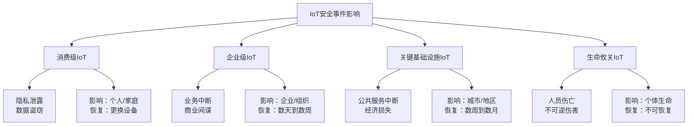

## 实战案例本节小结

### 一、案例全景回顾

本节通过10个真实安全案例，覆盖了IoT安全最核心的五大领域。这不是孤立的漏洞清单，而是一幅完整的IoT威胁全景图——从客厅里的摄像头到工厂里的PLC，从行驶中的汽车到植入人体的医疗设备，每一类IoT系统都面临独特的安全挑战，但它们又共享着惊人相似的攻击模式和防御教训。

以下表格汇总了本节所有案例的关键信息：

| 编号 | 案例领域 | 具体案例 | 时间 | 影响规模 | 核心攻击手法 | 严重程度 |
|------|----------|----------|------|----------|--------------|----------|
| 22.1 | 智能家居 | 智能摄像头漏洞分析 | 2019 | 200万台设备 | 硬编码后门、命令注入、云API漏洞 | 高危 |
| 22.1 | 智能家居 | 蓝牙智能门锁安全研究 | 2020 | 多品牌普遍 | BLE嗅探、重放攻击、固件漏洞 | 高危 |
| 22.1 | 智能家居 | 智能音箱隐私泄露 | 2018-2020 | 数百万用户 | 语音数据收集、网络嗅探、本地漏洞 | 中高危 |
| 22.2 | 工业控制 | Stuxnet震网病毒 | 2010 | 约1000台离心机 | USB传播、零日漏洞利用、PLC代码篡改 | 极高危 |
| 22.2 | 工业控制 | 乌克兰电网攻击 | 2015/2016 | 基辅大面积停电 | 鱼叉钓鱼、BlackEnergy、SCADA远程操控 | 极高危 |
| 22.2 | 工业控制 | Colonial Pipeline勒索 | 2021 | 美国东海岸燃油短缺 | VPN凭据泄露、DarkSide勒索软件 | 极高危 |
| 22.3 | 车联网 | Jeep Cherokee远程攻击 | 2015 | 140万辆车召回 | 蜂窝网络入侵、D-Bus漏洞、CAN注入 | 极高危 |
| 22.3 | 车联网 | Tesla汽车安全研究 | 持续 | 多次Pwn2Own | WiFi攻击、BLE钥匙克隆、OTA劫持 | 高危 |
| 22.4 | 医疗设备 | 心脏起搏器安全漏洞 | 2017 | 46.5万个召回 | 未授权RF通信、固件未验证 | 致命 |
| 22.4 | 医疗设备 | 胰岛素泵安全研究 | 2019 | 多型号受影响 | RF协议嗅探、剂量远程修改 | 致命 |
| 22.5 | IoT僵尸网络 | Mirai僵尸网络 | 2016 | 60万台设备/1.2Tbps | 默认凭据扫描、C2服务器 | 高危 |
| 22.5 | IoT僵尸网络 | Mozi僵尸网络 | 2019 | 数百万设备 | P2P去中心化架构、DHT协议 | 高危 |
| 22.5 | 工业IoT | SCADA系统安全评估 | 实战 | 多个变电站 | Modbus无认证、默认密码、配置错误 | 高危 |
| 22.6 | 医疗IoT | CT扫描仪漏洞分析 | 实战 | 单台设备影响整个医院网络 | DICOM未认证、OS未更新、弱密码 | 高危 |
| 22.7 | 车联网 | 电动汽车远程攻击链 | 实战 | 全型号受影响 | API漏洞→云服务→CAN总线完整链路 | 极高危 |
| 22.8 | 智能家居 | 智能家居生态渗透测试 | 实战 | 整个生态系统 | 语音注入、BLE重放、API遍历 | 高危 |
| 22.9 | 事件响应 | IoT安全事件响应流程 | 方法论 | 所有IoT领域 | 六阶段响应框架 | 基础能力 |

---

### 二、跨领域攻击模式分析

虽然每个案例的攻击对象和手法各不相同，但深入分析后可以提炼出六种反复出现的攻击模式。理解这些模式比记住具体案例更重要——因为攻击对象在变，但攻击模式是恒定的。

#### 2.1 模式一：默认凭证未修改

**出现案例**：智能摄像头、Mirai僵尸网络、SCADA系统评估

这是IoT安全中最基础、最普遍、也最容易预防的漏洞。Mirai僵尸网络的成功完全建立在这一弱点之上——它不需要任何高级技术，只需要一张默认用户名/密码列表就能感染数十万台设备。

```plaintext
默认凭证攻击链：

设备出厂 → 使用admin/admin或root/root → 部署到公网 → 攻击者扫描发现 → 直接登录 → 完全控制

为什么制造商不修复：
├── 用户体验优先：首次配置需要简单流程
├── 成本考虑：强制修改密码需要额外的开发和测试
├── 遗留兼容：已部署设备无法远程修改策略
└── 安全意识不足：制造商本身对安全重视不够
```

**为什么这个问题如此顽固**：制造商面临一个两难选择。强制用户设置复杂密码会增加售后支持成本，而使用默认密码可以大幅降低首次使用门槛。许多用户购买设备后从未修改过默认设置，甚至不知道设备有管理界面。要解决这个问题，需要从法规层面强制要求——ETSI EN 303 645标准第一条就是"不得使用通用默认密码"。

#### 2.2 模式二：通信协议缺乏认证和加密

**出现案例**：智能门锁BLE重放、心脏起搏器RF通信、胰岛素泵剂量篡改、Modbus协议无认证

IoT设备为了降低功耗和延迟，大量使用轻量级通信协议。但"轻量级"往往意味着"安全性缺失"。BLE使用"Just Works"配对模式时完全没有加密，Modbus协议设计时根本没有考虑认证机制，医疗设备的射频通信为了实时性而牺牲了安全性。

```plaintext
协议安全缺陷的层次：

第1层：协议设计缺陷
├── Modbus：原始设计无认证、无加密、无完整性校验
├── Zigbee早期版本：密钥以明文在网络中分发
└── BLE Just Works模式：配对过程无MITM保护

第2层：实现缺陷
├── TLS/DTLS配置不当（弱密码套件、未验证证书）
├── 自定义加密算法存在已知弱点
└── 密钥硬编码在固件中

第3层：运维缺陷
├── 证书过期未更新
├── 密钥从未轮转
└── 禁用安全功能以"方便调试"
```

#### 2.3 模式三：固件安全缺失

**出现案例**：智能摄像头硬编码后门、智能门锁固件漏洞、心脏起搏器固件未签名

固件是IoT设备的"灵魂"，但也是安全最薄弱的环节。大量IoT设备的固件存在硬编码密钥、命令注入后门、缓冲区溢出等问题。更严重的是，许多设备缺乏固件签名验证机制，攻击者可以轻松植入恶意固件。

从本节案例中可以归纳出固件安全的三个核心问题：

| 问题类型 | 案例体现 | 技术根因 | 防御手段 |
|----------|----------|----------|----------|
| 硬编码凭证 | 摄像头后门密码、起搏器后门 | 开发便利性，忘记清除调试凭证 | 固件发布前自动化扫描、SAST工具 |
| 缺乏签名验证 | 起搏器固件更新、OTA劫持 | 硬件资源限制、开发复杂度 | 安全启动链、硬件安全模块 |
| 命令注入漏洞 | 摄像头Web接口 | C语言直接拼接用户输入到shell | 参数化命令、输入校验、最小权限 |

#### 2.4 模式四：云服务/API安全薄弱

**出现案例**：摄像头云API漏洞、T-Box远程控制接口、车联网API IDOR漏洞

IoT设备通常通过云平台实现远程控制和数据存储。但云API的安全性往往被忽视——缺乏认证的API接口、可预测的资源ID（导致IDOR漏洞）、过度授权的访问控制，这些问题让攻击者可以通过互联网直接控制物理设备。

```plaintext
云API攻击的典型路径：

1. 移动App逆向 → 发现API端点和参数格式
2. API探测 → 发现缺乏认证或认证可绕过
3. IDOR遍历 → 访问其他用户的设备数据
4. 命令注入 → 通过API向设备发送恶意指令
5. 物理影响 → 远程开锁/启动车辆/控制摄像头
```

车联网案例中展示的IDOR漏洞特别值得关注：API使用可预测的数字ID（如`/vehicles/1001`到`/vehicles/2000`），攻击者可以遍历所有车辆并发送控制命令。这种漏洞在Web应用中只会导致数据泄露，但在IoT场景中会直接产生物理后果。

#### 2.5 模式五：网络隔离不足

**出现案例**：CT扫描仪接入医院主网络、SCADA防火墙配置错误、智能家居设备未隔离

多个案例表明，IoT设备直接暴露在主网络中是重大安全隐患。CT扫描仪运行着未打补丁的Windows系统，却与医院的患者数据库、HIS系统在同一个网段；SCADA系统的DMZ防火墙规则配置错误，允许未授权的跨区域通信。

```plaintext
正确的IoT网络隔离架构（Purdue模型简化版）：

互联网
│
├── 企业办公网络（Level 4-5）
│   ├── 办公PC、邮件、ERP
│   └── 与IoT网络完全隔离
│
├── IoT管理网络（Level 3）
│   ├── 云平台接入
│   ├── OTA更新服务器
│   └── 安全监控中心
│
├── DMZ区域（Level 2.5）
│   ├── 数据转发网关
│   ├── 协议转换代理
│   └── 工业防火墙
│
└── IoT设备网络（Level 0-2）
    ├── 智能家居设备
    ├── 传感器和执行器
    └── 独立VLAN，仅允许必要通信
```

#### 2.6 模式六：供应链攻击与第三方组件风险

**出现案例**：Stuxnet通过U盘穿越气隙网络、Mozi利用已知漏洞批量感染

供应链攻击是最难防御的攻击类型之一。Stuxnet通过受感染的U盘跨越了物理隔离的气隙网络；大量IoT设备使用存在已知漏洞的第三方库（如旧版BusyBox、OpenSSL），而制造商缺乏及时更新这些组件的能力和意愿。

---

### 三、攻击影响严重性分级

不同领域的IoT安全事件影响差异巨大。以下分级框架帮助理解为什么医疗和工业IoT的安全要求远高于消费级IoT：



| 级别 | 领域 | 最坏后果 | 可接受停机时间 | 安全投入优先级 |
|------|------|----------|----------------|----------------|
| P0-致命 | 医疗植入设备、自动驾驶 | 人员死亡 | 零（必须实时可用） | 最高——安全是产品的前提条件 |
| P1-极高 | 工业控制系统、电网、交通信号 | 大面积公共服务中断、爆炸 | 秒级 | 极高——纵深防御，无单点故障 |
| P2-高 | 车联网、医疗影像、石油管道 | 重大经济损失、局部服务中断 | 分钟到小时级 | 高——核心功能必须有安全保护 |
| P3-中 | 企业IoT（门禁、环境监控） | 业务效率下降、数据泄露 | 小时到天级 | 中——关键功能需要安全措施 |
| P4-低 | 消费级IoT（灯泡、插座） | 个人不便、隐私风险 | 天级 | 基础——基本安全卫生 |

---

### 四、事件响应能力框架

22.9节提出的六阶段事件响应流程是本节的方法论总结。将这个流程与前面的案例对照，可以发现每个真实案例的响应过程都可以映射到这六个阶段中：

```plaintext
六阶段响应流程与案例映射：

┌──────────────────────────────────────────────────────────────┐
│ 阶段1：准备                                                   │
│  案例教训：Colonial Pipeline缺乏MFA → 被泄露的VPN凭据直接利用   │
│  关键行动：建立资产清单、部署监控、制定预案、培训团队              │
├──────────────────────────────────────────────────────────────┤
│ 阶段2：检测与分析                                              │
│  案例教训：乌克兰电网攻击从钓鱼到执行横跨数月，早期检测可阻止      │
│  关键行动：异常设备行为监控、网络流量分析、安全告警响应            │
├──────────────────────────────────────────────────────────────┤
│ 阶段3：遏制                                                   │
│  案例教训：Mirai快速传播——未遏制的僵尸网络每分钟感染数千台设备     │
│  关键行动：隔离受影响设备、阻断恶意连接、禁用受损账户、保护证据    │
├──────────────────────────────────────────────────────────────┤
│ 阶段4：根除                                                   │
│  案例教训：乌克兰2016年Industroyer直接操控协议——必须彻底清除恶意软件│
│  关键行动：识别攻击向量、清除恶意软件、修复漏洞、重置凭据          │
├──────────────────────────────────────────────────────────────┤
│ 阶段5：恢复                                                   │
│  案例教训：乌克兰2015年攻击中固件被覆写，恢复耗时数小时            │
│  关键行动：恢复设备运行、验证修复、持续监控、更新策略              │
├──────────────────────────────────────────────────────────────┤
│ 阶段6：总结                                                   │
│  案例教训：Jeep Cherokee漏洞披露推动了整个汽车行业安全标准制定     │
│  关键行动：编写报告、分析根因、改进措施、更新流程                  │
└──────────────────────────────────────────────────────────────┘
```

**IoT事件响应与传统IT事件响应的关键差异**：

| 维度 | 传统IT事件响应 | IoT事件响应 |
|------|----------------|-------------|
| 恢复手段 | 重装系统、恢复备份 | 固件刷写、物理重置、设备召回 |
| 证据获取 | 磁盘镜像、内存dump | 固件提取、Flash芯片读取、RF信号捕获 |
| 遏制速度 | 网络隔离即可 | 需要物理断电、切断无线通信 |
| 影响范围 | 数据层面 | 数据+物理双层面，可能涉及人身安全 |
| 通知义务 | GDPR/数据保护法 | FDA召回（医疗）、NHTSA召回（汽车）、关键基础设施通报 |
| 恢复验证 | 功能测试 | 功能+安全双重验证，固件完整性校验 |

---

### 五、从案例到方法论——实战安全评估清单

将本节所有案例中暴露的问题汇总为一份可操作的安全评估清单。在对任何IoT系统进行安全评估时，逐项检查：

#### 5.1 设备层评估

```plaintext
□ 固件安全
  ├── □ 是否存在硬编码凭证（用户名、密码、API Key、私钥）
  ├── □ 固件是否经过签名验证（安全启动链完整性）
  ├── □ 固件更新机制是否安全（OTA签名、防降级保护）
  ├── □ 是否使用已知存在漏洞的第三方库
  └── □ 是否包含调试后门（Telnet、SSH、UART控制台）

□ 物理接口安全
  ├── □ UART/JTAG/SWD接口是否在生产固件中禁用
  ├── □ SPI Flash芯片是否可被直接读取
  ├── □ 设备外壳是否有防拆机检测
  └── □ 调试焊点是否在PCB上去除
```

#### 5.2 通信层评估

```plaintext
□ 协议安全
  ├── □ 所有无线通信是否加密（BLE: AES-CCM, Zigbee: AES-128, Wi-Fi: WPA3）
  ├── □ 是否使用安全配对模式（BLE避免"Just Works"，Zigbee使用Install Code）
  ├── □ MQTT/CoAP是否启用TLS/DTLS
  ├── □ 是否存在防重放机制（序列号、时间戳、随机数）
  └── □ 证书是否正确验证（未忽略主机名检查、未接受自签名证书）

□ 网络隔离
  ├── □ IoT设备是否在独立VLAN中
  ├── □ 管理接口是否仅限内网访问
  ├── □ 防火墙规则是否遵循最小权限原则
  └── □ 是否部署了网络入侵检测
```

#### 5.3 云服务/API评估

```plaintext
□ API安全
  ├── □ 所有API端点是否需要认证
  ├── □ 是否使用不可预测的资源ID（避免IDOR）
  ├── □ 是否实施速率限制（防止暴力破解和枚举）
  ├── □ 输入参数是否经过严格校验
  └── □ 敏感操作是否需要二次确认（如远程开锁、修改剂量）

□ 数据安全
  ├── □ 用户数据是否加密存储
  ├── □ 传输是否使用TLS 1.2+
  ├── □ 日志是否脱敏处理
  └── □ 数据保留策略是否合规
```

#### 5.4 运维安全评估

```plaintext
□ 安全运维
  ├── □ 是否有IoT资产清单（设备型号、固件版本、网络位置）
  ├── □ 是否有漏洞响应流程（发现→评估→修复→验证）
  ├── □ 是否有安全监控和告警机制
  ├── □ 是否定期进行安全评估和渗透测试
  └── □ 是否有应急响应计划并定期演练
```

---

### 六、案例对比矩阵——攻击手法与防御对策

将所有案例的攻击手法按技术维度分类，与对应的防御措施形成映射关系：

| 攻击技术 | 涉及案例 | 攻击原理 | 防御措施 | 部署难度 |
|----------|----------|----------|----------|----------|
| 默认凭据利用 | 摄像头、Mirai、SCADA | 扫描→暴力破解→登录 | 强制首次修改密码、禁用默认账户、NIST密码策略 | 低 |
| 硬编码后门利用 | 摄像头、起搏器 | 固件中嵌入通用密码/密钥 | 固件发布前自动化扫描、安全代码审查、SAST | 低 |
| 命令注入 | 摄像头Web接口 | 用户输入直接拼接到shell命令 | 参数化命令、输入白名单校验、最小权限进程 | 低-中 |
| 通信嗅探/重放 | 智能门锁、胰岛素泵、T-Box | 截获明文或弱加密通信并重放 | 强加密、防重放序列号、会话绑定 | 中 |
| 协议漏洞利用 | Modbus、DICOM、CAN总线 | 利用协议设计缺陷（无认证） | 协议升级、外层加密封装、网络层访问控制 | 中-高 |
| API漏洞利用 | 云服务、T-Box、车联网 | IDOR、未授权访问、注入 | 资源鉴权、不可预测ID、API网关限流 | 中 |
| 零日漏洞利用 | Stuxnet（4个零日） | 利用未知漏洞突破隔离网络 | 纵深防御、行为检测、最小化攻击面 | 高 |
| 鱼叉式钓鱼 | 乌克兰电网 | 伪装邮件→恶意附件→初始入侵 | 邮件安全网关、沙箱检测、安全意识培训 | 中 |
| 僵尸网络传播 | Mirai、Mozi | 批量扫描+自动化感染 | 网络准入控制、异常流量检测、设备固件更新 | 中 |
| P2P去中心化C2 | Mozi | 基于DHT的去中心化指挥架构 | DNS/IP封锁、行为分析、设备出站流量管控 | 高 |
| 物理接口利用 | UART控制台、SPI Flash | 物理接触设备→提取固件/获取shell | 禁用调试接口、防拆机封装、加密存储 | 中 |

---

### 七、关键教训提炼

从全部案例中提炼出十条最核心的安全教训。每条教训都对应着真实的安全事件，不是理论推演而是血的教训：

**教训一：安全必须在设计阶段考虑，而非事后修补。** Jeep Cherokee案例中，140万辆车被召回。如果在车载系统设计阶段就实施了网络隔离（CAN总线防火墙），这次攻击根本不可能发生。事后修补的成本是设计阶段安全投入的100倍以上。

**教训二：默认凭证是最大的安全债务。** Mirai利用默认密码感染了60万台设备并发动了1.2Tbps的DDoS攻击。这个漏洞的修复成本为零——只需要在设备初始化时强制用户设置密码。但全球数十亿IoT设备中，仍有大量设备使用出厂默认密码。

**教训三：IoT安全是生命安全问题，不只是数据安全问题。** 心脏起搏器和胰岛素泵的漏洞可以直接导致患者死亡。医疗IoT设备的安全要求必须与其他IoT设备区别对待——它们的安全等级应该等同于航空电子设备，而非消费电子产品。

**教训四：气隙网络不等于绝对安全。** Stuxnet证明了即使在物理隔离的网络中，攻击者仍可通过受感染的移动介质突破隔离。对于关键基础设施，物理安全管控（USB管控、设备管控）与网络安全同等重要。

**教训五：IoT攻击的"涟漪效应"远超传统IT攻击。** Colonial Pipeline的勒索攻击导致美国东海岸燃油短缺，影响了数千万人的生活。一个IoT安全事件可以从数字世界蔓延到物理世界，影响范围呈指数级扩大。

**教训六：云API是IoT安全的新前线。** 随着IoT设备越来越多地依赖云平台，API安全变得至关重要。车联网案例中的IDOR漏洞表明，一个简单的API设计缺陷就可能导致攻击者远程控制数十万辆汽车。

**教训七：协议安全不能依赖"安全通过隐匿"。** 许多IoT设备使用私有协议，制造商认为"别人不知道协议格式就不会被攻击"。但安全研究证明，任何协议都可以被逆向分析。协议安全必须基于标准的加密和认证机制，而非保密。

**教训八：供应链安全是IoT安全的基石。** Stuxnet通过供应链进入气隙网络，大量IoT设备使用存在已知漏洞的开源组件。设备制造商需要建立完整的软件物料清单（SBOM），并持续监控第三方组件的安全状态。

**教训九：事件响应能力决定了损失的上限。** 乌克兰电网在2015年被攻击后，2016年再次被攻击（使用更先进的Industroyer恶意软件）。如果第一次事件后就彻底改进了安全架构，第二次攻击的破坏力会大大降低。每次安全事件都是改进安全体系的机会，但前提是响应流程完善。

**教训十：安全是一个持续过程，不是一次性项目。** 所有案例中的漏洞都不是"修一次就好"的——新漏洞不断被发现，攻击技术不断演进，设备固件需要持续更新，安全策略需要定期评审。IoT安全是一个需要持续投入的长期工程。

---

### 八、跨领域横向对比

将本节覆盖的五大IoT领域进行横向对比，帮助读者理解不同领域的安全侧重点差异：

| 维度 | 智能家居 | 工业控制(ICS) | 车联网 | 医疗IoT | IoT僵尸网络 |
|------|----------|---------------|--------|---------|-------------|
| **主要威胁模型** | 隐私泄露、物理入侵辅助 | 生产中断、设备损坏、人身安全 | 远程控制、人身安全 | 患者生命安全 | DDoS攻击平台 |
| **最大安全挑战** | 设备数量庞大，用户安全意识低 | 遗留系统多，补丁周期长 | 攻击面大（物理+远程+云端） | 安全与实时性的矛盾 | 设备分布全球，清理困难 |
| **通信协议** | Wi-Fi、BLE、Zigbee | Modbus、OPC-UA、Profinet | CAN、LIN、车载以太网 | BLE、RF专有协议 | 多种（被入侵的设备协议） |
| **合规要求** | ETSI EN 303 645 | IEC 62443 | ISO/SAE 21434 | FDA网络安全指南、HIPAA | 各国网络安全法 |
| **攻击后果严重性** | 低-中 | 高-极高 | 高-极高 | 致命 | 中（对攻击目标高） |
| **典型响应时间要求** | 天级 | 小时级 | 分钟级 | 秒级 | 天级（僵尸网络清理） |
| **安全投入占比** | 成本的1-3% | 成本的5-10% | 成本的8-15% | 成本的10-20% | 不适用（防御方投入） |

---

### 九、下一步学习建议

基于本节案例学习的深度，建议按照以下路径继续深化IoT安全能力：

**初级阶段（案例复现）**：选择一个案例，在安全实验环境中复现完整的攻击过程。推荐从Mirai（最容易搭建实验环境）或智能摄像头漏洞分析（硬件需求最低）开始。

**中级阶段（工具链搭建）**：建立自己的IoT安全测试工具链。硬件方面准备USB转TTL、逻辑分析仪、SDR设备；软件方面熟练使用binwalk、Ghidra、Wireshark、nmap。在DVID（Damn Vulnerable IoT Device）靶机上练习全套测试流程。

**高级阶段（漏洞研究）**：选择一个真实的IoT设备进行深度安全研究。从固件提取开始，到静态分析、动态调试、漏洞验证，最终形成完整的漏洞报告。目标是提交一个CVE编号的漏洞。

**专家阶段（体系设计）**：从攻击视角转向防御视角，学习如何为IoT系统设计完整的安全架构。研究ETSI EN 303 645、IEC 62443、NIST IR 8259等标准，理解安全要求如何转化为技术实现。

```plaintext
学习资源速查：

实践平台：
├── DVID（Damn Vulnerable IoT Device）— 开源IoT安全练习硬件
├── IoTGoat — OWASP出品的IoT安全练习固件
├── EMBA — 固件安全分析自动化平台
└── FirmAE — 固件模拟和漏洞验证环境

核心工具：
├── 固件分析：binwalk、firmwalker、Firmware-Mod-Kit
├── 逆向工程：Ghidra、IDA Pro、Radare2
├── 协议分析：Wireshark、MQTT Explorer、nRF Connect
├── 硬件调试：OpenOCD、minicom、flashrom
└── 无线安全：Ubertooth、KillerBee、HackRF

标准与指南：
├── OWASP IoT Testing Guide — 系统化测试方法论
├── ETSI EN 303 645 — 消费类IoT安全基线
├── NIST IR 8259 — IoT设备安全能力基线
└── IEC 62443 — 工业控制系统安全标准
```

---

### 十、本节核心观点

本节通过17个具体案例证明了一个核心观点：**IoT安全不是某个单点技术问题，而是涉及物理安全、通信安全、固件安全、云服务安全、运维安全的系统工程。** 攻击者不会只在一个维度上发起攻击——Stuxnet综合使用了USB传播、零日漏洞、PLC代码篡改和供应链攻击；Jeep Cherokee的攻击链跨越了蜂窝网络、Linux系统、D-Bus服务和CAN总线四个完全不同的技术栈。

防御IoT安全威胁，必须采用纵深防御策略：在物理层禁用调试接口，在固件层实施安全启动，在通信层强制加密认证，在云端层严格访问控制，在运维层持续监控响应。任何一层的缺失都可能成为攻击者的突破口——而IoT安全的特殊性在于，这个突破口可能直接通向物理世界。

这些案例不是历史故事，而是仍在发生的现实。Mirai的变种至今仍在互联网上活跃，医疗设备的漏洞仍在被发现和修补，工业控制系统的安全事件仍在不断升级。学习这些案例的意义不仅在于了解过去发生了什么，更在于理解未来还会发生什么——以及如何在它发生之前做好准备。

---

*案例分析是理解安全的最有效方式。每一个真实的安全事件都凝聚了攻击者的智慧和防御者的教训。将这些案例中的知识内化为自己的安全直觉，是从初学者成长为安全专家的必经之路。*
