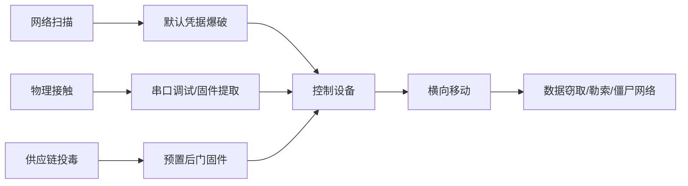
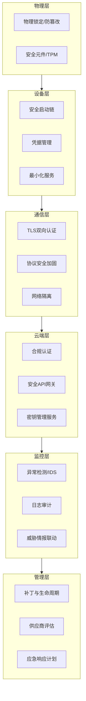
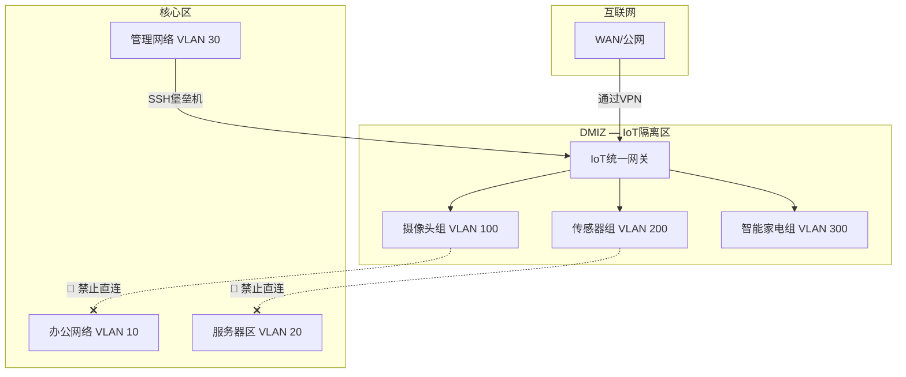
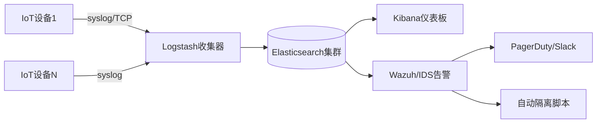

## 22.4 IoT安全防护最佳实践

IoT安全防护不是单一技术的堆砌，而是一套**纵深防御体系**。据IBM X-Force《2025年威胁情报指数》报告，IoT设备已成为企业网络中最薄弱的入侵点之一——超过57%的企业网络攻击事件涉及IoT设备作为突破口。本章从设备配置、网络架构、固件安全、持续监控到管理体系，提供完整的实战指南。

### 22.4.1 IoT安全威胁全景

在深入防护措施之前，先理解攻击者针对IoT系统的典型攻击链：



**IoT系统面临的六大核心威胁：**

| 威胁类型 | 典型手法 | 后果等级 | 常见目标设备 |
|---------|---------|---------|-------------|
| 暴力破解与凭据攻击 | 字典爆破默认密码 | ⭐⭐⭐⭐⭐ | 摄像头、路由器、门禁 |
| 固件逆向与后门植入 | UART/jtag提取固件 → 反汇编 | ⭐⭐⭐⭐⭐ | 所有闪存式设备 |
| 协议漏洞利用 | MQTT/CoAP无认证注入 | ⭐⭐⭐⭐ | 传感器、智能家居Hub |
| 供应链攻击 | 恶意固件预装 | ⭐⭐⭐⭐⭐ | ODM/OEM贴牌设备 |
| 僵尸网络DDoS | Mirai及其变种 | ⭐⭐⭐⭐ | 摄像头、DVR、路由器 |
| 物理侧信道攻击 | 时序分析、电磁辐射、电压毛刺 | ⭐⭐⭐ | 支付终端、医疗设备 |

> **关键数据**：根据Shodan搜索引擎统计，全球暴露在公网的IoT设备超过5000万台，其中约12%仍在使用Telnet服务，约8%使用默认凭据。OWASP IoT Top 10（2024版）将"弱/默认凭据"列为第一风险。

### 22.4.2 纵深防御架构设计

IoT安全应遵循**七层纵深防御**模型：



每一层都不可或缺。以下逐层详解具体实施方案。

### 22.4.3 设备安全配置（设备层）

#### 22.4.3.1 强密码策略——第一道防线

弱密码是IoT设备被攻破的头号原因。2016年Mirai僵尸网络通过65个常见密码（如"admin/admin"、"root/12345"）感染了超过60万台设备，发起了峰值620Gbps的DDoS攻击。

**密码设计规范：**

| 维度 | 最低要求 | 推荐标准 |
|------|---------|---------|
| 长度 | ≥ 8字符 | ≥ 16字符（管理员）、≥ 12字符（普通用户） |
| 字符集 | 大小写+数字 | 大小写+数字+特殊字符+Unicode（如支持） |
| 唯一性 | 每个设备不同 | 使用密码管理器自动生成 |
| 轮换周期 | 90天 | 30-60天（高风险环境） |
| 存储 | 明文/弱哈希（禁止） | bcrypt/argon2 + 盐值 |

**bash脚本：批量验证设备密码强度**
```bash
#!/bin/bash
# password_audit.sh — 批量检查IoT设备密码强度
# 依赖: sshpass, ssh 客户端

DEVICE_LIST="devices.txt"
PASSWORD_LIST="common_weak.txt"
OUTPUT_FILE="weak_devices.csv"

echo "device_ip,username,password,risk_level" > "$OUTPUT_FILE"

while IFS=, read -r IP USER PASS; do
    # 检查是否使用弱密码
    if grep -qFx "$PASS" "$PASSWORD_LIST"; then
        echo "$IP,$USER,$PASS,HIGH" >> "$OUTPUT_FILE"
        echo "[WARNING] $IP 使用弱密码: $PASS"
    fi
    # 检查密码长度
    if [ ${#PASS} -lt 12 ]; then
        echo "$IP,$USER,$PASS,MEDIUM" >> "$OUTPUT_FILE"
        echo "[WARN] $IP 密码长度不足12字符"
    fi
done < "$DEVICE_LIST"

echo "审计完成，结果保存在 $OUTPUT_FILE"
```

**密码管理器推荐对比：**

| 工具 | 开源 | 自托管 | 支持TOTP | 支持CLI | 价格 |
|------|------|--------|---------|--------|------|
| Bitwarden | ✅ | ✅ | ✅ | ✅ | 免费/付费 |
| 1Password | ❌ | ❌ | ✅ | ❌ | $2.99/月 |
| KeePassXC | ✅ | ✅ | ❌ | ✅ | 免费 |
| Pass（Linux） | ✅ | ✅ | ❌ | ✅ | 免费 |
| Vaultwarden | ✅ | ✅ | ✅ | ✅ | 免费自托管 |

> **核心原则**：人类无法记忆超过20个安全密码。对于超过5台IoT设备的场景，必须使用密码管理器。

#### 22.4.3.2 禁用不必要的服务——缩小攻击面

每多一个开放端口，就多一个被攻破的可能。一个默认配置的路由器可能开启Telnet（23）、FTP（21）、HTTP（80）、UPnP（1900）、SNMP（161）等服务，攻击面巨大。

**服务裁剪清单：**

| 服务 | 风险 | 建议操作 | 替代方案 |
|------|------|---------|---------|
| Telnet | 明文传输密码 | ❌ 禁用 | SSHv2 |
| FTP | 明文传输+匿名访问 | ❌ 禁用 | SFTP/SCP |
| UPnP | 无认证端口映射 | ❌ 禁用 | 手动端口转发 |
| WPS | PIN码可暴力破解 | ❌ 禁用 | 蓝牙/WiFi Direct |
| SNMP v1/v2c | 明文Community String | ❌ 禁用 | SNMP v3 |
| HTTP管理面板 | CSRF+MITM风险 | ⚠️ 仅本地访问 | HTTPS Only |
| Telnet-Debug | 无需认证的后门 | ❌ 禁用 | 仅物理串口 |

**自动化服务扫描脚本：**
```bash
#!/bin/bash
# service_audit.sh — 扫描并报告不必要的服务

TARGET=$1
PORTS_SAFE="22,443"
PORTS_RISKY="21,23,80,161,1900,5000"
REPORT_FILE="service_report_$TARGET.txt"

echo "====== 服务审计报告: $TARGET ======" > "$REPORT_FILE"
echo "扫描时间: $(date)" >> "$REPORT_FILE"

# 扫描危险端口
for PORT in $(echo $PORTS_RISKY | tr ',' ' '); do
    if nc -z -w3 "$TARGET" "$PORT" 2>/dev/null; then
        echo "[HIGH] 危险端口开放: $PORT" >> "$REPORT_FILE"
        echo "  建议: 立即关闭此端口"
    fi
done

# 列出所有开放端口
echo -e "\n所有开放端口:" >> "$REPORT_FILE"
nmap -T4 -p- --min-rate=1000 "$TARGET" 2>/dev/null | grep "open" >> "$REPORT_FILE"

echo "报告生成完毕: $REPORT_FILE"
```

#### 22.4.3.3 物理安全——被忽视的第一层

当攻击者可以物理接触设备时，所有软件防护都形同虚设。物理安全是IoT特有的挑战——设备部署在无人值守的环境中。

**物理防护措施分级：**

| 级别 | 措施 | 对抗目标 | 成本 |
|------|------|---------|------|
| 基础 | 螺丝锁、防拆贴纸 | 临时好奇者 | < $5 |
| 中级 | 安全螺丝（Torx/Tri-wing） | 业余攻击者 | < $20 |
| 高级 | UART/JTAG接口熔断 | 专业逆向工程师 | < $2（固件级） |
| 企业级 | TPM芯片+壳体入侵检测 | 国家/组织级攻击 | $10-50 |

**关键命令：通过固件熔断调试接口**
```bash
# 在固件编译时禁用UART控制台
# Linux内核配置
CONFIG_SERIAL_8250_CONSOLE=n
CONFIG_SERIAL_8250=n

# 主动熔断JTAG保险丝（以ESP32为例）
# 注意：此操作不可逆！
espefuse.py --port /dev/ttyUSB0 burn_efuse JTAG_DISABLE
```

### 22.4.4 网络安全架构（通信层）

#### 22.4.4.1 网络隔离——VLAN + 微隔离

IoT设备不应该与企业核心网络处于同一平面。网络隔离策略是防止"一台摄像头被攻破，整网沦陷"的关键。

**三层隔离模型：**



**OpenWrt/iStoreOS VLAN配置示例（基于DSA架构）：**
```bash
# /etc/config/network — VLAN划分
config device
    option name 'switch0'
    option ports '0 1 2 3 4'

config bridge-vlan
    option device 'switch0'
    option vlan '10'    # 办公网络
    option ports '0t 1'
    
config bridge-vlan
    option device 'switch0'
    option vlan '100'   # IoT摄像头
    option ports '0t 2'
    
config bridge-vlan
    option device 'switch0'
    option vlan '200'   # IoT传感器
    option ports '0t 3'

# 防火墙规则：禁止IoT VLAN → 办公VLAN
# /etc/config/firewall
config rule
    option name 'Deny-IoT-to-Corp'
    option src 'iot'
    option dest 'corp'
    option proto 'all'
    option target 'DROP'
```

**华为/企业级交换机ACL配置：**
```bash
# 创建ACL规则
acl number 3000
 rule 5 deny ip source 192.168.100.0 0.0.0.255 destination 10.0.0.0 0.0.0.255
 rule 10 permit ip source 192.168.100.0 0.0.0.255 destination any

# 应用到接口
interface GigabitEthernet0/0/1
 traffic-filter inbound acl 3000
```

> **设计原则**：IoT设备只能与"必要的服务端"通信。典型规则——摄像头只允许向NVR（网络视频录像机）和NTP服务器发出连接，不允许主动连接互联网。

#### 22.4.4.2 加密通信——TLS/mTLS + 证书管理

明文通信是IoT第二大安全漏洞。MQTT、CoAP、HTTP等IoT核心协议必须在TLS之上运行。

**协议栈安全对比：**

| 协议 | 默认端口 | 明文版本 | 安全版本 | 安全配置要点 |
|------|---------|---------|---------|-------------|
| MQTT | 1883/8883 | 无认证 | MQTT over TLS + 双向证书 | `require_certificate true` |
| HTTP/HTTPS | 80/443 | 明文传输 | HTTPS + HSTS | 禁用SSLv3/TLS 1.0/1.1 |
| CoAP | 5683/5684 | UDP明文 | CoAP over DTLS | PSK或证书交换 |
| Modbus | 502 | 完全明文 | Modbus/TCP Security | 用TLS封装或VPN隧道 |

**Mosquitto MQTT Broker强化配置示例：**
```ini
# /etc/mosquitto/mosquitto.conf — 安全强化版
# ========== 监听器配置 ==========
listener 8883
protocol mqtt

# TLS证书
cafile /etc/mosquitto/certs/ca.crt
certfile /etc/mosquitto/certs/server.crt
keyfile /etc/mosquitto/certs/server.key

# 强制TLS 1.2+（禁用1.0/1.1）
tls_version tlsv1.2

# 仅允许密码强度A级套件
ciphers ECDHE-ECDSA-AES128-GCM-SHA256:ECDHE-RSA-AES128-GCM-SHA256

# 双向认证：客户端也必须提供可信证书
require_certificate true
use_identity_as_username true

# ========== 访问控制 ==========
# 禁止匿名访问
allow_anonymous false

# 基于ACL的细粒度权限
# /etc/mosquitto/acl.conf
acl_file /etc/mosquitto/acl.conf

# ========== 安全增强 ==========
# 限制并发连接数
max_connections 1000

# WebSocket加密版本
listener 8083
protocol websockets
```

**ACL文件（最小权限原则）：**
```ini
# /etc/mosquitto/acl.conf
# 每个客户端只允许操作自己的主题

# 传感器：只能发布
pattern write sensor/%u/data
pattern read sensor/%u/config

# 控制器：只能订阅和处理
pattern read sensor/+/data
pattern write actuator/%u/control

# 管理员：完全控制
user admin
topic readwrite #
```

#### 22.4.4.3 防火墙与流量控制

**iptables/nftables基线的生产级规则：**
```bash
#!/bin/bash
# iot_firewall.sh — IoT设备防火墙规则集

# 默认策略：拒绝所有（白名单模式）
iptables -P INPUT DROP
iptables -P FORWARD DROP
iptables -P OUTPUT DROP

# 环回接口允许
iptables -A INPUT -i lo -j ACCEPT
iptables -A OUTPUT -o lo -j ACCEPT

# 已建立的连接放行
iptables -A INPUT -m conntrack --ctstate ESTABLISHED,RELATED -j ACCEPT
iptables -A OUTPUT -m conntrack --ctstate ESTABLISHED,RELATED -j ACCEPT

# 允许NTP时间同步（IoT设备需要）
iptables -A OUTPUT -p udp --dport 123 -j ACCEPT

# 允许DNS解析
iptables -A OUTPUT -p udp --dport 53 -j ACCEPT
iptables -A OUTPUT -p tcp --dport 53 -j ACCEPT

# 允许固件更新（白名单URL）
iptables -A OUTPUT -d firmeware-update.vendor.com -p tcp --dport 443 -j ACCEPT

# 允许MQTT Broker连接（仅指定Broker）
iptables -A OUTPUT -d 10.10.1.100 -p tcp --dport 8883 -j ACCEPT

# SSH管理（仅堡垒机）
iptables -A INPUT -s 10.10.0.0/24 -p tcp --dport 22 -j ACCEPT

# 记录并丢弃其余流量
iptables -A INPUT -j LOG --log-prefix "IoT-BLOCKED_INPUT: "
iptables -A INPUT -j DROP
iptables -A OUTPUT -j LOG --log-prefix "IoT-BLOCKED_OUTPUT: "
iptables -A OUTPUT -j DROP

# 保存规则
iptables-save > /etc/iptables/rules.v4
```

### 22.4.5 固件与软件安全（固件层）

#### 22.4.5.1 安全启动链

安全启动（Secure Boot）确保设备只运行经过签名的固件。从BootROM到操作系统内核，每一级都验证下一级的数字签名。

**签名验证流程：**
```bash
# 1. 生成签名密钥对（只在安全环境中执行一次）
openssl ecparam -genkey -name prime256v1 -out secure_boot_private.pem
openssl ec -in secure_boot_private.pem -pubout -out secure_boot_public.pem

# 2. 对固件进行签名
# sha256哈希 → 使用私钥签名
openssl dgst -sha256 -sign secure_boot_private.pem -out firmware.bin.sig firmware.bin

# 3. 设备端验证（在BootROM执行）
# 公钥熔断在芯片一次性可编程(OTP)存储中
openssl dgst -sha256 -verify secure_boot_public.pem \
    -signature firmware.bin.sig firmware.bin

# 验证通过 → 加载固件；验证失败 → 强制进入恢复模式
```

#### 22.4.5.2 固件更新机制

**OTA更新安全框架：**

| 阶段 | 安全要求 | 检查项 |
|------|---------|--------|
| 发布 | 数字签名 | 使用硬件安全模块(HSM)签名 |
| 分发 | HTTPS/CDN | 使用证书锁定（Certificate Pinning） |
| 下载 | 完整性校验 | sha256签名验证 |
| 安装 | 防回滚 | 版本号递增检查，禁止降级 |
| 回退 | 安全恢复 | 保留至少2个已知良好版本 |

**OTA更新脚本示例（基于ESP-IDF）：**
```c
// 固件更新验证逻辑伪代码
typedef struct {
    uint32_t version;          // 版本号，单调递增
    uint8_t  signature[64];    // ECDSA签名
    uint8_t  hash[32];         // sha256固件哈希
    uint32_t firmware_size;    // 固件大小
} firmware_header_t;

int verify_update(const uint8_t* firmware, size_t size) {
    firmware_header_t* hdr = (firmware_header_t*)firmware;
    
    // 1. 防回滚检查：新版本必须 > 当前版本
    if (hdr->version <= current_version) {
        return ERROR_ROLLBACK_DETECTED;
    }
    
    // 2. 验证固件哈希
    uint8_t calculated_hash[32];
    sha256(firmware + sizeof(firmware_header_t), 
           size - sizeof(firmware_header_t), 
           calculated_hash);
    if (memcmp(calculated_hash, hdr->hash, 32) != 0) {
        return ERROR_HASH_MISMATCH;
    }
    
    // 3. 验证签名（使用熔断的公钥）
    if (!ecdsa_verify(pubkey_otp, firmware, sizeof(firmware_header_t))) {
        return ERROR_SIGNATURE_INVALID;
    }
    
    // 全部通过 → 安装更新
    return SUCCESS;
}
```

#### 22.4.5.3 安全开发生命周期（S-SDLC）

固件安全要"左移"——在开发阶段引入安全，而非发布后补丁。

**IoT S-SDLC节点：**

1. **需求阶段**：威胁建模（STRIDE/LINDDUN）
2. **设计阶段**：安全架构评审 + 攻击树分析
3. **开发阶段**：静态代码扫描（SAST）+ 依赖项审计
4. **测试阶段**：动态分析（DAST）+ 模糊测试（fuzzing）
5. **发布阶段**：第三方安全审计 + 签名发布
6. **运维阶段**：漏洞监控 + 应急响应

**常用安全工具：**
```bash
# 静态代码分析 — C/C++固件
# cppcheck: 检测缓冲区溢出、未初始化变量
cppcheck --enable=all --std=c99 --inconclusive firmware/src/

# Flawfinder: 检测不安全函数（strcpy、sprintf等）
flawfinder --minlevel=2 firmware/src/

# 依赖项审计 — 嵌入式Linux
# 检查CVE
cve-check-tool -cve-db /var/cve-db firmware/buildroot/output/

# 二进制固件分析
binwalk -Me firmware.bin            # 解包查看文件系统
firmwalker firmware.extracted/      # 扫描敏感信息（硬编码密码、密钥等）
```

### 22.4.6 监控与日志（监控层）

#### 22.4.6.1 日志集中化管理

IoT设备日志是企业SOC的"盲区"。必须构建端到端的可见性管道。

**ELK Stack + Wazuh架构：**



**rsyslog配置（IoT设备侧）：**
```bash
# /etc/rsyslog.conf — 实时上报关键事件
# 模块加载
module(load="imuxsock")
module(load="imklog")

# 定义模板，包含设备标识
template(name="iot_template" type="string"
    string="<%PRI%>%TIMESTAMP% %HOSTNAME% iot[%syslogtag%]: %msg%\n")

# 本地日志
*.* /var/log/iot.log

# 远程日志服务器（TLS加密）
*.* @@logserver.internal:6514;iot_template

# 仅上报关键事件到SOC
*.emerg,*.alert,*.crit @@soc.internal:6514;iot_template
```

**关键监控指标看板：**

| 指标 | 正常范围 | 告警阈值 | 含义 |
|------|---------|---------|------|
| 登录失败次数/小时 | 0-5 | > 20 | 暴力破解进行中 |
| 异常出站连接数/小时 | 0-10 | > 50 | 数据外传/僵尸网络活动 |
| CPU利用率 | < 60% | > 90% | 挖矿程序/异常进程 |
| 固件版本分布 | 100%一致 | < 80% | 大量设备未更新 |
| 证书过期倒计时 | > 30天 | < 7天 | 通信即将中断 |

#### 22.4.6.2 入侵检测与响应

**Suricata IoT规则集示例：**
```bash
# /etc/suricata/rules/iot.rules

# 检测Mirai变种扫描行为
alert tcp $HOME_NET any -> $EXTERNAL_NET any \
    (msg:"MIRAIR VAR扫描 — 常见IoT凭据探测"; \
     content:"admin"; depth:5; \
     content:"root"; distance:0; \
     classtype:attempted-recon; \
     sid:1000001; rev:1;)

# 检测异常MQTT发布频率
alert tcp $HOME_NET any -> $MQTT_BROKER 8883 \
    (msg:"MQTT异常 — 高频发布（可能DDoS）"; \
     flow:to_server; \
     threshold: type both, track by_src, count 100, seconds 60; \
     classtype:attempted-dos; \
     sid:1000002; rev:1;)

# 检测固件下载以外的HTTP请求
alert tcp $IOT_NET any -> $EXTERNAL_NET 80 \
    (msg:"IoT非法HTTP — 非更新URL的出站请求"; \
     content:"!Host: firmware-update.vendor.com"; \
     nocase; \
     sid:1000003; rev:1;)
```

**应急响应自动化脚本：**
```bash
#!/bin/bash
# isolate_iot_device.sh — 在检测到入侵时自动隔离设备

DEVICE_IP=$1

if [ -z "$DEVICE_IP" ]; then
    echo "用法: $0 <设备IP>"
    exit 1
fi

echo "[$(date)] 开始隔离设备 $DEVICE_IP ..."

# 第一步：iptables阻断
iptables -A FORWARD -s "$DEVICE_IP" -j DROP
iptables -A FORWARD -d "$DEVICE_IP" -j DROP
echo "[+] iptables规则已添加"

# 第二步：ARP表操作（防止ARP欺骗残留）
arp -d "$DEVICE_IP"

# 第三步：记录事件
logger -t IOT-IDS -p local0.emerg \
    "设备自动隔离: $DEVICE_IP — 检测到异常行为"

# 第四步：通知管理员
cat <<EOF | mail -s "⚠️ IoT设备隔离告警" security-team@company.com
设备IP: $DEVICE_IP
隔离时间: $(date)
原因: Suricata IDS告警触发自动隔离
请立即调查并确认是否需要恢复。
EOF

echo "[✓] 设备 $DEVICE_IP 已隔离。恢复命令: iptables -D FORWARD -s $DEVICE_IP -j DROP"
```

### 22.4.7 安全管理体系（管理层）

#### 22.4.7.1 供应商安全评估

企业采购IoT设备时，应对供应商提出安全要求：

| 评估维度 | 关键检查项 | 最低要求 |
|---------|-----------|---------|
| 安全认证 | CE、FCC、UL | ⚠️ IEC 62443-4-x (工业IoT) 或 ETSI EN 303 645 (消费IoT) |
| 漏洞响应 | CVE披露策略、响应时间 | 90天内修复严重漏洞 |
| 固件签名 | 签名算法 | ECDSA P-256 或 RSA 2048+ |
| 更新机制 | OTA更新 | 自动更新 + 安全回滚 |
| 数据隐私 | 数据收集范围 | 最小化采集 + 本地处理 |
| 源代码审查 | 第三方组件清单(SBOM) | 必须提供SBOM |

**SBOM（软件物料清单）模板示例：**
```json
{
  "bomFormat": "CycloneDX",
  "specVersion": "1.5",
  "version": 1,
  "metadata": {
    "component": {
      "name": "smart-camera-firmware",
      "version": "2.4.1",
      "type": "firmware"
    }
  },
  "components": [
    {
      "name": "Linux Kernel",
      "version": "5.10.168",
      "licenses": [{"license": {"id": "GPL-2.0-only"}}],
      "supplier": {"name": "kernel.org"}
    },
    {
      "name": "OpenSSL",
      "version": "1.1.1w",
      "licenses": [{"license": {"id": "OpenSSL"}}]
    },
    {
      "name": "BusyBox",
      "version": "1.36.1",
      "licenses": [{"license": {"id": "GPL-2.0-only"}}]
    }
  ]
}
```

#### 22.4.7.2 合规与法规要求

不同地区和行业对IoT安全有明确的合规要求：

| 标准/法规 | 适用范围 | 核心要求 | 罚则 |
|-----------|---------|---------|------|
| **ETSI EN 303 645** | 欧盟消费IoT | 无默认密码、漏洞披露政策、软件更新、安全存储 | CE标识必要条件 |
| **IEC 62443** | 全球工业IoT | 角色分离、安全级别SL1-SL4、纵深防御 | 合同要求 |
| **GB/T 37027** | 中国IoT安全 | 设备认证、数据加密、安全审计 | 责令整改/罚款 |
| **NIST SP 800-213** | 美国联邦政府 | IoT设备IRM、风险评估、供应链安全 | 采购准入条件 |
| **加州SB-327** | 美国加州 | IoT设备必须配备合理安全特性 | $2500/次违规 |

### 22.4.8 常见误区与纠正

| 误区 | 事实 | 纠正措施 |
|------|------|---------|
| "我的设备在NAT后面，公网扫不到" | NAT不是安全措施，UPnP/局域网设备也能被内网渗透 | 即使在内网也要加密+隔离 |
| "我的摄像头只是内部用，没人攻击" | 一旦进入内网，就是横向移动的跳板 | 所有设备按暴露面分级防护 |
| "固件有密码保护就够了" | 固件密码可被binwalk绕过提取 | 必须使用加密固件+安全启动 |
| "更新固件太麻烦，不更新更稳定" | 已知漏洞比不稳定的新功能更危险 | 建立强制更新策略和测试环境 |
| "IoT设备跑不了杀毒软件" | 确实如此，所以需要其他防御手段 | 网络层IDS + 行为基线检测 |
| "供应商说安全，肯定安全" | 90%的IoT漏洞是供应商默认配置所致 | 独立验证所有安全声明 |

### 22.4.9 进阶：零信任架构在IoT中的应用

传统边界安全模型（内网安全/外网危险）在IoT时代已经失效。零信任架构（Zero Trust Architecture, ZTA）的核心原则对IoT尤其适用：

**零信任三大原则在IoT中的落地：**

1. **持续验证**：永远不信任设备身份，每次通信都要重新验证。使用mTLS证书而非IP白名单。

2. **最小权限**：每个设备只获得"刚够用"的权限。摄像头只能推流到NVR，传感器只能上传数据到Broker。

3. **假设失陷**：假设任何设备都可能被攻破。对所有流量进行加密、审计和深度检测，不信任网络位置。

**零信任IoT网关实现模式：**
```yaml
# 零信任策略示例（基于OPA/Rego）
# 每次设备请求都需要通过策略引擎评估

allow {
    # 已知设备
    device.trust_level >= 3
    # 在允许的时间窗口
    time.now >= device.allowed_time_start
    time.now <= device.allowed_time_end
    # 访问目标在白名单内
    request.destination in device.allowed_destinations
    # 设备证书未过期
    device.cert_expiry > time.now
}
```

### 22.4.10 总结构建持续安全能力

IoT安全不是一次性配置，而是**持续演进**的过程。按照以下阶段逐步建设：

| 阶段 | 周期 | 目标 | 关键里程碑 |
|------|------|------|-----------|
| P0 — 紧急止血 | 0-30天 | 消除最明显的安全缺口 | 禁Telnet/FTP、改默认密码、隔离网络 |
| P1 — 基线建设 | 30-90天 | 建立安全管理体系 | 密码管理器、VLAN划分、日志收集 |
| P2 — 纵深防御 | 90-180天 | 构建多道防线 | mTLS、安全启动、IDS部署 |
| P3 — 持续优化 | 180天+ | 自动化安全运营 | SCAP合规扫描、自动隔离、威胁情报联动 |

> **黄金法则**：安全方案需要同时满足三个条件——①技术上可行（设备能跑得动）、②业务上可接受（不影响核心功能）、③运维上可持续（有资源维护）。过度安全导致业务受阻的方案最终会被绕过。找到安全与可用性之间的平衡点，才是可落地的安全策略。