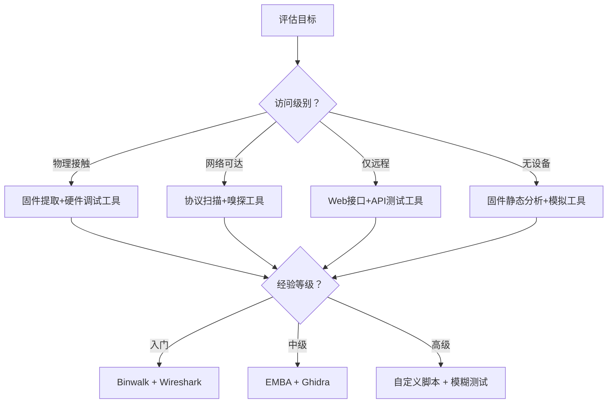
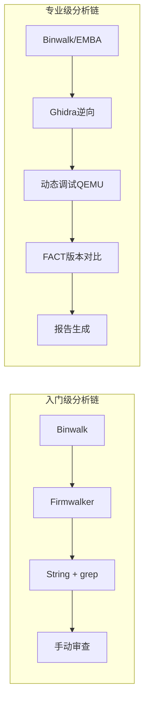
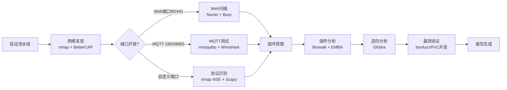

## 22.5 IoT安全工具集

IoT安全研究涉及面极广——从物理层的硬件分析到应用层的Web接口渗透，从无线协议的嗅探到固件的逆向工程。没有任何单一工具能覆盖所有场景。本章梳理了一套**分级递进的工具矩阵**，从入门到专业级，按使用场景分类，并给出安装、配置和实战运用的完整指引。

据Palo Alto Networks《2025年Unit 42 IoT威胁报告》统计，超过86%的IoT攻击利用了已知漏洞和默认凭据——这意味着正确使用安全工具进行基线评估，就能阻断绝大部分攻击路径。本章工具集是你构建自动化安全评估流水线的基础。

### 22.5.1 工具选择框架

在深入具体工具前，先建立一套系统化的选择逻辑。工具选型取决于三个维度：

| 维度 | 要素 | 决策问题 |
|------|------|----------|
| 访问级别 | 物理接触 / 网络可达 / 远程仅限 / 无设备 | 你能接触到设备的什么层面？ |
| 评估目标 | 漏洞发现 / 协议分析 / 固件逆向 / 合规审计 | 你想证明或发现什么？ |
| 经验等级 | 入门 / 中级 / 高级 / 专家 | 你掌握多少底层知识？ |

**工具选型决策流程：**



### 22.5.2 固件分析与逆向工具

| 工具 | 类型 | 适用阶段 | 学习曲线 | ⭐ 评分 |
|------|------|---------|---------|--------|
| Binwalk | 固件提取与分析 | 前期扫描 | ★☆☆☆☆ | 4.8/5 |
| Firmwalker | 固件安全扫描 | 静态分析 | ★★☆☆☆ | 4.2/5 |
| FACT (Firmware Analysis Comparison Tool) | 固件批量比对 | 版本对比 | ★★★☆☆ | 4.5/5 |
| EMBA (Embedded Analyzer) | 全自动固件审计 | 深度评估 | ★★★☆☆ | 4.7/5 |
| Ghidra | 逆向工程平台 | 代码级逆向 | ★★★★☆ | 4.9/5 |
| Radare2 / rizin | 二进制分析框架 | 渗透式逆向 | ★★★★★ | 4.6/5 |

#### Binwalk——固件分析入门利器

**用途：** 扫描固件二进制文件，识别嵌入的文件系统（SquashFS、JFFS2、CramFS等）、引导加载程序、压缩算法和嵌入式映像。

**安装：**
```bash
# 方式一：通过pip安装（推荐）
pip3 install binwalk

# 方式二：源码安装（获取最新功能）
git clone https://github.com/ReFirmLabs/binwalk
cd binwalk
sudo python3 setup.py install

# 方式三：使用Docker（隔离环境）
docker pull refirmlabs/binwalk
```

**核心用法与参数解析：**
```bash
# 1. 基本扫描——识别固件中的文件系统和嵌入式组件
binwalk firmware.bin

# 2. 自动提取所有识别到的文件系统
binwalk -e firmware.bin
# 输出到 _firmware.bin.extracted/ 目录

# 3. 递归提取——对提取出的文件继续分析（嵌套固件特别有用）
binwalk -eM firmware.bin

# 4. 指定提取签名（例如只提取SquashFS）
binwalk -D 'squashfs:squashfs' firmware.bin

# 5. 熵分析——识别加密或压缩区域
binwalk -E firmware.bin

# 6. 对比两份固件版本差异（FACT替代方案）
binwalk -W firmware_v1.bin firmware_v2.bin
```

**实战场景：** 在分析某款IPC（IP摄像头）固件时，`binwalk`自动识别出：
```text
DECIMAL       HEXADECIMAL     DESCRIPTION
----------------------------------------------
0             0x0             uImage header, header size: 64 bytes
64            0x40            LZMA compressed data, properties: 0x5D
1310720       0x140000        SquashFS filesystem, little endian, version 4.0
6291456       0x600000        JFFS2 filesystem, little endian
```

通过 `-e` 参数提取出SquashFS后，直接看到 `/usr/bin/webd` ——一个未文档化的HTTP后台服务，监听8080端口，这是后续漏洞挖掘的关键入口。

#### EMBA——全自动固件安全审计

EMBA由Siemens安全研究团队开发，是目前最全面的自动化固件安全分析框架，集成了超过100条检测规则。

**安装：**
```bash
# EMBA推荐在Ubuntu 22.04/24.04上安装
git clone https://github.com/e-m-b-a/emba.git
cd emba
sudo ./installer.sh -F  # 完全安装（约15分钟，需科学上网）
```

**运行模式对比：**

| 模式 | 命令 | 耗时 | 适用场景 |
|------|------|------|---------|
| 快速模式 | `./emba -l ./log -f firmware.bin -t` | 5-10分钟 | 日常快速检查 |
| 完整模式 | `./emba -l ./log -f firmware.bin` | 30-60分钟 | 深度安全审计 |
| 增量模式 | `./emba -l ./log -f firmware.bin -i` | 可变 | 已分析过的固件更新版 |

**典型输出解读：**
```bash
# 运行完整模式
sudo ./emba -l ./log/my_router -f ./firmware.bin

# 结果关键字段：
# [*] Testing Phase 1——环境/架构识别
# [*] Testing Phase 2——静态配置分析（硬编码密码、证书、密钥）
# [*] Testing Phase 3——内核和文件系统分析  
# [*] Testing Phase 4——二进制安全机制（ASLR/NX/Stack Canary/RELRO）

# 高价值告警示例：
# [+] Found credential: admin:admin123 in /etc/shadow
# [+] Found private SSH key in /etc/dropbear/
# [+] Binary /bin/httpd compiled without stack protection (no canary)
```

#### Ghidra——NSA开源的逆向工程平台

如果Binwalk解决了"固件里有什么"，Ghidra解决的是"固件里的代码在做什么"。它对MIPS、ARM、RISC-V等IoT常见架构有深度支持。

**安装与配置：**
```bash
# 1. 下载Ghidra（需JDK 17+）
wget https://github.com/NationalSecurityAgency/ghidra/releases/download/Ghidra_11.2_build/ghidra_11.2_PUBLIC.zip
unzip ghidra_11.2_PUBLIC.zip -d ~/tools/

# 2. 安装JDK（如果尚未安装）
sudo apt install openjdk-17-jdk

# 3. 运行Ghidra
~/tools/ghidra_11.2/ghidraRun

# 4. 命令行模式（headless）——适合批量或服务器使用
~/tools/ghidra_11.2/support/analyzeHeadless /tmp/ghidra_projects MyProject \
  -import /tmp/extracted_firmware/squashfs-root/bin/httpd \
  -postScript ~/scripts/FindHardcodedKeys.java
```

**Headless模式的典型脚本场景：**
```java
// FindHardcodedKeys.java —— 自动搜索硬编码密钥
import ghidra.app.script.GhidraScript;
import ghidra.program.model.listing.*;

public class FindHardcodedKeys extends GhidraScript {
    @Override
    public void run() throws Exception {
        // 搜索字符串模式
        Listing listing = currentProgram.getListing();
        DataIterator dataIter = listing.getDefinedData(true);
        
        while (dataIter.hasNext() && !monitor.isCancelled()) {
            Data data = dataIter.next();
            String value = data.getDefaultValueRepresentation();
            if (value != null && (
                value.contains("api_key") || 
                value.contains("secret") ||
                value.contains("password"))) {
                println("Found at " + data.getAddress() + ": " + value);
            }
        }
    }
}
```

### 22.5.3 固件分析工作流

**推荐的工具组合链（Grade-1适用于入门，Grade-2适用于专业评估）：**



**Grade-1实操案例**（5分钟快速分析）：
```bash
# 1. 提取固件
binwalk -eM router_fw.bin
cd _router_fw.bin.extracted/
# 找到根文件系统目录
ls -la *_squashfs/

# 2. Firmwalker快速扫描
cd ../squashfs-root/
~/tools/firmwalker/firmwalker.sh .

# 3. 敏感信息检索
strings ./bin/* ./sbin/* | grep -iE "password|secret|key|token|hash" | sort -u
```

**Grade-2实操案例**（深入3小时的完整评估）：
```bash
# 1. EMBA全自动分析（后台运行）
sudo ./emba -l ./log/router_fw -f ./router_fw.bin &

# 2. 同时使用FACT进行版本对比（如果有多个固件版本）
fact_start.sh
# 通过Web界面 http://localhost:5000 上传固件版本

# 3. 对关键二进制进行Ghidra逆向分析
~/tools/ghidra_11.2/support/analyzeHeadless \
  /tmp/ghidra_projects RouterFirmware \
  -import ./router_fw.bin -processor ARM

# 4. 使用QEMU模拟运行关键服务
qemu-system-arm -M virt -kernel vmlinux -drive file=squashfs-root.img,format=raw
```

### 22.5.4 网络协议分析与嗅探工具

| 工具 | 协议支持 | 硬件需求 | 主要用途 | 学习曲线 |
|------|---------|---------|---------|---------|
| Wireshark / tshark | TCP/IP全栈 | 普通网卡 | 通用流量捕获和分析 | ★★☆☆☆ |
| MQTT Explorer | MQTT 3.1.1/5.0 | 普通网卡 | MQTT broker交互验证 | ★☆☆☆☆ |
| KillerBee | Zigbee 3.0 | RZUSBstick / CC2531 | Zigbee网络嗅探与攻击 | ★★★☆☆ |
| Ubertooth | BLE 4.0/5.0 | Ubertooth One | BLE协议逆向 | ★★★★☆ |
| BetterCAP | 全栈 | 普通网卡+双频WiFi | 网络中间人测试 | ★★★☆☆ |
| Scapy | 可定制任何协议 | 普通网卡 | 自定义协议包构造 | ★★★★☆ |

#### Wireshark——IoT协议分析通用平台

不仅仅是抓包工具。Wireshark对MQTT、CoAP、Modbus/TCP、BACnet、Zigbee（通过pcap导入）、BLE（通过Ubertooth导入）均有深度解析器。

**IoT专用过滤器速查表：**
```bash
# 过滤MQTT流量
mqtt

# 过滤CoAP流量
coap

# 过滤Modbus协议
modbus

# 过滤特定设备MAC
eth.addr == aa:bb:cc:dd:ee:ff

# 过滤特定MQTT主题
mqtt.topic contains "sensor/temperature"

# 过滤MQTT CONNECT包（含客户端ID和用户名）
mqtt.msgtype == 1

# 命令行的tshark批量分析
tshark -r capture.pcap -Y "mqtt.msgtype == 3" -T fields \
  -e frame.time -e mqtt.topic -e mqtt.msg
```

**MQTT安全测试四项必做检查：**
```bash
# 1. 检查是否允许匿名连接（无用户名密码）
mosquitto_sub -h 192.168.1.100 -t "#" -v
# 如果返回大量数据 → 完全无认证，高危

# 2. 检查是否允许订阅系统主题
mosquitto_sub -h 192.168.1.100 -t "\$SYS/#" -v
# $SYS/broker/clients/connected 可获取所有客户端信息

# 3. 检查TLS配置
mosquitto_sub -h 192.168.1.100 -p 8883 -t "#" --cafile ca.crt -v

# 4. 检查通配符订阅是否受限
mosquitto_sub -h 192.168.1.100 -t "+/sensors/#" -v
# 如果允许通配符订阅所有主题 → 信息泄露风险
```

#### KillerBee——Zigbee安全评估框架

KillerBee是目前最成熟的Zigbee安全测试框架，支持Zigbee 3.0的网络扫描、嗅探、重放和密钥提取。

**硬件与驱动配置：**
```bash
# 支持的硬件：Atmel RZUSBstick（最佳）、TI CC2531 USB dongle
# Ubuntu驱动安装
sudo apt install libusb-1.0-0-dev python3-usb

# 检查设备是否识别
lsusb | grep -i "atmel\|zigbee\|cc2531"

# KillerBee安装
pip3 install killerbee
```

**真实场景：Zigbee智能灯泡密钥提取：**
```bash
# 1. 扫描Zigbee信道
zbstumbler -c 11-26

# 2. 选择信号最强的信道，嗅探Join Request
# 目标：捕获网络密钥（Network Key）——它在设备入网时以明文发送
zbdump -f zigbee_capture.pcap -c 15 -w 60

# 3. 分析Transport Key帧
# Transport Key帧中包含了网络密钥（Network Key），一旦获取即可解密所有通信
tshark -r zigbee_capture.pcap -Y "zbee_zcl_ha" -V | grep -A 20 "Transport Key"

# 4. 使用提取的密钥解密所有流量
zbreplay -f zigbee_capture.pcap -k <network_key_hex> --decrypt
```

#### Ubertooth——BLE协议逆向分析

Ubertooth One是目前最主流的BLE安全评估硬件，支持BLE 4.0和5.0的嗅探和注入。

**安装与硬件验证：**
```bash
# 安装Ubertooth软件栈
sudo apt install ubertooth

# 或从源码编译（获取最新协议支持）
git clone https://github.com/greatscottgadgets/ubertooth.git
cd ubertooth/host
mkdir build && cd build
cmake ..
make
sudo make install

# 固件更新（确保硬件固件最新）
ubertooth-dfu --upgrade ubertooth-one-firmware.bin

# 验证硬件
ubertooth-util -v
# 输出示例：ubertooth device found, firmware version: 1.2
```

**BLE设备安全评估三部曲：**
```bash
# 步骤1：BLE设备发现与识别
# 使用内置工具扫描BLE设备
ubertooth-btle -f -t 10  # 连续模式，10秒
# 或使用bluepy进行更详细的扫描（需要BLE适配器）
sudo python3 btle_scan.py

# 步骤2：BLE数据包捕获
# 跟随特定MAC地址
ubertooth-btle -f -A AA:BB:CC:DD:EE:FF

# 使用Wireshark实时分析
# 在另一个终端启动Wireshark
mkfifo /tmp/btle_fifo
ubertooth-btle -f -A AA:BB:CC:DD:EE:FF -c /tmp/btle_fifo &
wireshark -k -i /tmp/btle_fifo

# 步骤3：分析GATT服务（用于发现未保护的特征值）
# 使用python编写脚本
```

```python
#!/usr/bin/env python3
"""BLE GATT服务发现与敏感数据提取"""
from bluepy.btle import Peripheral, Scanner, DefaultDelegate
import struct

class ScanDelegate(DefaultDelegate):
    def __init__(self):
        DefaultDelegate.__init__(self)
    
    def handleDiscovery(self, dev, isNewDev, isNewData):
        if isNewDev:
            print(f"[发现] {dev.addr} - RSSI: {dev.rssi}dBm")

def enumerate_gatt(device_addr):
    """枚举BLE设备所有GATT服务并尝试读取可读特征值"""
    p = Peripheral(device_addr, addrType='random')
    
    print(f"\n=== 枚举GATT服务: {device_addr} ===")
    for svc in p.getServices():
        print(f"\n[服务] {svc.uuid}")
        for ch in svc.getCharacteristics():
            props = []
            if ch.supportsRead(): props.append("READ")
            if "WRITE" in ch.propertiesToString(): props.append("WRITE")
            if "NOTIFY" in ch.propertiesToString(): props.append("NOTIFY")
            if "INDICATE" in ch.propertiesToString(): props.append("INDICATE")
            
            print(f"  特征值: {ch.uuid} [{','.join(props)}]")
            
            # 尝试读取
            if ch.supportsRead():
                try:
                    val = ch.read()
                    # 尝试多种编码解析
                    if val and len(val) > 0:
                        # 尝试ASCII
                        try:
                            text = val.decode('ascii')
                            if text.isprintable():
                                print(f"    → ASCII值: {text}")
                        except:
                            pass
                        # 显示原始hex
                        print(f"    → HEX: {val.hex()}")
                        # 尝试解析为整数（常见于传感器数据）
                        if len(val) <= 4:
                            int_val = int.from_bytes(val, 'little')
                            print(f"    → 整数: {int_val}")
                except Exception as e:
                    print(f"    → 读取失败: {e}")
    
    p.disconnect()

if __name__ == "__main__":
    import sys
    if len(sys.argv) != 2:
        print("用法: python3 ble_gatt_enum.py <BLE_MAC_ADDR>")
        sys.exit(1)
    enumerate_gatt(sys.argv[1])
```

**！注意事项：**
- BLE设备MAC地址可能是随机的（Resolvable Private Address），每次连接都可能变化
- 某些设备在连接后会立即变更MAC，需要连续追踪
- 使用`hcitool lescan`或`btlejack -s`有助于捕获BLE连接建立过程

### 22.5.5 漏洞挖掘与Web接口测试工具

| 工具 | 主要功能 | 适用测试类型 | 学习曲线 | 特色 |
|------|---------|-------------|---------|------|
| Burp Suite Pro | Web代理+扫描器 | SQL注入、XSS、命令注入 | ★★★☆☆ | 专业级渗透测试 |
| OWASP ZAP | 开源Web扫描器 | 自动化安全扫描 | ★★☆☆☆ | CI/CD集成最佳 |
| Nuclei | 模板化漏洞扫描 | 已知漏洞验证 | ★★☆☆☆ | 社区模板丰富 |
| boofuzz | 协议模糊测试 | 协议健壮性测试 | ★★★★☆ | 可完全自定义协议 |
| AFL++ | 文件格式模糊测试 | 固件解析器漏洞 | ★★★★★ | 覆盖率引导的模糊测试 |

#### Nuclei——模板驱动的自动化漏洞扫描

Nuclei是目前增长最快的IoT漏洞验证工具，拥有超过7000+社区维护的漏洞检测模板，特别适合快速验证已知IoT漏洞。

**安装与配置：**
```bash
# 方式一：直接下载二进制
wget https://github.com/projectdiscovery/nuclei/releases/latest/download/nuclei_linux_amd64.zip
unzip nuclei_linux_amd64.zip && sudo mv nuclei /usr/local/bin/

# 方式二：Go安装（需Go 1.21+）
go install -v github.com/projectdiscovery/nuclei/v3/cmd/nuclei@latest
```

**IoT专项扫描命令：**
```bash
# 更新模板库
nuclei -update-templates

# 扫描IoT设备（使用全量IoT模板）
nuclei -u http://192.168.1.1 -tags iot -severity critical,high,medium

# 扫描指定CVE
nuclei -u http://192.168.1.1 -id CVE-2024-21887,CVE-2023-46805

# 输出为JSON格式（方便后续处理）
nuclei -u http://192.168.1.1 -json -o results.json

# 批量扫描设备列表
nuclei -l devices.txt -t cves/iot/ -r 5 -c 10
```

**自定义Nuclei模板示例（检测常见IoT后门路径）：**
```yaml
id: iot-backdoor-path
info:
  name: IoT Device Backdoor Path Detection
  severity: high

requests:
  - method: GET
    path:
      - "{{BaseURL}}/debug"
      - "{{BaseURL}}/shell"
      - "{{BaseURL}}/cgi-bin/backdoor.cgi"
      - "{{BaseURL}}/config/getUser"
    matchers:
      - type: word
        words:
          - "uid="
          - "root:"
          - "command result"
        condition: or
```

#### boofuzz——IoT协议模糊测试框架

boofuzz是经典的Sulley模糊测试框架的现代化分支，专为协议模糊测试设计，天然支持IoT中常见的二进制协议、自定义协议。

**安装与基础用法：**
```bash
pip3 install boofuzz
```

**IoT MQTT协议模糊测试脚本（完整可运行）：**
```python
#!/usr/bin/env python3
"""MQTT Broker协议模糊测试"""
from boofuzz import *
import sys

def mqtt_fuzz(target_ip, target_port=1883):
    session = Session(
        target=Target(
            connection=SocketConnection(target_ip, target_port, proto='tcp')
        ),
        sleep_time=0.5,       # 包间延迟，避免触发DoS保护
        receive_timeout=5.0,  # 等待响应的超时时间
    )
    
    # CONNECT包定义
    connect_req = Request("CONNECT", children=(
        Byte("protocol_type", default_value=0x10, fuzzable=False),  # CONNECT类型
        Byte("remaining_len", default_value=13, fuzzable=False),    # 剩余长度
        
        Word("protocol_name_len", default_value=4, fuzzable=False),
        String("protocol_name", default_value="MQTT", fuzzable=False),
        Byte("protocol_level", default_value=4, fuzzable=False),
        
        # 连接标志（重点模糊区域）
        Byte("connect_flags", default_value=0x02, fuzzable=True),
        
        # Keep Alive
        Word("keep_alive", default_value=60, fuzzable=True),
        
        # 客户端ID（重点模糊区域——过长/特殊字符可能导致溢出）
        String("client_id", default_value="fuzzer01", 
               fuzzable=True, max_len=512),
    ))
    
    # SUBSCRIBE包定义（订阅主题是另一个攻击面）
    subscribe_req = Request("SUBSCRIBE", children=(
        Byte("protocol_type", default_value=0x82, fuzzable=False),
        Byte("remaining_len", default_value=12, fuzzable=False),
        Word("packet_id", default_value=1, fuzzable=True),
        Word("topic_len", default_value=5, fuzzable=False),
        String("topic", default_value="test/topic", 
               fuzzable=True, max_len=2048),  # 主题注入
        Byte("qos", default_value=0, fuzzable=True),
    ))
    
    session.connect(connect_req)
    session.connect(connect_req, callback=subscribe_req)  # 链式：先CONNECT再SUBSCRIBE
    
    print(f"[*] 开始MQTT模糊测试: {target_ip}:{target_port}")
    print("[*] 在另一个终端运行: sudo tcpdump -i any port 1883")
    session.fuzz()

if __name__ == "__main__":
    if len(sys.argv) < 2:
        print("用法: python3 mqtt_fuzz.py <target_ip> [port]")
        sys.exit(1)
    port = int(sys.argv[2]) if len(sys.argv) > 2 else 1883
    mqtt_fuzz(sys.argv[1], port)
```

**模糊测试结果解读：**
```text
[2026-06-25 15:30:01] Test Case: 105
[2026-06-25 15:30:01]     * connect_flags: 0xff
[2026-06-25 15:30:01]     * keep_alive: 65535
[2026-06-25 15:30:04]     Connection closed by target. (3 sec timeout)
[2026-06-25 15:30:04]     Target connection closed after 3 seconds.
[2026-06-25 15:30:04]     *** CRASH: Connection dropped during test case 105
```
- `Connection closed` 表示服务崩溃或断连，极有可能是触发了漏洞（缓冲器溢出或空指针解引用）
- `No response` 可能只是包格式错误被丢弃，需结合目标日志判断

### 22.5.6 工具集成流水线——安全评估标准化流程

以下是一个完整的IoT设备安全评估流水线，覆盖从初始扫描到报告生成的全过程：



**自动化流水线脚本（一命令运行全部工具链）：**

```bash
#!/bin/bash
# iot_security_pipeline.sh —— IoT安全评估一键流水线
# 用法: ./iot_security_pipeline.sh <target_ip> [output_dir]

TARGET=$1
OUTPUT=${2:-"./iot_audit_$(date +%Y%m%d_%H%M%S)"}
mkdir -p "$OUTPUT"

echo "=========================================="
echo "IoT安全评估流水线启动"
echo "目标: $TARGET"
echo "输出: $OUTPUT"
echo "=========================================="

# Phase 1: 网络侦察
echo "[Phase 1/5] 网络侦察..."
nmap -sS -sV -O -p 1-65535 --script=default -oN "$OUTPUT/nmap.txt" "$TARGET"

# Phase 2: Web接口扫描（如果80/443/8080开放）
echo "[Phase 2/5] Web接口扫描..."
for port in 80 443 8080 8443 9090; do
    if grep -q "${port}/tcp" "$OUTPUT/nmap.txt" 2>/dev/null; then
        nuclei -u "http://$TARGET:$port" -tags iot -o "$OUTPUT/nuclei_$port.txt"
    fi
done

# Phase 3: MQTT安全检查
echo "[Phase 3/5] MQTT安全检查..."
timeout 10 mosquitto_sub -h "$TARGET" -t "#" -v > "$OUTPUT/mqtt_sub.txt" 2>&1
timeout 10 mosquitto_sub -h "$TARGET" -t '$SYS/#' -v > "$OUTPUT/mqtt_sys.txt" 2>&1

# Phase 4: 固件检索尝试
echo "[Phase 4/5] 固件检索..."
for path in "/firmware.bin" "/backup/firmware.bin" "/upgrade" "/romfile.cfg"; do
    curl -s -o "$OUTPUT/firmware$path" "http://$TARGET$path" 2>/dev/null
done

# Phase 5: 报告汇总
echo "[Phase 5/5] 生成摘要报告..."
{
    echo "=== IoT安全评估摘要 ==="
    echo "目标: $TARGET | 日期: $(date)"
    echo ""
    echo "--- 开放端口 ---"
    grep "open" "$OUTPUT/nmap.txt"
    echo ""
    echo "--- 发现的漏洞 ---"
    cat "$OUTPUT/nuclei_"*.txt 2>/dev/null | grep -E "critical|high|medium" || echo "未发现关键漏洞"
    echo ""
    echo "--- MQTT摘要结果 ---"
    wc -l "$OUTPUT/mqtt_sub.txt" 2>/dev/null || echo "无法连接MQTT"
    echo ""
    echo "--- 固件下载状态 ---"
    ls -la "$OUTPUT/firmware"* 2>/dev/null || echo "未获取到固件"
} > "$OUTPUT/SUMMARY.txt"

echo "=========================================="
echo "评估完成! 报告路径: $OUTPUT/SUMMARY.txt"
echo "=========================================="
```

### 22.5.7 工具选择决策速查表

根据不同的评估场景，推荐首选的工具组合：

| 场景 | 核心工具 | 辅助工具 | 预期耗时 | 输出物 |
|------|---------|---------|---------|--------|
| 快速安全评估（<1小时） | Nuclei + nmap + MQTT Explorer | Wireshark + Firmwalker | 30-60分钟 | 漏洞清单+风险等级 |
| 全面固件审计（1天） | EMBA + Binwalk + Ghidra | FACT + Radare2 | 4-8小时 | 固件深度分析报告 |
| 协议安全测试（2小时） | Wireshark + Scapy + boofuzz | KillerBee + Ubertooth | 1-3小时 | 协议弱点+模糊测试日志 |
| 渗透测试（2天） | Burp Suite + Ghidra + Nuclei | 全工具集 | 8-24小时 | 完整技术报告+PoC |

### 22.5.8 工具版本与环境维护指南

**版本管理最佳实践：**
```bash
# 建议使用Python虚拟环境隔离工具版本
python3 -m venv ~/iot_tools_env
source ~/iot_tools_env/bin/activate
pip3 install binwalk boofuzz killerbee

# 使用Docker容器化复杂工具
docker run --rm -v $(pwd):/data refirmlabs/binwalk binwalk -e /data/firmware.bin

# 定期更新工具和漏洞模板库
# 每周执行
nuclei -update-templates
sudo apt update && sudo apt upgrade -y
```

**常见安装问题排错：**
| 现象 | 原因 | 解决方案 |
|------|------|---------|
| Binwalk `ImportError: No module named pycrypto` | 缺少加密库 | `pip3 install pycryptodome` |
| EMBA运行失败 `busybox: not found` | 依赖未完全安装 | 重新运行 `installer.sh -F` |
| KillerBee `No module named 'scapy'` | 缺少scapy | `pip3 install scapy==2.4.5` |
| Ubertooth固件更新失败 | DFU模式未进入 | 按住硬件按钮上电进入DFU模式 |

### 22.5.9 延伸阅读与资源

- **OWASP IoT Security Testing Guide** — 官方IoT安全测试指南
- **Embedded Security CTF** — 实战练习平台（如HackRF、exploit.education）
- **Project Zero IoT漏洞报告** — Google安全团队的IoT研究案例
- **FIRST.org CVSS Calculator** — 漏洞严重性评分工具
- **GitHub Awesome IoT Security** — 社区维护的IoT安全资源合集

> 工具只是载体，洞察才是核心。一个优秀的IoT安全研究者不是会用多少个工具，而是知道——**什么时候该用哪个工具，以及工具的输出意味着什么**。建议在学习每个工具时，不要只停留在"怎么运行"，更要理解"它为什么能检测到"背后的原理。带着问题去使用工具，你从工具中获得的洞见会深得多。
