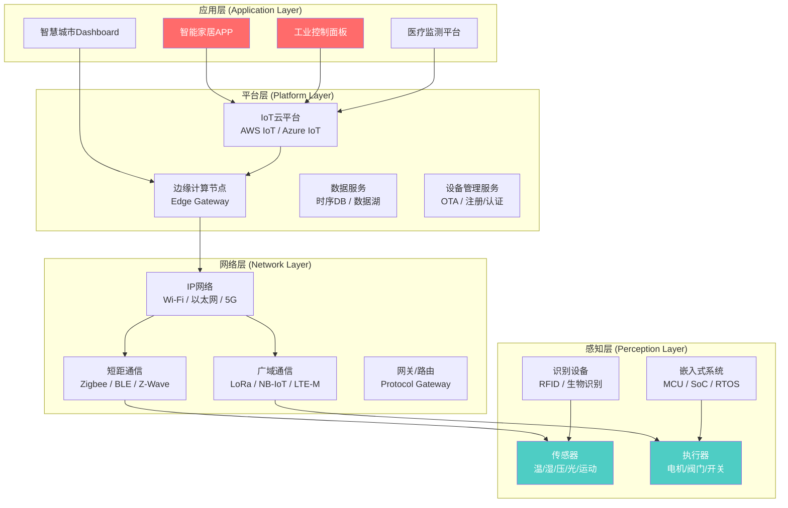
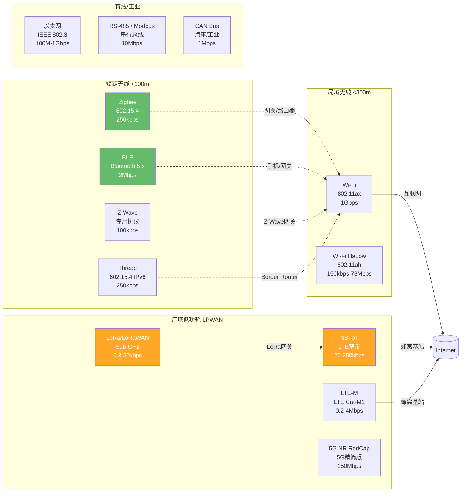
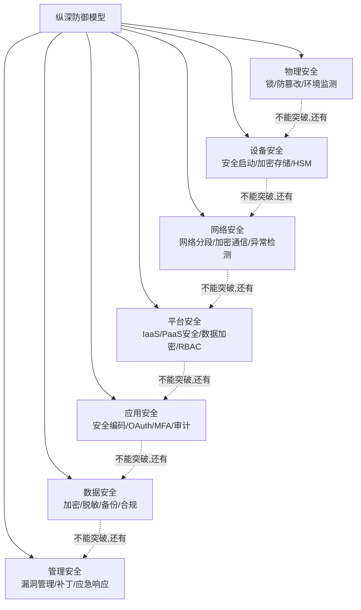

# 22.1 IoT系统架构概述

## 引言：为什么理解IoT架构是安全防护的第一步

物联网（Internet of Things, IoT）是继计算机、互联网之后第三次信息产业浪潮。据IoT Analytics统计，2025年全球联网IoT设备已达180亿台，预计2030年将超过300亿台。这些设备渗透到智能家居、工业控制、智慧医疗、车联网、智慧城市等各个领域，成为现代数字基础设施不可分割的组成部分。

然而，IoT设备的安全状况却令人担忧。2023年Unit 42报告显示，57%的IoT设备存在中等或高风险漏洞，平均每台设备有6.2个已知漏洞。Mirai僵尸网络、VPNFilter、Stuxnet等著名安全事件的核心，都利用了IoT系统架构中的设计缺陷。

**IoT安全之所以难，根本原因在于其架构的独特性**：传统IT系统有成熟的边界防御和补丁管理机制，而IoT系统面临资源受限、协议碎片化、物理暴露、长生命周期等特有挑战。因此，深入理解IoT系统架构，是进行有效安全防护的第一步。

## 22.1.1 IoT系统分层架构总览

IoT系统通常采用四层或三层参考架构。本文采用业界最广泛接受的四层模型，从下至上依次为：

| 层级 | 中文名称 | 核心功能 | 安全关注重点 |
|------|----------|----------|--------------|
| 感知层 | Perception Layer | 数据采集与物理交互 | 物理安全、固件安全、侧信道攻击 |
| 网络层 | Network Layer | 数据传输与路由 | 通信加密、协议劫持、中间人攻击 |
| 平台层 | Platform Layer | 数据处理与设备管理 | 云安全、身份认证、数据隐私 |
| 应用层 | Application Layer | 业务逻辑与用户交互 | Web安全、API安全、权限管理 |

这四层在逻辑上自上而下依赖，每一层都为上层提供服务。从安全角度看，**每一层都引入了不同的威胁面**，安全策略必须层叠互补，形成纵深防御体系。



## 22.1.2 感知层（Perception Layer）深度解析

感知层是整个IoT系统的根基，负责将物理世界转化为数字信号。它的安全性直接决定整个系统的可信度——**如果传感器数据在源头就被篡改，上层所有安全机制都将失去意义**。

### 感知层设备分类与技术细节

| 设备类型 | 典型产品 | 通信接口 | 常见MCU | 操作系统 |
|----------|----------|----------|---------|----------|
| 环境传感器 | 温湿度传感器、PM2.5检测器 | I²C, SPI, UART | ESP32, STM32 | FreeRTOS, Zephyr |
| 运动传感器 | 加速度计、陀螺仪、红外PIR | I²C, GPIO | nRF52840, ESP8266 | Arduino, Mbed OS |
| 执行器 | 智能开关、电机驱动、阀门 | GPIO, PWM, RS-485 | ATmega328P, STM32 | 裸机, FreeRTOS |
| 识别设备 | RFID读卡器、指纹模块 | Wiegand, UART, SPI | NXP LPC, STM32 | Mbed OS, 裸机 |
| 摄像头/IPC | 网络摄像头、门铃摄像头 | MIPI, USB, Ethernet |君正T31, HiSilicon | Linux, RTOS |
| 医疗传感器 | 心电监测、血糖仪 | BLE, I²C | nRF52, CC26xx | FreeRTOS, Zephyr |

### 感知层的核心安全挑战

**（1）资源极度受限**

IoT终端设备的计算能力、存储空间和电池容量极为有限。以最广泛的ESP8266为例：仅160KB RAM、2MB Flash、80MHz主频。在这样的平台上：

- **无法运行标准TLS/SSL栈**：完整TLS握手需要约50KB RAM，占ESP8266的31%
- **不支持复杂加密算法**：RSA 2048位的密钥生成和签名计算可能需要数秒
- **难以存储安全证书**：2MB Flash中固件约占用1.2MB，剩余空间有限

**解决方案**：
- 选用轻量级加密协议：DTLS、TLS 1.3（握手开销降低40%）、OSCORE（CoAP端到端加密）
- 使用椭圆曲线加密（ECC）替代RSA：相同安全强度下，ECC密钥长度仅为RSA的1/10
- 硬件安全模块（HSM/SE）：如ATECC608A安全芯片，可分担加密计算

**（2）物理暴露风险**

IoT设备常部署在不受控环境中——路灯杆上的传感器、停车场内的设备、工厂车间的PLC控制器。攻击者可以：

- 物理接触设备，通过JTAG/SWD接口读取固件
- 使用SPI闪存探针直接读取Flash内容
- 侧信道攻击（功耗分析、电磁辐射分析）提取加密密钥
- 设备克隆——复制合法设备的身份标识

**防护措施**：
- 禁用生产环境中的调试接口（JTAG/SWD熔丝位锁定）
- 采用安全启动（Secure Boot）——验证固件签名的信任链
- 实施固件加密存储（需硬件唯一密钥）
- 物理防篡改设计——打开外壳即触发密钥擦除

**（3）固件更新机制缺失**

很多IoT设备出厂后从未更新固件。原因包括：

- 无OTA升级机制（Over-The-Air Update）
- 升级过程易中断导致设备变砖
- 用户不关心或不知道需要更新
- 制造商停止维护

**统计数据**：根据Palo Alto Networks 2024年报告，超过70%的IoT设备制造商在设备发布后一年内未发布任何安全更新。

**最佳实践**：
- 设计时必须包含安全OTA更新机制（A/B分区、回滚保护）
- 固件签名验证（代码签名证书）
- 增量更新减少带宽和存储开销
- 强制安全更新策略（拒绝未更新设备接入网络）

## 22.1.3 网络层（Network Layer）深度解析

网络层负责感知层设备与平台层之间的数据传输，是IoT系统中最复杂的层面——涉及数十种通信协议、多个网络跳转、异构网络桥接。

### 通信协议全景图

IoT通信协议可按覆盖范围和传输能力分为四大类：



### 各协议的安全机制对比

| 协议 | 安全标准 | 加密算法 | 认证方式 | 已知漏洞 | 安全评分 |
|------|----------|----------|----------|----------|----------|
| Zigbee 3.0 | Zigbee规范 | AES-128-CCM* | 基于信任中心（Trust Center） | Z-Shark攻击、密钥提取 | ★★★☆☆ |
| BLE 5.x | Core Spec v5.x | AES-128-CCM | LE Secure Connections（ECDH） | BLESA、BlueBorne、BLE Spoofing | ★★★☆☆ |
| Z-Wave | S2规范 | AES-128-CBC-ECB | 包含预共享密钥 | Z-Wave DoS、协议降级 | ★★★★☆ |
| LoRaWAN 1.1 | LoRaWAN规范 | AES-128-CMAC | AppKey/AppSKey/NwkSKey | LoRaWAN Replay、LoRaDawn | ★★★★☆ |
| NB-IoT 3GPP | 3GPP安全规范 | 128-NEA1/2/3 | USIM + EAP-AKA | 基站伪冒、信令风暴 | ★★★★★ |
| Wi-Fi WPA3 | IEEE 802.11 | AES-GCMP-256 SAE握手 | Simultaneous Auth of Equals | Dragonblood（部分实现漏洞） | ★★★★☆ |
| Thread | OpenThread | AES-CCM | 基于PSKc/证书 | 侧信道分析（理论） | ★★★★★ |
| MQTT（应用层） | MQTT 5.0 | TLS 1.3可选 | 用户名/密码+X.509证书 | 明文传输（如不启用TLS） | ★★☆☆☆（无TLS） |

### 网络层的关键安全威胁

**（1）协议劫持与降级攻击**

攻击者通过干扰握手过程，迫使通信双方使用较弱的安全参数。例如：

- **Zigbee降级攻击**：伪造信标帧，使设备从Zigbee 3.0安全模式降级到Zigbee 2006不兼容模式，使用固定网络密钥
- **BLE配对劫持**：利用Just Works配对模式（无MITM保护）实施中间人攻击
- **LoRaWAN重放攻击**：在Class A模式中，由于非对称时隙设计，攻击者可重放上行数据包

**（2）中间人攻击（Man-in-the-Middle, MITM）**

在无线环境中尤为常见。攻击者部署伪冒网关/基站，截获所有通信数据：

- **Wi-Fi Evil Twin**：伪冒合法Wi-Fi接入点，诱导IoT设备连接
- **蜂窝伪基站（IMSI Catcher）**：在NB-IoT/LTE-M环境中捕获设备身份和流量
- **CoAP代理劫持**：在CoAP代理节点实施内容篡改

**（3）大数据包攻击与协议漏洞**

- **Zigbee Z-Shark**：利用802.15.4 MAC层帧聚合功能发起DoS攻击
- **BLE泛洪攻击**：大量连接请求导致设备蓝牙栈崩溃
- **LoRa频谱冲突**：恶意发送占空比违背规范的信号，造成合法设备通信中断

### 网络层安全最佳实践

1. **端到端加密（E2EE）**：不仅在传输链路层加密，更要在应用层实现端到端加密，防止网关节点成为解密节点
2. **双向认证**：设备认证平台，平台也认证设备，防止设备被伪冒平台控制
3. **网络分段**：将IoT设备隔离在单独的VLAN/s子网中，即使被攻破也无法横向移动
4. **流量异常检测**：部署基于ML的IoT流量分析，检测异常行为模式
5. **安全密钥管理**：使用HSM或安全元件存储密钥，避免固件中硬编码密钥

## 22.1.4 平台层（Platform Layer）深度解析

平台层是IoT系统的"大脑"，承担设备管理、数据处理、规则引擎、OTA更新等核心功能。在四层架构中，平台层往往是安全投资最集中、防护措施最完善的层面——但这恰恰使它成为攻击者的高价值目标。

### 主流IoT云平台架构对比

| 维度 | AWS IoT Core | Azure IoT Hub | 阿里云IoT | 私有平台（EMQX等） |
|------|-------------|---------------|-----------|-------------------|
| 设备认证 | X.509证书、Cognito | SAS Token、X.509 | 三元组（ProductKey, DeviceName, DeviceSecret） | 用户名/密码、TLS证书 |
| 消息协议 | MQTT, HTTP, WebSocket, LoRaWAN | MQTT, AMQP, HTTPS, MQTT over WebSocket | MQTT, CoAP, HTTP | MQTT, CoAP, HTTP, WebSocket |
| 设备影子 | Device Shadow（状态同步） | Device Twin（属性/状态） | 设备影子（属性/服务） | 自定义实现 |
| 规则引擎 | IoT Rules → Lambda/S3 | IoT Hub Message Routing → Functions | 规则引擎 + 函数计算 | 基于eBPF/规则链 |
| 边缘计算 | AWS Greengrass | Azure IoT Edge | Link IoT Edge | 自建Edge Node |
| OTA服务 | AWS IoT Device Management | Device Update for IoT Hub | OTA升级服务 | 自定义 |
| 安全基线 | IoT Device Defender | Defender for IoT | 安全中心 | 自建SIEM |
| 合规认证 | SOC 2, ISO 27001, HIPAA | SOC 2, ISO 27001, FedRAMP | 等保三级/GDPR | 取决于实现 |

### 平台层的核心安全组件

**（1）设备身份与认证管理**

IoT平台的设备认证标准流程：

```text
1. 设备注册阶段
   设备制造商→平台：提交设备身份信息
   平台→设备：颁发唯一设备凭证
   
2. 设备首次连接
   设备：读取凭证（安全元件/HSM）
   设备→平台：TLS握手 + 证书/令牌认证
   平台：验证设备凭证有效性
   平台→设备：签发会话令牌（Session Token）
   
3. 持续通信
   设备：携带会话令牌发送消息
   平台：验证令牌有效期和权限
   平台：将消息路由到目标服务
```

**常见攻击向量**：
- **硬编码凭证挖掘**：从固件中提取ProductKey/DeviceSecret、SAS Token或私钥
- **凭证重放**：捕获设备发布的凭证，仿冒合法设备接入平台
- **设备克隆**：获取设备证书后大量创建虚拟设备（Sybil攻击）

**防护措施**：
- 使用TPM（Trusted Platform Module）或安全元件硬件存储私钥
- 实施动态凭证——每次连接颁发临时令牌（如AWS IoT的临时证书）
- 设备注册行为检测——同一凭证多设备同时在线即为异常

**（2）数据安全与隐私保护**

| 数据类型 | 安全要求 | 典型威胁 | 防护方案 |
|----------|----------|----------|----------|
| 设备遥测数据 | 机密性、完整性 | 中间人窃听、篡改 | TLS + 负载加密 |
| 设备配置 | 完整性、访问控制 | 未授权修改 | 数字签名 + RBAC |
| 用户个人信息 | 机密性、删除权 | 数据泄露 | 加密存储 + 脱敏 + 访问审计 |
| OTA升级包 | 完整性、来源认证 | 恶意固件注入 | 代码签名证书验证 |
| 设备日志 | 机密性、不可抵赖性 | 日志篡改 | HSM签名 + 区块链存证 |

**（3）API安全**

IoT平台暴露的管理API接口通常是攻击者最青睐的入口。OWASP IoT API Top 10包括：

1. **认证绕过**：缺乏多因素认证，弱密码策略
2. **授权漏洞**：设备A能查询设备B的数据（IDOR攻击）
3. **批量赋值**：通过API参数注入修改不应由用户修改的设备属性
4. **过度数据暴露**：API返回字段多于必要信息
5. **速率限制缺失**：导致暴力破解和DDoS
6. **注入攻击**：SQL注入、NoSQL注入、命令注入
7. **不安全的直接对象引用**：可通过枚举请求ID获取任意设备数据
8. **安全配置错误**：默认管理员密码、不必要的端口开放
9. **日志与监控不足**：无法及时发现攻击行为
10. **第三方组件漏洞**：JWT库、XML解析器的已知CVE

## 22.1.5 应用层（Application Layer）深度解析

应用层是用户直接接触的界面，包括移动APP、Web Dashboard、桌面客户端等。由于直接面向用户，应用层的攻击面最容易暴露。

### 应用层的安全威胁矩阵

| 应用类型 | 典型攻击 | 影响 |
|----------|----------|------|
| 移动APP | APK反编译、API密钥泄露、不安全的数据存储 | 设备被远程控制 |
| Web Dashboard | XSS、CSRF、SQL注入 | 用户数据泄露、越权控制 |
| 语音助手 | 超声波命令注入、对抗性语音样本 | 智能家居被远程操控 |
| 电视/显示设备 | 应用沙箱逃逸、远程代码执行 | 隐私泄露（摄像头/麦克风） |
| 物联网网关管理界面 | 默认凭证、命令注入、固件劫持 | 整个IoT网络沦陷 |

### 典型案例：智能家居App的TOCTOU攻击

Roomba扫地机器人的APP曾存在Time-of-Check Time-of-Use（TOCTOU）漏洞：

1. 用户通过APP发起"开始清扫"指令
2. APP检查当前房间是否有人（Time of Check）→ 无人，指令通过
3. 攻击者在指令到达设备前拦截并修改参数（Time of Use）
4. 设备实际执行"远程摄像头拍照"指令 → 隐私泄露

**教训**：应用层面的授权检查必须在服务端而非客户端实施；设备必须对每条指令进行独立授权验证。

## 22.1.6 IoT安全设计的纵深防御原则

理解架构后，需要将安全设计原则融入每一层：

### 纵深防御（Defense in Depth）



### 安全架构设计检查清单

| 层级 | 检查项 | 优先级 |
|------|--------|--------|
| 感知层 | 调试接口是否已禁用（熔丝位锁定） | 强制 |
| 感知层 | 固件是否签名验证 | 强制 |
| 感知层 | 安全元件是否用于密钥存储 | 推荐 |
| 感知层 | OTA更新机制是否安全实现 | 强制 |
| 网络层 | 通信是否使用TLS/DTLS | 强制 |
| 网络层 | 是否使用双向认证 | 强制 |
| 网络层 | 设备是否在网络隔离VLAN中 | 强制 |
| 网络层 | 网关是否进行协议深度检查 | 推荐 |
| 平台层 | 设备注册是否有认证保护 | 强制 |
| 平台层 | API是否实施速率限制 | 强制 |
| 平台层 | 数据是否加密存储 | 强制 |
| 平台层 | 多租户隔离是否验证 | 强制 |
| 应用层 | 用户认证是否启用MFA | 推荐 |
| 应用层 | 会话管理是否安全 | 强制 |
| 应用层 | 输入验证是否全覆盖 | 强制 |
| 应用层 | 日志审计是否开启 | 强制 |

## 22.1.7 经典案例深度分析

### 案例一：Mirai僵尸网络（2016）

**概述**：Mirai是IoT安全史上标志性事件。2016年9月，Mirai僵尸网络发动了对Brian Krebs网站、法国OVH云服务商、Dyn DNS服务商的超大规模DDoS攻击，峰值流量达1.2Tbps。

**攻击原理**：
1. 扫描IoT设备（主要是DVR摄像头、路由器）的Telnet端口（23/TCP）
2. 使用硬编码的默认用户名密码列表进行暴力破解（61组常用凭证）
3. 成功登录后，下载Mirai恶意固件并执行
4. 受感染设备成为僵尸节点，等待C&C服务器命令发起DDoS

**漏洞根源**：感知层设备出厂时Telnet服务默认开启，且使用"admin/admin"、"root/root"等弱密码。设备没有密码强度要求，也没有失败登录锁定机制。

**教训**：
- 禁止出厂设备使用默认凭证
- 强制用户首次登录修改密码
- 关闭不必要的远程管理服务（Telnet→SSH）
- IoT设备应具备暴力破解防护机制

### 案例二：Stuxnet震网（2010）

**概述**：Stuxnet不是传统意义上的IoT攻击——它攻击的是工业控制系统（ICS），但本质上是IoT安全（OT设备+数字攻击）的经典案例。攻击导致伊朗纳坦兹核设施约1000台离心机物理损坏。

**攻击链路**（体现纵深突破）：
1. **初始入侵**：通过感染USB驱动器，穿透物理隔离（Air Gap）
2. **横向传播**：利用Windows零日漏洞在内网传播（MS10-046, MS10-061）
3. **权限提升**：使用两个有效的数字签名证书加载恶意驱动
4. **攻击目标**：感染Siemens S7-300 PLC（感知层），通过修改变频器频率
5. **物理破坏**：离心机转速在高速和低速间剧烈波动，物理损坏

**漏洞根源**：
- 感知层PLC使用私有协议（SIMATIC Step 7），无认证机制
- 网络层Modbus协议明文通信，无加密和完整性校验
- 平台层HMI（人机界面）显示伪造的正常参数（欺骗操作员）

**教训**：
- OT/IoT系统应具备异常行为检测（操作参数偏离基线）
- 控制指令需要认证和完整性保护
- 物理隔离（Air Gap）不是万能的——需要纵深防御
- 传感器读数与执行器状态应交叉验证

### 案例三：Amazon Ring家庭摄像头（2019）

**概述**：Ring智能门铃摄像头多名用户报告被未经授权访问，攻击者通过摄像头喊话骚扰儿童、索要比特币等。

**攻击链条**：
1. 攻击者获取用户在第三方数据泄露事件中暴露的邮箱和密码
2. 使用相同凭证登录Ring账户（凭证填充攻击，Credential Stuffing）
3. 利用Ring未启用双因素认证（2FA）的安全缺陷
4. 登录Ring App后获得摄像头实时画面和对讲权限

**漏洞根源**：
- 应用层缺少MFA/2FA支持（当时Ring还未强制启用2FA）
- 平台层缺乏设备登录异常行为检测——同一帐户从新IP/设备登录后，未触发任何告警或二次验证

**教训**：
- IoT账户必须提供并强制建议用户启用多因素认证
- 异常登录检测（新位置、新设备、新IP）应触发告警
- 即使云平台安全，凭证填充攻击依然能绕过——需要在身份验证层面阻断

## 22.1.8 局限性与未来趋势

### 当前架构的局限性

1. **刚性分层**：四层架构在逻辑上清晰，但实际IoT系统往往跨越多个层次，边缘计算模糊了感知层与平台层的边界
2. **异构兼容不足**：不同厂商碎片化协议和平台的互操作性问题，导致安全一致性难以保证
3. **主从模型**：许多IoT协议采用星型主从架构，中心节点失效则全网瘫痪，单点故障和安全瓶颈
4. **静态安全假设**：大多数IoT设备的安全策略是静态配置的，缺乏运行时自适应能力

### 新技术对架构的影响

| 技术 | 对IoT架构的影响 | 安全机遇 | 安全挑战 |
|------|-----------------|----------|----------|
| 联邦学习（Federated Learning） | 在边缘设备上训练ML模型，不传输原始数据 | 减少数据传输暴露面 | 模型投毒攻击、梯度泄露 |
| 联邦身份（DID/区块链） | 去中心化设备身份管理 | 消除单点故障 | 密钥管理与恢复、交易成本 |
| 机密计算（Confidential Computing） | TEE在边缘节点处理敏感数据 | 运行时数据加密保护 | TEE侧信道攻击、性能开销 |
| Matter协议 | 智能家居设备统一互操作标准 | 统一安全基线 | 降级攻击、实现漏洞 |
| AI/ML异常检测 | 网络层/平台层智能威胁检测 | 识别未知威胁 | 对抗性样本、误报管理 |
| 零信任架构（ZTNA） | 永不信任，始终验证 | 消除隐式信任 | 对资源受限设备不友好 |

### 未来展望

- **统一身份标准**：未来IoT架构将趋向FIDO Device Onboard（FDO）或Matter协议，实现设备零接触安全配置
- **AI原生安全**：设备端轻量ML实现运行时异常检测，平台侧大模型驱动的安全策略自动生成
- **硬件级信任根**：RISC-V安全扩展、ARM TrustZone、Intel SGX在IoT终端的普及，将硬件信任根下沉到每台设备
- **跨域联邦安全**：跨组织、跨平台的共享威胁情报机制，构建IoT安全命运共同体

## 小结

本文从四层IoT系统架构出发，逐层深入地分析了感知层的物理安全与固件安全、网络层的通信协议安全与协议劫持、平台层的云安全与身份管理、应用层的Web/App安全。通过Mirai、Stuxnet、Ring等经典案例，展示了每一层安全缺陷如何组合形成系统性风险。

核心要点：

1. **没有完美的单层防御**——安全必须贯穿感知、网络、平台、应用全链路
2. **资源受限不等于零安全**——轻量级加密、安全元件、安全设计架构可有效弥补设备能力不足
3. **安全是架构问题而非功能问题**——决定IoT系统安全水平的，是在系统设计阶段架构层面的安全规划，而非上线后叠加的安全补丁
4. **攻击链往往跨层突破**——理解攻击者如何在各层间跳转，才能设计针对性的遏制策略

下一节将深入IoT网络通信协议的安全机制，详解各协议层的加密、认证和完整性保护方案。
