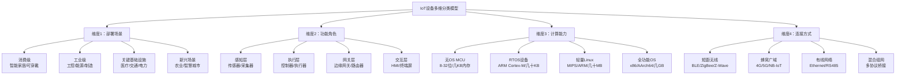
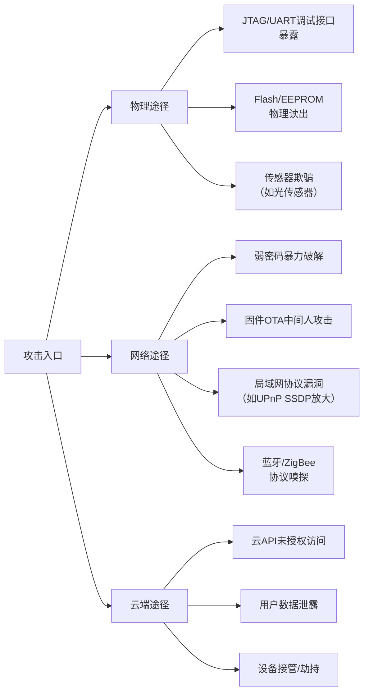
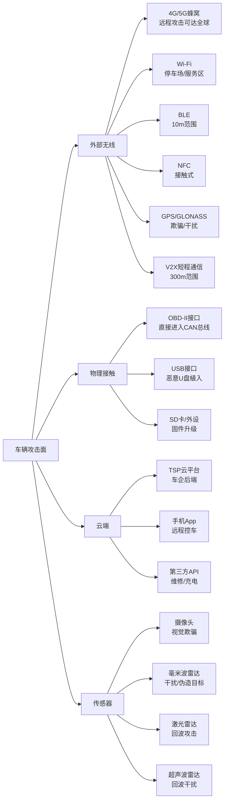

## 22.3 IoT设备分类与安全特征

### 22.3.0 分类的意义与方法论

#### 为什么需要设备分类

IoT生态的碎片化程度远超传统IT领域。据IoT Analytics 2025年报告，全球联网IoT设备已超过180亿台，涵盖从几元钱的传感器芯片到数十万元的工业机器人。面对如此庞杂的生态，**设备分类**是安全分析的基石：

- **差异化风险评估**：智能灯泡被攻破的后果与心脏起搏器被攻破的后果截然不同，统一的安全策略要么过度保守（成本浪费），要么过度激进（风险暴露）
- **针对性防御设计**：设备类别决定了可用的计算资源、网络拓扑、更新机制和物理防护手段
- **合规映射需求**：不同类别的设备受不同法规约束（医疗→FDA/HIPAA，汽车→UN R155，工控→IEC 62443）
- **漏洞研判优先级**：分类帮助安全团队快速判断某个CVE对自己的设备类别是否适用

#### 分类维度体系

单一的"消费级/工业级"二分法过于粗糙。业界公认的**四维分类模型**如下：



**每个维度对安全的影响**：

| 维度 | 关键安全问题 | 典型案例 |
|------|------------|---------|
| 部署场景 | 暴露面、物理安全、法规合规 | 医疗设备须通过FDA审查 |
| 功能角色 | 数据流向、控制权限、失效模式 | 智能门锁失效=家门大敞 |
| 计算能力 | 加密能力、固件更新、安全堆栈 | MCU难跑TLS 1.3 |
| 连接方式 | 窃听风险、干扰风险、认证机制 | BLE窃听距离可达100m |

> **核心观点**：一台设备的安全特征不是由单一维度决定的，而是这四个维度交叉作用的结果。正确分类是制定有效安全策略的第一步。

---

### 22.3.1 消费级IoT设备

#### 覆盖范围与典型设备

消费级IoT设备面向个人或家庭用户，是IoT生态中数量最大、安全防护最薄弱的类别。2025年全球消费IoT设备已超过100亿台，平均每个美国家庭拥有22台联网设备（Deloitte 2025数字化趋势报告）。

**典型设备详表**：

| 子类别 | 典型设备 | 全球保有量级 | 平均售价区间 |
|--------|---------|------------|------------|
| 智能音箱 | Amazon Echo、Google Nest、小米小爱 | 6亿+ | ¥100-2000 |
| 智能摄像头 | 室内/室外摄像头、门铃摄像头 | 15亿+ | ¥50-1500 |
| 智能门锁 | 指纹锁、密码锁、远程开锁 | 2亿+ | ¥200-5000 |
| 智能家电 | 冰箱、空调、洗衣机、电饭煲、扫地机器人 | 25亿+ | ¥200-20000 |
| 可穿戴设备 | 智能手表、手环、智能眼镜 | 8亿+ | ¥50-10000 |
| 智能照明 | WIFI/BLE灯泡、灯带、开关 | 30亿+ | ¥20-500 |
| 智能健康 | 体重秤、血压计、血糖仪 | 3亿+ | ¥50-3000 |

#### 核心安全特征（五维分析）

**1. 成本约束与安全投入**

消费级设备遵循"成本优先"原则。以¥99的Wi-Fi智能灯泡为例：
- BOM（物料清单）成本约¥35-45
- 主控芯片（如ESP8266/ESP32）成本¥5-15
- 剩余可用于安全组件的预算几乎为零
- **结果**：无法集成安全芯片（SE/TEE），Flash加密单元被阉割，安全启动被省略

**2. 用户安全认知薄弱**

- 87%的用户不更改设备默认密码（Palo Alto Networks 2024调研）
- 92%的用户不知道设备固件可以/需要更新
- 65%的用户将IoT设备直接暴露在公网（未隔离VLAN）
- 典型场景：用户为"方便"将智能摄像头开启UPnP，直接映射到公网IP

**3. 固件更新机制缺陷**

| 问题类型 | 具体表现 | 占比（OwlLab 2024扫描数据） |
|---------|---------|--------------------------|
| 无更新机制 | 出厂即"死"，无法修补漏洞 | ~45% |
| 不安全更新 | HTTP下载+无签名验证 | ~30% |
| 更新周期长 | 漏洞出现后90天以上才出补丁 | ~20% |
| 断更风险 | 厂商倒闭后设备永久失去支持 | ~15% |

**4. 默认凭据灾难**

Shodan搜索"admin:admin"可找到超过300万台可直接访问的IoT设备。常见默认凭据组合：
- admin/admin、admin/1234、root/root
- 基于MAC地址最后6位的默认密码（可预测）
- Web界面空密码直接登录

**5. 云服务依赖问题**

消费级设备高度依赖厂商云服务。当厂商关闭云服务器时：
- 设备变砖（如Revolv智能家居中心被Google关闭）
- 本地功能受限（如需要云服务验证的智能门锁）
- 隐私数据永久留存在已关停的服务器上

#### 安全风险等级：中高

**攻击面分析**：



**典型攻击链**（以¥50的Wi-Fi插座为例）：
1. 攻击者扫描公网上开放的8080端口（该插座默认Web管理端口）
2. 尝试默认密码admin:admin成功登录
3. 利用Web界面漏洞获取设备Shell（出厂默认开启telnet）
4. 植入Mirai变种僵尸程序
5. 该插座成为DDoS攻击的肉鸡

#### 防御策略建议

| 层面 | 具体措施 | 优先级 |
|------|---------|--------|
| 用户 | 设备发现后立即改密码；单独VLAN隔离IoT设备；关闭UPnP | 高 |
| 厂商 | 强制首次修改密码；提供安全更新至少3年；支持本地通信加密 | 高 |
| 协议 | 使用TLS 1.3替代HTTP明文；拒绝默认SSL证书 | 中 |
| 运营 | 监控设备异常流量；订阅厂商安全通告 | 中 |

#### 常见误区

- **误区**："智能设备不存敏感数据，被黑了也没事" → **真相**：设备可作为跳板攻击内网其他设备，或成为僵尸网络一员
- **误区**："大品牌的产品一定安全" → **真相**：品牌与安全无必然关系，需查看具体安全措施（是否支持TLS、有无安全启动）

---

### 22.3.2 工业IoT设备

#### 覆盖范围与典型设备

工业IoT（IIoT）是工业4.0的核心支柱，将传统的OT（操作技术）与IT融合。与消费级设备不同，IIoT设备运行在**关键生产环境**中，故障可能直接导致停产、设备损坏甚至人员伤亡。

**典型设备分类**：

| 设备类型 | 具体设备 | 更新周期 | 典型使用寿命 |
|---------|---------|---------|------------|
| 控制器 | PLC（可编程逻辑控制器）、DCS控制器、RTU | 5-10年 | 15-25年 |
| 执行器 | 变频器、伺服驱动器、阀门执行器 | 8-12年 | 15-20年 |
| 传感器 | 压力/温度/流量传感器、振动传感器 | 3-5年 | 5-10年 |
| 人机界面 | 工业触摸屏、SCADA工作站 | 3-5年 | 8-12年 |
| 边缘网关 | 工业边缘计算节点、协议转换器 | 3-5年 | 8-15年 |
| 工业机器人 | 焊接/装配/搬运机器人 | 8-12年 | 15-25年 |

#### 核心安全特征（五维分析）

**1. 可用性压倒一切**

IIoT设备的**CIA三元组**顺序与IT完全不同：

| 安全属性 | IT优先级 | OT/IIoT优先级 | 原因 |
|---------|---------|--------------|------|
| 可用性（Availability） | 高 | **最高** | 生产线停机会带来每分钟数万至数百万的直接损失 |
| 完整性（Integrity） | 高 | 高 | 篡改传感器数据=错误控制→安全事故 |
| 机密性（Confidentiality） | 最高 | 中低 | 多数工控协议设计上不加密，厂商默认"物理隔离" |

**- 补丁悖论**：OT环境中打安全补丁需要安排停产窗口。某汽车工厂的PLC安全补丁排队等待了14个月，因为只有年度大修期间才能停机更新。

**2. 超长生命周期**

- 工业设备设计寿命10-20年，实际运行更久。2024年仍有大量Windows XP SP3系统控制着核电站模拟系统
- 出厂时的操作系统和协议栈在生命周期中部**不变**，意味着设计之初未考虑的安全威胁在十年后成为致命漏洞
- 供应链中断：原厂停止支持后，设备面临"无人修补"困境

**3. 协议安全性严重不足**

常用工业协议的加密现状：

| 协议 | 用途 | 是否加密 | 认证机制 | 备注 |
|------|------|---------|---------|------|
| Modbus TCP | PLC通信 | 无 | 无 | 明文帧，无认证 |
| PROFINET | 自动化 | 可选 | 简易 | DCP基本未用 |
| EtherNet/IP | 工业以太网 | 无 | CIP Security（几乎未部署） | 依赖物理隔离 |
| DNP3 | 电力/能源 | 可选Secure Auth | 弱 | 多数部署仍用明文 |
| OPC UA | 统一架构 | 是 | 强 | 但性能开销大 |

**- 典型案例**：2023年某水处理厂的SCADA系统遭受攻击，攻击者利用未加密的Modbus TCP直接向PLC写入虚假水位数据，导致水泵空转烧毁，直接损失约200万元。

**4. 物理安全依赖与隔离假设**

- 传统设计假设OT环境是**物理隔离**的（气隙），攻击者无法接触网络
- 工业4.0融合趋势打破了这一假设——IT网络与OT网络通过网关/防火墙连接，甚至互联网直连
- 然而OT网络内部通常**零信任**（任何设备可访问任何其他设备）
- **后果**：一旦攻击者突破IT/OT边界，可在内部网络横向移动，对OT设备为所欲为

**5. 供应链安全复杂性**

IIoT设备供应链比IT设备更长更复杂：
- 控制器固件可能包含来自5-8家不同供应商的闭源组件
- 第三方协议栈库（如EtherNet/IP的CIP Stack）漏洞频发
- SBOM（软件物料清单）在工业领域尚未普及——许多厂商自己都说不清设备里跑了哪些组件

#### 安全风险等级：高（影响生产安全）

**典型攻击案例：Colonial Pipeline（2021）**
- 虽然该事件主要影响IT系统，但暴露了OT的脆弱性
- 攻击者通过泄露的VPN凭据进入IT网络
- OT安全隔离措施不足，IT中断直接导致管道运营停止
- 教训：IIoT/OT安全不能仅依赖边界防护

#### 防御策略建议

| 层面 | 具体措施 | 实施难度 |
|------|---------|---------|
| 网络隔离 | IT/OT网络严格VLAN+防火墙隔离；OT内部微隔离 | 中 |
| 协议安全 | 在无法升级协议时使用安全网关协议转换；部署工控IPS | 中高 |
| 资产管理 | 建立完整的IIoT资产清单；持续发现"影子"设备 | 低 |
| 补丁管理 | 建立OT补丁测试流程（模拟环境+离线测试）；安排定期更新窗口 | 高 |
| 人员培训 | 安全团队与OT团队协作；培养了解工控协议的安全人员 | 高 |
| 应急响应 | 制定OT专用应急响应预案（不要直接重启生产系统） | 中 |

---

### 22.3.3 医疗IoT设备

#### 覆盖范围与典型设备

医疗IoT（IoMT）是增长速度最快的IoT细分领域，Grand View Research预计2028年市场规模将达到3320亿美元。医疗设备的安全问题直接关联**患者生命安全**，其安全评级在所有IoT类别中最为严肃。

**典型设备详表**：

| 类别 | 设备 | 安全关键度 | 是否植入人体 | 监管等级 |
|------|------|-----------|------------|---------|
| 植入式 | 心脏起搏器、胰岛素泵、神经刺激器 | 极高 | 是 | 三类医疗器械 |
| 生命支持 | 呼吸机、ECMO、除颤仪 | 极高 | 否 | 二/三类 |
| 床旁监测 | 心电监护仪、血氧仪、血压计 | 高 | 否 | 二类 |
| 影像诊断 | MRI、CT、X光、超声 | 高 | 否 | 二/三类 |
| 院内联网 | 输液泵、病床呼叫、门禁 | 中高 | 否 | 一类 |
| 远程医疗 | 远程诊断终端、患者监控系统 | 中 | 否 | 一类 |
| 消费医疗 | 智能手表ECG、持续血糖仪 | 中 | 部分 | 未明确/低风险 |

#### 核心安全特征（五维分析）

**1. 安全与生命直接关联**

- 心脏起搏器被远程攻击→可调整心率至致命值（2017年St. Jude起搏器漏洞证实）
- 胰岛素泵被攻击→可注入过量胰岛素导致低血糖昏迷
- 输液泵被攻击→可改变输液速率造成药物过量或不足
- **数据**：KLAS Research 2024报告显示，93%的医院在过去12个月内经历了至少一次IoMT安全事件

**2. 严苛的监管合规要求**

不同地区对医疗设备安全的要求：

| 监管体系 | 适用范围 | 安全相关核心要求 | 处罚力度 |
|---------|---------|----------------|---------|
| FDA（美国） | 美国市场 | 上市前审查（PMA/510k）、网络安全设计文档、安全更新计划 | 禁令/罚款/召回 |
| CE MDR（欧盟） | 欧洲市场 | 基本安全要求、PMCF、唯一设备标识（UDI） | 撤销CE证书 |
| NMPA（中国） | 中国 | 医疗器械注册、网络安全专章（2023年新增） | 撤销注册证 |
| HIPAA（美国） | 医疗机构 | 患者数据保护、加密要求、日志审计 | 最高$50万/次 |
| GDPR（欧盟） | 处理欧盟居民数据的设备 | 数据最小化、知情同意、72小时泄露通知 | 全球营收4% |

**3. 更新机制的特殊约束**

医疗设备的固件更新比任何其他IoT类别都更复杂：

- **FDA审批要求**：如果固件更新改变了设备的安全关键功能，可能需要重新申请FDA批准，这一过程长达6-18个月
- **临床验证需求**：更新后需在模拟环境验证设备功能，确保不会影响临床效果
- **操作窗口有限**：医院的更新窗口（通常凌晨2-4点）极短，且不可随意中断
- **设备分散管理**：大型医院拥有5000-10000台联网医疗设备，分散在几十个科室

**后果**：以2022年PaceMaker固件漏洞CVE-2022-27191为例，从漏洞披露到首批设备完成安全更新，中间耗时22个月。

**4. 数据隐私的极端敏感性**

医疗设备处理的生理数据（ECG波形、血糖曲线、生命体征）既是**个人隐私**，也可用于**身份识别**和**保险定价**：

- 2015年Anthem泄露了7880万患者记录，后续集体诉讼赔偿1.15亿美元
- 暗网上患者完整医疗档案售价$50-200/条，是信用卡号价格的10-20倍
- 攻击者可利用生理数据推断健康状况，进而实施精准钓鱼或勒索

**5. 网络架构的兼容性难题**

- 多数医疗设备仍运行Windows Embedded（7/10）或专有RTOS
- 医院IT网络既有员工办公网、访客Wi-Fi，又有医疗设备专网
- 安全方案部署受限于：设备不能安装Agent软件、不能阻断端口扫描、不能修改注册表
- **现实矛盾**：安全团队想隔离，临床团队要互通（医生需要远程查看监护数据）

#### 安全风险等级：极高

**真实案例：2017年WannaCry对NHS的影响**
- WannaCry勒索软件导致英国NHS系统80家医院受影响
- 约19,000个预约被取消，595台设备（MR、CT设备等）被锁
- 原因：大量医疗设备运行未打补丁的Windows 7/XP
- 直接损失约9200万英镑

#### 医疗安全阶段性方法

```mermaid
flowchart TD
    S[IoMT安全路线图] --> S1[第一阶段：盘点]
    S1 --> S1a[建立完整IoMT资产清单]
    S1 --> S1b[识别未授权设备/影子设备]
    S1 --> S1c[评估设备网络连接模式]

    S --> S2[第二阶段：防御]
    S2 --> S2a[实施网络微隔离<br/>医疗设备子网+VLAN]
    S2 --> S2b[部署医疗专用IDS<br/>(如Medigate/Nozomi)]
    S2 --> S2c[实施访问控制<br/>MAC过滤+802.1X]

    S --> S3[第三阶段：监控]
    S3 --> S3a[异常流量检测]
    S3 --> S3b[协议深度解析<br/>(HL7/DICOM/MEDICA)]
    S3 --> S3c[安全事件响应流程]

    S --> S4[第四阶段：持续改进]
    S4 --> S4a[与厂商建立漏洞通报机制]
    S4 --> S4b[定期安全评估与渗透测试]
    S4 --> S4c[更新合规性文档]
```

#### 常见误区

- **误区**："医疗设备不联网就不会被攻击" → **真相**：现代医疗设备几乎都联网（以太网/Wi-Fi/BLE），且部分通过HIS/PACS系统间接暴露
- **误区**："FDA批准的设备就是安全的" → **真相**：FDA主要审查安全有效性，网络安全审查是近3年才显著加强的领域，大量已上市的设备未经过严格的安全评估

---

### 22.3.4 车联网（V2X）设备

#### 覆盖范围与典型设备

车联网设备是IoT中最具移动性和动态性的类别。一辆2025年的智能汽车包含**100-200个ECU（电子控制单元）**，运行超过1亿行代码，联网攻击面远超传统汽车。自动驾驶等级（SAE J3016）的推进进一步放大了安全风险——L3及以上级别，安全责任从驾驶员转移到了车辆系统。

**车内关键联网单元**：

| 单元名称 | 功能 | 操作系统 | 网络接口 | 安全关键度 |
|---------|------|---------|---------|-----------|
| T-Box（远程通信盒） | 蜂窝联网、OTA、远程控制 | Linux/RTOS | 4G/5G+Wi-Fi+BLE+GNSS | 极高 |
| IVI（车载信息娱乐） | 导航、多媒体、App | Android Automotive/AGL | Wi-Fi+BT+USB | 高 |
| OBD-II接口 | 诊断数据读取 | N/A（直连CAN总线） | CAN/DoIP | 极高 |
| ADAS域控制器 | 自动驾驶处理 | QNX/Linux | 以太网+CAN-FD+传感器 | 极高 |
| 网关 | 域间路由与防火墙 | RTOS | 多路CAN+以太网 | 极高 |
| 数字钥匙 | BLE/UWB无钥匙进入 | RTOS | BLE+UWB+NFC | 高 |
| V2X模块 | 车与车/路/人通信 | RTOS | 5G NR+C-V2X/DSRC | 高 |

#### 核心安全特征（五维分析）

**1. 攻击面极度广泛**

汽车的攻击面是移动的、多变的、跨介质的：



**2. 安全与人身安全的深度绑定**

与传统IT安全不同，汽车安全漏洞可以直接转化为**物理伤害**：

| 攻击目标 | 攻击手段 | 后果严重度 | 已证实案例 |
|---------|---------|-----------|-----------|
| 制动系统 | CAN消息注入伪造刹车指令 | 致命 | Miller & Valasek 2015 Jeep Cherokee |
| 转向系统 | 篡改EPS控制信号 | 致命 | 实验室证实 |
| 动力系统 | 发动机控制篡改 | 致命 | 多车型研究证实 |
| 安全气囊 | 非法触发/禁用 | 致命 | 理论可行 |
| 数字钥匙 | BLE中继攻击开锁 | 车辆被盗 | 2022 Tesla Model 3/Y |
| ADAS系统 | 传感器欺骗致误判 | 致命 | 2020 Tencent Keen Lab |

**3. V2X通信的独特挑战**

车联网通信（V2X）包括V2V（车-车）、V2I（车-基础设施）、V2P（车-行人）、V2N（车-云）：

- **低延迟要求**：安全相关消息（如碰撞预警）要求在10-100ms内完成认证和处理
- **证书管理复杂**：每家车企需管理数百万张短期匿名证书（IEEE 1609.2/SCMS标准）
- **位置隐私**：频繁广播车辆位置→可被追踪→需实现假名证书切换
- **未认证消息风险**：V2X接收端需验证消息来源是真实车辆而非伪造

**真实案例**：2023年欧洲某V2X试点项目发现，攻击者使用自制SDR（软件定义无线电）设备伪造红绿灯相位消息，使10辆测试车在路口急刹车，模拟了"幽灵红灯"攻击。

**4. OTA更新的双刃剑**

- **正面**：OTA使车企能快速修复漏洞（类似Tesla的频繁推送）
- **负面**：OTA渠道本身是攻击目标。2024年某电动车企被发现其OTA包未进行签名验证，任意MITM攻击者可向车辆推送恶意固件
- **最佳实践**：OTA需满足：端到端签名验证、回滚保护、失败安全保障（确保升级失败时车辆仍可行驶）

**5. 供应链复杂性**

一辆现代汽车包含来自200-300家Tier 1/2供应商的零部件和软件：
- 每个ECU都有独立的固件
- 供应商代码质量参差不齐
- 软件版权管理混乱——部分供应商使用GPL代码但未开源
- **后果**：一个低级供应商的CAN驱动漏洞可影响数十个车型

#### 安全风险等级：极高

**标志性攻击事件：Jeep Cherokee远程入侵（2015）**
- 攻击者：Charlie Miller & Chris Valasek
- 途径：通过Uconnect IVI系统的蜂窝网络连接进入
- 攻击链：IVI系统→CAN总线→转向/制动ECU
- 后果：攻击者可在高速公路远程控制车辆
- 行业影响：直接导致FCA召回140万辆汽车，催生了汽车网络安全标准ISO 21434

#### 防御策略与标准体系

**国际标准体系**：

| 标准 | 范围 | 核心内容 | 适用阶段 |
|------|------|---------|---------|
| ISO 21434 | 道路车辆网络安全工程 | 全生命周期安全管理、风险评估 | 概念→开发→运维 |
| UN R155 | 车辆网络安全认证 | 法规强制认证；CSMS（网络安全管理体系） | 车型认证 |
| SAE J3061 | 网络安全指南（已被21434替代） | 安全开发流程参考 | 参考 |
| IEEE 1609.2 | V2X安全服务 | V2X消息加密/签名/证书 | V2X部署 |
| ETSI TS 103 097 | 欧洲V2X安全 | 类似IEEE 1609.2，欧洲变体 | 欧洲V2X |

---

### 22.3.5 其他重要IoT类别概述

#### 智慧城市基础设施

涵盖智能路灯、环境监测站、停车计费器、废物管理系统等。特点：
- 设备分布广泛，物理接触不受控
- 多为低功耗LPWAN（LoRaWAN/NB-IoT）
- **关键问题**：LoRaWAN默认加密（AES-128）但密钥管理常被忽视
- **典型事件**：2022年某城市1000+智能路灯被远程操纵，模拟"交通信号"

#### 农业IoT

涵盖土壤传感器、无人机、自动化灌溉、畜牧监控等。特点：
- 部署在缺乏物理防护的户外环境
- 依赖LoRa/Sigfox等低带宽网络
- **关键问题**：固件后门和未加密传感器数据（竞争对手可窃取产量数据）
- 国家安全风险：2024年披露某进口农业无人机定期向境外回传地形数据

#### 智能楼宇

涵盖BMS（楼宇管理系统）、电梯、暖通、门禁、消防。特点：
- BACnet/KNX等楼宇自动化协议安全性弱于IT标准
- 楼宇与IT网络的融合正在消除传统安全边界
- **典型攻击**：通过被攻破的暖通系统渗透到企业内网

#### 可穿戴医疗与健身

涵盖智能手表、健身追踪器、ECG贴片、连续血糖仪。特点：
- 低功耗限制加密和认证能力
- 个人健康和位置数据高度敏感
- 蓝牙连接的不稳定状态易被利用

---

### 22.3.6 跨类别安全特征对比总表

| 维度 | 消费级 | 工业级 | 医疗级 | 车联网 | 智慧城市 |
|------|--------|--------|--------|--------|---------|
| 安全风险等级 | 中高 | 高 | 极高 | 极高 | 中高 |
| 典型生命周期 | 2-5年 | 15-25年 | 8-15年 | 8-15年 | 10-20年 |
| 可用性优先级 | 中 | 最高 | 最高 | 极高 | 中高 |
| 加密能力 | 弱至中 | 中 | 中 | 中高 | 弱 |
| 更新频率 | 低至中 | 极低 | 极低 | 中 | 中 |
| 物理防护 | 无 | 有 | 有限 | 较强 | 无至弱 |
| 监管强度 | 弱 | 中 | 极高 | 极高 | 弱至中 |
| 供应链复杂度 | 低 | 高 | 高 | 极高 | 中 |
| 典型攻击入口 | 弱密码/默认凭据 | 协议明文/IPC边界 | 未打补丁/遗留系统 | 多无线接口/TSP | 物理接触/弱密钥 |
| 攻击者动机 | 僵尸网络/跳板 | 勒索/破坏/间谍 | 数据窃取/勒索 | 盗窃/勒索/破坏 | 恶作剧/破坏 |

---

### 22.3.7 设备分类在安全实践中的应用

正确分类后，安全团队可以：

1. **快速定位漏洞影响范围**：当CVE-2025-12345披露时，分类系统帮助判断"这个Modbus漏洞影响我们的SCADA网关吗？"
2. **差异化制定安全基线**：消费级→基础密码策略+固件签名；医疗级→额外合规审查+渗透测试+物理安全
3. **指导资源投入**：高风险类别分配更多安全预算（渗透测试、保险、应急响应资源）
4. **支持合规审计**：为监管机构（FDA/UN/NMPA）提供分类明确的安全合规证明

> **总结**：IoT设备分类不是学术练习，而是安全工作的基础框架。没有正确的分类，安全策略要么"一刀切"浪费资源，要么顾此失彼留下漏洞。本章提供的四维分类模型和五维安全特征分析框架，可作为各类组织评估IoT安全的基础工具。

---

**参考资料**：
- IoT Analytics, "State of IoT 2025", 2025
- Palo Alto Networks Unit 42, "IoT Threat Report 2024"
- OWASP IoT Top 10 (2024)
- ISO 21434:2021, "Road vehicles — Cybersecurity engineering"
- FDA, "Cybersecurity in Medical Devices: Quality System Considerations", 2023
- NIST SP 800-183, "Networks of 'Things'"
- ENISA, "Good Practices for Security of IoT", 2024