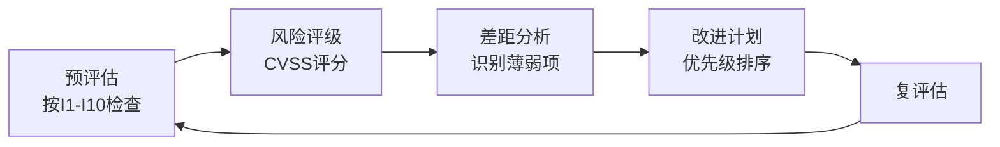
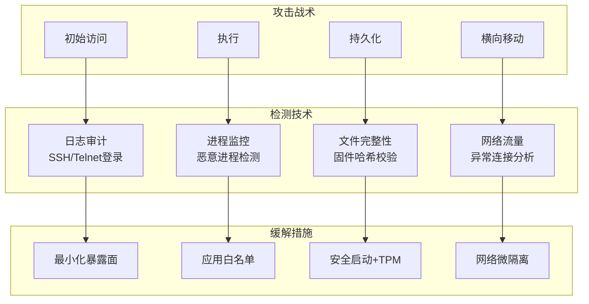
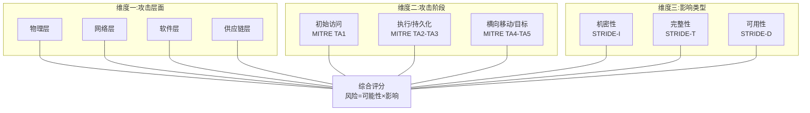

## 22.4 IoT安全威胁分类框架

### 22.4.1 为什么需要威胁分类框架

IoT环境的碎片化程度远超传统IT领域。一台智能灯泡和一台工业PLC之间，硬件架构、通信协议、操作系统、安全能力几乎没有共通之处。这种异质性意味着：

- 安全团队无法用"一种方案"覆盖所有设备
- 攻击者的入口点极其多样——从物理JTAG接口到云端API
- 漏洞的严重程度取决于设备所处的上下文环境

威胁分类框架的核心价值，是将碎片化的攻击面**系统化地组织成可分析、可管理、可排序的结构**。没有分类框架，安全评估就是无头苍蝇——只看得到单个漏洞，看不清整体风险格局。


**核心认知**：威胁分类不是学术体操，而是安全决策的基础设施。一个好的分类框架能回答三个问题：**什么能攻击我们？**（威胁面）、**攻击者会怎样做？**（攻击路径）、**我们应该先修什么？**（优先级排序）。


### 22.4.2 主流威胁分类框架对比

目前业界有多个适用于IoT的威胁分类框架，各有侧重。下表从覆盖度、可操作性、IoT适配性三个维度进行对比：

| 框架名称 | 发布方 | 核心定位 | IoT适配度 | 优势 | 局限 |
|---------|-------|---------|----------|------|------|
| OWASP IoT Top 10 | OWASP | 漏洞风险列表 | ★★★★★ | 简洁直观，适合入门评估和汇报 | 缺乏攻击过程描述，无战术层面 |
| MITRE ATT&CK for IoT | MITRE | 攻击者战术/技术 | ★★★★☆ | 覆盖攻击全生命周期，可用作防御映射 | 条目数量远少于企业版，IoT特化仍然有限 |
| STRIDE | Microsoft | 威胁类型分类 | ★★★☆☆ | 方法论成熟，可用于设计阶段威胁建模 | 最初为桌面软件设计，IoT物理层支持弱 |
| PASTA | 社区 | 风险导向威胁建模 | ★★★★☆ | 业务对齐好，输出可直接用于决策 | 流程较重，小型团队难以执行 |
| OCTAVE | CERT/SEI | 组织级风险评估 | ★★★☆☆ | 强调风险评估的整体性 | 非技术团队友好，但IoT细节不足 |

下面对最常用的三个框架（OWASP、MITRE、STRIDE）做深度展开。

### 22.4.3 OWASP IoT Top 10：漏洞导向分类

OWASP IoT Top 10 是目前最广泛引用的IoT安全风险评估框架。它从**漏洞角度**对IoT系统中的常见安全缺陷进行分类，适合用于安全审计和产品风险评估。

#### 十大威胁的深度解读

**I1 - 弱密码、可猜测密码或硬编码密码**

这是IoT安全的"头号公敌"。原因在于：
- IoT设备通常没有传统键盘和屏幕，用户无法（或不方便）修改密码
- 厂商为了产线效率，大量采用统一硬编码密码（如 `admin:admin`、`root:root`）
- 设备部署后无人维护，密码长期不变

**真实案例**：2016年Mirai僵尸网络正是利用大量IP摄像头和大屏电视盒子的默认密码 `root:xc3511` 和 `admin:123456`，在短短20天内感染了超过60万台设备，发起了破纪录的620Gbps DDoS攻击。

**防御要点**：
- 强制首次登录修改密码
- 禁止使用设备序列号、MAC地址等可预测信息作为默认密码
- 固件中不得以明文或硬编码方式存储凭据

**I2 - 不安全的网络服务**

IoT设备上运行的网络服务（HTTP、SSH、Telnet、MQTT、CoAP、UPnP等）是攻击者进入设备的主要入口。常见问题包括：
- 不必要的服务默认开启（如Telnet、FTP）
- 服务以root权限运行
- 协议实现存在缓冲区溢出（如CVE-2020-11896：Treck TCP/IP栈RCE漏洞）
- 认证机制缺失或可绕过

**防御要点**：
- 遵循最小化原则：只开放业务必需端口
- 服务运行在最低必要权限
- 所有网络服务必须经过模糊测试

**I3 - 不安全的生态系统接口**

IoT的"生态系统接口"包括：移动App API、云端API、设备间通信接口、第三方集成接口。攻击面呈指数级扩大。

典型问题：
- 云端API缺少速率限制，导致暴力破解
- App与设备之间的通信未使用双向认证
- 接口返回了超出业务需要的敏感信息（如用户全量列表）

**I4 - 缺乏安全的更新机制**

固件更新机制的脆弱性可能是IoT生态中最致命的系统性缺陷。具体表现为：
- 更新包未签名或签名可绕过
- 更新通过HTTP明文传输
- 固件更新过程无完整性校验
- 缺乏版本回退保护（允许降级攻击）

**典型案例**：2021年研究人员发现某知名智能门锁的OTA更新包通过HTTPS传输，但固件本身没有签名验证。攻击者只需在网络层面实施中间人攻击，即可推送恶意固件，解锁任何门锁。

**安全更新机制的最低要求**：
```text
安全OTA更新流程：
1. 厂商使用私钥对固件镜像进行签名（ECDSA或RSA-2048+）
2. 设备端预置公钥，验证签名后才允许写入
3. 固件包包含版本号，升级前检查版本不能低于当前版本
4. 传输层使用TLS 1.2+，证书校验不可跳过
5. 更新失败时回滚到上一个可用版本
```

**I5 - 使用不安全或过时的组件**

IoT设备大量使用第三方组件——RTOS、TCP/IP协议栈、加密库、Web服务器、文件系统。这些组件的安全漏洞是"借来的风险"。

- 消费类IoT设备的组件更新频率远低于IT设备
- 很多设备出厂时使用的就是已过时甚至已停止维护的组件版本
- 供应链中组件版本信息不透明，厂商自己都不清楚用了什么

**I6 - 不充分的隐私保护**

IoT设备天然是数据收集器——它知道你的位置（GPS）、生活习惯（传感器）、对话内容（麦克风）、健康状况（可穿戴设备）。隐私保护不足表现在：
- 不必要的数据收集（智能灯为什么要知道WiFi列表？）
- 数据未加密存储（本地数据库明文存放）
- 数据共享给第三方未获用户明确同意
- 用户删除账户后数据未真正清除

**GDPR罚款案例**：某智能家居厂商因默认收集用户语音数据并用于模型训练，被处以2000万欧元罚款。核心问题在于未获得用户的"明确同意"，仅在隐私政策中用模糊条款一笔带过。

**I7 ~ I10简述**

| 编号 | 威胁类型 | 核心问题 | 典型场景 |
|------|---------|---------|---------|
| I7 | 不安全的数据传输和存储 | 数据明文传输/存储、弱加密 | MQTT不启用TLS、数据库未加密 |
| I8 | 缺乏设备管理 | 终端可见性差、无资产管理 | 企业网络中"影子IoT"泛滥 |
| I9 | 不安全的默认设置 | 出厂配置不安全、用户不会更改 | 默认开启调试接口、DMZ区域 |
| I10 | 缺乏物理加固 | 物理接口暴露、防篡改不足 | JTAG/SWD口未锁、UART无密码 |

#### OWASP框架的使用方法

OWASP IoT Top 10 应作为 **风险评估检查表（Checklist）** 使用，而非威胁建模的唯一工具。推荐工作流：

1. **预评估**：对照10项逐一检查设备/系统，标记"符合/不符合/不适用"
2. **风险评级**：对"不符合"项进行CVSS评分，确定修复优先级
3. **差距分析**：识别哪些领域的安全措施最薄弱
4. **改进计划**：按优先级制定修复路线图



### 22.4.4 MITRE ATT&CK for IoT：攻击者导向分类

如果说OWASP框架回答的是"哪里有问题"，MITRE ATT&CK回答的是**"攻击者会怎么做"**。它从攻击者的视角，将攻击行为按照**战术（Tactics）→技术（Techniques）→步骤（Procedures）**三层模型组织。

#### 战术阶段详解

**TA1 - 初始访问（Initial Access）**

攻击者获得设备控制权的第一步。IoT场景下的独特入口点：

| 技术 | 适用场景 | 攻击复杂度 | 防御措施 |
|------|---------|-----------|---------|
| 利用公开应用程序 | Web管理面板、API端口暴露在公网 | 低 | 非必要不暴露管理端口，强制VPN |
| 硬编码凭据 | 所有出厂未改密码的设备 | 极低 | I1措施全覆盖 |
| 物理访问 | 部署在公共场所的设备 | 中-高 | 防拆螺丝、密封固化胶 |
| 供应链注入 | 在生产/运输环节植入后门 | 极高 | 供应链安全审计、硬件信任根 |
| 近场通信攻击 | NFC/BLE门禁设备 | 中 | 加密认证、距离限制 |

**TA2 - 执行（Execution）**

攻击者在设备上运行恶意代码的途径：
- 命令行接口：Telnet/SSH/串口控制台的未授权访问
- 固件修改：通过物理刷写或OTA漏洞推送修改固件
- 脚本注入：Web管理界面的命令/代码注入漏洞
- 通过其他设备传播：Mirai等僵尸网络的横向扩散

**TA3 - 持久化（Persistence）**

确保攻击者在设备重启或恢复后仍能保持控制：
- 固件植入：在文件系统或闪存中植入后门
- 修改启动过程：篡改uboot参数或systemd单元
- 预留远程后门：修改防火墙规则开放特定端口
- 利用硬件写保护缺失：如果Flash的写保护未开启，攻击者可刷写引导区

**TA4 - 横向移动（Lateral Movement）**

攻击者从已攻陷的设备向网络内部渗透：
- 利用信任关系：IoT设备与内网服务器之间无认证的内部通信
- 网络嗅探：从IoT设备的网口嗅探内网流量
- 密码喷射：用已经获取的密码尝试登录其他设备
- 中间人：如果IoT设备作为网关，攻击者可在其上部署MITM代理

#### ATT&CK映射到防御

ATT&CK框架最大的实用价值是**防御映射**——每个攻击技术都可以对应至少一种检测或缓解措施：



#### MITRE框架的使用方法

对已部署的IoT系统进行攻击模拟的推荐流程：

1. **资产盘点**：列出所有IoT设备及其功能和网络位置
2. **攻击路径建模**：对每类设备，走一遍ATT&CK的战术阶段，识别哪些技术可行
3. **红蓝对抗**：基于建模结果设计攻防演练方案
4. **检测覆盖评估**：对照框架评估现有安全检测能力是否有缺口

### 22.4.5 STRIDE IoT适配：设计导向分类

STRIDE最初是Microsoft为Windows应用程序开发的威胁建模方法，每个字母代表一种威胁类型。将其适配到IoT场景后：

| 威胁类型 | IoT场景示例 | 典型案例 |
|---------|-----------|---------|
| **S**poofing（身份欺骗） | 伪造设备身份接入云平台 | 攻击者克隆合法设备的证书连接IoT Hub |
| **T**ampering（篡改） | 篡改传感器数据、修改固件 | 篡改温度传感器数值触发误报警 |
| **I**nformation Disclosure（信息泄露） | 侧信道泄露密钥、固件包含敏感信息 | 从固件镜像中提取WiFi密码 |
| **R**epudiation（抵赖） | 设备操作日志不可信 | 攻击者清除固件修改记录无法追踪 |
| **D**enial of Service（拒绝服务） | 耗尽设备资源、无线干扰 | 连续发送大量非法MQTT包导致设备重启 |
| **E**levation of Privilege（权限提升） | 从普通用户提权到root | 利用Web接口的命令注入获得root shell |

#### STRIDE在IoT设计阶段的应用

STRIDE最有价值的应用场景在**系统设计阶段**。在编写一行代码之前，用STRIDE过一遍设计文档，能够发现大量架构层面的安全问题。

**数据流图驱动威胁建模**：

```text
[传感器] --(未加密数据)--> [网关] --(API请求)--> [云服务器]
                             |                      |
                          [本地存储]             [数据库]
```

对每个数据流和应用组件应用STRIDE分析：

| 数据流/组件 | S | T | I | R | D | E | 风险等级 | 缓解方案 |
|------------|---|---|---|---|---|---|---------|---------|
| 传感器→网关 | ✓ | ✓ | ✓ | | | | 高 | 启用TLS + 双向认证 |
| 网关→云服务器 | ✓ | ✓ | ✓ | ✓ | ✓ | | 中 | 互认证书 + API rate limit |
| 网关本地存储 | | ✓ | ✓ | | | ✓ | 高 | 全盘加密 + 访问控制 |
| 云数据库 | ✓ | ✓ | ✓ | ✓ | ✓ | ✓ | 中 | 数据库防火墙 + 审计日志 |

### 22.4.6 IoT攻击向量全景分析

框架提供了结构化的分类视角，但实际攻击需要更细致的攻击向量分析。下表按四个层面展开：

#### 物理层面（Physical Layer）

| 攻击向量 | 所需条件 | 攻击难度 | 影响范围 | 防御手段 |
|---------|---------|---------|---------|---------|
| JTAG/SWD调试接口 | 物理接触设备、J-Link/OpenOCD工具 | 中 | 可读取完整固件、设置断点反调试 | 禁用JTAG熔丝、锁定调试接口 |
| UART串口 | 物理接触、逻辑分析仪/TTL转换器 | 低-中 | 获取root shell、修改文件系统 | 设置UART登录密码、禁用shell |
| 闪存芯片读取 | 热风枪拆焊芯片、SPI Flash读取器 | 中-高 | 全量固件提取、密钥材料读取 | 启用读保护(RDP)、加密存储 |
| 侧信道攻击 | 示波器/电流探针、统计分析 | 高 | 提取加密密钥 | 掩码技术、恒定时间算法 |
| 物理篡改 | 物理接触、撬锁工具 | 低-中 | 绕过物理访问控制 | 防拆开关、密封固化胶 |


**关键洞见**：许多团队花费大量精力在网络安全上，却忽略了最基本的物理攻击防护。如果你的设备部署在公共场所（智能停车计时器、公共WiFi热点、智能路灯），物理攻击是**大概率事件**而非小概率事件。一个暴露的UART接口就能让所有软件层安全防护形同虚设。


#### 网络层面（Network Layer）

| 攻击向量 | 目标协议/技术 | 常见工具 | 防御措施 |
|---------|-------------|---------|---------|
| MQTT嗅探/注入 | MQTT (1883/TCP) | Wireshark, mqtt-pwn | 强制TLS、客户端证书认证 |
| CoAP放大攻击 | CoAP (UDP/5683) | scapy | 源地址验证、速率限制 |
| BLE中间人 | BLE 4.0/5.0 | GATTacker, bettercap | 配对过程使用Just Works? → 使用Passkey Entry |
| ZigBee嗅探/重放 | ZigBee | Z-Shark, KillerBee | 网络密钥定期更换、加密通信 |
| WiFi deauth攻击 | WiFi 802.11 | aircrack-ng, mdk4 | 启用802.11w管理帧保护(PMF) |
| UPnP SSDP反射 | UPnP (UDP/1900) | 自动扫描 | 关闭WAN口的UPnP |

#### 软件层面（Software Layer）

| 攻击向量 | 常见入口 | 攻击手法 | 发现难度 | 修复成本 |
|---------|---------|---------|---------|---------|
| Web接口注入 | 管理面板、API | SQLi, XSS, 命令注入 | 低-中 | 低 |
| 缓冲区溢出 | 网络服务、协议栈 | 模糊测试→ROP链 | 高 | 中-高 |
| 固件逆向分析 | 固件更新包、Flash dump | binwalk → Ghidra → 漏洞挖掘 | 中-高 | 低(预防) |
| 逻辑漏洞 | 业务流程 | 绕过认证/授权检查 | 中 | 低-中 |
| 内存安全漏洞 | C/C++固件 | Use-After-Free, 整型溢出 | 高 | 中-高(RTOS需重写) |
| 不安全的OTA | 固件更新流程 | 降级攻击、签名绕过 | 中 | 低 |

#### 供应链层面（Supply Chain Layer）

| 攻击向量 | 攻击阶段 | 检测难度 | 影响范围 | 防御手段 |
|---------|---------|---------|---------|---------|
| 恶意固件预植入 | 制造/组装 | 极高 | 全局 | 硬件可信根(TRO) + 代码签名验证 |
| 第三方库后门 | SDK开发 | 高 | 使用该库的所有设备 | SBOM管理 + 漏洞扫描 |
| 测试接口保留 | 生产测试 | 中 | 该批次设备 | 量产版固件移除调试功能 |
| 假芯片/翻新芯片 | 采购 | 高 | 该批次设备 | 供应链源头审计 + 芯片真伪验证 |

### 22.4.7 三维威胁分类模型：综合实践框架

单一的框架总有其盲区。推荐的实操方案是构建一个**三维分类模型**，将多个框架的视角融合：



使用这个三维模型进行威胁评估的步骤：

1. **选择攻击层面**：确定要评估的层面（例如网络层）
2. **枚举攻击阶段**：该层面的每个攻击向量处于哪个攻击阶段
3. **评估影响类型**：这个攻击向量主要影响哪些安全属性
4. **综合评分**：从技术可实现性（攻击难度）和业务影响两个维度打分
5. **制定缓解方案**：为每个高分的交叉点设计缓解措施

#### 三维模型评估示例

以某智能门锁为例的三维评估矩阵：

| 攻击向量 | 攻击层面 | 攻击阶段 | 影响类型 | 攻击难度(1-5) | 影响程度(1-5) | 风险分数 | 缓解优先级 |
|---------|---------|---------|---------|:------------:|:------------:|:--------:|:---------:|
| BLE接口未加密 | 网络层 | 初始访问 | 机密性 | 2 | 5 | 10 | ★★★★★ |
| UART串口暴露 | 物理层 | 初始访问 | 完整性 | 1 | 5 | 5 | ★★★★★ |
| OTA签名绕过 | 软件层 | 执行+持久化 | 完整性 | 3 | 5 | 15 | ★★★★☆ |
| 传感器欺骗 | 网络层 | 执行 | 完整性+可用性 | 3 | 3 | 9 | ★★★☆☆ |
| 云API暴力破解 | 网络层 | 初始访问 | 机密性 | 2 | 4 | 8 | ★★★☆☆ |
| 第三方SDK漏洞 | 供应链 | 执行 | 完整性 | 4 | 4 | 16 | ★★☆☆☆ |

> 风险分数 = 攻击难度 × 影响程度。优先级=风险分数+业务紧迫度修正。

### 22.4.8 真实案例分析：分类框架的应用

#### 案例一：Mirai僵尸网络（OWASP + MITRE交叉分析）

**背景**：2016年，Mirai恶意软件利用IoT设备的默认密码，感染了数百万台设备。

**OWASP视角分析**：
- 主要涉及威胁：I1（弱密码/硬编码密码）
- 次要涉及威胁：I2（不安全网络服务——Telnet默认开启）、I8（缺乏设备管理）

**MITRE视角分析**：
- 初始访问：利用公开应用程序（扫描开放Telnet端口）→ 硬编码凭据登录
- 执行：通过CLI下载恶意负载
- 持久化：修改固件、阻断杀毒更新
- 横向移动：扫描同网段设备→重复初始访问→扩散

**教训**：单看OWASP框架，Mirai只是一个"密码问题"；结合MITRE框架，才能看到完整的攻击链，从而找到多个防御阻断点——阻止初始扫描、强化认证、网络隔离环环相扣。

#### 案例二：智能灯泡成为内网跳板（STRIDE + 三维模型）

**背景**：安全研究人员演示了通过攻破一个WiFi智能灯泡，进入家庭内网并访问NAS设备的全过程。

**攻击链**：
1. **物理层面/初始访问**：从灯泡的SPI Flash（未锁）dump出固件
2. **软件层面/权限提升**：逆向固件找到硬编码WiFi密码和云平台API Key
3. **网络层面/横向移动**：用WiFi密码接入家庭网络，扫描到NAS设备
4. **网络层面/信息泄露**：NAS默认共享目录未设置密码，敏感文件被访问

**三维模型评分**：
- 攻击难度：2（物理接触需要，但工具简单）
- 影响程度：5（内网全部暴露）
- 综合风险：10（高优先级）

**综合缓解方案**：
| 缓解措施 | 分类归属 | 阻断环节 |
|---------|---------|---------|
| 启用Flash读保护 | 物理层 | 阻止固件dump |
| 固件中不存储明文WiFi凭据 | 软件层 | 即使dump也无法获取网络密钥 |
| 设备使用独立的IoT VLAN | 网络层 | 即使接入也无法访问NAS |
| NAS设置强认证+防火墙 | 网络层 | 即使在内网也需要认证 |

### 22.4.9 常见误区与纠正

#### 误区一："威胁分类太理论化，实战没用"

纠正：分类框架的真正作用是**系统性思考**。没有框架的渗透测试是点状的（发现A漏洞、修复A漏洞），有框架的测试是面状的（分析全面临、系统化防御）。实际的差距如下：

| 无框架方式 | 有框架方式 |
|-----------|-----------|
| 测试人员随机选几个端口扫描 | 按攻击层面逐一检查物理/网络/软件/供应链 |
| 只关注已知漏洞 | 也关注攻击者可能利用的逻辑和流程漏洞 |
| 修复后不复查覆盖面是否有盲区 | 用分类模型验证所有攻击向量是否被覆盖 |

#### 误区二："用OWASP就够了，已经覆盖了主要问题"

纠正：OWASP IoT Top 10是**漏洞列表**，不是**攻击模型**。它告诉你"设备有哪些常见漏洞"，但不告诉你"攻击者如何组合利用这些漏洞"。建议将OWASP作为入门检查表，同时结合MITRE重构攻击路径，用STRIDE在设计阶段防患于未然。

#### 误区三："分类越详细越好"

纠正：分类的颗粒度需要和团队的成熟度匹配。一个10人的创业团队不可能执行PASTA那样的完整威胁建模流程。**选择框架的标准不是越全越好，而是能用起来**。推荐匹配方案：

| 团队类型 | 推荐框架组合 | 频率 |
|---------|------------|------|
| 创业团队/小型产品 | OWASP IoT Top 10 自查 | 每季度一次 |
| 中型企业/消费IoT | OWASP + MITRE ATT&CK 攻击链 | 每月一次 + 重大更新 |
| 大型企业/工业IoT | OWASP + MITRE + STRIDE + 三维评估 | 持续集成到开发流程 |

### 22.4.10 进阶：自动化威胁建模

对于成熟的团队，可以将威胁分类框架工具化：

**Microsoft Threat Modeling Tool**：支持拖拽式DFD建模，自动STRIDE分类，生成威胁报告。

**OWASP Threat Dragon**：开源替代方案，支持Web和桌面端，可导出JSON格式威胁模型。

**自定义脚本示例**：用Python将三维评估模型自动化

```python
#!/usr/bin/env python3
"""IoT威胁评估自动化脚本"""

import json
from dataclasses import dataclass

@dataclass
class ThreatVector:
    name: str
    layer: str          # physical/network/software/supply
    phase: str          # initial/execution/persist/lateral
    impact_type: str    # confidentiality/integrity/availability
    difficulty: int     # 1-5
    impact: int         # 1-5

    @property
    def risk_score(self) -> int:
        return self.difficulty * self.impact

    @property
    def priority(self) -> str:
        if self.risk_score >= 12:
            return "CRITICAL"
        elif self.risk_score >= 8:
            return "HIGH"
        elif self.risk_score >= 4:
            return "MEDIUM"
        return "LOW"

class IoTTreatAssessor:
    def __init__(self):
        self.threats = []

    def add_threat(self, threat: ThreatVector):
        self.threats.append(threat)

    def prioritize(self):
        """按风险评分排序"""
        return sorted(self.threats, key=lambda t: t.risk_score, reverse=True)

    def by_layer(self, layer: str):
        """按攻击层面筛选"""
        return [t for t in self.threats if t.layer == layer]

    def report(self) -> str:
        """生成文本报告"""
        lines = ["=" * 60,
                  "IoT威胁评估报告",
                  "=" * 60]
        for t in self.prioritize():
            lines.append(
                f"[{t.priority:8s}] {t.name:30s} "
                f"层:{t.layer:10s} 难度:{t.difficulty} 影响:{t.impact} "
                f"风险分:{t.risk_score}"
            )
        lines.append("-" * 60)
        lines.append(f"总威胁项: {len(self.threats)}")
        lines.append(f"CRITICAL: {sum(1 for t in self.threats if t.risk_score >= 12)}")
        lines.append(f"HIGH: {sum(1 for t in self.threats if 8 <= t.risk_score < 12)}")
        lines.append(f"MEDIUM: {sum(1 for t in self.threats if 4 <= t.risk_score < 8)}")
        lines.append(f"LOW: {sum(1 for t in self.threats if t.risk_score < 4)}")
        return "\n".join(lines)

# 使用示例
assessor = IoTTreatAssessor()
assessor.add_threat(ThreatVector(
    "BLE未加密", "network", "initial",
    "confidentiality", 2, 5
))
assessor.add_threat(ThreatVector(
    "OTA签名绕过", "software", "persist",
    "integrity", 3, 5
))
print(assessor.report())
```

### 22.4.11 总结与行动指南

| 你的角色 | 你应该做的事 | 使用的框架 | 检查频率 |
|---------|------------|-----------|---------|
| IoT产品经理 | 确保产品开发流程包含安全评审节点 | OWASP IoT Top 10 + 设计评审 | 每个里程碑 |
| 固件开发者 | 熟悉三类威胁，在编码阶段注意常见漏洞 | STRIDE + 安全编码规范 | 代码审查持续嵌入 |
| 安全工程师 | 建立威胁模型，定期执行攻击模拟 | MITRE ATT&CK + 三维评估 | 每月一次 |
| 运维人员 | 部署IoT设备的网络监控和资产管理 | OWASP I8(IoT管理) + 网络监控 | 持续监控 |
| CISO/管理层 | 确保安全预算覆盖了所有威胁层面 | 三维模型 + 风险报告 | 每季度汇报 |

**核心记忆点**：威胁分类不是终点，而是安全工作的起点。OWASP告诉你"修什么"，MITRE告诉你"防什么"，STRIDE告诉你"想什么"，三维模型告诉你"怎么排优先级"。四者结合，才能构建IoT安全的完整防线。

---

## 拓展阅读

- OWASP IoT Top 10 (2018)：https://owasp.org/www-project-internet-of-things/
- MITRE ATT&CK for IoT：https://attack.mitre.org/resources/oth/
- Microsoft STRIDE威胁建模：https://learn.microsoft.com/en-us/azure/security/develop/threat-modeling-tool
- 《IoT安全攻防》阿里安全研究团队著，电子工业出版社
- NIST SP 800-183：物联网网络与设备的威胁模型