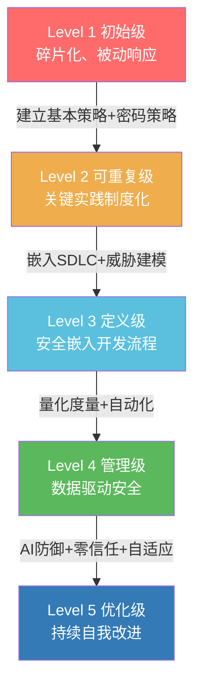
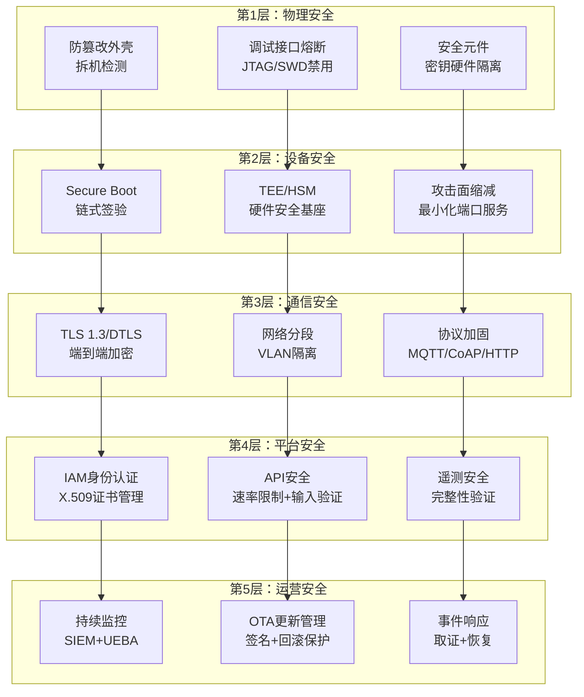

# 22.5 IoT安全模型与标准

## 22.5.1 概述：为什么IoT需要专门的安全模型与标准

IoT系统与传统IT系统存在根本性差异，这是通用安全模型（如ISO 27001）无法直接套用的原因。IoT设备的资源受限性（CPU、内存、电池）、异构性（从传感器到网关到云端）、大规模部署特性以及物理可访问性，决定了其安全模型必须考虑以下特殊性：

- **资源约束**：许多IoT设备无法运行完整的防病毒软件或复杂的加密算法，安全控制必须轻量化
- **物理暴露**：设备部署在不受控环境中，攻击者可直接物理接触
- **生命周期长**：设备可能运行5-10年甚至更久，期间需持续维护安全更新
- **多样化的通信协议**：从BLE、ZigBee到MQTT、CoAP，协议栈差异巨大
- **功能安全与信息安全交叉**：尤其在工业IoT中，安全控制不能影响设备的实时控制功能

安全模型提供的是"如何思考安全性"的框架性指导，而安全标准提供的是"具体应该做什么"的可衡量要求。两者相辅相成：模型指导架构设计，标准指导合规验证。

## 22.5.2 IoT安全成熟度模型

### 22.5.2.1 模型设计原理

IoT安全成熟度模型借鉴CMMI（能力成熟度模型集成）的分级思想，将安全能力从混沌状态逐步演化为可量化、可优化的工程化体系。该模型定义了5个渐进级别，每个级别覆盖4个关键域：

1. **管理域**：安全策略、组织架构、人员培训
2. **技术域**：身份认证、加密、监控、更新
3. **流程域**：漏洞管理、应急响应、合规审计
4. **供应链域**：第三方组件管理、供应商安全评估

### 22.5.2.2 五级成熟度详解

#### Level 1 — 初始级（Ad Hoc）

**特征描述**：安全活动碎片化、被动响应式、依赖个人能力而非制度流程。这是大多数初创IoT企业和非安全敏感行业（如消费类智能家居）的常见起点。

**具体表现**：
| 维度 | 典型状态 |
|------|----------|
| 密码管理 | 出厂默认密码未强制修改（如 admin/admin） |
| 固件签验 | 无签名验证，固件可被任意替换 |
| 日志记录 | 无安全日志，或日志仅存在本地易丢失 |
| 安全更新 | 手动更新，无推送机制，用户常忽略 |
| 人员意识 | 开发人员不了解安全编码规范 |

**评估要点**：
- 是否存在任何书面安全策略？
- 是否为每台设备设置了唯一凭据？
- 是否有已知漏洞的跟踪方式？

**风险案例**：Mirai僵尸网络利用的就是大量处于Level 1状态的IoT摄像头——使用默认密码、Telnet端口开放、无更新机制。2016年9月，Mirai发起的DDoS攻击峰值达到1.2Tbps，导致Twitter、Netflix、Reddit等平台大面积瘫痪。

#### Level 2 — 可重复级（Repeatable）

**特征描述**：关键安全实践已制度化，可在不同项目间复制。但安全仍被视为独立的"附加活动"而非研发流程的有机组成部分。

**具体表现**：
| 维度 | 典型状态 |
|------|----------|
| 密码管理 | 强制首次登录修改密码，支持WPA2/WPA3 |
| 通信加密 | TLS 1.2+ 应用于网络通信 |
| 固件签名 | 固件已签名验证，防止篡改 |
| 更新机制 | OTA更新可用，但缺乏回滚保护 |
| 安全测试 | 上线前进行基本的安全扫描 |

**关键实践**：
- 建立密码策略规范（长度≥8位、复杂度要求）
- 实现安全的引导加载程序（Secure Boot）
- 部署基本的安全开发培训
- 使用静态代码分析工具扫描常见漏洞

**评估要点**：
- 是否可以在两个以上项目中复制相同的最小安全基线？
- 安全需求是否在项目启动时就被明确提出？

#### Level 3 — 定义级（Defined）

**特征描述**：安全已嵌入开发流程（SDLC），组织级的安全标准统一定义并强制执行。安全团队与开发团队建立了协作机制。

**具体表现**：
| 维度 | 典型状态 |
|------|----------|
| 策略体系 | 完整的安全策略文档，覆盖设计到退役全生命周期 |
| 漏洞管理 | 建立漏洞录入→评估→修复→验证的完整流程 |
| 安全监控 | 集中式日志收集（SIEM），异常行为告警 |
| 威胁建模 | 新功能上线前进行STRIDE或攻击树分析 |
| 供应链管理 | 第三方组件清单（SBOM）建立并维护 |

**关键实践**：
- 实施SDL（安全开发生命周期），在需求阶段即引入安全
- 建立漏洞奖励计划（Bug Bounty）
- 定期渗透测试（至少每年一次）
- 制定事件响应计划（IR Plan）

**评估要点**：
- 安全策略是否覆盖了设备全生命周期？
- 是否有定量指标衡量安全活动成效（如漏洞修复MTTR）？

#### Level 4 — 量化管理级（Managed）

**特征描述**：安全活动实现量化管理和可预测性。通过数据驱动决策，安全投入与风险降低之间有可证明的量化关系。

**具体表现**：
| 维度 | 典型状态 |
|------|----------|
| 自动化测试 | CI/CD中集成自动化安全测试（SAST/DAST/IAST） |
| 威胁情报 | 接入外部威胁情报平台（如MISP），关联分析 |
| 风险量化 | 使用FAIR模型量化安全风险（损失期望值） |
| 基线合规 | 自动化合规检查工具持续监控安全基线 |
| 安全仪表盘 | 管理层可实时查看安全态势 |

**关键实践**：
- 建立安全度量体系（如漏洞密度、修复周期、覆盖度）
- 使用自动化的安全编排（SOAR）加速事件响应
- 引入模糊测试（Fuzzing）全面覆盖协议接口
- 部署运行时应用自我保护（RASP）于关键设备

**评估要点**：
- 安全活动是否可以用KPI和KRI量化呈现？
- 管理层是否能基于数据做出风险接受决策？

#### Level 5 — 优化级（Optimizing）

**特征描述**：安全体系持续自我改进，具备前瞻性的风险感知和自适应防御能力。安全不仅是被动防护，更是业务竞争力的组成部分。

**具体表现**：
| 维度 | 典型状态 |
|------|----------|
| AI/ML防御 | 基于机器学习的异常检测（设备行为基线分析） |
| 零信任架构 | 所有访问请求均需验证，不信任任何网络边界 |
| 主动狩猎 | 威胁狩猎团队主动搜索潜伏威胁 |
| 供应链溯源 | 硬件和软件组件的完整可追溯性 |
| 自适应策略 | 基于上下文动态调整安全策略（如地理位置、时间） |

**关键实践**：
- 部署基于行为分析的UEBA（用户与实体行为分析）
- 实施安全网格架构（SMA）
- 建立红蓝对抗机制，持续检验防御有效性
- 参与行业安全标准的制定和对标

**评估要点**：
- 安全体系是否能自我检测缺陷并自动修复？
- 是否具备预测性风险分析能力？

### 22.5.2.3 成熟度评估方法

评估IoT安全成熟度通常采用以下方法：

**自评估问卷法**：设计覆盖4个关键域（管理、技术、流程、供应链）的问题集，每个问题对应1-5分。例如：
- "固件是否经过数字签名验证？"——Level 2及以上
- "是否建立量化的安全度量仪表盘？"——Level 4
- "威胁检测系统是否采用机器学习模型？"——Level 5

**第三方审计法**：委托专业安全评估机构进行现场审计，包含文档审查、人员访谈、技术验证。推荐频率：每年一次。

**技术验证法**：通过工具扫描、渗透测试、配置审计等手段客观验证安全控制的有效性，与自评估结果交叉比对。

### 22.5.2.4 常见误区

| 误区 | 事实 |
|------|------|
| "Level 5才是目标" | 大多数IoT产品Level 3已足够，安全应与业务风险匹配而非追求最高级别 |
| "一次评估定终身" | 成熟度会随系统演进、人员流动而退化，需要定期复评（建议季度或半年） |
| "成熟度越高越安全" | 成熟度衡量的是过程能力，不直接等于安全结果。高成熟度但选错控制依然会出问题 |
| "IoT和IT用同一套标准" | IoT的资源约束和物理暴露特性要求专门适配的评估维度 |

#### Mermaid: IoT安全成熟度演进路径



## 22.5.3 IoT安全参考架构模型

### 22.5.3.1 多层防御模型（Defense-in-Depth for IoT）

传统纵深防御强调"网络边界防护"，但IoT场景中设备往往超出物理边界。针对IoT调整后的纵深防御包含5个层次：

**第1层：物理安全**
- 防篡改外壳（Tamper-resistant enclosure）
- JTAG/SWD调试接口熔断或禁用
- 安全元件（Secure Element/TPM）集成
- 物理防拆检测（Tamper detection switches）

**第2层：设备安全**
- 安全启动（Secure Boot）：链式签名验证，确保固件完整性
- 可信执行环境（TEE）：ARM TrustZone或RISC-V的物理内存隔离
- 硬件安全模块（HSM）：密钥存储在独立硬件中
- 最小化攻击面：禁用未使用的端口和服务

**第3层：通信安全**
- 传输层加密（TLS 1.3/DTLS 1.3）
- 网络分段：IoT设备VLAN与IT网络隔离
- 协议安全：MQTT over TLS、CoAP over DTLS、HTTPS
- 入站连接限制：设备不应监听非必要端口

**第4层：平台安全**
- 云平台侧的身份与访问管理（IAM）
- 设备身份注册与认证（X.509证书）
- 设备遥测数据的完整性验证
- API网关的安全加固（速率限制、输入验证）

**第5层：运营安全**
- 持续监控与异常检测
- OTA安全更新管理
- 漏洞生命周期管理
- 事件响应与取证

#### Mermaid: IoT纵深防御层次



### 22.5.3.2 零信任架构在IoT中的应用

零信任的核心原则"永不信任，始终验证"对于IoT场景尤其关键，因为IoT设备可能被物理接管或网络端口已被攻破。

**IoT零信任三大支柱**：

1. **微隔离（Micro-segmentation）**：将IoT设备分组为最小信任域，每个域之间的流量需经策略检查。例如：智能门锁属于"高安全域"，与智能灯泡的"普通域"严格隔离。

2. **持续验证（Continuous Verification）**：不仅设备上线时验证身份，运行期间也持续验证行为。设备行为若偏离基线（如异常的网络连接模式），立即触发隔离。

3. **最小权限（Least Privilege）**：设备仅获得完成任务所需的最小网络访问权限。温度传感器不需要访问人力资源数据库。

**实施挑战**：
- IoT设备的资源受限性使得频繁的证书轮换和实时身份验证难以实现
- 老旧设备可能不支持现代加密协议
- 大规模设备（数万级别）的策略管理复杂度高

**解决方案**：
- 使用网关作为零信任代理，由网关代表设备执行策略检查
- 采用硬件信任根（Hardware Root of Trust）减轻软件验证压力
- 使用基于身份的网络访问控制（NAC）自动化策略部署

### 22.5.3.3 物联网安全参考模型（IoT Security Reference Model）

IEEE P2413和ITU-T Y.2060定义了通用的IoT参考架构，在此基础上叠加安全维度形成完整的安全参考模型：

| 层次 | 安全关注点 | 关键控制 |
|------|-----------|---------|
| **应用层** | API安全、数据隐私、访问控制 | OAuth 2.0/OIDC、数据脱敏、WAF |
| **服务支撑层** | 设备管理、规则引擎安全 | 设备认证、策略引擎、日志审计 |
| **网络层** | 传输加密、路由安全、协议保护 | TLS/DTLS、IPSec、DNSSEC |
| **感知层** | 设备身份、传感器数据完整性 | 设备指纹、消息签名、时钟同步 |

## 22.5.4 主要IoT安全标准体系

### 22.5.4.1 NIST系列标准

美国国家标准与技术研究院（NIST）发布了针对IoT的专门安全指南，是目前国际上最具影响力的IoT安全标准体系之一。

#### NIST SP 800-183：IoT网络与设备网络安全

发布于2020年，提供了IoT系统的网络安全框架。核心内容：

**IoT系统三要素**：
- **感知层**（Thing）：物理设备，包含传感器/执行器和网络接口
- **通信层**（Communication）：设备间的数据传输路径
- **计算层**（Compute）：数据处理和存储的后端系统（云或边缘）

**核心原则**：
- 安全不是产品的附加功能，而是系统的基本属性
- 安全控制必须在系统设计阶段就纳入考虑
- 风险管理方法贯穿整个IoT生命周期

#### NISTIR 8259系列：IoT设备网络安全能力核心基准

该系列包含两个核心文档，是NIST最常被引用的IoT安全框架：

**NISTIR 8259**（基础框架）定义六大核心能力：
1. **设备标识**：每个设备具有唯一的、不可伪造的身份标识
2. **设备配置**：支持安全配置，包括初始设置和运行期变更
3. **数据保护**：存储和传输中的数据加密
4. **逻辑接口安全**：设备的API和网络接口的安全设计
5. **软件和固件更新**：支持签名验证的更新机制
6. **网络安全事件感知**：设备能产生安全事件日志

**NISTIR 8259A**（IoT设备制造商基线活动）进一步细化为6项制造商必做活动：
1. 识别客户和预期用例
2. 确定设备所需的网络安全能力
3. 制定设备网络安全配置计划
4. 制定设备维护计划（包括更新策略）
5. 制定设备退役计划（包括数据擦除）
6. 编制设备网络安全信息文档（供客户参考）

#### NIST网络安全框架（CSF 2.0）在IoT中的应用

CSF 2.0的6大功能（治理、识别、保护、检测、响应、恢复）可映射到IoT场景：

| CSF功能 | IoT映射 | 输出物示例 |
|---------|---------|-----------|
| 治理 | IoT安全管理策略 | 安全策略文档、角色职责矩阵 |
| 识别 | IoT资产清单、威胁建模 | 设备SBOM、攻击面分析报告 |
| 保护 | 设备加固、通信加密、身份认证 | 安全基线配置、TLS部署文档 |
| 检测 | IoT异常行为监控 | SIEM告警规则、ML行为模型 |
| 响应 | IoT事件响应计划 | 响应流程剧本、取证工具链 |
| 恢复 | 固件恢复机制、灾备方案 | OTA回滚程序、备份策略 |

### 22.5.4.2 ETSI EN 303 645（欧洲消费级IoT安全标准）

ETSI（欧洲电信标准化协会）发布的EN 303 645是**目前全球范围内最被广泛采纳的消费级IoT安全标准**，是GDPR在IoT领域的具体细化。

**标准背景**：2019年发布，2020年正式成为欧洲标准。欧盟委员会在其《网络安全法案》中明确引用ETSI EN 303 645作为消费级IoT设备的推荐标准。许多欧洲零售商已将符合该标准作为上架条件。

#### 13项安全规定详解

| 编号 | 规定 | 技术实施要点 |
|------|------|-------------|
| **1** | **无通用默认密码** | 每台设备出厂必须有唯一密码；禁止使用"admin/admin"类默认密码；提供密码强度指示器 |
| **2** | **实施漏洞披露政策** | 公开联系渠道用于安全研究人员报告漏洞；在48小时内确认收到报告；承诺合理时间内修复 |
| **3** | **保持软件更新** | 声明支持更新的最短周期（至少明确标注）；更新包必须签名验证；自动检查更新 |
| **4** | **安全存储敏感参数** | 密钥和证书存储在HSM或TEE中；凭据不能以明文形式存储在可访问的文件系统中 |
| **5** | **安全通信** | 所有的网络通信必须使用加密（TLS 1.2+）；设备必须验证服务器的证书 |
| **6** | **最小化攻击面** | 禁用所有未使用的网络端口和服务；仅暴露设备功能所必需的接口 |
| **7** | **确保软件完整性** | 支持安全启动；仅运行经过签名验证的代码 |
| **8** | **保护个人数据** | 收集的数据仅限功能所需（数据最小化）；提供数据删除机制；符合GDPR要求 |
| **9** | **系统可用性** | 安全功能失效时设备应进入安全状态而非完全不可用；拒绝服务不应导致设备失控 |
| **10** | **易删除个人数据** | 提供工厂重置功能，彻底删除用户数据；重置后不能恢复用户数据 |
| **11** | **简化安装和维护** | 初始配置过程引导用户设置安全选项；提供直观的安全状态指示 |
| **12** | **验证输入数据** | 对所有用户输入和服务端输入进行验证；防止注入攻击和缓冲区溢出 |
| **13** | **物理安全** | 防止通过物理调试接口获取敏感数据；敏感区域的物理访问需认证 |

#### ETSI EN 303 645合规检查表示例

以下为针对规定1（无通用默认密码）的详细检查项：
```text
□ 每台设备出厂时是否具有唯一的设备密码？
□ 初始设置过程是否要求用户修改密码？
□ 密码是否满足最小长度和复杂度要求？
□ 是否有防止暴力破解的机制（速率限制/锁定）？
□ 密码是否以加密形式存储？
□ 密码重置流程是否进行了身份验证？
```

### 22.5.4.3 ISO/IEC 27400系列（国际标准）

ISO/IEC JTC 1/SC 41（物联网与数字孪生标准化技术委员会）发布的IoT安全系列标准，构成完整的标准体系：

| 标准编号 | 内容 | 适用对象 |
|---------|------|---------|
| **ISO/IEC 27400** | IoT安全与隐私指南——总体框架和原则 | 所有IoT利益相关方 |
| **ISO/IEC 27402** | IoT设备安全基线要求 | IoT设备制造商 |
| **ISO/IEC 27403** | IoT安全——安全威胁与风险评估 | 安全评估人员 |
| **ISO/IEC 27404** | IoT安全——安全控制基线目录 | 安全架构师 |

**ISO/IEC 27400核心原则**：
- 安全性必须在每个阶段被考虑（设计、开发、部署、运维、退役）
- 安全控制应与风险评估结果匹配，过度的安全控制可能影响可用性
- 隐私保护应作为IoT系统设计的内在组成部分（Privacy by Design）

### 22.5.4.4 中国国家标准体系

中国在IoT安全领域的标准化工作由全国信息安全标准化技术委员会（TC260）主导，已形成较完整的标准体系：

| 标准编号 | 名称 | 核心要求 |
|---------|------|---------|
| **GB/T 36951-2018** | 信息安全技术 物联网感知终端应用安全技术要求 | 终端身份标识、数据加密、物理安全 |
| **GB/T 37024-2018** | 信息安全技术 物联网感知层网关安全技术要求 | 网关认证、协议转换安全、防火墙功能 |
| **GB/T 37025-2018** | 信息安全技术 物联网数据传输安全技术要求 | 数据机密性、完整性保护 |
| **GB/T 38600-2020** | 信息安全技术 物联网安全参考模型及通用要求 | 安全参考架构、通用安全需求 |
| **GB/T 40652-2021** | 信息安全技术 物联网安全检测评估方法 | 渗透测试、合规检测方法 |
| **GB/T 41391-2022** | 信息安全技术 移动互联网应用程序收集个人信息基本要求 | 数据最小化、用户授权 |

**中国IoT安全标准的特点**：
- 更强调**感知层的安全控制**（物理安全的中国场景下更突出）
- 与《网络安全法》《数据安全法》《个人信息保护法》紧密衔接
- 对**车联网、工业互联网**等垂直领域有专门的扩展标准

### 22.5.4.5 IEC 62443（工业IoT/IACS安全标准）

IEC 62443是工业自动化和控制系统（IACS）安全的国际标准体系，对于工业IoT（IIoT）场景是**最具权威性的安全标准**。

**标准结构（共14个部分，分为4个层面）**：

```text
IEC 62443
├── 通用层面
│   ├── 1-1 术语、概念和模型
│   └── 1-2 术语缩略语
├── 政策与程序层面
│   ├── 2-1 建立IACS安全程序
│   ├── 2-2 安全程序实施指南
│   ├── 2-3 补丁管理
│   └── 2-4 供应商安全要求
├── 系统层面
│   ├── 3-1 安全技术
│   ├── 3-2 安全风险评估和系统设计
│   └── 3-3 系统安全需求和安防等级
└── 组件层面
    ├── 4-1 产品开发生命周期
    └── 4-2 嵌入式设备技术安全要求
```

**核心概念：安全等级（Security Level, SL）**

IEC 62443定义了从SL 1到SL 4的安全等级：

| 等级 | 名称 | 防护能力 | 典型适用场景 |
|------|------|---------|------------|
| SL 1 | 防止偶然违规 | 阻挠非故意的安全事件 | 非关键工业监控 |
| SL 2 | 防止故意违规（少量资源） | 抵抗有组织的业余攻击 | 中等风险工业过程 |
| SL 3 | 防止故意违规（大量资源） | 抵抗有组织的专业攻击 | 关键基础设施 |
| SL 4 | 防止故意违规（扩展资源） | 抵抗国家级攻击 | 极高安全要求的特定领域 |

**关键原则：区域和管道模型（Zones and Conduits）**

IEC 62443采用"区域和管道"模型进行网络分区：
- **区域（Zone）**：具有相同安全需求的资产逻辑分组
- **管道（Conduit）**：区域之间的通信通道，实施访问控制

### 22.5.4.6 其他重要行业标准

**UL 2900系列**（美国Underwriters Laboratories）：
- UL 2900-1：网络可连接产品的通用安全要求
- UL 2900-2-1：医疗IoT设备的特殊要求
- 特点是提供**可测试的安全要求**，有配套的认证测试流程

**CTIA IoT网络安全认证**（美国无线通信与互联网协会）：
- 基于NISTIR 8259的认证计划
- 覆盖移动网络连接的IoT设备
- 分级认证：基础级和高级

**OWASP IoT Top 10**（非正式但广泛参考）：
虽然不是正式标准，但OWASP IoT Top 10是实际应用中最常被引用的IoT安全风险框架：
1. 弱密码、可猜测密码或硬编码密码
2. 不安全的网络服务
3. 不安全的生态系统接口
4. 缺乏安全的更新机制
5. 使用不安全或过时的组件
6. 不充分的隐私保护
7. 不安全的数据传输和存储
8. 缺乏设备管理
9. 不安全的默认设置
10. 缺乏物理加固

### 22.5.4.7 标准对比矩阵

| 维度 | NIST SP 800-183 | ETSI EN 303 645 | IEC 62443 | ISO 27400 | GB/T系列 |
|------|----------------|-----------------|-----------|-----------|---------|
| **适用领域** | 通用IoT | 消费级IoT | 工业控制 | 通用IoT | 中国IoT |
| **强制力** | 指南（非强制） | 推荐标准（欧盟引用） | 国际标准 | 国际标准 | 国家标准（推荐） |
| **核心侧重** | 安全能力框架 | 设备级安全 | 系统/组件级 | 全面框架 | 感知层安全 |
| **成熟度分级** | 无 | 无 | SL 1-4 | 无 | 有 |
| **可测试性** | 中等 | 高 | 高 | 中等 | 高 |
| **隐私保护** | 提及 | 明确要求 | 非重点 | 详细覆盖 | 与个保法衔接 |
| **供应链安全** | 提及 | 无 | 详细覆盖 | 覆盖 | 覆盖 |

## 22.5.5 标准选择与合规实施指南

### 22.5.5.1 按产品类型选择标准

| 产品类型 | 推荐标准 | 理由 |
|---------|---------|------|
| 消费类智能家居设备 | ETSI EN 303 645 + NISTIR 8259 | 面向消费场景，覆盖全面，门槛适中 |
| 工业传感器/PLC | IEC 62443 | 工业标准权威，与安全等级匹配 |
| 医疗IoT设备 | UL 2900-2-1 + IEC 62443 | 有医疗专用要求，功能安全与信息安全交叉 |
| 车联网设备 | ISO 21434 + ETSI EN 303 645 | 汽车功能安全与信息安全双重合规 |
| 出口欧洲的消费IoT | **ETSI EN 303 645（强制）** | 欧洲市场准入要求 |
| 中国国内市场 | GB/T系列 + 《网络安全法》要求 | 国内市场合规 |

### 22.5.5.2 合规实施路线图

**第一阶段：自评估（1-2个月）**
- 建立资产清单和设备清单
- 对照选定标准完成差距分析
- 确定必须解决的高优先级差距

**第二阶段：差距修复（3-6个月）**
- 修复关键安全控制缺失（密码策略、加密通信、更新机制）
- 建立安全开发流程
- 部署监控和日志系统

**第三阶段：合规验证（1-2个月）**
- 内部渗透测试
- 第三方合规审计
- 整改不符合项

**第四阶段：持续合规**
- 定期复评（季度或半年）
- 监控标准更新，及时调整
- 安全运营数据持续收集和分析

### 22.5.5.3 工具和资源

| 需求 | 推荐工具/资源 |
|------|-------------|
| SBOM生成 | CycloneDX、SPDX、Fossa |
| 合规检查自动化 | OpenSCAP、InSpec（Chef Compliance） |
| 威胁建模 | Microsoft Threat Modeling Tool、OWASP Threat Dragon |
| 漏洞扫描 | Nessus、OpenVAS、Nmap |
| 固件分析 | Binwalk、Firmwalker、Firmadyne |
| 安全认证咨询 | UL、TÜV Rheinland、BSI |

## 22.5.6 常见合规误区与挑战

### 误区1：通过一次认证就一劳永逸

**问题**：IoT产品的固件持续更新、功能不断迭代，每次变更都可能引入新的安全问题。通过认证只代表某个时间点的安全状态。

**纠正**：将合规视为持续过程而非一次性项目。建立变更安全审查机制，每次重大更新后重新评估合规状态。

### 误区2：只关注技术控制忽视管理流程

**问题**：很多组织投入大量资源部署技术安全控制（加密、防火墙），但缺乏漏洞披露政策、安全开发规范等管理流程。

**纠正**：安全框架（如NIST CSF）强调技术、管理、运营的均衡。技术上合规不代表整体安全成熟度高。

### 误区3：简单套用IT安全标准

**问题**：将ISO 27001或PCI DSS直接套用在IoT设备上，忽略IoT的资源限制和物理暴露特性。

**纠正**：将IT安全标准作为基础框架，再叠加IoT专用标标准的细化要求。例如：ISO 27001做管理体系框架 + ETSI EN 303 645做设备级细化的组合。

### 误区4：忽略供应链安全

**问题**：IoT产品的组件70%以上来自第三方（SoC、通信模块、开源库），但很多企业的合规评估只覆盖自研部分。

**纠正**：要求供应商提供SBOM、第三方安全审计报告。将供应商安全评估纳入采购流程。

## 22.5.7 未来趋势

### 趋势1：标准趋同化

NIST、ETSI、ISO等标准机构正在加强协作，推动IoT安全标准的互认和融合。欧盟的《网络韧性法案》（Cyber Resilience Act）将ETSI EN 303 645的部分要求上升为法律，形成"安全设计默认为法律要求"的趋势。

### 趋势2：软件物料清单（SBOM）成为合规硬要求

美国EO 14028行政令和欧盟CRA均明确要求软件供应链透明度。SBOM将从"最佳实践"升级为合规强制要求。

### 趋势3：AI驱动的安全合规

自动化合规检查工具结合AI分析能够：
- 自动提取安全策略并比对实际配置
- 预测合规差距对系统安全的实际影响
- 生成定制化的合规报告

### 趋势4：安全认证的自动化和持续化

传统的一次性认证正在向持续认证（Continuous Certification）演进。通过自动化监控平台实时验证合规状态，缩短认证周期。

## 22.5.8 本章小结

IoT安全模型和标准为构建安全IoT系统提供了从框架到细节的完整指导。成熟度模型帮助组织定位当前安全水平并规划改进路径，纵深防御和零信任等架构模型提供了技术框架，而NIST、ETSI、IEC、ISO和GB/T等标准体系则提供了可衡量的安全要求。

选择标准时应考虑：
- **产品类型和市场**决定标准选择
- **合规应持续化**而非一次性
- **管理流程和技术控制**缺一不可
- **供应链安全**不可忽视

建议读者：根据自己负责的IoT产品或系统，优先对照ETSI EN 303 645（消费类）或IEC 62443（工业类）完成差距分析，从Level 1成熟度的基础项（密码策略、安全通信、更新机制）开始，逐步提升安全能力。

---

**参考来源**：
- NIST SP 800-183, NISTIR 8259/8259A
- ETSI EN 303 645 (V2.1.1)
- ISO/IEC 27400:2020, ISO/IEC 27402
- IEC 62443 Series (all 14 parts)
- GB/T 36951-2018, GB/T 37024-2018, GB/T 38600-2020
- OWASP IoT Top 10 (2018)
- EU Cyber Resilience Act Proposal (2022)
