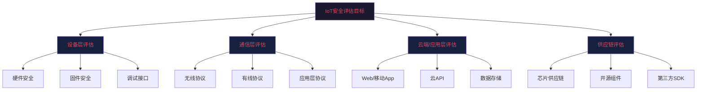
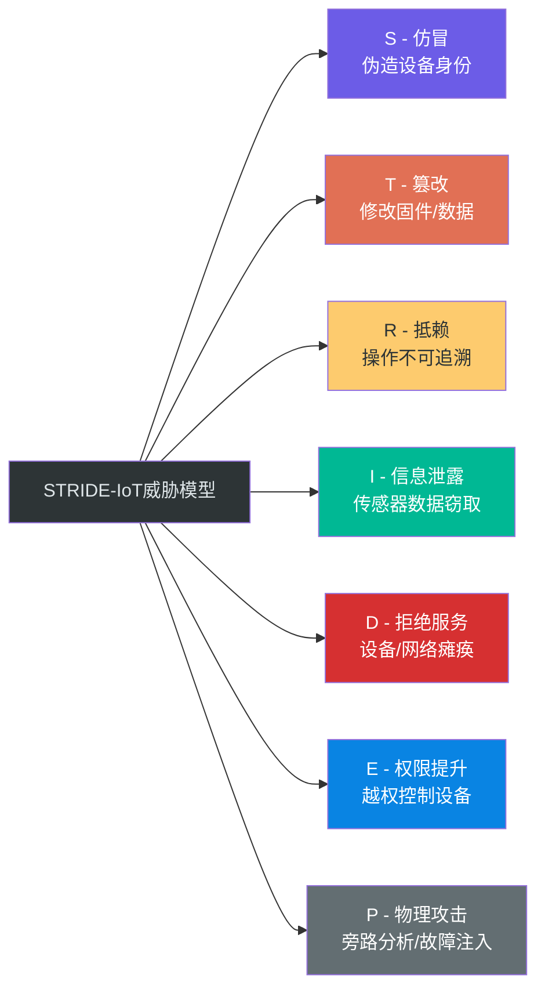
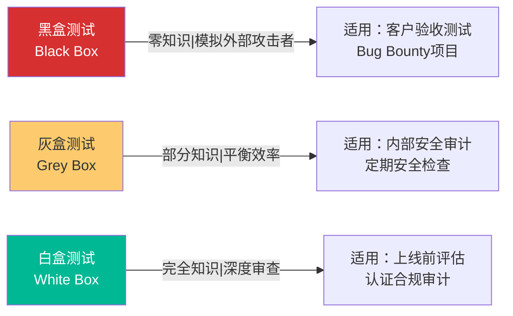
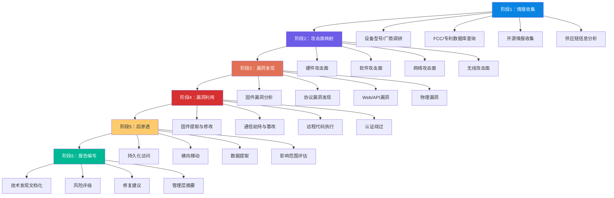
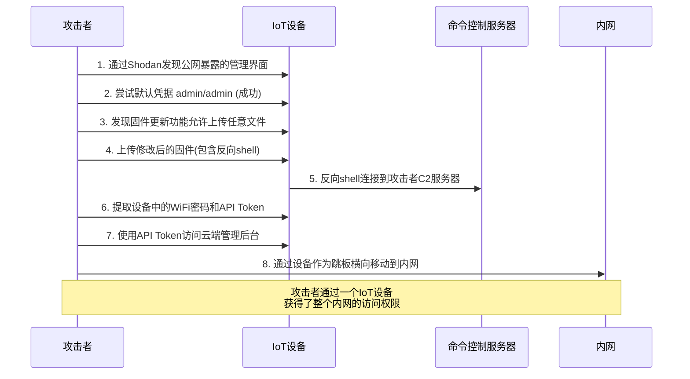

## 22.6 IoT安全评估方法论

### 22.6.1 概述：为什么IoT需要专门的评估方法论

传统IT安全评估（如针对Web应用的OWASP测试指南、针对网络基础设施的PTES标准）在IoT场景下会遭遇根本性的适用性障碍。IoT系统由物理设备、嵌入式固件、无线/有线通信协议、云端后台、移动App等多个异构层次组成，攻击面横跨物理域和数字域，这要求安全评估方法论必须进行专门设计。

IoT安全评估与传统IT安全评估的核心差异体现在五个维度：

| 维度 | 传统IT系统 | IoT系统 |
|------|----------|---------|
| **物理接触** | 服务器在机房，物理攻击难度高 | 设备部署在公开或半公开环境，攻击者可直接物理接触 |
| **固件分析** | 软件可直接反编译获取源码 | 固件通常以二进制形式存在，需专门工具解包逆向 |
| **通信多样性** | 主要是TCP/IP协议栈 | 包含BLE、Zigbee、LoRa、NB-IoT、MQTT、CoAP等多种协议 |
| **更新机制** | 可通过补丁快速部署 | OTA更新可能失败、设备离线、网络受限 |
| **资源约束** | 计算和存储资源充足 | MCU运算能力有限，内存可能只有几KB |



### 22.6.2 风险评估框架

IoT风险评估不是简单的漏洞扫描，而是一个系统性工程，需要结合资产价值、威胁可能性、脆弱性可利用性和影响程度进行综合判定。

#### 22.6.2.1 主流风险评估框架对比

国际上存在多个可用于IoT场景的风险评估框架，各有侧重：

| 框架 | 来源 | 核心方法 | IoT适用性 | 适用阶段 |
|------|------|---------|----------|---------|
| **NIST CSF** | 美国国家标准与技术研究院 | 识别→保护→检测→响应→恢复 | 高，但需要IoT定制化映射 | 全生命周期 |
| **ISO 27005** | 国际标准化组织 | 资产→威胁→脆弱性→风险→处置 | 通用性强，需补充IoT资产分类 | 规划与审计 |
| **ENISA IoT安全框架** | 欧盟网络与信息安全局 | 威胁landscape + 政策建议 | 专门针对IoT设计 | 政策制定与合规 |
| **OCTAVE** | 卡内基梅隆大学CERT | 资产为中心的自评估 | 中等，需扩展物理资产定义 | 组织级评估 |
| **IEC 62443** | 国际电工委员会 | 区域与管道模型 | 专门针对工业IoT/ICS | 工业控制场景 |

#### 22.6.2.2 资产识别与分类

资产识别是风险评估的起点。IoT资产不仅包括有形设备，还包括无形数据和逻辑组件：

**一级资产分类：**

| 资产类别 | 具体示例 | 价值评估维度 |
|---------|---------|-------------|
| **物理设备** | 传感器节点、网关设备、控制器 | 替换成本、功能关键性、部署规模 |
| **固件/软件** | RTOS镜像、应用程序、Bootloader | 知识产权价值、安全敏感度 |
| **通信数据** | 传感器读数、控制指令、配置信息 | 机密性要求、完整性要求、实时性要求 |
| **用户数据** | 个人隐私信息、行为模式、位置数据 | 法规约束（GDPR/个保法）、商业价值 |
| **认证凭据** | 设备密钥、API Token、证书 | 泄露影响范围、是否可撤销 |
| **云端资源** | 管理后台、数据库、消息队列 | 数据量级、服务可用性要求 |

**资产价值量化方法：**

实际操作中，建议使用 DREAD 模型的变体对IoT资产进行价值量化：

```text
资产价值 = (损害潜力 × 0.25) + (受影响用户数 × 0.20) + 
           (数据敏感度 × 0.20) + (恢复难度 × 0.20) + 
           (攻击面暴露度 × 0.15)
```

每个维度按1-5分评分，1分为最低风险，5分为最高。总分在1-5之间，超过3.5的资产被归类为"关键资产"，需要最高等级的安全保护。

#### 22.6.2.3 威胁建模方法

在IoT场景中，推荐使用 STRIDE 模型的IoT扩展版本进行威胁建模：



相比传统STRIDE，IoT扩展版本增加了物理攻击（P）维度，原因在于IoT设备通常部署在攻击者可物理接触的环境中。物理攻击包括：
- **旁路攻击**：通过功耗分析（SPA/DPA）、电磁辐射（EMA）、时序分析提取密钥
- **故障注入**：通过电压毛刺、激光脉冲干扰芯片执行流程，绕过安全检查
- **芯片解封装**：使用化学或机械方法去除芯片封装，直接访问内部电路

#### 22.6.2.4 风险计算与优先级排序

风险值的计算需要同时考虑"可能性"和"影响"两个维度：

```text
风险值 = 威胁可能性 × 影响程度 × 脆弱性可利用性
```

但这个公式的每一项都不是简单的数字，需要具体分析：

**威胁可能性评估因子：**

| 因子 | 权重 | 说明 |
|------|------|------|
| 攻击者技术水平 | 0.25 | 脚本小子(1) → APT组织(5) |
| 攻击工具可得性 | 0.20 | 无公开工具(1) → 一键利用(5) |
| 设备暴露程度 | 0.20 | 内网隔离(1) → 公网暴露(5) |
| 已知攻击案例 | 0.15 | 无已知攻击(1) → 大规模利用(5) |
| 攻击向量数量 | 0.20 | 单一途径(1) → 多入口(5) |

**影响程度评估因子：**

| 因子 | 权重 | 说明 |
|------|------|------|
| 机密性影响 | 0.20 | 无数据泄露(1) → 大规模隐私泄露(5) |
| 完整性影响 | 0.20 | 无数据篡改(1) → 控制指令被篡改(5) |
| 可用性影响 | 0.25 | 无服务中断(1) → 关键服务完全停机(5) |
| 安全影响 | 0.20 | 无人员伤害(1) → 可能造成人身伤亡(5) |
| 法规合规影响 | 0.15 | 无合规问题(1) → 面临重大罚款或诉讼(5) |

**风险矩阵示例：**

|  | 影响-极低(1) | 影响-低(2) | 影响-中(3) | 影响-高(4) | 影响-极高(5) |
|--|------------|----------|----------|----------|------------|
| **可能性-极高(5)** | 5 | 10 | 15 | 20 | **25** |
| **可能性-高(4)** | 4 | 8 | 12 | **16** | **20** |
| **可能性-中(3)** | 3 | 6 | 9 | 12 | 15 |
| **可能性-低(2)** | 2 | 4 | 6 | 8 | 10 |
| **可能性-极低(1)** | 1 | 2 | 3 | 4 | 5 |

风险值 ≥ 16 为**严重风险**（红色），需立即处理；10-15 为**高风险**（橙色），需在30天内处理；5-9 为**中风险**（黄色），纳入计划处理；1-4 为**低风险**（绿色），接受或监控。

#### 22.6.2.5 常见风险评估误区

以下是IoT风险评估中经常出现的错误：

**误区1：只评估技术风险，忽略运营风险**

许多评估报告只关注漏洞，不关注"漏洞被利用后组织能否及时响应"。一个拥有完善日志监控和应急响应能力的系统，即使存在已知漏洞，其实际风险可能远低于一个完全没有监控的系统。

**误区2：用CVSS分数直接代表IoT风险**

CVSS基础分数只衡量漏洞本身的技术特征，不考虑IoT设备的具体部署环境。一个CVSS 7.5的Web管理界面漏洞，在内网隔离设备上可能只是中等风险，但在公网暴露的摄像头上则是严重风险。必须结合环境因素（CVSS Environmental Score）进行调整。

**误区3：忽略供应链风险**

许多IoT设备使用大量开源组件和第三方SDK，评估时只关注自研代码而忽略依赖组件的风险。2020年 Ripple20 漏洞事件（Treck TCP/IP协议栈漏洞）影响了数亿设备，正是因为设备厂商未对底层依赖进行安全评估。

**误区4：评估一次就结束**

IoT安全评估应该是持续的过程，而非一次性事件。设备固件更新、新漏洞公开、部署环境变化都会改变风险态势。建议至少每季度进行一次轻量级安全复查，每年进行一次全面评估。

### 22.6.3 安全测试方法

#### 22.6.3.1 测试类型选择

IoT安全测试根据测试者掌握的信息量分为三种类型，每种类型适用于不同场景：



| 测试类型 | 信息范围 | 优势 | 劣势 | 成本 | 覆盖率 |
|---------|---------|------|------|------|--------|
| **黑盒** | 仅知道设备型号和外观 | 模拟真实攻击场景 | 耗时长，覆盖不全 | 中 | 低-中 |
| **灰盒** | 设备文档、协议规范、部分源码 | 效率和深度平衡 | 需要一定信任基础 | 中-高 | 中-高 |
| **白盒** | 源代码、设计文档、架构图 | 最高覆盖率 | 不模拟真实攻击路径 | 高 | 最高 |

在实际IoT评估项目中，推荐采用混合模式：对外部攻击面（Web接口、移动端、无线协议）使用黑盒测试，对固件和内部通信使用灰盒测试，对关键安全功能（密钥管理、认证逻辑、安全启动）使用白盒测试。

#### 22.6.3.2 IoT各层次安全测试要点

IoT系统的层次化结构要求评估人员针对每一层设计专门的测试方案：

**第一层：硬件层测试**

| 测试项 | 测试方法 | 工具 | 常见发现 |
|-------|---------|------|---------|
| 调试接口检测 | 物理检查+万用表测量 | 万用表、示波器、逻辑分析仪 | 未禁用的JTAG/SWD/UART |
| 存储芯片读取 | 拆焊Flash/EEPROM读取 | 热风枪、编程器（CH341A） | 明文存储的密钥/密码 |
| 侧信道分析 | 功耗/电磁辐射采集与分析 | ChipWhisperer、自制采集电路 | AES密钥泄露 |
| 固件提取 | 通过调试接口提取 | OpenOCD、J-Link、Bus Pirate | 未加密的固件镜像 |
| PCB逆向 | 显微镜观察+走线追踪 | 电子显微镜、X-ray | 隐藏的测试点/功能 |

**第二层：固件层测试**

| 测试项 | 测试方法 | 工具 | 常见发现 |
|-------|---------|------|---------|
| 固件解包 | binwalk自动提取 | binwalk、firmwalker | 文件系统结构 |
| 静态分析 | 反汇编+符号分析 | Ghidra、IDA Pro、radare2 | 硬编码密钥、后门函数 |
| 动态分析 | 模拟执行+插桩 | QEMU、Frida、GDB | 运行时漏洞、内存溢出 |
| 密码学实现 | 算法识别+正确性验证 | findcrypt、自定义脚本 | 弱加密算法、自定义加密 |
| 二进制安全 | 检查安全编译选项 | checksec、readelf | 缺少PIE、NX、Stack Canary |

**第三层：通信层测试**

| 测试项 | 测试方法 | 工具 | 常见发现 |
|-------|---------|------|---------|
| 无线协议嗅探 | 抓包+协议解析 | Wireshark、Ubiqua、KillerBee | 未加密传输 |
| MQTT安全测试 | 订阅/发布测试、认证绕过 | mqtt-explorer、mqtt-pwn | 匿名访问、ACL绕过 |
| BLE安全测试 | 配对/绑定劫持、GATT枚举 | nRF Connect、Bettercap | 弱配对、信息泄露 |
| Zigbee安全测试 | 密钥嗅探、重放攻击 | KillerBee、ZShark | 硬编码网络密钥 |
| HTTP/CoAP接口 | 参数注入、认证绕过 | Burp Suite、ZAP | 命令注入、认证缺失 |

**第四层：应用层测试（Web/移动App）**

| 测试项 | 测试方法 | 工具 | 常见发现 |
|-------|---------|------|---------|
| Web管理界面 | OWASP Top 10测试 | Burp Suite、ZAP | XSS、SQL注入、CSRF |
| 移动App逆向 | 反编译+动态分析 | jadx、Objection、Frida | 硬编码API密钥、不安全存储 |
| 云API测试 | 认证/授权/注入测试 | Postman、Burp Suite | BOLA/IDOR、过度数据暴露 |
| 设备-云通信 | 中间人代理 | mitmproxy、Charles | 证书校验缺失、Token硬编码 |

### 22.6.4 IoT渗透测试流程

IoT渗透测试与传统渗透测试的核心区别在于：攻击者可以从物理层开始向上渗透，也可以从云端向下渗透，形成"上下夹击"的攻击路径。

#### 22.6.4.1 完整渗透测试流程



#### 22.6.4.2 阶段详解：情报收集

情报收集阶段决定了后续攻击的方向和效率。IoT设备的情报收集有独特渠道：

**公开情报（OSINT）来源：**

| 情报来源 | 获取信息 | 具体操作 |
|---------|---------|---------|
| **FCC ID数据库** | 设备内部照片、天线规格、频率信息 | fccid.io 搜索设备型号 |
| **专利数据库** | 技术实现细节、安全机制设计 | Google Patents搜索厂商专利 |
| **GitHub/GitLab** | 开源固件、SDK、配置文件 | 搜索厂商名+设备型号 |
| **漏洞数据库** | 已知CVE、公开PoC | NVD、CNVD、Exploit-DB |
| **拆解网站** | PCB照片、芯片型号 | iFixit、TechInsights |
| **开发者论坛** | 技术讨论、固件修改经验 | Hackaday、Reddit r/IoT |
| **Nmap/Shodan** | 设备在线暴露面 | 搜索设备banner或默认端口 |

**情报收集脚本示例：**

```python
#!/usr/bin/env python3
"""IoT设备情报收集辅助脚本"""

import requests
import json
import sys
from datetime import datetime

class IoTRecon:
    def __init__(self, target_model, manufacturer):
        self.target = target_model
        self.manufacturer = manufacturer
        self.results = {
            'timestamp': datetime.now().isoformat(),
            'target': target_model,
            'manufacturer': manufacturer,
            'findings': {}
        }

    def search_fcc(self):
        """搜索FCC ID数据库获取设备信息"""
        print(f"[*] Searching FCC database for: {self.target}")
        # FCC公开API查询
        url = f"https://fccid.io/query-devices?search={self.target}"
        # 实际项目中使用fccid.io API或web scraping
        self.results['findings']['fcc'] = {
            'url': url,
            'note': 'Manual review needed for internal photos and test reports'
        }

    def search_cve(self):
        """搜索已知漏洞"""
        print(f"[*] Searching CVE database for: {self.target}")
        # NIST NVD API
        url = "https://services.nvd.nist.gov/rest/json/cves/2.0"
        params = {'keywordSearch': f"{self.manufacturer} {self.target}"}
        try:
            resp = requests.get(url, params=params, timeout=30)
            if resp.status_code == 200:
                data = resp.json()
                cves = []
                for vuln in data.get('vulnerabilities', []):
                    cve = vuln.get('cve', {})
                    cves.append({
                        'id': cve.get('id'),
                        'description': cve.get('descriptions', [{}])[0].get('value', ''),
                        'severity': cve.get('metrics', {})
                    })
                self.results['findings']['cves'] = cves
                print(f"    Found {len(cves)} CVEs")
            else:
                print(f"    NVD API returned status {resp.status_code}")
        except Exception as e:
            print(f"    Error querying NVD: {e}")

    def search_shodan(self):
        """搜索在线暴露设备"""
        print(f"[*] Searching Shodan for: {self.target}")
        # 需要Shodan API Key
        self.results['findings']['shodan'] = {
            'query': f'product:"{self.target}"',
            'note': 'Use shodan CLI or API with valid key'
        }

    def search_github(self):
        """搜索GitHub上的相关代码"""
        print(f"[*] Searching GitHub for: {self.manufacturer} {self.target}")
        url = "https://api.github.com/search/repositories"
        params = {'q': f"{self.manufacturer} {self.target}", 'sort': 'stars'}
        try:
            resp = requests.get(url, params=params, timeout=30)
            if resp.status_code == 200:
                repos = resp.json().get('items', [])
                self.results['findings']['github_repos'] = [
                    {'name': r['full_name'], 'url': r['html_url'],
                     'stars': r['stargazers_count'], 'description': r.get('description')}
                    for r in repos[:10]
                ]
                print(f"    Found {len(repos)} related repositories")
        except Exception as e:
            print(f"    Error searching GitHub: {e}")

    def run(self):
        """执行完整情报收集"""
        print(f"=== IoT Reconnaissance: {self.manufacturer} {self.target} ===\n")
        self.search_fcc()
        self.search_cve()
        self.search_shodan()
        self.search_github()
        print(f"\n[*] Results saved to memory. Use json.dumps(self.results) to export.")
        return self.results

if __name__ == '__main__':
    if len(sys.argv) < 3:
        print(f"Usage: {sys.argv[0]} <model> <manufacturer>")
        sys.exit(1)
    recon = IoTRecon(sys.argv[1], sys.argv[2])
    recon.run()
```

#### 22.6.4.3 阶段详解：固件提取与分析

固件提取是IoT渗透测试中最关键的步骤之一。成功提取固件后，攻击者可以在离线状态下进行深度分析，发现大量潜在漏洞。

**固件获取途径（按难度递增）：**

| 方法 | 难度 | 前置条件 | 工具 |
|------|------|---------|------|
| **厂商官网下载** | ★☆☆☆☆ | 无 | 浏览器、wget |
| **OTA更新抓包** | ★★☆☆☆ | 网络抓包能力 | Wireshark、mitmproxy |
| **Flash芯片读取** | ★★★☆☆ | 焊接/夹具、编程器 | CH341A、SPI Flash夹具 |
| **调试接口导出** | ★★★☆☆ | JTAG/UART物理访问 | OpenOCD、Bus Pirate |
| **故障注入** | ★★★★☆ | 硬件专业知识 | ChipWhisperer |
| **侧信道辅助** | ★★★★★ | 精密仪器 | 示波器、电磁探头 |

**固件分析自动化流程：**

```bash
#!/bin/bash
# IoT固件自动化分析脚本
# 用法: ./fw_analysis.sh <firmware_file>

set -euo pipefail

FIRMWARE="$1"
OUTDIR="./fw_analysis_$(date +%Y%m%d_%H%M%S)"
mkdir -p "$OUTDIR"/{extraction,static,dynamic,reports}

echo "=== IoT固件自动化分析 ==="
echo "目标固件: $FIRMWARE"
echo "输出目录: $OUTDIR"
echo ""

# ===== 阶段1：基本信息收集 =====
echo "[1/7] 基本信息收集..."
file "$FIRMWARE" > "$OUTDIR/reports/file_info.txt"
hexdump -C "$FIRMWARE" | head -64 > "$OUTDIR/reports/header_hex.txt"
sha256sum "$FIRMWARE" > "$OUTDIR/reports/checksums.txt"

# ===== 阶段2：固件解包 =====
echo "[2/7] 固件解包 (binwalk)..."
binwalk -eM -C "$OUTDIR/extraction" "$FIRMWARE" 2>&1 | \
    tee "$OUTDIR/reports/binwalk_extract.log"

# ===== 阶段3：文件系统识别 =====
echo "[3/7] 文件系统分析..."
find "$OUTDIR/extraction" -type f -exec file {} \; | \
    grep -v "empty" > "$OUTDIR/reports/file_types.txt"

# 识别常见IoT文件系统
find "$OUTDIR/extraction" \( -name "*.squashfs" -o -name "*.jffs2" \
    -o -name "*.cramfs" -o -name "*.ubifs" \) | \
    while read fs; do
        echo "Found filesystem: $fs" >> "$OUTDIR/reports/filesystems.txt"
    done

# ===== 阶段4：敏感信息搜索 =====
echo "[4/7] 搜索敏感信息..."
PATTERNS=(
    'password'
    'passwd'
    'secret'
    'api_key'
    'private_key'
    'BEGIN RSA PRIVATE'
    'BEGIN EC PRIVATE'
    'hardcoded'
    'backdoor'
)

for pat in "${PATTERNS[@]}"; do
    results=$(grep -rn -i "$pat" "$OUTDIR/extraction/" \
        --include="*.conf" --include="*.cfg" --include="*.ini" \
        --include="*.json" --include="*.xml" --include="*.sh" \
        --include="*.lua" --include="*.py" --include="*.txt" \
        2>/dev/null || true)
    if [ -n "$results" ]; then
        echo "$results" >> "$OUTDIR/static/sensitive_strings.txt"
    fi
done

# ===== 阶段5：硬编码凭据搜索 =====
echo "[5/7] 搜索硬编码凭据..."
grep -rn -E "(root|admin|default|supervisor):[a-zA-Z0-9./\$]" \
    "$OUTDIR/extraction/" --include="*passwd*" --include="*shadow*" \
    --include="*.conf" 2>/dev/null > "$OUTDIR/static/credentials.txt" || true

# 搜索硬编码IP和URL
grep -rn -oE "https?://[a-zA-Z0-9./?=_%&-]+" \
    "$OUTDIR/extraction/" 2>/dev/null | \
    sort -u > "$OUTDIR/static/urls.txt" || true

# ===== 阶段6：安全配置检查 =====
echo "[6/7] 安全配置检查..."
# 检查是否有Telnet/FTP等不安全服务
find "$OUTDIR/extraction" -name "*.conf" -exec \
    grep -li -E "(telnet|ftp|dropbear|busybox.*telnet)" {} \; \
    2>/dev/null > "$OUTDIR/static/insecure_services.txt" || true

# 检查SSH配置安全性
find "$OUTDIR/extraction" -name "sshd_config" -exec \
    grep -H "PermitRootLogin\|PasswordAuthentication\|PermitEmptyPasswords" {} \; \
    2>/dev/null > "$OUTDIR/static/ssh_config.txt" || true

# ===== 阶段7：二进制安全检查 =====
echo "[7/7] 二进制文件安全属性..."
find "$OUTDIR/extraction" -type f -executable | head -50 | while read bin; do
    echo "--- $bin ---" >> "$OUTDIR/static/binary_security.txt"
    file "$bin" >> "$OUTDIR/static/binary_security.txt"
    if command -v checksec &>/dev/null; then
        checksec --file="$bin" 2>/dev/null >> "$OUTDIR/static/binary_security.txt" || true
    fi
    echo "" >> "$OUTDIR/static/binary_security.txt"
done

echo ""
echo "=== 分析完成 ==="
echo "报告目录: $OUTDIR/reports/"
echo "静态分析: $OUTDIR/static/"
echo "提取文件: $OUTDIR/extraction/"
echo ""
echo "下一步建议："
echo "  1. 检查 static/sensitive_strings.txt 中的敏感信息"
echo "  2. 检查 static/credentials.txt 中的硬编码凭据"
echo "  3. 用 Ghidra 打开关键二进制文件进行深度分析"
echo "  4. 尝试在 QEMU 中模拟运行固件进行动态测试"
```

#### 22.6.4.4 阶段详解：漏洞利用与后渗透

IoT漏洞利用与传统IT漏洞利用的关键区别在于：IoT设备通常运行定制化的RTOS或裁剪过的Linux，标准的Metasploit payload往往无法直接使用，需要针对目标架构（ARM/MIPS/RISC-V）编译定制化的payload。

**典型IoT攻击链示例：**



**后渗透阶段的关键操作：**

1. **持久化**：修改固件启动脚本、创建隐藏用户、植入后门服务。在IoT设备上持久化特别有效，因为多数设备不会被频繁重启检查。

2. **横向移动**：利用设备作为内网跳板，扫描同网段的其他设备。许多IoT设备部署在企业内网但缺乏网络隔离，一旦被攻陷就成为攻击者进入内网的入口。

3. **数据提取**：IoT设备往往存储或转发敏感数据（视频监控、工业数据、个人隐私），这些数据对攻击者有直接价值。

4. **僵尸网络组建**：如Mirai所示，被攻陷的IoT设备可被用于DDoS攻击。2016年Mirai僵尸网络通过默认密码感染了约60万IoT设备，发动了峰值1.2Tbps的DDoS攻击，导致美国东海岸大面积断网。

### 22.6.5 通信协议安全测试方法

#### 22.6.5.1 MQTT安全测试

MQTT是IoT中最常用的消息协议，其安全测试应覆盖认证、授权、传输加密和消息完整性四个维度：

```python
"""
MQTT协议安全测试辅助工具
测试场景：认证绕过、ACL检查、消息注入
"""

import paho.mqtt.client as mqtt
import ssl
import time
import json
from dataclasses import dataclass
from typing import Optional

@dataclass
class MQTTTestResult:
    test_name: str
    passed: bool
    detail: str
    severity: str  # critical/high/medium/low/info

class MQTTSecurityTester:
    """MQTT协议安全测试器"""

    def __init__(self, broker: str, port: int = 1883):
        self.broker = broker
        self.port = port
        self.results: list[MQTTTestResult] = []

    def test_anonymous_access(self) -> MQTTTestResult:
        """测试1：匿名连接 — 是否允许无认证连接"""
        client = mqtt.Client(client_id="security_test_anon")
        try:
            client.connect(self.broker, self.port, timeout=10)
            client.loop_start()
            time.sleep(2)
            # 如果能订阅通配符话题，说明匿名访问存在严重问题
            result = client.subscribe("#")
            if result[0] == mqtt.MQTT_ERR_SUCCESS:
                return MQTTTestResult(
                    test_name="匿名连接测试",
                    passed=False,  # False = 测试发现漏洞
                    detail="允许匿名连接并订阅所有话题（#），攻击者可监听全部消息",
                    severity="critical"
                )
            else:
                return MQTTTestResult(
                    test_name="匿名连接测试",
                    passed=True,
                    detail="匿名连接被拒绝或无法订阅话题",
                    severity="info"
                )
        except Exception as e:
            return MQTTTestResult(
                test_name="匿名连接测试",
                passed=True,
                detail=f"连接被拒绝: {e}",
                severity="info"
            )
        finally:
            client.disconnect()

    def test_weak_credentials(self, wordlist: list[tuple[str, str]]) -> MQTTTestResult:
        """测试2：弱凭据爆破"""
        for username, password in wordlist:
            client = mqtt.Client(client_id=f"test_{username}")
            client.username_pw_set(username, password)
            try:
                client.connect(self.broker, self.port, timeout=5)
                client.loop_start()
                time.sleep(1)
                return MQTTTestResult(
                    test_name="弱凭据测试",
                    passed=False,
                    detail=f"成功使用弱凭据连接: {username}/{password}",
                    severity="critical"
                )
            except Exception:
                continue
            finally:
                client.disconnect()
        return MQTTTestResult(
            test_name="弱凭据测试",
            passed=True,
            detail=f"字典中的 {len(wordlist)} 组凭据均无法连接",
            severity="info"
        )

    def test_topic_enumeration(self, topic_patterns: list[str]) -> MQTTTestResult:
        """测试3：话题枚举 — 是否可以订阅敏感话题"""
        client = mqtt.Client(client_id="topic_enum_test")
        try:
            client.connect(self.broker, self.port, timeout=10)
            client.loop_start()

            accessible_topics = []
            for topic in topic_patterns:
                result = client.subscribe(topic)
                if result[0] == mqtt.MQTT_ERR_SUCCESS:
                    accessible_topics.append(topic)

            if accessible_topics:
                return MQTTTestResult(
                    test_name="话题枚举测试",
                    passed=False,
                    detail=f"可订阅的敏感话题: {', '.join(accessible_topics)}",
                    severity="high"
                )
            return MQTTTestResult(
                test_name="话题枚举测试",
                passed=True,
                detail="所有敏感话题均被ACL保护",
                severity="info"
            )
        except Exception as e:
            return MQTTTestResult(
                test_name="话题枚举测试",
                passed=True,
                detail=f"连接失败: {e}",
                severity="info"
            )
        finally:
            client.disconnect()

    def generate_report(self) -> str:
        """生成测试报告"""
        report = ["=" * 60, "MQTT安全测试报告", "=" * 60, ""]
        critical = sum(1 for r in self.results if not r.passed and r.severity == "critical")
        high = sum(1 for r in self.results if not r.passed and r.severity == "high")
        report.append(f"发现: {critical} 个严重问题, {high} 个高风险问题\n")
        for r in self.results:
            status = "FAIL" if not r.passed else "PASS"
            report.append(f"[{status}] {r.test_name}")
            report.append(f"  严重等级: {r.severity}")
            report.append(f"  详情: {r.detail}")
            report.append("")
        return "\n".join(report)
```

#### 22.6.5.2 BLE安全测试要点

蓝牙低功耗（BLE）是可穿戴设备和近距离IoT设备的主流通信方式，其安全测试需要关注：

| 测试项 | 风险等级 | 测试方法 |
|-------|---------|---------|
| 配对模式检查 | 高 | 使用nRF Connect检查设备是否使用Just Works模式（无MITM保护） |
| GATT服务枚举 | 中 | 遍历所有GATT服务和特征值，检查是否存在未授权读写的敏感数据 |
| 通信抓包 | 高 | 使用Ubertooth/Adafruit Sniffer抓取BLE空中数据包 |
| 固件OTA通道 | 严重 | 检查固件更新是否验证签名，是否支持降级安装 |
| 距离限制绕过 | 中 | 使用高增益天线测试设备是否依赖距离限制作为安全措施 |

#### 22.6.5.3 Zigbee安全测试要点

Zigbee在智能家居和工业物联网中广泛使用，其安全测试核心围绕密钥管理展开：

```python
"""
Zigbee安全测试辅助工具
重点测试：密钥嗅探、重放攻击、加入控制
"""

class ZigbeeSecurityTester:
    """Zigbee协议安全测试器"""

    def __init__(self, interface: str = "killerbee0"):
        self.interface = interface
        self.findings = []

    def sniff_network_key(self, duration_sec: int = 300):
        """
        嗅探网络密钥
        当设备加入网络时，会传输网络密钥。如果使用默认
        Trust Center Link Key (ZigBeeAlliance09)，该密钥
        会被明文传输或使用已知密钥加密传输。
        """
        default_tc_keys = [
            bytes.fromhex("5a6967426565416c6c69616e63653039"),  # ZigBeeAlliance09
            bytes.fromhex("00000000000000000000000000000000"),  # 全零密钥
            bytes.fromhex("ffffffffffffffffffffffffffffffff"),  # 全F密钥
        ]
        # 使用KillerBee库进行抓包
        # from killerbee import *
        # kb = KillerBee(self.interface)
        # kb.sniff(channel=15, duration=duration_sec)
        # 分析捕获的数据包，寻找使用默认密钥的通信
        pass

    def test_replay_attack(self, captured_packet: bytes):
        """
        重放攻击测试
        捕获控制指令（如开灯/关灯），尝试原样重放。
        Zigbee使用帧计数器防重放，但某些实现可能
        不正确实现或完全忽略该机制。
        """
        # 使用KillerBee发送捕获的数据包
        # kb.inject(captured_packet)
        # 观察设备是否响应
        pass

    def test_join_control(self):
        """
        网络加入控制测试
        测试设备是否允许未授权设备加入网络。
        需要在设备加入窗口期间发送伪造的加入请求。
        """
        # 1. 嗅探网络信标
        # 2. 伪造加入请求
        # 3. 尝试获取网络密钥
        pass

    def generate_report(self):
        """生成Zigbee安全测试报告"""
        report = ["Zigbee安全测试发现:"]
        for finding in self.findings:
            report.append(f"  [{finding['severity']}] {finding['description']}")
        return "\n".join(report)
```

### 22.6.6 安全评估工具链

IoT安全评估涉及多个层次，需要构建一套完整的工具链。以下按功能分类列出核心工具：

#### 22.6.6.1 硬件分析工具

| 工具名称 | 功能 | 开源/商业 | 适用场景 |
|---------|------|----------|---------|
| **Bus Pirate** | 多协议接口（UART/SPI/I2C/JTAG） | 开源 | 通用硬件调试接口 |
| **Logic Analyzer (Saleae)** | 数字信号逻辑分析 | 商业 | 协议解码、时序分析 |
| **ChipWhisperer** | 侧信道分析、故障注入 | 开源+商业 | 密钥提取、安全旁路 |
| **J-Link** | JTAG/SWD调试器 | 商业 | 固件提取、调试 |
| **Flipper Zero** | 多功能硬件安全工具 | 开源 | Sub-GHz、RFID、NFC、GPIO |

#### 22.6.6.2 固件分析工具

| 工具名称 | 功能 | 开源/商业 | 关键特性 |
|---------|------|----------|---------|
| **binwalk** | 固件解包、签名扫描 | 开源 | 自动递归提取嵌套文件系统 |
| **Ghidra** | 逆向工程平台 | 开源 | 支持ARM/MIPS/RISC-V，强大的反编译 |
| **IDA Pro** | 反汇编/反编译 | 商业 | 业界标准，插件生态最丰富 |
| **Firmware-mod-kit** | 固件修改与重打包 | 开源 | 修改后可直接刷回设备 |
| **QEMU** | 系统级模拟 | 开源 | 在x86机器上运行ARM/MIPS固件 |
| **Frida** | 动态插桩框架 | 开源 | 运行时hook、内存读写、API追踪 |
| **radare2** | 逆向框架 | 开源 | 命令行工具，脚本化分析 |
| **unblob** | 下一代固件解包 | 开开源 | binwalk的现代替代品，支持更多格式 |

#### 22.6.6.3 网络与协议工具

| 工具名称 | 功能 | 开源/商业 | 支持协议 |
|---------|------|----------|---------|
| **Wireshark** | 网络协议分析 | 开源 | TCP/UDP/MQTT/CoAP/Zigbee |
| **KillerBee** | Zigbee安全测试框架 | 开源 | IEEE 802.15.4 |
| **Ubertooth** | BLE嗅探与注入 | 开源 | Bluetooth LE/Classic |
| **Bettercap** | 网络攻击框架 | 开源 | WiFi/BLE/ARP/DNS |
| **Scapy** | 数据包构造与发送 | 开源 | 任意协议 |
| **mqtt-pwn** | MQTT安全测试 | 开源 | MQTT 3.1.1/5.0 |
| **coapthon3** | CoAP测试 | 开源 | CoAP/DTLS |

#### 22.6.6.4 综合评估平台

| 平台 | 定位 | 核心特性 |
|------|------|---------|
| **Attify OS** | IoT安全测试专用发行版 | 预装30+IoT安全工具 |
| **Kali Linux** | 通用渗透测试平台 | IoT工具可通过apt安装 |
| **HAL (Hardware Analyzer)** | 硬件逆向平台 | 网表分析、布局可视化 |

### 22.6.7 安全评估报告编写

#### 22.6.7.1 报告结构模板

一份专业的IoT安全评估报告应包含以下结构：

```text
1. 执行摘要
   ├── 评估范围与目标
   ├── 关键发现摘要（不超过1页）
   ├── 整体风险评级
   └── 核心建议（Top 5）

2. 评估方法论
   ├── 测试类型（黑盒/灰盒/白盒）
   ├── 测试范围（设备型号、固件版本、通信协议）
   ├── 使用的工具
   └── 评估标准和风险等级定义

3. 技术发现详情
   ├── 发现编号：VULN-001
   │   ├── 漏洞标题
   │   ├── 严重等级：Critical/High/Medium/Low/Info
   │   ├── 受影响组件
   │   ├── 漏洞描述
   │   ├── 复现步骤（含截图/命令）
   │   ├── 影响分析
   │   ├── CVSS 3.1评分
   │   └── 修复建议
   └── ...更多发现

4. 风险评估矩阵
   ├── 风险热力图
   ├── 各层风险分布
   └── 与行业基准对比

5. 修复建议优先级
   ├── 立即修复（0-7天）
   ├── 短期修复（7-30天）
   ├── 中期改进（1-3个月）
   └── 长期优化（3-12个月）

6. 附录
   ├── 完整工具输出日志
   ├── 测试环境配置
   ├── 术语表
   └── 参考标准列表
```

#### 22.6.7.2 漏洞描述规范

每个技术发现必须遵循以下规范，确保可复现、可验证：

**标准漏洞描述模板：**

```markdown
## VULN-001: 固件硬编码Telnet后门凭据

### 基本信息
- **严重等级**: Critical
- **CVSS 3.1评分**: 9.8 (AV:N/AC:L/PR:N/UI:N/S:U/C:H/I:H/A:H)
- **受影响组件**: /usr/sbin/telnetd (固件版本 v2.1.3 及以下)
- **漏洞类型**: CWE-798 (Use of Hard-coded Credentials)

### 描述
设备固件中的telnet守护进程包含硬编码的root凭据，
任何能够访问设备23端口的攻击者均可使用该凭据获得
root shell访问权限。

### 复现步骤
1. 使用nmap确认目标设备开放23端口：
   `nmap -p 23 <target_ip>`
2. 使用telnet连接设备：
   `telnet <target_ip>`
3. 输入凭据：username=`root`, password=`super@password`
4. 验证已获得root权限：`id` → `uid=0(root)`

### 影响
攻击者可获得设备完全控制权，包括：
- 读取所有传感器数据和用户隐私
- 修改设备固件（持久化后门）
- 以设备为跳板进行内网攻击
- 将设备纳入僵尸网络

### 修复建议
1. 移除硬编码凭据，改为首次使用时强制用户设置密码
2. 禁用或删除telnet服务，仅保留SSH
3. 如果必须保留telnet，实施IP白名单访问控制
```

#### 22.6.7.3 评估报告常见质量问题

在审核大量IoT安全评估报告后，以下是最常见的质量问题：

| 质量问题 | 示例 | 正确做法 |
|---------|------|---------|
| **漏洞标题模糊** | "发现安全问题" | "固件v2.1.3硬编码Telnet后门凭据(CWE-798)" |
| **缺少复现步骤** | "端口23开放存在风险" | 给出完整复现命令和预期输出 |
| **严重等级不一致** | 低风险漏洞给了Critical评级 | 使用CVSS 3.1计算器，引用完整向量字符串 |
| **修复建议笼统** | "建议加强安全" | 给出具体的操作步骤、代码修改或配置变更 |
| **忽略业务上下文** | 对内网设备给网络暴露评分 | 结合实际部署环境评估风险 |
| **报告逻辑混乱** | 按发现时间排序 | 按严重等级排序，同等级按资产重要性排序 |

### 22.6.8 固件安全分析深度方法论

固件分析是IoT安全评估中最核心的技能之一。与传统软件不同，IoT固件通常以二进制形式存在，缺乏调试符号，运行在嵌入式RTOS之上，分析难度显著更高。

#### 22.6.8.1 固件静态分析方法

**字符串分析——最高效的入门方法**

固件中的硬编码字符串往往直接暴露安全敏感信息：

```bash
# 提取固件中的关键安全字符串
# 用法: ./fw_strings.sh <extracted_root>

EXTRACTED="$1"

echo "=== 凭据相关字符串 ==="
grep -rn -iE "(password|passwd|secret|api.?key|token|auth)" \
    "$EXTRACTED" --include="*.conf" --include="*.cfg" \
    --include="*.ini" --include="*.json" --include="*.lua" \
    --include="*.sh" --include="*.c" 2>/dev/null | head -50

echo ""
echo "=== 网络端点 ==="
grep -rn -oE "https?://[a-zA-Z0-9./:%?&=_-]+" \
    "$EXTRACTED" 2>/dev/null | sort -u | head -30

echo ""
echo "=== IP地址 ==="
grep -rn -oE "([0-9]{1,3}\.){3}[0-9]{1,3}" \
    "$EXTRACTED" 2>/dev/null | \
    grep -v "0.0.0.0\|255.255.255" | sort -u | head -30

echo ""
echo "=== 加密私钥 ==="
grep -rn -l "PRIVATE KEY\|BEGIN RSA\|BEGIN EC\|BEGIN DSA" \
    "$EXTRACTED" 2>/dev/null

echo ""
echo "=== 调试信息 ==="
grep -rn -iE "(debug|test|backdoor|admin.*mode)" \
    "$EXTRACTED" --include="*.conf" --include="*.cfg" \
    --include="*.h" --include="*.c" 2>/dev/null | head -20
```

**二进制安全属性检查**

```bash
# 检查固件中可执行文件的安全编译选项
# 用法: ./check_security.sh <extracted_root>

find "$1" -type f -executable | while read binary; do
    echo "=== $(basename "$binary") ==="
    echo "路径: $binary"

    # 检查ELF安全属性
    if file "$binary" | grep -q "ELF"; then
        # NX (No-eXecute) - 栈不可执行
        readelf -l "$binary" 2>/dev/null | grep -q "GNU_STACK.*RWE" \
            && echo "  [!] NX: 禁用 (栈可执行)" \
            || echo "  [+] NX: 启用"

        # PIE (Position Independent Executable) - ASLR支持
        file "$binary" | grep -q "shared object" \
            && echo "  [+] PIE: 启用" \
            || echo "  [!] PIE: 禁用 (固定地址加载)"

        # Stack Canary - 栈溢出保护
        readelf -s "$binary" 2>/dev/null | grep -q "__stack_chk_fail" \
            && echo "  [+] Stack Canary: 启用" \
            || echo "  [!] Stack Canary: 禁用"

        # RELRO - GOT表保护
        readelf -l "$binary" 2>/dev/null | grep -q "GNU_RELRO" \
            && echo "  [+] RELRO: Partial" \
            || echo "  [!] RELRO: 禁用"
        readelf -d "$binary" 2>/dev/null | grep -q "BIND_NOW" \
            && echo "  [+] Full RELRO: 启用"

        # 架构信息
        echo "  架构: $(file "$binary" | grep -oE 'ARM|MIPS|Intel|x86|PowerPC' | head -1)"
    fi
    echo ""
done
```

#### 22.6.8.2 固件动态分析方法

**QEMU模拟运行**

当无法获得物理设备时，QEMU是进行固件动态分析的最佳选择：

```bash
#!/bin/bash
# 在QEMU中模拟运行MIPS/ARM固件
# 用法: ./qemu_emulate.sh <arch> <firmware_rootfs> <kernel_image>

ARCH="$1"
ROOTFS="$2"
KERNEL="$3"

case "$ARCH" in
    mipsel)
        # MIPS小端序
        qemu-system-mipsel -M malta -kernel "$KERNEL" \
            -drive file="$ROOTFS",format=raw \
            -append "root=/dev/sda1 console=ttyS0" \
            -nographic -net nic -net user,hostfwd=tcp::8080-:80
        ;;
    mips)
        # MIPS大端序
        qemu-system-mips -M malta -kernel "$KERNEL" \
            -drive file="$ROOTFS",format=raw \
            -append "root=/dev/sda1 console=ttyS0" \
            -nographic -net nic -net user,hostfwd=tcp::8080-:80
        ;;
    arm)
        # ARM
        qemu-system-arm -M versatilepb -kernel "$KERNEL" \
            -drive file="$ROOTFS",if=scsi,format=raw \
            -append "root=/dev/sda1 console=ttyAMA0" \
            -nographic -net nic -net user,hostfwd=tcp::8080-:80
        ;;
esac

echo "模拟环境已启动，Web界面可通过 localhost:8080 访问"
```

**Frida动态插桩**

Frida可用于hook固件中的关键函数，实时监控和篡改运行时行为：

```javascript
// Frida脚本：hook固件中的认证函数
// 用法: frida -f <firmware_binary> -l auth_hook.js

// Hook strcmp — 监控所有字符串比较
Interceptor.attach(Module.findExportByName(null, "strcmp"), {
    onEnter: function(args) {
        this.s1 = args[0].readUtf8String();
        this.s2 = args[1].readUtf8String();
    },
    onLeave: function(retval) {
        // 记录所有认证相关的字符串比较
        if (this.s1 && this.s2 &&
            (this.s1.includes("admin") || this.s2.includes("admin") ||
             this.s1.includes("root") || this.s2.includes("root"))) {
            console.log(`[AUTH] strcmp("${this.s1}", "${this.s2}") = ${retval}`);
        }
    }
});

// Hook system — 监控命令执行
Interceptor.attach(Module.findExportByName(null, "system"), {
    onEnter: function(args) {
        var cmd = args[0].readUtf8String();
        console.log(`[CMD] system("${cmd}")`);
    }
});

// Hook execve — 监控进程创建
Interceptor.attach(Module.findExportByName(null, "execve"), {
    onEnter: function(args) {
        var cmd = args[0].readUtf8String();
        console.log(`[EXEC] execve("${cmd}")`);
    }
});
```

#### 22.6.8.3 常见固件漏洞模式

在分析了数百个IoT固件后，以下是最常出现的漏洞模式：

**模式1：硬编码后门凭据**

这是最常见也是最危险的漏洞模式。很多厂商在固件中保留了用于远程维护的后门账号，这些凭据在所有同型号设备上完全相同：

```c
// 典型的硬编码后门实现
// 漏洞特征：使用编译时固定的字符串作为认证凭据
#define BACKDOOR_USER "root"
#define BACKDOOR_PASS "a]passwd["

int check_auth(const char* user, const char* pass) {
    // 后门检查：绕过正常认证
    if (strcmp(user, BACKDOOR_USER) == 0 &&
        strcmp(pass, BACKDOOR_PASS) == 0) {
        return AUTH_SUCCESS;
    }
    // 正常认证流程
    return normal_auth(user, pass);
}
```

**模式2：命令注入漏洞**

IoT设备中大量使用`system()`、`popen()`执行shell命令，且输入验证普遍缺失：

```c
// 典型命令注入漏洞
// 漏洞特征：用户输入直接拼接到shell命令中
void handle_ping_request(const char* host) {
    char cmd[256];
    // 危险：host未经验证直接拼入命令
    sprintf(cmd, "ping -c 4 %s", host);
    system(cmd);

    // 攻击示例：
    // host = "127.0.0.1; cat /etc/shadow"
    // 最终命令: "ping -c 4 127.0.0.1; cat /etc/shadow"
}
```

**模式3：缓冲区溢出**

嵌入式C代码中缓冲区溢出极其普遍，且多数IoT设备缺少ASLR和Stack Canary保护：

```c
// 栈缓冲区溢出
void process_request(int sock) {
    char buffer[256];
    // 危险：recv未限制读取长度
    int len = recv(sock, buffer, 4096, 0);
    process(buffer);
}

// 整数溢出导致的堆溢出
void* allocate_and_copy(char* src, unsigned int count) {
    unsigned int size = count * sizeof(item_t);
    // 如果count = 0x40000001, size 溢出为 4
    void* dest = malloc(size);
    // 循环count次，写入远超分配的内存
    for (unsigned int i = 0; i < count; i++) {
        ((item_t*)dest)[i] = ((item_t*)src)[i];
    }
    return dest;
}
```

**模式4：不安全的固件更新机制**

```c
// 不安全的OTA更新实现
int perform_ota_update(const char* url) {
    // 1. 下载固件（无完整性检查）
    download_file(url, "/tmp/update.bin");

    // 2. 直接写入Flash（无签名验证）
    write_to_flash("/tmp/update.bin");

    // 3. 重启设备
    reboot();
    // 问题：攻击者可替换URL或中间人篡改下载内容
    // 缺少：签名验证、哈希校验、版本号防回滚
}
```

### 22.6.9 安全评估中的常见误区与纠正

| 误区 | 后果 | 正确做法 |
|------|------|---------|
| 只关注Web管理界面，忽略硬件攻击面 | 攻击者通过物理接触绕过所有Web安全措施 | 采用分层评估，物理层不可忽略 |
| 使用CVSS基础分数直接定级 | 严重偏离实际风险（如内网设备的公网漏洞评分） | 必须使用Environmental Score调整 |
| 评估时关闭了防火墙/WAF | 评估结果无法反映真实部署环境 | 在生产等效环境中测试 |
| 只测试最新固件版本 | 忽略大量仍在运行旧版本的设备 | 测试所有广泛部署的版本 |
| 依赖自动化工具，不做人工验证 | 高误报率和漏报率 | 工具发现+人工验证+深度分析三步走 |
| 评估后不跟踪修复进度 | 发现的漏洞长期暴露 | 建立漏洞跟踪看板，设定修复SLA |
| 忽略供应链和第三方组件 | Ripple20等供应链漏洞影响巨大 | 建立SBOM（软件物料清单），持续监控组件漏洞 |

### 22.6.10 持续安全评估与DevSecOps集成

IoT安全评估不应是产品上线前的一次性活动，而应融入产品的持续开发和运维流程中。

#### 22.6.10.1 IoT DevSecOps流水线


#### 22.6.10.2 持续评估的关键实践

1. **自动化回归测试**：每次固件发布前，自动运行已知漏洞回归测试套件，确保已修复的漏洞不会复现。

2. **SBOM持续监控**：维护完整的软件物料清单（SBOM），持续监控NVD等漏洞数据库，当组件被披露新CVE时自动告警。

3. **运行时异常检测**：在IoT网关或云端部署运行时行为基线，当设备通信模式、数据量、连接频率出现异常时触发告警。

4. **红蓝对抗演练**：定期组织内部红队对IoT系统进行实战攻防演练，发现自动化工具无法覆盖的逻辑漏洞和架构缺陷。

5. **漏洞赏金计划**：对消费级IoT产品，建立公开的漏洞赏金计划（Bug Bounty），借助外部安全社区的力量持续发现漏洞。
