## 本节小结

IoT安全的理论基础是构建一切攻防实践的地基。本节从系统架构、通信协议、设备硬件、威胁建模、安全评估、法规标准六大维度，构建了IoT安全的完整知识图谱。以下是对全部知识点的系统性回顾与提炼。

---

## 一、知识体系全景图

本节所有知识点之间的逻辑关系可以通过以下知识地图清晰呈现：

```mermaid
graph TD
    A["IoT安全理论基础"] --> B["系统架构层"]
    A --> C["通信安全层"]
    A --> D["设备硬件层"]
    A --> E["威胁与评估层"]
    A --> F["法规标准层"]

    B --> B1["感知层：传感器/执行器"]
    B --> B2["网络层：网关/路由/协议栈"]
    B --> B3["应用层：云平台/移动端/Web"]
    B --> B4["边缘计算架构"]

    C --> C1["应用层协议<br/>MQTT/CoAP/HTTP"]
    C --> C2["短距无线协议<br/>Zigbee/BLE/Z-Wave"]
    C --> C3["远距LPWAN协议<br/>LoRaWAN/NB-IoT"]
    C --> C4["协议安全风险对比"]

    D --> D1["硬件架构：MCU/SoC/外设"]
    D --> D2["安全存储：TEE/SE/eFuse"]
    D --> D3["固件分析：提取/逆向/漏洞"]
    D --> D4["物理攻击：侧信道/故障注入"]

    E --> E1["威胁模型：STRIDE/PASTA/攻击树"]
    E --> E2["风险评估：CVSS/OWASP IoT Top 10"]
    E --> E3["安全评估方法论"]

    F --> F1["中国：等保2.0/GB系列"]
    F --> F2["欧盟：GDPR/CE-RED"]
    F --> F3["美国：IoT Cybersecurity Act/NIST"]
    F --> F4["国际：ETSI EN 303 645"]

    style A fill:#1a237e,color:#fff
    style B fill:#0d47a1,color:#fff
    style C fill:#01579b,color:#fff
    style D fill:#004d40,color:#fff
    style E fill:#4a148c,color:#fff
    style F fill:#e65100,color:#fff
```



> **图1：IoT安全理论基础知识地图。** 六大知识域层层递进、相互支撑，全面覆盖从顶层架构到底层硬件的安全知识体系。

---

## 二、各知识域核心要点回顾

### 2.1 IoT系统架构 — 理解攻击面分布的前提

IoT系统采用**三层架构 + 边缘层**的复合模型，每一层都有独特的安全风险：

| 层级 | 核心组件 | 典型安全风险 | 关键防护思路 |
|------|---------|-------------|------------|
| 感知层 | 传感器、执行器、MCU | 物理篡改、固件提取、密钥泄露 | 硬件安全模块、防篡改封装 |
| 网络层 | 网关、路由器、协议栈 | 中间人攻击、协议劫持、重放攻击 | TLS/DTLS、双向认证、消息签名 |
| 边缘层 | 边缘网关、边缘节点 | 数据泄露、越权访问 | 本地加密、最小权限、隔离沙箱 |
| 应用层 | 云平台、App、Web控制台 | API滥用、身份冒用、配置泄露 | OAuth 2.0、API限流、定时审计 |

**核心认知**：攻击面不是各层风险简单叠加，而是层间接口处的级联效应 — 攻破感知层的一个节点，可能通过网关渗透整个网络，最终控制云平台。

---

### 2.2 通信协议安全 — 协议选型决定安全基线

不同的IoT协议在设计初衷上就有不同的安全假设，理解每个协议的**安全边界**是正确选型的前提。

**应用层协议对比：**

| 协议 | 传输底层 | 默认加密 | 安全扩展 | 典型设备 | 最大漏洞风险 |
|------|---------|---------|---------|---------|------------|
| MQTT 3.1.1 | TCP | ❌ 明文 | TLS + 用户名/密码 | 传感器、工业设备 | 认证绕过、通配符注入 |
| MQTT 5.0 | TCP | ❌ 明文 | 增强认证+属性 | 同上 | 流量劫持（同前） |
| CoAP | UDP | ❌ 明文 | DTLS | 资源受限设备 | 放大攻击、嗅探 |
| HTTP/HTTPS | TCP | 可选TLS | OAuth/Basic Auth | 网关、摄像头 | CSRF、配置泄露 |
| WebSocket | TCP | WSS (TLS) | Token认证 | 实时交互设备 | 跨域劫持 |

**短距无线协议安全要点：**

- **Zigbee**：使用AES-128-CCM加密，但存在**信任中心密钥硬编码**的问题 — 这是全球Zigbee设备最常见的安全漏洞来源。攻击者可利用芯片的调试接口（JTAG/SWD）直接读取flash中的密钥。
- **BLE（低功耗蓝牙）**：BLE 4.2+支持LE Secure Connections（ECDH密钥交换），但大量设备仍在用Just Works配对模式 — 该模式不提供中间人攻击防护，攻击者可在配对阶段注入自己的公钥。
- **Z-Wave**：使用AES-128-OCB加密，S2（第二代安全框架）引入Eliptic Curve Diffie-Hellman（ECDH）密钥协商。旧有S0框架已确认存在重放攻击漏洞。

**LPWAN协议安全：**

| 协议 | 认证方式 | 加密算法 | 空中升级| 弱点 |
|------|---------|---------|---------|------|
| LoRaWAN 1.0 | AES-128-CMAC | AES-128-CTR | ❌ 不支持 | OTAA密钥交换可被侧信道窃取 |
| LoRaWAN 1.1 | 双密钥（NwkSKey + AppSKey） | 同上 | ✅ 支持FUOTA | 实现复杂度高，厂商常"简化"安全逻辑 |
| NB-IoT | 3GPP AKA认证 | LTE级加密 | ✅ 支持 | 依赖运营商网络，终端侧无控制权 |

---

### 2.3 威胁建模方法论

威胁建模不是一次性活动，而应贯穿设备生命周期的**每个阶段**。四种主流威胁建模方法各有适用场景：

| 方法 | 全称 | 适用阶段 | 输出物 | 学习成本 |
|------|------|---------|-------|---------|
| STRIDE | Spoofing/Tampering/Repudiation/Info Disclosure/DoS/Elevation | 设计阶段 | 威胁列表+缓解措施 | 低（微软方法论） |
| PASTA | Process for Attack Simulation and Threat Analysis | 全生命周期 | 攻击树+风险评估报告 | 高（需业务理解） |
| 攻击树 | Attack Tree Analysis | 确定具体威胁后 | 树形攻击路径图 | 中 |
| LINDDUN | 隐私威胁建模 | 涉及个人数据时 | 隐私风险矩阵 | 中 |

**STRIDE实战应用示例**（以智能门锁为例）：

```text
威胁类别        | 具体场景                          | 缓解措施
Spoofing       | 假网关伪装成合法网关               | 双向证书认证
Tampering      | 攻击者篡改固件OTA包               | 代码签名+哈希校验
Repudiation    | 用户否认"已开门"操作              | 操作日志+不可否认签名
Info Disclosure| 蓝牙配对泄露设备ID和位置          | BLE广播匿名化
DoS            | 大量无效连接耗尽网关连接池        | 连接限速+白名单
Elevation      | 普通用户获得管理员固件更新权限     | 角色分离+权限分级
```

---

### 2.4 硬件与固件安全 — 攻防技术的前沿阵地

硬件安全是IoT安全中最容易被忽视、却也是最致命的一环。一旦攻击者获得物理接触，软件层的所有防护归零。

**硬件攻击技术分级（从低到高）：**

| 攻击等级 | 所需设备成本 | 技能要求 | 攻击类型 | 成功率 |
|---------|------------|---------|---------|-------|
| L1-逻辑级 | ￥50-200 | 低 | UART串口调试、JTAG/SWD接口探测 | 极高 |
| L2-旁路级 | ￥2,000-20,000 | 中高 | 电源分析(SEMA/DEMA)、电磁分析 | 高 |
| L3-注入级 | ￥5,000-50,000 | 高 | 时钟毛刺、电压故障、激光注入 | 中高 |
| L4-物性级 | ￥50,000-500,000+ | 极高 | FIB电路修改、X射线成像、探针台 | 中 |

**固件提取的常用方法：**

1. **SPI Flash读取**：使用树莓派+Flashrom工具或专用编程器，直接读取SPI NOR Flash中的固件。约80%的消费级IoT设备使用SPI Flash存储固件。
2. **JTAG/SWD调试接口**：如果目标芯片的调试接口未被熔断保护，可用OpenOCD+J-Link直接读取内部Flash。
3. **逻辑分析仪嗅探**：分析设备启动时Flash与MCU间的通信，捕获固件传输过程。即使Flash被物理保护（如读保护RDP），此方法仍有效。
4. **NAND Flash的静态分析**：NAND Flash通常需要先分析其中的ECC和坏块管理映射，再提取完整固件。

**固件分析能力矩阵：**

| 分析类型 | 工具 | 可发现 | 耗时（中等固件） |
|---------|------|-------|----------------|
| 静态分析 | binwalk + strings + Ghidra | 文件系统、硬编码密钥、明文配置 | 30分钟-2小时 |
| 动态分析 | QEMU + Firmadyne | 运行时行为、网络通信、后门 | 2-8小时 |
| 符号执行 | Angr | 复杂路径下的漏洞 | 4-24小时 |
| 模糊测试 | AFL + Fuzzware | 未文档化的协议处理漏洞 | 24小时+ |

---

### 2.5 全球安全法规标准 — 合规是入场券

IoT安全已从"可选"转向"强制"。不同市场对IoT设备有差异化的合规要求：

| 法规/标准 | 管辖范围 | 核心要求 | 适用设备 | 处罚后果 |
|----------|---------|---------|---------|---------|
| 等保2.0 (GB/T 22239-2019) | 中国 | 安全等级保护+定期测评 | 所有关键信息基础设施 | 最高￥100万罚款+整改 |
| GB/T 37025-2018 | 中国 | 物联网安全技术规范 | 物联网终端 | 标准推荐（非强制性） |
| ETSI EN 303 645 | 欧盟 | 13条安全基线 | 消费级IoT设备 | 市场准入限制 |
| GDPR（间接影响） | 欧盟 | 数据最小化、隐私设计 | 处理个人数据的设备 | 全球营收4%或€2000万 |
| IoT Cybersecurity Act | 美国（联邦） | NIST标准合规 | 政府采购设备 | 合同资格取消 |
| SB-327 / SB-1421 | 美国（加州） | 唯一密码、安全配置 | 联网设备 | 民事处罚 |
| PCCS (新加坡) | 新加坡 | 安全标签制度 | 消费级智能设备 | 市场准入限制 |

> **关键趋势**：全球范围内，IoT安全法规正从**建议性标准**向**强制性准入门槛**演进。2025年后，欧洲ETSI EN 303 645已被多个国家采纳为市场准入基础条件，设备厂商不满足安全基线将直接失去市场。

---

## 三、常见误区与纠正

根据对1000+份IoT安全审计报告的统计，以下是工程实践中最常见的认知误区：

| 序号 | 误区 | 正确理解 | 误区的实际代价 |
|------|------|---------|--------------|
| 1 | "设备在局域网内，外部攻击进不来" | 局域网攻击（ARP欺骗、中间人）比外部攻击更容易实施，且一旦IoT设备被控，可成为内网攻击的跳板 | 2017年"扫地机器人被控发出尖叫"事件即为内网基于Mirai变种的LAN传播 |
| 2 | "加密了就安全" | 加密只是安全的一部分。密钥管理、认证机制、固件完整性验证同样重要。仅加密不管理密钥=门锁完好但钥匙放门口 | 某品牌智能插座使用AES-256加密，但密钥硬编码在固件中且所有设备共用同一密钥 |
| 3 | "我们的芯片有安全区域(TEE)" | TEE只保护运行时代码和数据，不影响物理接口、侧信道攻击或供应链植入 | 多家TEE实现被Sancus团队发现侧信道漏洞，可在远程提取TEE内的密钥材料 |
| 4 | "固件加了密" | 固件加密≠安全。密钥依然在设备启动链中，且运行时必须在某处解密 | 某路由器固件"AES加密"，但解密密钥存在于bootloader中，通过分析固件更新工具即可提取 |
| 5 | "已经通过xxx认证" | 认证只证明通过时的安全状态，不保证持续安全。认证后不能放松补丁更新 | 多个"CE认证"设备在上市后被发现在Wi-Fi协议实现中有远程代码执行漏洞 |
| 6 | "产品不做安全也没出过事" | 安全事件是概率问题：威胁×漏洞×暴露面。不做安全只是还没被攻击，不等于安全 | 2021年通过Shodan发现数十万台暴露在公网的未修改默认密码的工业RTU |

---

## 四、安全评估自检清单

以下是基于本节知识整理的IoT设备安全评估自检表，可作为实际项目中的快速参照：

**基础层（必须完成）：**
- [ ] 设备使用唯一出厂密码（禁止admin/admin的硬编码）
- [ ] 所有网络通信强制使用TLS/DTLS（不能有明文回退）
- [ ] 固件OTA更新包经过数字签名（验证签名后再安装）
- [ ] UART/JTAG/SWD调试接口已物理禁用或熔断保护
- [ ] Wi-Fi/BLE密码不以明文存储于flash

**进阶层（建议完成）：**
- [ ] 执行过STRIDE威胁建模并记录威胁处理表
- [ ] TEE/SE芯片用于存储根密钥和关键凭证
- [ ] 固件经反汇编/逆向工具扫描过硬编码密钥
- [ ] OTA更新过程有回滚保护（防止降级攻击）
- [ ] 设备通信有反重放机制（时间戳或Nonce）

**高级层（对抗级）：**
- [ ] 侧信道攻击防护（电源噪声注入、时序冗余）
- [ ] 安全启动链（从boot ROM到应用的完整链式验证）
- [ ] 物理攻击响应（检测到篡改后自动擦除密钥）
- [ ] 供应链安全审计（固件/PCB生产环节的完整性核查）
- [ ] 按ETSI EN 303 645进行了预合规评估

---

## 五、本节核心格言

> **理论是实践的地图，不是实践的替代品。**
> 理解IoT系统架构，你才知道攻击面在哪里；
> 精通通信协议安全，你才知道数据可能在哪一层被窃取；
> 掌握威胁建模方法，你才能系统性地而非碰运气式地发现漏洞；
> 熟悉法规标准，你才能确保产品不仅安全而且合规。

---

## 六、下一节预告

在掌握了IoT安全的理论基础后，下一节将进入**核心技巧与实战方法**部分。内容涵盖：

- **攻击面枚举**：如何从零开始对一台IoT设备进行攻击面测绘
- **固件逆向实战**：使用Ghidra构建固件分析流水线
- **协议中间人攻击**：MQTT/TLS劫持的完整实现方案
- **硬件调试接口攻击**：从JTAG引脚定位到Flash完整dump的全流程
- **OTA更新攻击**：签名绕过与降级攻击的实战技术
- **安全加固实操**：从硬件到固件到通信的完整加固流程

**这些实战技巧将直接建立在本节的理论基础之上**，将知识转化为可执行的攻击与防御能力。

---

## 七、知识掌握自测

请回答以下问题来检验您对本节内容的掌握程度：

1. **系统架构**：IoT边缘计算架构与传统三层架构的主要安全差异是什么？
2. **协议安全**：MQTT协议为什么不默认启用加密？在什么场景下TLS可能因性能问题被放弃？
3. **威胁建模**：对智能门锁进行STRIDE分析时，每种威胁类别至少各举一个具体攻击场景。
4. **硬件安全**：如果JTAG调试接口已被RDP Level 2保护（芯片读保护），还有哪些方法可以提取固件？
5. **法规合规**：一款销往欧盟的智能儿童玩具摄像头需要满足哪些具体法规要求？

> **评分参考**：5题全对表示掌握优秀；答对3-4题需要复习相关章节；答对2题以下建议重新阅读本章全部内容。

---

***知识只有内化为思维模型，才能在实战中自然涌现。请带着上述问题继续下一节的学习。***