# 第23章 社会工程学

## 引子：最危险的"漏洞"不在代码里，在人心里

2019年3月，英国某能源公司的CEO接到总部CEO的电话——声音、语气、措辞都毫无破绽——要求立即向某供应商转账22万欧元。CEO照做了。但那个"CEO"的声音，是由人工智能语音合成技术生成的。

2020年，一名攻击者冒充Twitter内部IT支持人员，利用多个员工提供的凭证，接管了包括拜登、马斯克、奥巴马在内的130个高知名度账户，发起比特币诈骗，单日获利超过12万美元。攻击者没有黑入任何服务器，只是打了几个巧妙的电话。

2023年，勒索软件组织ALPHV/BlackCat利用一名员工的个人社交账号中泄露的信息——她喜欢养猫，最近刚搬了家——在LinkedIn上伪装成宠物用品销售代表，通过添加好友获取信任，最终诱使她下载了恶意PDF，导致整个企业网络被加密。

这三个案例有一个共同点：**攻击者没有突破任何防火墙、没有利用任何零日漏洞、没有破解任何加密算法。他们攻破的，是人心的防火墙。**

社会工程学（Social Engineering）——通过心理操纵和欺骗手段获取敏感信息或访问权限的技术——构成了当今网络安全威胁中最大的单点薄弱环节。本章将系统性地拆解这门"人性黑客艺术"，从心理学原理到实战技法，从经典案例到前沿AI威胁，为你构建一套完整的认知与防御体系。

## 为什么这章对你至关重要

在讨论技术细节之前，先看一组能让任何安全从业者背脊发凉的数据：

| 维度 | 数据 | 来源 |
|------|------|------|
| 网络攻击涉及社会工程学 | **超过91%**的数据泄露事件始于钓鱼攻击 | Verizon 2024 DBIR |
| 钓鱼攻击年增长率 | 2023年同比增长 **47%** | APWG Phishing Activity Trends |
| BEC诈骗全球损失 | 2013-2023年累计超过 **500亿美元** | FBI IC3 年度报告 |
| 企业遭受钓鱼攻击比例 | **96%** 的组织在过去一年内被钓鱼 | Proofread 2024 State of Phishing |
| 员工点击钓鱼链接概率 | 未经培训的组织中平均 **33%** 的员工会点击 | KnowBe4 2024 行业基准 |
| 安全的"衰减速度" | 培训后6个月，**80%** 的安全知识被遗忘 | SANS 安全意识研究 |
| 支付赎金后数据恢复率 | 仅 **65%** 的数据能恢复 | Sophos 2024 勒索软件报告 |
| 中小企业遭攻击后6个月 | **60%** 的中小企业因攻击而倒闭 | National Cybersecurity Alliance |

这些数字共同指向一个结论：**在现代网络安全体系中，技术防线已经足够坚固，但"人"这个环节依然是整个链条中最薄弱的节点。**

## 学习目标

通过本章学习，你将能够：

1. **深入理解社会工程学的心理学根基**
   - 掌握西奥迪尼六大影响力原则及其攻击应用
   - 理解卡尼曼双重加工理论（系统1/系统2）为何是防御的关键钥匙
   - 识别13种以上被社会工程学利用的认知偏差
   - 能够用认知心理学原理解析任意社会工程学攻击案例

2. **系统识别各类攻击手法**
   - 区分钓鱼（Phishing）、鱼叉式钓鱼（Spear Phishing）、捕鲸攻击（Whaling）等10+种攻击类型
   - 掌握BEC诈骗的五种变体及其识别特征
   - 理解预先文本攻击（Pretexting）的构建方法论
   - 学会分析物理社会工程学（Tailgating、Dumpster Diving）的实施路径

3. **掌握社会工程学攻击链与模型**
   - 熟练运用MITRE ATT&CK中的社会工程学技术分类（T1566、T1204等）
   - 能使用Lockheed Martin Cyber Kill Chain分析社会工程学攻击的7个阶段
   - 理解社会工程学攻击中信息收集→关系建立→利用→维持→退出的生命周期

4. **建立多层次的防御体系**
   - 设计贴合组织的安全意识培训方案
   - 部署GoPhish等工具开展合法的钓鱼模拟测试
   - 制定安全事件响应预案
   - 理解零信任架构对社会工程学防御的影响

5. **预见AI时代的前沿威胁**
   - 了解深度伪造（Deepfake）在社会工程学中的应用
   - 认识AI辅助钓鱼攻击的自动化与定制化趋势
   - 学会检测AI生成的社会工程学内容

## 本章知识架构

理解本章的编排逻辑，能让学习更有方向感：

```mermaid
flowchart TB
    A["第23章 社会工程学"] --> B["1. 理论基础"]
    A --> C["2. 核心技巧"]
    A --> D["3. 实战案例"]
    A --> E["4. 常见误区"]
    A --> F["5. 练习方法"]
    A --> G["6. 深度拓展"]

    B --> B1["心理学原理<br/>（6大影响力原则）"]
    B --> B2["认知偏差分析<br/>（13+种偏差）"]
    B --> B3["攻击模型<br/>（MITRE ATT&CK/攻击链）"]
    B --> B4["技术增强<br/>（AI/大数据融合）"]

    C --> C1["信息收集与OSINT"]
    C --> C2["信任建立与关系操纵"]
    C --> C3["钓鱼攻击技术"]
    C --> C4["电话诈骗与语音钓鱼"]
    C --> C5["物理社会工程学技巧"]
    C --> C6["防御技巧"]

    D --> D1["BEC诈骗分析"]
    D --> D2["鱼叉式钓鱼案例"]
    D --> D3["物理渗透测试"]
    D --> D4["语音钓鱼案例"]
    D --> D5["高级钓鱼攻击"]

    E --> E1["风险低估"]
    E --> E2["培训缺陷"]
    E --> E3["人技失衡"]
    E --> E4["策略僵化"]
    E --> E5["应急误区"]

    F --> F1["个人安全意识训练"]
    F --> F2["红队评估演练"]
    F --> F3["培训方案设计"]
    F --> F4["推荐学习资源"]

    G --> G1["进阶理论"]
    G --> G2["行业前沿"]
    G --> G3["拓展资源"]
    G --> G4["思考与讨论"]

    style A fill:#1a1a2e,stroke:#e94560,color:#fff
    style B fill:#16213e,stroke:#0f3460,color:#fff
    style C fill:#16213e,stroke:#0f3460,color:#fff
    style D fill:#16213e,stroke:#0f3460,color:#fff
    style E fill:#16213e,stroke:#0f3460,color:#fff
    style F fill:#16213e,stroke:#0f3460,color:#fff
    style G fill:#16213e,stroke:#0f3460,color:#fff
```

**阅读建议**：子节内容按照从理论到实践的逻辑顺序展开。初学者建议按序精读；有经验的安全从业者可以重点关注第3节（实战案例）和第6节（深度拓展）；培训管理者可优先阅读第4节（常见误区）和第5节（练习方法）。

## 核心内容详解

### 23.1 社会工程学理论基础

这是整章的**根基所在**。不理解"人为什么会在一通电话后交出密码"，所有的防御策略都将是空中楼阁。

本节从三个递进的层面展开：

**第一层：心理学原理（23.1.1）**
深入剖析罗伯特·西奥迪尼（Robert Cialdini）的六大影响力原则——互惠、承诺与一致性、社会认同、权威、喜好、稀缺——以及它们在社会工程学攻击中的精妙应用。每一种原则都不是"听起来有道理"的泛泛之谈，而是有坚实实验证据支撑的心理机制。例如：
- 米尔格拉姆实验证明：**65%** 的人会服从权威人物的指令，即使这些指令违背良知
- 阿希实验证明：**75%** 的人至少有一次在群体压力下放弃自己的判断
- 斯坦福监狱实验展示：角色身份可以在短短数天内改变一个人的行为模式

这些实验数据不是学术冷知识，它们是攻击者手中最锋利的武器。

**第二层：认知偏差与决策弱点（23.1.2）**
丹尼尔·卡尼曼的累积研究揭示了人类决策系统中的系统性缺陷。本节详细分析确认偏差、锚定效应、可得性启发、框架效应、乐观偏差等**13种以上**被社会工程学利用的认知偏差，每种偏差都配有具体的攻击案例和防御策略。

**第三层：攻击模型与框架（23.1.3 - 23.1.4）**
将理论知识转化为可分析的框架：
- 社会工程学攻击链：信息收集→武器化→投递→利用→安装→C2→目标达成
- MITRE ATT&CK框架中的社会工程学技术映射（T1566钓鱼、T1204用户执行等）
- 攻击的技术增强：AI驱动的大规模定制化、深度伪造、自动化OSINT

**第四层：技术增强（23.1.5）**
探讨AI、大数据、社交媒体情报（SOCMINT）如何让社会工程学攻击从"艺术"变成"工程"。

### 23.2 社会工程学核心技巧

理论化为实践。本节按照社会工程学攻击的实施流程，逐阶段拆解核心技巧：

**信息收集与目标分析（23.2.1）**
社会工程学攻击成功与否，**90%取决于前期情报质量**。本节系统讲解：
- OSINT方法论：被动信息收集的技术与工具链（Maltego、theHarvester、Recon-ng、Shodan）
- 社交媒体情报（SOCMINT）：从LinkedIn、Twitter、Facebook中提取攻击价值的系统方法
- 垃圾搜寻（Dumpster Diving）：物理层面的信息获取技术
- 目标画像构建：如何将碎片化信息整合为精准的攻击锚点

**信任建立与关系操纵（23.2.2）**
这是社会工程学中最精妙的环节。本节涵盖：
- Rapport建立技术：匹配与镜像（Mirroring）、校准（Calibration）、表象系统识别
- 关系发展的社会渗透理论：从表层到核心的三层渗透模型
- 预先文本（Pretext）构建：创建完整、可信、自洽的虚假身份

**钓鱼攻击技术（23.2.3）**
从最基础的大规模钓鱼到最精密的鱼叉式钓鱼，全面覆盖：
- 技术层面：恶意附件、链接重定向、域名仿冒（IDN Homograph Attack）
- 心理层面：紧迫感制造、权威伪装、社会认同操纵
- 工具方面：GoPhish、SET、Evilginx2的部署与使用

**电话诈骗与语音钓鱼（23.2.4）**
- Vishing的心理学：为何电话比邮件更容易得手
- 常见话术模板与变体
- 呼叫者ID欺骗（Caller ID Spoofing）的技术原理

**物理社会工程学技巧（23.2.5）**
- 尾随（Tailgating）的时机选择与行为策略
- 身份伪装技巧（维修工、快递员、新员工）
- 物理侦察与信息窃取

**防御技巧（23.2.6）**
从防守方的视角重新审视上述所有技巧，提炼出可操作的防御清单。

### 23.3 社会工程学实战案例

理论和方法讲再多，不如一个**真实、具体、有数据支撑**的案例。本节精选了5个具有代表性的高价值案例：

| 案例 | 攻击类型 | 目标价值 | 技术复杂度 | 损失规模 |
|------|---------|---------|-----------|---------|
| BEC诈骗（23.3.1） | 商业电子邮件诈骗 | 企业财务 | ★★★☆☆ | 超260亿美元全球累计 |
| 鱼叉式钓鱼（23.3.2） | 高级钓鱼 | 行业关键人物 | ★★★★☆ | 个案百万级 |
| 物理社会工程学渗透（23.3.3） | 物理+社交 | 目标企业 | ★★★☆☆ | 不可估量 |
| 语音钓鱼（23.3.4） | Vishing | 个人/企业 | ★★☆☆☆ | 个案十万级 |
| 高级钓鱼（23.3.5） | 多阶段复合 | 高价值目标 | ★★★★★ | 千万级 |

每个案例都按照**案例背景→攻击实施过程→心理技术分析→关键防线失守环节→改进建议**的五段式结构展开，确保读者从每个案例中都能提取可迁移的防御教训。

### 23.4 社会工程学常见误区

"无知不是真正的危险，真正的危险是自以为知道。"本节直指13个在安全实践中普遍存在的误区：

**认知层面（23.4.1）**
- 误区一："社会工程学只是低端骗局"——事实：APT组织将社会工程学作为首选攻击手段
- 误区二："我们公司不会成为目标"——事实：43%的网络攻击针对中小企业
- 误区三："技术防护可以解决一切"——事实：技术手段无法防御电话诈骗和人员信任操纵

**培训层面（23.4.2）**
- 误区四："培训一次就够了"——事实：安全知识的半衰期仅为3个月
- 误区五："培训内容太技术化"——事实：普通员工需要的是情境化行为指南
- 误区六："只关注钓鱼邮件"——事实：攻击渠道会向防御短板迁移

**策略层面（23.4.3）**
- 误区七："安全是IT部门的事"——事实：每个员工都是防线的一部分
- 误区八："安全会降低工作效率"——事实：安全事件的平均处理成本远超安全操作的边际成本
- 误区九："安全事件不会发生在我身上"——事实：每14秒就有企业遭受勒索攻击

**应急层面（23.4.4 - 23.4.5）**
- 误区十至十三：从"安全策略越严格越好"到"支付赎金可以解决问题"

每个误区均采用"错误认知→事实真相（含数据）→正确做法"的三段式结构，同时提供正向改进建议。

### 23.5 社会工程学练习方法

知道不等于做到。本节为不同角色的读者提供**可立即执行**的练习方案：

**个人练习（23.5.1）**
- 钓鱼邮件识别练习（含检查清单）
- 电话诈骗识别场景模拟
- 物理安全意识日常观察练习

**红队评估（23.5.2）**
- 钓鱼模拟全流程：GoPhish搭建→模板设计→发送执行→数据回收→报告生成
- 语音钓鱼练习话术模板
- 物理渗透测试的合法边界与操作规范

**培训方案设计（23.5.3）**
- 面向全员/关键岗位/IT团队的三级培训框架
- 季度钓鱼测试计划模板（Q1-Q4渐进难度）
- 效果评估指标体系（点击率、报告率、重复犯错率、响应时间）

**学习资源（23.5.4）**
- 工具：GoPhish、SET、King Phisher、Evilginx2、Maltego
- 书籍：《Social Engineering: The Science of Human Hacking》《The Art of Deception》《Influence》《Thinking, Fast and Slow》
- 认证：SEPP、CSEPS
- 在线平台：Social-Engineer.org、SANS Security Awareness、KnowBe4

### 23.6 深度拓展（进阶）

为追求深度理解的读者准备的"第二层知识"：

**进阶理论**
- 卡尼曼双重加工理论的系统1/系统2框架如何解释攻击成功的原因
- 神经语言程序学（NLP）在社会工程学中的高级应用
- 社会渗透理论：从表层到核心的信任突破机制

**行业前沿**
- AI驱动的社会工程学攻击：深度伪造、LLM生成钓鱼、智能对话系统
- 供应链社会工程学：从SolarWinds类事件看信任关系的利用
- 零信任架构对社会工程学防御的革新
- 量子计算对未来的潜在影响

**思考与讨论**
本章末尾设置了5个开放式思考题和5个分组讨论题，涵盖伦理边界、文化差异、法律框架、技术vs人性的平衡、未来展望等深度议题，供个人自修或团队研讨使用。

## 适用读者

| 读者角色 | 重点关注 | 预期收获 |
|---------|---------|---------|
| **网络安全管理人员** | 全套防御体系建设 | 构建从培训到技术的人员风险管控方案 |
| **安全意识培训师** | 常见误区 + 练习方法 + 案例库 | 可直接复用的培训框架和模拟方案 |
| **渗透测试人员** | 核心技巧 + 实战案例 + 工具链 | 提升社会工程学评估的专业性 |
| **IT支持/运维人员** | 攻击识别 + 防御技巧 | 成为组织"人防"前端的关键节点 |
| **企业高管** | BEC案例 + 风险评估 | 理解社会工程学对企业的真实威胁 |
| **信息安全初学者** | 全文精读 | 建立系统的社会工程学知识框架 |
| **普通互联网用户** | 个人防护 + 误区纠正 | 识别和防范日常生活中的社会工程学攻击 |

## 前置知识要求

本章对前置知识要求较低，力求覆盖从入门到进阶不同层次的读者：

| 知识领域 | 需要程度 | 说明 |
|---------|---------|------|
| 基础网络安全概念 | ★★☆☆☆ 建议 | 了解网络攻击的基本类型有助于理解攻击路径 |
| 常见网络攻击类型 | ★★☆☆☆ 建议 | 非必需，第23.1节会从零介绍 |
| 组织管理知识 | ★★★☆☆ 较重要 | 有助于理解BEC、供应链攻击等企业场景 |
| 心理学基础知识 | ★☆☆☆☆ 可选 | 虽不要求，有兴趣阅读《思考，快与慢》会有帮助 |
| 技术工具操作能力 | ★★★☆☆ 较重要 | 第23.2节和第23.5节涉及工具使用 |

**TL;DR**：如果你能发邮件、用电脑，你就有足够的起点来阅读本章。复杂的工具操作部分标注了难度等级，初学者可以跳过，不影响整体理解。

## 章节结构说明

本章在编排上遵循"由浅入深、从知到行、从防到攻"的三重递进逻辑：

> **第一部分（23.1）**：解决"为什么"——为什么社会工程学攻击会成功？其心理学机制是什么？
>
> **第二部分（23.2-23.3）**：解决"怎么做"——攻击者具体使用什么方法？真实场景中如何运作？
>
> **第三部分（23.4-23.5）**：解决"怎么防"——常见的防御误区是什么？如何系统性地练习和提升？
>
> **第四部分（23.6）**：解决"未来会怎样"——有哪些前沿威胁正在形成？如何持续进化？

**建议阅读时间**：按序精读约6-8小时；快速扫读核心亮点约2小时；作为参考手册随用随查约30分钟/次。

## 本章寄语

> 社会工程学攻击的本质，是**对人的心理系统的精确打击**。它不依赖于代码中的漏洞，而是利用人类大脑的"架构性缺陷"——那些帮助我们快速决策、维系社会协作的认知捷径，在社会工程学攻击中被精准地武器化了。
>
> 防御社会工程学，不是要把每个人训练成不会犯错的安全机器，而是要：
> - **理解**自己的认知盲区在哪里
> - **建立**一套即使在压力下也能启动的验证习惯
> - **创建**一个人人敢于报告异常、不因失误受惩罚的安全文化
>
> 技术手段可以帮忙，但最后的防线始终是**受过训练、保持警惕、敢于质疑的人**。

---

> ⚠️ **安全警告与免责声明**
>
> 本章内容仅供**合法的安全测试与教育目的**使用。所有技术、工具和方法的讨论均旨在帮助安全从业者在**获得明确授权**的前提下进行防御性安全研究。
>
> - 🚫 **未经授权**对任何系统、网络或应用进行安全测试是**违法行为**
> - ✅ 所有实践活动应在**隔离的实验环境**中进行（如虚拟机、CTF平台）
> - ✅ 遵守所在国家和地区的**网络安全法律法规**
> - ✅ 遵循**负责任的漏洞披露**原则
>
> 作者不对因滥用本章内容造成的任何后果承担责任。
