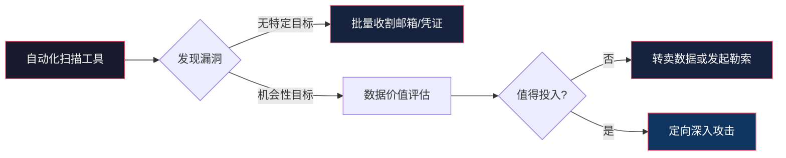
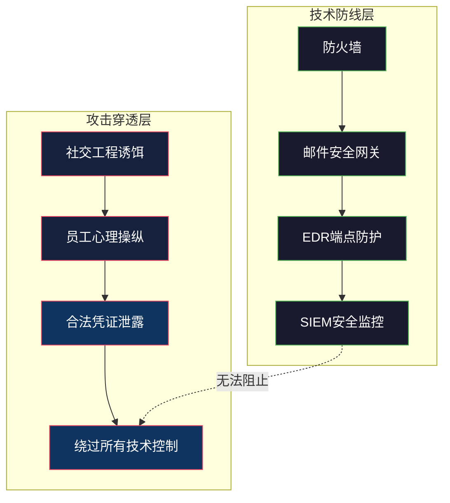
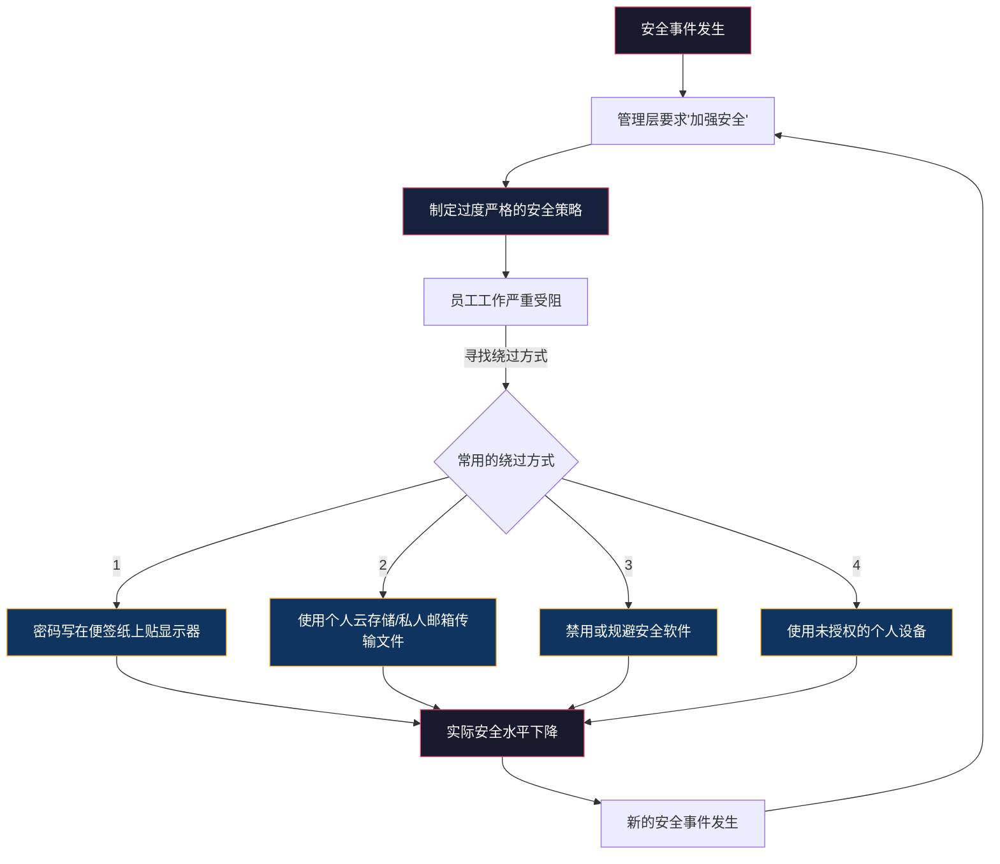
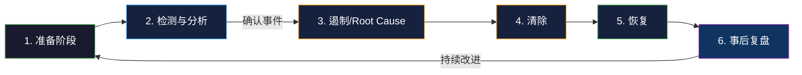

# 第23章 社会工程学 — 常见误区

> **认知偏差是安全防线中最危险的缺口。识别误区本身就是一种防御。**

在前几节中，我们系统性地剖析了社会工程学的心理学原理、攻击模型、核心技巧和防御方法。然而，即便掌握了所有防御技术，如果对安全本身的理解存在根本性误区，防线依然形同虚设。

本节的13个常见误区，并非简单的"错误列表"，而是透过表面错误剖析其背后的**认知根源**——为什么人们会陷入这些误区？这些误区如何被攻击者利用？又该如何从思维层面彻底消除它们？

---

## 23.1 对社会工程学风险的系统性低估

对社会工程学风险的轻视，是绝大多数组织安全防线失效的根源。这种低估并非单纯的"不了解"，而是植根于人类认知的深层机制。

### 23.1.1 误区一："社会工程学只是低端骗局"

**错误认知**

许多人将社会工程学等同于街边诈骗、垃圾邮件或"尼日利亚王子"式的低端骗局。这种认知源于两个心理偏差：**熟悉性偏差**（只关注自己看到的低端案例）和**可得性启发**（容易回忆起刷屏的"弱智诈骗"新闻，而非那些从未曝光的高级攻击）。

**事实真相**

现代社会工程学已经发展为一门融合心理学、数据分析、人工智能和网络技术的尖端攻击科学。它不再是"广撒网"的粗放模式，而是高度精密化的系统工程。

**五大进化趋势：**

| 维度 | 传统社会工程学 | 现代社会工程学 |
|------|--------------|--------------|
| 目标定位 | 随机目标、广撒网 | OSINT精准画像、高端定制 |
| 技术支撑 | 简单工具（伪基站、群发软件） | AI语音合成、深度伪造、大数据分析 |
| 攻击渠道 | 单一（邮件或电话） | 多渠道协同（邮件+电话+短信+社交媒体+物理） |
| 时间跨度 | 一次性攻击 | 长期潜伏（数月到数年） |
| 组织化程度 | 个人或小团体 | 有组织犯罪集团、国家级APT组织 |

**真实案例：深度伪造语音攻击**

2019年3月，英国某能源公司CEO接到一个电话——来电显示是母公司CEO的号码，声音、语气、措辞习惯完全一致——要求立即向某匈牙利供应商转账22万欧元（约24.3万美元）。CEO照做了。直到母公司CEO发邮件询问这笔转账时，骗局才被发现。调查显示，攻击者利用AI语音合成技术（深度学习声纹模型），从母公司CEO在公开场合的演讲录音中提取了足够的声音样本，生成了足以以假乱真的语音。**这不是"低端骗局"——这是一次利用最前沿AI技术的社会工程学攻击。**

**统计数据揭示的真相：**

- Verizon 2024年数据泄露调查报告（DBIR）显示，**91%的网络攻击涉及社会工程学元素**——这意味着没有哪种技术防线能单独解决问题
- 联邦调查局互联网犯罪投诉中心（FBI IC3）报告，2013年至2023年，商业电子邮件诈骗（BEC）累计造成超过**500亿美元**损失
- KnowBe4 2024年行业基准报告显示，经过钓鱼模拟的组织中，**首次测试点击率平均33%**，即使经过12个月的持续培训后仍有约5%的员工会点击恶意链接

**正确理解**

高级持续威胁（APT）组织将社会工程学作为核心攻击武器。例如：

- **APT29（Cozy Bear）**——被认定为俄罗斯对外情报局（SVR）下属的黑客组织，在2020-2021年SolarWinds供应链攻击中，通过鱼叉式钓鱼邮件植入后门，影响了超过18,000个组织。这不是"低端骗局"，而是国家级情报行动的核心战术。
- **Lazarus Group**——朝鲜黑客组织，利用精心设计的社交工程诱饵（伪装成加密货币公司招聘信息）针对区块链行业发起攻击，2022年窃取超过17亿美元加密货币。

---

### 23.1.2 误区二："我们公司不会成为目标"

**错误认知**

"我们只是小公司，黑客不会费心思来攻击我们。"——这是中小企业（SME）最常见的错误假设。这种心态源于**乐观偏差**（人们倾向于相信自己比平均水平更不容易遭遇负面事件）和**单一事件概率谬误**（人们低估了低概率事件在大量尝试下的总发生率）。

**事实真相**

攻击者并不像人们想象的那样"挑选"目标。现代攻击以**规模和自动化**为核心策略：



**中小企业面临的独特威胁：**

| 威胁维度 | 具体风险 | 数据支撑 |
|---------|---------|---------|
| 安全防护薄弱 | 平均仅投入IT预算的6%用于安全 | 远低于大企业的15-20% |
| 攻击成本低 | 自动化攻击工具仅需$50/月 | 暗网RAT+钓鱼工具包即开即用 |
| 供应链价值 | 60%的数据泄露涉及第三方供应商 | 攻击者通过SME渗透大型企业 |
| 勒索价值 | 中小企业支付赎金意愿更高 | 平均支付$100K-$500K |

**恐惧数据：**

- **43%的网络攻击针对中小企业**（Verizon 2024 DBIR）
- **60%的中小企业在遭受网络攻击后6个月内倒闭**（National Cybersecurity Alliance）
- 中小企业平均因安全事件损失**$120,000-$250,000**——这对许多公司是致命打击

**真实案例：暗网数据分析公司的教训**

2023年，一家仅有40人的暗网数据分析创业公司（美国西海岸）遭遇勒索软件攻击。调查发现，攻击者并非特意"选中"这家公司，而是通过Shodan扫描到其未打补丁的Citrix Netscaler设备，然后利用该漏洞进入内网。攻击者的自动化扫描工具每周扫描数百万台设备，这家公司只是碰巧撞上了自动瞄准的准星。最终赎金：**15个比特币（约$450,000）**，公司无力支付，被迫关闭。

**正确做法**

中小企业不必也不应该"躺平"。以下是一个低成本高回报的防护路线图：

1. **基础层（零预算）**
   - 部署免费MFA（微软Authenticator、Google Authenticator）
   - 强制密码管理器（Bitwarden免费版即可）
   - 启用DMARC/DKIM/SPF邮件认证（免费，阻断域名仿冒）

2. **投入层（$500-2000/年）**
   - 安全意识培训平台（KnowBe4或CyberHoot，按员工数计费）
   - 基础EDR方案（如SentinelOne或CrowdStrike小企业版）
   - 第三方渗透测试（$2K-5K/次，至少每年一次）

3. **制度层（人力投入）**
   - 指定安全联系人（即使是兼职）
   - 制定简单的事件响应流程（1页纸即可）
   - 加入行业情报共享组织（如FS-ISAC区域分会）

---

### 23.1.3 误区三："技术防护可以解决一切"

**错误认知**

"我们部署了下一代防火墙、EDR、SIEM、零信任架构——所以我们是安全的。"这种**技术解决主义**的误区源于对"可控制事物"的过度信赖（控制错觉），以及将安全视为"技术问题"而非"人的问题"的根本性误解。

**事实真相**

技术防护是必要的，但远非充分的。原因在于社会工程学攻击天然地**绕开技术防线**，直接作用于人的决策过程。



**技术防护无法应对的六类场景：**

| 攻击类型 | 技术防御手段 | 技术为何失败 | 真实案例 |
|---------|------------|------------|---------|
| 精准鱼叉式钓鱼 | 邮件安全网关 | 邮件内容不含恶意载荷，仅含社会工程话术 | 2020 Twitter比特币骗局 |
| 电话诈骗（Vishing） | 所有技术手段 | 攻击者直接与目标通话，技术手段无法介入 | 2023 MGM Resorts攻击（通过电话重置员工密码） |
| 内部人员威胁 | 访问控制、审计日志 | 内部人员拥有合法权限 | 2018 Tesla内部人员数据泄露 |
| 物理社会工程学 | 门禁、监控 | 攻击者伪装成快递员/维修工被善意放行 | 多起渗透测试中的经典案例 |
| 深度伪造欺骗 | 各类技术 | 生物识别和声音验证可被AI绕过 | 2019英国能源公司语音伪造转账 |
| 社交媒体的信息收集 | 传统安全工具 | 攻击者从不进入内网，仅收集公开信息 | LinkedIn伪装添加好友 |

**真实案例：一个电话攻破全球最大的赌场集团**

2023年9月，**MGM Resorts International**遭受勒索软件攻击，导致旗下30多家赌场和酒店停摆长达10天，直接损失超过**1亿美元**。调查发现，攻击者（APT组织Scattered Spider/UNC3944）没有利用任何零日漏洞——他们只是在LinkedIn上找到了一名MGM员工的个人信息，然后致电MGM IT服务台，**伪装成该员工请求重置密码**。一名客服人员在没有严格执行身份验证流程的情况下完成了重置。攻击者利用重置后的凭证进入VPN，进而部署了勒索软件。

**这个案例的教训是**：MGM的技术防线（防火墙、EDR、MFA等）投入了数千万美元——但整个帝国被一个电话攻破。

**正确做法：人技结合的纵深防御**

真正的防御需要形成"人-流程-技术"三维体系，而非单纯依赖技术：

| 防护维度 | 核心措施 | 抵御的攻击类型 |
|---------|---------|--------------|
| **技术防护** | MFA、邮件安全、端点EDR、网络分段、零信任架构 | 自动化/大规模攻击 |
| **人员培训** | 安全意识教育、钓鱼模拟演练、角色扮演实训 | 社会工程定向攻击 |
| **流程控制** | 身份验证流程、转账审批机制、数据访问审核 | 内部威胁和绕过攻击 |
| **监控响应** | 用户异常行为分析（UEBA）、SOC监控、事件响应演练 | 所有已渗透攻击 |
| **安全文化** | 零惩罚报告制度、高管示范、安全意识融入日常工作 | 系统性忽视风险 |

**核心原则**：将"如果技术防不住怎么办"作为默认假设来设计流程——而不是假设技术能防住一切。

---

## 23.2 安全意识培训的常见错误

许多组织已经认识到了培训的重要性，但投入大量资源后效果不佳——原因在于培训本身存在根本性设计缺陷。

### 23.2.1 误区四："培训一次就够了"

**错误认知**

许多组织每年组织一次安全培训（通常是半小时的在线课程），然后就认为"完成了任务"。这种**一次性培训心态**源于将安全培训视为合规要求的"打勾项"，而非持续的能力建设过程。

**心理学原理：艾宾浩斯遗忘曲线**

德国心理学家赫尔曼·艾宾浩斯（Hermann Ebbinghaus）在1885年发现，人类记忆遵循指数衰减规律：学习新知识后，**20分钟遗忘42%、1小时遗忘56%、1天遗忘74%、1周遗忘77%、1个月遗忘79%**。安全知识的衰减速度与之高度一致。

**SANS安全意识研究的数据：**

```mermaid
gantt
    title 安全意识知识保留率随时间变化
    dateFormat X
    axisFormat %s
    
    section 培训后1个月
    知识保留率 80% :a1, 0, 1M
    
    section 培训后3个月
    知识保留率 50% :a2, 1M, 2M
    
    section 培训后6个月
    知识保留率 20% :a3, 3M, 3M
    
    section 培训后12个月
    知识保留率 <5% :a4, 6M, 6M
```

**为什么一次性培训远远不够？**

| 原因 | 具体说明 | 影响 |
|------|---------|------|
| 遗忘曲线客观规律 | 30天后仅保留约20%知识 | 员工在真正遇到威胁时已忘记如何应对 |
| 攻击手法快速进化 | 新型钓鱼技术在6个月内翻新 | 过时的培训内容无法覆盖新威胁 |
| 员工流动性 | 平均年流失率15-20% | 新人加入后到下一次培训前存在安全空窗期 |
| 安全习惯需要强化 | 知识→行为转变需要持续强化 | 一次培训无法形成条件反射式的安全行为 |
| 新威胁环境变化 | AI深度伪造、新型社会工程学手法不断涌现 | 培训内容需要持续更新 |

**正确做法：构建持续安全意识强化体系**

**"碎片化+高频次"模式比"大而全+低频次"模式有效5-8倍**（KnowBe4 2024年实证研究）。

推荐实施框架：

1. **月度安全速递（5分钟）**
   - 每月一期2-3页PDF或短视频，聚焦当月最热门的1-2个威胁
   - 格式：30秒案例→1分钟分析→30秒应对→2分钟互动问题
   - 工具：Canva或CanIPhish创建，通过内部通讯工具发送

2. **季度钓鱼模拟（计划的+随机的）**
   - 至少每季度一次全公司范围的钓鱼模拟演练
   - 附加每月随机小规模钓鱼测试（覆盖10-20%员工）
   - 工具：GoPhish（免费开源）、KnowBe4（付费）、Proofpoint（企业级）

3. **半年深度培训（1-2小时）**
   - 每年2次面对面的深度安全培训（或在线直播）
   - 内容包含最新真实案例、互动角色扮演、情景模拟
   - 覆盖新兴威胁：AI深度伪造、深度语音克隆等

4. **持续强化机制（每日嵌入）**
   - 电脑登录时弹出安全提示（使用Bulb Security的免费工具）
   - 在Slack/Teams中创建#security-tips频道，每周发布安全提示
   - 会议室和公共区域设置安全海报（定期更新）

5. **效果衡量指标**
   - 钓鱼点击率：目标从初次测试的>30%降到持续培训后的<5%
   - 安全事件报告率：员工主动报告可疑事件的频率
   - 安全意识测试分数：每季度测试平均分的提升趋势

---

### 23.2.2 误区五："培训内容太技术化了，普通员工听不懂"

**错误认知与纠正**

这个误区本身存在**两面性**：一方面，确实存在培训内容过于技术化的问题；但另一方面，很多组织矫枉过正——走向了另一个极端：过度简化导致信息量不足，员工学不到真正有用的知识。

**真正的问题不是"技术化"而是"不相关"**

研究表明，安全意识培训失败的首要原因不是技术性太强，而是**与员工日常工作的关联性太弱**。当技术人员用"SQL注入""XSS""RCE"来培训市场部员工时，问题在于**场景错位**而非"技术化"本身。

| 培训问题 | 表面症状 | 根本原因 |
|---------|---------|---------|
| 过度技术化 | "听不懂专业术语" | 场景和受众严重错位 |
| 过度简化 | "感觉就是老生常谈" | 缺乏实质内容和具体行动指南 |
| 模板化 | "每年都是那几张PPT" | 没有更新真实案例和数据 |
| 被动式 | "放着视频然后签个到" | 没有互动和参与感 |
| 无反馈 | "考完试就忘了" | 缺乏持续强化和行为改进机制 |

**有效安全培训的设计原则（基于Kirkpatrick四级评估模型）：**

1. **反应层**：培训让员工感到"这对我有价值"——用真实案例建立情感连接，而非枯燥的规则说教

2. **学习层**：员工不仅理解了知识，还知道**在什么场景下如何应用**——用情景模拟替代概念讲解

3. **行为层**：员工的安全行为发生了可衡量的改变——通过钓鱼模拟和匿名检查来验证

4. **结果层**：组织安全指标改善——钓鱼点击率下降、事件报告率上升、安全事件减少

**角色化培训内容设计：**

| 员工角色 | 核心关注点 | 培训重点 | 案例场景 |
|---------|-----------|---------|---------|
| 前台/行政 | 物理安全、访客管理 | 身份验证流程、尾随攻击识别 | 伪装修理工获取门禁权限 |
| 财务/会计 | BEC、发票欺诈 | 转账验证流程、异常付款请求 | CEO冒名要求紧急转账 |
| HR/人事 | 个人信息保护、招聘钓鱼 | 敏感数据保护、求职者验证 | 伪装成求职者获取员工信息 |
| 研发/技术 | 代码仓库安全、供应链安全 | 合并请求审查、依赖包验证 | 钓鱼npm包入侵内网 |
| 高管/C-level | 针对性攻击、声誉风险 | 个人信息保护、公开演讲风险 | 深度伪造CEO语音致电董事会 |

**正确做法：场景化而非技术化的培训设计**

1. **为每个部门定制2-3个最相关的攻击场景**，用"如果你遇到以下情况……"来开场
2. **使用"红队演练录像"**：录制一段模拟攻击的视频（或使用现有公开案例），让员工看到攻击者在另一端是如何操作的
3. **建立"安全英雄"激励机制**：员工成功识别并报告可疑活动后，公开表扬并给予小奖励（如礼品卡、额外休息时间）
4. **将安全融入业务流程**，而不是作为一个独立的额外任务——例如在报销系统中嵌入"请确认该供应商是你亲自联系的"提示

---

### 23.2.3 误区六："只要培训员工识别钓鱼邮件就够了"

**错误认知**

许多安全意识培训聚焦于一个目标：教会员工"不要点击可疑链接"。这种**单点防御思维**忽视了社会工程学攻击的多样性。

**攻击媒介全谱系图：**

```text
社交工程攻击媒介谱系
─────────────────────────────────────────────────────
                                        复杂程度
                                           ↑
  自动化钓鱼 ─→ 鱼叉式钓鱼 ─→ 电话诈骗(Vishing) ─→ 深度伪造
     │              │              │                   │
     ├ 垃圾邮件      ├ LinkedIn     ├ 假冒技术支持      ├ AI语音克隆
     ├ 群发短信      ├ 定制化内容    ├ 冒充银行/税务    ├ AI视频伪造
     ├ 水坑攻击      ├ 社交平台     ├ 伪装成同事       ├ 实时换脸
     └ 假冒登录页    └ 多层诱导     └ 威胁+恐吓        └ 合成身份
     
  简单的 ──────────────────────────────────────────────→ 高级的
```

**只培训钓鱼邮件识别造成的盲区：**

| 被忽略的攻击方式 | 为什么员工没防备 | 真实案例 |
|----------------|----------------|---------|
| 电话诈骗（Vishing） | 从未接受过电话场景的安全培训 | 2023 MGM攻击——通过电话重置密码 |
| 短信钓鱼（Smishing） | 认为"短信比邮件安全" | 2022 OKX交易所短信钓鱼导致用户损失$500万 |
| 社交媒体攻击 | 认为社交平台上的信息是"私密的" | LinkedIn上伪装成HR添加好友 |
| 物理社会工程学 | 认为"有门禁就安全" | 尾随进入办公区、伪装成快递员 |
| AI深度伪造 | 从未接触过此类案例 | 2020 UAE银行CEO被AI语音克隆骗走$3500万 |
| QR码钓鱼（Quishing） | 认为"扫码比点击链接安全" | 2023起全球多地QR码钓鱼案暴增 |

**真实案例：OKX交易所短信钓鱼攻击**

2022年，加密货币交易所OKX的多名用户遭遇账户被清空。攻击者并未发送钓鱼邮件，而是利用**短信渠道**发送钓鱼链接，伪装成OKX的"安全验证提醒"。短信还配合了电话轰炸（Call Flooding）——在用户收到短信的同时，攻击者用数千个骚扰电话轰炸用户的手机，让用户心烦意乱、无法冷静思考，反而"急切地"点击了短信中的"立即解决"链接。这种**多渠道协同社会工程学攻击**，仅仅培训钓鱼邮件识别是完全无法防御的。

**正确做法：全覆盖、多渠道的安全意识培训**

构建**全谱系培训矩阵**，覆盖所有攻击媒介：

1. **邮件培训**（基础）——识别钓鱼邮件、BEC、供应链攻击
2. **电话培训**（常见忽略）——验证来电者身份、不泄露敏感信息、挂断后回拨官方号码确认  
3. **短信培训**（新威胁）——识别假冒短信、不要回复未知号码、警惕紧急话术
4. **社交媒体培训**（盲区）——控制个人信息公开范围、验证添加好友请求、注意分享的内容
5. **物理安全培训**（综合）——尾随拦截、访客验证、资产管理、无标识人员问询
6. **QR码和二维码培训**（新兴威胁）——在公共场所不要随意扫码、扫码前检查URL域名

---

## 23.3 技术防护与人员防护的平衡

技术派和安全派之间的争论往往陷入二元对立。事实上，最有效的安全体系是两者有机融合的结果——理解这种融合，需要先破除三个认知障碍。

### 23.3.1 误区七："安全是IT部门的事，跟我无关"

**错误认知**

这是最常见也最危险的误区。当员工认为"安全是IT部门的工作"时，他们不仅会降低自己的警惕性，还会**主动逃避安全责任**——比如未报告可疑活动、绕过安全措施、认为"这不是我的问题"。

**心理学根源：旁观者效应和责任扩散**

社会心理学家约翰·达利（John Darley）和比布·拉坦（Bibb Latané）在1968年提出的"旁观者效应"（Bystander Effect）理论完美解释了这一现象：当责任被分散到多人时，个人采取行动的意愿会显著降低。在安全领域，这种心理表现为："这么多IT安全团队，肯定有人会处理的。"

**真实案例：Uber 2022年数据泄露**

2022年9月，攻击者（18岁的黑客组织TeaPot）通过社会工程学手段——伪装成Uber内部IT支持人员，与一名Uber员工的Slack账号进行交流，骗取该员工的Okta认证凭据——获得了Uber内网的超级管理员权限。攻击者随后在内部系统发布了大量截图，暴露了Uber的关键基础设施信息。

**令安全界震惊的发现是**：在攻击发生当天，Uber有**多个员工看到了Slack上的异常活动**（攻击者直接在内网上发帖），但没人报告。他们要么认为"Slack上有其他人看到了会处理"，要么觉得"这可能是IT部门的测试"。这就是**旁观者效应在安全中的典型体现**——每个人都看到了异常，但没有人行动。

**全员安全责任的五个层级：**

| 层级 | 人员 | 安全职责 | 日常行动要求 |
|------|------|---------|------------|
| 第一层 | 每一位员工 | 第一道防线：识别和报告 | 发现异常立即报告，不绕开安全措施 |
| 第二层 | 业务线经理 | 团队安全文化塑造者 | 定期与团队讨论安全隐患，以身作则 |
| 第三层 | 安全团队 | 技术防御和事件响应 | 维护技术防线，响应安全事件，培训员工 |
| 第四层 | 管理层/高管 | 安全战略和资源支持 | 分配安全预算，支持安全文化，参与培训 |
| 第五层 | 董事会 | 安全治理和风险监督 | 了解安全态势，监督风险管理，确保合规 |

**正确做法：构建"人人皆为防线"的安全文化**

1. **高管率先垂范**：CEO、CFO等高管亲自参加安全培训并公开谈论安全的重要性。研究表明，当高管在全员会议上花30秒提及安全时，员工的安全行为改善率提升**40%**。

2. **零惩罚报告制度**：建立"报告无罪"的文化。2023年的一份研究显示，实施零惩罚报告制度的组织，其安全事件早期发现率（在造成重大损失前）是惩罚性报告制度的**3.7倍**。

3. **考核与激励挂钩**：将安全行为纳入绩效考核。例如Google的"安全冠军"项目——每个团队指定1名安全大使，承担额外安全职责并获得相应认可。

4. **将安全融入日常工作流程**：在报销系统、文件共享、邮件审批等日常流程中嵌入安全验证点，让安全成为工作的一部分而非额外负担。

---

### 23.3.2 误区八："安全措施会降低工作效率"

**错误认知**

"输入密码已经很麻烦了，还要MFA？""每次打开附件都要审批？太耽误时间了！"——这些抱怨背后的假设是：**安全与效率是零和博弈**。

**事实真相**

这种零和思维忽略了两个关键事实：

1. **安全事件的成本远高于安全措施的成本**。根据IBM 2024年数据泄露成本报告，全球平均数据泄露成本为**$488万美元**（比2023年增长10%）。安全事件导致的业务中断、声誉损失、法律追责和恢复成本，远超安全措施带来的"效率损耗"。

2. **设计良好的安全措施不会降低效率**——真正损害效率的是**设计不良的安全流程**。安全与效率不是二元对立，而是可以通过**人性化设计**实现共赢。

**安全措施的设计成熟度对比：**

| 设计水平 | 典型特征 | 效果 | 示例 |
|---------|---------|------|------|
| 反人类设计 | 未考虑用户体验，仅从技术角度出发 | 员工抵触、寻找绕过方式、效率显著降低 | 每90天强制更换复杂密码（导致密码写在便签纸上） |
| 可接受设计 | 平衡安全与效率，有基本的用户体验考虑 | 员工能接受，偶有抱怨但不影响正常业务 | 密码管理器+SSO单点登录 |
| 隐形设计 | 安全机制融入业务流程，用户几乎感知不到 | 安全自动化运行，效率不受影响甚至提升 | 自适应MFA（低风险操作无感通过，高风险操作再验证） |
| 赋能设计 | 安全措施实际上提升了工作效率 | 安全成为生产力的助推器 | 自动化的代码安全扫描、智能化的威胁情报系统 |

**真实案例：Google BeyondCorp零信任模型**

Google在2010年遭受了史诗级的"Aurora行动"攻击后，意识到传统边界安全模型（VPN+防火墙）既不安全也降低了效率。他们推出了**BeyondCorp零信任架构**——核心思想是：不信任任何网络位置，而是基于设备状态和用户身份持续验证。

**结果是**：员工无需使用VPN即可安全地访问内部应用（不再有VPN掉线的烦恼），同时安全水平大幅提升。这个案例证明，当安全设计得当时，**安全性和效率可以同时提升**。

**正确做法：用户体验中心的安全设计原则**

1. **自适应安全机制**：根据风险级别动态调整安全措施的严格程度
   - 低风险（访问内部知识库）：仅需一次认证
   - 中风险（下载敏感文件）：MFA验证
   - 高风险（修改系统配置、发起大额转账）：人工审批+双人验证

2. **单点登录（SSO）+ 密码管理器整合**：员工只需要记住**一个主密码**，所有应用自动登录。这样既提高了安全（避免重复使用弱密码），又提升了效率（不需要反复输入）。

3. **评估安全效率比的公式**：
```text
   安全效率 = 安全收益 / 效率损耗
   
   理想状态：安全收益 >> 效率损耗（目标：>10:1）
   警示状态：安全收益 < 效率损耗（需要重新设计）
   ```

4. **收集并响应员工反馈**：定期收集员工对安全措施的抱怨，分析哪些是"必要的安全约束"（不能妥协），哪些是"可以优化设计"的（改进机会）。

---

### 23.3.3 误区九："安全事件不会发生在我身上"

**错误认知**

"这事概率太小了，不会轮到我。""我们公司做了这么多防护，不可能被入侵。"——这种心态在心理学上被称为**乐观偏差**（Optimism Bias），即人们系统性地低估自己遭遇负面事件的概率。

**四种认知偏差的叠加效应：**

| 偏差名称 | 定义 | 在安全领域的具体表现 | 后果 |
|---------|------|-------------------|------|
| 乐观偏差（Optimism Bias） | 认为自己比他人更不容易遭遇不幸 | "别人会被钓鱼，但我不会点击" | 降低警惕性，不做防护 |
| 正常化偏差（Normalization Bias） | 将异常信号解释为正常现象 | "这个邮件有问题……但可能只是系统bug" | 延误报告和响应时机 |
| 控制错觉（Illusion of Control） | 高估自己对结果的控制能力 | "我很谨慎，不会上当" | 忽略系统性的安全防护 |
| 确认偏差（Confirmation Bias） | 只关注支持自己观点的信息 | "我用Mac，Mac不会被攻击" | 忽视针对Mac的攻击数据 |

**为什么"不会发生在我身上"是危险的假设：**

让我们做一个简单的数学计算：

- 假设一个钓鱼邮件的成功率是**0.1%**（千分之一，已经是非常保守的估计）
- 一个普通企业员工每天收到**20封**邮件（保守估计）
- 一个月20个工作日，一年240天

那么，**一年内至少成功点击一次的概率**：
- 每天不被钓鱼的概率：1 - 0.001 = 0.999
- 一年不被钓鱼的概率：0.999^4800 ≈ 0.0082（约0.82%）
- 一年内至少成功一次的概率：**99.18%**

这不是概率问题——**而是时间问题**。你必然会遇到至少一次成功的攻击，区别只在于你是否有准备。

**真实案例：Kaseya供应链攻击**

2021年7月，VSA（远程管理软件）的零日漏洞被勒索软件组织REvil利用，一次性加密了**超过1500家**企业的数据。这些企业中的大多数并不是REvil直接"盯上"的——它们只是Kaseya VSA的客户。它们的安全团队做了各种防护，但零日漏洞+供应链传播的复合攻击让所有的技术防护瞬间失效。

**教训**：在这个案例中，被攻击的企业做对了所有事情——正确的防火墙、及时补丁、良好的员工培训——但仍然被攻破了。**"安全事件会发生在任何人身上"应该成为每个安全从业者的默认假设。**

**正确做法：建立"一定会发生"的防御心态**

1. **从"如果"转向"当"**：不再问"如果被攻击怎么办？"，而是问"当被攻击时，我们的流程和预案是什么？"
   - 制定事件响应计划（IR Plan）
   - 建立备份和业务连续性机制
   - 购买网络安全保险（作为最后防线）

2. **定期安全评估**：不要假设自己是安全的。每年至少进行1次渗透测试和1次钓鱼模拟演练。把"我们安全吗？"这个问题的答案建立在数据而非感觉上。

3. **建立"安全盟友"网络**：加入行业内的信息共享组织（ISAC），及时获取最新的威胁情报和攻击指标（IoC）。

4. **培养"安全本能"**：通过持续的培训和实践，让"一遇到可疑情况就停下来想想"成为一种条件反射。

---

## 23.4 安全策略制定的常见误区

即使认识到风险并愿意投入，许多组织在制定安全策略时仍然会犯致命错误——两个极端"太严"或"太松"的摆动，以及面对事件时的错误态度。

### 23.4.1 误区十："安全策略越严格越好"

**错误认知**

这种误区的出现往往是一个"事件驱动"的结果：一次安全事件发生后，管理层下令"加强安全"，于是安全团队把所有能想到的限制都加上了——禁止所有USB设备、强制90天更换密码、禁止访问所有社交媒体、安装监控软件记录键盘输入……

**事实真相：过于严格的反噬效应**

过于严格的安全策略会触发**"政策规避行为"**（Policy Evasion Behavior）——当员工发现安全措施严重阻碍了工作效率时，他们会寻找绕开这些措施的方法。这种行为的结果是**实际安全水平不升反降**。

**严格策略的典型反噬循环：**



**经典反例：90天密码更换要求**

NIST（美国国家标准与技术研究院）在2017年发布的**SP 800-63B**数字身份指南中，明确**推翻了**之前"每90天强制更换密码"的建议。原因是：

- 频繁更换密码导致用户使用弱密码（Password1!→Password2!→Password3!……）
- 用户将密码写在显眼处以记住新密码
- 认知负担增加，反而更容易受到针对性的社会工程学攻击

**NIST当前建议**：只在有理由怀疑密码泄露时才要求更换——而不是定期强制更换。

**"过严策略"vs"合理策略"的对比：**

| 策略议题 | 过于严格的做法 | 反噬后果 | 合理做法 |
|---------|--------------|---------|---------|
| 密码策略 | 90天强制更换+16位+特殊字符+大小写+数字 | 密码写便签、使用可预测模式 | 长密码（口令短语）+密码管理器+仅在泄露时更换 |
| USB设备 | 完全禁用所有USB设备 | 员工使用云存储、个人邮箱传输文件 | 白名单化+只读模式+加密USB+分类管控 |
| 网络访问 | 禁止所有外网访问 | 员工用手机热点上网，避开公司安全监控 | 分级网络+安全代理+DLP数据防泄漏 |
| 个人设备 | 完全禁止所有个人设备 | 员工隐蔽使用无人监督 | BYOD方案+MDM设备管理+企业容器 |
| 社交媒体 | 在工作时间禁止所有社交网站 | 使用代理/VPN绕过监控 | 限制高危险行为（如发布内部信息）而非全封 |

**正确做法：风险导向的合理安全策略**

1. **风险导向策略设计**：不是"能限制的都限制"，而是"根据风险级别决定安全措施的严格程度"
   - 高敏感数据（客户PII、商业秘密）：强管控
   - 中等敏感数据（内部文档、流程）：适度管控
   - 公开数据（公司官网、产品介绍）：几乎不限制

2. **试点测试**：大规模推行新策略前，先在一个小团队中试点2-4周，收集反馈，发现不可预见的负面影响。

3. **用户参与制定**：在制定新安全策略时，邀请一线员工（而非仅安全团队和管理层）参与讨论。这不仅能发现设计缺陷，还能提高员工的接受度。

4. **定期审查和调整**：安全策略不应是一成不变的文档。每半年至少审查一次，根据威胁环境变化、员工反馈和技术进步进行调整。

---

### 23.4.2 误区十一："安全事件是耻辱，应该藏着掖着"

**错误认知**

"出了安全事件对外公布，股东会恐慌，客户会流失，竞争对手会借机炒作！"——这种想法可以理解，但结果往往是灾难性的。

**事实真相**

隐藏安全事件不仅违背了越来越多的法律法规（GDPR、CCPA、中国《网络安全法》等均要求及时披露），而且在战略层面是**彻底的失策**。

**隐藏事件的五种致命后果：**

| 隐藏的后果 | 具体表现 | 实际损害 |
|-----------|---------|---------|
| 法律风险 | GDPR要求在72小时内披露数据泄露，延迟或隐瞒面临全球营业额4%的罚款 | 2023年Meta因延迟披露数据泄露被罚款€13亿 |
| 响应延迟 | 隐瞒意味着没有启动应急响应，攻击者有了更多时间在系统内潜伏 | 安全事件响应每延迟1天，损失增加约$100万 |
| 无法学习 | 安全团队成员不能从事件中学习经验，下一次攻击来临时仍然措手不及 | 没有事后复盘==下次还会再犯同样的错误 |
| 声誉损害加重 | 如果事件最终被公开（几乎必然），隐瞒行为造成的声誉损害远大于事件本身 | 故意隐瞒被发现后，公众信任度几乎降为零 |
| 法律追索 | 受影响的客户或合作伙伴可能提起集体诉讼 | Equifax因2017年数据泄露赔偿了至少$7亿 |

**阳光是最好的消毒剂：积极披露的正面案例**

**案例A：GitLab（2017年）**

2017年1月31日，GitLab的一名工程师在生产数据库上执行维护操作时，意外删除了超过300GB的实时数据。GitLab没有试图掩盖，而是**进行了戏剧性的公开直播**——整个恢复过程在YouTube上直播，CISO和CTO在Twitter上实时更新进展。

结果是：
- 社区不仅没有愤怒，反而**赞赏他们的透明度**
- 数百名志愿者主动提供帮助（虽然最终未能恢复所有数据，但GitLab的态度赢得了广泛尊重）
- 这次事件后来成为安全行业的经典教学案例

**案例B：Cloudflare（2017年）**

2017年2月，Cloudflare发现了一个严重的内存泄露漏洞（"Cloudbleed"），可能导致敏感信息泄露。他们没有选择低调处理，而是发布了详细的公开披露报告，并在媒体上主动回应。结果是：虽然漏洞本身很严重，但Cloudflare的公开透明反而**增强了客户信任**，因为他们"知道可以信赖Cloudflare会诚实地处理问题"。

**正确做法：建立积极的安全事件文化**

1. **制定事件披露流程**（在事件发生前就准备好）：
   - 内部通报：事件确认后1小时内通知安全团队和核心管理层
   - 利益相关者通知：根据法律法规要求在时限内通知受影响的用户和监管部门
   - 公开披露：根据需要向社会公众披露（越早越好，坦诚为佳）

2. **"无责复盘"制度**：事件处理完成后，进行一次**真正的**（而非形式上）根因分析
   - 不追责个体：问题出在流程和系统层面，而非"这个人太蠢"
   - 找到根本原因：5个Why分析法，从表面原因追溯到系统层面
   - 制定改进措施：将教训转化为具体的流程、技术或制度改进

3. **加入行业情报共享组织**：
   - FS-ISAC（金融服务）
   - Health-ISAC（医疗）
   - MS-ISAC（政府/地方）
   - CISA的AIS（自动化指标共享）

**这些组织的核心理念是**：一个人的安全事件是所有人的经验教训。只有共享，整个行业的安全水平才能提升。

---

## 23.5 应急响应的常见误区

即使所有预防措施都到位了，安全事件仍然可能发生。这时，应急响应的质量决定了最终损失的大小。以下两个误区是对应急响应最常见也最危险的误解。

### 23.5.1 误区十二："没有应急预案也能应对——到时候随机应变"

**错误认知**

"我们是小公司，不需要那么正式的应急流程。" "真有事的时候，我们IT几个人就能搞定。" "应急预案写出来也没人看，浪费时间。"

**事实真相**

在没有应急预案的情况下应对安全事件，就像在没有地图的情况下在陌生森林中寻找出路——**可能能找到，但代价是时间和体力的大量浪费，而且情况只会越来越糟糕**。

**应急响应中"临时应对"vs"有预案应对"的对比：**

| 维度 | 无预案（临时应对） | 有预案（结构化应对） |
|------|-----------------|-------------------|
| 响应启动时间 | 发现异常后数小时到数天（需要开会讨论"要不要处理"） | 15-30分钟内进入响应状态（行动指南明确） |
| 决策质量 | 在压力下做出非理性决策（可能做出高成本低效果的选择） | 基于预先分析的风险矩阵做出最优决策 |
| 沟通效率 | 混乱的沟通：重复报告、信息遗漏、对外沟通口径不一致 | 预设通讯计划：内部链式上报+外部统一发言人 |
| 损失控制 | 损失持续扩大，因为不知道"该先做什么" | 按照优先级有序处理，最快速度遏制损害 |
| 恢复时间 | 数周到数月（因为没有恢复计划和备份策略） | 数小时到数天（基于RTO/RPO的恢复计划） |

**来自真实世界的数据：**

- IBM 2024年数据泄露报告显示：有安全事件响应团队（CSIRT）和定期测试预案的组织，平均数据泄露成本比没有的**低$176万美元**（$458万 vs $634万）
- 响应时间每减少1天，平均可以节省大约**$100万美元**的损失
- Verizon报告指出，**80%的数据泄露是在数周甚至数月后才发现的**——有应急预案的组织平均发现时间比没有的**快43%**

**建立应急响应的核心框架（基于NIST SP 800-61 Rev 2）：**



**应急响应计划"最小可行版本"（小企业适用）：**

即使是最小的企业，也可以在1天内完成以下工作：

1. **制作联系人速查表**（1小时）——列出关键联系人及备选联系方式的卡片
   - IT负责人：（姓名+手机+微信）
   - 管理层联系人：（姓名+手机）
   - 外部技术支援：（MSP/IT供应商的紧急联系人）
   - 法律顾问：（安全事件相关的律师联系方式）
   - 网络安全保险公司：（理赔热线+保单号）

2. **定义三级事件分类**（2小时）——根据影响程度做出适当响应
   - **一级事件（严重）**：核心系统停止、数据泄露确认、勒索软件加密——立即通知所有关键联系人、启动全面应急、必要时断网
   - **二级事件（中等）**：可疑入侵迹象、部分系统异常、个别账号泄露——通知IT负责人+管理层，2小时内评估是否升级
   - **三级事件（轻微）**：钓鱼邮件、孤立的恶意软件感染——常规IT工单处理，24小时内确认清除

3. **制定通信模板**（1小时）
   - 内部通知模板（Slack/微信通知模板）
   - 管理层简报模板（3句话说明情况+已采取措施+需要的决策）
   - 客户/合作伙伴通知模板（如需要）

4. **演练**（1天/每季度）——每季度进行一次桌面推演（Tabletop Exercise），模拟一个安全场景，沿着预案走一遍，发现空白和漏洞

---

### 23.5.2 误区十三："支付赎金就可以解决问题"

**错误认知**

当勒索软件加密了所有数据时，面对管理层"立刻恢复业务"的压力，很多组织会选择支付赎金。"花钱消灾"——听起来是理性的选择，但实际往往事与愿违。

**事实真相**

支付赎金是一个**没有赢家的选择**。不仅不保证数据恢复，还会带来一系列严重后果。

**支付赎金的五重风险：**

| 风险 | 概率/数据 | 具体说明 |
|------|----------|---------|
| 数据恢复失败 | 仅**65%**的支付者完整恢复数据（Sophos 2024） | 解密工具可能损坏数据、攻击者可能不提供密钥、可能部分文件无法恢复 |
| 再次被攻击 | **80%**的支付者被再次勒索（Cybereason 2023） | 支付记录被标记为"付款者"，成为其他团伙的目标。部分组织在支付后1个月内再次被同一团伙攻击 |
| 违规风险 | 支付给受制裁实体属于违法行为 | OFAC（美国财政部外国资产控制办公室）明确警告：向受制裁实体支付赎金可能面临罚款和法律责任 |
| 数据泄露风险 | **30%**的勒索攻击伴随数据窃取（"双重勒索"） | 即使支付了赎金，攻击者仍可能将窃取的数据出售或公开 |
| 助长犯罪生态 | 每次支付都在滋养勒索软件产业链 | RaaS（勒索软件即服务）模式让任何人都能发起勒索攻击——你的赎金在资助下一轮攻击 |

**"双重勒索"和"三重勒索"模式的兴起：**

现代勒索软件组织已经进化出更复杂的模式：
- **双重勒索**：加密数据 + 窃取数据（不支付就公开数据）
- **三重勒索**：加密数据 + 窃取数据 + DDoS攻击（不支付就摧毁业务系统）

**真实案例：Colonial Pipeline**

2021年5月，美国最大的燃油管道系统运营商Colonial Pipeline受到DarkSide勒索软件攻击，导致美国东部沿海地区出现燃油短缺。Colonial Pipeline支付了**$440万美元**赎金。结果是：

1. 虽然获得了勒索软件解密工具，但使用该工具恢复系统速度极慢，最终大部分系统还是从备份恢复的
2. 美国司法部后来追回了约**$230万**（约一半）
3. 公司声誉严重受损，CEO在国会听证会上公开道歉
4. DarkSide虽然被执法行动取缔，但其**$440万赎金**在支付时已经分发给多个附属组织

**Colonial Pipeline的教训**：支付赎金不能解渴，即使支付了，恢复业务仍然需要数天；而如果不支付，结果可能一样（从备份恢复），还少了$440万的损失。

**正确做法：勒索攻击的应对策略**

1. **预防——比一切响应都重要**
   - **3-2-1备份策略**：3份数据备份，存储在2种不同介质上，其中1份离线/异地存储
     - 第一份：本地（NAS或服务器本地）
     - 第二份：异地（云端，如AWS S3/Azure Blob）
     - 第三份：离线（磁带或不可变冷存储）
   - **不可变备份**：使用WORM（一次写入多次读取）存储，确保备份数据不会被勒索软件加密或删除
   - 定期测试备份恢复（至少每季度一次全量恢复演练——**备份不可恢复等于没有备份**）

2. **事件发生时——遵循结构化流程**
```text
   勒索攻击应急流程图：
   1. 立即断网：拔掉网线，禁用WiFi，断开VPN（阻止横向移动）
   2. 保留现场：不要关闭受感染系统（RAM中的证据可能丢失）
   3. 通知关键联系人：内部安全团队、外部法律顾问、网络安全保险公司
   4. 不要谈判：不要直接联系攻击者，等待专业团队评估
   5. 评估恢复选项：从备份恢复 vs 解密工具 vs 重新构建
   6. 法律合规评估：是否需要向监管机构/执法部门报告
   ```

3. **支付赎金的"最后手段"评估框架**
   如果所有其他选项都已用尽，在决定支付前进行以下评估：
```text
   支付决策清单：
   □ 是否已确认无法从备份恢复？（尝试至少3次不同的恢复方法）
   □ 是否有法律顾问评估了支付赎金的合规风险？（特别是跨境支付）
   □ 是否已联系执法机构？（FBI/CISA/当地网警）
   □ 是否已评估再次被攻击的风险？（是否有对应的加固措施）
   □ 是否已通知网络安全保险公司？（可能覆盖赎金支付或谈判服务）
   ```
   只有**所有问题都回答"是"**时，才考虑支付赎金——并且要认识到，支付是"缓解而非解决方案"。

4. **保险——风险转移**
   - 考虑为组织购买网络安全保险
   - 好的保单覆盖：事件响应服务、勒索谈判服务、数据恢复费用、法律服务、公关危机管理
   - **注意**：阅读保单细则——某些保单不覆盖"国家支持的黑客"攻击，某些对支付赎金有严格的限制

---

## 本节小结：误区的根源与超越

我们用大量篇幅剖析了13个常见误区，但比"知道这些误区"更重要的是**理解这些误区背后的深层逻辑**。

**所有误区的共同根源：**

| 共同根源 | 受影响误区 | 纠正策略 |
|---------|-----------|---------|
| **认知偏差**（乐观偏差、控制错觉等） | 1, 2, 3, 9 | 用数据对抗直觉，用演练验证假设 |
| **深度安全知识的匮乏** | 1, 3, 4, 12 | 系统化学习而非碎片化信息 |
| **非激励性组织文化**（惩罚文化、责任分散） | 5, 7, 11 | 建立零惩罚报告机制和积极反馈文化 |
| **对用户体验的忽视** | 6, 8, 10 | 人性化安全设计，将员工视为合作伙伴而非阻力 |
| **侥幸心理和短期思维** | 2, 4, 9, 12, 13 | 战略性安全投资而非打勾式合规 |

**从误区到正确认知的转变：**

```text
之前：         之后：
"低端骗局"   → "精密系统的心理攻击"
"不会发生"   → "当发生，我准备好了"
"技术解决"   → "人技融合的纵深防御"
"一次培训"   → "持续强化、碎片化学习"
"安全是IT的事" → "人人皆为防线"
"越严格越好" → "风险导向、用户友好"
"耻辱隐瞒"   → "透明学习、行业共享"
"没有预案"   → "最小可行、持续演练"
"支付赎金"   → "备份为王、不鼓励支付"
```

**最核心的一个理念转变：**

> **良好安全的目标不是"零风险"——那是不可能的。良好安全的目标是：当事件发生时，你准备好了。**

---

## 本章下一步

接下来，我们将进入第23.5节「练习方法」，提供从基础钓鱼模拟到高级渗透测试的实操指南，帮助你将从本节学到的正确认知转化为可执行的防御技能。

---

***本节核心金句：***

*识别误区本身不是目的——破除误区后的行动才是。在社会工程学防御中，最危险的漏洞不是技术上的，而是认知上的。当你读到这篇文章时，攻击者正在寻找那个认知漏洞。确保他们找到的不是你。*
