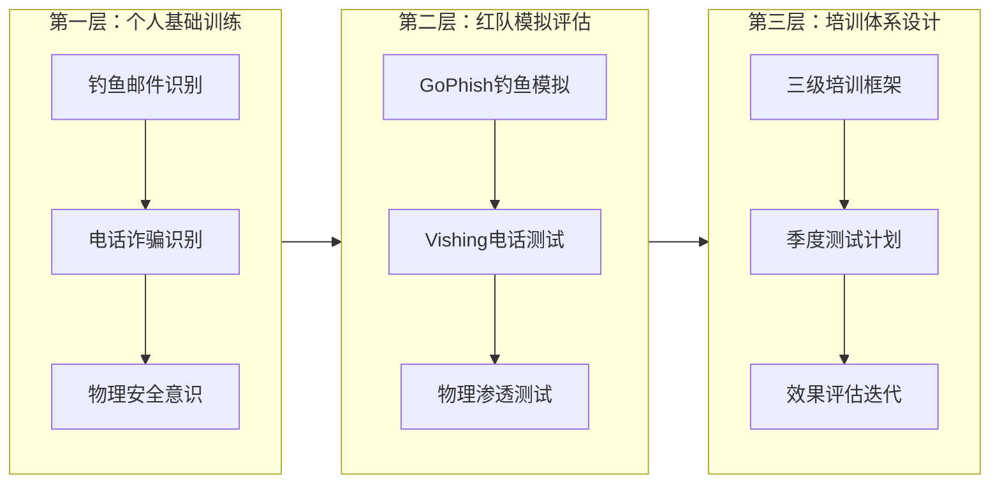
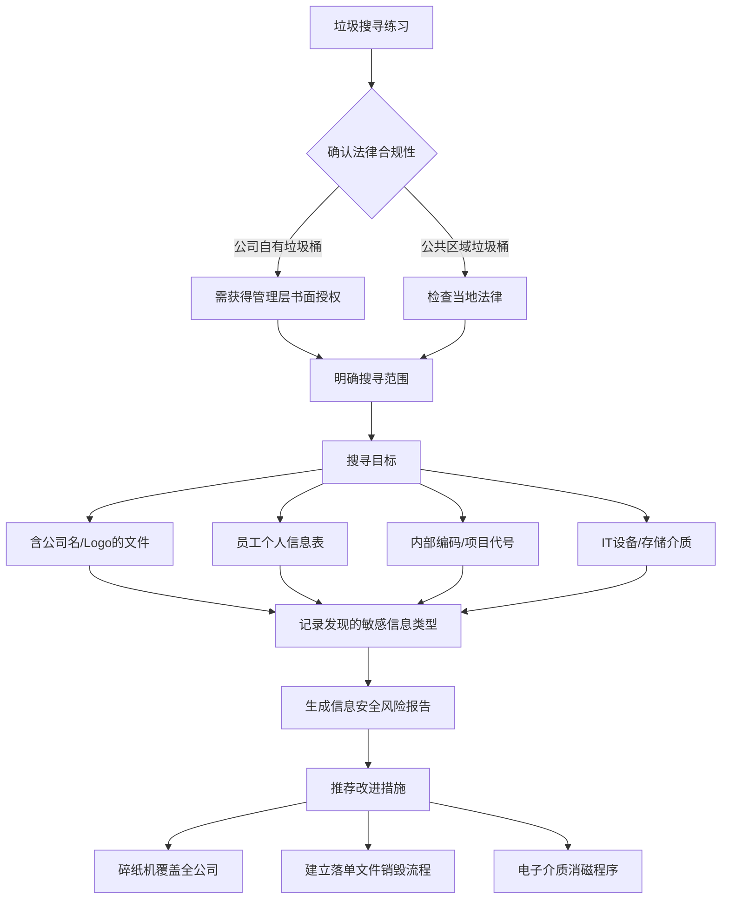
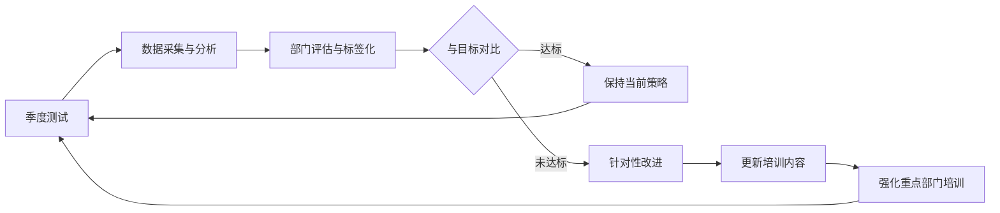

# 第23章 社会工程学 — 练习方法

> 知道不等于做到。社会工程学防御能力的提升，**不取决于你读了多少本书，而取决于你做了多少次刻意练习**。
>
> 安全意识在培训后的**第3个月开始衰减**，到第6个月时，**80%的关键知识已经被遗忘**（SANS研究数据）。唯一能对抗遗忘曲线的，是持续、系统、有反馈的练习。

## 本章导读

本章为不同角色的读者提供**可立即执行的练习方案**：

| 读者角色 | 推荐章节 | 练习频率 | 预期效果 |
|---------|---------|---------|---------|
| **普通员工/个人用户** | 23.5.1 个人安全意识训练 | 每周15分钟 | 钓鱼识别率从~60%提升至>95% |
| **安全培训管理者** | 23.5.3 培训方案设计 + 23.5.2 红队评估 | 季度周期 | 建立可量化的安全意识提升体系 |
| **渗透测试人员** | 23.5.2 红队评估 + 23.5.4 进阶练习 | 每月 | 熟练运用GoPhish/SET/Evilginx2等工具 |
| **安全团队全员** | 全部章节 | 持续 | 组织整体安全水位从\"合规\"升级到\"主动防御\" |

练习体系遵循**由浅入深、从防到攻、从模拟到实战**的三级递进逻辑：



---

## 23.1 个人安全意识训练

### 23.1.1 钓鱼邮件识别练习

#### 练习原理：为何\"识别\"需要刻意训练？

人类大脑的信息处理存在两种模式（丹尼尔·卡尼曼，2011《思考，快与慢》）：

- **系统1（快速直觉）**：自动运行、不费力的直觉判断。钓鱼邮件利用系统1制造紧迫感（\"您的账户即将被冻结！\"），绕过理性分析。
- **系统2（慢速分析）**：需要主动调动注意力的理性加工。训练的目标是**在特定情境下，自动触发系统2**。

研究表明（KnowBe4 2024行业基准），经过持续训练的员工，钓鱼点击率可从**33%降至5%以下**。但关键在于训练方法的**真实性和频率**——每年一次的形式化培训几乎无效。

#### 21点钓鱼邮件识别清单

以下清单覆盖了从**可见特征到深层分析**的完整识别维度，按难度递进排列：

| 序号 | 检查维度 | 具体检查内容 | 攻击手法示例 | 难度 |
|------|---------|------------|------------|------|
| 1 | 发件人显示名 | 显示名是否与邮箱地址的组织不一致 | "IT Support" <random@gmail.com> | ★☆☆ |
| 2 | 域名拼写 | 公司域名是否被字符替换 | micr0soft.com（o→0）、rnicrosoft（rn→m） | ★☆☆ |
| 3 | 邮件域名 | 是否使用公共邮箱发送业务邮件 | 某银行通知来自@163.com | ★☆☆ |
| 4 | 二级域名 | 子域名是否可疑 | secure-paypal.xyz.attacker.com | ★★☆ |
| 5 | 紧急/威胁语言 | 是否制造紧迫感迫使仓促行动 | "24小时内不验证将删除账户" | ★☆☆ |
| 6 | 语法与拼写错误 | 是否存在非母语表达或拼写错误 | "Dear costomer"、"We has detected" | ★☆☆ |
| 7 | 不自然的正式度 | 过于正式或过于随意的语气 | 银行邮件开头用"嘿，兄弟" | ★☆☆ |
| 8 | 链接URL验证 | 实际URL与显示文本是否一致 | 显示"www.paypal.com"但指向"192.168.1.5" | ★★☆ |
| 9 | 链接域名信誉 | 使用VirusTotal检查链接是否被标记 | VT检测结果中的安全厂商标记数 | ★★★ |
| 10 | 附件类型异常 | 是否包含宏/脚本类附件 | .docm、.xlsm、.js、.vbs、.exe | ★★☆ |
| 11 | 附件密码保护 | 是否要求输入密码打开附件（逃避安全扫描） | "打开密码：1234" | ★★★ |
| 12 | 请求的合理性 | 是否要求提供正常流程中不该索要的信息 | IT部门不会邮件索要密码 | ★★☆ |
| 13 | 收件人地址 | 是否使用BCC而非正常收件人 | 你是BCC收件人之一 | ★★★ |
| 14 | 回复地址 | Reply-To是否与From地址不一致 | 回复到攻击者的外部邮箱 | ★★★ |
| 15 | 邮件头SPF检查 | SPF/DKIM/DMARC验证是否通过 | Authentication-Results字段显示fail | ★★★ |
| 16 | Return-Path | 退信地址域是否与发件人不同 | Return-Path指向恶意域名 | ★★★ |
| 17 | 时间异常 | 发件时间是否在非工作时间 | 凌晨3点的\"紧急\"通知 | ★★☆ |
| 18 | 社交线索缺失 | 是否缺少你通常接收的个性化信息 | 内部的称呼方式、签名档格式不符 | ★★★ |
| 19 | 诱导后续操作 | 是否引导你打开链接、下载文件或转账 | 点击此处验证、下载更新 | ★★☆ |
| 20 | 多重手法叠加 | 是否同时使用至少3种上述手法 | 紧急+伪装+链接+附件 | ★★★★ |
| 21 | AI生成痕迹 | 是否有AI生成内容的典型特征 | 过于完美的结构、缺乏真实人类习惯的表述 | ★★★★ |

#### 每日5分钟练习方法

**方法一：真实样本分析法**

收集真实的钓鱼邮件样本并进行结构化分析：

1. **样本来源**：
   - PhishTank（phishtank.org）：全球最大的钓鱼URL数据库，每日更新
   - OpenPhish（openphish.com）：商业级钓鱼URL情报源
   - Anti-Phishing Working Group（apwg.org）：行业级威胁数据
   - 公司内部的已报告钓鱼邮件（经安全团队脱敏）
   - 个人垃圾邮件箱：将可疑邮件导出为EML格式

2. **分析流程**：
```text
   Step 1: 获取样本 → 不打开链接、不下载附件
   Step 2: 查看原始邮件头（Outlook: 邮件 → 属性 → 互联网头）
   Step 3: 填写21点检查清单（逐项核对）
   Step 4: 使用VirusTotal检查链接和附件
   Step 5: 汇总攻击手法 → 记录到个人识别日志
   Step 6: 推断攻击者的目标（凭证窃取/恶意软件/转账诈骗）
   ```

3. **练习节奏**：
   - 第一周：每天分析1封（熟悉清单）
   - 第二周：每天分析2-3封（提升速度）
   - 第三周开始：限时30秒快速识别，再用完整清单验证

**方法二：模拟测试平台**

利用专业平台进行**受控环境**下的识别训练：

- **KnowBe4**：全球最大的安全意识训练平台，提供4000+钓鱼模板，自动生成个性化测试
- **PhishMe（Cofense）**：模拟真实攻击场景，附带即时反馈和微课
- **PhishingBox**：支持多语言模板，适合国际化组织
- **Hoxhunt**：游戏化训练，员工报告钓鱼可获得积分奖励

**方法三：每日新闻关联法**

每天花3分钟浏览安全新闻，找到与社会工程学相关的攻击报道，自问三个问题：

1. 这起攻击中，攻击者使用了哪些心理操纵技术？
2. 如果我是目标，我会在哪个环节产生怀疑？
3. 我可以用什么验证方法来确认情况？

#### 进阶：邮件头深度分析实战

邮件头（Email Header）包含了邮件从发件人到收件人的完整路由信息，是识别高级钓鱼邮件的核心技能。以下是一个实际的分析案例：

```text
Received: from mx.example.com (mail.attacker.net [203.0.113.55])
    by mail.recipient.com with ESMTP id ABC123
    for <zhangsan@company.com>; Tue, 15 Mar 2024 14:22:33 +0800
Authentication-Results: mail.recipient.com;
    spf=fail smtp.mailfrom=@company-verify.com
    dkim=none (no key found)
    dmarc=fail
From: "IT Security" <security@company-verify.com>
Reply-To: <verify2024@gmail.com>
Return-Path: <bounce@attacker.net>
```

**关键发现**：
- SPF验证fail（发件人域与邮件服务器不匹配）
- DKIM无签名（正规公司邮件系统必定配置DKIM）
- DMARC验证fail
- Return-Path域（attacker.net）与From域（company-verify.com）不一致
- Reply-To指向Gmail私人邮箱

**分析工具**：

| 工具 | 用途 | 使用方式 |
|------|------|---------|
| MXToolbox | SPF/DKIM/DMARC查询 | mxtoolbox.com在线输入域名 |
| Google Admin Toolbox | 邮件头分析器 | toolbox.googleapps.com/apps/messageheader/ |
| MHA (邮件头分析器) | 可视化邮件路由 | mha.azurewebsites.net |
| VirusTotal | URL/附件扫描 | 上传文件或输入URL |
| Talos Intelligence | IP/域名信誉查询 | talosintelligence.com/reputation_center |
| URLScan.io | 网站截屏和行为分析 | urlscan.io输入URL |

### 23.1.2 电话诈骗（Vishing）识别练习

#### 为何电话比邮件更危险？

根据FBI ICER 2023年报告，电话诈骗的**成功率为26%**，远高于邮件钓鱼的**12%**。原因在于：

1. **实时交互压力**：电话要求即时回应，没有\"思考时间\"
2. **声音权威性**：人的大脑对声音指令的反应速度比文字快300ms（神经科学研究证实）
3. **社会规范束缚**：大多数人不习惯挂断电话，即使感到可疑
4. **通话内容不留痕**：除非录音，否则无法回查对话细节

#### 电话诈骗识别7问清单

收到可疑电话时，在心中快速过一遍以下7个问题：

| # | 问题 | 正常情况 | 可疑情况 |
|---|------|---------|---------|
| 1 | 对方主动联系还是你主动联系的？ | 你主动拨打或预约 | 对方突然来电 |
| 2 | 对方是否要求你立即操作？ | 可以预约合适时间 | "现在就要处理，否则后果严重" |
| 3 | 对方是否索要敏感信息？ | 正规公司不会电话索要密码/验证码 | "请告诉我您的验证码/密码/身份证号" |
| 4 | 对方的身份能否独立验证？ | 可以通过官方渠道确认 | "不能挂断电话去查" |
| 5 | 对方是否要求保密？ | 正常业务不需要保密 | "不要告诉任何人，这是内部调查" |
| 6 | 来电号码是否可疑？ | 显示官方客服号 | 显示私人号码、未知号码、伪装号码 |
| 7 | 你是否被施加情绪压力？ | 专业、平和的沟通 | 恐吓、紧急、制造焦虑 |

**规则"三秒钟验证法"**：
无论对方说什么，**在挂断电话前不做出任何决定**。告诉对方"我需要核实一下，稍后给您回电"，然后通过**独立渠道**（非对方提供的电话号码）联系相关机构核实。

#### Vishing识别练习方法

**练习一：录音分析**

收集（或由安全团队录制）授权的Vishing模拟录音，逐段分析：

1. **第一遍听**：判断这是否是诈骗电话（凭直觉）
2. **第二遍听**：逐句记录攻击者使用了哪些技巧
3. **第三遍听**：分析自己的情绪反应——在哪个环节产生了紧张/信任感？

**练习二：话术拆卸练习**

将以下常见Vishing话术按\"攻击目标→心理操纵技术→识别线索\"框架拆解：

**话术A：假冒银行风控**
> "您好，我是XX银行风险控制中心，工号884216。我们检测到您的银行卡在境外有一笔8,500美元的消费，请问是您本人操作的吗？如果不是，请配合我们进行验证，我将发送验证码到您的手机，请查收后告诉我和短信内容一致的数字。"

| 维度 | 分析 |
|------|------|
| 攻击目标 | 获取短信验证码/动态口令以转移资金 |
| 心理操纵 | 恐惧（巨额损失）+ 权威（工号+银行身份）+ 紧迫（立即验证） |
| 识别线索 | 银行不会电话要求提供验证码；挂断后打银行官方热线确认 |

**话术B：冒充IT支持**
> "你好，我是IT部门的小王。公司正在升级邮箱安全系统，我们需要验证你的账户。你收到一封验证邮件了吗？里面有一个确认码，请在通话中告诉我。"

| 维度 | 分析 |
|------|------|
| 攻击目标 | 获取邮箱登录凭证/绕过2FA |
| 心理操纵 | 权威（IT部门）+ 互惠（帮你升级系统） |
| 识别线索 | IT不会主动索要验证码；通过Teams/Slack内私信IT管理员确认 |

**话术C：冒充领导紧急转账**
> "小李，我是王总。我现在在外地开会，有个紧急项目要付款。你记一下供应商信息，合同我已经让法务审过了，你先安排转账，我回去补签。"

| 维度 | 分析 |
|------|------|
| 攻击目标 | 诱导财务人员违规转账 |
| 心理操纵 | 权威（老板）+ 紧迫（会议中）+ 社会压力（执行指令不质疑） |
| 识别线索 | 非财务流程的紧急转账；通过已知号码回拨确认 |

**练习三：角色扮演**

两人一组进行Vishing模拟练习：

1. **攻击方**：选择上述话术模板，但不能照读，需根据\"目标\"的反应即兴调整
2. **防御方**：使用三秒钟验证法应对，尝试找出对方话术的破绽
3. **复盘**：讨论哪些环节最难以应对，哪些话术最容易让人动摇

#### 进阶：Caller ID Spoofing技术原理

呼叫者ID欺骗（Caller ID Spoofing）让手机上显示的可信号码可能是伪造的。其技术原理是：

1. **传统PSTN网络**：呼叫者ID信息由信令系统（SS7协议）传输，**不经过验证**。攻击者通过VoIP网关自由设置显示的号码。
2. **STIR/SHAKEN认证**：FCC强制要求运营商实施STIR/SHAKEN标准，为呼叫者ID提供数字签名认证。未签名或签名失败的呼叫会被标记为"疑似诈骗"。
3. **识别方法**：即使号码显示为银行客服，SPAM标记、通话质量异常、接通后的延迟提示等也是重要线索。

### 23.1.3 物理安全意识练习

#### 日常观察练习法

物理安全意识的提升需要**刻意关注日常中被忽视的安全细节**：

**练习一：访客管理流程观察（每次进入办公区时）**

每次经过前台或入口时，花10秒钟问自己：

| 观察点 | 安全风险 | 改进方向 |
|-------|---------|---------|
| 访客是否需要登记？ | 无登记=无法追溯 | 强制电子登记+照片 |
| 访客是否佩戴临时证件？ | 无证件=可自由活动 | 颜色区分临时/正式证件 |
| 是否有人陪同访客？ | 无人陪同=可自行探索 | 全程陪同+访客签到/签出 |
| 证件是否被照片核验？ | 仅看证件不核验=可冒用 | 人脸比对或至少核对照片 |
| 离开时是否需要归还证件？ | 不归还=证件可复用 | 前台签出回收 |

**练习二：尾随（Tailgating）观察练习**

安全门/闸机通过时观察：

1. 是否有人\"刷卡后挡门\"让别人通过？
2. 是否有人跟随合法员工身后通过（不刷卡）？
3. 当有人抱着箱子/拿着咖啡时，是否有人主动帮忙开门（礼貌攻击的典型场景）？
4. 自己是否也曾在潜意识中为\"看起来很忙\"的人开门？

**练习三：敏感区域侦察练习**

在办公区域巡视，注意：

1. 服务器机房/财务室的门禁是否有人尾随进入？
2. 白板上是否写有敏感信息（IP地址、密码、架构图）？
3. 打印机上是否有未取走的敏感文件？
4. 员工的屏幕是否能被路过的人看到（肩窥Sholder Surfing）？
5. 会议室里的董事会/财务会议内容是否被外部人员无意或有意看到？

**练习四：桌面清理检查（Clean Desk Policy）**

下班前，检查自己的办公桌：

- 是否遗留了含敏感信息的纸质文件？
- 是否贴有贴在显示器上的密码便签？
- 电脑是否锁定（Win+L / Ctrl+Cmd+Q）？
- 耳机中是否在播放私人通话？
- 手机是否已锁定并屏幕朝下放置？

#### 进阶：物理安全评估清单

用于对办公环境的完整物理安全评估：

| 评估领域 | 检查项 | 评分标准（1-5分） | 改进优先级 |
|---------|-------|-----------------|-----------|
| 周界安全 | 是否有围墙/围栏 | 1:无/5:完整+监控 | 高危 |
| 大门入口 | 是否24小时值守或有门禁 | 1:敞开/5:门禁+保安 | 高危 |
| 访客管理 | 是否有登记+陪同+签出流程 | 1:无/5:全流程覆盖 | 高危 |
| 关键区域门禁 | 服务器/财务室是否独立门禁 | 1:无/5:生物识别+日志 | 高危 |
| 监控覆盖 | 摄像头是否覆盖所有出入口和关键区域 | 1:无/5:无死角+存储>90天 | 中危 |
| 垃圾桶管理 | 碎纸机是否覆盖所有敏感文件 | 1:未分类投放/5:强制碎纸 | 高危 |
| 员工胸牌佩戴 | 是否所有人佩戴+可见 | 1:不戴/5:强制佩戴+颜色编码 | 中危 |
| 报警系统 | 下班后是否启动入侵报警 | 1:无/5:联网报警+响应 | 高危 |

---

## 23.2 红队评估练习

> ⚠️ **法律风险警示**：未经组织**书面授权**的任何社会工程学测试行为，在多数国家和地区构成**刑事犯罪**。以下所有内容仅适用于已获得书面授权的合法安全评估活动。

### 23.2.1 钓鱼模拟评估全流程

#### 前置准备

合法的钓鱼模拟需要经过以下审批和准备步骤：

```text
Phase 1: 测试授权
  获取书面授权（明确测试范围、目标、时间窗口、回退方案）
  → 通知法务/合规部门/高管层（不含细节）
  → 购买测试专用的钓鱼域名（仿冒域名但不要注册侵权商标）
  → 配置专用的SMTP服务器（避免影响生产邮件系统信誉）

Phase 2: 基础架构搭建
  → 部署GoPhish/或商业钓鱼平台
  → 配置SSL证书（HTTPS登录页）
  → 设置邮件发送策略（限速，避免触发反垃圾邮件机制）
  → 配置受害者保护（凭证截获后自动替换为测试数据）

Phase 3: 道德保障措施
  → 不实际使用获取的凭证
  → 不安装恶意软件
  → 不破坏目标系统
  → 设置紧急停止方案（发现高危漏洞时的应对流程）
  → 测试结束后向所有目标发送\"测试说明\"邮件（心理负担最小化）
```

#### GoPhish实战部署

GoPhish（v0.12.1+）是当前最成熟的开源钓鱼模拟平台。以下为完整部署流程：

**环境要求**：
- Linux服务器（Ubuntu 22.04/Debian 11+）或Windows Server
- 1 vCPU / 2GB RAM（最低配置，生产环境建议2 vCPU / 4GB+）
- 可用的SMTP中继服务（避免使用个人邮箱发送）

**安装步骤**：

```bash
# Ubuntu/Debian
wget https://github.com/gophish/gophish/releases/download/v0.12.1/gophish-v0.12.1-linux-64bit.zip
unzip gophish-v0.12.1-linux-64bit.zip
chmod +x gophish

# 修改配置（重要：改管理端口和密码）
# vim config.json
# 将"admin_server"的listen_url改为127.0.0.1:3333（限制本地访问）
# 修改admin_server的trusted_origins

# SSL证书配置（HTTPS加密）
# GoPhish默认使用自签名证书，生产环境建议替换为Let's Encrypt
# 或者使用nginx反向代理

# 启动
nohup ./gophish > gophish.log 2>&1 &
```

**Docker部署方式**：

```bash
# docker-compose.yml
version: '3.8'
services:
  gophish:
    image: gophish/gophish:latest
    ports:
      - "3333:3333"    # 管理界面
      - "80:80"        # 钓鱼登录页
      - "443:443"      # HTTPS钓鱼页
    volumes:
      - ./config.json:/opt/gophish/config.json
      - ./gophish.db:/opt/gophish/gophish.db
    restart: unless-stopped
```

**SMTP配置最佳实践**：

1. **选择邮件发送服务**：
   - Mailgun / SendGrid / Amazon SES 等专门的邮件API服务
   - 自建SMTP服务器需要配置SPF/DKIM/DMARC（否则进入垃圾箱）
   - 使用多个发件域轮换，避免单个域被标记

2. **配置SPF/DKIM/DMARC**：
   ```bash
   # 测试域名的DNS配置示例
   # SPF记录
   v=spf1 include:mailgun.org ~all
   
   # DKIM记录（由Mailgun/SendGrid生成公钥）
   # DMARC记录
   v=DMARC1; p=quarantine; rua=mailto:dmarc-reports@yourdomain.com
   ```

3. **发送策略**：
   ```bash
   # 限速规则
   # 每小时不超过200封
   # 每次发送间隔至少30秒
   # 避免短时间内同一域名的多次发送
   ```

#### 五种钓鱼模板设计

模板需要**从易到难**递进，基线测试（Q1）用简单模板，高级测试（Q4）用定制化模板：

**模板一：通用紧急通知（低难度）**

```text
主题：紧急通知：您的邮箱存储空间已满

正文：

尊敬的 [姓名]，

我们的监控系统检测到您的邮箱存储空间已超过限额98%。
为防止邮件收发中断，请在24小时内清理或扩容。

>> 立即清理空间 << [链接指向钓-鱼页面]

感谢您的配合！

IT服务台
```

**识别训练价值**：但语不自然、链接域名可疑、不要个性化称呼

**模板二：热点事件钓鱼（中等难度）**

```text
主题：关于 [公司名] 2024年度绩效考核结果的通知

正文：

[姓名] 你好，

2024年度绩效考核评定已完成。请登录员工门户查收个人绩效评定结果及年终奖发放安排。

>> 点击查看绩效评定 <<

登录凭证同公司LDAP账号。
如有疑问，请联系人力资源部。

HR服务中心
```

**识别要点**：假冒内部系统、链接域名与公司门户不同、发件地址可疑

**模板三：定制化鱼叉式钓鱼（高难度）**

```text
主题：关于 [项目名] 的供应商评估报告

正文：

[姓名] 你好，

我是 [行业] 咨询公司的 [伪造姓名]。我们正在为您的竞争对-手 [真实竞争对手名] 进行供应商能力评估。

您公司的信息引起了我们的兴趣，我附上了一份初步的评估概要，期待有机会进一步交流。

[附件：评估概要.pdf.zip]

Best regards，
[伪造联系人姓名]
[伪造职位]
[伪造公司名]
```

**攻击手法**：利用职业好奇心、竞争对-手相关话题、密码保护的ZIP附件

**模板四：基于OSINT的高度定制化（极高难度）**

```text
主题：昨晚在 [真实事件或地点] 的照片曝光了！

正文：

[姓名]，

我们网站上有一张昨晚在 [目标最近参加的活动/地点] 拍到照片，与您相关。
我强烈建议您在事情扩大前查看。

>> 查看照片（需要登录验证）<<

——匿名来源
```

**攻击手法**：精准的OSINT信息（目标最近的活动）、制造焦虑、需要凭证访问

**模板五：AI生成的个性化钓鱼（前沿技术难度）**

使用LLM（如GPT-4）分析目标的社交媒体历史后生成本文：包括目标的真实兴趣爱好、近期沟通语言风格、使用的工作术语等，伪装成同事的日常沟通风格。

#### 钓鱼测试数据回收与分析

**关键指标定义**：

```bash
指标                  计算方法                             安全基准
─────────────────────────────────────────────────────────────
打开率(Open Rate)     打开跟踪图片的收件人/总收件人         行业平均 25-35%
点击率(Click Rate)    点击链接的收件人/总收件人             安全目标 <5%
凭证提交率            提交凭证的收件人/总收件人             安全目标 <2%
附件打开率            打开附件的收件人/总收件人             安全目标 <1%
报告率               主动报告的收件人/总收件人             安全目标 >60%
报告时间中位数        从发送到报告的中位时间               <10分钟
重复犯率             多次点击的收件人/总收件人             安全目标 <1%
```

**报告生成模板**（结果呈现给管理层）：

```markdown
# 2024年Q1钓鱼模拟评估报告

## 测试概要
- 测试时间：2024年1月15日 09:00 - 1月17日 18:00
- 测试范围：全公司 1,200个邮箱账号
- 测试类型：通用钓鱼邮件（模板一）
- 测试组织：[安全团队名称]

## 关键指标
| 指标 | 本次测试 | 行业基准 | 评级 |
|------|---------|---------|------|
| 打开率 | 28.5% | 25-35% | ✅ 正常 |
| 点击率 | 8.2% | 平均12% | ⚠️ 需改进 |
| 凭证提交率 | 3.1% | <2% | ❌ 需重点关注 |
| 报告率 | 22.4% | >60% | ❌ 需大幅提升 |
| 报告时间中位数 | 45分钟 | <10分钟 | ❌ 需改进 |

## 部门表现差异
| 部门 | 点击率 | 报告率 | 风险等级 |
|------|-------|-------|---------|
| 研发部 | 5.1% | 35.2% | 🟢 良好 |
| 财务部 | 12.3% | 15.6% | 🔴 高危 |
| 销售部 | 15.8% | 8.1% | 🔴 高危 |
| 人力部 | 6.7% | 30.4% | 🟢 良好 |
| 行政后勤 | 9.4% | 18.9% | 🟡 中等 |

## 改进建议
1. 财务部和销售部需在下个月进行针对性培训
2. 全公司层面加强\"可疑邮件报告\"文化宣传
3. Q2测试将采用中等难度模板+热点事件结合
4. 建立\"首次点击者\"即时培训机制
```

#### PowerShell自动化分析脚本

```powershell
# 钓鱼模拟结果分析脚本（PowerShell）
# 导出GoPhish结果CSV后运行

param(
    [string]$CsvPath = "gophish_results.csv",
    [string]$DepartmentMapping = "dept_mapping.csv"  # 邮箱→部门映射表
)

# 加载数据
$results = Import-Csv $CsvPath
$depts = Import-Csv $DepartmentMapping

# 联通数据
$enriched = $results | ForEach-Object {
    $email = $_.Email
    $dept = ($depts | Where-Object { $_.Email -eq $email }).Department
    $_ | Add-Member -NotePropertyName "Department" -NotePropertyValue $dept -PassThru
}

# 部门统计
$deptStats = $enriched | Group-Object Department | ForEach-Object {
    $total = $_.Count
    $clicked = ($_.Group | Where-Object { $_."Clicked Link" -eq "true" }).Count
    $submitted = ($_.Group | Where-Object { $_."Submitted Data" -eq "true" }).Count
    $reported = ($_.Group | Where-Object { $_."Reported" -eq "true" }).Count
    
    [PSCustomObject]@{
        Department = $_.Name
        Total = $total
        ClickRate = "{0:P1}" -f ($clicked / $total)
        SubmitRate = "{0:P1}" -f ($submitted / $total)
        ReportRate = "{0:P1}" -f ($reported / $total)
        RiskScore = [math]::Round(($clicked / $total * 0.5 + $submitted / $total * 0.3 + (1 - $reported / $total) * 0.2) * 100, 2)
    }
}

$deptStats | Sort-Object RiskScore -Descending | Format-Table
```

### 23.2.2 语音钓鱼（Vishing）红队练习

#### 合法Vishing练习框架

Vishing测试对**话术临场能力**要求极高，以下是标准化的练习框架：

**资质要求**：红队成员必须有沟通类测试经验，至少经过5次模拟-train训练

**测试步骤**：

```text
Phase 1: 目标研究（OSINT）
  → 收集目标部门结构、人员姓名、常用流程
  → 了解公司内部术语（帮助塑造信服形象）
  → 确定通话最佳时间（避开忙时）

Phase 2: 角色构建（Pretext Building）
  → 创建完整的虚假身份：姓名、工号（如适用）、部门、工作内容
  → 准备身份\"佐证\"：伪造的工牌照片、内部系统截图
  → 准备1-2个\"备用故事\"：防止被质疑时如何圆场

Phase 3: 话术设计（Script Design）
  → 设计开场白（15秒内建立信任）
  → 设计信息索取话术（渐进式，先一般后敏感）
  → 设计应对质疑的回答树（5种以上常见质疑和应答）
  → 设计退出话术（成功或失败时都能自然结束通话）

Phase 4: 通话执行（Call Execution）
  → 使用临时号码（避免暴露真实手机号）
  → 录音（合法合规前提下，提前告知被测试方）
  → 记录目标反应（语气、可靠性、提供信息的详细度）

Phase 5: 结果复盘（Debriefing）
  → 测试结束后立即向目标说明真实情况
  → 收集目标在此过程中的心理感受
  → 评估话术的有效性和被识破的节点
```

#### 5种Vishing话术模板

**模板一：冒充IT支持（中等难度）**

```text
开场："您好，我是IT服务台的张伟，工号IT3842。我们正在做年度安全审计，
需要确认你的账号可以正常接收系统通知。请问你的账号是[猜测或OSINT获取的用户名]吗？"

信息索取（渐进式）：
  ① "我发了一个验证码到你的企业微信/手机，请告诉我验证码。"
  ② "为了验证身份，请提供你最后一次修改密码的时间。"
  ③ "系统更新后需要重新绑定手机，请告诉我你收到的新验证码。"

应急话术（被质疑时）：
  ▶ "您可以在企业微信里搜索'IT服务台张伟'确认我的身份。"
  ▶ "这次审计是上周邮件通知过的，您可能没注意到。"
  ▶ "如果您不放心，我可以让我的主管王工跟您解释。"
```

**模板二：冒充新员工/同事（高难度）**

```text
开场："你好，我是新来的市场部同事，我叫李明（从LinkedIn获取真实新员工姓名）。
这周刚入职，IT还没加载好我的通讯录。我想问一下，咱们部门用的报销系统是哪一套？"

信息索取（渐进式）：
  ① "财务系统是用什么账号登录的？公司统一账号还是另外注册的？"
  ② "系统地址是财务报销系统的网址对吗？"
  ③ "我记得入职培训介绍过，但忘了——系统初始密码是什么规则？"

优势：利用\"新人求助\"这一社会默认可以施以援手的心理模式
```

**模板三：冒充外部供应商（中等难度）**

```text
开场："您好，我是[公司真实供应商]的系统维护工程师[伪造姓名]。
你们的系统管理员在后台提交了一个工单，说出现了登录异常，让我远程排查一下。"

信息索取（渐进式）：
  ① "请问系统管理员的联系方式是什么？我需要跟他确认一些细节。"
  ② "能帮我查一下最近的系统操作日志吗？我需要在远程前了解情况。"
  ③ "为了远程诊断，我需要临时用一下你的账号——我发你的验证码收到了吗？"

优势：利用\"供应商服务\"的权威性和业务必要性
```

**模板四：冒充高管助理（很高难度）**

```text
开场："你好，我是王总的助理小陈。王总现在正在[真实会议名称]开会，
他让我联系你，有一个紧急的供应商付款需要处理。"

信息索取（渐进式）：
  ① "王总说这次采购的单据已经发给你了，收到了吗？"
  ② "把供应商的账户信息发给我，我帮你核对一下是否符合合同金额。"
  ③ "王总说这次付款由你优先处理，最快什么时候能完成？"

关键成功因素：对目标公司内部人员关系和流程的深入了解
```

**模板五：冒充调查/审计人员（高难度）**

```text
开场："您好，我是信息安全审计组的[伪造姓名]，正在做本季度的合规审计，
需要随机抽查几位员工的账户安全配置情况。"

信息索取（渐进式）：
  ① "请确认你的系统登录账号——我们在后台会核对你的登录记录。"
  ② "你的登录密码是否包含大小写字母、数字和特殊字符？"
  ③ "这次审计需要做一次登录模拟验证，请通过你的邮件接收验证码。"

优势：利用\"审计\"所帶来的权威性和合规压力
```

#### Vishing测试结果评估指标

| 指标 | 计算方法 | 红队目标 | 安全基准 |
|------|---------|---------|---------|
| 成功率 | 成功获取敏感信息的通话/总通话数 | 评估防御薄弱环节 | <10% |
| 怀疑率 | 目标在通话中表示怀疑的通话/总通话数 | >50%（说明防御有效） | >60% |
| 举报率 | 目标挂断后报告的通话/总通话数 | >30%（说明安全文化好） | >50% |
| 信息泄露程度 | 1-5分制，从"无泄露"到"核心凭证泄露" | 评估具体流程漏洞 | 平均<2分 |

### 23.2.3 物理社会工程学红队练习

#### 合法尾随测试（Tailgating Test）

**测试方法**：

```text
1. 准备伪装身份（快递员、外卖员、保洁人员、设备维修工）
2. 选择合适的时间窗口（上下班高峰期、午餐时间成功率最高）
3. 观察入口情况：保安专注度、门禁类型、是否有员工抽烟/接电话的门口
4. 策略选择：
   - "我忘带卡了，能帮我开下门吗？"（直接请求）
   - 双手抱满东西无法持卡（需要帮助的伪装）
   - 假装在打电话/通话中自然跟随（减少互动）
5. 记录：入口类型、时间、尾随方式、是否需要社交借口、是否被质疑

注意：成功尾随后应立即退出，不要实际进入限制区域！
```

#### 垃圾搜寻（Dumpster Diving）的合法练习

垃圾搜寻是信息收集的重要手段，但必须在**法律框架内**进行：



**练习规则**：
1. 穿戴防护用品（手套、口罩、防护鞋）——垃圾中可能有危险物品
2. 只**拍照记录**，不带走原始文件
3. 发现的敏感信息仅用于向管理层展示风险，不扩散
4. 事后提供碎纸机和保密意识改进建议

#### 伪装测试（Impersonation Test）

| 伪装身份 | 测试场景 | 常用道具 | 成功率因素 |
|---------|---------|---------|-----------|
| 办公设备维修工 | 要求进入服务器机房 | 工具箱、假工作单、统一工作服 | 工装的专业感+合理的工作理由 |
| 空调/水电检修 | 进入办公区各楼层 | 对讲机、安全帽、检修单 | 涉及企业\"刚需\"服务的不可拒绝性 |
| 快递员/外卖员 | 进入大堂和电梯 | 快递包裹/餐食、公司统一服装 | 高峰期无人核验+天然通行证 |
| 清洁人员 | 下班后进入办公区 | 清洁工具、保洁制服 | 被系统性地忽视（\"隐形人\"效应） |
| IT外包人员 | 进入机房/弱电间 | 网线、测试仪、假工牌 | 技术门槛使非IT人员不愿深究 |

**伪装注意事项**：
- 服装是第一信任要素——穿正确的制服比任何话术都有效
- 携带合理的工具/物品（空工具箱比\"我只是来看看\"更可信）
- 选择合理的时间（清洁工在深夜，IT在白天）
- 保持自信和自然的姿态——心虚是最容易被发现的信号

---

## 23.3 安全意识培训方案设计

### 23.3.1 培训设计的心理学原理

有效的安全意识培训不是\"灌输知识\"，而是**改变行为模式**。根据学习心理学的研究，以下原理是培训设计的理论基础：

| 原理 | 含义 | 在设计中的应用 |
|------|------|---------------|
| **艾宾浩斯遗忘曲线** | 知识在学完最初20分钟内遗忘42%，一天后遗忘67% | 间隔重复：在遗忘曲线上关键节点进行微型强化 |
| **生成效应** | 自己生成的信息比被动接受的信息记忆更牢固 | 测试而非讲授：让员工自己判断邮件是否是钓鱼 |
| **社会学习理论**（班杜拉） | 观察他人行为及其后果是重要的学习方式 | 分享真实案例和同事中的\"安全标兵\" |
| **情境记忆** | 在与应用场景相似的语境中学习，记忆更有效 | 模拟真实工作场景而非抽象教学 |
| **反馈增强** | 即时、具体的反馈能加速行为固化 | 钓鱼测试后立即推送一分钟微课 |

### 23.3.2 三级培训框架

根据角色风险和权限，设计差异化的培训体系：

```text
                    ┌────────────────────────────────┐
                    │  第三级：安全专业团队           │
                    │  季度24小时专项培训              │
                    │  内容：攻击技术分析、事件响应     │
                    │  对象：安全团队、IT运维          │
                    └────────────────────────────────┘
                                ▲
                    ┌────────────────────────────────┐
                    │  第二级：关键岗位               │
                    │  每月2小时进阶培训               │
                    │  内容：BEC识别、VIP防御、报告流程 │
                    │  对象：高管、财务、HR、采购      │
                    └────────────────────────────────┘
                                ▲
                    ┌────────────────────────────────┐
                    │  第一级：全员基础               │
                    │  每季度1小时+每月2次微课        │
                    │  内容：钓鱼识别、密码安全、报告    │
                    │  对象：所有员工                 │
                    └────────────────────────────────┘
```

#### 第一级：全员基础培训（必选）

**年度核心课程（3小时/年）**：

| 模块 | 时长 | 内容 | 交付方式 |
|------|------|------|---------|
| 社会工程学威胁概述 | 20分钟 | 最新攻击数据+真实案例视频 | 录制视频 |
| 钓鱼邮件识别实战 | 45分钟 | 10封真实样例讲解+互动识别 | 互动课件 |
| 密码安全与MFA | 20分钟 | 密码管理器使用+MFA设置 | 操作演示 |
| 电话诈骗识别 | 15分钟 | Vishing音频样例+识别口诀 | 音频+图文 |
| 物理安全要点 | 15分钟 | Clean Desk+尾随防范+门禁纪律 | 图文+海报 |
| 安全事件报告流程 | 15分钟 | 报告渠道+报告流程+\"无责备\"文化宣导 | 图文+流程图 |
| 考核测试 | 50分钟 | 包含30道场景题（必过80分） | 在线测试 |

**月度微课（每期5-8分钟）**：

```text
第1月：最新钓鱼攻击手法拆解
第2月：2FA/MFA的工作原理与常见绕过方式
第3月：社交媒体信息泄露风险（使用真实员工OSINT案例）
第4月：商务旅行中的安全注意事项
第5月：深度伪造（Deepfake）识别入门
第6月：邮件签名和加密的使用
第7月：手机安全（SIM Swap攻击防范）
第8月：居家办公的安全风险
第9月：BEC诈骗的5种变体
第10月：第三方/供应商安全风险
第11月：年终总结——今年的安全变化和你该知道的
第12月：年度考核+新年安全承诺
```

#### 第二级：关键岗位进阶培训（选修+考核绑定）

**高管/决策层（BEC攻击专项）**（每年4小时）：

| 模块 | 内容 |
|------|------|
| BEC攻击深度解析 | 5种BEC变体+真实损失案例分析 |
| CEO身份冒充防护 | 通话验证协议+二次确认流程 |
| 社交媒体足迹管理 | OSINT公开展示高管信息的管理方法 |
| 紧急转账流程审计 | 检查现有的财务审批流程中的社会工程学漏洞 |

**财务/HR/采购部门（高价值岗位）**（每年6小时）：

| 模块 | 内容 |
|------|------|
| 供应商身份验证流程 | 变更银行信息的双人验证机制 |
| 异常支付请求识别 | 即使来源可信，也要独立验证的制度 |
| 个人信息保护 | HR掌握全公司最敏感的个人数据，如何防社工 |
| 鱼叉式钓鱼高级识别 | 定制化攻击的识别特征 |

#### 第三级：安全专业团队培训（专业发展）

**季度培训主题**：

```text
Q1: GoPhish高级使用
  - 自定义模板开发
  - API自动化和批量操作
  - 多域名/多IP轮换策略

Q2: Social-Engineer Toolkit (SET) 实战
  - 凭证收集器配置
  - Metasploit集成
  - 多阶段攻击链模拟

Q3: OSINT工具链高级训练
  - Maltego变换开发
  - 自动化OSINT pipeline（Python）
  - 社交媒体情报（SOCMINT）高级技巧

Q4: 复合攻击链红队演练
  - 从外部侦察到内部渗透的完整流程
  - 横向移动中社会工程学的应用
  - 事后复盘报告编写
```

### 23.3.3 季度钓鱼测试计划

渐进式测试设计：从简单到复杂，从单一渠道到多渠道：

```text
Q1：基线建立
  测试类型：通用钓鱼邮件
  难度等级：★★☆☆☆
  模板特征：非个性化、明显拼写错误、可疑域名
  预期结果：建立各部门的基线数据
  
  评估重点：
  - 各部门的点击率和报告率基线
  - 识别高危部门/人员
  - 为后续季度提供比较基准

Q2：进阶测试
  测试类型：定制化钓鱼邮件 + 热点事件结合
  难度等级：★★★☆☆
  模板特征：个性化称呼、内部系统仿冒、时效性话题
  预期结果：点击率下降20%以上
  
  评估重点：
  - Q1培训效果验证
  - 重复犯错者识别
  - 报告率提升幅度

Q3：多渠道复合测试
  测试类型：邮件 + 短信（Smishing）+ 电话（Vishing）组合
  难度等级：★★★★☆
  模板特征：多渠道配合（先短信通知，再邮件，最后电话确认）
  预期结果：检验员工在多渠道攻击下的应对能力
  
  评估重点：
  - 多渠道攻击的防御缺口
  - 不同渠道组合的攻破率
  - 提出多渠道防-御改-排建议

Q4：高级定向测试
  测试类型：针对高管的鱼叉式钓鱼 + 物理渗透结合
  难度等级：★★★★★
  模板特征：深度OSINT定制、基于实际业务流程的诱导
  预期结果：发现最隐蔽的防御弱点
  
  评估重点：
  - 高管群体专项评估
  - 物理安全 + 社交工程复合攻击的检测能力
  - 为下年度培训提供方向
```

### 23.3.4 效果评估指标与持续改进

| 维度 | 关键指标 | 目标值 | 测量频率 | 数据来源 |
|------|---------|-------|---------|---------|
| **识别能力** | 钓鱼邮件点击率 | <5% | 季度 | GoPhish报告 |
| **识别能力** | 凭证提交率 | <2% | 季度 | GoPhish报告 |
| **报告行为** | 可疑邮件主动报告率 | >60% | 月度 | 邮件系统/GRC工具 |
| **报告行为** | 报告时间中位数 | <15分钟 | 季度 | GRC工具 |
| **知识水平** | 年度考核通过率 | >85% | 年度 | LMS系统 |
| **行为改变** | 重复犯错率 | <1% | 季度 | GoPhish跨期分析 |
| **培训覆盖** | 培训完成率 | 100% | 季度 | LMS系统 |
| **文化感知** | 员工安全感指数 | >80分 | 年度 | 安全文化调研 |

**持续改进流程**：



---

## 23.4 推荐学习资源

### 工具链深度详解

#### GoPhish

| 项目 | 说明 |
|------|------|
| **类型** | 开源钓鱼模拟平台 |
| **最新版本** | v0.12.1（2024年3月） |
| **安装难度** | ★★☆☆☆ |
| **核心功能** | 邮件模板管理、钓鱼页面克隆、用户分组、实时统计、REST API |
| **典型场景** | 企业内部钓鱼测试、安全培训配套 |
| **学习资源** | gophish.io/documentation / GitHub: gophish/gophish |
| **替代品** | King Phisher（功能相似）、Evilginx2（反向代理型，更高级） |

**学习路径**：
1. 搭建环境（1小时）
2. 创建第一个钓鱼活动（30分钟）
3. 学习克隆登录页面（1小时）
4. 掌握REST API实现自动化（2小时）
5. 配置SMTP轮换和反跟踪（2小时）

#### Social-Engineer Toolkit (SET)

| 项目 | 说明 |
|------|------|
| **类型** | 全功能社会工程学攻击框架 |
| **最新版本** | 8.0+（持续更新） |
| **安装难度** | ★★★☆☆ |
| **核心功能** | 钓鱼凭证收集器、恶意媒体生成、USB自动运行、网站克隆、群发邮件 |
| **典型场景** | 渗透测试中的社会工程学模块、综合红队评估 |
| **安装方法** | `git clone https://github.com/trustedsec/social-engineer-toolkit` |
| **学习资源** | trustedsec.com / GitHub: trustedsec/social-engineer-toolkit |

**SET快速入门**：

```bash
# Kali Linux 自带，其他系统手动安装
git clone https://github.com/trustedsec/social-engineer-toolkit /opt/set
cd /opt/set
pip3 install -r requirements.txt
python3 setup.py

# 启动
cd /opt/set
python3 setoolkit

# 主要菜单:
# 1) Social-Engineering Attacks
#   1) Spear-Phishing Attack Vectors
#   2) Website Attack Vectors (凭证收集)
#   3) Infectious Media Generator (USB)
#   4) Create a Payload and Listener
#   5) Mass Mailer Attack
#   6) Arduino-Based Attack Vector
#   7) SMS Spoofing Attack Vector
#   8) Wireless Access Point Attack Vector
#   9) QRCode Generator Attack Vector
#  10) Powershell Attack Vectors
#  11) Third Party Modules
```

**SET典型使用场景**：

```bash
# 场景：凭证收集钓鱼
# 在SET菜单中选择:
# 1) Social-Engineering Attacks → 2) Website Attack Vectors
#  → 3) Credential Harvester Attack Method → 2) Site Cloner
#  → 输入要克隆的URL（如公司登录页面）
#  → SET自动克隆页面并启动凭证收集服务
```

#### Evilginx2

| 项目 | 说明 |
|------|------|
| **类型** | 反向代理钓鱼框架 |
| **最新版本** | v3.3+ |
| **安装难度** | ★★★★☆ |
| **核心功能** | 绕过2FA/MFA的反向代理、真实登录页投射、Session Cookie窃取 |
| **典型场景** | 高级渗透测试、MFA绕过技术评估 |

#### 其他工具速查

| 工具 | 用途 | 适用阶段 | 难度 |
|------|------|---------|------|
| Maltego | OSINT可视化/关系图谱 | 信息收集 | ★★★★☆ |
| theHarvester | 邮箱/子域名/员工信息收集 | 信息收集 | ★★☆☆☆ |
| Recon-ng | 自动化OSINT框架 | 信息收集 | ★★★☆☆ |
| Shodan | 联网设备搜索 | 信息收集/目标发现 | ★★★☆☆ |
| SpiderFoot | 全自动OSINT数据分析 | 信息收集 | ★★★☆☆ |
| King Phisher | 钓鱼活动管理 | 钓鱼模拟 | ★★★☆☆ |
| Gophish | 钓鱼模拟平台 | 钓鱼模拟 | ★★☆☆☆ |
| Evilginx2 | MFA绕过钓鱼 | 高级钓鱼 | ★★★★☆ |
| SET | 综合社工框架 | 多种攻击 | ★★★☆☆ |
| Bettercap | 网络中间人攻击 | 中间人攻击 | ★★★★☆ |
| PhoneInfoga | 电话号码信息收集 | Vishing准备 | ★★☆☆☆ |
| Creepy | 地理位置OSINT | 信息收集 | ★★★☆☆ |

### 权威学习资源

#### 必读书籍

| 书名 | 作者 | 核心价值 | 建议阅读顺序 | 阅读时间 |
|------|------|---------|------------|---------|
| 《Social Engineering: The Science of Human Hacking》 | Christopher Hadnagy | 社会工程学领域的**标准教科书**，涵盖完整方法论 | 第1本 | 15小时 |
| 《The Art of Deception》 | Kevin Mitnick | 黑客时代的社会工程学经典，大量真实故事 | 第2本 | 10小时 |
| 《The Art of Intrusion》 | Kevin Mitnick | Mitnick另一部经典，侧重渗透案例 | 第3本 | 10小时 |
| 《Influence: The Psychology of Persuasion》 | Robert Cialdini | 心理学影响力原则的权威著作 | 与第1本同步阅读 | 12小时 |
| 《Pre-Suasion》 | Robert Cialdini | 如何在前置沟通中建立说服力 | 第4本 | 8小时 |
| 《Thinking, Fast and Slow》 | Daniel Kahneman | 认知偏差理论的基石，理解人类决策系统 | 进阶阅读 | 20小时 |
| 《Phishing Dark Waters》 | Christopher Hadnagy | 专门针对钓鱼攻击的深度分析 | 第5本 | 10小时 |
| 《Human Hacking》 | Christopher Hadnagy | 社会工程学的实操技巧集 | 第6本 | 8小时 |
| 《Ghost in the Wires》 | Kevin Mitnick | Mitnick自传，从攻击者的视角看社工 | 轻松阅读 | 12小时 |
| 《The Social Engineer's Playbook》 | Jeremiah Talamantes | 红队实战手册，测试方法指南 | 红队必读 | 6小时 |

#### 权威认证

| 认证名称 | 颁发机构 | 级别 | 考试内容 | 费用 | 有效期限 |
|---------|---------|------|---------|------|---------|
| SEPSM (Social Engineering Prevention Specialist) | Social-Engineer.Org | 基础 | 识别与防御能力测试 | $200 USD | 2年 |
| SEPP (Social Engineering Penetration Professional) | Social-Engineer.Org | 高级 | 攻击方法论+实操 | $2,500 USD | 2年 |
| CSSLP (Certified Secure Software Lifecycle Professional) | ISC² | 专业 | SDLC+安全管理 | $599 USD | 3年 |
| CISSP (Certified Information Systems Security Professional) | ISC² | 高级 | 全面安全管理 | $749 USD | 3年 |
| SANS SEC467 | SANS Institute | 专业 | 社会工程学渗透测试 | $6,210 USD | 无（培训证书） |

#### 持续学习平台

| 平台 | 内容类型 | 适合人群 | 费用 |
|------|---------|---------|------|
| Social-Engineer.Org | 博客、播客、研究论文、认证 | 所有人 | 免费+Bokd |
| SANS Security Awareness | 企业培训素材库 | 安全培训管理员 | 付费 |
| KnowBe4 | 安全意识培训平台 | 企业用户 | 按用户付费 |
| Cybrary | 安全课程（视频+实验） | 初学者-中级 | 免费+付费 |
| Pluralsight | 安全技能路径 | 中级-高级 | 付费 |
| TryHackMe（Social Engineering路径） | 交互式CTF + 实验 | 初中级 | 免费+付-费 |
| Hack The Box | CTF + 渗透测试实验室 | 中级-高级 | 付-费 |
| PhishTank | 钓鱼URL数据库 | 所有安全研究人员 | 免费 |
| Have I Been Pwned | 泄露数据查询 | 所有用户 | 免费 |
| MITRE ATT&CK | 攻击技术知识库 | 安全团队 | 免费 |

---

## 23.5 进阶练习

### 23.5.1 CTF与社会工程学专项挑战

以下CTF平台提供社会工程学相关的专项挑战：

| 平台 | 社工类挑战 | 难度 | 推荐理由 |
|------|-----------|------|---------|
| TryHackMe - Social Engineering路径 | 5个房间，覆盖OSINT→钓鱼→电话 | ★★~★★★★ | 路线清晰，适合系统学习 |
| Hack The Box - OSINT Challenges | 10+个OSINT专项挑战 | ★★★~★★★★★ | 内容有深度 |
| CTFtime | 不定期的社工类CTF挑战 | 不定 | 真实竞赛环境 |
| TraceLabs | OSINT搜索类CTF | ★★★~★★★★ | 专注于OSINT领域的CTF |

### 23.5.2 开源情报（OSINT）实战练习

每日OSINT练习题目（来源于日常社交媒体）：

**练习一：从公开信息建立目标画像**

```text
找一个你从未见过的LinkedIn账号（朋友的同事/某公司员工），
仅使用公开信息，在30分钟内回答以下问题：

1. 该人的工作职责和所属部门是什么？
2. 最近参加了什么行业会议/活动？
3. 使用什么设备和操作系统？
4. 常用的线上平台有哪些？
5. 上下班路线和居住区域大致在哪里？
6. 最近的生活状态有什么变化（搬家、换工作、旅游）？
7. 有哪些可以用于社会工程学的"切入点"（共同话题、人际关系）？
```

**练习二：企业级OSINT侦察**

```text
针对一个你熟悉的企业（或自选企业），在1小时内完成：

1. 通过公开信息列出企业的组织架构（部门、关键人物）
2. 找出IT技术栈信息（邮件系统、CRM、云服务商）
3. 找出供应商/合作伙伴名单
4. 分析社交媒体上员工的活跃度和信息泄露程度
5. 找出发给该企业的邮件地址格式（如 first.last@company.com）
6. 查找历史数据泄露记录（Have I Been Pwned / Firefox Monitor / DeHashed）
7. 找出企业使用的第三方工具和服务（BuiltWith / Wappalyzer）
```

### 23.5.3 社会工程学实验室搭建

对于想深入练习的读者，可以在本地搭建社会工程学演练实验室：

```text
Lab环境架构：

┌──────────────────┐     ┌──────────────────┐     ┌──────────────────┐
│  攻击机（Kali）   │     │  SMTP中继服务器   │     │  钓鱼页面服务器  │
│  - GoPhish       │────→│  - Mailgun/SendGrid│     │  - GoPhish LP    │
│  - SET           │     │  - 自定义发送域名  │     │  - Evilginx2     │
│  - Evilginx2     │     └──────────────────┘     └──────────────────┘
│  - Maltego       │                                                  
│  - theHarvester  │     ┌──────────────────┐     ┌──────────────────┐
│  - PhoneInfoga   │     │  目标模拟器       │     │  监控分析平台     │
└──────────────────┘     │  - Mailpit/SMail  │     │  - ELK Stack     │
                          │  - Web服务（DVWA） │     │  - Matomo/Grafana│
                          │  - 模拟员工邮箱   │     └──────────────────┘
                          └──────────────────┘
```

**关键组件说明**：

- **Mailpit**：本地SMTP测试工具，拦截所有外发邮件，避免真实发送
- **DVWA/WebGoat**：包含钓鱼练习的目标應用
- **Mailgun/SendGrid免费额度**：用于真实发送测试（每天免费额度内）
- **ELK Stack**：日志收集和分析，用于事后复盘

---

## 23.6 练习中的常见误区

以下是在社会工程学练习中最常出现的错误，每个误区背后都有真实教训：

### 误区一：只练技术不练心理

**表现**：只关注工具使用（如何搭建GoPhish、如何配置SET），忽视心理层面的训练——理解人的认知偏差、情绪反应模式、决策触发机制。

**纠正**：每个练习结束后，问自己三个问题：这个攻击利用了目标的什么心理弱点？目标在哪个环节会产生怀疑？我作为目标会如何反应？将心理学分析与技术操作同等重视。

### 误区二：练习场景过于简化

**表现**：使用明显可疑的钓鱼模板（拼写错误百出、发件地址明显伪造），但现实中攻击者的手法越来越精细化。

**纠正**：练习使用的模板必须与真实攻击场景相符。收集真实的钓鱼样本作为练习素材。如果内部测试模板太过\"容易\"，员工只学会了识别\"室内训练靶\"而非真实威胁。

### 误区三：忽视伦理审查

**表现**：未经授权开展练习，或在练-习-中-侵-犯-员工隐私边界（如收集真实密码、监控个人通话）。

**纠正**：每次都通过正式渠道获得书面授权；明确数据收集范围仅限于练习评估；所有敏感数据在报告生成后立即销毁。

### 误区四：一次培训期望终身免疫

**表现**：每年一次大规模培训后预期员工全年不会再上钩。

**纠正**：接受"人是会遗忘的"这个现实。设计持续、低频、多样化的强化训练。每季度至少一次模拟测试+每月一次微课。

### 误区五：过度关注指标而忽视文化

**表现**：只盯着`点击率<5%`这个数字，通过恐吓和惩罚来降低数字。

**纠正**：创建\"无责备\"的安全文化——员工敢于主动报告错误、不会被惩罚。心理安全感比任何指标都重要。当员工因害怕被批评而隐瞒点击行为时，安全漏洞反而被掩盖了。

### 误区六：忽视防御方心理成本

**表现**：安全意识培训中持续渲染恐惧（\"看看这些可怕的数据\"），导致员工安全疲劳和\"learned helplessness\"（习得性无助）。

**纠正**：平衡恐惧信息与赋能信息——\"你可以做以下X件事来保护自己\"永远比\"你可能会被攻击\"更有力。

---

## 本章小结

社会工程学防御能力的提升是一个持续的过程，而非一蹴而就的结果：

| 维度 | 起点 | 目标 | 关键行动 |
|------|------|------|---------|
| **个人层面** | 被动反应 | 主动识别 | 21点检查清单+每日5分钟练习 |
| **红队层面** | 简单模拟 | 专业评估 | GoPhish+SET+话术模板的完整工具链 |
| **组织层面** | 年度培训 | 持续强化 | 三级培训框架+渐进式季度测试 |
| **文化层面** | 恐惧规避 | 无责备共担 | 报告率>60%+心理安全感>80分 |

> **练习不是一次性活动，而是一种生活方式。** 一个安全组织的文化，不是由\"永远不会被骗的人\"构成的——这样的人不存在——而是由\"被骗后敢于报告、组织也因此变得更强的人\"构成的。

---

> ⚠️ **安全警示**：本章所有练习内容必须在**获得合法授权**的前提下进行。未经授权的社会工程学测试违反《中华人民共和国网络安全法》《刑法》第285-287条及全球多数国家的网络安全法律。承担法律责任的不只是攻击的实施者，还有指使者。**测试有界限，练习有底线。**
