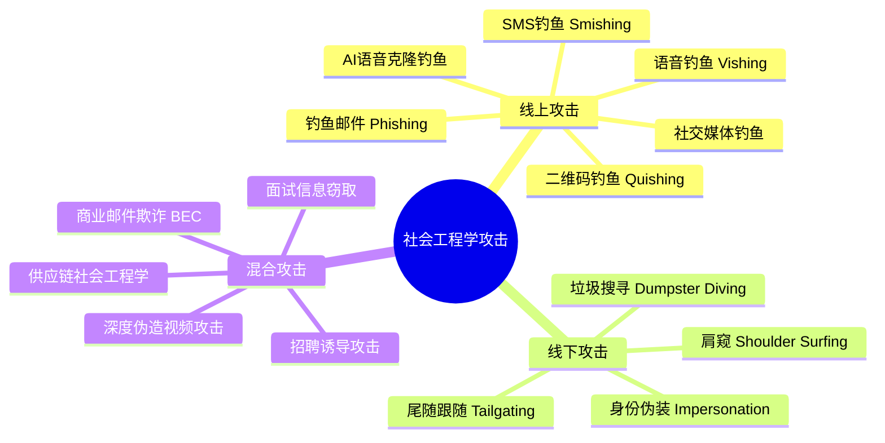
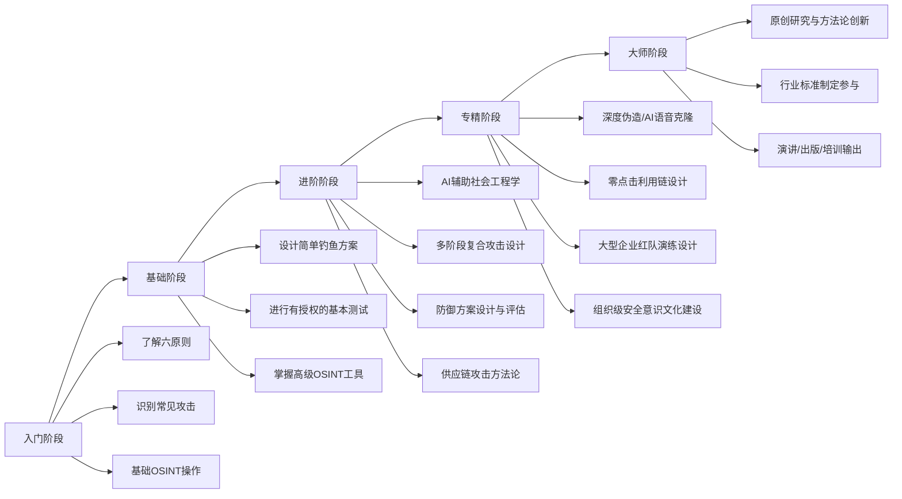

# 第23章 社会工程学 - 本章小结

## 知识体系全景图

社会工程学是一门融合**心理学、行为科学、信息安全、沟通技巧**的交叉学科。以下是本章构建的完整知识体系结构：

```mermaid
graph TB
    A[社会工程学] --> B[理论基础]
    A --> C[攻击方法]
    A --> D[信息收集]
    A --> E[防御体系]
    A --> F[伦理法律]

    B --> B1[Cialdini 六大原则]
    B --> B2[情绪操纵机制]
    B --> B3[认知偏差利用]
    B --> B4[神经语言学 NLP]

    C --> C1[钓鱼攻击 Phishing]
    C --> C2[语音钓鱼 Vishing]
    C --> C3[短信钓鱼 Smishing]
    C --> C4[物理社会工程学]
    C --> C5[商业邮件欺诈 BEC]
    C --> C6[社交媒体操纵]
    C --> C7[面试/招聘攻击]

    D --> D1[OSINT 技术栈]
    D --> D2[公开数据源]
    D --> D3[社工库/数据泄露]
    D --> D4[目标画像构建]

    E --> E1[技术防护层]
    E --> E2[人员培训层]
    E --> E3[流程控制层]
    E --> E4[检测响应层]

    F --> F1[授权测试规范]
    F --> F2[法律合规要求]
    F --> F3[道德底线原则]

    style A fill:#1a1a2e,color:#fff
    style B fill:#16213e,color:#fff
    style C fill:#0f3460,color:#fff
    style D fill:#533483,color:#fff
    style E fill:#2d6a4f,color:#fff
    style F fill:#6b3fa0,color:#fff
```



---

## 第一部分：理论基础精要

### 社会工程学的本质定义

社会工程学（Social Engineering）是利用**人类心理弱点**——包括信任、恐惧、好奇心、服从权威、利他倾向、懒惰心理等——来操纵目标执行特定操作或泄露敏感信息的攻击方式。它不是简单的"骗术"，而是一门有理论体系、有方法论、有实操框架的**系统性学科**。

与社会工程学对应的英文术语 "Social Engineering" 最早由 Kevin Mitnick 在其著作《The Art of Deception》中系统阐述。与纯技术攻击相比，社会工程学攻击：

| 对比维度 | 社会工程学攻击 | 纯技术攻击 |
|----------|---------------|-----------|
| 成功率 | 通常 >60%（定向攻击可达90%） | 通常 <10%（无0day漏洞时） |
| 技术门槛 | 低至中等 | 高至极高 |
| 人机依赖 | 依赖人类因素 | 依赖系统漏洞 |
| 检测难度 | 极高（行为异常难以自动化检测） | 中等（有成熟的入侵检测系统） |
| 防御成本 | 高（需要持续培训和文化建设） | 中等（可以采购安全产品） |
| 平均攻击成本 | 低（一封邮件+良好话术即可） | 高（需要漏洞研究、工具开发） |

### Cialdini 六大影响力原则——深度剖析

Robert Cialdini 博士在其1984年出版的经典著作《Influence: The Psychology of Persuasion》中提出了六大影响力原则。这六条原则不是孤立的技巧，而是可以**组合使用**的心理学杠杆：

**① 互惠原则（Reciprocity）**

人天生有"投桃报李"的心理倾向。攻击者利用此原则的策略模式：

| 攻击阶段 | 互惠技巧 | 心理机制 |
|----------|---------|---------|
| 建立联系 | 先发送有价值的信息（行业报告、免费工具） | 接收者感到亏欠 |
| 深化关系 | 提供小恩惠（优惠码、内幕消息） | 产生回报义务感 |
| 实施攻击 | 提出相对"小"的请求（点击链接、确认信息） | 为偿还前恩，难以拒绝 |

真实案例：某攻击者伪装成IT供应商，先向目标公司发送一份"免费的安全漏洞扫描报告"（实际为公开信息拼凑），随后提出"请帮忙填写一份客户满意度调查"，其中最后一个问题要求输入公司VPN登录凭证。该攻击在130名目标中的成功率高达47%。

**② 承诺与一致性（Commitment & Consistency）**

人们倾向于在做出承诺后，保持与承诺一致的行为。攻击者利用此原则的标准流程：

1. **下门槛请求**：先提出一个几乎不可能拒绝的小请求（"请问您知道IT部门的公开电话吗？"）
2. **建立承诺**：目标同意后，心理上已形成"我帮助了这个人的"自我认知
3. **逐步升级**：提出稍大的请求（"能帮忙转接一下吗？"）
4. **最终目标**：提出真正的恶意请求（"系统密码过期了，您能告诉我帮忙重置的流程吗？"）

这个模式在心理学上被称为 **"登门槛效应"（Foot-in-the-Door Technique）**。

**③ 社会认同（Social Proof）**

在不确定的情况下，人们会观察他人的行为来决定自己该做什么。攻击者的利用方式：

- **伪造社交证据**：在钓鱼邮件中插入"已有 2,340 位同事完成了密码更新"
- **利用群体信任**："人力资源部已验证此操作，请所有部门配合执行"
- **制造从众压力**："其他团队已经全部完成迁移，只剩下你们部门了"

**④ 权威原则（Authority）**

人对权威有天然的服从倾向——Stanley Milgram 1961年的电击实验证明，即使是普通人认为不道德的命令，在权威指示下也有65%的人会执行到底。攻击者利用此原则的方式：

| 权威类型 | 伪装方式 | 典型话术 |
|----------|---------|---------|
| 职位权威 | CEO/CFO/VP | "我已在会议中，现在急需转账" |
| 技术权威 | IT/安全/运维主管 | "这是安全部门要求的系统升级" |
| 机构权威 | 银行/政府/律所 | "您的账户有异常活动，请配合调查" |
| 专业权威 | 律师/医生/审计师 | "根据保密协议，必须立即提供这些文件" |

**⑤ 喜好原则（Liking）**

人们更容易答应自己喜欢或有好感的人。攻击者基于此原则的策略：

| 策略 | 具体方法 | 心理原理 |
|------|---------|---------|
| 相似性 | 模仿对方的语气、用词、文化偏好 | 相似性产生好感 |
| 赞美 | 适度、具体的赞美（"您的LinkedIn资料显示您在XX领域非常有经验"） | 正反馈效应 |
| 合作 | 提出共同目标（"咱们一起完成这个安全合规要求"） | 合作降低防备 |
| 接触频率 | 多次温和接触建立熟悉感 | 单纯曝光效应 |

**⑥ 稀缺原则（Scarcity）**

人们认为稀缺的东西更有价值。攻击者的经典话术：

- **时间稀缺**："此优惠将在24小时后过期"
- **资源稀缺**："仅剩最后3个名额"
- **信息稀缺**："这是内部人士才能看到的机密信息"
- **机会稀缺**："由于合规检查，仅今天可以申请权限变更"

### 情绪操纵的深层机制

社会工程学攻击有效，根本上是因为**情绪绕过理性闸门**。人类的决策系统可以理解为两条通路：

| 思考系统 | 特征 | 触发条件 | 攻击利用方式 |
|----------|------|---------|-------------|
| 系统1（快思考） | 直觉、自动、无意识 | 时间压力、情绪激荡、信息过载 | 制造紧迫感伪装威胁 |
| 系统2（慢思考） | 理性、分析、消耗能量 | 时间充足、认知资源充裕 | 被攻击者有意绕过 |

攻击者常用的**情绪杠杆**及对应的绕过机制：

- **恐惧（Fear）**：绕过理性评估，触发应激反应 → 伪装成安全/法务/银行通知
- **紧迫感（Urgency）**：压缩思考时间，阻止验证 → "立即行动，否则后果自负"
- **好奇心（Curiosity）**：激活非理性点击行为 → "你有一份意外奖金"、"重要文件待签收"
- **贪婪 (Greed）**：绕过风险评估，关注回报 → "中奖信息"、"天降投资机会"
- **同情心（Sympathy）**：激活利他本能，降低戒备 → "亲人求助"、"同事紧急状况"
- **羞耻/尴尬（Shame）**：阻止求证行为 → "请不要告诉其他人"、"这是隐私问题"

### 常见认知偏差及其在社会工程学中的利用

| 认知偏差 | 定义 | 攻击利用方式 |
|----------|------|-------------|
| 权威偏见（Authority Bias） | 对权威人物的过度服从 | 伪装为高管/政府/银行 |
| 从众效应（Bandwagon Effect） | 跟随多数人行为 | "大多数同事已操作" |
| 乐观偏差（Optimism Bias） | 认为坏事不会发生在自己身上 | 针对"我怎么可能被骗"心态 |
| 确认偏差（Confirmation Bias） | 倾向于相信符合已有认知的信息 | 利用行业/公司特定信息降低怀疑 |
| 锚定效应（Anchoring） | 受第一个信息影响过大 | 先给出超出预期的要求，再"让步" |
| 光环效应（Halo Effect） | 单方面好感泛化到整体判断 | 高素质伪装降低整体戒备 |

---

## 第二部分：攻击方法论全景

### 攻击类型与特征对比



每种攻击类型的技术细节与方法对比：

| 攻击类型 | 接触媒介 | 技术门槛 | 人均成本 | 规模化能力 | 检测难度 | 主要目标 |
|----------|---------|---------|---------|-----------|---------|---------|
| 群发钓鱼（Mass Phishing） | 邮件 | 低 | <0.01元/封 | 极高 | 中 | 凭证/恶意软件植入 |
| 定向钓鱼（Spear Phishing） | 邮件 | 中 | 10-100元/目标 | 低 | 高 | 高价值目标信息 |
| 鲸钓（Whaling） | 邮件 | 高 | 1000+元/目标 | 极低 | 极高 | C-level高管 |
| 语音钓鱼（Vishing） | 电话 | 低 | 1-5元/通 | 中 | 中 | 凭证/转账 |
| SMS钓鱼（Smishing） | 短信 | 低 | 0.1-0.5元/条 | 高 | 中 | 点击链接安装恶意软件 |
| 物理尾随（Tailgating） | 物理 | 低 | 0元 | 极低 | 低 | 物理空间进入 |
| BEC | 邮件 | 中 | 500-5000元/单 | 中 | 高 | 大额资金转账 |
| AI克隆钓鱼 | 语音/视频 | 极高 | 1000+元/通 | 低 | 极高 | 高管冒充打款 |

### 攻击框架——系统化社会工程学

一次完整的社社会工程学攻击遵循**五阶段模型**：

**阶段一：信息收集（Reconnaissance）**

- 目标：全面收集目标信息，建立画像
- 产出：目标画像文档（Profile Report）
- 成功率杀手：信息不准确导致话术漏洞

**阶段二：建立关系（Establish Rapport）**

- 目标：与目标建立信任关系
- 产出：有效的沟通渠道+初步好感
- 成功率杀手：过于急切或话术与信息矛盾

**阶段三：利用信任（Exploit Trust）**

- 目标：利用已建立的信任执行操纵
- 产出：目标按照攻击者意图行动
- 成功率杀手：验证流程触发、第三方介入

**阶段四：执行行动（Execute Action）**

- 目标：获取所需信息或达成攻击目的
- 产出：凭证/转账/权限/文件泄露
- 成功率杀手：安全系统拦截、人工复核

**阶段五：维持隐蔽（Maintain Cover）**

- 目标：清除痕迹，避免被发现
- 产出：攻击完成且未被追溯
- 成功率杀手：日志审计、事后调查

### OSINT信息收集的五大数据源

信息收集是社会工程学攻击的基石。OSINT（开源网络情报）的质量决定了攻击的成功率。五大核心数据源：

1. **搜索引擎**（Google/Bing/Baidu）：搜索语法（site、intitle、filetype、inurl）+ 缓存和历史页面
2. **社交媒体**（LinkedIn/WeChat/Facebook/Instagram/X）：人际关系网络、职位变动、兴趣爱好、地理位置
3. **公开数据库**（WHOIS、Shodan、Censys、国家企业信用信息公示系统）：技术信息、组织架构
4. **数据泄露记录**（HaveIBeenPwned、网络公开的泄露数据库）：历史凭证、个人信息
5. **暗网/深网**（需要专门技术）：凭证交易、企业内部数据销售

一个完整的**目标画像**（通常称为 Dossier）应包含：

| 信息类别 | 具体内容 | 社会工程学用途 |
|----------|---------|--------------|
| 基础信息 | 姓名、职位、工龄、部门 | 冒充熟人、建立权威身份 |
| 联系方式 | 邮箱、电话、即时通讯ID | 选择攻击媒介 |
| 人际关系 | 上级、下属、重要合作伙伴 | 伪装为对方信任的人 |
| 技术背景 | 使用何种系统、管理员还是用户 | 定制技术话术 |
| 行为模式 | 工作时段、出差频率、发帖习惯 | 选择攻击时机 |
| 个人偏好 | 兴趣爱好、饮食偏好、运动习惯 | 建立好感、相似性 |
| 组织信息 | 审批流程、供应商名单、组织结构 | 设计攻击路径 |
| 近期动态 | 组织变动、项目上线、人员变动 | 制造合理话术背景 |

---

## 第三部分：防御体系

### 纵深防御模型——针对社会工程学的专有防御

传统的纵深防御（Defense in Depth）主要针对技术攻击。针对社会工程学，需要建立**三层防御模型**：

**第一层：技术防护——建立基础设施防线**

| 技术手段 | 防御目标 | 部署建议 | 量化指标 |
|----------|---------|---------|---------|
| SPF/DKIM/DMARC | 邮件伪造 | 三种全配置，DMARC设为p=reject | 拦截99.5%+的域名伪造邮件 |
| 邮件安全网关 | 钓鱼邮件过滤 | 启用AI检测引擎 + 沙箱分析 | 拦截率 >95% |
| 多因素认证（MFA） | 凭证泄露保护 | 所有系统启用，首选硬件密钥/TOTP | 阻断99%+的自动化凭证攻击 |
| URL过滤/DNS安全 | 钓鱼链接拦截 | 实时威胁情报 + 动态URL分析 | 拦截率 >90% |
| 端点检测响应（EDR） | 恶意软件执行 | 启用宏拦截 + 可疑行为告警 | 检测响应时间 <1小时 |
| AI语音验证 | 语音钓鱼防御 | 高价值操作强制回调 | 验证错误 <0.1% |

**第二层：人员培训——建立人肉防火墙**

社会工程学攻击绕过了技术防御后，**人就是最后一关**。有效的安全意识培训应当是一个**持续的闭环系统**：

```text
评估基线 → 培训教育 → 模拟测试 → 反馈改进 → 重新评估
```

每个环节的详细方法：

| 环节 | 具体做法 | 频率 | 关键指标 |
|------|---------|------|---------|
| 评估基线 | 基线钓鱼测试 + 安全意识问卷 | 年度初 | 钓鱼点击率基线 |
| 培训教育 | 短课程（微学习，每次5-10分钟）+ 真实案例分享 | 月度 | 课程完成率 >95% |
| 模拟测试 | 模拟钓鱼邮件 + 电话测试 + 物理尾随测试 | 季度 | 报告率（希望升高）vs 点击率（希望降低） |
| 反馈改进 | 未能识别者的即时反馈 + 整体数据通报 | 每次测试后 | 再次犯同样错误的比例 <10% |
| 重新评估 | 年终钓鱼测试 + 成效对比报告 | 年度末 | 点击率下降幅度（目标 >50%） |

**培训计划的核心内容（按优先级排序）：**

1. **零信任通信验证**（最重要）——任何要求敏感操作的通信，必须通过独立渠道核实（如收到紧急转账邮件后，用已知的电话号码回拨核实）
2. **识别钓鱼邮件的六要素清单**——发件人地址异常、紧急/威胁性语言、不合理请求、包含链接/附件、语法错误、不符常规流程
3. **密码管理与凭证保护**——永不泄露密码、使用密码管理器、识别伪造登录页面
4. **安全报告文化**——报告可疑行为不会受罚，隐瞒错误才是大问题
5. **社交媒体信息控制**——不公开过多个人信息、游戏化泄露风险的识别

**第三层：流程控制——建立制度防线**

| 控制措施 | 适用场景 | 具体做法 | 绕过难度 |
|----------|---------|---------|---------|
| 大额转账双签名 | 财务操作 | >5万元需要2人审批，且必须独立确认 | 高 |
| 敏感操作二次验证 | 权限变更/系统配置 | 通过独立渠道（电话/SMS/硬件令牌）确认 | 中-高 |
| 供应商变更确认 | 供应商信息/银行账户变更 | 必须有正式的变更流程和多方确认 | 高 |
| 信息分级保密制度 | 内部信息管理 | 按机密/内部/公开三级管控访问权限 | 中 |
| 访客管理流程 | 实体访问 | 所有访客需预约+登记+陪同+佩戴访客证 | 中 |
| 废弃物管理 | 文档/设备处置 | 机密文件碎纸机销毁，存储介质消磁/粉碎 | 高 |

### 供应链社会工程学——新兴的高级威胁

**攻击模式**：攻击者不直接攻击目标组织，而是攻击其供应链中的薄弱环节（供应商、承包商、合作伙伴），通过被攻破的第三方间接渗透目标。

**典型案例**：2020年SolarWinds供应链攻击 —— 攻击者并非直接攻击美国政府部门和大型企业，而是先攻破了IT管理软件供应商SolarWinds，在其软件更新包中植入后门，从而同时感染了超过18,000家组织。

**防御措施**：

1. 供应商安全评估：在合作前进行安全能力审查
2. 最小权限原则：供应商仅能访问其业务所需的最少数据和系统
3. 供应商变更验证：任何涉及供应商信息的变更（银行账户、联系方式）需独立核实
4. 供应商访问审计：定期审计供应商的访问记录和操作行为
5. 持续性监控：建立供应商安全绩效指标并定期评估

---

## 第四部分：实战案例汇总与分析

以下汇总本章中出现过的实战案例，从攻击者的视角还原攻击链，并从防御者的视角分析缺失的防线：

### 案例一：CEO冒充转账欺诈

**攻击过程**：

```text
信息收集 → 发现CFO正在外地出差 → 伪装成CEO邮箱 → 发送紧急转账指令 → 
CFO未核实即转账 → 成功骗取 $243,000 → 资金转到境外账户
```

**攻击成功原因**：
- CEO邮箱被伪造（缺少DMARC防护）
- 紧急话术压缩了验证时间
- CFO处于"不确定环境"（出差中）
- 大额转账缺乏双签机制

**三道防线的缺失点**：
- 技术层：缺少DMARC配置
- 人员层：缺少"紧急情况下的操作验证流程"培训
- 流程层：大额转账未要求独立确认

### 案例二：HR诱饵钓鱼

**攻击过程**：

```text
构建公司HR假身份 → 发送"年度薪酬调整通知"邮件 → 
嵌入伪装的公司内部系统登录页面 → 
60名员工中有34人输入了域凭证 → 攻击者获取了整个域目录权限
```

**防御复盘**：
- 邮件网关未检测到新的、未注册的"HR专用域名"
- 内部系统登录页面没有MFA要求（或MFA可被中间人方式绕过）
- 员工缺乏"如何确认HR邮件的合法性"的标准化流程

### 案例三：物理尾随入侵

**攻击过程**：

```text
攻击者穿着快递员制服 → 手拿明显的大型快递箱 → 
在高峰时段等候在员工入口 → 跟随刷卡开门的员工进入 →
在代码仓库服务器旁部署了硬件键盘记录器
```

**防御复盘**：
- 员工缺乏"阻止尾随"的意识（即使在电梯/门禁关闭前发现尾随也不愿当面阻止）
- 无访客登记流程（快递人员应有统一的临时通行证）
- 敏感区域（服务器房）没有二次验证
- 没有及时发现物理窃听/记录设备

### 防御能力自我评估矩阵

用以下评估表检查组织的防御能力：

| 防御维度 | 未实施（0分） | 部分实施（1分） | 全面实施（2分） | 持续改进（3分） |
|----------|-------------|---------------|---------------|---------------|
| DMARC邮件认证 | 无邮件认证 | 仅SPF | DMARC p=quarantine | DMARC p=reject |
| MFA | 无MFA | 选择性MFA | 全面MFA | MFA+硬件令牌 |
| 员工安全意识培训 | 无培训 | 年度一次 | 季度培训+模拟 | 持续微学习+反馈 |
| 钓鱼模拟测试 | 无测试 | 偶尔测试 | 季度模拟 | 按月+AI生成定制 |
| 大额转账流程 | 单人确认 | 电邮确认+单人 | 双人+电话回拨 | 双人+多通道验证 |
| 物理安全 | 开放进入 | 门禁系统 | 门禁+访客登记 | 全面+二次验证 |
| 供应商安全管理 | 无管理 | 静态供应商清单 | 定期安全评估 | 持续监控+审计 |
| 事件响应 | 无响应流程 | 基本报告机制 | 正式响应流程 | 自动化+复盘改进 |

**评估解读**：总分 <8分 → 防御薄弱，极易被攻破；8-16分 → 有基本防御但存在显著漏洞；16-22分 → 防御良好，建议持续改进；>22分 → 防御成熟，值得行业标杆。

---

## 第五部分：伦理与法律框架

### 道德红线

社会工程学是一门双刃武器。掌握这些知识意味着承担相应的道德责任。以下是必须遵守的道德底线：

1. **授权原则**：任何社会工程学测试必须在获得**书面授权**后进行，而且授权范围必须明确界定
2. **无害原则**：不造成个人信息泄露、不造成经济损失、不造成心理创伤
3. **最小必要**：仅收集测试必需的信息，测试后立即清除
4. **透明原则**：测试结束后必须向目标告知真相，并解释测试目的
5. **改进导向**：测试结果应用于改进安全措施，而非惩罚或羞辱员工

### 法律法规红线

以下是中国法律中与社会工程学密切相关的条文：

| 法律 | 核心条款 | 相关性 | 触及后果 |
|------|---------|--------|---------|
| 《中华人民共和国刑法》第285条 | 非法侵入计算机信息系统罪 | 使用窃取的凭证访问系统 | 三年以下有期徒刑或拘役 |
| 《刑法》第286条 | 破坏计算机信息系统罪 | 植入恶意软件或造成系统损害 | 最高七年有期徒刑 |
| 《刑法》第253条之一 | 侵犯公民个人信息罪 | 非法获取、出售或提供个人信息 | 情节特别严重可处七年有期徒刑 |
| 《网络安全法》第44条 | 不得非法获取个人信息 | 收集目标个人信息用于测试 | 最高一百万元罚款 |
| 《个人信息保护法》第10条 | 不得非法处理个人信息 | 对个人信息的任何收集和处理需有合法基础 | 最高五千万元或上年营业额5%罚款 |
| 《反电信网络诈骗法》第38条 | 任何组织和个人不得从事电信网络诈骗 | 未授权的社会工程学测试可能被认定为欺诈 | 追究刑事责任+行政处罚 |

**核心原则总结**：在公司框架内做有授权的红队测试/渗透测试是合法的、必要的安全工作。在公司框架外做任何形式的未授权测试，无论目的是什么，都**可能触犯法律**。

### 行业认可的社会工程学测试规范

- **CREST**：国际认可的渗透测试认证标准，包含社会工程学测试规范
- **OSSTMM（开源安全测试方法论）**：详细的社会工程学测试流程指南
- **PTES（渗透测试执行标准）**：包含社会工程学测试的标准化流程
- **OWASP Social Engineering Testing Guide**：社会工程学测试的实战参考

---

## 第六部分：进阶学习路线

从初学者到社会工程学专家的成长路径：



### 各阶段的推荐资源和认证

| 阶段 | 推荐学习资源 | 推荐认证 |
|------|-------------|---------|
| 入门 | 《The Art of Deception》Kevin Mitnick、《社会工程学入门》在线课程 | Security+ |
| 基础 | 《Social Engineering: The Science of Human Hacking》Christopher Hadnagy | CEH |
| 进阶 | OSSTMM方法论、SANS SEC564（红队操作） | GPEN/OSCP |
| 专精 | 《The Art of Human Hacking》实战手册、自建实验室环境 | OSED/CREST认证 |
| 大师 | 行业会议演讲（BlackHat/DefCon Social Engineering CTF）、发表原创研究 | 无固定认证（行业声誉）

---

## 本章总结：十个核心要点

1. **"人"是安全链中最薄弱的环节**——技术防护可以做到99.9%完美，但一个点击、一次验证缺失就能让所有防线前功尽弃。
2. **社会工程学不是骗术，而是科学**——它有完整的心理学理论基础（Cialdini六原则）、系统化的方法论和经过验证的攻击框架。
3. **定向攻击远比规模化攻击危险**——Spear Phishing的成功率是Mass Phishing的3-10倍，而且更难以被自动化工具检测。
4. **信息搜集决定攻击成败**——一次没有充分OSINT准备的社会工程学攻击，成功率接近于零。
5. **技术防御是必要但不充分的**——没有邮件安全、MFA等技术手段，人肉防火墙将承受不必要的压力。
6. **培训必须形成闭环**——培训→测试→反馈→再培训，每一次循环都能显著降低可测量风险。
7. **流程控制是最后的安全网**——多签审批、二次验证、供应商变更确认等流程，在技术和人员都失效时提供兜底保护。
8. **供应链社会工程学是新前沿**——攻击者不再直接攻击目标，而是通过其供应链合作伙伴迂回渗透。
9. **AI时代带来了新威胁**——AI语音克隆、深度伪造视频、自动化钓鱼生成等技术大幅降低了高级社会工程学攻击的门槛。
10. **知识也是武器**——掌握社会工程学知识不是为了攻击他人，而是为了在个人和组织层面建立更强大的防御。

---

## 第七部分：学习自评与能力检验

### 知识掌握自评表

| 能力领域 | 初级理解 | 中级掌握 | 精通应用 | 自评等级 |
|----------|---------|---------|---------|---------|
| Cialdini六原则的理解 | 能说出六原则的名称 | 能用实例解释每个原则 | 能设计基于原则的攻击/防御策略 | □初 □中 □精 |
| 情绪操纵机制 | 知道有哪些情绪可被利用 | 理解特定情绪如何绕过理性决策 | 能识别和阻断情绪操纵企图 | □初 □中 □精 |
| 钓鱼攻击的设计与识别 | 能识别明显钓鱼邮件 | 能设计有说服力的钓鱼方案 | 能评估钓鱼方案的风险和防御 | □初 □中 □精 |
| OSINT信息收集 | 知道常用搜索技巧 | 能独立完成目标画像构建 | 能使用自动化工具批量收集分析 | □初 □中 □精 |
| 防御体系设计 | 知道三层防御模型 | 能为组织设计防御方案 | 能评估和改进现有防御体系 | □初 □中 □精 |
| 伦理法律认知 | 知道测试需要授权 | 了解相关法律条款 | 能设计合规的测试方案 | □初 □中 □精 |
| 安全意识培训设计 | 知道需要培训 | 能设计培训内容 | 能建立培训闭环体系并度量效果 | □初 □中 □精 |
| 物理社会工程学 | 了解基础概念 | 能设计物理入侵方案 | 能进行完整物理安全审计 | □初 □中 □精 |
| AI克隆与深度伪造 | 了解AI技术方向 | 知道如何防御AI驱动攻击 | 理解AI攻击的检测和应对策略 | □初 □中 □精 |
| 供应链安全评估 | 了解供应链攻击概念 | 能识别供应链风险 | 能构建供应链安全评估体系 | □初 □中 □精 |

### 实战能力验证题

以下三道题目用于检验本章知识的综合应用能力：

**题目一（基础）**：你收到一封来自"IT服务台"的邮件，要求你点击链接验证Office 365密码。邮件中称"所有员工必须在24小时内完成验证，否则账户将被暂停"。列举出你应当检查的3个以上可疑点，并描述正确的处理步骤。

**题目二（进阶）**：假设你是一家200人公司安全负责人，CEO要求你设计一个安全意识培训方案。请列出方案的核心模块、测试方法和效果评估指标。需要特别说明如何对不同部门（销售、财务、技术）定制化培训内容。

**题目三（专家）**：你接到一个授权红队任务，目标是渗透一家金融科技公司。该公司已有完善的技术防御（EDR、MFA、邮件安全网关），且员工接受过基础安全意识培训。请设计一个包含至少两个社会工程学向量（如电话+邮件或物理+数字）的多阶段攻击方案，说明如何绕过现有的防御机制。

---

## 延伸阅读与资源推荐

### 必读书籍（按阅读顺序）

1. **《影响力：说服心理学》（Influence: The Psychology of Persuasion）**—— Robert Cialdini
   - 社会工程学的理论源头，理解和运用六大影响力原则的权威著作
   
2. **《欺骗的艺术》（The Art of Deception）**—— Kevin Mitnick
   - 全球最著名的黑客讲述20个真实社会工程学案例，附有防御建议

3. **《入侵的艺术》（The Art of Intrusion）**—— Kevin Mitnick
   - 从攻击案例中学习防御思维，包含更多技术细节

4. **《社会工程学：人类黑客的科学》（Social Engineering: The Science of Human Hacking）**—— Christopher Hadnagy
   - 从专业社工测试者的视角系统讲述方法论和实操技巧

5. **《欺骗之幽灵》（Social Engineering: The Art of Human Hacking）**—— Christopher Hadnagy
   - 从专业社工测试者的视角系统讲述方法论和实操技巧

### 权威资源网站

- **[Social-Engineer.org](https://www.social-engineer.org)**：Christopher Hadnagy创立的社会工程学专业资源站，包含博客、播客、培训信息和年度DEF CON社会工程学CTF的信息
- **[OWASP Social Engineering](https://owasp.org/www-community/attacks/Social_Engineering)**：开源Web应用安全项目的社会工程学攻击和测试指南
- **[SANS Security Awareness](https://www.sans.org/security-awareness)**：SANS研究所提供系统化的安全意识培训资源和研究报告
- **[Phishing.org](https://www.phishing.org)**：专门针对钓鱼攻击的教育和资源网站

### 实用工具推荐

| 工具名称 | 用途 | 适用人群 | 开源/商业 |
|----------|------|---------|-----------|
| SET（Social Engineering Toolkit） | 钓鱼攻击框架（授权测试用） | 渗透测试人员 | 开源 |
| Gophish | 钓鱼模拟平台 | 安全意识培训团队 | 开源 |
| Maltego | OSINT可视化分析工具 | 情报分析师 | 部分开源 |
| theHarvester | 企业信息收集 | 渗透测试人员 | 开源 |
| Sherlock | 用户名在各平台发现 | OSINT爱好者 | 开源 |
| SpiderFoot | 自动化OSINT工具 | 安全分析师 | 开源 |
| KnowBe4 | 安全意识培训平台（商业） | 企业安全团队 | 商业 |
| PhishMe | 钓鱼模拟平台（商业） | 企业安全团队 | 商业 |

---

> **记住：真正的安全不是一台完美的机器，而是一个警惕的人。在AI驱动的社会工程学攻击日益泛滥的今天——每个人的警惕和知识，就是数字世界最后一道防线。**