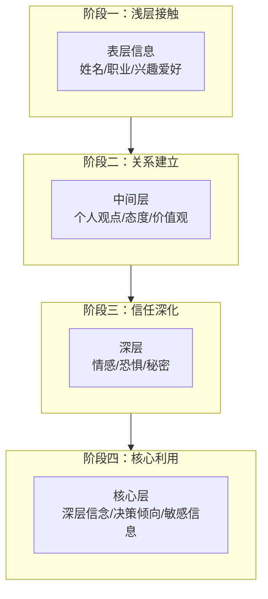
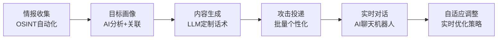
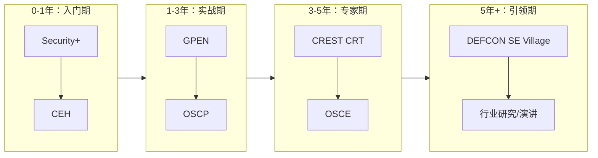

# 第23章 社会工程学 - 深度拓展

本章是全章的进阶阅读，面向已完成理论基础、核心技巧和实战案例学习的读者。在前述内容中，我们系统构建了社会工程学的"是什么"和"怎么做"，本章则聚焦于三个维度的深度拓展：**跨学科理论深化**、**AI时代威胁范式演进**、以及**从学习者到专家的实战成长路径**。每一部分都力求超越表面介绍，提供可迁移的知识框架和可执行的行动方案。

---

## 一、跨学科理论深化

社会工程学的根基在心理学，但其理论视野远不止于此。进化心理学解释了**为什么人类天生容易被操纵**，博弈论提供了**攻防双方理性决策的数学框架**，社会渗透理论则刻画了**信任关系被逐步利用的微观机制**。理解这三个学科的深层原理，是将社会工程学从"技巧"提升到"科学"的关键。

### 1.1 进化心理学视角：为什么人类天生脆弱

人类大脑在数百万年的进化中形成了一套快速决策的"心理捷径"（Heuristics），这些捷径在原始社会中是生存优势，但在数字化时代却成为攻击者的杠杆。

**为什么权威服从是"硬编码"的？**

在灵长类社会中，服从群体中的权威个体（首领、长老）能提高个体的生存概率。进化心理学家认为，人类的**服从倾向**不是后天习得的行为，而是先天的神经系统响应。这就是为什么Milgram电击实验中65%的参与者会服从权威指令到底——他们不是"愚蠢"，而是大脑的进化机制在自动响应。

**攻击者的进化利用：**

| 进化本能 | 原始功能 | 社会工程学利用方式 | 现代防御思路 |
|----------|---------|-------------------|-------------|
| 服从权威 | 服从首领提高生存率 | 冒充CEO/IT主管/政府官员 | 建立多层验证而非单点信任 |
| 从众心理 | 跟随多数人避免孤立 | "其他同事都已操作" | 培养独立判断，鼓励质疑文化 |
| 损失厌恶 | 保护已有的食物/领地 | "您的账户将被冻结" | 对任何"紧急通知"强制暂停反应 |
| 互惠本能 | 建立合作关系 | 先施恩后索回报 | 对"免费馈赠"建立意识警觉 |
| 好奇心 | 探索新环境获取资源 | 神秘链接、悬念信息 | 教育用户识别"信息诱饵" |
| 部落认同 | 辨别敌友保护群体 | 冒充"内部人"、使用内部术语 | 验证任何"内部请求"的合法性 |

**深层洞见**：社会工程学攻击之所以难以根除，是因为它利用的不是软件漏洞，而是**数百万年进化写入神经系统的行为模式**。安全意识培训的本质，是训练用户在关键决策点**激活前额叶皮层的理性控制**，覆盖杏仁核的自动化情绪反应。这比"打补丁"困难得多——因为它需要持续的练习和强化。

### 1.2 博弈论框架：攻防双方的理性博弈

博弈论（Game Theory）为理解社会工程学攻防提供了精确的数学视角。在经典博弈论中，攻防双方都在追求自身的最优策略，而**信息不对称**是决定胜负的关键变量。

**社会工程学攻防的博弈矩阵：**

```text
攻击者策略          防御者策略            结果
─────────────      ─────────────      ────────────
定向钓鱼           无安全培训           高成功率 (>60%)
定向钓鱼           有安全培训           中成功率 (20-40%)
定向钓鱼           训练有素+流程控制    低成功率 (<5%)
规模化钓鱼         无安全培训           中成功率 (10-20%)
规模化钓鱼         邮件安全网关         极低成功率 (<2%)
```

**贝叶斯推理在攻击中的应用：**

高明的社会工程师在选择攻击策略时，实际上在进行贝叶斯推理：

```text
P(成功|信息量I) = P(I|成功) × P(成功) / P(I)
```

通俗理解：攻击者每收集到一条目标信息，就会更新对攻击成功率的**后验估计**。当收集到足够的信息（如目标的生日、宠物名、常用密码风格），定向攻击的先验成功率会大幅提升。

**纳什均衡的启示：**

在社会工程学攻防中存在一个"均衡点"——当攻击成本等于防御成本时，双方都不愿单方面改变策略。这个均衡点会随着AI工具的普及而移动：AI大幅降低了攻击成本（自动化生成钓鱼邮件、语音克隆），因此**防御方也需要AI工具**才能维持均衡。

### 1.3 社会渗透理论：信任关系的微观解剖

Altman和Taylor在1973年提出的社会渗透理论（Social Penetration Theory, SPT）描述了人际关系如何从表层逐步深入到核心。这个理论精确刻画了社会工程师的"信任投资"策略。

**洋葱模型（Onion Model）的四层结构：**



**攻击者在每一层的典型操作：**

| 渗透阶段 | 信息类型 | 建立手段 | 收集到的信息 | 攻击价值 |
|----------|---------|---------|-------------|---------|
| 第一层：浅层 | 公开信息 | 公开场合搭讪、LinkedIn浏览 | 职位、部门、教育背景 | 低——可从OSINT获取 |
| 第二层：中间 | 个人观点 | 共同话题交流、咖啡间闲聊 | 对公司政策的态度、工作偏好 | 中——可定制话术 |
| 第三层：深层 | 情感信息 | 多次接触、互惠关系建立 | 工作焦虑、家庭状况、个人烦恼 | 高——可用于情绪操纵 |
| 第四层：核心 | 敏感信息 | 深度信任后的一次性利用 | 系统密码、审批习惯、财务凭证 | 极高——直接利用 |

**防御SPT攻击的关键洞察：**

SPT的核心机制是**互惠性自我披露**（Reciprocal Self-Disclosure）——当一个人分享个人信息时，对方会感到有义务回报。攻击者利用这一点，先主动分享"无关紧要的个人信息"来诱导目标的自我披露。

防御策略不是"禁止所有社交"，而是建立**信息分级意识**：告诉员工哪些信息（表层：职业、部门）可以自由交流，哪些信息（深层：系统架构、审批流程、密码习惯）需要通过正式渠道确认。

---

## 二、认知操纵技术深度剖析

### 2.1 高级说服技术：超越Cialdini六原则

在Cialdini的六大原则之外，社会心理学还揭示了一系列被攻击者广泛使用的高级说服技术。理解这些技术的具体机制，是建立有效防御的前提。

**① 登门槛效应（Foot-in-the-Door）**

**原理**：如果目标同意了一个小请求，后续同意更大请求的概率显著提高。

**社会工程学应用**：
1. 攻击者先发送"公司团建活动问卷"（无害请求）
2. 目标填写后，攻击者跟进"问卷系统需要您用公司邮箱登录一次"
3. 目标登录时被重定向到钓鱼页面，凭证被窃取

**实验数据**：Freedman和Fraser（1966）的经典实验显示，先同意在窗户上贴小标志的居民，后来同意在院子里立大广告牌的比例是对照组的**4.5倍**。

**防御关键**：教育员工认识到，**对任何请求说"是"都值得暂停反思**——哪怕请求本身看起来无害。

**② 门面技术（Door-in-the-Face）**

**原理**：先提出一个过大的请求（必然被拒绝），再提出实际目标请求，后者被接受的概率显著提高。

**社会工程学应用**：
1. 攻击者冒充客户，先要求"立刻处理全年退款"（过大的请求）
2. 客服拒绝后，攻击者"让步"："那至少帮我查一下账户余额吧"
3. 客服因"对方已让步"的心理压力，倾向于满足这个"较小"的请求

**防御关键**：建立**标准化的服务流程**，任何请求无论大小都按流程执行，不受"让步"心理影响。

**③ 低球技术（Low-Ball Technique）**

**原理**：先用一个诱人的条件让目标做出承诺，然后在目标无法轻易反悔时改变条件。

**社会工程学应用**：
1. 攻击者发送"内部员工优惠：免费领取最新Office许可证"
2. 目标下载并安装后，"软件"提示需要"公司VPN凭证"才能激活
3. 目标因已投入时间（沉没成本）而倾向于提供凭证

**防御关键**：**承诺前验证**——任何需要提供凭证的操作，都必须通过公司官方渠道验证其合法性，无论前期投入了多少时间。

### 2.2 非语言欺骗检测：微表情与行为基线

**Paul Ekman的微表情研究**揭示了人类在说谎时会泄露短暂（1/25至1/5秒）的真实情绪信号。虽然社会工程师通常是优秀的说谎者，但非语言线索仍然可以提供判断依据。

**识别欺骗行为的五个维度：**

| 维度 | 正常基线 | 可疑变化 | 注意事项 |
|------|---------|---------|---------|
| 眼神接触 | 稳定的自然对视 | 过度回避或刻意保持 | 文化差异显著——东亚文化中回避眼神可能是礼貌 |
| 微表情 | 与言语内容一致 | 情绪表达与语言内容矛盾（如笑着说坏消息） | 需要训练才能可靠识别 |
| 身体姿态 | 开放、放松 | 交叉双臂、身体后倾 | 可能只是紧张，需结合其他线索 |
| 语速/语调 | 自然流畅 | 突然加速（紧张）或刻意放慢（预演过的台词） | 建立基线后才有效 |
| 信息一致性 | 时间线、细节连贯 | 细节前后矛盾、过于完美 | 最可靠的判断依据 |

**防御应用**：在安全意识培训中，教授员工识别"过度完美"的对话——当一个自称"新同事"的人对所有问题都对答如流、没有任何自然的停顿和犹豫时，这本身就是一个异常信号。真正的新人通常会说"我不太确定，让我查一下"。

### 2.3 信息框架效应：攻击者如何控制你的认知

**框架效应（Framing Effect）**描述的是：同一事实的不同表述方式会显著影响人们的决策。攻击者精于此道，通过精心设计信息框架来操控目标的心理状态。

**防御者的框架意识训练：**

| 攻击框架 | 心理效应 | 同一事实的理性框架 |
|----------|---------|-------------------|
| "您的账户将在24小时内被永久冻结" | 恐惧+紧迫 | "我需要通过官方渠道确认账户状态" |
| "这是最后一次机会" | 损失厌恶 | "真正的机会不会只通过一封邮件通知" |
| "只有您能处理这个紧急请求" | 个人责任压力 | "紧急事务应该启动正式审批流程" |
| "其他部门都已确认" | 从众压力 | "让我直接联系其他部门确认" |
| "董事长要求保密处理" | 权威+羞耻 | "保密事务更应该通过安全渠道处理" |

**实操建议**：在安全意识培训中，让员工**练习"重构框架"**——收到任何要求敏感操作的邮件时，首先识别其框架策略，然后用自己的理性框架重新解读信息。这个练习比简单的"不点击链接"更有深度，因为它训练的是**认知灵活性**而非行为记忆。

---

## 三、AI时代的社会工程学：新威胁范式

### 3.1 大语言模型（LLM）作为攻击工具

大语言模型的出现是社会工程学攻防的一个分水岭。它不仅降低了攻击门槛，还改变了攻击的规模和质量特征。

**LLM赋能的攻击链：**



**LLM攻击的五个关键特征：**

| 特征 | 传统社会工程学 | LLM增强的社会工程学 |
|------|--------------|-------------------|
| 内容质量 | 依赖攻击者语言能力，易识别语法错误 | 母语级别，零语法错误，风格可定制 |
| 规模化能力 | 手工编写，定向但低产量 | 批量生成高度个性化内容，每个目标不同 |
| 语言能力 | 通常单语 | 多语种无缝切换 |
| 持续性 | 攻击邮件是一次性的 | 可维持长期多轮对话 |
| 检测难度 | 模板重复，易被签名检测 | 每封邮件独特，传统签名检测失效 |

**防御LLM增强攻击的新策略：**

1. **基于行为分析的检测**：传统基于"关键词+模板匹配"的邮件安全网关对LLM生成内容基本失效。需要转向**行为分析**——检测发件人行为模式异常（首次联系、发送时间异常、请求内容与组织流程不符）。
2. **验证渠道多模态化**：单一渠道（邮件）验证不足以对抗AI生成内容。重要操作必须通过**两个独立渠道**（如邮件+电话、即时消息+面对面确认）。
3. **AI辅助防御**：用AI检测AI——部署专门训练的模型分析邮件的统计特征（如用词分布、句法复杂度、情感标记），识别LLM生成内容的独特"指纹"。

### 3.2 多模态攻击：文本+语音+视频的组合打击

现代AI技术使攻击者能够在**多个模态**（文本、语音、视频）上同时欺骗目标，形成"全包围"攻击。

**典型的多模态攻击流程：**

| 阶段 | 模态 | 攻击内容 | AI技术支撑 |
|------|------|---------|-----------|
| 预文本 | 文本 | 通过钓鱼邮件建立"供应商"联系 | LLM生成商务邮件 |
| 深化 | 语音 | "供应商"来电确认订单细节 | 语音克隆（TTS API） |
| 突破 | 视频 | 视频会议中出现"财务总监"批准付款 | Deepfake实时换脸 |
| 闭环 | 文本 | 发送带有"官方确认"的邮件附件 | LLM生成+品牌仿冒 |

**深度伪造检测的实用方法：**

- **音频层面**：注意异常的呼吸节奏、缺乏自然停顿、背景音不连贯、情感与内容不匹配
- **视频层面**：观察面部边缘闪烁、眨眼频率异常（深度伪造通常眨眼过少）、光照和阴影不一致、说话时嘴唇动作与音频不完全同步
- **行为层面**：对任何"异常渠道"的紧急请求保持怀疑——如果一个高管从未用视频会议通知你做转账，现在突然这样做，这就是异常

### 3.3 MFA疲劳攻击：绕过多因素认证

MFA疲劳攻击（也称MFA轰炸攻击）是2022年以来快速蔓延的攻击手法，其核心逻辑是**利用人类的"告警疲劳"心理**。

**攻击机制：**
1. 攻击者通过钓鱼或凭证数据库泄露获得了目标的用户名和密码
2. 攻击者反复触发MFA推送通知
3. 目标收到几十甚至上百个MFA请求
4. 目标为了停止通知骚扰，最终点击"批准"
5. 攻击者成功通过MFA验证

**真实案例**：2022年9月，Uber遭受MFA疲劳攻击。攻击者获取了外包人员的VPN凭证后，反复触发MFA推送，该员工最终批准了请求。攻击者随即获取了Uber内部网络的访问权限。

**防御方案：**

| 防御层级 | 具体措施 | 效果 |
|----------|---------|------|
| 技术层 | 启用MFA速率限制（同一账号3次失败后锁定30分钟） | 直接阻断轰炸 |
| 技术层 | 部署FIDO2/WebAuthn硬件密钥（如YubiKey） | 物理交互要求阻断远程攻击 |
| 技术层 | MFA请求中包含地理位置和设备信息 | 帮助用户判断请求是否合法 |
| 行为层 | 培训员工：MFA请求被轰炸时**绝不批准**，立即上报 | 关键的行为防线 |
| 流程层 | 异常MFA活动自动触发SOC响应 | 快速响应减少攻击窗口 |

---

## 四、企业红队社会工程学：实战方法论

### 4.1 完整的红队SE评估流程

对于渗透测试人员和安全团队，社会工程学评估需要遵循严格的流程和伦理框架。

**七阶段评估方法论：**

| 阶段 | 目标 | 关键产出 | 时间占比 |
|------|------|---------|---------|
| 1. 授权与范围定义 | 明确测试边界、法律授权、禁止事项 | 书面授权书、测试范围文档 | 10% |
| 2. 情报收集 | 构建目标画像，识别攻击面 | 目标画像报告、攻击向量清单 | 25% |
| 3. 攻击设计 | 根据情报设计攻击场景 | 攻击剧本、载荷清单 | 15% |
| 4. 预文本构建 | 准备虚假身份、诱饵材料 | 虚假身份档案、钓鱼模板 | 10% |
| 5. 攻击执行 | 实施钓鱼、电话、物理攻击 | 每个攻击的时间线记录 | 20% |
| 6. 结果分析 | 统计成功率、识别薄弱环节 | 详细的数据分析报告 | 10% |
| 7. 报告与改进 | 撰写报告、提出改进建议 | 最终报告+管理层简报 | 10% |

### 4.2 钓鱼模拟平台搭建：Gophish实战

Gophish是开源的钓鱼模拟平台，适合企业内部安全团队进行钓鱼测试。以下是完整的搭建和使用流程。

**安装配置：**

```bash
# 下载Gophish（以Linux为例）
wget https://github.com/gophish/gophish/releases/latest/download/gophish-v0.12.1-linux-64bit.zip
unzip gophish-v0.12.1-linux-64bit.zip
chmod +x gophish
./gophish
# 默认管理界面：https://127.0.0.1:3333
# 默认用户名：admin  密码：gophish（首次登录强制修改）
```

**配置要点：**

```yaml
# config.yaml 关键配置项
admin_server:
  listen_url: "0.0.0.0:3333"    # 管理界面监听地址
  use_tls: true                   # 必须启用TLS
  cert_path: /path/to/cert.pem   # TLS证书
  key_path: /path/to/key.pem

phish_server:
  listen_url: "0.0.0.0:80"       # 钓鱼页面监听地址
```

**一次完整的钓鱼测试流程：**

1. **创建用户组**：导入目标员工列表（CSV格式：姓名、邮箱、职位）
2. **创建邮件模板**：设计逼真的钓鱼邮件（注意避免过于明显的恶意特征）
3. **创建钓鱼页面**：克隆目标组织的登录页面
4. **创建发送配置**：配置SMTP服务器（建议使用独立域名，避免影响正常邮件信誉）
5. **创建活动**：关联模板+页面+用户组，设定发送时间
6. **监控与分析**：实时查看打开率、点击率、凭证提交率
7. **事后通知**：测试结束后，向所有参与者发送"这是一次安全测试"通知，并附带培训链接

**关键指标的健康基准：**

| 指标 | 差（需紧急改进） | 及格 | 良好 | 优秀 |
|------|-----------------|------|------|------|
| 邮件打开率 | N/A（依赖邮件标题） | - | - | - |
| 链接点击率 | >30% | 20-30% | 10-20% | <10% |
| 凭证提交率 | >20% | 10-20% | 5-10% | <5% |
| 主动报告率 | <5% | 5-15% | 15-30% | >30% |
| 平均报告时间 | >24h | 12-24h | 4-12h | <4h |

### 4.3 红队报告撰写规范

一份高质量的社会工程学评估报告应包含以下结构：

```text
1. 执行摘要（1-2页，面向管理层）
   - 测试范围与时间
   - 关键发现（3-5条核心结论）
   - 风险评级（高/中/低）
   - 优先改进建议（Top 3）

2. 测试方法论（2-3页）
   - 授权范围
   - 攻击向量选择及理由
   - 测试场景设计

3. 详细发现（每项攻击独立章节）
   - 攻击场景描述
   - 攻击执行时间线
   - 结果数据（成功/失败/部分成功）
   - 被利用的弱点分析

4. 风险评估矩阵（表格形式）
   - 威胁场景 × 可能性 × 影响度 = 风险等级

5. 改进建议（按优先级排序）
   - 技术改进措施
   - 流程改进措施
   - 培训改进措施

6. 附录
   - 详细的日志记录
   - 证据截图
   - 相关法规参考
```

---

## 五、新兴威胁前沿

### 5.1 二维码钓鱼（Quishing）

二维码钓鱼（Quishing）是2023年以来增长最快的钓鱼攻击类型之一。攻击者在二维码中嵌入钓鱼URL，通过物理介质（海报、传单、停车罚单）或数字渠道（邮件、社交媒体）传播。

**为什么Quishing特别危险：**

1. **绕过传统安全检测**：邮件安全网关通常无法解析二维码中的URL，因此无法扫描其是否指向恶意网站
2. **物理-数字混合**：用户在手机上扫描二维码后直接打开浏览器，绕过了企业设备的安全控制
3. **信任度高**：人们对物理介质上的二维码有天然信任感

**防御措施：**
- 部署支持二维码解析的邮件安全网关
- 企业设备上安装URL拦截APP
- 员工培训：扫描二维码前检查URL是否指向官方域名
- 重要场景使用企业内部门户APP而非二维码

### 5.2 远程办公环境下的新型社工攻击

远程办公常态化创造了全新的社会工程学攻击面：

| 攻击场景 | 利用弱点 | 典型手法 |
|----------|---------|---------|
| 伪造IT支持远程协助 | 员工对远程IT支持的依赖 | 冒充IT帮助台，要求安装"远程支持工具"（实为RAT） |
| 虚假HR视频面试 | 招聘场景的信任度高 | 冒充候选人参加视频面试，套取公司内部信息 |
| 内部沟通平台冒充 | Slack/Teams等平台的信任度高于邮件 | 在企业即时通讯中冒充同事或领导 |
| 设备寄送攻击 | 对"公司寄来"物品的信任 | 寄送含恶意固件的"公司标配"设备 |

### 5.3 元宇宙与VR空间中的社会工程学

随着元宇宙和VR社交平台的发展，社会工程学正在向虚拟空间扩展。虚拟环境提供了前所未有的操纵工具：**虚拟形象**让身份伪造更加容易，**沉浸式体验**降低了理性防御能力，而**虚拟物品交易**则创造了新的金融欺诈场景。

**关键威胁：**
- 虚拟身份欺骗：攻击者创建与目标同事相同的虚拟形象
- 空间监听：在VR会议空间中隐藏"隐形"虚拟角色监听对话
- 虚拟礼物/物品中的恶意代码

---

## 六、跨文化社会工程学

### 6.1 文化差异对攻击和防御的影响

社会工程学攻击的有效性受文化背景的深刻影响。理解这些差异对于设计本地化的防御策略至关重要。

| 文化维度 | 高权力距离文化（如中国、日本） | 低权力距离文化（如美国、北欧） |
|----------|--------------------------|--------------------------|
| 权威服从攻击 | 效果极强——冒充上级的请求很少被质疑 | 效果中等——员工更倾向于质疑上级的异常请求 |
| 从众攻击 | 高效——集体主义文化中从众倾向更强 | 中效——个人主义文化中独立判断更多 |
| "面子"攻击 | 高效——"面子"压力使受害者不愿报告受骗 | 中效——报告受骗的文化耻感较低 |
| 互惠攻击 | 高效——互惠义务感在集体主义文化中更强 | 中效——个人边界更清晰 |
| 直接请求攻击 | 低效——含蓄的沟通方式更有效 | 高效——直接请求在低语境文化中更自然 |

### 6.2 中国网络生态中的社工学特征

中国的数字生态（微信、支付宝、企业微信、钉钉等）创造了独特的社会工程学攻击面：

1. **微信信任链**：中国用户对微信内的链接和小程序信任度极高，"微信内的钓鱼"比"邮件钓鱼"成功率更高
2. **企业微信/钉钉内部冒充**：攻击者渗透企业通讯录后，冒充同事在平台内发起请求，因为"来自公司内部平台"的信息几乎不会被怀疑
3. **移动支付生态**：二维码支付的普及使得"恶意二维码"攻击面巨大
4. **实名制的双刃剑**：实名制降低了匿名攻击的风险，但泄露的实名信息使定向攻击更加精准

---

## 七、学习资源与专家成长路线

### 7.1 推荐书籍

| 书名 | 作者 | 定位 | 核心价值 |
|------|------|------|---------|
| 《Social Engineering: The Science of Human Hacking》 | Christopher Hadnagy | 权威教材 | 心理学基础+攻击技术+防御策略，入门必读 |
| 《Influence: The Psychology of Persuasion》 | Robert Cialdini | 心理学经典 | 六大影响力原则的原始理论框架 |
| 《Thinking, Fast and Slow》 | Daniel Kahneman | 认知心理学经典 | 理解系统1和系统2，建立认知偏差知识体系 |
| 《The Art of Deception》 | Kevin Mitnick | 实战案例集 | 前黑客的第一视角攻击叙事，极具感染力 |
| 《Phishing Dark Waters》 | Hadnagy & Fincher | 钓鱼专著 | 钓鱼攻防的深度剖析 |
| 《Social Engineering and Nonverbal Behavior》 | Dr. Paul Ekman | 非语言沟通 | 微表情识别和非语言欺骗检测 |
| 《What Every BODY is Saying》 | Joe Navarro | 身体语言 | FBI特工的非语言沟通分析方法 |

### 7.2 认证与专业发展路径



### 7.3 开源工具链

| 工具 | 用途 | GitHub地址 |
|------|------|-----------|
| **SET (Social Engineering Toolkit)** | 综合社工攻击框架 | github.com/trustedsec/social-engineer-toolkit |
| **Gophish** | 钓鱼模拟平台 | github.com/gophish/gophish |
| **Evilginx2** | 中间人钓鱼框架（可绕过MFA） | github.com/kgretzky/evilginx2 |
| **Maltego** | OSINT关系分析 | maltego.com |
| **Recon-ng** | 模块化情报收集框架 | github.com/lanmaster53/recon-ng |
| **theHarvester** | 邮箱/子域名收集 | github.com/laramies/theHarvester |
| **King Phisher** | 钓鱼邮件活动管理 | github.com/securestate/king-phisher |
| **BeEF (Browser Exploitation Framework)** | 浏览器利用框架 | github.com/beefproject/beef |

### 7.4 实践社区与会议

- **DEFCON Social Engineering Village**：全球最大的社会工程学实战社区，每年举办CTF竞赛
- **Social-Engineer.org**：Hadnagy创办的专业社区，提供框架、工具和培训
- **BlackHat**：顶级安全会议，每年有社会工程学专题
- **BSides**：各地社区安全会议，适合初学者参与
- **OWASP**：开源安全社区，有社会工程学测试指南项目

---

## 八、思考题与实践项目

### 8.1 深度思考题

**理论层面：**

1. 进化心理学认为"服从权威"是硬编码在神经系统中的本能。这是否意味着安全意识培训在根本上是徒劳的？如果不是，培训的理论基础是什么？

2. 博弈论中的"纳什均衡"如何应用于社会工程学攻防？当AI工具使攻击成本趋近于零时，防御方如何重新建立均衡？

3. 社会渗透理论描述的四层渗透，在数字时代（社交媒体已暴露大量"表层"和"中间层"信息）是否仍然成立？攻击者是否已经跳过了前两层？

**技术层面：**

4. LLM生成的钓鱼邮件如何检测？请分析至少三种可行的技术方案，并评估其优劣势。

5. MFA疲劳攻击的根源是技术问题还是人的行为问题？请从技术和行为两个维度分别设计防御方案。

6. 如果一个组织同时遭受深度伪造视频攻击和MFA疲劳攻击的组合打击，其防御方案应该如何设计？

**伦理层面：**

7. 红队测试中，使用深度伪造技术冒充高管是否触犯了伦理边界？测试真实性的需求与保护员工权益之间如何平衡？

8. 社会工程学知识的公开传播（如本书）是否利大于弊？如何评估这种知识传播的风险收益比？

### 8.2 实战练习项目

**项目一：搭建钓鱼模拟环境**

使用Gophish搭建一个完整的钓鱼模拟平台，完成以下任务：
- 部署Gophish并配置TLS
- 设计一封模仿目标组织HR部门的钓鱼邮件
- 创建一个克隆的登录页面
- 对10名志愿者进行模拟钓鱼测试
- 分析测试数据，撰写评估报告

**项目二：OSINT目标画像**

在合法授权范围内（如自己的社交媒体账号），尝试构建一个完整的目标画像：
- 使用theHarvester、Recon-ng等工具收集信息
- 从LinkedIn、Twitter、GitHub等平台提取公开信息
- 按本章"目标画像"表格结构整理信息
- 评估信息的攻击利用价值
- 反思并调整自己的隐私设置

**项目三：深度伪造检测训练**

- 使用公开的Deepfake检测数据集（如FaceForensics++）进行训练
- 分析至少10个深度伪造视频和10个真实视频
- 建立自己的"深度伪造特征清单"
- 设计一套面向普通员工的"深度伪造识别"培训方案

**项目四：安全意识培训方案设计**

为一个虚拟的500人企业设计一套完整的安全意识培训方案，包含：
- 基线评估问卷（10道题）
- 4期微学习课程大纲（每期10分钟）
- 一次钓鱼模拟测试计划
- 培训效果评估指标
- 管理层汇报模板

---

> **本章寄语**：社会工程学的深度不在于技术的复杂度，而在于对人性的理解深度。一个真正优秀的社会工程师，首先是一个深刻理解人类心理弱点的人。作为防御者，我们不必成为攻击者，但必须比攻击者更理解这些弱点在组织中的具体表现形式。AI正在重塑攻击的规模和形态，但人类心理的底层机制在数百万年内不会改变——理解它，就是最好的防御。
