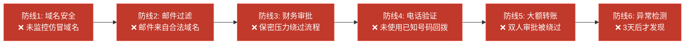
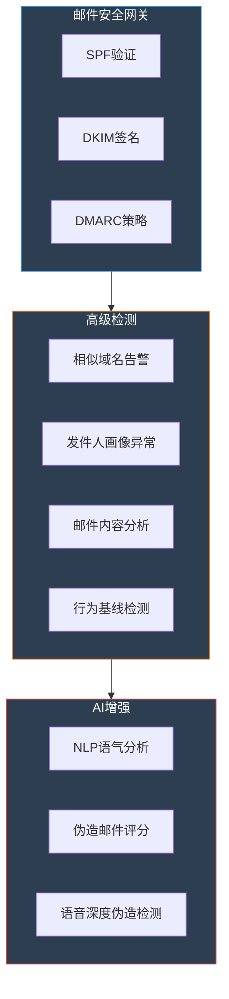

## 23.3.1 商业电子邮件诈骗（BEC）案例

商业电子邮件诈骗（Business Email Compromise，简称BEC）是当今网络安全威胁中**经济损失最大**的单一攻击类型。与勒索软件、数据泄露等技术驱动型攻击不同，BEC几乎不依赖任何技术漏洞——它的全部"武器库"由社会工程学构成：信任操纵、紧迫感制造、权威伪装和信息不对称利用。

本节通过多个真实案例，从攻击者的视角完整还原BEC的实施全流程，从防御者的视角分析每道防线的失守原因，并提供可立即落地的检测与防御方案。

### 23.3.1.1 BEC攻击全景概述

#### FBI IC3数据：BEC的真实规模

FBI互联网犯罪投诉中心（IC3）的年度报告提供了BEC最权威的全局视图：

| 年份 | BEC投诉数量 | 报告损失（亿美元） | 平均每案损失（万美元） |
|------|------------|-------------------|---------------------|
| 2016 | 12,005 | 36.0 | 30.0 |
| 2018 | 20,373 | 129.6 | 63.6 |
| 2020 | 19,369 | 18.7 | 9.7 |
| 2022 | 21,832 | 27.4 | 12.5 |
| 2023 | 21,489 | 29.4 | 13.7 |
| 2013-2023 累计 | — | **超过 500** | — |

需要注意的是，FBI数据仅包含美国向FBI主动报案的损失。行业分析师普遍认为，**实际损失是报告数据的5到10倍**，因为许多企业出于声誉考虑选择不报案，或者在内部追回资金后不再追究。

#### BEC vs 其他网络攻击的经济损失对比

| 攻击类型 | 2013-2023全球累计损失 | 主要防御手段 | 技术门槛 |
|---------|---------------------|------------|---------|
| **BEC** | **500亿美元+** | 流程+培训+邮件安全 | ★★☆ |
| 勒索软件 | 310亿美元（2023年） | 备份+EDR+补丁管理 | ★★★★ |
| 投资诈骗 | 75亿美元（2023年） | 监管+意识教育 | ★★☆ |
| 技术支持诈骗 | 29亿美元（2023年） | 意识教育+浏览器防护 | ★☆☆ |
| 身份盗窃 | 23亿美元（2023年） | MFA+信用监控 | ★★★ |

BEC在所有网络犯罪类型中损失排名第一。原因在于：**它不需要编写恶意软件，不需要突破防火墙，不需要利用零日漏洞——它只需要一个人在错误的时间信任了错误的人。**

#### BEC攻击的五种标准变体

根据FBI和多家安全厂商的分类，BEC攻击可以归纳为五种标准变体。理解这些变体有助于针对每种类型制定专门的防御策略：

| 变体 | 典型话术 | 主要目标 | 损失中位数 | 发生频率 |
|------|---------|---------|-----------|---------|
| **CEO欺诈** | "我在出差/开会，立刻转账" | 财务部门 | $200K-12M | ★★★★★ |
| **供应商发票篡改** | "我们更换了收款账户" | 采购部门 | $50K-500K | ★★★★☆ |
| **账户入侵** | 利用真实邮箱发出伪造指令 | 任何部门 | $100K-5M | ★★★★☆ |
| **律师/法律诈骗** | "机密诉讼，今天必须和解" | CEO/高管 | $250K-5M | ★★★☆☆ |
| **数据盗窃** | "请提供员工W-2表格" | HR部门 | 非直接货币 | ★★★☆☆ |

每种变体的核心机制都是利用组织内部的信任关系和信息不对称。下面通过多个真实案例逐一拆解。

### 23.3.1.2 案例一：CEO欺诈——1200万美元的"紧急收购"

这是BEC最经典、最具破坏力的变体：攻击者冒充CEO，利用其权威地位和信息不对称，指示财务部门执行紧急大额转账。

#### 攻击背景

2019年，一家跨国制造企业（员工规模约3000人，年营收超过20亿美元）的亚太区财务部门遭受了BEC攻击，损失超过1200万美元。攻击者精确把握了组织结构、审批流程和CEO的出差行程，实施了一次近乎完美的欺诈。

#### 第一阶段：情报收集（约2-4周）

攻击者花费数周时间，通过公开渠道构建了完整的目标画像：

**组织结构情报**：
- LinkedIn上搜索公司名称，获取高管姓名、职位、汇报关系
- 公司官网的"管理团队"页面获取CEO照片和履历
- SEC/上市公司年报获取CFO姓名和财务审批权限
- 新闻搜索获取近期并购活动、战略方向、高管行程

**沟通模式情报**：
- 从CEO的公开演讲和采访中学习其用词习惯和语气风格
- 从行业会议日程确认CEO的出差安排
- 从LinkedIn动态推断CEO与财务团队的互动频率
- 分析企业邮件组命名规则（finance@、cfo-office@等）

**关键情报点**：
```text
# 攻击者构建的目标画像
目标组织：[公司名]，总部美国，亚太区设有独立财务中心
CEO姓名：John Smith（从官网获取）
CFO姓名：从LinkedIn获取
财务邮箱：finance-apac@company.com（从招聘信息推断）
审批流程：大额转账需CFO审批（从行业惯例推断）
时间窗口：CEO下周在欧洲出差（从行业会议日程确认）
弱点识别：亚太区财务有独立审批权限，可绕过总部流程
```

> **心理学原理**：情报收集阶段不涉及任何攻击行为，但它是整个攻击成功的基础。研究显示，BEC攻击者平均花费**40-80小时**进行前期侦察。这些信息不是用来突破技术防线——而是用来构建一个让目标**主动放弃警惕**的心理陷阱。

#### 第二阶段：基础设施搭建（约1-2天）

攻击者注册了一个与真实域名高度相似的仿冒域名：

| 原始域名 | 仿冒域名 | 欺骗手法 |
|---------|---------|---------|
| company.com | company-ceo.com | 添加后缀 |
| company.com | cornpany.com | 字母替换（m→rn） |
| company.com | c0mpany.com | 数字替换（o→0） |
| company.com | company-group.com | 添加前缀 |
| company.com | company.com.co | 顶级域名变体 |

在本案中，攻击者使用了 `company-ceo.com`——看起来像CEO专用的内部域名。然后：

1. **注册域名**：在廉价域名注册商处以不到 $10 的价格注册
2. **配置邮件服务器**：搭建SPF和DKIM记录，使邮件通过基本的反垃圾检查
3. **创建邮箱**：john.smith@company-ceo.com
4. **配置邮件签名**：从CEO的真实签名模板中复制格式，包括公司Logo、合规声明

> **防御盲区**：传统的邮件安全网关主要检查发件人域名的SPF/DKIM/DMARC记录是否合法。但攻击者是自己域名的"合法主人"——**邮件在技术上是"真实的"**，因为攻击者拥有发送它的域名。这意味着技术手段无法自动识别这类BEC，必须依赖人的判断力。

#### 第三阶段：攻击执行

攻击者选择了CEO在欧洲出差期间——亚太区的正常工作时间，CEO所在地已是深夜——发送邮件：

```text
发件人：john.smith@company-ceo.com
收件人：finance-apac@company.com
主题：[机密] 紧急收购付款 - 高度敏感
日期：周四下午 2:30（亚太区时间，此时CEO所在地为凌晨3:30）

财务团队：

我正在与一家欧洲的收购目标进行最后阶段的谈判。
由于NDA（保密协议）的严格限制，此事目前只有我和外部顾问知晓。
在交易正式公布之前，不得向公司内任何其他人提及。

请在今天下午5点前完成以下电汇：

金额：12,000,000 USD
收款银行：瑞士联合银行（UBS）
收款账户：Global Holdings Ltd
账号：CH93 0076 2011 6238 5295 7
SWIFT：UBSWCHZH80A
用途标注：Project Phoenix - Phase 1

我稍后会补发完整的审批文件和董事会决议。此事的时间窗口
非常有限，对方要求今天完成首期付款以锁定交易。

请确认收到并开始处理。

John Smith
Chief Executive Officer
[公司名] | [公司标语]
[公司地址] | [电话]
CONFIDENTIALITY NOTICE: This email and any attachments...
```

**邮件中的心理操纵要素拆解**：

| 要素 | 攻击者意图 | 利用的心理机制 |
|------|----------|-------------|
| "机密"标签 | 阻止目标向上级确认 | 禁忌效应：保密要求形成自我审查 |
| "NDA限制" | 制造合法的保密理由 | 权威+合规性：法律文件让保密显得合理 |
| "今天下午5点前" | 压缩决策时间 | 稀缺性+紧迫感：系统1（快速决策）被激活 |
| "收购目标" | 暗示CEO的权力和远见 | 权威+一致性：拒绝CEO等于阻碍公司发展 |
| "稍后补发审批" | 绕过正常审批流程 | 信任预期：先行动后补文件在高管场景中常见 |
| "对方要求今天完成" | 外部责任转移 | 外部归因：不是CEO急，是对方急 |

#### 第四阶段：社会工程学配合（电话验证劫持）

邮件发出后，攻击者并未被动等待。30分钟后，他主动拨打了财务部负责人的电话：

**电话脚本**：

```text
攻击者（冒充CEO）："小李，我刚发了一封邮件关于Project Phoenix的事。
你收到了吗？"

财务人员："收到了，John总。不过这个金额比较大，按照流程需要..."

攻击者（打断）："我知道流程，但这次情况特殊。对方是瑞士的机构，
窗口期只有今天。我跟CFO David已经沟通过了，David在邮件里也会
确认的。你现在先启动汇款，David的审批我来跟进。"

财务人员："好的，那我先开始准备。"

攻击者："另外，这件事目前是保密的，除了你和经手的同事，不要跟
任何人提起，包括其他部门的VP。等交易公布后我会亲自跟大家说明。"
```

**电话中增加的心理压力**：

- **权威确认**：电话中"再次确认"邮件内容，让邮件的可信度翻倍
- **责任转嫁**：提到CFO已知情，消除财务人员对审批不全的顾虑
- **信息隔离**：保密要求阻止了财务人员通过非正式渠道核实
- **系统1激活**：电话的即时性让对方无法"暂停思考"，只能本能响应

> **关键防御缺失**：财务人员没有通过内部通讯录查找CEO的真实号码进行回拨验证。攻击者在电话中使用的号码是通过VoIP伪装的——**来电显示可以是任何数字**。

#### 损失与后果

| 维度 | 详情 |
|------|------|
| 汇款金额 | 1200万美元 |
| 资金流向 | 瑞士→卢森堡→塞浦勒斯→不明（48小时内经历3次转移） |
| 追回金额 | 约300万美元（仅追回25%） |
| 发现延迟 | 3天后，财务经理在月度对账中发现异常 |
| 调查周期 | 6个月（跨3个司法管辖区） |
| 间接损失 | 合规罚款、审计费用、保险费上涨、声誉受损 |
| 责任人后果 | 财务总监被解雇，CFO被内部处分 |

#### 防线失守分析



6道防线全部失守。没有一道技术防线能阻止"CEO亲自发的合法邮件+CEO亲自打来的电话"这种组合攻击。

### 23.3.1.3 案例二：供应商发票欺诈——85万美元的"账户变更"

第二种最常见的BEC变体不涉及冒充内部高管，而是**入侵或冒充外部供应商**，篡改发票中的银行信息。这种攻击更隐蔽，因为发票金额和格式完全正常，唯一变化的是收款账户。

#### 攻击背景

2020年，一家中型制造企业（年采购额约8000万美元，与200多家供应商有定期往来）的财务部门发现，过去两个月内向某核心供应商支付的三笔货款共85万美元被转入了错误账户。此时资金已被多次转移，追回希望渺茫。

#### 攻击链完整复盘

**第一阶段：入侵供应商邮箱（攻击者端，约2-3周）**

攻击者并未直接攻击目标企业，而是选择了**安全防护更薄弱的供应商**：

```text
# 攻击者对供应商的侦察
- 供应商是一家中小型零件厂（约150人）
- 使用免费邮箱（如163.com）作为业务邮箱
- 未部署DMARC邮件验证
- 员工安全意识培训缺失
- 公司官网的联系邮箱暴露在互联网上

# 入侵方式
1. 对供应商采购经理发送鱼叉式钓鱼邮件
2. 邮件伪装为"邮箱存储空间不足，请重新登录验证"
3. 跳转到仿冒的登录页面，获取邮箱凭证
4. 登录供应商邮箱，设置邮件转发规则
```

**第二阶段：情报收集（利用供应商邮箱，约2-4周）**

攻击者潜伏在供应商邮箱中，**不立即行动**，而是静默收集情报：

```text
# 攻击者在供应商邮箱中观察的信息
- 发票发送频率：每月5号和20号
- 发票金额范围：20万-50万人民币
- 发票文件格式：Excel模板，有固定格式
- 银行账户：供应商的对公账户信息
- 付款确认流程：目标企业财务收到发票后5个工作日内付款
- 付款确认邮件：目标企业会回复确认邮件
- 关键联系人：目标企业采购部王经理、财务部李主管

# 关键发现
- 供应商从不主动打电话确认付款到账
- 目标企业仅通过邮件确认发票信息
- 付款周期固定，攻击者可以精确预测下一笔付款的时间
```

**第三阶段：邮件规则配置（攻击者在供应商邮箱中的设置）**

```plaintext
# Outlook邮件规则（攻击者在供应商邮箱中创建）

规则1：Invoice Forward（发票转发）
  条件：发件人包含 target-company.com
  操作：转发到 attacker@attacker-domain.com
  操作：标记为已读

规则2：Sent Item Cleanup（发件箱清理）
  条件：已发送邮件包含"发票"或"invoice"
  操作：移动到"已删除"文件夹
  操作：清空已删除文件夹（延迟执行）

规则3：Reply Hijack（回复劫持）
  条件：收到包含"发票"或"付款"的回复邮件
  操作：转发到 attacker@attacker-domain.com
  操作：从收件箱删除原始邮件
```

这些规则确保攻击者能**实时监控**供应商与目标企业之间的所有发票往来，同时确保供应商本人**完全不知情**——所有与目标企业的邮件交互都被攻击者拦截和替代。

**第四阶段：发票篡改与发送**

攻击者在下一次发票发送时实施篡改：

| 字段 | 原始发票 | 篡改后发票 | 差异 |
|------|---------|----------|------|
| 发件人 | supplier@163.com | supplier@163.com | **完全相同**（真实邮箱） |
| 收款银行 | 工商银行北京支行 | 建设银行上海支行 | **不同** |
| 银行账号 | 6222 **** 1234 | 6227 **** 5678 | **不同** |
| 户名 | XX零件制造有限公司 | XX零件制造有限公司 | **相同**（使用供应商真实名称） |
| 发票金额 | ¥350,000 | ¥350,000 | **完全相同** |
| 发票格式 | 标准模板 | 标准模板 | **完全相同** |
| 附件 | 原始Excel文件 | 修改版Excel文件 | 仅银行信息变化 |

**为什么目标企业没有发现异常**：
1. 发件人是真实的供应商邮箱地址
2. 发票金额、格式、产品明细完全正确
3. 唯一变化的是银行账号——但采购部和财务部不会逐笔核对已有供应商的银行信息
4. 攻击者精确复制了发票的字体、排版、公司印章

> **心理学原理**：这种攻击利用的是**可得性偏差**（Availability Bias）和**确认偏差**（Confirmation Bias）。财务人员看到的是"来自真实供应商的真实金额发票"，大脑快速匹配"一切正常"的模式后，便不会进一步检查银行信息这种低频变动的字段。在心理学中，这叫做**非注意盲视**（Inattentional Blindness）——当主要信息正确时，次要信息的变化会被自动忽略。

#### 损失与追讨

| 维度 | 详情 |
|------|------|
| 被骗金额 | 85万美元（三笔） |
| 发现方式 | 供应商在第四个月询问为何未收到付款 |
| 资金位置 | 已经经过3次中间账户转移 |
| 追回金额 | 约12万美元 |
| 间接影响 | 供应商关系紧张、生产延误2周、内部审计启动 |

#### 此类攻击的防御核心

```text
# 关键防御原则：任何银行信息变更必须通过独立渠道确认

1. "Out-of-Band Verification"（带外验证）
   - 银行信息变更后，必须通过电话确认
   - 电话号码不能来自变更邮件本身
   - 必须使用已有通讯录中的号码

2. 供应商银行信息变更审批流程
   - 变更申请必须有纸质或电子签章
   - 变更需双人审批
   - 变更后第一笔付款必须电话确认到账

3. 供应商域名安全监控
   - 监控供应商域名的DMARC状态
   - 定期检查供应商邮箱是否被标记为恶意
   - 与供应商建立安全联络机制
```

### 23.3.1.4 案例三：律师/法律诈骗——"禁言令"下的250万美元

律师诈骗是BEC中**心理操纵最为精密**的变体。它利用了法律事务的保密性、诉讼的恐惧效应和律师的权威身份，构建了一个几乎无法质疑的场景。

#### 攻击手法详解

攻击者冒充公司外部律师事务所的高级合伙人，声称公司正面临一起机密诉讼，需要立即支付和解金以避免公开审理。

**身份伪装要素**：

| 伪装维度 | 具体做法 | 信息来源 |
|---------|---------|---------|
| 律师姓名 | 使用该地区知名律所的真实律师姓名 | 律所官网、法律数据库 |
| 邮箱域名 | 注册 lawfirm-legal.com（仿冒 lawfirm.com） | 域名注册 |
| 沟通风格 | 使用法律文书的正式措辞和格式 | 公开法律文件模板 |
| 专业术语 | 引用真实的法律条文和程序 | 法律数据库 |
| 紧迫理由 | 法院和解期限、禁言令 | 心理操纵 |

**邮件示例**：

```text
发件人：james.wilson@lawfirm-legal.com（仿冒 lawfirm.com 的真实律师邮箱）
收件人：ceo@company.com
主题：[紧急·机密] 诉讼和解 - 需要今日行动
优先级：最高

尊敬的[CEO姓名]：

我是Wilson & Associates律师事务所的James Wilson。
我代表贵公司处理一起尚未公开的商业诉讼案件。

案件概况：
- 案号：2021-CV-XXXXX（虚构但格式正确）
- 原告：前员工/竞争对手
- 案由：商业秘密侵权
- 当前阶段：法院已下达禁言令

原告方在调解过程中提出了庭外和解方案。和解金为250万美元。
如果未能在本周五（禁言令到期日）前完成支付，案件将进入
公开审理阶段。届时，诉讼细节将被公开记录，可能对贵公司
股价和声誉造成不可逆的损害。

和解金需汇入以下信托账户（受律师-客户保密特权保护）：
银行：[银行信息]
账户：[账户信息]

我理解此事的敏感性。如果您需要验证我的身份，可以拨打
律所总机：[攻击者控制的VoIP号码]。

付款完成后请回复此邮件，我将向法院提交正式和解协议。

请勿将此事告知公司内部其他人员——禁言令同样约束了
知悉此事的第三方。

此致，
James Wilson
高级合伙人
Wilson & Associates LLP
[律所地址 - 从官网复制]
[电话 - 攻击者控制的VoIP]
CONFIDENTIALITY NOTICE: This message is intended exclusively...
```

**邮件中的精密心理操纵**：

1. **直接发给CEO**：绕过所有中间环节，让最高决策者直接处理
2. **商业秘密侵权**：选了一个CEO最恐惧的案由——涉及核心竞争力
3. **禁言令**：法律上真实存在的工具，给保密要求提供了无可辩驳的理由
4. **股价和声誉**：对上市公司CEO而言，这是最大的职业恐惧
5. **信托账户**：法律术语，暗示资金有法律保障，降低警惕
6. **"可以拨打律所总机"**：攻击者预先设置了VoIP号码来接听验证电话
7. **禁言令约束第三方**：从法律角度阻止CEO向他人咨询或确认

> **为什么此类攻击成功率极高**：法律事务是企业中最不透明的领域之一。CEO通常不会也无法逐案验证所有法律诉讼的真实性——每年可能面临数十起法律纠纷。当一封看起来专业的法律邮件到达时，"不处理"的风险（公开审理、股价暴跌）远大于"处理"的风险（可能是诈骗但概率低）。这是典型的**损失规避**心理在发挥作用。

#### 2024年变体：结合AI语音克隆

2024年出现的升级版本在邮件攻击的基础上增加了**AI语音克隆**电话：

```text
# 攻击流程升级
1. 发送律师诈骗邮件（同上）
2. 2小时后拨打CEO电话，冒充"James Wilson律师"
3. 使用AI语音克隆（需要约3秒的参考音频）
4. 电话内容：
   "我是James Wilson，刚发了邮件。和解窗口明天关闭。
    法院要求今天下午4点前确认付款意向。"
5. 当CEO犹豫时，攻击者会说："如果您需要验证我的身份，
   我可以拨打您办公室电话回拨——您知道我们的号码。"
   （此时CEO会拨打邮件中的VoIP号码，由攻击者的同伙接听）
```

这种"邮件+电话"的组合攻击，将BEC的成功率从单一邮件的**约5-10%**提升到**约30-40%**。

### 23.3.1.5 案例四：AI深度伪造语音BEC——22万欧元的"CEO声音"

2019年3月，英国某能源公司（员工约200人）遭受了**全球首例有记录的AI语音克隆BEC攻击**。攻击者使用AI语音合成技术模仿母公司CEO的声音，指示英国子公司的CEO向匈牙利供应商转账22万欧元。

#### 攻击过程

```text
# 攻击时间线
Day 1-3: 攻击者收集母公司CEO的语音样本
         来源：YouTube上的行业会议演讲视频、
         新闻采访音频、播客访谈（约30分钟素材）
         
Day 4:   使用AI语音克隆工具（疑似DeepVox或类似工具）
         训练语音模型
         
Day 5:   拨打英国子公司CEO的电话
         
# 电话对话（事后重构）
攻击者（克隆的CEO声音）："Martin，是我。我们正在收购一家匈牙利公司。
交易今天需要完成。你需要把22万欧元转到这个账户..."

子公司CEO Martin："好的，我马上安排。"
（Martin后来表示："声音的语气、节奏、甚至德语口音的英语
都和我上司完全一样。我没有理由怀疑。"）

# 结果
- 22万欧元转出
- 第二次要求追加转账时，Martin产生了疑虑
- 通过内部电话联系母公司CEO，发现从未有此交易
- 报警并冻结部分资金
```

#### 技术分析

| 维度 | 详情 |
|------|------|
| AI工具类型 | 文本转语音（TTS）+ 语音克隆（Voice Cloning） |
| 训练数据需求 | 2019年约30分钟；2024年仅需3-10秒 |
| 合成质量 | 2019年已接近真人；2024年几乎无法区分 |
| 检测难度 | 极高——人耳几乎无法识别 |
| 成本 | 2019年需要专业技能；2024年在线服务$50/月 |

**语音样本来源**：

```plaintext
# 攻击者获取目标语音的公开渠道
1. YouTube/行业会议视频（演讲、小组讨论）
2. 播客和广播采访
3. 公司宣传视频
4. 电话客服录音（如果被泄露）
5. LinkedIn Learning或其他教育平台的讲师音频
6. 社交媒体短视频（TikTok/抖音、Instagram Reels）
7. 股东大会/财报电话会议录音
```

> **关键认知**：2019年这个案例需要30分钟的语音数据和一定的技术能力。到2024年，ElevenLabs、Bark等开源工具使得**3秒钟的参考音频就足以生成高仿真的语音克隆**。这意味着：任何人只要在网上有过几秒钟的公开音频——无论是会议演讲、视频通话、甚至是一段微信语音——都可能成为AI语音克隆BEC的受害者。

### 23.3.1.6 案例五：供应链BEC——W-2数据盗窃

BEC不仅用于直接的金钱诈骗。第五种变体**不追求即时金钱回报**，而是以窃取员工个人信息为目标，为后续的身份盗窃和税务欺诈做准备。

#### 攻击模式

每年1月至4月（美国报税季前后），攻击者会冒充CEO向HR部门发送邮件：

```text
发件人：ceo@company-co.com（仿冒 company.com）
收件人：hr-director@company.com
主题：[紧急] W-2汇总 - 报税需要

Hi Sarah，

我需要你提供公司所有员工的W-2税务信息汇总，
包括姓名、SSN（社会安全号码）、地址和工资。

请在今天下班前发送给我或我的税务顾问。
这是年度报税的常规要求，请尽快处理。

谢谢，
CEO姓名
```

**为什么HR会上当**：
1. 报税季确实需要提交W-2信息——场景完全合理
2. CEO在报税季要求W-2数据是常见操作
3. 邮件来自看起来正常的CEO邮箱
4. HR部门有义务配合CEO的合规要求

**后果**：
- 数千名员工的个人信息被泄露
- 攻击者利用SSN进行虚假报税，获取退税
- 员工面临身份盗窃风险
- 公司面临GDPR/CCPA罚款和集体诉讼

### 23.3.1.7 BEC防御体系：多层防御框架

单一防御措施无法应对BEC的全部变体。必须建立**技术+流程+人员**的三层防御体系。

#### 技术层防御



**具体实施**：

| 防御措施 | 实施方式 | 有效性 | 实施难度 |
|---------|---------|-------|---------|
| DMARC p=reject | 拒绝所有未通过SPF/DKIM的邮件 | 防止域名欺骗 | ★★★ |
| 相似域名监控 | 监控注册包含公司名的仿冒域名 | 提前预警 | ★★☆ |
| 外部邮件标签 | 外部邮件自动添加[External]标签 | 提高警觉 | ★☆☆ |
| 邮件安全网关 | 部署Proofpoint/Mimecast等 | 检测BEC特征 | ★★★ |
| AI内容分析 | NLP分析邮件语气和请求模式 | 检测异常请求 | ★★★★ |

**DMARC配置**：

```dns
; 公司域名的DNS记录
; SPF记录
company.com. IN TXT "v=spf1 include:_spf.google.com -all"

; DKIM记录
selector1._domainkey.company.com. IN TXT "v=DKIM1; k=rsa; p=MIG..."

; DMARC记录 - 阶段式部署
; 第1个月：监控模式
_dmarc.company.com. IN TXT "v=DMARC1; p=none; rua=mailto:dmarc@company.com; pct=100"

; 第3个月：隔离模式（可疑邮件进入垃圾箱）
_dmarc.company.com. IN TXT "v=DMARC1; p=quarantine; rua=mailto:dmarc@company.com; pct=100"

; 第6个月：拒绝模式（未验证邮件直接拒绝）
_dmarc.company.com. IN TXT "v=DMARC1; p=reject; rua=mailto:dmarc@company.com; pct=100"
```

**相似域名监控脚本**：

```python
#!/usr/bin/env python3
"""BEC防御：相似域名监控工具

定期检查是否有人注册了与公司域名相似的新域名。
使用crt.sh（证书透明度日志）进行被动监控。
"""
import requests
import re
from datetime import datetime

def check_similar_domains(company_domain: str) -> list[str]:
    """检查证书透明度日志中与目标域名相似的新注册域名"""
    base_name = company_domain.split('.')[0]
    
    # 从crt.sh查询证书透明度日志
    url = f"https://crt.sh/?q=%25.{base_name}.%25&output=json"
    try:
        resp = requests.get(url, timeout=30)
        entries = resp.json()
    except Exception as e:
        print(f"[!] 查询失败: {e}")
        return []
    
    # 提取所有相关域名
    found_domains = set()
    for entry in entries:
        name = entry.get('name_value', '')
        for domain in name.split('\n'):
            domain = domain.strip().lstrip('*.')
            if domain and base_name in domain and domain != company_domain:
                found_domains.add(domain)
    
    # 过滤和排序
    suspicious = []
    for d in sorted(found_domains):
        # 检查是否使用了常见替换手法
        if _is_suspicious_variant(base_name, d.split('.')[0]):
            suspicious.append(d)
    
    return suspicious

def _is_suspicious_variant(original: str, candidate: str) -> bool:
    """检测域名是否使用了字符替换或添加后缀的手法"""
    # 字母o替换为数字0
    if candidate.replace('0', 'o') == original:
        return True
    # 字母l替换为数字1
    if candidate.replace('1', 'l') == original:
        return True
    # 字母m替换为rn
    if candidate.replace('rn', 'm') == original:
        return True
    # 添加常见后缀
    for suffix in ['-ceo', '-cfo', '-secure', '-login', '-group', '-official']:
        if candidate.endswith(suffix) and candidate.replace(suffix, '') == original:
            return True
    return False

if __name__ == "__main__":
    company = "yourcompany.com"
    print(f"[*] 检查 {company} 的相似域名...")
    results = check_similar_domains(company)
    if results:
        print(f"[!] 发现 {len(results)} 个可疑域名:")
        for d in results:
            print(f"    ⚠️  {d}")
    else:
        print("[✓] 未发现可疑的相似域名")
```

#### 流程层防御

**核心原则：任何资金转移或敏感信息请求，必须通过独立渠道验证。**

```plaintext
# "四眼原则"完整流程

# 步骤1：收到资金转移请求
IF 邮件请求涉及资金转移 THEN
  记录请求详情（金额、账户、原因）
  → 暂停处理，不回复邮件确认

# 步骤2：独立渠道验证
  通过以下方式之一验证：
  a. 拨打请求人已知的电话号码（非邮件中提供的号码）
  b. 通过内部即时通讯（Teams/钉钉/飞书）确认
  c. 面对面确认（适用于同办公室）
  d. 通过第二位已知高管确认

# 步骤3：大额转账额外控制
IF 转账金额 > 50,000 THEN
  需要CFO或以上级别书面审批
  24小时冷静期（除非有充分证据证明紧急性）
  财务总监电话二次确认

# 步骤4：银行信息变更验证
IF 请求涉及变更收款银行/账户 THEN
  不接受邮件作为唯一变更依据
  必须通过电话联系供应商已知联系人
  变更后首笔付款电话确认到账
  纸质或电子签章确认变更文件
```

**分级验证矩阵**：

| 请求金额 | 验证要求 | 冷静期 | 最终审批 |
|---------|---------|-------|---------|
| < $10,000 | 邮件确认 + 部门经理批准 | 无 | 部门经理 |
| $10,000 - $100,000 | 电话验证 + 双人审批 | 4小时 | 财务总监 |
| $100,000 - $1,000,000 | 面对面/视频验证 + 三重审批 | 24小时 | CFO |
| > $1,000,000 | 面对面验证 + 董事会审批 | 48小时 | CEO + 董事会 |

#### 人员层防御

**BEC针对性培训框架**：

```plaintext
# 培训模块设计（季度轮训）

# Q1：BEC认知基础（全员）
- BEC是什么？五种变体的识别特征
- 真实案例复盘（含受害者视角）
- "暂停-验证-行动"三步法
- 保密压力测试：遇到"不要告诉别人"时怎么办

# Q2：邮件安全识别（全员）
- 如何检查邮件头部信息
- 外部邮件标签的含义
- 常见的域名欺骗手法
- 实操练习：识别20封邮件中的5封BEC

# Q3：财务流程强化（财务/采购/HR）
- 资金转移验证流程演练
- 供应商银行信息变更流程
- 大额转账审批流程
- 角色扮演：如何拒绝"CEO"的不合理要求

# Q4：高级威胁意识（高管/IT安全）
- AI语音克隆/深度伪造的最新趋势
- 商务旅行期间的安全注意事项
- 供应链安全风险评估
- 事件响应流程桌面推演
```

**钓鱼模拟测试中的BEC专项**：

| 测试轮次 | 难度 | 模拟场景 | 预期通过率 | 行动要求 |
|---------|------|---------|-----------|---------|
| Q1 | ★★☆ | 仿冒CEO要求加班报告 | >80% | 识别外部邮件标签 |
| Q2 | ★★★ | 供应商要求变更银行信息 | >70% | 发起电话验证 |
| Q3 | ★★★★ | "律师"要求紧急付款 | >60% | 拒绝并上报 |
| Q4 | ★★★★★ | AI语音+邮件组合攻击 | >50% | 多渠道验证 |

### 23.3.1.8 BEC事件响应清单

当BEC攻击发生时，**前48小时的响应速度**直接决定了资金追回的可能性。以下是经过验证的响应流程：

```plaintext
# BEC事件响应检查清单
# 发现疑似BEC后立即执行

# 第1步：立即止损（0-30分钟）
[ ] 联系开户银行，请求冻结/撤回汇款
[ ] 提供汇款详情（金额、时间、收款账户、SWIFT）
[ ] 如资金已转出，请求银行向收款行发出退汇请求
[ ] 记录所有操作的时间戳

# 第2步：内部响应（30分钟-2小时）
[ ] 通知CISO/安全团队
[ ] 通知CFO/财务负责人
[ ] 检查受影响邮箱是否被入侵
[ ] 检查是否有其他部门收到类似邮件
[ ] 保全证据：截图、邮件原文、邮件头部

# 第3步：外部通报（2-24小时）
[ ] 向FBI IC3报案（美国：ic3.gov）
[ ] 向当地警方报案（获取报案编号）
[ ] 通知网络保险公司（如有）
[ ] 联系数字取证公司（如需要）

# 第4步：追讨行动（24-72小时）
[ ] 与银行合作追踪资金流向
[ ] 联系收款行请求协助冻结
[ ] 如涉及跨境汇款，联系Interpol或相关执法机构
[ ] 准备法律文件（如需要冻结收款方账户）

# 第5步：事后加固（1-2周）
[ ] 全面审查邮件安全配置
[ ] 更新财务审批流程
[ ] 开展全员安全意识培训
[ ] 部署/更新DMARC策略
[ ] 编写事件报告并提交管理层
```

**资金追回的时间窗口**：

| 汇出后时间 | 追回概率 | 关键行动 |
|-----------|---------|---------|
| 0-24小时 | 70-82% | 立即联系银行撤回 |
| 24-48小时 | 40-50% | 跨行协作冻结 |
| 48小时-1周 | 10-20% | 执法机构介入 |
| 1周以上 | <5% | 法律追讨（耗时6-18个月） |

> **关键数据**：FBI的"Financial Fraud Kill Chain"机制在2023年成功追回了超过**5亿美元**的BEC损失。关键前提是：**在汇款后72小时内报案**。超过72小时，资金通常已经被多次转移，追回概率急剧下降。

### 23.3.1.9 BEC攻击趋势与未来威胁

#### 2024-2025年BEC发展态势

| 趋势 | 详情 | 防御影响 |
|------|------|---------|
| AI生成邮件 | LLM（如GPT-4）生成无语法错误、风格自然的钓鱼邮件 | 传统语法错误检测失效 |
| 语音克隆普及化 | ElevenLabs等服务$50/月，3秒参考音频 | 电话验证不再可靠 |
| 深度伪造视频 | 虚假视频会议（Zoom/Teams中的虚拟CEO） | 视频确认也需要谨慎 |
| 多渠道复合攻击 | 邮件+电话+短信+社交消息组合 | 单一渠道验证失效 |
| 供应链自动化 | 自动化入侵供应商→监控→篡改的全流程 | 供应链安全成为必修课 |
| 跨平台攻击 | 从邮件扩展到Teams/Slack/钉钉等协作工具 | 防御边界需要扩展 |

#### AI时代BEC的防御升级

```plaintext
# 传统防御 vs AI时代防御

# 传统BEC（2015-2020）
攻击特征：语法错误、时差异常、发件域名不匹配
防御手段：邮件过滤、域名验证、员工培训
有效性：中等（培训后可识别多数攻击）

# AI增强BEC（2023-）
攻击特征：无语法错误、精准语气模仿、多渠道配合
传统防御失效原因：
  - AI生成的邮件没有"看起来可疑"的特征
  - 语音克隆让电话验证不再可靠
  - 攻击者可以24/7自动化侦察和攻击

# AI时代新防御
1. 行为基线检测：不看邮件内容，看行为模式
   - "CEO"是否在异常时间发邮件？
   - 请求的金额/频率是否偏离历史基线？
   - 请求是否涉及新增的收款账户？

2. 数字签名验证：关键指令必须数字签名
   - 使用S/MIME或PGP签名
   - 大额转账要求签署的不是邮件内容，而是独立文件

3. AI检测AI：使用AI检测深度伪造
   - 音频深度伪造检测（频谱分析、音素异常）
   - 视频深度伪造检测（眨眼频率、皮肤纹理）
   - 文本AI检测（困惑度分析、n-gram模式）

4. 零信任财务流程：
   - 任何邮件请求都不自动信任
   - 所有资金转移需要独立渠道确认
   - 引入"安全码"机制：高管与财务人员共享每日安全码
```

### 23.3.1.10 本节小结

BEC攻击的本质是**利用组织信任结构中的缝隙**。技术手段可以封堵一部分缝隙，但最终的防线是**人的判断力和组织的验证流程**。

**核心防御原则**：

| 原则 | 含义 |
|------|------|
| **永远验证** | 任何资金转移请求，不论来源，都必须独立渠道验证 |
| **永远质疑紧迫性** | "今天必须转账"本身就应该触发警报 |
| **永远保护保密边界** | "不要告诉别人"是BEC的标志性信号 |
| **永远使用已知号码** | 回拨验证时，使用通讯录中的号码，而非邮件中的号码 |
| **永远留出冷静期** | 大额转账必须有24-48小时的冷静期 |

如果读者只能从本节记住一句话，应该是这句：

> **当邮件要求你做两件事——"转钱"和"保密"——同时出现时，这几乎确定是一个骗局。正常的商业操作从不要求你在保密的前提下紧急转账。**
