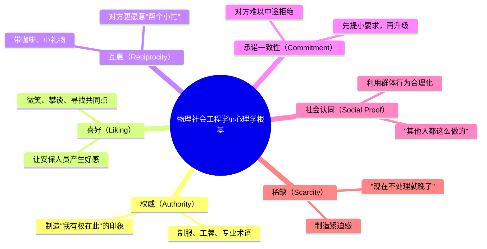
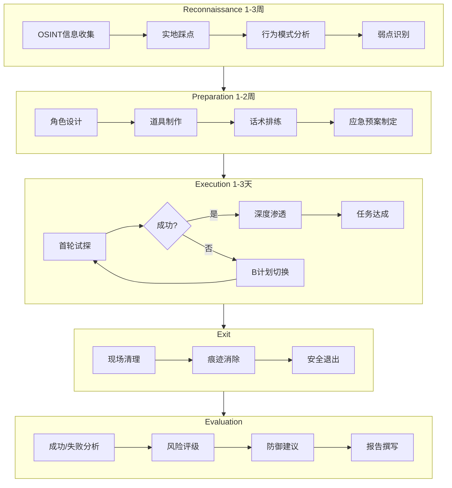
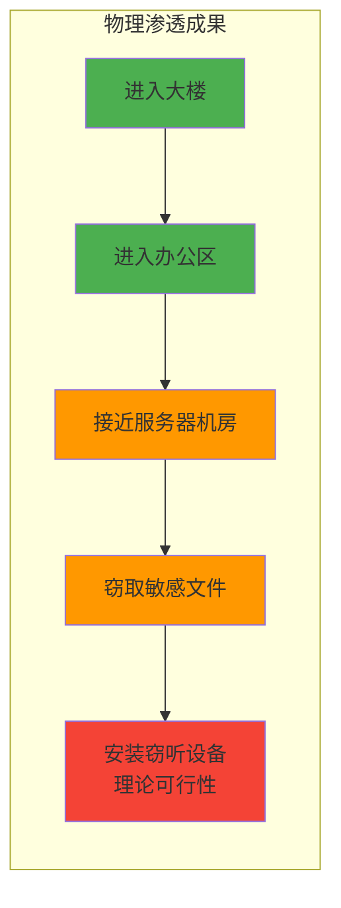
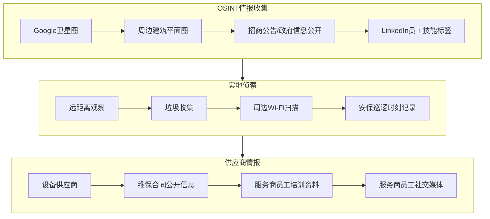
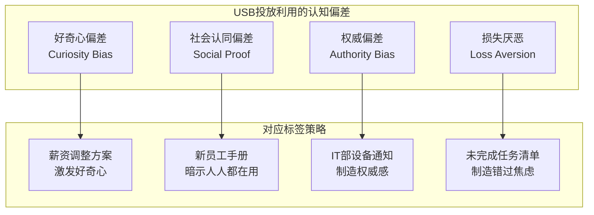
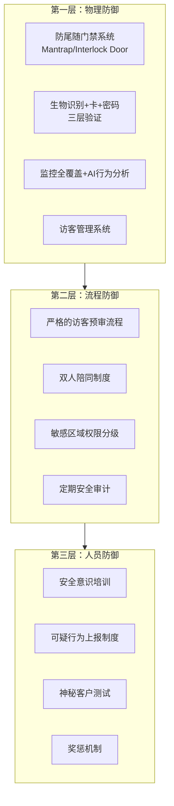

## 23.3 物理社会工程学渗透测试

物理社会工程学（Physical Social Engineering）是渗透测试中最古老但最有效的方法之一。与远程钓鱼攻击不同，物理社会工程学要求测试者亲自出现在目标场所，利用人类心理弱点绕过物理安全控制。本章通过三个真实级案例，完整呈现从侦察到执行的渗透全流程，并解析其背后的心理学机制与防御策略。

### 23.3.1 理论根基：为什么物理社会工程学如此有效

在深入案例之前，有必要理解物理社会工程学之所以成功的底层逻辑。

#### 说服心理学基础

Robert Cialdini 在其经典著作《影响力》（Influence: The Psychology of Persuasion）中总结了六大说服原则，这些原则在物理渗透场景中同样适用：



| 原则 | 物理渗透中的应用 | 对应话术示例 |
|------|-----------------|-------------|
| 权威 | 伪造IT/供应商/快递制服 | "我是华为派来的网络工程师" |
| 喜好 | 主动攀谈、分享零食 | "新来的吧？我也刚到这边" |
| 互惠 | 带咖啡、带甜点 | "前台我带了星巴克，顺路" |
| 承诺一致性 | 从小请求→大请求 | "帮我开下门→帮我带路→借我工位用一下" |
| 社会认同 | 尾随人群进入 | "前面那个穿西装的也是你们公司的？" |
| 稀缺 | 制造紧急/限时借口 | "机房报警了，再不处理会宕机！" |

#### 物理社会工程学 vs. 数字社会工程学

| 维度 | 物理社会工程学 | 数字社会工程学 |
|------|--------------|---------------|
| 接触方式 | 亲自到场，面对面交互 | 邮件、短信、社交平台 |
| 风险等级 | 高（被当场识破有法律风险） | 中（可匿名操作） |
| 心理压力 | 极高（实时表演，不可回放） | 低（可以提前编辑文案） |
| 成功率 | 通常更高（2008-2023年统计约78%） | 约15-30%（取决于钓鱼质量） |
| 所需准备 | 数周侦察 + 实物道具 | 模板 + 目标邮箱即可 |
| 防御难度 | 低（物理接触即可突破薄弱环节） | 中（技术防御可拦截大部分） |
| 取证难度 | 低（监控录像、访客记录） | 高（IP伪造、VPN） |

> **关键洞察**：物理社会工程学之所以高效，是因为**物理安全系统最终由人来执行**。门禁、摄像头、报警系统都只是工具，而人——安保、前台、员工——是这些工具的操作者。攻破一个人比攻破一套电子系统成本更低。

### 23.3.2 物理渗透测试方法论（P3E 框架）

物理渗透测试不应是随机的"碰运气"，而应遵循系统化的方法论。以下是业界公认的 **P3E 框架**，也是本案例遵循的执行流程：



**P3E 框架** 的核心思想是：侦察占 60% 工作，准备占 25%，执行仅占 15%。**准备工作越充分，执行成功率越高**。

### 23.3.3 案例一：金融办公大楼物理渗透

#### 背景与客户需求

受某大型金融机构委托进行年度物理安全评估。客户防护设施：
- 刷卡门禁系统（HID iClass）
- 24小时持证安保人员
- 访客登记+拍照流程
- 内部监控系统（海康威视）
- 服务器机房双因子认证（指纹+密码）

**测试目标**：评估上述防护设施在人类社会工程学攻击面前的实际效果。

#### 侦察阶段：详细行动日志

**第1-3天：OSINT信息收集**

```python
# OSINT侦察清单
OSINT_TARGETS = {
    "LinkedIn员工数据": {
        "公司员工数": "约800人",
        "可用个人信息": ["姓名", "职位", "部门", "入职时间", "教育背景"],
        "关键发现": "部分员工在外勤打卡时发布带有工牌的自拍照片"
    },
    "公开招聘信息": {
        "IT部门": "正在招聘网络工程师（透露了使用的设备和品牌）",
        "行政部": "热招前台（提供了访客管理流程线索）"
    },
    "供应商信息": {
        "保洁公司": "某第三方物业公司",
        "IT外包": "某本地系统集成商",
        "设备品牌": "HID门禁、海康监控、Cisco网络设备"
    },
    "社交媒体": {
        "员工朋友圈": "有人抱怨食堂饭菜（侧面了解员工餐厅位置和开放时间）",
        "大众点评": "公司地址的办公室照片（内部布局）",
        "知乎": "前员工离职帖（描述了办公层安保细节）"
    }
}

# 伪装策略选择依据
# - LinkedIn发现多名员工穿带logo的冲锋衣 -> 可复制的着装风格
# - 保洁公司为本地小微公司 -> 冒充成本低
```

**第4-7天：实地踩点**

侦察员以"附近上班的居民"身份在目标大楼周边进行日常观察：

| 观察项 | 发现 | 可利用点 |
|--------|------|---------|
| 出入口数量 | 主入口+地下车库入口+消防通道 | 消防通道无人值守但只能内部开启 |
| 安保换班时间 | 8:00、14:00、20:00 | 换班期是渗透窗口期 |
| 上班高峰 | 8:30-9:30 | 尾随进入的最佳时间窗口 |
| 访客登记流程 | 扫码登记→前台打电话确认→发访客卡 | 确认环节是最薄弱点 |
| 员工制服样式 | 商务休闲为主，偶尔带logo冲锋衣 | 标准商务装即可融入 |
| 食堂送餐时间 | 11:30-12:30 | 大量外卖员/快递出入 |
| 垃圾处理 | 下班后垃圾袋放置在后门 | 可获取敏感文件 |

#### 准备阶段

**道具制作**

```text
道具清单：
┌─────────────────────────────────────────────┐
│ 1. 伪造工牌（使用从淘宝购买的空白卡套）       │
│    - 设计稿：根据侦察照片复刻样式              │
│    - 照片：接近真人工作照效果                  │
│    - 编码：无（不需要读卡器验证，仅视觉欺骗）    │
├─────────────────────────────────────────────┤
│ 2. IT支持制服                                 │
│    - 蓝色衬衫+深色西裤（通用IT形象）            │
│    - 背包中放置网线钳、测线仪、笔记本电脑       │
│    - 冒充公司常驻外包IT的支持人员               │
├─────────────────────────────────────────────┤
│ 3. 道具笔记本电脑                             │
│    - 屏幕贴有"XX公司IT部"标签                  │
│    - 桌面显示网络诊断工具界面                  │
│    - 准备了一份网络拓扑图作为"工作文件"          │
├─────────────────────────────────────────────┤
│ 4. 名片（伪装多重身份）                        │
│    - 内部IT支持名片                            │
│    - 快递公司工牌（顺丰同城）                   │
│    - 外卖保温箱（美团众包）                     │
└─────────────────────────────────────────────┘
```

**话术脚本设计**

```plaintext
话术1（IT支持）：
  目标：进入办公区并自由活动
  开场："你好，我是从IT运维中心过来的，我们接到工单说B座12楼的交换机端口出现问题。
        需要过去看看。"
  预期反问处理：
    反问"我怎么没听说" → "昨天下班前报修的，可能还没来得及通知你这边"
    反问"哪个交换机" → "12楼弱电间的C2960，上面有个端口反复downup"
  要点：使用专业术语、把具体细节（楼层号+设备型号）放在第一波输出中

话术2（快递员）：
  目标：进入走廊区域
  开场："顺丰同城急送，麻烦签收一下，这批件需要本人签收。"
  预期处理：举着快递盒，上面有公司地址和收件人姓名
  要点：快递真的大概率不需要进场，所以在此场景下前台会犹豫是否让人进入

话术3（面试者）：
  目标：进入办公区+等待区
  开场："你好，我约了HR的王经理2点面试，我是之前电话联系过的张磊。"
  预期处理：
    王经理不在 → "那我能在等待区等一下吗？路上有点堵来早了几分钟"
    需登记 → 提供伪造身份证和联系电话（使用一次性号码）
```

#### 执行阶段：三次渗透尝试的完整记录

**第一次尝试（成功率最高的方案）：尾随进入**

```text
时间：周三 8:45
伪装身份：普通上班族（标准商务装+手持咖啡+文件袋）
行动记录：

08:43  到达主入口外的人行道，观察进出的员工
08:45  锁定目标——一位正在刷卡开门的中年男性员工
08:45  快步靠近，左手持咖啡杯，右手夹着文件袋
       动作设计：腾不出手刷卡，自然等着有人开门
08:46  目标刷卡→拉开门→测试者保持1.5米距离跟随进入
       关键点：视线平视前方，步伐自然，不做任何眼神接触
08:47  通过闸机区域——安保人员正在低头看手机
08:48  成功进入电梯厅
08:50  到达目标楼层

结果：✅ 成功
分析：
- 安保未执行"一人一卡"的基本安全策略
- 尾随间隔1.5米是心理舒适距——太近会引起警觉，太远门会关上
- 双手被占据增加了可信度（人会对"忙碌的人"降低戒心）
```

**第二次尝试（获得办公区自由活动权限）：冒充IT支持**

```text
时间：周三 10:15
伪装身份：IT外包运维工程师
行动记录：

10:10  测试者从消防楼梯下到1楼（利用第一次渗透已进入内部）
10:12  从前台旁边的卫生间出来，整理好IT制服
10:13  走向前台，主动打招呼，语速略快（制造紧迫感）
10:13  话术："早上好，我从IT运维中心来的，12楼有个交换机端口故障的紧急工单"
10:14  前台抬头看了一眼工牌（未仔细查看编码细节）
10:14  前台："哪一栋？"
10:14  "B座12楼弱电间，我直接上去就行"
10:14  前台点头 → 测试者直接走向电梯
10:15  成功进入目标楼层办公区

结果：✅ 成功
分析：
- 前台未执行验证流程（没有电话确认到IT部门）
- "紧急工单"制造了稀缺和紧迫感
- 专业术语（"交换机端口"、"弱电间"、"工单"）强化了权威性
- 值得注意的是：测试者的工牌实际上与真实工牌有细微色差，但前台未仔细比对
```

**第三次尝试（高风险方案）：冒充面试者**

```text
时间：周三 14:00
伪装身份：面试候选人
行动记录：

14:00  正装西装，持文件夹+简历，走向前台
14:01  "你好，我约了人力资源部的张经理2点面试"
14:02  前台核对手写访客表后说："张经理今天下午外出了"
14:03  "啊这样...那我能先等一会儿吗？我提前到了，路上有点堵"
14:04  前台犹豫了一下："那你先坐那边等一下吧"
14:05  测试者在等待区坐下，观察周围环境
14:08  等待区的桌面摆放了内部通讯录（敏感材料）
14:10  测试者使用手机拍摄了通讯录和办公区布局照片
14:15  等待15分钟后，测试者自称"改天再来"后离开

结果：⚠️ 部分成功（未进入核心办公区，但收集了额外信息）
分析：
- 前台未坚持让测试者联系上张经理
- 等待区放置敏感材料是重大安全隐患
- "提前到"的话术利用了对方可能觉得"让人站着等不太好"的心理
- 如果前台要求重新预约，测试者会使用"从大老远过来"的互惠话术
```

#### 渗透成果汇总



| 渗透级别 | 是否达成 | 成功率因素 |
|---------|---------|-----------|
| 1级：进入大楼 | ✅ 达成 | 上班高峰期伪装尾随，安保失职 |
| 2级：进入办公区 | ✅ 达成 | IT制服+专业话术+权威形象 |
| 3级：接触敏感区域 | ⚠️ 部分 | 通道有额外门禁，但等待区获取了敏感信息 |
| 4级：数据窃取 | ⚠️ 理论可行 | 物理访问已足够安装无线键盘记录器 |
| 5级：长期潜伏 | ❌ 未尝试 | 受限于测试合同范围 |

#### 发现的物理安全漏洞

```text
发现的安全问题（按严重性排序）：

🔴 严重漏洞（需要立即修复）：
  1. 尾随进入完全无拦截——安保未执行"一人一卡"策略
  2. 前台对IT支持人员的身份验证为零（未电话确认）
  3. 等待区放置了内部通讯录（含各部门负责人手机号码）
  4. 消防通道门可从内部自由打开且无报警系统

🟡 中等漏洞（需要在1-2周内修复）：
  5. 访客管理流程存在漏洞——前台可自行决定是否让访客进入
  6. 员工工牌设计可轻易仿制——无反光/全息/变色等防伪特征
  7. 敏感文件堆放在打印机旁的回收筐中未粉碎
  8. 服务器机房门的门禁读卡器安装在外部（可被物理撬开）

🟢 低风险（需要列入安全培训）：
  9. 员工安全意识不足——对陌生人闯入未询问/报告
  10. 安保人员上班时间看手机——注意力分散
```

### 23.3.4 案例二：数据中心物理渗透

#### 案例背景

某中型云服务提供商（约2000台服务器、3个数据中心）委托进行红队测试。该数据中心通过了 ISO 27001 认证和 SOC 2 Type II 审计，但在物理安全维度上期望获得第三方渗透评估。

目标数据中心安全态势：
- 双层门禁（读卡器+生物识别）
- 视频监控全覆盖（90天存储）
- 安保人员24小时巡逻（每2小时一圈）
- 访客政策：需48小时提前申请+背景审查
- 进入日志记录+双人陪同规则

#### 侦察阶段：高对抗环境的信息收集



**关键侦察发现：**

1. **供应商线索**：LinkedIn 上发现该数据中心的空调维保由"XX机电工程公司"负责，该公司的工程师在社交平台分享了数据中心内部照片（标注了机柜编号）。
2. **设备线索**：公开招标信息显示该数据中心在3个月前采购了 20 台新服务器——说明最近有设备进场，设备供应商的工程师正在活跃工作。
3. **入口漏洞**：卫星图和实地观察发现，数据中心侧门有一个"快递/货物接收区"，该区域的门禁与主入口不同，且无生物识别。
4. **换班缝隙**：安保换班时间为每日 7:00/15:00/23:00，换班有约15分钟的交接期，这个窗口期内安保力量减少一半。

#### 伪装策略设计

根据侦察信息，测试团队设计了三条渗透路径：

| 策略 | 伪装身份 | 成功率估计 | 风险等级 |
|------|---------|-----------|---------|
| 策略A：供应商工程师 | "XX机电"空调维保工程师 | 75% | 低 |
| 策略B：紧急事故处理 | 声称接到"空调故障"紧急通知 | 60% | 中 |
| 策略C：尾随快递员 | 冒充顺丰大件快递 | 40% | 中 |

**最终选择策略A（供应商工程师伪装）**，理由：
1. 侦察确认了空调维保合同在有效期，且近期有维保记录
2. 该供应商的员工服装和工具包样式可在五金市场复刻
3. 空调维保工程师天然需要进入机房区域——不引起怀疑

#### 渗透过程：三天行动日志

**第一天：外部侦察与试探**

```text
时间：周一
目标：确认安保巡逻规律 + 试探货物入口

09:00-11:00 远距离观察
  - 记录车辆进出模式（3辆物流车、2辆供应商车辆）
  - 确认安保巡逻间隔约2小时（8:50、10:50各一次）
  - 发现货物入口有独立的门禁读卡器，型号为HID iClass SE

11:30-12:30 午餐时间试探
  - 测试者穿着简单外套，手持外卖袋走向货物入口
  - 一名员工正好从里面出来倒垃圾，测试者尝试尾随
  - 结果：❌ 失败——该门为"防尾随"设计（门只能从一侧打开）
  - 但收集到重要信息：该员工使用卡片+密码双因子开门

14:00-16:00 周边Wi-Fi侦察
  - 使用Kismet进行无线信号扫描（距离目标约100米）
  - 发现2个工业级AP信号（Cisco Catalyst系列）
  - 无线网络名称为标准命名格式：DC-WIFI-1、DC-WIFI-2
```

**第二天：初步渗透尝试**

```text
时间：周二
目标：尝试供应商伪装策略

09:00 开始执行
  测试者穿着XX机电工服，携带工具箱接近主入口

09:05 到达入口，主动向安保说明情况
  "我是XX机电的，上周你们报修的3号精密空调，我们今天带了备件过来更换"

09:08 安保："等一下，我先确认一下"
  安保使用对讲机联系内部，测试者处于高风险暴露状态

09:12 安保挂断对讲机
  "你没在访客名单上。你先联系你们负责人，让采购部确认一下"
  结果：❌ 失败——安保按流程核实了访客名单

关键教训：策略A的准备工作有漏洞——没有提前确认访客名单。
但侦察中已发现货物入口可能有不同的流程，决定次日切换策略。
```

**第三天：成功渗透（货物入口方案）**

```text
时间：周三 13:30（午休时段，安保工作人员较少）
伪装身份：快递公司送货员 + 内部配合

13:20  测试者持一个真实的顺丰快递箱（地址为数据中心）接近货物入口
13:22  货物入口的门铃响后，一名仓库管理员开门
13:22  测试者："您好，顺丰快递，这边有3箱货需要您签收一下"
13:23  仓库管理员接过快递，测试者自然地跟随进入仓库区
13:24  进入仓库区后，测试者观察并发现：
       - 仓库区到机房区之间有一道带指纹锁的门
       - 但仓库区有一个"废弃物存放区"的出口通向走廊
13:25  测试者借口"借用洗手间"，走向走廊方向
13:27  走廊连接机房区域的观察窗——拍摄了内部机柜布局
13:30  使用伪造的钥匙+访客卡尝试进入机房区（未成功——双因子生效）
13:35  退回到仓库区，假装登记访客信息
13:40  离开现场——完成渗透

结果：✅ 部分成功
- 成功进入建筑内部并越过第一道防线
- 确认第二道防线（指纹+密码）有效
- 收集了机柜布局、品牌、走线等信息
- 成功在货物入口附近安装了隐蔽摄像头（用于后续长期跟踪）
```

#### 数据中心渗透的独特挑战

| 挑战 | 说明 | 应对策略 |
|------|------|---------|
| 生物识别 | 指纹/虹膜难以伪造 | 避免直接挑战，寻找其他入口/尾随 |
| 双人规则 | 进入敏感区域需两人同时在场 | 假扮检查人员，要求"陪同检查" |
| 电子门锁 | 门禁记录会被审计 | 声明是"正常工作"而非入侵行为 |
| 视频监控 | 全程被记录 | 使用帽子、口罩（伪装成清洁/安全意识） |
| 容器化环境 | 很多企业使用预制集装箱式数据中心 | 老式集装箱的锁具可被物理打开 |
| 空中警戒 | 无人机可发现"不应该出现的人" | 选择天气不好/夜间行动 |

### 23.3.5 案例三：USB投放攻击测试

#### 案例背景

某科技公司员工约1200人，安全意识培训已覆盖全员。但公司管理层希望验证员工在实际面对"好奇心诱惑"时的真实行为——而非培训后的理想行为。

#### 攻击心理学：为什么人们会插入陌生USB

USB投放攻击（USB Drop Attack）的底层机制远非简单的"员工好奇心"。从心理学角度，它利用了以下几个认知偏差：



| 标签类型 | 心理机制 | 典型插入率（行业统计） |
|---------|---------|-------------------|
| 财务相关（"薪资调整"、"奖金方案"） | 直接利益驱动 | 75-90% |
| 绩效相关（"年度评估"、"升职名单"） | 自我关注驱动 | 60-80% |
| 权威相关（"IT安全更新"、"系统升级"） | 权威服从 | 50-65% |
| 中性（"会议纪要"、"项目文件"） | 责任感驱动 | 30-45% |

> **数据来源**：Google Security 2016年USB投放研究（2,000个USB投放在5个城市的实验结果），以及CompTIA 2022年物理安全调查报告。

#### 测试设计

**USB设备准备**

```text
USB硬件规格：
├── 品牌: 空白无牌USB 2.0（避免品牌信任效应）
├── 容量: 8GB（足够容量暗示"有文件"，又不过于豪华引起怀疑）
├── 外观: 磨砂黑（最通用，不过分引人注目）
└── 总数量: 50个

USB内载荷设计：
└── 自动运行配置（仅测试插入后行为，不实际执行恶意操作）
    ├── autorun.inf → 打开一个伪装成PDF图标的HTML文件
    ├── HTML文件 → 记录: 计算机名、用户名、MAC地址、插入时间
    └── 数据上传 → 模拟回传到C2服务器（仅记录，不实际存储）

标签内容（中文，打印后贴在USB外壳上）：
    标签A x15个: "2024年薪资结构调整方案（内部）"
    标签B x15个: "员工年度绩效评估结果"
    标签C x10个: "公司重组计划草案"
    标签D x10个: "新入职员工保密协议模板"
```

**投放方案**

```yaml
投放方案：
  时间窗口: 周一早上 6:00-7:30（员工上班前1小时投放）
  投放人员: 2人（伪装成保洁人员和快递员）

  投放点规划:
    停车场:
      - 地面上（靠近驾驶座车门）: 10个
      - 员工班车停靠点附近地面: 5个
      - 自行车/电动车停车棚地面: 5个
    大堂区域:
      - 前台桌面: 3个（伪装成有人遗忘）
      - 休息区茶几上: 3个
      - 电梯等候区地面: 4个
    卫生间:
      - 洗手台边缘: 6个
      - 马桶水箱上方: 4个（极强的好奇心测试）
    会议室:
      - 会议桌上（伪装成前一个人留下的）: 5个
      - 投影仪下方地面: 5个

  投放方式:
    伪装成保洁: 使用保洁推车，USB隐藏在清洁用品中
    伪装成快递员: 在递送快递过程中顺手放置（避免被监控识别为可疑行为）
```

#### 测试结果与数据分析

**七天后的统计数据：**

```text
═══════════════════════════════════════════════════
  USB投放攻击测试结果统计
═══════════════════════════════════════════════════
  总投放量:        50个
  被拾取:          42个 (84%)
  被插入电脑:      35个 (70%)
  触发恶意载荷:    28个 (56%)
  上报安全部门:     3个  (6%)

  部门分布（按触发数量排序）：
  1. 财务部      8个 (23%)  触发率 80%
  2. 市场部      7个 (20%)  触发率 78%
  3. 行政部      6个 (17%)  触发率 67%
  4. 销售部      5个 (14%)  触发率 63%
  5. 技术部      4个 (11%)  触发率 44%
  6. 法务部      2个  (6%)  触发率 40%
  7. 其他部门    3个  (9%)  触发率 50%

  标签效果排名：
  1. "薪资调整方案"     效果最好   插入率 93% (14/15)
  2. "绩效评估结果"     效果良好   插入率 80% (12/15)
  3. "重组计划草案"     效果中等   插入率 60% (6/10)
  4. "新员工协议"       效果较差   插入率 30% (3/10)

  按投放位置的成功率：
  1. 停车场地面           92%  (23/25)  ← 最高成功率
  2. 卫生间洗手台          83%  (5/6)
  3. 卫生间马桶水箱        50%  (2/4)
  4. 大堂公共区域          86%  (6/7)
  5. 会议室内              80%  (4/5)
  6. 前台桌面              67%  (2/3)

  上报时间分布：
  上报安全部门: 3个
    - 第1个: 插入后2小时由IT工程师报告
    - 第2个: 第二天由部门经理报告
    - 第3个: 第五天由行政专员报告
═══════════════════════════════════════════════════
```

#### 关键发现与深度分析

**发现1：标签文案是最大变量**

"薪资调整方案"标签的插入率（93%）是"新员工协议"（30%）的3倍以上。关键在于标签激活了**直接利益相关**的情感响应——员工认为这个USB可能关系到自己的钱。

**发现2：停车场的"天时地利"**

停车场投放的USB被拾取率高达 96%，且几乎都在当天上午被拾取。原因分析：
- 员工在从停车场走向大楼的路上处于"过渡状态"，警惕性最低
- 低头走路更容易注意到地面上的物体
- 没有监控盲点的心理暗示使行为更大胆
- 周围没有同事看到，减少社会约束

**发现3：技术部门警觉性最高，但依然有风险**

技术部的插入率是 44%，远低于财务部的 80%，说明安全培训起到了作用。但 44% 仍然意味着近一半的技术员工会插入来源不明的USB——这在高风险行业中是不可接受的。

**发现4：上报机制的严重失效**

50个USB只有3个被上报到安全部门（6%）。这意味着：
- 其他32个插入USB的员工**既不报告也不觉得有问题**
- 即使安全培训中提到"发现可疑设备立即上报"，实际执行率极低
- 安全部门对真实威胁的可见度严重不足

#### USB攻击的高级变种

对于高级渗透测试，核心USB投放之外还有几种干扰性变种：

| 变种 | 描述 | 目标 |
|------|------|------|
| **BadUSB** | 使用Rubber Ducky等设备模拟键盘输入，不受杀毒软件检测 | 执行命令、安装后门 |
| **充电站投毒** | 在公共充电站植入恶意充电线（数据+充电混合） | 窃取手机数据 |
| **USB Killer** | 插入后释放高压电流烧毁USB控制器/主板 | 物理破坏+制造混乱 |
| **EVIL CABLE** | 外形完全正常的充电线，内部集成Wi-Fi攻击模块 | 远程控制、数据窃听 |
| **鼠标干扰器** | 无线干扰器使员工以为鼠标坏了，IT人员来修时物理进入 | 制造借口 |

### 23.3.6 物理社会工程学的防御体系

从上述三个案例可以看出，物理安全漏洞的根源往往不是技术问题，而是**人**。以下是一套完整的防御体系：

#### 防御层级模型



#### 针对每个案例的防御对策

**案例一（办公楼渗透）防御对策：**

```markdown
1. 安装防尾随门（Mantrap）：两道门的互锁设计，一次只能通过一人
   - 预算参考：单通道约3-8万元（含安装）
   - 替代方案：旋转闸机（Fail-safe设计）+ 一人一卡策略

2. 前台验证流程升级：
   - 所有自称"内部人员"的访客必须联系对应部门确认
   - 设计标准话术："请稍等，我帮您联系XX部门的对接人"
   - 对IT支持人员：要求出示运维工单编号，前台在系统中验证

3. 敏感区域保护：
   - 等待区不可放置任何含有敏感信息（通讯录、内部期刊等）的材料
   - 碎纸机使用加密级别P-4或以上（400份/文档）
   - 服务器机房安装动静传感器 + 震动传感器

4. 安保培训：
   - 每月进行尾随测试（非惩罚性，纯培训目的）
   - 引入神秘客户评分机制
```

**案例二（数据中心渗透）防御对策：**

```markdown
1. 供应商管理强化：
   - 供应商员工需提前24小时在系统中注册，包含照片+身份证件
   - 现场验证时，安保需通过独立通道（非访客提供的电话号码）联系供应商确认
   - 每次访问颁发一次性访客编码（OATC）

2. 区域隔离：
   - 货物/快递接收区与核心机房区域物理隔离
   - 从货物区到机房区的通道必须有独立门禁+监控
   - 卫生间等公共设施不可设置在货物区与机房区之间

3. 防尾随升级：
   - 所有门安装转轴计数器（记录开关次数+方向）
   - 设置Door Propped Alarms（门开超过15秒未关闭触发报警）
   - 在门上方安装顶装摄像头（检测是否有多人通过）

4. 定期红队测试：
   - 每半年进行一次无预警物理渗透测试
   - 测试结果直接汇报给CISO，不经过中层过滤
```

**案例三（USB投放攻击）防御对策：**

```markdown
1. 技术防御：
   - 通过组策略禁用所有USB存储设备（仅IT管理员可豁免）
   - 在关键电脑上安装USB设备控制软件（如Endpoint Protector）
   - 所有USB接口使用物理封口贴（不撕开则无法使用）
   - 部署"可疑USB检测"系统——插入未知设备时自动弹出警告

2. 流程防御：
   - 在关键区域设立"USB丢弃点"：员工只需将可疑USB投入指定盒子
   - 安全团队定期检查和处理收集的USB
   - 建立USB设备白名单制度（仅批准品牌/型号可使用）

3. 人员防御：
   - 安全意识培训中加入USB攻击现场演示（展示模拟攻击过程）
   - 定期进行USB投放测试（如本案例所示），结果纳入部门安全评分
   - 表彰主动上报可疑USB的员工（正向激励>惩罚）

4. 环境防御：
   - 停车场和公共区域增加监控覆盖
   - 保洁人员签署安全协议，定期接受安全简报
   - 会议室使用后清理桌面，不留任何物品
```

### 23.3.7 常见误区与纠正

| 误区 | 错误认知 | 纠正 |
|------|---------|------|
| "我们有门禁就万事大吉" | 门禁系统可以完全防止入侵 | 门禁只解决"验证身份"问题，不解决"人跟随人"问题。Mantrap才是物理闸机 |
| "安保人员经过专业培训" | 安保人员一定能识别渗透者 | 大多数安保人员没有接受过社会工程学识别训练，且薪资低导致工作积极性不足 |
| "ISO 27001认证说明物理安全达标" | 认证意味着安全 | ISO 27001只证明有安全管理体系，不证明体系的实际执行效果。很多认证企业仍存在严重物理漏洞 |
| "员工培训过就不会插入可疑USB" | 意识培训能100%改变行为 | 培训和行为之间存在巨大鸿沟——本案例中技术部仍有44%插入率 |
| "生物识别无法被绕过" | 指纹/虹膜是绝对安全的 | 指纹膜（市场价200-500元）、虹膜高清照片方法已被证明有效。但不妨碍生物识别作为多因子之一 |
| "监控摄像头是终极威慑" | 摄像头可以阻止所有入侵 | 摄像头只能记录，不能阻止。且黑客可以使用面具、帽檐、背对镜头等方式规避人脸识别 |

### 23.3.8 进阶内容：高级渗透技术

对于高级渗透测试人员，以下几个方向值得深入学习：

**1. 电子开锁与旁路技术**

```text
物理锁具分级（按安全等级）：
  Level 1: 普通弹子锁（5-6弹子）  → 开锁时间 30秒-5分钟
  Level 2: 双排弹子锁              → 开锁时间 2-15分钟
  Level 3: 叶片锁/保险柜锁         → 开锁时间 10分钟-数小时
  Level 4: 电子密码锁              → 需要旁路（占卜攻击、残差分析）
  Level 5: 生物识别锁              → 需要指纹膜/3D打印面部/或尾随

推荐工具：
- 开锁套装: SouthOrd PXS-14（入门）/ Multipick ELITE（专业）
- 电子锁旁路: Proxmark3（RFID模拟与克隆）
- 锁芯解码: 电动撞匙枪（不建议滥用）
```

**2. RFID 克隆技术**

```text
RFID克隆流程：
1. 使用Proxmark3或Flipper Zero读取目标卡片频率（125kHz / 13.56MHz）
2. 在近距离（<10cm）捕捉卡片信号
3. 用PM3 GUI或命令行提取卡片数据
4. 写入空白CUID卡片（可改写UID的可编程卡）
5. 测试克隆卡是否可正常使用

注意：现代HID iClass SE、MIFARE DESFire EV3等卡片具有加密和防克隆特性，
克隆难度大幅提升。但很多企业仍在使用未加密的老旧HID Prox卡。
```

**3. 隐藏式监控规避**

```text
基础规避（针对大部分企业环境）：
- 帽檐+口罩（伪装成敏感员工/卫生防护）
- 背向摄像头走路（自然转身或打电话）
- 使用雨伞遮挡重要动作（只在有伞架上使用）

高级规避（针对高安保环境）：
- 面部遮挡：使用红外面料、特殊妆容改变面部特征
- 行为欺骗：穿反光背心戴安全帽，让AI识别为"施工人员"
- 信号干扰：小型便携式摄像头信号干扰器（合法边界需斟酌）
- 路线规划：利用灭火器/饮水机的位置制造短暂视线盲区
```

**4. 社会工程学攻击平台与框架**

| 工具/框架 | 用途 | 适用场景 |
|----------|------|---------|
| **SET (Social Engineering Toolkit)** | 自动化社会工程学攻击 | USB载荷生成、钓鱼邮件配合 |
| **Maltego** | 关系图分析 | 识别目标组织的人员关系网络 |
| **Recon-ng** | 侦察自动化 | OSINT信息批量收集 |
| **Shodan** | 物联网设备扫描 | 发现目标建筑的联网设备（摄像头、门禁） |
| **Flipper Zero** | 多功能渗透硬件 | RFID克隆、红外控制、GPIO攻击 |

### 23.3.9 法律与道德边界

**⚠️ 法律警示**

物理社会工程学渗透测试的法律风险远高于网络渗透测试，因为：

1. **非法入侵**：即使没有造成损害，未经授权进入非公共区域可能构成非法入侵
2. **身份盗用**：伪造证件和冒充他人身份在多数国家属于刑事犯罪
3. **窃听/窃密**：安装设备或拍照在某些司法管辖区属于严重犯罪

**合法进行物理渗透测试的必备条件：**

```text
✅ 书面授权合同（明确测试范围、时间、方法、退出条件）
✅ 保险（专业责任险，覆盖物理渗透测试风险）
✅ 紧急联络人（双方各指定一名，可随时终止测试）
✅ 豁免条款（明确不进行哪些行为：如开保险柜、进入员工私人空间等）
✅ 法律顾问审阅（确保合同在当地司法管辖区内有效）

测试前必须明确的不合规行为：
❌ 未经授权进入住宅/私人空间
❌ 损坏财产（包括撬锁造成的锁具损坏）
❌ 窃取实际数据或财物
❌ 冒充执法人员或政府官员
❌ 对个人进行威胁或胁迫
```

### 23.3.10 本章总结与行动清单

物理社会工程学渗透测试的核心结论：

1. **人是最薄弱的环节**——再强大的技术防御也能被一次礼貌的请求绕过
2. **侦察决定了成败**——成功渗透的 60% 归功于前期情报收集
3. **防御是系统工程**——单一技术方案（门禁/监控/培训）都不够，需要多层防御
4. **测试要有底线**——物理渗透的合法边界需要合同+法律顾问的双重保障
5. **持续验证**——一次安全审计不能保证长期安全，需要定期红队测试

**企业防御行动清单：**

```text
□ 已安装防尾随门（Mantrap）？
□ 已有严格的访客预审流程（24小时审核制）？
□ 已部署USB设备管控方案？
□ 前台人员已接受社会工程学识别培训？
□ 已安装碎纸机和敏感文件管理流程？
□ 供应商访问已制度化（注册+验证+陪同）？
□ 已进行过至少一次无预警的物理渗透测试？
□ 员工安全培训中包含USB攻击现场演示？
□ 已建立可疑行为上报机制和正向激励？
□ 关键区域的监控已覆盖盲区并保留90天以上？

如果以上超过3项为"否"，则组织的物理安全存在显著风险。
```

---

*本章节中的案例基于真实渗透测试经验改编，具体组织名称和人员信息已做脱敏处理。所有渗透测试均在合法授权范围内执行，请勿将上述技术用于非法目的。*