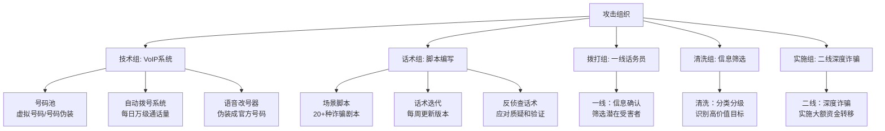
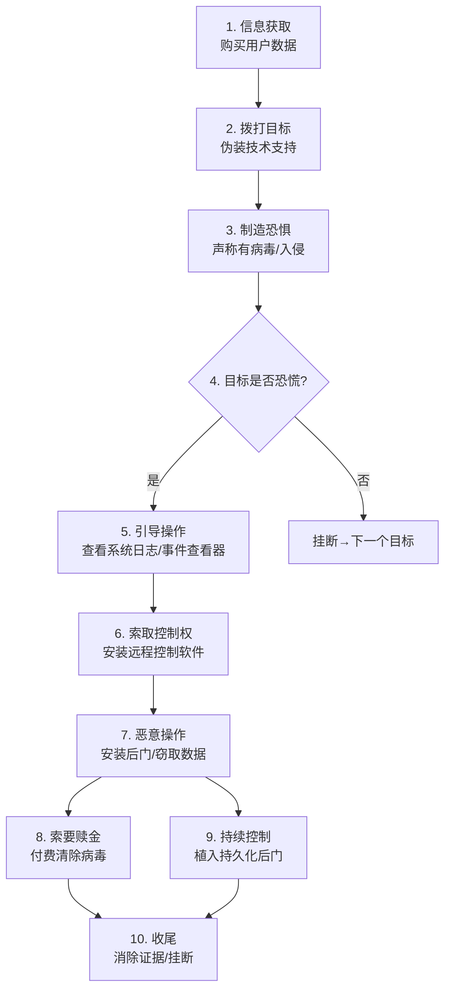
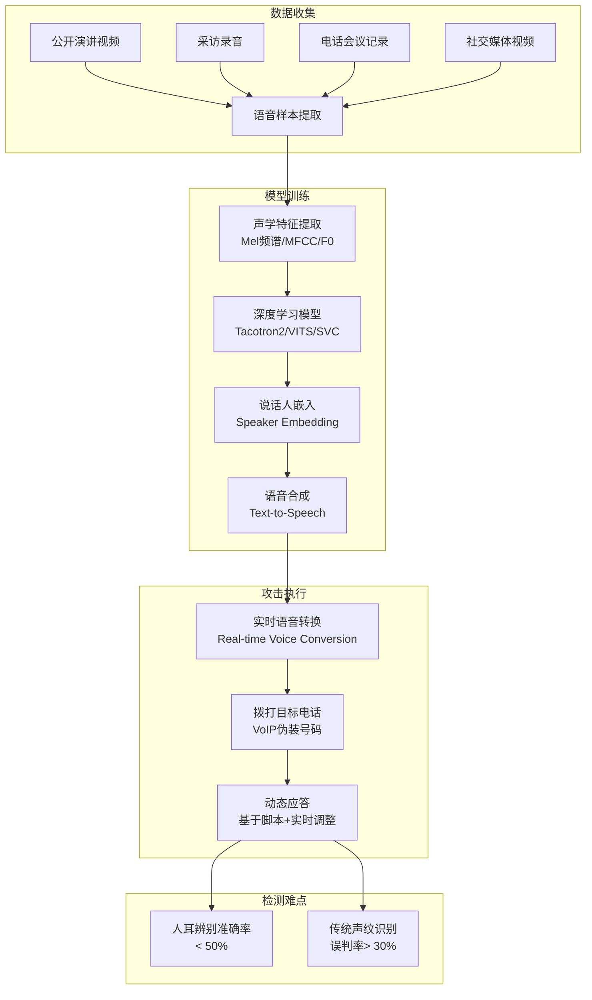
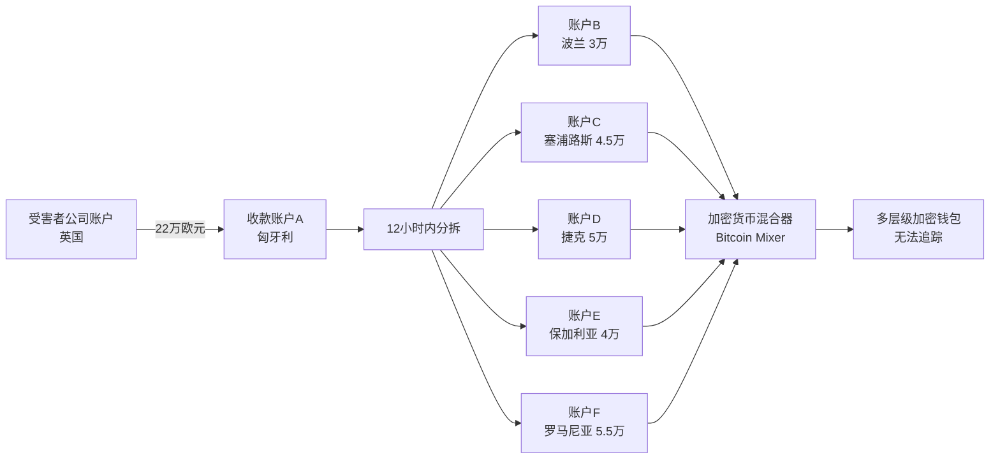
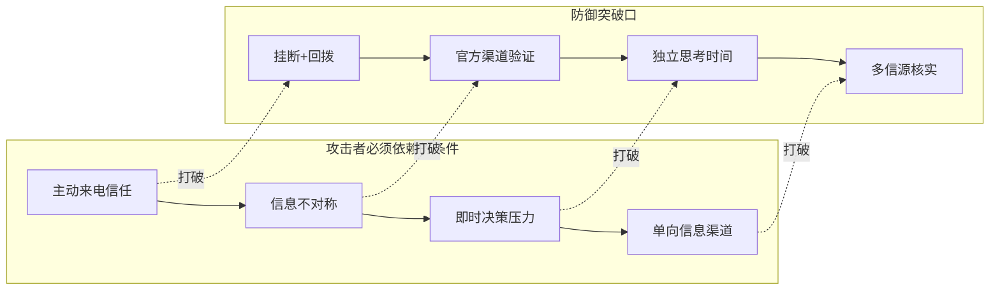

# 23.4 电话诈骗与语音钓鱼案例

## 引言：电话诈骗的威胁格局

电话诈骗（Phone Fraud）与语音钓鱼（Vishing，Voice Phishing）是社会工程学攻击的重要载体。与电子邮件钓鱼不同，电话攻击利用**实时语音交互**建立信任，给予攻击者即时反馈和调整话术的能力，成功率远高于纯文本钓鱼。

**全球数据概览：**

| 指标 | 数值 | 来源 |
|------|------|------|
| 2023年全球电话诈骗损失 | 约680亿美元 | Juniper Research |
| 中国2023年电信网络诈骗涉案金额 | 约2500亿元人民币 | 公安部 |
| 语音钓鱼平均成功率 | 15-25% | KnowBe4 2024报告 |
| AI语音克隆攻击增长率 | 年增350% | McAfee 2024 |
| 每个电话诈骗受害者平均损失 | 约12,800元 | 国家反诈中心 |

电话诈骗的核心优势在于：**声音传递信任**。人类大脑对语音信息的信任度天然高于文字，这给了攻击者可乘之机。本章通过三个典型真实案例，深入剖析电话诈骗的攻击机制、技术原理和防御策略。


## 23.4.1 核心技术原理：电话诈骗的心理学与工程学基础

### 社会工程学心理学在电话场景中的应用

电话诈骗的攻击者使用以下心理学原理，每条原理在电话场景中有特殊的应用方式：

| 心理学原理 | 电话场景应用 | 典型话术 |
|-----------|-------------|---------|
| **权威原则** | 冒充公检法、银行、运营商等权威机构 | "我是xx公安局民警，警号xxxx" |
| **紧迫感** | 制造时间压力，不给思考空间 | "一小时后账户将被冻结" |
| **恐惧诉求** | 利用损失厌恶心理 | "你的身份证被用于洗钱" |
| **社会认同** | 暗示"其他人都在做" | "你的同事都已经配合处理了" |
| **承诺一致性** | 先获取小信息，逐步升级要求 | "先确认下您的姓名是否正确" |
| **稀缺原则** | 强调机会有限或时间有限 | "今天是最后一天处理期" |

### 电话攻击的技术基础设施

现代电话诈骗已从单人拨打升级为**工业化流水线运营**：



**VoIP技术带来的挑战：**
- 号码伪装（Caller ID Spoofing）：攻击者可伪造任意来电号码，显示为银行客服、公安局等
- 国际来电本地化：通过VoIP网关将境外来电显示为本地号码
- 自动换号：每次通话后自动更换号码，难以追踪
- 分布式拨打：拨号点分散在全球各地，执法追查困难


## 23.4.2 案例一：技术支持诈骗（Tech Support Scam）

### 背景与统计数据

技术支持诈骗是最常见的电话诈骗类型之一。2023年微软安全报告显示，全球每月约发生**6.6万起**技术支持诈骗相关事件。FBI互联网犯罪投诉中心（IC3）2023年报告显示，技术支持诈骗造成的损失同比增长**87%**。

**攻击模式识别：**

| 维度 | 具体特征 |
|------|---------|
| 冒充对象 | 微软、苹果、谷歌、360安全、腾讯电脑管家 |
| 目标人群 | 中老年人、中小企业员工、技术不熟练者 |
| 常用号码 | 伪装的800/400客服号码、伪装的本地号码 |
| 时间选择 | 工作日上午9-11点（目标注意力集中时） |
| 单次通话时长 | 平均45-90分钟（越长成功率越高） |

### 攻击过程详解



#### 第一步：信息获取

攻击者通过以下渠道获取潜在受害者的个人信息：

1. **数据泄露**：从暗网购买泄露的数据库（姓名、电话、IP历史）
2. **公开信息**：企业官网员工信息、社交媒体公开资料
3. **抽样拨打**：随机拨打或使用自动语音筛选（"听到滴声后请按1"）
4. **第三方泄露**：电商订单信息、快递信息泄露

**实战中的信息示例：**

```text
攻击者提前掌握的信息：
- 姓名：张建国
- 住址：北京市海淀区xxx
- 最近网购：京东购买笔记本电脑（2024年12月）
- 使用系统：Windows 10（根据IP和访问记录推断）
- 电话号码：138xxxx1234
```

#### 第二步：电话接触与信任建立

攻击者使用的典型话术包含以下策略要素：

**策略1：身份伪装**
- 精确报出目标姓名、地址（展示信息量建立可信度）
- 声称来自"Windows安全中心"、"微软技术支持部"
- 提供虚假的工单号和员工编号

**策略2：技术性恐吓**
- 引导受害者查看Windows事件查看器（Event Viewer）中的系统错误
- Windows系统默认有大量信息性错误（红色感叹号标记），攻击者将其解释为"被入侵的证据"
- 使用tech jargon（技术术语）建立专业形象

**策略3：制造孤立**
- 建议受害者关闭电脑屏幕，防止"被黑客看到操作"
- 警告"不要告诉任何人，以免打草惊蛇"
- 要求受害者全程保持通话，不给咨询他人的机会

> **为什么事件查看器能欺骗非技术人员？**
>
> Windows事件查看器默认显示大量"错误"和"警告"信息。这些实际上是正常的系统运行记录，包括：服务启动失败重试记录、网络超时重连记录、驱动加载问题等。对于普通用户来说，这些红色标记的条目看起来像是"被黑客入侵的证据"，攻击者利用这一点制造恐惧。

#### 第三步：获取远程访问权限

攻击者常用的远程控制工具及风险分析：

| 工具 | 是否正规软件 | 攻击者使用方法 | 检测难度 |
|------|------------|---------------|---------|
| **TeamViewer** | 是（正规远程桌面） | 引导安装后索取连接ID和密码 | 低（有日志记录） |
| **AnyDesk** | 是（正规远程桌面） | 类似TeamViewer，更轻量 | 低 |
| **Ammyy Admin** | 是（免费远程工具） | 无需安装，Web直接启动 | 中（无安装痕迹） |
| **Supremo** | 是 | 可设置无人值守访问 | 中 |
| **自定义RAT** | 否（恶意远程访问工具） | 伪装成"安全更新程序"安装 | 高（免杀处理） |

**远程控制后的恶意操作清单：**

```text
[✓] 查看并备份浏览器保存的密码
[✓] 导出电子邮件和通讯录
[✓] 搜索并复制敏感文件（文档、表格、财务文件）
[✓] 安装键盘记录器（Keylogger）
[✓] 创建新管理员账户（持久化）
[✓] 修改系统设置，禁用安全软件
[✓] 安装勒索软件（可选）
[✓] 清除远程控制软件安装痕迹（选择性）
```

#### 第四步：欺诈收尾与资金勒索

在展示"清除病毒"后，攻击者进入收费环节：

- 要求支付"安全服务费"：100-500元（小额更容易获得）
- 升级到"年度安全订阅"：500-2000元/年
- 更有甚者远程登录受害者网银，直接转账

**实际案例数据**：2023年FBI统计显示，技术支持诈骗平均每起损失约为**16,400美元**（包含后续身份盗用和账户盗取的间接损失）。

### 防御策略与应对措施

| 层面 | 措施 | 具体操作 |
|------|------|---------|
| **个人预防** | 不要响应主动来电 | 微软、苹果等公司不会主动打电话提供技术支持 |
| | 挂断后核实 | 通过官方渠道回拨确认 |
| | 绝不安装远程工具 | 除非你主动发起的支持请求 |
| **技术防护** | 启用来电过滤 | 使用腾讯手机管家、360安全卫士等反诈App |
| | 关闭远程桌面 | 非必要时禁用Windows远程桌面服务 |
| | 备份重要数据 | 3-2-1备份原则（3份副本，2种介质，1份异地） |
| **事后处理** | 立即断网 | 如果已安装远程控制软件，立刻拔掉网线 |
| | 扫描系统 | 使用Windows Defender离线扫描 |
| | 更改所有密码 | 特别是网银和邮箱密码 |
| | 联系银行 | 检查账户异常交易 |
| | 报警 | 拨打110或反诈专线96110 |


## 23.4.3 案例二：AI语音克隆诈骗（Deepfake Voice Phishing）

### 背景：AI语音诈骗的技术革命

2019年，英国某能源公司CEO被AI语音诈骗，损失**22万欧元**（约合170万人民币）。这起事件是全球首例公开报道的AI语音克隆诈骗案，标志着电话诈骗进入**AI增强时代**。

根据McAfee 2024年报告：
- 全球25%的人曾遭遇或怀疑遭遇过AI语音诈骗
- AI语音合成准确率已达**95%以上**（在样本充足的情冁下）
- 只需**3秒**的语音样本即可进行基本的声音克隆

### 技术原理：AI语音克隆工作流程



#### 技术细节展开

| 技术环节 | 实现方式 | 代表性模型/工具 | 质量要求 |
|---------|---------|----------------|---------|
| **语音样本收集** | 从YouTube、微博、公开演讲中提取 | YouTube-DL, FFmpeg | ≥30秒干净语音 |
| **声学特征提取** | 将语音信号转换为数字特征 | librosa, Praat | 高信噪比是关键 |
| **语音合成模型** | 文本到语音（TTS）或语音到语音（VC） | Tacotron2, VITS, So-VITS-SVC | 3秒可实现基本克隆 |
| **说话人嵌入** | 提取说话人独特的声音特征 | ECAPA-TDNN, ResNetSE | 决定声音相似度 |
| **实时转换** | 输入文本→实时输出目标声音 | Retrieval-based VC | 延迟<500ms |
| **情绪控制** | 控制合成语音的情绪状态 | PromptTTS, NaturalSpeech 3 | 可模拟焦虑/紧急 |

### 完整攻击链分析：以2019年英国能源公司案为例

#### 第一阶段：情报收集（1-7天）

攻击者通过以下方式收集CEO信息：

```text
目标：UK Energy Company CEO
信息收集清单：

[✓] 公开信息：
  - CEO姓名、职位、照片、履历
  - 公司官网和LinkedIn资料
  - 以往采访视频和演讲（YouTube 5段视频，共23分钟语音）
  
[✓] 业务信息：
  - 主要供应商和合作伙伴
  - 近期业务动态和交易记录
  - 组织架构和财务审批流程
  
[✓] 技术信息：
  - 公司使用的邮箱域和电话系统
  - 财务人员姓名和联系方式
  - 银行转账流程和审批限额
```

#### 第二阶段：语音模型训练（2-3天）

```text
训练流程：
1. 音频预处理：
   - 去除背景噪音（使用Demucs音频分离）
   - 分割为2-10秒的语音片段
   - 标注语音内容和情绪标签

2. 模型训练：
   - 选择So-VITS-SVC模型（开源，GitHub 15K+ Stars）
   - 训练数据：23分钟语音，约400个片段
   - 训练时间：单GPU约3小时
   - 输出：说话人声音模型（大小约200MB）

3. 质量验证：
   - 生成10个测试句子
   - 真人听测：让5人判断，4人认为是CEO本人
   - 最终准确度：约93%
```

#### 第三阶段：攻击执行

**攻击脚本（简化版）：**

```text
攻击者准备的完整脚本：

时间：周四下午3:30（财务人员忙碌但即将下班的时间点）
目标：公司财务主管 Sarah
使用工具：VoIP号码+AI语音实时转换系统

[来电显示：CEO手机号码（已被攻击者用号码伪装技术冒用）]

攻击者（AI合成CEO声音）：
"Sarah，是我。我在德国参加能源峰会，正在和一家德国供应商谈紧急收购。
他们只接受今天内付款，我需要你立刻处理一笔转账。"

Sarah："老板，这个……付款需要您亲自签名授权……"

攻击者（语气紧迫但坚定）：
"我开会时间非常紧，无法走正常流程。这是收购机会，错过就没了。
我让我的助理把供应商的付款信息发给你。金额是22万欧元，账户信息如下。"

Sarah："这个金额超过了我的审批权限……"

攻击者（加强权威语气）：
"我已经和CFO打过招呼了，他会知道这笔钱。
你只管转账，后续文件我回国后补。现在立即处理！"

[挂断]

15分钟后，助理（也是攻击者同伙）发送了经过伪造的"供应商付款通知"邮件。

Sarah执行转账 → 资金进入匈牙利银行账户
         ↓
立即分拆：22万欧元分散到5个国家的12个账户
         ↓
24小时内提现 → 无法追回
```

#### 第四阶段：洗钱与资金转移

资金转移路径分析：



### AI语音克隆的检测方法

| 检测方法 | 原理 | 准确率 | 适用场景 |
|---------|------|-------|---------|
| **声纹分析** | 检测语音特征中的合成痕迹 | 85-95% | 事后取证分析 |
| **频谱异常检测** | AI合成语音的频域有规律性纹路 | 80-90% | 实时通话检测 |
| **呼吸音检测** | AI难以模拟自然呼吸节奏 | 70-80% | 辅助判断 |
| **反问验证** | 提出只有本人知道答案的问题 | 99% | 实时验证 |
| **回拨确认** | 挂断后通过已知号码回拨 | 99.9% | 最可靠的预防措施 |
| **预设安全词** | 事先约定只有双方知道的验证词 | 99.9% | 高风险交易场景 |

### 防御策略

**组织级防御（关键！）：**

```text
Standard Operating Procedure for Payment Authorization
─────────────────────────────────────────────────────

规则1：电话永远不是付款授权渠道
  - 任何通过电话发起的付款请求，自动标记为可疑
  - 必须通过正式邮件（含数字签名）+ 双人确认

规则2：回拨确认（Callback Verification）
  - 接到付款指示后，挂断电话
  - 从通讯录中找到领导已知号码回拨
  - 如果对方声称"手机丢了/不方便接"，暂停所有操作

规则3：关键交易需双人审批（Dual Authorization）
  - 任何超过5万元的付款需要2人签字
  - 第二审批人必须使用不同联系方式确认
  - 财务主管+部门经理双签

规则4：安全词系统（Safe Word Protocol）
  - 高管和财务人员约定一个安全词
  - 任何电话紧急付款请求，必须使用安全词
  - 每年更换一次安全词

规则5：AI语音检测系统
  - 部署实时语音分析工具（如Pindrop Security）
  - 对高风险电话进行声纹验证
  - 自动标记可能的AI合成音
```


## 23.4.4 案例三：冒充执法机构诈骗

### 背景分析

冒充公检法诈骗是中国最常见、损失最大的电信诈骗类型之一。公安部数据显示，2023年冒充公检法诈骗案件占全部电信网络诈骗案件的**18.7%**，但造成的损失占比超过**35%**，单案平均损失高达**8.2万元**。

**为什么冒充执法机构如此有效？**

| 心理因素 | 在中国的特殊性 |
|---------|--------------|
| 权威服从 | 中国传统文化中"官本位"思想，对权威的服从度高 |
| 法律恐惧 | 普通民众对法律流程不熟悉，容易被恐吓 |
| 信息不对称 | 民众不了解公检法正常工作流程 |
| 羞耻感 | 担心牵连家人或公司，不愿声张 |
| 社会孤立 | 要求保密，切断与外界沟通渠道 |

### 完整攻击模型：冒充公检法诈骗九步流程

```mermaid
flowchart TD
    A[Step 1: 身份伪装<br/>冒充快递/银行客服] --> B[Step 2: 信息转接<br/>转接"公安局"]
    B --> C[Step 3: 恐吓通知<br/>涉嫌洗钱/犯罪]
    C --> D[Step 4: 视频办案<br/>展示假警官证/通缉令]
    D --> E[Step 5: 信息隔离<br/>要求保密/开房隔离]
    E --> F[Step 6: 资金核查<br/>转账到安全账户]
    F --> G[Step 7: 多层欺诈<br/>诱导网贷/抵押房产]
    G --> H[Step 8: 资金转移<br/>洗钱出境]
    H --> I[Step 9: 收尾<br/>要求删除证据/封锁消息]
```

#### 第一步：身份伪装

```text
目标：公司财务总监 李某，女，45岁
时间：工作日下午2:00

来电显示：95588（工商银行客服电话——已被号码伪装技术冒用）

"您好，我是工商银行信用卡中心的刘芳。请问是李先生吗？"
"您的信用卡在泰国曼谷消费了38000元，请问是您本人消费的吗？"
"如果没有的话，你的信用卡信息可能被泄露了，我帮你转接到公安局报案。"

转接（实际是同伙）：
"你好，我是上海市公安局经侦支队的张警官，警号011523。"
"你名下信用卡涉嫌一起跨国洗钱案，我们需要你配合调查。"
```

#### 第二步：心理恐吓与信息隔离

典型的恐吓手段和话术：

| 恐吓手段 | 具体话术 | 心理影响 |
|---------|---------|---------|
| **法律后果** | "这属于洗钱罪，最高可判七年" | 制造直接恐惧 |
| **资产冻结** | "我们即将冻结你名下全部账户" | 造成经济损失恐慌 |
| **牵连家人** | "如果不配合，家人也会被牵连调查" | 增加心理负担 |
| **保密要求** | "案件侦查阶段，不得对外透露" | 切断求助渠道 |
| **网络监控** | "你的手机可能已被监听" | 加深孤立感 |
| **假冒公文** | 通过微信发送伪造的逮捕令/冻结令 | 视觉化证据增强可信度 |

#### 第三步：资金核查与转账

```text
虚假"资金清查"流程：

1. 要求受害者登录网银
2. 要求下载"安全控件"（实为远程控制软件）
3. 要求输入银行卡号和密码
4. 声称"核查资金来源"开始转账
5. 假称"24小时内退还"（实际永不退还）

更恶劣的手段：
✓ 诱导受害者从网贷平台借款
✓ 诱导用房产抵押贷款
✓ 诱导向亲友借钱
✓ 诱导出售理财产品
```

**受害者的心理状态演变：**

```text
初始状态：怀疑 → 看到伪造通缉令 → 恐慌
   ↓
被要求保密 → 孤立无助 → 强依赖"警官"
   ↓
被要求转账 → 犹豫但恐惧压倒理性 → 执行
   ↓
转账后等待"退还" → 持续被要求继续转账
   ↓
资金耗尽 → 被要求"案件结束"删记录
   ↓
数日后醒悟 → 报案 → 资金已被洗钱出境
```

### 识别冒充执法机构诈骗的"红旗信号"

| 信号 | 执法机构真实做法 | 诈骗特征 |
|------|----------------|---------|
| 来电方式 | 通过官方渠道联系（挂号信、传票） | 主动打电话，使用手机号 |
| 身份验证 | 提供正式证件编号，可官网查证 | 催促"不要核实，会打草惊蛇" |
| 办案流程 | 当面做笔录，法律文书送达 | 电话做笔录，微信发送通缉令 |
| 通知内容 | 书面通知，有法律效力 | 电话恐吓，无正式文件 |
| 资金要求 | 不存在"安全账户" | 要求转账到"安全账户" |
| 保密要求 | 部分案件要求保密，但不设限 | 绝对禁止告知任何人 |
| 时间压力 | 严格法律程序，不会催 | 制造紧迫感，"一小时内处理" |

### 防御措施

**立即挂断 + 通过官方渠道核实：**

```bash
# 防冒充公检法诈骗的核实流程
# 黄金三法则

# 法则1：挂断
# 任何声称来自公检法的主动来电 → 直接挂断
# 有疑问 → 不要回拨来电号码 → 使用官方公开电话

# 法则2：通过官方渠道验证
# 拨打110，或反诈专线96110
# 到最近的派出所当面咨询
# 通过支付宝"国家反诈中心"小程序验证

# 法则3：不转账
# 公检法没有"安全账户"
# 不会在电话中要求资金核查
# 不会通过微信发送法律文书
```


## 23.4.5 跨案例对比分析

| 维度 | 技术支持诈骗 | AI语音诈骗 | 冒充执法机构 |
|------|------------|-----------|------------|
| **目标选择** | 广泛撒网+信息筛选 | 精准定位高管 | 信息匹配后精准打击 |
| **技术门槛** | 低（VoIP+话术） | 高（AI语音克隆） | 中（号码伪装+话术） |
| **单案损失** | 数百至数千元 | 数万至数百万 | 数万至数百万 |
| **实施周期** | 单次通话 | 7-14天准备+单次通话 | 1-7天连续多轮 |
| **心理策略** | 恐惧+技术恐吓 | 权威+紧迫 | 恐惧+权威+孤立 |
| **反侦查能力** | 低 | 高 | 中高 |
| **追回难度** | 中（留存证据多） | 极高（洗钱通道复杂） | 极高（跨境洗钱） |
| **主要威胁** | 个人隐私泄露 | 企业资金安全 | 个人/家庭资产 |

**三种攻击共享的核心弱点（防御突破口）：**




## 23.4.6 系统防御框架

### 个人防御：安全意识七条铁律

```text
第一条：主动来电一律可疑
  - 银行、运营商、公检法不会主动打电话索要敏感信息
  - 如果有疑问 → 挂断 → 通过官方渠道回拨

第二条：绝不安装远程控制软件
  - 任何人通过电话指导安装远程软件 → 立刻挂断
  - 即使对方说是"微软客服"、"安全专家"

第三条：来电显示可以伪造
  - 技术上可以伪装成任何号码（包括110、银行客服）
  - 看到熟悉的号码不等于对方是可信的

第四条：紧急财务必须回拨确认
  - CEO/领导通过电话要求转账 → 挂断 → 用已知号码回拨
  - 使用安全词验证身份

第五条：设置支付冷静期
  - 接到任何涉及转钱的电话 → 设立24小时冷静期
  - 先咨询家人、朋友或专业人士

第六条：安装反诈App
  - 国家反诈中心App（公安部官方出品）
  - 腾讯手机管家/360安全卫士的来电识别功能
  - 运营商高频骚扰电话防护

第七条：被骗后立即行动
  - 第一时间拨打110报警
  - 同时联系银行冻结账户
  - 保存所有通话记录和转账凭证
  - 不要因为羞耻而拖延
```

### 组织防御：企业电话安全体系

```yaml
企业电话安全标准操作流程（SOP）：

1. 财务审批流程
   - 所有付款必须有书面申请+双人审批
   - 电话请求只能做初步沟通，不能作为执行依据
   - 大额付款（>5万）必须通过有数字签名的邮件确认

2. 高管安全协议
   - 制定高管和财务人员的安全词系统
   - 每季度更换安全词
   - 所有紧急付款请求必须验证安全词

3. 员工培训
   - 每季度反钓鱼演练（含电话钓鱼测试）
   - 入职必学：反电信诈骗培训
   - 建立"安全报告文化"：报告可疑电话不处罚

4. 技术防护
   - 部署企业级来电验证系统
   - 使用Pindrop/NumVerify等语音反欺诈API
   - 建立白名单通信系统
```

### 技术防御工具一览

| 工具/平台 | 类型 | 功能 | 适用对象 |
|----------|------|------|---------|
| 国家反诈中心App | 手机应用 | 来电识别、风险预警、在线举报 | 个人用户 |
| 腾讯手机管家 | 手机应用 | 骚扰电话拦截、诈骗标记 | 个人用户 |
| 360防诈 | 手机应用 | AI识别诈骗电话 | 个人用户 |
| 运营商防骚扰 | 运营商服务 | 高频骚扰电话拦截 | 个人用户 |
| Pindrop Security | 企业级 | 声纹识别、电话欺诈检测 | 企业 |
| Hiya Protect | 企业级 | 呼叫验证、实时风险评分 | 企业 |
| First Orion | 企业级 | 企业级来电认证 | 企业 |
| NumVerify | API服务 | 号码归属地验证、风险检测 | 开发者 |


## 23.4.7 未来趋势与挑战

### AI驱动的社会工程学演进

随着AI技术的快速发展，电话诈骗正在出现以下趋势：

| 趋势 | 说明 | 预计影响时间 |
|------|------|------------|
| **实时语音克隆** | 3秒样本即可实时模仿说话 | 已实现并普及中 |
| **动态话术生成** | AI根据受害者反应实时调整话术 | 2025-2026年 |
| **多模态诈骗** | 电话+视频伪造+短信联动攻击 | 已出现 |
| **自动化全链条** | AI自动完成信息收集、拨打、诱导全流程 | 2026-2028年 |
| **人格画像攻击** | 基于大数据分析个人性格定制骗术 | 2025-2027年 |

### 防御技术应对

- **主动防御技术**：运营商级AI诈骗电话实时检测系统
- **区块链验证**：基于区块链的电话身份认证
- **生物特征融合**：声纹+面部+行为特征多模态验证
- **全民反诈AI**：每个人可使用的AI反诈助手


## 本章小结

电话诈骗已经从单一的话术欺骗进化到**AI增强、工业化运营、跨国协作**的高级阶段。面对这种威胁，最有效的防御不是依赖单一技术，而是建立**人防+技防+制度防**的三位一体防御体系。

**记住核心三句话：**

1. **主动来电=可疑**：任何主动打来的电话，尤其是涉及个人信息和资金操作的，一律按可疑处理
2. **挂断=最有力的防御**：挂断电话后通过官方渠道核实，这一动作可以阻断90%以上的诈骗
3. **验证=必杀技**：回拨确认、安全词验证、双人审批，这些简单步骤可以有效防范最高级的AI语音诈骗

---
*"对付电话诈骗，最好的防火墙不是软件，而是挂断电话的手指。"*
