## 本节小结

本章通过15个实战案例，系统揭示了社会工程学攻击的五大攻击向量及其内在逻辑。从数字化攻击（BEC、鱼叉式钓鱼、高级钓鱼）到物理渗透和语音诈骗，攻击者的手法虽然在不断演进，但底层心理学原理始终如一。本节将对所有案例进行横向对比、纵深分析，提炼出可操作的防御框架。

### 攻击全景回顾

#### 五大攻击向量总览

| 攻击向量 | 案例数 | 攻击复杂度 | 技术要求 | 心理操纵核心 | 典型损失范围 |
|---------|-------|-----------|---------|------------|-----------|
| BEC（商业电子邮件诈骗） | 3 | 中 | 中（域名注册+邮件服务器） | 权威服从+紧迫感 | $85万-$1200万 |
| 鱼叉式钓鱼 | 3 | 高 | 高（恶意文档+C2基础设施） | 个性化诱饵+信任建立 | 数据泄露+持久控制 |
| 物理社会工程学 | 3 | 高 | 中（道具+话术+开锁工具） | 角色扮演+自然化行为 | 物理访问+设备植入 |
| 电话诈骗/语音钓鱼 | 3 | 中 | 中高（AI语音克隆） | 权威恐慌+技术支持 | €22万-$50万 |
| 高级钓鱼（OAuth/QR/社交） | 3 | 很高 | 高（OAuth协议利用+应用开发） | 授权惯性+折扣诱惑 | 凭据泄露+账户劫持 |

#### 五大攻击向量的内在关联

社会工程学的五种攻击向量并非孤立存在，实战中攻击者往往交叉使用，形成复合攻击链：

```mermaid
graph TD
    A["信息收集<br/>OSINT阶段"] --> B{"选择攻击向量"}
    B --> C["BEC攻击<br/>邮件伪造+权威身份"]
    B --> D["鱼叉式钓鱼<br/>个性化恶意文档"]
    B --> E["物理渗透<br/>尾随+角色伪装"]
    B --> F["电话诈骗<br/>AI语音+技术支持"]
    B --> G["高级钓鱼<br/>OAuth+QR+社交"]
    
    C --> H["资金转移"]
    D --> I["持久控制"]
    E --> J["物理数据窃取"]
    F --> H
    G --> K["账户接管"]
    
    H --> L["<b>最终目标</b><br/>经济利益/情报窃取"]
    I --> L
    J --> L
    K --> L

    style A fill:#1a1a2e,stroke:#e94560
    style L fill:#16213e,stroke:#0f3460
```



**关键洞察**：所有攻击向量的第一步都是**信息收集（OSINT）**。无论是BEC攻击中研究CEO的沟通风格，还是物理渗透中观察安保人员的换班规律，抑或是AI语音诈骗中收集演讲录音——没有充分的侦察，社会工程学攻击的成功率将大幅下降。

### 核心心理学原理深度分析

通过对15个案例的归纳，攻击者利用的心理杠杆可分为以下六大类：

#### 权威原理（Authority）

**定义**：人们倾向于服从权威人物或机构的要求，即使这些要求本身不合理。

**案例映射**：
- **23.1.1 CEO欺诈**：冒充CEO的财务指令，利用组织层级中的权威差异
- **23.4.1 技术支持诈骗**：冒充微软官方，利用技术权威
- **23.4.3 冒充执法机构**：冒充税务局，利用国家权力机构权威

**为什么有效**：斯坦福大学心理学教授斯坦利·米尔格拉姆（Stanley Milgram）1961年的实验证明，65%的普通人在权威指令下会实施他们认为有害的行为。在企业环境中，对上级指令的无条件服从是社会工程学攻击最常用的突破口。

**防御对策**：建立"双重确认"机制——任何来自权威角色的紧急指令必须通过独立的通信渠道再次验证。

#### 紧迫原理（Urgency）

**定义**：限制决策时间，迫使目标在缺乏充分思考的情况下做出决定。

**案例映射**：
- **23.1.3 律师诈骗**："今天下班前必须付款"
- **23.4.2 AI语音诈骗**："立即付款，否则谈判失败"
- **23.5.2 二维码钓鱼**：停车缴费的即时场景

**为什么有效**：神经科学研究表明，时间压力会抑制前额叶皮层的理性决策功能，激活杏仁核的应激反应。人在紧急状态下的判断力下降约40%-60%。

**防御对策**：设立"冷静期"机制——任何涉及资金转移或权限变更的请求，即使紧急，也需强制等待至少30分钟以验证真伪。

#### 互惠原理（Reciprocity）

**定义**：人们倾向于回报他人给予的好处或帮助。

**案例映射**：
- **23.2.2 猎头钓鱼**：提供高薪职位信息
- **23.5.3 LinkedIn钓鱼**：先建立社交关系再发送恶意附件
- **23.3.3 USB投放**：提供"有价值"的U盘内容

**为什么有效**：罗伯特·西奥迪尼（Robert Cialdini）在《影响力》中指出，互惠原则是人类社会协作的基础机制。即使对方提供的是无形的帮助或信息，接受者也会产生回报的心理压力。

**防御对策**：对来自陌生人的任何"馈赠"（包括信息、文件、设备）保持怀疑，建立独立验证流程。

#### 承诺一致性原理（Commitment & Consistency）

**定义**：人们倾向于保持与自己先前行为或承诺一致的行动。

**案例映射**：
- **23.2.1 APT28攻击**：先建立学术合作关系
- **23.3.1 物理渗透**：先打电话确认再进入（制造"已预约"的心理暗示）
- **23.5.1 OAuth钓鱼**：用户在已有Google账号前提下更容易点击"授权"

**为什么有效**：人们在公开做出承诺后，为了维护自我形象的一致性，会倾向于做出符合该承诺的行为，即使该行为本身存在风险。

**防御对策**：警惕任何"逐步升级"的请求——从小请求到大要求的过渡是社会工程学的经典手法。

#### 喜好原理（Liking）

**定义**：人们更容易答应自己喜欢或相似的人的请求。

**案例映射**：
- **23.2.2 猎头钓鱼**：利用技术工程师对技术社区的认同
- **23.5.3 LinkedIn钓鱼**：先建立行业话题共鸣
- **23.3.1 物理渗透**：穿着与员工相同的制服和风格

**为什么有效**：相似性、赞美和熟悉感会快速建立信任。攻击者常用的策略是研究目标的兴趣领域，在初次接触时展示"共同点"。

**防御对策**：对快速建立的信任关系保持警惕，特别是当对方提出敏感请求时。

#### 社会认同原理（Social Proof）

**定义**：在不确定情况下，人们会参考他人的行为来决定自己的行动。

**案例映射**：
- **23.3.3 USB投放**：当看到同事也使用类似的U盘时，降低警惕
- **23.2.3 COVID-19钓鱼**："大家都在收到类似通知"的心理暗示
- **23.3.1 尾随进入**：当看到前面的员工直接进入时，安保人员降低检查级别

**为什么有效**：Urie Bronfenbrenner的社会生态系统理论指出，群体行为对个体有强烈的规范性影响。当目标观察到"其他人也在做"时，自我防护的警惕性显著下降。

**防御对策**：建立不依赖社会认同的标准化安全流程，安全策略不因"大家都在做"而例外。

### 攻击技术演进图谱

#### 从简单到复杂的攻击链演变

```mermaid
graph LR
    subgraph "2015-2018 简单时代"
    A1["批量广撒网<br/>· 大量发送<br/>· 低个性化<br/>· 易识别"]
    end
    
    subgraph "2019-2021 精准时代"
    A2["鱼叉式钓鱼<br/>· OSINT驱动<br/>· 高度个性化<br/>· 绕过基础防御"]
    end
    
    subgraph "2022-2025 智能化时代"
    A3["AI增强攻击<br/>· 深度伪造语音/视频<br/>· 自动个性化<br/>· 绕过MFA"]
    end

    A1 --> A2 --> A3

    style A1 fill:#2d3436,stroke:#636e72
    style A2 fill:#2c3e50,stroke:#3498db
    style A3 fill:#1a1a2e,stroke:#e94560
```



**演变趋势**：
1. **个性化程度提升**：从群发模板到每封邮件单独定制
2. **技术壁垒降低**：AI工具降低了语音克隆、深度伪造的技术门槛
3. **攻击链延长**：从一次性攻击转向多阶段、跨向量的复合攻击
4. **防御绕过能力增强**：OAuth钓鱼、MFA绕过等技术持续演进
5. **自动化程度提高**：AI驱动的自动化钓鱼工具可实现大规模精准攻击

#### 各类攻击的TTP对比（基于MITRE ATT&CK框架）

| MITRE ATT&CK技术ID | 技术名称 | BEC | 鱼叉式钓鱼 | 物理渗透 | 电话诈骗 | 高级钓鱼 |
|-------------------|---------|:---:|:---------:|:-------:|:-------:|:-------:|
| T1566.001 | 鱼叉式钓鱼附件 | ✓ | ✓ | | | ✓ |
| T1566.002 | 鱼叉式钓鱼链接 | | ✓ | | | ✓ |
| T1566.003 | 鱼叉式钓鱼服务 | | | | ✓ | ✓ |
| T1598 | 钓鱼信息收集 | ✓ | ✓ | ✓ | ✓ | ✓ |
| T1204 | 用户执行 | ✓ | ✓ | ✓ | ✓ | ✓ |
| T1059 | 命令/脚本执行 | | ✓ | | | |
| T1071 | 应用层协议通信 | | ✓ | | | ✓ |
| T1525 | 物理突破 | | | ✓ | | |
| T1556 | 认证机制修改 | | | | | ✓ |
| T1534 | 内部横向移动 | | ✓ | ✓ | | |

### 防御框架：纵深防御体系

基于15个案例的共性弱点，本框架将防御措施划分为五个层次：

#### 第一层：技术防御（Technical Controls）

**邮件安全**：
- 部署DMARC策略（SPF + DKIM + DMARC），阻止域名欺骗
- 实施邮件链接重写和URL沙箱分析
- 大附件和行为分析（AI检测异常邮件模式）

**示例部署**：
```bash
# DMARC DNS记录示例（TXT记录）
_dmarc.company.com TXT "v=DMARC1; p=reject; rua=mailto:dmarc@company.com; pct=100"

# SPF DNS记录示例
company.com TXT "v=spf1 include:_spf.google.com ~all"
```

**网络访问控制**：
- 实施零信任网络架构（ZTNA）
- 物理访问控制：门禁、CCTV、访客管理系统
- 设备控制：禁止自动运行USB设备（组策略配置）

```powershell
# Windows组策略禁用USB自动运行
Set-ItemProperty -Path "HKLM:\SOFTWARE\Microsoft\Windows\CurrentVersion\Policies\Explorer" `
    -Name "NoDriveTypeAutoRun" -Value 255
```

**身份与访问管理**：
- 多因素认证（MFA）全覆盖
- 条件访问策略（基于位置、设备、风险的动态访问控制）
- OAuth应用审计和授权管理

#### 第二层：流程防御（Process Controls）

**资金转移管控**：
- 双人审批制度：任何超过阈值的转账需两人独立确认
- 电话回拨验证：使用已知号码（而非来电显示号码）回拨确认
- 转账金额梯度审批：不同金额级别对应不同审批层级

**访客管理流程**：
```text
1. 预约：访客必须提前预约并登记
2. 验证到访：前台联系被访人确认
3. 身份核查：查验身份证件+拍照记录
4. 临时凭证：发放临时工牌（注明"访客"字样）
5. 全程陪同：访客必须由员工全程陪同
6. 离开登记：归还临时凭证并登记离开时间
```

**应急响应流程**：
- 安全事件报告机制（15分钟内上报）
- 资金冻结SOP（与银行建立快速通道）
- 取证和保留证据（邮件镜像、日志捕获）

#### 第三层：人员防御（Human Controls）

**安全意识培训体系**：

| 培训模块 | 频率 | 覆盖范围 | 考核方式 |
|---------|------|---------|---------|
| 钓鱼邮件识别 | 每月 | 全员 | 模拟钓鱼测试 |
| BEC防御专项 | 每季度 | 财务/高管 | 情景模拟 |
| 物理安全意识 | 每半年 | 全员 | 现场测试 |
| 电话钓鱼识别 | 每季度 | 客服/财务 | 随机抽查 |
| 高级钓鱼专题 | 每年 | IT/安全团队 | 实战演练 |

**模拟测试计划**：
```plaintext
年度模拟测试方案：
- 频率：每月1次（全年12次）
- 类型覆盖：
  · 钓鱼邮件（6次）
  · USB投放（2次）
  · 电话模拟（2次）
  · 物理尾随（1次）
  · 社交媒体（1次）
- 考核指标：
  · 点击率（目标：<5%）
  · 报告率（目标：>90%）
  · 重复违规下降率（目标：>50%）
```

#### 第四层：应急防御（Incident Response）

**事件响应矩阵**：

| 事件类型 | 发现时间 | 响应窗口 | 关键行动 | 升级路径 |
|---------|---------|---------|---------|---------|
| BEC资金转账 | 30分钟内 | 2小时 | 联系银行+冻结账户 | CISO+法务 |
| 钓鱼成功点击 | 1小时内 | 4小时 | 隔离设备+轮换凭据 | SOC+IT |
| 物理入侵 | 即时 | 30分钟 | 封锁区域+调取监控 | 安全主管+HR |
| 电话诈骗 | 通话结束后 | 1小时 | 检查账户+更改密码 | 财务总监 |

#### 第五层：持续改进（Continuous Improvement）

**安全度量体系**：
1. **衡量指标**：
   - 模拟钓鱼点击率（月度趋势）
   - 安全事件报告率（月度）
   - 平均响应时间（按事件类型）
   - 员工安全培训完成率

2. **改进循环**（PDCA）：
   - **Plan**：基于风险评估和安全度量制定改进计划
   - **Do**：实施技术升级、流程优化、培训更新
   - **Check**：通过模拟测试和审计验证效果
   - **Act**：调整策略、修订制度、更新培训内容

### 常见误区与纠正

#### 误区一：技术足够强大就无需担心社会工程学

**错误认知**："我们部署了下一代防火墙、EDR和SIEM，社会工程学攻击对我们无效。"

**纠正**：社会工程学攻击绕过了所有技术控制，直接攻击人类这个最薄弱的环节。案例23.5.1中OAuth钓鱼绕过了多因素认证——攻击者根本不需要破解密码。技术防御必须与人员培训、流程控制形成互补，而非替代关系。

#### 误区二：只有高管才会成为目标

**错误认知**："社会工程学攻击只针对CEO、CFO等高管。"

**纠正**：从案例23.2.2（研发工程师）、案例23.4.1（普通员工）到案例23.5.3（HR经理），攻击目标涵盖了组织中的所有层级。攻击者选择目标的标准是**可达性**（Access）而非权威性——谁能访问有价值的数据或执行敏感操作，谁就是潜在目标。

#### 误区三：安全意识培训一次就够了

**错误认知**："员工入职时参加过安全意识培训，已经足够了。"

**纠正**：社会工程学攻击手法不断演进。案例23.3.3的USB投放测试显示，培训后6个月员工的警惕性会显著下降。有效的安全培训必须**持续进行**、**与时俱进**、**实战检验**。

#### 误区四：我们的组织太小，不会被盯上

**错误认知**："黑客只针对大公司，中小企业不会成为目标。"

**纠正**：案例23.1.2（发票欺诈供应链攻击）显示，中小企业往往是攻击大企业的跳板。而且自动化工具的普及让"广撒网"式攻击的成本极低，任何组织都可能成为目标。

### 进阶阅读与工具推荐

#### 权威框架

| 框架 | 适用场景 | 核心内容 | 获取方式 |
|-----|---------|---------|---------|
| **MITRE ATT&CK** | 战术技术映射 | 企业攻击链分析 | attack.mitre.org |
| **NIST SP 800-61** | 事件响应 | 计算机安全事件处理指南 | csrc.nist.gov |
| **ISO 27001 A.7** | 人员安全管理 | 雇佣前/中/后安全控制 | iso.org |
| **CIS Control 17** | 员工培训 | 安全意识与技能培训 | cisecurity.org |

#### 实战工具

| 工具名称 | 用途 | 类型 | 开源/商业 |
|---------|-----|------|---------|
| **Gophish** | 模拟钓鱼测试平台 | 自动化测试 | 开源 |
| **SET (Social Engineering Toolkit)** | 社会工程学攻击模拟 | 攻击模拟 | 开源 |
| **Modlishka** | 反向代理钓鱼框架 | 高级钓鱼测试 | 开源 |
| **King Phisher** | 钓鱼培训模拟 | 培训测试 | 开源 |
| **Evilginx2** | 中间人攻击框架 | MFA绕过测试 | 开源 |
| **KnowBe4** | 商业安全意识培训 | 培训+测试 | 商业 |

#### 深度资源

**经典著作**：
- 《影响力》（Robert Cialdini）—— 社会工程学的心理学基础圣经
- 《社会工程：安全体系中的人性弱点》（Christopher Hadnagy）—— 社会工程学实战指南
- 《欺骗的艺术》（Kevin Mitnick）—— 传奇黑客的社会工程学实践手册
- 《The Social Engineer's Playbook》（Jeremiah Talamantes）—— 社会工程学操作手册

**研究机构**：
- **SANS Institute**：社会工程学年度报告
- **Verizon Data Breach Investigations Report (DBIR)**：每年发布的社会工程学攻击统计
- **PhishLabs**：实时钓鱼威胁情报
- **Proofpoint Human Factor Report**：人员安全风险年度分析

### 总结

社会工程学攻击的本质是利用人类心理弱点和认知偏误来获取未经授权的访问权限。本章的15个案例清晰地展示了一个不可回避的事实：**无论技术防御多么完善，只要系统中存在人类这个环节，社会工程学攻击就永远存在攻击面**。

然而，这并不意味着我们无能为力。通过系统性的防御框架——结合**技术控制**（DMARC、零信任、MFA）、**流程控制**（双人审批、访客管理）、**人员培训**（持续安全意识教育）和**应急响应**（快速检测和处置）——我们可以将社会工程学攻击的风险降至可接受的水平。

**关键结论**：

1. **信息收集是所有社会工程学攻击的起点**，保护公开信息同样重要
2. **没有任何一种防御措施是万能的**，纵深防御不可替代
3. **人是安全链中最薄弱的环节，也是最需要强化的环节**
4. **安全意识不是一次性工作**，而是需要持续投入的长期工程
5. **从攻击者视角审视自身防御**，定期进行渗透测试和模拟演练

正如Kevin Mitnick在《欺骗的艺术》中所说："组织花费数百万美元购买防火墙、入侵检测系统和加密设备，却忽略了最脆弱的环节——那个坐在键盘后面的人。" **只有将技术、流程和人三者有机结合，构建全链条的防御体系，才能真正抵御社会工程学的威胁。**

> **行动建议**：读完本章后，请立即执行以下三个步骤——
> 1. 检查你所在组织的DMARC记录是否已配置
> 2. 确认资金转账是否需要双人审批
> 3. 安排本月的模拟钓鱼测试
>
> **这是抵御社会工程学攻击的第一步，也是最关键的一步。**