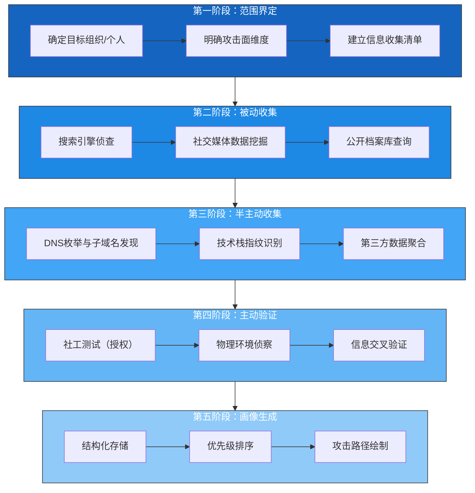

# 第23章 核心技巧一：信息收集与目标分析

## 本章导读

信息收集是社会工程学攻击的 **地基工程**。没有高质量的目标画像，后续的诱导、伪装、渗透都将沦为盲人摸象。据统计，Social-Engineer.org 的渗透测试报告中，**78% 的成功攻击在信息收集阶段投入了超过 60% 的总准备时间**——这一数据恰恰说明了本环节的决定性地位。

本章将按照"道→法→术→器"的递进逻辑，带你从原理到实操掌握以下内容：

| 层级 | 内容 | 读者收益 |
|------|------|---------|
| **道（理论）** | OSINT 方法论、信息论基础、认知偏差 | 理解"为什么这样做" |
| **法（方法）** | 五步信息收集框架、钻石模型 | 掌握系统化的操作流程 |
| **术（实操）** | 75+ 条具体命令和技巧 | 拿到就能用 |
| **器（工具）** | 15+ 工具的使用时机与组合策略 | 建立自己的工具箱 |
| **进阶** | 反侦察、自动化pipeline、法律红线 | 进阶者的深度内容 |

---

## 一、道：信息收集的理论基础

### 1.1 为什么信息收集能决定攻击成败？

社会工程学的本质是 **利用信息不对称进行心理操纵**。攻击者掌握的目标信息越多，就越能精准预测目标的行为模式，从而设计出无法拒绝的诱导场景。

**信息不对称的威力示例：**

| 掌握信息量 | 攻击手段 | 成功率估计 |
|-----------|---------|-----------|
| 仅知道公司名称 | 群发钓鱼邮件 | 0.1%~1% |
| 知道目标姓名+职位 | 定向钓鱼（Spear Phishing） | 5%~15% |
| 知道最近项目+合作方 | 量身定制的诱导电话 | 20%~40% |
| 知道个人习惯+社交关系 | 深度伪装面对面接触 | 50%~70% |

### 1.2 开源情报（OSINT）的三大原理

#### 原理一：信息碎片化定律

任何组织或个人的信息在互联网上必然以碎片形式散落在多个平台。单个碎片可能无害，但 **组合后的信息量呈指数级增长**。这就是 OSINT 能够有效运转的根本前提——**没有人能在所有平台上做到零泄露**。

> **经典案例**：2015年，安全研究人员通过组合 LinkedIn（职位）、Twitter（吐槽公司IT系统）、Shodan（扫描结果）和 GitHub（意外提交的配置文件）四条线索，在 48 小时内成功还原了一家 Fortune 500 公司的完整内网拓扑图。

#### 原理二：数字足迹的不可逆性

一个人发布的每条内容、填写的每个表单、关联的每个账号，都会在互联网上留下 **半永久性痕迹**。即使删除了原内容，缓存的副本、他人的截图、第三方爬虫的存档依然存在。Wayback Machine 和 Google Cache 可以找回数年前被删除的页面。

#### 原理三：汇聚验证法则

单一来源的信息不可信，但 **三个以上独立来源的交叉验证** 可以大幅提升情报可信度。例如：
- LinkedIn 上的职位信息 → 微信朋友圈的参会照片 → 公司官网团队页面
- 三者匹配 → 高度可信
- 只有 LinkedIn 一条 → 可能过时或虚假

### 1.3 信息收集的法律红线（必读）

> ⚠️ **重要警告**：以下内容仅用于授权渗透测试、安全评估和个人安全意识提升。未经授权收集个人信息可能违反《中华人民共和国个人信息保护法》《网络安全法》以及 GDPR 等法规。本章所有技术均以 **防御视角** 呈现，帮助读者理解攻击者如何收集信息，从而更好地保护自己。

| 行为 | 法律风险 | 建议 |
|------|---------|------|
| 爬取公开社交媒体数据 | 低（但仍需遵守平台ToS） | 控制频率，不加密破解 |
| 垃圾搜索（公开垃圾） | 中（可能涉及隐私侵权） | 仅在授权测试中进行 |
| 伪造身份注册平台 | 高（可能构成诈骗预备） | 禁止 |
| 社工服务人员获取信息 | 高（可能构成诈骗） | 禁止 |
| 破解/暴力破解获取信息 | 极高（刑事风险） | 绝对禁止 |

---

## 二、法：系统化信息收集框架

### 2.1 五步信息收集流程



### 2.2 情报分析模型：钻石模型

在信息收集过程中，建议使用 **钻石模型（Diamond Model）** 进行结构化分析：

| 维度 | 问题 | 收集方向 |
|------|------|---------|
| **目标（Target）** | 谁是最终受害者？ | 目标个人信息、组织角色 |
| **基础设施（Infrastructure）** | 目标使用哪些系统和工具？ | 邮箱服务器、VPN品牌、OA系统 |
| **能力（Capability）** | 目标的安全防御如何？ | 安全意识培训记录、安全软件、实习/离职员工 |
| **动机（Motivation）** | 攻击者要达到什么目的？ | 财务数据、商业机密、访问凭证 |

> 即使是防御方，也可以用这个模型来评估自己的暴露面——替换"攻击者目的"为"防御者担忧"，就能转化为暴露面评估矩阵。

### 2.3 信息分类与优先级矩阵

收集到的信息应按照 **价值×可用性** 两个维度分类：

```plaintext
                    可用性高 ←————————→ 可用性低
       ┌─────────────────────────────────────────┐
 价值高 │  Ⅰ 立即使用          Ⅱ 需要交叉验证     │
       │  · 邮箱地址           · 社会关系         │
       │  · 直接电话号码       · 工作日程         │
       │  · 系统版本信息       · 第三方供应商     │
       ├─────────────────────────────────────────┤
 价值低 │  Ⅲ 辅助参考          Ⅳ 暂存备查        │
       │  · 兴趣爱好           · 十年前的信息     │
       │  · 公开签名照         · 不相关的转发     │
       │  · 通用行业知识       · 模糊的推测       │
       └─────────────────────────────────────────┘
```

---

## 三、术：全维度信息收集实操

### 3.1 搜索引擎深度侦查

搜索引擎是社会工程学中最被低估的武器。仅靠精妙的搜索语法，就能挖出大量常规浏览看不到的信息。

#### Google Dorks 高级语法

```bash
# 1. 查找敏感文件
site:target.com filetype:xls 密码 OR 口令 OR password
site:target.com filetype:pdf 保密 OR 机密 OR 内部
site:target.com filetype:env DB_PASSWORD OR API_KEY

# 2. 查找暴露的服务
site:target.com inurl:phpmyadmin
site:target.com inurl:8080 OR inurl:8443
site:target.com intitle:"index of" /etc OR /config

# 3. 查找员工信息
site:linkedin.com/in "target company" "软件工程师"
site:target.com intitle:"简历" OR intitle:"个人简介"

# 4. 查找技术文档泄露
site:target.com intitle:"API文档" OR intitle:"接口文档"
site:target.com inurl:wiki OR inurl:confluence

# 5. 组合查询（精准定位）
site:target.com ("internal" OR "confidential" OR "restricted") filetype:pdf
site:target.com intext:"请勿外传" OR intext:"内部资料" filetype:pdf

# 6. 历史缓存查询
cache:target.com/page.html   # 查看Google缓存的旧版本
info:target.com               # 查看Google对该网站的索引信息
```

**实战技巧**：将搜索结果前 10 页全部浏览完，不要只看第一页。安全人员常犯的错误是只扫第一页，真正的敏感信息往往在第 3~5 页之后。

#### 专用搜索引擎

| 搜索引擎 | 用途 | 示例 |
|---------|------|------|
| Shodan | 暴露的物联网设备和服务 | `org:"Target Company" port:3389` |
| Censys | 证书和SSL/TLS信息 | `services.service_name: HTTP && location.country: CN` |
| Wayback Machine | 历史页面版本 | `web.archive.org/web/*/target.com` |
| Pastebin | 泄露的代码片段和凭据 | `site:pastebin.com target.com` |
| PublicWWW | 网页源代码搜索 | `"target.com" "google-analytics"` |

### 3.2 社交媒体情报挖掘

#### LinkedIn 实战策略

LinkedIn 是组织情报的金矿，但它有严格的爬虫限制。以下是合规的高效收集方法：

**阶段一：匿名浏览**
```plaintext
1. 创建"空壳"LinkedIn账号（使用临时邮箱，不要关联真实身份）
2. 搜索目标公司 → 筛选"员工人数" → 滚动浏览员工列表
3. 重点关注以下职位的员工：
   - IT管理员/系统工程师（技术栈来源）
   - 首席财务官/财务总监（财务流程来源）
   - 人力资源经理（员工结构来源）
   - 行政助理（内部流程来源）
   - 市场部人员（对外合作信息）
4. 记录：姓名、职位、在职时间、技能标签、推荐人
```

**阶段二：关系图谱构建**
```plaintext
信息项              提取方法                 价值
─────────────────────────────────────────────
技术栈              技能标签 + 证书                 高
组织结构            共同联系 + 部门标注             高
在职时间            经历时间线                      中
教育背景            学校信息                        低（辅助）
兴趣爱好            个人简介 + 分享内容             中（用于建立信任）
流动性              频繁跳槽者更容易被诱导         高
```

**信息关联示例**：
- 某员工的技能标签包含"Jira管理员"、"Confluence管理员" → 推测公司使用 Atlassian 套件
- 该员工最近考取了"AWS Solutions Architect" → 公司可能在使用 AWS
- 该员工曾在一家安全公司工作 → 可能具有高于平均水平的安全意识

#### Twitter/X 情报挖掘

Twitter 适合收集实时动态和员工情绪。

```bash
# 高级搜索语法
from:employee_handle target company    # 某员工关于公司的推文
target OR "target company" since:2025-01-01  # 时间段限定
target company 吐槽 OR 加班 OR 离职   # 员工情绪分析
target company "漏洞" OR "被攻击"     # 安全事件

# 分析关注/粉丝
# 关注公司竞争对手的人员 → 可能为市场/销售部门
# 关注安全大V的员工 → 安全意识可能较高
# 关注招聘账号的人员 → 可能正在考虑离职（可诱导时机）
```

**关键信号检测**：
```plaintext
高风险信号（容易被攻破）：
✓ 公开抱怨IT系统不好用
✓ 发布工位/办公环境照片（暴露设备型号/屏幕信息）
✓ 炫耀IT权限（"我可以在服务器上干嘛干嘛"）
✓ 分享工作流程细节
✓ 凌晨发帖（可能无人在意安全流程）

低风险信号（防御意识较好）：
✓ 从不谈及具体工作
✓ 社交媒体几乎空白
✓ 定期清理好友/关注列表
✓ 使用假名或化名
```

#### GitHub 情报挖掘

企业员工在 GitHub 上的意外泄露是信息收集的金矿。

```bash
# 搜索目标员工提交的代码
# 直接在GitHub搜索栏中输入：
org:target-company password
org:target-company "api_key" OR "api.secret"
org:target-company filename:.env
org:target-company ".aws" OR "credentials"

# 搜索配置文件泄露
filename:docker-compose "target.com"
filename:application.yml "target"
filename:.npmrc "_auth"

# 搜索个人仓库（可能包含工作信息）
"target-company" "employee" filename:.bash_history
"target.com" "TODO" OR "FIXME"
```

### 3.3 域名与网络基础设施情报

#### 完整域名侦察流程

```bash
#!/bin/bash
# 域名信息收集一体化脚本（仅用于授权测试）

TARGET="target.com"

echo "===== WHOIS 信息 ====="
whois $TARGET | grep -E "Registrar|Creation Date|Name Server|Admin|Tech"

echo "===== DNS 信息 ====="
# A/AAAA/CNAME/MX/NS/TXT记录
dig $TARGET ANY +short
# 批量子域名查询
for sub in www mail ftp api dev test stage admin portal; do
    host $sub.$TARGET 2>/dev/null && echo "[+] Found: $sub.$TARGET"
done

echo "===== SPF/DMARC 信息 ====="
dig TXT $TARGET +short | grep "spf"
dig TXT _dmarc.$TARGET +short

echo "===== 子域名枚举 ====="
# 使用sublist3r
sublist3r -d $TARGET -o subdomains_$TARGET.txt
# 使用amass（更全面，但更慢）
amass enum -d $TARGET -o amass_$TARGET.txt

echo "===== 证书透明度日志 ====="
curl -s "https://crt.sh/?q=%25.$TARGET&output=json" | jq -r '.[].name_value' | sort -u
```

**输出结果解读**：

```plaintext
原始字段                    →  可利用信息
──────────────────────────────────────────────────
Name Server: ns1.aliyun.com  →  使用阿里云DNS
MX Record: mail.target.com →  自建邮件服务器
SPF include:spf.protection.outlook.com →  使用Office 365
TXT Record: google-site-verification →  管理Google服务
crt.sh 子域名: dev.target.com →  开发环境（可能防护较弱）
crt.sh 子域名: vpn.target.com →  VPN入口
```

#### 技术栈指纹识别

```bash
# 方法一：HTTP头分析
curl -sI https://target.com | grep -iE "server|x-powered-by|set-cookie"

# 方法二：Wappalyzer（浏览器插件）
# 安装后直接浏览目标网站，自动识别2000+技术栈

# 方法三：WhatWeb
whatweb target.com -v

# 方法四：BuiltWith（网站分析服务）
# https://builtwith.com/target.com

# 方法五：页面特征分析
curl -s https://target.com | grep -iE "wp-content|joomla|drupal|laravel|react|vue"
```

**技术栈对应攻击面速查表**：

| 识别到的技术 | 常见版本漏洞 | 可利用的攻击入口 |
|-------------|------------|----------------|
| Apache 2.4.49 | CVE-2021-41773 路径遍历 | 社工中声称是安全升级工程师 |
| WordPress < 5.8 | 插件漏洞、用户枚举 | 利用忘记密码功能获取用户名 |
| PHP 7.x | 类型混淆、反序列化 | 伪装成PHP安全更新SDK |
| OpenSSL 1.0.2 | Heartbleed类漏洞 | 要求目标提供系统版本验证 |
| Jira | CVE-2022-26134 OGNL注入 | 声称是Atlassian合作伙伴 |
| Confluence | CVE-2023-22527 模板注入 | 同上 |

### 3.4 物理信息收集

#### 现场侦察（授权情况下）

```plaintext
侦察前准备：
□ 携带什么工具：笔记本、相机（长焦）、望远镜、指南针
□ 穿什么衣服：便装，不要引起保安注意
□ 什么时候去：上下班高峰期（便于混入人群）

侦察遍历清单：
□ 建筑布局：主入口/侧门/后门/紧急出口
□ 安保配置：保安人数/轮班时间/巡逻路线/对讲机频率
□ 门禁系统：品牌(Schlage? HID? 国产?) / 读卡器型号 / 是否具备防尾随
□ 监控覆盖：摄像头数量/品牌/盲区位置/是否可见指示灯
□ 访客流程：需不需要预约/证件类型/访客贴纸/陪同要求
□ 员工识别：工牌颜色(区分权限)/制服样式/吊牌带颜色
□ 网络暴露：WiFi SSID列表/是否使用WPA2-Enterprise/是否有访客网络
□ 周边环境：最近的咖啡厅(谈判地点)/打印店(伪造工牌)/垃圾桶位置

记录示例：
  时间: 2025-03-15 08:30-09:00
  观察: 侧门无人看守，员工刷卡后有人顺手扶门让后面人进
  风险: 尾随攻击可行
  照片: [侧门.jpg]
```

#### 垃圾搜索（Dumpster Diving）指南

> ⚠️ 仅在获得明确书面授权且遵守当地法律的情况下执行。在中国，翻取他人丢弃物品可能涉及侵犯公民个人信息罪（《刑法》第253条之一）。

```plaintext
安全操作规范：
1. 时间：深夜或清晨（减少目击者）
2. 着装：深色便装+手套+口罩
3. 工具：手电筒（红光，不引人注意）+ 密封袋
4. 目标排序：
   最优先 → 打印废纸 / 便签本 / 名片 / 快递盒（有姓名地址）
   高价值 → 旧工牌 / 旧门禁卡 / 设备清单 / 会议记录
   中等   → 产品包装盒（含序列号）/ 外卖单（含电话）
   低价值 → 普通生活垃圾

搜索后信息提取：
  - 名片 → 姓名/职位/电话/邮箱/部门
  - 快递盒 → 真实地址/采购信息/供应商
  - 打印废纸 → 内部流程/组织架构/系统截图
  - 便签 → 密码提示/WiFi密码/重要日期
```

### 3.5 个人信息深度画像

#### 画像模板（完整版）

```plaintext
┌─────────────────────────────────────────────────┐
│ 目标画像档案                                     │
├─────────────────────────────────────────────────┤
│ 基本信息                                         │
│   姓名: ________ (别名: ________)                 │
│   性别: ________  年龄: ________                  │
│   电话: ________  邮箱: ________                  │
│   现居城市: ________  籍贯: ________              │
├─────────────────────────────────────────────────┤
│ 职业信息                                         │
│   公司: ________  部门: ________                  │
│   职位: ________  级别: ________                  │
│   直接汇报给: ________  下属人数: ________         │
│   入职时间: ________  上一份工作: ________         │
├─────────────────────────────────────────────────┤
│ 数字足迹                                         │
│   LinkedIn: ________ (好友数: ____)               │
│   微信/QQ: ________ (朋友圈是否全开放: ___)        │
│   微博: ________  知乎: ________                   │
│   GitHub: ________  博客: ________                 │
│   常用论坛: ________  Steam: ________              │
├─────────────────────────────────────────────────┤
│ 技术画像                                         │
│   使用设备: ________  操作系统: ________           │
│   邮件客户端: ________  浏览器: ________           │
│   常用软件: ________                               │
│   技术能力等级: □初级 □中级 □高级 □专家           │
│   安全工具使用: □从不 □偶尔 □经常                 │
├─────────────────────────────────────────────────┤
│ 行为模式                                         │
│   上班时间: ________  午休习惯: ________           │
│   下班时间: ________  加班频率: ________           │
│   出差频率: ________  常用出差地: ________         │
│   吸烟/咖啡/茶: ________ 运动: ________            │
│   最近项目: ________  当前压力: ________           │
├─────────────────────────────────────────────────┤
│ 社会关系                                         │
│   婚姻状态: ________  子女情况: ________           │
│   关键同事: ________  社交圈: ________             │
│   信赖的外部人员: ________                         │
│   经常合作的供应商/合作伙伴: ________              │
└─────────────────────────────────────────────────┘
```

---

## 四、器：工具矩阵与组合策略

### 4.1 工具速查表

| 工具 | 分类 | 安装方式 | 核心用途 | 效率评级 |
|------|------|---------|---------|---------|
| theHarvester | 信息聚合 | `apt install theharvester` | 邮箱/子域名/用户名收集 | ★★★★☆ |
| Maltego | 关系分析 | 官网下载/CE版本免费 | 可视化关系图谱 | ★★★★★ |
| Recon-ng | 模块化框架 | `git clone` | 自动化多模块侦察 | ★★★★☆ |
| Shodan | 设备搜索 | 网页/CLI | 暴露设备/服务发现 | ★★★★★ |
| Amass | 子域名枚举 | `go install` | 深度子域名挖掘 | ★★★★★ |
| Sublist3r | 子域名枚举 | `pip install sublist3r` | 快速子域名枚举 | ★★★☆☆ |
| WhatWeb | 技术识别 | `gem install whatweb` | 网站技术栈识别 | ★★★★☆ |
| Wappalyzer | 技术识别 | 浏览器插件 | 实时技术栈查看 | ★★★★☆ |
| Photon | 数据提取 | `git clone` | 页面数据深度抓取 | ★★★☆☆ |
| Sherlock | 用户名搜索 | `pip install sherlock` | 跨平台用户名追踪 | ★★★☆☆ |

### 4.2 工具组合策略

**新手套餐（1小时快速收集）**：
```bash
# 1. 技术栈识别（3分钟）
whatweb target.com

# 2. 子域名发现（5分钟）
sublist3r -d target.com

# 3. 邮箱收集（5分钟）
theHarvester -d target.com -b google

# 4. 社交媒体人工查阅（30分钟）

# 5. 汇总整理（15分钟）
```

**专家套餐（4小时深度挖掘）**：
```bash
# 1. 全量子域名枚举（60分钟）
amass enum -d target.com -o amass_enum.txt
amass intel -whois -d target.com -o amass_intel.txt

# 2. 证书透明度查询（5分钟）
curl -s "https://crt.sh/?q=%25.target.com&output=json" | jq -r '.[].name_value' | sort -u

# 3. 技术栈+敏感路径扫描（30分钟）
whatweb target.com -v
dirb https://target.com /usr/share/wordlists/dirb/common.txt

# 4. 三方数据聚合（15分钟）
theHarvester -d target.com -b all

# 5. 社交媒体交叉分析（90分钟）

# 6. 关联网站挖掘（30分钟）
# 查看"Similar Sites"类似服务
# 查找供应商/合作伙伴网站

# 7. 画像构建（30分钟）
```

### 4.3 自动化信息收集 Pipeline 示例

```python
#!/usr/bin/env python3
"""
信息收集自动化pipeline
用途：授权渗透测试中的初始信息收集
依赖：sublist3r, theHarvester, whatweb, shodan
"""

import subprocess
import json
from datetime import datetime

TARGET = "target.com"
WORKSPACE = f"./recon_{TARGET}_{datetime.now().strftime('%Y%m%d_%H%M')}"

def run_command(cmd, timeout=120):
    """安全运行shell命令"""
    try:
        result = subprocess.run(cmd, shell=True, capture_output=True,
                               text=True, timeout=timeout)
        return result.stdout
    except subprocess.TimeoutExpired:
        return f"[TIMEOUT] {cmd}"
    except Exception as e:
        return f"[ERROR] {e}"

print(f"[*] 开始目标信息收集: {TARGET}")
print(f"[*] 工作目录: {WORKSPACE}")

# 阶段一：基础信息
print("[1/5] 基础信息收集")
dns_info = run_command(f"dig {TARGET} ANY +short")
with open(f"{WORKSPACE}/dns.txt", "w") as f:
    f.write(dns_info)

# 阶段二：子域名枚举
print("[2/5] 子域名枚举")
subdomains = run_command(f"sublist3r -d {TARGET}")
with open(f"{WORKSPACE}/subdomains.txt", "w") as f:
    f.write(subdomains)

# 阶段三：技术栈识别
print("[3/5] 技术栈识别")
tech_stack = run_command(f"whatweb {TARGET} -v")
with open(f"{WORKSPACE}/techstack.txt", "w") as f:
    f.write(tech_stack)

# 阶段四：邮箱收集
print("[4/5] 邮箱收集")
emails = run_command(f"theHarvester -d {TARGET} -b google,bing,linkedin")
with open(f"{WORKSPACE}/emails.txt", "w") as f:
    f.write(emails)

# 阶段五：证书透明度
print("[5/5] 证书透明度查询")
certs = run_command(f"curl -s 'https://crt.sh/?q=%25.{TARGET}&output=json'")
with open(f"{WORKSPACE}/certs.json", "w") as f:
    f.write(certs)

print(f"[+] 完成！结果保存在: {WORKSPACE}/")
```

---

## 五、常见误区与质量保障

### 5.1 八大常见误区

| 误区 | 错误表现 | 正确做法 |
|------|---------|---------|
| 只收集不整理 | 几百条信息堆在一起 | 使用结构化的画像模板 |
| 过度依赖工具 | 只看工具输出，不手工分析 | 工具60% + 人工40% |
| 忽视时间维度 | 收集到信息不问是何时发布的 | 给每条信息标注时间戳 |
| 单一来源验证 | 看到一条信息就信以为真 | 至少三个来源交叉验证 |
| 没有优先级 | 对收集到的信息不排序 | 使用价值×可用性矩阵 |
| 忽视社交媒体 | 只做技术扫描，不看社交信息 | 社交信息往往更有价值 |
| 过度深入 | 在不重要的信息上花太多时间 | 设定时间盒（timebox） |
| 忽略反侦察 | 留下大量自己的数字足迹 | 使用代理/VPN/匿名浏览器 |

### 5.2 信息质量自检清单

每次完成收集后，用下面的清单自检：

```plaintext
□ 我的信息覆盖了目标的哪几个维度？
  □ 身份维度（姓名、职位、角色）
  □ 技术维度（系统、工具、版本）
  □ 行为维度（习惯、规律、偏好）
  □ 关系维度（同事、朋友、供应商）
  □ 物理维度（位置、环境、安保）

□ 每条信息是否都有置信度标注？
  □ 确认（多个独立来源验证）
  □ 可能（单一来源，逻辑合理）
  □ 猜测（推理得出，需验证）

□ 是否有足够的信息来制定攻击计划？
  □ 有明确的突破口（低安全意识人员 / 暴露的系统）
  □ 有伪装所需的细节（姓名、称呼、内部用语）
  □ 有时机判断（目标最忙碌/最放松的时间）

□ 信息的时效性是否良好？
  □ 一周内（最佳）
  □ 一个月内（良好）
  □ 三个月内（可接受）
  □ 半年以上（谨慎使用）
```

---

## 六、进阶内容

### 6.1 自动化信息收集 Robot

对于需要长期跟踪的目标，可以搭建自动化采集系统：

```bash
# crontab 配置示例（每天凌晨2点执行）
0 2 * * * cd /opt/recon && ./full_recon.sh target.com >> recon.log 2>&1

# 变化检测
# 将每日结果与前一天对比，只报告变化部分
diff -r ./today ./yesterday | grep -E "^>" | mail -s "[RECON] 目标变化报告" analyst@example.com
```

### 6.2 反侦察与隐匿技术

当攻击者进行信息收集时，也会留下自己的数字足迹。以下是常见的反侦察手段：

| 技术 | 实现方式 | 效果 |
|------|---------|------|
| VPN链（多跳） | 3层以上的VPN/代理链 | 极高（但速度慢） |
| Tor网络 | 默认即可 | 高（可能被网站屏蔽） |
| 公共WiFi | 咖啡厅/图书馆WiFi | 中 |
| 临时VPS | 按小时计费的境外VPS | 高 |
| 浏览器指纹混淆 | 禁用JS/随机UA/Canvas指纹随机化 | 中 |
| 用户代理轮换 | 每次请求使用不同UA | 中 |

### 6.3 跨平台关联分析

将社交媒体、GitHub、论坛等多个平台的信息进行关联，可以大幅提升画像完整度：

```bash
# 方法一：邮箱关联
# 直接用邮箱在各平台尝试找回密码（不要实际重置）
# 如果平台提示"已发送验证邮件"，说明该邮箱已注册

# 方法二：用户名关联
# 使用 Sherlock 跨平台查询
sherlock 目标用户名

# 方法三：头像反向搜索
# 使用 Google图片搜索或 TinEye
# https://images.google.com/

# 方法四：手机号关联
# 微信 -> 通过手机号搜索 -> 查看微信号
# 支付宝 -> 转账验证（仅验证姓名是否匹配）
# 各类注册类APP -> "忘记密码" -> 输入手机号 -> 确认注册状态
```

---

## 本章总结

信息收集不是简单的"上网搜一搜"，而是一套系统化的工程方法。本章的核心要点：

```plaintext
道  信息不对称是社工的根基 → 组合碎片信息产生指数级价值
法  五步框架+钻石模型+优先级矩阵 → 系统化不遗漏
术  75+条实操命令 → 覆盖搜索/社交/域名/物理/画像五维度
器  15+工具+组合策略 → 按场景选用，效率最大化
误  8大常见误区 → 避免走弯路
进  Pipeline+反侦察+跨平台关联 → 进阶者深度提升
```

> **防御篇思考**：如果你是这家公司的安全负责人，刚才我们用到的所有信息收集手段，你该如何防御？下一章《信息收集防御策略》将为你解答。

---

## 延伸阅读

- 《Open Source Intelligence Techniques》by Michael Bazzell（OSINT界"圣经"）
- Social-Engineer.org 的 OSINT 框架（免费）
- IntelTechniques.com 的 OSINT 工具清单（持续更新）
- 国内参考：《网络空间安全实战——信息收集与渗透测试》
