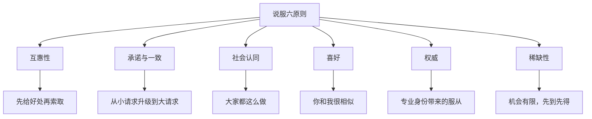
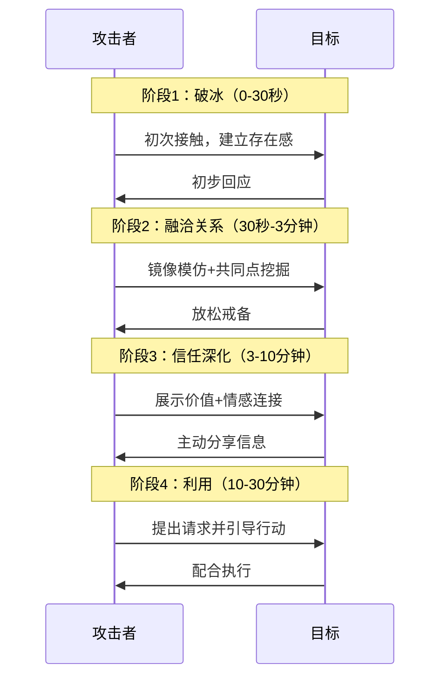
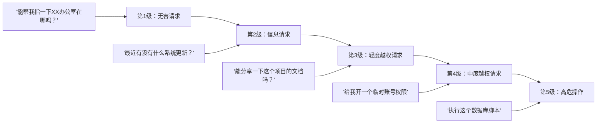

## 23.2 信任建立与关系操纵

信任是社会工程攻击的**核心燃料**。没有信任，任何诱导、欺骗或操纵都无法生效。本章深入剖析信任建立的心理学机制、实战技术以及对应的防御策略，从理论基础到实操落地，覆盖从入门到精通的完整知识体系。

---

### 23.2.1 信任的心理学基础：为什么人会信任陌生人？

信任不是理性决策的产物，而是**进化赋予的认知捷径**。理解信任的底层机制，是掌握社会工程学的第一步。

#### 信任公式（The Trust Equation）

哈佛商学院教授大卫·梅斯特（David Maister）提出的信任公式被社会工程学界广泛引用：

```text
信任 = (可信度 + 可靠度 + 亲近度) / 自我导向
```

| 变量 | 含义 | 在社会工程中的体现 |
|------|------|-------------------|
| **可信度** | 专业能力和知识储备 | 冒充IT专家时使用专业术语 |
| **可靠度** | 言行一致、守承诺 | 伪装角色持续保持一致性 |
| **亲近度** | 情感连接和共同点 | 镜像模仿、建立共同话题 |
| **自我导向** | 以自我为中心的程度（**分母**） | 表现出关心对方、为其着想 |

> **社会工程核心洞察**：分母"自我导向"对信任的影响远大于分子。当目标感知攻击者"为我着想"时，信任感会指数级上升。这就是为何钓鱼攻击中"账户安全提醒"比"请点击链接领取奖品"效果更好。

#### 西奥迪尼六大说服原则（Cialdini's Six Principles）

罗伯特·西奥迪尼（Robert Cialdini）的经典框架是信任操纵的理论基石：



| 原则 | 心理机制 | 社会工程应用示例 | 成功率参考 |
|------|---------|-----------------|-----------|
| **互惠性** | 人们感到有义务回报收到的恩惠 | 先帮目标解决一个小问题，再索要敏感信息 | 65-75% |
| **承诺与一致** | 人们希望言行一致 | 先让目标同意"安全很重要"，再引导安装"安全软件" | 55-70% |
| **社会认同** | 人们模仿他人的行为 | "隔壁部门都已经配合完成了" | 60-80% |
| **喜好** | 人们更容易答应喜欢的人 | 投其所好建立共同兴趣 | 70-85% |
| **权威** | 人们服从权威人物 | 冒充高管、审计员、政府人员 | 80-90% |
| **稀缺性** | 人们珍惜稀缺机会 | "仅限今天的安全升级窗口" | 50-65% |

> **数据来源**：据KnowBe4 2024年社会工程报告统计，结合权威伪装的社会工程攻击成功率平均为83%，远高于纯技术类的鱼叉式钓鱼攻击的42%。

---

### 23.2.2 快速建立信任的技巧

信任建立不是一蹴而就的，而是遵循一个可预测的生命周期：



#### 23.2.2.1 镜像模仿（Mirroring）——潜意识编程

镜像模仿是神经语言程序学（NLP）中的核心技术，利用人类大脑中的**镜像神经元系统**。当对方无意中模仿了你，你的大脑会将其识别为"同类"，从而释放亲近信号。

**三级镜像层次：**

| 层次 | 内容 | 实施方法 | 察觉风险 |
|------|------|---------|---------|
| **第一层：表层** | 语言风格、用词、语气 | 匹配对方使用的词汇（如对方说"搞定"你就说"搞定"，不说"完成"） | 低 |
| **第二层：中层** | 语速、音量、节奏 | 对方语速快你也快，对方低沉你也低沉 | 中 |
| **第三层：深层** | 呼吸节奏、微姿态、能量水平 | 对方交叉手臂，5秒后你也交叉手臂 | 高（需熟练度） |

**实操脚本示例：**

```text
场景：电话钓鱼，目标为男性技术主管

目标说话特征：语速较快，常用"实际上"、"具体来说"，口头禅"你懂我意思吧"

攻击者匹配策略：
  - 语速：保持一致的中快速
  - 高频词："实际上"、"具体来说"、"你懂我意思吧"
  - 句式：短句为主，类似的技术化表达

示例对话：
攻击者："您好，我是信息安全部的张工，实际上我们正在做一项合规检查。"
目标："哦？什么检查？"
攻击者："具体来说，是ISO 27001的年度审计配合工作。你懂我意思吧，需要确认几个账号权限设置。"
目标："嗯，你说。"
```

**延迟镜像技巧**：不要立即复制对方的动作。对方交叉手臂后，等待5-10秒再做出类似动作。立即镜像会被潜意识识别为模仿，产生反感而非亲近。

#### 23.2.2.2 积极倾听——信息收集与情感绑定的双重利器

积极倾听不仅让目标感到被尊重和理解，更重要的是**从对话中收集可用于后续操纵的信息**。

**4层倾听模型：**

```text
第1层：表面倾听
  只听到字面意思，关注自己接下来要说什么
  → 效果：目标感受到不被重视

第2层：专注倾听
  集中注意力在对方的话上，理解内容
  → 效果：目标感到被听见

第3层：共情倾听
  不仅听内容，还感知对方的情绪和潜在需求
  → 效果：目标感到被理解（产生信任的关键）

第4层：策略倾听
  在共情的基础上，有意识地筛选和记录有用信息
  → 效果：攻击者获得可操纵的"筹码"
```

**实操检查清单：**

```text
□ 保持适度的眼神接触（70%时间，避免盯视）
□ 每30-60秒给予非语言反馈（点头、"嗯哼"、"明白"）
□ 每2-3句话后使用复述确认（"所以您是说……"）
□ 适时提出开放性问题（"能多讲讲这个吗？"）
□ 识别并标注对方的情绪（"听起来这件事让您有些担心？"）
□ 记录关键信息：姓名、职位、项目名称、痛点、人际关系
```

**完整示例对话（含攻击者思维分析）：**

```text
目标："唉，最近真是忙死了，数据库迁移的项目搞得我焦头烂额。"
攻击者："听起来压力不小啊。（标注情绪）数据库迁移确实是个大工程，具体卡在哪个环节了？"
                                                          （开放性问题）
目标："主要是兼容性问题，老系统的数据格式太乱了。"
攻击者："兼容性问题确实头疼。（共情）之前有其他部门也遇到类似的，最后用了ETL工具解决的。
         你们用的什么数据库？"（信息收集）
目标："Oracle到MySQL，Oracle那边好多函数不兼容。"
攻击者："Oracle到MySQL确实坑多。（共通经验暗示）对了，我是运维部的小王，之前帮销售部
         解决过类似的。你们的迁移截止时间是什么时候？"（自然引入身份+继续收集）
```

> **要点**：攻击者通过积极倾听不仅建立了情感连接，还收集了以下关键信息：①目标部门正在进行数据库迁移 ②源和目标数据库类型 ③面临的技术痛点 ④可能的截止日期。这些信息在后继攻击中可以作为"专业身份"的佐证。

#### 23.2.2.3 共同点建立——相似性吸引效应

心理学中的"相似性吸引效应"（Similarity-Attraction Effect）表明：人们天生更喜欢与自己相似的人。这种相似可以来自任何维度。

**共同点层次优先级：**

| 优先级 | 共同点类型 | 例子 | 影响力 |
|--------|-----------|------|--------|
| 1 | 价值观 | "我也觉得数据安全是最重要的" | ⭐⭐⭐⭐⭐ |
| 2 | 经历 | "我之前也在类似的创业公司待过" | ⭐⭐⭐⭐ |
| 3 | 兴趣 | "你也跑步啊？我每周都跑半马" | ⭐⭐⭐⭐ |
| 4 | 背景 | "我也是XX大学毕业的" | ⭐⭐⭐ |
| 5 | 处境 | "这周加班加得我都快疯了" | ⭐⭐⭐ |

**信息收集渠道：**

| 渠道 | 可获取的信息 | 获取难度 |
|------|------------|---------|
| LinkedIn/脉脉 | 工作经历、教育背景、技能、人际关系 | 低（公开） |
| 公司官网团队页 | 职位、职责描述 | 低 |
| 社交媒体（微博/微信） | 兴趣爱好、家庭情况、行踪 | 中 |
| 公司内部通讯录 | 联系方式、部门结构 | 高（需已渗透） |
| 目标同事的非正式聊天 | 目标性格特点、工作习惯 | 中 |

---

### 23.2.3 权威伪装与身份操纵

权威是人类最强大的社会服从触发器之一。米尔格拉姆的经典电击实验已经证明：**65%的普通人会在权威指令下对陌生人施加看似致命的电击**。社会工程师利用的就是这种服从本能。

#### 23.2.3.1 角色选择矩阵

不是随意选一个角色就好，需要根据目标、环境和目标信息进行匹配：

| 角色类型 | 适用目标 | 信息获取能力 | 身份验证难度 | 建议使用时长 |
|---------|---------|-------------|-------------|-------------|
| **IT运维人员** | 普通员工、行政 | 高（可接触系统） | 低（IT人员流动大） | 单次接触 |
| **高管助理** | 中层管理、跨部门 | 中高（可传递指令） | 中（可通过邮件确认） | 多次接触 |
| **外包审计员** | 财务、法务、IT | 高（可要求提供文档） | 低（审计常外包） | 1-5天 |
| **新入职员工** | 老员工、HR | 中（可请教问题） | 低（新人很多） | 数周 |
| **供应商/客户** | 销售、采购 | 中（业务沟通） | 中（可能有记录） | 可长期 |
| **政府监管人员** | 所有部门 | 极高 | 中（电话可验证） | 单次 |
| **快递/外卖员** | 前台、保安 | 低（仅物理访问） | 低（制服即可） | 单次 |
| **大楼保洁/维修** | 所有人 | 中（物理空间访问） | 低（很少被盘问） | 长期 |

#### 23.2.3.2 身份包装清单

一个可信的伪装角色需要以下维度的全面包装：

**视觉符号系统：**

```text
□ 制服/着装：
   - IT人员：带logo的Polo衫+工牌+背包+笔记本电脑
   - 审计员：衬衫西裤+文件夹+正装名卡
   - 快递员：快递公司制服+快递箱+扫描设备
   - 保洁：保洁公司背心+清洁推车+拖把

□ 道具：
   - 名牌/工牌（含公司大logo+模糊照片+名字）
   - 带有logo的笔记本和笔
   - 专业工具（IT人员携带网线钳/测线仪；维修工携带工具箱）
   - 公文/文件（看起来正式的表格、申请表、检查清单）
```

**语言符号系统：**

```text
□ 专业术语（以IT支持为例）：
   - "Ticket"（工单）、"SLA"（服务等级协议）
   - "AD账号"、"权限组"、"LDAP同步"
   - "补丁管理"、"漏洞扫描"、"基线合规"

□ 权威句式：
   - "根据公司信息安全制度第X条规定……"
   - "这是XX部门的统一安排，需要各部门配合执行"
   - "我在上次审计中发现了一个严重问题，需要立即处理"
   - "老板/XX总让我来协调这个事"

□ 语气控制：
   - 坚定但不过度强势（避免引发怀疑）
   - 对技术问题表现出专业自信
   - 对敏感请求表现出"这是常规操作"的淡然
```

#### 23.2.3.3 经典的权威伪装攻击案例

**案例一：2013年Target数据泄露事件（前奏）**

在Target 7000万客户数据泄露事件中，攻击者最初是**通过Target的HVAC（暖通空调）承包商入手**。攻击者冒充该承包商的员工，致电Target的技术支持部门称"需要远程访问权限进行系统维护"。由于HVAC承包商与Target有正式合同关系，且电话中的"员工"能准确说出合作编号和项目经理名字，技术支持部门轻易授予了VPN访问权限。结果是攻击者从HVAC系统横向移动到了客户数据库。

**关键教训**：
- 合约关系中的第三方是社会工程的**薄弱环节**
- 攻击者利用了"已有合作关系=可信"的心理捷径
- 技术部门缺乏针对第三方的验证流程

**案例二：2020年Twitter比特币骗局（内部攻击）**

攻击者利用社交工程手段说服一名Twitter员工重置了多个高调账号（包括马斯克、奥巴马、拜登）的邮箱绑定。攻击者打电话给Twitter内部IT支持中心时，**准确使用了内部术语和工单编号格式**，让支持人员确信他是"合规审核团队"的成员。

**关键教训**：
- 即使是顶级科技公司的员工也会被社交工程攻破
- 权威伪装+"内部行话"的组合效果极强
- 账号重置这类高权限操作需要更严格的多因素验证

---

### 23.2.4 情感操纵技术

情感是对抗理性思考的有力武器。当目标处于**高度情绪化**状态时，批判性思维会显著下降，更容易服从指令。

#### 23.2.4.1 恐惧诉求（Fear Appeal）

恐惧制造紧迫感，紧迫感关闭理性思考。这是钓鱼攻击中最常用的技术。

**恐惧诉求的有效性公式（扩展平行过程模型EPPM）：**

```text
行为改变 = 感知威胁 × 感知效能
    其中：
    感知威胁 = 严重性 × 易感性
    感知效能 = 自我效能 × 响应效能
```

**社会工程应用解读**：
- 要让目标感到**威胁足够严重**（"你的银行账户可能被盗"）
- 要让目标感到**自己容易被威胁影响**（"你已经暴露了"）
- 要提供**明确的解决方案**（"点击链接验证即可解决"）
- 要让目标感到**自己能完成这个方案**（"只需30秒"）

**恐惧诉求分级设计：**

| 等级 | 强度 | 表述风格 | 适用场景 | 注意 |
|------|------|---------|---------|------|
| 低 | 温和提醒 | "建议您定期检查账户设置" | 长期布控 | 容易被忽略 |
| 中 | 适度紧迫 | "检测到您的账号存在异常登录行为" | 单次钓鱼 | 成功率50-60% |
| 高 | 强烈威胁 | "您的账户将在24小时内被锁定/冻结" | 紧急任务 | 成功率70-85% |
| 极致 | 恐慌制造 | "公司数据疑似泄露，所有员工必须配合调查" | 大范围攻击 | 可能触发反制 |

**实操模板：电话恐惧诉求**

```text
攻击者："您好，我是信息安全中心的王磊，工号XJ-8847。
         系统监测到您的终端在凌晨2点15分有异常数据外传行为，
         涉及约300条客户记录。按照国家网络安全法和公司数据
         管理制度，我们需要立即确认是否是您本人的操作。"

目标反应A（恐慌型）："什么？！我没有啊！我昨晚早早就睡了！"
  → 攻击者："别急，我们也怀疑是病毒或账号被盗用。我帮您远程
              检查一下，您说下您的电脑IP地址？"

目标反应B（冷静型）："你们信息安全中心有工单系统吗？我先查一下。"
  → 攻击者："当然有。工单编号SEC-2024-0617。您可以稍后核实，
              但是现在情况紧急——数据持续外流，每多一分钟
              就多泄露一批客户信息。您希望我先紧急处理还是
              等流程走完再处理？"
     （利用时间紧迫感绕过程序验证）
```

#### 23.2.4.2 同情心利用（Sympathy Exploitation）

同情心利用的目标是激活人类的**利他主义本能**——大多数人天生愿意帮助看起来需要帮助的人。

**同情剧本设计原则：**

| 原则 | 说明 | 错误示例（易被识破） | 正确示例 |
|------|------|---------------------|---------|
| **适度困境** | 困境要真实可信，不能太戏剧化 | "我得了绝症，就剩三天了" | "我第一天上班，系统不熟悉，找不到提交入口" |
| **角色匹配** | 困境与伪装角色一致 | IT专家说"我不会用电脑" | 新人说"培训时没讲这个配置" |
| **对方能帮** | 请求必须在目标能力范围内 | "帮我搞定整个服务器" | "帮我查一下这个部门的联系方式" |
| **克制表达** | 不过度渲染情绪 | 哭诉、哀求 | 适度无奈+努力尝试的态度 |

**同情剧本库：**

```text
▎"新入职"剧本（最常见的同情剧本）
  "实在不好意思打扰您，我是这周一刚入职的[X部门]的[名字]，
   HR说我的账号权限还没批下来，但我下午要交一个报告给领导。
   您能帮我看看怎么加快一下吗？"

  → 心理机制：新人犯错/求助是合理预期，不易引起怀疑
  → 信息获取：可套取部门结构、负责人、系统权限信息

▎"紧急任务"剧本
  "领导临时让我汇总一份数据，下班前就要。我查了一下系统，
   发现XX系统之前的数据我没权限看。您知道谁能处理这个吗？
   或者您能不能帮我拉一下？"

  → 心理机制：工作场景中的时间紧迫感是常态
  → 信息获取：可得知数据访问权限的审批流程和负责人

▎"设备故障"剧本
  "我的电脑突然蓝屏了，有个紧急文件在里面。IT说他们忙不过来
   要等2小时。我看您这边有网络接口，能借用一下您电脑登录
   邮箱把文件转发一下吗？"

  → 心理机制：技术困难+时间紧迫+无害请求
  → 风险：高度依赖目标的无戒备心

▎"跨部门协作"剧本（进阶）
  "我是[其他事业部]的，我们要做跨部门数据对账。你们的对接人
   [目标同事名字]在休假，让我直接找您。这是对账模板，
   您方便把近三个月的数据导出一下吗？"

  → 心理机制：提到具体同事名字+"正规"模板=可信
  → 信息获取：可一次性获取大量业务数据
```

#### 23.2.4.3 互惠性利用——先给后取

互惠性是西奥迪尼六大原则中最有力量的之一。攻击者通过先提供微小的帮助或价值，在目标心中制造"欠人情"的心理债务。

**低成本互惠策略：**

| 攻击者提供的"帮助" | 成本 | 预期回报 |
|-------------------|------|---------|
| 告诉目标某个快捷操作技巧 | 0元 | 目标愿意回答3-5个问题 |
| 顺手帮目标拿快递/咖啡 | 0元（顺路） | 建立初步好感 |
| 帮目标解决一个小技术问题 | 0-5分钟 | 目标后续不好拒绝请求 |
| 共享一个看起来有用的资源/模板 | 0元（伪造的） | 打开邮件/点击链接 |
| "无意中"提醒目标一个潜在风险 | 0元 | 建立"好心人"形象 |

**实操示例：**

```text
场景：攻击者在茶水间"偶遇"目标

攻击者："诶，你是财务部的吧？前几天看你们在搬办公室，门禁权限
         重置了没？我上周看到IT发通知说搬迁后门禁要重新激活，
         不然外部审计的时候会有合规问题。"

目标："啊？没听说啊。审计会有什么问题？"

攻击者："具体我也说不清，就是信息安全合规的那个检查项。
         你可以查一下IT上周发的邮件，标题是'办公区域门禁
         权限更新通知'。我帮你找找？"
         （互惠：主动提供信息帮助）

目标："好的好的，谢谢提醒！"

攻击者："不客气。对了，我是业务部的[名字]，你们财务部的报销流程
         现在还是线上提交吗？我那边有笔报销卡了两周了……"
         （回报：利用好感询问内部信息）

→ 这里，攻击者先用"提醒门禁问题"建立了互惠关系，
  然后自然地切换到信息收集目标。
```

---

### 23.2.5 信任深度维护与长期关系操纵

短期信任可以完成单次攻击（如钓鱼邮件），但复杂的渗透往往需要**长期信任关系**。

#### 23.2.5.1 关系维护策略

| 策略 | 操作方式 | 频率 | 目的 |
|------|---------|------|------|
| **定期轻接触** | 邮件问候、社交媒体点赞、简短语聊 | 每1-2周 | 保持存在感 |
| **价值持续输出** | 分享对方可能有用的信息/资源 | 每2-4周 | 深化互惠关系 |
| **情感打卡** | 在关键节点表达关心（生病、升职、节日） | 按事件触发 | 绑定情感连接 |
| **角色扩展** | 展示更多"专业能力"或"人脉资源" | 逐步推进 | 提升可信度 |

#### 23.2.5.2 逐步升级请求法（Foot-in-the-Door Technique）

社会心理学经典实验（Freedman & Fraser, 1966）证明：**如果人们同意了一个小的请求，他们更可能同意随后的更大请求**。

**社会工程中的分级请求设计：**



**关键原则**：
- 每一级升级的**幅度要小**，让目标感觉只是"多帮一点点"
- 前一级请求必须被接受，再推进到下一级
- 如果某一级被拒绝，退回上一级并重建关系
- 整个过程要保持"合理"——每个请求都必须符合你的伪装角色

---

### 23.2.6 防御与识别：如何防范信任操纵

作为网络安全专业人士，了解攻击技术的目的不是为了去实施，而是为了**识别和防御**。以下是针对信任操纵的系统防御策略。

#### 23.2.6.1 信任验证协议（Trust Verification Protocol）

组织应建立标准化的信任验证流程，无论对方看起来多可信：

```text
当有人提出以下请求时，必须执行验证流程：
  □ 请求重置账号密码/权限
  □ 请求提供敏感数据（客户信息、财务数据、系统配置）
  □ 请求安装软件或执行脚本
  □ 请求物理访问受控区域
  □ 请求绕过正常流程/审批

验证流程：
  1. 挂断/暂停当前沟通
  2. 通过独立渠道（非对方提供的联系方式）回拨确认
     → 从公司通讯录查到对方部门的官方电话
     → 拨打该号码验证身份
  3. 确认工单/请求编号
     → 正规请求应有可查证的工单号
     → 没有工单号 = 高度可疑
  4. 核实身份要素
     → 不仅核姓名，还要核岗位、入职时间、上级姓名
     → 一致性检查：信息是否和HR系统匹配
```

#### 23.2.6.2 个人防御清单（员工培训用）

```text
发现以下信号时应立即启动怀疑机制：

⚠️ 紧迫感信号：
   □ "必须立即处理，否则有严重后果"
   □ "不要告诉任何人，这是保密事项"
   □ "过了今天就没机会了"

⚠️ 绕过渠道信号：
   □ 跳过正式工单/审批流程
   □ 要求使用个人联系方式沟通
   □ 提供的联系方式无法回拨确认

⚠️ 身份模糊信号：
   □ 对方无法提供工号或提供的工号查不到
   □ 对方对组织内部结构不熟悉
   □ 对方拒绝视频/当面确认

⚠️ 请求异常信号：
   □ 请求与你当前工作职责无关的信息
   □ 请求违反公司信息安全制度
   □ 请求涉及高权限操作而无正式审批
```

#### 23.2.6.3 组织级防御策略

| 防御层 | 具体措施 | 效果评估 |
|--------|---------|---------|
| **技术控制** | 实施多因素认证（MFA）+ 零信任架构 | 防止凭据被盗后的横向移动 |
| **流程控制** | 高敏感操作必须双人审批+多通道确认 | 单点社交工程无法突破 |
| **培训控制** | 每季度社交工程模拟演练+红队测试 | 提升员工警觉度30-50% |
| **监控控制** | 异常访问行为分析+UPIM（用户实体行为分析） | 发现异常信任模式 |
| **响应控制** | 社交工程事件应急响应预案 | 减少攻击成功后的损失 |

---

### 23.2.7 常见误区与纠正

| 误区 | 错误认知 | 纠正 |
|------|---------|------|
| "信任建立需要很长时间" | 至少需要几周才能获得信任 | **错误**。利用紧迫感和权威伪装，30秒内即可建立足够的信任来完成特定攻击 |
| "只有内向者才容易被社交工程攻击" | 外向自信的人不容易上当 | **错误**。研究表明，自信心越强的人越容易高估自己的判断能力，反而更容易被操纵 |
| "技术手段能解决一切" | 部署了安全软件就安全了 | **错误**。社交工程攻击的是人不是系统，技术手段无法防范一个主动配合攻击的员工 |
| "训练一次就够了" | 一次安全培训终身免疫 | **错误**。社交工程攻击手法日新月异，需要持续性的演练和更新培训内容 |
| "我一眼就能看穿骗局" | 自我感觉不会被骗 | **错误**。职业骗子、前社会工程师Kevin Mitnick曾证明：没有人能100%免疫精心设计的社交工程攻击 |

---

### 23.2.8 进阶阅读与延伸思考

#### 信任操纵的伦理边界

本章所展示的技术仅应用于授权的渗透测试、红队演练和防御培训。未经授权的社交工程攻击可能触犯《网络安全法》、《个人信息保护法》和《刑法》中的相关条款。请始终在合法合规的框架下使用这些知识。

#### 延伸研究方向

1. **AI驱动的社交工程**：深度伪造（Deepfake）语音用于电话钓鱼攻击，大语言模型生成的个性化钓鱼邮件
2. **多通道信任操纵**：利用社交媒体+电话+邮件+物理接触多维度建立信任
3. **组织信任网络的图分析**：识别组织内部的高影响力"信任节点"和关键路径
4. **跨文化信任模式差异**：不同国家和文化背景下信任建立的差异（如高语境vs低语境文化）

#### 推荐阅读

- Kevin Mitnick《The Art of Deception》— 社会工程圣经级著作
- Robert Cialdini《Influence: The Psychology of Persuasion》— 说服理论经典
- Christopher Hadnagy《Social Engineering: The Science of Human Hacking》— 系统性的社会工程学教材
- David Maister《The Trusted Advisor》— 信任公式的原始出处

---

> **本章小结**：信任建立与关系操纵是社会工程学的核心能力。本章从信任的心理机制入手，依次讲解了快速建立信任的具体技术（镜像模仿、积极倾听、共同点建立）、权威伪装与身份操纵的方法论、情感操纵的三种核心技术（恐惧诉求、同情心利用、互惠性利用），以及长期关系维护策略和分级请求升级法。最后，从防守方视角提供了信任验证协议、个人和组织级防御策略。掌握这些知识后，你应能理解社会工程攻击中的信任机制，并在实战或防御中运用自如。