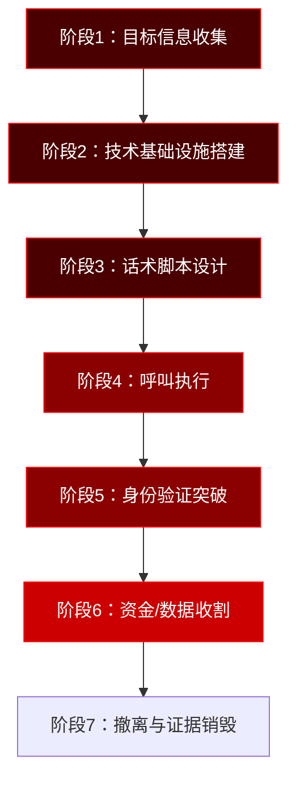

## 23.4 电话诈骗与语音钓鱼（Vishing）

> **核心洞察**：在所有社会工程学攻击向量中，电话攻击的成功率长期位居第一——FBI 2023年互联网犯罪报告显示，电话相关诈骗每年造成超过7.3亿美元损失，单人单次平均损失高达1,600美元。其根本原因在于：**语音通道缺乏书面记录、利用人类听觉系统的认知盲点、以及实时交互施加的心理压迫感，是邮件和文字信息无法比拟的。**

语音钓鱼（Voice Phishing，简称 Vishing）是电话诈骗与网络钓鱼结合的产物。与传统电话诈骗不同，Vishing 整合了 VoIP 技术、来电显示伪造、语音合成、社会工程脚本等多元化手段，形成了从接触到欺骗再到资金转移的完整攻击链。

---

### 23.4.1 电话诈骗为何如此有效——心理学原理

#### 23.4.1.1 语音通道的独特压迫机制

人类在语音通话中面临 **认知负载的天然不对称**：

| 维度 | 文字沟通 | 语音通话 |
|------|----------|----------|
| 信息处理速度 | 自控（可暂停思考） | 实时（无法暂停） |
| 记录留存 | 可回看/转发 | 无自动留存 |
| 情感暗示 | 有限（表情符号辅助） | 丰富（语调、语速、音色） |
| 决策压力 | 低 | 高（话术节奏驱动） |
| 身份验证 | 多种方式 | 依赖听觉（容易被伪造） |

电话通话迫使受害者在 **有限时间窗口内做出决策**，攻击者通过精心设计的语速节奏、声调变化和沉默战术，持续压缩受害者的理性思考空间。

#### 23.4.1.2 攻击者利用的核心心理机制

**权威从众效应（Authority Compliance）**

Cialdini（1984）在其经典的社会心理学研究中指出，面对自称权威的指令，约 **65%的人会选择服从**，即使这些指令违反其正常判断。电话诈骗中，攻击者自称"公安局警官""税务局稽查员""银行风控主管"等身份，即是利用该效应。

**时间压迫与稀缺性（Scarcity & Urgency）**

```plaintext
攻击者话术类型与对应的心理机制：

"您的账户将在1小时内被冻结"  → 损失厌恶（Loss Aversion）
                                    受害者为避免损失而快速行动

"这个优惠名额只有3个"        → 稀缺效应（Scarcity Effect）
                                    激发竞争心理

"我们已经通知法院了"          → 权威恐惧（Authority Fear）
                                    触发逃避惩罚的本能
```

**锚定效应（Anchoring）**

攻击者先提出一个极高的数字（"您欠税50万元"），然后给出一个"解决方案"（"现在补缴8万元可以结案"）。受害者在这个对比下，会觉得8万元是"合理的"，而不去质疑整个前提。

**承诺一致性（Commitment & Consistency）**

攻击者先让受害者做出小的让步或承认（"您最近是不是收到过异常短信？""您的电脑确实运行变慢了吧？"），一旦受害者给出肯定回答，后续要求更大让步时，心理上的拒绝成本显著增加。

---

### 23.4.2 电话诈骗脚本设计与话术架构

> 每一通成功的诈骗电话背后，都有一套经过反复测试和迭代的*对话工程（Conversation Engineering）*体系。本节对典型脚本进行拆解分析，并附上标注说明。

#### 23.4.2.1 技术支持诈骗脚本（带话术标注版）

```plaintext
【第一幕：开场建立场景】
攻击者："您好，我是[公司名]安全中心的[姓名]，工号SV29843。我们的威胁监测系统检测到
          您的终端IP [随机IP] 正在向境外C2服务器发送加密流量，这可能意味着您的设备已
          被植入后门。"

         ⚡ 标注：
         - "工号SV29843" → 提供可查验证码增加可信度
         - "终端IP" + "C2服务器" → 技术术语降低质疑欲望
         - "可能" → 留有余地，避免过度绝对

【第二幕：引导自我证实】
攻击者："您电脑最近有没有出现：运行突然变慢、鼠标偶尔不受控制、或者弹窗广告突然增多
          的情况？"

         如果受害者说"有"——攻击者立即确认判断，进入第三幕。
         如果受害者说"没有"——攻击者话术转向：
         "这说明后门程序处于潜伏阶段，反而更危险。潜伏期越长的木马，清洗难度越大。"

         ⚡ 标注：
         - 通过"三选一"诱导，大多数用户至少会遇到过一个现象
         - "潜伏期更危险" → 无论用户回答什么，都能转化为加强理由
         - 这是典型的"模糊匹配"话术陷阱

【第三幕：制造紧迫感】
攻击者："根据我们威胁情报系统的分析，这个后门程序属于'DarkGate'变种。如果不在24小时
          内清除，攻击者将获得以下权限：(1) 读取您的所有个人文件；(2) 加密文件勒索；
          (3) 窃取浏览器保存的密码和银行信息。去年我们处理的类似案例中，受害者平均
          损失了2.3万元。"

         ⚡ 标注：
         - "DarkGate变种" → 引用真实恶意软件名称增强可信度（即使攻击者根本没有检测）
         - 三重危害列举 → 具体化损失场景
         - "平均损失2.3万元" → 用精确数字增强可信度（锚定效应）

【第四幕：提供解决方案】
攻击者："我现在可以远程为您进行免费安全检查，整个过程大约15分钟。请您打开浏览器，
          访问我们的安全处理门户：support-[公司名]-fix.top"

         ⚡ 标注：
         - "免费" → 降低心理防线
         - "15分钟" → 具体时间降低心理承诺成本
         - 域名使用-[公司名]-fix.top → 看起来像官方子域名

【第五幕：获取远程访问】
攻击者："在页面上输入您的姓名和电话，然后点击'开始远程协助'按钮。系统会自动下载
          远程支持工具。请信任并运行该程序，然后把屏幕上显示的9位数连接码告诉我。"

         ⚡ 标注：
         - 引导受害者主动完成操作（承诺一致性的延续）
         - 9位数连接码 → 任何远程工具（AnyDesk/TeamViewer）的典型格式

【第六幕：收尾与撤离】
攻击者："修复完成！我们已经为您安装了全方位的安全防护。建议您按月支付280元的
          维护费用来保持保护。如果今天决定，可以打8折——月付仅需224元。"
```

#### 23.4.2.2 主流电话诈骗脚本类型对照

| 诈骗类型 | 冒充身份 | 威胁内容 | 要求操作 | 单案平均损失（USD） |
|----------|----------|----------|----------|---------------------|
| 技术支持 | 微软/Apple/杀毒软件 | 电脑已被入侵 | 安装远程工具 → 付费维修 | $850 |
| 冒充公检法 | 公安/检察/法院 | 涉嫌犯罪/通缉 | 转账到"安全账户" | $4,200 |
| 冒充银行 | 银行风控部门 | 信用卡异常/逾期 | 提供验证码/转接"客服" | $1,200 |
| 冒充税务 | 税务局稽查 | 偷税漏税/欠税 | 补缴罚款 | $3,800 |
| 冒充运营商 | 电信/联通/移动 | 手机号将被停用 | 提供个人信息 | $680 |
| 冒充领导 | 公司高管 | 急需周转/送礼 | 微信转账/银行转账 | $5,600 |
| 冒充客服退款 | 电商/物流 | 产品质量问题退款 | 扫码/提供银行卡号 | $1,500 |
| 冒充债券/投资 | 券商/基金 | 高收益内部项目 | 投资转账 | $12,000+ |
| 冒充绑架 | 绑匪 | 亲属被绑架 | 支付赎金 | $3,500 |
| AI换声亲情类 | 子女/父母 | 出事急需用钱 | 微信转账/银行卡转账 | $8,000+ |

> **数据来源**：FBI IC3 2023 Annual Report、中国反诈中心2023年度报告、Action Fraud UK 数据综合整理。

---

### 23.4.3 Vishing 技术基础设施

#### 23.4.3.1 VoIP 与来电显示伪造技术

现代Vishing攻击几乎全部基于 **VoIP（Voice over IP）** 技术——因为它天然支持来电显示的修改。

**技术原理**

传统PSTN（公共交换电话网）中，来电号码由运营商在信令层面设定，修改难度大。但VoIP使用SIP（Session Initiation Protocol）协议，来电号码（Caller ID）作为SIP信令中的一个字段发送，**接收端的运营商多数情况下不会校验该字段的真实性**。

```bash
# 方案一：Asterisk PBX 伪造Caller ID
# 修改 /etc/asterisk/extensions.conf

[macro-outbound-callerid]
; 设置假冒的来电显示号码
exten => s,1,Set(CALLERID(num)=+8610XXXXXXXX)    ; 伪装成北京座机
exten => s,n,Set(CALLERID(name)=国家税务总局)
exten => s,n,Dial(SIP/${ARG1}@trunk_provider)

; 发送前验证伪造是否生效（调试模式）
exten => s,n,Verbose(2, 正在拨出，呼叫者ID: ${CALLERID(num)})
```

```bash
# 方案二：使用SIP协议直接伪造
# 使用 sipcmd 或 sipp 工具直接构造SIP报文

sipcmd -P sip -u 伪造号码 -c 密码 -w 被叫号码 \
  -x "c:1" -s "CALLERID=+8610XXXXXXXX"
```

**常见VoIP服务与平台对比**

| 平台 | 伪造难度 | 匿名性 | 成本 | 稳定性 | 备注 |
|------|----------|--------|------|--------|------|
| Asterisk PBX（自建） | 低 | 高（自控服务器） | 仅服务器成本 | 中 | 需要技术能力 |
| FreeSWITCH（自建） | 低 | 高 | 仅服务器成本 | 高 | 比Asterisk复杂 |
| SpoofCard | 极低 | 中 | $13/月 | 高 | 图形化界面，无需技术 |
| Burner App | 低 | 高 | $5/号码 | 高 | 一次性号码，自动销毁 |
| Google Voice | 中（需美国号码） | 中 | 免费 | 高 | 合法用途可伪造 |
| SIP干线租用 | 低 | 高（预付卡） | 0.01美元/分钟 | 高 | 最专业的方式 |

#### 23.4.3.2 AI 语音克隆与实时变声

这是Vishing领域发展最快的技术方向，2023-2025年间技术门槛大幅下降。

**语音克隆技术栈**

| 技术 | 类型 | 所需样本量 | 实时性 | 质量 | 开源方案 |
|------|------|-----------|--------|------|---------|
| Tacotron 2 + WaveGlow | 文本转语音 | 30分钟 | 否 | 高 | GitHub开源 |
| VALL-E（微软） | 零样本语音合成 | 3秒 | 否 | 极高 | 非开源 |
| Coqui TTS | 微调TTS | 10-30分钟 | 是（需GPU） | 高 | 完全开源 |
| Resemble AI | API服务 | 5分钟 | 是 | 高 | 收费API |
| ElevenLabs | API服务 | 1分钟 | 是 | 极高 | 收费API |
| So-VITS-SVC | 声音转换 | 10分钟 | 是（GPU） | 高 | GitHub开源 |

```bash
# 方案一：使用开源工具 Coqui TTS 进行语音克隆
# 环境要求：Python 3.8+，建议16GB以上显存

# 安装
pip install TTS

# 下载预训练模型并训练声音
# 先准备目标人物语音样本（WAV格式，16kHz采样率，10-30分钟）
# 训练命令示例
tts --model_name tts_models/multilingual/multi-dataset/xtts_v2 \
    --speaker_wav /path/to/target_voice.wav \
    --text "您好，我是李总。现在有一笔紧急款项需要您处理。" \
    --language_idx zh-cn \
    --out_path ./output.wav
```

```bash
# 方案二：使用 So-VITS-SVC 实时声音转换
# 适用于实时通话中的变声

# 克隆仓库
git clone https://github.com/svc-develop-team/so-vits-svc.git
cd so-vits-svc

# 安装依赖
pip install -r requirements.txt

# 准备数据：目标人物语音 + 自己的语音配对
# 在 config.yaml 中配置模型路径
# 启动推理服务器（含WebSocket实时接口）
python inference_main.py --model_path ./logs/44k/G_60000.pth \
                         --config ./configs/config.json

# 可使用虚拟音频驱动（如VB-Cable）将处理后的声音接入通话软件
# 实现实时变声通话
```

**关键发现**：2024年，ElevenLabs的语音克隆技术已可以实现**仅需1分钟语音样本**就能生成可通话质量的克隆语音。Edge computing 的进步使得实时语音转换的延迟降低至300ms以下，达到近乎无感知的水平。

#### 23.4.3.3 呼叫自动化与批量化

大规模Vishing攻击依赖自动拨号系统（Auto Dialer）和交互式语音应答（IVR）技术：

```bash
# 使用 Asterisk 实现自动拨号 + IVR 筛选
# /etc/asterisk/extensions.conf 配置示例

[auto-dialer]
; 从文件读取号码列表，逐个拨打
exten => s,1,Set(i=1)
exten => s,n,While($["${i}" < "1000"])
exten => s,n,Set(NUMBER=${FILE(/var/lib/asterisk/numbers.txt,${i},1)})
exten => s,n,Dial(SIP/${NUMBER}@provider,30)
exten => s,n,Set(i=$[${i}+1])
exten => s,n,EndWhile

; 拨通后的IVR剧本
exten => s,n,Background(ivr-greeting-zh)    ; 播放中文开场白
exten => s,n,WaitExten(5)                    ; 等待按键响应
exten => 1,1,Goto(transfer-to-human,1)       ; 按1转接人工
exten => 2,1,Playback(thank-you-goodbye)     ; 按2挂断
```

Auto Dialer的核心价值在于 **效率提升**：一个单机配置的自动拨号系统，每天可处理5,000-10,000次呼叫，而人工拨号每天仅能完成50-80次。

---

### 23.4.4 全球电话诈骗态势与典型案例

#### 23.4.4.1 统计数据全景

| 地区 | 年度报案数 | 损失金额 | 人均损失 | 主要攻击类型 |
|------|-----------|----------|----------|-------------|
| 中国 | 约100万起 | 约200亿元 | 约2万元 | 冒充公检法、AI换声亲情类 |
| 美国 | 约300万起 | 29.8亿美元 | $1,600 | 技术支持、冒充IRS |
| 英国 | 约50万起 | 5.8亿英镑 | £1,200 | 冒充银行、冒充税务局 |
| 印度 | 约40万起 | 3.5亿美元 | $900 | 冒充MFA客服、退税诈骗 |
| 澳大利亚 | 约30万起 | 3.1亿澳元 | $1,500 | 冒充Telstra、冒充FedEx |

> **数据时效**：2023-2024年各国官方机构年度报告，中国反诈中心数据为公安部门登记立案数，实际发生数可能更高。

#### 23.4.4.2 经典案例深度分析

**案例一：2019年英国能源公司CEO语音诈骗案**

本案是 **全球首例公开披露的AI语音诈骗案件**，具有里程碑意义。

```plaintext
攻击过程还原（时间线）：

D-7   → 攻击者收集目标CEO的语音资料：
          - YouTube上的3段公开演讲（共45分钟）
          - TEDx活动视频（18分钟）
          - 2次财报电话会议录音
          → 总计约72分钟高质量语音样本

D-3   → 攻击者使用商用AI语音克隆服务训练模型
          - 所需资金：约$500（当时的价格）
          - 训练时长：约24小时
          - 生成质量：母语人士盲测识别率仅3%

D-1   → 攻击者测试通话
          - 致电CEO的私人号码进行"调研"
          - 确认CEO的语调模式和说话习惯
          - 完善AI模型参数

D+0   → 攻击执行
          上午09:15 → 致电子公司CFO
          09:15-09:18 → 冒充CEO，指示紧急付款给某"供应商"
          09:18-09:20 → 通知完成22万欧元国际转账
          09:20-09:25 → 资金转入匈牙利→斯洛伐克→分散到多个账户
          09:30 → CFO致电CEO确认 → 发现被骗

结果：
- 总损失：22万欧元
- 追回比例：约30%（由于跨辖区转移速度极快）
- 侦破：半年后在匈牙利逮捕3名嫌疑人
- 影响：该案促使欧盟出台了针对AI诈骗的专项预警
```

**案例二：中国"冒充公检法"系列诈骗常态化**

中国是冒充公检法诈骗的重灾区。2023年，该类案件虽然数量仅占全部电话诈骗的8%，但损失金额占比高达32%，属于 **高危害密度型诈骗**。

```plaintext
典型作案流程（以广州某案为例）：

阶段一：获取个人信息
  攻击者通过暗网购买公民信息包（含姓名、身份证、住址、银行账户）
  成本：约0.5元/条

阶段二：首次致电（冒充通信管理局）
  "您的手机号涉嫌发送诈骗短信，即将被停机"
  引导用户「报案」→ 转接至「公安局」

阶段三：二次致电（冒充公安）
  "您名下银行卡涉嫌洗钱案（出示虚假逮捕令截图）"
  以「保密调查」为由要求：不得告诉任何人
  要求下载「安全防护APP」（实为远程控制软件）

阶段四：资金操作
  要求将资金转入「国家安全账户」进行「资金清查」
  声称「清查结束后72小时内自动返还」
  分多笔转账规避银行风控

阶段五：收割与消失
  资金到账后立即通过多级账户洗白
  攻击者所有联系方式失效
  受害者醒悟时间：平均3-7天

关键数据：
- 单案平均损失：中国约5.6万元
- 最大单案记录：广州市2023年单案损失1,280万元
- 追回率：<5%（因为资金在30分钟内被迅速分散）
```

#### 23.4.4.3 新型变种——AI实时视频+语音诈骗

2024年，香港出现首例 **AI实时视频+语音双重伪造** 的诈骗案件。攻击者利用深度伪造技术同时伪造了公司CFO的面部视频和语音，通过Zoom通话面见财务人员，指示转账。这笔案件金额高达2亿港元。

该案例标志着电话诈骗从 **纯语音通道** 升级为 **多模态混合通道**，防御难度指数级上升。

---

### 23.4.5 电话诈骗的完整攻击链

从技术角度看，一次高质量的Vishing攻击包含以下6个阶段：



**各阶段详细拆解：**

| 阶段 | 投入时间 | 技术复杂度 | 核心活动 |
|------|----------|-----------|---------|
| 信息收集 | 1-7天 | 低 | 通过OSINT收集目标个人信息：姓名、职位、通讯录、社交关系 |
| 基础设施 | 1-3天 | 中 | 搭建VoIP服务器、租赁SIP干线、申请虚拟号码 |
| 脚本设计 | 0.5-2天 | 低到中 | 编写话术脚本、准备应对质疑的应答库 |
| 呼叫执行 | 1-30分钟 | 中 | Auto Dialer拨号→IVR筛选→人工接听 |
| 身份验证突破 | 1-5分钟 | 高 | 应对2FA/短信验证/人脸识别的社会工程技巧 |
| 资金收割 | 5-60分钟 | 高 | 多级账户转账、加密货币混币器、地下钱庄 |

---

### 23.4.6 电话诈骗的防御体系

防御电话诈骗需要从 **技术层、制度层、认知层** 三个维度构建纵深防御。

#### 23.4.6.1 技术防御

**STIR/SHAKEN 协议框架**

这是目前最有效的来电显示验证标准，由FCC强制要求美国运营商实施。工作原理：

```plaintext
呼叫流程：

发起方VoIP运营商
  → 使用私钥签名原始Caller ID（STIR：Secure Telephone Identity Revisited）
  → 签发认证令牌（包含：呼叫号码、时间戳、身份信息）

接收方运营商
  → 使用公钥验证STIR签名（SHAKEN：Signature-based Handling of Asserted information
     using toKENs）
  → 判定呼叫等级：
     - Attestation A：运营商确认呼叫者有权使用该号码（100%可信）
     - Attestation B：运营商确认呼叫者身份但无法验证号码归属（部分可信）
     - Attestation C：运营商无法验证任何信息（可疑）
  → 对Attestation C呼叫：标记为"疑似诈骗"或直接拦截

当前覆盖率：美国 85%、加拿大 70%、中国 10%（正在试点）
```

**关键事实**：中国目前尚未全面推行STIR/SHAKEN标准，这也是冒充公检法诈骗在中国高发的重要技术原因之一。

**其他技术防御手段**

| 防御手段 | 原理 | 效果 | 用户侧成本 |
|----------|------|------|-----------|
| 国家反诈中心APP | 黑名单库+AI识别+实时拦截 | 日均拦截1.2亿次呼叫 | 安装即可 |
| TrueCaller/360防骚扰 | 社区举报+智能识别 | 识别率90%+ | 安装即可 |
| 电信运营商高频拦截 | 基于呼叫频率分析 | 拦截80%以上的批量呼叫 | 无（运营商侧） |
| 语音生物特征识别 | AI分析声纹匹配 | 正在试验阶段 | 需要主动注册声纹 |
| 通话内容实时分析 | 关键词触发+AI语义分析 | 警企合作试点中 | 无（运营商侧） |
| 双因子语音验证 | 回拨验证+随机确认码 | 接近100% | 耗时增加30秒 |

#### 23.4.6.2 制度防御——企业级防诈流程

企业应当建立 **三层电话验证机制**：

```plaintext
Level 1：来电身份验证（适用于所有电话请求）
  对任何要求操作（转账、提供敏感信息、远程访问）的电话：
  → 步骤1：挂断电话
  → 步骤2：通过官方渠道（公司通讯录/官网号码）回拨
  → 步骤3：验证来电者的真实身份

Level 2：资金操作验证（适用于所有资金相关电话）
  → 步骤1：Level 1全流程
  → 步骤2：大额付款双人审批（≥5万元需2人签字）
  → 步骤3：使用已注册的回拨号码确认指令
  → 步骤4：在OA系统中创建正式的付款工单

Level 3：紧急情况反诈流程（适用于声称"紧急""保密"的电话）
  → 步骤1：识别为高危场景（"紧急""保密""安全账户"是典型红旗信号）
  → 步骤2：立即启动应急预案
  → 步骤3：通过备用通道（企业微信/钉钉/当面）联系相关人员
  → 步骤4：报告IT安全部门和法务部
```

**关键防御原则——"123原则"**：

```text
1 → 任何要你转账的电话，主动挂断
2 → 通过2个不同的官方渠道核实
3 → 3人以上确认，才能执行大额操作
```

#### 23.4.6.3 认知防御——个人识别红旗信号

```plaintext
红旗信号清单（RED FLAGS）：

🟢 安全对话（正常）
  - 对方鼓励你挂断后回拨官方电话
  - 对方提供书面确认渠道
  - 对方接受你记录通话内容
  - 对方不要求保密
  - 对方不制造时间压力

🔴 危险对话（可疑）
  - 要求你「不要挂断电话」
  - 要求你「不要告诉任何人」
  - 要求你「立即转账到安全账户」
  - 要求你「提供验证码」
  - 声称「不配合就逮捕」
  - 拒绝提供工号或官方联系方式
  - 要求下载远程控制类软件
  - 通过微信/QQ语音联系，而非官方渠道

如果你遇到第1-2条以上红旗信号，立即挂断！
```

#### 23.4.6.4 "抗Vishing"定期培训方案

企业应当按季度对员工进行电话诈骗防御培训：

| 培训模块 | 时长 | 形式 | 内容 |
|----------|------|------|------|
| 认知唤醒 | 20分钟 | 视频+真实案例 | 观看最新诈骗案例报道 |
| 话术识别 | 15分钟 | 互动游戏 | 识别真假来电对话片段 |
| 模拟演练 | 30分钟 | 扮演测试 | 模拟接到诈骗电话的应对流程 |
| 流程测试 | 15分钟 | 实战演练 | 由安全团队发起真正的社会工程测试来电 |
| 考核评估 | 10分钟 | 问卷 | 测试识别率和应对正确率 |

> **避坑提示**：模拟演练不能事先通知员工具体时间，否则即失去测试价值。但同时要建立"试后辅导"机制——对于"被骗"的员工不得追究责任，而是要主动安排补课培训。

---

### 23.4.7 法律法规与刑事规制

#### 23.4.7.1 中国法律框架

涉及电话诈骗的主要法律依据：

| 法律 | 条款 | 适用场景 | 最高刑期 |
|------|------|----------|---------|
| 刑法第266条 | 诈骗罪 | 以非法占有为目的，虚构事实骗取财物 | 无期徒刑 |
| 刑法第287条 | 利用信息网络实施犯罪 | 利用通信网络实施诈骗 | 7年 |
| 刑法第177条之一 | 妨害信用卡管理罪 | 非法获取、使用他人信用卡信息 | 10年 |
| 网络安全法第27条 | 个人信息保护 | 非法获取公民个人信息用于诈骗 | 7年 |
| 反电信网络诈骗法 | 专项法律（2022.12实施） | 电信网络诈骗全链条 | 综合处罚 |
| 个人信息保护法 | 个人信息处理 | 非法收集、买卖个人信息 | 5,000万元罚款 |

**《反电信网络诈骗法》核心要点**（2022年12月1日施行）：

```plaintext
关键条款：
- 第10条：电信业务经营者对电话卡实名制负责，同一用户在同一运营商办理
  的电话卡不得超过6张
- 第12条：互联网服务提供者对账号实名制负责，不得提供非法改号软件
- 第19条：银行和支付机构对异常账户交易进行监测，建立风险防控机制
- 第25条：任何单位和个人不得非法买卖、出租、出借电话卡、银行账户
- 第38条：组织、策划、实施诈骗活动的，最高可处10年以上有期徒刑
- 第46条：造成他人损害的，依法承担民事责任

数据：该法实施后，2023年中国电话诈骗立案数同比下降18.7%
```

#### 23.4.7.2 美国法律框架

| 法律 | 关键内容 | 最高处罚 |
|------|----------|---------|
| Truth in Caller ID Act | 禁止故意伪造来电显示信息以实施欺诈 | $10,000/次 |
| Telephone Consumer Protection Act | 限制自动拨号系统，建立DNC名单 | $500-1,500/次 |
| CAN-SPAM Act（适用于语音邮件） | 规范商业语音信息 | $43,792/次 |

#### 23.4.7.3 跨境执法挑战

电话诈骗的跨境属性带来了严峻的执法挑战：

```plaintext
典型的资金流动路径：

中国大陆受害者 → 香港中转账户 → 新加坡/马来西亚 → 加密货币交易所
                                                    → 最终去向不明

该路径的时间线：
转账完成 → 第1层洗钱（5分钟内）
         → 第2层洗钱（30分钟内）
         → 第3层洗钱（2小时内）
         → 资金与合法交易混在一起（4小时内）
         → 提取/消费

跨境执法的三大障碍：
1. 司法管辖权竞争：各国对数据访问权的冲突
2. 信息共享延迟：MLAT（司法互助条约）平均响应时间6个月
3. 加密货币匿名性：尤其是使用门罗币（Monero）等隐私币的交易
```

---

### 23.4.8 进阶话题：Vishing 攻防的前沿

#### 23.4.8.1 实时深度伪造语音检测

当前学术界和产业界正在开发的防御前沿包括：

- **声纹水印技术**：在合法通话中嵌入人耳不可察觉的声纹水印，AI伪造语音中缺乏该特征
- **呼吸特征分析**：人类语音中有自然的呼吸间隙和微调，目前AI语音仍难以完美模仿
- **频谱异常检测**：AI合成语音在特定频率区间有规律性峰值，可用CNN模型检测
- **ASVspoof挑战赛**：全球最大的语音反伪造竞赛，目前最佳模型的等错误率（EER）已降至1.5%以下

#### 23.4.8.2 量子加密通话

一些企业和政府机构开始部署量子加密通话系统，利用量子密钥分发（QKD）确保通话内容在物理层面不可窃听和篡改。中国已在北京-上海量子通信干线上部署了政务量子加密电话系统。

#### 23.4.8.3 灰色地带：合法的"反制电话"

网络安全行业中，出现了专门针对诈骗电话进行反制的服务：

- **拨号轰炸**：使用Auto Dialer同时向诈骗分子号码发起数十万次呼叫，阻断其正常工作
- **语音诱捕系统**：部署AI语音系统与诈骗分子长时间通话，消耗其时间和资源
- **垃圾回填**：使用自动化工具向诈骗分子的数据库注入虚假的公民信息，降低其信息质量

> **重要声明**：以上技术仅为学术讨论和防御研究目的。私自实施反制行为可能在多地构成非法侵入计算机信息系统罪或违反相关网络安全法规。在采取任何反制措施前，应咨询法律顾问并确保获得执法机构授权。

---

### 本章小结

电话诈骗与Vishing是技术与人性的双重博弈。从早期的"猜猜我是谁"到如今的AI语音克隆+实时变声，攻击手段进化速度远超大多数人的预期。

**关键防御原则回顾：**

```text
✔ 任何未经核实的来电都保持健康怀疑
✔ 坚决执行"挂断→回拨→验证"三步流程
✔ 永远不在电话中提供：密码、验证码、银行卡号
✔ 不因"紧急""保密"破坏正常流程
✔ 安装并使用反诈工具（国家反诈中心APP等）
✔ 定期参加防诈培训和模拟演练
✔ 发现被骗立即拨打110或反诈专线96110
```

> **一句话总结**：如果没有主动拨打那通电话，永远默认对方是陌生人——即使他声称是你的老板。
