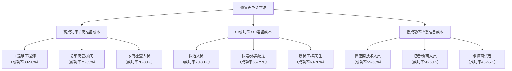
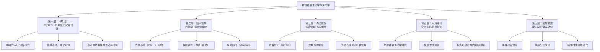

## 23.5 物理社会工程学技巧

物理社会工程学（Physical Social Engineering）是指攻击者通过现实世界中的肢体行为、身份伪装和环境操控，绕过组织的物理安全防线，进入受限区域或获取敏感信息的技术体系。与远程社会工程学（电话、邮件）不同，物理社会工程学要求攻击者亲临现场，面对面的交互带来了更高的风险，但也可能获得更大的回报——直接接触目标资产。

本章将系统地拆解物理社会工程学的**道（原理机制）—法（方法论框架）—术（具体技巧）—器（工具装备）**，从心理学基础到实战技术，再到纵深防御策略，帮助读者建立完整的知识体系。

### 23.5.1 物理社会工程学的心理学基础

理解物理社会工程学为什么有效，比背诵技巧列表重要得多。所有物理侵入技术都建立在以下心理学原理之上。

**权威服从（Authority Compliance）**

斯坦福大学心理学家斯坦利·米尔格拉姆（Stanley Milgram，1963）的经典电击实验表明，65%的参与者会将电击强度提升至致命水平，仅仅因为实验者穿着白大褂、以权威口吻下达指令。在社会工程学场景中，穿着制服、使用行业术语、携带专业工具的人会自动触发目标人物的"权威服从"机制——人们倾向于不质疑权威人物。

在物理渗透中，这一原理的具体表现包括：
- 穿着IT技术支持制服的人进入服务器机房，几乎不会被员工阻拦
- 携带梯子和工具箱的人出现在办公区，人们默认他们是维修工人
- 穿着西装的"审计人员"在走廊行走，保安会主动为其开门

**从众效应（Social Proof / Herding）**

罗伯特·西奥迪尼（Robert Cialdini）在其著作《影响力》中指出，人们在不确定的情境中会观察他人的行为来决定自己的行动。如果一个人看到其他人刷卡进入某扇门，他可能会假设这位跟随者也经过了授权——尤其是当跟随者表现自然时。

**善意假设（Good Samaritan Bias）**

1973年，普林斯顿大学的达利和巴特森（Darley & Batson）在"好撒玛利亚人"实验中验证：情境压力会显著影响人们提供帮助的意愿，但总体上大多数人倾向于帮助看似需要帮助的人。物理社会工程学利用这一点——攻击者双手抱满箱子、假装迷路、或在电话中显得焦急，都会诱导员工主动帮助其通过门禁。

### 23.5.2 尾随进入（Tailgating / Piggybacking）

尾随进入是最基础但最高效的物理侵入技术。仅凭这一招，就成功突破了全球90%以上的实体安全测试。

**机制分类**

尾随进入可细分为两种场景：

| 类型 | 英文术语 | 定义 | 风险等级 |
|------|---------|------|---------|
| 尾随（Tailgating） | Tailgating | 未经授权者跟随授权人员通过门禁，后者知情但未阻止 | ⭐⭐⭐ 中等 |
| 搭车（Piggybacking） | Piggybacking | 未经授权者请求或欺骗授权人员让其通过门禁，后者主动配合 | ⭐⭐⭐⭐⭐ 极高 |

**实战场景设计**

```plaintext
┌─────────────────────────────────────────────────────────────────┐
│                   尾随进入——场景矩阵                            │
├─────────────────────────────────────────────────────────────────┤
│  场景          道具           话术                    成功率   │
├─────────────────────────────────────────────────────────────────┤
│  双手抱满     空纸箱/文件盒   "不好意思，帮我开个门"   85-95%  │
│  假装通话     耳机/手机       "嗯嗯，我马上到会议室"   75-85%  │
│  吸烟社交     香烟/打火机     "忘带卡了，蹭一下"      70-80%  │
│  外卖/快递     空包裹/袋子     "X公司的外卖"           80-90%  │
│  匆忙赶路     公文包/笔记本   "让一下让一下，迟到了"   65-75%  │
│  雨天场景     雨伞（湿）      抖雨伞，表现狼狈         80-90%  │
└─────────────────────────────────────────────────────────────────┘
```

**高阶技巧——Piggybacking 蓄意搭车**

与被动尾随不同，蓄意搭车（Piggybacking）需要与目标建立短暂的社会连接：

1. **提前侦查**：在目标大楼周边蹲点，观察员工出入模式。记录哪些人友善（可能在电梯中与人聊天）、哪些人警惕（会确认门禁是否关好）。标记最佳目标。

2. **制造接触场景**：在目标常去的咖啡店"偶遇"，排队时自然攀谈。提前了解该公司的内部新闻（可从LinkedIn、公司官网获取），在对话中提及"你们部门的XX项目最近很厉害"——这会让目标认为你是内部人员。

3. **同步进入**：与目标一起走回大楼，保持对话的自然延续。在接近门禁时，可以稍微停顿制造"等待刷卡的间隙"——目标通常会直接让你一起通过。

4. **事后衔接**：如果被前台或保安询问，目标本人会帮你解释："他是来找我的"——这是最强大的防御绕过方式。

**真实案例：某安全公司的红队测试**

2019年，一家财富500强企业委托红队进行物理渗透测试。红队成员穿着印有该公司Logo的Polo衫（花30美元在定制T恤店制作），早上8:30拎着星巴克和公文包走向大门。他故意在刷卡时"失败"了两次，看起来困惑而焦急。一名好心的员工说："你的卡是不是消磁了？跟我进来吧。"他成功地进入了CEO办公室所在的第12层。全程耗时47秒。该公司当时部署了价值200万美元的门禁系统。

**国内案例：某互联网大厂的社会工程学攻防演练**

2022年，某国内安全团队受委托测试某一线互联网公司北京总部。测试者以"供应商技术工程师"身份，携带伪装过的工具包（内部装有Wi-Fi Pineapple和BadUSB设备），在早高峰时段通过尾随进入办公区。进入后，他在公共区域插入了Wi-Fi Pineapple设备试图捕获网络凭证。虽然设备最终被安全团队部署的无线入侵检测系统发现，但物理进入本身未被阻止。

### 23.5.3 假冒身份（Impersonation）

假冒身份是物理社会工程学中的必杀技之一。与尾随不同，假冒身份不需要等待他人的疏忽——攻击者主动创造信任。

**假冒角色金字塔**

不同假冒角色需要的准备成本和成功率的关系如下：



**深度拆解：IT运维工程师假冒**

这是成功率最高的假冒角色，因为IT人员拥有进入任何区域的合理性。完整实施流程如下：

**阶段一：背景准备（3-7天）**
- 研究目标公司使用的IT系统：通过招聘信息判断（"要求熟悉Cisco/Juniper设备"→大概率使用Cisco）、通过LinkedIn员工技能标签推断
- 制作与目标环境匹配的制服：建议选择"第三方运维承包商"而非该企业自有IT部门（后者容易被内部员工识破）
- 准备假工牌：使用在线工牌生成器（如 idcreator.com），注意模糊照片、遮挡部分信息、选择长焦拍摄的模糊风格更真实
- 准备工具清单：
  - 笔记本电脑（贴有虚构的资产管理标签）
  - 网线钳、测线仪（真实设备，以示专业）
  - 品牌Logo贴纸（贴在工具箱上）

**阶段二：电话预热（1天）**
- 给前台或IT部门打电话："您好，我是XX网络（虚构的第三方运维公司）的技术支持张工，明天下午有两台核心交换机需要做固件升级，我跟你们IT部的王经理确认过了。需要提前报备一下来访信息。"
- 如果对方说"没有王经理"，立即接话："那可能我记错了，应该是徐总监那边安排的，要不我晚点再跟您确认？"——礼貌退场，更换策略。
- 如果对方接受了报备信息，则在正式系统中留下了"合法"记录。

**阶段三：现场渗透（1天）**
- 到达时间避开高峰期：上午10:30或下午14:00，门禁安保注意力较低
- 在登记处展示身份证（真实或假证均可），报备姓名和"被访人"（电话预热时记录的信息）
- 进入后直接前往IT机房区域。如果在走廊被拦截，主动出示工牌（自然遮挡姓名）并说："机房36号柜链路告警，我过来排查一下"
- 目标操作：在机柜中安装硬件键盘记录器、在交换机镜像端口上连接监听设备、在服务器管理口（iLO/iDRAC）植入后门

**阶段四：撤离**
- 不要在原路返回时显得匆忙。可以购买一瓶饮料、假装打电话、或者在楼道里停留一会儿——重要的是不要看起来像在逃跑
- 离开时向保安点头示意，甚至可以说"修好了，23号柜的网线松动"

**深度拆解：快递/外卖配送假冒**

这个角色在2020年之后的渗透测试中越来越流行，因为：
- 外卖/快递人员每天数以百计，安保系统会逐渐"麻木"
- 穿着配送制服是完美的掩护——人们不会对一个穿着美团/饿了么制服的人产生怀疑
- 配送包裹可以作为隐藏工具的理想容器

具体实施：
1. 真实包裹+虚假送达：购买一个真实的快递包裹（从淘宝下单寄到目标公司），将自己伪装成该快递公司的配送员。到达前台时，你确实有一个真实包裹需要签收——这构成了"证据"
2. 多层包裹：大包裹内部设有隐藏隔层，携带侦查设备
3. 配送时使用平板让收件人电子签名——平板屏幕实际上是录制的，用于记录面部表情和楼层信息

### 23.5.4 USB诱饵攻击（USB Drop Attack / USB Baiting）

USB诱饵攻击结合了心理操控和物理设备投放，是物理社会工程学中极具杀伤力的技术。根据Verizon 2023年数据泄露调查报告，超过60%的员工会将捡到的USB设备插入工作电脑。

**为什么USB诱饵如此有效——心理学原理解析**

卡内基梅隆大学的2016年研究（Tischer et al.）在校园进行了实地测试：研究人员在公共场所"遗落"了297个USB设备，48%的被捡拾者将其插入电脑查看内容。当USB标签带有"机密"或"工资"字样时，打开率上升至72%。

这种行为的心理学根源在于：

| 心理驱动因素 | 解释 | 攻击者如何利用 |
|-------------|------|--------------|
| 好奇心驱动 | 人类天生对未知信息有探索冲动 | 诱饵贴上诱导性标签 |
| 利他主义 | 人们想归还失物或帮助失主 | 标注"毕业论文"或"简历" |
| 利益驱动 | 人们希望获得意外利益 | 标注"2024薪酬方案" |
| 漠视安全 | 大多数人不认为插一个U盘会带来风险 | 利用安全意识缺口 |

**诱饵设计与分层策略**

```plaintext
┌─────────────────────────────────────────────────────────────────┐
│                    USB诱饵分层投递策略                          │
├──────────────────────────────────────────────┬──────────────────┤
│  层级          标签文案             目标人群    预期拾取率       │
├──────────────────────────────────────────────┼──────────────────┤
│  L1 强诱饵    "2024-年终奖分配方案"    全体员工     80-90%         │
│  L2 利益诱饵  "裁员名单-标注版"       中层员工     70-80%         │
│  L3 好奇诱饵  "总经理办公室监控.mp4"   基层员工     60-75%         │
│  L4 善意诱饵  "求归还-我的毕设"       学生/实习    50-70%         │
│  L5 工具诱饵  "IT-网络配置备份"       技术员工     40-60%         │
└──────────────────────────────────────────────┴──────────────────┘
```

**投放位置优化**

通过实地测试积累的投放数据表明，不同位置的拾取率差异显著：

```text
停车场（员工停车区）        → 拾取率：35-45%  → 优势：人流量适中，隐蔽
主入口大堂                  → 拾取率：25-35%  → 优势：人流大，但监控多
吸烟区/休息区               → 拾取率：60-75%  → 优势：放松状态，注意力低
会议室                      → 拾取率：45-55%  → 优势：参与者互动，易被捡起
卫生间（洗手台）            → 拾取率：30-40%  → 优势：短暂停留，印象深
电梯内/电梯口               → 拾取率：50-65%  → 优势：短暂封闭空间
茶水间/咖啡机旁             → 拾取率：65-75%  → 最优位置，停留时间长
```

**恶意载荷技术栈**

现代USB诱饵攻击已远超简单的自动运行脚本。以下是完整的攻击载荷层级：

| 载荷类型 | 说明 | 检测难度 | 对抗措施 |
|---------|------|---------|---------|
| BadUSB (DuckScript) | 模拟键盘输入，自动执行命令 | ⭐⭐⭐⭐⭐ 极难检测 | USB设备白名单 |
| HID攻击 (Teensy/Rubber Ducky) | 硬件级键盘模拟 | ⭐⭐⭐⭐⭐ 无法软件检测 | 物理端口管控 |
| 模拟CD-ROM | 利用U盘被识别为光驱自动运行 | ⭐⭐ 较易检测 | 禁用自动运行 |
| 宏载荷 | U盘中含Word/Excel带宏文档 | ⭐⭐⭐ 中等 | 禁用宏 |
| 文件隐藏+快捷方式 | 隐藏真实文件，替换为恶意.lnk | ⭐⭐⭐ 中等 | 显示文件扩展名 |
| 双面USB（充电+数据） | 外观像充电线，实为数据窃取器 | ⭐⭐⭐⭐ 极难目视检测 | 物理检查 |

**硬件工具推荐**

- **Rubber Ducky**（2003年发布，全球最知名的BadUSB设备）——$70，写入DuckyScript脚本，插入后模拟人类键盘输入
- **USB Kill**（电压浪涌设备）——用于物理破坏而非数据窃取，插入后摧毁设备
- **OMG Cable**（看起来完全像普通USB充电线）——内置Wi-Fi芯片和攻击载荷，远程触发
- **Flipper Zero**（多功能渗透测试工具）——集成了BadUSB、RFID克隆、iButton读取、红外控制等
- **Lanturtle**（以太网USB设备）——接入后提供远程网络接入能力
- **Packet Squirrel**（网络中间人设备）——插入网线即可进行流量操控

### 23.5.5 其他物理社会工程学技术

**肩窥（Shoulder Surfing）**

在公共场合（咖啡店、机场、列车）偷看目标设备的屏幕内容，获取密码、验证码、敏感文件内容。

实施要点：
- 最佳角度：目标正后方偏左或偏右15度，视线正好落在设备屏幕对角线方向，阅读效果最佳
- 基础防护：偏光屏幕滤镜将可视角度缩小至左右各15度
- 进阶防护：观察周围环境所有人的视线方向——如果有人反复朝你的屏幕方向看，立即锁屏
- 工具辅助：使用小型摄像设备从远处录制（手机长焦、GoPro胸挂拍摄）

**垃圾箱翻找（Dumpster Diving）**

从目标的垃圾中寻找敏感信息——这是一种低技术门槛但极高回报率的物理社会工程学技术。

可获取的高价值物品清单：
- 打印错误的内部文件（含人员姓名、部门结构、项目代码）
- 过期门禁卡（部分系统未及时注销）
- 员工名册和通讯录
- 带有便签的文档（可能包含密码）
- 废弃的硬盘/USB设备（含未擦除的数据）
- 快递单据（含内部结构信息）
- 带有二维码的废纸（扫描后可能进入内部系统）

法律注意：在中国，翻找垃圾获取个人信息可能触犯《个人信息保护法》和《刑法》第253条之一（侵犯公民个人信息罪），即使是丢弃的垃圾中的信息。在美国，最高法院在1988年California v. Greenwood案中裁定，放置于公共区域的垃圾不受第四修正案保护，但各州法律不同。

**物理摸底侦察（Physical Reconnaissance）**

在不直接接触目标的情况下，通过物理方式收集目标信息：
- **建筑测绘**：观察出入口数量、保安位置、摄像头角度与盲区、巡逻规律（夜间vs白天、工作日vs周末）
- **网络信号测绘**：在建筑物周围步行，使用Wi-Fi扫描工具（如Wigle.net Android应用）标注所有可见SSID、信号强度、加密类型
- **RFID信号截获**：使用Proxmark3或Flipper Zero在门禁附近捕获RFID卡片的UID和其他数据
- **人员行为模式记录**：记录关键人物的到离时间、出行路线、常去的咖啡店/餐厅、吸烟时间和位置

**社交验证绕过（Social Verification Bypass）**

当被保安或前台拦截时，攻击者使用的应急话术：

| 场景 | 话术模板 | 成功率 |
|------|---------|--------|
| "请出示工牌" | "哦我刚转岗，HR说新卡还在制作，工号是TX-7823（随手编一个），您帮我查一下？" | 40-50% |
| "您在哪个部门" | "我去找XXX部门的张磊，他约我过来的，应该在C区" | 55-65% |
| "请登记个人信息" | 填写一位虚构的"被访者"姓名和真实的分机号（通过前台电话目录获取） | 70-80% |
| "需要预约确认" | "抱歉我提前到了，可能预约的同事还在开会，我在沙发上等会儿" | 75-85% |

核心原则：永远不要对抗或争论，保持礼貌和合作态度。当保安坚持拒绝时，放弃尝试并自然离开——强迫进入会让你的行为模式进入安全监控系统的"可疑名单"，对未来的行动更不利。

### 23.5.6 纵深防御体系

理解了攻击技术之后，防御方需要的不是单一解决方案，而是一个多层次、相互补充的纵深防御体系（Defense in Depth）。



**关键防御技术详解**

**1. 反尾随门（Mantrap / Airlock）**

最高效的尾随防御手段，由两道互相联锁的门组成。进入规则：
- 双门互锁：一扇门开启时另一扇门锁定，无法同时打开
- 每次只允许一人通过
- 通过人数检测（热成像/称重传感器），检测到两人通过第一道门时自动报警
- 部分系统集成体感摄像头，检测异常行为模式

成本范围：人民币5-20万元/套（取决于集成度和认证方式）

**2. USB端口管控策略**

针对USB诱饵攻击的最有效防御：

| 防御层级 | 措施 | 技术实现 | 成本 |
|---------|------|---------|------|
| 策略层 | 禁用USB存储设备 | 组策略/Intune配置 | 免费（软件） |
| 技术层 | USB设备白名单 | 仅允许经IT部门注册的唯一VID/PID设备 | 中等 |
| 物理层 | USB端口物理封堵 | 使用树脂或防盗螺丝封堵USB-A端口 | 极低 |
| 检测层 | 端点检测响应（EDR） | 检测BadUSB的异常键盘输入速率 | 较高（许可证费用） |

**3. 安全意识培训最佳实践**

有效的社会工程学防御培训应摒弃传统的"记住10条规则"方式，改为情境化训练：

- **每个季度一次短训练**（15分钟，而非冗长的全天培训），使用微型模拟
  - 第1周：发送钓鱼邮件模拟（远程）
  - 第5周：安排人员尾随测试（物理）
  - 第9周：在公共区域扔下标记过的USB设备（物理）
  - 结果反馈：对每个"失守"的员工进行1对1辅导（不处罚）

- **鼓励报告的文化**
  - 设立内部"可疑行为报告"通道（如Slack机器人、钉钉/飞书快捷入口）
  - 报告者每月抽奖获得小礼品（而非惩罚机制）
  - 每次真实事件后发布匿名复盘（保密细节，教方法论）

**4. 物理渗透测试执行建议**

组织应定期聘请外部红队进行物理渗透测试：

| 测试频率 | 范围 | 建议时长 |
|---------|------|---------|
| 每年1次 | 所有办公场所的尾随+假冒测试 | 2-3天 |
| 每2年1次 | 全范围测试（含USB诱饵、垃圾箱翻找） | 5-7天 |
| 特殊事件后 | 安全事件整改后验证 | 1-2天 |

### 23.5.7 经典案例深度分析

**案例一：Kevin Mitnick 的传奇渗透（1995年）**

被誉为"世界头号黑客"的Kevin Mitnick在职业生涯中几乎不依赖技术漏洞，而是几乎完全依靠社会工程学。他最经典的物理入侵之一是对某电信公司的渗透：

1. 他冒充该公司的安全审计人员，提前一周通过电话预约了与IT经理的会面
2. 到达时穿着正装、携带伪造的公司ID和一台IBM ThinkPad
3. 在会面中，他用"我需要验证一下我们的网络安全配置是否符合要求"为由，被单独留在机房达45分钟
4. 在这45分钟内，他安装了硬件网络嗅探器并复制了多个核心系统的配置

Mitnick后来说："我从未使用过复杂的零日漏洞。我的武器就是电话和笑容。"（来源：Kevin Mitnick,《Ghost in the Wires》, 2011）

**案例二：Black Hat 2019年的企业社会工程学调查**

安全公司Social-Engineer, LLC在2019年进行了一项场外调查：他们对27家财富500强公司进行了物理社会工程学测试，结果如下：

- 92%的公司被成功渗透至少一次
- 在四次成功的尾随测试中，没有一次被员工主动拦截或询问
- 假冒"IT人员"测试的成功率高达88%
- 最成功的诱饵USB标签是"年终考核评分表"和"裁员名单"
- 反尾随门（Mantrap）是唯一被攻破率为0%的防御措施

**案例三：国内某云计算厂商的物理渗透演练（2023年）**

国内某安全团队披露了一次针对某一线城市云计算公司的物理渗透全过程：

- 测试者伪装成电信运营商的技术员，声称进行光缆割接升级
- 携带仿制的中国电信制服和工具包（内部装有渗透测试设备）
- 使用伪造的《网络割接方案》（PDF格式，含公章样式的图像）
- 成功进入IDC机房区域，并在核心交换机上连接了便携式抓包设备
- 从接到任务到成功进入机房总计耗时6天（3天准备+1天预热+1天执行+1天撤离）

**案例四：USB诱饵的大规模实地实验**

2016年，伊利诺伊大学香槟分校的Tischer等人在校园进行了最大规模的USB诱饵实验：

- 共投放297个USB设备
- 48%（143个）被捡拾并插入电脑
- 携带"Confidential"标签的USB插拔率（72%）远高于未贴标签的（32%）
- 设备被发现的时间中位数为6分钟
- 最快的设备在投放后1分47秒即被捡起并插入

### 23.5.8 法律与道德界限

**物理社会工程学的法律红线**

在中国，未经授权实施的物理社会工程学行为可能触犯以下法律：

| 行为 | 可能触犯法律 | 最高刑期 |
|------|------------|---------|
| 假冒身份进入办公场所 | 《治安管理处罚法》第51条（冒充国家机关工作人员）或《刑法》第280条（伪造公文证件） | 10年 |
| 门禁尾随进入 | 非法侵入住宅罪/非法侵入计算机信息系统罪（如进入机房） | 3年 |
| 窃取他人信息 | 《个人信息保护法》+《刑法》第253条之一 | 7年 |
| 投放恶意USB设备 | 《刑法》第285条（非法侵入计算机信息系统罪）/第286条（破坏计算机信息系统罪） | 5年 |

**道德准则**

本书所有物理社会工程学技术仅供以下场景使用：
1. **授权的红队/渗透测试**：已签署书面授权书，明确测试范围、时间、方法
2. **安全教育与防御建设**：用于培训安全人员识别和防御此类攻击
3. **安全研究**：在受控环境中进行，不针对任何未经授权的第三方

**禁止行为**：
- 未经授权对任何个人或组织实施
- 利用所学技术从事非法获利活动
- 将技术细节用于社会工程学培训以外的目的

### 23.5.9 总结

物理社会工程学是网络安全链中最容易被忽视的环节。与远程攻击不同，物理渗透利用了人类最深层的心理倾向——信任、助人、服从权威——而这些倾向无法通过任何软件补丁来修复。

**攻击者的分层路径**：观察→伪装→接触→渗透→撤离

**防御者的纵深哲学**：硬件防不住信任，但多层检查可以将一次成功的物理渗透从"低难度"变为"极高难度"

**关键数据提醒**：92%的企业在物理社会工程学测试中被成功渗透。任何组织想要实现真正的安全，必须把物理层和数字层视为同一枚硬币的两面。

**行动清单（针对安全团队）：**
- [ ] 在大堂和机房部署反尾随门（Mantrap）
- [ ] 实施USB设备白名单策略，禁用未授权USB存储
- [ ] 每季度进行一次自动化社会工程学模拟测试
- [ ] 每年进行一次全范围物理渗透测试
- [ ] 建立"报告可疑行为无惩罚"的安全文化
- [ ] 对所有新员工进行入职社会工程学安全意识培训
- [ ] 在出入政策中明确禁止Piggybacking行为
- [ ] 定期审查和更新员工访问权限

**行动清单（针对个人）：**
- [ ] 从不允许任何人在你背后通过门禁——即使对方看起来友善或需要帮助
- [ ] 从不将不明USB设备插入电脑
- [ ] 在公共场所使用偏光防窥屏幕保护隐私
- [ ] 对于自称IT/物业/快递的陌生人进入办公区域保持警惕
- [ ] 主动报告可疑行为，不认为"有人会管"
- [ ] 不在办公桌面上放置包含密码或敏感信息的便签
- [ ] 下班前锁屏、锁门、清理桌面（Clean Desk Policy）