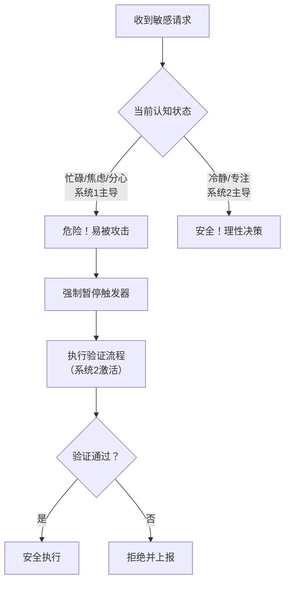
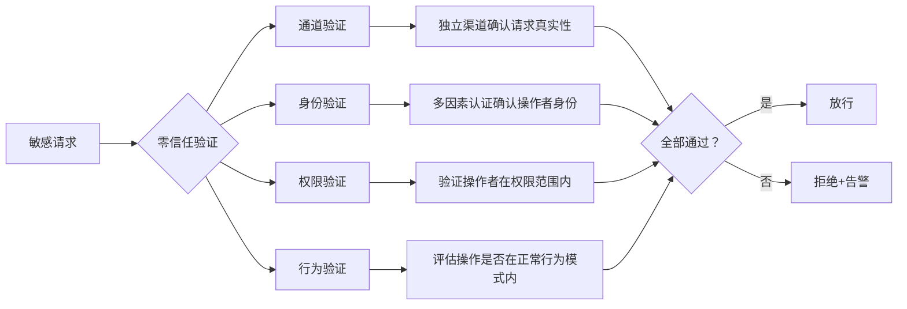

# 23.6 社会工程学防御技巧

前面五节详细讲解了社会工程学的攻击技术——信息收集、信任建立、钓鱼攻击、电话诈骗、物理渗透。但攻防是一体两面，**真正的安全不是知道攻击者有多强，而是知道自己该如何防御**。本节将构建一套完整的防御体系，从个人防护到组织防线，从心理免疫到技术屏障，层层递进。

## 23.6.1 防御理论框架——理解"为什么"比知道"做什么"更重要

在给出具体操作清单之前，必须先建立防御的底层逻辑。不理解原理的防御是脆弱的——攻击者稍微变换手法就能绕过。

### 23.6.1.1 社会工程学防御的三大支柱

美国国家标准与技术研究院（NIST）在《Computer Security Incident Handling Guide》（SP 800-61 Rev.2）和相关安全出版物中，构建了一个适用于社会工程学防御的框架：

```text
社会工程学防御体系
├── 支柱一：认知防御（People）
│   ├── 安全意识的深度内化
│   ├── 心理触发点的识别训练
│   └── 决策流程的自动化
│
├── 支柱二：流程防御（Process）
│   ├── 验证与审批流程
│   ├── 事件上报与响应流程
│   └── 权限变更与访问控制流程
│
└── 支柱三：技术防御（Technology）
    ├── 通信层防护（邮件/电话/即时通讯）
    ├── 身份层防护（MFA/零信任）
    └── 监控层防护（异常检测/审计日志）
```

**三者缺一不可**：只有培训没有流程，员工知道该怎么做但没人执行；只有流程没有技术，手工流程能被社会工程学绕过；只有技术没有培训，员工会成为绕过技术的最薄弱环节。

### 23.6.1.2 防御的博弈论视角——为什么"相信但验证"是唯一可行的策略

社会工程学防御本质上是一个 **不完全信息动态博弈**：

| 场景 | 对方是合法人员 | 对方是攻击者 |
|------|--------------|-------------|
| **你完全信任** | ✅ 正常效率 | ❌ 被攻击成功 |
| **你完全怀疑** | ❌ 效率极低，关系受损 | ✅ 防御成功 |
| **你"相信但验证"** | ✅ 效率正常 + 验证成本低 | ✅ 防御成功 |

理性策略：**默认善意 + 强制验证**。对所有敏感请求执行独立验证（通过另一个渠道确认），成本低、效果好。

### 23.6.1.3 注意力资源模型——为什么人会犯错

Daniel Kahneman在《思考，快与慢》（Thinking, Fast and Slow）中将人类思维分为两个系统：

- **系统1（快思考）**：自动、直觉、情绪化，消耗的能量极少（日常决策的95%）
- **系统2（慢思考）**：理性、分析、需要努力，消耗的能量极大

**攻击者的核心策略：让目标保持在系统1模式。**

当你忙碌、焦虑、分心时，系统1主导决策——这正是攻击者最希望的状态。防御的关键不是让人变成永不犯错的机器，而是**在关键决策点强制切换到系统2**。



## 23.6.2 个人防护——你的第一道也是最后一道防线

### 23.6.2.1 身份验证的纵深防御协议

单一验证方式太容易被绕过（攻击者可以伪造来电显示、冒充邮箱、伪造工牌）。正确的做法是**多通道独立验证**：

```text
针对请求的验证层级（从低到高风险）
├── 低风险（公开信息请求）
│   └── 合规即可，无需验证
│
├── 中风险（内部信息、系统访问）
│   └── 双通道验证
│       ├── 通道1：电话回拨（通过内部通讯录查找号码）
│       └── 通道2：内部即时通讯确认
│
├── 高风险（敏感数据、转账、权限变更）
│   └── 三通道+物理验证
│       ├── 通道1：面对面确认
│       ├── 通道2：视频通话（使用已建立的通讯方式）
│       └── 通道3：上级书面授权
│
└── 紧急请求（声称的安全事件）
    └── 必须执行"暂停与验证"流程
        ├── 规则：越紧急越需要验证（攻击者的惯用手段）
        ├── 暂停：口头承诺"我立即处理"但实际不操作
        └── 验证：通过独立渠道联系声称发出请求的人
```

**实操示例——验证来电者身份的规范流程**：

假设你接到自称是IT支持人员的电话，说你的电脑存在安全问题需要立即操作：

1. **不要当场操作**。说"好的，我记下了，稍后处理"。
2. **挂断电话**。
3. **查找官方IT支持号码**。通过内部通讯录或公司官网，不要用对方提供的号码。
4. **回拨验证**。致电IT部门，询问"是否有叫XX的同事在联系员工处理安全问题？"
5. **如果回拨确认不存在该人员**：记录来电号码、时间、对方声称的信息，上报安全团队。
6. **如果回拨确认存在该人员**：让对方提供工单号，通过工单系统确认后再操作。

**关键原则**：绝不使用对方提供的联系方式或链接——攻击者可以伪造一切单通道信息。

### 23.6.2.2 三种通信渠道的安全操作规范

**电话安全协议**：

| 场景 | 安全操作 | 常见攻击手法 |
|------|---------|-------------|
| 对方要求提供密码/验证码 | **直接拒绝**——正规机构不会在电话中索要密码 | 冒充客服、银行、IT支持 |
| 对方要求远程操作电脑 | **挂断后自行联系IT部门** | 冒充IT支持，植入恶意软件 |
| 对方声称是熟人/上级 | **挂断并通过已知号码回拨** | 声音克隆Deepfake或冒充身份 |
| 来电显示是官方号码 | **号码可伪造（Caller ID Spoofing）**，不信任来电显示 | 伪基站、VoIP伪造 |

**邮件安全协议**：

```plaintext
# 邮件处理红绿灯规则

🟢 绿灯（可安全操作）：
  - 发件人地址完全匹配已知联系人
  - 内容不包含任何敏感操作请求
  - 无异常链接或附件

🟡 黄灯（需要验证）：
  - 发件人地址相似但略有不同（如 rnicrosoft.com vs microsoft.com）
  - 要求点击链接登录某个系统
  - 包含紧迫感话术（"立即处理"、"限时"、"否则"）
  - 发件时间异常（凌晨3点的工作邮件）

🔴 红灯（直接上报）：
  - 要求转账/汇款/购买礼品卡
  - 要求提供密码/验证码/银行卡信息
  - 附件为.exe/.scr/.vbs等可执行文件
  - 声称是CEO/高管，但来自个人邮箱（如@gmail.com）

▶ 邮件链接验证步骤：
  1. 不要点击链接
  2. 将鼠标悬停在链接上，查看实际URL
  3. 如果URL与声称的网站不符，直接删除
  4. 如果需要确认，手动输入官方网址访问
```

**即时通讯安全协议**（微信/企业微信/Slack/Teams）：

- 来自"老板"的转账要求：**无论多紧急，必须电话或当面确认**
- 来自"同事"的帮忙请求（点击链接、提供验证码）：**直接打电话确认**
- 冒充供应商的进群请求：**核实入群理由，确认为什么需要加这个群**
- 陌生人发送的文件/链接：**不打开，不转发**

### 23.6.2.3 物理环境的安全行为

在办公场所，社会工程学攻击者可能通过物理手段获取信息：

**尾随攻击防御**：
- 进入有门禁的区域后，**确认后面没有人尾随再关门**
- 如果有人请求你帮忙开门（"忘带工牌了"），**让对方联系前台或安保人员**
- 不要用自己的工牌为陌生人开门——这是安全制度明确禁止的行为

**敏感信息防护**：
- 屏幕防窥：离开座位时锁定电脑（Win+L / Ctrl+Cmd+Q）
- 文档管理：桌面不放置敏感文件，下班前清理桌面
- 交谈控制：在公共区域（电梯、咖啡厅、餐厅）不讨论敏感工作内容
- 打印安全：取走所有打印资料，不把敏感文件留在打印机上

**访客管理**：
- 遇到自称"维修人员"、"快递员"、"审计人员"的陌生人：**联系前台确认**
- 维修工单必须有系统记录，不要仅凭口头说明放行
- 快递应统一由前台签收，不要让人进入办公区送货

### 23.6.2.4 数字踪迹管理——减少被攻击者利用的信息

攻击者需要信息才能定制攻击。减少公开暴露的信息量，是成本最低的防御方式：

| 信息类型 | 暴露风险 | 控制措施 |
|---------|---------|---------|
| 工作邮箱 | 用于鱼叉式钓鱼 | 不在公开论坛/评论区留下工作邮箱，使用临时邮箱注册非必要服务 |
| 组织架构 | 用于冒充上级/同事 | 不在LinkedIn/脉脉公开详细岗位和汇报关系 |
| 出差行程 | 用于精准时机攻击 | 不在社交媒体公开出差时间和地点 |
| 兴趣爱好 | 用于建立rapport | 公开社交账号不关联工作身份 |
| 照片/证件 | 用于伪造身份 | 不在社交媒体发布工牌、出入证、内部系统截图 |

**个人信息暴露的自查方法**：

```bash
# 搜索自己的邮箱是否在数据泄露中
# 1. 访问 haveibeenpwned.com 检查邮箱泄露
# 2. 使用 Google 搜索 "yourname@company.com"
# 3. 搜索 "intext:yourname intext:company.com" 看哪些页面包含信息
# 4. 在 GitHub 上搜索公司名+敏感关键词
```

## 23.6.3 组织防护——构建系统化的防御体系

个人的防护意识再好，如果组织缺乏系统化的防御机制，一个疏忽就可能酿成大祸。组织防护需要从培训、流程、技术三个维度构建。

### 23.6.3.1 安全意识培训的三层体系

**层次一：基础培训（所有员工，覆盖100%）**

目标：建立基本安全意识，识别常见攻击信号

| 培训模块 | 内容 | 时长 | 频率 |
|---------|------|------|------|
| 社会工程学入门 | 什么是SE，为什么重要，真实案例 | 1小时 | 入职培训+每年1次 |
| 钓鱼邮件识别 | 6种红旗信号 + 真实钓鱼邮件示例分析 | 1小时 | 入职培训+每季度1次 |
| 电话安全 | 冒充身份识别 + 回拨验证流程 | 30分钟 | 入职培训 |
| 物理安全 | 尾随防御 + 访客管理 + 桌面清理 | 30分钟 | 入职培训+每年1次 |
| 上报流程 | 发现可疑活动后的上报渠道和流程 | 15分钟 | 入职培训 |

**层次二：进阶培训（高风险岗位，覆盖20%）**

目标：针对财务、IT、HR、高管助理等高风险岗位的专项培训

| 培训模块 | 内容 | 时长 |
|---------|------|------|
| BEC防御专项 | CEO欺诈识别、发票验证流程、转账审批 | 2小时 |
| IT支持专项 | 密码重置安全、远程协助验证、权限变更审批 | 2小时 |
| 高管专项 | 深度伪造识别、个人安全、社交活动安全 | 1小时 |
| HR专项 | 入职/离职流程安全、员工信息保护 | 1小时 |

**层次三：红队模拟（全员参与，至少每季度1次）**

理论培训的效果有限——员工在模拟攻击中的表现才是真实的安全水平。

### 23.6.3.2 钓鱼模拟演练的完整实施流程

```text
钓鱼模拟演练生命周期
├── 阶段一：计划与设计（演练前1-2周）
│   ├── 确定演练目标（点击率 < 5%）
│   ├── 设计钓鱼场景（邮件/短信/电话）
│   ├── 选择目标人群（全员/特定部门）
│   └── 制定奖惩规则
│
├── 阶段二：实施（演练日）
│   ├── 发送钓鱼邮件（分批发送避免服务器过载）
│   ├── 记录点击行为
│   ├── 记录信息输入行为
│   └── 启动即时干预（对高危操作弹出警告）
│
├── 阶段三：培训与反馈（演练后1-3天）
│   ├── 公布结果（去名化数据）
│   ├── 开展针对性培训
│   ├── 分析失败原因
│   └── 分享典型案例
│
└── 阶段四：评估与改进（演练后1周）
    ├── 对比历史数据
    ├── 调整培训内容
    ├── 优化技术防护
    └── 更新演练场景
```

**场景示例——不同难度的钓鱼邮件**：

| 难度 | 示例场景 | 预期识别率 |
|------|---------|-----------|
| 简单 | "恭喜你获得iPhone抽奖，点击领取"——明显的垃圾邮件 | 95%+ | 
| 中等 | "公司IT部门通知：请于今日前点击链接更新员工信息"——冒充内部通知 | 70-80% |
| 困难 | "XX部门同事分享给你的文件"——冒充内部人员 + 使用真实姓名 | 40-60% |
| 极度困难 | "【财务部】关于项目报销的更新说明"——高度定制化，包含真实项目信息 | 20-40% |

**关键指标**：

- **点击率（Click Rate）**：点击钓鱼链接的人数/目标总数。行业基准：首次演练20-30%，成熟组织3-5%
- **报告率（Report Rate）**：主动上报可疑邮件的人数/发现可疑邮件的人数。理想目标：90%+
- **信息泄露率**：在钓鱼页面输入密码/信息的人数。理想目标：0%
- **复犯率**：上一次演练中点击过的人再次点击的比例。趋势应持续下降

### 23.6.3.3 关键业务流程的安全控制

**转账支付流程（防范BEC攻击）**：

```plaintext
1. 发起阶段
   ├── 必须使用标准采购/支付系统提交请求
   └── 口头/邮件/即时通讯的转账要求 = 无效（不合法）

2. 验证阶段
   ├── 变更收款账户：必须通过电话（按通讯录号码回拨）确认
   ├── 首次交易：必须验证供应商资质和合同
   └── 紧急付款：必须双人审批（本人+上级），不使用电子签名

3. 审批阶段
   ├── 金额＜5万：直接上级审批
   ├── 金额5万-50万：部门负责人+财务负责人
   └── 金额＞50万：CEO+CFO双签（必须面对面或视频会议）

4. 执行阶段
   └── 操作员不负责审批，审批人不负责操作 → 职责分离
```

**密码重置与账户操作流程**：

```plaintext
密码重置流程（针对声称遗忘密码的员工）
├── 方式一（自助）：通过企业SSO自助重置
│   └── 需要验证手机验证码+邮箱验证码
│
├── 方式二（IT协助）：需要以下验证中的至少2项
│   ├── 员工编号 + 生日
│   ├── 经理审批邮件（不是邮件转发，是经理亲自发的）
│   ├── 注册手机号的短信验证码
│   └── 生物识别验证（指纹/人脸）
│
└── 红线规则：
    ├── 绝不直接通过电话重置密码
    ├── 绝不将一次性验证码告诉任何人
    └── 所有密码重置操作必须有审计日志
```

**访客管理流程**：

```plaintext
访客管理规范
├── 预约阶段
│   ├── 员工必须在访客管理系统中提前预约
│   ├── 登记访客姓名、公司、联系方式、访问目的
│   └── 访客收到电子二维码
│
├── 到达阶段
│   ├── 前台扫描二维码，核验身份证件
│   ├── 发放临时访客卡（不能通过门禁进入受限区域）
│   └── 通知对接员工到前台接人
│
├── 访问阶段
│   ├── 员工全程陪同（访客不可单独行动）
│   ├── 不能在访客面前输入密码、讨论敏感信息
│   └── 访客不得拍摄/记录内部信息
│
└── 离开阶段
    ├── 访客归还临时卡
    └── 系统记录离开时间
```

### 23.6.3.4 社会工程学事件响应计划

即使有最好的防御，攻击仍可能成功。一套完善的事件响应计划至关重要：

| 阶段 | 行动 | 责任方 | 时间要求 |
|------|------|--------|---------|
| 检测 | 员工上报可疑活动/安全系统告警 | 全员 | 立即 |
| 确认 | 安全团队调查确认真实性 | 安全团队 | 15分钟内 |
| 定位 | 确定受影响的数据/系统/人员 | 安全团队 | 1小时内 |
| 遏制 | 隔离受影响系统、重置凭证、通知潜在受害者 | 安全团队+IT | 2小时内 |
| 根除 | 移除攻击者留下的后门/恶意软件 | IT+安全 | 4小时内 |
| 恢复 | 恢复受影响系统，数据回滚 | IT | 24小时内 |
| 复盘 | 分析攻击路径，改进防御 | 安全团队+管理层 | 1周内 |

**员工上报渠道**：

- **一级渠道（最快）**：安全热线电话（24小时）
- **二级渠道（方便）**：企业微信/Teams/Slack的#security频道
- **三级渠道（正式）**：security@company.com邮箱
- **匿名渠道**：举报热线或第三方匿名投诉平台

**员工上报的激励原则**：上报可疑事件获得正向激励（表扬、小奖励），绝不因"被钓鱼成功"而惩罚员工。如果员工因为害怕被批评而不上报，攻击者可以长时间不被发现。

### 23.6.3.5 技术控制措施矩阵

| 安全域 | 技术措施 | 防御的攻击类型 | 优先级 |
|--------|---------|---------------|--------|
| 邮件安全 | 邮件安全网关（Proofpoint/Mimecast）过滤恶意邮件 | 钓鱼攻击 | 🔴 最高 |
| 邮件安全 | DMARC/SPF/DKIM配置，防止域名仿冒 | 域名欺诈 | 🔴 最高 |
| 邮件安全 | 链接重写与点击保护（重写所有链接，点击时实时检测） | 恶意链接 | 🟡 高 |
| 邮件安全 | 附件沙箱+文件类型白名单 | 恶意附件 | 🟡 高 |
| 身份安全 | 多因素认证（MFA）：全员启用，不得有例外 | 凭证窃取 | 🔴 最高 |
| 身份安全 | 单点登录（SSO）+ 条件访问策略 | 身份冒用 | 🟡 高 |
| 身份安全 | 异常登录检测（异常地理位置、非常用设备） | 账户入侵 | 🟡 高 |
| 网络安全 | 内部网络微分段（Micro-segmentation） | 横向移动 | 🟡 高 |
| 网络安全 | 零信任网络访问（ZTNA）替代VPN | 信任滥用 | 🟡 高 |
| 终端安全 | EDR（端点检测与响应） | 恶意软件执行 | 🔴 最高 |
| 终端安全 | USB端口管控（禁用自动运行） | 诱饵攻击 | 🟢 中 |
| 监控 | 用户实体行为分析（UEBA） | 异常行为 | 🟡 高 |
| 监控 | 敏感数据防泄露（DLP） | 数据窃取 | 🟡 高 |
| 通信 | 来电显示认证（STIR/SHAKEN协议） | 电话诈骗 | 🟢 中 |

## 23.6.4 心理免疫——培养对抗社会工程学的"抗体"

技术控制和流程规范可以被绕过，但正确的心理习惯是攻击者最难攻破的防线。

### 23.6.4.1 六种红旗心理信号

当你内心出现以下任何信号时，立刻进入"高警戒模式"：

```text
⚠️ 红旗信号1：被迫的感觉
"你必须立即……" / "现在就要……" / "否则就会……"
→ 攻击者在制造紧迫感
→ 防御：口头答应"好的"，然后挂断/退出，通过官方渠道再确认

⚠️ 红旗信号2：意外的帮助
收到了意外的礼品、优惠、帮助
→ 攻击者在利用互惠原则
→ 防御：不因为收到好处而放松警惕，独立评估请求本身

⚠️ 红旗信号3：熟悉的陌生感
对方"认识你"但你无法确认对方的身份
→ 攻击者做了信息收集
→ 防御：通过另一个渠道验证身份

⚠️ 红旗信号4：不当渠道
通过非正式渠道发来的正式要求（微信转账、私人邮箱的公司通知）
→ 攻击者在绕过正式流程
→ 防御：坚持走标准流程

⚠️ 红旗信号5：信息不一致
说的话与实际情况有细微出入（用了过时的名称、错误的职务）
→ 攻击者的信息收集不完整
→ 防御：即使小问题也要质疑

⚠️ 红旗信号6：过度热情
陌生人过于友好、过度恭维、主动提供帮助
→ 攻击者在建立rapport
→ 防御：区分"有人对你好"和"有人要你办事"
```

### 23.6.4.2 决策暂停——最有效的个人防御技巧

研究发现，如果人们在做出可能有害的决策前**暂停3秒钟**，犯错的概率降低约80%。这套方法被称为 **"3秒暂停法则"**：

```plaintext
【3秒暂停法则】

当收到任何敏感请求时，先做这三件事：
1. 暂停（1秒）：深呼吸，不要立即行动
2. 质疑（1秒）：问自己"这是真的吗？为什么要这样做？"
3. 验证（1秒）：决定用什么方式验证（回拨/询问同事/走官方渠道）

将这3秒变成肌肉记忆。在办公桌贴上提示：
▸ "任何让你紧张、害怕、兴奋的请求，先暂停3秒"
▸ "越紧急越需要验证——攻击者就等你慌"
```

### 23.6.4.3 破除"我不会被骗"的认知偏差

以下是人们最常有的五个错误认知，每个都会降低防御的警觉性：

| 错误认知 | 事实 | 矫正方法 |
|---------|------|---------|
| "我不会被钓鱼，太明显了" | 专业钓鱼高度定制化，识别率只有40-60% | 每封邮件都做最基本的验证 |
| "我们公司太小，没人会来攻击" | 小公司防御弱，反而是高价值目标 | 安全是每个人的事，与公司大小无关 |
| "骗子说话都有口音/破绽" | AI语音合成和专业的脚本能骗过大多数人 | 不看"像不像"，看"符合流程吗" |
| "熟人不会骗我" | 社交账号可能被盗、声音可能被Deepfake | 验证请求本身，而不是验证"是谁" |
| "技术能解决一切" | 90%的攻击利用的是人，不是技术漏洞 | 技术+流程+意识，三者缺一不可 |

### 23.6.4.4 借助"安全伙伴"机制互相保护

在组织中建立伙伴互助机制，是社会工程学防御最有效的手段之一：

```text
安全伙伴机制
├── 配对：两人一组，互为安全监督者
├── 交互验证：
│   ├── 遇到可疑请求 → 问伙伴 "你觉得这个邮件正常吗？"
│   ├── 操作敏感请求前 → 伙伴确认 "合规流程走完了吗？"
│   └── 发现异常情况 → 立即通知伙伴 "有人在冒充XX"
├── 互相培训：
│   ├── 分享收到的最新钓鱼邮件
│   └── 讨论最新的攻击手法
└── 奖励机制：
    └── 发现可疑事件并成功拦截 → 两人都获得激励
```

## 23.6.5 高级防御——面向未来威胁的进阶策略

### 23.6.5.1 AI驱动的社会工程学攻击防御

随着Deepfake、语音克隆、AI生成内容的普及，传统防御策略面临挑战：

**Deepfake视频/音频识别**：

| 识别维度 | 人工检查 | 技术检测 |
|---------|---------|---------|
| 视觉一致性 | 眨眼频率异常、嘴唇动作与语音不同步、面部光影异常 | 使用Deepfake检测工具（如Microsoft Video Authenticator） |
| 音频质量 | 背景噪音不自然、呼吸声缺失、音调变化不自然 | 使用AI语音检测模型（如Pindrop） |
| 内容一致性 | 对方是否知道只有你们两人知道的信息 | 设置"问题验证"（问一个只有真人才知道的信息） |
| 渠道验证 | 通过已建立的视频会议链接确认，不用对方发来的新链接 | 使用企业级视频会议平台的验证功能 |

**"安全词"机制**：高管、财务负责人之间约定一个安全词。在电话/视频沟通中，如果对方说不出安全词，就终止并上报。安全词定期更换，通过非电子方式传递（如当面告知）。

### 23.6.5.2 零信任架构的社会工程学应用

零信任（Zero Trust）的核心原则——"永不信任，始终验证"——同样适用于社会工程学防御：



### 23.6.5.3 组织防御成熟度模型

组织的社会工程学防御能力不是一蹴而就的。以下模型可以帮助评估当前阶段并规划提升路径：

| 成熟度等级 | 特征 | 钓鱼模拟点击率 | 代表行为 |
|-----------|------|--------------|---------|
| **Lv1 初始级** | 没有任何培训，没有技术防护 | 30-50% | "我们不会成为目标" |
| **Lv2 响应级** | 有基础培训，安装了邮件网关 | 15-30% | "收到奇怪邮件不要点" |
| **Lv3 规范级** | 定期培训+模拟演练+MFA | 5-15% | "这是安全制度要求的" |
| **Lv4 度量级** | 量化指标驱动+行为分析+持续改进 | 2-5% | "我们跟踪每个人的安全分数" |
| **Lv5 自适应级** | 零信任+AI防御+安全文化深入骨髓 | <2% | "安全是我工作的一部分" |

**评估方法**：通过钓鱼模拟结果、员工安全意识测试分数、事件响应时间和复盘质量来综合评估。

## 23.6.6 防御能力自检清单——你真正安全了吗？

以下清单可用于个人和组织的防御能力评估：

```plaintext
□ 个人防护（10项）
□ 1. 我是否知道至少两种验证陌生人身份的方法？
□ 2. 我是否会挂断电话后回拨官方号码？
□ 3. 我是否会检查邮件发件人地址的完整域名？
□ 4. 我是否不在电话中提供密码/验证码？
□ 5. 我是否离开座位时锁定电脑？
□ 6. 我是否为陌生人开门禁前会要求对方联系前台？
□ 7. 我是否有至少一个"安全伙伴"可以讨论可疑请求？
□ 8. 我是否知道本公司的安全事件上报渠道？
□ 9. 我是否不在社交媒体发布公司敏感信息？
□ 10.我是否对"紧急请求"保持怀疑态度？

□ 组织防护（10项）
□ 1. 公司是否有定期的安全意识培训和钓鱼模拟？
□ 2. 财务转账是否有独立的验证流程？
□ 3. 密码重置是否有身份验证机制？
□ 4. 是否有完善的访客管理系统？
□ 5. 是否全员启用了MFA？
□ 6. 是否部署了邮件安全网关和DMARC？
□ 7. 是否建立了安全事件响应团队和流程？
□ 8. 是否建立了员工上报可疑事件的激励机制？
□ 9. 高管和财务人员是否接受过BEC专项培训？
□ 10.是否定期评估和改进防御体系？

评分标准：
□ 16-20项达标：防御体系较完善，持续保持
□ 11-15项达标：有基础但存在明显短板
□ 6-10项达标：风险较高，需要系统性提升
□ 0-5项达标：非常危险，亟需建立防御体系
```

## 23.6.7 推荐资源与工具

### 安全培训资源

- **工具**：
  - KnowBe4：全球领先的安全意识培训平台，提供钓鱼模拟和培训内容
  - PhishMe（Cofense）：专注钓鱼模拟演练的平台
  - GoPhish：开源钓鱼模拟框架，适合技术团队自建
  - SET（Social Engineering Toolkit）：Kali Linux内置的渗透测试工具，可用于内部演练
- **阅读**：
  - 《社会工程学：安全体系中的人性漏洞》（Christopher Hadnagy）
  - 《FBI教你识破社会工程学攻击》（Joe Navarro）
  - 《Thinking, Fast and Slow》（Daniel Kahneman）
  - NIST SP 800-61 Rev.2：计算机安全事件处理指南

### 技术防护工具

- **邮件安全**：Proofpoint、Mimecast、Barracuda Email Security Gateway
- **身份安全**：Okta、Azure AD、Duo Security（MFA）
- **监控**：Splunk UEBA、Microsoft Sentinel、Darktrace
- **防钓鱼**：Microsoft Defender for Office 365、Area 1 Security
- **零信任**：Cloudflare Access、Zscaler、Palo Alto Prisma Access

### 检测工具

- 邮箱泄露检测：https://haveibeenpwned.com
- 域名仿冒检测：https://dnstwister.report
- 邮件安全验证：https://mxtoolbox.com/DMARC.aspx
- Deepfake检测：https://www.microsoft.com/en-us/ai/ai-for-good-video-authenticator

## 本节小结

社会工程学防御不是一套固定的规则，而是一种贯穿于日常工作生活的思维模式。核心要点可归纳为：

1. **信任但验证**：对任何敏感请求，通过独立渠道验证
2. **流程大于自觉**：依赖标准化流程，而不是个人判断力
3. **越紧急越可疑**：攻击者最常用的手段就是制造紧迫感，跳过验证环节
4. **上报要鼓励**：被发现不可怕，可怕的是被发现了却没人上报
5. **持续的改进**：防御不是一次性建设，而是通过演练、复盘、改进的持续循环

真正的安全不是永不犯错——没有人能做到完美。真正的安全是：**当你犯错时，有流程能拦截；当流程被绕过时，有人会报告；当报告发生时，有团队能响应。**

***

*防御社会工程学攻击，最坚固的防火墙不在服务器机房，而在每个人的心里。*