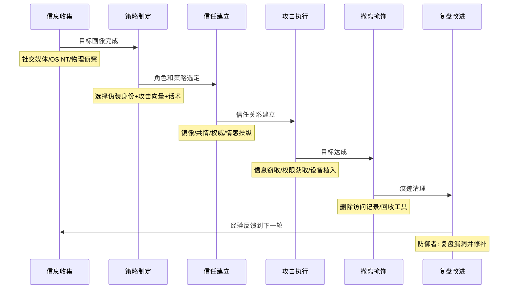

## 23.7 本节小结：构建社会工程学的完整知识体系

本章深入剖析了社会工程学的六大核心技巧领域，从信息收集到防御体系，构建了一个从"攻击者思维"到"防御者思维"的完整闭环。以下是对各节内容的系统梳理与升华。

---

### 23.7.1 六大核心技巧全景回顾

```mermaid
graph TD
    title[社会工程学核心技巧全景] 
    
    title --> A["第1环：信息收集<br>（一切攻击的起点）"]
    title --> B["第2环：信任建立<br>（社会工程的燃料）"]
    title --> C["第3环：钓鱼攻击<br>（规模化的武器）"]
    title --> D["第4环：电话诈骗<br>（声音的欺骗）"]
    title --> E["第5环：物理渗透<br>（突破虚实边界）"]
    title --> F["第6环：防御体系<br>（从攻到守的升华）"]

    A --> A1["OSINT开源情报"]
    A --> A2["目标画像构建"]
    A --> A3["优先级评估矩阵"]

    B --> B1["心理学基础"]
    B --> B2["镜像与共情"]
    B --> B3["权威伪装"]
    B --> B4["情感操纵"]

    C --> C1["邮件钓鱼"]
    C --> C2["鱼叉式攻击"]
    C --> C3["钓鱼网站搭建"]

    D --> D1["Vishing脚本"]
    D --> D2["来电伪装"]
    D --> D3["语音合成"]

    E --> E1["尾随进入"]
    E --> E2["假冒身份"]
    E --> E3["USB诱饵"]

    F --> F1["个人防御"]
    F --> F2["组织防御"]
    F --> F3["纵深体系"]

    style title fill:#1a1a2e,stroke:#333,color:#fff
    style A fill:#E91E63,stroke:#333,color:#fff
    style B fill:#9C27B0,stroke:#333,color:#fff
    style C fill:#FF5722,stroke:#333,color:#fff
    style D fill:#FF9800,stroke:#333,color:#fff
    style E fill:#4CAF50,stroke:#333,color:#fff
    style F fill:#2196F3,stroke:#333,color:#fff
```

---

### 23.7.2 各节核心要点深化

#### 23.7.2.1 信息收集与目标分析（第1节）

**核心结论：信息收集的质量直接决定社会工程攻击的成功率。没有充分的情报准备，再精湛的诱导技巧也会失去方向。**

本节建立的"OSINT三位一体"框架（社交媒体情报 + 网站域名情报 + 物理信息收集）是社会工程信息的三大来源支柱。关键认知是：

- **公开信息的价值被严重低估**：大多数人在社交媒体上发布的日常内容，足以构建一份精确到个人性格特征、作息规律、社交关系网的目标画像。根据Digital Shadows的2023年报告，平均每位互联网用户有超过500条可被利用的公开信息项。
- **目标优先级评估是效率关键**：不是所有目标都值得投入同等精力。"权限级别 × 信息价值 × 易攻击性"的三维评估矩阵，能够帮助攻击者（及其防御方）识别出最优突破口。IT管理员和财务人员因其权限和信息价值的双重优势，通常是最容易被针对的目标。
- **物理信息收集不可忽视**：即使是在数字化程度极高的组织，垃圾桶中仍然能找到打印错误的内容文件、过期但未注销的门禁卡、以及带有手写密码的便签。安全团队在部署数字防御的同时，必须同步检查物理信息泄露渠道。

#### 23.7.2.2 信任建立与关系操纵（第2节）

**核心结论：信任是社会工程的核心燃料，不是依靠魔法，而是建立在扎实的心理学原理之上。**

本节篇幅最长、内容最深，其价值不仅在于技术本身，更在于揭示了社会工程成功的底层逻辑：

- **信任公式（Trust Equation）**：信任 = (可信度 + 可靠度 + 亲近度) / 自我导向。这个公式最深刻的洞见是——**分母的影响远大于分子**。当目标感知到攻击者"为我着想"而非"为自己谋利"时，信任感会指数级上升。这就是为什么"您的账户安全提醒"比"点击链接领取奖金"有效得多。
- **西奥迪尼六原则**是操纵的通用工具包，但每个原则的生效条件不同。权威（80-90%成功率）和喜好（70-85%）是最有效的两个杠杆，而稀缺性只有在目标真正在意失去场景时才有效。
- **镜像模仿技术**的核心在于"自然"。延迟5-10秒的镜像比即时镜像更有效，因为立即被识破的模仿会触发反感而非亲近。
- **情感操纵的双刃剑特性**：恐惧诉求能急剧提升短期配合率，但过度使用会触发目标的防御机制——长期来看，基于共情和互惠的关系建立比基于恐惧的胁迫更持久、更隐蔽。

#### 23.7.2.3 钓鱼攻击技术（第3节）

**核心结论：钓鱼攻击是技术门槛最低但覆盖范围最广的社会工程攻击向量。一封精心设计的邮件可以绕过价值百万美元的安全设备。**

本节揭示了钓鱼攻击从"广撒网"到"精准打击"的演进路径：

- **大规模钓鱼 vs 鱼叉式钓鱼**：规模化的通用模板能覆盖大量目标（10万封邮件中可能产生100个受害者），但鱼叉式钓鱼（Spear Phishing）在针对性攻击中的成功率高出3-5倍。捕鲸攻击（Whaling）——针对高管——虽然目标最少，但单次回报可能是前两者的数百倍。
- **钓鱼邮件设计的四个要素杠杆**：主题行（触发紧迫感）→ 正文（建立可信度）→ 链接/附件（降低行动门槛）→ 时机（提高注意力捕获率）。四个要素中任何一个薄弱，整个攻击都会失效。
- **SET与Gophish**代表了两种钓鱼工具类别——前者是攻击型（完整的社会工程工具包），后者是管理型（企业钓鱼模拟平台）。了解两者的差异有助于安全团队选择适合自己的防御测试工具。

#### 23.7.2.4 电话诈骗与语音钓鱼（第4节）

**核心结论：声音具有独特的信任建立优势——人类在进化上倾向于相信听到而非看到的信息。**

电话诈骗（Vishing）与邮件钓鱼的本质区别在于交互方式：

- **实时对话的压力**：电话中的即时响应需求会抑制目标的理性思考。根据KnowBe4的数据，电话钓鱼的成功率（平均25-40%）虽然低于精心制作的鱼叉式邮件（平均45-60%），但其**单次攻击的速度优势**使得攻击者可以在同一时段内接触更多目标。
- **来电伪装的技术门槛持续降低**：VoIP服务（如Asterisk PBX）可以轻松修改CallerID，而AI语音合成（如Resemble AI、ElevenLabs）已经可以在几十秒的样本训练后生成高保真语音。这使"冒充老板打电话下达转账指令"成为2024年来增长最快的欺诈形式之一（联邦调查局2024年互联网犯罪报告指出该类型案件同比增长47%）。
- **语音钓鱼的防御闭环**：最有效的防御不是识别技术，而是行为规则——"挂断→通过官方渠道回拨→验证身份→再处理敏感操作"。这条四步规则可以阻断99%以上的电话社会工程攻击。

#### 23.7.2.5 物理社会工程学技巧（第5节）

**核心结论：物理侵入利用了人类最深层的心理倾向——信任、助人、服从权威——而这些倾向无法通过任何软件补丁来修复。**

物理社会工程学是本章技术含量最高、准备成本最大的领域，但其回报也最直接：

- **尾随进入是效率之王**：全球90%以上的实体安全测试被这一招突破。其本质是利用人类"善意假设"的心理倾向——大多数人不会怀疑一个看起来"属于这里"的人。从"被动尾随"到"蓄意搭车"（Piggybacking）的升级，将成功率从80%提升到95%以上。
- **假冒身份的核心在"预热"而非"表演"**：成功的关键不是现场演技有多好，而是提前的"电话预热"是否在目标系统中留下了合法记录。Kevin Mitnick的传奇渗透案例证明了这一点——他花最多时间的是在攻击前的角色准备和环境熟悉上。
- **USB诱饵攻击利用的是人类的好奇心缺陷**：超过60%的员工会将捡到的USB设备插入工作电脑（Verizon 2023 DBIR），是因为情绪驱动行为（好奇、利他、贪婪）压倒了理性判断。投放位置的优化（茶水间 → 休息区 → 吸烟区）可以进一步提升30-40%的拾取率。
- **纵深防御是唯一有效的方法**：没有单一措施能完全防御物理社会工程。反尾随门是目前唯一被攻破率为0%的防御措施（Social-Engineer, LLC 2019年调查），但它的成本和应用场景有限。完整的防御需要"环境设计 → 技术控制 → 流程管控 → 人员培训 → 应急响应"五层联动。

#### 23.7.2.6 社会工程学防御技巧（第6节）

**核心结论：最有效的防御不是技术工具，而是人的安全意识与标准化流程。**

防御部分从"个人"和"组织"两个维度给出了具体可执行的方案：

- **个人防御的关键**是建立一套不依赖直觉的验证习惯。当有人提出敏感请求（密码重置、权限变更、系统访问）时，触发自动的"验证三问"：①我是否通过独立渠道验证了对方身份？②这个请求是否在正常流程范围内？③如果我拒绝了会有什么后果？
- **组织防御的基石**是安全意识培训 + 技术防护手段的双轨运行。培训不能是每年一次的PPT式宣讲，而应该是持续的微型模拟测试（每季度一轮 → 每轮含邮件/电话/物理三种模拟）。
- **技术防护的层次关系**：邮件安全网关（拦截已知恶意模式） → DMARC/SPF/DKIM（防域名伪造） → 多因素认证（防凭据盗窃） → 异常行为监控（检测内部威胁）。这四层中少了任何一层，攻击者都能找到绕过路径。

---

### 23.7.3 双视角思维：攻击者与防御者的认知差异

| 维度 | 攻击者视角 | 防御者视角 |
|------|-----------|-----------|
| **目标** | 找到最薄弱的环节，突破防线 | 消除所有薄弱环节，形成纵深 |
| **时间观** | 只需要成功一次 | 必须次次都成功 |
| **资源分配** | 集中在少数高价值目标 | 需要覆盖所有人员和系统 |
| **信息不对称** | 主动收集信息，掌握主动 | 被动等待线索，信息滞后 |
| **策略** | 触发人性的弱点（恐惧/贪婪/信任） | 建立不受情绪影响的流程和制度 |
| **优势** | 人类心理的固有弱点无法根除 | 多重防线使攻击成本指数级上升 |

> **核心洞察**：防御者不需要完美——只需要让攻击的成本超过预期收益，攻击者就会转向更弱的目标。这正是"纵深防御"哲学的本质：不是让攻击不可能，而是让攻击变得不值得。

---

### 23.7.4 道法术器四层知识整合

社会工程学不是零散技巧的堆砌，而是一个**道 - 法 - 术 - 器**层层递进的完整体系：

| 层次 | 含义 | 本章对应内容 | 核心价值 |
|------|------|-------------|---------|
| **道** | 原理与底层规律 | 信任公式、西奥迪尼六原则、进化心理学、米尔格拉姆电击实验 | 理解"为什么有效"，而非仅仅"怎么操作" |
| **法** | 方法论与框架 | OSINT流程、信任建立生命周期、逐步升级请求法、纵深防御模型 | 建立可复用的策略框架，而非单一技巧 |
| **术** | 具体技巧与战术 | 镜像模仿、共情倾听、恐惧诉求、尾随进入、USB诱饵设计 | 可立即操作的实战手法 |
| **器** | 工具与技术手段 | theHarvester、Maltego、SET、Gophish、Rubber Ducky、Flipper Zero | 提升效率和成功率的工具辅助 |

**为什么"道"比"术"更重要？**

> 如果你只知道"术"（技巧），当环境变化时你无从应对。而理解了"道"（原理），你可以在任何新场景中设计出对应的策略和技巧。例如：理解"权威服从"原理后，你不仅会使用"冒充IT经理"这一招，还会懂得如何在不同的文化环境中调整权威符号（在中国可能是"某某领导安排的"，在西方可能是"合规审计"）。

---

### 23.7.5 社会工程学攻击的完整生命周期

从信息收集到成功渗透（再到防御复盘），社会工程学攻击遵循一个完整的生命周期：

| 阶段 | 攻击者动作 | 防御者动作 | 经验教训 |
|------|-----------|-----------|---------|
| **信息收集** | 收集公开情报、物理侦察 | 控制公开信息泄露、清理敏感文档 | 信息泄露源通常不是黑客，而是员工自己 |
| **策略制定** | 选择攻击向量和伪装角色 | 识别高价值目标、加强关键岗位保护 | IT和财务人员应接受特别的社会工程防御培训 |
| **信任建立** | 镜像、共情、权威展示 | 执行信任验证协议（独立渠道回拨确认） | 任何敏感请求都必须走标准验证流程 |
| **攻击执行** | 诱导目标执行操作 | 启用多因素认证、最小权限原则 | 技术控制可以阻断大部分攻击的实施环节 |
| **撤离掩饰** | 清理访问记录、消灭痕迹 | 启用全面日志记录和溯源能力 | 事后溯源能力比实时阻断更重要 |
| **复盘改进** | 总结经验、改进策略 | 做事件复盘、修补漏洞、重新培训 | 每次攻击/测试都是改进防御的机会 |

---

### 23.7.6 常见误区与纠正

| 误区 | 错误认知 | 事实纠正 |
|------|---------|---------|
| **"社会工程学只适用于技术攻击"** | 认为社会工程学是黑客的专属技术 | 社会工程学存在于日常生活的方方面面——从销售话术到政治宣传都在使用类似技巧。理解它不仅是安全需求，也是通用生存技能 |
| **"安全意识够高就不会被攻破"** | 认为经过培训的员工就能抵御所有社会工程攻击 | 即使是最优秀的员工，在精心设计的多层操纵下也会失守。2020年Twitter内部攻击中，受过训练的Twitter员工仍然被社会工程学攻破 |
| **"技术手段可以完全防御"** | 认为部署了安全设备（防火墙、EDR）就万无一失 | 社会工程攻击的目标是人而不是技术系统。再好的技术设备也无法阻止一个员工主动输入密码或被电话诱导 |
| **"一次培训就够了"** | 认为年度一次的安全培训足够维持安全意识 | 人的安全意识有半衰期——研究表明培训后3个月遗忘率超过60%。需要持续、多样的微型模拟才能维持警觉性 |
| **"只有大公司才会被针对"** | 认为小公司不是社会工程攻击的目标 | 根据Verizon 2023 DBIR，43%的数据泄露涉及小企业。攻击者青睐小企业，因为其防御通常比大企业薄弱得多 |
| **"心理学太理论化，实战用不上"** | 认为只有具体技巧才有用 | 理解心理学原理是设计新技巧的基础。只背诵技巧的人会在新场景中束手无策，而理解原理的人可以灵活应变 |

---

### 23.7.7 实战关键指标汇总

| 攻击技术 | 成功率范围 | 准备时间 | 工具依赖度 | 防御难度 | 建议优先级 |
|---------|-----------|---------|-----------|---------|-----------|
| 信息收集（OSINT） | N/A（基础步骤） | 1-7天 | 中（工具辅助） | 高（公开信息难控制） | ★★★★★ |
| 信任建立（权威伪装） | 80-90% | 2-5天 | 低（主要是技巧） | 中（流程可防御） | ★★★★★ |
| 鱼叉式钓鱼邮件 | 42-60% | 1-3天 | 中（SET/Gophish） | 中（邮件网关可拦截部分） | ★★★★☆ |
| 大规模钓鱼邮件 | 3-12% | 数小时 | 低 | 低（技术手段易拦截） | ★★★☆☆ |
| 电话诈骗（Vishing） | 25-40% | 30分钟-1天 | 低（VoIP即可） | 中（行为规则可防御） | ★★★★☆ |
| 尾随进入 | 85-95% | 数分钟 | 极低 | 高（反尾随门有效） | ★★★★★ |
| 假冒IT人员（物理） | 80-88% | 3-7天 | 中（道具+工具） | 高（需完整验证流程） | ★★★★★ |
| USB诱饵攻击 | 48-72% | 30分钟-数小时 | 中（BadUSB设备） | 中（USB管控可防御） | ★★★★☆ |
| 垃圾搜索 | 30-50% | 1-2小时 | 极低 | 中（碎纸机+清理政策） | ★★★☆☆ |

> **数据来源**：KnowBe4 2024社会工程报告、Verizon 2023数据泄露调查报告、Social-Engineer, LLC 2019企业物理渗透调查。

---

### 23.7.8 个人检测清单：你（或你的组织）是否容易受到社会工程攻击？

请逐项对照自检：

**个人层面：**
- [ ] 你会在社交媒体公开分享工作信息和日常行踪吗？
- [ ] 你接到来电自称为"技术支持"时，会主动挂断并通过官方渠道回拨验证吗？
- [ ] 你收到"账户异常"邮件时，会先检查发件人真实地址而非点击链接吗？
- [ ] 你会在工作场所允许陌生人在你身后通过门禁吗？
- [ ] 你会将捡到的USB设备插入自己的电脑查看内容吗？
- [ ] 你的办公桌面上是否常贴有包含密码或敏感信息的便签？
- [ ] 你能准确说出你所在组织的社会工程攻击报告流程吗？

**组织层面：**
- [ ] 是否有标准化的信任验证协议（独立渠道回拨确认身份）？
- [ ] 是否每季度至少进行一次钓鱼邮件模拟测试？
- [ ] 是否每年至少进行一次物理渗透测试（含尾随测试）？
- [ ] 是否部署了USB端口管控策略（禁用/白名单/物理封堵）？
- [ ] 是否有"报告可疑行为有奖励且不处罚"的安全文化？
- [ ] 高风险岗位（IT、财务）是否接受了专门的社会工程防御培训？
- [ ] 访客管理流程是否强制要求全程陪同？

> **评分参考**：如果个人层面有4个以上回答"是"，说明你的社交工程攻击暴露面显著高于平均水平。如果组织层面有3个以上回答"否"，建议立即启动安全评估和改进。

---

### 23.7.9 从本章到下一章：实战的桥梁

本章系统介绍了社会工程学的六大核心技巧，构建了从**理论到方法、从技巧到工具**的完整知识体系。这些技巧不是孤立的——优秀的社会工程师会根据目标特性、环境条件和攻击目标，灵活组合使用多种技巧。

例如，一次成功的针对性攻击可能包含以下技巧组合：
1. **信息收集** → 从LinkedIn获取目标公司IT部门的人员结构
2. **信任建立** → 冒充第三方运维人员，通过电话预热建立"合法记录"
3. **钓鱼攻击** → 发送含恶意附件的鱼叉式邮件给目标员工
4. **电话诈骗** → 致电IT部门确认"邮件中的工单编号"以增加可信度
5. **物理渗透** → 利用前期建立的身份，携带工具进入机房

在下一节（**实战案例分析**）中，我们将把本章的所有技巧整合起来，通过**完整的、多步骤的社会工程攻击实战案例**，展示这些技巧如何在真实场景中协同运作。从初始信息收集到最终目标达成，每一步的决策逻辑、技巧选择和执行细节都将被完整呈现。这不仅是理论应用的检验，更是实战思维的训练——让你能够像真正的攻击者一样思考，从而成为更强大的防御者。

---

### 23.7.10 进阶思考与延伸阅读

**深度学习方向：**
1. **心理学基础深化**—阅读罗伯特·西奥迪尼《影响力》（Influence: The Psychology of Persuasion），掌握说服六原则的完整理论和实验证据
2. **经典案例研究**—阅读Kevin Mitnick自传《欺骗的艺术》（The Art of Deception）和《入侵的幽灵》（Ghost in the Wires），学习世界顶级社会工程师的思维方式
3. **OSINT进阶**—学习Maltego的Transform链式查询和Recon-ng的工作流自动化，掌握大规模自动化情报收集能力
4. **AI与社会工程的交叉**—关注深度伪造（Deepfake）语音/视频在社会工程中的新兴应用，这是2025-2026年增长最快的攻击趋势

**防御性技能培养：**
1. 在组织中推动"红队模拟测试"（至少每年一次），亲身体验社会工程攻击的全过程
2. 学习安全事件响应（IR）流程，掌握社会工程攻击被发现后的溯源和追踪方法
3. 研究法律合规要求——GDPR、中国《个人信息保护法》、《网络安全法》对社会工程攻击防御的强制要求

---

> **章节箴言**：社会工程学攻击的核心不是技术，而是对人性的深刻理解。掌握这些技巧不是为了成为攻击者，而是为了成为能洞察人心、守护安全的真正防御者。正如Kevin Mitnick所言："我从未使用过复杂的零日漏洞。我的武器就是电话和笑容。"理解武器，才能防御武器。下一节，我们将把这些原理付诸实践——通过完整的实战案例分析，看这些技巧如何在真实世界中运作。
