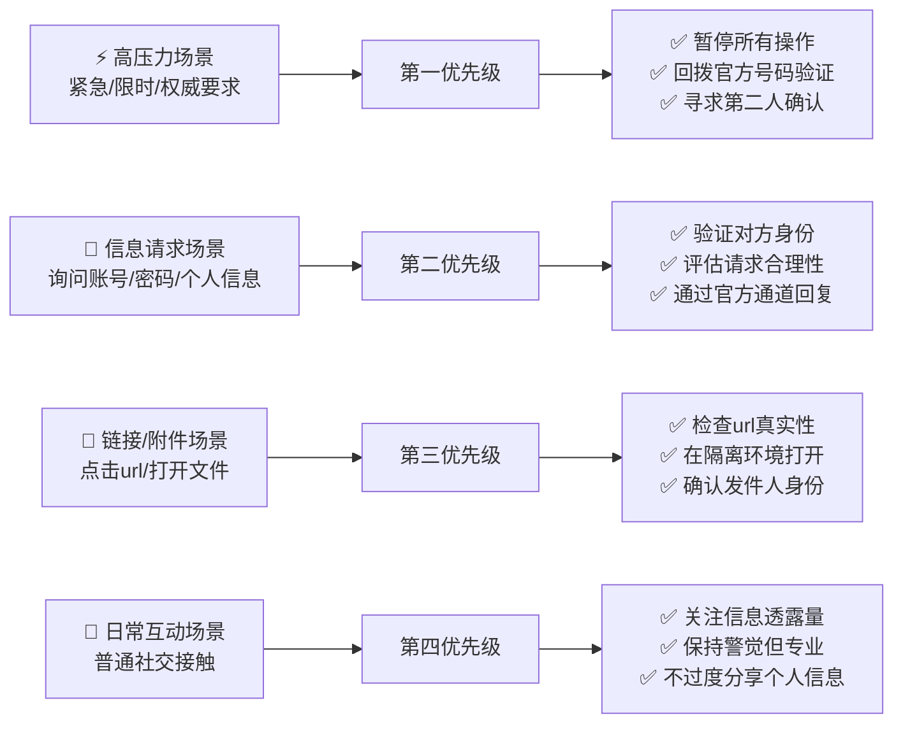

## 23.1 社会工程学心理学原理

### 引言：人脑不是为安全而设计的

社会工程学攻击之所以有效，不是因为受害者"愚蠢"或"不谨慎"，而是因为**人类大脑的认知架构在进化过程中优先优化了社会协作效率，而非安全验证能力**。在数十万年的进化史中，我们的祖先面临的主要威胁来自猛兽和自然环境，而非精心设计的欺骗——这意味着大脑从未进化出专门检测"善意伪装下的恶意意图"的机制。

理解这一点至关重要：**社会工程学攻击不是针对个人弱点的攻击，而是针对人类认知系统"架构性缺陷"的精确打击。** 本章将系统拆解这些被攻击者利用的心理机制——从卡尼曼的双系统理论，到西奥迪尼的六大影响力原则，再到情绪操纵和信任的心理学根基。

---

### 23.1.1 卡尼曼双系统理论：社会工程学的认知根基

任何对社会工程学心理学原理的理解，都应从丹尼尔·卡尼曼（Daniel Kahneman）的双系统理论出发。该理论将人类认知分为两个系统：

| 维度 | 系统1（快思考） | 系统2（慢思考） |
|------|---------------|---------------|
| **运作方式** | 自动、直觉、无意识 | 分析、理性、有意识 |
| **处理速度** | 毫秒级 | 秒级到分钟级 |
| **认知负荷** | 极低，几乎不消耗能量 | 高，消耗大量认知资源 |
| **并行能力** | 可同时处理多任务 | 一次只能处理一件事 |
| **典型场景** | 识别面孔、读懂情绪、走熟悉的路 | 解数学题、评估合同条款、做重大决策 |
| **一天中使用频率** | 95%以上的决策 | 5%以下的决策 |

**社会工程学攻击的核心策略**：攻击者的目标就是将目标的决策从**系统2（理性分析）强制切换到系统1（自动反应）**。一旦目标进入系统1模式，就会依赖各种认知捷径（heuristics）做出快速但不准确的判断——这正是攻击者所需要的。

**攻击者如何强制目标进入系统1？**

| 触发手段 | 心理机制 | 典型攻击话术 |
|---------|---------|-------------|
| **时间压力** | 挤占系统2所需的处理时间 | "请在15分钟内确认，否则账户将被锁定" |
| **情绪唤醒** | 强烈的情绪会抑制前额叶的理性功能 | "你的电脑已被入侵，里面有你所有的个人资料！" |
| **认知过载** | 用大量信息填满工作记忆 | 用技术细节、法律术语堆砌邮件内容 |
| **分散注意力** | 让系统2忙于处理其他事情 | 同时打电话和发邮件，利用多任务处理瓶颈 |
| **权威暗示** | 自动触发服从模式，跳过验证环节 | "我是IT部门的张经理，工号10234" |

> **关键洞察**：系统1不是"坏"系统。没有系统1，我们无法在日常生活中的每一秒都做深度分析——那会让我们寸步难行。问题在于，社会工程学攻击者学会了**如何关闭系统2**，让系统1独自应对本应需要系统2分析的决策场景。

---

### 23.1.2 西奥迪尼影响力六原则（深度剖析）

心理学家罗伯特·西奥迪尼（Robert Cialdini）在其经典著作《影响力》（Influence: The Psychology of Persuasion, 1984）中，通过数十年的实证研究，总结出了影响人类决策的六大基本原则。这六条原则不是学术上的"有趣现象"，而是**被社会工程学攻击者系统性地武器化了的决策触发机制**。

```mermaid
graph TB
    CENTER["🧠 社会工程学<br/>心理操纵模型"]
    
    CENTER --> R["🔄 互惠原则<br/>Reciprocity<br/>先给后取"]
    CENTER --> C["🤝 承诺与一致性<br/>Commitment & Consistency<br/>步步为营"]
    CENTER --> S["👥 社会认同<br/>Social Proof<br/>从众效应"]
    CENTER --> A["👔 权威原则<br/>Authority<br/>服从命令"]
    CENTER --> L["❤️ 喜好原则<br/>Liking<br/>投其所好"]
    CENTER --> SC["⏳ 稀缺原则<br/>Scarcity<br/>机不可失"]

    R --> R1["先给小恩小惠"]
    R --> R2["制造亏欠感"]
    R --> R3["拒绝-后撤策略"]

    C --> C1["得寸进尺"]
    C --> C2["公开承诺"]
    C --> C3["书面对齐"]

    S --> S1["同侪压力"]
    S --> S2["多数人陷阱"]
    S --> S3["相似群体"]

    A --> A1["制服效应"]
    A --> A2["头衔权威"]
    A --> A3["专家身份"]

    L --> L1["相似性原则"]
    L --> L2["合作目标"]
    L --> L3["赞美策略"]

    SC --> SC1["数量稀缺"]
    SC --> SC2["时间稀缺"]
    SC --> SC3["独家特权"]

    style CENTER fill:#1a1a2e,stroke:#e94560,color:#fff
    style R fill:#FF5722,stroke:#333,color:#fff
    style C fill:#FF9800,stroke:#333,color:#fff
    style S fill:#FFC107,stroke:#333,color:#000
    style A fill:#4CAF50,stroke:#333,color:#fff
    style L fill:#2196F3,stroke:#333,color:#fff
    style SC fill:#9C27B0,stroke:#333,color:#fff
```



#### 原则一：互惠（Reciprocity）

**心理学实验证据**

西奥迪尼的经典实验：在陌生人之间，给予一小瓶可乐后，参与者购买抽奖券的数量是未接受可乐组的**两倍**。更令人震惊的是，即使在明确表示"我不需要你回报什么"的情况下，亏欠感仍然驱动了回报行为。这证明互惠是一种**自动化的、无需意识参与**的社会本能。

另一个被广泛引用的实验是**"拒绝-后撤策略"**（Rejection-Then-Retreat）：先提出一个大的请求（几乎肯定会被拒绝），然后退而求其次提出真正想要的小请求。实验显示，这种策略使成功率从29%提升到71%，因为目标在拒绝后会产生"亏欠感"。

**社会工程学攻击中的具体应用**

- **第一阶段（给予）**：攻击者免费提供某种价值——虚假的技术支持、免费的软件试用、帮忙解决一个小问题、分享"内部信息"
- **第二阶段（索取）**：在目标产生亏欠感后，提出信息请求或权限请求。由于互惠机制是自动触发的，目标几乎不会经过理性评估就答应

**真实攻击案例**

2022年，某金融机构的IT管理员收到一个自称"安全研究员"的电话。对方帮他发现了一个"浏览器插件漏洞"并提供了修复方案。两周后，这位"研究员"请求他帮忙"测试一个新工具"——实际是一个远控木马。管理员因之前的"帮助"而感到亏欠，未经审查就执行了该工具。

**针对互惠原则的防御策略**

| 防御措施 | 具体操作 | 原理 |
|---------|---------|------|
| **识别"先给后取"模式** | 每当有人先提供了看似无偿的帮助，标记为潜在的社会工程学试探 | 将隐性的互惠压力转化为显性的风险评估 |
| **区分真实善意与伪装工具** | 真实善意通常不求回报；伪装善意必然在后续提出请求 | 利用时间维度识别模式 |
| **建立"不接受陌生人帮助"原则** | 在企业安全策略中明确规定不接受非官方的技术帮助 | 从源头切断互惠触发机制 |
| **延迟决策** | 收到任何形式的"帮助"后，至少在24小时后再回应请求 | 给系统2足够的时间恢复分析能力 |

#### 原则二：承诺与一致性（Commitment & Consistency）

**心理学实验证据**

弗里德曼和弗雷泽（Freedman & Fraser, 1966）的经典"得寸进尺"实验：研究人员先请求房主在窗户上贴一张小标志（支持交通安全），两周后请求在草坪上立一个大招牌。没有经历小请求的对照组仅有17%同意；而经历了小请求的实验组，同意率高达**76%**。关键在于，小承诺改变了房主的**自我认知**——他们开始认为自己"是一个乐于参与公益的人"。

另一个重要发现是**公开承诺的力量**：当承诺是公开做出的（如在会议中当众表态），一致性效应会增强3-5倍。这是因为不仅自己记得承诺，周围的人也会记得。

**社会工程学攻击中的具体应用**

- **渐进式钓鱼**：先让目标点击一个无害的链接（如查看"同事生日照片"），等目标建立了"我点击这类链接是安全的"自我认知后，再发送真正包含恶意载荷的链接
- **信息梯度索取**：先获取一个无关紧要的信息（"你现在在办公室吗？"），然后逐步升级到敏感信息（"能帮我查一下这个客户账号的密码吗？"）
- **"是的"惯性**：攻击者先连续问3-4个答案为"是"的问题（"你是XX公司的员工吗？你能接电话吗？你在这个部门工作多久了？"），当第5个问题需要敏感信息时，惯性点头的力量会让目标难以说"不"

**真实攻击案例**

2018年，一名攻击者对某法律事务所实施了为期三周的社会工程学攻击。第一周：在LinkedIn上简单互动（点赞、评论）。第二周：请求通过好友申请（一个小承诺）。第三周：请求"帮忙看一下这个共享文档"——实际是一个包含恶意宏的Word文档。每一步都建立在上一步的基础上，目标的自我认知已经从"我只是个普通用户"转变为"我是这个联系人的朋友"。

**针对承诺与一致性的防御策略**

- **定义"安全边界"**：明确哪些信息/操作在任何情况下都不能提供/执行，不因之前的承诺而松动
- **每次请求独立评估**：即使之前回应了5个无害的请求，第6个请求也必须经过同样的安全评估流程
- **公开承诺反制**：在团队中公开承诺"我会对任何信息请求进行二次验证"，利用一致性原理保护自己
- **留意"梯度感"**：如果有人的请求从简单到复杂、从无害到敏感依次推进，立即触发警报

#### 原则三：社会认同（Social Proof）

**心理学实验证据**

所罗门·阿希（Solomon Asch, 1951）的经典从众实验：参与者被要求判断线段长度——一个客观上极其简单的任务。但当其他（实验人员伪装的）参与者都给出错误答案时，**75%** 的真正的参与者在至少一次试验中选择了从众，放弃了明显正确的判断。在关键试验中，完全从众的比例高达37%。

这个实验揭示了一个残酷的事实：**即使面对客观事实，群体的判断也能压倒个人的理性。**

更贴近社会工程学的证据来自拉塔内和达利（Latané & Darley）的"旁观者效应"研究：当一个人遇到紧急情况时，周围有其他人在场会显著降低任何人提供帮助的概率。这是因为每个人都"参照"他人的不作为来判断情况是否紧急——这就是社会认同在紧急决策中的致命影响。

**社会工程学攻击中的具体应用**

- **同侪压力**："贵公司的IT部门已经全部更新了凭证，请问您需要帮助吗？"
- **"多数人"陷阱**："已有超过1000名用户下载了这个安全补丁，请您点击下方链接"
- **权威背书伪造**：列出虚假的"客户名单"或"合作机构"（Twitter/X被黑事件就是利用内部工具显示的"验证"来骗取信任）
- **紧急从众**：利用"大家都在做"制造紧迫感，迫使目标快速行动而不思考

**真实攻击案例**

2020年Twitter史诗级安全事件中，攻击者利用社会认同原则向员工施压：他们告诉IT支持人员"有很多员工同时遇到了验证问题"，利用"很多人都在做"的社会认同暗示，降低了个别员工的警惕心，最终获得了内部管理工具的访问权限。

**针对社会认同的防御策略**

- **独立验证**：任何声称"其他人都在做"的陈述，都必须通过独立的官方渠道验证
- **拒绝从众压力**：当被告知"其他人都已升级"时，要求提供经过验证的用户名单或官方通知
- **区分统计事实与操纵工具**：真实的统计应该有可追溯的来源，而伪装的"社会认同"无法提供
- **设置"特立独行"的文化**：在组织内建立"质疑权威和多数人意见是负责任的表现"的文化氛围

#### 原则四：权威（Authority）

**心理学实验证据**

斯坦利·米尔格拉姆（Stanley Milgram, 1963）的服从权威实验至今仍是社会心理学中最令人不安的研究：**65%** 的实验参与者，在穿着白大褂的研究人员指令下，将电击强度增加到足以致命的450伏特——即使他们听到受害者（伪装的）痛苦尖叫。这些参与者并不是虐待狂，他们只是普通人。米尔格拉姆总结："普通人，只是在做他们的工作，在没有特别的恶意的情况下，就能成为可怕的破坏性过程中的代理人。"

后续研究进一步缩小了变量：当"实验室"换到破旧办公室时，服从率下降；当发令者穿着保安制服时，服从率仍然显著高于不穿制服的对照组——**制服本身就是权威的触发器**。

**社会工程学攻击中的具体应用**

- **CEO冒充（Whaling/捕鲸攻击）**：攻击者伪造CEO或高管的邮件，要求财务部门紧急转账——这是BEC诈骗最常见的变体
- **IT管理员冒充**：声称自己是IT部门的技术支持，需要用户的密码进行"系统维护"
- **政府机关冒充**：伪造税务局、法院、公安等机构的通知
- **第三方权威**：声称来自知名安全公司、审计机构或监管组织
- **制服效应**：在物理社会工程学中，冒充快递员、维修工、消防检查员

**真实攻击案例**

2019年，英国某能源公司CEO接到"母公司CEO"的电话。声音完美模拟——实际上是AI语音合成。电话中要求向"新供应商"紧急转账22万欧元。CEO在权威压力（母公司CEO）、紧急性和互惠（之前母公司"帮助"过他们）三重心理杠杆的作用下，完成了转账。

**针对权威的防御策略**

| 防御措施 | 具体操作 | 有效性 |
|---------|---------|--------|
| **回拨验证** | 不通过来电显示上的号码回拨，而是通过已知的官方号码致电验证 | 极高 |
| **双人审批** | 任何涉及敏感操作的请求必须经过至少两人审批 | 极高 |
| **身份交叉验证** | 通过不同渠道（邮件+电话+内部系统）分别验证身份 | 极高 |
| **拒绝"越级"请求** | 任何跳过正常流程的请求，无论来自谁，都应标记为可疑 | 高 |
| **内部验证码** | 建立团队内部"只有我们知道的"验证短语或验证码 | 中 |

#### 原则五：喜好（Liking）

**心理学实验证据**

西奥迪尼的研究表明，人们对"喜欢"的人说"是"的概率高出3-5倍。什么因素能让人快速产生"喜欢"？研究发现四个关键因素：

1. **相似性**：共同兴趣、共同背景、共同口音——即使是很小的相似点（如生日相同）也能显著提升好感度
2. **赞美**：即使被识别为奉承，赞美仍然能产生好感
3. **熟悉感**：单纯曝光效应（Mere Exposure Effect）表明，即使是无意识接触到的面孔或名字，也会让人产生好感
4. **合作目标**：当双方有共同目标时（"我们一起解决这个IT问题"），好感会迅速建立

**社会工程学攻击中的具体应用**

- **镜像技术（Mirroring）**：攻击者刻意模仿目标的语言风格、语速、手势、甚至在邮件中使用相似的语气词
- **共同兴趣构建**：通过OSINT收集目标的兴趣爱好（从社交媒体获知），在对话中有意引用
- **朋友圈渗透**：先成为目标同事或朋友的朋友，利用社会网络的信任传递效应突破
- **赞美攻击**：在对话中频繁赞美（"您在这方面很有经验"、"您果然是最清楚流程的人"）

**真实攻击案例**

2023年，ALPHV/BlackCat勒索软件组织的一名攻击者通过LinkedIn搜索到某公司安全管理员。发现她喜欢养猫、最近刚搬家。攻击者伪装成猫粮品牌销售代表，在LinkedIn上以"推销高端宠物食品"为由建立联系。几周内，通过频繁讨论宠物话题建立了rapport，最终诱使她下载了伪装成"最新猫粮配方PDF"的恶意文件。

**针对喜好的防御策略**

- **区分个人关系与工作关系**：建立清晰的边界——工作关系不需要个人好感
- **警惕"快速亲密"**：如果有人过快建立熟悉感和亲密感，将其视为红旗信号
- **避免社交媒体过度分享**：谨慎管理LinkedIn、微信等平台上的个人隐私
- **实践"礼貌性怀疑"**：对任何利用共同兴趣推进请求的行为保持警惕

#### 原则六：稀缺（Scarcity）

**心理学实验证据**

沃切尔等人（Worchel, Lee & Adewole, 1975）的实验：参与者评估巧克力的价值。当巧克力来自一个几乎空了的罐子（稀缺）时，参与者给出了远高于装满罐子的评价。更戏剧的是，**从充裕到稀缺的转变**——原本装满的罐子被拿走一半后——产生的稀缺效应甚至比一直稀缺更强烈。

这一现象的深层机制是**心理抗拒理论**（Psychological Reactance Theory, Brehm）：当人们感到自由受到威胁时，会产生一种恢复自由的心理冲动。稀缺意味着"选择自由正在消失"，从而激活了个体获取该资源的强烈动机——这正是"限时抢购"背后的心理学原理。

**社会工程学攻击中的具体应用**

- **时间稀缺**："此优惠仅限今日"、"系统将在30分钟后锁定"、"您的账户即将被停用"
- **数量稀缺**："仅剩5个名额"、"有权限的员工不超过10人"、"这件物品非常稀有"
- **独占信息稀缺**："这个（虚假的）安全漏洞信息目前只有极少数人知道"
- **机会稀缺**："这是您最后一次获得系统升级的机会"

**真实攻击案例**

2022年，针对多家金融机构的钓鱼活动中，攻击者发送了主题为"【紧急】安全升级通知——仅200个名额"的邮件。其中强调："由于系统资源限制，本次安全升级仅限前200名确认的员工，未确认账户将面临更高的安全风险。"多个员工在恐慌和稀缺感的双重作用下抢着点击链接。

**针对稀缺的防御策略**

- **冷静评估稀缺性**：询问自己——"如果多等30分钟验证，这个稀缺还会存在吗？"
- **所有"限时"请求默认走标准流程**：创建一个零基规则——任何声称紧急或限时的请求，都必须通过标准流程验证
- **识别虚假稀缺**：真实的稀缺信息通常可以通过其他渠道验证；伪装的稀缺无法被第三方确认
- **培训团队抵抗"FOMO"**：让团队理解FOMO（Fear of Missing Out）是被社会工程学利用最频繁的情绪之一

---

### 23.1.3 情绪操纵的心理学机制

社会工程学不仅是认知层面的操纵，更是**情绪层面的精确打击**。相比于理性说服，情绪唤醒（Emotional Arousal）能更快地关闭系统2的功能，使目标更容易被操纵。

#### 恐惧（Fear）——最有效的攻击触发器

**心理机制**：卡尼曼的前景理论（Prospect Theory）揭示，人类对损失的敏感程度是对同等获益敏感程度的**约2倍**（损失厌恶，Loss Aversion）。这意味着"失去X的恐惧"比"获得X的渴望"强大两倍。恐惧还会触发杏仁核（Amygdala）的快速反应，直接绕过前额叶皮层的理性判断。

**攻击者的阶梯式恐惧策略**：

1. **制造危险**：声称存在迫在眉睫的威胁（账户已被入侵、电脑已感染病毒）
2. **扩大影响**：描述威胁的严重性（涉及个人隐私、财产安全、法律责任）
3. **关闭退路**：告知目标常规的安全措施已不够用，需要"立即行动"
4. **提供方案**：给出攻击者预设的"解决方案"（点击链接、下载软件、提供密码）

#### 紧迫感（Urgency）——时间压力下的决策崩塌

**心理机制**：时间压力通过两个路径影响决策质量。第一，它激活了交感神经系统（应激反应），导致心率加快、血压升高、注意力狭窄——这被称为"隧道效应"（Tunnel Vision），目标只能看到最直接的信息而忽略全局。第二，它压缩了系统2所需要的"慢思考"时间，迫使目标依赖系统1的直觉反应。

**攻击者如何制造紧迫感**：

| 制造方式 | 具体话术 | 心理效果 |
|---------|---------|---------|
| **门槛式** | "必须在今天下午5点前确认" | 设置硬性截止时间 |
| **倒计时式** | "系统将在倒计时结束后自动锁定" | 持续的可见压力 |
| **后果式** | "逾期未处理将导致账户永久冻结" | 强调损失的不可逆性 |
| **竞争式** | "总部已要求今天内完成整改" | 上级压力 |

#### 好奇心（Curiosity）——信息缺口驱动力

**心理机制**：洛温斯坦（Loewenstein, 1994）的信息缺口理论（Information Gap Theory）指出，当人们意识到"我知道的和我想知道的之间存在差距"时，会产生一种类似于"生理饥饿"的信息饥饿感。这种饥饿感驱动人们填补信息缺口——即使需要承担风险。

**攻击应用**：

- **悬念邮件**："（你的名字），你认识这个人吗？"——附上看似人物照片的链接（实为恶意链接）
- **"查看谁访问了你的资料"**：社交媒体上的钓鱼链接，利用用户对自己社交关系的关注
- **敏感信息诱饵**："我们发现了关于你的一些有趣的网络活动……"——利用隐私焦虑驱动点击

#### 同情心（Sympathy）——共情的阴暗面

**心理机制**：巴特森（Batson）的共情-利他假说（Empathy-Altruism Hypothesis）指出，当人们对他人产生共情时，会自发产生帮助的动机，哪怕是需要付出代价。攻击者刻意触发这种共情反应，将帮助的对象从"真正需要帮助的人"转移到攻击者伪装的求救者身上。

**攻击应用**：

- **紧急求助**："我钱包丢了，能借你的手机打个电话吗？"（物理渗透的经典技巧）
- **高层求助**："我是XX副总，在外地出差遇到紧急情况，需要你帮忙处理一笔转账"（BEC变体）
- **新员工求助**："我刚入职，不太熟悉系统，你能帮我登录看看这个文件吗？"

#### 内疚感（Guilt）——互惠的阴暗面

**心理机制**：当人们感到自己"亏欠"或"造成了麻烦"时，内疚感会驱使补偿行为。攻击者有意让目标产生内疚，然后利用补偿动机获取利益。

**攻击应用**：

- **"我不该麻烦你"策略**：攻击者先道歉，让目标产生"没关系，我可以帮忙"的冲动
- **"只有你能帮我"**：突出目标的特殊性和重要性，让拒绝变得困难

#### 虚荣/讨好（Ego Bait）——自我增强的需要

**心理机制**：人类有强烈的"积极自我概念维护"动机（Self-Enhancement Motivation），当被夸赞时，不仅会产生好感（喜好原则），还会产生回报夸赞者的心理冲动（互惠原则）。

**攻击应用**：

- **头衔认同**："您是这方面的专家，一定比我们更清楚……"
- **能力认可**："这种高级操作只有资深人员才能完成……"
- **特权赋予**："您这样级别的员工才能参与这次内测……"

---

### 23.1.4 信任的心理学：为什么我们天生容易被骗

理解社会工程学，就必须理解一个根本问题：**为什么人类这么容易信任他人？**

#### 默认信任倾向（Truth-Default Theory）

通讯学教授蒂莫西·莱文（Timothy Levine）的"真相默认理论"指出：**在沟通中，人类默认将对方的话语视为真实的。** 这并不是一个理性的选择，而是一种进化适应——在绝大多数社交互动中，信任是最优策略，因为：

1. **信任的进化优势**：在群体协作中，默认信任降低了社交成本，使得大规模协作成为可能
2. **欺骗检测的认知成本**：对每一个信息都进行验证，需要消耗巨大的认知能量——系统2无法全天候运行
3. **不对称的风险分布**：日常生活中，被欺骗的概率远低于"真实互动"的概率，默认信任在统计上是最优的

**攻击者的精确打击公式**：

```text
攻击成功概率 = 目标默认信任强度 × 情境逼真度 × 认知负荷程度
```

当攻击者能同时提高"情境逼真度"（完美的伪装和话术）和"认知负荷"（利用时间压力和情绪唤醒），即使是警惕性最高的目标也容易中招。

#### 社会渗透理论（Social Penetration Theory）

阿尔特曼和泰勒（Altman & Taylor, 1973）的社会渗透理论将人际关系比作洋葱——有多层结构：

```text
第1层（最外层）：公开信息 —— 姓名、职位、公司
第2层（半公开）：兴趣偏好 —— 爱好、宠物、喜欢的品牌
第3层（私人）：个人观点 —— 对公司政策的看法
第4层（核心）：私人信息 —— 密码、个人财务、隐私
```

正常的关系发展是**从外层向内层逐层渗透**的。但社会工程学攻击者利用OSINT技术**跳过外层**——他们通过社交媒体和公开信息已经收集了第1-2层的信息，从而在初次接触时就能以"熟人"的姿态直奔第2-3层，大大缩短了建立信任所需的时间。

#### 单纯曝光效应（Mere Exposure Effect）

扎荣茨（Zajonc, 1968）发现，即使是**无意识的、重复的暴露**也会增加人们对某个对象的好感。攻击者利用这一点：

- 先在社交媒体上点赞目标的内容（多日操作）
- 在目标脑海中建立"熟悉感"——即使目标不记得具体互动
- 当攻击者首次发送消息时，目标的大脑已经标记为"熟悉的人"而非"陌生人"

---

### 23.1.5 防御的心理学视角：从认识到行动

理解心理原理本身并不能自动转化为防御行为——这就是所谓的"知易行难"问题。真正有效的防御需要将心理洞见转化为**可重复执行的习惯**。

#### 心理学原理到防御策略的映射表

| 被利用的原理 | 防御策略 | 核心原则 |
|------------|---------|---------|
| 系统1快速决策 | **"30秒法则"**：对任何信息请求等待30秒再做回应 | 强制切换到系统2 |
| 互惠原则 | **"断舍离"原则**：拒绝任何意外的帮助或礼物 | 切断互惠触发链 |
| 承诺与一致性 | **"独立决策"规则**：每个请求独立评估 | 打破承诺一致性链条 |
| 社会认同 | **"唯一性验证"**：只通过官方渠道验证任何集体行动的要求 | 消除从众压力 |
| 权威原则 | **"回拨验证"** + **"双人审批"** | 消除自动服从 |
| 喜好原则 | **"个人-工作分离"**：区分友好和工作关系 | 隔离情感影响 |
| 稀缺原则 | **"移出时间压力"**：标准流程不因"紧急"而跳过 | 消除稀缺幻觉 |
| 情绪操纵 | **"情绪名命名"**：在感到恐惧/紧迫/好奇时对自己说"我正在被情绪操纵" | 元认知监控 |
| 默认信任 | **"适度怀疑"**：对来自任何人（包括内部人员）的敏感操作请求进行验证 | 覆盖默认信任 |

#### 情境化防御的优先级

不同的场景需要不同的防御策略。以下优先级排序帮助读者在不同情境下快速定位应采取的防御措施：



#### 让安全成为习惯而非负担

单靠意志力无法对抗社会工程学攻击——就像单靠意志力无法抗拒设计的诱惑一样。真正有效的防御依赖于**习惯化**：

1. **创建默认动作**：将安全行为从"需要决策的选择"转变为"自动执行的习惯"。例如：收到任何链接都默认将鼠标悬停查看真实url——不需要思考，执行即可
2. **认知锚点**：用具体的、易记的"锚点"触发安全行为。例如：在电话响起时，手触碰话筒的瞬间默念"验证身份"
3. **安全仪式**：在团队中建立固定的安全仪式——每周一所有员工花5分钟回顾上一周的安全事件
4. **积极强化**：对正确识别和报告社会工程学攻击的行为进行公开表扬，将安全从"负担"转化为"成就"

---

### 23.1.6 本节小结

本节从四个递进的层面剖析了社会工程学的心理学根基：

| 层面 | 核心内容 | 关键启示 |
|------|---------|---------|
| **卡尼曼双系统理论** | 系统1与系统2的运作机制与攻防博弈 | 社会工程学攻击的核心策略是强制目标从系统2切换到系统1 |
| **西奥迪尼六原则** | 六大影响力原则的心理学实验证据、攻击应用与防御策略 | 每一种原则都有对应的惯性触发机制和可操作的防御方法 |
| **情绪操纵机制** | 恐惧、紧迫感、好奇心、同情心、内疚感、虚荣心六种情绪武器 | 情绪唤醒是关闭系统2的最快路径 |
| **信任的心理学** | 默认信任倾向、社会渗透理论、单纯曝光效应 | 人类天生倾向于相信——这正是攻击者利用的进化弱点 |

**核心要记住的三句话**：

1. **社会工程学攻击不是攻击你的弱点，而是攻击人类的共性——那些帮助人类生存数百万年的认知和社会机制，在数字时代被武器化了**
2. **防御的关键不是"永远不上当"——谁也做不到——而是建立一个"即使上当也能及时发现和止损"的系统**
3. **最好的防御不是让每个人都变成安全专家，而是让安全行为成为不需要思考的自动习惯**

> **下一节预告**：23.2 社会工程学攻击模型——我们将把本节学到的心理学原理放入攻击者的操作框架中，理解他们从信息收集到目标达成的完整操作链。
