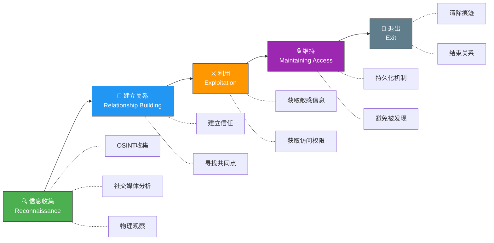
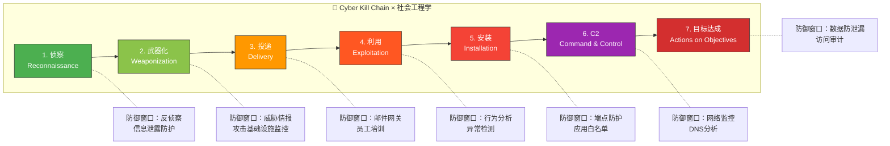
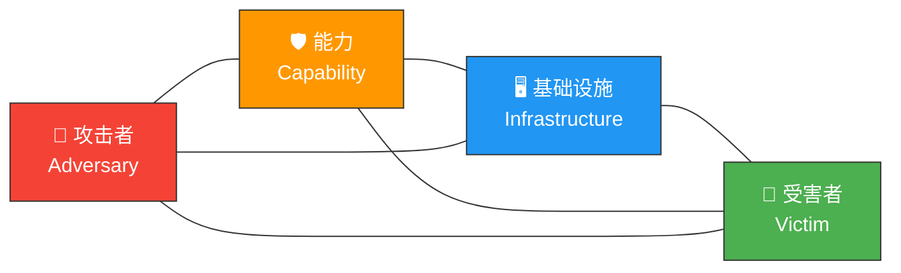
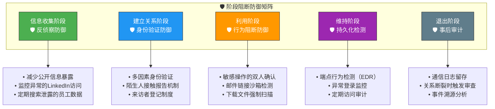

## 23.2 社会工程学攻击模型

### 23.2.1 为什么需要攻击模型

社会工程学攻击表面上看起来千变万化——一封钓鱼邮件、一通冒充电话、一次尾随进入办公区——但如果我们剥开外衣审视本质，所有成功的社会工程学攻击都遵循着可识别的结构模式。攻击模型的价值在于：**将看似随机的人类欺骗行为还原为可分析、可预测、可防御的系统性过程。**

在23.1节中，我们理解了社会工程学攻击"为什么会成功"——Cialdini的影响力原则、卡尼曼的双重加工理论、人类的认知偏差。本节要回答的是一个更工程化的问题：**攻击是怎么组织的？** 攻击者在什么时间点收集信息、在什么时间点建立信任、在什么时间点发动攻击、在什么时间点收割成果？

理解攻击模型对防御方有三个核心价值：

| 防御价值 | 说明 | 实际应用 |
|---------|------|---------|
| **早期识别** | 模型帮助识别攻击的"前兆信号" | 在攻击链早期（信息收集阶段）发现异常 |
| **阶段阻断** | 每个阶段都有对应的防御措施 | 即使前一阶段失败，仍可在下一阶段拦截 |
| **归因分析** | 模型提供事件复盘的统一语言 | 安全团队可以用标准化术语描述和共享威胁情报 |

现代网络安全领域的主流攻击模型有三种：**社会工程学攻击链（5阶段模型）**、**MITRE ATT&CK框架**、**Lockheed Martin Cyber Kill Chain**。此外，**钻石模型（Diamond Model）** 和 **统一杀伤链（Unified Kill Chain）** 提供了更具分析深度的视角。本节将逐一深入解析，并给出模型间的对比和综合应用方法。

### 23.2.2 社会工程学攻击链（5阶段模型）

这是最直接反映社会工程学攻击生命周期的模型，将攻击分为五个顺序阶段，每个阶段都建立在前一阶段成果的基础上。



#### 阶段1：信息收集（Reconnaissance）

信息收集是整个攻击链的基石。社会工程学攻击的成功率与前期情报的质量直接相关——一个对目标一无所知的攻击者，和一个掌握了目标姓名、职位、兴趣爱好、日常作息、最近烦恼的攻击者，二者的成功率相差数个量级。

**信息收集的四个维度：**

| 维度 | 收集内容 | 典型来源 | 攻击价值 |
|------|---------|---------|---------|
| **个人画像** | 姓名、生日、家庭、兴趣、消费习惯、情感状态 | 社交媒体、论坛、电商评价 | 构建pretext素材，寻找施压锚点 |
| **组织情报** | 组织结构、汇报关系、内部流程、安全策略、供应商名单 | LinkedIn、招聘信息、年报、新闻稿 | 确定冒充身份和攻击路径 |
| **技术侦察** | 软件版本、邮件格式、网络架构、VPN类型 | 定向钓鱼测试、Job Postings、技术论坛 | 定制钓鱼载荷、匹配内部IT风格 |
| **行为模式** | 上班时间、常用设备、沟通风格、决策习惯 | 社交媒体活跃时间分析、邮件头部信息 | 选择最佳攻击时机和渠道 |

**信息收集的技术手段（由被动到主动）：**

- **被动收集（Passive OSINT）**：不直接接触目标，仅从公开来源获取信息。工具包括Maltego（关系图谱可视化）、theHarvester（邮件和子域收集）、Recon-ng（自动化侦察框架）、SpiderFoot（开源情报自动化平台）。被动收集的风险最低，因为不会在目标系统上留下任何痕迹。

- **半主动收集（Semi-passive）**：通过低交互方式探测目标，如浏览目标公司官网、查看DNS记录、使用Shodan搜索暴露服务。这些活动在日志中会留下痕迹，但由于流量模式与正常浏览相似，通常不会触发安全告警。

- **主动收集（Active）**：直接与目标交互，如通过LinkedIn添加好友、拨打目标公司前台电话询问部门信息、参加目标公司参与的行业展会。主动收集的信息质量最高，但被发现的风险也最大。

**实际案例解析：** 2020年Twitter比特币诈骗事件中，攻击者在发动攻击前进行了至少两周的系统性信息收集。他们通过LinkedIn识别Twitter的客服和IT支持人员，通过社交媒体了解这些员工的日常活动和兴趣，在暗网上购买了与Twitter员工关联的泄露凭证，最终通过电话冒充IT部门的同事，获取了内部管理工具的访问权限。信息收集的深度和精准度直接决定了后续攻击的成功。

#### 阶段2：建立关系（Relationship Building）

信息收集阶段获得的情报，在这一阶段被转化为攻击者与目标之间的信任关系。建立关系是社会工程学攻击中最需要"艺术性"的阶段——太急切会引起警觉，太缓慢会错失时机。

**关系建立的核心技术：**

- **Rapport建立**：通过匹配目标的语速、用词、肢体语言来建立潜意识层面的好感。在面对面场景中，这包括镜像模仿（Mirroring）——模仿目标的姿态、手势和呼吸节奏。在文字沟通中，这包括使用目标惯用的表达方式和术语。

- **共同点发掘**：利用前期收集的信息，找到与目标的共同兴趣、共同经历或共同联系人。"我也养猫，你家是什么品种？"这样一句话，可能比任何技术手段都更能打开信任之门。

- **权威形象塑造**：利用目标对权威的天然服从倾向，通过伪造或借用权威身份（供应商技术支持、行业专家、上级领导）来降低目标的警惕性。

- **社会渗透理论应用**：关系按照从表面到核心的层次逐步深化——从天气闲聊开始，逐步过渡到工作话题，最终触及敏感信息。每一步都需要前一步建立的信任基础。

**关键心理学机制：** 在这一阶段，攻击者主要利用Cialdini的"喜好原则"和"社会认同原则"。当目标感觉自己与攻击者"相似"且"受人欢迎"时，大脑的系统1（快速直觉思维）会自动标记"可信任"，从而绕过系统2（理性分析思维）的审查。这就是为什么精心构建的关系一旦建立，后续的利用阶段会变得异常容易。

**防御视角：** 关系建立阶段的特征是异常的"友好度"和"信息索取模式"。如果一个"新认识的人"迅速表现出过度的热情和关注，或者在短时间内询问大量背景信息，这应该触发警觉。

#### 阶段3：利用（Exploitation）

前两个阶段积累的信任资本，在这一阶段被兑换为实际的攻击成果——敏感信息、凭证、访问权限或直接的财务转移。

**利用方式的三种模式：**

- **信息套取型**：通过看似无害的问题组合，拼凑出完整的敏感信息。"你们用的是什么邮件系统？""上周我联系的那个张总，他的分机号是多少？""你们的财务审批流程是怎样的？"——每个问题单独看都很正常，但组合起来就构成了完整的攻击向量。

- **行为诱导型**：诱导目标执行特定操作——点击恶意链接、下载附件、转移资金、更改安全设置。BEC诈骗就是典型的行为诱导，攻击者冒充CEO指示财务人员紧急转账。

- **凭证窃取型**：通过伪造登录页面（钓鱼网站）、电话中直接索要密码、或者利用恶意软件捕获凭证。Twitter事件中，攻击者就是通过电话直接获取了员工的SSO凭证。

**利用阶段的"试探-推进"节奏：** 经验丰富的攻击者不会一上来就提出核心要求。他们会先提一些小要求（"帮我发一份文件"），观察目标的反应和配合程度，然后逐步升级要求。这个过程利用了Cialdini的"承诺与一致性原则"——当目标已经同意了小要求后，拒绝大要求会产生心理上的不一致感，因此更倾向于继续配合。

#### 阶段4：维持（Maintaining Access）

一次性的信息获取只是社会工程学攻击的一种形态。更高阶的攻击者会追求持久化——保持对目标系统的长期访问，持续获取信息，为后续更大规模的攻击做准备。

**维持阶段的技术手段：**

- **后门植入**：在利用阶段获取的系统访问权限基础上，安装远控木马（RAT）、Web Shell或持久化后门程序。这些技术手段会伪装成合法进程或文件，规避常规检测。

- **关系维护**：继续维持与目标的"友好关系"，定期联系以保持信任。如果攻击者伪装成供应商，他们可能会持续提供一些有用的"帮助"来维持关系，为将来再次利用做铺垫。

- **横向扩展**：利用初始突破点，向组织内的其他人员或系统扩展。"你们公司的王经理在吗？他之前让我帮他处理一个IT问题"——利用已有目标的信任来攻击新的目标。

- **C2通道建设**：建立命令与控制（Command & Control）通信通道，用于远程下发指令和回传数据。在社会工程学场景中，C2通道可能不是传统意义上的网络连接，而是一条看似正常的邮件往来或即时通讯链路。

#### 阶段5：退出（Exit）

退出阶段是整个攻击链中最容易被忽视的环节，但它决定了攻击者是否能够安全地消化攻击成果而不被追踪。

**退出策略的两种哲学：**

- **干净退出型**：彻底清除所有痕迹，删除植入的后门程序和日志记录，自然地终止与目标的联系（如"换了工作"、"项目结束了"等借口）。这类退出适用于以信息窃取为目标的一次性攻击。

- **休眠-唤醒型**：不主动清除痕迹，而是让后门进入休眠状态，等待未来某个时间点的再次激活。这类策略常见于APT（高级持续威胁）场景，攻击者可能在目标网络中潜伏数月甚至数年。

**退出阶段的防御意义：** 安全团队应该特别关注"突然消失的联系人"——一个之前频繁联系的"供应商"突然不再出现，或者一个新入职的"员工"在短期内离职，这些都可能是攻击者退出的信号。事后审计中，关系断裂的时间点是追溯攻击痕迹的关键锚点。

### 23.2.3 MITRE ATT&CK 社会工程学技术映射

MITRE ATT&CK（Adversarial Tactics, Techniques, and Common Knowledge）是当前网络安全领域最权威的攻击技术知识库。它不是一个专为社会工程学设计的模型，但其中大量技术直接涉及或依赖社会工程学手段。理解ATT&CK框架中社会工程学技术的位置，是进行威胁情报分析和防御规划的基础。

```mermaid
graph TD
    SE["🎯 社会工程学攻击<br/>在ATT&CK中的映射"]
    
    SE --> IA["初始访问<br/>Initial Access"]
    SE --> EX["执行<br/>Execution"]
    SE --> DI["发现<br/>Discovery"]
    SE --> CO["收集<br/>Collection"]
    SE --> CF["凭据访问<br/>Credential Access"]
    
    IA --> IA1["T1566 钓鱼<br/>Phishing"]
    IA --> IA2["T1189 水坑攻击<br/>Drive-by Compromise"]
    IA --> IA3["T1195 供应链攻击<br/>Supply Chain"]
    IA --> IA4["T1199 受信任关系<br/>Trusted Relationship"]
    IA --> IA5["T1078 有效账户<br/>Valid Accounts"]
    
    EX --> EX1["T1204 用户执行<br/>User Execution"]
    EX --> EX2["T1059 命令脚本解释器<br/>Command Interpreter"]
    
    DI --> DI1["T1589 收集身份信息"]
    DI --> DI2["T1590 收集网络信息"]
    DI --> DI3["T1592 收集主机信息"]
    
    CO --> CO1["T1114 邮箱收集"]
    CO --> CO2["T1125 视频捕获"]
    
    CF --> CF1["T1557 中间人攻击"]
    CF --> CF2["T1598 钓鱼获取信息"]
    
    style SE fill:#1a1a2e,stroke:#e94560,color:#fff
    style IA fill:#4CAF50,stroke:#333,color:#fff
    style EX fill:#FF9800,stroke:#333,color:#fff
    style DI fill:#2196F3,stroke:#333,color:#fff
    style CO fill:#9C27B0,stroke:#333,color:#fff
    style CF fill:#F44336,stroke:#333,color:#fff
```



#### 初始访问（Initial Access）—— 社会工程学的主战场

这是ATT&CK框架中社会工程学技术最密集的战术阶段：

**T1566 - 钓鱼（Phishing）** 是社会工程学在ATT&CK中最核心的技术标识，它包含三个子技术：

| 子技术 | 英文名 | 攻击方式 | 典型载荷 | 成功率参考 |
|--------|--------|---------|---------|-----------|
| T1566.001 | Spearphishing Attachment | 鱼叉式钓鱼附件 | 伪装成发票、简历的恶意文档（.docx、.pdf） | 目标定制后可达 15-25% |
| T1566.002 | Spearphishing Link | 鱼叉式钓鱼链接 | 指向伪造登录页面或恶意下载的URL | 5-20% |
| T1566.003 | Spearphishing via Service | 通过服务钓鱼 | 利用社交平台私信、即时通讯工具发送 | 10-30%（信任度更高） |

**T1189 - 水坑攻击（Drive-by Compromise）**：攻击者提前入侵目标经常访问的网站（如行业论坛、供应商门户），在网站中植入恶意代码。当目标访问该网站时，恶意代码自动触发。这种攻击本身不直接使用社会工程学，但选择"水坑"网站的过程高度依赖对目标行为模式的情报分析——这正是社会工程学信息收集阶段的产出。

**T1195 - 供应链攻击（Supply Chain Compromise）**：攻击者入侵目标信任的供应商或服务商，通过受信任的渠道将恶意内容传递给最终目标。2020年SolarWinds事件是供应链攻击的典型案例：攻击者入侵了SolarWinds的软件更新服务器，通过受信任的软件更新渠道将后门程序部署到18,000多个客户组织中。这种攻击利用的正是"受信任关系"这一社会工程学原理。

**T1199 - 受信任关系（Trusted Relationship）**：直接利用组织间已有的信任关系进行攻击。例如，攻击者入侵一家企业的MSP（管理服务提供商），然后通过合法的远程管理通道访问该企业的内部网络。

**T1078 - 有效账户（Valid Accounts）**：使用合法获取的凭证（通过钓鱼、凭证填充、泄露数据库获取）登录系统。一旦攻击者使用的是合法凭证，几乎所有基于"异常行为"的安全检测机制都会失效——因为从系统视角看，这是一个正常用户在正常操作。

#### 执行（Execution）—— 用户行为的触发

**T1204 - 用户执行（User Execution）** 是社会工程学攻击在执行阶段的核心技术。它强调的是：攻击者需要诱导用户主动执行某个操作。

- **T1204.001 - 恶意链接（Malicious Link）**：用户点击邮件、消息或网页中的恶意链接
- **T1204.002 - 恶意文件（Malicious File）**：用户打开包含恶意宏的文档、运行伪装成正常程序的可执行文件

这个技术编号之所以重要，是因为它揭示了社会工程学攻击的一个根本限制：**无论技术手段多么精巧，攻击者最终都需要让用户"自愿"执行一个操作。** 这就是为什么社会工程学防御的核心不是技术手段，而是人的行为改变。

#### 发现（Discovery）—— 情报收集的数字化

ATT&CK的发现阶段直接对应社会工程学攻击链中的信息收集阶段，但更加聚焦于数字化手段：

- **T1589 - 收集受害者身份信息**：包括姓名、电子邮件地址、凭证、员工编号。数据来源包括社交媒体（LinkedIn是首选）、数据泄露数据库（Have I Been Pwned）、公开的组织通讯录。
- **T1590 - 收集受害者网络信息**：包括域名、IP段、DNS记录、网络拓扑。工具包括DNSdumpster、Shodan、Censys。
- **T1592 - 收集受害者主机信息**：包括硬件型号、操作系统、已安装软件。这些信息可通过诱导目标访问特定链接（泄露浏览器User-Agent）或发送特制的邮件（跟踪邮件打开率和客户端信息）来获取。

#### 钓鱼获取信息（T1598）

这是一个经常被忽视但极其重要的技术——**钓鱼不一定是为了植入恶意软件，也可以纯粹为了获取信息。** 攻击者可能发送一封看似无害的调查问卷、一份"行业报告"或一个"会议注册表"，收集目标的个人信息、技术环境或业务流程。这类钓鱼不包含恶意载荷，因此几乎不会被安全邮件网关检测到。

### 23.2.4 Cyber Kill Chain（网络杀伤链）

Lockheed Martin于2011年提出的Cyber Kill Chain是最经典的网络安全攻击模型之一。它将网络攻击分为7个顺序阶段，形成一条"杀伤链"——攻击必须依次突破每个阶段才能最终达成目标。这个模型最初面向传统网络攻击设计，但其逻辑框架完美地适用于社会工程学攻击。



#### 阶段1：侦察（Reconnaissance）

在社会工程学语境下，侦察不仅包括技术侦察（网络扫描、端口探测），更核心的是**人的侦察**。攻击者搜集目标组织的公开信息、员工个人资料、业务合作伙伴、近期新闻事件。与5阶段模型的"信息收集"阶段完全对应，但Kill Chain更强调侦察结果对后续武器化阶段的指导作用。

**社会工程学侦察的层次模型：**

```text
Level 0: 被动被动 —— 仅从搜索引擎和公开数据库获取信息
Level 1: 被动主动 —— 使用OSINT工具系统化收集公开信息
Level 2: 主动被动 —— 通过低交互渠道（邮件跟踪像素、LinkedIn浏览）收集信息
Level 3: 主动主动 —— 直接与目标交互（电话、面对面、社交平台互动）
```

每一层的信息质量递增，但被发现的风险也递增。成熟的攻击者通常从Level 0开始，仅在必要时升级到更高层次。

#### 阶段2：武器化（Weaponization）

传统网络攻击中的"武器化"是指创建恶意载荷（exploit + payload）。在社会工程学攻击中，"武器化"的含义更加广泛：

- **攻击载荷准备**：制作包含恶意宏的Office文档、带有exploit kit的PDF、可执行恶意程序的快捷方式文件（.lnk）。现代攻击者常用HTML Smuggling技术——将恶意载荷编码为HTML文件中的JavaScript，绕过邮件安全网关的附件扫描。

- **钓鱼内容定制**：根据侦察阶段收集的情报，撰写高度个性化的钓鱼邮件、短信或社交媒体消息。一封引用了目标公司最新季度报告内容、提及目标直属上司姓名的钓鱼邮件，与一封泛泛而谈的"您的账户异常"邮件相比，成功率可能相差5-10倍。

- **虚假身份构建**：创建完整的虚假身份——包括伪造的社交媒体账户（有一定历史和互动记录）、伪造的企业邮箱域名（与真实域名高度相似）、伪造的公司网站和电话系统。高级攻击者甚至会创建虚假的LinkedIn档案，发布行业文章和获得推荐信，使虚假身份在搜索引擎中有充分的"可验证"记录。

- **基础设施搭建**：注册相似域名（typosquatting——如将microsoft.com注册为rnicrosoft.com）、设置邮件服务器、搭建钓鱼网站、配置C2通信通道。

#### 阶段3：投递（Delivery）

投递阶段是社会工程学攻击的"发射窗口"——攻击者将精心准备的武器送达到目标手中。

| 投递渠道 | 社会工程学手法 | 绕过技术 | 检测难度 |
|---------|-------------|---------|---------|
| **电子邮件** | 伪装成供应商发票、快递通知、HR通知 | 域名相似欺骗、SPF/DKIM绕过 | ★★★☆☆ |
| **电话（Vishing）** | 冒充IT支持、银行客服、政府机构 | 来电号码欺骗（Caller ID Spoofing） | ★★★★☆ |
| **社交媒体** | LinkedIn消息、Twitter DM、微信好友申请 | 虚假身份、冒充行业同行 | ★★★★★ |
| **物理接触** | 尾随进入办公区、伪装成快递员/维修工 | 制服、伪造工牌、熟悉内部术语 | ★★★★☆ |
| **USB投递** | 在停车场、前台放置带有恶意程序的U盘 | 标签伪装（"薪资表Q4"、"机密"） | ★★☆☆☆ |
| **短信/即时通讯** | 冒充银行验证码通知、快递取件提醒 | 短信网关欺骗 | ★★☆☆☆ |

**多阶段投递模式（Multi-stage Delivery）**：现代高级攻击通常不依赖单一投递渠道。典型模式是：先通过LinkedIn发送一条看似无害的消息建立联系，然后通过邮件发送"相关资料"，最后通过电话"确认"——三个渠道形成一个可信的"故事链"。每个渠道单独看起来都很正常，但组合在一起构成了完整的攻击路径。

#### 阶段4：利用（Exploitation）

传统Kill Chain中的"利用"是指技术漏洞的触发（如缓冲区溢出、远程代码执行）。在社会工程学攻击中，"利用"的核心不是技术漏洞，而是**人的认知漏洞**。

利用阶段的触发条件是目标执行了攻击者期望的行为：打开了恶意附件、点击了钓鱼链接、输入了账号密码、批准了资金转账、提供了内部系统信息。这个行为之所以发生，是因为前几个阶段（侦察→武器化→投递）的累积效应使目标的认知防御被绕过。

**社会工程学利用与技术利用的对比：**

| 维度 | 技术利用 | 社会工程学利用 |
|------|---------|-------------|
| 漏洞位置 | 软件/硬件代码 | 人的认知系统 |
| 触发方式 | 自动化执行 | 诱导目标主动执行 |
| 补丁机制 | 厂商发布安全更新 | 无"补丁"——只能通过培训和文化改变 |
| 可重复性 | 高（同一漏洞可批量利用） | 中（需根据目标调整话术） |
| 检测方式 | 漏洞签名、行为检测 | 异常行为分析、人工审查 |

#### 阶段5-7：安装、C2与目标达成

在社会工程学的语境下，这三个阶段的技术实现可能比传统网络攻击更加隐蔽：

- **安装阶段**：攻击者可能不安装传统意义上的恶意软件，而是利用合法工具（Living off the Land）——如通过Teams/Slack的合法远程协助功能建立持久访问，或者在目标邮箱中设置邮件转发规则来持续获取信息。

- **C2阶段**：社会工程学攻击的C2通道往往是"合法"的通信路径——正常的邮件往来、社交媒体消息、电话通话。这类C2通道几乎不可能被网络层安全设备检测到，因为它在流量层面与正常业务通信无异。

- **目标达成阶段**：社会工程学攻击的目标通常包括窃取商业机密、发起金融欺诈（BEC诈骗平均损失12.5万美元/次）、植入更深层的网络访问点（APT场景）、或获取情报用于后续更有针对性的攻击。

### 23.2.5 钻石模型（Diamond Model）

钻石模型是情报分析领域的重要框架，由Sergio Caltagirone、Andrew Pendergast和Christopher Betz于2013年提出。与前三个模型关注"攻击过程"不同，钻石模型关注的是**攻击事件的结构化分析**——每个攻击事件都可以用四个核心要素来描述：



在社会工程学攻击中，这四个要素的含义是：

- **攻击者（Adversary）**：发动攻击的个人、组织或国家。在社会工程学场景中，攻击者的身份往往难以确定——他们使用虚假身份，活动在多个法域的灰色地带。
- **能力（Capability）**：攻击者掌握的技术和心理操纵技能。社会工程学攻击者的"能力"不仅仅是技术能力，更包括人际操纵、话术设计、身份伪装、心理施压等"软技能"。
- **基础设施（Infrastructure）**：攻击者使用的工具、平台和通信渠道——伪造的域名、电话系统、社交媒体账户、恶意载荷投递平台。
- **受害者（Victim）**：被攻击的个人或组织。在社会工程学场景中，受害者的选择不是随机的——攻击者根据侦察结果选择最容易被操纵的目标。

**钻石模型的实战价值：** 钻石模型最强大的地方在于它允许从任何一个要素出发进行"追踪"。例如，如果安全团队发现了一个钓鱼域名（基础设施），他们可以通过分析域名的注册信息、托管位置和SSL证书来关联同一攻击者使用的其他基础设施。如果发现了一个被攻击的员工（受害者），他们可以通过分析该员工被操纵的方式和攻击者使用的话术来推断攻击者的能力水平和可能的下一个目标。

### 23.2.6 统一杀伤链（Unified Kill Chain）

统一杀伤链（UKC）由Paul Pols于2017年提出，它将Lockheed Martin的Cyber Kill Chain、MITRE ATT&CK和Mandiant的攻击生命周期整合为一个18阶段的统一框架。UKC相比传统的7阶段Kill Chain更完整地覆盖了现代网络攻击的全貌：

**UKC的18个阶段在社会工程学中的映射：**

| 阶段分组 | UKC阶段 | 社会工程学对应 |
|---------|---------|-------------|
| **侦察（In)** | 1. 侦察 | OSINT收集、社交媒体分析 |
| | 2. 武器化 | 身份伪造、钓鱼内容制作 |
| | 3. 社会工程学 | 信任建立、关系操纵 |
| | 4. 投递 | 邮件/电话/物理投递 |
| | 5. 利用 | 触发用户行为 |
| | 6. 安装 | 后门植入、恶意软件安装 |
| **网络扩展（Through)** | 7. 命令与控制 | 建立远程通信通道 |
| | 8. 横向移动 | 利用初始突破点扩展访问 |
| | 9. 防御规避 | 规避安全检测、维持隐蔽 |
| | 10. 凭据访问 | 获取更多合法凭证 |
| | 11. 权限提升 | 从普通用户提升到管理员 |
| **目标达成（Out)** | 12. 内部侦察 | 在内网中发现高价值目标 |
| | 13. 收集 | 聚焦特定数据和资产 |
| | 14. 渗出 | 将数据传送到外部 |
| | 15. 操纵 | 篡改数据、破坏完整性 |
| | 16. 干扰 | 阻断安全响应、制造混乱 |
| | 17. 持久化 | 长期潜伏机制 |
| | 18. 归因回避 | 清除痕迹、误导调查方向 |

UKC的价值在于它揭示了一个重要事实：**社会工程学通常只是攻击链的一个入口，但后续的"通过"和"输出"阶段同样依赖社会工程技术。** 例如，攻击者在内网横向移动时可能继续使用社会工程学手段——冒充IT部门给其他员工打电话索要系统访问权限。

### 23.2.7 模型对比与综合应用

上述五种模型各有侧重，理解它们的异同对于选择合适的分析框架至关重要：

| 维度 | 5阶段攻击链 | Cyber Kill Chain | MITRE ATT&CK | 钻石模型 | UKC |
|------|-----------|-----------------|--------------|---------|-----|
| **视角** | 攻击者执行流程 | 攻击生命周期 | 技术知识库 | 事件要素分析 | 全攻击面映射 |
| **层次** | 概念框架 | 操作框架 | 战术/技术/规程 | 情报分析框架 | 综合框架 |
| **颗粒度** | 粗（5阶段） | 中（7阶段） | 细（数百个技术） | 中（4要素） | 细（18阶段） |
| **社会工程学适配** | ★★★★★ | ★★★☆☆ | ★★★★☆ | ★★★☆☆ | ★★★★★ |
| **防御指导性** | ★★★☆☆ | ★★★★☆ | ★★★★★ | ★★★☆☆ | ★★★★★ |
| **情报分析价值** | ★★☆☆☆ | ★★☆☆☆ | ★★★★☆ | ★★★★★ | ★★★★☆ |
| **学习曲线** | 低 | 低 | 中-高 | 中 | 中 |
| **最佳使用场景** | 快速理解攻击全貌 | 阶段性防御规划 | 技术检测与响应 | 攻击归因与追踪 | 全面威胁建模 |

**综合应用策略：**

在实际的安全运营中，很少单独使用某一种模型。成熟的SOC（安全运营中心）通常会组合使用：

1. **威胁建模阶段**：使用UKC或5阶段攻击链建立攻击全景视图
2. **检测规则开发**：基于ATT&CK技术映射，开发对应的检测规则和SIEM告警
3. **事件响应阶段**：使用Cyber Kill Chain判断攻击当前所处阶段，决定响应优先级
4. **威胁情报分析**：使用钻石模型关联不同事件，追踪攻击者基础设施和行为模式

### 23.2.8 实战案例：模型综合映射

以2023年ALPHV/BlackCat勒索软件组织的攻击为例，展示如何使用三种模型分析同一事件：

**案例背景：** 攻击者通过一名员工的个人社交媒体（她喜欢养猫、最近搬了家）在LinkedIn上伪装成宠物用品销售代表，通过添加好友获取信任后，诱使其下载恶意PDF，最终导致整个企业网络被加密。

| 攻击阶段 | 5阶段模型映射 | Kill Chain映射 | ATT&CK技术映射 |
|---------|-------------|---------------|---------------|
| 情报收集 | 信息收集（阶段1） | 侦察（阶段1） | T1589 身份信息收集 |
| 身份伪造 | 建立关系（阶段2） | 武器化（阶段2） | — |
| 社交平台接触 | 建立关系（阶段2） | 投递（阶段3） | T1566.003 通过服务钓鱼 |
| 诱导下载 | 利用（阶段3） | 利用（阶段4） | T1204.002 恶意文件 |
| 恶意软件安装 | 利用（阶段3） | 安装（阶段5） | T1059 命令执行 |
| 建立C2 | 维持（阶段4） | C2（阶段6） | T1071 应用层协议 |
| 横向移动+加密 | 维持（阶段4） | 目标达成（阶段7） | T1486 数据加密 |

**关键洞察：** 通过模型映射可以清晰地看到——如果在"信息收集"阶段就检测到异常的LinkedIn浏览行为（攻击者大量浏览目标公司员工的公开资料），或者在"建立关系"阶段就识别出"宠物用品销售代表"的账号存在伪造痕迹（创建时间短、互动少、照片是AI生成的），整个攻击链就可以在早期被阻断。这就是攻击模型的价值：**将防御窗口从"事后应急"前移到"事前预警"。**

### 23.2.9 防御视角：基于模型的阶段阻断

理解攻击模型最重要的目的是指导防御。以下是将每种模型转化为防御行动的实践指南：

**5阶段模型对应的防御措施：**



**Kill Chain的"左移防御"理念：** Kill Chain模型强调一个关键原则——**在杀伤链越早的阶段实施防御，成本越低、效果越好。** 在"侦察"阶段阻止攻击（减少信息暴露），比在"利用"阶段阻止攻击（需要用户成功识别钓鱼邮件）要容易得多。这在安全行业被称为"Shift Left"（左移）防御策略。

### 23.2.10 常见误区

**误区1："社会工程学攻击是随机的，无法建模"**

事实：虽然社会工程学攻击的表象看起来千变万化，但其底层逻辑高度一致。Cialdini的影响力原则、攻击链的5个阶段、MITRE ATT&CK的技术分类，都表明社会工程学攻击是可以系统化分析和防御的。将攻击视为"随机事件"会导致防御策略的被动和碎片化。

**误区2："Kill Chain已经过时了"**

事实：虽然Kill Chain发布于2011年且存在一些局限性（如假设攻击是线性的），但其"阶段阻断"的核心思想在今天仍然有效。更现代的UKC和ATT&CK框架是对Kill Chain的扩展和细化，而非替代。理解Kill Chain是理解更复杂模型的基础。

**误区3："只关注ATT&CK就足够了"**

事实：ATT&CK是一个极其详尽的技术知识库，但它侧重于"怎么做"（How），而非"为什么"（Why）和"在哪做"（Where）。钻石模型补充了"谁做的"（Who），5阶段攻击链补充了"为什么这样组织"（Why this order）。单独使用ATT&CK容易陷入"只见树木不见森林"的困境。

**误区4："攻击模型只对红队有价值"**

事实：攻击模型是红队和蓝队的通用语言。红队用它规划攻击路径，蓝队用它构建检测规则和防御矩阵。在安全运营中心（SOC）中，ATT&CK映射是威胁情报分析和事件分类的标准方法。管理层也可以使用攻击模型来理解安全风险并指导安全投资决策。

**误区5："模型越复杂越好"**

事实：模型的选择应该匹配使用场景。对于一次性的快速威胁评估，5阶段攻击链就足够了。对于SOC的日常运营，ATT&CK的技术映射更为实用。对于深入的威胁情报分析，钻石模型更合适。选择模型的准则是"刚好够用"——用最简单的模型解决当前的问题，避免过度工程化。

### 23.2.11 进阶内容：AI时代的攻击模型演进

生成式AI（如GPT-4、Claude等大语言模型）和深度伪造技术正在从根本上改变社会工程学攻击的模型。

**AI对5阶段攻击链的增强效果：**

| 阶段 | 传统方式 | AI增强方式 | 效率提升 |
|------|---------|-----------|---------|
| 信息收集 | 人工搜索和分析 | 自动化OSINT + 情报聚类 + 关系图谱生成 | 10-50倍 |
| 建立关系 | 单线程、长时间 | 多目标并行、LLM生成个性化话术 | 5-20倍 |
| 利用 | 静态模板 | 实时对话AI + 深度伪造音视频 | 3-10倍 |
| 维持 | 手动维护 | AI驱动的自动化响应和定期"关怀"消息 | 无限持续 |
| 退出 | 手动清理 | 自动化痕迹清除 + AI生成的"合理"离场理由 | 难以追踪 |

**深度伪造对攻击模型的颠覆：** 2024年已出现多起利用AI生成的音视频进行的社会工程学攻击。攻击者只需3-5秒的目标语音样本，就可以生成足以骗过目标亲近人员的语音克隆。这意味着"建立关系"和"利用"阶段不再需要攻击者本人参与——AI可以7×24小时不间断地扮演任何角色。

这对传统攻击模型提出了挑战：当攻击者的"身份"是一个AI时，我们如何定义"关系建立"？当攻击可以在毫秒级时间尺度上发生时，传统的"阶段阻断"还来得及吗？这些问题正在推动安全行业思考新一代的攻击模型。

**统一建模的趋势：** 业界正在向更综合的攻击建模方向发展——将传统Kill Chain与MITRE ATT&CK、钻石模型、AI威胁情报进行融合。下一代攻击模型将不仅描述"攻击怎么发生"，还将预测"攻击可能发生在哪里"和"攻击会以什么形态出现"，实现从被动防御到主动防御的转变。
