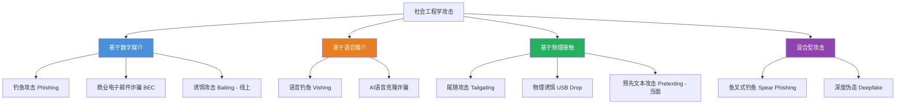

# 23.3 常见社会工程学攻击类型

社会工程学攻击并非单一技术，而是一个庞大的攻击家族。每一种攻击类型都针对人类的特定心理弱点——信任、恐惧、贪婪、紧急感或好奇——并采用不同的媒介（邮件、电话、短信、面对面）来实施。理解这一家族谱系，是构建有效防御的第一道防线。

本章从**攻击媒介**和**心理机制**两个维度出发，系统剖析六大类常见社会工程学攻击类型：钓鱼攻击、预先文本攻击、诱饵攻击、尾随攻击、商业电子邮件诈骗以及（进阶的）深度伪造攻击。每种攻击类型均覆盖其原理、变体、真实案例、检测方法和防御体系。



**图23-1：社会工程学攻击类型分类图谱。** 按照攻击媒介划分为数字、语音、物理和混合四大类，各类型之间存在交叉与组合。

---

## 23.3.1 钓鱼攻击（Phishing）

钓鱼攻击是社会工程学中**最普遍、最致命**的类型。其核心机制是：攻击者伪装成可信实体（银行、同事、平台官方），通过伪造的通信内容诱骗受害者泄露敏感信息或执行特定操作。

### 攻击金字塔：从撒网到精准打击

钓鱼攻击按目标精确度可分为五个层级，构成一个倒金字塔——越往上目标越精准、危害越大、但数量越少：

| 攻击类型 | 英文原名 | 目标范围 | 定制化程度 | 成功率 | 单次损失 |
|----------|---------|---------|-----------|-------|---------|
| 大规模钓鱼 | Mass Phishing | 万人级 | 低（模板化） | 0.1%~0.5% | <$500 |
| 鱼叉式钓鱼 | Spear Phishing | 10~100人 | 高（定制内容） | 5%~20% | $5K~$50K |
| 捕鲸攻击 | Whaling | 1~5人 | 极高（深度调研） | 20%~40% | $100K+ |
| 语音钓鱼 | Vishing | 依情境 | 中高（脚本定制） | 3%~15% | 依目标 |
| 短信钓鱼 | Smishing | 千人级 | 中（短模板） | 1%~5% | <$1K |

**表23-1：五类钓鱼攻击的对比。** 精确度与成功率成正比，与攻击数量成反比。

### 大规模钓鱼（Mass Phishing）

**工作原理：** 攻击者使用自动化工具（如 SET - Social Engineering Toolkit、Gophish）批量发送伪装邮件。通常利用域名仿冒（如 `rnicrosoft.com` 冒充 `microsoft.com`）、HTML渲染欺骗或URL编码混淆绕过用户检查。

**典型特征：**
- 发件地址为仿冒域名（如 `security@amaz0n-security.com`）
- 邮件正文包含紧急话术（"您的账户将被暂停，请立即验证"）
- 链接指向攻击者控制的伪造登录页（中间人钓鱼页面）
- 附件携带恶意宏或后门（常见：Word宏 + PowerShell下载器）

**一个真实的数据：** 2023年Verizon数据泄露调查报告显示，**超过36%的数据泄露涉及钓鱼攻击**，而大规模钓鱼占所有钓鱼邮件的94%以上。

### 鱼叉式钓鱼（Spear Phishing）

鱼叉式钓鱼是**针对性极强的钓鱼攻击**。攻击者在发起攻击前会花费数小时至数周收集目标的公开信息（LinkedIn、社交媒体、公司官网），然后制作几乎无法分辨真伪的欺骗邮件。

**攻击者调研的内容包括：**
1. 目标的职位、部门、汇报关系
2. 近期参与的项目或出差计划
3. 使用的软件工具（利用CANVAS、Cobalt Strike的针对性payload）
4. 个人兴趣、社交媒体动态
5. 公司内部流程（报销、采购、请假流程）

**真实案例：** 2015年乌克兰电力网络攻击中，攻击者先向电力公司员工发送鱼叉式邮件，附件携带BlackEnergy恶意软件。邮件伪装成乌克兰议会新闻稿，内容与员工日常工作高度相关，最终导致乌克兰约23万居民断电数小时（来源：ICS-CERT报告）。

### 捕鲸攻击（Whaling）

捕鲸攻击将鱼叉式钓鱼的精度推向极致，专攻C-suite高管（CEO、CFO、CTO）或关键决策者。

**为什么高管更容易成为目标？**
- 公开信息丰富：高管在官网、新闻稿、LinkedIn上有大量公开信息
- 权限集中：高管通常拥有财务审批权、系统最高权限
- 安全意识盲区：部分高管认为"安全是IT部门的事"，反应时间短、心理压力大
- 助理代为处理：助理可能不具备识别高级钓鱼的培训

**攻击手法升级路径：**
1. 公开信息收集：研究高管在LinkedIn、Twitter、公司新闻中的行程和语言风格
2. 伪造合法通信链：冒充审计师、监管机构、董事会成员发起邮件
3. 利用紧急避险心理：伪装成法律传票、监管质询、紧急会议邀请
4. 要求敏感操作：邮件包含附件或链接，指示转移资金或安装对方提供的"安全软件"

### 语音钓鱼（Vishing）

语音钓鱼利用**声音的即时性和情感感染力**，绕过了邮件过滤的技术屏障。攻击者通过VoIP（如Twilio、Skype、Google Voice）匿名拨打目标，通常使用呼叫中心风格的脚本。

**常见诈骗场景：**

| 场景 | 攻击者角色 | 话术核心 | 目标信息 |
|------|-----------|---------|---------|
| 银行安全警报 | "银行风控专员" | "您的卡片在境外异常消费" | 卡号、CVV、OTP |
| 技术支持 | "微软/苹果技术支持" | "您的电脑已感染病毒" | 远程桌面权限、付款 |
| 税务稽查 | "税务局稽查员" | "您涉嫌逃税，需立即补缴" | 身份证、银行账户 |
| 冒充领导 | "公司VP" | "我在开会，帮我购买礼品卡" | 礼品卡号码 |
| 电信诈骗 | "运营商客服" | "您的手机号将被停机" | 身份信息、验证码 |

**表23-2：语音钓鱼的典型场景与话术模式。**

**Vishing技术演进：** 传统Vishing依靠人工拨打，如今已发展为AI语音机器人——自动拨打、自然语言对话、AI实时生成话术回应，效率提升百倍。2024年已有AI Vishing工具在暗网以$50/月的价格租赁。

### 短信钓鱼（Smishing）

短信钓鱼利用**短信的高打开率（98%+，vs邮件的20%）**和**即时性**，让受害者在未仔细思考的情况下点击链接。

**短信钓鱼的独有优势：**
- 短信没有邮件那样的高级过滤机制（SPF、DKIM、DMARC）
- 短链接（bit.ly、t.co）天然隐蔽真实域名
- 手机屏幕小，难以查看链接真实地址
- 短信发送成本极低：通过Twilio API或GSM网关，每条成本不到0.01美元

**常见变体：**
- **快递通知钓鱼**：伪装成顺丰、京东、菜鸟的取件/签收通知
- **银行交易提醒**：伪装成银行扣款或转账确认
- **疫情/健康通知**：利用公共卫生事件（"密接通知"、"核酸检测异常"）
- **账户安全警告**：伪装成微信/支付宝的解封或验证要求

---

## 23.3.2 预先文本攻击（Pretexting）

### 定义与核心机制

预先文本攻击（Pretexting）是指攻击者**创建并扮演一个虚构的故事情境（即"剧本"）**，利用受害者对特定角色的信任来获取信息或操作权限。

其本质是**角色扮演**的社会工程学。与钓鱼不同的是，钓鱼伪造的是通信内容，而Pretexting伪造的是整个身份和情境——攻击者不仅发一封邮件，而是一整套可信的身份包装。

### 经典学术模型

社会心理学家Cialdini在其经典著作《影响力》中提出的六项说服原则中，至少有四项可直接映射到Pretexting攻击：

| 说服原则 | 在Pretexting中的运用 | 案例 |
|---------|--------------------|------|
| 权威（Authority） | 冒充高权力角色（高管、审计、执法） | "我是总部的安全审计组长" |
| 喜好（Liking） | 伪装成与受害者有关系的人 | "老王还提到过你能力很强" |
| 互惠（Reciprocity） | 先提供帮助，再索取信息 | "我刚帮你的账号做了安全升级，现在需要确认一下" |
| 稀缺（Scarcity） | 制造紧急感 | "这个安全补丁今天下午6点前必须部署" |

**表23-3：Cialdini说服原则在Pretexting中的映射与应用。**

### 实施框架：APEX模型

Pretexting攻击的实施可以归纳为四个阶段（APEX模型），这是从数百个真实案例中提炼的分析框架：

**第一阶段：调研与研究（Assess - A）**
- 收集目标组织的组织结构图（从LinkedIn、公司官网）
- 确认内部术语、部门名称、项目代号
- 了解目标的工作习惯和沟通方式
- 找到可冒充的真实人物（已离职员工、合作伙伴、外部审计）

**第二阶段：角色与剧本构建（Prepare - P）**
- 创建完整的假身份包装（姓名、职位、工号、联系方式）
- 准备剧本脚本：开场白、应对质疑的备选话术、信息获取的台阶式提问
- 技术辅助：伪造工牌、伪造内部邮件签名、伪造公司VPN登录页面

**第三阶段：执行交互（Execute - E）**
- 初次接触：通过电话或邮件建立可信身份（使用伪造的工号或内部代号）
- 信息获取：采用"台阶式提问"——从低价值信息逐步过渡到敏感信息
- 应对质疑：准备3~5个"如果对方质疑"的备选回答（"你可以问一下李总监，刚才我们开过会"）

**第四阶段：提取与退出（X-filtrate - X）**
- 在获得所需信息后，以合理理由结束通话（"好的，我会来处理"）
- 如果信息不完整，留下后续联系的接口，但不主动暴露下一个电话时间
- 清理痕迹：销毁使用的电话号码、邮箱、伪造身份

### 真实案例

**案例：2017年Uber数据泄露**
攻击者冒充Uber外包技术团队，通过Telegram联系了Uber内部一名工程师。攻击者自称是Uber的IT支持人员，需要该工程师的凭据来修复一个"安全漏洞"。工程师在电话和聊天记录的双重压力下，最终提供了自己的凭据。攻击者利用该凭据访问了Uber的AWS S3存储，窃取了5700万用户和司机的数据。

事后调查显示，攻击者一周前就在LinkedIn上研究了该工程师的个人信息和项目背景，Telegram对话中甚至提到了该工程师刚完成的一个项目的技术细节，使欺骗的真实性几乎无法辨别。

---

## 23.3.3 诱饵攻击（Baiting）

### 定义与心理原理

诱饵攻击利用人类的**贪婪、好奇或懒惰**心理，以"免费礼物"、"意外发现"或"便捷通道"作为诱饵，诱导受害者在无意识中执行恶意操作。

其心理根源是**条件反射式获取**——当一个人"意外"发现一个看似有价值的物品时，立即获得的冲动会压制理性思考。神经科学研究显示，对"意外发现"的期待会触发多巴胺分泌，降低前额叶皮层的抑制功能（Knutson et al., 2007, *Neuron*）。

### 线上诱饵

**1. 恶意下载站**
攻击者在P2P网络、Torrent站、免费软件站上传带后门的软件（破解版Photoshop、游戏外挂、视频转换器）。用户下载运行时，恶意软件自动安装后门或加密勒索。

**2. 虚假优惠与抽奖**
- "恭喜获得iPhone 16，请填写收货信息"——实为收集个人信息
- "限时免费领取100USDT"——链接指向钱包授权钓鱼页面
- 假冒品牌周年庆抽奖，要求支付"手续费"后领取奖品

**3. USB Drop（物理诱饵的核心战术）**

USB Drop是最经典的物理诱饵攻击。攻击方式如下：

> 攻击者在目标公司停车场、吸烟区、卫生间放置标记吸引人的U盘（"薪资调整明细"、"年终奖方案"、"机密项目计划"），等待员工插入电脑。

**2008年USDA实验数据：** 美国农业部研究人员在停车场投放了50个U盘，最终有**42个被捡起并插入公司电脑**，比例高达84%。更令人震惊的是，部分U盘被拔下后还带回家中继续使用。

**防御USB Drop：**
- 组织层面：禁用USB自动运行（AutoRun）、部署终端管理方案禁止非授权USB设备（如CrowdStrike USB Device Control）
- 技术层面：在Windows组策略中禁用可移动磁盘写入执行
- 人员层面：所有U盘使用前必须在专用杀毒终端扫描

### 充电攻击（Juice Jacking）

诱饵攻击的现代变体——攻击者在公共场所（机场、商场、咖啡厅）放置经过改造的USB充电站。当用户插入充电时，恶意充电站通过USB数据线传输恶意软件或窃取数据。

**防御措施：**
- 使用"数据阻断器"（USB condom / USB数据线阻断器，如PortaPow）
- 仅使用充电插座而非USB数据口
- 携带个人充电宝

---

## 23.3.4 尾随攻击（Tailgating / Piggybacking）

### 定义

尾随攻击是指攻击者**跟随一位已授权人员通过门禁系统**，进入受限物理区域。当攻击者使用搭便车的方式进入时，原始称Tailgating；当授权人员主动为攻击者开门（出于礼貌），则称为Piggybacking（搭便车攻击）。两者区别仅在于授权人员是否知情。

### 心理学机制

尾随攻击利用了人类社会中深植的**礼貌规范**和**冲突回避本能**：
- 几乎没有人会在别人靠近门时用力关上
- 大多数人不会质疑拿着东西、穿工作服、看起来"属于这里"的人
- 对抗权威或规则可能违反社会规范（"我不想显得刻薄"）

**一个经典的渗透测试数据：** 专业的社会工程学测试者测试了全球100家企业的物理安全，尾随攻击的**成功率高达87%**，是所有物理入侵方式中成功率最高的（来源：Offensive Security报告）。

### 常见尾随手法

| 手法 | 具体操作 | 利用心理 |
|------|---------|---------|
| 手持物品 | 抱着一箱文件、咖啡盒或工具箱，示意需要帮忙开门 | 同情心、便利性 |
| 冒充员工 | 穿与公司工服相似的服装，假装忘记带工牌 | 身份默认信任 |
| 冒充访客 | "我是来面试的/来拜访王经理的" | 礼貌性帮助 |
| 借口抽烟 | 尾随吸烟的外出员工返回时进入 | 共情与不设防 |
| 技术辅助 | 使用电磁开关撬锁器（如Flipper Zero + BadUSB）在门禁开启时跟进 | 技术与社会工程结合 |

### 防御体系：三层物理安全模型

**第一层：硬件防御**
- 旋转闸门（Turnstile）：一人一卡通过，杜绝尾随
- 防尾随通道：称重式或光电式检测，单次只允许一人通过
- 视频安防联动（CCTV + 门禁）：门禁开启触发录像标记

**第二层：流程防御**
- 工牌必须醒目佩戴（企业身份卡）
- 访客必须全程有人陪同
- 员工安全意识培训（包括"礼貌拒绝开门"的心理训练）
- 非工作时间的门禁区域强化管控

**第三层：文化防御**
- 培养"拒绝尾随是一种责任而非不礼貌"的文化
- 设立"安全之星"评选，对成功防范物理入侵的员工给予奖励
- 定期物理渗透测试，检验员工实际应对能力

---

## 23.3.5 商业电子邮件诈骗（BEC）

商业电子邮件诈骗（Business Email Compromise, BEC）是**经济损失最严重**的社会工程学攻击类型。FBI互联网犯罪投诉中心（IC3）2023年报告显示，2013年至2023年，BEC攻击在全球造成的**实际损失已超过500亿美元**，年均增长率超过15%。

### 四种标准变体

**变体一：CEO欺诈（CEO Fraud）**
攻击者冒充公司CEO或其他高管，向财务/人事部门发送紧急邮件，要求转移资金、购买礼品卡或发送员工W-2信息。

典型邮件模板：
```text
发件人：ceo@company-1td.com（注意是"1"而非"l"）
收件人：财务部张主管
主题：紧急：今日需完成一笔转账

张主管，我正在参加一个重要的客户会议，无法直接处理。请尽快向
以下账户转账$48,500作为X项目的预付定金。对方代表会后确认。
回传后请告知我。保密——不要通知其他人。
```

**变体二：发票欺诈（Invoice Fraud）**
攻击者入侵或冒充供应商，向目标公司发送伪造发票，将收款账户改为攻击者控制的账户。

**变体三：账户入侵（Account Takeover）**
攻击者通过钓鱼窃取员工邮箱凭据，登录后监控邮件流量，精准选取时机实施欺诈（如当一位财务人员正在处理一笔真实大额支付时，插入修改收款账户的邮件）。

**变体四：律师诈骗（Attorney Impersonation）**
攻击者冒充律师事务所，以"法律纠纷"、"和解协议"或"知识产权侵权"为由，向目标公司发送带有附件的威胁邮件，要求紧急处理。

### 技术实现细节

BEC攻击的技术深度远超表面上的"发邮件骗人"：

**1. 域名仿冒技术**
- 同形异义字攻击（Homograph Attack）：使用Unicode字符替换（如用西里尔字母"а"替代拉丁字母"a"）
- 子域名仿冒：`secure-company.com` vs `secure.company.com`
- TLD仿冒：`company.com` 变 `company.org`、`.co`欺骗

**2. 邮件认证绕过技术**
- SPF绕过：使用未被SPF保护的发信服务器
- DKIM绕过：以附件形式发送HTML而不是正文
- DMARC绕过：利用第三方邮件服务（Mailchimp、SendGrid）的合法发信权限

**3. 社交情报支撑**
- 利用LinkedIn确认目标公司的财务审批流程
- 监控社交媒体分析高管出差行程（"CEO在伦敦出差，确实很难联系"）
- 利用已入侵邮件箱获取内部语言习惯和供应商名单

### 真实案例

**案例：2016年Facebook & Google BEC案（最高单次损失）**
立陶宛黑客Evaldas Rimasauskas在2013~2015年期间，冒充广达电脑（Quanta Computer，Facebook和Google的合作供应商），向两家科技巨头发送伪造发票和相关合同。他注册了域名与广达官方域名极其相似的邮箱，并伪造了带有广达高管签名的合同文件以及印章。

**结果：Facebook损失约1亿美元，Google损失约2300万美元**。攻击者被捕时，诈骗总金额累积约1.23亿美元。此案迄今仍是BEC攻击中单组织受损金额最高的事件之一（来源：美国司法部）。

### BEC防御体系

| 防御层级 | 具体措施 | 技术/工具 |
|---------|---------|----------|
| 技术层 | DMARC严格策略（p=reject） | DMARC Report、Valimail |
| 技术层 | 邮件头异常检测 | 邮件安全网关（Proofpoint、Mimecast） |
| 技术层 | 域名监控 | DomainTools、WhoisXML |
| 流程层 | 双人审批制：任何资金变动需要两人确认 | ERP系统审批流程 |
| 流程层 | 异常转账电话二次确认 | 预注册的确认流程 |
| 人员层 | BEC专项培训 | KnowBe4、PhishMe |
| 人员层 | 高管内部代码确认 | 预设的安全暗号 |

**表23-4：BEC分层防御体系。** 仅靠技术或仅靠流程都无法有效防范BEC，必须多层协同。

### 发现BEC后的紧急响应流程

**第一步（0~30分钟）：冻结与追溯**
1. 立即联系银行要求冻结收款账户（越快越好，资金可能在15分钟内被转走）
2. 查询邮件日志确定入侵路径
3. 修改所有受影响账户的密码并启用MFA

**第二步（30分钟~2小时）：上报与取证**
1. 向FBI IC3（www.ic3.gov）报案
2. 向当地执法部门报案并保留报案凭证
3. 完整保存邮件头、邮件正文、转账记录的Forensic镜像
4. 通知法律顾问启动律师-客户特权保护

**第三步（2~24小时）：应急与恢复**
1. 发布全员安全通报
2. 联系公司保险公司启动网络保险理赔流程
3. 聘请专业取证公司进行深度分析
4. 启动危机公关应对（如果涉及客户数据泄露）

---

## 23.3.6 六大攻击类型的综合对比

为了帮助读者系统理解和快速定位防御重点，下表从13个维度对六大攻击类型进行全面对比：

| 对比维度 | 大规模钓鱼 | 鱼叉式钓鱼 | 捕鲸攻击 | 预先文本 | 诱饵攻击 | 尾随攻击 | BEC |
|---------|-----------|-----------|---------|---------|---------|---------|-----|
| **攻击媒介** | 邮件 | 邮件 | 邮件 | 电话/当面 | 物理/USB/充电 | 面对面 | 邮件 |
| **目标人群** | 大众 | 特定小组 | 高管 | 个人 | 所有人员 | 所有人员 | 财务/高管 |
| **攻击成本** | 极低<$100 | 中等$200~1K | 高$1K~5K | 中高 | 极低<$50 | 零成本 | 高$1K+ |
| **前期调研** | 无 | 中等 | 极高 | 高 | 无 | 低 | 极高 |
| **成功率** | <0.5% | 5~20% | 20~40% | 15~30% | 10~30% | 50~87% | 5~15% |
| **单次损失** | <$500 | $5K~50K | $100K+ | $1K~10K | <$1K | N/A | $50K~100M |
| **技术门槛** | 低 | 中 | 高 | 中 | 低 | 极低 | 高 |
| **检测难度** | 低 | 高 | 非常高 | 高 | 中 | 低 | 非常高 |
| **邮件过滤拦截率** | 70~90% | 30~50% | <10% | N/A | N/A | N/A | 5~20% |
| **人员培训效果** | 高 | 中 | 中 | 中 | 高 | 非常高 | 中 |
| **法律追索难度** | 低 | 中 | 中 | 中 | 低 | 高 | 低~中 |
| **受影响行业** | 全行业 | 全行业 | 大企业 | 金融/政务 | 制造业/办公 | 所有实体办公 | 进出口/制造 |
| **是否需要MFA** | 是 | 是 | 是 | N/A | N/A | N/A | 是+流程 |

**表23-5：六大攻击类型的13维综合对比。** 理解各维度的差异有助于按优先级配置防御资源。

---

## 23.3.7 各攻击类型的通用防御清单

以下是一份面向个人和组织的通用防御清单，覆盖上述所有攻击类型：

### 个人层面防御

| 类别 | 防御行为 | 针对的攻击类型 |
|------|---------|--------------|
| 邮件 | 不点击未知发件人的链接/附件，悬停鼠标查看真实URL | 钓鱼、BEC |
| 邮件 | 对任何要求转账/敏感信息的邮件执行电话二次确认 | BEC、捕鲸攻击 |
| 电话 | 对来电者身份保持怀疑，主动回拨官方号码 | Vishing、Pretexting |
| 短信 | 不点击短链接，不回复验证码 | Smishing |
| 物理 | 不插入任何来源不明的U盘/设备 | Baiting、USB Drop |
| 物理 | 不为陌生人开门，即使对方看起来"很着急" | Tailgating |
| 通用 | 启用所有账户的MFA（优先使用硬件密钥而非短信验证码） | 钓鱼、BEC |
| 通用 | 保持操作系统和软件的最新更新和补丁 | 诱饵攻击 |

### 组织层面防御

| 类别 | 防御措施 | 实施优先级 |
|------|---------|----------|
| 技术 | 部署DMARC（p=reject）以及SPF/DKIM配置 | ⭐ 最高 |
| 技术 | 部署高级邮件安全网关（AI检测BEC模式） | ⭐ 高 |
| 技术 | 实施最小权限原则（RBAC） | ⭐ 高 |
| 技术 | 部署特权账户管理（PAM）系统 | ⭐ 中 |
| 技术 | 门禁系统升级为旋转闸门+视频联动 | ⭐ 中 |
| 流程 | 财务流程：双人审批 + 异常转账电话确认 | ⭐ 最高 |
| 流程 | 定期物理渗透测试（至少一年一次） | ⭐ 中 |
| 培训 | 每季度员工安全意识培训（含模拟钓鱼测试） | ⭐ 高 |
| 培训 | 高管专项安全培训 | ⭐ 最高 |
| 响应 | 制定BEC应急响应预案（含银行冻结流程） | ⭐ 高 |

---

## 23.3.8 进阶阅读与延伸学习

### 经典书籍
- *The Art of Deception* — Kevin Mitnick（社会工程学开山之作，MIT诺贝尔奖级黑客的作品）
- *Social Engineering: The Science of Human Hacking* — Christopher Hadnagy（最系统的现代教材）
- *Influence: The Psychology of Persuasion* — Robert Cialdini（说服心理学的经典）

### 权威报告与资源
- Verizon Data Breach Investigations Report (DBIR) 年度报告 — 包含最全面的钓鱼攻击统计
- FBI IC3年度网络犯罪报告 — BEC攻击损失的官方统计来源
- SANS Social Engineering Security Awareness 白皮书
- APWG（Anti-Phishing Working Group）季度钓鱼攻击趋势报告

### 实战工具（仅限授权测试）
- **SET（Social Engineering Toolkit）** — Kali Linux内置，支持邮件钓鱼、手机短信钓鱼的自动化生成和发送
- **Gophish** — 开源钓鱼模拟平台，支持公司内部测试
- **Evilginx** — 开源反向代理钓鱼框架，可绕过MFA
- **King Phisher** — 用于安全测试的开源钓鱼框架
- **KnowBe4** — 商业化安全意识培训平台（含模拟钓鱼模块）

### 可参考的防御工具
- **Cofense（原PhishMe）** — 邮件钓鱼报告和分析平台
- **Proofpoint Email Security & Protection** — 企业级邮件安全网关
- **Mimecast** — 高级邮件威胁防护
- **DomainTools** — 域名仿冒监控和威胁情报
- **Valimail / DMARC Analyzer** — DMARC合规管理和监控

---

> **本章小结：** 社会工程学攻击的核心在于利用人性弱点而非技术漏洞。本章系统剖析了六大类攻击类型的原理、变体、案例和防御体系。理解这些攻击类型之间的关系和差异，能够帮助安全从业者根据自身组织的业务特点和风险暴露面，制定"一人一策、一类一防"的精准防御策略。下一节将深入分析社会工程学的攻击链模型，探讨如何从时间维度预测和阻断攻击者的每一步行动。