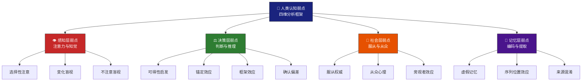
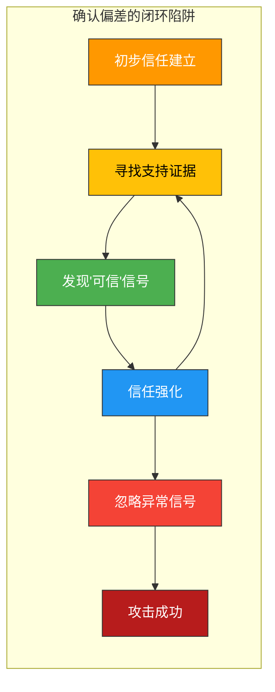
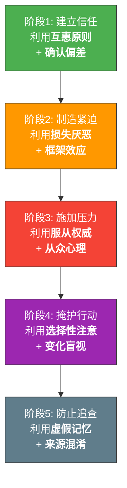

## 23.4 人类认知弱点分析

社会工程学攻击的终极靶点不是防火墙、不是加密算法，而是人类大脑自身的信息处理机制。认知心理学数十年的实验研究反复证明：人类大脑在进化中形成的"快捷处理路径"——心理学家丹尼尔·卡尼曼所称的"系统1思维"——在帮助我们快速应对日常事务的同时，也留下了大量可被精确利用的认知漏洞。本节将从感知层、决策层、社会层和记忆层四个维度，系统剖析这些认知弱点的机制、实验验证、攻击利用方式和防御策略。

> **图23-8**：人类认知弱点四维分析框架。感知层决定我们"看到什么"，决策层决定我们"如何判断"，社会层决定我们"听从谁的"，记忆层决定我们"记住什么"。社会工程学攻击可以在任何一个维度上找到突破口，高级攻击者往往同时在多个维度施加压力。

---

### 23.4.1 感知层弱点：注意力与知觉的盲区

人类的感知系统并非客观的"摄像机"，而是一个高度选择性的信息过滤器。每秒约有1100万比特的信息通过感官进入大脑，但有意识的处理能力仅为每秒约50比特。这意味着大脑必须丢弃99.9995%的感官输入——这个极端的过滤机制创造了攻击者的巨大操作空间。

#### 一、选择性注意（Selective Attention）

**定义**：选择性注意是指人类在面对多个信息源时，倾向于将注意力集中在与当前任务相关的信息上，同时忽略其他信息的认知机制。这不是意志力的问题，而是大脑资源分配的底层逻辑。

**经典实验：看不见的黑猩猩（Invisible Gorilla）**

哈佛大学心理学家丹尼尔·西蒙斯（Daniel Simons）和克里斯托弗·查布里斯（Christopher Chabris）在1999年设计了心理学史上最著名的实验之一。实验要求受试者观看一段视频，视频中有两队人（分别穿白色和黑色衣服）在互相传递篮球，受试者的任务是数出白衣队员传球的次数。在视频进行到一半时，一个身穿大猩猩服装的人从画面中央走过，面对镜头捶胸，然后离开。

结果令人震惊：**约50%的受试者完全没有注意到大猩猩的存在**。后续研究进一步发现，即使受试者被告知"可能会有意外事物出现"，仍有约30%的人未能察觉。这说明选择性注意的影响是如此强大，以至于即使有意识地提醒也无法完全消除。

**社会工程学攻击应用**：

- **视觉噪音掩护**：在钓鱼邮件中使用大量正常的商业元素（logo、免责声明、法律条文），将恶意链接或附件隐藏在视觉噪音之中。收件人的注意力被正常的商业外观吸引，忽略了细微的异常
- **任务聚焦攻击**：先给目标分配一个需要高度集中注意力的任务（如填写紧急表格、解决技术问题），在其认知资源被占用时实施攻击。例如，"IT支持"先让员工关注"紧急安全更新"的技术细节，同时在后台安装恶意软件
- **变化伪装**：在包含大量信息的文档中嵌入恶意条款。例如，在一份20页的服务条款中插入数据收集授权，利用用户的"滚动疲劳"使其跳过关键内容
- **多模态干扰**：在电话沟通中同时发送邮件，利用注意力在两个通道间的切换制造认知盲区

**防御策略**：

- 采用"主动扫描"而非"被动接收"的信息处理习惯，对关键信息进行二次确认
- 在处理涉及安全、财务或敏感信息的任务时，刻意降低多任务并行，保持单线程专注
- 使用"红队思维清单"：在点击任何链接或附件前，强制检查发件人、URL域名和上下文一致性

#### 二、变化盲视（Change Blindness）

**定义**：变化盲视是指人类在没有显著视觉提示的情况下，难以察觉场景中发生的改变。这种现象在注意力被分散或改变发生于视觉中断（如眨眼、画面闪烁）期间尤为明显。

**经典实验：门卫更换实验（Door Study）**

1998年，心理学家丹尼尔·西蒙斯进行了一项更早的实验。一名研究人员向校园里的行人问路，在对话过程中，一扇门从两人之间穿过（由搬运工抬着），在此期间研究人员偷偷换成了另一个人。结果：**46%的受试者完全没有注意到对话对象已经换了一个人**——不仅是外貌不同，连声音、身高和体型都发生了明显变化。

另一项经典实验是"闪烁范式"（Flicker Paradigm）：两张几乎相同的图片交替呈现，中间插入短暂的空白画面。即使两张图片之间的差异非常显著（如建筑物颜色完全不同），受试者平均需要数十次循环才能发现变化。

**社会工程学攻击应用**：

- **渐进式URL篡改**：攻击者不会一次性将`bank.com`改为`b4nk.com`，而是通过多封邮件逐步修改——先用`bank.com`建立信任，然后用`bank-update.com`，再到`b4nk-update.com`。每一次变化都很微小，目标在变化盲视的作用下不会察觉到渐进式的域名漂移
- **界面仿真的渐进优化**：钓鱼网站从粗糙模仿开始，逐步迭代到与真实网站高度相似。用户在多次访问中习惯性地接受微小的界面差异
- **权限的渐进式提升**：攻击者在获得初始低权限后，通过多次小幅度的权限变更逐步达到完全控制。系统管理员在日志审查时，面对大量细小的权限变更记录，难以识别出恶意的权限爬升
- **身份替换**：在长线社交工程攻击中，攻击者在多个接触点中逐步替换目标对"正常交互"的基线认知。例如，先以温和的语调沟通多次，然后在关键时刻切换为紧急、权威的语调

**防御策略**：

- 对关键安全信息（URL、发件人地址、转账账户）建立"逐项核对"的标准化流程，依赖外部记忆（白名单、保存的书签）而非内部记忆
- 启用系统的"变更通知"功能，任何权限变更、配置修改都触发告警
- 使用密码管理器的URL自动填充功能——密码管理器不会被伪造域名欺骗

#### 三、不注意盲视（Inattentional Blindness）

**定义**：与选择性注意密切相关但又有区别的是"不注意盲视"——当注意力被某个任务完全占据时，人们会对视野中完全可见但与任务无关的物体"视而不见"。选择性注意关注的是"注意力分配给谁"，不注意盲视关注的是"注意力耗尽后的感知缺失"。

**实验验证**：飞行员在紧急降落时会注意到跑道标志而忽略低空飞行的障碍物；放射科医生专注于肿瘤检测时可能忽略X光片上明显的手指骨——这些真实场景的统计数据显示，在高认知负荷状态下，专家的专业领域不注意盲视率可达30%以上。

**社会工程学攻击应用**：

- **任务劫持**：在安全审查或合规检查期间，员工的认知资源完全被合规任务占据，攻击者利用这个窗口期发起攻击
- **复杂表单攻击**：在包含多个输入字段的复杂表单中（如开户、注册、税务申报），用户专注于填写必填项时，忽略了表单中嵌入的恶意字段或授权条款
- **技术细节掩护**：攻击者在解释一个复杂的技术问题时，插入一个不相关但不合规的请求。目标忙于理解技术细节，自动批准了该请求

**防御策略**：

- 对涉及权限变更、财务操作或敏感信息的请求，建立"暂停-审查"机制，无论当前任务多么紧急
- 安全培训中引入不注意盲视的实操演练，让员工亲身体验这种认知盲区的存在

---

### 23.4.2 决策层弱点：判断与推理的系统性偏差

人类的决策过程远非理性的成本-收益分析。大量认知心理学研究表明，人类在不确定条件下的判断依赖于一系列"启发式"（heuristics）——这些心理捷径在大多数情况下是高效的，但在被攻击者刻意利用时会系统性地产生错误。

#### 一、可得性启发（Availability Heuristic）

**定义**：人们倾向于根据信息在记忆中的易提取程度来评估事件发生的概率。换言之，越容易想到的事情，人们越认为它发生的概率高。

**心理学机制**：大脑使用"提取流畅性"作为判断频率的代理指标。如果一个事件最近被频繁报道、具有强烈的情绪色彩或生动的感官细节，它在记忆中的提取速度更快，大脑就错误地认为这类事件更常见。

**攻击利用**：

- **恐慌制造**：攻击者利用最近发生的大规模数据泄露事件，发送"您的账户可能已受影响，请立即验证"的钓鱼邮件。由于目标刚刚看过相关报道，该事件在记忆中高度可得，判断力因此下降
- **威胁放大**：谎称"最近系统遭受了大量攻击"，使目标高估攻击发生的概率，从而接受非常规的安全操作
- **锚定于负面案例**：在说服过程中引用目标公司或行业的安全事件，使目标将注意力聚焦于攻击的可能性而非请求本身的异常性

**防御策略**：

- 对任何引用安全事件的紧急请求，通过官方渠道独立验证该事件的真实性和影响范围
- 建立标准化的事件响应流程，不受"最近是否发生了安全事件"的主观判断影响

#### 二、锚定效应（Anchoring Effect）

**定义**：人们在做数值估计或决策时，过度依赖最先接收到的信息（"锚点"），即使该信息与实际问题无关。

**经典实验**：特沃斯基和卡尼曼的经典实验中，受试者被要求估计联合国中非洲国家的百分比。在回答前，实验者先旋转一个随机转盘，转盘随机停在10或65。结果：看到10的受试者平均估计25%，看到65的平均估计45%。一个完全无关的随机数字显著影响了专业判断。

**攻击利用**：

- **价格锚定**：在诈骗场景中先提出一个极高的金额（"您的账户欠费50,000元"），然后提供"解决方案"只需支付较小的金额（"现在只需缴纳500元手续费"）。对比之下，500元显得微不足道
- **时间锚定**：先声称"您必须在10分钟内完成操作，否则账户将被永久冻结"，这个极端时间压力成为锚点，使目标对后续"延长到30分钟"的让步感到"合理"
- **技术锚定**：先描述一个极其复杂的技术问题，然后提供一个"简化"的解决方案。目标被复杂度锚定后，会倾向于接受任何看似简单的方案

**防御策略**：

- 对任何涉及金额、时间或数量的请求，先独立评估合理范围，再考虑对方提供的数据
- 警惕"先极端后让步"的谈判策略——让步后的数字仍然可能不合理

#### 三、框架效应（Framing Effect）

**定义**：同一信息以不同方式呈现（"框架"）会显著影响人们的决策。正面框架强调收益，负面框架强调损失。

**经典实验**：亚洲疾病问题——假设一种疾病将导致600人死亡，有两种治疗方案。方案A："200人将被救活"（正面框架）vs 方案A'："400人将死亡"（负面框架）。虽然两种描述完全等价，但正面框架下72%的受试者选择确定性方案，负面框架下78%的受试者选择冒险方案。

**攻击利用**：

- **恐惧框架**："不点击此链接验证，您的账户将在24小时内被关闭"——负面框架迫使目标采取冒险行为（点击未知链接）
- **收益框架**："完成此安全升级，您将获得额外的账户保护和50元优惠券"——正面框架用收益诱惑目标放松警惕
- **道德框架**："这是帮助公司渡过难关的紧急措施"——将不合规操作框定为"忠诚"和"奉献"，利用目标的道德认同

**防御策略**：

- 对任何请求，尝试用相反的框架重新表述，检验你的决策是否会反转。如果反转，说明你受到了框架效应的影响
- 建立"反框架清单"：在做安全决策前，问自己"如果对方用完全相反的方式描述这个请求，我还会同意吗？"

#### 四、确认偏差（Confirmation Bias）

**定义**：人们倾向于寻找、解释和记忆支持自己已有信念的信息，同时忽略或低估与之矛盾的信息。

**心理学机制**：确认偏差是一种深层的认知保护机制——大脑倾向于维持现有认知模型的稳定性，因为频繁修改模型会消耗大量认知资源。这是一种"认知惰性"，在大多数情况下减少了决策负担，但在安全场景中会产生致命盲点。

**攻击利用**：

- **信任强化**：一旦目标初步建立了对攻击者的信任（如通过前期的小恩小惠），后续的每一个正常互动都会被大脑解读为"对方可信"的证据，而异常信号则被自动过滤
- **先验植入**：先通过合法渠道向目标植入一个虚假信息（如"公司正在推行新的安全认证流程"），后续的钓鱼攻击伪装成该流程的执行，目标会主动寻找证据证明该钓鱼邮件是"正常的"
- **自我欺骗**：攻击者引导目标自己"发现"攻击者可信的证据，比直接声称可信更有效。例如，攻击者"不经意"透露一个可验证的真实信息，目标验证后会强化信任

**防御策略**：

- 建立"魔鬼代言人"思维习惯：对每个信任判断，主动寻找三条反面证据
- 区分"验证通过"和"信任确认"——验证通过只是说明特定技术手段未发现问题，不代表整体可信

> **图23-9**：确认偏差的闭环陷阱。一旦初步信任建立，大脑会进入一个自我强化的循环：主动寻找支持证据→信任加强→忽略异常信号。社会工程学攻击者通过精心设计的"可信信号"喂养这个循环，使目标在攻击过程中越来越自信，直到攻击完成。

#### 五、损失厌恶（Loss Aversion）

**定义**：人们对损失的敏感度约为对等量收益的2倍。失去100元的痛苦感大约是获得100元快乐感的2倍。这是卡尼曼和特沃斯基前景理论（Prospect Theory）的核心发现。

**社会工程学攻击利用**：

- **账户安全威胁**："您的账户存在异常登录，如不立即处理，账户余额将面临风险"——损失厌恶使目标跳过验证直接行动
- **限时优惠**："此优惠仅剩最后3个名额"——不仅利用了稀缺性，更激活了"错过就失去"的损失厌恶
- **投资诈骗**："今天不投资，明天将失去10倍回报的机会"——将"不行动"框定为损失

**防御策略**：

- 对任何强调"即将失去"的请求，强制等待24小时再决策。真正的紧急情况有官方的应急通道，不会通过非官方渠道通知
- 问自己："如果我不采取任何行动，最坏的结果是什么？这个结果是否真的不可挽回？"

---

### 23.4.3 社会层弱点：服从与从众的压力

人类是高度社会化的物种。社会心理学实验反复证明，在群体压力和权威指令面前，个体的独立判断能力会大幅下降。社会工程学攻击者通过操纵社会关系结构来利用这些弱点。

#### 一、服从权威（Obedience to Authority）

**经典实验：米尔格拉姆电击实验（Milgram Experiment）**

1961年，耶鲁大学心理学家斯坦利·米尔格拉姆（Stanley Milgram）设计了可能是心理学史上最具争议性的实验。实验的表面目的是研究"惩罚对学习效果的影响"，实际目的是测量普通人在权威指令下服从到什么程度。

实验设置：受试者（"教师"）被要求在"学习者"回答错误时给予电击惩罚，电压从15V逐步增加到450V。学习者实际上是演员，电击是假的，但受试者并不知道。学习者会发出痛苦的尖叫、恳求停止，最终在高电压下完全沉默。

实验结果震撼了学术界：**65%的受试者一直服从到了最高的450V电压**，即使学习者已经停止回应（暗示可能已经死亡）。后续的跨文化重复实验在德国、意大利、荷兰、南非等国家都得到了相似的结果（服从率在61%-91%之间）。

**权威符号的作用**：

米尔格拉姆通过系统性地改变实验条件，揭示了影响服从率的关键因素：

| 实验条件 | 服从率 | 关键发现 |
|---------|--------|---------|
| 耶鲁大学实验室（标准条件） | 65% | 机构权威的背书显著提升服从率 |
| 在破旧的办公楼进行 | 48% | 权威的物理环境影响服从程度 |
| 实验者通过电话指令 | 21% | 物理在场的权威比远程权威更有效 |
| 两名实验者给出矛盾指令 | 0% | 权威的不确定性会瓦解服从 |
| 另外两名"教师"（演员）拒绝继续 | 10% | 榜样的反抗大幅降低服从率 |
| "教师"必须将学习者的手按在电击板上 | 30% | 直接接触受害者会降低服从率 |

**社会工程学攻击应用**：

- **身份冒充**：攻击者冒充CEO、IT管理员、法务部门、政府监管人员等权威角色，下达看似合理的指令。典型的BEC诈骗中，攻击者伪装成CEO发送邮件："紧急转账到这个账户，不要告诉任何人"
- **权威符号堆叠**：使用公司logo、官方签名、法律术语、合规编号等视觉和语义上的权威符号，即使单个符号可以被质疑，多个符号的叠加会大幅提升可信度
- **等级压力**：利用组织内部的层级关系制造压力。"这是副总裁直接要求的"——质疑权威的社交成本被放大
- **制度权威**：引用虚构的"新规"、"合规要求"或"审计流程"，将攻击包装为制度性要求

**防御策略**：

- 建立"独立验证协议"：任何来自权威人物的非常规请求（尤其是涉及财务、权限变更或敏感信息），必须通过第二个独立渠道验证。例如，收到CEO的紧急转账邮件后，用公司通讯录上的电话直接联系确认
- 组织层面建立"安全港"制度：员工因执行安全流程而延迟了紧急任务时，不应受到惩罚。这降低了因服从权威而绕过安全流程的心理压力
- 定期培训中重现米尔格拉姆实验的核心发现，让员工亲身体验服从压力

#### 二、从众心理（Conformity）

**经典实验：阿希线段判断实验（Asch Experiment）**

1951年，所罗门·阿希（Solomon Asch）进行了一项关于群体压力对个体判断影响的经典实验。受试者被安排在一组7-9人的群体中（其中只有1人是真正的受试者，其余都是演员），任务是判断三条线段中哪一条与参照线段等长——这是一个简单的视觉判断任务，正确答案显而易见。

当群体中的演员故意给出明显错误的答案时，**75%的受试者至少有一次跟随群体给出了错误答案**，总体从众率约为37%。更令人深思的是，事后访谈中，许多从众的受试者表示他们知道正确答案，但因为"不想与众不同"或"怀疑自己的视力"而选择了跟随群体。

**从众心理的调节因素**：

| 因素 | 影响 | 实验数据 |
|------|------|---------|
| 群体规模 | 从众率随群体人数增加而上升，但3-5人后趋于平稳 | 1人：3%；3人：13.5%；5人：31.2%；8人：35.8% |
| 一致性 | 群体中只要有一个不同意见者，从众率就会急剧下降 | 有同盟者：5.5%（从37%下降） |
| 任务难度 | 任务越困难，从众率越高 | 线段差异越小，从众率越高 |
| 公开性 | 公开回答比私下回答从众率更高 | 公开：37% vs 私下：23% |
| 文化差异 | 集体主义文化从众率更高 | 跨文化研究显示日本从众率高于美国 |

**社会工程学攻击应用**：

- **社会证明操纵**："您的同事都已经完成了安全培训/更新了密码/签署了这份协议"——利用从众压力目标跳过独立判断
- **虚假评价和评论**：在诈骗网站上使用大量虚假好评，利用从众心理降低目标的警惕性
- **群体事件伪装**：在社交媒体上制造虚假的讨论热度，让人们觉得"这么多人参与一定没问题"
- **内部人员配合**：在物理社会工程学中，安排"同伙"先执行要求的行为（如刷卡进入限制区域），利用从众心理带动目标跟随

**防御策略**：

- 培养"异见者"文化：鼓励员工在安全问题上公开质疑，即使质疑看起来与多数人意见相左
- 建立独立的信息验证渠道，不依赖"其他人都这样做"作为决策依据
- 对"社会证明"类的说服手段保持本能警惕——如果一个请求只有"别人都同意了"而没有实质理由，这本身就是一个红旗

#### 三、旁观者效应（Bystander Effect）

**定义**：在紧急情况下，在场的人越多，每个人采取行动的可能性反而越低。每个人都在等待别人先行动，最终没有人行动。

**经典案例：基蒂·吉诺维斯事件（Kitty Genovese Case）**

1964年纽约皇后区，一名年轻女性在凌晨遭到长达30多分钟的袭击，据报道有38名邻居目击了事件但无人报警。虽然后续调查对此事件的具体细节有所修正，但它引发了达利和拉塔内对旁观者效应的系统性研究。

**社会工程学攻击应用**：

- **多人邮件抄送**：攻击者将钓鱼邮件发送给多人，每个人都会认为"其他人会处理"或"其他人会发现异常"，从而降低个人的警惕性
- **公共区域入侵**：在办公区域尾随进入时，攻击者依赖旁观者效应——在场的员工会认为"其他人可能认识这个人"而不主动质疑
- **安全事件报告**：当安全异常被多人同时发现时，每个人可能都认为"已经有人报告了"，最终导致无人报告

**防御策略**：

- 明确安全责任，避免"集体责任等于无人负责"的困境
- 建立"第一个发现者负责报告"的制度，并给予正向激励
- 在安全培训中特别强调旁观者效应，让员工意识到"我应该行动"而非等待他人

---

### 23.4.4 记忆层弱点：编码与提取的不可靠性

人类记忆并非硬盘录像——它是每次提取时都在重新建构的动态系统。这种建构性使记忆高度灵活，也使它极易被操纵。

#### 一、虚假记忆（False Memory）

**定义**：虚假记忆是指人们对从未发生过的事件形成了生动而确信的记忆。伊丽莎白·洛夫特斯（Elizabeth Loftus）的数十年研究证明，记忆可以被植入、修改甚至完全虚构。

**经典实验："迷失在商场"研究**

洛夫特斯在1995年进行了一项开创性实验。研究人员向受试者展示由家人提供的童年真实事件照片，并附带一个虚构的事件——"5岁时在商场走丢"。经过三轮访谈，**25%的受试者"记得"了这个从未发生过的事件**，并能提供生动的细节描述。

**社会工程学攻击应用**：

- **记忆植入**：攻击者通过多次暗示性沟通，让目标"回忆起"从未发生过的先前交互。例如："上周三我们已经讨论过这个方案了，您当时同意了"——如果攻击者足够自信且细节合理，目标可能会"想起"这个虚构的交互
- **证词操纵**：在内部调查或取证过程中，攻击者通过暗示性提问植入虚假记忆，使目击者的证词受到污染
- **情境重建**：攻击者营造与目标真实记忆相似的场景，利用"来源混淆"使目标将攻击者提供的虚假信息当作自己记得的真实信息

**防御策略**：

- 对重要的承诺和决策建立书面记录，依赖外部记录而非内部记忆
- 在安全相关的对话中使用邮件确认，即使是对面交谈也要有书面备份
- 培训员工识别暗示性提问（"你记得我们讨论过…吗？"），并学会用"让我查看记录"来回应

#### 二、序列位置效应（Serial Position Effect）

**定义**：人们在记忆一个列表时，对开头（首因效应）和结尾（近因效应）的内容记忆最好，对中间内容记忆最差。

**社会工程学攻击应用**：

- **关键信息插入**：在一封包含多个要点的邮件中，将恶意请求放在中间位置，利用序列位置效应降低其被注意和记住的概率
- **长对话操控**：在长时间的电话或会议中，攻击者在对话开头建立信任，在结尾留下积极印象，而中间的异常请求则被"淹没"
- **协议条款隐藏**：在长篇服务条款中将关键的数据收集条款放在中间段落

**防御策略**：

- 对长文档建立"逐段审查"的习惯，不依赖整体印象判断
- 对邮件和对话中的每个独立请求分别评估，而非仅关注开头和结尾

#### 三、来源混淆（Source Monitoring Error）

**定义**：人们能够记住某个信息的内容，但会搞错信息的来源。例如，把从攻击者邮件中看到的信息误认为是自己从公司公告中看到的。

**社会工程学攻击应用**：

- **信息来源置换**：攻击者通过多个渠道（邮件、电话、面对面）重复同一虚假信息，使目标最终无法区分信息的真实来源，误以为"从多个渠道听说过"就等于"已经被确认"
- **权威来源伪造**：在邮件中引用虚构的"公司公告"或"政府通知"，目标可能后来"记得"自己看到过这份公告，但实际上从未存在过

**防御策略**：

- 对任何引用外部来源的信息，主动去原始来源验证
- 建立"信息溯源"的习惯——不仅关注"我知道什么"，还要确认"我从哪里知道的"

---

### 23.4.5 认知负荷与时间压力：弱点的放大器

以上所有认知弱点都会在高认知负荷和时间压力下被显著放大。这不是一种独立的弱点，而是一个"弱点放大器"——它本身不会产生新的认知偏差，但会使已有的偏差变得更严重。

**认知负荷的来源**：

- **多任务并行**：同时处理多个任务会显著降低每个任务的认知资源，使系统1的快捷处理路径主导决策
- **信息过载**：面对海量信息时，大脑被迫采用更粗粒度的过滤策略，增加遗漏关键信号的风险
- **情绪干扰**：恐惧、愤怒、焦虑等强烈情绪会占用大量认知资源，压缩理性思考的空间
- **疲劳**：长时间工作后的认知功能下降相当于血液酒精浓度0.05%的影响——接近法定醉驾标准
- **睡眠剥夺**：连续24小时不睡觉后，认知功能下降约25%，决策质量显著恶化

**攻击者的利用策略**：

- **时间窗口选择**：攻击者倾向于在目标认知负荷最高的时段发起攻击——周一早晨的邮件高峰、季末的财务截止日、年终考核期间
- **人为制造认知过载**：先发送大量无关但看似正常的信息轰炸，降低目标的过滤阈值后再发送恶意内容
- **紧急度升级**：逐步升级事件的紧急程度，从"请尽快处理"到"必须在1小时内完成"，每一步都在压缩目标的思考时间

**综合防御原则**：

> **核心原则**：用流程替代警惕，用系统替代意志力。认知弱点是人类大脑的固有特性，任何人都无法通过"更加小心"来完全消除它们。真正有效的防御是建立自动化的安全流程——技术验证（MFA、密码管理器、URL检查工具）替代人的判断，流程约束（双人审批、独立验证通道）替代人的警惕，系统监控（异常行为检测、变更通知）替代人的注意力。

---

### 23.4.6 个体差异：并非所有人都一样脆弱

认知弱点虽然普遍存在，但在不同个体之间的表现程度存在显著差异。了解这些差异有助于针对性地设计安全培训和防御策略。

**影响认知弱点敏感度的关键因素**：

| 因素 | 高脆弱性表现 | 低脆弱性表现 | 防御启示 |
|------|------------|------------|---------|
| 认知需求（Need for Cognition） | 习惯直觉决策，不深入分析 | 喜欢深入思考，主动分析信息 | 对低认知需求群体加强流程约束 |
| 自我监控（Self-Monitoring） | 高度关注社会形象，易受社会压力影响 | 更关注自身内在标准 | 高自我监控者需要额外的从众防护 |
| 权力距离（Power Distance） | 对权威高度服从，不敢质疑 | 敢于质疑权威决策 | 高权力距离文化需要更多独立验证机制 |
| 时间紧迫性容忍度 | 在时间压力下容易草率决策 | 在时间压力下仍能保持冷静 | 对高时间压力敏感者设置强制等待期 |
| 专业知识水平 | 在专业领域外更容易受骗 | 能利用专业知识识别异常 | 跨领域安全培训弥补专业盲区 |
| 网络安全意识 | 无法识别常见攻击信号 | 能识别钓鱼邮件等常见攻击 | 分层培训，针对性提升 |

---

### 23.4.7 认知弱点的组合利用：高级攻击模式

高级攻击者不会单独利用一种认知弱点，而是精心设计"弱点链"——多个弱点的组合利用形成协同效应，使攻击的成功率呈指数级提升。

**典型的多弱点组合攻击模式**：

> **图23-10**：高级社会工程学攻击的多弱点组合利用模式。每个阶段利用不同的认知弱点，前一阶段为后一阶段创造条件。这种"弱点链"的防御不能靠单一措施，需要在每个环节都建立独立的防线。

**BEC诈骗的认知弱点叠加分析**：

以商业电子邮件诈骗（BEC）为例，一个完整的攻击链通常同时利用以下认知弱点：

1. **信息收集阶段**——利用OSINT降低后续攻击中的认知负荷（让攻击内容更"合理"，减少目标的怀疑）
2. **建立信任阶段**——利用**确认偏差**强化目标对攻击者身份的信任，利用**喜好原则**建立情感连接
3. **实施攻击阶段**——利用**服从权威**（冒充CEO）、**损失厌恶**（"不转账将失去合同"）、**紧迫感**（"30分钟内必须完成"）和**框架效应**（"这是公司的紧急需求"）多管齐下
4. **掩盖阶段**——利用**变化盲视**（渐进式修改邮件地址）和**虚假记忆**（事后让目标"记得"这是一个已批准的流程）

---

### 23.4.8 认知弱点在防御中的应用：反向利用

理解认知弱点不仅是为了防御攻击，还可以"正向利用"这些弱点来设计更有效的安全机制。

| 认知弱点 | 反向利用方式 | 防御设计示例 |
|---------|------------|------------|
| 损失厌恶 | 强调不遵守安全规范的损失 | 安全培训展示真实的数据泄露案例和损失金额 |
| 从众心理 | 展示大多数员工遵守安全规范的数据 | "97%的同事已完成安全意识培训" |
| 稀缺原则 | 将安全培训设置为限时限量的高质量课程 | 提升安全培训的参与度和重视程度 |
| 框架效应 | 将安全规范框定为"保护自己"而非"限制自由" | "启用MFA可以保护你的个人账户安全" |
| 锚定效应 | 在安全教育中提供攻击成本的具体数字 | "一次成功的钓鱼攻击平均造成420万美元损失" |

> **设计原则**：安全机制的设计应该与人类的认知特性协同而非对抗。与其要求人们"克服"认知弱点，不如设计利用这些弱点的安全机制——让正确的行为成为阻力最小的路径。

---

### 23.4.9 常见误区与纠正

| 误区 | 事实 | 影响 |
|------|------|------|
| "只有粗心的人才会被社会工程学攻击" | 认知弱点是人类大脑的固有特性，与智力或谨慎程度无关 | 导致过度依赖个人警惕性而非系统性防护 |
| "安全培训可以消除认知弱点" | 培训可以提高意识，但无法消除底层认知机制 | 培训效果被高估，替代措施被忽视 |
| "老年人更容易受骗" | 认知弱点的影响与年龄关系不大，与情境和认知负荷关系更大 | 错误地针对特定人群设计防护，忽略了普遍性 |
| "技术手段不能防御心理操纵" | 技术手段（MFA、URL检查、邮件过滤）恰恰是最有效的防御，因为它们绕过了人类认知弱点 | 导致安全投资过度偏重培训，忽视技术防护 |
| "我不会上当" | 过度自信本身就是一种认知偏差，在合适的条件下任何人都会受影响 | 过度自信者反而更容易被攻击，因为他们不设防 |
| "一次培训就够了" | 认知弱点会随时间和情境变化持续发挥作用 | 安全意识在培训后数周内就会衰减 |

---

### 23.4.10 实战检验清单

在进行社会工程学防御评估时，可以用以下清单检验组织对各类认知弱点的防护状态：

**感知层防护**：
- [ ] 邮件客户端是否高亮显示外部发件人？
- [ ] URL检查是否自动对比已知的钓鱼域名数据库？
- [ ] 关键操作界面是否有视觉变化通知机制？

**决策层防护**：
- [ ] 涉及财务的请求是否有标准化的审批流程？
- [ ] 紧急请求是否有独立的验证通道？
- [ ] 员工是否有安全报告的"无责"保障？

**社会层防护**：
- [ ] 是否建立了权威身份的独立验证机制？
- [ ] 安全文化是否鼓励质疑而非盲从？
- [ ] 是否有反旁观者效应的具体责任分配？

**记忆层防护**：
- [ ] 关键承诺和决策是否有书面记录？
- [ ] 系统配置变更是否有审计日志？
- [ ] 安全培训是否有定期复训机制？

---

***核心原则：认知弱点不是"性格缺陷"而是"大脑特性"。真正有效的防御不依赖于"意志力"或"警惕性"，而是依赖于系统化、流程化的安全机制——让正确的行为成为阻力最小的路径。***
