## 23.6 本节小结：社会工程学理论基础

### 23.6.1 知识体系总览

社会工程学的理论基础涵盖了从心理学原理到攻击模型、从攻击类型到认知弱点、再到技术增强的完整知识链。以下是本节的整体知识框架：

```mermaid
graph TD
    ROOT["🛡️ 社会工程学<br/>理论基础全景图"]
    
    ROOT --> P["🧠 心理学原理<br/>Section 23.1"]
    ROOT --> M["📐 攻击模型<br/>Section 23.2"]
    ROOT --> T["⚔️ 攻击类型<br/>Section 23.3"]
    ROOT --> C["🔍 认知弱点<br/>Section 23.4"]
    ROOT --> E["💻 技术增强<br/>Section 23.5"]
    
    P --> P1["西奥迪尼六原则<br/>互惠/承诺/认同/权威/喜好/稀缺"]
    P --> P2["认知偏差<br/>确认偏差/锚定/可得性/框架"]
    P --> P3["情绪操纵<br/>恐惧/紧迫/好奇/同情"]
    
    M --> M1["攻击链模型<br/>5阶段:收集→关系→利用→维持→退出"]
    M --> M2["MITRE ATT&CK<br/>行业标准战术与技术映射"]
    M --> M3["Kill Chain<br/>7阶段军事级攻击生命周期"]
    
    T --> T1["钓鱼攻击家族<br/>Phishing/Spear/Whaling/Vishing/Smishing"]
    T --> T2["预先文本攻击<br/>Pretexting"]
    T --> T3["诱饵与尾随<br/>Baiting/Tailgating"]
    T --> T4["BEC诈骗<br/>商业邮件欺诈"]
    
    C --> C1["选择性注意<br/>看不见的黑猩猩"]
    C --> C2["变化盲视<br/>渐进式修改"]
    C --> C3["服从权威<br/>米尔格拉姆65%服从率"]
    C --> C4["从众心理<br/>阿希75%从众率"]
    
    E --> E1["AI增强<br/>Deepfake/自动化"]
    E --> E2["大数据画像<br/>OSINT工具链"]
    E --> E3["社交媒体情报<br/>SOCMINT全平台监控"]

    style ROOT fill:#1a237e,stroke:#333,color:#fff
    style P fill:#c62828,stroke:#333,color:#fff
    style M fill:#2e7d32,stroke:#333,color:#fff
    style T fill:#e65100,stroke:#333,color:#fff
    style C fill:#4a148c,stroke:#333,color:#fff
    style E fill:#01579b,stroke:#333,color:#fff
```

> **图23-21**：社会工程学理论基础五维知识体系。这五个维度相互关联、层层递进——心理学原理揭示"为什么有效"，攻击模型展示"如何组织"攻击，攻击类型列举"具体是什么"，认知弱点解释"哪里可被利用"，技术增强表明"攻击如何进化"。

---

### 23.6.2 各节核心要点回顾

#### 一、心理学原理（23.1）—— 攻击的根基

社会工程学攻击的威力来源于对人类心理规律的深刻把握。西奥迪尼的六大影响力原则是社会工程学攻击的底层驱动程序：

| 原则 | 核心理念 | 攻击利用方式 | 防御切入点 |
|------|---------|------------|-----------|
| 互惠原则 | 投桃报李 | 先赠送"小恩小惠"再索取信息 | 警惕意外的善意，区分礼物与陷阱 |
| 承诺与一致性 | 言行一致的压力 | 从小承诺逐步升级到敏感请求 | 定期重新审视承诺的合理性 |
| 社会认同 | 跟随多数 | 声称"其他人都已配合"制造从众压力 | 独立验证，不盲从集体行为 |
| 权威原则 | 服从权威 | 冒充CEO/IT支持/政府人员 | 通过独立渠道验证身份 |
| 喜好原则 | 偏爱熟悉的人 | 建立Rapport、利用共同兴趣 | 区分个人情感与安全决策 |
| 稀缺原则 | 物以稀为贵 | 制造紧迫感和稀缺性 | 保持冷静，坚持标准流程 |

**更深层的心理操纵**：除了六大原则，攻击者还大量利用**认知偏差**（确认偏差让人自圆其说、锚定效应扭曲第一印象、可得性启发制造恐慌、框架效应操纵选择）和**情绪操纵**（恐惧使人仓促决定、紧迫感压缩思考时间、好奇心引诱点击、同情心绕过理性防线）。

> **关键领悟**：社会工程学攻击者不是在与你的智力对抗，而是在与你的本能对抗。人类大脑的快捷处理机制（系统1思维）在数百万年进化中帮助了我们的生存，但在信息时代却成为可被精确利用的漏洞。

---

#### 二、攻击模型（23.2）—— 攻击的框架化理解

社会工程学攻击绝非随机行为，而是遵循严谨的攻击生命周期。本节介绍了三个层次的攻击模型：

**攻击链五阶段模型**（社会工程学专用）：
1. **信息收集**——通过OSINT、社交媒体分析、垃圾搜索、物理观察构建目标画像
2. **建立关系**——通过Rapport建设、共同点寻找、权威形象塑造获取目标信任
3. **利用**——实施具体攻击，获取敏感信息或访问权限
4. **维持**——持久化访问，建立后门，避免被检测
5. **退出**——清除痕迹，自然结束关系，避免事后溯源

**MITRE ATT&CK框架映射**：将社会工程学技术标准化到行业公认的战术分类体系中，包括初始访问（T1566钓鱼系列、T1189水坑攻击、T1195供应链攻击）、执行（T1204用户执行）和发现（T1589/T1590/T1592信息收集）。

**Cyber Kill Chain七阶段**：将社会工程学攻击置于更宏观的网络攻防框架中，从侦察→武器化→投递→利用→安装→C2→目标达成，覆盖了攻击的完整生命周期。

> **关键领悟**：理解攻击模型的意义不仅在于"知道攻击者怎么做"，更在于"知道在哪个环节可以阻断攻击"。每一阶段都对应着不同的防御切入点：信息收集阶段可以做反OSINT，利用阶段可以做行为检测，维持阶段可以做异常监控。

---

#### 三、攻击类型（23.3）—— 攻击的具体形态

社会工程学攻击已经发展出一个庞大的"攻击家族树"，每种攻击类型都有其独特的运作机制和适用场景：

**钓鱼攻击家族**——最广泛的社会工程学攻击形式：
- **大规模钓鱼（Mass Phishing）**：撒网式发送，利用知名品牌信任，成功率约0.1%-3%，但单次攻击可覆盖百万级目标
- **鱼叉式钓鱼（Spear Phishing）**：针对特定个人定制，包含个性化信息，成功率可达45%-60%
- **捕鲸攻击（Whaling）**：针对C级高管，通常配合BEC诈骗，单次损失平均12万美元
- **语音钓鱼（Vishing）**：通过电话实施，利用声音的天然信任优势
- **短信钓鱼（Smishing）**：通过短信实施，利用手机的即时性和高打开率（短信打开率98%，远高于邮件的20%）

**其他重点攻击类型**：
- **预先文本攻击（Pretexting）**：构建系统化的虚假场景，是最需要前期准备的攻击方式
- **诱饵攻击（Baiting）**：利用贪婪或好奇心，物理形式如含恶意软件的USB驱动器
- **尾随攻击（Tailgating）**：利用礼貌心理和社会规范突破物理安全
- **商业电子邮件诈骗（BEC）**：2013-2020年全球累计损失超260亿美元，是经济损失最大的社会工程学攻击形式

> **关键统计**：FBI互联网犯罪报告显示，BEC诈骗的年度损失持续超过勒索软件、数据泄露等其他网络犯罪形式，2022年仅美国报告的案件就超过21,000起，调整后损失超过27亿美元。

---

#### 四、人类认知弱点（23.4）—— 攻击的心理学靶点

本节从认知心理学经典实验出发，揭示了人类大脑中可被利用的四个核心弱点：

| 认知弱点 | 经典实验 | 核心数据 | 攻击应用 | 防御策略 |
|---------|---------|---------|---------|---------|
| 选择性注意 | 看不见的黑猩猩实验 | 50%观察者未注意到大猩猩 | 用视觉噪音隐藏恶意元素 | 主动扫描而非被动接收 |
| 变化盲视 | 门卫更换实验 | 46%未发现说话者已换人 | 渐进式修改URL/界面 | 逐项核对关键信息 |
| 服从权威 | 米尔格拉姆电击实验 | 65%持续服从到450V | 冒充权威身份下达指令 | 建立独立验证协议 |
| 从众心理 | 阿希线段判断实验 | 75%至少一次从众 | 制造"人人如此"的社会压力 | 培养独立思考习惯 |

**这些认知弱点的共同特征**：
- 都是人类大脑高效处理的副产品（系统1思维的副作用）
- 在时间压力和信息过载环境下会被显著放大
- 攻击者通常同时利用多个弱点组合攻击
- 高认知负荷（多任务、疲劳、压力）状态下防御力最低

> **关键领悟**：认知弱点不是"性格缺陷"而是"大脑特性"。任何人在特定条件下都会受到这些认知偏差的影响。真正有效的防御不依赖于"意志力"或"警惕性"，而是依赖于系统化、流程化的安全机制。

---

#### 五、技术增强（23.5）—— 攻击的进化方向

社会工程学攻击正在经历一轮由AI和大数据驱动的进化浪潮：

**AI驱动的社会工程学**：
- **深度伪造（Deepfake）**：语音克隆准确率已达98%以上，视频伪造正在快速成熟。2019年英国某能源公司CEO被AI语音诈骗22万欧元，标志着AI社会工程学攻击进入实用阶段
- **自动化攻击**：机器学习优化的钓鱼邮件通过率比人工编写高出30%-50%
- **智能聊天机器人**：可同时与数百个目标进行个性化交互，大幅扩大攻击产能

**大数据与OSINT工具链**：
- **数据聚合**：通过Maltego、theHarvester、Shodan等工具链，自动构建精确到个人的攻击画像
- **社交媒体情报（SOCMINT）**：LinkedIn提供职业画像，Facebook揭示社交关系，Twitter暴露实时动态，Instagram记录位置轨迹
- **预测建模**：基于历史数据预测目标的行为模式，选择最佳攻击时机和手法

> **关键警告**：AI工具的普及将社会工程学攻击的门槛降到了前所未有的低点。过去需要心理学专家+数天准备的鱼叉式钓鱼，现在任何人都可以用ChatGPT生成定制化钓鱼话术和脚本。这意味社会工程学攻击的数量和精准度将在短期内爆发式增长。

---

### 23.6.3 知识关联与交叉分析

各维度之间的深层关联值得特别注意：

**心理学原理×认知弱点**：西奥迪尼的权威原则与米尔格拉姆实验中的服从权威是同一心理机制的不同表述；社会认同原则与阿希实验中的从众心理也高度一致。这说明社会工程学的理论基础具有内在一致性。

**攻击模型×攻击类型**：BEC诈骗通常遵循完整的攻击链五阶段（收集→建立关系→利用→维持→退出），而大规模钓鱼则可能跳过"建立关系"阶段直接"利用"。不同攻击类型在攻击链上的分布位置不同，对应的防御策略也应有所不同。

**认知弱点×技术增强**：AI技术既能利用认知弱点（如改进钓鱼内容的说服力），也能防御认知弱点（如自动化检测异常邮件）。这是一场持续的军备竞赛。

**跨维度组合攻击**：高级攻击者不会单独使用一种技术，而是同时运用多维度技巧。例如：先通过OSINT收集信息（攻击模型），再利用权威原则选择冒充CEO（心理学原理），使用Deepfake语音（技术增强），针对变化盲视特性渐进式修改转账账户（认知弱点），最终实施BEC诈骗（攻击类型）。

---

### 23.6.4 自我评估：理论基础掌握度检查

请对照以下问题检验你是否真正理解了本节内容：

**基础层（入门级）**：
1. 西奥迪尼的六大影响力原则是什么？每种原则如何被社会工程学攻击利用？
2. 社会工程学攻击链的五个阶段是什么？
3. 钓鱼攻击家族包含哪些具体形式？各有什么特点？
4. BEC诈骗的主要类型和经济损失规模是多少？

**进阶层（实战级）**：
5. MITRE ATT&CK框架中与社会工程学相关的战术和技术有哪些？
6. 选择性注意和变化盲视在钓鱼攻击中如何被利用？
7. 米尔格拉姆实验和阿希实验的数据意味着什么？对社会工程学防御有何启示？
8. AI技术如何改变社会工程学攻击的规模和精准度？

**专家层（防御设计级）**：
9. 如果在攻击链的"信息收集"阶段建立防御机制，可能阻断哪些后续攻击？
10. 跨维度组合攻击的典型模式是什么？如何设计多层防御系统应对？
11. 未来3-5年，AI驱动的社会工程学攻击可能进化到什么程度？企业应如何提前布局？

> 如果前4个问题中有2个以上回答不完整，建议重新阅读对应章节后再继续学习。

---

### 23.6.5 重点记忆卡片

| 核心知识点 | 一句话记忆 |
|-----------|-----------|
| 社会工程学本质 | 攻击的是人而非系统，利用的是本能而非智力的缺陷 |
| 六原则记忆法 | "互承同权好稀"互惠→承诺→认同→权威→喜好→稀缺 |
| 攻击链五阶段 | 收集→关系→利用→维持→退出 |
| 认知四弱点 | 注意盲、变化盲、服从权威、从众心理 |
| 最贵的攻击 | BEC，2013-2020全球损失超260亿美元 |
| 最新威胁 | AI Deepfake + 自动化鱼叉式钓鱼 |
| 防御核心原则 | 用流程替代警惕，用验证替代信任 |

---

### 23.6.6 下节预告

在下一节 **"核心技巧与实战方法"** 中，我们将把本节的理论基础转化为具体的实战技能，包括：

- 信息收集与目标分析的实操技术（OSINT工具链的操作指南）
- 信任建立与关系操纵的进阶技巧（含真实话术模板）
- 钓鱼攻击从策划到实施的完整流程（含攻击载荷制作）
- 电话诈骗与语音钓鱼的防御技术（含语音生物识别）
- 物理社会工程学的渗透测试方法（含入场方案设计）
- 企业级社会工程学防御体系的构建指南（含安全培训大纲）

理论与实践的结合，才能真正构建起立体化的社会工程学防御能力。

---

***核心原则重温：社会工程学攻击的本质是心理操纵。只有深入理解人类心理的弱点，才能建立有效的防御机制。知其然，更要知其所以然。***