# 第24章 恶意软件分析

## 章节概述

恶意软件（Malware）是网络安全领域最持久、最普遍、也最具破坏性的威胁形式。从1986年第一例PC病毒"Brain"的诞生，到2023年全球日均新增超过45万个恶意软件变种（AV-TEST数据），恶意软件已经演变为一个规模庞大、产业链完整的黑色生态系统。其制造者从早期的个人炫技者，演化为组织化的网络犯罪集团、国家级APT（高级持续性威胁）团队乃至网络雇佣兵，攻击目标从破坏文件、制造混乱升级为窃取数据、加密勒索、操控设备、破坏关键基础设施。

**恶意软件分析（Malware Analysis）** 正是对抗这一威胁的核心技术手段。它的本质是**逆向工程在安全领域的应用**——通过在不执行或安全执行的前提下，拆解、观察、理解恶意软件的内部结构、行为逻辑和通信机制，从而回答三个关键问题：

1. **这是什么？** —— 恶意软件的类型、家族归属、功能模块
2. **它做了什么？** —— 感染机制、持久化方式、破坏行为、数据窃取路径
3. **怎么防御它？** —— 检测签名、行为规则、清除方法、溯源归因

恶意软件分析的价值贯穿安全运营全链路：**威胁情报**需要它提取IoC（入侵指标）和TTP（战术技术流程）；**应急响应**需要它快速判定攻击范围和清除方案；**安全产品开发**需要它提取检测特征和规则；**取证溯源**需要它还原攻击链和攻击者身份。

本章将系统性地构建你的恶意软件分析能力体系——从基础理论到高级技术，从静态分析到动态调试，从手动分析到自动化大规模分析，并通过真实案例贯穿全程，确保每个知识点都能在实际分析中落地。

## 学习目标

完成本章学习后，读者将能够：

1. **建立完整的恶意软件分类认知**：不局限于表面名称，能根据行为特征和内部机制准确区分病毒（Virus）、蠕虫（Worm）、木马（Trojan）、勒索软件（Ransomware）、间谍软件（Spyware）、Rootkit、Bootkit、挖矿程序（Cryptominer）、加载器（Loader）、 Dropper、后门（Backdoor）等各类恶意软件的**核心原理、感染传播方式和典型行为模式**。

2. **精通静态分析全流程**：在不执行样本的前提下，熟练运用文件哈希比对、字符串提取与研判、PE/ELF文件结构解析（DOS头、NT头、节区表、导入表/导出表、资源节区）、反汇编分析（IDA Pro / Ghidra反编译控制流图）、加壳检测与脱壳技术（UPX/VMProtect/Themida/MPRESS）、YARA规则匹配等多种静态方法，从样本中提取最大限度的研判信息。

3. **掌握动态分析关键技术**：能够搭建安全的隔离分析环境（沙箱/虚拟机/物理隔离），使用Process Monitor（procmon）、Process Explorer、API Monitor、Wireshark/Tcpdump、RegShot等工具监控恶意软件运行时的**文件系统操作、注册表修改、进程行为（含进程注入/提权/傀儡进程）、网络通信（DNS/HTTP/TCP/ICMP）和内存操作**，完整还原恶意软件的攻击行为链。

4. **熟练驾驭主流分析工具链**：能够在实际分析场景中根据目标特征选择合适的工具组合——IDA Pro / Ghidra 做深度逆向，x64dbg / WinDbg / OllyDbg 做动态调试，Brakeman / FlARE VM / REMnux 作为专用分析发行版，CAPA / YARA / PEstudio 做快速研判，Cuckoo Sandbox / CAPE 做自动化分析，并根据分析需求灵活切换。

5. **具备独立完成完整分析的能力**：针对实际恶意软件样本，能够独立执行从**样本获取与验证、分析环境部署、静态初判与动态验证、行为关联与功能归纳、到分析报告撰写**的完整闭环流程，产出一份结构清晰、论据充分的专业分析报告。

## 恶意软件演化简史

| 时期 | 代表性恶意软件 | 技术特征 | 攻击者动机 |
|------|---------------|---------|-----------|
| 1980s | Brain（首个PC病毒）、Morris蠕虫 | 引导区病毒、简单自我复制 | 技术展示、概念验证 |
| 1990s | CIH、Melissa、Love Letter | 宏病毒、邮件蠕虫、文件感染 | 破坏文件、制造混乱 |
| 2000s早期 | Code Red、Slammer、Blaster | 漏洞自动利用传播、大规模蠕虫 | 网络破坏、DoS攻击 |
| 2000s晚期 | Zeus、Conficker、Stuxnet | 银行木马、隐蔽僵尸网络、工控攻击 | 金融窃密、国家级攻击 |
| 2010s | WannaCry、NotPetya、Mirai | 勒索软件爆发、IoT僵尸网络 | 经济勒索、地缘政治 |
| 2020s | SolarWinds后门、Log4j利用 | 供应链攻击、无文件恶意软件、RaaS模型 | 间谍活动、勒索即服务 |

理解这一演化脉络的价值在于：**恶意软件的每一次技术升级，都对应着新型检测和防御手段的诞生，而分析这些恶意软件所需的技术栈也在持续演进。** 今天的分析师不仅要对付传统的PE文件病毒，还要应对PowerShell无文件攻击、宏恶意文档、恶意Chrome扩展、Linux挖矿木马、macOS后门、以及利用AI生成的变异恶意代码。

## 知识框架

本章内容遵循"理论基础→方法技术→实战演练→高级进阶"的递进结构：

### 第一层：理论基础（第1-3节）
- 恶意软件的核心概念、分类体系与技术原理
- 操作系统相关基础（Windows PE结构、Linux ELF格式、进程内存管理、注册表/文件系统关键位置）
- 常见逃避技术：加壳（Packing）、混淆（Obfuscation）、反调试（Anti-Debug）、反虚拟化（Anti-VM）、数字签名伪造（Code Signing Abuse）

### 第二层：分析方法（第4-6节）
- **静态分析**：从最简单的字符串分析到反汇编/反编译深度逆向
- **动态分析**：从行为监控到内核级调试
- **自动化分析**：从YARA规则到沙箱系统部署与运营

### 第三层：实战演练（第7-9节）
- 勒索软件（Ransomware）家族完整分析案例
- 远控木马（RAT）通信协议逆向与C2发现
- 挖矿僵尸网络完整分析流程

### 第四层：高级进阶（第10-12节）
- 二进制加固与混淆对抗技术
- 内存取证与无文件恶意软件分析
- APT组织归因与威胁狩猎综合实践

```mermaid
graph TD
    A[恶意软件分析] --> B[理论基础]
    A --> C[分析技术]
    A --> D[实战案例]
    A --> E[高级进阶]

    B --> B1[分类体系]
    B --> B2[操作系统原理]
    B --> B3[逃避技术原理]

    C --> C1[静态分析]
    C --> C2[动态分析]
    C --> C3[自动化分析]

    C1 --> C1a[哈希/字符串/PE结构]
    C1 --> C1b[反汇编&反编译]
    C1 --> C1c[脱壳技术]

    C2 --> C2a[行为监控]
    C2 --> C2b[网络流量分析]
    C2 --> C2c[内核调试]

    D --> D1[勒索软件分析]
    D --> D2[远控木马逆向]
    D --> D3[挖矿僵尸网络]

    E --> E1[混淆对抗]
    E --> E2[无文件恶意软件]
    E --> E3[APT归因与狩猎]

    style A fill:#1a1a2e,stroke:#e94560,stroke-width:2px
    style B fill:#16213e,stroke:#0f3460
    style C fill:#16213e,stroke:#0f3460
    style D fill:#16213e,stroke:#0f3460
    style E fill:#16213e,stroke:#0f3460
```

## 前置知识

恶意软件分析是一门高度依赖多学科基础知识的综合性技能。建议读者在学习本章前，确保已经具备或正在补充以下知识：

### 必备基础

| 知识领域 | 具体内容 | 参考学习资源 |
|----------|---------|-------------|
| 操作系统原理 | Windows/Linux进程管理、虚拟内存、文件系统(NTFS/ext4)、注册表结构、服务/守护进程机制 | 《Windows Internals》第7版（Mark Russinovich） |
| 计算机网络 | TCP/IP四层模型、HTTP/HTTPS协议、DNS解析过程、SSL/TLS握手、Socket编程基础 | 《计算机网络：自顶向下方法》（James Kurose） |
| C/C++编程 | 指针与内存管理、结构体与联合体、函数调用约定（cdecl/stdcall/fastcall）、PE/ELF加载机制 | 《C程序设计语言》（K&R） |
| Python编程 | 基础语法、二进制数据处理（struct/bytes）、网络请求（requests/socket）、正则表达式 | Python官方文档 + 《Python核心编程》 |
| x86/x64汇编 | 通用寄存器、常用指令（mov/jmp/call/ret/push/pop/cmp/test）、栈帧结构、调用约定 | 《汇编语言》（王爽）或《x86汇编语言：从实模式到保护模式》 |
| 逆向工程基础 | 反汇编阅读、控制流图理解、函数调用识别、switch-case/循环等常见结构的汇编表现形态 | IDA Pro官方教程、LiveOverflow YouTube频道 |

### 推荐学习顺序

对于前置基础薄弱的读者，建议按以下顺序逐项攻克：

1. **先学C编程**（2-3周）—— 恶意软件90%以上用C/C++编写，理解指针和内存是分析的基础
2. **再学汇编基础**（2周）—— 不需要成为汇编高手，但能读懂函数序言、参数传递、循环和分支即可
3. **学习Windows核心机制**（1周）—— PE加载、进程创建、内存分配、DLL加载流程
4. **Python数据处理**（1周）—— 能用Python读写二进制文件、解析结构体、调用WinAPI

如果当前基础较弱，建议先翻阅本系列的"软件工程核心原理"中的逆向工程相关章节，或者先通过网络安全攻防指南的前几章建立基础后再进入本章。

## 学习路径建议

不同基础的读者可采用不同的学习策略：

### 🟢 初学者路径（预计4-6周）
- 重点阅读：理论基础（第1-3节）+ 实操入门部分
- 目标：理解恶意软件分类、掌握基础静态分析（哈希/字符串/PE结构查看）、能在沙箱中安全运行样本并录制行为
- 建议策略：**先做后看**——先按照操作指南在实验环境走一遍基础流程，再回来看原理部分加深理解
- 首周任务：搭建分析环境（VMware + FLARE VM），分析3-5个已知样本（如VX Heaven的旧样本）

### 🟡 中级读者路径（预计2-3周）
- 重点阅读：分析方法（第4-6节）+ 实战案例（第7-9节）
- 目标：能独立完成静态分析产出导入表/字符串/结构特征，能进行基础动态调试（API断点、内存dump），完成3-5个完整分析报告
- 建议策略：**分析-比对-复盘**——先独立分析一个样本，再与公开分析报告比对，找出遗漏点进行复盘

### 🔴 高级读者路径（预计1-2周）
- 重点阅读：高级进阶（第10-12节）+ APT归因案例
- 目标：能处理加壳/混淆样本（VMProtect/ConfuserEx），能分析C2通信协议，能利用内存取证分析无文件攻击
- 建议策略：**参与开源威胁情报共享**——将分析结果投稿至VirusTotal/VXUG/Abuse.ch，投入真实威胁分析实战

## 本章内容预览

| 小节编号 | 标题 | 核心内容 | 预计阅读 |
|---------|------|---------|---------|
| 24.1 | 恶意软件分类体系 | 各类恶意软件的定义、特征、行为模式及变种谱系 | 60分钟 |
| 24.2 | 操作系统核心机制 | PE/ELF结构详解、进程内存布局、API钩子原理 | 90分钟 |
| 24.3 | 逃避技术原理 | 加壳、混淆、反调试、反虚拟化、混淆器原理与识别方法 | 90分钟 |
| 24.4 | 静态分析技术 | 文件哈希、字符串分析、PE结构解析、YARA规则、Ghidra/IDA入门 | 120分钟 |
| 24.5 | 动态分析技术 | 沙箱搭建、行为监控（procmon/procexp/API Monitor）、网络分析 | 120分钟 |
| 24.6 | 自动化分析系统 | Cuckoo/CAPE部署、YARA规则编写、大规模样本流水线处理 | 90分钟 |
| 24.7 | 勒索软件案例分析 | WannaCry/REvil/BlackCat完整分析过程演示 | 120分钟 |
| 24.8 | 远控木马逆向分析 | Gh0st RAT/NjRAT通信协议逆向与C2提取 | 120分钟 |
| 24.9 | 挖矿僵尸网络分析 | 挖矿木马行为链追踪、矿池通信分析、清除脚本编写 | 90分钟 |
| 24.10 | 混淆与壳的对抗 | 手动脱壳技巧（ESP定律/内存镜像）、混淆控制流还原 | 120分钟 |
| 24.11 | 无文件与内存取证 | PowerShell无文件攻击分析、Volatility内存取证应用 | 90分钟 |
| 24.12 | APT归因与威胁狩猎 | APT组织TTP对照、MITER ATT&CK映射、综合狩猎实践 | 120分钟 |

## 本章重要性

恶意软件分析能力是安全从业人员**核心竞争力的分水岭**。具体体现在以下方面：

- **对应急响应工程师**：面对勒索攻击或数据泄露事件，快速分析样本决定了**响应时效从"天"缩短到"小时"**——准确提取IoC（C2域名、文件hash、注册表项）是遏制攻击扩散的关键
- **对威胁情报分析师**：没有深度的恶意软件分析，威胁情报就停留在表层IoC交换层面，无法上升至TTP级别的攻击场景还原
- **对安全产品开发人员**：新恶意软件的检测规则、行为模型、AI检测模型都需要以细致的分析结果作为训练数据和规则来源
- **对红队/渗透测试人员**：理解恶意软件的技术实现，有助于设计更逼真的红队工具、更好地理解蓝方检测机制的盲点
- **对取证调查员**：恶意软件分析技能是还原攻击链、判断数据泄露范围、法庭举证的基础

根据SANS的"2024年安全技能调查报告"，恶意软件逆向分析连续五年位列"最紧缺安全技能"前五名。具备独立分析能力的安全人才，平均薪酬高出同行业25-40%。

## 环境与工具准备

开始本章学习前，建议准备好以下分析环境：

### 必需环境
- **分析主机**：至少16GB RAM，500GB SSD（用于存放分析工具和样本库）
- **虚拟化软件**：VMware Workstation Pro 17+ 或 VirtualBox 7+（推荐VMware，对硬件虚拟化支持更好）
- **Windows分析虚拟机**：Windows 10 x64（关闭Windows Defender + 更新）+ FLARE VM工具集（由Mandiant维护的官方恶意软件分析工具包）
- **Linux分析虚拟机**：REMnux（专为恶意软件分析设计的Linux发行版，内置700+分析工具）
- **快照管理**：每个分析虚拟机至少保留一个"干净"快照，便于分析后快速还原

### 网络配置
- **隔离模式**：分析虚拟机使用Host-Only网络（VMware）或内部网络（VirtualBox），确保恶意软件不会逃逸到宿主机或局域网
- **流量监控**：在宿主机设置流量转发/抓取，使用INetSim或FakeDNS模拟网络服务
- **Internet模拟**：使用Flare VM自带的Fakenet-NG或自行配置INetSim，给样本提供"看上去可连通的互联网"

### 安全措施
- 分析完成后**始终恢复快照**，不要复用被感染的虚拟机
- 样本文件存放在加密容器中（VeraCrypt或BitLocker），存储在分析主机的隔离目录下
- 切勿在**联网环境**或**生产网络**中打开可疑样本
- 定期更新分析工具和虚拟机系统补丁

---

> ⚠️ **安全警告与免责声明**
>
> 本章内容仅供**合法的安全测试与教育目的**使用。所有技术、工具和方法的讨论均旨在帮助安全从业者在**获得明确授权**的前提下进行防御性安全研究。
>
> - 🚫 **未经授权**对任何系统、网络或应用进行安全测试是**违法行为**
> - ✅ 所有实践活动应在**隔离的实验环境**中进行（如虚拟机、CTF平台）
> - ✅ 遵守所在国家和地区的**网络安全法律法规**
> - ✅ 遵循**负责任的漏洞披露**原则
>
> 作者不对因滥用本章内容造成的任何后果承担责任。
