# 第24章 恶意软件分析 - 常见误区

## 误区总览

恶意软件分析是一门实践性极强的学科，学习者在从入门到精通的过程中，几乎都会踩入一些"看起来很有道理、实际上非常危险"的认知陷阱。这些误区不仅会导致分析结果偏差，更严重的情况下可能造成**实验室感染扩散**、**证据链断裂**、**误判攻击归属**等不可逆后果。

本章系统梳理了恶意软件分析中最常见的 **20个核心误区**，按"环境安全→分析方法→逆向工程→工具使用→报告结论→威胁情报"六大维度分类，每个误区均包含：错误认知的精准描述、真相背后的原理机制、真实的案例教训、以及可落地的正确实践。

```mermaid
graph TD
    subgraph "恶意软件分析误区全景图"
        A["环境安全误区<br/>5个误区"] --> A1["虚拟机绝对安全"]
        A --> A2["快照回滚能完全恢复"]
        A --> A3["在线沙箱完全可信"]
        A --> A4["分析环境≈生产环境"]
        A --> A5["分析环境不需要监控"]
        
        B["分析方法误区<br/>4个误区"] --> B1["只做静态就够了"]
        B --> B2["只做动态就够了"]
        B --> B3["一次分析就足够"]
        B --> B4["只看样本本身"]
        
        C["逆向工程误区<br/>4个误区"] --> C1["混淆代码必须完全还原"]
        C --> C2["忽视反调试技术"]
        C --> C3["调试器是万能的"]
        C --> C4["F5反编译结果=真理"]
        
        D["工具使用误区<br/>3个误区"] --> D1["过度依赖自动化工具"]
        D --> D2["来源不明的工具"]
        D --> D3["默认配置走天下"]
        
        E["报告结论误区<br/>3个误区"] --> E1["过度推断攻击者身份"]
        E --> E2["报告缺乏可操作性"]
        E --> E3["忽视非技术受众"]
        
        F["威胁情报误区<br/>> 1个误区"] --> F1["闭门造车不做共享"]
    end
    
    style A fill:#1a1a2e,stroke:#e94560
    style B fill:#16213e,stroke:#0f3460
    style C fill:#1a1a2e,stroke:#e94560
    style D fill:#16213e,stroke:#0f3460
    style E fill:#1a1a2e,stroke:#e94560
    style F fill:#16213e,stroke:#0f3460
```



---

## 24.1 环境安全误区

分析环境的正确搭建是所有工作的前提。一个错误的假设可能导致**被分析样本逃逸、感染宿主机或生产网络**的严重后果。

### 24.1.1 误区一：虚拟机绝对安全

**❌ 错误认知**：只要在虚拟机中分析恶意软件就是安全的，不需要额外的隔离措施。

**✅ 真相与原理**

虚拟机逃逸（VM Escape）并非理论风险，而是有真实CVE记录的客观威胁。下表列出了近年来部分已公开的虚拟化软件逃逸漏洞：

| CVE编号 | 涉及产品 | 漏洞类型 | CVSS评分 | 影响版本 |
|---------|---------|---------|---------|---------|
| CVE-2023-20873 | VMware Workstation/Fusion | 堆溢出导致代码执行 | 9.8（Critical） | Workstation 16.x/17.x |
| CVE-2021-21974 | VMware ESXi | 堆溢出导致代码执行 | 8.8 | ESXi 7.0前 |
| CVE-2022-26373 | Intel vPro/AMD PSP | 虚拟机控制权获取 | 8.4 | 多平台 |
| CVE-2021-22555 | Linux Kernel（netfilter） | 堆溢出导致容器逃逸 | 8.3 | 多个内核版本 |
| CVE-2018-6981 | VMware Workstation | 越界写入导致代码执行 | 8.2 | Workstation 14.x |

即便逃逸漏洞概率较低，但**共享文件夹、剪贴板共享、拖放功能**等默认开启的特性，是恶意软件"逃脱"到宿主机更常见的路径。一个被感染的样本可以通过共享文件夹直接修改宿主机上的文件，或者通过剪贴板窃取数据。

> **真实案例**：2019年，某安全研究团队在分析一款新型勒索软件时，启用了虚拟机的共享文件夹用于传输分析结果。样本检测到共享文件夹后，直接对其中的文档进行了加密，导致宿主机上的部分分析笔记和截图文件被加密，所幸无生产数据损失。

**✅ 正确做法**：

1. **禁用所有交互型功能**：在VMware中关闭"共享文件夹""拖放支持""剪贴板共享""USB直通"（在虚拟机设置 → 选项 → 客户机隔离中全部勾选"禁用"）
2. **使用Host-Only网络**：将虚拟机网络设置为Host-Only模式（而非NAT或桥接），确保恶意流量无法触及生产网络
3. **及时更新虚拟化软件**：订阅VMware/VirtualBox的安全公告邮件，**补丁发布后48小时内**在分析环境完成升级
4. **部署多层隔离**：对于高级样本（APT类、Known Exploit Kit传播的样本），考虑"宿主机→Hypervisor→虚拟机"三层隔离架构，或在专用物理机上分析
5. **物理隔离方案**：对于极度敏感的样本（涉及国家关键基础设施、首次发现的新型Rootkit），使用断开所有网络连接的物理主机，通过U盘或外置硬盘传输样本

### 24.1.2 误区二：快照回滚可以完全恢复

**❌ 错误认知**：分析完恶意软件后，回滚虚拟机快照就能完全恢复到干净状态。

**✅ 真相与原理**

快照的恢复机制是**基于磁盘差异记录的叠加合并**，而非真正清除了恶意软件的痕迹。以下情况快照无法完全恢复：

- **固件级恶意软件**：某些高级Bootkit（如DarkLeech、MosaicRegressor）能够感染虚拟机的UEFI/BIOS固件区域，而虚拟化软件的快照机制通常**不覆盖固件分区**。回滚后Bootkit仍在，在下一次启动时重新感染系统
- **虚拟机逃逸导致宿主机感染**：一旦逃逸发生，回滚虚拟机快照对宿主机已无意义，宿主机已被感染
- **共享存储的中毒**：恶意软件在运行期间向共享文件夹写入恶意文件，回滚后宿主机的文件仍然存在
- **虚拟磁盘残留**：某些恶意软件通过直接磁盘写入（绕过文件系统）将数据写入虚拟磁盘的未分配空间，快照回滚不会清理这些区域
- **虚拟网络上的污染**：如果恶意软件通过虚拟网络感染了同一VMnet上的其他虚拟机，仅回滚一台虚拟机无济于事

> **真实案例**：某安全公司SOC团队长期使用同一台虚拟机的快照循环分析Golang编写的恶意软件。三个月后发现该分析机启动异常缓慢、安全工具频繁报错。深入排查发现，样本中潜伏的EternalBlue变种通过虚拟机间的内部网络感染了同一VMnet上的4台其他虚拟机，形成隐蔽的微型僵尸网络长达8周，直到外部告警才被发现。

**✅ 正确做法**：

1. **定期重建分析虚拟机**：建议每分析50个样本或每两周重建一次分析虚拟机，而不是依赖快照循环
2. **验证快照完整性**：回滚后使用Rootkit检测工具（如GMER、Malwarebytes Chameleon）扫描一次，确认无残余
3. **独立虚拟网络隔离**：每个分析虚拟机使用独立的Host-Only网络，禁止多个分析机共用同一VMnet
4. **固件检测**：对于高级样本分析，使用**直接物理内存读取**（如VMware的vmss2core + Volatility）检查固件区域是否被篡改
5. **采用一次性分析环境模式**：使用Vagrant + Packer + Ansible脚本自动化创建和销毁分析虚拟机，做到"用后即焚"

### 24.1.3 误区三：在线沙箱完全可信

**❌ 错误认知**：在线沙箱（如VirusTotal、Hybrid Analysis、Any.Run）的分析结果是完整且准确的，可以完全依赖。

**✅ 真相与原理**

在线沙箱的分析结果存在系统性的局限性。下表对比了主流在线沙箱平台的关键差异：

| 特性 | VirusTotal | Hybrid Analysis | Any.Run | Joe Sandbox |
|------|-----------|----------------|---------|------------|
| 分析超时 | 约120秒 | 约240秒 | 约300秒 | 约180秒 |
| 反虚拟机检测 | 弱（特征明显） | 中等 | 较弱 | 较强 |
| 网络模拟 | 无 | 有（基本DNS模拟） | 交互式（可修改响应） | 完整INetSim |
| 支持离线提交 | API（付费） | API（免费+付费） | 仅在线 | 私有部署 |
| API调用捕获 | 用户态 | 内核态 | 用户态 | 内核态 |
| 内存Dump | 无 | 有（关键内存区域） | 有 | 有（完整） |
| 样本共享 | 公开（付费查看） | 社区共享 | 需申请 | 私有 |

以下**6个技术原因**决定了在线沙箱不能替代手动分析：

1. **沙箱环境指纹可检测**：恶意软件通常检测以下特征来判断是否在沙箱中运行——是否安装特定杀毒软件、CPU核心数是否过少（沙箱通常为1-2核）、内存是否过小（沙箱通常2-4GB）、系统运行时间是否过短（刚开机）、是否安装特定进程（如VMwareTray.exe）、是否存在特定注册表项（如HKLM\HARDWARE\ACPI\DSDT\VMWARE）
2. **时间延迟执行**：很多恶意软件使用 `Sleep()`、`SetTimer()`、`WaitForSingleObject()` 等函数延迟执行恶意行为，等待沙箱的超时窗口过去
3. **环境触发要求**：在针对特定行业的攻击中（如针对银行系统的恶意软件），样本会检测计算机名、域名、安装软件列表，不符合则表现为无害行为
4. **C2通信依赖**：样本依赖C2服务器下达第二阶段的攻击指令，若分析时C2已关闭，沙箱只能捕获到初始连接尝试
5. **多阶段加载**：高级恶意软件采用"分阶段释放"模式，第一个阶段只是一个加载器，只有经过多轮通信后才下载真正的载荷，沙箱的较短分析窗口无法覆盖完整流程
6. **不同沙箱差异大**：同一样本在不同沙箱中可能表现截然不同，因为沙箱的配置、模拟深度、监控范围差异巨大

> **数据支撑**：根据Mandiant 2023年《M-Trends》报告，**37%的恶意软件样本在在线沙箱中无法表现出完整的恶意行为链**，其中"环境感知型"恶意软件占比最高，达19%。

**✅ 正确做法**：

1. **多层验证策略**：将在线沙箱结果作为**快速研判的第一线索**，而非最终结论。至少用2-3个不同的沙箱平台交叉验证
2. **手动补足缺失环节**：针对沙箱报告中"未触发"的行为，在本地手动触发（如修改系统时间、模拟网络服务）
3. **使用本地沙箱做深度分析**：部署Cuckoo/CAPE沙箱或Joe Sandbox本地版，获得更长的分析窗口和更深度的行为捕获
4. **逆向验证关键结论**：对沙箱报告的每个"创建文件""写入注册表""网络连接"结论，通过静态代码分析验证其确实存在对应代码路径

### 24.1.4 误区四：分析环境与生产环境配置相同

**❌ 错误认知**：分析虚拟机使用默认的Windows安装即可，不需要额外调整配置。

**✅ 真相与原理**

默认安装的Windows系统与真实的生产环境存在显著差异，这些差异会被恶意软件利用来"感知"自己处于分析环境并停止恶意行为。恶意软件常用的环境检测指标包括：

| 检测指标 | 默认分析机特征 | 真实用户系统特征 |
|---------|--------------|----------------|
| 最近打开文件数 | 0（新安装） | 大量历史文件 |
| 浏览器历史 | 空白 | 大量浏览记录 |
| 注册表的MRU列表 | 空白 | 有使用痕迹 |
| 已安装软件数量 | 基础系统（60-80个应用） | 100-200+个应用 |
| Windows事件日志 | 时间集中（某天刚刚安装） | 分散在不同时间点 |
| 桌面文件 | 空白或仅有默认图标 | 可能有数十个文档 |
| CPU型号 | 虚拟化CPU特征明显 | 物理CPU特征 |
| 磁盘序列号 | 虚拟磁盘序列号（VBOX/VMware前缀） | 物理磁盘序列号 |

> **真实案例**：2022年披露的PowerShell后门Nobelium（与SolarWinds相关APT组织关联），会检查 `$env:USERDOMAIN` 是否包含"WORKGROUP"、桌面文件数量是否小于10个、浏览器历史文件是否存在。若检测到分析环境特征，直接退出而不执行任何恶意代码，绕过所有在线沙箱检测长达7个月。

**✅ 正确做法**：

1. **定制分析镜像**：安装常用办公软件（Office、浏览器、PDF阅读器）、生成文件浏览记录、填充桌面和文档目录
2. **伪装系统痕迹**：批量创建注册表MRU键值、填充Prefetch目录、生成假的浏览历史
3. **编辑hosts文件**：将常见的安全厂商域（如 `*.trendmicro.com`, `*.symantec.com`）指向127.0.0.1或虚假服务器，避免样本检测到安全软件
4. **调整CPU标识**：在VMware VMX文件中添加 `cpuid.1.eax = "00000000000000000000000101010101"` 等选项弱化虚拟化特征（参考VMware KB 1009458）
5. **轮换机器标识**：每次新建分析机时使用不同的机器名、用户名、SID（使用Sysprep工具）

### 24.1.5 误区五：分析环境本身不需要安全监控

**❌ 错误认知**：分析主机（宿主机）是安全的，不需要在宿主机上部署监控。

**✅ 真相与原理**

这是一个典型的"灯下黑"陷阱。分析人员专注于监控被分析的恶意样本，却忽略了分析环境自身的异常。以下情况说明为什么需要监控宿主机：

- 如果恶意软件成功逃逸，宿主机上的关键资产（分析报告、IOC数据库、工具链）将面临直接威胁
- 长期使用同一分析环境，可能积累分析机自身的异常状态（潜伏的Rootkit后门）
- 样本的C2通信被宿主机防火墙拦截时，样本可能改变行为，导致分析错过关键信息
- 分析人员自身操作失误（如忘记断开网络、意外双击了恶意文件）需要被及时发现

**✅ 正确做法**：

1. **在宿主机部署监控层**：安装HIDS（如OSSEC、Wazuh）监控分析主机的文件变更、进程异常、网络连接
2. **日志集中收集**：将分析虚拟机、宿主机、网络设备日志统一发送至SIEM或独立的日志服务器
3. **设置网络基线**：记录分析环境正常的网络流量模式，当出现异常出站连接C2时触发告警
4. **定期离线扫描**：每周将分析主机的系统盘接至另一台专用扫描机，使用离线扫描器（如ClamAV、ESET Offline Scan）确认无感染
5. **建立操作审计**：使用操作系统的事件记录功能，记录分析人员在宿主机上的所有关键操作（读取样本、执行分析工具等）

---

## 24.2 分析方法误区

方法论层面的错误认知会导致分析方向走偏、资源浪费和结果失真。

### 24.2.1 误区六：只做静态分析就够了

**❌ 错误认知**：通过反汇编和代码审计就能完全理解恶意软件的功能。

**✅ 真相与原理**

静态分析的三大不可逾越的天花板：

1. **加壳和混淆的本质障碍**：恶意代码经过加壳后，存储的二进制数据是加密或压缩后的载荷，反汇编器只能看到壳代码。只有经过动态脱壳（在内存中展开）后才能看到原始指令。UPX壳较易处理，但VMProtect、Themida、ConfuserEx等强壳产生的虚拟化代码几乎无法通过纯静态分析理解
2. **动态生成的代码不可见**：恶意软件可以利用 `WriteProcessMemory` + `VirtualProtect` + `CreateThread` 在运行时生成并执行代码。这些代码在样本文件中不存在，静态分析完全无法触及。例如，进程镂空（Process Hollowing）技术中，恶意代码在合法进程的地址空间中展开，初始样本中只有触发代码
3. **对抗驱动的复杂控制流**：高级恶意软件使用回调函数（回调函数地址在运行时计算）、间接跳转（jmp eax而非直接地址）、API哈希匹配（运行时哈希导入函数名称）等技术，使静态分析的控制流图支离破碎

> **研究数据**：Palo Alto Unit 42在2022年的分析报告显示，**超过67%的样本使用了至少一种加壳或混淆技术**，其中16%使用了强壳（TMD/VMP/Enigma等），仅靠静态分析无法准确判定这些样本的功能。

**✅ 正确做法**：

1. **先动态后静态**：先用沙箱或调试器运行样本，在行为监控窗口捕获文件/注册表/网络行为的大致画像，再针对关键函数做深度静态分析
2. **混合分析的黄金流程**：静态初判（文件类型/壳检测/字符串快速扫描）→ 沙箱动态行为获取 → 脱壳 → 深度静态分析 → 调试器动态验证
3. **脱壳先行**：在静态分析之前，先使用LordPE/PEiD/Detect It Easy识别壳类型，必要时通过ESP定律、内存镜像法等技术脱壳

### 24.2.2 误区七：只做动态分析就够了

**❌ 错误认知**：让样本在沙箱中跑一遍，看行为监控日志就能完全理解恶意软件。

**✅ 真相与原理**

动态分析的先天不足体现在以下方面：

1. **单次运行只覆盖一条执行路径**：恶意软件的分支逻辑（如条件判断、环境检测、按钮点击事件）意味着每次运行只走一条路径，其他代码分支永远不会被执行。而静态分析能够看到所有的潜在代码路径
2. **环境触发型行为无法覆盖**：如前面所述，37%的样本在沙箱中不会表现出完整行为，只在特定条件下触发
3. **网络依赖导致行为截断**：若C2服务器已关闭或被屏蔽，样本的第二、第三阶段行为完全不会出现
4. **不具备代码理解能力**：动态监控只能记录"做了什么"（创建了哪个文件、访问了哪个注册表项），但无法解释"为什么这么做"和"底层算法的逻辑"
5. **时间窗口限制**：某些恶意软件分析活动持续数小时甚至数天（如数据窃取类木马在深夜触发），动态分析的时间窗口通常只有几分钟

**✅ 正确做法**：

- **静态分析给出蓝图**：先通过静态分析理解恶意软件的全部模块和潜在执行路径
- **动态分析验证关键路径**：对每个关键模块设置断点，单步调试确认行为参数
- **分支覆盖**：修改环境条件（系统时间、网络状态、注册表键值）触发不同代码路径，多次动态运行覆盖尽可能多的分支
- **动静交叉印证**：对动态分析中观察到的行为，通过静态反编译定位对应的代码函数，确认其逻辑

### 24.2.3 误区八：样本一次分析就够了

**❌ 错误认知**：对一个恶意软件样本进行一次完整分析就足够了。

**✅ 真相与原理**

恶意软件生态处于持续的演化循环中：

| 变化维度 | 具体变化内容 | 对分析的影响 |
|---------|-------------|------------|
| C2服务器 | 域名/IP轮换、使用DGA算法 | 上一次的IOC在72小时后完全失效 |
| 加密密钥 | 硬编码密钥变更、使用API获取密钥 | 流量解密方法失效 |
| 壳与混淆 | 更换加壳工具、混淆参数调整 | 原有的脱壳脚本失效 |
| 功能模块 | 添加新的传播方式、窃取新类型数据 | 已有的检测规则遗漏新功能 |
| 对抗技术 | 增加新的反调试、反沙箱检测 | 原有的分析环境不再有效 |

> **真实案例**：Emotet银行木马在2014-2023年间经历至少7次重大版本升级，每次升级都带来了新模块、新C2协议和新持久化方式。2020年Emotet的C2协议从硬编码IP变为基于证书签名的混合P2P协议，使原有检测规则完全失效。那些仅分析过一次Emotet旧版本就停止跟踪的安全团队，在新变种爆发时毫无准备。

**✅ 正确做法**：

1. **建立家族监控工作流**：对于关注度高的恶意软件家族（如Ransomware、APT工具），设置自动化工作流：设置Cron作业定期搜索VirusTotal/Abuse.ch的新提交 → 下载同家族变种 → 对比IOC变化 → 更新YARA规则
2. **IOC版本管理**：使用版本控制工具（如Git）管理IOC数据库，每次更新记录变化点和原因
3. **自动化差异分析**：编写脚本对新旧样本执行hash对比、字符串差异分析、导入表对比、YARA命中率变化
4. **威胁情报订阅**：订阅MITRE ATT&CK更新、特定APT组织的TTP变化通报（如Dragos、Mandiant、Recorded Future的付费情报）

### 24.2.4 误区九：只关注样本本身，忽视威胁上下文

**❌ 错误认知**：恶意软件分析只需要关注恶意样本文件本身。

**✅ 真相与原理**

将分析范围局限于样本文件本身，就像只分析子弹而不分析枪手——你知道了子弹的规格，却不知道谁扣动了扳机、为什么对准了你、下次会从哪里射来。完整的威胁上下文应当包含以下6个维度：

```text
┌─────────────────────────────────────────────────────┐
│                 威胁上下文全景图                       │
├─────────────────────────────────────────────────────┤
│  1. 投递渠道         钓鱼邮件丨水坑攻击丨供应链丨USB   │
│  2. 攻击基础设施      C2服务器丨域名丨证书丨托管商     │
│  3. TTP映射          MITRE ATT&CK技术/战术编号        │
│  4. 受害特征          行业丨地区丨系统丨用户行为        │
│  5. 攻击归因          语言丨时区丨代码习惯丨基础设施复用  │
│  6. 动机与目标        经济丨间谍丨破坏丨意识形态         │
└─────────────────────────────────────────────────────┘
```

忽略上下文会导致以下问题：

- **错过关联攻击**：只分析A样本，却不知道A样本使用的C2 IP也在B攻击中使用过，错过了一次APT关联分析
- **无法预防二次攻击**：不知道攻击者的偏好TTP（如总在凌晨3点行动、总是使用特定端口反弹Shell），无法针对性加固
- **优先级误判**：只知道样本功能，不知道攻击者的目标行业和动机，导致无法判断本组织的风险级别

> **真实案例**：2021年，一个日本企业的安全团队分析了内部发现的一个恶意样本，确认是Remcos RAT（远控木马），成功清除了该样本。但团队未进一步分析样本的投递方式（钓鱼邮件）、C2基础设施（德国托管服务器）、以及攻击者的时区模式（UTC+3工作时间发送）。四个月后，攻击者通过相同的邮件模板和基础设施对同一企业发起了二次攻击，造成数据泄露。如果第一次分析时就提取并推送C2/C域名的IOC封禁，第二次攻击可能被阻止。

**✅ 正确做法**：

1. **使用MITER ATT&CK框架映射**：分析完成后，将样本行为映射到ATT&CK的战术和技术编号（如T1055.012是Process Hollowing，T1071.001是Web协议的C2通信），形成标准化的威胁画像
2. **提取全维度IOC**：不仅提取文件hash，还要提取域名/IP/URL/邮件地址/文件路径/注册表项/证书指纹/SSL-JA3指纹
3. **情报关联查询**：使用VirusTotal Relationships、AlienVault OTX、IBM X-Force等平台查询IOC的关联信息
4. **分析报告标注威胁上下文**：专门设立"上下文分析"章节，包含投递链、基础设施、可能的攻击者画像

---

## 24.3 逆向工程误区

逆向工程是恶意软件分析的核心技能，也是最容易产生误区的领域。

### 24.3.1 误区十：混淆代码必须完全还原

**❌ 错误认知**：为了理解恶意软件，必须100%还原所有混淆和控制流，消解所有代码。

**✅ 真相与原理**

这是一个导致无数分析人员精疲力竭的完美主义陷阱。事实上，你不需要理解恶意软件中的每一行代码——你的目标是理解其**威胁行为**，而非重写一遍这个程序。

以下层次区分了不同的分析深度与其对应的精力投入：

| 深度级别 | 分析程度 | 需要理解的比例 | 适用场景 | 典型耗时 |
|---------|---------|--------------|---------|---------|
| 快速研判 | 文件类型、hash、基础IOC | 5-10% | 日常告警、批量筛选 | 15-30分钟 |
| 行为级分析 | 主要功能模块、通信模式 | 20-30% | 应急响应、通用清除 | 2-4小时 |
| 功能级逆向 | 关键算法、协议、加密过程 | 40-60% | 开发检测规则、协议还原 | 1-3天 |
| 完全逆向 | 所有函数、所有路径、完整流程 | 80-100% | 学术研究、法庭取证 | 1-4周 |

> **关键原则**：80%的分析目标可以通过理解20%的关键代码实现。**分析时间与理解深度的曲线是非线性的**——最后20%的理解可能需要80%的时间。

**✅ 正确做法**：

1. **按需逆向**：根据分析目标确定深度——应急响应不需要理解RSA密钥生成算法，只需要知道公钥硬编码在哪里用于提取IOC
2. **功能漏斗法**：先运行样本获取行为日志 → 定位关键行为的函数入口 → 仅逆向这些函数 → 跳过辅助函数和混淆垃圾代码
3. **使用CAPA自动化定位**：使用Mandiant的CAPA工具自动识别恶意代码中的关键行为（如通过 `fireeye.capa` 检测模式识别"创建进程""注入代码""持久化"等），直接定位到关键函数地址
4. **关键位置的断点优先**：在API调用上设置断点（CreateProcess、WriteProcessMemory、RegSetValue等），通过调用堆栈回溯到调用的参数来源，而非从main()逐行分析

### 24.3.2 误区十一：忽视或低估反调试技术

**❌ 错误认知**：把样本加载到调试器中就能轻松跟踪执行流程。

**✅ 真相与原理**

现代恶意软件配备了多种反调试和反分析技术，如果你没有识别和处理这些技术，调试器中的行为样本与真实环境中的行为截然不同。以下是常见的反调试技术及其检出率：

| 技术 | 检测方法 | 常见实现 | 检出率 | 对抗方法 |
|------|---------|---------|-------|---------|
| `IsDebuggerPresent` | 检查PEB的BeingDebugged标志 | 直接调用kernel32!IsDebuggerPresent | 中 | 修改返回值为0或NOP掉 |
| `CheckRemoteDebuggerPresent` | 检查进程是否被远程调试 | NtQueryInformationProcess + DebugPort查询 | 高 | 挂接NtQueryInformationProcess |
| `NtGlobalFlag` | 检查PEB的NtGlobalFlag不为0 | 直接读取PEB+0x68 | 中 | 手动修改内存值 |
| `TLS Callback Anti-Debug` | 在main()执行前加载TLS回调 | 在PE的TLS表中注册回调函数 | 高 | 在TLS入口设置断点 |
| 时间差检测 | 通过rdtsc指令测量执行时间 | 执行前后rdtsc，差值过大则判定被调试 | 低 | 单步时伪装时钟 |
| `NtSetInformationThread` | 隐藏线程不被调试器跟踪 | 设置ThreadHideFromDebugger标志 | 中 | 拦截该API调用 |
| `ZwQueryInformationProcess` | 检查ProcessDebugPort/ProcessDebugObjectHandle | 从ntdll调用 | 中 | 使用调试器插件绕过 |
| 软件断点检测 | 扫描代码段的0xCC断点 | 计算API入口处指令是否为0xCC | 低 | 使用硬件断点(HWBP) |
| **父进程检测** | 检查父进程是否与预期不符 | 获取父进程PID，检查是否为explorer.exe/svchost | **高** | 使用rundll32或合法程序加载 |

父进程检测是目前实践中**最常见且最有效**的反调试手段之一。当恶意软件检测到父进程是调试器进程（如x64dbg.exe、windbg.exe）而非正常创建进程（如explorer.exe、svchost.exe），则判定被分析并退出。

> **真实案例**：2023年流行的AsyncRAT变种，对所有上述反调试技术进行组合使用。如果检测到任何诊断标志，不是直接退出，而是表现正常程序行为（打开计算器、播放音乐），误导分析人员认为样本是干净文件。这种"假阴性"行为比直接退出更危险。

**✅ 正确做法**：

1. **使用反反调试工具**：在调试器中加载ScyllaHide（x64dbg插件）或TitanHide（驱动级反调试对抗），自动处理常见的反调试检测
2. **先分析反调试代码逻辑**：在开始功能分析前，先花30分钟定位样本的反调试代码并进行旁路（通过修改跳转、NOP掉检测函数）
3. **使用内核级调试器**：对于使用强反调试的样本，切换至WinDbg进行内核级调试（反调试技术主要工作于用户态，内核态调试很难被检测）
4. **正确设置初始化断点**：在系统断点（ntdll!LdrpDoDebuggerBreak）处设置初始断点，在反调试代码执行前加载反反调试补丁
5. **使用CE（Cheat Engine）替代**：对于某些反调试极强的样本，可以使用Cheat Engine这种非传统调试器进行内存扫描和修改

### 24.3.3 误区十二：调试器可以解决所有问题

**❌ 错误认知**：只要掌握了调试器（x64dbg/WinDbg/IDA Debugger），没有解不开的恶意软件。

**✅ 真相与原理**

调试器是强大的工具，但也有以下场景它无能为力或非常低效：

1. **极度混淆的代码**：控制流平展（Control Flow Flattening）和代码虚拟化使调试器中的指令序列变成数百个无意义的跳转，单步跟进的复杂度呈指数级上升
2. **时间敏感的恶意软件**：某些样本在调试器中检测到单步执行的时间延迟后主动崩溃或重置状态（如通过rdtsc指令测量代码片段的执行时间）
3. **多线程并发**：恶意软件创建大量线程，调试器很难同时跟踪所有线程的执行顺序和通信，容易遗漏关键线程
4. **内核态恶意软件**：Rootkit和Bootkit运行在内核态，用户态调试器（x64dbg、OllyDbg）无法调试，需要WinDbg内核调试+双机调试
5. **反调试强度超过调试器插件能力**：某些APT级恶意软件的反调试实现是定制的、无文档的，通用反反调试插件无法覆盖

**✅ 正确做法**：

1. **日志优先调试为辅**：使用API Monitor、Process Monitor等日志工具先获取宏观行为，再针对特定的、日志无法解释的行为进行调试
2. **内存Dump作为补充**：在关键点（如解密后）手动dump内存，使用静态分析工具分析dump文件，代替对解密过程的逐步跟踪
3. **选择正确的调试级别**：用户态恶意软件用x64dbg，内核态用WinDbg双机调试，反调试强的样本考虑使用硬件调试器（如Intel PT、Bochs全系统模拟）
4. **tracer脚本化**：编写用Python的脚本自动化API调用跟踪（如使用x64dbgpy或WinAppDbg库），而不是手动一步一步跟进

### 24.3.4 误区十三：完全相信F5反编译的结果

**❌ 错误认知**：IDA Pro/Ghidra的F5反编译结果是正确的C语言代码，可以直接据此分析。

**✅ 真相与原理**

反编译器的输出是一个**启发式重建的近似结果**，而不是原始源代码。在以下情况下它可能是错误的或有误导性的：

| 问题类型 | 反编译错误的典型表现 | 对分析的影响 |
|---------|-------------------|------------|
| 内联汇编 | inline assembly被反编译器跳过或错误解析 | 关键代码块不可见 |
| 间接调用 | call eax/call [ebx+ecx]被反编译器误标为switch | 函数调用关系错误 |
| 结构化异常处理 | __try/__except的异常分发逻辑丢失 | 控制流不完整 |
| VTable调用 | C++虚函数的间接调用被反编译器错误解析 | 无法确定具体调用了哪个函数 |
| 混淆跳转 | jmp指令通过寄存器间接指向目标 | 控制流图断裂 |
| 冗余代码 | 垃圾代码插入 | 函数数量虚增 |
| 循环识别 | while/for循环被错误识别为多个if块 | 循环逻辑消失 |
| 返回地址混淆 | 栈上的返回地址被篡改 | 函数边界错误 |

> **具体案例**：某分析人员在逆向一款挖矿木马时，完全依赖IDA F5的C伪代码分析其网络协议。F5将一个 `call eax`（其中eax指向一个由多个异或操作动态计算的地址）解析为 `switch` 语句中多个case分支。实际上这是C2通信协议的解析函数，错误的控制流图导致协议分析方向完全错误，浪费了3天时间。最终通过单步调试才发现真相。

**✅ 正确做法**：

1. **反编译结果只是参考**：始终将反编译代码视为一种"翻译辅助"，而非已确认的逻辑
2. **汇编与伪代码交叉验证**：当发现F5输出中有异常的控制流或不合理的类型转换时，切换到汇编视图进行确认
3. **命名和注释习惯**：对反编译结果进行大量手动命名和类型修正后，F5的输出质量会显著提升（提供上下文线索）
4. **处理虚函数**：对于C++的虚函数调用，手动搜索VTable表、确认虚函数地址后再修正反编译器的类型假设
5. **Ghidra的F5确实更好**：对于混淆代码，可尝试用Ghidra的反编译器（比IDA的Hex-Rays在某些场景下质量更高）

---

## 24.4 工具使用误区

工具的误用和过度依赖是学习曲线中常见的弯路。

### 24.4.1 误区十四：过度依赖自动化工具

**❌ 错误认知**：自动化分析工具（在线沙箱、YARA自动扫描、自动脱壳脚本）可以完全替代手动分析。

**✅ 真相与原理**

自动化工具是**放大分析效率的杠杆**，而非**替代分析能力的解决方案**。它们的失效模式如下：

| 自动化阶段 | 工具示例 | 典型失效场景 |
|-----------|---------|------------|
| 壳检测 | Detect It Easy / PEiD | 未知或自定义壳判定为"可能无壳" |
| YARA扫描 | YARA引擎自动匹配 | 新型恶意软件无匹配规则 → 漏报 |
| 沙箱分析 | Cuckoo / CAPE | 环境感知型恶意样本不触发 |
| 自动脱壳 | Generic Unpacker | VMProtect/Safengine的虚拟化代码无法自动脱壳 |
| 反混淆 | Python去混淆脚本 | 每次变种投放不同的混淆器，脚本失效 |
| 协议提取 | 网络流量自动分析 | 自定义加密协议无法被通用工具解析 |

每个自动化工具在工作时都**隐含了一系列假设**（样本格式、壳类型、协议规范），而新型攻击者正是利用这些假设的空白来绕过检测。

> **真实案例**：2022年ChromeLoader恶意软件使用了自定义的BinaryFormatter序列化格式存储配置数据和C2信息。所有通用的字符串提取工具都未能从文件中提取出C2域名串。手动分析发现C2域名被分割存储在多个偏移位置，运行后再通过10几个字节的拼接和Base64解码还原。如果分析人员仅依赖自动工具，此信息将永久丢失。

**✅ 正确做法**：

1. **人机协作的金字塔模型**：自动化工具承担80%的批量筛选工作（"这10,000个样本中哪些需要关注"），人工分析负责20%的深度分析（"这个关键的样本到底做了什么"）
2. **理解工具的假设**：在使用每个工具前，阅读其文档了解其识别机制和已知局限（"This tool does not support XXX"）
3. **交叉验证自动结果**：对于自动工具给出的关键信息（如"此样本是CoinMiner"），至少通过另一种方法手动验证一次
4. **持续学习手动技能**：每周安排时间进行纯手动的样本分析（不使用任何自动化工具），保持逆向工程的直觉和手感

### 24.4.2 误区十五：从不可信来源下载分析工具

**❌ 错误认知**：任何来源的分析工具都可以安全使用。

**✅ 真相与原理**

安全分析工具本身就是攻击者的高价值目标——如果能污染一款被广泛使用的分析工具，就能窃取分析人员的IOC、在分析人员的工作站建立据点、甚至窃取分析报告。真实案例触目惊心：

| 年份 | 事件 | 影响 |
|------|------|------|
| 2020 | Python包PyPI上的虚假"socket"包 | 恶意包被安全研究人员下载，植入后门 |
| 2021 | 被篡改的Process Hacker 32位版 | 在某个第三方下载站传播，含挖矿模块 |
| 2022 | 伪造的Wireshark 4.0安装包 | 通过SEO推广传播，含Remcos RAT后门 |
| 2023 | 破解版IDA Pro在中文安全论坛流传 | 内含键盘记录器和截图功能，窃取分析报告 |
| 2024 | 伪造的Cracked Version of Ghidra 11.x | 通过Telegram群组分发，含信息窃取功能 |

**✅ 正确做法**：

1. **仅从官方渠道下载**：建立白名单源——GitHub Releases（已验证过的组织如Mandiant/FireEye）、官方站点（hex-rays.com、ghidra-sre.org）、系统包管理器（choco install vscode、scoop bucket add flared）
2. **验证数字签名**：下载后立即检查签名——`Get-AuthenticodeSignature tool.exe`（PowerShell）或 `osslsigncode verify tool.exe`
3. **验证哈希值**：与官方发布页的SHA256哈希值逐一比对
4. **在隔离环境测试新工具**：将新下载的工具放在独立的虚拟机中首次运行，监控其文件操作和网络行为
5. **维护工具版本清单**：建立Excel或Markdown清单，记录每个工具的来源、版本号、下载日期、哈希值

### 24.4.3 误区十六：忽视工具的配置和校准

**❌ 错误认知**：使用默认配置的工具就能获得准确的分析结果。

**✅ 真相与原理**

默认配置通常是为了展示工具的多种功能而设计的"演示模式"，并非为特定分析场景优化的"专业模式"。以下场景展示了默认配置带来的信息丢失：

| 工具 | 默认配置的局限 | 优化配置 |
|------|--------------|---------|
| Strings.exe (Sysinternals) | 仅搜索3个字符以上的ASCII字符串 | `strings -n 6 -o sample.bin`（最少6字符+显示偏移） |
| Wireshark | 捕获所有接口上的所有流量 | 使用BPF过滤器限定特定端口/协议 |
| IDA Pro | 自动识别的函数可能遗漏 | 使用Lumina服务器、加载FLIRT签名 |
| YARA | 无默认规则 | 需要加载规则集（signature-base/valhalla） |
| Process Monitor | 捕获所有事件，信息量过大 | 设置过滤器（排除无害的explorer.exe/svchost系统动作） |
| x64dbg | 无自动断点 | 设置API断点脚本（API Breakpoint Manager） |
| Detect It Easy | 默认不扫描所有偏移 | 启用深度扫描模式（Deep Scan） |

> **具体案例**：某分析人员使用默认strings命令提取一款Delphi编写的恶意软件，只得到了2个字符串。其他人通过 `strings -n 4 -e l sample.bin`（启用Unicode模式+更短字符串长度）提取出460个包含C2域名和注册表路径的关键字符串。默认的strings命令默认只搜索ASCII字符串，完全忽略了Delphi常用的Unicode字符串。

**✅ 正确做法**：

1. **阅读工具的man page或文档**：使用每个工具前至少了解10个最常用的参数
2. **创建个人工具配置模板**：为常用工具创建带优化参数的命令行别名或配置文件，存放在分析环境的特定目录下
3. **编写分析脚本**：将常用工具链封装为Python脚本或批处理文件，一次性运行带有合理参数的所有工具
4. **输出格式统一化**：配置工具输出为JSON或CSV格式，便于后续自动化处理和横向比较
5. **反向验证**：确认重要发现时，使用不同的工具或不同的配置重新验证——例如用xxd手动查看偏移来验证字符串提取工具的结果

---

## 24.5 报告与结论误区

分析的最后一步是输出报告，这也是最容易出现"功亏一篑"的阶段——分析做得再深入，报告写得不好，价值就大打折扣。

### 24.5.1 误区十七：过度推断攻击者身份

**❌ 错误认知**：通过技术指标可以直接确定攻击者的身份和归属。

**✅ 真相与原理**

恶意软件分析中的归因（Attribution）是一个极其复杂的工程，技术证据只能提供**关联线索**，而非**身份确认**。以下因素使归因充满陷阱：

| 归因陷阱 | 描述 | 经典案例 |
|---------|------|---------|
| False Flag（虚假旗帜） | 攻击者故意模仿其他组织的技术特征 | 2017年NotPetya伪装成勒索软件实为擦除器（wiper） |
| 代码重用 | 多个组织使用相同的开源框架或泄露源码 | X-Agent框架被至少5个APT组织使用 |
| 基础设施共享 | VPS服务允许任何人注册，C2 IP无法唯一关联 | 同一台VPS可能被多个不相关的团伙使用 |
| 时间偏移欺骗 | 攻击者修改编译时间戳 | Stuxnet使用无效的2004年数字签名 |
| 语言与编码 | 注释中的语言可能误导 | APT组织有外籍成员，代码注释可能有多种语言 |
| 公共工具滥用 | 使用公开Red Team工具（CobaltStrike/Metasploit） | 超过80个APT组织使用CobaltStrike |
| 英语水平伪装 | 使用翻译工具写英文注释 | 检测出翻译痕迹不等于指向非英语国家 |

> **警示案例**：2015年，某安全厂商公开报告将一款勒索软件归因于一个朝鲜语国家的黑客组织，主要依据是代码中的朝鲜语注释。一年后，实为同一团伙使用误写语法刻意留下的虚假线索，实际开发者来自东欧。这次归因错误导致该安全厂商的威胁情报体系遭受严重信誉损失。

**✅ 正确做法**：

1. **严格区分"技术关联"与"归属关系"**：报告中明确标注"此样本的静态特征与某某组织历史样本有X%相似度"而非"这是某某组织的攻击"
2. **使用概率性语言**："高度疑似""有中等置信度关联""不能排除"等措辞而非绝对断语
3. **多源情报交叉验证**：技术归属需要同时满足——代码相似度>70%、C2基础设施IP/ASN重合>1条、TTP完全匹配MITER ATT&CK图谱、受害目标和动机与已知组织一致
4. **INFOSEC信誉指数**：引入类似Strontium的置信度评分体系（如Diamond Model和Lockheed Martin Cyber Kill Chain联合评估）
5. **归因结论单独列段**：将归因分析与技术分析分开，标注"本部分为推测性分析，置信度X/10"

### 24.5.2 误区十八：分析报告缺乏可操作性

**❌ 错误认知**：分析报告只需要包含技术细节即可。

**✅ 真相与原理**

一份好的分析报告应当让不同角色的读者都能从中获得行动指令。技术细节只是报告的一半，另一半是**行动建议**。一份缺乏可操作性的报告，在组织中往往"阅后即焚"，无法转化为实际的防御价值。

**✅ 正确的报告结构**：

一份出版级分析报告应当包含以下五个层次：

```text
┌────────────────────────────────────────────────────┐
│ 报告层次  │ 目标读者      │ 核心内容                   │
├────────────────────────────────────────────────────┤
│ 执行摘要   │ CISO/管理层   │ 威胁级别、影响范围、资源需求、建议行动 │
│ 技术摘要   │ 安全运营团队  │ IOC列表、受影响系统、检测规则、清除步骤 │
│ 详细分析   │ 分析师/研究员 │ 功能模块逐块分析、代码级证据          │
│ 情报关联   │ 威胁情报团队  │ ATT&CK映射、组织关联、行业指标        │
│ 附录       │ 所有人        │ 哈希列表、YARA规则、Snort规则、MITRE映射表 │
└────────────────────────────────────────────────────┘
```

**IOC必须包含的9类信息**（按检测紧迫性排序）：

1. **文件哈希**：MD5、SHA1、SHA256（3个都要）
2. **C2域名/IP**：含端口和协议（TCP/HTTP/DNS）
3. **文件路径**：释放的所有文件路径（含%TEMP%、%APPDATA%等环境变量展开）
4. **注册表项**：所有创建和修改的注册表键值
5. **互斥体（Mutex）**：用于检测进程是否已在运行
6. **网络签名**：HTTP请求路径、User-Agent、SSL证书指纹（JA3/SHA256）
7. **YARA规则**：针对该样本家族的检测规则
8. **Snort/Suricata规则**：网络层检测规则
9. **Sigma规则**：日志层检测规则（Windows Event ID、Sysmon等）

**✅ 正确做法**：

1. **每个技术发现对应一个行动建议**：发现样本使用DGA → 检测建议是"监控异常DNS查询"和"注册已知杀毒DGA域的通配符拦截"
2. **区分清除与检测**：分别给出——清除建议（直接给用户/运维操作步骤）、检测建议（给SOC/蓝队检出规则）
3. **使用标准IOC格式**：优先使用STIX/TAXII格式或OpenIOC，确保能被SIEM/SOAR直接消费
4. **针对不同受众提供不同深度**：给管理层的摘要不超过200字，给分析师的详细报告不限长度

### 24.5.3 误区十九：忽视非技术受众的需求

**❌ 错误认知**：分析报告只需要写给自己或技术同行看。

**✅ 真相与原理**

在实际的企业环境中，你的分析报告会被以下非技术角色阅读：

- **CISO/安全总监**：决定是否启动应急响应、投入多少资源
- **IT运维团队**：需要知道如何在生产环境中应用清除步骤
- **法务与合规团队**：需要确认是否符合GDPR/等保/PCI-DSS要求
- **公关/品牌团队**：在发生安全事件时，需要技术背景支撑对外声明
- **客户/合作伙伴**：供应链安全审计中，可能要求提供安全事件的分析摘要

**不同角色关注的核心问题**：

| 角色 | 最关心的3个问题 | 希望看到的语言风格 |
|------|---------------|-----------------|
| CISO | 影响多大？风险多高？要花多少钱？ | 简洁、定量、决策导向 |
| SOC经理 | 规则怎么出？日志怎么看？告警怎么配？ | 操作清单、命令行示例 |
| IT运维 | 要停什么服务？要恢复什么？步骤是什么？ | 步骤化、可执行、分步清单 |
| 法务 | 是否有合规义务？是否需要对外披露？ | 法律用语、时间线、证据链 |
| 研发 | 漏洞在哪里？怎么修复？如何测试？ | 代码级、版本号、补丁信息 |

> **真实案例**：某安全团队分析了一个利用Log4j漏洞的恶意软件，产出了一份包含150页技术细节的分析报告。但CISO无法从报告中快速判断是否应该宣布安全事件、是否需要外部公关介入。最终管理层错过了24小时内启动应急响应的黄金窗口。如果报告首页有一个三段式的"执行摘要"，结果可能完全不同。

**✅ 正确做法**：

1. **报告首页预留"执行摘要"**：用三段话回答——发生了什么、影响是什么、我们要做什么（立即/短期/长期）
2. **建立报告模板库**：准备三种模板——详细技术报告（面向分析师）、执行摘要（面向管理层）、操作指南（面向运维）
3. **使用可视化摘要**：在技术报告顶部放置攻击链图（Kill Chain时间线）、资产影响矩阵、风险热力图
4. **术语解释脚注**：在首次出现的每个技术术语旁标注通俗解释（如"RAT→远程控制软件"）
5. **附录统一放置IOC**：不要让非技术读者被IOC列表淹没，将其放在附录中，正文只保留关键发现的定性描述

---

## 24.6 威胁情报与协作误区

### 24.6.1 误区二十：闭门造车，不做威胁情报共享

**❌ 错误认知**：我分析恶意软件的结果是我（或我所在公司）的私有资产，不应该对外分享。

**✅ 真相与原理**

从"个体分析"到"集体防御"的转变是恶意软件分析能力从专业走向卓越的标志。孤立的分析有以下致命缺陷：

| 孤岛分析的局限 | 共享分析的价值 |
|--------------|--------------|
| 只看到自己环境中的样本 | 获得同行业其他组织发现的关联样本 |
| IOC更新滞后（依赖自有数据） | 获取全球实时的IOC和TTP更新 |
| 无法判断样本的稀缺/常见程度 | 通过VT检测率知道样本的广泛性 |
| 归因分析缺乏参照系 | 比对该组织在不同攻击中使用的工具 |
| 检测能力局限于自身安全栈 | 学习其他团队的分析思路和检测规则 |

**威胁情报共享社区资源**：

| 平台 | 共享方式 | 适合场景 |
|------|---------|---------|
| VirusTotal | 提交样本+评论 | 获取多引擎检测结果和社区分析 |
| MalwareBazaar (Abuse.ch) | 提交/下载样本 | 分享和获取原始样本 |
| AlienVault OTX | 创建Pulse | 发布IOC和关联分析 |
| MITRE ATT&CK | 贡献新的技术 | 扩展标准化威胁知识库 |
| MISP（开源平台） | 自建或加入社群 | 机构间IOC自动化交换 |
| VX-Underground | 提交样本和分析报告 | 大数据样本库共享 |
| VirusBay | 发布分析成果 | 与全球分析师交流技术 |

> **数据支撑**：根据Verizon 2023年《Data Breach Investigations Report》，**参与威胁情报共享的组织，平均检测时间（MTTD）比未参与者缩短了34%**，平均响应时间（MTTR）缩短了28%。

**✅ 正确做法**：

1. **安全共享原则**：在共享IOC时注意脱敏——剥离受害方信息（IP、域名、内部路径），只保留攻击者端数据（样本hash、C2 IP、文件特征）
2. **建立共享SOP**：每次分析结束后15分钟内完成IOC的脱敏和共享（VT提交+OTX发布）
3. **加入行业ISAC**：根据所在行业加入对应的信息共享与分析中心（如金融ISAC、能源ISAC、医疗ISAC）
4. **建立反馈闭环**：共享后标记反馈来源——当其他团队因你的IOC发现了关联攻击时，你也能获得新的IOC

---

## 24.7 综合自检清单

每次完成恶意软件分析后，对照以下清单检查你是否踩入了常见误区：

### 环境安全自检
- [ ] 分析时是否关闭了共享文件夹和剪贴板共享？
- [ ] 虚拟机网络是否设置为Host-Only？
- [ ] 是否已经超过2周没有重建分析虚拟机？
- [ ] 回滚快照后是否进行了残留检查？
- [ ] 宿主机是否部署了HIDS或行为监控？

### 分析方法自检
- [ ] 是否同时做了静态分析和动态分析？
- [ ] 是否尝试了多次运行覆盖不同代码路径？
- [ ] 是否检查了该样本的同家族变种？
- [ ] 是否将样本行为映射到了ATT&CK框架？
- [ ] 是否提取了C2/IP/域名等基础设施IOC？

### 逆向工程自检
- [ ] 是否识别并处理了样本中的反调试技术？
- [ ] 是否在关键API上设置了断点并捕获了参数？
- [ ] 是否对F5反编译的关键逻辑做了汇编级验证？
- [ ] 是否确认了分析深度与目标匹配而非过度分析？

### 工具使用自检
- [ ] 是否验证了工具的来源和哈希值？
- [ ] 是否针对样本类型优化了工具参数配置？
- [ ] 是否对自动化工具的关键结论做了手动验证？
- [ ] 工具链的输出是否已统一格式存储在分析记录中？

### 报告输出自检
- [ ] 报告是否包含面向管理层的执行摘要？
- [ ] 每个技术发现是否都有对应的可操作建议？
- [ ] IOC列表是否完整包含hash/域名/IP/文件路径/注册表项？
- [ ] 是否区分了技术关联和归属推断？
- [ ] 是否已脱敏并共享了IOC到威胁情报社区？

---

## 小结

恶意软件分析的20个误区，归根结底可以归纳为**三条核心原则**：

1. **假设一切都有局限**：虚拟机可能被逃逸、沙箱可能被识别、自动化工具可能漏报、反编译器可能出错——对每个工具和环境的输出保持健康的怀疑态度
2. **分层深度适配目标**：不是每个样本都需要完全逆向，根据分析目标（应急/情报/规则提取/取证）选择合适深度的分析路径
3. **共享与协作放大价值**：你的分析结论只有在被他人使用时才产生最大价值，建立共享SOP并将IOC推送至社区

恶意软件分析没有"银子弹"——没有哪个工具、哪个环境、哪个方法能保证100%准确。唯一可靠的是分析师**持续学习的态度**和**对技术细节的敬畏**。每次踩入误区都是一次成长的机会，关键在于能否从中提取出系统性的教训，优化下一次的分析流程。
