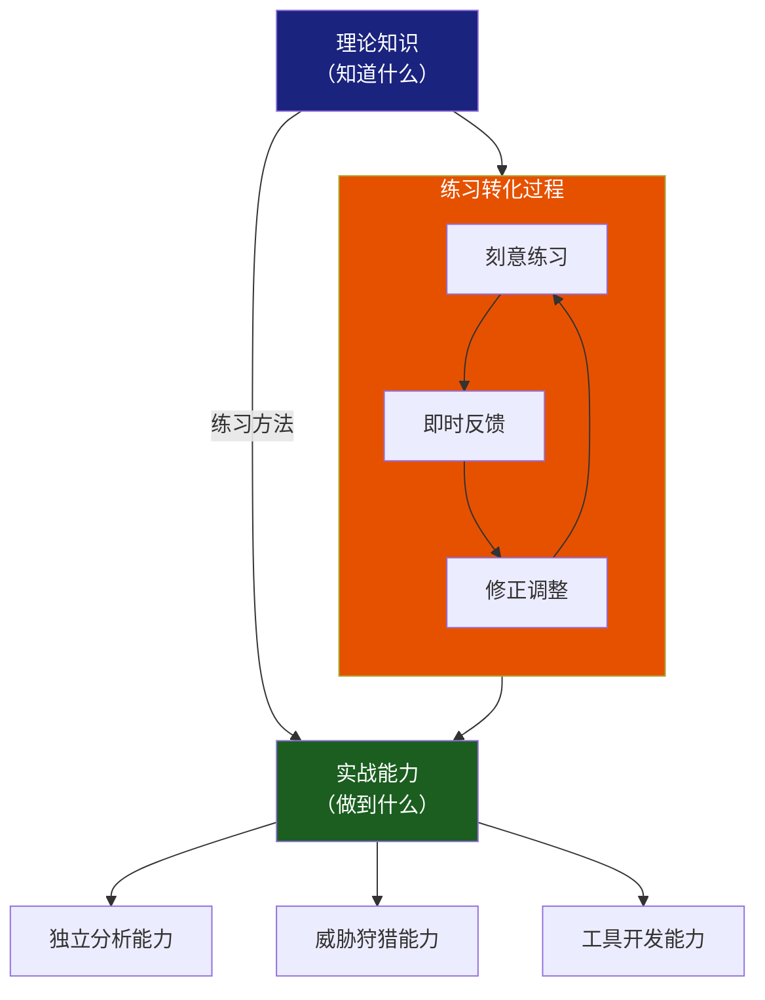
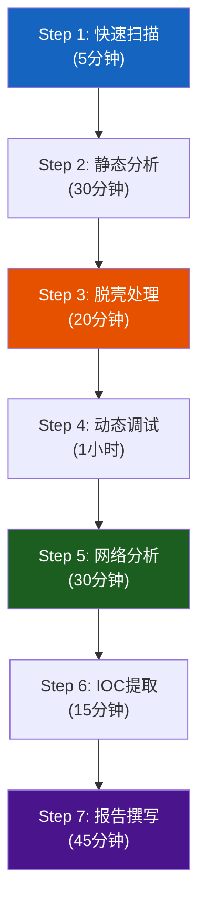
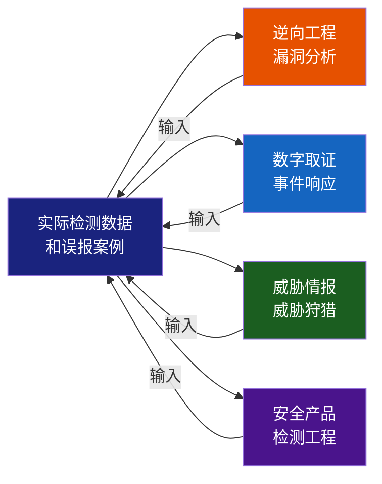
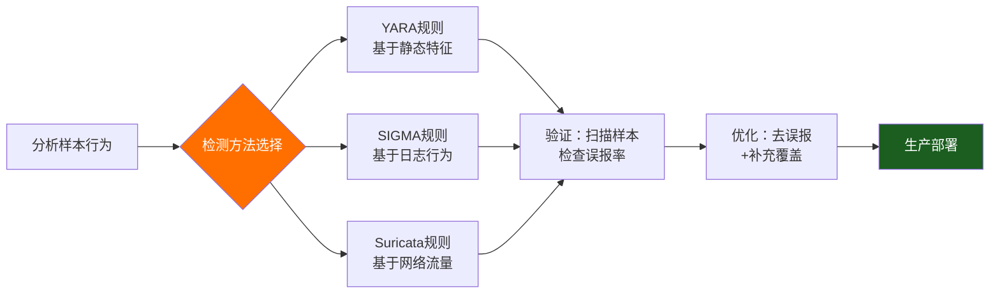
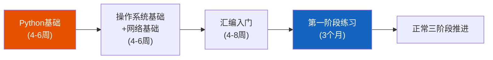
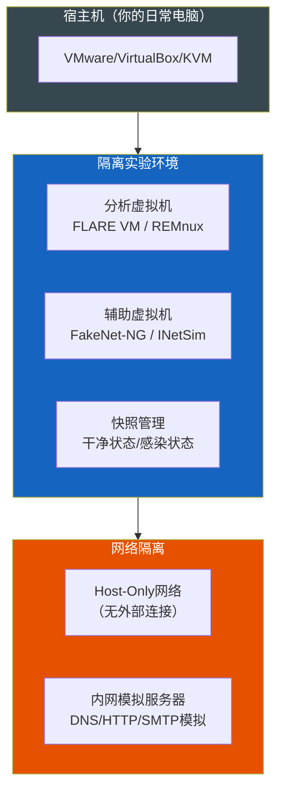

# 第24章 恶意软件分析 - 练习方法

> **本章定位**：练习方法是连接"理论知识"和"实战能力"的桥梁。前几节告诉你恶意软件分析的原理和技术，本节告诉你**如何系统地、高效地、可衡量地练好这些技能**。如果你读完理论知识却不知道从何下手练习，或者练习了很久进步缓慢，这一节就是为你准备的。

恶意软件分析本质上是一门**手艺**——像外科手术、机械维修、乐器演奏一样，理论知识只能让你"知道"，持续的刻意练习才能让你"做到"。美国网络安全培训机构SANS的研究表明，仅靠阅读教材和观看视频，学习者的技能留存率仅为10-20%；而配合动手实践后，留存率可提升至75%以上。更直白地说：**不去动手拆100个样本，你永远算不上恶意软件分析师。**

然而，很多初学者陷入了一个典型的困境：知道要练，但不知道怎么练、练什么、练到哪个程度才算够。本节将为你提供一套**系统化的刻意练习框架**，覆盖从零基础到专业级的完整路径。



> **认知科学的支撑**：上述转化过程并非空谈。根据认知心理学家John Sweller提出的**认知负荷理论（Cognitive Load Theory）**，人的工作记忆容量有限（约7±2个信息块）。阅读理论知识只能让信息进入短期记忆，而通过刻意练习中的**编码-存储-检索**循环，知识才能固化为长期记忆中的**组块（Chunking）**。每当你成功分析一个样本，你就把一组相关的指令、工具操作和模式识别打包成一个组块，工作记忆的负荷就会降低，后续分析的速度和深度就会显著提升。

## 一、练习的根本原则：刻意练习框架

```mermaid
flowchart LR
    subgraph K[知识体系基础]
        A1[操作系统原理]
        A2[汇编语言]
        A3[网络协议]
        A4[编程能力]
    end
    
    subgraph T[工具操作层]
        B1[静态分析工具]
        B2[动态调试器]
        B3[网络分析工具]
        B4[自动化脚本]
    end
    
    subgraph D[深度分析层]
        C1[脱壳技术]
        C2[反调试绕过]
        C3[协议逆向]
        C4[混淆还原]
    end
    
    subgraph I[综合应用层]
        D1[威胁狩猎]
        D2[归因分析]
        D3[工具开发]
        D4[情报输出]
    end
    
    K --> T --> D --> I
```



> **四层能力模型**：恶意软件分析的练习不是平面展开的，而是从底层知识到顶层应用的**金字塔式递进**。每一层都建立在前一层的基础上，缺一层就会导致"空中楼阁"式的能力缺陷。

### 1.1 为什么很多人练习无效？

在开始制定练习计划之前，必须先理解一个核心问题：为什么有些人在恶意软件分析上进步神速，而另一些人练习了很久却原地踏步？答案不在天赋，而在于**练习方式**。

根据Anders Ericsson（《刻意练习》作者）的研究，高效练习需要满足四个条件：

| 条件 | 错误做法 | 正确做法 |
|------|----------|----------|
| **有明确目标** | "我要学会恶意软件分析"（太空泛） | "本周内能独立使用IDA Pro完成一个UPX脱壳样本的静态分析，并输出结构化报告" |
| **超出当前能力** | 一直做自己已经会的分析 | 每次挑战比当前水平难10-20%的样本 |
| **有即时反馈** | 自己闷头分析，无人校验 | 与公开分析报告对比、参加社区评审、使用自动化工具验证 |
| **可重复改进** | 分析完就算了 | 对同一样本做多次分析，每次找出之前遗漏的要点 |

**最常见失败模式**：

- **教程依赖症**：永远跟着教程/视频走，脱了教程就不会，从没独立分析过一个未知样本
- **跳级综合症**：还没学会看PE结构就想去分析VMProtect加壳的样本，受挫后放弃
- **广度优先陷阱**：安装了工具、收集了书单、注册了平台，但每一个都是浅尝辄止
- **反馈盲区**：分析完之后不知道自己分析得对不对、漏了什么

### 1.2 这套练习框架的使用方法

本节将按**三个练习阶段**组织。这三个阶段的划分基于以下认知科学原理：


> 每个阶段持续时间的设定依据是**10,000小时定律的变体**：在刻意练习的条件下，一个中等复杂度的技能领域（如恶意软件分析的基础技能），达到**初学级**约需100小时，**胜任级**约需500小时，**精通级**约需1,000小时。每个阶段的时间线对应着不同的技能掌握深度。

每个阶段都包含：

1. **阶段目标**：可量化的里程碑，你练完后能做什么
2. **核心技能矩阵**：需要掌握的技能及掌握程度
3. **刻意练习协议**：每天/每周的具体练习动作
4. **自测清单**：检验自己是否达到了该阶段要求
5. **常见卡点和解决方案**：该阶段最可能遇到的问题

建议你：**不要一次性读完所有阶段**。先找到自己当前所处阶段，专注于该阶段的练习至少2-4周，达标后再进入下一阶段。每个阶段都需要大量的重复练习——完成3个样本的分析远优于"看过"30个样本的分析过程。

---

## 二、第一阶段：基础构建（0-3个月）

### 2.1 阶段目标

到本阶段结束时，你应该能够：

- ✅ 使用PEStudio/Detect It Easy快速分析一个非加壳的PE文件，提取基本信息（编译时间、导入表、节区特征、资源、可疑字符串）
- ✅ 读懂简单的x86汇编代码（函数入口/出口、条件跳转、循环、函数调用）
- ✅ 使用IDA Free/Ghidra进行基本的反汇编分析，能找到main函数或入口点
- ✅ 使用x64dbg进行单步调试，设置断点，观察寄存器和内存变化
- ✅ 在隔离的VM中安全运行一个样本，并使用ProcMon抓取文件/注册表操作
- ✅ 看懂一个已有的YARA规则并写出自己的第一条规则

### 2.2 核心技能矩阵

| 技能维度 | 具体技能 | 掌握标准 | 验证方法 |
|----------|---------|---------|---------|
| 汇编阅读 | 识别MOV/JMP/CALL/RET/PUSH/POP/CMP/TEST/LEA | 能逐行翻译简单函数的汇编代码 | 在crackmes.one完成10个入门级挑战 |
| PE结构 | 解析DOS头、NT头、节表、导入表、导出表 | 能手动画出PE文件的内存映射图 | 使用CFF Explorer手动查看5个PE文件 |
| 静态分析 | 使用PEStudio/Detect It Easy/DIE扫描样本 | 能在5分钟内判断样本是否加壳、编译语言、可疑导入函数 | 分析10个公开样本并对比VirusTotal |
| 动态分析 | 用x64dbg调试、用ProcMon记录行为 | 能用条件断点定位特定函数调用 | 跟踪一个程序的CreateFile调用链 |
| 工具操作 | IDA/Ghidra/x64dbg基本操作 | 熟悉界面布局和常用快捷键 | 录制一个5分钟的完整分析操作录屏 |
| 分析报告 | 填写标准分析报告模板 | 报告结构完整、IOC列表清晰 | 让同行评审或对照公开报告评分 |

### 2.3 刻意练习协议

#### 每日必修（第1-30天）：30分钟

```python
# 每日练习模板 —— 拆解一个已知功能的小程序
# 目标：不是分析恶意软件，而是熟悉工具和汇编

# 练习流程：
# 1. 用C语言写一个简单功能程序（如读取文件、创建注册表键、发送HTTP请求）
# 2. 编译为Release x86版本
# 3. 用PEStudio分析，记录可疑导入函数
# 4. 用IDA/Ghidra反汇编，找到main函数，对照C源代码理解汇编
# 5. 用x64dbg调试，设置断点在CreateFile/RegCreateKey等API上
# 6. 观察程序执行时寄存器和栈的变化

# 每日产出：一份简短的练习日志，
# 记录你发现的3个新知识点和1个仍然疑惑的问题
```

**具体操作步骤**：

**第1步：写一个C程序（5分钟）**
```c
// 示例程序：练习文件操作的分析
#include <windows.h>
#include <stdio.h>

int main() {
    HANDLE hFile = CreateFile(
        "C:\\test.txt", GENERIC_WRITE, 0, NULL,
        CREATE_ALWAYS, FILE_ATTRIBUTE_NORMAL, NULL
    );
    if (hFile != INVALID_HANDLE_VALUE) {
        const char *msg = "Hello Malware Analysis!";
        DWORD written;
        WriteFile(hFile, msg, strlen(msg), &written, NULL);
        CloseHandle(hFile);
    }
    return 0;
}
```

**第2步：使用MinGW或MSVC编译为32位EXE（2分钟）**
```bash
# 使用MinGW的交叉编译器
x86_64-w64-mingw32-gcc -m32 -o test_file.exe test_file.c -O0
```

**第3步：PE结构分析（5分钟）**
- 使用Detect It Easy打开test_file.exe，查看节区（.text/.data/.rdata/.idata）
- 使用PEStudio查看导入表：识别KERNEL32.DLL中的CreateFile、WriteFile、CloseHandle
- 注意编译时间戳、子系统和节区特征

**第4步：反汇编对照分析（10分钟）**
- 在IDA Free中打开，定位到main函数（快捷键G，输入main）
- 识别函数序言：`push ebp; mov ebp, esp; sub esp, XX`
- 找到CreateFile的调用参数传递方式（stdcall约定：参数从右向左压栈）
- 对比源码和汇编码，理解每个C语句对应的汇编指令序列

**第5步：动态调试（8分钟）**
- 用x64dbg打开test_file.exe
- 在CreateFileW/CreateFileA上设置断点（地址断点或符号断点）
- F9运行直到断点触发，观察栈上的参数值
- 单步跟踪WriteFile和CloseHandle

#### 每周必做（第1-12周）：2-3小时

**周任务A：crackmes.one逆向挑战**
- 每周完成1-2个crackmes.one上的入门级挑战
- 要求：不依赖教程，完全独立完成
- 产出：一份简短的逆向分析说明（破解方法+关键汇编代码片段）

**周任务B：公开样本分析对比**
- 从MalwareBazaar下载1个已知恶意软件样本（选择VirusTotal检测率>30/65的知名样本）
- 独立完成基础分析（PE信息、字符串、导入表、初步行为分析）
- 完成后，搜索该样本的公开分析报告进行对比
- **关键练习**：逐条对照自己漏掉了哪些分析点，记录到练习日志中

**周任务C：YARA规则练习**
- 分析完一个样本后，尝试编写检测该样本的YARA规则
- 在本地测试：确保规则匹配当前样本，且不误报已知的正常文件
- 练习难度递进：
  - 第1周：基于字符串（匹配唯一URL/IP/文件名）
  - 第3周：基于导入表（匹配导入函数组合）
  - 第6周：基于PE特征（匹配节区名、编译工具特征）

### 2.4 自测清单

| 序号 | 自测项 | 通过标准 |
|------|--------|---------|
| 1 | 汇编测试 | 随机给出一段10-15行的x86汇编，能在5分钟内逐行翻译为C伪代码 |
| 2 | PE解析 | 给一个未加壳PE文件，能在10分钟内说出其编译器、导入函数、节区特征 |
| 3 | 调试操作 | 能设置条件断点（如"当EAX==0x12345678时断下"） |
| 4 | 样本分析 | 独立分析一个未加壳样本，产出包含IOC的分析报告 |
| 5 | YARA编写 | 能写出正确匹配样本字符串、无语法错误的YARA规则 |

### 2.5 常见卡点与解决方案

| 卡点 | 表现 | 原因 | 解决方案 |
|------|------|------|---------|
| 汇编看不懂 | 每行都要查指令手册 | 指令还没形成肌肉记忆 | 把20个最常用指令做成卡片，每天10分钟速记；用Compiler Explorer每天看5个不同C代码的汇编输出 |
| PE结构记不住 | 看完就忘，不知道各个字段的实际意义 | 缺乏实操，纯记忆 | 不要背结构体，打开CFF Explorer边看边练；写一个Python脚本解析PE头字段，写一遍就记住了 |
| 调试器不知道设什么断点 | 打开x64dbg后不知道该看哪里 | 缺乏程序执行流程的理解 | 先在自己写的程序上练习，先知道程序会走哪条路径，再思考在哪打断点 |
| ProcMon日志太多 | 打开ProcMon后被几千条事件淹没 | 没设置过滤器 | 学会三种过滤器：进程名过滤（仅监控目标进程）、操作类型过滤（只看RegCreateKey/FileCreate）、路径过滤 |
| 分析完不知道对不对 | 害怕漏掉信息 | 没有反馈机制 | 坚持"对比分析"法：每一份分析报告找一份社区已有的分析报告强制对比，找出差异点 |

---

## 三、第二阶段：技能提升（3-12个月）

### 3.1 阶段目标

到本阶段结束时，你应该能够：

- ✅ 独立处理加壳样本（UPX/ASPack/MPress/简单的VMProtect）
- ✅ 在动态调试中绕过常见的反调试技术（IsDebuggerPresent/NtGlobalFlag/RDTSC）
- ✅ 使用Wireshark抓取和分析恶意软件的C2通信流量
- ✅ 使用FakeNet-NG/INetSim搭建模拟网络环境诱捕恶意软件
- ✅ 编写自动化分析脚本（Python + pefile/capa/yara-python）
- ✅ 能分析一个未知的恶意软件样本并撰写结构化的威胁情报报告
- ✅ 编写自己的YARA规则集，至少包含10条自定义规则

### 3.2 核心技能矩阵

| 技能维度 | 具体技能 | 掌握标准 | 验证方法 |
|----------|---------|---------|---------|
| 脱壳技术 | 手动脱UPX/ASPack，自动/内存转储脱常见壳 | 能还原被UPX压缩的原始入口点（OEP）并dump出脱壳后的完整PE | 完成20个不同加壳样本的脱壳练习 |
| 反调试绕过 | 识别并绕过5种以上反调试技术 | 能用ScyllaHide/x64dbg插件自动绕过常见反调试 | 在已知含反调试的crackme上成功跟踪至OEP |
| 网络分析 | Wireshark过滤+Follow TCP Stream | 能从PCAP中提取C2服务器地址和解码通信内容 | 分析3个恶意软件的样本网络流量 |
| 自动化脚本 | Python + pefile + yara-python | 能用脚本批量提取IOC | 编写一个脚本处理100个样本并输出CSV报告 |
| 沙箱搭建 | 搭建并配置Cuckoo Sandbox/CAPE | 能部署、配置、调试沙箱环境 | 成功运行一个样本并获取完整沙箱报告 |
| 协议分析 | 逆向简单的C2通信协议 | 能通过流量分析+静态逆向还原通信协议结构 | 逆向一个已知RAT的C2通信协议 |

### 3.3 刻意练习协议

#### 每日必修（第90-360天）：45-60分钟

**A. 反汇编阅读强化（15分钟）**

每天随机选择一个Windows API的C调用，用Compiler Explorer查看其汇编实现，然后尝试在不看源C的情况下还原其逻辑。

建议练习序列（按难度递增）：

1. **第1-4周**：简单读写操作——CreateFile、ReadFile、WriteFile、RegOpenKeyEx、RegSetValueEx、CreateProcess
2. **第5-8周**：网络和加密操作——socket、connect、send/recv、WSAStartup、CryptAcquireContext、CryptEncrypt
3. **第9-12周**：进程和线程操作——VirtualAlloc、CreateRemoteThread、WriteProcessMemory、SetWindowsHookEx、NtQueueApcThread
4. **第13周+**：Rootkit相关——NtCreateFile、NtOpenProcess、DeviceIoControl、ZwSystemDebugControl

**B. 工具盲操训练（15分钟）**

每天选择一个工具（IDA、x64dbg、Wireshark），做一次"盲操作"训练：关闭所有窗口，凭记忆执行一个完整操作流程，如：

- **IDA盲操**：打开文件 → 找到入口点 → 切换到图形视图 → 插入注释 → 重命名函数 → 交叉引用追踪 → 导出IDB文件
- **x64dbg盲操**：打开程序 → 设置断点在CreateFileW → 运行 → 查看栈 → 修改寄存器值 → 跳过判断 → dump内存到文件
- **Wireshark盲操**：选择网卡开始捕获 → 设置过滤条件 `tcp.port==443 && ip.addr==X.X.X.X` → Follow TCP/UDP Stream → 导出特定包

**核心目的**：让工具操作变成肌肉记忆，分析时不需要分心去想"这个按钮在哪"。

**C. 单样本深度分析（剩余时间）**

每周只选一个样本，但要做**深度分析**（不是浅层扫描）：

```python
# 深度分析协议 —— 一个样本要分析到什么程度？

# 分析深度层级：
# Level 1 (5分钟): VirusTotal查询 + PEStudio扫描 — 判断有无分析价值
# Level 2 (30分钟): Level 1 + 沙箱运行 + 获取行为概览
# Level 3 (2小时): Level 2 + 静态分析关键函数 + 提取IOC + YARA规则
# Level 4 (4-8小时): Level 3 + 手动脱壳 + 反汇编核心功能 + 逆向C2协议
# Level 5 (数天): Level 4 + 完整功能还原 + 多样本家族分析 + 深度威胁情报报告

# 本阶段要求：每周至少完成2个Level 3分析和1个Level 4分析
```

#### 每周训练计划模板

| 星期 | 练习内容 | 时长 | 产出物 |
|------|---------|------|--------|
| 周一 | 汇编阅读强化（加密API专题）+ crackme挑战 | 60min | 汇编笔记+破解步骤 |
| 周二 | 脱壳练习（商业壳识别+手动脱壳） | 60min | 脱壳成功/失败记录 |
| 周三 | 样本深度分析（静态为主） | 90min | 分析进展+待验证假设 |
| 周四 | 样本深度分析（动态验证+网络分析） | 90min | IOC列表+行为描述 |
| 周五 | 自动化脚本编写（YARA规则/pefile处理/批量分析） | 60min | 可执行的脚本+测试结果 |
| 周六 | 社区参与（Reddit/Malware Analysis Discord/博客评论） | 60min | 1篇分析文章或社区提问 |
| 周日 | 复盘+制定下周计划 | 30min | 学习日志+下周样本清单 |

### 3.4 自动化脚本实战模板

这个阶段的关键技能之一是编写自动化分析脚本。以下是一个实战参考：

```python
#!/usr/bin/env python3
"""
批量PE分析脚本 —— 自动化提取IOC并生成CSV报告
练习目标：熟练掌握pefile库和YARA规则引擎
"""

import pefile
import yara
import hashlib
import os
import json
import csv
from pathlib import Path

def calculate_hashes(filepath):
    """计算文件的MD5、SHA1、SHA256哈希"""
    with open(filepath, 'rb') as f:
        data = f.read()
    return {
        'md5': hashlib.md5(data).hexdigest(),
        'sha1': hashlib.sha1(data).hexdigest(),
        'sha256': hashlib.sha256(data).hexdigest(),
    }

def analyze_pe(filepath):
    """解析PE文件并提取关键特征"""
    pe = pefile.PE(filepath)
    
    results = {}
    
    # 基本信息
    results['image_base'] = hex(pe.OPTIONAL_HEADER.ImageBase)
    results['entry_point'] = hex(pe.OPTIONAL_HEADER.AddressOfEntryPoint)
    results['compile_time'] = str(pe.FILE_HEADER.TimeDateStamp)
    results['subsystem'] = pe.OPTIONAL_HEADER.Subsystem
    results['sections'] = len(pe.sections)
    
    # 节区特征（识别加壳迹象）
    suspicious_sections = []
    high_entropy_sections = []
    for section in pe.sections:
        name = section.Name.decode('utf-8', errors='ignore').strip('\x00')
        entropy = section.get_entropy()
        if entropy > 6.5:
            high_entropy_sections.append(f"{name}({entropy:.2f})")
        if name in ['.UPX0', '.UPX1', '.packed', '.MPRESS1', '.MPRESS2', 
                    'PEC2TO', '.vmp0', '.vmp1', '.90', '.aspack']:
            suspicious_sections.append(name)
    
    results['suspicious_sections'] = suspicious_sections
    results['high_entropy_sections'] = high_entropy_sections
    
    # 导入表分析（提取可疑API）
    suspicious_apis = []
    if hasattr(pe, 'DIRECTORY_ENTRY_IMPORT'):
        for entry in pe.DIRECTORY_ENTRY_IMPORT:
            for imp in entry.imports:
                func_name = imp.name.decode('utf-8', errors='ignore') if imp.name else f"ord({hex(imp.ordinal)})"
                # 标记可疑API
                suspicious_keywords = [
                    'CreateRemoteThread', 'WriteProcessMemory', 'VirtualAllocEx',
                    'OpenProcess', 'ShellExecute', 'WinExec', 'CreateProcess',
                    'RegSetValue', 'RegCreateKey', 'InternetOpen', 'URLDownloadToFile',
                    'socket', 'connect', 'send', 'recv', 'CryptEncrypt', 'CryptDecrypt',
                    'IsDebuggerPresent', 'OutputDebugString', 'NtQueryInformationProcess'
                ]
                for kw in suspicious_keywords:
                    if kw.lower() in func_name.lower():
                        suspicious_apis.append(func_name)
                        break
    
    results['suspicious_apis'] = list(set(suspicious_apis))
    results['api_count'] = len(suspicious_apis)
    
    # 资源分析
    resources = []
    if hasattr(pe, 'DIRECTORY_ENTRY_RESOURCE'):
        for resource_type in pe.DIRECTORY_ENTRY_RESOURCE.entries:
            if resource_type.name is not None:
                resources.append(str(resource_type.name))
            else:
                resources.append(f"RT_{resource_type.struct.Id}")
    
    results['resources'] = resources
    results['is_packed'] = len(suspicious_sections) > 0 or len(high_entropy_sections) > 0
    
    pe.close()
    return results

def main():
    """批量分析指定目录下的所有PE文件"""
    sample_dir = input("输入样本目录路径: ")
    output_csv = input("输出CSV文件路径: ")
    
    samples = []
    for filepath in Path(sample_dir).glob("*.exe"):
        print(f"分析: {filepath.name}")
        
        # 计算哈希
        hashes = calculate_hashes(str(filepath))
        
        # 检查VirusTotal（如果有API Key）
        # 这里先做离线分析
        pe_info = analyze_pe(str(filepath))
        
        sample_entry = {
            'filename': filepath.name,
            'full_path': str(filepath),
            **hashes,
            'entry_point': pe_info['entry_point'],
            'compile_time': pe_info['compile_time'],
            'sections_count': pe_info['sections'],
            'is_packed': pe_info['is_packed'],
            'suspicious_sections': ';'.join(pe_info['suspicious_sections']),
            'suspicious_apis': ';'.join(pe_info['suspicious_apis'][:20]),
            'api_count': pe_info['api_count'],
            'high_entropy_sections': ';'.join(pe_info['high_entropy_sections']),
        }
        samples.append(sample_entry)
    
    # 输出CSV
    if samples:
        with open(output_csv, 'w', newline='', encoding='utf-8') as f:
            writer = csv.DictWriter(f, fieldnames=samples[0].keys())
            writer.writeheader()
            writer.writerows(samples)
        print(f"已输出 {len(samples)} 个样本的分析结果到 {output_csv}")
    else:
        print("未找到PE文件")

if __name__ == '__main__':
    main()
```

**练习建议**：不要直接复制运行上面的脚本。手动逐行输入它，每写一个函数都停下来思考它做了什么。然后尝试以下修改：

1. 添加YARA规则扫描功能（使用yara-python库）
2. 添加加壳检测的更多启发式规则（如导入表条目数异常少）
3. 添加资源节区中的嵌入式PE检测
4. 添加VirusTotal API查询（如果有API Key）
5. 添加报告模板生成（自动输出Markdown分析报告）

### 3.5 网络分析与C2通信识别协议

**练习协议逆向的步骤序列**：

**第一步：准备已知恶意软件流量**
- 从Malware Traffic Analysis（malware-traffic-analysis.net）下载PCAP文件
- 这些流量来自真实恶意软件感染过程，包含完整的C2通信

**第二步：使用Wireshark分析**
```bash
# 基本过滤命令
# 查找HTTP GET请求
http.request

# 查找特定IP的通信
ip.addr == 192.168.1.100

# 查找DNS查询
dns.qry.name contains "malware"

# 查找POST请求（通常用于外泄数据）
http.request.method == POST

# 查找特定端口的TCP流
tcp.port == 8080

# 导出HTTP对象（文件/图片/可执行文件）
# 文件 → 导出对象 → HTTP
```

**第三步：识别C2通信模式**

| 通信特征 | 可疑程度 | 说明 |
|----------|---------|------|
| 定期间隔的HTTP请求（如每60秒一次） | 🟠 中 | Beacon心跳，C2的典型特征 |
| POST请求体为Base64编码或加密内容 | 🔴 高 | 数据外泄或命令请求 |
| User-Agent异常（如Mozilla/4.0过时版本） | 🟡 低 | 恶意软件常使用固定/过时的User-Agent |
| 请求的URL路径包含随机字符 | 🟠 中 | DGA域名或路径混淆 |
| 响应内容包含加密/压缩数据 | 🔴 高 | 接收到加密指令 |
| DNS查询异常频繁且回复为NXDOMAIN | 🟠 中 | DGA域名探测 |
| 请求中包含系统信息（如计算机名、用户名） | 🔴 高 | Beacon标识/注册信息 |

**第四步：逆向通信协议（以Gh0st RAT为例）**

Gh0st RAT是一个经典的远控木马，其通信协议具有清晰的标志性结构。在PCAP中找到Gh0st RAT通信后：

1. **识别协议特征**：前4字节为固定的协议标识（如`0x00000001`）
2. **提取命令头**：第5-8字节为命令类型编号
3. **还原数据包结构**：
```text
   [4字节: 协议版本号] + [4字节: 命令ID] + [4字节: 数据长度] + [N字节: 数据内容]
   ```
4. **映射命令ID到功能**：

   | 命令ID | 功能 | 数据内容 |
   |--------|------|---------|
   | 0x0001 | 心跳/存活检测 | 空或时间戳 |
   | 0x0101 | 文件列表 | 目录路径字符串 |
   | 0x0102 | 下载文件 | 文件名+偏移+大小 |
   | 0x0201 | 远程Shell | cmd命令字符串 |
   | 0x0301 | 屏幕截图 | 截图质量参数 |
   | 0x0401 | 键盘记录 | 启动/停止标志 |

### 3.6 实战案例：Lokibot样本从零到报告的完整分析

为了帮助你建立完整的分析直觉，以下展示一个从收到未知样本到输出报告的**完整分析过程**（以Lokibot为例）。



**Step 1：快速扫描（5分钟）**

拿到样本后的第一反应不是打开IDA，而是做快速判断：
```bash
# 使用file命令确认文件类型
file unknown_sample.exe
# 输出：PE32 executable (GUI) Intel 80386, for MS Windows

# 计算哈希
sha256sum unknown_sample.exe
# 输出：abc123def456...

# 查询VirusTotal（如果是离线环境，先做本地分析）
# vt -k <API_KEY> search file:abc123def456...
```

此时你已经知道：这是个32位Windows GUI程序，VirusTotal检测率56/70，标签包含"lokibot"。

**Step 2：静态扫描（30分钟）**

用Detect It Easy（DIE）打开：

- **加壳检测**：显示"Microsoft Visual C++ 6.0"，但导入表只有3个DLL（KERNEL32/USER32/MSVBVM60）且节区名异常（.vmp0）——这是VB6+UPX的典型特征
- **字符串提取**：用FLOSS工具提取混淆字符串：
```bash
floss unknown_sample.exe > strings_output.txt
# 发现：POST /gate.php HTTP/1.1、C:\Users\Public\Documents\...、pstorec.dll
```

- **导入表分析**：关键API发现：
  - `GetAsyncKeyState`（键盘记录）
  - `InternetOpenUrl`/`HttpSendRequest`（网络通信）
  - `RegSetValueEx`（注册表持久化）

**Step 3：脱壳（20分钟）**

检测到UPX壳后：
```bash
# 尝试自动脱壳
upx -d unknown_sample.exe -o unpacked.exe

# 如果自动脱壳失败（壳被修改），使用x64dbg手动脱壳：
# 1. 在x64dbg中打开，跳到入口点
# 2. 单步跟踪直到OEP（标志：PUSH EBP; MOV EBP, ESP）
# 3. 使用Scylla插件dump进程内存
# 4. 使用ImportREC修复导入表
```

**Step 4：动态调试（1小时）**

在FLARE VM中运行脱壳后的样本：
```bash
# 使用x64dbg附加进程，在关键API设断点
# 创建网络抓包
start wireshark -i "Ethernet" -k -w capture.pcap

# 创建procmon过滤器（Process Name is sample.exe）
# 观察行为：
# - 创建文件：C:\Users\Public\Documents\MSDCSC\msdcsc.exe
# - 写注册表：HKCU\Software\Microsoft\Windows\CurrentVersion\Run\MSDCSC
# - DNS查询：evil-c2.example.com
# - HTTPS连接：evil-c2.example.com:443
```

**Step 5：网络分析（30分钟）**

在Wireshark中：
```bash
# 过滤HTTP/HTTPS流量
http.request.method == "POST" && ip.dst == 185.215.113.XX

# 发现beacon模式：
# - 每120秒发送POST请求到 /gate.php
# - 请求体：Base64编码，解码后包含：computername=username&os=Windows10
# - 响应体：加密的命令（疑似RC4，密钥在配置文件中）
```

**Step 6：IOC提取（15分钟）**
```yaml
# IOC列表
File_Hash:
  - SHA256: abc123def456...
Network:
  - 185.215.113.XX:443 (HTTPS C2)
  - evil-c2.example.com (DGA备用)
Registry:
  - HKCU\Software\Microsoft\Windows\CurrentVersion\Run\MSDCSC
Persistence:
  - 文件复制到 C:\Users\Public\Documents\MSDCSC\
  - 添加开机自启动注册表
```

**Step 7：YARA规则编写**

```yara
rule Lokibot_Generic {
    meta:
        description = "Detects Lokibot based on C2 pattern"
        author = "YourName"
        date = "2026-06"
    strings:
        $gate = "/gate.php" ascii
        $post = "POST" ascii
        $ua = "Mozilla/4.0" ascii
        $c2_pattern = {68 74 74 70 3A 2F 2F} // http://
    condition:
        uint16(0) == 0x5A4D and ($gate or ($post and $ua and $c2_pattern))
}
```

> **练习重点**：完成上述分析后，做两件事：(1) 搜索公开的Lokibot分析报告对比；(2) 记录你分析中**耗时最长的步骤**和**犯错最多的地方**，下个样本重点练习这些环节。

### 3.7 自测清单

| 序号 | 自测项 | 通过标准 |
|------|--------|---------|
| 1 | 脱壳能力 | 给定一个UPX加壳的未知样本，能在10分钟内完成脱壳并找到OEP |
| 2 | 反调试绕过 | 给定一个含IsDebuggerPresent、NtGlobalFlag检查的crackme，能成功调试到关键代码段 |
| 3 | C2分析 | 从PCAP中提取出C2服务器IP、通信端口、通信频率和加密通信的握手过程 |
| 4 | 自动分析 | Python脚本能在5分钟内处理50个样本并输出分析报告 |
| 5 | 独立分析 | 对一个未知加壳样本完成Level 4分析（脱壳+反汇编核心功能+提取IOC+编写YARA规则） |
| 6 | 报告质量 | 分析报告被社区成员评为"至少达到中等专业水平" |

### 3.8 常见卡点与解决方案

| 卡点 | 表现 | 原因 | 解决方案 |
|------|------|------|---------|
| 脱壳后IAT损坏 | 用ImportREC重建IAT后程序无法运行 | 对IAT结构理解不足 | 深入学习IAT重建原理，使用Scylla代替ImportREC；练习在不同OEP处dump的差异 |
| 反调试绕过失败 | 恶意软件在调试器中直接退出 | 遗漏了某种反调试检测 | 使用ScyllaHide的配置脚本；用r2或x64dbg的trace功能记录执行的系统调用序列 |
| 网络分析无从下手 | 不知道样本在做什么网络请求 | 缺少可控的网络环境 | 搭建FakeNet-NG并配置响应规则；用wireshark抓包后先用`http`/`dns`/`tls.handshake`类型过滤 |
| 分析脚本bug多 | 脚本处理畸形PE时崩溃 | 缺乏异常处理意识 | 使用try/except包裹pefile加载；用样本库中的异常文件（0字节、畸形头、截断文件）测试脚本鲁棒性 |
| 首次独立分析困惑 | 面对一个未知样本不知道从哪开始 | 缺乏系统化的分析流程 | 严格执行标准分析流程：快速扫描 → 静态分析 → 动态分析 → 网络分析 → 深度逆向 → 综合报告 |

---

## 四、第三阶段：专业深化（12个月以上）

### 4.1 阶段目标

到本阶段结束时，你应该能够：

- ✅ 分析复杂混淆的样本（OLLVM控制流平坦化、不透明谓词）
- ✅ 逆向分析内核级恶意软件（Rootkit、Bootkit）
- ✅ 对APT级别的恶意软件做归因分析（识别TTP、关联已知组织）
- ✅ 开发自定义分析工具和调试器插件
- ✅ 撰写可以作为威胁情报IOC/TAXII标准输入的分析报告
- ✅ 能够进行大规模样本狩猎和家族分类

### 4.2 核心技能矩阵

| 技能维度 | 具体技能 | 掌握标准 | 验证方法 |
|----------|---------|---------|---------|
| 深度逆向 | 还原控制流平坦化、去除虚假控制流 | 能还原OLLVM混淆后的函数控制流图 | 完成Flare-On历年高难度挑战 |
| 内核分析 | Windbg内核调试、驱动逆向 | 能分析Rootkit的SSDT Hook和DKOM技术 | 分析并编写绕过公开Rootkit的检测脚本 |
| 内存取证 | Volatility深度分析 | 能从内存转储中提取恶意进程、注入的DLL、网络连接 | 分析3个Volatility Challenge场景 |
| 威胁情报 | MITRE ATT&CK映射 | 能将分析结果映射到ATT&CK的Tactic/Technique级别 | 为同一个样本产出APT归因和TTP分析 |
| 工具开发 | IDA/Ghidra/x64dbg插件开发 | 能编写自定义分析脚本和工具 | 发布一个可供社区使用的分析工具/插件 |
| 容器/跨平台分析 | Linux/容器/云环境恶意软件 | 能分析Linux ELF恶意软件和容器逃逸 | 分析5个Linux恶意软件样本 |

### 4.3 高级练习项目

以下项目按难度递增排列，每个项目需要2-8周时间：

#### 项目一：DGA域名预测器（2周）

**目标**：逆向一个使用DGA（域名生成算法）的恶意软件，实现域名预测。

**步骤**：

1. 选择一个已知DGA的恶意软件家族（如Conficker、Locky、Ranbyus、Kraken）
2. 逆向其域名生成算法——找到种子生成逻辑、日期依赖、字符集
3. 用Python复现该算法
4. 验证：以过去某天的日期为种子，算法生成的域名与公开的DGA域名列表是否一致
5. 扩展：编写一个脚本，每天运行并输出未来30天可能注册的域名

**示例**（以Conficker.D的DGA为例）：
```python
import datetime

def conficker_dga(date, seed=0xAA55):
    """模拟Conficker.D的域名生成算法（简化版）"""
    domains = []
    tlds = ['.com', '.net', '.org', '.biz', '.info', '.cn', '.cc', '.ws']
    
    # 基于日期生成种子
    year = date.year
    month = date.month
    day = date.day
    
    # 简化算法：每天生成250个域名
    for i in range(250):
        seed = (seed * 0x10C41 + 0x0AB71) & 0xFFFFFFFF
        domain_len = (seed % 12) + 8  # 8-19字符
        domain = ""
        s = seed
        for j in range(domain_len):
            s = (s * 0x10C41 + 0x0AB71) & 0xFFFFFFFF
            domain += chr(ord('a') + (s % 26))
        tld_idx = s % len(tlds)
        domains.append(domain + tlds[tld_idx])
    
    return domains

# 验证：对比已知的Conficker DGA域名列表
today = datetime.date(2026, 6, 1)
predicted = conficker_dga(today)
print(f"预测 {today} 的域名，前10个:")
for d in predicted[:10]:
    print(f"  {d}")
```

#### 项目二：自定义Rootkit扫描器（4周）

**目标**：编写一个Windows内核级恶意软件检测工具。

**能力要求**：
- 理解SSDT（System Service Descriptor Table）原理
- 理解Inline Hook检测方法
- 理解DKOM（Direct Kernel Object Manipulation）检测

**核心检测功能**：

1. **SSDT Hook扫描**：读取内核的SSDT表，对比原始ntoskrnl.exe中的系统服务地址，标记所有被修改过的入口
2. **Inline Hook检测**：扫描关键函数（NtCreateProcess、NtOpenProcess等）的前5字节，检查是否包含JMP/CALL到非模块地址
3. **隐藏进程检测**：使用EPROCESS链表的备用方法（如遍历句柄表、扫描调度器队列）发现的隐藏进程
4. **驱动签名检查**：枚举已加载的内核驱动，检查其数字签名状态和文件的完整性

#### 项目三：多架构恶意软件分析框架（8周）

**目标**：构建一个支持PE/ELF/Mach-O的恶意软件分析框架，支持批量处理和报告生成。

**模块设计**：
```text
malware_analyzer/
├── core/
│   ├── loader.py          # 文件加载器，自动识别文件类型
│   ├── hasher.py          # 哈希计算
│   ├── strings.py         # 字符串提取（含FLOSS集成）
│   └── entropy.py         # 熵值计算（加壳检测）
├── parsers/
│   ├── pe_parser.py       # PE文件解析
│   ├── elf_parser.py      # ELF文件解析（Linux/Android）
│   └── macho_parser.py    # Mach-O文件解析（macOS/iOS）
├── analyzers/
│   ├── static.py          # 静态分析器
│   ├── dynamic.py         # 动态分析包装器（调用沙箱API）
│   ├── network.py         # 网络行为分析（PCAP解析）
│   └── yara_engine.py     # YARA规则引擎
├── reporters/
│   ├── report_md.py       # Markdown报告生成
│   ├── report_json.py     # JSON格式输出（对接威胁情报平台）
│   └── report_stix.py     # STIX格式输出
└── plugins/
    ├── unpacker/          # 脱壳插件模块
    └── threat_intel/      # 威胁情报关联模块
```

### 4.4 自测清单

| 序号 | 自测项 | 通过标准 |
|------|--------|---------|
| 1 | OLLVM混淆 | 能将一个OLLVM控制流平坦化后的函数还原为原始控制流图 |
| 2 | 内核分析 | 能通过Windbg分析Rootkit的SSDT Hook并编写检测脚本 |
| 3 | 内存取证 | 给定一个内存转储，能找到隐藏进程和rootkit并排除误报 |
| 4 | APT归因 | 给定一个APT样本，能关联到已知组织并列出至少5个TTP映射点 |
| 5 | 工具开发 | 发布了至少一个被社区使用的分析工具/Ghidra脚本/IDA插件 |
| 6 | 报告质量 | 分析报告被安全厂商或威胁情报平台引用 |

---

## 五、横纵扩展：恶意软件分析与其他安全领域

恶意软件分析不是孤立的技能。与其他安全领域的知识交叉可以显著提升你的分析能力和职业视野。以下梳理了四个最相关的交叉领域。



### 5.1 逆向工程与漏洞分析

**交叉价值**：逆向工程是恶意软件分析的基础，反过来，恶意软件分析经验也能帮你理解漏洞利用代码的执行路径。

**练习建议**：

- **漏洞分析方向**：分析0-day/1-day漏洞利用样本，理解漏洞触发条件和利用链
- **shellcode分析**：练习从内存中转储shellcode并分析其功能
- **exploit-kit分析**：分析漏洞利用工具包（如RIG、Sundown）的混淆和重定向逻辑

**推荐练习路径**：

1. 从分析Metasploit生成的简单payload开始（理解shellcode结构）
2. 过渡到真实世界的漏洞利用样本（如CVE-2021-40444的MSOffice远程执行）
3. 最后分析exploit-kit来理解漏洞利用链的分发机制

### 5.2 数字取证与事件响应（DFIR）

**交叉价值**：恶意软件分析给出"样本做了什么"的答案，DFIR给出"整个攻击事件的全貌"。两者的结合能让你的分析报告更有商业价值。

**核心连接点**：

| DFIR知识 | 对恶意软件分析的帮助 | 练习方式 |
|----------|---------------------|---------|
| 磁盘取证 | 理解恶意软件的安装痕迹、临时文件存放策略 | 在FTK Imager中分析感染系统的磁盘镜像 |
| 内存取证（Volatility） | 发现隐藏进程、rootkit、被注入的DLL | 使用Volatility分析恶意软件感染后的内存转储 |
| 日志分析（Windows Event Log） | 重建攻击时间线 | 分析被感染系统的安全日志EVTX文件 |
| 时间线分析（Plaso/Super Timeline） | 确定攻击入口点和横向移动 | 从感染系统创建超级时间线 |

**推荐的DFIR样本**：在感染了Emotet或Cobalt Strike的完整系统镜像上练习，这些样本包含了从初始入口到横向移动的完整感染链。

### 5.3 威胁情报与威胁狩猎

**交叉价值**：恶意软件分析的深度决定了威胁情报的质量。能找出IOC只是第一步，能识别TTP和归因ATT&CK映射才是分析师的真正价值所在。

**核心技能对偶**：

| 威胁情报技能 | 源自恶意软件分析的能力 |
|-------------|---------------------|
| IOC提取 | 静态/动态分析中识别IP、域名、文件路径、注册表项 |
| TTP识别 | 逆向分析中理解样本的行为模式和技术手法 |
| 归因分析 | 分析代码风格、编译工具链、字符串语言等元数据 |
| 基础设施追踪 | 逆向中发现的Whois/Pastebin/RDNS信息关联 |

**练习建议**：

1. 分析一个样本后，将发现映射到MITRE ATT&CK矩阵
2. 编写STIX格式的情报输出
3. 在OpenCTI/MISP平台中创建威胁报告
4. 尝试将多个样本关联到同一攻击组织的活动

### 5.4 安全产品与检测工程

**交叉价值**：理解EDR/AV的检测逻辑能帮你写出更好的YARA/SIGMA规则，也能让你在避免检测方面有更深刻的理解。

**核心实践**：



**练习序列**：

1. 分析一个样本 → 写YARA规则 → 在本地验证命中率和误报率
2. 在Splunk/ELK环境中模拟感染事件 → 写SIGMA规则 → 验证检测效果
3. 从恶意流量PCAP → 写Suricata规则 → 用测试流量验证

### 5.5 信创与国产化环境

随着国产操作系统（统信UOS、麒麟KylinOS）和国产芯片（LoongArch、ARM）的普及，针对中国环境的恶意软件分析成为一个快速增长的方向。

**特殊挑战**：

- 国产系统架构差异：Linux内核+国产桌面环境 vs Windows API
- 软件生态差异：WPS替代Office、微信替代Telegram/WhatsApp、钉钉/飞书等企业通讯工具成为钓鱼载体
- 国内C2基础设施：使用CDN、OSS对象存储、云函数（阿里云FC/AWS Lambda）做C2中继，流量混在正常业务中
- 字符编码：大量使用GBK/GB2312编码的诱饵文档，与国际样本的UTF-8/ASCII形成差异

**国产环境下的分析要点**：

| 分析维度 | 与Windows环境的差异 | 国产环境专用工具/技巧 |
|----------|---------------------|---------------------|
| 持久化机制 | 无注册表，使用systemd/xdg autostart/crontab | 检查`/etc/systemd/system/`、`~/.config/autostart/`、`/var/spool/cron/` |
| 进程注入 | ptrace注入替代WriteProcessMemory | `cat /proc/<pid>/maps`查看映射、`strace -p <pid>`跟踪系统调用 |
| 网络通信 | iptables/nftables替代Windows防火墙 | `ss -tnp`查看连接、`tcpdump`抓包 |
| 文件隐藏 | LD_PRELOAD劫持替代SSDT Hook | `ldd`检查预加载库、`/etc/ld.so.preload`文件检查 |
| 样本格式 | ELF替代PE | `readelf -a`分析结构、`objdump -d`反汇编 |

**国内威胁情报与样本平台**：

| 平台 | 网址 | 功能特点 |
|------|------|---------|
| 微步在线 (ThreatBook) | threatbook.cn | 国内领先的威胁情报平台，支持文件/域名/IP/URL查询，含样本沙箱报告 |
| 奇安信威胁情报中心 | ti.qianxin.com | APT组织追踪能力强，覆盖银狐/黑狐等国内活跃家族 |
| 360安全大脑 | safe.360.cn | 样本库覆盖面广，提供在线沙箱分析 |
| 安天威胁情报 | ati.antiy.cn | 深耕国产环境恶意软件分析，对信创平台威胁覆盖全面 |
| 绿盟威胁情报 | nsfocus.com | 网络侧情报丰富，与NSFOCUS产品联动 |
| VirusTotal中国镜像 | virustotal.com | 虽非国内平台但支持中文搜索，全球样本覆盖最全 |

**练习建议**：

1. 搭建统信UOS/麒麟虚拟机环境（可从官网申请开发者版ISO）
2. 分析针对中国用户的恶意样本（银狐、黑狐、APT-C-36）
3. 研究国产环境下的持久化机制（systemd autostart vs 注册表自启动）
4. 了解国内流量检测差异（国内运营商DPI特征 vs 国外网络环境）
5. 练习分析微信/钉钉钓鱼文档（伪装成工资条、会议纪要的恶意宏文档）
6. 关注国内安全社区（看雪论坛、先知社区、FreeBuf）上的信创安全分析报告

---

## 六、不同背景读者的定制化学习路径

恶意软件分析的入门路径因人而异。根据你的前置知识不同，最优的学习策略也有显著差别。以下是三种典型背景的定制化建议。

### 6.1 有编程背景的开发者

**优势**：理解代码逻辑、调试思维成熟、能快速编写自动化脚本

**短板**：缺乏底层系统知识（汇编、操作系统内核、网络协议细节）

**推荐路径**：


**具体建议**：

- **汇编补课**：不要从头学汇编语法书，直接用Compiler Explorer对比C代码和汇编输出，重点掌握函数调用约定（cdecl/stdcall/fastcall）和常见指令模式
- **快速上手自动化**：你比纯安全背景的人更快能写出批量分析脚本，善用这个优势。用pefile+capa+yara-python构建自己的分析流水线
- **避免的坑**：不要因为会写代码就跳过手动逆向，很多恶意软件的行为逻辑无法自动化提取

### 6.2 有运维/系统管理背景的工程师

**优势**：熟悉操作系统、网络配置、日志分析、脚本编写（Shell/PowerShell）

**短板**：缺乏逆向工程经验、不熟悉二进制分析工具、汇编基础薄弱

**推荐路径**：


**具体建议**：

- **利用现有技能**：先从动态分析入手——运行样本、监控行为、抓取网络流量，这些都是你熟悉的领域
- **DFIR结合**：你的运维经验在事件响应领域价值极高，恶意软件分析可以作为DFIR能力的补充
- **避免的坑**：不要满足于沙箱报告，那只是Level 2的深度。强迫自己从动态分析逐步转向静态分析

### 6.3 纯安全新人（无编程和运维基础）

**优势**：没有错误的思维定式，可以从零建立正确的分析习惯

**短板**：需要从头构建多个前置知识体系

**推荐路径**：



**具体建议**：

- **先学Python**：不需要成为专家，能写文件读写、网络请求、JSON处理即可。推荐《Python编程：从入门到实践》前半部分
- **操作系统基础**：重点理解进程/线程、文件系统、注册表、内存管理的概念，不需要精通内核
- **避免的坑**：不要急于上手分析工具，前置知识不扎实时强行分析只会产生挫败感。前期投入2-3个月打基础是值得的

### 6.4 各背景的共通建议

无论你来自哪个背景，以下几点都是通用的：

1. **找到学习社区**：加入至少一个恶意软件分析相关的Discord群组或QQ群。遇到卡点时的5分钟讨论胜过自己闷头查2小时
2. **建立作品集**：从第一份分析报告开始，就在GitHub Pages或博客上公开发布。作品集是这个行业最有说服力的能力证明
3. **不要比较进度**：每个人的基础和投入时间不同，关键是每天都在进步。一位有10年编程经验的人3个月就能做到的事，一个新人可能需要8个月——这完全正常
4. **保持身体状态**：长期面对二进制和恶意代码需要高度专注力。规律的作息和适度的运动不是浪费时间，而是保持长期战斗力的必要条件

---

## 七、实验环境搭建与安全规范

在开始任何恶意软件分析练习之前，你必须确保拥有一个**安全、隔离、可恢复**的实验环境。这不是可选项——分析恶意软件时如果操作不当，你自己的系统就可能被感染，甚至影响到你所在的网络。

### 7.1 实验室架构



### 7.2 虚拟机配置要点

**最低硬件要求**：

| 资源 | 最低配置 | 推荐配置 | 说明 |
|------|---------|---------|------|
| CPU | 4核 | 8核+ | 沙箱分析和编译需要较多CPU资源 |
| 内存 | 8GB | 16GB+ | 分析VM需要4-6GB，宿主机需保留余量 |
| 磁盘 | 50GB SSD | 200GB+ SSD | 样本存储+虚拟机快照占用大量空间 |
| 网络 | NAT即可 | 双网卡（NAT+Host-Only） | Host-Only用于隔离实验，NAT用于工具更新 |

**VMware推荐配置**：

```bash
# 虚拟机设置要点：
# 1. 网络适配器设为Host-Only（分析时）或NAT（更新工具时）
# 2. 关闭共享文件夹（防止样本逃逸到宿主机）
# 3. 禁用剪贴板共享（分析时）
# 4. 设置独立的快照策略
# 5. 在VMware配置文件中添加以下行防止样本检测虚拟机：
isolation.tools.getPtrLocation.disable = "FALSE"
isolation.tools.setPtrLocation.disable = "FALSE"
monitor_control.restrict_backdoor = "TRUE"
```

**快照策略**：

| 快照名称 | 用途 | 恢复时机 |
|----------|------|---------|
| clean_base | 干净系统，所有工具已安装 | 每次分析新样本前 |
| clean_with_tools | 安装了额外工具但未分析任何样本 | 安装新工具后 |
| infected_snapshot | 已感染的系统（用于深入分析） | 仅用于复查感染状态 |
| network_ready | 配置好FakeNet-NG的系统 | 网络分析时 |

> **铁律**：每次分析完一个样本后，**必须恢复到干净快照**。绝对不要在同一个系统上连续分析多个样本——前一个样本的残留会影响后续分析结果。

### 7.3 分析工具一键部署

**FLARE VM（Windows分析环境）**：

FLARE VM是Mandiant团队维护的恶意软件分析专用Windows虚拟机，集成了大量分析工具。

```powershell
# 在干净的Windows 10/11虚拟机上执行：

# 1. 以管理员权限打开PowerShell，设置执行策略
Set-ExecutionPolicy Unrestricted -Force

# 2. 下载并运行安装脚本
[Net.ServicePointManager]::SecurityProtocol = [Net.SecurityProtocolType]::Tls12
iex (iwr -Uri 'https://raw.githubusercontent.com/mandiant/flare-vm/main/install.ps1').Content

# 3. 按提示选择安装组件（推荐选择ALL或根据需要自定义）
# 安装耗时约30-60分钟，取决于网络速度

# 安装完成后你将拥有：
# - IDA Free / Ghidra（反汇编）
# - x64dbg / OllyDbg（调试器）
# - PEStudio / Detect It Easy / CFF Explorer（PE分析）
# - ProcMon / Process Explorer / Process Hacker（行为监控）
# - Wireshark（网络分析）
# - YARA（规则匹配）
# - FLOSS / Strings（字符串提取）
# - 7-Zip / HxD（辅助工具）
```

**REMnux（Linux分析环境）**：

```bash
# 直接下载预构建的OVA镜像
# https://docs.remnux.org/install-distro/get-virtual-appliance

# 或在现有Ubuntu系统上安装
wget https://REMnux.org/remnux-cli
mv remnux-cli remnux
chmod +x remnux
sudo mv remnux /usr/local/bin/
sudo remnux install
```

**FakeNet-NG（网络模拟）**：

```bash
# 在分析VM或辅助VM中安装
pip install fakenet-ng

# 启动（需要管理员/root权限）
# Windows: 以管理员身份运行
fakenet-ng

# Linux:
sudo fakenet-ng

# 配置文件位于 fakenet-ng 的安装目录
# 关键配置项：
# - 设置HTTP响应返回假页面
# - 设置DNS响应返回指定IP
# - 设置SMTP捕获外发邮件
# - 记录所有网络连接日志
```

### 7.4 安全操作规范（红线规则）

以下规则在任何情况下都不可违反：

| 编号 | 规则 | 违反后果 |
|------|------|---------|
| 1 | **永远在虚拟机中分析样本**，绝不直接在宿主机上运行 | 宿主机感染、数据丢失 |
| 2 | **分析时断开外网**或使用Host-Only网络 | 恶意软件外连真实C2服务器 |
| 3 | **样本存放在加密容器中**（VeraCrypt/加密压缩包），分析时才取出 | 杀毒软件误删或样本意外运行 |
| 4 | **不要上传样本到非安全环境**（尤其不要发送给同事用QQ/微信传输） | 样本泄露、同事设备感染 |
| 5 | **分析后必须恢复干净快照** | 样本残留干扰后续分析 |
| 6 | **关闭VM的共享文件夹和剪贴板共享**（分析时） | 样本通过共享机制逃逸到宿主机 |
| 7 | **记录每个样本的哈希值** | 混淆不同变种导致分析结果错误 |
| 8 | **在隔离网络中捕获的PCAP不得直接用宿主机Wireshark打开**（先扫描PCAP） | 部分恶意PCAP可能利用解析器漏洞 |

---

## 八、练习资源系统使用指南

### 8.1 恶意软件样本获取渠道

| 渠道 | 类型 | 是否需要注册 | 注意事项 |
|------|------|-------------|---------|
| **MalwareBazaar** (bazaar.abuse.ch) | 用户提交的公开样本 | 免费注册即可下载 | 样本来源广泛，但多为已公开的样本；适合日常练习 |
| **VX Underground** (vx-underground.org) | 整理好的样本数据集 | 免费 | 包含历史样本和大型数据集，适合批量分析和研究 |
| **Malshare** (malshare.com) | 实时更新的样本源 | 免费API Key | 每天更新大量样本，适合建立自动化分析流水线 |
| **The Zoo** (github.com/ytisf/theZoo) | 分类整理的样本库 | 无需注册，GitHub直接下载 | 样本按类别组织，附带基础分析信息；适合初学者入门 |
| **Hybrid Analysis** (hybrid-analysis.com) | 在线沙箱+样本库 | 免费注册 | 可以下载已被分析的样本，适合做对比分析练习 |
| **Contagio** (contagiodump.blogspot.com) | 安全研究者的样本收集 | 免费 | 包含一些经典的APT样本包 |
| **微步在线** (threatbook.cn) | 国内威胁情报平台 | 免费注册 | 国内可直接访问，样本覆盖面广，支持在线沙箱分析 |
| **奇安信威胁情报中心** (ti.qianxin.com) | 国内APT追踪 | 免费注册 | 对银狐、黑狐等国内活跃家族覆盖全面 |
| **自己捕获**（蜜罐/威胁情报订阅） | 零日/稀缺样本 | 自建或付费 | 这是高级分析师的终极样本来源 |

**重要安全提示**：

- 所有样本下载后必须存放在加密容器（VeraCrypt）或离线存储中
- 下载后立即计算哈希并验证来源完整性
- 切勿将样本上传到非安全环境或将其解压到生产系统中
- 如果使用VirusTotal的API Key查询，注意查询行为本身可能被攻击者监控（部分恶意软件会检测VirusTotal的查询记录）

### 8.2 练习平台对比

| 平台 | 适合阶段 | 题目难度 | 反馈机制 | 费用 | 推荐度 |
|------|---------|---------|---------|------|--------|
| **crackmes.one** | 入门-中级 | 1-8级（1级最简单） | 自带破解描述和评论 | 免费 | ⭐⭐⭐⭐⭐ |
| **picoCTF** | 入门 | 初中级 | 解题后立即知道正确与否 | 免费 | ⭐⭐⭐⭐⭐ |
| **Flare-On Challenge** | 中级-高级 | 极高（年度赛） | 官方赛后发布官方Writeup | 免费 | ⭐⭐⭐⭐⭐ |
| **Hack The Box** (Reverse/Malware模块) | 中级-高级 | 中-高 | 社区Writeup | 部分付费 | ⭐⭐⭐⭐ |
| **Root-Me** (逆向挑战) | 入门-中级 | 1-15级 | 解题器验证+社区Writeup | 免费 | ⭐⭐⭐⭐ |
| **Reversing.kr** | 中级 | 中-高 | 无官方Writeup，纯靠自己 | 免费 | ⭐⭐⭐ |
| **0x00sec.org** | 中级-高级 | 中-极高 | 社区论坛讨论 | 免费 | ⭐⭐⭐ |
| **TryHackMe** (恶意软件分析路径) | 入门-中级 | 容易-中等 | 内嵌演练+分步引导 | 付费 | ⭐⭐⭐⭐ |
| **看雪论坛** (kanxue.com) | 中级-高级 | 中-极高 | 社区Writeup+专家讨论 | 免费 | ⭐⭐⭐⭐⭐ |
| **攻防世界** (adworld.xctf.org.cn) | 入门-中级 | 1-5级 | 在线评测+Writeup | 免费 | ⭐⭐⭐⭐ |

### 8.3 刻意练习用样本选择策略

**不要随机选择样本练习**。遵循以下原则：

| 练习阶段 | 样本选择标准 | 推荐样本家族 |
|----------|-------------|-------------|
| 基础构建 | VirusTotal检测率>50/70；无壳或简单UPX壳；代码量<10KB；已有公开分析报告 | 旧版AgentTesla、Lokibot、FormBook |
| 技能提升 | 检测率20-50/70；加壳但可自动脱；有C2通信行为；分析报告较少 | Emotet、TrickBot早期版本、QakBot |
| 专业深化 | 检测率<20/70；混淆严重；APT级别；分析报告稀缺 | PlugX、Korplug、Bisonal、Crimson RAT |
| 信创/国产 | 面向中国用户投递；使用中文诱饵；利用国内基础设施 | 银狐、黑狐、APT-C-36相关样本 |

### 8.4 推荐阅读资源

按阶段推荐的核心参考资料：

**第一阶段（基础构建）**：

| 资源 | 类型 | 侧重点 | 推荐度 |
|------|------|--------|--------|
| 《恶意代码分析实战》（Practical Malware Analysis） | 书籍 | 静态/动态分析全栈入门 | ⭐⭐⭐⭐⭐ |
| 《逆向工程核心原理》（Reverse Engineering for Beginners） | 书籍 | 汇编与逆向基础 | ⭐⭐⭐⭐⭐ |
| Lena's Reversing for Newbies 教程系列 | 在线教程 | OllyDbg入门实操 | ⭐⭐⭐⭐ |
| OpenSecurityTraining "Reverse Engineering Malware" | 在线课程 | 免费系统课程 | ⭐⭐⭐⭐ |

**第二阶段（技能提升）**：

| 资源 | 类型 | 侧重点 | 推荐度 |
|------|------|--------|--------|
| 《Windows PE权威指南》 | 书籍 | PE格式深度解析 | ⭐⭐⭐⭐ |
| SANS FOR610 课程资料 | 课程/书籍 | 恶意软件逆向全栈 | ⭐⭐⭐⭐⭐ |
| Practical Binary Analysis | 书籍 | 二进制分析自动化 | ⭐⭐⭐⭐ |
| "Practical Malware Analysis" 练习文件 | 练习素材 | 配套练习样本 | ⭐⭐⭐⭐⭐ |

**第三阶段（专业深化）**：

| 资源 | 类型 | 侧重点 | 推荐度 |
|------|------|--------|--------|
| 《内核级恶意软件分析》 | 书籍 | Rootkit/Bootkit分析 | ⭐⭐⭐⭐ |
| 《IDA Pro权威指南》（The IDA Pro Book） | 书籍 | IDA插件开发与高级使用 | ⭐⭐⭐⭐⭐ |
| Flare-On历年Writeup | Writeup合集 | 高难度逆向挑战 | ⭐⭐⭐⭐⭐ |
| 《威胁情报实战》（Intelligence-Driven Incident Response） | 书籍 | 威胁情报与归因 | ⭐⭐⭐⭐ |

### 8.5 官方认证与资质路径

系统化的认证可以为你提供练习方向、检验标准和职业背书：

| 认证名称 | 主办方 | 适合阶段 | 主要内容 | 费用 | 价值 |
|----------|--------|---------|---------|------|------|
| **GREM (GIAC Reverse Engineering Malware)** | SANS | 中级 | 恶意软件逆向分析技术（FOR610课程） | 高（$6,000+） | 业界公认，含金量极高 |
| **GCFA (GIAC Certified Forensic Analyst)** | SANS | 中级 | 取证+恶意软件分析 | 高 | 取证方向核心认证 |
| **CHFI (Computer Hacking Forensic Investigator)** | EC-Council | 入门-中级 | 计算机取证与调查 | 中 | 入门级取证认证 |
| **eCRE (eLearnSecurity Certified Reverse Engineer)** | INE/eLearnSecurity | 中级 | 逆向工程全栈（含恶意软件） | 中 | 实操型认证，性价比高 |
| **OSED (Offensive Security Exploit Developer)** | OffSec | 高级 | 漏洞利用开发+逆向 | 中高 | 实战导向，难度极高 |
| **CISP-PTE** | 中国信息安全测评中心 | 入门-中级 | 渗透测试（含恶意代码分析） | 中 | 国内认可度高，适合国企/体制内 |
| **CISP-IRE** | 中国信息安全测评中心 | 中级 | 应急响应（含恶意软件处置） | 中 | 国内应急响应方向核心认证 |
| **CCSK/CCSP** | (ISC)² / CSA | 中级 | 云安全（含云环境恶意软件） | 中 | 云环境分析能力背书 |

> **建议**：不要为了考证而考证。在具备足够实战能力后，将认证作为检验工具而非学习目标。经验丰富的分析师在面试时更看重你分析过的样本数量和报告质量，而非证书数量。

---

## 九、个人练习记录与知识体系构建

### 9.1 为什么需要记录？

恶意软件分析的知识体系庞大且碎片化，如果不做系统记录，你很可能会陷入"学过就忘、练过就丢"的困境。以下是一个经过验证的练习记录框架。

**记录的三重价值**：

1. **巩固记忆**：把分析过程写下来本身就是一次深度加工，比单纯看和做记忆更深
2. **积累案例库**：半年后你可能遇到一个相似的样本，之前的笔记能帮你快速回忆相关模式
3. **作品集素材**：高质量的分析笔记整理后就是博客文章和面试作品集

### 9.2 每日练习日志模板

```markdown
# 恶意软件分析练习日志

## 日期：2026-06-25
## 练习时长：2.5小时

### 一、今日练习内容
- [x] 汇编阅读：CryptEncrypt/CryptDecrypt函数调用（30min）
- [x] 样本分析：AgentTesla变种（样本SHA256: abc123...）（1.5h）
- [x] YARA规则编写：匹配AgentTesla的C2配置结构（30min）

### 二、关键发现
1. AgentTesla的配置数据使用RC4加密，密钥为"agenttesla_v2"
2. 配置结构体前4字节为版本号，后续为加密数据块
3. 样本使用`GetTempPathW`+`GetModuleFileNameW`实现自复制

### 三、遇到的困难
- 配置解密：第一次解密结果乱码，后发现密钥大小写问题
- 解决方案：使用x64dbg在CryptDecrypt调用时dump内存中的解密数据

### 四、今日新掌握的技能
- [x] 能熟练使用FakeNet-NG模拟SMTP服务器
- [x] 学会了用`yara-python`的`compile`方法处理字符串中的转义字符
- [ ] 还需要练习：如何识别混淆后的API名称（LdrGetProcedureAddress绕过的API hash）

### 五、明日的练习计划
- 完成当前AgentTesla样本的完整分析报告
- 尝试编写自动提取AgentTesla配置的Python脚本
- 在crackmes.one上完成一个Level 4的挑战
```

### 9.3 每周复盘模板

```markdown
# 第XX周复盘

## 本周数据
- 分析样本数：5个/新类型2个
- YARA规则新增：3条（有效2条）
- 练习总时长：18小时
- 社区活动：发帖1篇/评论3次

## 技能进展雷达图（1-5分）
- 静态分析：  ████████░░ 4
- 动态分析：  ██████░░░░ 3
- 脱壳技术：  ████░░░░░░ 2  ← 本周重点提升
- 网络分析：  ██████░░░░ 3
- 脚本编写：  ███████░░░ 3.5
- 报告撰写：  █████░░░░░ 2.5

## 亮点
1. 第一次独立脱了一个MPress壳，总结了一套步骤
2. 编写的网络分析脚本被社区用户fork

## 待改进
1. 脱壳练习还不够，下周每天加15分钟
2. 启动一个中级样本的分析但还没完成，下周收尾

## 下周目标
- 完成5次不同壳的脱壳练习（目标：UPX/ASPack/MPress/NSPack/Enigma）
- 完成1个Level 5的深度分析
```

### 9.4 个人知识库构建

除了日志和复盘，你还需要一个长期积累的**知识库**——不是笔记的堆积，而是结构化的、可检索的知识体系。

**推荐结构**：

```text
malware-analysis-kb/
├── 01-基础知识/
│   ├── 汇编速查表.md          # 常用指令速查
│   ├── PE结构详解.md           # 每个字段的含义和实际案例
│   ├── API参考/                # 按功能分类的Windows API参考
│   │   ├── 文件操作.md
│   │   ├── 注册表操作.md
│   │   ├── 网络通信.md
│   │   └── 进程操作.md
│   └── 加壳技术.md             # 各种壳的特征和脱壳方法
├── 02-工具手册/
│   ├── IDA快捷键.md
│   ├── x64dbg技巧.md
│   ├── Wireshark过滤器.md
│   └── 自定义脚本/             # 自己编写的分析脚本集合
├── 03-样本家族/
│   ├── AgentTesla.md           # 每个家族一个文件
│   ├── Emotet.md
│   ├── CobaltStrike.md
│   └── ...
├── 04-分析报告/                # 自己写的分析报告归档
├── 05-YARA规则库/              # 自己编写的YARA规则
├── 06-复盘记录/                # 每周复盘
└── README.md                   # 索引和使用说明
```

**构建建议**：

- 使用Obsidian或Notion等支持双向链接的工具，方便在不同知识点之间建立关联
- 每分析一个样本家族，就更新对应的家族文档，逐步形成自己的"恶意软件百科"
- 定期回顾和更新旧笔记——很多当时的困惑在3个月后可能有了新的理解

---

## 十、社区参与与知识共享

高级阶段最重要的一步是**从学习者转变为贡献者**。以下是具体行动方案：

| 活动 | 频率 | 产出 | 平台/方式 |
|------|------|------|----------|
| 撰写分析报告并发布 | 每月至少1篇 | 深度技术博客 | 个人博客/GitHub Pages/Medium |
| 投稿YARA规则 | 每月至少3条 | 可用的检测规则 | MalwareBazaar/Valhalla/YARA Hub |
| 贡献开源项目 | 持续 | PR/Issue/代码片段 | CAPA/FLOSS/YARA/Cuckoo/Ghidra |
| CTF出题 | 每年1-2次 | 逆向工程题目 | 本地CTF社区/Flare-On/个人CTF平台 |
| 同侪评审 | 每周1次 | 评论/建议/勘误 | Reddit r/Malware/看雪论坛 |
| 语音/演讲 | 每年1-2次 | 技术分享 | 本地安全社区/BSides/看雪安全峰会 |

---

## 十一、常见练习误区

（本节与第24.4节的"常见分析误区"不同——那一节聚焦分析过程中的技术误判，这里聚焦**练习方法本身的误区**）

### 误区一：只看不练，收藏就是学会了

**表现**：收藏了大量教程、书签和工具列表，但真正动手操作的不到10%。

**真相**：恶意软件分析是**100%的技能学科**，没有任何知识可以通过阅读获得真正的能力。你看完100篇IDA Pro教程，不如自己亲手在IDA里分析5个样本。

**纠正**：执行"3:1原则"——每花1小时阅读/看视频，必须花至少3小时动手操作。

### 误区二：跳级学习，急于求成

**表现**：刚开始学习就想分析Emotet、想逆向Cobalt Strike、想手动脱VMProtect。

**真相**：恶意软件分析的知识体系有严格的依赖关系。没有汇编基础就去分析混淆代码，就像没学会走路就想跑马拉松——结果只有受挫和放弃。

**纠正**：严格执行本节的分阶段练习计划。在没有完成第一阶段自测之前，不要跳入第二阶段的内容。

### 误区三：浅尝辄止，一个样本只看10分钟

**表现**：每个样本丢到沙箱里跑一遍，看一眼日志就说"分析完了"，从来不深入看代码。

**真相**：分析10个样本的"皮毛"所带来的能力提升，远不如深挖1个样本的"骨髓"。一个加壳样本从识别壳→手动脱壳→找到OEP→反汇编核心函数→还原配置结构→提取IOC→逆向C2协议→写报告，这是完整的学习闭环。

**纠正**：遵循"3x3法则"——每个样本至少花3天做3轮分析（静态→动态→综合），每轮至少写满3页分析笔记。

### 误区四：没有反馈，不知道自己练得对不对

**表现**：自己闷头分析，从不与社区报告对比，也不找人review。

**真相**：没有反馈的练习就像在黑暗中射箭——你不知道自己射中了没有，更不会知道偏了多少。

**纠正**：每次分析完样本后做两件事：(1) 用自动化工具（CAPA/VirusTotal/YARA）验证你的分析结果；(2) 搜索该样本的公开分析报告，逐条对比找出遗漏点和错误点。

### 误区五：只分析"好分析"的样本

**表现**：总是选择容易的、有现成报告的、不加壳的样本。

**真相**：待在舒适区里没有成长。真实世界中遇到的样本基本都是加壳、混淆、含反调试的。

**纠正**：每月至少挑战1个你当前觉得"有点难但努力一下可能行"的样本——即所谓"学习区"的样本。如果连续3次卡在同一问题上，说明这块知识有系统性缺口，需要回补基础。

### 误区六：忽视软技能

**表现**：只专注于技术能力，完全忽视报告撰写、沟通表达、社区协作。

**真相**：技术能力决定你能否分析出来，软技能决定你的分析成果能否产生实际价值。

**纠正**：每个分析不要只产出"给自己看"的笔记，要产出"给别人看"的报告。在社区发帖、写博客、参与开源项目，这些都是软技能的训练场。

### 误区七：没有形成自己的方法论

**表现**：每次分析都是"想到哪看到哪"，没有固定的分析流程。

**真相**：专业的恶意软件分析师都有一个自己固定的分析SOP（标准操作流程），并在每次分析中严格执行和持续优化。没有流程的分析会漏掉关键信息，而且效率极低。

**纠正**：基于本节提供的分析报告模板建立你自己的SOP。打印出来贴在桌上，每次分析都按顺序走。一个月后，你会发现效率和完整性都会有显著提升。

### 误区八：孤立学习，不与社区交流

**表现**：一个人闷头研究，从不参加社区讨论、不看别人的分析报告、不分享自己的发现。

**真相**：恶意软件分析社区的知识共享程度极高。别人的一个提示可能帮你省下数小时的摸索，你的一个分享也可能帮助到其他初学者。更重要的是，在安全行业，**人脉和声誉**是职业发展的关键因素——很多工作机会来自于社区中的人脉关系。

**纠正**：从今天开始，每周至少在Reddit r/Malware、看雪论坛或相关的Discord/QQ群中参与一次讨论。即使你只是提问，也是在融入社区。

---

## 十二、练习进度参考时间线

> **重要声明**：以下时间线仅供参考。每个人的基础、投入时间和学习效率不同，不要因为"进度慢了"而焦虑。**质量远比速度重要**——宁可花6个月扎实打好基础，也不要3个月"速成"出一个只会用工具的"半桶水"。

| 时间 | 阶段 | 累计练习小时数 | 累计分析样本数 | 可达到的能力 |
|------|------|--------------|--------------|-------------|
| 第1个月 | 基础构建 | 30-40h | 10-15个简单样本 | 会使用基础工具读写汇编 |
| 第3个月 | 基础构建结束 | 100-120h | 30-50个 | 能完成未加壳样本的完整分析 |
| 第6个月 | 技能提升 | 200-240h | 80-120个 | 能处理加壳样本，编写自动化脚本 |
| 第12个月 | 技能提升结束 | 450-500h | 200-300个 | 能独立分析大多数常见恶意软件 |
| 第18个月 | 专业深化 | 700-800h | 400-500个 | 能处理APT级别样本和混淆代码 |
| 第24个月 | 专业深化 | 1000-1200h | 600-800个 | 具备威胁狩猎和工具开发能力 |

**关键数据说明**：

- 这是"高强度刻意练习"下的时间估算（每天2.5-3小时）
- 如果每天只能投入1小时，时间线大约翻倍
- 分析样本数的质量远比数量重要：深度分析的1个样本 ≈ 10个浅层扫描的样本
- 从第6个月开始，能力增长速度会加快——因为基础越扎实，每分析一个新样本的边际学习成本越低

---

## 十三、总结：练习的终极心法

恶意软件分析的练习之路没有捷径，但有方法。总结本节核心方法论：

1. **刻意练习**：不要重复做你已经会的事。每次挑战都比当前水平难10-20%
2. **反馈闭环**：每分析一个样本，做对比验证。没有反馈的练习是无效的
3. **以终为始**：以"能独立写出高质量分析报告"为目标倒推学习路径
4. **质量胜于数量**：深度分析1个样本胜过浅层扫描10个
5. **建立系统**：工具操作→知识体系→分析SOP→个人工具链，逐步系统化
6. **社区参与**：从学习者到贡献者的转变，是专业分析师的标志
7. **持续自律**：没有"学完"的那一天——恶意软件技术在持续进化，分析能力也需要终身学习
8. **安全意识**：始终把实验环境安全放在第一位，永远不在生产环境中分析样本

> **最后的话语**：如果你能按照本章节的方法，坚持练习6个月以上，你就会发现一个事实——**恶意软件分析不是一种天赋，而是一种可以系统化训练的技能**。每个人都可以学会它，区别只在于你能否坚持走完那条从"是什么"到"为什么"再到"如何做"的路。

> 做好笔记，写好报告，坚持练习，保持好奇。恶意软件的世界黑暗又迷人，而你正在成为那个点亮灯光的人。
