# 第24章 恶意软件分析 - 本章小结

## 一、本章知识体系总览

恶意软件分析是网络安全防御体系的核心能力之一。本章从理论基础、分析方法、核心技术、实战案例到误区规避和进阶路径，构建了一个完整的恶意软件分析知识体系。以下通过知识图谱展示本章内容的结构化关联：

```mermaid
graph TD
    A[恶意软件分析] --> B[理论基础]
    A --> C[分析方法]
    A --> D[核心技术]
    A --> E[实战案例]
    A --> F[能力提升]

    B --> B1[分类体系]
    B --> B2[演化历史]
    B1 --> B1a[病毒/蠕虫/木马]
    B1 --> B1b[勒索/间谍/Rootkit]
    B2 --> B2a[简单病毒→蠕虫时代]
    B2 --> B2b[利益驱动→APT时代]
    B2 --> B2c[AI增强→未来威胁]

    C --> C1[静态分析]
    C --> C2[动态分析]
    C --> C3[自动化分析]
    C1 --> C1a[PE结构/字符串/反汇编]
    C1 --> C1b[加壳识别与脱壳]
    C2 --> C2a[沙箱/行为监控/网络分析]
    C2 --> C2b[内存分析/调试]
    C3 --> C3a[YARA/CAPA规则]
    C3 --> C3b[Cuckoo平台/批量分析]

    D --> D1[代码保护技术]
    D --> D2[持久化技术]
    D --> D3[C2通信技术]
    D --> D4[反分析与反侦查]
    D1 --> D1a[加壳/混淆/反调试]
    D2 --> D2a[自启动/服务/DLL劫持]
    D3 --> D3a[HTTP/DNS/P2P/DGA]
    D4 --> D4a[反虚拟机/反沙箱/反内存取证]

    E --> E1[WannaCry勒索软件]
    E --> E2[Cobalt Strike Beacon]
    E --> E3[挖矿恶意软件]
    E1 --> E1a[EternalBlue→AES+RSA→Kill Switch]
    E2 --> E2a[Beacon配置→C2协议→模块化]
    E3 --> E3a[挖矿行为→矿池通信→持久化]

    F --> F1[工具链熟练度]
    F --> F2[汇编/反编译阅读]
    F --> F3[规则编写与自动化]
    F --> F4[报告撰写与威胁情报]
```



> **知识体系解读**：以上结构清晰地展示了本章内容的逻辑递进关系。以"是什么→怎么分析→用什么分析→分析什么→持续提升"为主线，阅读时应从理论基础出发打好根基，再逐步深入到方法、技术和实战，最终建立起系统化的分析能力。建议读者在学习过程中不断回到此图，对照自己的掌握进度。

## 二、核心知识点精讲

### 2.1 恶意软件分类体系

#### 各类恶意软件对比

**按功能目的分类：**

| 类型 | 核心特征 | 传播方式 | 典型案例 | 分析侧重点 |
|------|----------|----------|----------|------------|
| 病毒（Virus） | 感染其他文件，自我复制 | 文件共享、移动介质 | CIH、Melissa | 感染机制、触发条件 |
| 蠕虫（Worm） | 自主传播，无需宿主文件 | 网络漏洞、邮件附件 | WannaCry、Stuxnet | 漏洞利用、传播模型 |
| 木马（Trojan） | 伪装为合法程序，远程控制 | 社会工程学、捆绑下载 | Emotet、DarkComet | C2协议、功能模块 |
| 勒索软件（Ransomware） | 加密数据勒索赎金 | 钓鱼邮件、RDP攻击 | LockBit、BlackCat | 加密算法、密钥管理 |
| 间谍软件（Spyware） | 窃取信息、监控用户 | 捆绑安装、漏洞利用 | Pegasus、DarkHotel | 数据采集、外泄通道 |
| Rootkit | 隐藏自身和其他恶意活动 | 驱动加载、内核注入 | ZeroAccess、Mebroot | Hook技术、内核操作 |
| 挖矿软件（Cryptominer） | 窃取计算资源挖矿 | Web注入、漏洞利用 | CoinMiner、XMRig | 矿池协议、资源占用 |

**两个关键区分维度：**

1. **传播机制 vs 负载目的**：恶意软件的传播方式（如何到达受害者）和最终目的（到达后做什么）往往是不同的技术维度。例如，WannaCry通过蠕虫方式传播（漏洞利用），但最终负载是勒索软件（加密数据）。

2. **家族演化与变种追踪**：同一恶意软件家族往往有数十甚至上百个变种。分析人员应当关注家族的核心行为特征而非具体实现细节，因为变种之间的代码实现可能差异很大，但行为模式和攻击目标往往保持稳定。

### 2.2 恶意软件演化史的时间线

恶意软件的演化反映了网络安全攻防对抗的持续升级：

| 时代 | 时间跨度 | 代表恶意软件 | 技术特征 | 攻击者动机 | 防御技术 |
|------|----------|--------------|----------|------------|----------|
| **萌芽期** | 1980s-1990s | Brain、Morris蠕虫、CIH | 简单自复制、文件感染 | 技术炫耀、好奇心 | 基本杀毒软件 |
| **互联网传播期** | 2000s初 | Melissa、ILOVEYOU、Slammer | 邮件传播、快速蠕虫 | 破坏性、名声 | 特征码检测 |
| **商业利益期** | 2005-2010 | Zeus、Conficker、Storm | 僵尸网络、信息窃取 | 经济利益 | 启发式分析 |
| **APT时代** | 2010-2015 | Stuxnet、Duqu、APT1 | 多阶段攻击、精准打击 | 国家行为 | 沙箱+行为分析 |
| **勒索软件爆发期** | 2015-2020 | WannaCry、NotPetya、Ryuk | RaaS、双重勒索 | 快速变现 | EDR+威胁情报 |
| **AI增强期** | 2020s至今 | AI生成恶意软件、DeepLocker | 智能规避、自适应攻击 | 多元化 | ML检测+行为基线 |

> **关键洞察**：攻击者的动机从技术炫耀逐渐转向经济利益和地缘政治目的，这一趋势决定了恶意软件在功能目标、隐蔽性和破坏力度上的演化方向。分析人员理解这一演化脉络，有助于在分析样本时快速建立威胁画像的初始假设。

### 2.3 分析方法论：静态分析 vs 动态分析 vs 自动化分析

三种分析方法构成了恶意软件分析的核心方法论体系。以下从多个维度进行深度对比：

| 对比维度 | 静态分析 | 动态分析 | 自动化分析 |
|----------|----------|----------|------------|
| **核心原则** | 不执行代码，分析结构和内容 | 在受控环境中执行，观察行为 | 工具/平台批量处理 |
| **主要技术** | PE解析、反汇编、字符串提取、脱壳 | 沙箱执行、API跟踪、网络抓包、内存转储 | YARA扫描、Cuckoo流水线 |
| **优势** | 安全无风险、可获取完整代码视图 | 获取真实运行时行为、发现隐藏功能 | 效率极高、适合批量和大规模 |
| **劣势** | 被加壳/混淆严重阻碍、无法看到动态行为 | 需要严格隔离环境、可能触发反分析 | 漏报/误报不可避免、无法理解上下文 |
| **适用场景** | 无壳/简单壳样本、代码逻辑理解 | 加壳样本、行为分析、协议逆向 | 大规模样本筛选、IOC提取 |
| **所需工具** | IDA Pro、Ghidra、PEStudio、FLOSS | x64dbg、ProcMon、Wireshark、FakeNet | YARA、CAPA、Cuckoo、VirusTotal |
| **分析时长** | 数小时到数周（取决于混淆程度） | 数分钟到数小时 | 数秒到数分钟/样本 |

**推荐的混合分析流程：**

1. **快速扫描（自动化）**：使用VirusTotal、YARA、CAPA进行初步筛选，获取恶意评分和已知家族归属
2. **动态分析（快速定位）**：在沙箱中运行样本，获取行为概览，识别关键功能模块
3. **静态分析（深入理解）**：针对动态分析中发现的关键功能，进行深入的反汇编和代码审计
4. **网络分析（追踪溯源）**：分析C2通信协议，提取IOC，追踪攻击者基础设施
5. **验证与报告**：综合所有分析结果，验证关键发现，撰写结构化分析报告

### 2.4 恶意软件常用技术手段

#### 代码保护技术—反制分析的三道防线

恶意软件使用多层次的代码保护技术阻碍分析：

```text
第一层：加壳（Packing）
  ┌──────────────┐
  │ UPX/ASPack/VMProtect/Themida │
  └──────┬───────┘
         ↓ 脱壳技术
  ┌──────────────┐
第二层：代码混淆（Obfuscation）
  │ 控制流平坦化/不透明谓词/垃圾代码 │
  └──────┬───────┘
         ↓ 去混淆技术
  ┌──────────────┐
第三层：反分析（Anti-Analysis）
  │ 反调试/反虚拟机/反沙箱/反内存取证 │
  └──────┬───────┘
         ↓ 绕过技术
  最终：恶意载荷
```

**各类代码保护技术的防御/绕过策略：**

| 保护技术 | 典型实现 | 检测方法 | 绕过/应对方法 |
|----------|----------|----------|--------------|
| UPX加壳 | 压缩可执行文件 | PE节名(.UPX0/.UPX1)、熵值分析 | `upx -d` 自动脱壳 |
| 商业加壳 | VMProtect、Themida | OEP定位困难、虚拟机检测 | 脚本脱壳、内存转储+重建IAT |
| 控制流混淆 | 控制流平坦化（Ollvm） | 函数调用图异常 | 符号执行、动态跟踪 |
| 字符串加密 | XOR、AES加密字符串 | 缺乏可读字符串 | FLOSS自动提取、内存截取 |
| IsDebuggerPresent | PEB的BeingDebugged标志 | API调用检测 | 修改返回值、ScyllaHide |
| 时间检测 | RDTSC指令测量执行时间 | CPU时间戳对比 | 一律单步跳过、补丁差值 |
| 反虚拟机 | CPUID检测Hypervisor位 | 指令特征检测 | 修改VM配置、使用bare-metal |
| 反沙箱 | 检测人工交互、系统资源 | 鼠标点击、CPU核心数 | 配置沙箱模拟真实环境 |

#### 持久化技术对比

持久化技术决定了恶意软件在系统重启后能否保持活动状态。不同技术在不同场景下的选择策略各不相同：

| 持久化方法 | 原理 | 检测难度 | 清除难度 | 常见于 |
|------------|------|----------|----------|--------|
| 注册表Run键 | 在`HKLM\Software\Microsoft\Windows\CurrentVersion\Run`写入启动项 | 低 | 低 | 几乎所有恶意软件 |
| 计划任务 | 使用schtasks创建定时执行的任务 | 中 | 中 | 后门、挖矿程序 |
| 服务注册 | 创建Windows服务自动启动 | 中 | 中 | Rootkit、持久化后门 |
| DLL劫持 | 替换系统DLL或利用搜索顺序加载恶意DLL | 高 | 中 | APT、间谍软件 |
| 引导区感染 | 修改MBR/VBR在系统启动时加载 | 极高 | 极高 | 高级Rootkit |
| WMI事件订阅 | 通过WMI永久事件订阅触发恶意代码 | 极高 | 高 | 无文件恶意软件 |
| Bootkit | 感染引导扇区，在内核加载前执行 | 极高 | 极高 | 国家级威胁 |
| 浏览器辅助对象 | BHO在浏览器启动时自动加载 | 低 | 中 | 广告软件、间谍软件 |

#### C2通信技术分析框架

C2（Command & Control）通信是恶意软件接收指令、外泄数据的核心通道。分析C2通信是事件响应和威胁溯源的关键环节。

| 通信方式 | 隐蔽性 | 可靠性 | 延迟 | 典型检测方法 | 对应的伪装/混淆 |
|----------|--------|--------|------|------------|----------------|
| HTTP/HTTPS | 中 | 高 | 低 | 请求频率分析、User-Agent分析 | 伪装为正常API调用 |
| DNS隧道 | 高 | 中 | 高 | DNS记录大小异常、查询频率异常 | 编码后的子域名 |
| P2P网络 | 高 | 极高 | 中 | 节点发现流量、P2P协议特征 | 模仿正常P2P协议 |
| DGA域名 | 中 | 高 | 低 | 随机域名查询（NXDOMAIN） | 算法生成的看似随机的域名 |
| 社交网络 | 极高 | 中 | 高 | 平台内容中的隐藏指令 | 在正常帖文中嵌入指令 |
| 云服务API | 高 | 高 | 低 | 流量到已知云服务 | 使用正常云API做伪装 |
| WebSocket | 中 | 高 | 极低 | WebSocket连接特征 | 伪装为正常聊天应用 |
| ICMP隧道 | 极高 | 低 | 高 | ICMP包大小/频率异常 | 隐藏在正常ICMP中 |

**DGA（Domain Generation Algorithm）分析关键点**：DGA是恶意软件使用的域名生成算法，使恶意软件能够动态生成大量域名用于C2通信。分析DGA时，应关注：种子（Seed）的生成方式、日期依赖关系、字符集和长度特征。通过逆向DGA算法，可以预测恶意软件未来将尝试连接的域名，从而实现前摄性阻断。

## 三、实战案例分析精要

本章通过三个典型案例展示了不同类型恶意软件的系统分析方法。以下是每个案例的关键分析要点和可迁移的方法论：

### 3.1 WannaCry勒索软件分析

**样本背景**：2017年爆发的WannaCry勒索软件感染了150多个国家的30多万台计算机，造成约40亿美元的经济损失。其核心利用了微软SMB协议的EternalBlue漏洞（MS17-010）。

**分析要点提炼：**

| 分析层面 | 关键发现 | 分析方法 | 防御启示 |
|----------|----------|----------|----------|
| 传播机制 | 使用EternalBlue（MS17-010）SMB漏洞 | 静态分析漏洞利用代码 | 及时系统补丁、网络分段、关闭SMBv1 |
| 加密流程 | AES加密文件内容+RSA加密AES密钥 | 动态跟踪加密API调用 | 保持离线备份、备份3-2-1策略 |
| Kill Switch | 检查特定域名是否存在，存在则退出 | 分析域名生成逻辑 | 域名监控可作为检测指标 |
| 横向移动 | 扫描内网SMB漏洞主机 | 网络流量分析 | 微隔离、网络访问控制 |
| 支付机制 | 内置比特币钱包地址 | 字符串提取+区块链分析 | 跟踪赎金流向可用于归因 |

**可迁移的分析方法论**：
1. **Kill Switch模式**：许多勒索软件包含终止开关（通常是域名查询），分析此机制可以快速找到防御切入点
2. **混合加密分析**：勒索软件通常使用对称+非对称混合加密，理解加密链（文件→AES密钥→RSA公钥）是设计解密工具的前提
3. **漏洞传播链**：将漏洞利用分析（横向移动）和负载分析（加密行为）分开进行，降低分析复杂度

### 3.2 Cobalt Strike Beacon分析

**样本背景**：Cobalt Strike是合法的渗透测试工具，但被攻击者广泛用于后渗透阶段。Beacon是其核心的木马组件，支持HTTP/HTTPS/DNS等多种通信方式。

**分析要点提炼：**

| 分析层面 | 关键发现 | 分析方法 |
|----------|----------|----------|
| Beacon配置 | C2服务器地址、端口、sleep时间、jitter参数 | 逆向Beacon配置解密代码 |
| HTTP C2协议 | GET/POST请求的URI路径、Cookie中的元数据编码 | 网络流量抓包+协议逆向 |
| 功能模块 | 键盘记录、文件操作、进程注入、横向移动 | 动态分析+API调用跟踪 |
| 通信编码 | Base64/RC4/AES加密通信内容 | 字符串+加密函数静态分析 |
| Malleable C2 | 可自定义的通信协议特征 | 配置文件的HTTP头分析 |

**Beacon检测的关键研判点**：
- **命名管道**：检查`\\.\pipe\msagent_*`等典型的Beacon命名管道
- **内存特征**：Beacon在内存中的配置结构具有固定签名
- **通信特征**：检测周期性的sleep+Jitter模式，以及特定间隔的心跳请求

### 3.3 挖矿恶意软件分析

**样本背景**：挖矿恶意软件（Cryptominer）通过窃取受害者的计算资源来挖掘加密货币，通常以门罗币（Monero）为目标，因其采用CryptoNight算法更有利于CPU挖矿。

**分析要点提炼：**

| 分析层面 | 关键发现 | 分析方法 |
|----------|----------|----------|
| 挖矿行为 | 高CPU占用、持续的计算密集操作 | 资源监控+进程分析 |
| 矿池通信 | Stratum协议（JSON-RPC） | 网络流量分析、协议识别 |
| 持久化 | 计划任务、服务注册、WMI | 注册表+系统服务扫描 |
| 隐蔽策略 | 任务管理器隐藏、CPU占用率控制 | 反调试/反进程检测API调用分析 |
| 传播方式 | Web注入（Coinhive）、漏洞利用 | 页面代码分析+访问日志 | 

**挖矿恶意软件在2020年代后的演变**：随着Coinhive等浏览器挖矿脚本的关闭和浏览器对挖矿脚本的默认封锁，挖矿恶意软件的趋势转向了：
- 编译为原生可执行文件的独立挖矿程序
- 利用云环境和容器逃逸进行大规模挖矿
- 横向移动至企业内部网络，利用GPU资源挖以太坊

## 四、分析工具链速查表

以下速查表高度概括了各个分析阶段的核心工具及关键使用技巧：

### 静态分析工具

| 工具 | 核心功能 | 关键用法 | 免费/付费 | 学习曲线 |
|------|----------|----------|-----------|----------|
| **IDA Pro** | 反汇编+Hex-Rays反编译 | 交叉引用追踪、函数定位、F5反编译 | 付费（Free版有限） | 高 |
| **Ghidra** | 反汇编+反编译（免费替代IDA） | 支持多种架构、脚本自动化（Python/Java） | 免费开源 | 中 |
| **Radare2** | 命令行反汇编框架 | 自动化脚本、批量分析 | 免费开源 | 极高 |
| **PEStudio** | PE文件快速分析 | 快速识别可疑指标、导入表分析 | 免费（Pro版付费） | 低 |
| **FLOSS** | 提取混淆字符串 | 自动解XOR/加密字符串 | 免费开源（Mandiant） | 低 |
| **CAPA** | 识别恶意功能 | 规则匹配识别技术能力 | 免费开源 | 低 |

**关键使用技巧**：
- **IDA Pro + Ghidra互补**：IDA的Hex-Rays反编译器在x86/64架构上表现最佳，但Ghidra在ARM/MIPS等架构上同样出色。建议IDA作主力，Ghidra作备选和补充
- **FLOSS的进阶用法**：`floss -n 10 malware.exe`设置最小字符串长度；`floss --no-static`跳过静态分析只进行动态提取
- **CAPA规则自定义**：CAPA内置了700+规则，通过分析样本匹配的规则集合可以快速了解样本的功能谱

### 动态分析工具

| 工具 | 核心功能 | 关键用法 | 适用平台 |
|------|----------|----------|----------|
| **x64dbg** | 用户态调试 | 条件断点、内存搜索、插件支持（ScyllaHide） | Windows 64/32位 |
| **Process Monitor** | 文件/注册表/进程活动监控 | 过滤器设置、归因追踪 | Windows |
| **API Monitor** | API调用跟踪 | 自定义API过滤、参数记录 | Windows |
| **Frida** | 动态插桩 | JavaScript脚本注入、Hook任意函数 | 跨平台 |
| **Wireshark** | 网络协议分析 | 显示过滤器（`http.request`、`dns.qry.name`）、Follow TCP Stream | 跨平台 |
| **FakeNet-NG** | 网络模拟 | 自定义响应规则、全协议模拟 | Windows |
| **Volatility** | 内存取证 | 内存转储分析、恶意进程列表 | 跨平台 |

### 自动化分析工具

| 工具 | 适用场景 | 部署模式 | 输出格式 |
|------|----------|----------|----------|
| **Cuckoo Sandbox** | 自动化行为分析 | 自建虚拟机沙箱 | JSON/HTML报告 |
| **YARA** | 恶意软件识别与分类 | 规则引擎，单机部署 | 匹配规则列表 |
| **VirusTotal** | 多引擎扫描+社区情报 | SaaS | 检测率+行为摘要 |
| **Any.Run** | 交互式在线沙箱 | SaaS（部分付费） | 交互式会话+报告 |
| **Hybrid Analysis** | 深度在线分析 | SaaS | MITRE ATT&CK映射+详细报告 |

## 五、分析人员能力评估矩阵

通过本章学习，读者应能在以下五个能力维度上达到相应水平。以下矩阵可作为自我评估和提升规划的参考：

| 能力维度 | 入门级（0-3月） | 进阶级（3-12月） | 专业级（1年+） |
|----------|----------------|-----------------|---------------|
| **样本获取与管理** | 从公开平台下载样本 | 自建样本收集管道 | 蜜罐/威胁情报驱动 |
| **静态分析** | 使用PEStudio读取基本信息 | 使用IDA/Ghidra进行反汇编分析 | 能够逆向反混淆/脱壳样本 |
| **动态分析** | 使用在线沙箱 | 搭建本地沙箱 | 编写自定义行为分析脚本 |
| **网络分析** | 使用Wireshark抓包 | 分析提取C2协议 | 搭建FakeNet模拟网络 |
| **规则编写** | 理解YARA语法 | 编写检测YARA规则 | 编写复杂逻辑规则 |
| **报告撰写** | 填写标准模板 | 结构化技术报告 | 威胁情报级报告 |
| **汇编阅读** | 识别MOV/JMP/CALL等指令 | 理解函数调用和数据流 | 反混淆并还原算法逻辑 |

## 六、常见误区速查

本章通过专门的"常见误区"章节详细讨论了11个典型误区，以下是速查版，用于日常分析时的警示：

| 误区编号 | 误区名称 | 一句话纠正 | 后果严重性 |
|----------|----------|-----------|-----------|
| ⚠️ 误区1 | 虚拟机绝对安全 | 虚拟机逃逸真实存在，禁用共享文件夹+剪贴板 | 🔴 高危（环境失陷） |
| ⚠️ 误区2 | 快照回滚完全恢复 | 恶意软件可能感染固件/宿主机 | 🟡 中危（残留感染） |
| ⚠️ 误区3 | 在线沙箱完全可信 | 恶意软件识别沙箱后不会触发恶意行为 | 🟡 中危（漏报） |
| ⚠️ 误区4 | 只做静态分析 | 加壳混淆使静态分析失效，必须动静结合 | 🟠 关键（分析不全） |
| ⚠️ 误区5 | 一次分析就够了 | 恶意软件家族持续演变，需持续追踪 | 🟡 中危（规则过期） |
| ⚠️ 误区6 | 只关注样本本身 | 必须分析投递渠道+攻击者基础设施 | 🟠 关键（缺少上下文） |
| ⚠️ 误区7 | 过度依赖自动化 | 自动化不能替代人工判断和推理 | 🟡 中危（误判） |
| ⚠️ 误区8 | 使用不安全工具 | 分析工具可能被篡改，仅从官方渠道下载 | 🔴 高危（自身被控） |
| ⚠️ 误区9 | 忽视工具配置 | 默认配置可能导致漏报关键信息 | 🟡 中危（遗漏） |
| ⚠️ 误区10 | 过度推断攻击者 | 技术证据不能确认身份，警惕False Flag | 🟠 关键（误判归属） |
| ⚠️ 误区11 | 报告缺乏可操作性 | 报告必须附带IOC列表+防护建议 | 🟡 中危（报告无效） |

## 七、实践性检查清单

在实际进行恶意软件分析时，以下检查清单可作为标准化流程的参考模板：

### 分析前准备（Pre-Analysis）
- [ ] 获取样本的确认授权和合法来源
- [ ] 确认分析环境隔离：虚拟机禁用共享文件夹、剪贴板、网络隔离
- [ ] 创建或回滚到干净的虚拟机快照
- [ ] 启动监控工具：ProcMon、Wireshark、FakeNet-NG（或INetSim）
- [ ] 准备分析工具链：确定需要使用的IDA/Ghidra/x64dbg等
- [ ] 记录样本哈希值（MD5/SHA1/SHA256）作为分析基线

### 快速扫描阶段（Triage）
- [ ] 提交到VirusTotal获取多引擎检测结果
- [ ] 使用file命令识别文件类型（PE/ELF/Mach-O/脚本等）
- [ ] 使用PEStudio/CAPA快速分析可疑指标
- [ ] 使用YARA规则扫描已知恶意软件家族匹配
- [ ] 初步判断样本类型和复杂度

### 动态分析阶段（Dynamic Analysis）
- [ ] 在沙箱中运行样本，观察行为概览
- [ ] 记录文件系统操作：创建了什么文件？修改了哪些文件？
- [ ] 记录注册表操作：设置了哪些启动项？修改了哪些配置？
- [ ] 记录网络通信：连接了哪些IP/域名？使用了什么协议？
- [ ] 记录进程操作：创建了什么进程？注入了哪些进程？
- [ ] 如果使用调试器：设置关键API断点（CreateFile、Send、VirtualAlloc等）

### 静态分析阶段（Static Analysis）
- [ ] 分析PE文件结构：节区特征、导入/导出表、资源段
- [ ] 提取和解码字符串：URL、IP、路径、加密密钥
- [ ] 定位主函数入口点（OEP），分析代码逻辑
- [ ] 识别关键数据结构（配置结构体、加密key、C2地址）
- [ ] 脱壳处理（如需要）
- [ ] 反汇编分析关键功能模块

### 结果整合阶段（Synthesis）
- [ ] 提取完整的IOC列表（哈希、IP、域名、文件路径、注册表键）
- [ ] 将行为映射到MITRE ATT&CK框架
- [ ] 编写YARA规则检测当前样本及其变种
- [ ] 撰写结构化的分析报告
- [ ] 归档样本和分析结果至样本管理系统

## 八、持续学习路径

恶意软件分析是一个需要持续学习和大量实践的领域。根据当前行业的趋势和技术演化，以下是一份推荐的系统化学习计划：

### 阶段一：基础构建（0-3个月）

**核心目标**：掌握恶意软件分析的基本概念和工具操作。

**学习重点**：
- 汇编语言基础：x86指令集、寄存器、栈操作、函数调用约定
- PE文件结构：DOS头、NT头、节表、导入/导出表
- 基本工具使用：PEStudio、strings、ida_free（或Ghidra）、x64dbg

**推荐练习**：
- 使用crackmes.one上的入门挑战练习逆向分析
- 分析已知的公开样本，对比社区分析报告
- 完成《Practical Malware Analysis》前10章实验

### 阶段二：技能提升（3-12个月）

**核心目标**：能够独立分析加壳和混淆的恶意软件，具备自动化分析能力。

**学习重点**：
- 脱壳技术：手动脱UPX/ASPack/MoleBox壳
- 混淆分析：控制流平坦化、不透明谓词
- API调用跟踪和网络协议分析
- YARA规则编写和自动化脚本开发

**推荐练习**：
- 参加CTF逆向挑战（Flare-On、picoCTF）
- 从MalwareBazaar下载样进行分析
- 搭建Cuckoo Sandbox本地分析环境
- 参与威胁情报社区（Malware Analysis Discord群组、Reddit r/Malware）

### 阶段三：专业深化（12个月以上）

**核心目标**：具备分析APT级别恶意软件的能力，可以为组织提供威胁情报支撑。

**学习重点**：
- 内核级Rootkit分析：DKOM、SSDT Hook、内核驱动逆向
- 内存取证分析：使用Volatility进行深度内存分析
- 机器学习恶意软件检测技术
- 供应链攻击分析和容器安全

**推荐练习**：
- 分析公开的APT报告中的同源样本
- 开发自定义分析工具（静态分析框架、调试器插件）
- 撰写深度威胁情报报告并分享至社区
- 参与Bug Bounty中的恶意软件相关挑战

### 推荐阅读书单

| 书名 | 作者 | 适合阶段 | 核心内容 |
|------|------|----------|----------|
| 《Practical Malware Analysis》 | Michael Sikorski, Andrew Honig | 入门-中级 | 恶意软件分析的经典教材，涵盖基础和进阶技术 |
| 《恶意代码分析实战》 | 该书翻译版/实践指南 | 入门-中级 | 中文版实践指南，更适合国内读者 |
| 《The IDA Pro Book》 | Chris Eagle | 中级 | IDA Pro权威指南，深入了解反汇编工具 |
| 《Reverse Engineering for Beginners》 | Dennis Yurichev | 入门-中级 | 免费的逆向工程入门教材（在线） |
| 《Windows Internals》第7版 | Pavel Yosifovich等 | 高级 | Windows系统底层原理，理解恶意软件行为的基础 |
| 《Malware Analysis and Detection Engineering》 | Abhijit Mohanta, Anoop Saldanha | 中级-高级 | 涵盖机器学习辅助检测等现代技术 |
| 《Practical Reverse Engineering》 | Bruce Dang等 | 中级-高级 | 包含x86, ARM, MIPS多架构逆向 |
| 《Rootkits and Bootkits》 | Alex Matrosov等 | 高级 | 内核级恶意软件的深度分析 |

## 九、关键结论

1. **方法论比工具更重要**：掌握静态分析+动态分析+自动化分析的组合方法论，比精通单一工具更为重要。工具会过时，但方法论具有持久价值。

2. **三大分析能力缺一不可**：代码阅读能力（反汇编/反编译）、行为分析能力（沙箱/调试）、情报关联能力（IOC提取/ATT&CK映射），三者构成恶意软件分析的核心竞争力。

3. **从实战中成长**：理论知识是基础，但真正的分析能力来自于处理真实样本的经验积累。建议从分析公开样本开始，逐步提升样本复杂度和分析深度。

4. **安全意识贯穿始终**：分析环境的隔离、工具来源的验证、分析结果的谨慎表述——安全意识应贯穿分析工作的每个环节。

5. **碎片化时代更需要体系化思维**：恶意软件的威胁态势瞬息万变，技术手段层出不穷。与其追逐每一款新工具或每一个新家族，不如建立系统化的分析框架和持续学习的机制，这比任何单一技能都更有长期价值。

> **本章寄语**：恶意软件分析不仅是一项技术技能，更是一种思维方式——在迷雾中寻找线索，在混乱中发现规律，在对抗中持续成长。掌握本章的知识和技能，你不仅能够识别和分析恶意软件，更能够从攻击者的视角理解威胁的本质，为构建更安全的网络空间贡献力量。