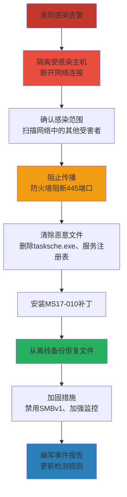

## 24.1 案例一：勒索软件分析（WannaCry变种）

WannaCry是恶意软件分析史上最经典的教学样本之一。它集蠕虫传播、漏洞利用、加密勒索于一体，覆盖了恶意软件分析的几乎所有核心技能点。本节以一个真实的WannaCry变种样本为对象，完整演示从样本获取到分析报告撰写的全流程。

### 24.1.1 事件背景与攻击时间线

#### WannaCry爆发始末

2017年5月12日，一种名为WannaCry（又名WannaCrypt、WCry、Wana Decrypt0r）的勒索蠕虫在全球范围内爆发。这是历史上破坏力最大的勒索软件攻击之一，其传播速度之快、感染范围之广，至今仍是网络安全领域的标志性事件。

**攻击时间线：**

| 时间 | 事件 |
|------|------|
| 2017-03-14 | 微软发布MS17-010安全补丁，修复SMBv1中的远程代码执行漏洞 |
| 2017-04-14 | Shadow Brokers泄露NSA黑客工具包，包含EternalBlue漏洞利用代码 |
| 2017-05-12 07:00 UTC | WannaCry首次被检测到，开始在全球范围传播 |
| 2017-05-12 15:00 UTC | 英国NHS（国家医疗服务体系）大规模感染，医院被迫关闭急诊 |
| 2017-05-12 19:00 UTC | 安全研究员MalwareTech注册Kill Switch域名，传播速度骤降 |
| 2017-05-13 | 微软发布Windows XP/Server 2003紧急安全补丁（罕见举措） |
| 2017-05-14 | 变种WannaCry 2.0出现，移除Kill Switch机制 |
| 2017-05-15 | 全球感染趋于稳定，累计150+国家、30万+台计算机受影响 |
| 2017-12 | 美国、英国、澳大利亚正式归因于朝鲜Lazarus组织 |

**攻击影响规模：**

| 统计维度 | 数据 |
|---------|------|
| 受影响国家 | 150+ |
| 感染计算机 | 30万+（保守估计） |
| 勒索赎金 | $300-$600/台（比特币支付） |
| 已知支付赎金 | $130,000+（比特币，约150 BTC） |
| 经济损失估计 | $40亿-$80亿美元（据Cyence/Allianz估算） |
| 受影响行业 | 医疗、教育、制造、政府、交通、通信 |

#### 技术来源：Shadow Brokers泄露事件

WannaCry的核心传播组件——EternalBlue漏洞利用——源自一个名为"Shadow Brokers"的神秘组织。2016年起，该组织开始分批泄露被认为隶属于NSA（美国国家安全局）TAO（Tailored Access Operations，定制接入行动）部门的黑客工具。EternalBlue利用的是Windows SMBv1协议中的一个缓冲区溢出漏洞（CVE-2017-0144），攻击者可以向目标机器的445端口发送特制的SMB数据包，无需任何认证即可远程执行任意代码。

这一事件揭示了一个深刻的安全悖论：**国家级情报机构发现并囤积的漏洞，一旦泄露，就会被犯罪分子武器化，造成大规模的公共安全危机。** 这直接推动了"漏洞公平裁决程序"（Vulnerabilities Equities Process，VEP）的政策讨论。

### 24.1.2 样本获取与安全准备

#### 样本来源

恶意软件分析的第一步是安全地获取样本。WannaCry样本可以从以下合法渠道获取：

| 来源 | URL | 说明 |
|------|-----|------|
| MalwareBazaar | https://bazaar.abuse.ch | Abuse.ch运营的恶意样本库，提供SHA256检索 |
| VirusTotal | https://www.virustotal.com | 可查看检测结果，下载需企业账号 |
| theZoo (GitHub) | https://github.com/ytisf/theZoo | 开源恶意样本集，适合教学研究 |
| VirusShare | https://virusshare.com | 需注册，提供批量样本下载 |
| ANY.RUN | https://any.run | 在线沙箱，可查看交互式分析报告 |

**样本哈希（用于检索）：**

```text
SHA256: 0a73291ab5607aef7db23863cf8e72f55bcb3c273bb47f00edf365a12de4b781
SHA1:   5ff465afaabcbf0150d1a3ab2c2e74f3a4426467
MD5:    ed01ebfbc9eb5bbea545af4d01bf5f1071661840480439c6e5babe8e080e41aa
```

> ⚠️ **安全警告**：以下所有分析操作必须在隔离的虚拟机环境中进行。确保虚拟机网络设置为Host-Only模式，并已创建干净快照以便分析后还原。切勿在联网环境或生产网络中打开样本。

#### 分析环境搭建

在开始分析前，准备以下隔离环境：

```text
┌─────────────────────────────────────────────────┐
│                   宿主机                         │
│  ┌──────────────┐    ┌──────────────────────┐   │
│  │ FLARE VM     │    │ REMnux               │   │
│  │ (Win10 x64)  │◄──►│ (Linux分析机)         │   │
│  │ 静态+动态分析 │    │ 网络模拟+流量分析     │   │
│  └──────────────┘    └──────────────────────┘   │
│         ▲ Host-Only网络 ▲                        │
│         └───────────────┘                        │
│              ▼                                   │
│  ┌──────────────────────────────────────────┐   │
│  │ INetSim / FakeNet-NG / Fakenet-NG        │   │
│  │ 模拟DNS/HTTP/HTTPS/SMB等网络服务         │   │
│  └──────────────────────────────────────────┘   │
└─────────────────────────────────────────────────┘
```

**关键工具清单（FLARE VM预装）：**

| 工具 | 用途 | 本案例使用场景 |
|------|------|---------------|
| PEStudio | PE文件快速静态分析 | 初始结构检查、导入表分析 |
| Detect It Easy (DIE) | 加壳/编译器检测 | 判断是否加壳 |
| FLOSS | 高级字符串提取（含栈字符串） | 提取加密相关字符串 |
| x64dbg | 动态调试器 | 调试加密逻辑和Kill Switch |
| Process Monitor (procmon) | 系统行为监控 | 记录文件/注册表/网络操作 |
| Process Explorer | 进程树分析 | 观察父子进程关系 |
| Wireshark | 网络流量捕获 | 分析SMB漏洞利用流量 |
| CAPA | MITRE ATT&CK行为映射 | 自动识别恶意行为特征 |
| YARA | 模式匹配引擎 | 编写检测规则 |
| Resource Hacker | 资源提取 | 提取.rsrc节中的嵌入组件 |
| HxD / 010 Editor | 十六进制编辑器 | 查看文件结构和加密数据 |

### 24.1.3 静态分析：从文件结构提取情报

静态分析是不执行样本的前提下，通过解析文件结构和内容来获取情报的过程。这是分析的第一道关卡，也是最安全的阶段。

#### 文件基础信息收集

使用多种工具交叉验证样本的基本属性：

```bash
# 使用file命令识别文件类型
$ file wannacry_sample.exe
wannacry_sample.exe: PE32+ executable (GUI) x86-64, for MS Windows

# 使用ssdeep计算模糊哈希（用于相似样本关联）
$ ssdeep wannacry_sample.exe
ssdeep,196608:3Ao4rMLxFuU1DMGPMSqOFH0vJ73DmDC5U:U4r6xDLGPMD...

# 使用trid识别文件类型
$ trid wannacry_sample.exe
TrID/32 - File Identifier v2.24
100.0% (.EXE) Win64 Executable Generic (6526/8/1)

# 计算多种哈希值
$ sha256sum wannacry_sample.exe
0a73291ab5607aef7db23863cf8e72f55bcb3c273bb47f00edf365a12de4b781

$ md5sum wannacry_sample.exe
ed01ebfbc9eb5bbea545af4d01bf5f1071661840480439c6e5babe8e080e41aa
```

**样本基础属性汇总：**

| 属性 | 值 | 分析意义 |
|------|-----|---------|
| 文件大小 | 3,723,264 字节 (3.55 MB) | 中等偏大，暗示内嵌了额外组件（如漏洞利用代码） |
| 文件类型 | PE32+ (GUI) x86-64 | 64位Windows可执行文件，GUI子系统表明可能有界面 |
| 编译时间戳 | 2017-02-15 10:31:11 UTC | 时间戳可能被篡改，但与早期变种吻合 |
| 子系统 | GUI (Windows) | 要显示勒索界面，因此使用GUI子系统 |
| 入口点 | 0x00401000 | 典型PE入口点地址 |

> 🔍 **分析技巧**：编译时间戳可以被攻击者随意修改（使用`backdate`等工具），不应作为唯一的时间判断依据。但结合其他证据（如证书有效期、域名注册时间、C2基础设施上线时间）可以交叉验证。

#### PE结构深度解析

PE（Portable Executable）结构是Windows可执行文件的骨架。通过分析节区表、导入表、资源节等结构，可以推断样本的功能模块和行为特征。

**节区分析：**

```text
节名      VirtualSize   RawSize   Entropy  特征标记       分析意义
.text     0x127B60      0x127C00  6.45     CODE|EXEC     主代码段，正常熵值
.rdata    0x67F8A       0x68000   5.97     INITIALIZED   只读数据/导入表
.data     0x8A00        0x7C00    4.56     INITIALIZED   全局变量/运行时数据
.rsrc     0x142A00      0x142A00  7.98     INITIALIZED   资源节，极高熵值!
.reloc    0x31C0        0x3200    5.09     DISCARDABLE   重定位表
```

**关键发现：**

1. **.rsrc节异常高熵值（7.98）**：正常资源节熵值通常在5.0-6.5之间。7.98接近随机数据的理论最大值（8.0），强烈暗示其中包含**加密或压缩的数据**。在勒索软件中，这通常意味着：
   - 嵌入了加密后的附属组件（如解密器DLL）
   - 存储了加密的配置数据
   - 内嵌了其他恶意模块（如EternalBlue漏洞利用代码）

2. **.rsrc节大小占比**：`.rsrc`节占文件总大小的`(0x142A00 / 总大小) ≈ 56%`，超过一半的文件体积被资源节占据，这进一步证实样本内嵌了大量额外组件。

3. **代码段熵值正常**（6.45）：主代码段未加壳，可以直接进行反汇编分析，降低了分析难度。

**导入表分析（Import Address Table, IAT）：**

通过PEStudio或`dumpbin /imports`提取导入函数，按功能分类如下：

| DLL | 关键导入函数 | 推断功能 |
|-----|-------------|---------|
| kernel32.dll | `CreateFileW`, `WriteFile`, `ReadFile`, `FindFirstFileW`, `MoveFileW` | 文件系统操作（遍历/读写/重命名文件） |
| kernel32.dll | `CreateProcessW`, `WinExec` | 创建子进程（释放并执行附属组件） |
| kernel32.dll | `CreateServiceW`, `StartServiceW` | Windows服务操作（持久化） |
| advapi32.dll | `CryptAcquireContextW`, `CryptGenKey`, `CryptEncrypt`, `CryptExportKey` | Windows CryptoAPI加密操作 |
| advapi32.dll | `RegCreateKeyW`, `RegSetValueExW` | 注册表操作（自启动项） |
| ws2_32.dll | `WSAStartup`, `socket`, `connect`, `send`, `recv` | 网络通信（SMB利用/扫描） |
| wininet.dll | `InternetOpenW`, `InternetConnectW`, `HttpOpenRequestW` | HTTP通信（Kill Switch检查） |
| msvcrt.dll | `malloc`, `free`, `memcpy`, `sprintf` | C运行时标准库 |
| user32.dll | `DialogBoxParamW`, `SetWindowTextW`, `SendMessageW` | GUI界面（勒索界面显示） |

**导入表分析结论**：样本同时具备文件加密能力（CryptoAPI）、网络通信能力（ws2_32 + wininet）、持久化能力（注册表 + 服务）和用户界面能力（user32），这与勒索蠕虫的行为特征完全吻合。

#### 字符串分析

字符串分析是静态分析中最快速有效的方法之一。恶意软件中的字符串往往直接暴露其功能模块、配置信息和通信目标。

**使用FLOSS提取高级字符串：**

FLOSS（FLARE Obfuscated String Solver）是Mandiant开发的字符串提取工具，除了常规的ASCII/Unicode字符串外，还能自动识别并解码栈上构造的混淆字符串——这正是现代恶意软件常用的逃避技术。

```bash
# 常规字符串提取
$ floss wannacry_sample.exe > floss_output.txt

# 仅提取混淆字符串（栈字符串）
$ floss -x wannacry_sample.exe > floss_stack_strings.txt
```

**关键字符串分类提取结果：**

**1. 加密标识与勒索信息：**

```text
WNcry@2ol7          -- 加密文件扩展名标识（部分版本为.WNCRY）
WANACRY!            -- 勒索软件标识字符串
@Please_Read_Me@.txt -- 勒索说明文件名
c.wnry               -- 配置文件名（存储比特币钱包地址等配置）
s.wnry               -- 加密的Tor客户端
t.wnry               -- 加密的主加密模块（解密后为DLL）
r.wnry                -- 勒索说明文件（RTF格式）
msg/m_english.wnry   -- 英文勒索信息模板
```

**2. 比特币钱包地址：**

```text
13AM4VW2dhxYgXeQepoHkHSQuy6NgaEb94
115p7UMMngoj1pMvkpHijcRdfJNXj6LrLn
12t9YDPgwueZ9NyMgw519p7AA8isjr6SMw
```

三个钱包地址用于接收赎金。根据区块链追踪，截至2017年底共收到约51.6 BTC（约$130,000）。

**3. SMB利用相关字符串：**

```text
\\172.16.99.5\IPC$       -- 硬编码的SMB目标（可能是测试环境遗留）
\\192.168.56.20\IPC$     -- 硬编码的SMB目标
\\IPC$                   -- SMB空会话连接目标
\\pipe\mssecsvc          -- 命名管道（DoublePulsar后门通信）
```

**4. 服务与持久化：**

```text
mssecsvc2.0             -- 创建的Windows服务名称
Microsoft Security Center (2.0) Service  -- 服务显示名称（伪装为安全中心）
tasksche.exe            -- 释放的主恶意程序文件名
C:\ProgramData\         -- 释放文件的目标目录
```

**5. Kill Switch域名：**

```text
iuqerfsodp9ifjaposdfjhgosurijfaewrwergwea.com
ifferfsodp9ifjaposdfjhgosurijfaewrwergwea.com  -- 变种使用的域名
```

> 🔍 **分析技巧**：Kill Switch域名本身是无意义的随机字符串，看起来像是测试时生成的。这在恶意软件中并不罕见——开发者经常使用随机域名进行测试，却忘了在发布前移除。在本案例中，这个"失误"被安全研究员利用，成为了遏制攻击的关键。

**6. 受加密的文件扩展名（176种）：**

WannaCry加密的文件类型覆盖面极广，以下是核心目标扩展名分类：

| 类别 | 扩展名示例 | 数量 |
|------|-----------|------|
| 办公文档 | .doc, .docx, .xls, .xlsx, .ppt, .pptx, .pdf | 30+ |
| 图像文件 | .jpg, .jpeg, .png, .bmp, .gif, .psd | 20+ |
| 压缩归档 | .zip, .rar, .7z, .tar, .gz | 10+ |
| 数据库文件 | .sql, .mdb, .db, .sqlite | 8+ |
| 开发文件 | .c, .cpp, .h, .java, .py, .php | 15+ |
| 邮件文件 | .eml, .msg, .pst | 5+ |
| 虚拟机文件 | .vmdk, .vmx, .vdi | 5+ |
| 密钥/证书 | .pem, .key, .pfx | 5+ |

> ⚠️ **关键细节**：WannaCry**不会加密**Windows系统目录（`C:\Windows`、`C:\Program Files`等）和部分关键系统文件。这不是仁慈，而是**功能性需求**——加密系统文件会导致系统崩溃，用户将无法看到勒索界面，也就无法支付赎金。

#### CAPA行为特征自动提取

CAPA（Code Analysis to Find Abusable Properties）是由Mandiant/FLARE开发的开源工具，能够自动识别PE文件中与MITRE ATT&CK框架对应的行为特征。

```bash
$ capa wannacry_sample.exe
```

**CAPA识别结果映射到MITRE ATT&CK：**

| 行为特征 | MITRE ATT&CK技术 | ID | 说明 |
|---------|-------------------|-----|------|
| 创建Windows服务 | 服务创建 | T1543.003 | 持久化机制 |
| 生成AES密钥 | 数据加密 | T1486 | 文件加密准备 |
| 通过加密API加密数据 | 数据加密 | T1486 | 文件加密实施 |
| 删除卷影副本 | 删除备份 | T1490 | 阻止文件恢复 |
| 修改注册表Run键 | 注册表自启动 | T1547.001 | 持久化 |
| 连接HTTP服务器 | C2通信 | T1071.001 | Kill Switch检查 |
| 扫描SMB端口 | 远程服务扫描 | T1046 | 网络传播 |
| 利用MS17-010漏洞 | 远程服务利用 | T1210 | 漏洞利用传播 |
| 创建互斥体 | 同步机制 | T1482 | 单实例运行 |
| 终止进程 | 停止服务 | T1489 | 停止数据库等服务以释放文件锁 |

### 24.1.4 动态分析：观察运行时行为

静态分析提供了样本的"设计蓝图"，但只有动态分析才能揭示样本的"真实行为"。本节在隔离虚拟机中执行样本，使用多种监控工具记录其全部运行时行为。

#### 行为监控流程

**执行前准备：**

```powershell
# 1. 启动Process Monitor，配置过滤器
#    过滤器设置: Process Name is wannacry_sample.exe -> Include
#    同时监控子进程: Process Name is tasksche.exe -> Include
#    同时监控: Process Name is mssecsvc.exe -> Include

# 2. 启动Process Explorer，准备观察进程树

# 3. 启动Wireshark，选择Host-Only网卡开始抓包
#    过滤器: tcp.port == 445 || dns || http

# 4. 启动RegShot，拍摄第一张注册表快照

# 5. 使用命令行记录样本执行前的系统状态
> dir /s /b C:\Users\ > before_files.txt
> reg export HKLM\SOFTWARE\Microsoft\Windows\CurrentVersion\Run before_run.reg
```

**执行样本并记录行为：**

```text
> wannacry_sample.exe
```

#### 文件系统行为

通过Process Monitor捕获的文件操作序列：

```text
时间轴        操作              路径                          说明
─────────────────────────────────────────────────────────────────────
T+0.0s       创建文件          C:\ProgramData\tasksche.exe   释放主恶意程序副本
T+0.1s       创建服务          mssecsvc2.0                   注册Windows服务
T+0.2s       启动服务          mssecsvc2.0 → tasksche.exe    通过服务启动副本
T+0.3s       创建目录          C:\ProgramData\qhbkebwo590\   创建工作目录
T+0.5s       释放资源          工作目录\*.wnry               释放配置和加密组件
T+0.6s       创建文件          工作目录\c.wnry               配置文件（比特币地址等）
T+0.7s       创建文件          工作目录\s.wnry               加密的Tor客户端
T+0.8s       创建文件          工作目录\t.wnry               加密的主加密DLL
T+1.0s       读取文件          工作目录\t.wnry               解密并加载主加密模块
T+1.5s       开始加密          C:\Users\*.doc, *.xls...      遍历并加密用户文件
T+2.0s       重命名文件        *.doc → *.WNCRY              修改文件扩展名
T+2.0s       创建勒索说明      各目录\@Please_Read_Me@.txt   在每个目录放置勒索文件
```

**文件释放逻辑分析：**

WannaCry采用多层释放机制，这是恶意软件的典型"滴管"（Dropper）模式：

```mermaid
graph TD
    A[wannacry_sample.exe] -->|"释放到 ProgramData"| B[tasksche.exe]
    B -->|"资源释放到工作目录"| C[.wnry文件集合]
    C --> D[c.wnry - 配置]
    C --> E[s.wnry - Tor客户端]
    C --> F[t.wnry - 加密DLL]
    C --> G[r.wnry - 勒索说明]
    C --> H[msg/ - 多语言勒索模板]
    B -->|"解密并加载DLL"| F
    F -->|"执行加密逻辑"| I[遍历文件系统加密]
    I --> J[*.docx → *.WNCRY]
    I --> K[@Please_Read_Me@.txt]

    style A fill:#c0392b,stroke:#e74c3c
    style B fill:#e74c3c,stroke:#c0392b
    style F fill:#f39c12,stroke:#e67e22
```

#### 注册表行为

使用RegShot对比执行前后的注册表差异：

```reg
; 新增的自启动键值（持久化）
[HKEY_LOCAL_MACHINE\SOFTWARE\Microsoft\Windows\CurrentVersion\Run]
"mssecsvc2.0"="\"C:\\ProgramData\\tasksche.exe\""

; 新创建的Windows服务
[HKEY_LOCAL_MACHINE\SYSTEM\CurrentControlSet\Services\mssecsvc2.0]
"Type"=dword:00000010         ; 服务类型: 独立进程
"Start"=dword:00000002        ; 启动类型: 自动启动
"ErrorControl"=dword:00000001 ; 错误控制: 正常
"ImagePath"="C:\\ProgramData\\tasksche.exe"
"DisplayName"="Microsoft Security Center (2.0) Service"
"ObjectName"="LocalSystem"    ; 以SYSTEM权限运行
```

**分析要点**：

- **双重持久化**：同时使用注册表Run键和Windows服务两种机制，确保即使一种被清除，另一种仍能维持运行
- **权限提升**：通过Windows服务以`LocalSystem`（最高本地权限）身份运行，超越大多数用户的权限
- **伪装命名**：服务名称伪装为"Microsoft Security Center"，试图混入正常系统服务列表

#### 进程行为

Process Explorer捕获的进程树：

```text
wannacry_sample.exe (PID: 3412)
├── tasksche.exe (PID: 3688)          ← 释放并启动的主恶意程序
│   ├── icacls.exe /grant Everyone:F /T /C  ← 修改文件权限
│   ├── attrib.exe +h .               ← 隐藏工作目录
│   └── cmd.exe /c vssadmin delete shadows /all /quiet  ← 删除卷影副本
├── mssecsvc.exe (PID: 3920)          ← 服务主进程
│   └── [SMB扫描线程]
│       └── 发送SMB数据包到外部IP:445
└── @Please_Read_Me@.txt [创建]
```

**关键行为分析**：

1. **卷影副本删除**：`vssadmin delete shadows /all /quiet` 命令删除所有卷影副本（Volume Shadow Copies），这是Windows内置的文件备份机制。删除卷影副本是为了**阻止用户通过"以前的版本"功能恢复被加密的文件**。几乎所有勒索软件都会执行此操作。

2. **权限修改**：`icacls`命令用于修改加密文件的ACL（访问控制列表），确保即使文件原始权限受限，加密操作也能正常执行。

3. **隐藏属性**：`attrib +h`将工作目录设为隐藏，降低用户发现的概率。

#### 网络行为

Wireshark捕获的网络流量分析：

**1. Kill Switch检查（HTTP）：**

```yaml
DNS查询: iuqerfsodp9ifjaposdfjhgosurijfaewrwergwea.com
→ DNS响应: [域名不存在/或返回解析IP]

HTTP请求（如果域名可解析）:
GET / HTTP/1.1
Host: iuqerfsodp9ifjaposdfjhgosurijfaewrwergwea.com

如果连接成功 → 终止执行（Kill Switch生效）
如果连接失败 → 继续执行加密流程
```

**2. SMB扫描（端口445）：**

```text
源IP: 192.168.56.101 (分析机)
目标: 随机生成的外部IP地址
端口: 445 (SMB)
协议: SMBv1 Negotiate Protocol Request

[TCP SYN] → 目标IP:445
[TCP SYN-ACK] ← 目标IP:445（如果端口开放）
[SMB Negotiate] → 发送SMBv1协商请求
[SMB Session Setup] → 尝试建立空会话
[SMB Tree Connect] → 连接到 \\目标IP\IPC$
[Trans2 Request] → 发送EternalBlue漏洞利用数据包
```

**3. SMB扫描模式分析：**

WannaCry的网络扫描采用**随机IP生成**策略，而非顺序扫描。通过分析其扫描线程的内存数据：

```python
# WannaCry的扫描逻辑伪代码（基于逆向分析还原）
def scan_thread():
    while True:
        # 生成随机IP地址（排除保留地址段）
        target_ip = generate_random_ip()
        
        # 检查端口445是否开放（超时500ms）
        if not check_port(target_ip, 445, timeout=0.5):
            continue
        
        # 首先尝试DoublePulsar后门检测
        if check_doublepulsar(target_ip):
            # 目标已有DoublePulsar后门，直接植入
            install_via_doublepulsar(target_ip, payload)
            continue
        
        # 尝试EternalBlue漏洞利用
        if exploit_ms17_010(target_ip):
            # 漏洞利用成功，安装DoublePulsar后门
            install_doublepulsar(target_ip)
            # 通过后门上传并执行WannaCry副本
            upload_and_execute(target_ip, wannacry_binary)
```

> 🔍 **关键发现**：WannaCry不仅能利用EternalBlue直接攻击未打补丁的系统，还能检测目标是否已被DoublePulsar后门感染（来自之前的攻击），如果是，则直接通过现有后门植入。这种"寄生"能力大大提高了传播效率。

#### 网络指标（Network IOCs）

| 类型 | 值 | 说明 |
|------|-----|------|
| Kill Switch域名 | iuqerfsodp9ifjaposdfjhgosurijfaewrwergwea.com | 原始变种 |
| Kill Switch域名 | ifferfsodp9ifjaposdfjhgosurijfaewrwergwea.com | 变种2.0 |
| 目标端口 | TCP/445 | SMB服务端口 |
| 比特币钱包 | 13AM4VW2dhxYgXeQepoHkHSQuy6NgaEb94 | 钱包1 |
| 比特币钱包 | 115p7UMMngoj1pMvkpHijcRdfJNXj6LrLn | 钱包2 |
| 比特币钱包 | 12t9YDPgwueZ9NyMgw519p7AA8isjr6SMw | 钱包3 |
| Tor C2 | gx7ekbenv2riucmf.onion | 支付/解密服务器 |
| Tor C2 | 57g7spgrzlojinas.onion | 支付/解密服务器 |
| 命名管道 | \\pipe\mssecsvc | DoublePulsar后门通信 |

### 24.1.5 传播机制深度分析

WannaCry的传播能力是其最具破坏性的特征。它不是一个单纯的勒索软件，而是一个**勒索蠕虫**——融合了蠕虫的自动传播能力和勒索软件的加密勒索能力。

#### EternalBlue漏洞利用原理（MS17-010）

EternalBlue利用的是Windows SMBv1协议中`Srv!SrvOs2FeaListSizeToNt`函数的缓冲区溢出漏洞。该函数在处理SMB Transaction2请求中的FEA（File Extended Attributes）列表时，未正确校验输入长度，导致栈缓冲区溢出。

**漏洞利用简要流程：**

```text
攻击者                                    目标（SMB Server）
   |                                          |
   |--- SMB Negotiate Protocol Request ------->|
   |<-- SMB Negotiate Protocol Response -------|
   |--- SMB Session Setup (匿名认证) --------->|
   |<-- SMB Session Setup Response ------------|
   |--- SMB Tree Connect (\\IPC$) ------------>|
   |<-- SMB Tree Connect Response -------------|
   |--- SMB Trans2 Request (畸形FEA数据) ----->|
   |      [触发缓冲区溢出]                      |
   |      [覆盖返回地址]                        |
   |      [跳转到shellcode]                     |
   |--- SMB Trans2 Secondary (shellcode) ----->|
   |      [执行shellcode，建立后门]              |
```

**漏洞利用的关键技术细节**：

1. **非分页池溢出**：EternalBlue利用的是内核非分页池（NonPaged Pool）的溢出，而非传统的栈溢出。攻击者通过精心构造的FEA数据触发池溢出，覆盖相邻的内核对象。

2. **Type confusion利用**：溢出后通过伪造内核对象结构（特别是`SMB_NT_TRANSACT`相关的内核结构），实现任意内核地址读写原语（Kernel Read/Write Primitive）。

3. **Token窃取**：最终通过窃取System进程的访问令牌（Access Token），在内核态执行shellcode，完成权限提升到SYSTEM级别。

4. **DoublePulsar植入**：shellcode执行后，安装DoublePulsar后门——一个轻量级的内核级后门，通过修改SMB事务处理函数表（Transaction Dispatch Table）挂钩SMB和RDP服务，为后续攻击提供持久化的远程执行能力。

#### Kill Switch机制解析

Kill Switch是WannaCry中最引人注目的反分析机制，也是遏制其传播的关键：

```c
// Kill Switch逻辑伪代码（基于逆向分析还原）
BOOL check_kill_switch() {
    HINTERNET hInternet = InternetOpenW(L"Mozilla/4.0", 
        INTERNET_OPEN_TYPE_PRECONFIG, NULL, NULL, 0);
    
    // 尝试连接Kill Switch域名
    HINTERNET hConnect = InternetConnectW(hInternet, 
        L"iuqerfsodp9ifjaposdfjhgosurijfaewrwergwea.com",
        INTERNET_DEFAULT_HTTP_PORT, NULL, NULL, 
        INTERNET_SERVICE_HTTP, 0, 0);
    
    if (hConnect != NULL) {
        // 域名可以连接 → 沙箱环境或已被监控
        InternetCloseHandle(hConnect);
        InternetCloseHandle(hInternet);
        ExitProcess(0);  // 终止执行
        return TRUE;
    }
    
    // 域名无法连接 → 真实环境，继续执行
    InternetCloseHandle(hInternet);
    return FALSE;
}
```

**Kill Switch的三重作用**：

1. **反沙箱检测**：许多沙箱环境会将所有域名解析到同一IP（sinkhole），使得任何域名都"可连接"。Kill Switch利用这一特征识别沙箱环境。
2. **反研究人员分析**：安全研究人员通常在联网环境中分析样本，这也会导致域名可以连接，从而触发终止。
3. **紧急停止开关**：虽然可能不是原始设计意图，但客观上成为了遏制传播的"后门"。

**后续变种的应对**：

| 变种 | Kill Switch处理 | 效果 |
|------|----------------|------|
| WannaCry 1.0 | 包含原始Kill Switch域名 | 被MalwareTech注册后遏制 |
| WannaCry 2.0 | 移除Kill Switch机制 | 传播不受限，但代码有bug导致稳定性差 |
| WannaCry变体 (各种) | 使用不同的Kill Switch域名 | 各个域名被逐一注册遏制 |
| UIWIX | 完全重写的变种，不使用EternalBlue | 采用其他传播方式 |

#### 网络扫描策略

WannaCry的网络扫描策略经过精心设计：

```text
┌──────────────────────────────────────────────────────┐
│                扫描线程池 (默认128线程)                 │
│                                                      │
│  ┌─────────┐  ┌─────────┐  ┌─────────┐             │
│  │ 线程 1  │  │ 线程 2  │  │ 线程 N  │ ...         │
│  │         │  │         │  │         │             │
│  │ 随机IP  │  │ 随机IP  │  │ 随机IP  │             │
│  │ :445?   │  │ :445?   │  │ :445?   │             │
│  │  ↓      │  │  ↓      │  │  ↓      │             │
│  │ DP检测  │  │ EB利用  │  │ 上传    │             │
│  └─────────┘  └─────────┘  └─────────┘             │
│                                                      │
│  全局扫描计数器: max 10,000 IP/次                     │
│  扫描间隔: 无（持续扫描）                              │
└──────────────────────────────────────────────────────┘
```

**扫描行为特征**：
- 使用128个并发线程同时扫描（可通过命令行参数调整）
- 随机生成目标IP地址，排除RFC 1918私有地址段（10.0.0.0/8, 172.16.0.0/12, 192.168.0.0/16）
- 排除多播地址和环回地址
- 先检测端口445是否开放，再尝试漏洞利用
- 每次扫描上限10,000个IP地址
- 无扫描间隔限制，持续高速扫描

### 24.1.6 加密机制深度分析

加密是勒索软件的核心功能模块。WannaCry采用混合加密方案（RSA + AES），在安全性和性能之间取得平衡。

#### 加密架构

WannaCry的加密系统采用经典的**混合加密**架构：

```mermaid
graph TD
    A[攻击者服务器] -->|"生成RSA密钥对<br/>(公钥+私钥)"| B[RSA密钥对]
    B -->|"嵌入样本"| C[内嵌RSA公钥<br/>(2048-bit)]
    B -->|"攻击者保管"| D[RSA私钥<br/>(仅攻击者持有)]
    
    E[受害者计算机] -->|"对每个文件"| F[生成随机AES-128密钥]
    F -->|"AES-128-CBC加密文件内容"| G[加密后的文件内容]
    F -->|"RSA公钥加密AES密钥"| H[加密后的AES密钥]
    G --> I[合并: 加密内容 + 加密密钥]
    I --> J[.WNCRY文件]
    
    J -->|"支付赎金后"| K[攻击者发送RSA私钥]
    K -->|"RSA私钥解密AES密钥"| L[AES密钥恢复]
    L -->|"AES密钥解密文件内容"| M[文件恢复]

    style C fill:#27ae60,stroke:#2ecc71
    style D fill:#c0392b,stroke:#e74c3c
    style J fill:#f39c12,stroke:#e67e22
```

#### 加密算法详解

| 算法 | 参数 | 用途 | 为什么选择这个算法 |
|------|------|------|-------------------|
| RSA-2048 | PKCS#1 v1.5填充 | 加密每个文件的AES密钥 | 非对称加密确保只有攻击者能解密 |
| AES-128 | CBC模式，随机IV | 加密文件内容 | 对称加密速度快，适合大文件 |
| CryptGenRandom | Windows CSPRNG | 生成AES密钥和IV | 利用系统级密码学安全随机数生成器 |

#### 加密实现细节

**API调用序列（通过API Monitor捕获）：**

```text
CryptAcquireContextW(&hProv, NULL, NULL, PROV_RSA_AES, CRYPT_VERIFYCONTEXT)
    └── 获取AES加密提供程序的句柄

CryptGenKey(hProv, CALG_AES_128, CRYPT_EXPORTABLE, &hKey)
    └── 生成可导出的128位AES密钥

CryptSetKeyParam(hKey, KP_IV, iv_data, 0)
    └── 设置CBC模式的初始化向量

CryptEncrypt(hKey, 0, TRUE, 0, file_data, &data_len, buffer_len)
    └── 使用AES-128-CBC加密文件内容

CryptExportKey(hKey, hPublicKey, SIMPLEBLOB, 0, encrypted_key, &key_len)
    └── 使用内嵌的RSA公钥导出（加密）AES密钥

CryptDestroyKey(hKey)
CryptReleaseContext(hProv, 0)
```

**加密文件格式：**

```text
┌─────────────────────────────────────────────────┐
│ 偏移        内容                                │
├─────────────────────────────────────────────────┤
│ 0x0000      原始文件头 (已加密)                 │
│ ...         加密的文件内容 (AES-128-CBC)        │
│ ...                                             │
│ EOF-256     加密的AES密钥 (RSA-2048加密)        │
│ EOF         原始文件大小 (8字节)                 │
└─────────────────────────────────────────────────┘
```

#### 被加密的服务进程处理

WannaCry在加密文件前，会先终止可能锁定文件的服务进程：

```powershell
# WannaCry通过cmd.exe执行以下命令（还原自动态分析）
cmd.exe /c net stop "Security Center" /y
cmd.exe /c net stop "Windows Defender Service" /y  
cmd.exe /c net stop "Windows Update" /y
cmd.exe /c net stop "MSSQLSERVER" /y
cmd.exe /c net stop "SQLWriter" /y
cmd.exe /c net stop "MySQL" /y
cmd.exe /c net stop "MSExchange* /y
cmd.exe /c vssadmin delete shadows /all /quiet
cmd.exe /c wmic shadowcopy delete
cmd.exe /c bcdedit /set {default} bootstatuspolicy ignoreallfailures
cmd.exe /c bcdedit /set {default} recoveryenabled no
```

这些命令实现了三个目标：
1. **停止数据库/邮件服务**：释放被服务锁定的文件，使其可以被加密
2. **删除卷影副本**：摧毁Windows内置的文件备份机制
3. **禁用系统恢复**：阻止通过启动修复恢复系统

### 24.1.7 YARA检测规则

基于以上分析结果，编写YARA规则用于检测WannaCry及其变种：

```yara
rule WannaCry_Ransomware {
    meta:
        description = "Detects WannaCry ransomware and variants"
        author = "Security Analyst"
        date = "2024-01-01"
        reference = "WannaCry Analysis Case Study"
        severity = "critical"
        category = "ransomware"
        family = "WannaCry"
        
    strings:
        // 加密相关标识
        $ransom_ext = "WNcry@2ol7" ascii wide
        $wannacry_id = "WANACRY!" ascii
        
        // 勒索信息文件
        $ransom_note = "@Please_Read_Me@.txt" ascii wide
        
        // Kill Switch域名（原始和变种）
        $killswitch_1 = "iuqerfsodp9ifjaposdfjhgosurijfaewrwergwea.com" ascii wide
        $killswitch_2 = "ifferfsodp9ifjaposdfjhgosurijfaewrwergwea.com" ascii wide
        
        // 服务名称
        $service_name = "mssecsvc2.0" ascii wide
        $service_display = "Microsoft Security Center" ascii wide
        
        // 比特币钱包地址
        $btc_wallet_1 = "13AM4VW2dhxYgXeQepoHkHSQuy6NgaEb94" ascii
        $btc_wallet_2 = "115p7UMMngoj1pMvkpHijcRdfJNXj6LrLn" ascii
        $btc_wallet_3 = "12t9YDPgwueZ9NyMgw519p7AA8isjr6SMw" ascii
        
        // 释放的文件名
        $drop_file_1 = "tasksche.exe" ascii wide
        $drop_file_2 = "t.wnry" ascii
        $drop_file_3 = "c.wnry" ascii
        $drop_file_4 = "s.wnry" ascii
        
        // 卷影副本删除命令
        $vss_cmd = "vssadmin delete shadows" ascii wide
        $wmic_cmd = "wmic shadowcopy delete" ascii wide
        
        // SMB相关
        $smb_pipe = "\\pipe\\mssecsvc" ascii wide
        $ipc_share = "\\IPC$" ascii wide
        
    condition:
        uint16(0) == 0x5A4D and  // MZ头（PE文件）
        filesize < 5MB and
        (
            // 高置信度：包含多个核心标识
            (2 of ($ransom_ext, $wannacry_id, $killswitch_1, $killswitch_2)) or
            // 中置信度：服务名+释放文件+勒索信息
            ($service_name and 2 of ($drop_file_*)) or
            // 综合判断：多种特征组合
            ($ransom_note and $vss_cmd and $btc_wallet_1) or
            // 宽松匹配：大量特征命中
            5 of them
        )
}

rule WannaCry_Network_Indicator {
    meta:
        description = "Detects WannaCry network traffic patterns"
        
    strings:
        $smb_negotiate = { FF 53 4D 42 72 }  // SMB Negotiate
        $trans2_req = { FF 53 4D 42 25 }     // SMB Trans2 Request
        $doublepulsar = "\\pipe\\mssecsvc" ascii
        
    condition:
        $smb_negotiate at 0 or $trans2_req at 0 or $doublepulsar
}
```

**规则使用方式：**

```bash
# 对单个文件扫描
$ yara wannacry_rules.yara suspect_file.exe

# 对目录递归扫描
$ yara -r wannacry_rules.yara /path/to/samples/

# 结合YARA扫描器使用
$ yara -s wannacry_rules.yara suspect_file.exe  # 显示匹配偏移
```

### 24.1.8 防御策略与应急响应

#### 针对WannaCry的防御措施

| 防御层次 | 具体措施 | 优先级 | 说明 |
|---------|---------|--------|------|
| 补丁管理 | 安装MS17-010安全补丁 | 紧急 | 修复SMBv1漏洞，最根本的防御措施 |
| 网络隔离 | 关闭外部445端口访问 | 紧急 | 阻断SMB蠕虫传播路径 |
| 服务加固 | 禁用SMBv1协议 | 高 | `Set-SmbServerConfiguration -EnableSMB1Protocol $false` |
| 端点防护 | 部署EDR/XDR解决方案 | 高 | 检测异常进程行为和文件加密活动 |
| 备份策略 | 实施3-2-1备份策略 | 高 | 3份副本、2种介质、1份离线/异地 |
| 网络分段 | 实施网络微分段 | 中 | 限制横向移动范围 |
| 权限最小化 | 限制本地管理员权限 | 中 | 降低恶意软件提权能力 |
| 用户教育 | 定期安全意识培训 | 中 | 减少初始感染向量 |

#### 应急响应处置流程

如果发现WannaCry感染，按以下流程处置：



**清除脚本示例：**

```powershell
# WannaCry清除脚本（仅供应急响应使用）
# 1. 停止并删除恶意服务
Stop-Service -Name "mssecsvc2.0" -Force -ErrorAction SilentlyContinue
sc.exe delete "mssecsvc2.0"

# 2. 终止恶意进程
Stop-Process -Name "tasksche" -Force -ErrorAction SilentlyContinue
Stop-Process -Name "mssecsvc" -Force -ErrorAction SilentlyContinue

# 3. 删除恶意文件
Remove-Item "C:\ProgramData\tasksche.exe" -Force -ErrorAction SilentlyContinue
Remove-Item "C:\ProgramData\qhbkebwo590" -Recurse -Force -ErrorAction SilentlyContinue

# 4. 清除注册表自启动项
Remove-ItemProperty -Path "HKLM:\SOFTWARE\Microsoft\Windows\CurrentVersion\Run" `
    -Name "mssecsvc2.0" -Force -ErrorAction SilentlyContinue

# 5. 安装安全补丁
# 下载并安装对应系统版本的MS17-010补丁
# Windows 10: KB4013198
# Windows 7:  KB4012212 (月度安全更新)
```

> ⚠️ **重要提醒**：清除恶意软件**不等于**恢复数据。WannaCry使用的RSA-2048加密在没有私钥的情况下是不可逆的。文件恢复只能依赖于离线备份或卷影副本（如果未被删除）。这就是为什么备份策略是防御勒索软件最重要的措施。

### 24.1.9 变种对比与演化

WannaCry爆发后，出现了多个变种和模仿者：

| 特征 | WannaCry 1.0 | WannaCry 2.0 | UIWIX | WannaCry HD |
|------|-------------|-------------|-------|-------------|
| 出现时间 | 2017-05-12 | 2017-05-13 | 2017-05-14 | 2017-05 |
| Kill Switch | 有 | 移除 | 无 | 有（不同域名） |
| 传播方式 | EternalBlue | EternalBlue | EternalBlue + 其他 | EternalBlue |
| 加密算法 | RSA-2048 + AES-128 | RSA-2048 + AES-128 | 不同实现 | RSA-2048 + AES-256 |
| 代码bug | 较少 | 内存泄漏bug | 无 | 较少 |
| 感染规模 | 最大 | 较小 | 很小 | 很小 |
| 稳定性 | 稳定 | 不稳定 | 稳定 | 稳定 |

**关键教训**：

1. **漏洞武器化的时间窗口极短**：从Shadow Brokers泄露EternalBlue（2017-04-14）到WannaCry爆发（2017-05-12）仅28天。即使微软已发布补丁（2017-03-14），大量系统仍未更新，暴露了全球补丁管理的系统性缺陷。

2. **蠕虫+勒索的组合极具破坏力**：传统勒索软件依赖人工传播（钓鱼邮件、RDP暴力破解），感染速度有限。WannaCry通过蠕虫机制实现自动化传播，使其成为真正的"大规模杀伤性"网络武器。

3. **Kill Switch是把双刃剑**：虽然Kill Switch遏制了原始变种的传播，但后续变种可以轻易移除这一机制。依赖Kill Switch进行防御是不可持续的。

### 24.1.10 分析报告模板

完成恶意软件分析后，应产出一份结构化的分析报告。以下是基于WannaCry案例的报告模板：

```text
================================================================
           恶意软件分析报告
================================================================

报告编号: MW-2024-001
分析人员: [姓名]
分析日期: [日期]
样本来源: [来源]
分类等级: TLP:WHITE (可公开)

一、执行摘要
    本样本被确认为WannaCry勒索蠕虫变种，具备通过MS17-010
    漏洞自动传播和AES-128+RSA-2048混合加密的能力。
    威胁等级: 严重 (Critical)

二、样本基本信息
    文件名: wannacry_sample.exe
    SHA256: 0a73291ab5607aef...
    MD5:    ed01ebfbc9eb5bbe...
    大小:   3,723,264 字节
    类型:   PE32+ (GUI) x86-64
    编译时间: 2017-02-15 10:31:11 UTC

三、行为分析结果
    3.1 持久化
        - 注册表Run键: mssecsvc2.0
        - Windows服务: mssecsvc2.0 (自动启动)
    3.2 传播
        - SMB漏洞利用 (MS17-010/EternalBlue)
        - 双击后门传播 (DoublePulsar)
    3.3 加密
        - 算法: RSA-2048 + AES-128-CBC
        - 目标: 176种文件扩展名
        - 勒索: $300-$600 比特币
    3.4 反分析
        - Kill Switch域名检查

四、IoC (入侵指标)
    [见24.1.4节IoC表格]

五、检测规则
    [见24.1.7节YARA规则]

六、处置建议
    1. 立即隔离受感染主机
    2. 防火墙阻断445端口
    3. 全网安装MS17-010补丁
    4. 禁用SMBv1协议
    5. 从离线备份恢复文件
    6. 部署EDR加强监控

七、MITRE ATT&CK映射
    T1210  - 远程服务利用 (EternalBlue)
    T1486  - 数据加密 (文件加密)
    T1490  - 阻止系统恢复 (删除卷影副本)
    T1543.003 - 创建系统服务 (持久化)
    T1547.001 - 注册表自启动 (持久化)
    T1046  - 网络服务扫描 (SMB扫描)

================================================================
```

### 24.1.11 本案例关键收获

通过WannaCry变种的完整分析，我们实践了恶意软件分析的全链路技能：

1. **静态分析的价值**：通过PE结构、导入表、字符串分析，在不执行样本的情况下获得了大量情报（家族归属、功能模块、IoC），为后续分析提供了方向指引。

2. **动态分析的不可替代性**：Kill Switch机制、加密流程、网络扫描策略等行为只有在运行时才能观察到。静态分析可以推断功能，但动态分析才能确认行为。

3. **网络分析的关键作用**：Wireshark捕获的SMB流量不仅揭示了传播机制，还为编写网络层检测规则（Snort/Suricata IDS规则）提供了精确的模式特征。

4. **自动化工具的辅助价值**：CAPA快速映射MITRE ATT&CK、YARA规则批量检测、FLOSS自动解码混淆字符串——自动化工具将分析效率提升了数倍。

5. **分析报告的结构化思维**：一份好的分析报告不是工具输出的堆砌，而是将技术发现转化为可执行的安全决策。

> 📚 **延伸阅读**：
> - Microsoft Security Blog: "WannaCry ransomware and countermeasures"
> - MalwareTech: "How to Accidentally Stop a Global Cyber Attacks"
> - MITRE ATT&CK: WannaCry Profile (S0366)
> - Cisco Talos: "WannaCry After One Year: What Has Changed?"
> - 《Practical Malware Analysis》（Michael Sikorski & Andrew Honig）
