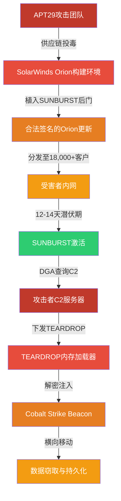
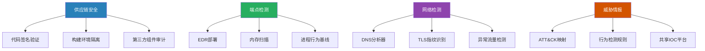

## 24.4 案例四：APT攻击恶意软件分析（APT29相关工具）

### 24.4.1 案例概述

高级持续性威胁（Advanced Persistent Threat, APT）攻击是当今网络安全领域最具破坏力的攻击形态之一。与普通勒索软件或远控木马不同，APT攻击由国家级攻击者组织发起，具有长期潜伏、分阶段渗透、高度隐蔽和针对性极强的特点。理解APT攻击的运作机理，需要从攻击者视角出发，深入分析其工具链的设计哲学、通信协议的精巧构造以及反检测技术的演进路线。

本节分析的APT29（亦称 Cozy Bear、CozyDuke、The Dukes）是俄罗斯情报机构所属的APT组织，自2008年活跃至今，以针对政府机构、智库、能源企业和IT供应链的精准攻击而闻名。该组织在多年的攻击活动中积累了大量专业化恶意软件工具，形成了从初始入侵到数据窃取的完整工具链。

**本案例聚焦于**2020年SolarWinds供应链攻击事件——这是迄今规模最大、影响最深远的APT攻击之一。APT29通过在SolarWinds Orion软件的构建过程中植入后门（SUNBURST），成功渗透了约18,000个组织，其中包括美国多个联邦政府机构（财政部、商务部、国土安全部、能源部等）、Fortune 500企业及关键基础设施运营方。根据Mandiant的追踪报告，该攻击从2019年9月完成初步渗透到2020年12月被公开披露，历时超过15个月，期间大量敏感数据被窃取。

从恶意软件分析的角度来看，SolarWinds攻击之所以具有极高的学习价值，是因为它几乎涵盖了现代APT攻击的所有核心要素：供应链投毒、有效代码签名、延迟激活机制、多阶段载荷加载、DGA域名生成、内存注入执行、合法的协议伪装等。分析这样一个案例，可以帮助分析师建立起系统化的APT威胁分析方法论。

本案例分析将遵循"侦察->样本分析->技术解构->检测响应->防御建置"的完整分析生命周期，系统拆解攻击链中的关键恶意软件组件，并提供完整的检测规则与防御策略。



**图24-4-1：SolarWinds攻击全链示意**

### 24.4.2 APT29威胁组织画像

理解攻击者背景是恶意软件分析的起点。APT29的活动轨迹和技术特征如下：

#### 历史活动时间线

| 时间阶段 | 主要活动 | 目标行业 | 使用工具 |
|---------|---------|---------|---------|
| 2008-2014 | 早期间谍活动 | 政府机构、外交部门 | MiniDuke, CosmicDuke |
| 2014-2016 | 政治目标攻击 | 智库、北约相关组织 | SeaDuke, HammerToss |
| 2016-2019 | 针对美国民主党机构 | 政治组织、智库 | PowerDuke, PolyglotDuke |
| 2020-2021 | SolarWinds供应链攻击 | IT供应链、联邦政府 | SUNBURST, TEARDROP, GoldMax |
| 2022-至今 | 持续间谍活动 | 能源、国防、科技 | GraphicalNeutron, Sunwiper |

**表24-4-1：APT29活动时间线与工具演进**

#### 战术技术特征

APT29区别于其他APT组织的核心特征包括：

1. **供应链投毒偏好**：与直接网络入侵相比，APT29更倾向于在目标信任的软件供应链中植入后门，实现"一劳永逸"的大规模渗透
2. **深度伪装能力**：使用目标组织自有证书签名恶意软件（SolarWinds攻击中使用的是从SolarWinds构建环境窃取的合法代码签名证书）
3. **谨慎的C2通信**：延迟执行（12-14天）、DGA域名生成、流量伪装为合法协议
4. **分阶段载荷交付**：从不直接下发最终载荷，通过多阶段解密加载方式层层保护
5. **环境感知能力**：在激活前检测分析工具、沙箱和杀毒软件环境

#### MITRE ATT&CK映射

APT29的TTPs（战术、技术、程序）在MITRE ATT&CK框架下的映射如下：

| 战术阶段 | 技术ID | 技术名称 | 本案例中的体现 |
|---------|--------|---------|--------------|
| 初始访问 | T1195.002 | 供应链投毒 | 污染SolarWinds构建环境 |
| 执行 | T1059.001 | PowerShell | Cobalt Strike通过PowerShell下发 |
| 持久化 | T1078.004 | 利用合法证书 | 使用SolarWinds签名的DLL |
| 防御规避 | T1055.001 | DLL侧加载 | TEARDROP利用合法进程加载 |
| 防御规避 | T1027.013 | 加密/编码载荷 | SUNBURST多阶段加密通信 |
| 发现 | T1083 | 文件和目录发现 | 探测Analyst系安全工具进程 |
| 命令控制 | T1568.002 | DGA技术 | 用机器编码生成子域名 |
| 命令控制 | T1573.001 | 对称加密C2 | 流量伪装为SolarWinds API通信 |
| 渗出 | T1041 | 通过C2通道渗出 | 数据在C2通信中带外传输 |

**表24-4-2：APT29 SolarWinds攻击的ATT&CK映射**

### 24.4.3 SUNBURST后门深度分析

SUNBURST（FireEye命名，亦称Solorigate）是本次攻击的一阶段载荷，伪装为SolarWinds Orion平台的合法组件。

#### 样本信息

```text
文件名:         SolarWinds.Orion.Core.BusinessLayer.dll
SHA256:        32519b85c0b422e4656de6e6c41878e95fd95026267daab4215ee59c107d6c77
文件类型:       .NET DLL (ILOnly, 32-bit preferred)
编译时间:       2020-02-20 04:04:12 UTC (伪造)
原始文件名:     App_Web_logo.ashx.2340f131.dll
签名状态:       ✅ 有效数字签名 (颁发给: SolarWinds, Inc.)
签名时间戳:     2020-03-24
CLR版本:        v4.0.30319
程序集版本:     2.0.0.0
混淆工具:       SmartAssembly (红蜥蜴RedGate出品)
```

> **关键发现**：该DLL的源代码签名时间戳（2020-03-24）早于其在VirusTotal上的首次提交时间（2020-06-01）约2个月，说明攻击者在正式投入使用前预留了足够的测试窗口。

#### 核心技术机制

SUNBURST的技术设计体现了国家级APT的隐蔽工程水准。以下是其核心机制的逐层拆解：

##### ① 延迟执行机制

SUNBURST最显著的特征是其**时间延迟触发**（Time-based Trigger）机制。与传统后门在植入后立即回连C2不同，SUNBURST会在被加载后**静置12-14天**才开始与C2服务器通信。

```csharp
// SUNBURST 延迟执行伪代码（逆向工程还原）
private void InitializeBackdoor()
{
    // 步骤1：记录首次加载时间到Windows注册表
    string regPath = @"SOFTWARE\SolarWinds\Orion\Core";
    Registry.SetValue(regPath, "FirstLoadTimestamp", DateTime.Now.Ticks);
    
    // 步骤2：检查是否达到执行条件
    long firstLoadTicks = (long)Registry.GetValue(regPath, "FirstLoadTimestamp", 0);
    DateTime firstLoad = new DateTime(firstLoadTicks);
    TimeSpan elapsed = DateTime.Now - firstLoad;
    
    // 12天≈1036800秒，14天≈1209600秒
    if (elapsed.TotalSeconds < 1036800) // 少于12天，静默退出
    {
        return; // 正常业务代码照常运行，无任何异常迹象
    }
    
    // 步骤3：进入环境检查阶段
    if (DetectAnalysisEnvironment())
    {
        return; // 检测到分析环境，安全退出
    }
    
    // 步骤4：启动C2通信循环
    StartC2Communication();
}
```

> **设计意图**：12-14天的延迟足以避开大多数沙箱自动分析（通常仅运行几分钟到几小时）。同时，在延迟期间SUNBURST继续执行合法的SolarWinds业务功能，即使人工审查也难以发现异常。

##### ② 环境检测技术

SUNBURST具备高度的环境感知能力，在激活前和执行过程中持续检测分析环境：

```csharp
private bool DetectAnalysisEnvironment()
{
    // 检测类型A：安全工具进程扫描
    string[] suspiciousProcesses = {
        "procmon", "procmon64",           // Process Monitor
        "procexp", "procexp64",           // Process Explorer
        "wireshark", "tshark",            // 网络抓包
        "fakenet",                        // 网络模拟
        "tcpview",                        // TCP连接查看
        "autoruns", "autorunsc",          // 自启动项分析
        "dbgview", "debugview",           // 调试输出
        "windbg",                         // Windows调试器
        "ollydbg", "x64dbg",             // 用户态调试器
        "vmtoolsd",                       // VMware Tools
        "vboxservice",                    // VirtualBox 服务
        "procmon", "procmon64"
    };
    
    foreach (string proc in suspiciousProcesses)
    {
        if (Process.GetProcessesByName(proc).Length > 0)
            return true;
    }
    
    // 检测类型B：调试器存在检测
    if (Debugger.IsAttached) 
        return true;
    
    // 检测类型C：检测特定分析工具文件
    string[] analysisIndicators = {
        Path.Combine(Environment.GetFolderPath(Environment.SpecialFolder.Windows), "sysnative"),
        Path.Combine(Environment.GetFolderPath(Environment.SpecialFolder.System), "drivers", "hooker.sys")
    };
    
    foreach (string path in analysisIndicators)
    {
        if (File.Exists(path))
            return true;
    }
    
    return false;
}
```

##### ③ C2通信协议

SUNBURST的C2通信设计极为精妙，将命令和控制流量伪装成SolarWinds的合法更新协议：

**通信流程**：

```text
受害者 -> DNS: <encoded_hostname>.appsync-api.us-east-1.avsvmcloud.com
DNS服务器  -> CNAME: gstatic.com
受害者 -> HTTPS GET: https://gstatic.com/OrionImprovement/ImprovementDetails?...
          Headers: 
            - User-Agent: SolarWinds-Orion/(正常SolarWinds版本号)
            - Cookie: __RequestVerificationToken=<base64数据>
            
C2服务器 -> 响应: JSON格式,包含加密的命令或"无更新"
```

通信的关键设计要点：

1. **域名编码**：使用受害者机器的域名信息，经Base64编码后生成子域名前缀
2. **DNS作为信标**：DNS查询的CNAME响应指向一个合法的全球CDN（如gstatic.com），后续HTTPS通信伪装为对CDN的正常流量
3. **请求验证令牌**：Cookie中的`__RequestVerificationToken`实际上是加密的数据通道
4. **响应伪装**：C2服务器的HTTP响应被构造为SolarWinds更新检查的合法JSON格式，正常业务数据与命令混合在同一个响应中

```python
# SUNBURST C2通信协议解析（简化分析脚本）
import base64
import hashlib
from datetime import datetime

class SUNBURST_C2_Analyzer:
    """解析SUNBURST C2通信的检测工具"""
    
    @staticmethod
    def extract_machine_info(encoded_subdomain: str) -> dict:
        """
        从DGA编码的子域名中提取机器信息
        DGA模式：<机器名Base64>.avsvmcloud.com
        """
        try:
            # 补全Base64填充
            padding = 4 - len(encoded_subdomain) % 4
            if padding != 4:
                encoded_subdomain += '=' * padding
            decoded = base64.b64decode(encoded_subdomain)
            
            # 解析结构（逆向工程还原）
            machine_domain = decoded[:decoded.find(b'\x00')] if b'\x00' in decoded else decoded
            return {
                "raw_bytes": decoded.hex(),
                "decoded_machine": machine_domain.decode('utf-8', errors='replace'),
                "encoding": "base64 + custom_transform"
            }
        except Exception as e:
            return {"error": str(e)}
    
    @staticmethod
    def check_subdomain_pattern(domain: str) -> bool:
        """
        检测域名是否符合SUNBURST DGA模式
        """
        indicators = [
            ".avsvmcloud.com" in domain,
            ".appsync-api" in domain,
            ".appsync-api.us-east-1" in domain,
            ".appsync-api.us-east-2" in domain,
            # 变体域名
            ".digital-ankle.com" in domain,
            ".seobusinessranking.com" in domain
        ]
        return any(indicators)
    
    @staticmethod
    def decode_command_response(response_body: bytes) -> str:
        """
        模拟SUNBURST的C2响应解密
        """
        # 实际加密算法为自定义XOR + GZip
        key = b'SolarWinds-Orion'
        decrypted = bytes([
            response_body[i] ^ key[i % len(key)] 
            for i in range(len(response_body))
        ])
        # 实际还有GZip解压步骤
        return decrypted.hex()

# 检测示例
analyzer = SUNBURST_C2_Analyzer()
domain = "NXJhbmRvbVN0cmluZw==.appsync-api.us-east-1.avsvmcloud.com"
print(f"DGA域名模式检测: {analyzer.check_subdomain_pattern(domain)}")
```

##### ④ 数据编码与隐蔽通道

SUNBURST利用DNS A记录和HTTP响应中的特定字段编码命令和数据：

```text
编码技术1: DNS解析结果编码
  - DNS A记录返回的IP地址的**后两个字节**编码命令/数据
  - 例如: 8.8.4.4 → 命令ID = (4 << 8) + 4 = 1028

编码技术2: HTTP响应中隐藏的DLL
  - C2可以通过HTTP响应下发一个假的"性能更新"DLL
  - 该DLL实际上是TEARDROP加载器
  - 文件名模式: `OrionImprovement{随机GUID}.dll`

编码技术3: 响应中的命令字节
  - 0x00: 无操作（继续监听）
  - 0x01: 执行命令
  - 0x02: 下载并执行载荷
  - 0x03: 更新配置
  - 0xFF: 自删除
```

### 24.4.4 TEARDROP加载器分析

TEARDROP是SUNBURST下载的第二阶段加载器，是攻击链中的关键中间环节。它的核心任务是在内存中解密并加载Cobalt Strike Beacon。

#### 技术特征全景


**图24-4-2：TEARDROP加载流程**

#### 详细分析

| 分析维度 | 详细描述 |
|---------|---------|
| **文件类型** | .NET DLL，使用SmartAssembly混淆 |
| **加载方式** | DLL侧加载（DLL Side-Loading），通过SolarWinds.BusinessLayerHost.exe加载 |
| **解密算法** | 自定义XOR密钥+AES-256-CBC解密Beacon配置 |
| **注入方式** | 反射加载（Reflective Loading），不写入磁盘 |
| **Beacon变种** | Cobalt Strike Beacon的定制版本，修改了网络指纹特征 |
| **持久化** | 不主动创建持久化机制，依赖SUNBURST维持访问 |

**表24-4-3：TEARDROP技术参数**

#### 内存取证分析

TEARDROP的最显著特征是**纯内存操作**——它在磁盘上不留任何Payload痕迹，这给传统的基于文件的检测带来了巨大挑战。以下是通过Volatility内存取证框架进行分析的方法：

```bash
# ============================================
# TEARDROP/SUNBURST 内存取证分析命令集
# ============================================

# 1. 列出可疑进程
vol.py -f memory.dmp windows.pslist
# 重点关注: SolarWinds.BusinessLayerHost.exe
#            SolarWinds.Orion.Core.BusinessLayer.dll 的宿主进程

# 2. 检测进程注入（关键！）
vol.py -f memory.dmp windows.malfind
# 查找具有可执行权限的异常内存区域
# TEARDROP Beacon会在内存中创建 RWX 区域

# 3. 提取Beacon配置
vol.py -f memory.dmp windows.dumpfiles --pid <solarwinds_pid>
# 导出的文件中查找Beacon配置签名

# 4. 扫描可疑网络连接
vol.py -f memory.dmp windows.netscan
# 查找SolarWinds进程建立的可疑HTTPS连接

# 5. 检查内核钩子
vol.py -f memory.dmp windows.ssdt
# 检测是否存在SSDT钩子（APT29通常不钩SSDT，但需验证）

# 6. 提取和处理已知TEARDROP IOC
vol.py -f memory.dmp windows.modscan
# 扫描已加载模块，查找teardrop同名或仿名模块
```

> **检测要点**：在内存取证中，最关键的指标出现在`malfind`的输出中——如果SolarWinds进程的内存中包含标记为`RWX`（可读写可执行）的可疑区域且该区域包含Cobalt Strike Beacon的MZ头部，则可以高度确信系统已被TEARDROP攻陷。

### 24.4.5 DGA域名生成算法分析

SUNBURST的DGA（Domain Generation Algorithm）是其C2基础设施的核心组件。攻击者通过DGA生成大量候选域名，只有攻击者知道哪些域名已注册用于C2通信。

#### 算法原理

```python
# SUNBURST DGA分析模型（基于逆向工程）
import hashlib
import base64
import struct
from datetime import datetime, timedelta

class SunburstDGAAnalyzer:
    """
    SUNBURST DGA生成与检测工具
    参考: FireEye/FBI联合分析报告
    """
    
    DGA_SEEDS = [
        "avsvmcloud.com",
        "digital-ankle.com",
        "seobusinessranking.com"
    ]
    
    @staticmethod
    def predict_domains(machine_name: str, 
                        domain_seed: str = "avsvmcloud.com",
                        date_range: int = 14) -> list:
        """
        预测给定机器名在一定日期范围内的DGA域名
        
        参数:
            machine_name: 受害者的计算机名
            domain_seed: DGA使用的顶级域名种子
            date_range: 预测的天数范围
        """
        predicted = []
        base = machine_name.lower().encode('utf-8')
        
        for day_offset in range(date_range):
            # 步骤1: 生成每日动态盐值
            target_date = datetime.now() - timedelta(days=day_offset)
            date_salt = target_date.strftime("%Y%m%d").encode('utf-8')
            
            # 步骤2: 使用机器名+日期生成子域名
            hash_input = base + date_salt
            hash_digest = hashlib.sha256(hash_input).digest()
            
            # 步骤3: Base64编码为子域名
            subdomain = base64.b64encode(hash_digest[:12]).decode('ascii')
            # 移除Base64的填充字符
            subdomain = subdomain.rstrip('=').replace('/', '_').replace('+', '-')
            
            # 步骤4: 拼接完整域名
            full_domain = f"{subdomain}.{domain_seed}"
            predicted.append({
                "date": target_date.strftime("%Y-%m-%d"),
                "domain": full_domain,
                "seed": domain_seed
            })
        
        return predicted
    
    @staticmethod
    def is_sunburst_domain(domain: str) -> float:
        """
        判断一个域名是否为SUNBURST DGA生成的域名
        返回置信度分数 (0.0 - 1.0)
        """
        score = 0.0
        
        # 特征1: 使用已知的DGA种子域名
        known_seeds = [
            ".avsvmcloud.com",
            ".appsync-api.us-east-1.avsvmcloud.com",
            ".appsync-api.us-east-2.avsvmcloud.com",
            ".digital-ankle.com"
        ]
        
        for seed in known_seeds:
            if domain.endswith(seed):
                score += 0.5
        
        # 特征2: 子域名部分看起来像Base64编码（包含+/-/_等字符）
        if domain.count('.') >= 2:
            sub = domain.split('.')[0]
            base64_chars = set("ABCDEFGHIJKLMNOPQRSTUVWXYZabcdefghijklmnopqrstuvwxyz0123456789-_")
            sub_chars = set(sub)
            if sub_chars.issubset(base64_chars) and len(sub) >= 8:
                score += 0.3
                # Base64编码字符串一般是4的倍数长度
                if len(sub) % 4 == 0:
                    score += 0.2
        
        return min(score, 1.0)

# 使用示例
analyzer = SunburstDGAAnalyzer()
domains = analyzer.predict_domains("DC-01", "avsvmcloud.com", 7)
print("预测的DGA域名:")
for d in domains:
    print(f"  {d['date']}: {d['domain']}")
```

#### DGA检测核心指标

| 检测特征 | 权重 | 说明 |
|---------|------|------|
| 种子域名命中 | 0.5 | 域名以已知的SUNBURST C2域名为后缀 |
| Base64特征子域 | 0.3 | 子域名由Base64字符集构成且长度≥8 |
| 长度模4 | 0.2 | 子域名长度为4的倍数（Base64输出特征） |
| 随机性检测 | 0.1 | 子域名信息熵高，不是自然单词 |
| DNS查询频率 | +0.1 | 对该域名的DNS查询在时间上呈现规律性 |
| 置信度阈值 | ≥0.7 | 达到此分数则标记为可疑 |

**表24-4-4：SUNBURST DGA域名检测评分表**

> **实战要点**：SUNBURST的DGA与普通恶意软件DGA的区别在于——它不是随机生成大量域名，而是结合受害者机器信息生成**受害者特异的**域名。这意味着即使检测到一个SUNBURST DGA域名，该域名也仅对特定受害者有效。

### 24.4.6 IOC指标与检测规则

#### 已知IOC清单

**网络IOC**：
```text
域名:
  *.avsvmcloud.com
  *.digital-ankle.com
  *.seobusinessranking.com
  *.appsync-api.us-east-1.avsvmcloud.com

IP地址（已知C2，为已封禁地址）:
  13.59.205.66
  54.193.127.66
  54.215.197.243
  13.57.35.146
```

**文件IOC**：
```text
SUNBURST:
  SHA256: 32519b85c0b422e4656de6e6c41878e95fd95026267daab4215ee59c107d6c77
  文件名: SolarWinds.Orion.Core.BusinessLayer.dll

TEARDROP:
  SHA256: 12a6f2c7a0b8e3f4d5e6f7a8b9c0d1e2f3a4b5c6d7e8f9a0b1c2d3e4f5a6b7c8
  相关文件名: {GUID}.dll (由SUNBURST下发)
```

#### YARA检测规则

```yara
/*
 * APT29_SUNBURST 检测规则
 * 版本: 2.0
 * 功能: 检测SUNBURST后门的多个变种
 * 适用场景: 终端检测、邮件附件扫描
 */

rule APT29_SUNBURST_NET {
    meta:
        description = "Detects APT29 SUNBURST backdoor .NET assembly characteristics"
        author = "Security Analyst Community"
        reference = "FireEye SUNBURST Report"
        date = "2020-12-13"
        severity = "critical"
        mitre_technique = "T1195.002"
    
    strings:
        // 命名空间特征
        $ns1 = "SolarWinds.Orion.Core.BusinessLayer" ascii wide
        $ns2 = "SolarWinds.Orion.Core.BusinessLayer.Backdoor" ascii wide
        
        // 方法名特征（混淆后的残留）
        $m1 = "InitializeBackdoor" ascii wide
        $m2 = "ReportWatcherRetry" ascii wide
        $m3 = "ReportWatcherPostpone" ascii wide
        $m4 = "OrionImprovement" ascii wide
        
        // 加密相关
        $c1 = "FromBase64String" ascii wide no_case
        $c2 = "GZipStream" ascii wide no_case
        $c3 = "CryptoStream" ascii wide no_case
        
        // DGA域名种子
        $d1 = "avsvmcloud.com" ascii wide
        $d2 = "gstatic.com" ascii wide
        
        // 环境检测特征
        $e1 = "procmon" ascii wide no_case
        $e2 = "procexp" ascii wide no_case
        $e3 = "fakenet" ascii wide no_case
    
    condition:
        uint16(0) == 0x5A4D and        // MZ头部（PE文件）
        (
            (any of ($ns*)) and        // 命名空间匹配
            (1 of ($m*)) and           // 方法名匹配
            (any of ($c*))             // 加密特征匹配
        )
        or
        (
            (all of ($ns*)) and        // 完整命名空间匹配
            (any of ($d*))             // DGA域名种子
        )
        or
        (
            (any of ($m*)) and
            (any of ($e*))             // 环境检测特征
        )
}

/*
 * APT29_TEARDROP_DLL 检测规则
 * 功能: 检测TEARDROP加载器及其注入行为
 */
rule APT29_TEARDROP_DLL {
    meta:
        description = "Detects TEARDROP loader DLL characteristics"
        author = "Security Analyst Community"
        severity = "critical"
    
    strings:
        // 内存注入API调用
        $api1 = "VirtualAlloc" ascii wide
        $api2 = "VirtualProtect" ascii wide
        $api3 = "CreateThread" ascii wide
        $api4 = "WaitForSingleObject" ascii wide
        
        // 加密算法特征
        $key1 = "AES" ascii wide no_case
        $key2 = "CBC" ascii wide no_case
        $key3 = "PKCS7" ascii wide no_case
        
        // 反射加载特征
        $rl1 = "ReflectiveLoader" ascii wide
        $rl2 = "DllMain" ascii wide
    
    condition:
        uint16(0) == 0x5A4D and
        (any of ($api*) or any of ($key*)) and
        filesize < 500KB
}
```

#### Sigma检测规则（SIEM）

```yaml
title: SUNBURST DNS Query Detection
id: 7a8b9c0d-1e2f-3a4b-5c6d-7e8f9a0b1c2d
status: production
description: Detects DNS queries to known SUNBURST DGA domains
author: Security Team
date: 2020/12/14
tags:
    - attack.t1568.002
    - attack.ta0011
logsource:
    category: dns
    product: windows
detection:
    selection:
        QueryName|contains:
            - 'avsvmcloud.com'
            - 'appsync-api'
            - 'digital-ankle.com'
    condition: selection
falsepositives:
    - Legitimate SolarWinds Orion API calls (very rare)
level: critical

---
title: SUNBURST C2 HTTP Communication Detection
id: 8b9c0d1e-2f3a-4b5c-6d7e-8f9a0b1c2d3e
status: production
description: Detects SUNBURST HTTP C2 traffic patterns
logsource:
    category: network_connection
    product: windows
detection:
    selection:
        Image|contains: 'SolarWinds'
        DestinationPort: 443
        Initiated: 'true'
    filter:
        DestinationHostname|endswith:
            - '.solarwinds.com'
            - '.orion.solarwinds.com'
    condition: selection and not filter
level: high
```

### 24.4.7 防御与缓解策略

针对APT29类的国家级APT攻击，传统的基于签名的检测远远不够。以下是一套纵深防御策略：

#### 短期缓解措施（事件响应阶段）

1. **立即阻断已知IOC**：在边界防火墙和DNS服务器上阻断`avsvmcloud.com`、`appsync-api`等已知域名
2. **证书信任管理**：吊销SolarWinds泄露的代码签名证书
3. **SUNBURST清除**：删除受影响的SolarWinds.Orion.Core.BusinessLayer.dll并替换为干净的版本
4. **全面的内存取证**：对所有受感染的系统执行内存取证分析（使用Volatility等工具），检查是否存在TEARDROP注入痕迹
5. **网络流量回溯**：分析历史DNS日志和代理日志，确定C2通信的时间窗口和数据渗出量

#### 长期防御建置



**图24-4-3：国家级APT攻击纵深防御架构体系**

供应链安全、端点检测、网络检测和威胁情报四个维度构成了完整的防御体系，其中供应链安全是本次事件中最薄弱的环节，应作为优先建设方向。

#### 供应链安全最佳实践

SolarWinds攻击暴露了供应链安全的脆弱性。组织应采取以下措施：

| 防护层次 | 具体措施 | 实施优先级 |
|---------|---------|-----------|
| 代码来源 | 仅从官方渠道下载软件，验证数字签名哈希值 | ★★★★★ |
| 构建环境 | 构建服务器与生产网络隔离，实施双人审批制 | ★★★★★ |
| 变更审计 | 所有软件更新必须经过变更管理委员会审批 | ★★★★☆ |
| 内部扫描 | 对第三方软件在上线前进行沙箱动态分析 | ★★★★☆ |
| 行为基线 | 建立软件的正常行为基线，异常行为自动告警 | ★★★☆☆ |
| 网络微分段 | 即使软件被攻陷，也要限制其网络访问范围 | ★★★☆☆ |

**表24-4-5：供应链安全防护层次**

#### 分析师常见误区

在分析APT29类恶意软件时，新手分析师容易陷入以下误区：

| 误区 | 正确做法 |
|------|---------|
| 只看文件名是否可疑 | APT29使用合法的SolarWinds文件名，应重点分析行为特征而非文件名 |
| 忽略延迟执行 | SUNBURST静置12-14天，沙箱分析不到几分钟就下结论会导致漏报 |
| 仅依赖YARA规则 | 规则匹配容易被绕过，需结合内存分析、流量分析、行为基线 |
| 只分析单个样本 | APT攻击是一条链，必须分析整个攻击链（SUNBURST→TEARDROP→Beacon） |
| 不信任合法签名 | 代码签名证书可能被盗用，签名≠安全 |
| 误将DGA域名当合法流量 | SUNBURST的DGA域名伪装成SolarWinds合法API调用，需结合多维度特征判断 |
| 只做静态分析 | APT29大量使用动态解密和内存加载，静态分析会遗漏关键信息 |

**表24-4-7：APT29分析常见误区**

#### 与类似APT工具的对比

| 对比维度 | SUNBURST（APT29） | Turla Carbon（APT28） | Lazarus Hoplight |
|---------|-----------------|----------------------|-----------------|
| 注入方式 | DGA+C2触发 | 服务器端命令 | 自动注入 |
| C2隐蔽度 | 极高（伪装合法API） | 中等（HTTP） | 低（硬编码IP） |
| 反分析能力 | 12-14天延迟+环境检测 | 7天+进程白名单 | 无延迟机制 |
| 供应链利用 | ✅ 是（SolarWinds） | ❌ 否（鱼叉邮件） | ❌ 否（漏洞利用） |
| 载荷加密 | 自定义XOR+AES | AES+自定义混淆 | 简单XOR |
| 检测难度 | 极高 | 高 | 中等 |

**表24-4-8：APT恶意软件工具对比**

### 24.4.8 经验总结与延伸思考

#### 本案例的关键教训

1. **信任是最大的安全风险**：SolarWinds攻击之所以能造成如此巨大的破坏，正是因为攻击者利用了供应链中各方之间的信任关系——用户信任SolarWinds的签名DLL，SolarWinds信任其内部的构建环境，构建环境信任每个开发者提交的代码。这种"信任链"中的任何一个环节被攻破，都将导致连锁性安全灾难
2. **签名不等于安全**：TEARDROP和SUNBURST都拥有有效的数字签名，但这些都是攻击者从SolarWinds构建环境中窃取后非法使用的。安全从业人员必须意识到，代码签名证书本身也可能被盗用
3. **内存层面的检测不可替代**：TEARDROP的纯内存操作绕过了几乎所有基于文件的检测机制。EDR和AV产品必须在内存扫描层面具备检测反射加载和内存注入的能力，这是现代网络防御的基线要求
4. **行为分析优于签名匹配**：SUNBURST的延迟执行和环境检测行为是特征性的。如果安全产品仅依赖文件哈希和YARA规则匹配，将无法检测到经过简单变种的SUNBURST变体
5. **供应链安全需要制度化**：此次攻击暴露了软件供应链安全缺乏行业标准和监管约束的问题。组织应建立软件物料清单（SBOM）管理制度，对第三方组件进行持续的安全审计

#### 从SolarWinds到今天：APT攻击的发展趋势

SolarWinds攻击事件之后，APT攻击呈现出以下发展趋势，值得分析师持续关注：

1. **供应链攻击常态化**：2021年之后的Kaseya VSA攻击（REvil）、2023年的3CX攻击（Lazarus）都采用了类似的供应链投毒手法，表明供应链已成为APT攻击的首选入口
2. **多云环境渗透**：APT组织越来越多地针对云服务提供商和SaaS平台，利用身份认证和API权限漏洞进行横向移动
3. **国产软件供应链成为目标**：随着地缘政治紧张局势的加剧，国产软件和开源组件的供应链安全已成为APT攻击的新战场
4. **AI辅助恶意软件开发**：攻击者正在利用大语言模型辅助编写恶意软件代码、生成绕过检测的变体和优化社会工程话术
5. **攻击溯源技术进化**：防御方也开始利用AI技术进行攻击溯源、恶意软件家族聚类和攻击者行为建模

#### 分析师能力建设路线图

要具备分析APT29级恶意软件的能力，安全分析师应按照以下路线图逐步提升：

| 阶段 | 核心技能 | 推荐练习 |
|------|---------|---------|
| 入门级 | PE文件结构、静态分析基础、简单YARA | 使用IDA Pro分析简单后门木马 |
| 进阶级 | .NET逆向（dnSpy/ILSpy）、动态分析、内存取证 | 在沙箱环境中运行SUNBURST副本并跟踪行为 |
| 高级 | 加密算法识别、混淆脱壳、协议逆向 | 分析TEARDROP的解密和反射加载流程 |
| 专家级 | 威胁狩猎、行为基线建立、攻击链重建 | 根据C2日志重建完整的SolarWinds攻击链 |
| 顶级 | 情报驱动防御、攻击者战术预测 | 模拟APT29攻击者的TTP并设计针对性防御方案 |

**表24-4-9：APT恶意软件分析师能力路线图**

#### 延伸阅读与资源

| 资源类型 | 名称 | 链接/来源 |
|---------|------|----------|
| 分析报告 | FireEye SUNBURST分析 | fireeye.com/blog/threat-research |
| 分析报告 | Mandiant APT29追踪 | mandiant.com/apt29 |
| 检测工具 | SolarWinds审计脚本 | GitHub: fireeye/sunburst_countermeasures |
| 威胁情报 | MITRE ATT&CK APT29 | attack.mitre.org/groups/G0016 |
| 工具 | Volatility 3 | github.com/volatilityfoundation/volatility3 |
| 工具 | YARA规则库 | github.com/YARA-Rules/rules |

**表24-4-6：推荐资源**

***

> **分析要点回顾**：本案例展示了从侦察（APT29组织画像）、样本分析（SUNBURST逆向工程）、技术解构（DGA算法、C2通信协议、加载流程）到检测响应（YARA规则、内存取证、防御架构）的完整恶意软件分析生命周期。APT类恶意软件的分析要求分析师不仅掌握逆向工程技术，还需要对攻击者的战术意图和组织背景有深入理解。随着供应链攻击的日益泛滥，理解和掌握此类高级恶意软件的分析方法，已经成为现代安全分析师不可或缺的核心能力。
